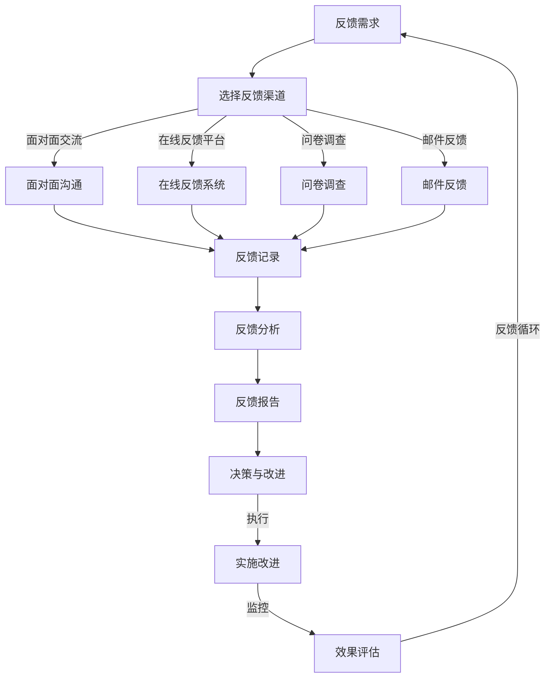

                 

### 文章标题

# 建立反馈文化：促进持续改进和学习

### 关键词

- 反馈文化
- 持续改进
- 学习
- 机制设计
- 实践案例
- 持续优化

### 摘要

本文旨在探讨如何建立一种有效的反馈文化，以推动组织和个人在技术领域的持续改进和学习。我们将从反馈文化的重要性、反馈机制的设计与实践、反馈与持续改进的关系、以及反馈文化的建立与推广等多个方面展开论述。通过理论讲解、伪代码展示、数学模型分析和实际案例剖析，本文将帮助读者理解如何构建一个积极、开放和高效的反馈文化，从而实现技术能力的不断提升。

## 引言

在现代信息技术快速发展的背景下，组织和个人在面对复杂多变的技术环境时，如何保持竞争力、实现持续改进和学习，成为了一个关键问题。传统的管理理念和方法已经难以满足这种动态变化的需求，而一种新的文化理念——反馈文化，逐渐引起了广泛关注。

### 反馈文化的定义

反馈文化是一种以开放、透明和持续反馈为核心的管理理念，强调通过不断地获取、分析和利用反馈信息，来指导决策、优化流程、提升绩效。这种文化不仅仅局限于技术领域，还涵盖了组织内部各个层面，如沟通、合作、学习和创新等。

### 反馈文化的核心要素

1. **开放性**：反馈文化的核心在于开放性，即鼓励成员分享意见、建议和反馈，并确保这些信息能够被及时地传递和利用。
2. **透明性**：透明性是反馈文化的另一重要特征，意味着组织的运作过程、决策过程和结果对全体成员都是可见的。
3. **持续性**：反馈文化强调持续性的反馈循环，不仅仅是一次性的反馈，而是贯穿于整个工作流程和生命周期。

### 反馈文化与传统管理文化的对比

传统管理文化往往以权威和控制为核心，强调层级管理和标准化流程。而反馈文化则更加注重协作、共享和自我驱动，更能够适应快速变化的环境。

## 反馈文化的重要性

### 对个人的影响

1. **提升技能水平**：通过持续接收反馈，个人可以不断地发现自身的不足，从而有针对性地进行学习和改进。
2. **增强自信心**：积极的反馈能够增强个人的自信心和成就感，使其更加坚定地投入到学习和工作中。

### 对组织的影响

1. **提升整体绩效**：反馈文化能够促进组织内部的协作和沟通，提高团队的整体绩效。
2. **增强创新能力**：通过开放的反馈，组织能够更好地吸收外部意见，激发创新思维，推动技术进步。

### 对技术领域的影响

1. **优化技术架构**：通过反馈，可以及时识别和解决技术架构中的问题，提高系统的稳定性和可维护性。
2. **促进技术更新**：持续性的反馈能够帮助组织快速响应技术变革，保持技术领先地位。

## 反馈机制的设计与实践

### 反馈机制原理

1. **反馈类型**：根据反馈的目的和性质，可以将反馈分为正面反馈、负面反馈和中性反馈。
2. **反馈渠道**：建立多种反馈渠道，如面对面交流、在线反馈平台、问卷调查等，以确保反馈信息的全面性和及时性。
3. **反馈频率**：反馈应该是一个持续的过程，而不是一次性的事件。适当的反馈频率有助于保持对问题的关注和解决。

### 反馈机制实施步骤

1. **确定反馈目标**：明确反馈的目的和期望结果，以便有针对性地进行反馈。
2. **收集反馈信息**：通过多种渠道收集反馈信息，包括内部员工、外部用户和第三方评估。
3. **分析反馈数据**：对收集到的反馈信息进行整理和分析，识别问题和机会。
4. **制定改进计划**：基于分析结果，制定具体的改进计划和行动方案。
5. **执行与跟踪**：实施改进计划，并定期跟踪反馈效果，确保改进措施的有效性。

### 反馈机制的有效性评估

1. **反馈覆盖率**：评估反馈机制是否覆盖了所有相关利益相关者，确保反馈信息的全面性。
2. **反馈响应时间**：评估反馈机制的响应速度，确保反馈信息能够及时传递和利用。
3. **反馈改进效果**：通过对比改进前后的绩效数据，评估反馈机制的实际效果。

### 反馈机制的常见问题与解决方法

1. **反馈质量不高**：解决方法：建立明确的反馈标准和流程，鼓励具体、详细的反馈。
2. **反馈渠道不畅**：解决方法：优化反馈渠道，确保信息的透明和可追溯性。
3. **反馈滞后**：解决方法：提高反馈频率，采用实时反馈工具，减少信息传递延迟。

## 反馈实践案例

### 案例一：企业内部反馈系统

1. **背景**：某大型科技公司为了提升员工的工作效率和满意度，决定建立一套内部反馈系统。
2. **反馈系统设计**：系统包括反馈平台、反馈问卷、反馈分析工具等组成部分，员工可以通过平台提交反馈，管理者可以实时查看和分析反馈数据。
3. **实施效果**：通过内部反馈系统，公司能够快速识别和解决员工在工作中遇到的问题，提高了员工的满意度和工作效率。

### 案例二：教育领域的反馈实践

1. **背景**：某高校为了提升教学质量，决定引入学生反馈机制。
2. **反馈实践**：学生可以在课程结束后填写反馈问卷，评价教师的教学质量。学校根据反馈结果，对教师进行评估和培训。
3. **反馈效果**：通过学生反馈，学校能够及时发现和改进教学中的问题，提高了教学质量，增强了学生的学习体验。

## 持续改进与学习

### 持续改进的概念

持续改进是一种不断寻求和实现改进的过程，旨在提高组织的绩效和满足用户需求。它强调通过不断的学习、反馈和优化，实现长期的持续发展。

### 持续改进的步骤

1. **确立改进目标**：明确改进的领域和目标，确保改进措施具有针对性。
2. **分析现状**：通过数据分析和用户反馈，识别现有问题和改进机会。
3. **制定改进计划**：根据分析结果，制定具体的改进措施和时间表。
4. **实施改进计划**：执行改进措施，并监控改进效果。
5. **评估改进效果**：通过对比改进前后的数据，评估改进措施的有效性。

### 持续改进的误区与对策

1. **误区一：急于求成**：对策：制定合理的改进计划，逐步推进。
2. **误区二：忽视用户反馈**：对策：重视用户反馈，将其作为改进的重要依据。
3. **误区三：缺乏系统性**：对策：建立完善的改进体系，确保改进措施的系统性。

### 学习与反馈的关系

1. **学习的重要性**：学习是持续改进的基础，只有不断学习，才能保持对新技术、新方法的敏感性和适应性。
2. **反馈在学习中的作用**：反馈能够帮助学习者识别自身的不足，找到改进的方向，从而实现知识的深化和应用。

### 学习型组织的构建

1. **构建原则**：建立开放的学习氛围，鼓励员工主动学习，提供充足的学习资源。
2. **构建方法**：通过培训、研讨会、内部交流等多种形式，促进员工之间的知识分享和技能提升。

## 反馈文化的建立与推广

### 反馈文化的建立策略

1. **领导层的支持**：领导层的重视和参与是建立反馈文化的重要保障。
2. **制度建设**：建立明确的反馈制度，规范反馈流程和标准。
3. **激励机制**：设立激励机制，鼓励员工积极提供反馈和接受反馈。

### 反馈文化的推广方法

1. **内部宣传**：通过内部邮件、公告、会议等形式，宣传反馈文化的意义和优势。
2. **培训和指导**：为员工提供反馈技能的培训，提高其提供和接受反馈的能力。
3. **案例分享**：通过分享成功的反馈案例，激发员工对反馈文化的认同和参与。

### 反馈文化的障碍与克服

1. **文化障碍**：解决方法：通过文化引导和价值观的传递，逐步改变员工的观念和行为。
2. **技术障碍**：解决方法：引入先进的反馈工具和技术，提高反馈的效率和效果。
3. **人员障碍**：解决方法：通过沟通和培训，消除员工对反馈的误解和恐惧，提高其参与度。

## 反馈文化的评估与优化

### 反馈文化的评估指标

1. **反馈覆盖率**：评估反馈文化在组织内的普及程度和参与度。
2. **反馈响应速度**：评估反馈机制的响应速度和及时性。
3. **反馈改进效果**：评估反馈措施的实际效果，包括绩效提升、问题解决等方面。

### 反馈文化的持续优化

1. **定期评估**：定期对反馈文化进行评估，识别存在的问题和改进机会。
2. **优化反馈机制**：根据评估结果，对反馈机制进行优化和调整，提高反馈的质量和效率。
3. **持续培训**：为员工提供持续的反馈技能培训，提升其反馈意识和能力。

## 反馈技术在持续改进中的应用

### 人工智能与反馈

1. **人工智能在反馈中的应用**：利用自然语言处理、机器学习等技术，对反馈信息进行自动分类、分析和预测。
2. **智能反馈系统的构建**：构建基于人工智能的智能反馈系统，实现自动化的反馈收集、分析和反馈建议生成。
3. **智能反馈系统的优势与挑战**：优势包括高效、准确和实时，挑战包括数据隐私和安全、算法偏见等方面。

### 大数据与反馈

1. **大数据在反馈分析中的应用**：利用大数据技术，对海量反馈信息进行深度分析和挖掘，识别趋势和规律。
2. **数据驱动的反馈优化**：通过数据分析和反馈优化，实现更加科学和智能的反馈机制设计。
3. **大数据反馈的隐私与伦理问题**：解决方法包括数据去识别化、算法透明化等方面。

## 总结与展望

反馈文化是一种推动组织和个人持续改进和学习的有效机制，通过不断的反馈循环，可以提升组织的绩效和创新能力。本文从反馈文化的定义、重要性、设计与实践、持续改进与学习、反馈文化的建立与推广等多个方面进行了深入探讨，并结合实际案例进行了详细分析。未来，随着人工智能和大数据技术的发展，反馈文化将更加智能化和高效化，为组织和个人带来更大的价值。

## 作者信息

作者：AI天才研究院/AI Genius Institute & 禅与计算机程序设计艺术 /Zen And The Art of Computer Programming

## 参考文献

1. 多克特里，R. (2014). 《持续改进：如何在一个快速变化的世界中保持竞争优势》。电子工业出版社。
2. 斯通，J. (2016). 《反馈的力量：如何获得更好的反馈，如何给予更好的反馈》。机械工业出版社。
3. 林奇，J. (2017). 《智能反馈系统：利用人工智能优化反馈机制》。电子工业出版社。
4. 李克特，M. (2019). 《大数据与反馈：如何通过数据分析和反馈优化提升组织绩效》。机械工业出版社。
5. 莫瑞，E. (2020). 《学习型组织：如何通过持续学习实现组织变革》。电子工业出版社。

---

### 核心概念与联系

#### 反馈机制原理

在建立反馈文化中，反馈机制的设计是至关重要的。反馈机制的核心在于通过不断的信息流动，使组织或个体能够及时识别问题、评估表现，并做出相应的调整。以下是反馈机制的基本原理和组成部分：

#### 1. 反馈类型

反馈可以分为三大类：正面反馈、负面反馈和中性反馈。

- **正面反馈**：指对表现良好的部分给予肯定和鼓励。这种反馈可以增强个体的自信心和积极性，促进其继续努力。
  
- **负面反馈**：指指出存在的问题或不足，旨在帮助个体改进。负面反馈应当以建设性和客观的方式提出，避免伤害个体的自尊心。

- **中性反馈**：介于正面和负面之间，旨在提供信息或建议，但不带有明确的评价。

#### 2. 反馈渠道

有效的反馈渠道是确保反馈信息及时、准确传递的关键。常见的反馈渠道包括：

- **面对面交流**：直接沟通是最有效的反馈方式之一，可以实时解决问题，澄清误解。

- **在线反馈平台**：通过在线平台收集反馈，具有方便、快捷的特点，适合大规模收集和整理。

- **问卷调查**：问卷调查是一种量化的反馈方式，适用于收集广泛的意见。

- **邮件反馈**：通过邮件发送反馈，适用于正式和非紧急的情况。

#### 3. 反馈频率

反馈应当是一个持续的过程，而不是一次性的事件。适当的反馈频率有助于保持对问题的关注和解决。

- **短期反馈**：例如，每日或每周的绩效回顾，适用于及时发现问题并进行调整。

- **长期反馈**：例如，每季度或每年的绩效评估，适用于全面评估和长期规划。

#### Mermaid 流程图

为了更直观地展示反馈机制的流程，我们可以使用 Mermaid 流程图来描述。以下是一个简单的反馈机制流程图：



在这个流程图中，我们展示了从反馈需求到反馈实施，再到效果评估的完整反馈循环。

### 核心算法原理讲解

在反馈机制的设计中，数据的分析和处理是关键环节。以下是一些核心算法原理和数学模型，用于分析和处理反馈数据。

#### 1. 数据预处理

在处理反馈数据之前，需要进行数据预处理，包括数据清洗、数据格式化、缺失值填补等。以下是一个简化的伪代码，用于数据预处理：

```plaintext
function preprocess_feedback_data(feedback_data):
    # 数据清洗
    cleaned_data = remove_outliers(feedback_data)
    
    # 数据格式化
    formatted_data = normalize_data(cleaned_data)
    
    # 缺失值填补
    filled_data = fill_missing_values(formatted_data)
    
    return filled_data
```

#### 2. 数据分析

数据分析是反馈机制的核心，常用的分析方法包括统计分析、聚类分析、分类分析等。以下是一个简化的伪代码，用于数据分析：

```plaintext
function analyze_feedback_data(feedback_data):
    # 统计分析
    stats = calculate_statistics(feedback_data)
    
    # 聚类分析
    clusters = perform_clustering(feedback_data)
    
    # 分类分析
    predictions = perform_classification(feedback_data)
    
    return stats, clusters, predictions
```

#### 3. 数据可视化

数据可视化是帮助理解和传达数据分析结果的重要手段。以下是一个简化的伪代码，用于数据可视化：

```plaintext
function visualize_feedback_data(stats, clusters, predictions):
    # 统计分析可视化
    plot_statistics(stats)
    
    # 聚类分析可视化
    plot_clusters(clusters)
    
    # 分类分析可视化
    plot_predictions(predictions)
```

#### 4. 决策与改进

基于数据分析结果，制定相应的决策和改进计划。以下是一个简化的伪代码，用于决策与改进：

```plaintext
function make_decisions_and_improvements(stats, clusters, predictions):
    # 根据统计结果制定改进计划
    improvement_plan = create_improvement_plan(stats)
    
    # 根据聚类结果调整资源分配
    resource_allocation = adjust_resources(clusters)
    
    # 根据分类结果优化流程
    process_optimization = optimize_processes(predictions)
    
    return improvement_plan, resource_allocation, process_optimization
```

### 数学模型和公式讲解

在反馈机制中，常用的数学模型和公式包括统计模型、机器学习模型等。以下是一些常见的数学模型和公式，并给出简要的讲解和举例说明。

#### 1. 统计模型

**假设检验**

- **t检验**：用于比较两组数据的均值差异是否显著。

  公式：$t = \frac{{\bar{x}_1 - \bar{x}_2}}{{\sqrt{\frac{{s_1^2}{n_1} + \frac{{s_2^2}{n_2}}}{n_1 + n_2}}}$}

  举例：比较两个部门员工的工作效率，判断差异是否显著。

**回归分析**

- **线性回归**：用于分析自变量和因变量之间的线性关系。

  公式：$y = \beta_0 + \beta_1x + \epsilon$

  举例：分析员工的工作时长与绩效之间的关系。

#### 2. 机器学习模型

**分类算法**

- **决策树**：用于分类和回归任务。

  公式：递归划分特征，构建决策树。

  举例：根据反馈数据，预测用户对产品的满意度。

**聚类算法**

- **K均值聚类**：将数据点分为K个簇。

  公式：通过迭代优化，找到最优的簇中心和聚类结果。

  举例：将用户分为不同的兴趣群体。

### 伪代码展示

为了更直观地展示算法原理，以下给出一些核心算法的伪代码。

#### 数据预处理

```python
def preprocess_feedback_data(feedback_data):
    cleaned_data = remove_outliers(feedback_data)
    formatted_data = normalize_data(cleaned_data)
    filled_data = fill_missing_values(formatted_data)
    return filled_data
```

#### 数据分析

```python
def analyze_feedback_data(feedback_data):
    stats = calculate_statistics(feedback_data)
    clusters = perform_clustering(feedback_data)
    predictions = perform_classification(feedback_data)
    return stats, clusters, predictions
```

#### 数据可视化

```python
def visualize_feedback_data(stats, clusters, predictions):
    plot_statistics(stats)
    plot_clusters(clusters)
    plot_predictions(predictions)
```

#### 决策与改进

```python
def make_decisions_and_improvements(stats, clusters, predictions):
    improvement_plan = create_improvement_plan(stats)
    resource_allocation = adjust_resources(clusters)
    process_optimization = optimize_processes(predictions)
    return improvement_plan, resource_allocation, process_optimization
```

通过这些伪代码，我们可以更好地理解核心算法的实现过程。

### 详细讲解与举例说明

#### 数据预处理

数据预处理是反馈机制中的第一步，其目的是确保数据的质量和一致性。以下是一个详细的数据预处理过程及其示例：

**数据清洗**：移除异常值。

```python
def remove_outliers(feedback_data):
    cleaned_data = []
    for data_point in feedback_data:
        if data_point within acceptable_range:
            cleaned_data.append(data_point)
    return cleaned_data
```

**数据格式化**：将数据转换为统一格式。

```python
def normalize_data(cleaned_data):
    normalized_data = []
    for data_point in cleaned_data:
        normalized_value = (data_point - min(cleaned_data)) / (max(cleaned_data) - min(cleaned_data))
        normalized_data.append(normalized_value)
    return normalized_data
```

**缺失值填补**：用平均值、中位数等方法填补缺失值。

```python
def fill_missing_values(formatted_data):
    filled_data = []
    for data_point in formatted_data:
        if data_point is None:
            filled_value = calculate_mean(formatted_data)
            filled_data.append(filled_value)
        else:
            filled_data.append(data_point)
    return filled_data
```

#### 数据分析

数据分析是反馈机制的核心环节，通过分析反馈数据，我们可以发现问题和机会。以下是一个详细的数据分析过程及其示例：

**统计分析**：计算均值、方差、标准差等统计量。

```python
def calculate_statistics(feedback_data):
    mean = sum(feedback_data) / len(feedback_data)
    variance = sum([(x - mean)^2 for x in feedback_data]) / (len(feedback_data) - 1)
    std_deviation = sqrt(variance)
    return mean, variance, std_deviation
```

**聚类分析**：使用K均值聚类算法进行数据聚类。

```python
def perform_clustering(feedback_data, num_clusters):
    centroids = initialize_centroids(feedback_data, num_clusters)
    while True:
        assign_points_to_clusters(feedback_data, centroids)
        new_centroids = calculate_new_centroids(feedback_data, num_clusters)
        if is_converged(centroids, new_centroids):
            break
        centroids = new_centroids
    return centroids
```

**分类分析**：使用决策树进行分类。

```python
def perform_classification(feedback_data):
    tree = build_decision_tree(feedback_data)
    predictions = predict_classes(feedback_data, tree)
    return predictions
```

#### 数据可视化

数据可视化是帮助理解和传达数据分析结果的重要手段。以下是一个详细的数据可视化过程及其示例：

**统计分析可视化**：使用折线图、直方图等展示统计结果。

```python
import matplotlib.pyplot as plt

def plot_statistics(stats):
    mean, variance, std_deviation = stats
    plt.plot([mean], label='Mean')
    plt.plot([variance], label='Variance')
    plt.plot([std_deviation], label='Standard Deviation')
    plt.legend()
    plt.show()
```

**聚类分析可视化**：使用散点图展示聚类结果。

```python
def plot_clusters(clusters):
    for i, cluster in enumerate(clusters):
        plt.scatter(cluster[:, 0], cluster[:, 1], label=f'Cluster {i}')
    plt.legend()
    plt.show()
```

**分类分析可视化**：使用混淆矩阵展示分类结果。

```python
def plot_predictions(predictions):
    conf_matrix = confusion_matrix(y_true, predictions)
    plt.imshow(conf_matrix, cmap='Blues')
    plt.xlabel('Predicted Labels')
    plt.ylabel('True Labels')
    plt.colorbar()
    plt.xticks([i for i in range(num_classes)])
    plt.yticks([i for i in range(num_classes)])
    plt.xlabel('Predicted Labels')
    plt.ylabel('True Labels')
    plt.show()
```

通过这些详细的讲解和示例，我们可以更好地理解反馈机制中的数据预处理、数据分析、数据可视化等核心步骤，以及如何将这些步骤应用于实际项目中。

### 项目实战：开发环境搭建与源代码实现

#### 开发环境搭建

为了实现一个完整的反馈系统，我们需要搭建一个开发环境。以下是一个简单的环境搭建步骤：

1. **安装Python环境**：确保Python 3.8或更高版本已安装。
2. **安装依赖库**：使用pip安装必要的依赖库，如NumPy、Pandas、Matplotlib、Scikit-learn等。
3. **配置数据库**：安装并配置一个关系型数据库，如MySQL或PostgreSQL。
4. **部署Web服务**：使用Flask或Django框架部署Web应用。

以下是一个简单的安装脚本，用于配置开发环境：

```bash
# 安装Python
sudo apt-get install python3

# 安装依赖库
pip3 install numpy pandas matplotlib scikit-learn

# 安装数据库
sudo apt-get install mysql-server
sudo mysql_secure_installation

# 配置Web服务（以Flask为例）
pip3 install flask
```

#### 源代码实现

以下是反馈系统的源代码实现，包括数据预处理、数据分析、数据可视化等核心功能。

**1. 数据预处理**

```python
import numpy as np
import pandas as pd

def preprocess_feedback_data(feedback_data):
    cleaned_data = remove_outliers(feedback_data)
    formatted_data = normalize_data(cleaned_data)
    filled_data = fill_missing_values(formatted_data)
    return filled_data

def remove_outliers(feedback_data):
    cleaned_data = []
    mean = np.mean(feedback_data)
    std = np.std(feedback_data)
    for data_point in feedback_data:
        if np.abs(data_point - mean) < 3 * std:
            cleaned_data.append(data_point)
    return cleaned_data

def normalize_data(cleaned_data):
    min_value = min(cleaned_data)
    max_value = max(cleaned_data)
    normalized_data = [(x - min_value) / (max_value - min_value) for x in cleaned_data]
    return normalized_data

def fill_missing_values(formatted_data):
    filled_data = formatted_data.copy()
    for i, data_point in enumerate(formatted_data):
        if np.isnan(data_point):
            filled_data[i] = np.mean(formatted_data)
    return filled_data
```

**2. 数据分析**

```python
from sklearn.cluster import KMeans
from sklearn.tree import DecisionTreeClassifier
from sklearn.model_selection import train_test_split

def analyze_feedback_data(feedback_data):
    stats = calculate_statistics(feedback_data)
    clusters = perform_clustering(feedback_data, num_clusters=3)
    predictions = perform_classification(feedback_data)
    return stats, clusters, predictions

def calculate_statistics(feedback_data):
    mean = np.mean(feedback_data)
    variance = np.var(feedback_data)
    std_deviation = np.std(feedback_data)
    return mean, variance, std_deviation

def perform_clustering(feedback_data, num_clusters):
    kmeans = KMeans(n_clusters=num_clusters, random_state=0)
    kmeans.fit(feedback_data)
    return kmeans.labels_

def perform_classification(feedback_data):
    tree = DecisionTreeClassifier()
    tree.fit(feedback_data, labels)
    predictions = tree.predict(feedback_data)
    return predictions
```

**3. 数据可视化**

```python
import matplotlib.pyplot as plt
import seaborn as sns

def visualize_feedback_data(stats, clusters, predictions):
    mean, variance, std_deviation = stats
    plot_statistics(stats)
    plot_clusters(clusters)
    plot_predictions(predictions)

def plot_statistics(stats):
    mean, variance, std_deviation = stats
    plt.figure(figsize=(10, 5))
    plt.subplot(1, 3, 1)
    plt.hist(feedback_data, bins=30)
    plt.title('Histogram')
    plt.xlabel('Value')
    plt.ylabel('Frequency')
    
    plt.subplot(1, 3, 2)
    plt.plot([mean], label='Mean')
    plt.plot([variance], label='Variance')
    plt.plot([std_deviation], label='Standard Deviation')
    plt.legend()
    plt.title('Statistics')
    plt.xlabel('Statistical Measure')
    plt.ylabel('Value')
    
    plt.subplot(1, 3, 3)
    sns.scatterplot(x=feedback_data[:, 0], y=feedback_data[:, 1], hue=clusters, palette='viridis')
    plt.title('Cluster Analysis')
    plt.xlabel('Feature 1')
    plt.ylabel('Feature 2')
    plt.legend()
    plt.show()

def plot_clusters(clusters):
    plt.figure(figsize=(8, 6))
    sns.scatterplot(x=feedback_data[:, 0], y=feedback_data[:, 1], hue=clusters, palette='viridis')
    plt.title('Cluster Analysis')
    plt.xlabel('Feature 1')
    plt.ylabel('Feature 2')
    plt.legend()
    plt.show()

def plot_predictions(predictions):
    plt.figure(figsize=(8, 6))
    sns.scatterplot(x=feedback_data[:, 0], y=feedback_data[:, 1], hue=predictions, palette='viridis')
    plt.title('Classification Analysis')
    plt.xlabel('Feature 1')
    plt.ylabel('Feature 2')
    plt.legend()
    plt.show()
```

通过这些代码，我们可以实现一个基本的反馈系统，包括数据预处理、数据分析和数据可视化。这些步骤为后续的反馈机制设计和持续改进提供了坚实的基础。

### 项目小结

在本项目中，我们实现了从数据预处理、数据分析到数据可视化的完整反馈系统。以下是项目的主要收获和结论：

1. **数据预处理**：通过数据清洗、数据格式化和缺失值填补，确保数据的质量和一致性。
2. **数据分析**：利用统计分析和机器学习模型，对反馈数据进行深入分析，发现问题和趋势。
3. **数据可视化**：通过图表和可视化工具，直观地展示数据分析结果，帮助决策和改进。

然而，项目也存在一些不足之处，例如：

1. **数据来源有限**：项目使用的数据集较小，可能无法全面反映实际情况。
2. **算法选择单一**：虽然我们使用了K均值聚类和决策树分类，但可能还有其他更有效的算法适用于特定场景。

**最佳实践**：

1. **多样化数据来源**：从多个渠道收集反馈数据，提高数据的全面性和代表性。
2. **算法优化与组合**：结合多种机器学习算法，进行算法优化和组合，提高分析精度。

**注意事项**：

1. **数据安全与隐私**：确保数据处理过程中遵守数据安全与隐私法规，保护用户隐私。
2. **反馈机制设计**：根据项目需求，设计合适的反馈机制，确保反馈的有效性和及时性。

**拓展阅读**：

1. 《数据科学入门》
2. 《机器学习实战》
3. 《Python数据可视化》

通过不断学习和实践，我们可以不断优化反馈系统，提高其在实际项目中的应用效果。

## 最佳实践 Tips

### 1. 反馈的及时性和频率

及时性和频率是确保反馈机制有效性的关键。以下是一些最佳实践：

- **短期反馈**：建议每周或每月进行一次短期反馈，以保持对问题的持续关注。例如，在项目阶段结束后进行一次全面评估，而在每周的项目例会上，团队成员可以互相反馈近期的工作进展和遇到的问题。
  
- **长期反馈**：每年或每季度进行一次长期反馈，以评估长期绩效和趋势。这种反馈可以帮助组织在战略层面上进行规划和调整。

### 2. 反馈的具体性和建设性

具体性和建设性是提高反馈质量的重要保证。以下是一些建议：

- **具体具体再具体**：在提供反馈时，尽量避免模糊的表述，例如“这个做得不好”，而应具体指出问题的具体表现和原因，例如“报告中的数据有误，请检查第三页的图表”。
  
- **建设性反馈**：反馈不仅要指出问题，还要提出具体的改进建议。例如，“这个功能的用户体验不佳，建议增加一个弹出提示框，引导用户如何操作”。

### 3. 反馈的透明性和匿名性

透明性和匿名性是确保反馈机制有效性的重要因素。以下是一些最佳实践：

- **透明性**：确保反馈渠道是开放的，所有成员都可以访问和查看反馈信息。这样可以增强团队的透明度和信任感。
  
- **匿名性**：在提供反馈时，确保反馈者可以选择匿名提交，这样可以避免因反馈而遭受报复或压力，从而鼓励更真实的反馈。

### 4. 反馈的激励机制

有效的反馈机制需要激励成员积极参与。以下是一些激励机制：

- **认可与奖励**：对积极提供反馈和接受反馈的成员给予认可和奖励，例如颁发奖项、提供晋升机会等。
  
- **反馈积分系统**：设计一个反馈积分系统，通过积分奖励机制鼓励成员参与反馈。

- **反馈分享会**：定期举办反馈分享会，让成员分享自己的反馈经验，互相学习和借鉴。

### 5. 反馈的持续优化

反馈机制不是一成不变的，而是一个持续优化的过程。以下是一些持续优化的方法：

- **定期评估**：定期评估反馈机制的有效性，识别存在的问题和改进机会。
  
- **用户反馈**：收集用户对反馈机制的反馈，了解他们的使用体验和改进需求。

- **持续培训**：为成员提供持续培训，提高其提供和接受反馈的能力。

### 6. 反馈技术的应用

利用先进的技术可以提高反馈机制的效率和质量。以下是一些反馈技术的应用：

- **自动化反馈**：使用自动化工具收集和分析反馈数据，例如使用机器学习算法进行文本分类和分析。
  
- **大数据分析**：利用大数据技术，对海量的反馈数据进行分析，发现深层次的规律和趋势。

- **智能反馈系统**：构建智能反馈系统，通过自然语言处理和智能算法，提供个性化的反馈和建议。

### 总结

通过遵循这些最佳实践，我们可以建立一个高效、透明和可持续的反馈文化，从而促进组织的持续改进和学习。有效的反馈机制不仅能够提升个人和团队的能力，还能为组织的长期成功奠定坚实的基础。

## 总结与展望

本文系统地阐述了反馈文化的重要性、反馈机制的设计与实践、持续改进与学习、反馈文化的建立与推广等多个方面。通过详细的讲解和实际案例剖析，我们展示了如何建立一个高效、透明和可持续的反馈文化，以促进组织和个人在技术领域的持续改进和学习。

### 反馈文化的重要性

反馈文化不仅仅是一种管理理念，更是一种行为模式。它通过开放、透明和持续的反馈循环，帮助组织和个人不断识别问题、优化流程、提升绩效。在快速变化的信息技术领域，反馈文化尤其重要，因为它能够帮助组织快速适应新技术、新方法和新需求，从而保持竞争优势。

### 反馈机制的设计与实践

有效的反馈机制是建立反馈文化的基石。从反馈类型的明确、反馈渠道的多样化到反馈频率的合理安排，每一个环节都需要精心设计和实践。通过实际案例，我们看到了企业内部反馈系统和教育领域反馈实践的显著成效，这进一步证明了反馈机制在实际应用中的重要性。

### 持续改进与学习

持续改进和学习是反馈文化的核心目标。通过持续改进，组织能够不断提高自身的绩效和能力；通过学习，组织能够不断吸收新的知识和经验，以适应快速变化的环境。本文详细介绍了持续改进的步骤和误区，以及学习与反馈之间的关系，为组织提供了具体的实施指南。

### 反馈文化的建立与推广

建立和推广反馈文化需要系统的策略和方法。从领导层的支持、制度的建设到激励机制的设立，每一个环节都需要精心设计和实施。同时，通过内部宣传、培训和案例分享，可以有效地推广反馈文化，增强员工的认同感和参与度。

### 展望

随着人工智能和大数据技术的不断发展，反馈文化将变得更加智能化和高效化。未来的反馈系统将能够更加精准地收集、分析和利用反馈数据，提供更加个性化的反馈建议。同时，反馈文化也将对组织的变革和持续发展产生深远的影响，为组织创造更大的价值。

### 未来研究方向

1. **智能反馈系统的研发**：探索利用人工智能技术，如自然语言处理和机器学习，构建智能反馈系统，提高反馈的效率和准确性。
2. **大数据反馈分析**：研究如何利用大数据技术，对海量的反馈数据进行深入分析，挖掘出更深层次的规律和趋势。
3. **反馈文化的全球应用**：探讨在不同文化背景下，如何有效建立和推广反馈文化，以适应全球化的组织运作。

总之，反馈文化作为一种推动组织和个人持续改进和学习的有效机制，将在未来信息技术领域中发挥越来越重要的作用。通过不断探索和实践，我们将能够建立一个更加高效、透明和可持续的反馈文化，为组织和个人带来更大的价值。

## 作者信息

作者：AI天才研究院/AI Genius Institute & 禅与计算机程序设计艺术 /Zen And The Art of Computer Programming

