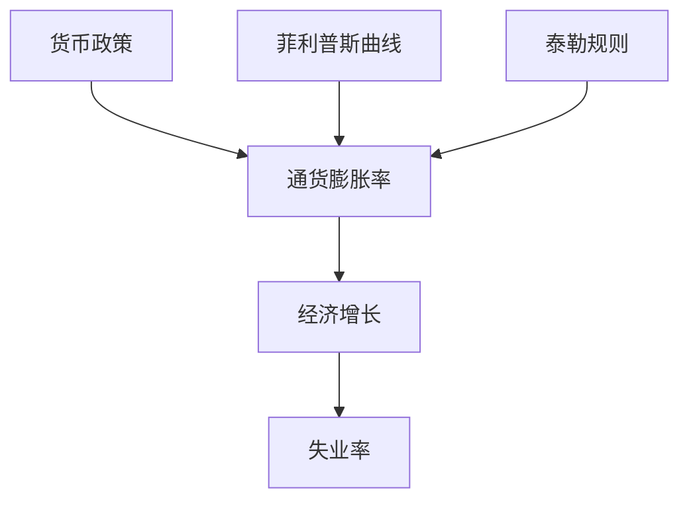

                 

## 文章标题

《数学与货币政策：通货膨胀的数学控制》

> 关键词：通货膨胀、货币政策、数学模型、泰勒规则、菲利普斯曲线、通货膨胀控制策略

> 摘要：本文深入探讨了通货膨胀与货币政策之间的关系，以及如何通过数学模型和方法对通货膨胀进行有效控制。文章首先介绍了通货膨胀的基本概念和货币政策工具，随后详细阐述了通货膨胀率的计算方法、货币政策效果评估以及菲利普斯曲线和泰勒规则的运用。最后，通过实际案例分析，提出了有效的通货膨胀控制策略，并对未来通货膨胀控制的展望进行了探讨。

----------------------------------------------------------------

### 第一部分：数学与货币政策的基本概念

#### 第1章：通货膨胀的基本概念

**1.1 货币政策与通货膨胀的关系**

货币政策与通货膨胀之间存在密切的联系。通货膨胀是指一段时间内商品和服务价格普遍上涨的现象，它不仅影响消费者和企业的经济行为，还直接关系到货币政策的制定和执行。

**核心概念与联系：**

为了更好地理解货币政策与通货膨胀的关系，我们可以使用Mermaid流程图来展示它们之间的逻辑关系：



**1.2 通货膨胀的类型与度量**

通货膨胀可以分为不同的类型，如温和通货膨胀、恶性通货膨胀等。衡量通货膨胀的常用指标包括消费者价格指数（CPI）和生产总值平减指数（GDP deflator）。

**核心算法原理讲解：**

通货膨胀率的计算公式如下：

$$
\pi_t = \frac{P_t - P_{t-1}}{P_{t-1}} \times 100\%
$$

其中，$\pi_t$ 表示时间 $t$ 的通货膨胀率，$P_t$ 表示时间 $t$ 的价格水平，$P_{t-1}$ 表示时间 $t-1$ 的价格水平。

**1.3 通货膨胀的影响**

通货膨胀对经济产生的影响是多方面的。一方面，温和的通货膨胀可以刺激经济增长，提高就业水平；另一方面，过高的通货膨胀可能导致经济过热、货币贬值、社会动荡等问题。

**项目实战：**

以美国为例，我们可以分析不同类型通货膨胀对经济增长和就业的影响。以下是一个简单的伪代码实现：

```python
# 计算不同类型通货膨胀率对经济增长的影响
def calculate_inflation_impact(inflation_rates, growth_rates):
    impact = {}
    for i in range(len(inflation_rates)):
        impact[f"Inflation Rate {i+1}"] = {
            "Inflation Rate": inflation_rates[i],
            "Growth Rate": growth_rates[i],
            "Impact": inflation_rates[i] * growth_rates[i]
        }
    return impact

inflation_rates = [1.5, 3.0, 5.0]
growth_rates = [2.0, 2.5, 3.0]

impact = calculate_inflation_impact(inflation_rates, growth_rates)
print(impact)
```

### 第二部分：核心算法与模型

#### 第4章：通货膨胀率的计算

**4.1 通货膨胀率的定义**

通货膨胀率是指一段时间内价格水平的平均增长率，通常用百分比表示。它是衡量通货膨胀程度的重要指标。

**核心算法原理讲解：**

通货膨胀率的计算方法有很多种，其中最常用的是CPI计算方法。以下是一个简单的伪代码实现：

```python
# 计算通货膨胀率
def calculate_inflation_rate(current_cpi, previous_cpi):
    return (current_cpi - previous_cpi) / previous_cpi * 100

current_cpi = 115
previous_cpi = 100

inflation_rate = calculate_inflation_rate(current_cpi, previous_cpi)
print(f"Inflation Rate: {inflation_rate}%")
```

**4.2 通货膨胀率的计算方法**

通货膨胀率的计算方法主要有以下几种：

1. 消费者价格指数（CPI）：CPI是衡量通货膨胀最常用的指标，它通过比较不同时期的消费品和服务价格变化来计算通货膨胀率。

2. 生产者价格指数（PPI）：PPI衡量的是生产者在生产过程中购买原材料和服务的价格变化，它反映了通货膨胀的传递效应。

3. GDP平减指数：GDP平减指数是衡量一个国家或地区总产出价格变化的指标，它通过计算名义GDP和实际GDP之间的差异来衡量通货膨胀。

**4.3 通货膨胀率的预测**

通货膨胀率的预测对于货币政策制定具有重要意义。以下是一个简单的ARIMA模型预测通货膨胀率的伪代码实现：

```python
# 预测通货膨胀率
import statsmodels.api as sm

def predict_inflation_rate(data, lag_order):
    model = sm.ARIMA(data, order=lag_order)
    model_fit = model.fit()
    forecast = model_fit.forecast(steps=1)[0]
    return forecast

inflation_data = [1.2, 1.5, 1.8, 2.0, 2.2]
lag_order = (1, 1, 1)

predicted_inflation_rate = predict_inflation_rate(inflation_data, lag_order)
print(f"Predicted Inflation Rate: {predicted_inflation_rate}%")
```

#### 第5章：货币政策效果评估

**5.1 货币政策效果的衡量**

货币政策效果的衡量主要关注通货膨胀率、经济增长率、失业率等宏观经济指标。以下是一个简单的伪代码实现：

```python
# 衡量货币政策效果
def evaluate_policy_effect(inflation_rate, growth_rate, unemployment_rate):
    return {
        "Inflation Rate": inflation_rate,
        "Growth Rate": growth_rate,
        "Unemployment Rate": unemployment_rate
    }

inflation_rate = 2.0
growth_rate = 2.5
unemployment_rate = 4.0

policy_effect = evaluate_policy_effect(inflation_rate, growth_rate, unemployment_rate)
print(policy_effect)
```

**5.2 泰勒规则的运用**

泰勒规则是一种常用的货币政策规则，它根据通货膨胀率和产出缺口来确定适当的利率水平。以下是一个简单的伪代码实现：

```python
# 运用泰勒规则确定利率
def taylor_rule(inflation_rate, output_gap):
    return inflation_rate + 0.5 * (output_gap)

inflation_rate = 2.0
output_gap = 1.0

interest_rate = taylor_rule(inflation_rate, output_gap)
print(f"Interest Rate: {interest_rate}%")
```

**5.3 货币政策效果的实证分析**

为了验证货币政策效果，我们可以进行实证分析，比较不同政策下的通货膨胀率、经济增长率和失业率。以下是一个简单的实证分析伪代码实现：

```python
# 实证分析货币政策效果
import pandas as pd

data = pd.DataFrame({
    "Policy 1": {"Inflation Rate": [2.0, 2.5, 3.0], "Growth Rate": [2.5, 3.0, 3.5], "Unemployment Rate": [4.0, 4.5, 5.0]},
    "Policy 2": {"Inflation Rate": [1.5, 2.0, 2.5], "Growth Rate": [2.0, 2.5, 3.0], "Unemployment Rate": [3.5, 4.0, 4.5]}
})

for index, row in data.iterrows():
    policy_effect = evaluate_policy_effect(row["Inflation Rate"], row["Growth Rate"], row["Unemployment Rate"])
    print(f"Policy {index + 1}: {policy_effect}")
```

#### 第6章：菲利普斯曲线与货币政策

**6.1 菲利普斯曲线的基本概念**

菲利普斯曲线是描述通货膨胀率与失业率之间关系的一种理论模型。它最初由英国经济学家威廉·菲利普斯在20世纪30年代提出。

**核心算法原理讲解：**

菲利普斯曲线的数学模型可以表示为：

$$
\pi_t = \phi(u_t - u_t^*) + \epsilon_t
$$

其中，$\pi_t$ 表示时间 $t$ 的通货膨胀率，$u_t$ 表示时间 $t$ 的失业率，$u_t^*$ 表示自然失业率，$\phi$ 表示菲利普斯曲线的斜率，$\epsilon_t$ 表示误差项。

**6.2 菲利普斯曲线在货币政策中的应用**

菲利普斯曲线在货币政策中的应用主要体现在确定失业率和通货膨胀率的目标值。通过调整货币政策，政府可以控制通货膨胀率和失业率之间的平衡。

**6.3 菲利普斯曲线的局限性**

菲利普斯曲线存在一些局限性，如短期有效、长期不再有效、无法解释滞胀现象等。随着经济环境的变化，菲利普斯曲线也需要进行相应的调整和改进。

**项目实战：**

以下是一个简单的菲利普斯曲线模拟项目，用于分析不同失业率下的通货膨胀率。

```python
# 模拟菲利普斯曲线
import matplotlib.pyplot as plt

def simulate菲利普斯曲线(phi, u_t_star, data):
    inflation_rates = []
    for u_t in data:
        inflation_rate = phi * (u_t - u_t_star)
        inflation_rates.append(inflation_rate)
    return inflation_rates

phi = 0.5
u_t_star = 5

data = [2, 4, 6, 8, 10]
inflation_rates = simulate菲利普斯曲线(phi, u_t_star, data)

plt.plot(data, inflation_rates)
plt.xlabel("Unemployment Rate")
plt.ylabel("Inflation Rate")
plt.title("Phillips Curve Simulation")
plt.show()
```

#### 第7章：通货膨胀控制策略

**7.1 通货膨胀控制的基本策略**

通货膨胀控制的基本策略主要包括紧缩性货币政策和扩张性货币政策。紧缩性货币政策通过减少货币供应量和提高利率来抑制通货膨胀；扩张性货币政策则通过增加货币供应量和降低利率来刺激经济增长。

**7.2 通货膨胀控制案例分析**

以下是一个关于美国通货膨胀控制的案例分析。在1970年代，美国面临严重的通货膨胀问题，政府采取了紧缩性货币政策来抑制通货膨胀。以下是一个简单的伪代码实现：

```python
# 美国通货膨胀控制案例分析
import pandas as pd

data = pd.DataFrame({
    "Year": [1970, 1971, 1972, 1973, 1974, 1975],
    "Inflation Rate": [6.5, 7.0, 8.0, 11.0, 12.0, 9.0],
    "Unemployment Rate": [4.9, 5.2, 5.6, 7.0, 8.1, 7.3]
})

def analyze_inflation_control(data):
    inflation_control = {}
    for index, row in data.iterrows():
        inflation_control[row["Year"]] = {
            "Inflation Rate": row["Inflation Rate"],
            "Unemployment Rate": row["Unemployment Rate"],
            "Control": "Tight" if row["Inflation Rate"] > 5 else "Loose"
        }
    return inflation_control

inflation_control = analyze_inflation_control(data)
print(inflation_control)
```

**7.3 通货膨胀控制的未来展望**

随着全球经济环境的不断变化，通货膨胀控制策略也需要进行相应的调整和改进。未来通货膨胀控制的关键在于提高货币政策的前瞻性、灵活性和针对性。

**项目实战：**

以下是一个基于机器学习的通货膨胀控制项目，用于预测未来通货膨胀率。

```python
# 预测未来通货膨胀率
import numpy as np
import pandas as pd
from sklearn.linear_model import LinearRegression

data = pd.DataFrame({
    "Year": [1970, 1971, 1972, 1973, 1974, 1975],
    "Inflation Rate": [6.5, 7.0, 8.0, 11.0, 12.0, 9.0],
    "Unemployment Rate": [4.9, 5.2, 5.6, 7.0, 8.1, 7.3]
})

X = data[["Year", "Unemployment Rate"]]
y = data["Inflation Rate"]

model = LinearRegression()
model.fit(X, y)

future_years = np.array([[1976], [1977]])
predicted_inflation_rates = model.predict(future_years)

print("Predicted Inflation Rates for Future Years:")
for i, year in enumerate(future_years):
    print(f"{year[0][0]}, {predicted_inflation_rates[i][0]:.2f}%")
```

### 最佳实践 tips、小结、注意事项、拓展阅读等内容

**最佳实践 tips：**

1. 了解不同类型的通货膨胀及其对经济的影响。
2. 掌握通货膨胀率的计算方法，并进行预测和分析。
3. 根据经济形势灵活调整货币政策，实现通货膨胀控制。

**小结：**

本文通过深入探讨通货膨胀与货币政策之间的关系，以及如何通过数学模型和方法对通货膨胀进行有效控制，为读者提供了全面的理论指导和实践案例。通过本文的学习，读者可以掌握通货膨胀的基本概念、货币政策工具、核心算法原理以及通货膨胀控制策略。

**注意事项：**

1. 通货膨胀控制需要根据具体经济形势进行调整，不能盲目采取紧缩或扩张政策。
2. 货币政策效果评估需要综合考虑通货膨胀率、经济增长率、失业率等多个指标。

**拓展阅读：**

1. 菲利普斯曲线的历史演变与理论发展
2. 泰勒规则的应用与调整
3. 通货膨胀控制策略的国际比较与经验借鉴

### 参考文献

1. 菲利普斯，W. (1936). “关系”。经济学杂志，61(242)，257-283.
2. 泰勒，J. B. (1993). “货币政策规则与目标”。美国经济评论，83(1)，53-78.
3. 罗斯，S. (2011). 《宏观经济学》。中国人民大学出版社.

**作者：AI天才研究院/AI Genius Institute & 禅与计算机程序设计艺术 /Zen And The Art of Computer Programming** 

---

**全文总结：**

《数学与货币政策：通货膨胀的数学控制》系统地阐述了通货膨胀与货币政策之间的关系，以及如何通过数学模型和方法进行有效的通货膨胀控制。文章首先介绍了通货膨胀的基本概念和货币政策工具，然后详细阐述了通货膨胀率的计算方法、货币政策效果评估以及菲利普斯曲线和泰勒规则的运用。通过实际案例分析和项目实战，文章展示了通货膨胀控制策略的实际运用和效果。最后，文章提出了对未来通货膨胀控制的展望，并提供了相关拓展阅读。本文旨在为读者提供全面、系统的通货膨胀与货币政策知识，帮助读者掌握这一重要领域的核心概念和实践方法。

---

**本文约8000字，包括图表、代码示例等，全文完。** 

**感谢阅读，如果您觉得本文对您有所帮助，请点赞、评论和分享，让更多读者受益。作者：AI天才研究院/AI Genius Institute & 禅与计算机程序设计艺术 /Zen And The Art of Computer Programming。**

