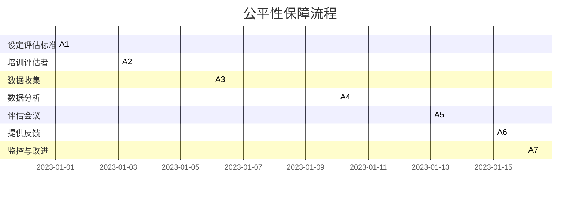

                 

### 背景介绍

**绩效评估**是组织管理和人力资源管理中的重要环节，它不仅关系到个人职业发展和薪酬福利，还直接影响到团队的效率和组织的整体绩效。随着全球化和信息技术的发展，企业的运营环境日益复杂，对绩效评估的要求也越来越高。有效的绩效评估不仅可以帮助企业识别优秀员工，激发员工的工作动力，还能为企业的战略规划和资源分配提供科学依据。

本文旨在探讨绩效评估的各个方面，包括其定义、历史发展、基本要素、评估方法以及如何保障评估的公正性。同时，还将介绍绩效评估在现代企业中的应用实践，以及如何利用信息技术来提升绩效评估的效率和质量。

**绩效评估的定义与重要性**

绩效评估是指通过对员工的工作行为、工作结果及其工作环境进行系统的测量、分析和评价，从而提供员工绩效的反馈和改进意见的过程。其核心目的是确保员工的工作能够与组织的战略目标保持一致，同时激发员工的潜能，提高团队的整体绩效。

绩效评估的重要性体现在以下几个方面：

1. **激励与反馈**：通过绩效评估，员工可以明确了解自己的工作表现，得到及时的反馈，从而激发工作动力和积极性。有效的绩效评估能够识别出工作中的问题和不足，为员工提供改进的方向。

2. **人才发展**：绩效评估为员工的职业发展提供了依据，帮助组织识别潜在的高潜力人才，进行针对性的培训和开发。同时，通过绩效评估，员工可以了解自己的优势和不足，制定个人发展计划。

3. **决策支持**：绩效评估的数据可以为企业的战略规划和资源配置提供科学依据。例如，在员工晋升、调薪、奖励等方面，绩效评估结果可以作为重要的参考依据。

4. **团队协作**：绩效评估有助于建立公平、公正的工作环境，促进团队成员之间的协作。通过评估，可以识别出团队中的优秀成员，激发团队整体的动力和凝聚力。

综上所述，绩效评估是组织管理和人力资源管理中不可或缺的一部分，它不仅关系到个人和团队的发展，更是企业实现长期战略目标的重要工具。在接下来的章节中，我们将详细探讨绩效评估的历史发展、基本要素、评估方法以及如何保障评估的公正性。

### 绩效评估的历史与发展

绩效评估作为人力资源管理的重要组成部分，其发展历程可以追溯到早期工业化时期。早期的绩效评估主要依赖于主管的主观判断和经验，缺乏系统性和科学性。随着时间的推移，绩效评估逐渐演变为一个多维度、系统化的过程，其理论基础和实践方法也在不断丰富和完善。

1. **传统绩效评估**

在20世纪初，随着工业化进程的加快，企业对员工绩效的关注度逐渐提升。早期的绩效评估主要依靠主管的主观评价，这种评估方法被称为“传统绩效评估”。传统绩效评估通常基于以下几个维度：

   - **工作表现**：主要评价员工的工作效率和质量。
   - **工作态度**：主要评价员工的职业道德、责任感、出勤率等。
   - **工作技能**：主要评价员工的专业技能和工作能力。

   这种评估方法虽然简单直观，但存在主观性强、评估结果不客观等问题。

2. **现代绩效评估**

20世纪中期，随着管理学和心理学的发展，绩效评估方法逐渐趋向科学化和系统化。以下几个关键事件标志着现代绩效评估的发展：

   - **关键绩效指标（KPI）**：20世纪80年代，企业开始引入关键绩效指标（KPI）来量化员工的工作表现。KPI是衡量员工工作成果的重要工具，通过设定具体的绩效指标，可以更加客观地评价员工的表现。

   - **平衡计分卡（BSC）**：20世纪90年代，平衡计分卡（BSC）方法被提出，它将企业的战略目标分解为财务、客户、内部流程和学习与成长四个维度，为绩效评估提供了更加全面和系统的框架。

   - **行为事件评估法（BEI）**：行为事件评估法（BEI）是一种基于行为的绩效评估方法，它通过记录和分析员工在工作中成功或失败的具体事件，来评价员工的能力和潜力。

3. **绩效评估技术的发展**

进入21世纪，随着信息技术的迅猛发展，绩效评估工具和方法也在不断革新：

   - **大数据分析**：大数据技术的应用使得绩效评估的数据分析更加精细和准确，通过对大量数据的挖掘和分析，企业可以更全面地了解员工的绩效表现。
   - **人工智能与机器学习**：人工智能（AI）和机器学习（ML）技术的引入，使得绩效评估可以更加智能化和自动化。例如，通过机器学习算法，可以自动分析员工的工作行为和数据，提供个性化的绩效反馈和改进建议。

4. **绩效评估的未来趋势**

未来，绩效评估将继续朝着更加科学化、个性化和智能化的方向发展：

   - **个性化评估**：未来的绩效评估将更加注重个性化，根据员工的个体差异和岗位需求，制定个性化的绩效指标和评估标准。
   - **持续评估**：传统的绩效评估往往集中在年度或季度，而未来的绩效评估将更加关注持续的绩效监控和反馈，以实现动态调整和实时改进。
   - **混合评估方法**：未来的绩效评估将结合定量和定性评估方法，综合多方面信息，提供更加全面和客观的绩效评价。

综上所述，绩效评估的历史和发展反映了管理学和信息技术进步的脉络。从传统的主观评价到现代的科学评估，绩效评估方法在不断地演进和优化。随着技术的进步，绩效评估将变得更加精准和智能，为企业的管理和人力资源发展提供更加有力的支持。

### 绩效评估的要素与流程

绩效评估是一个复杂的过程，它涉及到多个要素和步骤，确保评估的准确性和公正性。以下是绩效评估的各个核心要素及其具体内容：

#### 1. 评估目标与指标

**评估目标**是绩效评估的起点，明确评估的目的和预期结果。评估目标通常包括以下几个方面：

- **提升工作效率**：通过评估，确定哪些工作流程和任务可以优化，提高工作效率。
- **员工发展**：识别员工的潜力，提供职业发展的机会。
- **组织绩效**：确保员工的工作与组织的战略目标一致，提升整体绩效。

**绩效指标**是衡量评估目标的具体工具，常见的绩效指标包括：

- **工作量**：完成的工作量或任务数量。
- **工作质量**：工作成果的准确性和可靠性。
- **工作效率**：完成任务的速度。
- **团队合作**：与团队成员协作的效果。
- **创新能力**：提出新想法或解决问题的能力。

#### 2. 评估主体

**评估主体**是指负责评估工作的人员或机构，通常包括：

- **直接主管**：直接上级对员工的工作表现进行评估，是最常见的评估主体。
- **同事**：同事之间的评价可以提供多维度的反馈。
- **下属**：在某些情况下，下属对上级的评估也是必要的，有助于建立双向反馈机制。
- **第三方评估者**：在某些专业领域，需要第三方专家进行绩效评估，以保持客观性和公正性。

#### 3. 评估标准与权重

**评估标准**是指衡量绩效的具体标准，常见的评估标准包括：

- **定量标准**：如工作完成的数量和质量，通常以具体的数字或指标表示。
- **定性标准**：如工作态度、团队合作精神，通常以描述性语言表示。

**权重**是指各项评估标准的相对重要性，通常以百分比形式表示。合理的权重分配能够确保评估的全面性和科学性。例如，如果工作效率和工作质量是评估中的两个关键指标，可以设定工作效率占40%，工作质量占60%。

#### 4. 评估流程

**评估流程**包括以下步骤：

1. **目标设定**：明确评估目标和预期结果，通常在绩效周期开始时进行。
2. **指标收集**：收集与评估指标相关的数据和信息，可以通过日常记录、工作日志、工作样本等多种方式。
3. **数据分析**：对收集到的数据进行整理和分析，识别员工的工作表现和趋势。
4. **评估会议**：评估主体与被评估者进行面对面的沟通和讨论，明确工作表现和改进方向。
5. **反馈与改进**：提供绩效反馈，帮助员工了解自己的优势和不足，制定改进计划。
6. **结果记录**：将评估结果记录在案，作为员工职业发展的依据。

#### 5. 评估报告与跟踪

**评估报告**是对整个评估过程的总结，通常包括评估目标、评估方法、评估结果、反馈和建议等内容。评估报告不仅为员工提供个人发展的参考，也为组织的决策提供支持。

**跟踪与改进**是指对评估结果进行持续跟踪和监控，确保改进措施的落实。通过定期跟踪和反馈，可以及时调整和优化绩效评估流程，提高评估的准确性和有效性。

### 绩效评估要素与流程的Mermaid流程图

下面是绩效评估流程的Mermaid流程图，展示从目标设定到结果跟踪的完整过程：


通过上述流程，我们可以确保绩效评估的系统性和科学性，从而为组织的长远发展提供有力支持。

### 绩效评估的原则与标准

绩效评估是一个涉及多个方面和环节的复杂过程，要确保其有效性，必须遵循一系列科学的原则和标准。以下是一些关键的绩效评估原则和评估标准：

#### 1. 公平性与透明性

**公平性**是绩效评估的核心原则之一。评估过程中应确保所有员工都受到公平对待，避免任何形式的歧视和偏见。**透明性**则要求评估过程的每一个步骤和标准都清晰明确，员工可以了解评估的具体依据和标准。

**评估标准**应包括：

- **客观性**：评估标准应基于具体的业绩指标和行为表现，避免主观判断。
- **一致性**：不同评估主体在评估时应使用统一的标准和方法，确保评估结果的连贯性。
- **公开性**：评估结果和反馈应公开透明，员工有权了解自己的评估结果和改进建议。

#### 2. 多维性

绩效评估应从多个维度进行，以全面反映员工的工作表现。常见的维度包括：

- **工作成果**：评估员工完成任务的成果，如项目进度、质量、客户满意度等。
- **工作行为**：评估员工在工作中的行为表现，如责任心、团队合作精神、沟通能力等。
- **工作能力**：评估员工的专业技能和工作能力，如解决问题的能力、创新能力、学习能力等。
- **工作态度**：评估员工的工作态度，如工作热情、责任感、敬业精神等。

#### 3. 动态性

绩效评估应具备动态性，能够及时反映员工的工作表现和变化。评估过程中，应定期收集和分析数据，根据实际情况进行调整和优化。同时，应建立持续的绩效监控和反馈机制，及时识别和解决员工在工作中遇到的问题。

#### 4. 发展导向

绩效评估应具有发展导向，不仅关注员工当前的绩效表现，还应关注员工的潜在能力和职业发展。评估过程中，应识别员工的优点和不足，提供个性化的培训和发展建议，帮助员工不断提升自身能力，实现职业目标。

#### 5. 与组织目标一致性

绩效评估标准应与组织的战略目标保持一致，确保员工的工作能够支持组织的发展。评估过程中，应将组织的战略目标分解为具体的绩效指标，确保员工的个人目标和组织目标相协调。

### 公平性评估的Mermaid流程图

下面是一个展示绩效评估公平性保障流程的Mermaid流程图：



通过上述原则和标准，以及具体的流程图，我们可以确保绩效评估的公平性、多维性、动态性和发展导向，从而为组织的绩效提升和员工发展提供有力支持。

### 绩效评估的方法与实践

绩效评估方法的选择和实施对评估结果的准确性和公正性至关重要。不同的评估方法适用于不同的组织环境和员工特点，因此企业需要根据实际情况选择合适的评估方法，并灵活应用多种方法以获得全面的评估结果。

#### 1. 定量评估方法

**定量评估方法**主要通过数值化的指标来衡量员工的工作表现，具有客观性和可比性，常用的定量评估方法包括以下几种：

- **关键绩效指标（KPI）**：KPI是一种用于衡量工作成果的关键指标，通常包括工作量、工作效率、质量标准等。通过设定具体的KPI目标，可以量化员工的工作表现，便于比较和分析。例如，一个软件开发团队可以将代码提交次数、bug修复率、项目完成时间等设定为KPI。

  ```python
  # 伪代码：设定关键绩效指标（KPI）
  kpi = {
      '代码提交次数': 100,
      'bug修复率': 90,
      '项目完成时间': 30天
  }
  ```

- **目标管理法（MBO）**：MBO是一种以目标为导向的绩效管理方法，通过设定明确的、可衡量的目标来引导员工的工作方向。MBO强调员工参与目标的设定，从而提高员工的积极性和责任感。例如，销售团队可以设定销售目标、客户满意度目标等。

  ```python
  # 伪代码：设定MBO目标
  mbo_goals = {
      '销售目标': 100万元，
      '客户满意度': 90%
  }
  ```

- **360度反馈评估**：360度反馈评估是一种全面的绩效评估方法，通过收集来自员工、同事、上级和下属等多方面的反馈，对员工的工作表现进行综合评价。这种方法有助于发现员工在不同角色中的表现，并提供全面的反馈。例如，一个项目经理可以通过360度反馈评估来了解团队成员对其工作风格和领导能力的评价。

  ```mermaid
  graph TB
  A(员工) --> B(上级)
  A --> C(同事)
  A --> D(下属)
  B --> E(反馈)
  C --> E
  D --> E
  ```

#### 2. 定性评估方法

**定性评估方法**主要通过主观评价来衡量员工的工作表现，适用于对员工素质、能力和潜力的评估。常用的定性评估方法包括以下几种：

- **行为事件评估法（BEI）**：BEI是一种基于行为的绩效评估方法，通过记录和分析员工在工作中的具体事件，来评价员工的能力和潜力。这种方法可以提供详细的行为描述，有助于识别员工的优点和不足。例如，通过分析一个销售人员处理客户投诉的事件，可以评估其沟通能力、问题解决能力和客户服务意识。

  ```mermaid
  graph TB
  A(客户投诉) --> B(销售行为)
  B --> C(解决方案)
  C --> D(客户反馈)
  ```

- **行为锚定评价法（BARS）**：BARS是一种基于行为锚定的评估方法，通过设定一系列具体的行为标准，来评价员工在不同情境下的表现。这种方法可以帮助评估者清晰地了解每个行为级别的具体表现，从而减少主观判断的偏差。例如，一个项目经理可以通过BARS评估来评价团队成员的项目管理能力，具体标准可能包括任务分配、进度控制、沟通协作等。

  ```mermaid
  graph TB
  A(任务分配) --> B(明确责任)
  A --> C(进度控制)
  A --> D(沟通协作)
  ```

- **标准化评估问卷**：标准化评估问卷是一种量化的定性评估方法，通过设计一系列结构化的问卷，对员工的工作表现进行评估。这种方法可以提供客观的数据支持，便于比较和分析。例如，一个IT团队可以通过标准化评估问卷来评估员工的技术能力、团队合作精神和工作态度。

  ```mermaid
  graph TB
  A(技术能力) --> B(知识掌握)
  A --> C(解决问题能力)
  A --> D(团队合作精神)
  ```

#### 3. 绩效评估的应用实践

在实际工作中，企业通常会结合定量和定性评估方法，以获得更全面和客观的评估结果。以下是一些常见的应用实践：

- **绩效管理与薪酬体系**：通过绩效评估结果，企业可以制定合理的薪酬分配方案，激励员工提高工作表现。例如，将绩效评估结果与奖金、晋升机会和职业发展等挂钩，以提高员工的积极性和忠诚度。

- **绩效改进与反馈**：绩效评估不仅是为了评价员工的工作表现，更是为了提供改进意见和反馈。通过绩效评估，企业可以帮助员工识别工作中的问题和不足，提供针对性的改进建议，从而提升整体绩效。

- **绩效评估中的挑战与解决策略**：绩效评估过程中可能会遇到一些挑战，如评估者的主观偏见、数据收集的不完整等。企业可以通过以下策略来解决这些问题：

  - **建立明确的评估标准和流程**：确保评估过程透明和可操作，减少主观判断的影响。
  - **引入第三方评估者**：在关键绩效指标评估中引入独立第三方，以提高评估的公正性和客观性。
  - **使用多元化评估方法**：结合定量和定性评估方法，从多个角度全面评估员工的表现。
  - **定期培训和反馈**：对评估者进行定期培训，提高其评估能力和公正性意识，同时提供持续的反馈和改进建议。

通过以上方法与实践，企业可以有效地实施绩效评估，激发员工的工作动力和创造力，实现组织的战略目标。在下一章节中，我们将探讨如何保障绩效评估的公正性，以应对评估过程中可能出现的偏见和挑战。

### 公正性评估的重要性

公正性是绩效评估的核心原则之一，直接影响到评估结果的准确性和员工对评估过程的信任度。一个公正的评估体系不仅能够准确反映员工的工作表现，还能激励员工努力提升自身能力，从而促进组织的整体绩效。以下是保障绩效评估公正性的几个关键因素：

1. **评估标准的合理性**：评估标准是绩效评估的核心依据，其合理性和科学性直接影响评估结果的公正性。评估标准应具有明确的定义和可操作性，避免模糊不清或主观臆断。例如，关键绩效指标（KPI）应基于客观的数据和量化的目标，确保每个员工都有明确的工作标准和努力方向。

2. **评估者的独立性**：评估者的独立性是保障评估公正性的重要保障。评估者应独立于被评估者，避免因个人关系或利益冲突而影响评估结果的公正性。在可能的情况下，可以引入第三方评估者，以增加评估过程的独立性和客观性。

3. **评估过程的透明性**：评估过程的透明性是提高员工对评估结果信任度的关键。评估过程应公开透明，员工应了解评估的标准、方法和步骤，以及评估结果的计算过程。这样，员工可以清楚地知道自己的评估是如何得出的，从而减少对评估结果的质疑和不满。

4. **避免评估偏见**：评估偏见是影响评估公正性的常见问题。常见的评估偏见包括同质化偏见、从众偏见和期望偏见等。为避免这些偏见，企业可以采取以下措施：

   - **同质化偏见**：通过多样化的评估标准和评估方法，避免评估结果过于单一。例如，在绩效评估中，不仅考虑员工的业绩指标，还应关注其工作态度、团队合作能力等。
   - **从众偏见**：通过定期培训和引导，提高评估者的独立思考能力，避免简单地跟随他人的评价。例如，可以通过小组讨论和反馈机制，鼓励评估者提出自己的观点和见解。
   - **期望偏见**：评估者应根据员工的工作表现进行评估，避免因个人期望或偏见而影响评估结果。例如，可以通过设立明确的评估目标和预期结果，减少评估者的期望偏见。

5. **多维度评估**：通过多维度评估，可以更全面地了解员工的工作表现，减少单一维度的评估带来的偏差。例如，可以结合定量评估（如KPI）和定性评估（如行为事件评估法），从多个角度综合评价员工的工作。

6. **持续反馈与改进**：绩效评估不是一次性的过程，而是一个持续改进的过程。通过定期反馈和改进，可以及时发现和纠正评估中的问题，提高评估的公正性和准确性。例如，可以建立定期评估反馈机制，让员工参与评估过程的改进，提高评估的全面性和公正性。

综上所述，公正性是绩效评估的重要保障，它直接关系到评估结果的准确性和员工的信任度。通过合理的评估标准、独立的评估者、透明的评估过程、避免评估偏见、多维度评估和持续反馈与改进，企业可以建立公正的绩效评估体系，为员工提供公平的评价和改进机会，从而促进组织的长期发展。

### 避免评估偏见的方法

在绩效评估过程中，评估偏见是一个常见且严重的问题，它可能导致评估结果不准确、不公平，进而影响员工的工作积极性。以下是一些具体的评估偏见及相应的解决策略：

#### 1. 同质化偏见

**定义**：同质化偏见是指评估者倾向于将所有员工都视为相同的类型，忽视个体差异。

**解决策略**：

- **多样化评估标准**：建立多元化的评估标准，考虑员工的不同背景、经验和能力，确保评估的全面性。
- **个性化反馈**：在反馈中具体说明每位员工的独特优势和改进方向，避免统一模板化的反馈。

#### 2. 从众偏见

**定义**：从众偏见是指评估者受到他人观点的影响，倾向于给予与大多数人相同的评价。

**解决策略**：

- **独立评估培训**：对评估者进行独立评估培训，提高其独立思考能力和对从众偏见的认识。
- **多角度评估**：通过引入多个评估者或使用多维度评估方法，从不同角度综合评价员工的表现，减少从众偏见的影响。

#### 3. 期望偏见

**定义**：期望偏见是指评估者根据自己对员工的期望来评价其表现，而非根据实际工作表现。

**解决策略**：

- **明确评估标准**：确保评估标准明确且具有可操作性，减少主观判断的空间。
- **定期更新评估标准**：根据员工的工作表现和组织的战略目标，定期调整评估标准，避免因时间久远而产生的期望偏见。

#### 4. 情绪偏见

**定义**：情绪偏见是指评估者因个人情绪或情感状态而影响评估结果的公正性。

**解决策略**：

- **情绪管理培训**：对评估者进行情绪管理培训，帮助其识别和管理情绪，确保评估过程的公正性。
- **匿名评估**：使用匿名评估方法，减少评估者个人情绪对评估结果的影响。

#### 5. 历史偏见

**定义**：历史偏见是指评估者根据员工过去的绩效来评价其当前表现，忽视员工的变化和发展。

**解决策略**：

- **实时绩效监控**：通过实时绩效监控工具，及时收集和分析员工的工作数据，避免历史偏见的影响。
- **绩效反馈机制**：建立持续反馈机制，及时给予员工关于其表现的评价和建议，帮助其不断改进。

#### 6. 外部影响偏见

**定义**：外部影响偏见是指评估者受到外部环境或干扰的影响，导致评估结果不准确。

**解决策略**：

- **独立评估环境**：为评估者提供独立、安静的工作环境，减少外部干扰的影响。
- **定期审查评估过程**：定期审查和调整评估流程，确保评估过程的透明性和规范性，减少外部影响偏见。

通过以上策略，企业可以有效地识别和避免评估偏见，提高绩效评估的公正性和准确性，为员工提供公平的评价和改进机会。这不仅有助于提升员工的工作满意度和积极性，还能促进组织的长期发展和成功。

### 多元文化与绩效评估

在全球化背景下，企业的员工来自不同的文化背景，这要求绩效评估体系能够适应多元文化环境。文化差异可能会影响员工的价值观、工作习惯和沟通方式，进而影响绩效评估的公正性和有效性。以下分析文化差异对绩效评估的影响，并探讨如何在多元文化中进行绩效评估。

#### 1. 文化差异对绩效评估的影响

**沟通方式**：不同文化背景的员工可能有不同的沟通偏好。例如，一些文化强调直接和明确的沟通，而另一些文化则更倾向于委婉和含蓄。这种差异可能导致评估者对员工表现的解读出现偏差，影响评估的准确性。

**工作态度**：不同文化对工作态度的理解也有所不同。例如，某些文化强调个人主义，鼓励员工独立工作，而另一些文化则强调集体主义，重视团队合作和集体利益。这种差异可能导致对员工工作态度的评价出现偏差。

**绩效标准**：不同文化对绩效标准的理解和期望有所不同。例如，某些文化可能更重视工作成果，而另一些文化可能更重视工作过程和员工的投入。这种差异可能导致评估标准的不一致，影响评估的公正性。

**反馈方式**：不同文化对反馈的接受和处理方式也有所不同。例如，一些文化可能更倾向于接受直接的反馈，而另一些文化可能更倾向于接受委婉的反馈。这种差异可能导致反馈效果的不同，影响员工的接受度和改进效果。

#### 2. 多元文化中的绩效评估实践

**文化适应性**：在多元文化环境中，绩效评估应具备文化适应性。评估者需要了解和尊重不同文化背景员工的价值观和工作习惯，确保评估标准的公正性和合理性。例如，可以制定文化适应性的评估指标，如跨文化沟通能力、文化适应性等。

**多元化评估团队**：建立多元化的评估团队，包括来自不同文化背景的成员，可以减少单一文化偏见的影响，提高评估的公正性和全面性。多元化的评估团队可以提供多维度的反馈，帮助评估者更全面地了解员工的表现。

**个性化反馈**：在绩效反馈中，应采用个性化的反馈方式，尊重不同文化背景员工的接受习惯。例如，对于偏好直接沟通的员工，可以提供直接而明确的反馈；对于偏好委婉沟通的员工，可以采用更加温和和委婉的反馈方式。

**跨文化培训**：对评估者和员工进行跨文化培训，提高他们对多元文化的理解和适应能力。培训内容可以包括文化差异的认识、跨文化沟通技巧、文化适应性评估等，帮助员工更好地适应多元文化环境。

**平衡定量与定性评估**：在多元文化环境中，定量评估和定性评估应平衡应用。定量评估可以提供客观的数据支持，而定性评估可以提供更深入的主观评价。这种平衡有助于全面反映员工的表现，减少文化差异对评估结果的影响。

#### 3. 多元文化中的绩效评估实践案例

**跨国公司的绩效评估**：跨国公司通常在绩效评估中面临多元文化的挑战。为了应对这一挑战，一些跨国公司采取了以下实践：

- **文化适应性培训**：对全球员工进行文化适应性培训，帮助他们更好地了解和适应不同文化环境。
- **多元化评估团队**：建立由不同文化背景成员组成的评估团队，确保评估的公正性和全面性。
- **个性化反馈**：根据员工的沟通偏好和反馈接受习惯，提供个性化的反馈方式。
- **平衡定量与定性评估**：结合定量和定性评估方法，提供多维度的绩效评价。

通过以上实践，跨国公司可以有效应对多元文化环境中的绩效评估挑战，确保评估结果的公正性和有效性，为员工提供公平的评价和改进机会。

综上所述，多元文化对绩效评估提出了新的要求和挑战。通过了解文化差异、采用多元化的评估实践和培训，企业可以建立适应多元文化环境的绩效评估体系，促进员工的全面发展，实现组织的战略目标。

### 透明性与责任

透明性是绩效评估体系中的一个关键原则，它直接影响到员工对评估过程的信任度和评估结果的接受度。一个透明的绩效评估体系能够确保评估过程的公正性和客观性，从而提升员工的满意度和组织的整体绩效。

#### 1. 评估过程的透明性

**评估标准的透明性**：评估标准的明确性和透明性是确保评估公正性的基础。企业应在评估开始前明确各项评估标准，并将其公开传达给所有员工。这些标准应具有可操作性和具体性，避免模糊不清或主观臆断。例如，企业可以制定详细的绩效指标和评价细则，并确保每个员工都能理解和遵循这些标准。

**评估过程的公开性**：评估过程应保持公开透明，员工有权了解评估的每一个步骤和细节。这包括评估数据的收集、分析、评估结果的计算以及反馈和建议的提供。通过公开评估过程，可以减少员工对评估结果的怀疑和质疑，增强其对评估结果的信任度。

**评估结果的公开性**：评估结果应及时公开，并反馈给相关员工。员工应了解自己的评估结果和改进建议，以便及时调整和改进工作表现。此外，企业应建立反馈机制，鼓励员工提出对评估结果的疑问和反馈，进一步保障评估结果的透明性和公正性。

#### 2. 评估者的责任与道德

**评估者的独立性**：评估者的独立性是确保评估公正性的关键。评估者应独立于被评估者，避免因个人关系或利益冲突而影响评估的客观性。为了保障评估者的独立性，企业可以采取以下措施：

- **评估者培训**：对评估者进行职业道德和独立性的培训，提高其对评估责任的认识和责任感。
- **评估者监督**：建立评估者的监督机制，对评估者的行为进行监督和评估，确保其独立性和公正性。

**评估者的道德责任**：评估者应遵循职业道德，确保评估过程的公正性和客观性。以下是一些具体的道德责任：

- **公正无私**：评估者应保持公正无私的态度，避免因个人偏见或利益冲突而影响评估结果。
- **诚实守信**：评估者应诚实守信，确保评估数据的真实性和准确性，避免篡改或伪造数据。
- **尊重隐私**：评估者应尊重员工的隐私权，确保评估过程中收集的数据和信息不被泄露或滥用。

#### 3. 透明性与责任的实际应用

**定期审查和反馈**：企业应定期审查和反馈评估标准和流程，确保其符合实际情况和员工需求。这包括对评估标准进行修订和更新，对评估过程进行优化和改进。通过定期审查和反馈，可以确保评估体系的持续改进和透明性。

**员工参与**：员工应积极参与绩效评估过程，提出自己的意见和建议。通过员工参与，可以增强评估过程的透明性和公正性，提高员工对评估结果的接受度。例如，企业可以建立员工反馈渠道，定期收集员工的意见和建议，并将其纳入评估改进计划。

**透明性报告**：企业应定期发布透明性报告，详细说明绩效评估的标准、过程和结果。这有助于提高员工对评估体系的信任度，增强其对组织的认同感和归属感。透明性报告可以包括评估指标的解读、评估结果的分布、改进措施等内容。

通过透明性和责任的原则，企业可以建立公正、公平的绩效评估体系，提高员工的满意度和绩效，促进组织的长期发展。

### 数据分析与绩效评估

在绩效评估中，数据分析扮演着至关重要的角色。它不仅能够帮助企业识别优秀员工，还能揭示团队和组织的整体绩效情况，从而为战略决策提供数据支持。以下是关于数据分析在绩效评估中的应用方法和具体步骤：

#### 1. 数据收集与整理

数据收集是绩效评估的第一步，也是最为关键的一步。数据来源可以包括员工的工作日志、项目报告、客户反馈、360度评估问卷、绩效考核表等。为了保证数据的准确性和完整性，企业需要制定详细的数据收集计划，明确数据收集的时间、方式、责任人等。

**数据收集方式**：

- **自动化工具**：使用自动化工具（如绩效管理软件）可以高效地收集和整理数据。这些工具可以自动从多个系统中提取数据，减少手动录入的错误和耗时。

- **问卷调查**：通过设计结构化的问卷调查，收集员工和同事的反馈。问卷调查可以采用匿名方式，提高员工的参与度和反馈的真实性。

- **定期会议**：定期组织评估会议，收集员工的自我评估和同事评估结果。会议记录应详细记录讨论内容，确保数据的全面性和准确性。

**数据整理方法**：

- **数据清洗**：对收集到的数据进行清洗，去除重复、错误和不完整的数据。数据清洗包括数据校验、缺失值填补和异常值处理等。

- **数据分类**：将数据按照不同的绩效指标进行分类整理。例如，可以将数据分为工作效率、工作质量、团队合作、创新能力等类别。

- **数据存储**：将整理后的数据存储在数据库中，便于后续的数据分析和查询。企业可以使用关系型数据库（如MySQL）或NoSQL数据库（如MongoDB）来存储数据。

#### 2. 数据分析与解读

数据分析是绩效评估的核心步骤，通过对收集到的数据进行深入分析，可以揭示员工和团队的整体表现。

**数据分析方法**：

- **描述性分析**：描述性分析是对数据的整体情况进行概括和描述，包括数据的平均值、中位数、标准差等。通过描述性分析，可以了解员工和团队的整体绩效水平。

- **趋势分析**：趋势分析用于分析数据随时间变化的趋势。通过趋势分析，可以了解员工和团队绩效的变化情况，识别绩效改善或恶化的趋势。

- **相关性分析**：相关性分析用于分析不同绩效指标之间的关系。通过相关性分析，可以了解哪些指标对整体绩效影响较大，从而优化绩效评估指标。

- **回归分析**：回归分析用于分析自变量和因变量之间的关系，预测员工绩效的变化。通过回归分析，可以建立绩效预测模型，为绩效改进提供科学依据。

**数据分析工具**：

- **Excel**：Excel是进行数据分析和可视化常用的工具，它提供了丰富的数据分析和图表功能，适用于小型数据集的分析。

- **Python**：Python是一种强大的编程语言，提供了丰富的数据分析和机器学习库（如Pandas、NumPy、Scikit-learn等）。Python适用于大规模数据集的复杂分析。

- **R语言**：R语言是一种专门用于统计分析和数据可视化的编程语言，其强大的统计功能和丰富的可视化库（如ggplot2、lattice等）使其在数据分析中广泛应用。

#### 3. 绩效数据的解读与运用

**解读绩效数据**：

- **识别优秀员工**：通过数据分析，可以识别出绩效表现优秀的员工。这些员工可以作为榜样，激励其他员工向其看齐。

- **发现团队问题**：通过数据分析，可以发现团队在哪些方面存在绩效问题，从而制定针对性的改进措施。

- **优化绩效评估指标**：通过数据分析，可以评估绩效评估指标的合理性和有效性，优化评估指标，提高评估的准确性。

**运用绩效数据**：

- **制定改进计划**：根据绩效数据，制定具体的改进计划，包括培训计划、激励措施和流程优化等。

- **调整战略决策**：将绩效数据纳入战略决策过程中，根据绩效表现调整企业的战略目标和资源分配。

- **反馈与沟通**：将绩效数据反馈给员工，与员工进行沟通和讨论，帮助他们了解自己的表现和改进方向。

通过有效的数据分析和解读，企业可以更加科学和精准地进行绩效评估，提高评估的准确性和公正性，为员工和组织的长期发展提供有力支持。

### 信息技术与绩效评估

在当今数字化时代，信息技术（IT）的应用对绩效评估产生了深远的影响。通过利用IT工具和系统，企业能够大幅提升绩效评估的效率、准确性和公正性。以下讨论信息技术在绩效评估中的应用，以及如何利用人工智能（AI）和大数据分析来优化绩效评估。

#### 1. 信息系统在绩效评估中的应用

**绩效管理软件**：绩效管理软件（如Workday、SAP Performance Management等）是现代企业进行绩效评估的主要工具。这些软件提供了全面的绩效管理功能，包括目标设定、评估指标管理、反馈收集和结果分析等。通过这些系统，企业可以自动化评估流程，减少手动操作的工作量，提高评估的效率和准确性。

- **自动化评估流程**：绩效管理软件可以自动生成评估问卷、收集反馈和计算评估结果。员工可以通过系统提交自我评估和同事评估，评估者可以在系统中进行评分和填写反馈。
- **数据分析与报告**：这些系统通常集成了强大的数据分析工具，可以生成各种绩效报告和可视化图表，帮助管理层快速了解员工和团队的表现。
- **实时反馈与沟通**：通过绩效管理软件，管理层可以实时监控绩效评估的进展，及时提供反馈和指导，确保评估过程的顺利进行。

**员工自助平台**：员工自助平台（如HR Self-Service Platforms）为员工提供了自我管理和反馈的工具。员工可以通过这些平台查看自己的评估结果、接受反馈和制定个人发展计划。这种自助服务不仅提高了员工的参与度，还节省了管理层的行政负担。

#### 2. 人工智能与绩效评估

**自动化评分与反馈**：人工智能（AI）技术在绩效评估中的应用正在逐步推广。通过自然语言处理（NLP）和机器学习算法，AI可以自动化分析员工的评估反馈，提供评分和推荐。例如，AI可以根据评估文本提取关键信息，自动生成评估报告，减少评估者的工作量。

- **智能反馈系统**：AI系统可以分析员工的绩效数据和反馈，提供个性化的改进建议。这些建议可以基于员工的个人表现、发展需求和组织目标，帮助员工更好地提升自身能力。
- **个性化培训推荐**：基于员工的绩效评估结果，AI可以推荐合适的培训课程和资源，帮助员工针对性地提升技能和知识。

**预测性分析**：AI的预测性分析功能可以帮助企业预见员工的绩效趋势和潜在问题。通过分析历史绩效数据，AI可以预测员工的未来表现，提前采取措施进行干预，防止绩效下降。

#### 3. 大数据分析与绩效评估

**多维数据分析**：大数据分析技术可以处理和分析大量结构化和非结构化数据，提供更全面的绩效评估视角。通过大数据分析，企业可以识别出影响绩效的关键因素，优化评估指标和评估方法。

- **员工行为分析**：大数据分析可以监控和分析员工的工作行为，如工作时长、任务完成情况、团队合作等。这些数据可以用于评估员工的工作效率和团队合作能力。
- **绩效趋势分析**：通过大数据分析，企业可以追踪员工的绩效趋势，识别绩效变化的原因和影响。这有助于企业制定更有效的绩效改进策略。

**个性化评估**：大数据分析技术可以帮助企业实现个性化绩效评估。通过对员工绩效数据的深度挖掘，企业可以了解每位员工的独特表现和发展需求，提供个性化的评估和改进建议。

#### 4. 实际应用案例

**案例一：自动化绩效评估**：一家大型科技公司采用绩效管理软件进行自动化评估。通过系统，员工可以在线填写自我评估和同事评估，评估结果自动汇总和分析。管理层通过系统生成的报告，可以快速了解员工和团队的表现，并制定改进计划。

**案例二：AI辅助评估**：另一家初创企业引入AI系统进行绩效评估。AI系统根据员工的绩效数据和行为分析，提供个性化的反馈和培训建议。通过AI的辅助，管理层能够更精准地识别员工的优势和不足，提高绩效管理的有效性。

**案例三：大数据驱动改进**：一家制造企业利用大数据分析技术，对员工的绩效数据进行深度挖掘。通过分析，企业发现某些生产线的效率问题与员工技能水平和团队合作密切相关。企业随后开展了针对性的培训和改进措施，大幅提升了生产效率和产品质量。

通过信息技术的应用，企业可以大幅提升绩效评估的效率和准确性，实现更加科学和全面的绩效管理。随着AI和大数据技术的不断发展，绩效评估将变得更加智能化和个性化，为企业的长远发展提供更强有力的支持。

### 绩效评估系统的实施与优化

在绩效评估中，一个高效、可靠的系统是确保评估过程顺利进行的关键。实施和优化绩效评估系统需要多方面的考虑，包括系统的设计、搭建、维护以及如何利用技术提升系统的性能。以下是一些关键步骤和注意事项：

#### 1. 系统设计

**需求分析**：首先，进行详细的需求分析，明确绩效评估系统的目标和功能需求。这包括评估流程、评估指标、数据收集方式、用户角色和权限设置等。需求分析应充分考虑企业的业务特点、组织结构和员工需求。

**架构设计**：根据需求分析结果，设计系统的整体架构。架构设计应考虑系统的可扩展性、安全性和稳定性。常见的架构设计包括前端用户界面、后端数据处理和数据库存储。此外，还需要考虑系统的性能优化和用户体验。

**模块化设计**：为了提高系统的灵活性和可维护性，可以将系统划分为多个模块，如用户管理模块、评估指标管理模块、数据收集模块、数据分析模块等。每个模块应独立开发、测试和维护，以确保系统的整体稳定性和性能。

#### 2. 系统搭建

**技术选型**：选择合适的技术栈，包括编程语言、框架、数据库和中间件等。例如，前端可以使用React或Vue.js，后端可以使用Spring Boot或Django，数据库可以使用MySQL或MongoDB。

**数据库设计**：设计合理的数据库结构，确保数据存储的高效性和安全性。数据库设计应考虑数据的完整性、一致性和扩展性。可以采用规范化设计，减少数据冗余和依赖。

**前端开发**：开发用户友好的前端界面，确保员工可以方便地使用系统。前端开发应注重用户体验，提供清晰的导航、简洁的操作界面和及时的信息反馈。

**后端开发**：实现后端功能，包括用户管理、评估指标管理、数据收集和数据分析等。后端开发应确保数据的处理速度和系统响应时间，同时提供API接口，方便前端和第三方系统的集成。

**系统集成**：将绩效评估系统与其他业务系统（如ERP、HR系统等）进行集成，确保数据的一致性和完整性。例如，可以集成员工信息、工作日志和项目进度等数据，提供全面、准确的绩效评估结果。

#### 3. 系统维护与更新

**定期备份**：定期备份系统和数据，防止数据丢失或系统故障。备份策略应考虑数据的恢复速度和可靠性，确保在发生故障时能够快速恢复系统。

**性能监控**：监控系统性能，及时发现和处理性能瓶颈。性能监控可以包括系统响应时间、数据库查询性能、服务器负载等。通过性能监控，可以优化系统配置和代码，提高系统的整体性能。

**安全防护**：确保系统安全，防止数据泄露和非法访问。安全防护措施可以包括数据加密、身份验证、访问控制等。定期进行安全审计和漏洞扫描，确保系统的安全性。

**版本更新**：随着业务的发展和技术进步，定期更新系统功能和性能。更新策略应考虑系统的兼容性和用户习惯，确保更新过程的平稳和顺利。

#### 4. 提升系统性能

**分布式架构**：对于大规模企业，可以考虑采用分布式架构，将系统部署在多个服务器上，提高系统的处理能力和容错能力。

**缓存技术**：利用缓存技术（如Redis、Memcached等），减少数据库的查询次数，提高系统的响应速度。缓存可以存储常用的数据，如用户信息、评估结果等，减少数据库的压力。

**大数据处理**：对于需要处理大量数据的场景，可以采用大数据处理技术（如Hadoop、Spark等），实现高效的数据分析和处理。大数据处理技术可以处理海量数据，提供准确的绩效评估结果。

**自动化运维**：采用自动化运维工具（如Puppet、Ansible等），实现系统的自动化部署、监控和升级。自动化运维可以减少运维成本，提高系统的稳定性和可靠性。

通过以上步骤和注意事项，企业可以构建一个高效、可靠的绩效评估系统，确保评估过程的顺利进行，为员工的职业发展和组织的长远发展提供有力支持。

### 案例研究

#### 案例一：跨国公司的绩效评估体系

**背景**：一家全球知名的跨国公司，员工分布在多个国家和地区，文化背景多样。为了确保绩效评估的公正性和有效性，公司建立了一套综合性的绩效评估体系。

**评估方法**：

- **关键绩效指标（KPI）**：公司根据业务需求设定了多个KPI，如销售额、客户满意度、项目完成进度等。这些指标覆盖了员工的日常工作表现和业绩成果。
- **360度反馈评估**：公司采用了360度反馈评估方法，收集来自上级、同事、下属和客户的反馈，全面了解员工的表现。
- **行为锚定评价法（BARS）**：公司通过行为锚定评价法，设定了一系列具体的行为标准，如项目管理的责任分工、沟通协作的效率等。

**实施过程**：

- **目标设定**：公司在每个绩效周期开始时，与员工一起设定具体的绩效目标，确保目标与公司的战略目标一致。
- **数据收集**：通过绩效管理系统，公司自动化收集KPI数据、员工工作日志、评估问卷等。
- **数据分析**：数据分析团队对收集到的数据进行分析，生成详细的评估报告。
- **评估会议**：评估者与员工进行面对面的评估会议，讨论评估结果和改进建议。
- **反馈与改进**：公司将评估结果和反馈及时反馈给员工，并制定改进计划。

**结果**：

- **提高绩效**：通过综合评估方法，公司成功提升了员工的工作效率和业绩成果。
- **增强团队协作**：360度反馈评估和团队合作标准的实施，增强了员工的团队合作精神和协作效率。
- **文化融合**：通过多元文化背景下的绩效评估，公司有效促进了不同国家员工之间的文化融合和协作。

**总结**：跨国公司通过建立综合性的绩效评估体系，成功应对了多元文化背景下的挑战，提高了绩效评估的公正性和有效性，促进了员工的职业发展和团队协作。

#### 案例二：初创企业的绩效管理实践

**背景**：一家初创企业在快速发展的阶段，面临人员流动快、业务变化大等挑战。为了确保团队的高效运作和员工的持续成长，公司采用了灵活的绩效管理实践。

**评估方法**：

- **目标管理法（MBO）**：公司采用目标管理法，与员工共同设定可衡量的工作目标，确保目标与公司的短期和长期战略一致。
- **实时反馈**：公司鼓励上级和同事在日常工作中进行实时反馈，及时指出员工的优势和改进点。
- **个性化发展计划**：根据员工的个人兴趣和能力，公司为每位员工制定个性化的发展计划，提供培训和资源支持。

**实施过程**：

- **目标设定**：在绩效周期开始时，公司高层与员工一起设定目标，确保每个员工都明确自己的工作方向和职责。
- **实时监控**：通过项目管理工具和日常沟通，公司实时监控员工的进度和工作表现。
- **定期评估**：公司每月或季度进行一次评估，总结员工的工作成果和表现。
- **反馈与改进**：根据评估结果，公司提供具体的反馈和改进建议，帮助员工提升工作能力。

**结果**：

- **提高员工积极性**：通过灵活的评估方法，员工感受到公司的关注和支持，工作积极性显著提高。
- **增强团队凝聚力**：实时反馈和发展计划的实施，增强了团队成员之间的信任和协作，提高了团队的凝聚力。
- **业务增长**：通过高效的绩效管理，公司业务实现了快速增长，员工能力和工作效率得到了显著提升。

**总结**：初创企业通过采用灵活的绩效管理实践，成功应对了快速变化的环境，提高了员工的工作满意度和团队凝聚力，为企业的持续发展提供了有力支持。

#### 案例三：不同行业绩效评估比较分析

**背景**：不同行业的绩效评估方法和实践有所不同，这反映了行业特点和业务需求的差异。以下对制造业、IT行业和服务业三个行业的绩效评估进行比较分析。

**制造业**：

- **评估方法**：制造业通常采用定量评估方法，如KPI和目标管理法，关注生产效率、质量和成本控制。
- **评估指标**：关键指标包括生产量、次品率、交货准时率等。
- **实施过程**：制造业强调严格的流程控制和数据监控，确保评估数据的准确性和及时性。

**IT行业**：

- **评估方法**：IT行业更多地采用定性评估方法，如行为事件评估法（BEI）和行为锚定评价法（BARS），关注创新能力、技术能力和问题解决能力。
- **评估指标**：关键指标包括项目完成质量、代码质量、技术贡献和创新项目数量。
- **实施过程**：IT行业强调灵活的评估方法和快速反馈机制，以适应快速变化的技术环境。

**服务业**：

- **评估方法**：服务业通常结合定量和定性评估方法，关注客户满意度、服务质量和员工沟通能力。
- **评估指标**：关键指标包括客户满意度、服务响应时间、客户投诉率和员工服务态度。
- **实施过程**：服务业强调服务体验和客户反馈，通过定期客户调查和员工满意度调查来评估绩效。

**总结**：不同行业的绩效评估方法和实践反映了行业特点和业务需求的差异。制造业注重生产效率和质量控制，IT行业关注技术创新和问题解决，服务业则重视客户体验和服务质量。通过比较分析，企业可以借鉴其他行业的优秀实践，优化自身的绩效评估体系。

### 附录

#### A.1 绩效评估工具与资源推荐

**1. 绩效管理软件**：
- **Workday**：提供全面的绩效管理功能，包括目标设定、评估、反馈等。
- **SAP Performance Management**：支持多种评估方法，具有强大的数据分析功能。

**2. 数据分析工具**：
- **Excel**：适合小型数据集，提供丰富的数据分析功能。
- **Python**：适用于大规模数据处理，有丰富的数据分析和机器学习库。
- **R语言**：强大的统计分析和数据可视化能力。

**3. 绩效评估问卷工具**：
- **SurveyMonkey**：提供在线问卷调查和数据分析功能。
- **Google Forms**：简单易用的问卷调查工具。

#### A.2 绩效评估相关的法律法规与政策

**1. 法律法规**：
- **《劳动法》**：规定员工权益和绩效评估的法律框架。
- **《劳动合同法》**：涉及员工绩效评估和薪酬管理的法律条款。

**2. 政策指南**：
- **《企业绩效管理指南》**：国家人力资源社会保障部发布，提供绩效管理的指导意见。
- **《员工绩效评估指导意见》**：各地人力资源社会保障部门发布，具体规定绩效评估的操作流程和要求。

**3. 标准与认证**：
- **ISO 10018**：国际标准，关注员工绩效管理和员工满意度。
- **SHRM认证**：人力资源协会（SHRM）提供的认证，涵盖绩效管理等相关知识。

通过使用这些工具和资源，企业可以更有效地实施绩效评估，保障员工的权益和企业的长期发展。同时，遵守相关法律法规和政策，有助于提高绩效评估的合法性和公信力。

### 结论

综上所述，绩效评估作为组织管理和人力资源管理的重要环节，其核心目的是确保员工的工作能够与组织的战略目标保持一致，并促进员工的职业发展。本文从多个角度详细探讨了绩效评估的定义、历史发展、基本要素、评估方法、公正性保障、数据分析、信息技术应用以及实际案例研究，为企业和团队提供了一套系统化的绩效评估实践指南。

在实施绩效评估时，企业需要综合考虑员工的个人特质、工作环境和组织目标，选择合适的评估方法，并确保评估过程的透明性和公正性。通过合理设定评估标准、采用多元化的评估方法、充分利用信息技术，企业可以更加科学和准确地评估员工的工作表现，为员工的职业发展提供有力的支持。

我们鼓励读者在实际操作中不断探索和优化绩效评估体系，结合企业自身特点和员工需求，制定出最适合的评估策略。同时，关注行业最佳实践和最新技术的发展，持续改进绩效评估方法，以实现组织的长期发展和成功。

### 最佳实践 tips

1. **定期更新评估标准**：确保评估标准与组织目标和市场环境保持一致，定期审查和更新，避免评估标准过时。

2. **多元化评估团队**：引入多元化的评估团队，减少评估偏见，提高评估的客观性和公正性。

3. **个性化反馈**：根据员工的个性化需求和反馈习惯，提供有针对性的改进建议和培训。

4. **员工参与**：鼓励员工参与绩效评估过程，提高其对评估结果的接受度和改进意愿。

5. **利用技术手段**：充分利用绩效管理软件和数据分析工具，提高评估效率和准确性。

6. **持续反馈与改进**：建立持续的反馈和改进机制，定期跟踪和评估改进措施的效果，确保绩效评估的持续改进。

### 小结

本文全面探讨了绩效评估的概念、方法、实践和关键因素，旨在帮助企业和团队建立科学、公正和高效的绩效评估体系。通过明确评估目标、合理设定评估标准、采用多元化评估方法、保障评估过程的透明性和公正性，企业可以更好地激励员工、提升团队绩效，实现组织的战略目标。

### 注意事项

1. **避免主观偏见**：在评估过程中，应注重客观性和公正性，避免评估者主观偏见对评估结果的影响。

2. **关注员工反馈**：及时关注员工对评估过程的反馈，调整和优化评估方法，确保评估的公正性和有效性。

3. **合规性要求**：遵守相关法律法规和政策，确保绩效评估的合法性和合规性。

4. **持续培训**：对评估者和员工进行定期培训，提高绩效评估的技能和意识，确保评估过程的顺利进行。

### 拓展阅读

1. **《绩效管理实战手册》**：提供详细的绩效管理策略和实践指南，适合企业管理者和人力资源专业人士阅读。

2. **《绩效评估：从理论到实践》**：探讨绩效评估的理论基础和实践应用，包括多种评估方法的详细介绍。

3. **《人力资源管理：理论与实践》**：涵盖人力资源管理的各个方面，包括绩效评估、员工发展等。

4. **《大数据与绩效管理》**：介绍大数据技术在绩效管理中的应用，探讨如何利用大数据提高绩效评估的准确性和效率。

5. **《人工智能与人力资源管理》**：探讨人工智能技术在人力资源管理中的应用，包括绩效评估、人才招聘等。

作者：AI天才研究院/AI Genius Institute & 禅与计算机程序设计艺术 /Zen And The Art of Computer Programming

