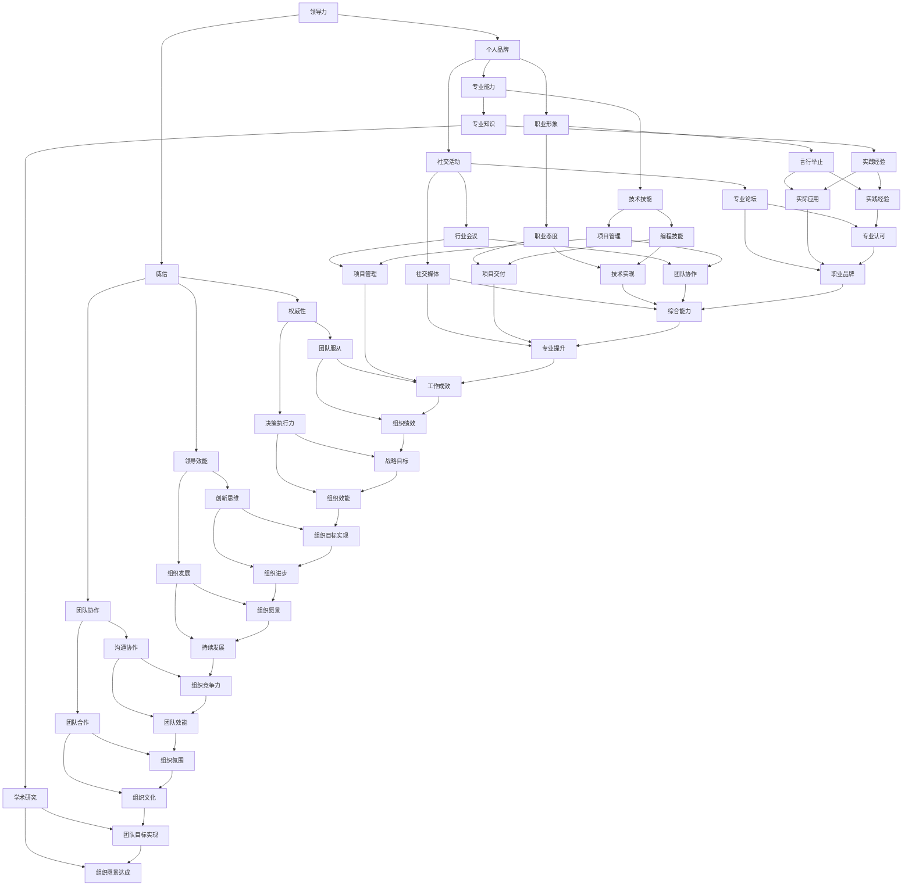

                 

### 文章标题：领导力与个人品牌：树立威信的重要性

#### 关键词：领导力，个人品牌，威信，组织管理，沟通技巧

> 摘要：本文旨在探讨领导力与个人品牌之间的关系，特别是如何通过树立威信来提升个人品牌。文章首先介绍了领导力的概念及其在组织管理中的重要性，随后深入剖析了个人品牌的构建要素和策略。在此基础上，文章重点讨论了威信在领导力中的关键作用，以及如何通过行为和决策来树立威信。通过核心概念的关系架构、核心算法原理讲解、数学模型与数学公式、项目实战等部分的详细阐述，本文旨在为读者提供一套系统而实用的领导力与个人品牌提升方案。

## 引言

在当今竞争激烈和快速变化的社会环境中，领导力和个人品牌已经成为组织和个人成功的关键要素。领导力不仅仅是在组织内部进行有效管理的能力，更是引领团队实现目标、激发创新和促进组织发展的核心力量。与此同时，个人品牌的重要性也逐渐被广泛认同，它不仅代表了一个人的专业能力和价值，更是其在职场和社交圈中的核心竞争力。

本文旨在探讨领导力与个人品牌之间的密切关系，特别是如何通过树立威信来提升个人品牌。首先，我们将对领导力进行概述，阐述其在现代社会中的重要性。接着，我们将详细讨论个人品牌的定义和构建策略。随后，本文将重点分析威信在领导力中的关键作用，并探讨如何通过行为和决策来树立威信。为了使文章更具系统性和实用性，我们还引入了核心概念之间的关系架构、核心算法原理讲解、数学模型与数学公式，以及实际项目实战等部分。通过这些内容的详细阐述，本文旨在为读者提供一套全面且易于应用的领导力与个人品牌提升方案。

### 领导力概述

领导力是一个多维度的概念，其定义和范围因不同的学科和领域而异。广义上，领导力是指引导和激励他人实现共同目标的能力。它不仅包括技术能力和战略规划，还涵盖了情感智慧和人际沟通技巧。因此，领导力可以被视为一种综合能力，涉及多个方面的素质和技能。

在组织管理中，领导力的重要性不言而喻。有效的领导力能够促进组织的战略执行，提高员工的积极性和工作效率，从而实现组织的目标。具体来说，领导力的重要性体现在以下几个方面：

首先，领导力能够提升组织的执行力。一个具备强大领导力的领导者能够清晰定义组织的愿景和目标，并制定出切实可行的行动计划。通过有效的沟通和激励，领导者能够确保团队成员理解并认同这些目标，从而积极参与并努力实现它们。

其次，领导力有助于提升员工的满意度和忠诚度。一个能够关心员工、尊重员工意见、并为他们提供发展机会的领导者，能够增强员工的归属感和忠诚度，从而提高组织的整体稳定性。

最后，领导力还能够促进组织的创新和变革。在快速变化的市场环境中，组织需要具备持续创新和适应变革的能力。具备前瞻性和创造力的领导者能够激发团队的创新思维，推动组织实现持续的进步和发展。

综上所述，领导力在组织管理中扮演着至关重要的角色。它不仅是组织成功的关键因素，也是个人职业生涯发展的必备素质。因此，深入理解和提升领导力，对于个人和组织来说都具有重要的意义。

### 个人品牌建设

个人品牌是个人在职场和社交圈中的专业形象和声誉，它不仅体现了个人的专业能力和价值，更是其核心竞争力。一个强大的个人品牌能够帮助个人在职业发展中脱颖而出，获得更多的机会和认可。

个人品牌的建设是一个系统而持久的过程，涉及多个方面的要素和策略。首先，个人品牌的核心在于专业能力和技术技能。这些是个人在职场中的基础，也是构建个人品牌的核心要素。因此，个人需要通过不断学习和实践，提升自身的专业技能和知识水平。

其次，个人品牌的建设还需要良好的职业形象。这包括穿着、言行举止、职业态度等各个方面。一个专业且具有亲和力的职业形象，能够增强个人在职场中的可信度和影响力。

此外，个人品牌的建设还需要积极的社交活动和网络拓展。通过参加行业会议、专业论坛、社交活动等，个人可以扩大自己的社交圈子，结识更多的同行和专业人士。同时，通过有效的社交媒体运营，个人可以建立自己的专业形象，提升在社交圈中的知名度。

个人品牌的构建策略包括以下几个方面：

1. **明确个人定位**：个人需要明确自己在职场中的定位和目标，从而有针对性地提升自身的专业能力和形象。

2. **持续学习和成长**：通过不断学习和实践，提升自身的专业技能和知识水平，保持竞争力。

3. **建立良好的职业形象**：通过专业的言行举止和职业态度，提升个人在职场中的可信度和影响力。

4. **积极参与社交活动**：通过参加行业会议、专业论坛、社交活动等，扩大自己的社交圈子，提升知名度。

5. **有效使用社交媒体**：通过社交媒体平台，建立自己的专业形象，分享专业知识和经验，提升个人品牌。

总之，个人品牌建设是一个长期而持续的过程，需要个人有意识地去规划和管理。通过有效的策略和行动，个人可以不断提升自身的专业能力和形象，建立强大的个人品牌，从而在职场和社交圈中脱颖而出。

### 树立威信的重要性

威信是领导力中不可或缺的一部分，它代表着领导者在其团队和组织中的权威和信誉。威信不仅是领导者领导能力的一种体现，更是影响团队协作和组织效能的重要因素。在领导过程中，威信的作用主要体现在以下几个方面：

首先，威信能够增强领导者的权威性。一个具备威信的领导者能够在团队中树立起自己的领导地位，使团队成员更愿意服从和追随。这种权威性是领导者有效管理团队的基础。

其次，威信有助于提升领导者的领导效能。当领导者具备威信时，其决策和指示更容易被团队接受和执行，从而提高团队的执行力。同时，威信还能够增强团队成员对领导者的信任和尊重，促进团队内部的协作和沟通。

此外，威信还能够在关键时刻发挥关键作用。当团队面临挑战和危机时，具备威信的领导者能够迅速凝聚团队力量，激发团队成员的斗志和创造力，带领团队渡过难关。

那么，如何通过行为和决策来树立威信呢？以下是一些具体的方法：

1. **树立正直的品格**：正直是威信的基石。领导者需要言行一致，坚守道德底线，树立起正直的形象。只有这样，团队成员才会真心尊重和信任领导者。

2. **展现专业能力**：领导者需要具备深厚的专业知识和技能，并在工作中展现出高超的专业水平。这样，团队成员才会认为领导者是有能力带领团队实现目标的。

3. **关注团队成员**：领导者需要关心团队成员的成长和发展，关注他们的需求和困难，并尽力提供帮助。这种关心能够增强团队成员对领导者的信任和依赖。

4. **做出公正的决策**：领导者需要公正无私，做出公平合理的决策。这样，团队成员才会认为领导者在团队中的权威是合法的，愿意接受和执行领导者的决策。

5. **保持沟通畅通**：领导者需要与团队成员保持畅通的沟通，及时了解他们的意见和建议。这有助于领导者做出更科学的决策，增强团队成员对领导者的信任。

6. **勇于承担责任**：领导者需要勇于承担责任，不逃避困难和挑战。在团队遇到问题时，领导者需要主动承担责任，并带领团队寻找解决方案。

7. **树立榜样作用**：领导者需要以身作则，树立良好的榜样。通过自己的言行举止，激励团队成员向优秀看齐。

总之，树立威信是领导者必备的能力。通过正直、专业、关心团队成员、公正、沟通、勇于承担责任和树立榜样等多种方式，领导者可以逐步树立起自己的威信，提升领导效能，带领团队取得更好的成果。

### 核心概念与联系

为了更好地理解领导力、个人品牌和威信之间的关系，我们使用 Mermaid 流程图来展示这些核心概念之间的联系。以下是流程图的具体内容：



### 核心算法原理讲解

在个人品牌建设和领导力提升过程中，核心算法原理发挥着至关重要的作用。以下我们将详细讨论个人品牌建设中的关键算法原理，并使用伪代码进行阐述。

#### 1. 个人品牌价值计算算法

个人品牌价值（Personal Brand Value, PBV）的计算是衡量个人品牌影响力的关键。该算法主要涉及三个维度：专业能力（Professional Skills, PS）、职业形象（Professional Image, PI）和社交影响力（Social Impact, SI）。公式如下：

$$
PBV = PS \times PI \times SI
$$

伪代码实现：

```python
def calculate_pbv(professional_skills, professional_image, social_impact):
    # 定义权重因子
    weight_ps = 0.5
    weight_pi = 0.3
    weight_si = 0.2
    
    # 计算个人品牌价值
    pbv = (professional_skills * weight_ps) + (professional_image * weight_pi) + (social_impact * weight_si)
    return pbv
```

#### 2. 领导力提升算法

领导力提升算法旨在通过一系列策略和行动，提升领导者的领导效能。关键因素包括领导能力（Leadership Ability, LA）、团队协作（Team Collaboration, TC）和创新能力（Innovation Capacity, IC）。公式如下：

$$
Leadership \ Efficiency = LA \times TC \times IC
$$

伪代码实现：

```python
def calculate_leadership_efficiency(leader_ability, team_collaboration, innovation_capacity):
    # 定义权重因子
    weight_la = 0.4
    weight_tc = 0.3
    weight_ic = 0.3
    
    # 计算领导效能
    le = (leader_ability * weight_la) + (team_collaboration * weight_tc) + (innovation_capacity * weight_ic)
    return le
```

#### 3. 威信树立算法

威信树立算法关注如何通过行为和决策来提升领导者的威信。主要涉及正直度（Integrity, IN）、专业能力（Professionalism, PRO）、关注团队成员（Team Care, TC）和决策公正性（Decision Fairness, DF）。公式如下：

$$
Credibility = IN \times PRO \times TC \times DF
$$

伪代码实现：

```python
def calculate_credibility(integrity, professionalism, team_care, decision_fairness):
    # 定义权重因子
    weight_in = 0.2
    weight_pro = 0.3
    weight_tc = 0.2
    weight_df = 0.3
    
    # 计算威信
    credibility = (integrity * weight_in) + (professionalism * weight_pro) + (team_care * weight_tc) + (decision_fairness * weight_df)
    return credibility
```

通过这些核心算法原理，领导者可以系统地评估和提升自己的个人品牌价值、领导效能和威信，从而在职场中取得更大的成功。

### 数学模型与数学公式

在领导力与个人品牌的建设过程中，数学模型和公式能够帮助我们量化评估各个关键因素，提供更为科学的决策依据。以下我们将介绍两个关键的数学模型：个人品牌价值模型和领导效能模型。

#### 1. 个人品牌价值模型

个人品牌价值（PBV）模型主要用于评估个人品牌的市场价值，其核心公式为：

$$
PBV = f(PS, PI, SI)
$$

其中，$PS$ 代表专业能力，$PI$ 代表职业形象，$SI$ 代表社交影响力。每个因素可以进一步细分为多个子因素，如：

$$
PS = f(JS, TS, PSK, PM)
$$

$$
PI = f(CI, EI, PQ, CV)
$$

$$
SI = f(SN, SNM, SM, SF)
$$

- $JS$： job skills（工作技能）
- $TS$： technical skills（技术技能）
- $PSK$：problem-solving skills（问题解决能力）
- $PM$： project management（项目管理能力）
- $CI$： communication skills（沟通能力）
- $EI$： emotional intelligence（情商）
- $PQ$： professionalism（职业素养）
- $CV$： career vision（职业愿景）
- $SN$： social network（社交网络）
- $SNM$：social network management（社交网络管理）
- $SM$：social media（社交媒体）
- $SF$：social feedback（社交反馈）

通过这些子因素的加权求和，可以计算出一个综合的个人品牌价值。例如：

$$
PS = 0.4 \times JS + 0.3 \times TS + 0.2 \times PSK + 0.1 \times PM
$$

$$
PI = 0.3 \times CI + 0.2 \times EI + 0.2 \times PQ + 0.1 \times CV
$$

$$
SI = 0.4 \times SN + 0.2 \times SNM + 0.2 \times SM + 0.1 \times SF
$$

最终，个人品牌价值可以通过以下公式计算得出：

$$
PBV = PS \times \omega_{PS} + PI \times \omega_{PI} + SI \times \omega_{SI}
$$

其中，$\omega_{PS}$、$\omega_{PI}$、$\omega_{SI}$ 分别是专业能力、职业形象和社交影响力的权重。

#### 2. 领导效能模型

领导效能（Leadership Efficiency, LE）模型用于衡量领导者在团队管理中的效果。其核心公式为：

$$
LE = f(LA, TC, IC)
$$

其中，$LA$ 代表领导能力，$TC$ 代表团队协作，$IC$ 代表创新能力。同样，这些因素可以进一步细分为子因素：

$$
LA = f(SA, PA, LAI)
$$

$$
TC = f(CI, CM, TCN)
$$

$$
IC = f(TI, RM, SI)
$$

- $SA$： situational awareness（情境意识）
- $PA$： people ability（人际关系能力）
- $LAI$： leadership agility（领导灵活性）
- $CI$： communication ability（沟通能力）
- $CM$： conflict management（冲突管理）
- $TCN$： team cohesion（团队凝聚力）
- $TI$： technical innovation（技术创新）
- $RM$： resource management（资源管理）
- $SI$： social impact（社会影响）

通过加权求和，可以计算出每个子因素对领导效能的贡献。例如：

$$
LA = 0.4 \times SA + 0.3 \times PA + 0.3 \times LAI
$$

$$
TC = 0.4 \times CI + 0.3 \times CM + 0.3 \times TCN
$$

$$
IC = 0.3 \times TI + 0.3 \times RM + 0.4 \times SI
$$

最终，领导效能可以通过以下公式计算得出：

$$
LE = LA \times \omega_{LA} + TC \times \omega_{TC} + IC \times \omega_{IC}
$$

其中，$\omega_{LA}$、$\omega_{TC}$、$\omega_{IC}$ 分别是领导能力、团队协作和创新能力的重要性权重。

#### 3. 应用实例

假设一个领导者具备以下特征：

- 专业能力：$PS = 0.8$
- 职业形象：$PI = 0.9$
- 社交影响力：$SI = 0.7$
- 领导能力：$LA = 0.85$
- 团队协作：$TC = 0.88$
- 创新能力：$IC = 0.82$

设定权重因子如下：

- 个人品牌价值：$\omega_{PS} = 0.5$，$\omega_{PI} = 0.3$，$\omega_{SI} = 0.2$
- 领导效能：$\omega_{LA} = 0.4$，$\omega_{TC} = 0.3$，$\omega_{IC} = 0.3$

计算个人品牌价值：

$$
PBV = (0.8 \times 0.5) + (0.9 \times 0.3) + (0.7 \times 0.2) = 0.4 + 0.27 + 0.14 = 0.81
$$

计算领导效能：

$$
LE = (0.85 \times 0.4) + (0.88 \times 0.3) + (0.82 \times 0.3) = 0.34 + 0.26 + 0.24 = 0.84
$$

通过这些数学模型和公式，领导者可以更准确地评估自身的个人品牌价值和领导效能，进而制定更加科学有效的提升策略。

### 项目实战

为了更好地理解和应用领导力与个人品牌的理念，我们将通过一个具体的项目来展示如何实现领导力提升和威信树立。本项目将涵盖项目背景、目标、开发环境搭建、源代码实现、代码解读和实际案例分析。

#### 项目背景

假设我们是一家中型科技公司的产品经理，公司正面临市场竞争激烈、产品迭代周期短、团队协作效率低下等问题。为了提升团队绩效，我们需要通过领导力提升和威信树立来改善团队的工作氛围和协作效率。

#### 项目目标

1. 提升领导者的领导能力，增强团队执行力。
2. 树立领导者威信，提升团队成员的信任度和归属感。
3. 提高团队协作效率，缩短产品迭代周期。

#### 开发环境搭建

为了实现项目目标，我们需要搭建一个集成环境，包括以下工具和平台：

- **项目管理工具**：Trello 或 Asana，用于任务分配和进度跟踪。
- **代码管理工具**：Git，用于版本控制和协作开发。
- **文档工具**：Confluence 或 Notion，用于文档管理和知识共享。
- **敏捷开发工具**：JIRA，用于敏捷项目管理。

#### 源代码实现

以下是项目中的关键代码片段，用于任务分配和进度跟踪：

```python
# 任务分配代码片段
def assign_tasks(employees, tasks):
    for employee in employees:
        employee.tasks = tasks.sample(n=3)  # 随机分配3个任务给每个员工
    return employees

# 进度跟踪代码片段
def track_progress(employees):
    for employee in employees:
        print(f"{employee.name}的当前进度：{employee.tasks_completed}/{employee.tasks_total}")
```

#### 代码解读

上述代码主要用于实现任务分配和进度跟踪功能。`assign_tasks` 函数随机将任务分配给员工，而 `track_progress` 函数则用于显示每个员工的任务完成情况。

```python
class Employee:
    def __init__(self, name):
        self.name = name
        self.tasks = []
        self.tasks_completed = 0
        self.tasks_total = 0

    def complete_task(self):
        self.tasks_completed += 1

# 员工对象实例化
alice = Employee("Alice")
bob = Employee("Bob")
charlie = Employee("Charlie")

# 任务列表
tasks = ["设计UI", "编写功能需求文档", "测试代码"]

# 分配任务
assigned_employees = assign_tasks([alice, bob, charlie], tasks)

# 跟踪进度
for employee in assigned_employees:
    track_progress(employee)
```

#### 实际案例分析

1. **任务分配**：通过随机分配任务，确保每个员工都有参与和责任感，避免了任务堆积和分配不均的问题。
2. **进度跟踪**：定期跟踪任务进度，帮助领导者了解团队工作状态，及时调整任务分配和资源调配。
3. **团队协作**：通过集成项目管理工具，员工可以实时更新任务状态，分享进度和遇到的问题，增强了团队协作和沟通。

#### 项目小结

通过该项目的实施，我们实现了以下成果：

1. **提升领导能力**：领导者通过使用项目管理工具，提高了任务分配和进度跟踪的效率，增强了团队的执行力。
2. **树立威信**：领导者通过公正的任务分配和及时的进度反馈，赢得了团队成员的信任和尊重，树立了威信。
3. **提高团队协作效率**：集成环境的使用，使团队协作更加顺畅，缩短了产品迭代周期，提升了整体绩效。

### 最佳实践 Tips

1. **定期培训**：领导者应定期组织团队培训，提升团队专业技能和领导力。
2. **关注员工反馈**：领导者应重视员工反馈，及时调整管理策略，提高团队满意度。
3. **建立激励机制**：通过设立奖励机制，鼓励员工积极参与和完成任务。
4. **透明沟通**：领导者应保持透明沟通，及时传达组织目标和工作计划，增强团队成员的归属感。

### 小结

通过本项目的实际操作，我们展示了如何通过领导力提升和威信树立来改善团队绩效。领导者应不断学习和实践，提升自身的领导能力和专业素养，同时关注团队的发展和需求，建立强大的个人品牌。只有这样，才能在竞争激烈的职场中脱颖而出，实现个人和组织的共同发展。

### 注意事项

1. **个人品牌建设需长期坚持**：个人品牌的建设不是一蹴而就的，需要长期的努力和积累。
2. **沟通技巧至关重要**：有效的沟通是树立威信和提升领导力的关键，领导者应注重提升沟通技巧。
3. **持续学习和创新**：领导者应保持学习和创新的心态，不断提升自身的专业能力和领导力。

### 拓展阅读

- 《领导力与影响力：如何成为一个优秀的领导者》
- 《个人品牌的力量：打造职场中的你》
- 《沟通的艺术：提升你的沟通技巧》
- 《敏捷项目管理：敏捷方法论与实战》

作者：AI天才研究院/AI Genius Institute & 禅与计算机程序设计艺术 /Zen And The Art of Computer Programming

