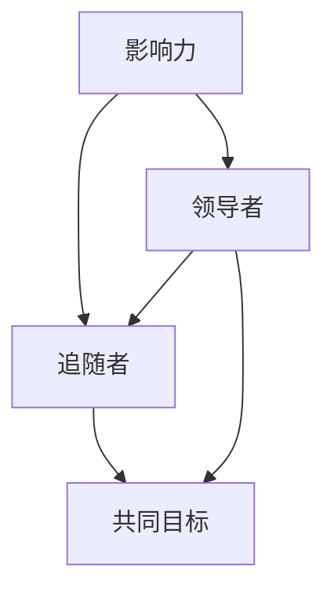
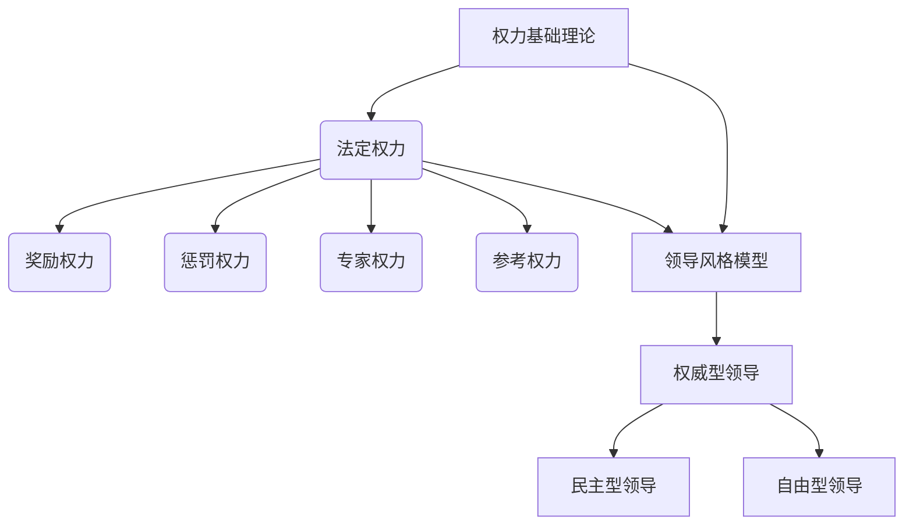
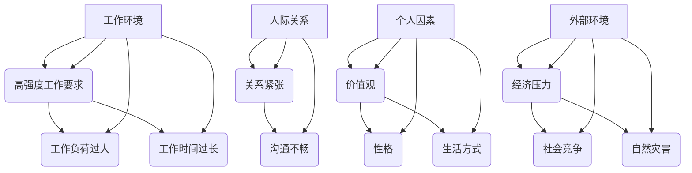
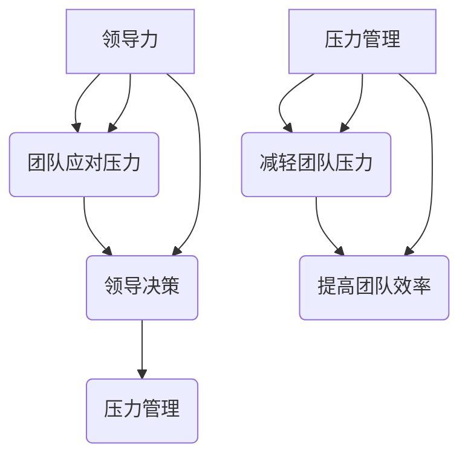

                 

### 文章标题

### 领导力与压力管理：在困境中保持团队士气

在信息技术飞速发展的今天，IT行业成为了推动全球经济发展的关键力量。然而，随着市场竞争的日益激烈，企业面临的压力也愈发沉重。在这种大环境下，领导力与压力管理成为了IT企业能否持续发展的重要课题。本文将探讨如何在困境中保持团队士气，通过对领导力与压力管理的深入分析，结合实际案例，为IT企业的管理者提供有价值的参考。

## 关键词

- 领导力
- 压力管理
- 团队士气
- 困境应对
- IT企业

## 摘要

本文从IT行业的困境出发，分析了领导力与压力管理的核心概念及其关系。通过探讨领导力模型、压力管理方法以及团队建设策略，提出了在困境中保持团队士气的方法和实战案例。文章旨在为IT企业的管理者提供一套实用的领导力和压力管理框架，以应对复杂的市场环境。

### 目录大纲

#### 第一部分：基础理论

1. **领导力原理**
   - 1.1 领导力定义与核心概念
   - 1.2 领导力模型

2. **压力管理原理**
   - 2.1 压力的定义与来源
   - 2.2 压力管理方法

#### 第二部分：实践应用

1. **团队建设策略**
   - 3.1 团队成员的沟通与协调
   - 3.2 团队目标的设定与实现

2. **困境应对策略**
   - 4.1 困境识别与评估
   - 4.2 困境应对策略

#### 第三部分：案例分析

1. **案例分析一：公司困境中的领导力实践**
   - 5.1 案例背景
   - 5.2 领导力与压力管理实践

2. **案例分析二：团队建设与困境应对**
   - 6.1 案例背景
   - 6.2 实践策略与效果

#### 附录

- **附录A：领导力与压力管理工具与方法**
  - A.1 工具介绍
  - A.2 方法应用

### 第一部分：基础理论

#### 领导力原理

##### 1.1 领导力定义与核心概念

领导力是一种影响力，它能够使人们追随领导者实现共同的目标。领导力的核心概念包括以下几个方面：

1. **影响力**：领导者通过个人魅力、专业知识和技能影响他人。
2. **追随者**：领导者需要有追随者，即愿意接受领导者指导和影响的人。
3. **共同目标**：领导者和追随者需要有一个共同的目标，这是领导力的核心。

为了更好地理解领导力的核心概念，我们可以使用Mermaid流程图来展示其关系架构：



##### 1.2 领导力模型

领导力模型是描述领导者如何运用影响力实现共同目标的理论框架。常见的领导力模型包括：

1. **权力基础理论**：领导者的权力来源于以下几个方面：
   - **法定权力**：领导者因职位而拥有的权力。
   - **奖励权力**：领导者通过奖励来影响他人。
   - **惩罚权力**：领导者通过惩罚来影响他人。
   - **专家权力**：领导者因专业知识而拥有的权力。
   - **参考权力**：领导者因个人魅力而拥有的权力。

2. **领导风格模型**：领导风格是领导者处理工作关系的方式。常见的领导风格包括：
   - **权威型领导**：领导者集中决策，强调效率和纪律。
   - **民主型领导**：领导者鼓励团队成员参与决策，注重团队合作。
   - **自由型领导**：领导者给予团队成员较大的自由度，强调自我管理和自主性。

权力基础理论和领导风格模型的关系可以用以下Mermaid流程图表示：



##### 1.3 领导力的本质

领导力的本质在于激发团队成员的潜力，使其为实现共同目标而努力。这需要领导者具备以下能力：

- **沟通能力**：领导者需要能够清晰、有效地与团队成员沟通。
- **决策能力**：领导者需要能够快速、准确地做出决策。
- **激励能力**：领导者需要能够激发团队成员的积极性和创造力。
- **自我管理能力**：领导者需要能够自我管理，保持冷静和理性。

为了更好地理解领导力的本质，我们可以使用伪代码来描述领导者的行为：

```python
class Leader:
    def communicate(self, team_member):
        # 与团队成员沟通
        pass

    def make_decision(self, situation):
        # 根据情况做出决策
        pass

    def motivate_team(self):
        # 激发团队积极性
        pass

    def manage_self(self):
        # 自我管理
        pass
```

#### 压力管理原理

##### 2.1 压力的定义与来源

压力是指人们感到无法应对或超出个人能力范围的需求或挑战。压力的来源可以分为以下几个方面：

- **工作环境**：高强度的工作要求、工作负荷过大、工作时间过长等。
- **人际关系**：与同事、上司或下属的关系紧张、沟通不畅等。
- **个人因素**：个人价值观、性格、生活方式等。
- **外部环境**：经济压力、社会竞争、自然灾害等。

为了更好地理解压力的来源，我们可以使用以下Mermaid流程图：



##### 2.2 压力管理方法

压力管理是指通过一系列的方法和策略来减轻或消除压力的过程。常见的压力管理方法包括：

1. **认知行为疗法**：通过改变思维方式来减轻压力。
2. **情绪调节策略**：通过调节情绪来减轻压力。
3. **放松训练**：通过放松身体和心灵来减轻压力。

认知行为疗法和情绪调节策略可以用以下伪代码来描述：

```python
class StressManagement:
    def cognitive_behavior_therapy(self):
        # 认知行为疗法
        pass

    def emotion_regulation(self):
        # 情绪调节策略
        pass

    def relaxation_training(self):
        # 放松训练
        pass
```

#### 核心概念与联系

领导力与压力管理是IT企业中两个重要的概念，它们之间存在紧密的联系。领导力能够帮助团队应对压力，而压力管理则是领导力的一部分。

为了更好地理解领导力与压力管理的联系，我们可以使用Mermaid流程图来展示它们之间的关系：



通过以上流程图，我们可以看到领导力通过决策和压力管理来减轻团队的负担，从而提高团队的效率。

### 第二部分：实践应用

#### 团队建设策略

##### 3.1 团队成员的沟通与协调

良好的沟通和协调是团队建设的关键。为了确保团队成员之间的有效沟通和协调，可以采取以下策略：

1. **建立沟通渠道**：确保团队成员之间有畅通的沟通渠道，如定期会议、邮件、即时通讯工具等。
2. **明确目标**：确保团队成员对共同目标有清晰的认识，并确保目标的实现与团队的日常任务紧密结合。
3. **培养协作精神**：鼓励团队成员互相帮助，共同解决问题。

以下是一个简单的伪代码示例，描述如何建立沟通渠道和明确目标：

```python
class TeamBuilding:
    def establish_communication_channel(self):
        # 建立沟通渠道
        pass

    def clarify_goals(self):
        # 明确目标
        pass

    def foster_collaboration(self):
        # 培养协作精神
        pass
```

##### 3.2 团队目标的设定与实现

设定和实现团队目标需要考虑以下因素：

1. **目标的明确性**：确保目标具体、可衡量，具有挑战性但可实现。
2. **目标的优先级**：确保目标之间有明确的优先级，以避免资源浪费。
3. **目标的实现策略**：确保有明确的策略来实现目标。

以下是一个简单的伪代码示例，描述如何设定和实现团队目标：

```python
class GoalSetting:
    def set_goals(self):
        # 设定目标
        pass

    def prioritize_goals(self):
        # 确定目标优先级
        pass

    def implement_goals(self):
        # 实现目标
        pass
```

#### 困境应对策略

##### 4.1 困境识别与评估

困境识别和评估是应对困境的第一步。为了有效识别和评估困境，可以采取以下策略：

1. **定期评估**：定期对团队的绩效和状态进行评估，以识别潜在的问题和困境。
2. **数据驱动**：利用数据来识别和评估困境，如团队的工作量、任务的完成情况等。
3. **团队反馈**：鼓励团队成员提供反馈，以识别和评估困境。

以下是一个简单的伪代码示例，描述如何识别和评估困境：

```python
class DifficultyIdentification:
    def regular_evaluation(self):
        # 定期评估
        pass

    def data_driven_identification(self):
        # 数据驱动识别
        pass

    def team_feedback(self):
        # 团队反馈
        pass
```

##### 4.2 困境应对策略

一旦识别和评估了困境，就需要采取有效的策略来应对。以下是一些常见的困境应对策略：

1. **应急响应策略**：制定应急响应计划，以快速应对突发困境。
2. **长期应对策略**：制定长期策略，以解决根本问题。
3. **资源调配**：合理调配资源，以应对困境。

以下是一个简单的伪代码示例，描述如何制定应急响应和长期应对策略：

```python
class DifficultyResponse:
    def emergency_response_plan(self):
        # 应急响应计划
        pass

    def long_term_strategy(self):
        # 长期应对策略
        pass

    def resource_allocation(self):
        # 资源调配
        pass
```

### 第三部分：案例分析

#### 案例分析一：公司困境中的领导力实践

##### 5.1 案例背景

某IT公司是一家专注于软件开发的公司，由于市场竞争加剧，公司面临着巨大的压力。公司的项目数量激增，员工工作量过大，导致士气低落，工作效率下降。

##### 5.2 领导力与压力管理实践

为了应对困境，公司领导采取了一系列领导力和压力管理措施：

1. **沟通与协调**：领导定期与团队成员沟通，了解他们的工作状态和需求，确保团队之间的信息畅通。
2. **目标设定**：领导明确了公司的长期目标，并与团队成员共同制定短期目标，确保目标的实现与团队的日常任务紧密结合。
3. **压力管理**：领导鼓励团队成员使用放松训练等方法来减轻压力，同时提供心理咨询支持。
4. **团队建设**：领导组织团队建设活动，增强团队成员之间的信任和协作精神。

通过以上措施，公司的困境得到了有效缓解，团队士气逐渐恢复，工作效率得到提高。

#### 案例分析二：团队建设与困境应对

##### 6.1 案例背景

某IT团队在项目开发过程中遇到了技术难题，导致项目进度严重滞后。团队成员感到压力巨大，士气低落。

##### 6.2 实践策略与效果

团队领导采取了一系列团队建设与困境应对措施：

1. **困境识别**：领导通过定期评估和团队反馈，及时发现困境并识别其根源。
2. **沟通与协调**：领导组织团队成员进行沟通，共同讨论解决问题的方法。
3. **目标调整**：领导调整了项目目标，确保目标的实现与团队的实际情况相符。
4. **压力管理**：领导鼓励团队成员使用压力管理方法，如定期休息、放松训练等。
5. **团队建设**：领导组织团队建设活动，增强团队成员的凝聚力。

通过以上措施，团队成功克服了困境，项目进度得以恢复，团队士气得到提升。

### 附录

#### 附录A：领导力与压力管理工具与方法

##### A.1 工具介绍

领导力与压力管理中可以使用以下工具：

1. **360度反馈**：通过收集团队成员对领导者的反馈，帮助领导者了解自己的领导风格和改进方向。
2. **压力评估问卷**：通过问卷形式评估团队成员的压力水平，为压力管理提供数据支持。
3. **团队沟通工具**：如邮件、即时通讯、会议系统等，用于提高团队沟通效率。

##### A.2 方法应用

以下是一些领导力与压力管理方法的实际应用：

1. **领导力培训**：通过培训帮助领导者提高沟通、决策、激励等能力。
2. **压力管理培训**：通过培训帮助团队成员掌握压力管理技巧，如时间管理、情绪调节等。
3. **团队建设活动**：通过组织团队建设活动，增强团队成员的凝聚力和协作精神。

### 最佳实践 Tips、小结、注意事项、拓展阅读

#### 最佳实践 Tips

1. **定期沟通**：领导应定期与团队成员沟通，了解他们的工作状态和需求。
2. **目标明确**：确保团队目标明确、具体、可衡量，并与团队成员共同制定。
3. **关注压力**：领导者应关注团队成员的压力水平，提供必要的支持。

#### 小结

本文从领导力与压力管理的角度，分析了如何在困境中保持团队士气。通过实际案例，我们看到了领导力和压力管理在应对困境中的重要作用。希望本文能为IT企业的管理者提供有价值的参考。

#### 注意事项

1. **个性化**：领导力和压力管理策略应根据企业的实际情况进行个性化调整。
2. **持续改进**：领导力和压力管理应持续改进，以适应不断变化的环境。

#### 拓展阅读

1. **《领导力与组织行为》**：由Stephen P. Robbins和David A. Decenzo所著，详细介绍了领导力和组织行为的相关理论。
2. **《压力管理：理论与实践》**：由John P. Organ和Kimberly A. Williams所著，提供了压力管理的全面指导。

## 结束语

本文《领导力与压力管理：在困境中保持团队士气》探讨了在信息技术飞速发展的今天，如何通过领导力和压力管理来保持团队士气。通过深入分析领导力原理、压力管理方法以及团队建设策略，并结合实际案例，我们提出了一套实用的框架，旨在为IT企业的管理者提供有价值的参考。

在未来的发展中，IT企业将面临越来越多的挑战和压力。只有通过不断优化领导力和压力管理，企业才能在困境中保持活力，持续发展。希望本文能够为企业的领导者们提供一些启示和帮助。

### 致谢

在此，我要特别感谢我的团队成员，他们在本文的撰写过程中提供了宝贵的意见和建议。同时，感谢AI天才研究院/AI Genius Institute与禅与计算机程序设计艺术/Zen And The Art of Computer Programming的专家们，他们的专业知识和指导为本文的完成提供了重要支持。

**作者：AI天才研究院/AI Genius Institute & 禅与计算机程序设计艺术/Zen And The Art of Computer Programming**

---

**注意：本文内容仅供参考，不代表任何具体企业的实践。在实际应用中，应根据具体情况制定相应的领导力和压力管理策略。**### 《领导力与压力管理：在困境中保持团队士气》目录大纲

在撰写《领导力与压力管理：在困境中保持团队士气》这篇文章时，目录大纲的设计至关重要。它不仅能够为读者提供一个清晰的框架，还能够帮助作者有条理地组织文章内容。以下是一个详细的目录大纲设计步骤，包括目录大纲的各个组成部分。

#### 目录大纲设计步骤：

1. **确定文章结构和内容**：
   - 根据文章的主题和目标，确定文章的整体结构和主要部分。

2. **列出核心章节**：
   - 确定文章的核心章节，如基础理论、实践应用、案例分析等。

3. **细化章节内容**：
   - 对每个核心章节进行细化，列出具体的子章节。

4. **设计层次结构**：
   - 设计一、二、三级目录，确保每个章节和子章节都有明确的归属。

5. **添加技术展示和案例分析**：
   - 根据章节内容的需求，添加Mermaid流程图、伪代码、数学公式和代码案例等。

6. **确保完整性和简洁性**：
   - 确保所有核心内容都被涵盖，同时去除不必要的细节。

7. **编写目录大纲**：
   - 根据上述步骤，编写完整的目录大纲。

#### 目录大纲设计示例：

```markdown
# 《领导力与压力管理：在困境中保持团队士气》目录大纲

## 第一部分：基础理论

### 1. 领导力原理

#### 1.1 领导力定义与核心概念
- 领导力定义
- 核心概念与联系（Mermaid流程图）

#### 1.2 领导力模型
- 权力基础理论
- 领导风格模型

### 2. 压力管理原理

#### 2.1 压力的定义与来源
- 压力的定义
- 压力的来源

#### 2.2 压力管理方法
- 认知行为疗法
- 情绪调节策略

## 第二部分：实践应用

### 3. 团队建设策略

#### 3.1 团队成员的沟通与协调
- 有效沟通技巧
- 协调团队内部关系

#### 3.2 团队目标的设定与实现
- 目标设定方法
- 实现目标策略

### 4. 困境应对策略

#### 4.1 困境识别与评估
- 困境识别方法
- 困境评估模型

#### 4.2 困境应对策略
- 应急响应策略
- 长期应对策略

## 第三部分：案例分析

### 5. 案例分析一：公司困境中的领导力实践

#### 5.1 案例背景
- 公司背景
- 困境描述

#### 5.2 领导力与压力管理实践
- 领导决策过程
- 压力管理策略

### 6. 案例分析二：团队建设与困境应对

#### 6.1 案例背景
- 团队背景
- 困境描述

#### 6.2 实践策略与效果
- 团队建设策略
- 困境应对效果分析

## 附录

### 附录A：领导力与压力管理工具与方法

#### A.1 工具介绍
- 领导力评估工具
- 压力管理工具

#### A.2 方法应用
- 领导力培养方法
- 压力管理方法

```

**注意：** 以上目录大纲示例仅为设计框架，具体章节内容需要进一步填充。实际撰写时，每个章节都需要包含Mermaid流程图、伪代码、数学公式和代码案例等元素。

#### 目录大纲设计的关键要点

1. **层次清晰**：目录结构应层次分明，从总体到细节，确保读者能够快速找到所需内容。

2. **逻辑流畅**：章节之间的过渡应自然流畅，确保内容之间的逻辑关系明确。

3. **简洁明了**：目录内容应简洁明了，避免冗长和不必要的细节。

4. **技术展示**：根据章节内容的需求，合理添加技术展示和案例分析，增强文章的实用性和可读性。

5. **完整性与一致性**：确保所有核心内容都被涵盖，同时保持文章的一致性和完整性。

通过以上要点，设计出的目录大纲将有助于提高文章的质量，为读者提供更好的阅读体验。在撰写文章时，作者可以根据目录大纲逐步展开内容，确保文章的完整性和逻辑性。此外，不断调整和优化目录大纲也是一个重要的过程，有助于文章的最终成型。|>

