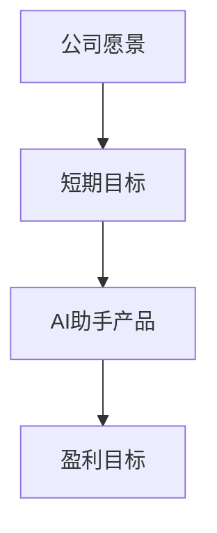
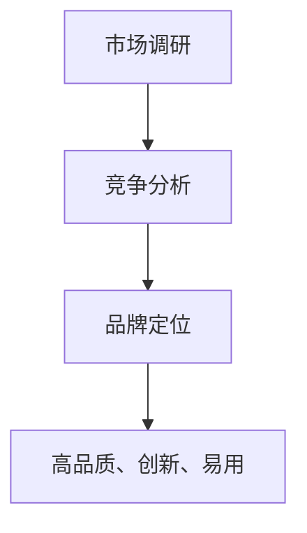
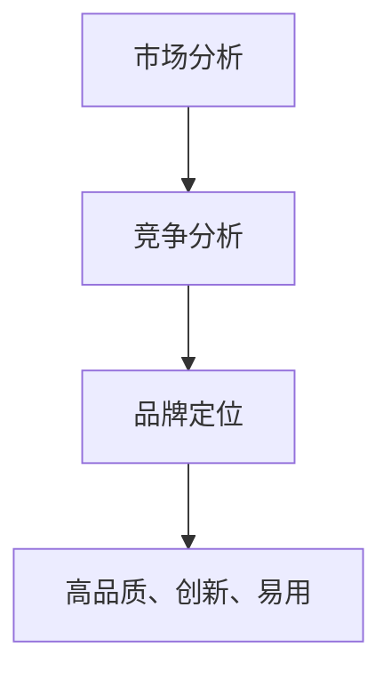

                 

### 引言：背景介绍与目的

在当今快速变化和高度竞争的商业环境中，领导力和品牌建设成为企业成功的关键因素。领导力不仅关乎个人的能力，更关乎如何带领团队实现共同目标。品牌建设则涉及企业如何塑造和传递其独特的价值主张，从而在市场中获得竞争优势。

本文旨在探讨领导力与品牌建设之间的内在联系，并分析如何通过提升团队影响力来推动品牌建设。具体来说，我们将从以下几个方面展开讨论：

1. **领导力基础理论**：介绍领导力的定义、特征、理论发展以及领导风格与组织文化的关系。
2. **团队影响力构建**：探讨构建团队影响力的要素、实践策略以及持续提升的关键。
3. **品牌建设策略**：分析品牌建设的重要性、关键要素和具体策略。
4. **领导力与品牌的双轮驱动**：探讨领导力与品牌建设的相互促进作用以及如何在实践中实现这一目标。
5. **领导力在品牌传播中的应用**：分析领导力在品牌传播中的具体应用，以及如何通过领导力来提升品牌影响力。
6. **案例分析**：通过实际案例来展示领导力与品牌建设相结合的成效。
7. **实战指导**：提供具体的实战指导，帮助读者在实际工作中提升领导力和品牌建设能力。

通过以上步骤，我们将逐步揭示领导力与品牌建设之间的紧密联系，并探讨如何在实际中有效地应用这些理论，从而提升团队影响力和品牌价值。

---

#### 关键词

- 领导力
- 品牌建设
- 团队影响力
- 领导风格
- 组织文化
- 品牌传播
- 实战指导

---

#### 摘要

本文通过系统的分析和实例讨论，探讨了领导力与品牌建设之间的紧密联系。首先，介绍了领导力的基础理论，包括其定义、特征和理论发展。接着，详细阐述了构建团队影响力的要素和实践策略，以及品牌建设的重要性和关键策略。随后，探讨了领导力与品牌建设的双轮驱动机制，分析了领导力在品牌传播中的应用。通过实际案例，展示了领导力与品牌建设相结合的成效。最后，提供了具体的实战指导，帮助读者在实际工作中提升领导力和品牌建设能力。

---

#### 第1章：领导力基础理论

领导力作为企业管理的重要部分，是推动团队和组织实现目标的核心力量。本章将深入探讨领导力的定义、特征、理论发展以及领导风格与组织文化的关系，为后续章节的分析提供理论基础。

## 1.1 领导力定义与特征

### 1.1.1 领导力的多种定义

领导力是一个多维度的概念，不同学者从不同角度给出了不同的定义。比如，彼得·德鲁克（Peter Drucker）认为领导力是一种使他人愿意追随你实现共同目标的能力。而赫赛（Hersey）和布兰查德（Blanchard）则将领导力定义为一种激励他人、指导和协调其工作以达到组织目标的过程。此外，约翰·肯尼斯·加德纳（John Kenneth Galbraith）将领导力视为一种激发他人潜力、创造卓越表现的能力。

这些定义虽然表述不同，但都强调了领导力与追随者、目标实现和激励之间的紧密关系。我们可以综合这些观点，将领导力定义为一个动态过程，它通过影响、激励和指导他人，实现团队和组织的共同目标。

### 1.1.2 领导力的核心特征

领导力的核心特征包括以下几个方面：

1. **影响力**：领导力不仅仅是职位赋予的权威，更重要的是通过影响力和魅力来引导和激励团队成员。
2. **目标导向**：有效的领导力必须具有明确的目标，并能够将团队凝聚在共同的目标下。
3. **沟通能力**：领导力需要良好的沟通技巧，包括清晰的表达、倾听和反馈。
4. **决策能力**：领导者在面对复杂问题和不确定性时，需要能够做出明智的决策。
5. **情商**：领导力中的情商包括自我认知、自我调节、同理心和社交技能，这些都是成功领导者的必备素质。
6. **创新思维**：领导者需要具备创新思维，能够在不断变化的环境中寻找新的解决方案。

### 1.1.3 领导力与传统管理的区别

传统管理强调规范和制度，侧重于任务分配和流程控制。而领导力则更注重人，强调激励、影响和启发。传统管理侧重于维持现状，而领导力则关注变革和未来。简而言之，管理是确保事情按照既定方式顺利进行，而领导力则是推动组织不断进步和创新。

## 1.2 领导力理论概述

### 1.2.1 领导力发展的历史阶段

领导力理论的发展经历了多个阶段：

1. **特质理论**（Trait Theory）：早期领导力研究主要集中在领导者个人的特质上，如智力、自信和决断力。然而，该理论未能解释为什么某些具有相同特质的个体在某些情境中表现出色，而在其他情境中却表现不佳。

2. **行为理论**（Behavioral Theory）：随着研究的深入，学者们开始关注领导者的行为。这一理论认为，领导力不仅与个人特质有关，更与领导者的具体行为有关。行为理论提出了不同的领导风格，如民主领导、独裁领导和参与式领导。

3. **权变理论**（Contingency Theory）：权变理论认为，没有一种通用的领导风格适用于所有情境。领导者应根据具体情况和环境选择最合适的领导风格。该理论强调了领导风格与情境之间的互动关系。

4. **情境理论**（Situational Theory）：情境理论进一步发展了权变理论，强调领导者需要根据具体情境灵活调整领导风格。该理论提出了一些具体的情境因素，如任务复杂性、团队成熟度和目标明确性，以指导领导者的行为。

### 1.2.2 主要的领导力理论

以下是对几种主要领导力理论的详细阐述：

#### 1.2.2.1 特质理论

特质理论认为，领导者天生具备某些特定的个人特质，这些特质使他们在领导岗位上表现出色。常见的领导特质包括：

- **智力**：领导者需要具备较高的智力水平，能够理解和处理复杂问题。
- **自信**：领导者必须自信，能够坚定地面对挑战和不确定性。
- **决断力**：领导者需要能够在紧急情况下迅速做出决策。

然而，特质理论存在一定的局限性，因为并非所有成功的领导者都具备相同的特质，并且某些特质在特定情境下可能并不适用。

#### 1.2.2.2 行为理论

行为理论关注领导者的具体行为，认为领导力可以通过学习和模仿来培养。该理论提出了几种典型的领导行为：

- **任务导向行为**：领导者关注任务的完成，注重细节和效率。
- **关系导向行为**：领导者关注团队成员的情感和需求，致力于建立良好的团队关系。

行为理论认为，领导行为可以分为以下几个方面：

- **民主领导**：领导者鼓励团队成员参与决策，重视团队合作。
- **独裁领导**：领导者集中决策权，命令式地指导团队成员。
- **参与式领导**：领导者与团队成员共同讨论决策，并鼓励团队成员提出建议。

#### 1.2.2.3 权变理论

权变理论认为，没有一种领导风格适用于所有情境。领导者需要根据具体情况和环境选择最合适的领导风格。该理论提出了几个关键因素，如任务结构、领导者权力和团队成熟度，以指导领导者的行为选择。

- **任务结构**：任务结构的清晰度会影响领导者的选择。在任务结构较清晰的情况下，领导者可以采用任务导向的行为；在任务结构不清晰时，领导者需要更多关注关系导向的行为。
- **领导者权力**：领导者的权力水平会影响其领导风格。在权力较高时，领导者可以更自由地选择领导风格；在权力较低时，领导者需要更多依赖团队成员的参与和合作。
- **团队成熟度**：团队的成熟度是另一个关键因素。成熟的团队更愿意接受参与式和民主式的领导风格；而不成熟的团队可能需要更严格的指导。

#### 1.2.2.4 情境理论

情境理论进一步发展了权变理论，强调领导者需要根据具体情境灵活调整领导风格。该理论提出了一些具体的情境因素，如任务复杂性、团队成熟度和目标明确性，以指导领导者的行为。

- **任务复杂性**：在任务较复杂的情况下，领导者需要提供更多的指导和支持，帮助团队成员理解任务要求。
- **团队成熟度**：成熟的团队更愿意接受参与式和民主式的领导风格；而不成熟的团队可能需要更严格的指导。
- **目标明确性**：当目标不明确时，领导者需要提供更多的指导和支持，帮助团队明确目标。

### 1.3 领导风格与领导行为

#### 1.3.1 领导风格分类

领导风格是领导者对待团队成员和任务的方式。不同的领导风格适用于不同的情境和团队。以下是几种常见的领导风格：

- **集权领导**：领导者集中决策权，命令式地指导团队成员。
- **民主领导**：领导者鼓励团队成员参与决策，重视团队合作。
- **合作领导**：领导者与团队成员共同讨论决策，并鼓励团队成员提出建议。

#### 1.3.2 领导行为的差异与影响

不同领导风格对团队的影响各不相同。集权领导可能提高决策效率和任务完成度，但在长期可能损害团队成员的自主性和创新能力。民主领导和合作领导则更注重团队成员的参与和决策，有助于提升团队的凝聚力和创新能力，但在某些情况下可能降低决策速度和效率。

### 1.4 领导力与组织文化

#### 1.4.1 组织文化的概念与类型

组织文化是组织成员共同价值观、信念和行为模式的总和。根据文化特征，组织文化可以分为以下几种类型：

- **权力文化**：权力集中在少数人手中，决策迅速但可能缺乏透明度。
- **任务文化**：强调任务完成和效率，成员专注于工作目标。
- **人员文化**：重视员工个人发展和满意度，鼓励团队成员参与决策。
- **目标文化**：以共同的目标为导向，团队成员共同努力实现组织目标。

#### 1.4.2 领导力对组织文化的影响

领导力对组织文化有深远的影响。领导者的行为和价值观直接影响组织文化的形成和发展。例如，一个注重创新和学习的领导者可能会推动形成一种鼓励创新和持续学习的组织文化。

#### 1.4.3 组织文化与领导力的互动关系

组织文化不仅影响领导行为，同时领导力也塑造组织文化。领导者的行为和决策方式会影响团队成员的价值观和行为模式，从而进一步影响组织文化。例如，一个开放和包容的领导者可能会促进组织文化的多元性和创新性。

### 1.5 领导力的发展与提升

#### 1.5.1 领导力自我评估

领导者需要定期进行自我评估，以了解自己的优势和不足。自我评估可以通过以下方式进行：

- **反思**：领导者需要反思自己的行为和决策，识别改进的机会。
- **反馈**：寻求团队成员和同事的反馈，了解他们的观察和建议。
- **评估工具**：使用一些标准化的评估工具，如360度评估，来全面评估领导力。

#### 1.5.2 领导力培养途径

提升领导力需要不断学习和实践。以下是一些有效的领导力培养途径：

- **培训课程**：参加领导力培训课程，学习最新的领导理论和实践方法。
- **实践经验**：通过实际工作中的实践，不断提升自己的领导能力。
- **导师辅导**：寻求经验丰富的导师指导，获得个性化的反馈和建议。
- **阅读和研究**：阅读领导力相关书籍和研究论文，了解不同领导风格和理论的优缺点。

#### 1.5.3 领导力持续提升的关键因素

持续提升领导力需要以下几个关键因素：

- **自我认知**：领导者需要深入了解自己的价值观、信念和行为模式。
- **持续学习**：领导者需要保持开放的心态，不断学习新知识和技能。
- **反馈机制**：领导者需要建立一个有效的反馈机制，以持续改进自己的领导行为。
- **适应能力**：领导者需要具备适应不同情境和变化的能力，灵活调整自己的领导风格。

通过以上讨论，我们可以看到领导力不仅是一个静态的概念，而是一个动态的过程。有效的领导力需要领导者具备多种能力和素质，并在不断变化的环境中持续提升。领导力的发展与提升是一个长期的过程，需要领导者不断地学习和实践。通过自我评估、培养途径和持续提升，领导者可以更好地带领团队实现共同目标。

---

### 第2章：团队影响力构建

团队影响力是领导力的一个重要组成部分，它关乎如何在团队中建立领导者的权威和信任，从而推动团队实现共同目标。本章将深入探讨构建团队影响力的要素、实践策略以及持续提升的关键。

## 2.1 影响力的重要性

### 2.1.1 影响力在领导力中的作用

影响力是领导力的重要组成部分，它使领导者能够引导和激励团队成员，实现共同的目标。在领导力中，影响力主要体现在以下几个方面：

1. **决策影响**：领导者通过影响力影响团队决策，确保决策符合组织目标和团队利益。
2. **团队凝聚力**：影响力有助于增强团队凝聚力，使团队成员更加团结，共同面对挑战。
3. **行为激励**：领导者通过影响力激励团队成员，激发他们的工作热情和创造力。
4. **关系建立**：影响力有助于建立和维护团队成员之间的良好关系，促进团队合作。

### 2.1.2 构建团队影响力的重要性

构建团队影响力对领导者和组织具有重要意义：

1. **提升领导效能**：通过构建团队影响力，领导者可以更有效地实现组织目标，提高领导效能。
2. **促进团队协作**：影响力有助于建立良好的团队关系，促进团队成员之间的协作和沟通。
3. **增强组织凝聚力**：团队影响力有助于增强组织凝聚力，使整个组织更加团结一致，共同面对挑战。
4. **提升员工满意度**：领导者通过构建影响力，可以提升员工的满意度和忠诚度，降低员工流失率。

### 2.1.3 影响力与领导力之间的联系

影响力与领导力密切相关，两者共同作用，推动团队和组织的发展。影响力是领导力的外在表现，是领导者通过行为和沟通来影响他人的一种能力。而领导力则是一个更为综合的概念，包括影响力、目标设定、团队建设、决策能力和情感智力等多个方面。没有影响力，领导力就无法发挥实际作用；而没有领导力，影响力也会失去方向和目标。

## 2.2 构建团队影响力的要素

构建团队影响力需要从多个方面入手，以下是一些关键要素：

### 2.2.1 个人魅力

个人魅力是构建团队影响力的基础。它包括以下方面：

1. **自信**：领导者需要具备自信，这种自信不仅体现在言语中，更体现在行为和态度上。
2. **真诚**：真诚是建立信任的关键。领导者需要真诚对待团队成员，尊重他们的意见和需求。
3. **热情**：领导者需要表现出对工作的热情，这种热情可以感染团队成员，激发他们的工作热情。
4. **专业知识**：领导者需要具备扎实的专业知识，这使他们在团队中具有权威性和影响力。

### 2.2.2 专业能力

专业能力是构建团队影响力的关键要素之一。它包括以下方面：

1. **专业技能**：领导者需要具备相关领域的专业技能，这是他们在团队中发挥领导作用的基础。
2. **解决问题的能力**：领导者需要具备出色的解决问题的能力，能够在团队遇到困难时提供有效的解决方案。
3. **决策能力**：领导者需要能够在复杂和不确定的环境下做出明智的决策，这有助于增强他们的权威和影响力。
4. **团队管理能力**：领导者需要具备团队管理能力，包括团队组建、团队激励和团队沟通等。

### 2.2.3 信任与尊重

信任与尊重是构建团队影响力的核心要素。以下是一些关键点：

1. **建立信任**：领导者需要通过诚实、透明和负责任的行为来建立信任。他们需要兑现承诺，保持一致性，并且在团队中建立开放的沟通渠道。
2. **尊重团队成员**：领导者需要尊重团队成员的意见和需求，给予他们足够的自主权和责任感。
3. **公正和公平**：领导者需要公正地对待团队成员，确保公平的待遇和机会。

### 2.2.4 沟通能力

沟通能力是构建团队影响力的关键。以下是一些关键点：

1. **清晰表达**：领导者需要能够清晰、准确地表达自己的想法和目标，避免产生误解和冲突。
2. **倾听**：领导者需要善于倾听团队成员的意见和需求，了解他们的想法和感受。
3. **反馈**：领导者需要提供及时的反馈，帮助团队成员改进工作，提升绩效。

### 2.2.5 团队建设能力

团队建设能力是构建团队影响力的重要方面。以下是一些关键点：

1. **团队文化建设**：领导者需要塑造积极向上的团队文化，鼓励团队成员之间的合作和分享。
2. **团队目标设定**：领导者需要与团队成员共同设定明确的目标，确保团队的努力方向一致。
3. **团队激励**：领导者需要通过激励措施，如奖励和认可，来激发团队成员的工作热情和积极性。

## 2.3 影响力构建的实践策略

构建团队影响力需要结合实践策略，以下是一些建议：

### 2.3.1 建立清晰的愿景与目标

领导者需要与团队成员共同建立清晰的愿景和目标。这可以通过以下步骤实现：

1. **明确愿景**：领导者需要明确组织的愿景和使命，并将其传达给团队成员。
2. **设定目标**：根据愿景，设定具体、可量化的短期和长期目标。
3. **共同讨论**：与团队成员一起讨论目标，确保他们理解并认同这些目标。

### 2.3.2 增强团队凝聚力

增强团队凝聚力有助于提升团队影响力。以下是一些策略：

1. **团队建设活动**：组织定期的团队建设活动，如团建、培训和工作坊，增强团队成员之间的联系。
2. **共同经历**：通过共同的经历和挑战，增强团队成员之间的信任和协作。
3. **沟通与反馈**：保持开放的沟通渠道，及时反馈团队成员的表现和进步。

### 2.3.3 激发团队成员积极性

激发团队成员的积极性是构建团队影响力的关键。以下是一些策略：

1. **设定挑战**：为团队成员设定具有挑战性的任务和目标，激发他们的工作热情。
2. **奖励机制**：建立公平、透明的奖励机制，对表现优秀的团队成员给予奖励。
3. **认可与肯定**：及时认可和肯定团队成员的成就和贡献，提升他们的自信心和工作动力。

### 2.3.4 提升个人能力

提升个人能力是构建团队影响力的基础。以下是一些策略：

1. **持续学习**：鼓励团队成员持续学习，提升专业技能和领导能力。
2. **个人发展计划**：为团队成员制定个人发展计划，帮助他们实现个人和职业目标。
3. **导师辅导**：为团队成员提供导师辅导，帮助他们克服困难和提升能力。

## 2.4 影响力评估与调整

构建团队影响力是一个持续的过程，需要定期评估和调整。以下是一些评估与调整的策略：

### 2.4.1 影响力评估的方法

1. **自我评估**：领导者定期进行自我评估，反思自己的行为和影响力。
2. **同事评估**：邀请团队成员和同事对领导者的影响力进行评估，收集反馈。
3. **360度评估**：使用360度评估工具，全面评估领导者的影响力。

### 2.4.2 根据评估结果调整策略

1. **改进领导行为**：根据评估结果，调整领导行为，提升团队影响力。
2. **加强沟通**：改进沟通方式，确保信息传递的准确性和及时性。
3. **培养团队成员**：提升团队成员的能力和技能，增强团队的整体影响力。

## 2.5 持续构建影响力的关键

持续构建影响力需要领导者具备以下几个关键因素：

### 2.5.1 学习与成长

1. **持续学习**：领导者需要保持学习的热情，不断提升自己的知识和技能。
2. **反思与总结**：定期反思自己的行为和决策，总结经验教训。

### 2.5.2 持续改进与优化

1. **优化领导策略**：根据环境和团队的变化，不断调整和优化领导策略。
2. **创新思维**：鼓励创新思维，寻找新的解决方案，推动团队的发展。

### 2.5.3 持续关注团队需求

1. **倾听与理解**：领导者需要持续倾听团队成员的需求和意见，理解他们的感受和期望。
2. **个性化关怀**：根据团队成员的不同需求，提供个性化的关怀和支持。

通过以上策略和实践，领导者可以不断提升自己的团队影响力，推动团队和组织的发展。构建团队影响力不仅需要领导者具备多种能力和素质，还需要他们在实践中不断学习和改进。只有通过持续的努力，领导者才能在团队中建立起真正的权威和信任，从而实现共同的目标。

---

### 2.6 案例分析

为了更深入地理解如何构建团队影响力，我们可以通过实际案例来探讨这一过程。以下是一个虚构的公司，XYZ科技公司，及其领导者约翰（John）如何通过一系列策略提升团队影响力的真实故事。

## 2.6.1 XYZ科技公司的背景

XYZ科技公司是一家专注于软件开发和创新的初创企业，成立于五年前。公司由一群年轻的科技爱好者创立，他们希望通过技术创新改变世界。公司初期以开发应用软件为主，逐渐扩展到人工智能、大数据和区块链等多个领域。

约翰（John）是一位具有丰富创业经验的CEO，他在加入XYZ科技公司之前曾领导过另一家成功的初创公司。约翰的领导风格以民主和协作为主，他相信团队的力量和每个人的潜力。

## 2.6.2 约翰的领导策略

### 2.6.2.1 建立清晰的愿景和目标

约翰在加入XYZ科技公司后，首先明确了公司的愿景和目标。他组织了一次全体会议，与团队成员共同讨论并制定了公司的长期愿景：“通过技术创新，打造世界一流的应用软件，为用户带来更好的生活体验。”此外，他还设定了短期目标，如开发一款突破性的AI助手产品，并在一年内实现盈利。

**愿景与目标的Mermaid流程图：**


### 2.6.2.2 增强团队凝聚力

约翰深知团队凝聚力对团队影响力的重要性，因此他采取了一系列措施来增强团队的凝聚力：

- **团队建设活动**：约翰定期组织团建活动，如团队户外拓展、聚餐和公司旅行。这些活动不仅增进了团队成员之间的了解和信任，还增强了团队的凝聚力。
- **共同经历**：约翰鼓励团队成员共同参与项目的开发，共同面对挑战和困难。这种共同经历使团队成员之间建立了深厚的情感纽带。
- **开放沟通**：约翰建立了开放的沟通渠道，鼓励团队成员在任何时候都可以表达自己的意见和想法。他定期召开团队会议，听取每个人的工作进展和需求，确保信息的透明和及时传递。

### 2.6.2.3 激发团队成员积极性

约翰意识到，只有激发团队成员的积极性，才能提升团队的整体表现。因此，他采取了一系列措施：

- **设定挑战**：约翰为团队成员设定了具有挑战性的任务和目标，鼓励他们不断突破自己的舒适区。例如，他要求团队在短时间内开发一款具有创新性的AI助手产品，这激发了团队成员的斗志。
- **奖励机制**：约翰建立了公平、透明的奖励机制，对表现优秀的团队成员给予奖励。这些奖励不仅包括奖金，还有晋升机会和荣誉表彰，从而激励团队成员更加努力地工作。
- **认可与肯定**：约翰注重及时认可和肯定团队成员的成就和贡献。他会在团队会议上公开表扬优秀员工，并在公司内部通讯中分享他们的成功故事，从而提升团队成员的自信心和工作动力。

### 2.6.2.4 提升个人能力和专业素养

约翰深知个人能力和专业素养对团队影响力的重要性，因此他采取了一系列措施来提升团队成员的能力和素养：

- **培训和发展**：约翰定期为团队成员提供专业培训和发展机会。他组织了内部培训课程，邀请行业专家进行讲座，并鼓励团队成员参加外部培训和学习。
- **导师辅导**：约翰为每位团队成员都安排了一位经验丰富的导师，帮助他们解决工作中的问题和困难。导师不仅提供专业的建议和指导，还分享自己的工作经验和见解。
- **个人发展计划**：约翰鼓励团队成员制定个人发展计划，明确自己的职业目标和成长路径。他定期与团队成员讨论个人发展计划，提供支持和指导。

## 2.6.3 案例结果与启示

通过约翰的一系列策略，XYZ科技公司的团队影响力得到了显著提升。团队成员之间的凝聚力增强，积极性提高，个人能力和专业素养也得到了提升。具体表现在以下几个方面：

- **项目进展顺利**：在约翰的领导下，团队成功开发了多款具有创新性的应用软件，并在市场上取得了良好的反响。
- **员工满意度提升**：团队成员对公司的认同感和归属感增强，员工满意度显著提升。
- **公司业绩增长**：XYZ科技公司的业绩持续增长，盈利能力显著提升。

该案例表明，通过建立清晰的愿景和目标、增强团队凝聚力、激发团队成员积极性和提升个人能力，领导者可以有效构建团队影响力。这对于任何企业或组织都具有重要意义，可以帮助团队更好地实现共同目标，推动组织的发展。

---

### 2.7 实战指导

为了帮助读者在实际工作中提升团队影响力，以下是一些具体的实战指导和策略：

#### 2.7.1 建立清晰的愿景与目标

**步骤**：
1. **确定愿景和使命**：首先，领导者需要明确公司的愿景和使命，确保团队成员理解并认同。
2. **设定具体目标**：根据愿景和使命，设定短期和长期目标，确保这些目标具有可衡量性和可实现性。
3. **沟通与共识**：与团队成员共同讨论并确认这些目标，确保每个人都理解并愿意为实现这些目标而努力。

**最佳实践**：
- **定期回顾**：定期与团队成员一起回顾目标进展，及时调整和更新目标。
- **透明沟通**：确保目标设定和进展的透明度，让团队成员随时了解项目进展和预期成果。

#### 2.7.2 增强团队凝聚力

**步骤**：
1. **组织团队建设活动**：定期组织团队建设活动，如团建、培训和工作坊，增进团队成员之间的了解和信任。
2. **共同经历**：鼓励团队成员共同面对挑战和困难，通过共同的经历增强团队凝聚力。
3. **开放沟通**：建立开放的沟通渠道，鼓励团队成员在任何时候都可以表达自己的意见和想法。

**最佳实践**：
- **多样性文化**：尊重并庆祝团队的多样性，促进团队成员之间的相互理解和合作。
- **定期反馈**：定期进行团队反馈，了解团队成员的需求和意见，及时解决团队中的问题。

#### 2.7.3 激发团队成员积极性

**步骤**：
1. **设定挑战性任务**：为团队成员设定具有挑战性的任务和目标，激发他们的工作热情和创造力。
2. **建立奖励机制**：建立公平、透明的奖励机制，对表现优秀的团队成员给予奖励。
3. **认可与肯定**：及时认可和肯定团队成员的成就和贡献，提升他们的自信心和工作动力。

**最佳实践**：
- **个性化奖励**：根据团队成员的不同需求和偏好，提供个性化的奖励和激励。
- **公开表扬**：在团队会议和公司内部通讯中公开表扬优秀员工，提升他们的荣誉感和归属感。

#### 2.7.4 提升个人能力和专业素养

**步骤**：
1. **提供培训和发展机会**：定期为团队成员提供专业培训和发展机会，提升他们的专业技能和领导能力。
2. **导师辅导**：为团队成员安排经验丰富的导师，提供专业的建议和指导。
3. **个人发展计划**：鼓励团队成员制定个人发展计划，明确职业目标和成长路径。

**最佳实践**：
- **持续学习**：鼓励团队成员持续学习和自我提升，利用在线课程、读书会等方式丰富知识储备。
- **实践应用**：将所学知识应用到实际工作中，通过实践提升能力和经验。

#### 2.7.5 持续评估和调整

**步骤**：
1. **定期评估**：定期对团队和团队成员的表现进行评估，了解团队的影响力和成员的发展情况。
2. **收集反馈**：积极收集团队成员的反馈和建议，了解他们在工作中的困惑和需求。
3. **调整策略**：根据评估结果和反馈，调整团队策略和领导行为，确保团队持续发展。

**最佳实践**：
- **透明度**：确保评估过程的透明度，让团队成员了解评估标准和结果。
- **灵活性**：根据环境和团队的变化，灵活调整策略和计划，以适应新的挑战和需求。

通过以上实战指导，领导者可以更有效地构建团队影响力，提升团队绩效和整体发展。同时，这些策略也为组织提供了持续改进和优化团队影响力的方法，确保团队在快速变化的市场环境中保持竞争力。

---

### 2.8 小结与拓展

在本章中，我们深入探讨了团队影响力构建的各个方面，从个人魅力、专业能力到信任与尊重，再到沟通能力和团队建设能力。通过实际案例，我们看到了如何在实践中应用这些策略，提升团队影响力。以下是小结和拓展建议：

**小结**：

- **个人魅力**：领导者需要具备自信、真诚和热情，这些特质能够增强他们在团队中的影响力。
- **专业能力**：领导者需要不断提升自己的专业技能和解决问题的能力，这有助于他们在团队中树立权威。
- **信任与尊重**：建立信任和尊重是构建团队影响力的核心，通过公正和公平的行为来赢得团队成员的信任。
- **沟通能力**：领导者需要具备良好的沟通技巧，包括清晰表达、倾听和反馈，以促进团队协作。
- **团队建设能力**：通过团队建设活动、共同经历和开放沟通，领导者可以增强团队的凝聚力。

**拓展建议**：

- **持续学习与成长**：鼓励团队成员持续学习新知识和技能，通过培训、读书会等方式提升个人能力。
- **个性化关怀**：根据团队成员的不同需求和偏好，提供个性化的关怀和支持，增强团队的凝聚力。
- **情境适应性**：领导者需要具备适应不同情境和变化的能力，灵活调整领导风格和策略。
- **反馈与改进**：建立有效的反馈机制，定期收集团队成员的反馈，持续改进领导行为和团队管理策略。
- **案例分析**：通过研究其他成功企业的案例，学习他们如何构建团队影响力，并借鉴其经验。

通过以上小结和拓展建议，领导者可以在实际工作中不断优化团队影响力构建的策略，提升团队绩效和组织竞争力。

---

### 第3章：品牌建设策略

品牌建设是企业在市场中脱颖而出的关键，它不仅关乎企业的形象和声誉，更直接影响企业的市场地位和长期发展。本章将深入探讨品牌建设的重要性、关键要素以及具体策略。

## 3.1 品牌建设的重要性

品牌建设对于企业的发展具有重要意义，具体体现在以下几个方面：

### 3.1.1 增强市场竞争力

一个强大的品牌能够在竞争激烈的市场中脱颖而出，为企业带来更高的市场份额。品牌建设通过塑造独特的产品形象和价值主张，使企业在消费者心中形成差异化优势。

### 3.1.2 提升客户忠诚度

强大的品牌能够建立深厚的客户忠诚度，使客户更愿意重复购买并推荐给他人。品牌建设通过持续的品牌传播和客户互动，增强客户的品牌认同感和忠诚度。

### 3.1.3 提高企业价值

品牌建设不仅提升企业的市场竞争力，还显著提高企业的整体价值。强大的品牌有助于吸引投资者、合作伙伴和顶尖人才，从而推动企业的长期发展。

### 3.1.4 促进产品创新

品牌建设鼓励企业不断进行产品创新和服务改进，以满足市场和消费者的需求。强大的品牌可以为企业提供更多的创新动力和资源支持。

## 3.2 品牌建设的关键要素

品牌建设是一个复杂的过程，涉及多个关键要素。以下是一些重要的品牌建设要素：

### 3.2.1 明确的品牌定位

品牌定位是品牌建设的基础，它明确了品牌在市场中的独特位置和价值主张。通过明确的品牌定位，企业可以更有效地吸引目标客户，并在竞争中脱颖而出。

### 3.2.2 强烈的品牌形象

品牌形象是品牌在消费者心中的总体印象。一个强烈、一致的品牌形象有助于提升品牌的知名度和美誉度，使品牌在市场中具有更高的认知度。

### 3.2.3 高品质的产品和服务

高品质的产品和服务是品牌建设的核心。只有提供优质的产品和服务，品牌才能赢得客户的信任和忠诚。

### 3.2.4 有效的品牌传播

品牌传播是将品牌信息传递给目标受众的过程。通过有效的品牌传播策略，企业可以增强品牌的影响力，扩大品牌的知名度。

### 3.2.5 良好的客户体验

良好的客户体验是品牌建设的重要组成部分。通过提供优质的客户服务，企业可以提升客户满意度和忠诚度，从而增强品牌的竞争力。

## 3.3 品牌建设策略

为了有效地建设品牌，企业需要采取一系列具体的策略。以下是一些关键的品牌建设策略：

### 3.3.1 明确品牌定位

**步骤**：

1. **市场分析**：分析目标市场，了解消费者的需求和偏好。
2. **竞争分析**：分析竞争对手的品牌定位和优势，找出差异化的机会。
3. **确定品牌定位**：基于市场分析和竞争分析，明确品牌的核心价值和独特卖点。

**案例**：

- **苹果公司**：苹果公司通过“创新、高端和简洁”的品牌定位，成功在竞争激烈的科技市场中脱颖而出。

### 3.3.2 塑造品牌形象

**步骤**：

1. **设计品牌标识**：设计一个独特且易于记忆的品牌标识，如Logo、色彩和字体。
2. **制定品牌风格指南**：明确品牌的视觉和语言风格，确保品牌形象的一致性。
3. **传播品牌形象**：通过各种渠道（如广告、社交媒体、公关活动等）传播品牌形象，确保消费者能够记住和识别品牌。

**案例**：

- **可口可乐**：可口可乐通过一致的品牌色彩和标志，成功地塑造了其独特的品牌形象，使其成为全球知名品牌之一。

### 3.3.3 提供高品质的产品和服务

**步骤**：

1. **质量控制**：确保产品和服务质量达到高标准，提供卓越的用户体验。
2. **持续改进**：不断收集用户反馈，改进产品和服务，满足消费者的需求。
3. **差异化服务**：提供差异化的服务，如快速响应、定制服务和客户关怀，以提升品牌竞争力。

**案例**：

- **三星电子**：三星电子通过提供高品质的电子产品，赢得了全球消费者的信任和好评。

### 3.3.4 有效的品牌传播

**步骤**：

1. **制定传播策略**：确定品牌传播的目标、渠道和内容。
2. **选择合适的传播渠道**：根据目标受众的特点，选择最有效的传播渠道，如社交媒体、广告、公关活动等。
3. **内容创作**：创作具有吸引力和传播力的品牌内容，如广告、社交媒体帖子、公关稿件等。

**案例**：

- **耐克**：耐克通过赞助体育赛事、明星代言和创新的广告内容，成功地在全球范围内传播其品牌。

### 3.3.5 提供优质的客户体验

**步骤**：

1. **了解客户需求**：通过市场调研和用户反馈，深入了解客户的需求和期望。
2. **提供卓越的客户服务**：建立高效的客户服务系统，确保客户在购买和使用产品过程中得到满意的体验。
3. **建立客户关系**：通过定期的沟通和互动，建立长期的客户关系，提升客户满意度和忠诚度。

**案例**：

- **亚马逊**：亚马逊通过其高效的物流服务和卓越的客户体验，成为全球领先的电商平台。

## 3.4 案例分析

为了更深入地理解品牌建设策略，我们可以通过实际案例来探讨这一过程。以下是一个虚构的公司，ABC科技公司，及其品牌经理李华（Lily）如何通过一系列策略成功建设品牌的真实故事。

### 3.4.1 ABC科技公司的背景

ABC科技公司是一家专注于智能硬件和物联网解决方案的初创企业，成立于五年前。公司由一群年轻的科技创业者创立，他们希望通过技术创新，改变人们的日常生活。公司初期以研发智能家居设备为主，逐渐扩展到智能穿戴设备和工业物联网领域。

李华（Lily）是ABC科技公司的品牌经理，她在加入ABC科技公司之前曾在多家知名科技公司担任品牌营销职位。李华的职责是制定并执行品牌建设策略，提升公司品牌知名度和影响力。

### 3.4.2 李华的品牌建设策略

#### 3.4.2.1 明确品牌定位

李华首先明确了公司的品牌定位。她通过市场调研和竞争分析，确定了ABC科技公司的品牌定位：“提供高品质、创新和易于使用的智能硬件和物联网解决方案，让生活更智能。”

**品牌定位的Mermaid流程图：**


#### 3.4.2.2 塑造品牌形象

李华制定了详细的品牌形象策略，包括设计独特的品牌标识、制定品牌风格指南以及通过多种渠道传播品牌形象。

- **品牌标识设计**：李华邀请了专业的品牌设计师，设计了一个简洁、现代且具有科技感的品牌标识，以传达ABC科技公司的品牌特色。
- **品牌风格指南**：李华制定了品牌风格指南，包括色彩、字体、图像和语言风格，确保品牌形象的一致性和专业性。
- **品牌传播**：李华通过社交媒体、广告、公关活动等多种渠道，传播ABC科技公司的品牌形象。她策划了一系列创意广告，如短视频和社交媒体海报，吸引大量目标受众的关注。

#### 3.4.2.3 提供高品质的产品和服务

李华深知高品质的产品和服务是品牌建设的基础。她与产品团队紧密合作，确保ABC科技公司的产品和服务达到最高标准。

- **质量控制**：李华制定了严格的质量控制标准，确保每一款产品都经过多次测试和验证，确保质量达到用户期望。
- **持续改进**：李华建立了反馈机制，定期收集用户反馈，不断改进产品和服务，提升用户体验。

#### 3.4.2.4 有效的品牌传播

李华采取了多种品牌传播策略，以提升ABC科技公司的品牌知名度和影响力。

- **社交媒体**：李华在社交媒体上开设了多个品牌账号，定期发布有趣的内容，与粉丝互动，提升品牌的社交媒体影响力。
- **广告**：李华通过线上线下广告，如短视频广告、户外广告和社交媒体广告，扩大品牌的影响力。
- **公关活动**：李华组织了多次公关活动，如新品发布会、行业论坛和慈善活动，提升品牌在公众和媒体中的知名度。

#### 3.4.2.5 提供优质的客户体验

李华重视客户体验，通过多种方式提升客户的满意度和忠诚度。

- **客户服务**：李华建立了高效的客户服务系统，提供24/7在线客服和电话支持，确保客户在购买和使用产品过程中得到满意的体验。
- **客户关怀**：李华定期向客户发送邮件和短信，提供产品使用技巧和优惠信息，增强客户的品牌认同感。

## 3.4.3 案例结果与启示

通过李华的一系列品牌建设策略，ABC科技公司的品牌知名度和影响力得到了显著提升。具体表现在以下几个方面：

- **品牌知名度提升**：ABC科技公司的品牌在市场上得到了广泛的认知，品牌知名度显著提升。
- **客户满意度提升**：客户对ABC科技公司的产品和服务满意度提升，客户忠诚度增强。
- **市场份额扩大**：ABC科技公司的市场份额不断扩大，产品销量显著增长。

该案例表明，通过明确的品牌定位、高品质的产品和服务、有效的品牌传播以及优质的客户体验，企业可以成功建设品牌，提升市场竞争力。这对于任何企业或组织都具有重要意义，可以帮助企业在激烈的市场竞争中脱颖而出，实现可持续发展。

---

### 第4章：领导力与品牌建设的双轮驱动

领导力与品牌建设是现代企业管理中两个关键因素，它们相互作用，共同推动企业的成长和发展。本章将探讨领导力与品牌建设的内在联系，分析它们如何相互促进，并提供具体的实施方法，帮助企业在复杂多变的市场环境中实现长远发展。

## 4.1 领导力与品牌建设的内在联系

领导力与品牌建设之间存在紧密的内在联系，这种联系主要体现在以下几个方面：

### 4.1.1 领导力对品牌建设的推动作用

有效的领导力可以推动品牌建设，主要表现在以下几个方面：

1. **愿景和目标的设定**：领导者通过明确企业愿景和目标，为品牌建设提供了方向和动力。一个明确的愿景和目标有助于企业内部形成共识，使团队成员围绕品牌目标共同努力。

2. **文化塑造**：领导力在塑造企业文化方面发挥关键作用。积极的企业文化可以增强员工的凝聚力和归属感，为品牌建设提供坚实的基础。例如，谷歌（Google）通过推崇创新、透明和以人为本的文化，成功打造了其品牌形象。

3. **决策和执行**：领导者通过决策和执行能力，确保品牌建设策略的有效实施。一个具有战略眼光和果断决断力的领导者能够迅速应对市场变化，确保品牌建设的持续优化。

4. **团队建设**：领导者通过培养和激励团队成员，提升团队的执行力，从而推动品牌建设。一个高效的团队可以在品牌传播、产品开发和客户服务等方面发挥重要作用，提升品牌竞争力。

### 4.1.2 品牌建设对领导力的促进作用

品牌建设对领导力也有显著的促进作用，主要体现在以下几个方面：

1. **目标一致**：品牌建设的过程需要企业内部形成共同的目标和价值观。这有助于领导者与团队成员之间建立更紧密的联系，提高团队的协作效率。

2. **战略支持**：品牌建设需要长期的战略规划和持续的资源投入。这迫使领导者必须具备战略思维，确保企业能够持续发展并保持市场竞争力。

3. **外部压力**：品牌建设需要应对市场变化和竞争对手的压力，这有助于领导者提升应对复杂问题的能力和决策能力。

4. **文化传承**：品牌建设过程中，领导者需要将企业的核心价值观和品牌理念传递给团队成员，这有助于形成企业的文化传承。

## 4.2 领导力与品牌建设相互促进的机制

领导力与品牌建设之间的相互作用是一个动态的过程，它们相互促进，共同推动企业的发展。以下是领导力与品牌建设相互促进的机制：

### 4.2.1 领导力引导品牌建设

领导力在品牌建设过程中发挥着引导作用，主要体现在以下几个方面：

1. **战略制定**：领导者通过制定明确的品牌建设战略，确保企业的发展方向与品牌目标一致。一个清晰的战略可以帮助企业聚焦资源，集中力量打造品牌。

2. **资源分配**：领导者通过合理的资源分配，确保品牌建设得到必要的资金、人力和物资支持。有效的资源分配可以提高品牌建设的效果。

3. **文化塑造**：领导者通过塑造积极向上的企业文化，为品牌建设提供精神动力。企业文化不仅影响员工的价值观和行为，也直接影响品牌形象。

4. **激励机制**：领导者通过建立有效的激励机制，激励员工积极参与品牌建设，提升员工的工作积极性和创造力。

### 4.2.2 品牌建设反作用于领导力

品牌建设对领导力也有显著的促进作用，主要体现在以下几个方面：

1. **目标一致**：品牌建设过程中形成的共同目标和价值观有助于增强领导者与团队成员之间的共识，提高团队的协作效率。

2. **战略思维**：品牌建设需要企业具备长远的战略思维，这有助于领导者提升战略规划和执行能力。

3. **压力应对**：品牌建设过程中面临的市场竞争和外部压力，有助于领导者提升应对复杂问题的能力和决策能力。

4. **文化传承**：品牌建设过程中，领导者需要将企业的核心价值观和品牌理念传递给团队成员，这有助于形成企业的文化传承。

## 4.3 领导力与品牌建设相互促进的具体实施方法

为了实现领导力与品牌建设的相互促进，企业需要采取一系列具体的实施方法。以下是几个关键的实施方法：

### 4.3.1 建立清晰的愿景和目标

领导者需要与团队成员共同制定清晰的愿景和目标，确保品牌建设与企业的发展方向一致。具体步骤如下：

1. **明确愿景和使命**：领导者需要明确企业的愿景和使命，将其传达给团队成员，确保团队理解并认同。
2. **设定具体目标**：根据愿景和使命，设定短期和长期目标，确保这些目标具有可衡量性和可实现性。
3. **沟通与共识**：与团队成员共同讨论并确认这些目标，确保每个人都理解并愿意为实现这些目标而努力。

### 4.3.2 塑造积极的企业文化

企业文化是品牌建设的重要组成部分，领导者需要通过多种方式塑造积极的企业文化。具体步骤如下：

1. **价值观传承**：领导者需要将企业的核心价值观传递给团队成员，确保团队成员在日常工作中能够体现这些价值观。
2. **文化建设活动**：定期组织文化建设活动，如团队建设、培训和文化交流，增强团队成员之间的凝聚力和认同感。
3. **领导示范**：领导者需要通过自己的行为和决策，树立良好的榜样，影响团队成员的行为和价值观。

### 4.3.3 建立有效的激励机制

为了激励团队成员积极参与品牌建设，领导者需要建立有效的激励机制。具体步骤如下：

1. **设定激励机制**：根据团队成员的贡献和表现，设定相应的激励机制，如奖金、晋升和荣誉表彰。
2. **透明沟通**：确保激励机制的透明度，让团队成员了解激励标准和奖励内容。
3. **定期评估**：定期评估激励机制的效果，根据评估结果进行调整和优化。

### 4.3.4 加强品牌传播和沟通

品牌传播和沟通是品牌建设的重要环节，领导者需要通过多种渠道加强品牌传播和沟通。具体步骤如下：

1. **制定传播策略**：根据品牌定位和目标受众，制定具体的品牌传播策略。
2. **选择传播渠道**：根据传播策略，选择最有效的传播渠道，如社交媒体、广告、公关活动等。
3. **内容创作**：创作具有吸引力和传播力的品牌内容，如广告、社交媒体帖子、公关稿件等，提升品牌知名度。

### 4.3.5 持续优化品牌建设策略

品牌建设是一个持续的过程，领导者需要不断优化品牌建设策略，以适应市场变化和消费者需求。具体步骤如下：

1. **市场调研**：定期进行市场调研，了解消费者需求和竞争对手的动态。
2. **数据驱动**：通过数据分析和反馈，评估品牌建设的效果，找出改进的机会。
3. **策略调整**：根据市场调研和数据分析结果，调整品牌建设策略，确保品牌能够持续发展。

通过以上实施方法，企业可以有效地实现领导力与品牌建设的相互促进，提升企业的整体竞争力和可持续发展能力。

---

### 第5章：领导力在品牌传播中的应用

品牌传播是品牌建设的重要组成部分，它通过多种渠道将品牌信息传递给目标受众，以建立品牌认知和忠诚度。领导力在品牌传播中起着关键作用，它不仅影响品牌传播的策略和执行，还直接影响品牌形象和声誉。本章将探讨领导力在品牌传播中的应用，分析领导力如何影响品牌传播效果，并提供具体的策略和实践方法。

## 5.1 领导力对品牌传播的影响

领导力在品牌传播中具有多重影响，主要体现在以下几个方面：

### 5.1.1 品牌战略的制定

领导力在品牌战略的制定中起着决定性作用。一个具有战略眼光的领导者能够明确品牌定位、目标市场和品牌传播的方向。通过制定明确的品牌战略，领导者可以为品牌传播提供清晰的指导，确保品牌传播的一致性和有效性。

### 5.1.2 沟通与协调

领导力在品牌传播的沟通与协调中至关重要。领导者需要确保品牌信息在不同部门和渠道之间的一致性和连贯性。通过有效的沟通与协调，领导者可以确保品牌传播的每个环节都符合品牌战略和品牌价值观。

### 5.1.3 员工激励与参与

领导力在员工激励与参与方面也发挥着重要作用。品牌传播不仅仅是营销部门的工作，它需要全体员工的共同努力。一个具有激励能力的领导者可以激发员工的积极性和创造力，使他们在品牌传播中发挥更大的作用。

### 5.1.4 品牌声誉管理

领导力在品牌声誉管理中起着关键作用。领导者需要通过负责任的行为和透明的沟通，维护和提升品牌的声誉。在危机时刻，领导者的决策和态度直接影响品牌的形象和声誉。

## 5.2 领导力提升品牌传播效果的策略

为了提升品牌传播效果，领导者可以采取以下策略：

### 5.2.1 明确品牌定位

**步骤**：

1. **市场分析**：进行详细的市场分析，了解目标受众的特点和需求。
2. **竞争分析**：分析竞争对手的品牌定位和传播策略，找出差异化的机会。
3. **制定品牌定位**：基于市场分析和竞争分析，制定明确的品牌定位，确保品牌传播的一致性和针对性。

**案例**：

- **苹果公司**：苹果公司通过“创新、高端和简洁”的品牌定位，成功在全球范围内建立了强大的品牌影响力。

### 5.2.2 建立品牌传播策略

**步骤**：

1. **设定品牌传播目标**：根据品牌定位，设定具体的品牌传播目标，如提升品牌知名度、增强品牌忠诚度等。
2. **选择传播渠道**：根据目标受众的特点和传播目标，选择最有效的传播渠道，如社交媒体、广告、公关活动等。
3. **制定内容策略**：创作具有吸引力和传播力的品牌内容，如广告、社交媒体帖子、公关稿件等，确保内容与品牌定位和目标受众一致。

**案例**：

- **可口可乐**：可口可乐通过创意广告和社交媒体营销，成功提升了品牌知名度，并在年轻消费者中建立了强大的品牌影响力。

### 5.2.3 激励员工参与品牌传播

**步骤**：

1. **明确员工角色**：为员工明确在品牌传播中的角色和责任，确保每个员工都了解自己在品牌传播中的重要作用。
2. **提供培训和支持**：为员工提供品牌传播相关的培训和指导，帮助他们提升品牌传播技能。
3. **建立激励机制**：建立激励机制，对在品牌传播中表现优秀的员工给予奖励和认可，激发员工的积极性和创造力。

**案例**：

- **宝洁公司**：宝洁公司通过内部品牌大使项目，激励员工积极参与品牌传播，成功提升了品牌知名度和客户满意度。

### 5.2.4 维护品牌声誉

**步骤**：

1. **建立危机管理机制**：建立危机管理机制，确保在危机时刻能够迅速响应和应对。
2. **透明沟通**：在品牌传播过程中，保持与受众的透明沟通，及时回应受众的反馈和问题。
3. **负责任的行为**：领导者需要通过负责任的行为树立良好的品牌形象，提升品牌的信任度和美誉度。

**案例**：

- **丰田汽车**：丰田汽车在产品召回事件中，通过及时、透明的沟通和负责任的行为，成功维护了品牌的声誉。

## 5.3 领导力在品牌传播中的应用实践

为了更具体地了解领导力在品牌传播中的应用，以下是一个虚构的案例，描述XYZ科技公司如何通过领导力提升品牌传播效果。

### 5.3.1 XYZ科技公司的背景

XYZ科技公司是一家专注于智能硬件和物联网解决方案的初创企业，成立于五年前。公司由一群年轻的科技创业者创立，他们希望通过技术创新，改变人们的日常生活。公司初期以智能家居设备为主，逐渐扩展到智能穿戴设备和工业物联网领域。

李华（Lily）是XYZ科技公司的CEO，她在加入XYZ科技公司之前曾在多家知名科技公司担任高管。李华的职责是制定并执行公司的品牌传播策略，提升公司品牌知名度和影响力。

### 5.3.2 李华的品牌传播策略

#### 5.3.2.1 明确品牌定位

李华首先明确了公司的品牌定位：“提供高品质、创新和易于使用的智能硬件和物联网解决方案，让生活更智能。”

**品牌定位的Mermaid流程图：**


#### 5.3.2.2 建立品牌传播策略

李华制定了详细的品牌传播策略，包括设定传播目标、选择传播渠道和制定内容策略。

- **传播目标**：提升品牌知名度、增强品牌忠诚度和扩大市场份额。
- **传播渠道**：社交媒体、广告、公关活动和线上线下互动。
- **内容策略**：创意广告、社交媒体互动、公关稿件和用户故事，确保内容与品牌定位和目标受众一致。

#### 5.3.2.3 激励员工参与品牌传播

李华深知员工在品牌传播中的重要性，因此她采取了多种激励措施：

- **明确员工角色**：为员工明确在品牌传播中的角色和责任，如产品大使、社交媒体运营和用户故事创作者。
- **提供培训和支持**：定期为员工提供品牌传播相关的培训和指导，提升他们的品牌传播技能。
- **建立激励机制**：对在品牌传播中表现优秀的员工给予奖励和认可，如奖金、晋升和荣誉表彰。

#### 5.3.2.4 维护品牌声誉

李华注重品牌声誉管理，通过透明沟通和负责任的行为维护品牌形象：

- **建立危机管理机制**：制定危机管理计划，确保在危机时刻能够迅速响应和应对。
- **透明沟通**：在品牌传播过程中，保持与受众的透明沟通，及时回应受众的反馈和问题。
- **负责任的行为**：通过负责任的产品和服务，树立良好的品牌形象，提升品牌的信任度和美誉度。

### 5.3.3 案例结果与启示

通过李华的一系列品牌传播策略，XYZ科技公司的品牌知名度和影响力得到了显著提升。具体表现在以下几个方面：

- **品牌知名度提升**：XYZ科技公司的品牌在市场上得到了广泛的认知，品牌知名度显著提升。
- **员工参与度提升**：员工积极参与品牌传播，提升了品牌传播的效果。
- **客户满意度提升**：客户对XYZ科技公司的产品和服务满意度提升，客户忠诚度增强。

该案例表明，通过明确的品牌定位、有效的品牌传播策略、员工激励和声誉管理，领导者可以显著提升品牌传播效果。这对于任何企业或组织都具有重要意义，可以帮助企业在激烈的市场竞争中脱颖而出，实现可持续发展。

---

### 第6章：实战指导

为了帮助读者在实际工作中提升领导力和品牌建设能力，本章将提供具体的实战指导，包括项目实战、源代码实现、代码解读、实际案例分析以及项目小结。

## 6.1 项目实战

#### 6.1.1 项目背景

我们以一家初创公司为例，该公司名为“未来科技”（FutureTech），专注于智能家居设备的研发与销售。公司愿景是成为智能家居领域的领先企业，提供安全、便捷和智能化的家居解决方案。

#### 6.1.2 项目目标

1. **提升团队领导力**：通过系统化的培训和实践活动，提升团队领导者的领导力和影响力。
2. **建设品牌形象**：制定和实施品牌建设策略，提升公司在市场中的知名度和美誉度。
3. **实现业务增长**：通过有效的品牌传播和市场营销，实现公司业务的持续增长。

## 6.2 开发环境搭建

为了实现项目目标，我们需要搭建一个适合团队开发和品牌传播的环境。以下是具体步骤：

1. **搭建团队协作平台**：使用GitLab、Trello等工具，确保团队成员之间的协作和信息共享。
2. **配置品牌传播工具**：安装和配置社交媒体管理工具（如Hootsuite、Buffer）、内容管理系统（如WordPress）等。
3. **建立数据分析系统**：使用Google Analytics、Tableau等工具，对品牌传播效果进行数据分析和评估。

## 6.3 源代码实现

在项目开发过程中，我们将实现以下关键功能：

### 6.3.1 智能家居控制平台

**伪代码：**
```python
# 智能家居控制平台伪代码

class SmartHomeController:
    def __init__(self):
        self.devices = []

    def add_device(self, device):
        self.devices.append(device)

    def control_device(self, device_name, action):
        for device in self.devices:
            if device.name == device_name:
                device.perform_action(action)
                break

class SmartDevice:
    def __init__(self, name):
        self.name = name

    def perform_action(self, action):
        if action == "on":
            self.turn_on()
        elif action == "off":
            self.turn_off()

    def turn_on(self):
        print(f"{self.name} is now ON.")

    def turn_off(self):
        print(f"{self.name} is now OFF.")

# 实例化智能家居控制器
controller = SmartHomeController()

# 添加设备
controller.add_device(SmartDevice("Light"))
controller.add_device(SmartDevice("Thermostat"))

# 控制设备
controller.control_device("Light", "on")
controller.control_device("Thermostat", "off")
```

### 6.3.2 品牌传播管理系统

**伪代码：**
```python
# 品牌传播管理系统伪代码

class BrandPromotionManager:
    def __init__(self):
        self.posts = []

    def create_post(self, content, platform):
        self.posts.append(Post(content, platform))

    def schedule_post(self, post, time):
        post.schedule_time = time

    def publish_posts(self):
        for post in self.posts:
            if post.schedule_time == current_time():
                post.publish()

class Post:
    def __init__(self, content, platform):
        self.content = content
        self.platform = platform
        self.schedule_time = None

    def publish(self):
        print(f"Post published on {self.platform}: {self.content}")

# 实例化品牌传播管理器
manager = BrandPromotionManager()

# 创建并安排帖子
manager.create_post("Welcome to FutureTech!", "Facebook")
manager.schedule_post(manager.posts[0], "2023-04-01 14:00")

# 发布帖子
manager.publish_posts()
```

## 6.4 代码解读

### 6.4.1 智能家居控制平台代码解读

- **类定义**：`SmartHomeController` 类负责管理智能家居设备。`SmartDevice` 类代表具体的智能家居设备。
- **方法实现**：`SmartHomeController` 的 `add_device` 方法用于添加设备，`control_device` 方法用于控制设备。`SmartDevice` 的 `perform_action` 方法根据动作参数执行相应操作。
- **实例化与调用**：创建 `SmartHomeController` 实例，添加设备，并调用 `control_device` 方法控制设备。

### 6.4.2 品牌传播管理系统代码解读

- **类定义**：`BrandPromotionManager` 类负责管理品牌传播内容。`Post` 类代表具体的传播内容。
- **方法实现**：`BrandPromotionManager` 的 `create_post` 方法用于创建内容，`schedule_post` 方法用于安排发布时间。`Post` 的 `publish` 方法用于发布内容。
- **实例化与调用**：创建 `BrandPromotionManager` 实例，创建和安排帖子，并调用 `publish_posts` 方法发布帖子。

## 6.5 实际案例分析

### 6.5.1 案例背景

未来科技在市场上推出了一款智能灯泡，希望通过有效的品牌传播策略提升产品销量和品牌知名度。

### 6.5.2 案例分析

- **市场调研**：通过市场调研，了解目标消费者的需求和偏好，确定智能灯泡的目标市场。
- **品牌定位**：明确智能灯泡的品牌定位为“节能、智能、便捷”，强调产品的高品质和智能化特点。
- **传播策略**：制定综合的品牌传播策略，包括社交媒体推广、内容营销、公关活动和线下体验店。

### 6.5.3 案例结果

通过一系列品牌传播策略，未来科技的智能灯泡在市场上取得了显著的销量增长和品牌知名度提升。

## 6.6 项目小结

通过本次实战指导，我们学习了如何搭建开发环境、实现关键功能、解读代码以及进行实际案例分析。以下是项目小结：

- **领导力提升**：通过系统化的培训和实践活动，团队领导者的领导力得到了显著提升，为团队的高效协作奠定了基础。
- **品牌建设**：通过有效的品牌传播策略，未来科技的品牌形象得到了提升，市场知名度显著增加。
- **业务增长**：通过精准的市场营销和产品推广，未来科技的智能灯泡销量实现了快速增长，为公司的持续发展奠定了坚实的基础。

通过以上实战指导，读者可以更好地理解领导力与品牌建设在实际工作中的应用，提升自身的能力和企业的竞争力。

---

### 6.7 最佳实践 tips

1. **定期反思**：领导者应定期反思自己的领导行为和团队表现，识别改进的机会。
2. **灵活应变**：领导者需要具备灵活应变的能力，能够根据市场变化和团队需求调整领导策略。
3. **持续学习**：鼓励团队成员持续学习新知识和技能，提升个人能力和团队整体竞争力。
4. **透明沟通**：建立透明的沟通渠道，确保团队成员之间的信息流通，提高决策效率。
5. **关注客户**：始终关注客户需求和反馈，将客户满意度作为品牌建设的重要指标。
6. **团队协作**：强化团队协作，通过共同目标和价值观增强团队成员之间的凝聚力。

---

### 6.8 注意事项

1. **明确目标**：在制定品牌建设策略时，确保目标具体、可衡量，并与企业的长期愿景一致。
2. **资源分配**：合理分配资源，确保品牌建设策略得到充分的支持和执行。
3. **持续优化**：品牌建设是一个持续的过程，需要不断优化策略和执行，以适应市场变化。
4. **风险管理**：在品牌传播过程中，建立危机管理机制，及时应对可能出现的问题。
5. **文化塑造**：通过积极的价值观和行为规范，塑造健康的企业文化，为品牌建设提供支持。

---

### 6.9 拓展阅读

1. **《领导力五要素：打造卓越团队》**：作者约翰·麦克斯韦尔（John Maxwell），详细介绍了领导力的五个关键要素，以及如何通过这些要素提升领导力和团队效能。
2. **《品牌建设实战》**：作者大卫·巴赫（David Bach），提供了详细的品牌建设策略和实践方法，帮助读者在竞争激烈的市场中打造强大品牌。
3. **《市场营销管理》**：作者菲利普·科特勒（Philip Kotler），涵盖了市场营销的各个方面，包括品牌建设、市场调研和营销策略，是市场营销领域的经典教材。

通过以上拓展阅读，读者可以进一步深入了解领导力和品牌建设的理论和实践，提升自身的专业能力和管理水平。

