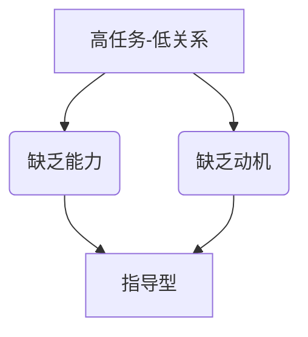
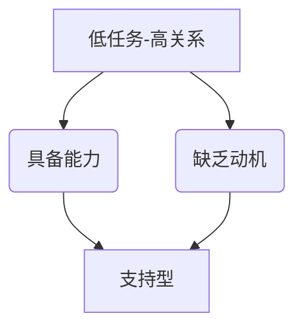
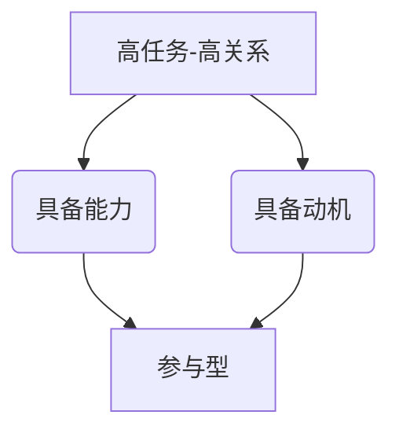
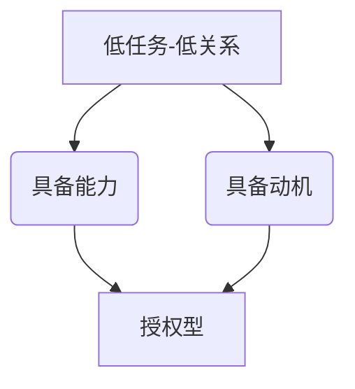
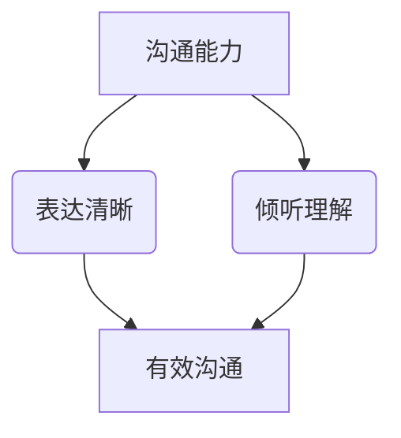
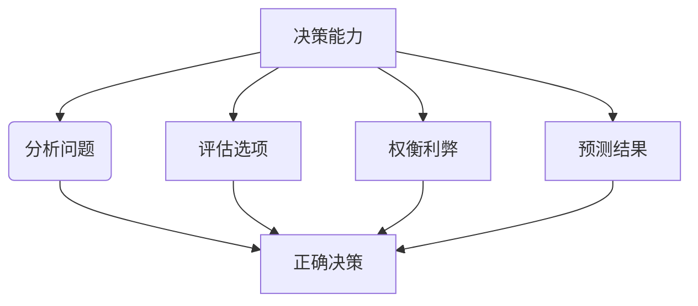
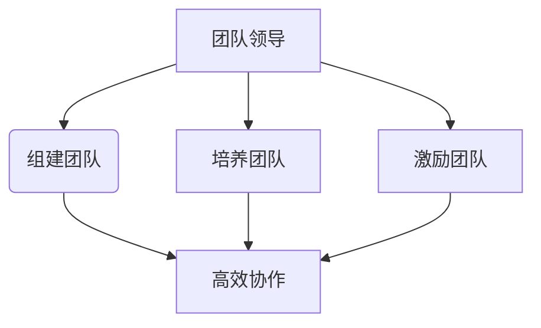
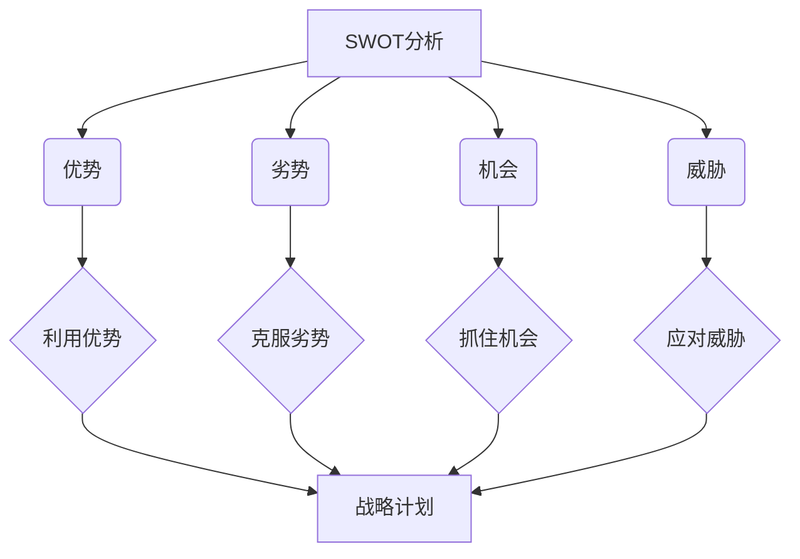
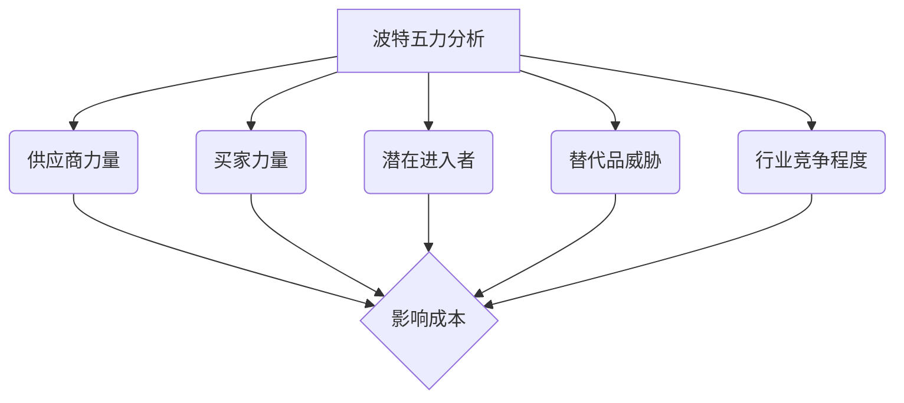
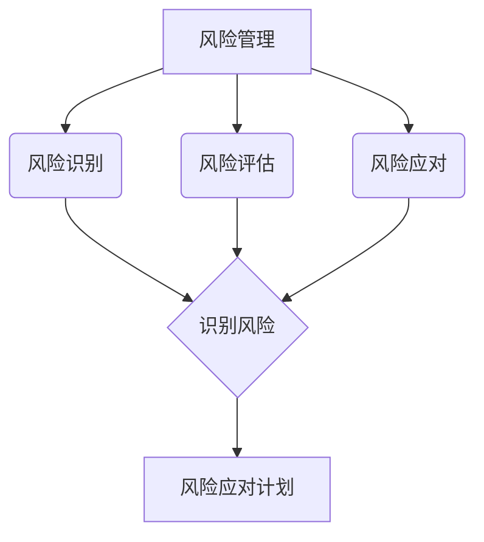

                 

### 文章标题

《领导力与战略思维：长远规划的重要性》

### 关键词

领导力，战略思维，长远规划，企业管理，组织领导

### 摘要

本文将探讨领导力与战略思维在组织长远规划中的重要性。通过深入分析领导力理论、战略管理基础及长远规划的方法，我们将揭示长远规划对组织成功发展的关键作用。同时，通过实际案例的剖析，本文将提供实用的战略规划和领导力提升技巧，为读者在企业管理中提供有力支持。

## 引言

在当今复杂多变的市场环境中，企业面临着前所未有的挑战与机遇。如何在这个竞争激烈的环境中脱颖而出，实现可持续发展，成为企业领导者必须面对的重要课题。在这一背景下，领导力和战略思维的重要性愈发凸显。有效的领导力和战略思维不仅能够帮助企业应对外部环境的变化，还能激发团队潜力，实现长期目标。

### 领导力理论概述

领导力是指领导者通过激励和影响他人，实现组织目标的能力。根据不同的研究和理论，领导力可以分为多种类型，如行为领导、变革型领导、魅力型领导等。不同的领导风格适用于不同的情境和团队，企业领导者需要根据实际情况灵活运用。

#### 行为领导理论

行为领导理论认为，领导者的行为是影响团队表现的关键因素。赫赛和布兰查德的情境领导理论（Situation Leadership Theory）是这一领域的代表。该理论认为，领导者应根据团队成员的能力和动机水平，选择合适的领导风格。

##### 1. 高任务-低关系风格
在团队成员缺乏能力和动机时，领导者需要通过明确任务和期望来指导他们。

##### 2. 低任务-高关系风格
当团队成员具备一定能力但缺乏动机时，领导者需要通过建立良好的人际关系来激励他们。

##### 3. 高任务-高关系风格
在团队成员既具备能力又有动机时，领导者需要同时关注任务完成和人际关系。

##### 4. 低任务-低关系风格
当团队成员高度自主且具备动机时，领导者可以适当减少干预，让他们自主工作。

### 变革型领导与魅力型领导

变革型领导（Transformational Leadership）强调领导者通过激励和启发团队，推动组织变革和创新。这种领导风格通常在面临重大变革时发挥作用。变革型领导者的特点包括：

- 激励下属：通过鼓励和激发团队成员的内在动机，使其为实现共同目标而努力。
- 模范作用：领导者以身作则，树立榜样，引导团队向更高目标迈进。
- 激发想象力：领导者鼓励创新思维，推动组织突破现有局限，追求卓越。

魅力型领导（Charming Leadership）则强调领导者的个人魅力和影响力。这种领导风格在短时间内能迅速激发团队的积极性，但在长期可持续性方面存在一定风险。魅力型领导者的特点包括：

- 个人魅力：领导者拥有强烈的个性魅力，能够吸引和感染团队成员。
- 激情传递：领导者通过传递激情和信念，激发团队成员的热情和动力。
- 愿景塑造：领导者具备清晰的愿景，能够引导团队为实现愿景而努力。

### 领导力技能与素质

有效的领导力不仅依赖于领导风格，还需要一系列关键技能和素质。以下是一些重要的领导力技能与素质：

#### 沟通能力

沟通能力是领导者的核心技能之一。领导者需要能够清晰、准确地传达信息，建立良好的沟通渠道，确保团队成员理解任务和目标。

#### 决策能力

领导者需要具备良好的决策能力，能够在复杂多变的环境中迅速做出正确决策。决策能力包括分析问题、评估选项、权衡利弊、预测结果等。

#### 团队领导

团队领导是领导者的重要职责之一。领导者需要能够组建、培养和激励团队，确保团队高效协作，实现共同目标。

### 小结

领导力是组织成功的关键因素之一。不同的领导理论和方法为领导者提供了多样化的工具和策略，使他们能够根据不同情境和团队需求进行有效领导。通过掌握领导力技能与素质，领导者可以更好地激励和引导团队，实现组织目标。在下一部分，我们将进一步探讨战略管理的基础，了解战略制定、执行和监控的过程。

## 第二部分：战略思维

### 战略管理基础

战略管理是企业为实现长期目标而进行的规划、实施和监控活动。战略管理过程通常包括以下步骤：

#### 战略规划

战略规划是战略管理过程的第一步，旨在明确企业的长期目标和发展方向。战略规划包括以下关键要素：

1. **愿景和使命**：明确企业的愿景和使命，指导企业长远发展。
2. **目标设定**：根据愿景和使命设定具体、可衡量的目标。
3. **环境分析**：分析外部环境和内部条件，确定企业面临的机遇和挑战。
4. **资源分配**：合理分配资源，确保战略实施的顺利进行。

#### 战略执行

战略执行是将战略规划转化为实际行动的过程。战略执行包括以下关键要素：

1. **组织结构**：建立合适的组织结构，确保战略目标的顺利实施。
2. **领导力**：领导者需要发挥关键作用，推动战略执行。
3. **流程优化**：优化关键流程，提高运营效率。
4. **监控和调整**：定期监控战略执行情况，及时调整战略和计划。

#### 战略监控与调整

战略监控与调整是战略管理的重要环节，旨在确保战略规划的有效实施。战略监控与调整包括以下关键要素：

1. **绩效评估**：定期评估战略实施的效果，确定是否达到预期目标。
2. **风险管理**：识别和应对潜在风险，确保战略规划的稳定性。
3. **持续改进**：根据评估结果和市场需求，不断优化战略规划和执行。

### 战略分析工具

战略分析工具是战略管理过程中不可或缺的工具，可以帮助企业更好地了解市场环境、竞争对手和自身优势。以下是一些常用的战略分析工具：

#### SWOT分析

SWOT分析是一种常用的战略分析工具，用于评估企业的优势（Strengths）、劣势（Weaknesses）、机会（Opportunities）和威胁（Threats）。SWOT分析可以帮助企业识别自身在市场中的地位，制定相应的战略计划。

#### 波特五力分析

波特五力分析是一种用于评估行业竞争力的工具，通过分析五个关键因素（供应商力量、买家力量、潜在进入者、替代品威胁和行业竞争程度），帮助企业了解市场竞争态势。

### 战略规划与执行

战略规划和执行是战略管理过程中至关重要的一环。有效的战略规划需要明确企业的愿景、目标和战略方向，而战略执行则需要确保这些规划得到有效实施。

#### 战略制定

战略制定是战略管理的核心步骤，涉及以下关键要素：

1. **目标设定**：根据企业的愿景和使命，设定具体、可衡量的目标。
2. **战略选择**：在多种战略选项中，选择最适合企业的战略方向。
3. **行动计划**：制定详细的行动计划，明确时间表、资源需求和责任人。

#### 战略执行

战略执行是将战略规划转化为实际行动的过程，涉及以下关键要素：

1. **组织结构**：建立合适的组织结构，确保战略目标的顺利实施。
2. **领导力**：领导者需要发挥关键作用，推动战略执行。
3. **沟通协调**：确保各部门和员工了解战略目标，协同工作。
4. **绩效监控**：定期监控战略执行情况，确保目标达成。

#### 战略监控与调整

战略监控与调整是战略管理的重要环节，涉及以下关键要素：

1. **绩效评估**：定期评估战略实施的效果，确定是否达到预期目标。
2. **反馈机制**：建立有效的反馈机制，收集员工和客户的意见和建议。
3. **持续改进**：根据评估结果和市场需求，不断优化战略规划和执行。

### 小结

战略管理是企业管理的重要组成部分，有效的战略管理可以帮助企业明确目标、优化资源配置、提高竞争力。通过了解战略管理的基础、战略分析工具和战略规划与执行过程，企业领导者可以更好地制定和实施战略，实现长期发展目标。在下一部分，我们将深入探讨长远规划的重要性及其方法。

## 第三部分：长远规划

### 长远规划的重要性

长远规划是企业在未来发展中制定的战略性计划，旨在明确企业的发展方向、目标以及实现这些目标所需的具体行动步骤。长远规划对于企业的成功至关重要，原因如下：

#### 明确发展目标

长远规划可以帮助企业明确未来发展的目标和方向，确保企业在面临外部环境变化时仍能保持清晰的愿景和定位。

#### 优化资源配置

通过长远规划，企业可以提前预测未来需求，合理配置资源，提高资源利用效率，降低成本。

#### 提高应变能力

长远规划使企业能够提前预判潜在风险和挑战，制定应对策略，提高应对外部环境变化的能力。

#### 增强竞争力

长远规划有助于企业识别和利用市场机会，提升核心竞争力，实现可持续发展。

### 长远规划与战略规划的异同

长远规划与战略规划密切相关，但在具体内容和执行上有所区别：

#### 异同点

- **目标一致性**：长远规划和战略规划均强调明确企业目标，确保企业发展的连贯性。
- **时间跨度**：长远规划通常具有更长的时间跨度，涵盖战略规划的多个阶段。

#### 区别点

- **内容范围**：长远规划更注重企业整体发展的长期目标，而战略规划则侧重于具体实施步骤和策略。
- **执行重点**：长远规划关注资源分配和战略布局，而战略规划则关注具体执行和实施细节。

### 长远规划的方法与工具

制定有效的长远规划需要一系列方法和工具，以下介绍几种常用的方法与工具：

#### SWOT分析

SWOT分析是一种常用的战略分析工具，用于评估企业的优势、劣势、机会和威胁。通过SWOT分析，企业可以识别自身在市场中的优劣势，制定相应的战略计划。

#### 波特五力分析

波特五力分析是一种用于评估行业竞争力的工具，通过分析五个关键因素（供应商力量、买家力量、潜在进入者、替代品威胁和行业竞争程度），帮助企业了解市场竞争态势。

#### 风险管理

风险管理是长远规划中的重要环节，旨在识别和应对潜在风险。通过建立风险管理体系，企业可以提前识别潜在风险，制定应对策略，降低风险对企业的影响。

### 长远规划的实施步骤

制定长远规划需要遵循一系列步骤，以确保规划的科学性和可行性。以下是长远规划的实施步骤：

#### 1. 明确目标和愿景

首先，企业需要明确长远规划的目标和愿景，确保规划方向与企业的战略目标一致。

#### 2. 进行环境分析

通过SWOT分析、波特五力分析等工具，对企业内外部环境进行深入分析，了解企业的优势和劣势，以及市场机遇和挑战。

#### 3. 制定战略计划

根据环境分析结果，制定具体的战略计划，包括资源分配、时间表、责任人等。

#### 4. 实施和监控

将战略计划付诸实施，并定期监控实施情况，确保规划目标的实现。

#### 5. 持续优化

根据实施过程中的反馈和外部环境变化，不断优化和调整战略规划，确保规划的持续有效性。

### 小结

长远规划是企业发展的重要保障，通过科学的方法和工具，企业可以制定出具有前瞻性的战略规划，为未来的发展奠定坚实基础。在下一部分，我们将通过实际案例，展示长远规划在领导力和战略思维中的成功应用。

## 第四部分：案例分析

### 案例分析一：公司A的领导力与战略规划实践

公司A是一家从事高科技产业的企业，面临激烈的市场竞争和不断变化的技术环境。为了确保企业的可持续发展，公司A在领导力和战略规划方面进行了深入实践。

#### 领导力实践

1. **变革型领导**：公司A的领导者采用变革型领导风格，通过激励和启发团队，推动企业技术创新和业务拓展。领导者积极参与团队讨论，鼓励创新思维，为员工提供发展机会。
2. **团队领导**：公司A注重团队建设，通过组建跨部门团队，促进知识共享和协作。领导者担任团队教练和顾问，帮助团队成员解决难题，提升团队整体能力。

#### 战略规划实践

1. **长期目标设定**：公司A明确了企业的长期发展目标，包括市场份额扩大、技术创新和国际化发展。这些目标为公司提供了明确的发展方向。
2. **环境分析**：公司A通过SWOT分析，评估了自身在市场中的优势、劣势、机会和威胁。这有助于企业制定有针对性的战略计划。
3. **资源分配**：公司A在战略规划中，合理分配资源，确保关键项目得到充分支持。同时，企业通过优化内部流程，提高资源利用效率。
4. **战略执行**：公司A建立了完善的战略执行体系，包括组织结构优化、领导力培养、流程监控等。领导者亲自推动战略执行，确保各项任务按时完成。
5. **绩效评估**：公司A定期评估战略执行效果，通过绩效评估和反馈机制，发现问题和不足，及时调整战略规划。

#### 成功因素

1. **领导力**：公司A的变革型领导风格和团队领导能力，为企业提供了强大的发展动力。
2. **战略规划**：科学的环境分析和资源分配，确保了战略规划的科学性和可行性。
3. **执行力**：完善的战略执行体系和绩效评估机制，保证了战略规划的顺利实施。

### 案例分析二：公司B的长远规划成功案例

公司B是一家传统制造业企业，面临市场竞争加剧和产业升级的压力。为了实现可持续发展，公司B制定了长远规划，并在战略实施中取得了显著成效。

#### 长远规划实践

1. **产业升级**：公司B明确了产业升级的目标，投资研发新技术和产品，提升企业核心竞争力。
2. **国际化拓展**：公司B通过海外并购和合作，拓展国际市场，提高国际市场份额。
3. **风险管理**：公司B建立了完善的风险管理体系，识别和应对潜在风险，确保战略规划的稳定性。

#### 成功因素

1. **长远规划**：公司B的长远规划明确了企业的发展方向和目标，为战略实施提供了指导。
2. **技术创新**：通过投资研发新技术和产品，公司B实现了产业升级，提升了市场竞争力。
3. **国际化拓展**：公司B的国际市场拓展策略，帮助企业实现多元化发展，降低市场风险。

### 案例启示

通过公司A和公司B的案例分析，我们可以得出以下启示：

1. **领导力**：领导力是企业发展的关键因素，领导者需要具备变革型领导风格和团队领导能力，推动企业持续创新和进步。
2. **战略规划**：科学的长远规划和战略规划，有助于企业明确发展方向和目标，确保战略实施的顺利进行。
3. **执行力**：完善的战略执行体系和绩效评估机制，是确保战略规划成功实施的重要保障。

## 结论

### 总结与展望

本文从领导力理论、战略管理基础和长远规划三个方面，探讨了领导力与战略思维在组织长远规划中的重要性。通过实际案例分析，我们看到了领导力和战略规划在推动企业可持续发展中的关键作用。未来，企业领导者需要不断提升领导力，掌握战略管理技巧，制定科学的长远规划，以应对复杂多变的市场环境。

### 领导力与战略思维的未来发展

随着全球化和数字化的发展，领导力和战略思维将面临新的挑战和机遇。未来，领导者需要具备跨文化沟通能力、创新思维和应对不确定性的能力。战略思维将更加注重敏捷性和灵活性，企业需要快速响应市场变化，调整战略方向。同时，数据驱动的战略规划将日益普及，企业可以利用大数据和人工智能技术，优化决策过程，提高战略执行力。

### 最佳实践

1. **持续学习**：领导者应保持持续学习的态度，关注行业动态和最新理论，不断提升自身能力。
2. **团队建设**：重视团队建设，培养团队成员的协作能力和创新思维，提高团队整体绩效。
3. **数据驱动**：利用数据驱动决策，建立数据分析和预测模型，提高战略规划的准确性和执行力。

### 注意事项

1. **避免盲目跟风**：在制定战略规划时，避免盲目跟风，应根据企业实际情况制定符合自身特点的规划。
2. **风险管理**：重视风险管理，建立完善的风险管理体系，降低战略规划实施过程中的风险。
3. **执行力**：确保战略规划的执行力，建立完善的执行体系和绩效评估机制，确保各项任务按时完成。

### 拓展阅读

1. **《领导力》(Peter Drucker)**：彼得·德鲁克的经典著作，深入探讨了领导力的本质和实践。
2. **《竞争战略》(Michael Porter)**：迈克尔·波特的经典著作，详细阐述了战略管理和竞争力分析的方法。
3. **《大数据时代》(Viktor Mayer-Schönberger 和 Kenneth Cukier)**：大数据时代的经典著作，探讨了大数据对社会和企业的深远影响。

### 致谢

感谢各位读者对本文的关注和支持，希望本文能够为您的领导力提升和战略规划提供有益的启示。如需进一步探讨，欢迎留言交流。

### 作者信息

作者：AI天才研究院/AI Genius Institute & 禅与计算机程序设计艺术/Zen And The Art of Computer Programming

