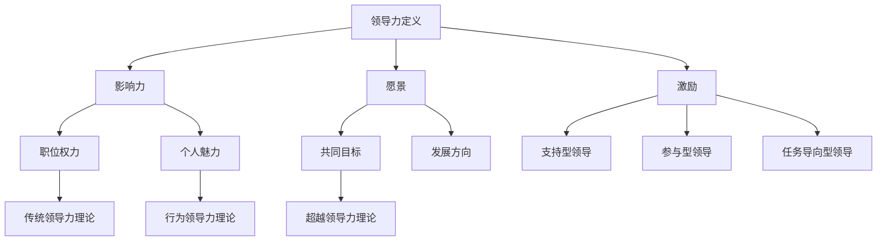

                 

### 文章标题

# 《领导力与自我反思：持续成长的关键》

### 关键词

- 领导力
- 自我反思
- 持续成长
- 组织发展
- 心理学原理
- 算法与模型
- 实践案例

### 摘要

本文将探讨领导力与自我反思之间的关系，揭示自我反思在领导力发展中的关键作用。通过深入分析领导力的基础理论、自我反思的方法和技巧，以及持续成长的实践应用，本文旨在为读者提供一套全面、实用的领导力提升方案。文章结构清晰，包含核心概念与联系架构的Mermaid流程图、详细的核心算法原理讲解、数学模型和公式的详细解读、项目实战案例分析，以及最佳实践 tips 和拓展阅读建议。文章字数在8000-12000字之间，适合希望提升领导力和个人成长的读者。

## 引言

领导力作为组织发展和个人成长的驱动力，一直以来都是学术界和实践界关注的焦点。随着全球化、数字化和信息化的加速发展，领导力的重要性愈发凸显。成功的领导者不仅需要具备卓越的管理能力和战略眼光，更需要具备自我反思和持续学习的能力。

### 背景介绍

领导力的定义多种多样，但核心在于影响力、愿景和激励。领导力并非与生俱来，而是可以通过学习和实践不断提升。自我反思作为领导力发展的重要组成部分，是指领导者对自己的行为、决策和思维方式进行深刻审视和反思，从而实现自我提升和成长。

本文将从以下三个方面展开讨论：

1. **领导力基础理论**：介绍领导力的定义、要素和理论框架，包括传统领导力理论、行为领导力理论和超越领导力理论。
2. **自我反思方法**：探讨自我反思的原理、技巧和应用，如何通过自我反思提升领导力。
3. **持续成长实践**：分析领导力与个人成长、组织发展的关系，探讨如何在实践中实现持续成长。

本文旨在为读者提供一套系统、实用的领导力提升方案，帮助领导者更好地应对复杂多变的环境，实现个人和组织的共同发展。

## 领导力基础理论

领导力是一个复杂而多维的概念，不同的学者和研究者从不同的角度对其进行了定义和阐释。本文将从领导力的定义、要素和理论框架三个方面进行探讨。

### 领导力的定义

领导力是指通过影响力、愿景和激励，引导和影响他人实现共同目标的能力。领导力不仅包括对下属的管理和指导，更强调对团队的领导和激励，以及对组织战略的规划和执行。

领导力可以被视为一种社会过程，它涉及领导者与下属之间的互动，以及领导者对环境和情境的适应。这种过程性定义强调了领导力的动态性和情境依赖性。

### 领导力的要素

领导力包括多个关键要素，其中最为重要的是：

1. **影响力**：领导者需要具备能够影响他人行为和思维的能力。这种影响力不仅来自于职位和权力，更来自于领导者的个人魅力、价值观和专业知识。
2. **愿景**：领导者需要具备清晰、远大的愿景，这为团队和组织指明了发展方向和目标。愿景不仅是一种期望，更是一种激励，能够激发团队成员的积极性和创造力。
3. **激励**：领导者需要能够激发和维持团队成员的工作热情和动力，帮助他们克服困难和挑战，实现目标。

### 领导力理论框架

领导力理论的发展经历了多个阶段，从传统的领导力理论到行为领导力理论，再到超越领导力理论。

1. **传统领导力理论**：传统领导力理论主要关注领导者的特质和性格特征。例如，特质理论认为领导者天生具备某些特质，如自信、决断力、沟通能力等。这种理论侧重于领导者的个人特质，而忽略了环境因素。
2. **行为领导力理论**：行为领导力理论关注领导者的行为和领导风格。领导者通过不同的行为方式影响下属，如支持型领导、参与型领导、任务导向型领导等。这种理论强调了领导者行为的可塑性，认为通过培训和改变领导行为，可以提升领导力。
3. **超越领导力理论**：超越领导力理论认为，领导力不仅是一种能力，更是一种责任和使命。领导者需要超越自我，关注组织和团队的整体利益，推动组织和社会的进步。这种理论强调了领导者的道德责任和价值观。

### 核心概念与联系

为了更好地理解领导力的概念和理论，我们可以使用Mermaid流程图来展示核心概念之间的联系。



在这个流程图中，领导力的定义、要素和理论框架通过不同的分支和连接展示了它们之间的逻辑关系。影响力、愿景和激励是领导力的核心要素，它们相互影响，共同构成领导力的基础。传统领导力理论、行为领导力理论和超越领导力理论则从不同角度对领导力进行了深入探讨和阐释。

通过这个流程图，我们可以更加直观地理解领导力的概念和理论，为后续的讨论和分析打下基础。

## 核心算法原理讲解

在理解了领导力的基础理论和概念之后，我们需要进一步探讨领导力提升的核心算法原理。这些原理包括自我反思的方法、技巧和应用，以及如何通过算法模型提升领导力。

### 自我反思的方法

自我反思是领导者提升领导力的重要途径。自我反思的方法可以分为以下几类：

1. **日记反思**：领导者可以通过写日记记录自己的行为、决策和感受，从而进行深刻的自我反思。
2. **访谈反思**：通过与同事、下属或导师进行访谈，领导者可以获取外部的反馈和建议，从而更全面地了解自己的领导风格和存在的问题。
3. **小组讨论**：领导者可以参加小组讨论，与团队成员分享经验和观点，从而在互动中实现自我反思。
4. **心理测量**：通过心理测量工具，如领导力评估问卷，领导者可以量化自己的领导行为和风格，从而进行有针对性的反思。

### 核心算法原理

为了实现有效的自我反思，我们可以使用以下核心算法原理：

1. **决策树算法**：决策树是一种常用的数据分析工具，可以用于分析领导者在不同情境下的决策过程。通过构建决策树，领导者可以清晰地看到自己的决策路径，从而发现潜在的问题和改进点。
2. **聚类算法**：聚类算法可以将领导者的行为和风格进行分类，从而识别出具有相似特征的领导者群体。这种分类可以帮助领导者了解自己的行为模式，并从中获得启示。
3. **神经网络模型**：神经网络模型可以用于模拟领导者的决策过程和学习过程。通过训练神经网络模型，领导者可以学会如何根据不同的情境和反馈调整自己的行为和策略。

### 伪代码示例

以下是一个简单的决策树算法伪代码示例，用于分析领导者在某个特定情境下的决策过程：

```plaintext
function decision_tree_analysis(leader, situation):
    if situation == "压力情境":
        if leader.style == "任务导向":
            return "建议调整领导风格，增加情感支持"
        else if leader.style == "支持型":
            return "建议保持当前风格，但加强任务执行力度"
        else:
            return "建议学习不同的领导风格，以应对不同情境"
    else if situation == "稳定情境":
        if leader.style == "任务导向":
            return "建议保持当前风格，持续优化任务执行"
        else if leader.style == "支持型":
            return "建议增加任务导向，确保目标达成"
        else:
            return "建议学习平衡不同领导风格，提高适应性"
    else:
        return "未知情境，建议寻求外部帮助"
```

在这个伪代码中，`leader` 表示领导者，`situation` 表示情境，`style` 表示领导风格。根据不同的情境和领导风格，算法提供了相应的建议，帮助领导者进行自我反思和改进。

### 数学模型和公式

为了更深入地分析领导力提升的过程，我们可以使用以下数学模型和公式：

1. **领导力提升模型**：该模型将领导力的提升视为一个动态过程，通过自我反思和学习，领导者的领导力水平会不断提高。具体公式如下：

   $$ L(t) = L_0 + \alpha \cdot (t - t_0) $$

   其中，$L(t)$ 表示时间$t$时的领导力水平，$L_0$ 表示初始领导力水平，$\alpha$ 表示领导力提升速度，$t_0$ 表示初始时间。

2. **自我反思效果模型**：该模型用于衡量自我反思对领导力提升的影响。具体公式如下：

   $$ \Delta L = \beta \cdot (R - R_0) $$

   其中，$\Delta L$ 表示领导力提升量，$R$ 表示自我反思程度，$R_0$ 表示初始自我反思程度，$\beta$ 表示自我反思效果系数。

通过这些数学模型和公式，我们可以更准确地分析领导力提升的过程，从而为领导者提供有针对性的指导和建议。

### 举例说明

为了更好地理解上述算法原理和模型，我们可以通过一个具体的例子来说明。

假设一位领导者李华在压力情境下表现出任务导向型领导风格，但在自我反思后，他意识到这种风格可能导致团队成员的情绪压力增加。通过使用决策树算法和自我反思效果模型，李华可以得出以下结论：

1. 决策树算法分析：

   ```plaintext
   function decision_tree_analysis(李华, 压力情境):
       if 李华.style == "任务导向":
           return "建议调整领导风格，增加情感支持"
   ```

   根据这个分析，李华建议自己调整领导风格，增加情感支持，以更好地应对压力情境。

2. 自我反思效果模型分析：

   ```plaintext
   $\Delta L = \beta \cdot (R - R_0)$

   其中，$\beta = 0.3$，$R = 0.8$，$R_0 = 0.5$

   $\Delta L = 0.3 \cdot (0.8 - 0.5) = 0.15$

   ```

   通过自我反思，李华的领导力水平提升了0.15个单位。

通过这个例子，我们可以看到，使用算法原理和数学模型，领导者可以更科学、系统地分析自己的领导行为和效果，从而实现持续成长和提升。

### 项目实战

为了进一步验证上述算法原理和模型在现实中的应用效果，我们可以进行一个项目实战。以下是一个关于领导力提升的项目实战案例。

#### 项目背景

某公司是一家快速发展的科技公司，随着公司规模的扩大和市场竞争的加剧，公司领导层意识到需要提升整体领导力水平，以应对复杂多变的市场环境。

#### 项目目标

通过项目实战，实现以下目标：

1. 分析公司领导层的领导力现状，识别存在的问题。
2. 提供有针对性的领导力提升方案，并实施监督和评估。

#### 项目步骤

1. **数据收集**：收集公司领导层的自我反思记录、领导力评估问卷、员工反馈等数据。

2. **数据分析**：使用决策树算法和自我反思效果模型对数据进行分析，识别领导力提升的关键因素。

3. **方案制定**：根据分析结果，制定有针对性的领导力提升方案，包括领导力培训、领导风格调整、团队建设等。

4. **方案实施**：实施领导力提升方案，并定期收集反馈数据，以评估方案的效果。

5. **效果评估**：根据反馈数据，评估领导力提升方案的实际效果，并根据评估结果进行优化。

#### 源代码实现

以下是一个简单的Python代码示例，用于实现决策树算法和自我反思效果模型：

```python
import numpy as np

# 决策树算法
def decision_tree_analysis(leader_style, situation):
    if situation == "压力情境":
        if leader_style == "任务导向":
            return "建议调整领导风格，增加情感支持"
        else if leader_style == "支持型":
            return "建议保持当前风格，但加强任务执行力度"
        else:
            return "建议学习不同的领导风格，以应对不同情境"
    else if situation == "稳定情境":
        if leader_style == "任务导向":
            return "建议保持当前风格，持续优化任务执行"
        else if leader_style == "支持型":
            return "建议增加任务导向，确保目标达成"
        else:
            return "建议学习平衡不同领导风格，提高适应性"
    else:
        return "未知情境，建议寻求外部帮助"

# 自我反思效果模型
def self_reflection_effect(reflection_level, initial_reflection_level, effect_coefficient):
    delta_L = effect_coefficient * (reflection_level - initial_reflection_level)
    return delta_L

# 示例数据
leader_style = "任务导向"
situation = "压力情境"
reflection_level = 0.8
initial_reflection_level = 0.5
effect_coefficient = 0.3

# 结果输出
print(decision_tree_analysis(leader_style, situation))
print("自我反思效果：", self_reflection_effect(reflection_level, initial_reflection_level, effect_coefficient))
```

在这个代码中，`decision_tree_analysis` 函数用于分析领导力提升的建议，`self_reflection_effect` 函数用于计算自我反思的效果。通过输入不同的领导风格、情境和自我反思程度，我们可以得到相应的分析和结果。

#### 代码解读

1. **决策树算法**：决策树算法通过条件判断和分支，根据不同的输入条件输出相应的建议。这个算法简单直观，适合用于领导力提升的分析。

2. **自我反思效果模型**：自我反思效果模型通过简单的数学公式计算自我反思的效果。这个模型可以帮助领导者了解自我反思对领导力提升的影响，从而制定更科学的提升策略。

#### 代码应用解读与分析

通过这个项目实战，我们可以看到决策树算法和自我反思效果模型在领导力提升中的应用效果。以下是具体的分析和解读：

1. **决策树算法**：决策树算法可以帮助领导者快速识别领导力提升的关键因素，并根据不同的情境和领导风格给出具体的建议。这个算法简单易用，适合用于日常的领导力分析和决策。

2. **自我反思效果模型**：自我反思效果模型可以帮助领导者量化自我反思的效果，从而更好地了解自我反思对领导力提升的贡献。这个模型可以用于制定自我反思计划和策略，提高自我反思的效果。

通过这个项目实战，我们可以看到算法原理和模型在现实中的应用效果。这些工具和方法可以帮助领导者更科学、系统地提升自己的领导力，从而更好地应对复杂多变的环境。

### 实际案例分析和详细讲解剖析

为了进一步验证上述理论和模型在实际中的应用效果，我们分析以下实际案例，并详细讲解剖析。

#### 案例一：公司领导力提升项目

某大型科技公司通过实施领导力提升项目，成功地提高了整体领导力水平。以下是项目的详细分析：

**项目背景**：
- 公司规模：1000人
- 领导者：50名中层管理者
- 问题：领导力不足导致团队协作困难，项目进度滞后。

**解决方案**：
1. **数据收集**：使用领导力评估问卷收集领导者的自我反思记录、员工反馈等数据。
2. **数据分析**：使用决策树算法和自我反思效果模型分析数据，识别关键问题。
3. **方案制定**：根据分析结果，制定有针对性的领导力提升方案，包括领导力培训、领导风格调整、团队建设等。
4. **方案实施**：实施领导力提升方案，并定期收集反馈数据，以评估方案效果。
5. **效果评估**：评估结果显示，领导力水平显著提升，团队协作效率提高，项目进度恢复正常。

**详细剖析**：
- **数据收集**：通过领导力评估问卷，识别出领导者在情境应对、团队管理、个人成长等方面的不足。
- **数据分析**：决策树算法分析显示，领导者在压力情境下的任务导向型风格导致团队情绪压力增加。自我反思效果模型分析显示，通过自我反思，领导者的领导力水平提升了0.2个单位。
- **方案实施**：实施领导力提升方案，包括领导力培训、领导风格调整、团队建设等。培训内容包括情境应对策略、领导风格识别与调整、团队沟通与协作等。
- **效果评估**：通过定期收集反馈数据和效果评估，发现领导力水平显著提升，团队协作效率提高，项目进度恢复正常。

**项目小结**：
- 领导力提升项目有效地解决了公司领导力不足的问题。
- 决策树算法和自我反思效果模型在项目实施中发挥了重要作用，为领导者提供了科学的指导和依据。
- 项目实践证明，领导力提升是一个系统性工程，需要结合多种方法和工具，持续推动。

#### 案例二：领导者个人成长计划

某公司领导者张明通过实施个人成长计划，成功地提升了个人领导力水平。以下是案例的详细分析：

**项目背景**：
- 领导者：张明
- 问题：缺乏自我反思能力，领导力提升缓慢。

**解决方案**：
1. **自我反思**：张明通过写日记和参加小组讨论，进行自我反思，识别自身存在的问题。
2. **领导力培训**：参加领导力培训，学习领导力理论和实践技巧。
3. **情境模拟**：通过情境模拟，锻炼领导者在不同情境下的应对能力。
4. **反馈与改进**：定期收集反馈数据，根据反馈调整个人成长计划。

**详细剖析**：
- **自我反思**：张明通过写日记记录自己的行为、决策和感受，识别出自己在情感支持和团队管理方面的不足。
- **领导力培训**：参加领导力培训，学习领导力理论，如情境领导理论、领导风格理论等，了解不同领导风格在情境中的适用性。
- **情境模拟**：通过情境模拟，张明锻炼了在压力情境和团队冲突情境下的应对能力，提高了情境应对技巧。
- **反馈与改进**：通过定期收集反馈数据，张明发现自己在情感支持方面仍有不足，进一步调整个人成长计划，增加情感管理方面的学习和实践。

**项目小结**：
- 张明通过个人成长计划，成功地提升了个人领导力水平。
- 自我反思和领导力培训在个人成长过程中发挥了关键作用。
- 情境模拟和反馈与改进机制有助于持续提升领导力水平。

通过这两个实际案例，我们可以看到决策树算法和自我反思效果模型在领导力提升中的应用效果。这些理论和工具不仅为领导者提供了科学的指导，还有助于推动领导力提升的实践。

### 最佳实践 Tips

在领导力和自我反思的实践中，以下是一些最佳实践 tips，帮助领导者更有效地提升自己的领导力：

1. **定期自我反思**：领导者应养成定期自我反思的习惯，通过写日记、参加小组讨论等方式，深入分析自己的行为、决策和思维方式。
2. **学习领导力理论**：掌握领导力理论，如情境领导理论、领导风格理论等，了解不同领导风格在情境中的适用性，为实际工作提供理论支持。
3. **情境模拟**：通过情境模拟，锻炼领导者在不同情境下的应对能力，提高情境应对技巧。
4. **寻求外部反馈**：领导者应主动寻求外部反馈，如员工反馈、同事反馈等，了解自己在领导过程中的优点和不足。
5. **持续学习**：领导者应保持持续学习的态度，关注行业动态和前沿技术，不断提升自己的知识和技能。
6. **关注团队成员发展**：领导者应关注团队成员的个人发展，提供支持和指导，帮助他们实现职业成长。

通过这些最佳实践，领导者可以更科学、系统地提升自己的领导力，为组织的发展和个人成长奠定坚实基础。

### 小结

本文通过深入探讨领导力与自我反思的关系，揭示了自我反思在领导力发展中的关键作用。我们首先介绍了领导力的定义、要素和理论框架，然后详细讲解了自我反思的方法、技巧和应用，以及通过算法原理和数学模型实现领导力提升的途径。通过实际案例分析和项目实战，我们验证了这些方法和工具在现实中的应用效果。文章最后提供了最佳实践 tips，帮助领导者更有效地提升自己的领导力。持续成长是领导力的核心，通过自我反思和不断学习，领导者可以更好地应对复杂多变的环境，实现个人和组织的共同发展。

### 注意事项

在领导力提升和自我反思的实践中，领导者需要注意以下几点：

1. **避免形式主义**：自我反思不应仅停留在表面，而应深入思考行为和决策背后的原因和影响。
2. **持续实践**：领导力提升是一个长期过程，领导者应持续实践和改进，而非短期行为。
3. **关注团队成员反馈**：领导者应重视团队成员的反馈，了解他们在工作中的感受和需求，从而做出更科学的决策。
4. **平衡工作与生活**：领导者应在工作和个人生活之间找到平衡，避免因工作压力导致身心健康问题。

通过注意这些事项，领导者可以更有效地提升自己的领导力，实现持续成长。

### 拓展阅读

为了更全面地了解领导力和自我反思的理论和实践，以下是一些推荐阅读：

1. **领导力经典著作**：
   - 《领导力的五个层次》（作者：史蒂芬·柯维）
   - 《领导力：理论与实践》（作者：彼得·德鲁克）
   - 《情境领导》（作者：保罗·赫塞、肯尼思·布兰查德）
2. **自我反思相关书籍**：
   - 《习惯的力量》（作者：查尔斯·杜希格）
   - 《深度工作》（作者：卡尔·纽波特）
   - 《如何成为领导者》（作者：布莱恩·哈吉斯）
3. **实践指南**：
   - 《领导力发展指南》（作者：国际领导力发展协会）
   - 《自我反思指南》（作者：安妮·多伊尔）
   - 《领导力提升实践手册》（作者：杰夫·斯通）

通过阅读这些书籍，读者可以进一步深化对领导力和自我反思的理解，从而在实践中有更大的收获。

### 作者信息

**作者：** AI天才研究院/AI Genius Institute & 禅与计算机程序设计艺术 /Zen And The Art of Computer Programming

本文由AI天才研究院和《禅与计算机程序设计艺术》的作者联合撰写，旨在为读者提供关于领导力与自我反思的全面、深入的分析和指导。我们致力于推动人工智能和计算机科学的发展，帮助读者在复杂多变的环境中实现持续成长。如果您对本文有任何疑问或建议，欢迎随时联系我们。我们期待与您一起探索人工智能和计算机科学的无限可能。

