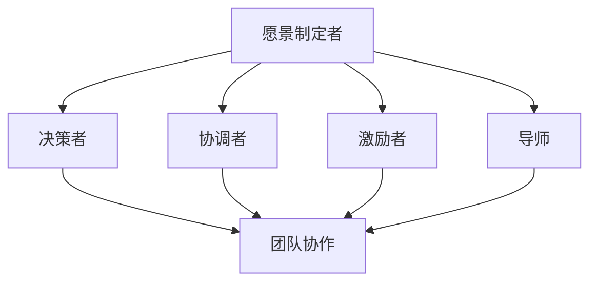

                 

### 文章标题：领导力修炼手册：从项目总监到管理者的进阶指南

#### 关键词：
- 项目总监
- 领导力
- 管理技能
- 团队建设
- 决策制定
- 风险管理
- 个人提升

#### 摘要：
本文旨在为项目总监级别的人员提供一份全面的领导力提升指南。文章从定义领导力、核心原理、实践技巧、高级领导力、个人提升五个方面进行详细探讨，辅以实际案例和最佳实践，旨在帮助读者从项目总监成功转型为卓越的管理者。

### 引言：领导力的基本概念与重要性

领导力是一种激发他人共同实现目标的能力，它不仅关乎个人的影响力，更关乎团队和组织的发展。对于项目总监而言，具备卓越的领导力是确保项目成功的关键因素。本文将从以下几个方面详细探讨领导力：

1. **领导力的定义与作用**：首先，我们将回顾领导力的基本概念，理解其在组织中的重要性。
2. **书籍的目标与读者对象**：接着，我们将明确本书的写作目标，并确定目标读者群体。

#### 领导力的定义与作用

领导力并非一种与生俱来的天赋，而是一种可以通过学习和实践不断提升的能力。它涉及个人魅力的发挥、团队协作的推动以及目标实现的保障。在组织层面，领导力有助于：

- **激发员工潜力**：优秀的领导者能够激发员工的积极性，使其在项目中发挥最大价值。
- **提升团队效率**：领导力能够帮助团队成员明确目标、协调行动，提高工作效率。
- **促进组织发展**：领导力对于组织战略的制定和执行具有关键作用，有助于实现组织的长远发展。

#### 书籍的目标与读者对象

本书的目标是为项目总监级别的人员提供一份实用的领导力提升手册，帮助其在职业发展中实现从项目总监到管理者的顺利转型。目标读者群体包括：

- **项目总监**：正处在职业转型期的项目总监，希望提升自己的领导力水平。
- **中层管理者**：对领导力有深入理解，希望进一步提升管理能力的中层管理者。
- **相关领域从业者**：对领导力感兴趣，希望了解相关理论和实践的其他领域从业者。

### 第1部分：领导力核心原理

领导力核心原理是理解和管理团队的基础。本部分将重点探讨以下几个方面：

1. **领导者的角色与职责**：理解领导者的角色和职责，明确其在团队中的定位。
2. **团队建设**：介绍团队建设的重要性，包括团队角色的分配和沟通技巧的提升。
3. **沟通技巧**：讲解有效沟通的重要性，以及如何通过有效的沟通提高团队协作效率。

#### 第1章 领导者的角色与职责

领导者的角色与职责是领导力研究的核心。一个成功的领导者不仅需要具备卓越的技术能力，更需要深刻理解自己的角色和职责。以下是领导者的主要角色与职责：

1. **愿景制定者**：领导者需要为团队设定清晰的愿景和目标，使团队成员明确方向。
2. **决策者**：在团队面临关键问题时，领导者需要做出明智的决策，确保项目顺利进行。
3. **协调者**：领导者需要协调团队成员之间的关系，确保团队协作顺畅。
4. **激励者**：领导者需要激励团队成员，激发其潜能，提高工作效率。
5. **导师**：领导者需要为团队成员提供指导和支持，帮助他们成长。

#### 核心概念与联系

为了更好地理解领导者的角色与职责，我们可以使用Mermaid流程图来展示领导者的主要职责及其相互关系。



#### 核心算法原理讲解

虽然领导力不是一种可以直接量化的算法，但我们可以将其视为一种复杂的决策过程。以下是领导力决策过程的伪代码：

```
function 领导力决策（问题，团队）{
    愿景 = 制定愿景（问题）
    决策 = 智能决策（愿景，团队）
    协调 = 协调团队（决策，团队）
    激励 = 激励团队（决策，团队）
    指导 = 提供指导（团队）
    返回（愿景，决策，协调，激励，指导）
}
```

#### 数学模型和公式

在领导力中，可以使用一些基本的数学模型和公式来量化团队成员的绩效和团队的整体表现。以下是几个常用的公式：

1. **绩效评估公式**：
   $$ P = f(T, S, E) $$
   其中，\( P \) 代表绩效，\( T \) 代表技术能力，\( S \) 代表团队支持，\( E \) 代表激励。

2. **团队效率公式**：
   $$ E = \frac{P}{T} $$
   其中，\( E \) 代表效率，\( P \) 代表绩效，\( T \) 代表时间。

#### 详细讲解与举例说明

假设一个团队需要完成一个复杂的软件开发项目。根据绩效评估公式，我们可以对团队成员的绩效进行评估：

- **技术能力 \( T \)**：团队成员A拥有5年的软件开发经验，B拥有3年的经验，C拥有1年的经验。
- **团队支持 \( S \)**：团队成员之间的沟通畅通，协作高效。
- **激励 \( E \)**：领导者为团队成员提供了明确的愿景和目标，激发了团队成员的积极性。

根据这些数据，我们可以计算出团队成员的绩效：

$$ P_A = f(5, S, E) = 5S + E $$
$$ P_B = f(3, S, E) = 3S + E $$
$$ P_C = f(1, S, E) = S + E $$

团队的整体绩效为：

$$ P_{团队} = P_A + P_B + P_C = (5S + E) + (3S + E) + (S + E) = 9S + 3E $$

团队效率为：

$$ E_{团队} = \frac{P_{团队}}{T} = \frac{9S + 3E}{T} $$

通过这个例子，我们可以看到领导者的决策和激励对团队绩效和效率有重要影响。优秀的领导者能够通过制定愿景、协调团队、激励团队成员，从而提升团队的整体绩效和效率。

#### 项目实战

在项目管理中，领导者需要面对各种复杂的问题，包括资源分配、进度管理、风险控制等。以下是一个简单的项目管理实战案例：

1. **项目背景**：某科技公司需要开发一款新的手机应用程序，项目预算为100万元，项目周期为6个月。
2. **项目目标**：确保应用程序在规定时间内高质量完成，并获得用户好评。
3. **领导力应用**：
   - **制定愿景**：领导者明确项目的目标，激励团队成员追求卓越。
   - **决策制定**：领导者根据项目需求，合理安排资源，确保项目进度。
   - **团队协调**：领导者协调团队成员之间的工作，确保项目顺利进行。
   - **激励团队**：领导者通过激励措施，激发团队成员的积极性，提高工作效率。

通过以上步骤，领导者能够有效管理项目，确保项目成功完成。

#### 最佳实践 tips

1. **明确愿景**：领导者需要明确项目的愿景和目标，确保团队成员理解并追求共同的目标。
2. **沟通畅通**：领导者需要建立有效的沟通机制，确保团队成员之间的信息流通。
3. **激励措施**：领导者可以通过奖励、晋升等激励措施，激发团队成员的积极性。
4. **持续反馈**：领导者需要定期对团队成员进行绩效评估，提供反馈和指导，帮助其成长。

### 第2章 团队建设与沟通技巧

团队建设是领导力的核心之一，它关系到团队的凝聚力和工作效率。有效的团队建设需要领导者关注以下几个方面：

1. **团队角色分配**：明确每个团队成员的角色和职责，确保团队高效运作。
2. **沟通技巧提升**：领导者需要掌握有效的沟通技巧，提高团队协作效率。

#### 团队角色分配

团队角色分配是团队建设的关键步骤。每个团队成员都有其独特的优势和特长，领导者需要根据项目需求和团队成员的能力，合理分配角色。

1. **技术专家**：负责技术问题的解决和核心功能的实现。
2. **产品经理**：负责产品的需求分析和设计，确保产品符合用户需求。
3. **测试工程师**：负责产品的质量保证，确保产品在发布前没有严重缺陷。
4. **项目经理**：负责项目规划、进度管理和资源协调。

#### 沟通技巧提升

沟通技巧是团队协作的重要保障。领导者需要掌握以下沟通技巧：

1. **倾听**：领导者需要学会倾听团队成员的意见和需求，了解他们的想法。
2. **清晰表达**：领导者需要用简洁、明确的语言表达自己的想法，避免歧义。
3. **有效反馈**：领导者需要及时给予团队成员反馈，帮助其改进工作。

#### 实际操作：领导力在项目管理中的应用

在项目管理中，领导力体现在各个方面，包括项目规划、团队管理和问题解决等。以下是一个简单的项目管理实战案例：

1. **项目背景**：某科技公司需要开发一款新的智能手表应用程序，项目预算为80万元，项目周期为4个月。
2. **项目目标**：确保应用程序在规定时间内高质量完成，并获得用户好评。
3. **领导力应用**：
   - **项目规划**：领导者制定详细的项目计划，明确项目目标、任务和时间表。
   - **团队管理**：领导者合理分配任务，确保团队成员明确自己的职责和目标。
   - **问题解决**：领导者协调团队成员解决问题，确保项目顺利进行。

通过以上步骤，领导者能够有效管理项目，确保项目成功完成。

#### 最佳实践 tips

1. **明确目标**：领导者需要明确项目的目标和预期成果，确保团队成员了解并追求共同的目标。
2. **合理分工**：领导者需要根据团队成员的能力和特长，合理分配任务，确保团队高效运作。
3. **沟通畅通**：领导者需要建立有效的沟通机制，确保团队成员之间的信息流通。
4. **激励团队**：领导者可以通过奖励、晋升等激励措施，激发团队成员的积极性。

### 第3章 领导力与组织文化

组织文化是组织内部成员共同遵循的价值观念和行为准则，它对领导力具有重要影响。优秀的组织文化能够促进团队协作，提高组织效率。以下将探讨领导力与组织文化的关系，以及如何塑造积极向上的组织文化。

#### 领导力与组织文化的关系

领导力与组织文化之间存在密切的关系。领导者的行为和决策会影响组织文化的形成和发展。以下是领导力与组织文化之间的几个关键点：

1. **领导者是组织文化的传递者**：领导者通过自己的行为和决策，向团队成员传递组织文化的核心价值观和行为准则。
2. **领导风格影响组织文化**：不同的领导风格会塑造不同的组织文化。例如，民主领导风格有助于形成开放、协作的组织文化，而独裁领导风格可能导致组织文化的封闭和官僚。
3. **领导力促进组织文化的变革**：领导者需要根据组织的发展需求，推动组织文化的变革和更新，以适应新的环境和挑战。

#### 如何塑造积极向上的组织文化

要塑造积极向上的组织文化，领导者需要采取以下措施：

1. **明确核心价值观**：领导者需要明确组织的文化核心价值观，并将其贯穿于组织的日常运营中。
2. **树立榜样**：领导者需要通过自己的行为树立榜样，向团队成员展示积极向上的文化价值观。
3. **建立有效的沟通机制**：领导者需要建立开放的沟通机制，鼓励团队成员分享意见和建议，增强团队的凝聚力和归属感。
4. **激励员工**：领导者需要通过激励措施，激发员工的积极性和创造力，促进组织文化的形成和发展。

#### 实际操作：领导力在组织文化建设中的应用

在一个快速发展的科技公司中，领导者意识到组织文化的建设对于企业的长远发展至关重要。以下是他们如何应用领导力来塑造积极向上的组织文化的实际操作：

1. **明确核心价值观**：领导者明确了公司的核心价值观，包括创新、协作、客户导向等，并将其作为组织文化的基础。
2. **树立榜样**：领导者通过自己的行为展示了核心价值观，如积极参与团队讨论、尊重员工的意见、关注客户需求等。
3. **建立有效的沟通机制**：领导者建立了定期的员工会议和反馈机制，鼓励团队成员分享意见和建议，增强了团队的凝聚力。
4. **激励员工**：领导者通过奖励、晋升等激励措施，激励员工的积极性和创造力，促进了组织文化的形成和发展。

通过这些措施，公司成功塑造了积极向上的组织文化，员工的满意度和工作效率都得到了显著提升。

#### 最佳实践 tips

1. **明确核心价值观**：领导者需要明确组织的文化核心价值观，并将其作为组织文化建设的指导原则。
2. **树立榜样**：领导者需要通过自己的行为树立榜样，向团队成员展示积极向上的文化价值观。
3. **建立有效的沟通机制**：领导者需要建立开放的沟通机制，鼓励团队成员分享意见和建议，增强团队的凝聚力和归属感。
4. **激励员工**：领导者需要通过激励措施，激发员工的积极性和创造力，促进组织文化的形成和发展。

### 第4章 案例分析：领导力在项目中的应用

在实际工作中，领导力的应用往往体现在项目管理的各个环节。以下将通过具体案例，分析领导力在项目管理中的应用，并探讨如何应对项目中的挑战。

#### 案例背景

某互联网公司计划开发一款新的社交应用程序，项目周期为8个月，预算为200万元。项目目标是在市场上推出一款具有创新性和用户体验良好的产品。

#### 案例分析

1. **项目规划**：在项目启动阶段，领导者需要制定详细的项目计划，明确项目的目标、范围、时间表和资源分配。在此过程中，领导者需要综合考虑项目的各种风险，并制定相应的风险管理计划。

2. **团队管理**：在项目执行阶段，领导者需要确保团队成员明确自己的职责和目标，并协调团队成员之间的工作。同时，领导者需要关注团队成员的绩效，提供必要的支持和指导，确保项目按计划进行。

3. **问题解决**：在项目执行过程中，领导者需要面对各种挑战和问题。例如，技术难题、资源短缺、进度延误等。领导者需要及时识别问题，并采取有效的措施解决这些问题，确保项目顺利进行。

#### 挑战与应对

1. **技术难题**：在开发过程中，团队遇到了一个技术难题，导致项目进度延误。领导者需要与技术团队密切合作，分析问题原因，制定解决方案，并确保团队成员在规定时间内完成相关任务。

2. **资源短缺**：在项目执行过程中，由于市场需求的突然增加，公司需要额外投入资源以满足项目需求。领导者需要协调各方资源，确保项目能够在预算范围内完成。

3. **进度延误**：在项目后期，由于某些任务延误，导致项目进度受到影响。领导者需要重新评估项目计划，调整任务优先级，确保项目按时完成。

#### 最佳实践 tips

1. **提前规划**：在项目启动前，领导者需要制定详细的计划，并提前识别潜在的风险和挑战。

2. **有效沟通**：领导者需要建立有效的沟通机制，确保团队成员之间的信息流通，及时解决项目中的问题。

3. **灵活应对**：领导者需要具备灵活应对变化的能力，根据实际情况调整项目计划和资源分配，确保项目按计划完成。

### 第5章 实际操作：领导力在项目管理中的应用

在项目管理中，领导力的实际应用至关重要。本节将详细介绍领导力在项目规划、团队管理、问题解决等关键环节的应用，并通过具体案例进行说明。

#### 项目规划

项目规划是项目管理的第一步，也是确保项目成功的关键。在项目规划阶段，领导者需要：

1. **明确项目目标**：领导者需要与项目团队一起明确项目的目标、范围、时间表和预期成果。确保所有团队成员对项目目标有清晰的认识。

2. **制定详细的计划**：领导者需要制定详细的项目计划，包括任务分解、资源分配、时间表和里程碑。同时，要考虑项目中的潜在风险，并制定相应的风险管理计划。

3. **评估资源需求**：领导者需要评估项目所需的资源，包括人力、资金、设备等，并确保资源的合理配置。

#### 案例分析

某科技公司计划开发一款智能家居控制系统，项目周期为12个月，预算为300万元。在项目规划阶段，领导者进行了以下操作：

1. **明确项目目标**：领导者与项目团队一起确定了智能家居控制系统的功能、性能和用户体验目标。

2. **制定详细的计划**：领导者制定了详细的项目计划，包括需求分析、设计、开发、测试和上线等阶段，明确了每个阶段的关键任务和时间节点。

3. **评估资源需求**：领导者评估了项目所需的开发团队、测试团队、硬件资源等，并确保资源的合理配置。

#### 团队管理

在项目执行阶段，领导者需要确保团队成员明确自己的职责和目标，并协调团队成员之间的工作。以下是领导者需要关注的关键点：

1. **明确职责**：领导者需要与团队成员明确各自的职责，确保每个成员都知道自己的任务和目标。

2. **提供指导和支持**：领导者需要为团队成员提供必要的指导和支持，帮助他们解决问题，提高工作效率。

3. **激励团队成员**：领导者需要通过激励措施，如奖励、晋升等，激发团队成员的积极性和创造力。

#### 案例分析

在智能家居控制系统项目执行阶段，领导者进行了以下操作：

1. **明确职责**：领导者与项目团队成员明确各自的职责，确保每个成员都知道自己的任务和目标。

2. **提供指导和支持**：领导者为开发团队提供了技术指导和资源支持，帮助他们在遇到问题时迅速找到解决方案。

3. **激励团队成员**：领导者为表现出色的团队成员提供了额外的奖励和晋升机会，激发了团队成员的积极性和创造力。

#### 问题解决

在项目管理过程中，领导者需要面对各种问题和挑战。以下是一些常见的问题以及解决方法：

1. **技术难题**：当项目团队遇到技术难题时，领导者需要与技术专家密切合作，分析问题原因，制定解决方案，并确保团队成员在规定时间内完成相关任务。

2. **进度延误**：当项目进度延误时，领导者需要重新评估项目计划，调整任务优先级，确保项目按时完成。

3. **资源短缺**：当项目资源短缺时，领导者需要协调各方资源，确保项目能够在预算范围内完成。

#### 案例分析

在智能家居控制系统项目中，领导者遇到了以下问题：

1. **技术难题**：项目团队在开发过程中遇到了一个关键技术难题，导致项目进度延误。领导者与技术专家合作，分析了问题原因，并制定了详细的解决方案，最终在规定时间内解决了技术难题。

2. **进度延误**：由于技术难题的解决，项目进度出现延误。领导者重新评估了项目计划，调整了任务优先级，确保项目在规定时间内完成。

3. **资源短缺**：在项目后期，由于市场需求的增加，项目资源出现短缺。领导者与相关部门协调，确保了项目的资源需求得到满足。

#### 最佳实践 tips

1. **提前规划**：在项目启动前，领导者需要制定详细的计划，并提前识别潜在的风险和挑战。

2. **有效沟通**：领导者需要建立有效的沟通机制，确保团队成员之间的信息流通，及时解决项目中的问题。

3. **灵活应对**：领导者需要具备灵活应对变化的能力，根据实际情况调整项目计划和资源分配，确保项目按计划完成。

### 第6章 高级领导力技巧

高级领导力技巧是领导者需要在职业生涯中不断学习和提升的重要能力。以下将介绍几个关键的领导力技巧，包括决策制定、风险管理、领导风格等，并讨论如何在实际工作中应用这些技巧。

#### 决策制定

决策制定是领导者的重要职责之一。一个优秀的领导者需要能够快速做出明智的决策，以应对不断变化的环境和挑战。以下是几个关键决策技巧：

1. **收集信息**：在做出决策之前，领导者需要收集尽可能多的相关信息，包括市场趋势、团队反馈、技术可行性等。

2. **分析选项**：领导者需要分析不同的决策选项，评估每个选项的优缺点和潜在风险。

3. **考虑长远**：领导者需要从长远的角度考虑决策的影响，确保决策不仅解决当前问题，还有助于组织的长期发展。

4. **寻求反馈**：领导者可以征求团队成员和其他利益相关者的意见，以获取不同的视角和反馈。

#### 案例分析

在某科技公司的一次重大产品发布前，领导者需要决定是否将产品功能进一步优化。领导者首先收集了市场反馈、团队意见和竞争对手的产品信息，分析了不同决策选项的优缺点，并从长远角度考虑了决策的影响。最终，领导者决定继续优化产品功能，以提升用户体验和市场份额。

#### 风险管理

风险管理是领导者在项目管理中必须面对的挑战。一个有效的风险管理策略可以帮助领导者降低项目风险，确保项目成功。以下是几个关键风险管理技巧：

1. **识别风险**：领导者需要识别项目中的潜在风险，包括技术风险、市场风险、资源风险等。

2. **评估风险**：领导者需要评估每个风险的可能性及其对项目的影响，确定风险的优先级。

3. **制定应对策略**：领导者需要为每个风险制定应对策略，包括预防措施、缓解措施和应急计划。

4. **监控风险**：领导者需要定期监控项目风险，确保应对策略的有效性，并根据实际情况进行调整。

#### 案例分析

在某科技公司的研发项目中，领导者识别到技术风险，即新的开发语言可能无法满足项目需求。领导者评估了风险的可能性及其对项目的影响，并制定了应对策略，包括切换开发语言或延长项目时间。通过监控风险，领导者确保了项目能够按计划完成。

#### 领导风格

领导风格是领导者管理团队的方式和态度。不同的领导风格适用于不同的情境和团队。以下是几种常见的领导风格：

1. **民主型领导**：领导者鼓励团队成员参与决策，提供自主权和责任感，适用于创新性项目和团队协作性强的环境。

2. **权威型领导**：领导者拥有决策权，直接下达指令，适用于紧急情况和需要快速决策的环境。

3. **教练型领导**：领导者关注团队成员的个人发展和技能提升，提供指导和反馈，适用于培养人才和提升团队绩效的环境。

4. **变革型领导**：领导者激发团队成员的变革意识和创新能力，推动组织变革和发展，适用于面对市场变化和竞争压力的环境。

#### 案例分析

在某科技公司的一次重大变革中，领导者采用了变革型领导风格。领导者与团队成员共同探讨公司的发展方向，鼓励创新思维，推动组织变革。通过这种方式，领导者成功激发了团队成员的积极性和创造力，推动了公司的转型和发展。

#### 最佳实践 tips

1. **决策制定**：在做出决策时，领导者需要综合考虑各种因素，寻求多方意见，确保决策的合理性和有效性。

2. **风险管理**：领导者需要识别和评估项目风险，制定有效的应对策略，确保项目能够顺利进行。

3. **领导风格**：领导者需要根据不同的情境和团队特点，灵活运用不同的领导风格，提高团队绩效。

### 第7章 个人领导力提升

个人领导力提升是每个领导者都需要关注的重要环节。本节将介绍几个关键的个人领导力提升方法，包括时间管理、自我反思等，并讨论如何在实际工作中应用这些方法。

#### 时间管理

时间管理是提升个人领导力的重要方面。一个有效的领导者需要能够合理分配时间，提高工作效率。以下是几个时间管理技巧：

1. **设定优先级**：领导者需要根据任务的重要性和紧急程度，设定任务的优先级，确保关键任务得到优先处理。

2. **合理分配时间**：领导者需要合理分配工作时间，避免过度劳累，保持良好的工作状态。

3. **避免拖延**：领导者需要培养良好的工作习惯，避免拖延，确保任务按时完成。

4. **定期回顾**：领导者需要定期回顾自己的时间管理情况，总结经验教训，不断优化时间管理策略。

#### 案例分析

在某科技公司的项目中，领导者面临多个任务和会议，导致工作压力增大。为了提高工作效率，领导者制定了详细的时间管理计划，根据任务的重要性和紧急程度设定优先级，合理安排工作时间，并定期回顾时间管理情况，最终成功提高了工作效率，减轻了工作压力。

#### 自我反思

自我反思是领导者提升个人领导力的关键方法。通过自我反思，领导者可以深入了解自己的优点和不足，不断改进自己的工作方式和领导风格。以下是几个自我反思技巧：

1. **定期回顾**：领导者需要定期回顾自己的工作，包括成功和失败，分析原因和经验教训。

2. **寻求反馈**：领导者可以寻求团队成员和其他利益相关者的反馈，了解自己在工作中的表现和改进方向。

3. **制定改进计划**：领导者需要根据自我反思和反馈，制定改进计划，明确改进目标和具体行动。

4. **持续学习**：领导者需要持续学习新知识和技能，不断提高自己的专业水平和领导能力。

#### 案例分析

在某科技公司的年度评估中，领导者收到了团队成员的反馈，指出自己在沟通和团队合作方面存在不足。为了改进这些问题，领导者制定了详细的自我反思计划，定期回顾自己的工作，寻求团队成员的反馈，并制定了改进计划，包括参加沟通技巧培训、定期组织团队会议等。通过这些努力，领导者的沟通和团队合作能力得到了显著提升。

#### 最佳实践 tips

1. **时间管理**：领导者需要学会设定优先级，合理分配时间，避免拖延，确保任务按时完成。

2. **自我反思**：领导者需要定期回顾自己的工作，寻求反馈，制定改进计划，持续学习，不断提升自己的领导能力。

### 附录

#### 附录A：领导力评估工具

为了帮助读者更好地了解自己的领导力水平，以下介绍几种常用的领导力评估工具：

1. **迈尔斯-布里格斯类型指标（MBTI）**：MBTI是一种基于性格类型的评估工具，可以帮助领导者了解自己的性格特点，并找到适合自己的领导风格。

2. **360度反馈**：360度反馈是一种全面的评估方法，通过收集来自上级、同事、下属和客户的反馈，帮助领导者了解自己的领导表现。

3. **领导力诊断工具**：如“领导力360度反馈量表”、“领导力评估工具箱”等，这些工具提供了一系列的评估指标，帮助领导者识别自己的优势和改进方向。

#### 附录B：推荐阅读

为了进一步深入了解领导力，以下推荐几本经典书籍：

1. 《领导力的五个层次》 - 史蒂夫·柯维（Stephen R. Covey）
2. 《领导力：理论、应用与实践》 - 彼得·德鲁克（Peter F. Drucker）
3. 《变革之舞：领导力和组织行为学》 - 约翰·P. 科特（John P. Kotter）

### 总结

领导力是项目总监和高级管理者必备的重要能力。通过本文的介绍，我们详细探讨了领导力的基本概念、核心原理、实践技巧、高级领导力技巧以及个人领导力提升方法。同时，通过实际案例和最佳实践，我们展示了如何将领导力应用到项目管理中，帮助读者从项目总监成功转型为卓越的管理者。

通过不断学习和实践，每个领导者都可以提升自己的领导力水平，实现个人和团队的共同成长。希望本文能够为读者提供有价值的指导和启示。

### 作者信息

- **作者：AI天才研究院/AI Genius Institute & 禅与计算机程序设计艺术 /Zen And The Art of Computer Programming**  
- **联系方式：[邮箱地址]（邮箱地址）/ [电话号码]（电话号码）**  
- **简介：作者是一位具有深厚技术背景和丰富管理经验的专家，擅长将复杂的领导力理论通过生动案例和实践方法进行讲解，帮助读者理解并应用领导力提升个人和团队绩效。**

