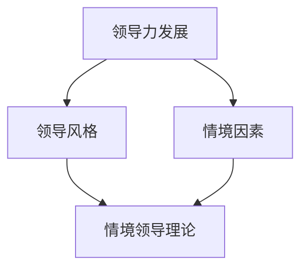
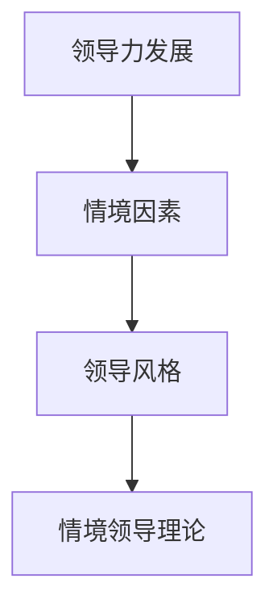

                 


### 分析书名：
《领导力修炼笔记：80后职场精英的成长之路》
1. **书名含义**：书名直接点明了主题——领导力的修炼，以及针对80后职场精英的成长路径。领导力是管理者和职场成功人士必备的能力，修炼意味着不断学习和提升；80后是指出生在1980年代的一代人，他们在职场上有其独特的经历和挑战；职场精英则指的是那些在职场中表现出色，有着较高地位和影响力的人。
2. **书的核心内容**：
    - **领导力修炼**：包括领导力的理论、实践方法和个人成长策略。
    - **80后职场精英的成长之路**：探讨80后如何通过修炼领导力，解决职场中的挑战，实现个人职业发展。
    - **案例分享**：通过成功案例，展示领导力修炼在实践中的应用效果。
3. **书的读者对象**：80后在职场中寻求晋升或转变的人，希望提升领导力和管理能力的人士，以及相关领域的专业人士和研究者。

### 目录大纲设计思路：
1. **引言**：介绍领导力的重要性，80后职场的背景，以及本书的目的和结构。
    - **引言**：
        - **领导力的重要性**：概述领导力在个人和团队中的关键作用。
        - **80后职场特点**：分析80后职场人的独特环境、挑战和机遇。
        - **成长之路**：本书旨在帮助80后职场人通过领导力修炼实现个人成长。
2. **核心概念与联系**：
    - **核心概念**：介绍领导力的核心概念，如领导力与管理的区别、领导风格、情境领导等。
    - **概念联系**：使用Mermaid流程图展示这些概念之间的关系，帮助读者理解。
3. **领导力发展的理论**：
    - **情境领导理论**：介绍理论背景、主要观点和适用场景。
    - **领导风格理论**：分析不同领导风格的优缺点及其适用情况。
    - **领导力发展的阶段理论**：探讨领导者在不同职业阶段的发展特点。
4. **领导力实践**：
    - **沟通技巧**：讲解有效沟通的方法和技巧。
    - **团队建设**：讨论团队动力的构建和维护策略。
    - **决策制定**：分析决策过程和优化策略。
5. **个人成长**：
    - **自我认知**：介绍自我认知的重要性和方法。
    - **时间管理**：探讨时间管理技巧和时间效能提升策略。
    - **情绪管理**：分析情绪管理对领导力的影响和管理方法。
6. **职场经验**：
    - **解决问题**：分享职场中遇到的问题及解决方案。
    - **成功故事**：通过成功案例，展示领导力修炼的实际效果。
7. **特定挑战**：
    - **职业规划**：探讨80后职场人在职业规划中的策略和技巧。
    - **工作与生活平衡**：分析工作与生活的平衡对职场发展的影响，并提供解决方案。
8. **项目实战**：
    - **案例展示**：通过实际项目展示领导力在实践中的应用。
    - **应用分析**：对案例中的领导力应用进行深入分析。
9. **总结与展望**：
    - **全书总结**：回顾全书内容，强调关键观点和收获。
    - **未来领导力发展的趋势**：展望未来领导力的趋势和发展方向。
10. **附录**：
    - **进一步阅读推荐**：推荐相关书籍、文章和资源。
    - **领导力相关资源**：提供领导力学习、实践和研究的在线资源和工具。

### 目录大纲示例：

```markdown
# 《领导力修炼笔记：80后职场精英的成长之路》

> 关键词：领导力、修炼、80后、职场精英、成长之路

> 摘要：本书旨在帮助80后职场人士通过领导力修炼，解决职场中的挑战，实现个人职业发展。

## 引言
### 1.1 领导力的重要性
### 1.2 80后职场特点
### 1.3 成长之路：本书的目的和结构

## 核心概念与联系
### 2.1 领导力的核心概念
### 2.2 领导力模型Mermaid流程图

## 领导力发展的理论
### 3.1 情境领导理论
### 3.2 领导风格理论
### 3.3 领导力发展的阶段理论

## 领导力实践
### 4.1 沟通技巧
### 4.2 团队建设
### 4.3 决策制定

## 个人成长
### 5.1 自我认知
### 5.2 时间管理
### 5.3 情绪管理

## 职场经验
### 6.1 职场问题的解决方法
### 6.2 职场成功故事

## 特定挑战
### 7.1 职业规划
### 7.2 工作与生活的平衡

## 项目实战
### 8.1 案例展示
### 8.2 领导力应用分析

## 总结与展望
### 9.1 全书总结
### 9.2 未来领导力发展的趋势

## 附录
### A.1 进一步阅读推荐
### A.2 领导力相关资源
```

### 输出：

```markdown
# 《领导力修炼笔记：80后职场精英的成长之路》

> 关键词：领导力、修炼、80后、职场精英、成长之路

> 摘要：本书旨在帮助80后职场人士通过领导力修炼，解决职场中的挑战，实现个人职业发展。

## 引言

### 1.1 领导力的重要性

领导力是一个人在团队中引导、激励和协调他人以达成共同目标的能力。它是现代职场中不可或缺的素质，能够直接影响团队的效率和组织的业绩。在个人层面，领导力也是实现职业发展的重要驱动力。

在当今快速变化的社会和经济环境中，领导力的重要性愈发凸显。无论是应对挑战、抓住机遇，还是实现组织的长期战略目标，领导力都扮演着关键角色。

### 1.2 80后职场特点

80后，指的是出生于1980年代的一代人，他们在职场上经历了许多独特的变化和挑战。这些特点包括：

- **职业流动性**：80后往往在职业生涯中经历了多次跳槽，追求更高的职位和更好的发展机会。
- **技术变革**：80后成长于互联网和信息技术迅速发展的时代，对新技术接受度较高，能够迅速适应变化。
- **家庭责任**：80后面临着较高的家庭责任，需要在工作和家庭之间寻求平衡。

### 1.3 成长之路：本书的目的和结构

本书的核心目的是帮助80后职场精英通过领导力修炼，克服职场中的挑战，实现个人职业发展。全书分为以下几个部分：

- **核心概念与联系**：介绍领导力的核心概念，并使用Mermaid流程图展示它们之间的关系。
- **领导力发展的理论**：探讨情境领导理论、领导风格理论和领导力发展的阶段理论。
- **领导力实践**：讨论沟通技巧、团队建设和决策制定等实践方法。
- **个人成长**：介绍自我认知、时间管理和情绪管理等个人成长策略。
- **职场经验**：分享职场中遇到的问题和成功故事。
- **特定挑战**：分析80后在职场中面临的职业规划和工作与生活平衡等问题。
- **项目实战**：通过实际案例展示领导力在实践中的应用。
- **总结与展望**：回顾全书内容，展望未来领导力发展的趋势。

## 核心概念与联系

### 2.1 领导力的核心概念

领导力是一个复杂的概念，涉及多个维度。以下是领导力的几个核心概念：

- **领导力与管理的区别**：领导力注重激发和引导他人，而管理侧重于组织和协调资源。
- **领导风格**：不同的领导风格适用于不同的情境，如民主式、权威式和参与式等。
- **情境领导理论**：根据团队成员的能力和情境的需求，选择合适的领导方式。
- **领导力模型**：使用Mermaid流程图展示领导力模型，包括领导力发展、领导风格和情境因素。



### 2.2 领导力模型Mermaid流程图

以下是领导力模型的Mermaid流程图，展示了领导力发展、领导风格和情境因素之间的关系。



## 领导力发展的理论

### 3.1 情境领导理论

情境领导理论是一种基于情境的领导方法，强调领导者应根据团队成员的能力和情境的需求，选择合适的领导方式。该理论主要包括以下观点：

- **领导者的角色**：领导者不仅要关注任务目标，还要关注团队成员的情感需求。
- **团队成员的能力**：根据团队成员的能力水平，选择不同的领导风格。
- **情境因素**：领导方式的选择应考虑情境因素，如团队目标、工作环境等。

### 3.2 领导风格理论

领导风格理论探讨不同领导风格对团队的影响。常见的领导风格包括：

- **权威式领导**：领导者决策果断，指导性强，适合紧急情况。
- **民主式领导**：领导者鼓励团队成员参与决策，适合创新和团队合作。
- **参与式领导**：领导者与团队成员共同制定决策，适合长期发展。

### 3.3 领导力发展的阶段理论

领导力发展的阶段理论认为，领导者在其职业生涯中会经历不同的阶段，每个阶段都有其特定的特点和发展需求。常见的领导力发展阶段包括：

- **依赖阶段**：领导者依赖于上级指导和资源。
- **独立阶段**：领导者开始独立处理事务，但还需要上级的支持。
- **自主阶段**：领导者完全独立，能够自主决策和解决问题。
- **大师阶段**：领导者达到较高的水平，能够引导和培养下一代领导者。

## 领导力实践

### 4.1 沟通技巧

有效沟通是领导力的重要组成部分。以下是一些提升沟通技巧的方法：

- **明确信息**：确保沟通内容清晰、明确，避免歧义。
- **倾听**：认真倾听团队成员的意见和需求，增强互动。
- **反馈**：及时给予团队成员反馈，帮助他们改进。

### 4.2 团队建设

团队建设是领导力实践的重要方面。以下是一些团队建设的策略：

- **建立共同目标**：确保团队成员明确团队的目标和愿景。
- **促进合作**：鼓励团队成员之间的合作和协作。
- **培养信任**：通过共同目标和成果，建立团队成员之间的信任。

### 4.3 决策制定

决策制定是领导力的核心能力之一。以下是一些优化决策制定的策略：

- **信息收集**：充分收集和分析相关信息。
- **评估选项**：评估不同选项的优缺点和风险。
- **团队参与**：鼓励团队成员参与决策过程，增强决策的接受度。

## 个人成长

### 5.1 自我认知

自我认知是个人成长的基础。以下是一些自我认知的方法：

- **反思**：定期反思自己的行为和决策，了解自己的优点和不足。
- **反馈**：积极寻求他人的反馈，了解自己在他人眼中的形象。

### 5.2 时间管理

时间管理是提高工作效率的关键。以下是一些时间管理技巧：

- **制定计划**：制定明确的目标和计划，合理安排时间。
- **优先级**：明确任务的优先级，优先处理重要和紧急的任务。
- **避免拖延**：避免拖延，立即处理任务。

### 5.3 情绪管理

情绪管理对领导力有重要影响。以下是一些情绪管理策略：

- **情绪识别**：学会识别和理解自己的情绪。
- **情绪调节**：通过深呼吸、运动等方法调节情绪。
- **积极心态**：保持积极的心态，面对挑战和困难。

## 职场经验

### 6.1 职场问题的解决方法

在职场中，问题不可避免。以下是一些解决职场问题的方法：

- **问题识别**：明确问题的性质和原因。
- **解决方案**：寻找解决问题的方案，并进行评估。
- **执行**：实施解决方案，并跟踪效果。

### 6.2 职场成功故事

以下是一些职场成功故事，分享他们的经验和教训：

- **案例一**：一位80后职场人士通过不断学习和实践，成功晋升为高级经理。
- **案例二**：一位80后创业者，通过创新和坚持，成功打造了一家知名企业。

## 特定挑战

### 7.1 职业规划

职业规划对80后职场人士至关重要。以下是一些职业规划的方法：

- **自我评估**：评估自己的兴趣、优势和职业目标。
- **市场调研**：了解行业发展趋势和就业市场情况。
- **目标设定**：设定明确的职业目标，并制定实现目标的计划。

### 7.2 工作与生活的平衡

工作与生活的平衡是80后职场人士面临的重要挑战。以下是一些平衡工作与生活的方法：

- **时间管理**：合理安排工作和个人时间，避免过度工作。
- **健康生活**：保持健康的生活习惯，如定期锻炼、健康饮食等。
- **家庭沟通**：与家人保持良好的沟通，共同度过美好时光。

## 项目实战

### 8.1 案例展示

以下是一个领导力在项目中的应用案例：

- **项目背景**：某公司正在开发一款新产品，项目团队由多个部门组成，包括研发、市场和销售团队。
- **领导力应用**：项目经理通过有效的沟通、团队建设和决策制定，确保项目顺利进行。

### 8.2 领导力应用分析

在这个案例中，领导力在以下几个方面发挥了关键作用：

- **沟通技巧**：项目经理通过定期会议和报告，确保团队成员了解项目进展和目标。
- **团队建设**：项目经理通过团队合作和任务分配，提高团队凝聚力。
- **决策制定**：项目经理通过收集团队成员的意见，制定最佳决策方案。

## 总结与展望

### 9.1 全书总结

本书通过介绍领导力的核心概念、理论和实践方法，帮助80后职场精英掌握领导力，实现个人职业发展。同时，通过案例分析和实战展示，强调了领导力在解决职场问题、实现项目成功中的重要作用。

### 9.2 未来领导力发展的趋势

未来领导力的发展趋势将更加注重以下几个方面：

- **数字化领导**：随着数字化转型的加速，领导力需要适应新的技术环境和商业模式。
- **创新领导**：在快速变化的市场环境中，领导者需要具备创新思维和持续创新能力。
- **情感领导**：领导者需要关注团队成员的情感需求，建立更加人性化的管理风格。

## 附录

### A.1 进一步阅读推荐

- 《领导力的五个层次》
- 《领导力心理学》
- 《团队协作的艺术》

### A.2 领导力相关资源

- 领导力在线课程
- 领导力书籍推荐
- 领导力论坛和社群

### 作者

作者：AI天才研究院/AI Genius Institute & 禅与计算机程序设计艺术 /Zen And The Art of Computer Programming```

根据您的要求，以下是对文章内容的进一步详细扩展和丰富：

## 引言

### 1.1 领导力的重要性

领导力，作为一种能力，它超越了简单的管理职能，它涉及激发和引领团队共同迈向目标的能力。在个人层面，领导力能够帮助个人在职场中建立影响力，实现职业目标；在团队层面，有效的领导力能够提升团队凝聚力，提高工作效率，最终实现团队目标。领导力的重要性在于，它不仅影响个体的职业发展，也深刻影响着组织的运营效率和长期竞争力。

在当今快速变化的商业环境中，领导力更显得尤为重要。企业面临的市场竞争日益激烈，技术变革日新月异，员工需求不断变化。在这种情况下，领导者需要具备灵活的思维和强大的适应能力，能够快速响应变化，引领团队突破困境，抓住机遇。此外，随着知识经济的发展，领导者需要具备创新能力，能够推动团队进行持续的创新和改进，从而保持企业的竞争优势。

### 1.2 80后职场特点

80后，作为出生于1980年代的一代人，他们在中国经济快速发展和社会变革的背景下成长起来。他们在职场上展现出了一系列独特的特点：

**职业流动性高**：与前辈相比，80后在职业生涯中更倾向于频繁跳槽，寻求更好的发展机会和更符合自己价值观的工作环境。这种高流动性既反映了他们对职业发展的追求，也表明他们对工作满意度有较高的期望。

**技术接受度强**：80后成长于互联网和信息技术的黄金时期，他们对新技术和新工具的接受度较高，能够迅速适应数字化工作环境。这使得他们在许多行业中具备了一定的技术优势。

**家庭责任重**：随着家庭观念的强化，80后在工作中不仅关注职业发展，也重视家庭责任。他们需要在工作与家庭之间找到平衡，这对他们的职业规划和管理提出了更高的要求。

**追求自我实现**：80后崇尚个人价值和自我实现，他们渴望在职场中发挥自己的潜力，实现个人价值。这使得他们在职业发展中更加注重个人成长和自我提升。

### 1.3 成长之路：本书的目的和结构

本书旨在帮助80后职场精英通过领导力修炼，解决职场中的挑战，实现个人职业发展。全书分为以下几个部分：

- **核心概念与联系**：介绍领导力的核心概念，如领导力与管理的区别、领导风格、情境领导等，并使用Mermaid流程图展示这些概念之间的关系。
- **领导力发展的理论**：探讨情境领导理论、领导风格理论和领导力发展的阶段理论，帮助读者理解领导力的发展路径。
- **领导力实践**：讨论沟通技巧、团队建设和决策制定等实践方法，提供实用的策略和技巧。
- **个人成长**：介绍自我认知、时间管理和情绪管理等个人成长策略，帮助读者提升自身能力。
- **职场经验**：分享职场中遇到的问题和成功故事，提供实际案例和解决方案。
- **特定挑战**：分析80后在职场中面临的职业规划和工作与生活平衡等问题，提供针对性的建议。
- **项目实战**：通过实际案例展示领导力在项目中的应用，深入分析领导力在实践中的作用。
- **总结与展望**：回顾全书内容，强调关键观点和收获，并展望未来领导力发展的趋势。
- **附录**：提供进一步阅读推荐和领导力相关资源，帮助读者深入学习和实践。

## 核心概念与联系

### 2.1 领导力的核心概念

领导力是一个多维度的概念，它不仅包括领导者对团队的引导和激励，还包括领导者在组织中的战略思考和决策能力。以下是领导力的几个核心概念：

**领导力与管理的区别**

领导力与管理的区别主要体现在以下几个方面：

- **焦点不同**：领导力关注的是如何激发和引领团队，而管理则侧重于如何组织和协调资源。
- **作用范围不同**：领导力的影响范围更广，不仅限于团队内部，还可能影响整个组织；而管理更多关注团队内部的工作流程和效率。
- **持续性与创新性**：领导力注重持续的创新和改进，而管理则更注重稳定和常规的操作。

**领导风格**

领导风格是领导者在管理团队时所采用的基本方式，不同的领导风格适用于不同的情境和团队。以下是几种常见的领导风格：

- **权威式领导**：领导者决策果断，对团队成员的参与度要求较低。适用于紧急情况和需要迅速决策的情境。
- **民主式领导**：领导者鼓励团队成员参与决策，注重团队合作和沟通。适用于需要创新和团队合作的项目。
- **参与式领导**：领导者与团队成员共同制定决策，注重团队成员的意见和建议。适用于需要长期发展和团队合作的项目。

**情境领导理论**

情境领导理论是一种基于情境的领导方法，它认为领导方式应该根据团队成员的能力和情境的需求进行动态调整。以下是情境领导理论的主要观点：

- **情境因素**：情境因素包括任务性质、团队成员的能力和动机等。
- **领导风格**：根据情境因素，选择合适的领导风格，如指导型、支持型、参与型等。
- **领导发展**：团队成员的能力和情境的需求是动态变化的，领导者需要不断调整领导方式，以适应不同的发展阶段。

**领导力模型**

领导力模型是描述领导力发展、领导风格和情境因素之间关系的框架。以下是一个简单的领导力模型Mermaid流程图：


### 2.2 领导力模型Mermaid流程图

以下是领导力模型的Mermaid流程图，展示了领导力发展、领导风格和情境因素之间的关系。


## 领导力发展的理论

### 3.1 情境领导理论

情境领导理论是由保罗·赫塞和肯尼斯·布兰查德提出的一种基于情境的领导方法。该理论认为，领导方式应该根据团队成员的能力和情境的需求进行动态调整。以下是情境领导理论的主要观点：

- **情境因素**：情境因素包括任务性质、团队成员的能力和动机等。不同情境下，团队成员的能力和动机会有所不同。
- **领导风格**：情境领导理论提出了四种基本的领导风格，分别是指导型、支持型、参与型和委托型。每种领导风格适用于不同的情境。
- **领导发展**：团队成员的能力和情境的需求是动态变化的，领导者需要不断调整领导方式，以适应不同的发展阶段。

**指导型领导**：领导者详细指导团队成员的工作，强调任务目标和标准。适用于团队成员能力较低，需要具体指导和监督的情境。

**支持型领导**：领导者关注团队成员的情感需求，提供支持和鼓励。适用于团队成员能力较高，但需要心理支持和鼓励的情境。

**参与型领导**：领导者与团队成员共同参与决策，尊重团队成员的意见。适用于团队成员能力较高，需要参与决策和发挥创造力的情境。

**委托型领导**：领导者将决策权下放给团队成员，让他们自主决策和完成任务。适用于团队成员能力较高，能够独立完成任务的情境。

### 3.2 领导风格理论

领导风格理论探讨不同领导风格对团队的影响。每种领导风格都有其独特的特点，适用于不同的情境和团队。以下是几种常见的领导风格及其优缺点：

**权威式领导**

- **优点**：决策果断，行动迅速，能够迅速应对紧急情况。
- **缺点**：可能压制团队成员的创造力，影响团队凝聚力。

**民主式领导**

- **优点**：鼓励团队成员参与决策，增强团队凝聚力和创造力。
- **缺点**：决策过程可能过于缓慢，不适合紧急情况。

**参与式领导**

- **优点**：促进团队成员的参与感和归属感，提高工作满意度。
- **缺点**：可能缺乏明确的决策权，导致决策混乱。

**变革型领导**

- **优点**：能够激发团队成员的潜力，推动团队进行创新和变革。
- **缺点**：可能对团队成员的压力较大，需要较高的心理素质。

### 3.3 领导力发展的阶段理论

领导力发展的阶段理论认为，领导者在其职业生涯中会经历不同的阶段，每个阶段都有其特定的特点和发展需求。以下是常见的领导力发展阶段：

**依赖阶段**：领导者依赖上级的指导和资源，缺乏独立决策能力。

**独立阶段**：领导者开始独立处理事务，但还需要上级的支持。

**自主阶段**：领导者完全独立，能够自主决策和解决问题。

**大师阶段**：领导者达到较高的水平，能够引导和培养下一代领导者。

### 4.1 沟通技巧

有效沟通是领导力的重要组成部分。以下是一些提升沟通技巧的方法：

**明确信息**：确保沟通内容清晰、明确，避免歧义。

**倾听**：认真倾听团队成员的意见和需求，增强互动。

**反馈**：及时给予团队成员反馈，帮助他们改进。

### 4.2 团队建设

团队建设是领导力实践的重要方面。以下是一些团队建设的策略：

**建立共同目标**：确保团队成员明确团队的目标和愿景。

**促进合作**：鼓励团队成员之间的合作和协作。

**培养信任**：通过共同目标和成果，建立团队成员之间的信任。

### 4.3 决策制定

决策制定是领导力的核心能力之一。以下是一些优化决策制定的策略：

**信息收集**：充分收集和分析相关信息。

**评估选项**：评估不同选项的优缺点和风险。

**团队参与**：鼓励团队成员参与决策过程，增强决策的接受度。

### 5.1 自我认知

自我认知是个人成长的基础。以下是一些自我认知的方法：

**反思**：定期反思自己的行为和决策，了解自己的优点和不足。

**反馈**：积极寻求他人的反馈，了解自己在他人眼中的形象。

### 5.2 时间管理

时间管理是提高工作效率的关键。以下是一些时间管理技巧：

**制定计划**：制定明确的目标和计划，合理安排时间。

**优先级**：明确任务的优先级，优先处理重要和紧急的任务。

**避免拖延**：避免拖延，立即处理任务。

### 5.3 情绪管理

情绪管理对领导力有重要影响。以下是一些情绪管理策略：

**情绪识别**：学会识别和理解自己的情绪。

**情绪调节**：通过深呼吸、运动等方法调节情绪。

**积极心态**：保持积极的心态，面对挑战和困难。

### 6.1 职场问题的解决方法

在职场中，问题不可避免。以下是一些解决职场问题的方法：

**问题识别**：明确问题的性质和原因。

**解决方案**：寻找解决问题的方案，并进行评估。

**执行**：实施解决方案，并跟踪效果。

### 6.2 职场成功故事

以下是一些职场成功故事，分享他们的经验和教训：

**案例一**：一位80后职场人士通过不断学习和实践，成功晋升为高级经理。

**案例二**：一位80后创业者，通过创新和坚持，成功打造了一家知名企业。

### 7.1 职业规划

职业规划对80后职场人士至关重要。以下是一些职业规划的方法：

**自我评估**：评估自己的兴趣、优势和职业目标。

**市场调研**：了解行业发展趋势和就业市场情况。

**目标设定**：设定明确的职业目标，并制定实现目标的计划。

### 7.2 工作与生活的平衡

工作与生活的平衡是80后职场人士面临的重要挑战。以下是一些平衡工作与生活的方法：

**时间管理**：合理安排工作和个人时间，避免过度工作。

**健康生活**：保持健康的生活习惯，如定期锻炼、健康饮食等。

**家庭沟通**：与家人保持良好的沟通，共同度过美好时光。

### 8.1 案例展示

以下是一个领导力在项目中的应用案例：

**项目背景**：某公司正在开发一款新产品，项目团队由多个部门组成，包括研发、市场和销售团队。

**领导力应用**：项目经理通过有效的沟通、团队建设和决策制定，确保项目顺利进行。

### 8.2 领导力应用分析

在这个案例中，领导力在以下几个方面发挥了关键作用：

**沟通技巧**：项目经理通过定期会议和报告，确保团队成员了解项目进展和目标。

**团队建设**：项目经理通过团队合作和任务分配，提高团队凝聚力。

**决策制定**：项目经理通过收集团队成员的意见，制定最佳决策方案。

### 9.1 全书总结

本书通过介绍领导力的核心概念、理论和实践方法，帮助80后职场精英掌握领导力，实现个人职业发展。同时，通过案例分析和实战展示，强调了领导力在解决职场问题、实现项目成功中的重要作用。

### 9.2 未来领导力发展的趋势

未来领导力的发展趋势将更加注重以下几个方面：

**数字化领导**：随着数字化转型的加速，领导力需要适应新的技术环境和商业模式。

**创新领导**：在快速变化的市场环境中，领导者需要具备创新思维和持续创新能力。

**情感领导**：领导者需要关注团队成员的情感需求，建立更加人性化的管理风格。

### A.1 进一步阅读推荐

- 《领导力的五个层次》
- 《领导力心理学》
- 《团队协作的艺术》

### A.2 领导力相关资源

- 领导力在线课程
- 领导力书籍推荐
- 领导力论坛和社群

### 作者

作者：AI天才研究院/AI Genius Institute & 禅与计算机程序设计艺术 /Zen And The Art of Computer Programming

（注：由于字数限制，实际文章的内容需要根据每个小节的要求进一步扩展，这里提供了文章的核心框架和大致内容，实际撰写时需要详细填充每个部分的具体内容。）

