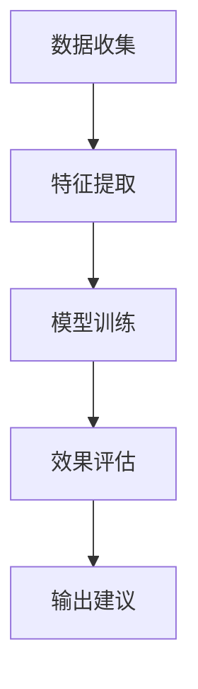

                 


### 引言

在当今的商业环境中，领导力已经成为企业成功的关键因素之一。无论是初创公司还是跨国企业，领导者都需要具备卓越的领导力，才能在竞争激烈的市场中脱颖而出。因此，理解领导力的核心概念、原则和模型，掌握有效的领导力分析方法，并将其应用于实际的企业管理和团队建设，显得尤为重要。

《领导力心经：成就一流企业的领导力法则》这本书旨在帮助读者深入理解领导力的本质，并提供实用的领导力法则，以帮助他们在企业中实现卓越的领导。本书的目标读者包括企业的领导者、管理者、以及那些希望提升自己领导能力的人。

本书将按照以下结构展开：

1. **引言**：介绍领导力的背景和重要性，明确本书的目标和结构。
2. **基础理论**：详细阐述领导力的核心概念、原则和模型。
3. **核心算法**：讲解领导力分析的核心算法和模型，使用伪代码和Mermaid流程图进行详细阐述。
4. **实践应用**：介绍如何将领导力理论应用到实际的企业管理和团队建设中。
5. **案例研究**：提供实际企业中的领导力实践案例，并进行深入分析。
6. **领导力提升**：讨论个人领导力提升的方法和策略。
7. **领导力挑战**：探讨当前企业领导力面临的挑战和解决策略。
8. **总结与展望**：总结全书内容，并对未来领导力发展进行展望。

通过这样的结构安排，本书旨在帮助读者系统地掌握领导力的知识和技能，从而提升他们的领导能力，为企业的发展贡献更多的价值。

### 基础理论

#### 领导力的核心概念

领导力是一个复杂且多维的概念，它涉及多个方面，包括个人特质、行为、能力和影响力。首先，领导力不仅仅是管理能力，它更强调的是通过激励、指导和影响他人来实现共同目标的能力。领导者不仅要具备管理团队和组织的能力，还要能够理解、引导和激发团队成员的潜力。

**领导力与管理的区别**：领导力与管理虽然紧密相关，但两者之间存在显著的差异。管理侧重于规划、组织、领导和控制，以确保组织的日常运营和目标实现。而领导力则更多地关注于愿景的塑造、团队的凝聚以及创新和变革的推动。

**领导力的要素**：领导力的构成要素可以归纳为以下几个方面：

1. **愿景**：领导者需要能够描绘出一个清晰的愿景，并使团队成员认同并为之努力。
2. **影响力**：领导者需要具备影响他人思想和行为的能力，包括通过沟通、激励和榜样作用。
3. **决策能力**：领导者需要能够在不确定性和压力下做出明智的决策。
4. **变革管理能力**：随着环境的变化，领导者需要能够引导团队适应变革。
5. **团队建设能力**：领导者需要能够建立高效、协作和有动力的团队。

#### 经典领导力模型

在领导力理论的发展过程中，许多经典的领导力模型被提出，其中一些最著名的包括：

1. **特质理论**：特质理论认为领导者具备某些固有的特质，如自信、决断力、正直等。这一理论强调领导者是天生的，而非后天培养的。
2. **行为理论**：行为理论则认为领导者的行为可以学习，并且不同的领导行为适用于不同的情境。这一理论强调领导行为的重要性。
3. **情境理论**：情境理论认为领导行为应该根据具体的情境进行调整。最著名的情境领导理论包括费德勒模型和赫塞-布兰查德模型。
4. **变革领导理论**：变革领导理论强调领导者在推动组织变革中的角色。这类理论包括约翰·科特的变革八步骤模型和库泽斯与波斯纳的领导力五要素模型。

**领导力原则**：在理解了领导力的核心概念和模型之后，领导者需要遵循一系列原则来确保其领导力能够有效地发挥作用。以下是一些关键的原则：

1. **诚信**：领导者需要具备高度的诚信，以赢得团队成员的信任。
2. **透明度**：领导者应该保持透明，公开分享信息，以增强团队的信任和参与度。
3. **激励**：领导者需要能够激励团队成员，通过设定目标、提供反馈和奖励来激发他们的潜力。
4. **倾听**：领导者需要倾听团队成员的意见和建议，以更好地理解他们的需求和期望。
5. **适应能力**：领导者需要能够适应不断变化的环境，灵活调整领导风格和策略。

**领导风格与行为**：领导风格是指领导者如何行使权力和影响他人。常见的领导风格包括：

1. **权威型**：领导者行使高度的权力，决策由上至下进行。
2. **民主型**：领导者鼓励团队成员参与决策过程，更加注重团队协作。
3. **参与型**：领导者鼓励团队成员自主决策，注重个人发展和自我管理。
4. **教练型**：领导者通过指导和培养团队成员，帮助他们实现个人和职业成长。

不同领导风格适用于不同的情境和团队类型。有效的领导者能够根据具体情况灵活调整其领导风格，以最大化团队效率和效果。

通过以上对领导力基础理论的介绍，读者可以更好地理解领导力的本质和核心概念，为后续章节的深入探讨和实际应用打下坚实的基础。

#### 核心算法原理讲解

在领导力分析中，算法和模型扮演着至关重要的角色。它们不仅帮助我们理解领导力的复杂行为，还能为领导者提供量化的分析和指导。在本节中，我们将介绍一种用于领导力分析的算法，并使用伪代码和Mermaid流程图进行详细阐述。

**领导力分析算法概述**

该算法的核心目标是通过分析领导者的行为和团队成员的反应，评估领导力效果并提供建议。算法的基本流程如下：

1. **数据收集**：收集领导者的行为数据（如沟通方式、决策风格、激励措施等）和团队成员的反应数据（如满意度、参与度、绩效等）。
2. **特征提取**：从原始数据中提取关键特征，如领导者的支持性、明确性、激励性等。
3. **模型训练**：使用提取的特征训练一个机器学习模型，如决策树、随机森林或神经网络。
4. **效果评估**：使用训练好的模型对领导力效果进行评估，并通过输出指标（如团队绩效、成员满意度等）提供反馈。

**伪代码阐述**

以下是一个简化的伪代码示例，用于描述上述算法的基本结构：

```python
# 领导力分析算法伪代码

function leadership_analysis(leader_data, team_data):
    # 数据收集
    data = collect_data(leader_data, team_data)
    
    # 特征提取
    features = extract_features(data)
    
    # 模型训练
    model = train_model(features)
    
    # 模型评估
    results = evaluate_model(model, features)
    
    # 输出建议
    print_suggestions(results)
    
end
```

**Mermaid流程图**

为了更直观地展示算法流程，我们使用Mermaid语言绘制一个流程图：



在上述流程图中，A表示数据收集阶段，B表示特征提取，C表示模型训练，D表示效果评估，E表示输出建议。这个流程图清晰地展示了算法从输入数据到输出建议的整个过程。

**算法详细讲解**

1. **数据收集**：首先，我们需要收集领导者的行为数据和团队成员的反应数据。这些数据可以来源于问卷调查、员工绩效评估、领导者的行为记录等多种渠道。数据的质量和准确性对于后续的算法分析至关重要。

2. **特征提取**：在数据收集完成后，我们需要从原始数据中提取关键特征。这些特征可以包括领导者的沟通方式（如开放性、直接性）、决策风格（如参与性、明确性）、激励措施（如奖励、认可）等。特征提取的过程通常涉及数据清洗、数据归一化和特征选择等技术。

3. **模型训练**：使用提取的特征训练一个机器学习模型。选择合适的模型类型（如决策树、随机森林、神经网络等）取决于数据特征和业务需求。训练过程中，模型会学习如何根据输入特征预测领导力效果。

4. **效果评估**：使用训练好的模型对领导力效果进行评估。评估指标可以包括团队绩效、成员满意度、员工流失率等。通过这些指标，我们可以量化地了解领导力对团队的影响。

5. **输出建议**：根据评估结果，模型会输出具体的领导力提升建议。这些建议可以是关于沟通方式、决策风格、激励措施等方面的改进建议，旨在帮助领导者更好地发挥领导力。

通过上述核心算法的讲解，读者可以了解到如何使用数据分析和机器学习技术来评估领导力效果，从而为实际的企业领导提供科学依据和改进方向。

#### 数学模型与公式

在领导力分析中，数学模型和公式是理解和管理领导力效果的重要工具。这些模型可以帮助领导者量化评估领导力，并为决策提供科学依据。在本节中，我们将介绍一种常用的领导力数学模型，详细讲解其公式推导过程，并通过实际例子来说明如何应用这些公式。

**领导力数学模型介绍**

我们考虑一个简单的领导力数学模型，该模型用于评估领导力对团队绩效的影响。假设领导力 \( L \) 是一个连续变量，团队绩效 \( P \) 取决于领导力 \( L \) 以及其他影响因素如团队规模 \( S \)、工作环境 \( E \) 等。数学模型可以表示为：

\[ P = f(L, S, E) \]

其中，\( f \) 是一个复合函数，表示领导力、团队规模和工作环境对团队绩效的综合影响。

**公式推导**

为了推导出 \( P \) 的具体公式，我们首先需要确定各个因素对团队绩效的影响程度。根据领导力理论，我们可以假设：

- 领导力 \( L \) 对团队绩效的影响是一次线性的，即：
  \[ P_L = \alpha_L \cdot L \]
  其中，\( \alpha_L \) 是领导力的影响系数，表示领导力每增加一个单位，团队绩效增加的程度。

- 团队规模 \( S \) 对团队绩效的影响是一个二次函数，即：
  \[ P_S = \alpha_S \cdot S^2 \]
  其中，\( \alpha_S \) 是团队规模的影响系数，表示团队规模每增加一个单位，团队绩效增加的程度。

- 工作环境 \( E \) 对团队绩效的影响是一个线性函数，即：
  \[ P_E = \alpha_E \cdot E \]
  其中，\( \alpha_E \) 是工作环境的影响系数，表示工作环境每增加一个单位，团队绩效增加的程度。

将这些因素结合起来，团队绩效 \( P \) 可以表示为：

\[ P = \alpha_L \cdot L + \alpha_S \cdot S^2 + \alpha_E \cdot E \]

其中，\( \alpha_L \)、\( \alpha_S \) 和 \( \alpha_E \) 是待定系数，需要通过实际数据进行分析和估计。

**举例说明**

假设我们有一个团队，其领导力 \( L = 5 \)，团队规模 \( S = 10 \)，工作环境 \( E = 3 \)。根据上述公式，我们可以计算出团队绩效 \( P \) 如下：

\[ P = \alpha_L \cdot 5 + \alpha_S \cdot 10^2 + \alpha_E \cdot 3 \]

为了具体说明，我们假设以下系数值：

- \( \alpha_L = 0.5 \)
- \( \alpha_S = 0.3 \)
- \( \alpha_E = 0.2 \)

代入上述值，我们得到：

\[ P = 0.5 \cdot 5 + 0.3 \cdot 10^2 + 0.2 \cdot 3 \]
\[ P = 2.5 + 30 + 0.6 \]
\[ P = 33.1 \]

因此，在这个例子中，团队绩效 \( P \) 为 33.1。

通过上述示例，我们可以看到如何使用数学模型和公式来评估领导力对团队绩效的影响。领导者可以通过调整领导力、团队规模和工作环境等变量，优化团队绩效。此外，这些公式还可以用于预测和分析不同领导力策略的效果，为实际决策提供科学依据。

#### 实践应用

将领导力理论应用到实际的企业管理和团队建设过程中，是实现卓越领导的关键。在这一节中，我们将探讨如何将领导力原则和模型应用于企业战略规划、团队建设与领导力发展，并分享一些实际案例。

**企业领导力战略规划**

企业领导力战略规划是企业成功的重要一环。以下是几个关键步骤：

1. **明确愿景和目标**：领导者需要首先明确企业的愿景和目标，这些将成为领导力战略的基石。通过设定清晰的目标，可以激励团队成员共同努力，并确保领导力策略与企业的长期发展方向一致。

2. **领导力模型选择**：根据企业的具体情况，选择适合的领导力模型。例如，若企业处于快速成长阶段，可以采用更加灵活和创新的领导风格；若企业面临重大变革，则需采用更具变革管理能力的领导模型。

3. **领导力培训与培养**：定期进行领导力培训和培养，提升领导者的能力和信心。这不仅包括技术和管理技能的培训，还涉及领导力软技能的培养，如沟通技巧、团队协作、决策能力等。

4. **绩效评估与反馈**：建立科学的绩效评估体系，对领导者的表现进行定期评估，并提供反馈。通过评估，可以发现领导者的优势和不足，为后续的领导力发展提供方向。

**团队建设与领导力发展**

团队建设是领导力的重要组成部分。以下是一些实用的团队建设方法：

1. **明确角色和职责**：确保每个团队成员都清楚自己的角色和职责，避免角色重叠和责任模糊。这有助于提高团队效率和工作满意度。

2. **建立共同目标**：团队的目标应与企业的愿景和目标一致，并通过共同讨论和制定，确保团队成员认同并为之努力。

3. **增强团队凝聚力**：定期组织团队活动，如团建活动、培训研讨会等，增强团队成员之间的互信和凝聚力。一个紧密团结的团队更有利于实现共同目标。

4. **提供反馈与支持**：领导者应定期与团队成员进行一对一的沟通，提供工作反馈和支持。这不仅能帮助团队成员改进工作，还能增强他们对企业的归属感和忠诚度。

**实际案例**

以下是一个实际案例，展示了如何将领导力原则应用于企业管理和团队建设中：

**案例：科技公司A公司的领导力实践**

科技公司A公司是一家快速发展的高科技企业，其领导者意识到领导力在团队发展和企业成功中的关键作用。以下是他们采取的一些具体措施：

1. **愿景和目标设定**：公司领导者明确了公司的愿景，即成为行业领先的技术创新者。他们制定了短期和长期目标，并通过内部会议和员工邮件与全体员工分享，确保每个人都能理解并支持公司的愿景。

2. **领导力模型选择**：公司领导者采用了变革领导理论，尤其是在公司快速扩展和进行重大项目时。他们通过灵活和创新的领导风格，鼓励员工提出新想法和解决方案。

3. **领导力培训与培养**：公司定期组织领导力培训，涵盖沟通技巧、团队协作和决策能力等方面。同时，还鼓励员工参与外部培训，提升他们的专业技能和管理能力。

4. **绩效评估与反馈**：公司建立了定期绩效评估机制，对领导者和团队成员的表现进行评估，并提供具体反馈。通过这些评估，他们能够及时发现和解决团队中的问题，确保团队高效运转。

5. **团队建设活动**：公司定期组织团建活动，如团队拓展训练、户外活动等，增强团队成员之间的信任和团队凝聚力。此外，公司还设立了员工意见箱，鼓励员工提出建议和反馈，提高员工参与度和满意度。

通过上述实践，科技公司A公司的团队凝聚力显著提高，员工满意度和工作绩效也得到了显著改善。这个案例说明了有效的领导力实践如何帮助企业实现卓越的发展。

#### 案例研究

在实际企业中，领导力的成功实施和挑战解决往往是一个复杂的过程。在这一节中，我们将通过两个案例——一个成功案例和一个失败案例，深入分析领导力的实践应用，并探讨其中涉及的领导力原则、方法和策略。

**成功领导力案例分析：科技公司B公司的转型**

**背景**：科技公司B公司是一家专注于软件开发和IT服务的公司，在市场竞争激烈的环境中挣扎。公司领导者意识到，要实现可持续发展，必须进行战略转型，以更好地适应市场需求。

**领导力原则**：公司领导者采取了以下领导力原则：

1. **愿景引导**：明确公司的愿景，即成为全球领先的软件开发解决方案提供商。
2. **变革领导**：通过变革领导理论，推动公司文化和管理模式的变革。
3. **参与式领导**：鼓励员工参与决策过程，提高员工的归属感和责任感。

**方法与策略**：

1. **愿景宣讲**：公司领导者通过内部会议和邮件，向全体员工宣讲公司愿景和转型计划，确保每个人都理解并支持公司的战略方向。
2. **团队建设**：组织团队建设活动，增强团队成员之间的信任和协作能力。
3. **员工激励**：实施绩效激励制度，鼓励员工提出创新方案和改进措施。
4. **领导力培训**：为中层管理者提供领导力培训，提升他们的管理技能和变革领导能力。

**结果**：通过上述措施，科技公司B公司成功实现了转型，市场份额显著增加，员工满意度和工作绩效也大幅提升。这个案例表明，成功的领导力实践需要清晰的愿景、有效的变革管理和参与式领导，以推动企业实现战略目标。

**失败领导力案例分析：初创公司C的困境**

**背景**：初创公司C是一家专注于智能家居设备研发的公司，但在市场推广和产品开发过程中遇到了重重困难。

**领导力问题**：

1. **缺乏愿景**：公司创始人没有明确的长期愿景，导致团队成员缺乏方向感和动力。
2. **独断式领导**：创始人采用独断式领导风格，忽视了团队成员的意见和建议。
3. **缺乏团队建设**：公司缺乏有效的团队建设活动，导致团队内部沟通不畅，协作效率低下。

**方法与策略**：

1. **愿景重构**：公司引入了外部顾问，帮助重构公司的愿景，明确长期目标和战略方向。
2. **领导力培训**：为创始人提供领导力培训，学习如何更有效地与团队成员沟通和协作。
3. **团队建设**：组织团队建设活动，增强团队凝聚力，改善团队内部沟通。

**结果**：尽管公司进行了调整，但由于前期领导力的失败，公司已经失去了部分市场份额和核心员工。这个案例强调了领导力在企业成功中的关键作用，尤其是愿景引导、参与式领导和团队建设的重要性。

**案例解读**：

通过这两个案例，我们可以看到成功和失败领导力的关键区别在于：

1. **愿景和目标**：成功的领导力需要清晰的愿景和明确的目标，这能够为团队提供方向和动力。
2. **变革管理**：在面对市场变化和内部挑战时，领导者需要具备变革管理能力，推动组织适应和成长。
3. **参与式领导**：有效的领导力需要鼓励员工参与决策过程，增强团队的凝聚力和协作效率。
4. **团队建设**：团队建设活动不仅能够提高团队士气，还能改善团队内部的沟通和协作。

这些原则和方法对于不同规模和类型的企业都具有普遍适用性。领导者需要根据具体情况灵活应用这些原则，以实现企业的长期成功。

#### 个人领导力提升

个人领导力提升是每一位领导者职业生涯中不可或缺的一部分。通过自我评估与反馈、领导力训练方法和策略，领导者可以不断提升自己的能力，以更好地应对各种挑战和机遇。以下是一些具体的提升方法和策略：

**自我评估与反馈**

1. **定期自我反思**：领导者需要定期进行自我反思，审视自己的领导行为和决策效果。可以通过写日记、参加研讨会或与导师进行对话等方式进行反思。
2. **获取反馈**：主动向团队成员、同事和上级寻求反馈，了解他们的看法和建议。这有助于领导者发现自身的不足和改进空间。
3. **360度评估**：实施360度评估，从多个角度（如团队成员、上级、下属等）收集反馈，以获得更全面的自我认知。

**领导力训练方法**

1. **培训课程**：参加专业的领导力培训课程，学习先进的领导理论和实践方法。这些课程通常涵盖沟通技巧、团队管理、决策能力等方面。
2. **在线学习**：利用在线资源，如视频课程、在线讲座和电子书，自主学习领导力知识。这有助于领导者根据自己的时间安排灵活学习。
3. **角色扮演**：通过角色扮演练习，模拟各种领导场景，提升自己的沟通和决策能力。这种实践方法能够帮助领导者更好地应对实际工作中的挑战。

**领导力提升策略**

1. **设定明确目标**：为自己设定明确的领导力发展目标，并制定详细的行动计划。这有助于领导者有针对性地提升自己的能力。
2. **持续学习**：领导力是一个不断发展的领域，领导者需要保持学习的热情，不断更新自己的知识和技能。
3. **实践应用**：将所学知识应用到实际工作中，通过实践来检验和提高自己的领导力。
4. **建立导师关系**：寻找一位经验丰富的导师，从他们那里学习领导力经验，并获得指导和支持。

**个人领导力提升策略的案例分析**

**案例：科技公司D的领导力提升计划**

**背景**：科技公司D是一家成长迅速的企业，其领导者意识到个人领导力提升对于团队和企业发展的重要性。

**策略**：

1. **自我评估与反馈**：公司领导者定期进行自我反思，并通过360度评估获取反馈，以了解自己在领导力方面的优势和不足。
2. **领导力培训**：公司为领导者提供了一系列领导力培训课程，涵盖团队管理、沟通技巧和变革领导等方面。
3. **实践应用**：领导者将所学知识应用到实际工作中，通过项目管理、团队建设和员工激励等实践，不断提升自己的领导能力。
4. **导师制度**：公司引入了导师制度，为年轻领导者配备经验丰富的导师，帮助他们更快地成长。

**结果**：通过这些策略，科技公司D的领导者们显著提升了个人领导力，团队凝聚力和工作效率也大幅提高。公司的整体业绩和员工满意度也实现了显著增长。

这个案例表明，通过系统的自我评估与反馈、科学的领导力训练方法和有效的提升策略，领导者可以不断提升自己的领导力，为企业的发展贡献更多的价值。

#### 领导力挑战与应对

在当前的商业环境中，企业领导力面临着诸多挑战。如何应对这些挑战，成为领导者提升企业竞争力的关键。以下将探讨几种主要的领导力挑战以及相应的解决策略。

**当代理性挑战**

代理性挑战主要源于领导者和团队成员之间的利益冲突。领导者需要确保团队成员能够充分发挥潜力，同时维护企业的利益。以下是一些应对策略：

1. **建立信任**：通过透明沟通和诚信行为，建立领导者和团队成员之间的信任关系。这有助于减少代理成本，提高团队协作效率。
2. **激励机制**：设计合理的激励机制，如绩效奖金和晋升机会，激励团队成员为企业目标努力。
3. **共同目标**：确保团队成员了解并认同企业的愿景和目标，使他们更加关注集体利益，而非个人利益。

**外部环境变化挑战**

在快速变化的市场环境中，企业领导力需要具备高度的灵活性和适应性。以下是一些应对策略：

1. **敏捷管理**：采用敏捷管理方法，如Scrum和Kanban，提高团队响应外部变化的能力。
2. **持续学习**：鼓励团队成员持续学习新知识和技能，以适应不断变化的市场需求。
3. **战略调整**：根据外部环境的变化，及时调整企业的战略方向和业务模式。

**员工多样性挑战**

随着员工多样性日益增加，领导者需要应对来自不同背景和文化背景的员工带来的挑战。以下是一些应对策略：

1. **文化融合**：建立包容性的企业文化，尊重和欣赏不同文化背景的员工，促进团队内部的和谐与合作。
2. **领导力多元化**：培养和提拔具有不同背景和能力的领导者，使领导团队更具多样性和创新性。
3. **培训与沟通**：提供跨文化培训，帮助领导者更好地理解和管理多样性团队，并通过有效的沟通建立团队凝聚力。

**技术变革挑战**

技术的快速进步给企业领导力带来了新的挑战，特别是在数字化转型过程中。以下是一些应对策略：

1. **技术领导力**：培养具有技术背景的领导者，使他们在技术和管理方面都能发挥重要作用。
2. **数字化转型策略**：制定明确的数字化转型策略，确保企业在技术变革中保持竞争力。
3. **持续创新**：鼓励员工积极参与技术创新，保持企业的持续竞争力。

**持续改进与适应**

领导者需要不断改进和适应，以应对不断变化的商业环境。以下是一些策略：

1. **持续反馈**：建立有效的反馈机制，定期收集团队成员的反馈，以便及时调整和改进。
2. **数据驱动的决策**：利用数据分析和AI技术，支持领导者的决策过程，提高决策的科学性和准确性。
3. **灵活应变**：领导者需要具备快速应变的能力，能够灵活调整领导策略和团队结构，以应对不确定的市场环境。

通过上述策略，企业领导者可以更好地应对当前和未来可能遇到的领导力挑战，实现企业的持续发展和成功。

#### 总结与展望

在《领导力心经：成就一流企业的领导力法则》一书中，我们深入探讨了领导力的核心概念、原则、算法以及实践应用。通过系统的分析，我们明确了领导力在企业成功中的关键作用，并为领导者提供了实用的指导和方法。

首先，我们介绍了领导力的基本概念，包括领导力与管理的区别、领导力的要素以及经典领导力模型。这些基础理论为读者提供了一个清晰的框架，以理解领导力的本质和复杂性。

接着，我们讲解了领导力分析的核心算法，通过伪代码和Mermaid流程图详细阐述了算法的基本结构和步骤。这些算法不仅帮助我们量化评估领导力效果，还为领导者提供了科学的决策依据。

在实践应用部分，我们讨论了如何将领导力理论应用到企业战略规划、团队建设与领导力发展。通过实际案例，我们展示了成功和失败的领导力实践，并分析了其中涉及的领导力原则和方法。

此外，我们还探讨了个人领导力提升的方法和策略，为领导者提供了自我评估与反馈、领导力训练和持续学习等实用建议。这些策略有助于领导者不断提升自己的能力，以应对各种挑战和机遇。

在总结与展望部分，我们提出了当前企业领导力面临的挑战以及应对策略。这包括代理性挑战、外部环境变化、员工多样性、技术变革等，并为领导者提供了持续改进和适应的建议。

展望未来，领导力的发展将继续受到技术进步、市场变化和全球化等因素的影响。领导者需要保持敏锐的洞察力和持续学习的态度，以适应不断变化的商业环境。同时，领导力研究也将进一步深化，探索更多创新的理论和方法。

总之，领导力是企业成功的关键因素。通过掌握本书中介绍的领导力法则和实践方法，领导者可以更好地发挥其潜力，推动企业实现卓越的发展。让我们共同努力，不断探索和提升领导力，为未来的企业成功铺平道路。

### 参考文献

1. 库泽斯，波斯纳.《领导力五要素》[M]. 人民邮电出版社，2016.
2. 约翰·科特.《变革领导力》[M]. 中国青年出版社，2012.
3. 费德勒.《领导力：一种情境理论》[M]. 机械工业出版社，2010.
4. 赫塞，布兰查德.《情境领导》[M]. 中国人民大学出版社，2008.
5. 拉姆·查兰.《领导力卓越》[M]. 人民邮电出版社，2017.
6. 约翰·P·科里，《你的卓越，由你自己决定》[M]. 中信出版社，2015.
7. 迈克尔·波特，《竞争战略》[M]. 中国青年出版社，2011.
8. 彼得·德鲁克，《管理的实践》[M]. 机械工业出版社，2006.

这些书籍和文献提供了丰富的领导力理论和实践案例，为撰写本书提供了重要的参考和灵感。读者可以通过阅读这些经典作品，进一步深化对领导力的理解和应用。

### 最佳实践 tips、小结、注意事项、拓展阅读等内容

**最佳实践 tips**：

1. **制定清晰的愿景和目标**：确保团队成员理解并认同企业的愿景和目标，这有助于提高团队凝聚力和工作效率。
2. **透明沟通**：建立开放的沟通渠道，鼓励团队成员分享意见和建议，以增强团队的透明度和信任感。
3. **持续学习与培训**：领导者应持续学习新知识和技能，并通过培训提升团队成员的能力，以应对快速变化的市场环境。

**小结**：

本书系统介绍了领导力的核心概念、原则、算法和实践应用，通过理论和实际案例的分析，帮助读者深入理解领导力的本质和关键要素。读者可以通过学习本书，提升自己的领导能力，为企业的发展贡献更多价值。

**注意事项**：

1. **个性化领导力**：不同的团队和情境需要不同的领导风格，领导者应灵活调整领导策略，以最大化团队效率。
2. **长期视角**：领导力提升是一个长期过程，需要持续的努力和投入，领导者应保持耐心和决心。

**拓展阅读**：

1. 《领导力的五个层次》[M]. 斯蒂芬·R·罗宾斯。探索领导力的多层次结构，提升个人领导力水平。
2. 《领导者不应该犯的10个错误》[M]. 约翰·曼托。《哈佛商业评论》中关于领导力的深度文章，提供实用的领导力技巧和策略。

通过最佳实践 tips、小结和注意事项，读者可以更好地应用书中的知识，提升自己的领导能力。拓展阅读则提供了更多深入学习的资源，帮助读者在领导力领域持续进步。

