                 


### 文章标题

"Leadership Mindset: Secrets to Changing the Industry Landscape Through Leadership Development"

#### 关键词

- 领导力思维
- 行业变革
- 领导力发展
- 团队管理
- 组织管理

#### 摘要

本文探讨了领导力思维的重要性及其在改变行业格局中的关键作用。通过深入分析领导力思维的理论基础、心理学基础和实际应用，本文揭示了领导力思维的修炼方法、实践技巧以及成功与失败的案例分析。最终，本文总结了领导力思维的资源与工具，为读者提供了全面提升领导力思维的最佳实践策略。

### 第一部分：领导力思维的基石

#### 第1章：领导力思维概述

**1.1 领导力思维的重要性**

领导力思维是指领导者对组织、团队和个体进行有效领导和管理所需的一种思维方式。它不仅决定了领导者的个人成长，更影响了整个组织的绩效和发展。在当前快速变革的时代，领导力思维的重要性愈发凸显。

**背景介绍**

在信息技术飞速发展的今天，市场竞争日益激烈，组织面临着前所未有的挑战。领导者需要具备前瞻性、创新性和适应性，以应对快速变化的环境。领导力思维作为一种关键的思维工具，能够帮助领导者把握机遇、应对挑战，从而推动组织实现持续发展。

**核心概念与联系**

领导力思维包括以下几个核心要素：愿景与目标设定、决策与行动、沟通与协调、激励与培养。这些要素相互联系，共同构成了领导力思维的整体架构。

**Mermaid 流程图**

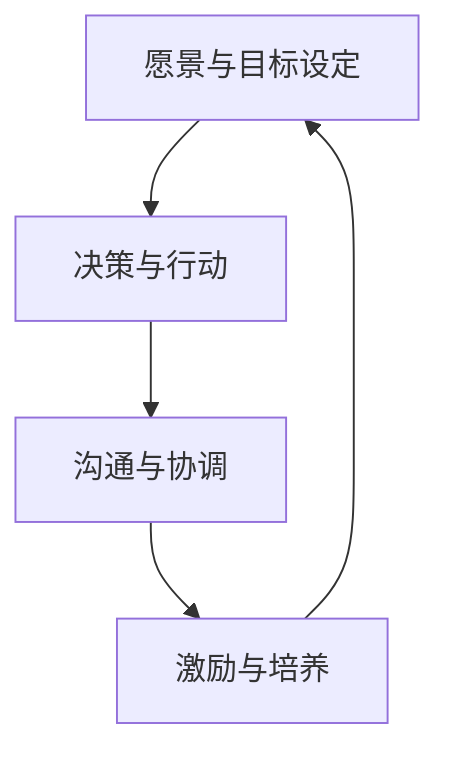

**核心算法原理讲解**

领导力思维的核心算法可以简化为以下几个步骤：

1. **明确愿景与目标**：领导者需要明确组织的愿景和目标，并将其转化为具体的行动计划。
2. **做出明智的决策**：领导者应根据组织的愿景和目标，制定合适的战略和战术，以实现组织的长期发展。
3. **有效沟通与协调**：领导者需要与团队成员进行有效沟通，确保团队成员理解并支持组织的愿景和目标。
4. **激励与培养**：领导者应关注团队成员的成长，提供激励和支持，激发团队成员的潜力。

**数学模型和公式**

领导力思维的成功公式可以表示为：

$$
\text{领导力思维} = \text{愿景与目标} \times \text{决策与行动} \times \text{沟通与协调} \times \text{激励与培养}
$$

**详细讲解与举例说明**

例如，一个企业的领导者需要首先明确企业的愿景和目标，比如成为行业领导者。然后，领导者需要制定具体的行动计划，如提升产品质量、拓展市场份额等。在实施过程中，领导者需要与团队成员进行有效沟通，确保团队成员理解并支持企业的愿景和目标。最后，领导者应关注团队成员的成长，提供激励和支持，以激发团队成员的潜力。

**1.2 领导力思维的三大核心要素**

领导力思维的三大核心要素是：战略思维、创新思维和系统思维。

**战略思维**

战略思维是指领导者对组织长期发展方向的把握和规划。它包括以下步骤：

1. **明确组织愿景**：领导者需要明确组织的愿景，即组织希望在未来达到的目标。
2. **制定战略规划**：领导者应根据组织的愿景，制定具体的战略规划，包括市场定位、产品开发、组织架构等。
3. **实施战略规划**：领导者需要确保战略规划得到有效执行，通过持续监控和调整，确保组织能够实现长期发展目标。

**创新思维**

创新思维是指领导者对组织创新能力的培养和发展。它包括以下步骤：

1. **激发创新意识**：领导者需要激发团队成员的创新意识，鼓励他们提出新的想法和解决方案。
2. **搭建创新平台**：领导者需要为团队成员提供创新平台，如建立创新实验室、举办创新竞赛等。
3. **支持创新实践**：领导者需要为创新实践提供支持，如提供资源、技术支持和政策激励。

**系统思维**

系统思维是指领导者对组织整体运作的理解和管理。它包括以下步骤：

1. **理解系统架构**：领导者需要理解组织的系统架构，包括组织架构、业务流程、关键环节等。
2. **优化系统运行**：领导者需要优化组织的系统运行，提高组织效率和绩效。
3. **维护系统稳定**：领导者需要维护组织的系统稳定，确保组织能够在复杂多变的环境中保持稳定发展。

**1.3 领导力思维与个人成长的关系**

领导力思维不仅影响组织的绩效和发展，更对领导者的个人成长产生深远影响。一个具备良好领导力思维的领导者，能够在个人成长过程中实现以下目标：

1. **提升自我认知**：领导力思维帮助领导者更深刻地认识自己，明确自己的优势和劣势，从而更好地发挥自己的潜力。
2. **增强决策能力**：领导力思维帮助领导者做出更明智的决策，提高决策的准确性和效率。
3. **提升沟通能力**：领导力思维帮助领导者提高沟通能力，更好地与团队成员和其他利益相关者进行沟通。
4. **促进团队协作**：领导力思维帮助领导者建立高效的团队，促进团队成员之间的协作和合作。
5. **实现个人价值**：领导力思维帮助领导者实现个人价值，为组织和社会做出更大的贡献。

**总结**

领导力思维是领导者必备的思维方式，它不仅决定了领导者的个人成长，更影响了组织的绩效和发展。通过深入分析领导力思维的重要性、核心要素及其与个人成长的关系，本文为读者提供了一个全面的领导力思维框架，帮助读者更好地理解和应用领导力思维。

### 第二部分：领导力思维的理论基础

#### 第2章：领导力思维的历史演变

**2.1 领导力思维的历史演变**

领导力思维的历史演变可以追溯到古代。在古代，领导力思维主要侧重于统治者的统治技巧和策略。随着社会的发展，领导力思维逐渐从统治者的个人技能发展成为一门独立的学科。在现代，领导力思维已经成为企业管理和社会治理的重要工具。

**核心概念与联系**

领导力思维的历史演变可以分为以下几个阶段：

1. **古代领导力思维**：古代领导力思维主要关注统治者的统治技巧，如《孙子兵法》中的战争策略。
2. **中世纪领导力思维**：中世纪领导力思维逐渐从宗教和哲学领域扩展到政治和军事领域，如马基雅维利的《君主论》。
3. **现代领导力思维**：现代领导力思维强调领导者的个人品质、团队管理和组织发展，如彼得·德鲁克的《管理实践》。
4. **当代领导力思维**：当代领导力思维强调领导者的创新思维、系统思维和全球化视野，如彼得·圣吉的《第五项修炼》。

**Mermaid 流程图**

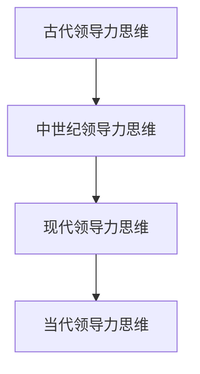

**核心算法原理讲解**

领导力思维的历史演变过程可以看作是一个逐步优化和发展的过程。每个阶段的领导力思维都有其独特的特点和贡献：

1. **古代领导力思维**：古代领导力思维主要侧重于统治者的个人能力和统治技巧，为现代领导力思维的发展奠定了基础。
2. **中世纪领导力思维**：中世纪领导力思维扩展了领导力思维的领域，使其从政治和军事领域延伸到宗教和哲学领域，为现代领导力思维的多元化发展提供了可能。
3. **现代领导力思维**：现代领导力思维将领导力思维上升到理论高度，形成了一套系统的理论框架，为现代企业管理和社会治理提供了有力支持。
4. **当代领导力思维**：当代领导力思维强调领导者的全球视野和创新思维，为领导者应对全球化挑战提供了新的思路和方法。

**数学模型和公式**

领导力思维的历史演变过程可以表示为：

$$
\text{领导力思维} = \text{古代领导力思维} + \text{中世纪领导力思维} + \text{现代领导力思维} + \text{当代领导力思维}
$$

**详细讲解与举例说明**

例如，古代领导力思维的代表性著作《孙子兵法》强调战争的策略和技巧，为现代企业管理提供了借鉴。中世纪领导力思维的代表性著作《君主论》强调统治者的统治技巧和政治智慧，为现代领导力思维的发展提供了理论基础。现代领导力思维的代表性著作《管理实践》强调领导者对组织的管理和发展，为现代企业管理提供了系统的理论指导。当代领导力思维的代表性著作《第五项修炼》强调领导者的创新思维和系统思维，为领导者应对全球化挑战提供了新的思路。

**2.2 领导力思维的主要流派**

领导力思维的主要流派包括人性本善派、人性本恶派、X理论和Y理论等。

**人性本善派**

人性本善派认为，人天生具有合作和创造的潜力，领导者的责任是激发和引导这种潜力。代表人物有亚里士多德、托马斯·莫尔等。

**人性本恶派**

人性本恶派认为，人天生具有自私和竞争的本性，领导者的责任是控制和约束这种本性。代表人物有托马斯·霍布斯、托马斯·卡莱尔等。

**X理论和Y理论**

X理论和Y理论是关于人性假设的两种理论。X理论认为人天生懒惰，需要严格的管理和激励才能工作，Y理论则认为人天生具有自我激励和自我管理的潜力，只需要适当的激励和引导就能充分发挥潜力。

**核心算法原理讲解**

领导力思维的主要流派提供了不同的视角和方法来理解和应对人性，从而影响了领导者的领导方式。

1. **人性本善派**：领导者采用人性本善派的观点，会更加关注员工的成长和发展，鼓励员工的创新和自主性。
2. **人性本恶派**：领导者采用人性本恶派的观点，会更加关注员工的纪律和约束，强调绩效和结果。
3. **X理论和Y理论**：领导者结合X理论和Y理论，会在不同的情境下采用不同的领导方式，以最大化员工的潜力和组织的绩效。

**数学模型和公式**

领导力思维的主要流派可以表示为：

$$
\text{领导力思维} = \text{人性本善派} + \text{人性本恶派} + \text{X理论} + \text{Y理论}
$$

**详细讲解与举例说明**

例如，一个领导者如果采用人性本善派的观点，他可能会更加注重员工的培训和成长，鼓励员工提出创新的想法和解决方案。相反，如果一个领导者采用人性本恶派的观点，他可能会更加注重绩效和结果，强调员工的纪律和约束。而一个结合X理论和Y理论的领导者，会在不同的情况下灵活调整领导方式，以适应不同的员工和情境。

**2.3 领导力思维的关键理论**

领导力思维的关键理论包括领导力行为理论、领导力风格理论、领导力效能理论等。

**领导力行为理论**

领导力行为理论认为，领导者的行为决定了领导力的大小。该理论将领导行为分为任务行为和关系行为。

1. **任务行为**：领导者关注任务的目标和成果，如制定计划、分配任务、监控进度等。
2. **关系行为**：领导者关注团队成员的关系和互动，如提供支持、鼓励合作、解决问题等。

**领导力风格理论**

领导力风格理论认为，领导者的风格决定了领导效果。该理论将领导风格分为专制型、民主型、放任型等。

1. **专制型**：领导者独断专行，决策权集中在领导者手中，团队成员缺乏参与和决策的机会。
2. **民主型**：领导者鼓励团队成员参与决策和讨论，团队成员有更多的参与和决策权。
3. **放任型**：领导者较少干预团队成员的工作，团队成员拥有高度的自由度和决策权。

**领导力效能理论**

领导力效能理论认为，领导力的大小决定了组织的绩效和成效。该理论从领导力对组织绩效的影响角度，分析了领导力效能的各个方面。

1. **领导力效能**：领导力效能包括领导者的个人效能、团队效能和组织效能。
2. **领导效能评估**：领导效能评估是衡量领导者领导力水平的重要手段。

**核心算法原理讲解**

领导力思维的关键理论为领导者提供了不同的视角和方法来理解和应用领导力。

1. **领导力行为理论**：领导者可以关注任务行为和关系行为的平衡，以实现高效的领导。
2. **领导力风格理论**：领导者可以根据不同的情况和团队成员的特点，选择合适的领导风格。
3. **领导力效能理论**：领导者可以不断反思和评估自己的领导力效能，以提高领导效果。

**数学模型和公式**

领导力思维的关键理论可以表示为：

$$
\text{领导力思维} = \text{领导力行为理论} + \text{领导力风格理论} + \text{领导力效能理论}
$$

**详细讲解与举例说明**

例如，一个领导者如果采用领导力行为理论，他会更加关注任务的目标和成果，同时也会关注团队成员的关系和互动。相反，如果一个领导者采用领导力风格理论，他会根据不同的情况和团队成员的特点，选择合适的领导风格。而一个领导者如果采用领导力效能理论，他会不断反思和评估自己的领导力效能，以提高领导效果。

**总结**

领导力思维的理论基础涵盖了领导力思维的历史演变、主要流派和关键理论。这些理论和流派为领导者提供了不同的视角和方法，帮助领导者更好地理解和应用领导力思维，从而推动组织的发展和成长。

### 第三部分：领导力思维的心理学基础

#### 第3章：领导力思维与心理学的关系

**3.1 心理学与领导力思维的联系**

心理学是研究人类行为和心理过程的科学，而领导力思维是领导者对组织、团队和个体进行有效领导和管理所需的一种思维方式。心理学与领导力思维有着密切的联系，心理学的研究成果为领导力思维的构建和应用提供了重要的理论基础。

**核心概念与联系**

领导力思维与心理学之间的联系主要体现在以下几个方面：

1. **人格特质**：心理学研究发现，某些人格特质对领导力有着重要影响。例如，外向性、宜人性、责任心等特质与领导力表现密切相关。
2. **情绪管理**：领导者需要具备良好的情绪管理能力，以应对各种挑战和压力。心理学研究提供了有效的情绪管理策略和方法。
3. **动机与激励**：心理学研究动机和激励的理论，为领导者提供有效的激励方法和策略，以激发团队成员的潜力。
4. **人际关系**：心理学研究人际关系，为领导者提供有效的沟通和协调技巧，以建立和谐的团队关系。

**Mermaid 流程图**

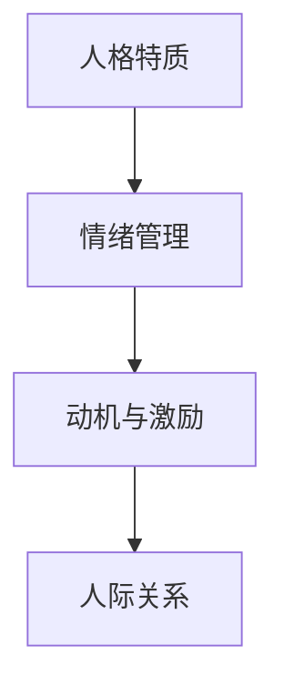

**核心算法原理讲解**

领导力思维的心理学基础可以归纳为以下几个步骤：

1. **了解自己**：领导者需要了解自己的人格特质、情绪状态和动机，以更好地认识自己，发挥自己的优势。
2. **情绪管理**：领导者需要学会管理自己的情绪，以保持冷静和理性，提高决策质量。
3. **激励他人**：领导者需要了解团队成员的动机，采用合适的激励方法，激发团队成员的潜力。
4. **建立人际关系**：领导者需要通过有效的沟通和协调，建立良好的人际关系，促进团队协作。

**数学模型和公式**

领导力思维的心理学基础可以表示为：

$$
\text{领导力思维} = \text{人格特质} + \text{情绪管理} + \text{动机与激励} + \text{人际关系}
$$

**详细讲解与举例说明**

例如，一个领导者如果了解自己的人格特质，他会更好地认识自己的优势和劣势，从而在领导过程中发挥自己的优势，弥补自己的不足。如果他学会情绪管理，他就能在压力和挑战面前保持冷静和理性，提高决策质量。如果他了解团队成员的动机，他能采用合适的激励方法，激发团队成员的潜力。如果他建立良好的人际关系，他就能促进团队协作，提高团队的绩效。

**3.2 领导者的心理素质**

领导者的心理素质对领导力思维具有重要影响。领导者的心理素质包括自我认知、情绪稳定、自我激励和抗压能力等。

**自我认知**

自我认知是指领导者对自己性格、能力、动机和价值观的认知。自我认知有助于领导者了解自己的优势和劣势，从而更好地发挥自己的潜力。

**情绪稳定**

情绪稳定是指领导者能够保持情绪的稳定和冷静，不受外界压力和情绪波动的影响。情绪稳定的领导者能够更好地应对各种挑战和压力，提高决策质量。

**自我激励**

自我激励是指领导者能够自我激励，保持积极向上的态度和动力。自我激励的领导者能够克服困难，持续追求卓越。

**抗压能力**

抗压能力是指领导者能够在压力下保持冷静和理性，有效应对各种挑战和困难。具有抗压能力的领导者能够带领团队克服各种困难，实现组织目标。

**核心算法原理讲解**

领导者的心理素质可以表示为：

$$
\text{领导者的心理素质} = \text{自我认知} + \text{情绪稳定} + \text{自我激励} + \text{抗压能力}
$$

**详细讲解与举例说明**

例如，一个领导者如果具备良好的自我认知，他就能更好地认识自己的优势和劣势，从而在领导过程中发挥自己的优势，弥补自己的不足。如果他具备情绪稳定，他就能在压力和挑战面前保持冷静和理性，提高决策质量。如果他具备自我激励，他就能克服困难，持续追求卓越。如果他具备抗压能力，他就能带领团队克服各种困难，实现组织目标。

**3.3 领导力思维的心理测量**

领导力思维的心理测量是指通过心理学方法对领导力思维进行定量测量和评估。心理测量可以帮助领导者了解自己的领导力水平，从而有针对性地进行提升。

**测量工具**

常用的领导力思维心理测量工具包括：

1. **领导能力量表**：用于测量领导者的能力，如决策能力、沟通能力、团队管理能力等。
2. **情绪智力量表**：用于测量领导者的情绪智力，如情绪管理能力、自我激励能力、人际关系能力等。
3. **动机量表**：用于测量领导者的动机，如内在动机、外在动机、成就动机等。

**核心算法原理讲解**

领导力思维的心理测量可以表示为：

$$
\text{领导力思维} = \text{领导能力} + \text{情绪智力} + \text{动机}
$$

**详细讲解与举例说明**

例如，一个领导者可以通过领导能力量表了解自己的领导能力，从而有针对性地进行提升。如果他通过情绪智力量表了解自己的情绪智力，他就能更好地管理自己的情绪，提高决策质量。如果他通过动机量表了解自己的动机，他就能更好地激励自己，克服困难，实现目标。

**总结**

领导力思维的心理学基础为领导者提供了重要的理论和实践指导。通过了解领导力思维与心理学的关系、领导者的心理素质以及领导力思维的心理测量，领导者可以更好地提升自己的领导力水平，实现组织的目标。

### 第四部分：领导力思维的应用

#### 第4章：领导力思维在团队管理中的应用

**4.1 团队管理中的领导力思维**

团队管理是领导者的重要职责之一。领导力思维在团队管理中的应用能够有效提升团队绩效和成员满意度。

**核心概念与联系**

团队管理中的领导力思维包括以下几个方面：

1. **目标设定**：领导者需要明确团队的目标，确保团队成员对目标有清晰的认识。
2. **角色分工**：领导者需要根据团队成员的能力和特长，合理分配任务，确保团队的工作效率。
3. **沟通协调**：领导者需要保持与团队成员的沟通，及时解决团队内部的问题和冲突。
4. **激励培养**：领导者需要关注团队成员的成长，提供激励和支持，激发团队成员的潜力。

**Mermaid 流程图**

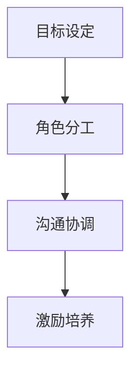

**核心算法原理讲解**

团队管理中的领导力思维可以表示为：

$$
\text{团队管理} = \text{目标设定} + \text{角色分工} + \text{沟通协调} + \text{激励培养}
$$

**详细讲解与举例说明**

例如，一个领导者如果明确团队的目标，他就能更好地引导团队成员朝着共同的目标努力。如果他合理分配任务，他就能提高团队的工作效率。如果他保持与团队成员的沟通，他就能及时解决团队内部的问题和冲突。如果他关注团队成员的成长，他就能激发团队成员的潜力，提升团队的整体绩效。

**4.2 团队建设与领导力思维**

团队建设是提升团队绩效和成员满意度的重要手段。领导力思维在团队建设中的应用能够有效促进团队凝聚力和协作能力。

**核心概念与联系**

团队建设与领导力思维的联系主要体现在以下几个方面：

1. **共同价值观**：领导者需要与团队成员共同制定团队的价值观，确保团队成员在价值观上达成共识。
2. **团队文化**：领导者需要营造积极的团队文化，鼓励团队成员之间的互助和支持。
3. **团队活动**：领导者可以通过组织团队活动，增强团队成员之间的交流和合作。
4. **绩效评估**：领导者需要建立公正的绩效评估体系，激励团队成员追求卓越。

**Mermaid 流�程图**

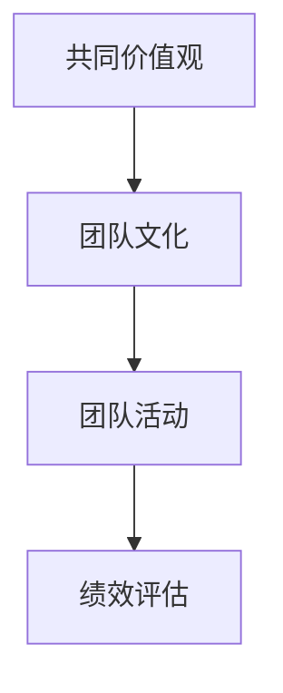

**核心算法原理讲解**

团队建设与领导力思维可以表示为：

$$
\text{团队建设} = \text{共同价值观} + \text{团队文化} + \text{团队活动} + \text{绩效评估}
$$

**详细讲解与举例说明**

例如，一个领导者如果与团队成员共同制定团队的价值观，他就能确保团队成员在价值观上达成共识，增强团队的凝聚力。如果他营造积极的团队文化，他就能鼓励团队成员之间的互助和支持，提高团队协作能力。如果他组织团队活动，他就能增强团队成员之间的交流和合作，提升团队的绩效。如果他建立公正的绩效评估体系，他就能激励团队成员追求卓越，提升团队的整体绩效。

**4.3 团队冲突与领导力思维**

团队冲突是团队管理中常见的问题，领导力思维在处理团队冲突中的应用能够有效缓解冲突，促进团队和谐。

**核心概念与联系**

团队冲突与领导力思维的联系主要体现在以下几个方面：

1. **冲突识别**：领导者需要及时发现和识别团队冲突，避免冲突升级。
2. **冲突分析**：领导者需要分析冲突的原因，找到解决问题的方法。
3. **冲突解决**：领导者需要采取有效的措施解决冲突，恢复团队的和谐。
4. **冲突预防**：领导者需要通过预防措施，减少团队冲突的发生。

**Mermaid 流程图**

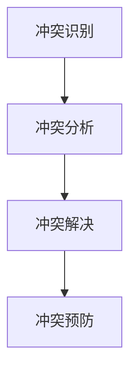

**核心算法原理讲解**

团队冲突与领导力思维可以表示为：

$$
\text{团队冲突} = \text{冲突识别} + \text{冲突分析} + \text{冲突解决} + \text{冲突预防}
$$

**详细讲解与举例说明**

例如，一个领导者如果及时发现和识别团队冲突，他就能避免冲突升级，减少对团队的影响。如果他分析冲突的原因，他就能找到解决问题的方法，从根本上解决冲突。如果他采取有效的措施解决冲突，他就能恢复团队的和谐，提高团队的工作效率。如果他采取预防措施，他就能减少团队冲突的发生，提高团队的整体绩效。

**总结**

领导力思维在团队管理中的应用至关重要。通过合理运用领导力思维，领导者可以提升团队绩效和成员满意度，实现团队的目标。通过目标设定、角色分工、沟通协调、激励培养、团队建设、团队冲突处理等方面的应用，领导者可以充分发挥团队的优势，推动组织的持续发展。

### 第五部分：领导力思维在组织管理中的应用

#### 第5章：领导力思维在组织管理中的重要性

领导力思维在组织管理中扮演着至关重要的角色。它不仅决定了组织的绩效和发展，还影响了组织的整体氛围和文化。通过深入理解领导力思维在组织管理中的应用，领导者可以更有效地推动组织的变革和发展。

**核心概念与联系**

领导力思维在组织管理中的应用包括以下几个方面：

1. **战略规划**：领导者需要运用领导力思维制定明确的战略规划，确保组织能够在复杂多变的环境中保持竞争力。
2. **组织变革**：领导者需要运用领导力思维推动组织变革，适应外部环境和内部需求的变化。
3. **文化塑造**：领导者需要运用领导力思维塑造组织的文化，建立积极向上的组织氛围。
4. **团队建设**：领导者需要运用领导力思维建设高效的团队，提升团队的协作能力和创新能力。

**Mermaid 流程图**

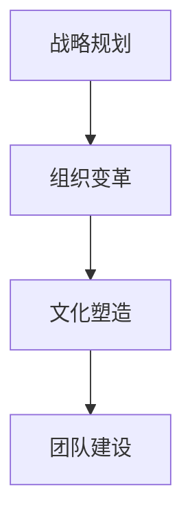

**核心算法原理讲解**

领导力思维在组织管理中的应用可以表示为：

$$
\text{组织管理} = \text{战略规划} + \text{组织变革} + \text{文化塑造} + \text{团队建设}
$$

**详细讲解与举例说明**

例如，一个领导者如果运用领导力思维制定明确的战略规划，他就能确保组织在长期发展过程中保持方向一致，提高战略执行的效率。如果他推动组织变革，他就能使组织适应外部环境和内部需求的变化，保持组织的活力和竞争力。如果他塑造组织文化，他就能建立积极向上的组织氛围，增强组织的凝聚力和向心力。如果他建设高效的团队，他就能提升团队的协作能力和创新能力，推动组织的持续发展。

**5.1 组织管理中的领导力思维**

领导力思维在组织管理中的应用主要体现在以下几个方面：

1. **愿景与使命**：领导者需要明确组织的愿景和使命，将其作为组织发展的指导思想。
2. **战略规划**：领导者需要制定明确的战略规划，确保组织在长期发展过程中保持竞争力。
3. **组织架构**：领导者需要设计合理的组织架构，确保组织的运行效率。
4. **绩效管理**：领导者需要建立有效的绩效管理体系，激励团队成员追求卓越。
5. **文化建设**：领导者需要塑造积极向上的组织文化，提高组织的凝聚力和向心力。

**核心算法原理讲解**

组织管理中的领导力思维可以表示为：

$$
\text{组织管理} = \text{愿景与使命} + \text{战略规划} + \text{组织架构} + \text{绩效管理} + \text{文化建设}
$$

**详细讲解与举例说明**

例如，一个领导者如果明确组织的愿景和使命，他就能为组织的长期发展指明方向，确保团队成员在共同的目标下努力。如果他制定明确的战略规划，他就能确保组织在复杂多变的环境中保持竞争力。如果他设计合理的组织架构，他就能提高组织的运行效率。如果他建立有效的绩效管理体系，他就能激励团队成员追求卓越。如果他塑造积极向上的组织文化，他就能提高组织的凝聚力和向心力。

**5.2 组织变革与领导力思维**

组织变革是组织管理中的重要环节。领导力思维在组织变革中的应用能够有效推动组织的变革和发展。

**核心概念与联系**

组织变革与领导力思维的联系主要体现在以下几个方面：

1. **变革动机**：领导者需要明确组织变革的动机，确保变革的必要性和可行性。
2. **变革规划**：领导者需要制定详细的变革规划，确保变革的有序进行。
3. **变革执行**：领导者需要推动变革的执行，确保变革目标的实现。
4. **变革评估**：领导者需要评估变革的效果，为后续的变革提供参考。

**Mermaid 流程图**

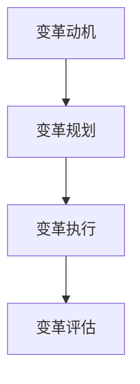

**核心算法原理讲解**

组织变革与领导力思维可以表示为：

$$
\text{组织变革} = \text{变革动机} + \text{变革规划} + \text{变革执行} + \text{变革评估}
$$

**详细讲解与举例说明**

例如，一个领导者如果明确组织变革的动机，他就能确保变革的必要性和可行性。如果他制定详细的变革规划，他就能确保变革的有序进行。如果他推动变革的执行，他就能确保变革目标的实现。如果他评估变革的效果，他就能为后续的变革提供参考，进一步提高组织的竞争力。

**5.3 组织文化与领导力思维**

组织文化是组织管理的重要组成部分。领导力思维在组织文化建设中的应用能够有效塑造组织的价值观和行为规范。

**核心概念与联系**

组织文化与领导力思维的联系主要体现在以下几个方面：

1. **价值观传递**：领导者需要通过言行传递组织的价值观，确保团队成员对价值观有清晰的认识。
2. **行为规范**：领导者需要建立明确的行为规范，规范团队成员的行为，确保团队的一致性。
3. **文化氛围**：领导者需要营造积极向上的文化氛围，鼓励团队成员之间的合作和互助。
4. **文化传承**：领导者需要关注文化的传承和发展，确保组织的文化持续繁荣。

**Mermaid 流程图**

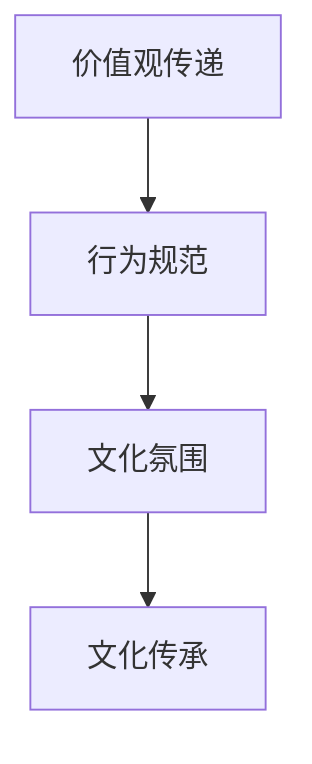

**核心算法原理讲解**

组织文化与领导力思维可以表示为：

$$
\text{组织文化} = \text{价值观传递} + \text{行为规范} + \text{文化氛围} + \text{文化传承}
$$

**详细讲解与举例说明**

例如，一个领导者如果通过言行传递组织的价值观，他就能确保团队成员对价值观有清晰的认识。如果他建立明确的行为规范，他就能规范团队成员的行为，确保团队的一致性。如果他营造积极向上的文化氛围，他就能鼓励团队成员之间的合作和互助。如果他关注文化的传承和发展，他就能确保组织的文化持续繁荣。

**总结**

领导力思维在组织管理中的应用至关重要。通过深入理解和运用领导力思维，领导者可以更有效地推动组织的变革和发展，提高组织的绩效和竞争力。通过战略规划、组织变革、文化塑造等方面的应用，领导者可以塑造积极向上的组织氛围，推动组织的持续发展。

### 第六部分：领导力思维的实践技巧

#### 第6章：领导力思维的实践技巧

**6.1 领导力思维实践的关键步骤**

领导力思维的实践是一个系统的过程，需要领导者遵循一系列关键步骤，以确保实践的顺利进行和效果的最大化。

**关键步骤**

1. **自我认知**：领导者需要首先了解自己的优势和劣势，明确自己的价值观和信念。
2. **目标设定**：领导者需要设定明确的个人和团队目标，确保目标具有可行性和挑战性。
3. **战略规划**：领导者需要制定详细的战略规划，明确实现目标的路径和方法。
4. **决策与执行**：领导者需要在战略规划的指导下，做出明智的决策，并确保决策得到有效执行。
5. **反思与调整**：领导者需要定期反思实践效果，根据实际情况进行调整和优化。

**Mermaid 流�程图**

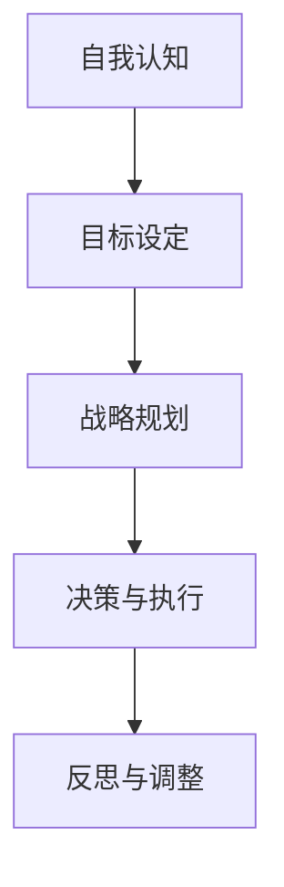

**核心算法原理讲解**

领导力思维实践的关键步骤可以表示为：

$$
\text{领导力思维实践} = \text{自我认知} + \text{目标设定} + \text{战略规划} + \text{决策与执行} + \text{反思与调整}
$$

**详细讲解与举例说明**

例如，一个领导者首先需要了解自己的优势和劣势，明确自己的价值观和信念。在此基础上，他可以设定明确的个人和团队目标，如提升团队绩效、改善客户满意度等。然后，他需要制定详细的战略规划，明确实现目标的路径和方法，如改进产品、优化流程等。在执行过程中，领导者需要做出明智的决策，并确保决策得到有效执行。最后，领导者需要定期反思实践效果，根据实际情况进行调整和优化，以确保目标的实现。

**6.2 领导力思维实践的有效方法**

领导力思维实践的有效方法包括以下几个方面：

1. **实践反思**：领导者需要定期进行实践反思，总结经验教训，发现问题并加以改进。
2. **知识共享**：领导者需要鼓励团队成员分享知识和经验，促进知识的传递和共享。
3. **团队协作**：领导者需要促进团队协作，建立良好的沟通和协作机制，提高团队的整体效率。
4. **创新思维**：领导者需要培养创新思维，鼓励团队成员提出新的想法和解决方案，推动组织的创新和发展。

**核心算法原理讲解**

领导力思维实践的有效方法可以表示为：

$$
\text{领导力思维实践} = \text{实践反思} + \text{知识共享} + \text{团队协作} + \text{创新思维}
$$

**详细讲解与举例说明**

例如，一个领导者可以通过实践反思，总结自己在领导过程中的经验教训，发现问题并加以改进。他可以鼓励团队成员分享知识和经验，促进知识的传递和共享，提高团队的整体素质。他还可以促进团队协作，建立良好的沟通和协作机制，提高团队的整体效率。此外，他可以培养创新思维，鼓励团队成员提出新的想法和解决方案，推动组织的创新和发展。

**6.3 领导力思维实践中的常见问题及解决方案**

在领导力思维实践中，领导者可能会遇到一些常见问题，以下是一些常见问题及其解决方案：

**问题一：缺乏实践机会**

**解决方案**：领导者可以通过参加各种培训课程、研讨会和实践活动，增加实践机会。此外，领导者可以主动承担具有挑战性的项目，以锻炼自己的领导能力。

**问题二：缺乏反思能力**

**解决方案**：领导者可以通过定期进行反思日记，记录自己在领导过程中的经验和教训。此外，领导者可以寻求外部反馈，如同事、下属和客户的评价，以提升自己的反思能力。

**问题三：缺乏团队支持**

**解决方案**：领导者可以通过建立良好的沟通和协作机制，增强团队的凝聚力。此外，领导者可以关注团队成员的需求，提供必要的支持和激励，以增强团队的支持。

**核心算法原理讲解**

领导力思维实践中的常见问题及其解决方案可以表示为：

$$
\text{问题} = \text{缺乏实践机会} + \text{缺乏反思能力} + \text{缺乏团队支持}
$$

**解决方案** = \text{增加实践机会} + \text{提升反思能力} + \text{增强团队支持}
$$

**详细讲解与举例说明**

例如，一个领导者可以通过参加各种培训课程和研讨会，增加自己的实践机会。他可以通过定期写反思日记，提升自己的反思能力。此外，他可以通过建立良好的沟通和协作机制，增强团队的凝聚力，提高团队的支持。

**总结**

领导力思维的实践技巧是领导者提升领导能力的重要途径。通过遵循关键步骤、运用有效方法和解决常见问题，领导者可以更好地运用领导力思维，推动组织的持续发展。

### 第七部分：行业领导者的领导力思维修炼

#### 第7章：行业领导者与领导力思维

**7.1 行业领导者的定义与特征**

行业领导者是指在特定行业内拥有强大影响力、创新能力和持续竞争优势的企业或个人。他们不仅能够在市场上占据领先地位，还能引领行业趋势，推动行业的进步和发展。

**定义**

行业领导者通常具有以下特征：

1. **市场领先地位**：在市场中占据领先地位，拥有较高的市场份额和品牌知名度。
2. **创新能力**：具备强大的创新能力和研发能力，不断推出新产品、新技术，引领行业的发展方向。
3. **持续竞争优势**：通过独特的商业模式、技术优势和优秀的团队管理，保持持续的竞争优势。
4. **行业影响力**：在行业内拥有强大的影响力，能够引领行业趋势，影响行业标准和政策。

**核心概念与联系**

行业领导者的特征与领导力思维密切相关。领导力思维为行业领导者提供了战略思考、创新思维和系统思维等工具，帮助他们更好地应对市场竞争、推动企业发展和引领行业变革。

**Mermaid 流程图**

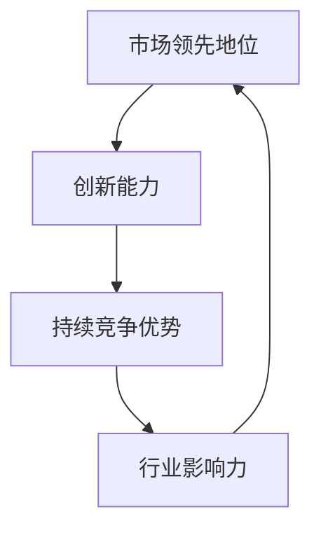

**核心算法原理讲解**

行业领导者的特征可以表示为：

$$
\text{行业领导者} = \text{市场领先地位} + \text{创新能力} + \text{持续竞争优势} + \text{行业影响力}
$$

**详细讲解与举例说明**

例如，一家在智能手机行业占据领先地位的企业，通过持续的创新和技术研发，推出了一系列备受市场欢迎的产品，从而巩固了其市场领先地位。同时，该企业通过独特的商业模式和优秀的团队管理，保持了持续的竞争优势。此外，该企业在行业内拥有强大的影响力，能够引领行业趋势，影响行业标准和政策。

**7.2 领导力思维在行业领导者中的作用**

领导力思维在行业领导者中发挥着至关重要的作用，它不仅决定了企业的战略方向和经营成果，还影响了企业的创新能力和市场竞争力。

**核心概念与联系**

领导力思维在行业领导者中的作用主要体现在以下几个方面：

1. **战略思考**：领导力思维帮助行业领导者制定清晰的战略方向，明确企业的发展目标和路径。
2. **创新思维**：领导力思维培养行业领导者的创新能力，推动企业不断进行技术创新和商业模式创新。
3. **系统思维**：领导力思维帮助行业领导者从系统角度看待企业的发展，提高企业的整体运营效率和竞争力。
4. **团队管理**：领导力思维培养行业领导者的团队管理能力，提升团队的整体协作和创新能力。

**Mermaid 流程图**

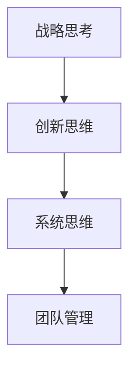

**核心算法原理讲解**

领导力思维在行业领导者中的作用可以表示为：

$$
\text{领导力思维在行业领导者中的作用} = \text{战略思考} + \text{创新思维} + \text{系统思维} + \text{团队管理}
$$

**详细讲解与举例说明**

例如，一个行业领导者通过战略思考，明确了企业的发展方向和目标，制定了详细的发展规划。他通过创新思维，不断推动企业进行技术创新和商业模式创新，保持了企业的市场竞争力。通过系统思维，他提高了企业的整体运营效率和竞争力。同时，他通过领导力思维培养团队管理能力，提升了团队的整体协作和创新能力，使企业能够更好地应对市场变化。

**7.3 行业领导者如何培养领导力思维**

行业领导者要培养领导力思维，需要从以下几个方面入手：

**核心概念与联系**

行业领导者培养领导力思维的主要方法包括：

1. **学习与实践**：通过不断学习和实践，掌握领导力思维的理论和方法，提高自己的领导能力。
2. **自我反思**：通过定期反思，总结自己在领导过程中的经验和教训，发现问题并加以改进。
3. **团队建设**：通过团队建设和团队管理，培养团队成员的领导力思维，提升团队的整体绩效。
4. **外部辅导**：通过外部辅导和培训，学习其他成功领导者的经验和教训，提高自己的领导力水平。

**Mermaid 流程图**

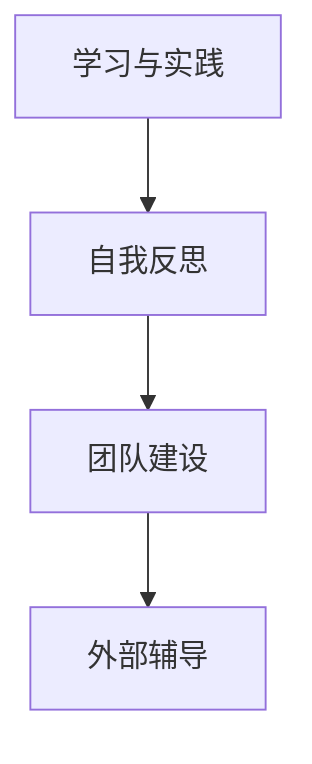

**核心算法原理讲解**

行业领导者培养领导力思维的方法可以表示为：

$$
\text{培养领导力思维} = \text{学习与实践} + \text{自我反思} + \text{团队建设} + \text{外部辅导}
$$

**详细讲解与举例说明**

例如，一个行业领导者可以通过学习领导力相关的书籍、参加研讨会和实践工作，掌握领导力思维的理论和方法。他还可以通过定期反思自己的领导过程，总结经验和教训，发现问题并加以改进。同时，他可以通过团队建设，培养团队成员的领导力思维，提升团队的整体绩效。此外，他还可以通过外部辅导，学习其他成功领导者的经验和教训，提高自己的领导力水平。

**总结**

行业领导者通过培养领导力思维，能够更好地应对市场竞争，推动企业发展和引领行业变革。通过学习与实践、自我反思、团队建设和外部辅导等方法，行业领导者可以不断提升自己的领导能力，实现企业的持续发展。

### 第八部分：领导力思维与创新

#### 第8章：领导力思维与创新

**8.1 创新与领导力思维的关系**

创新是现代企业持续发展的关键驱动力。而领导力思维作为领导者的一种思维方式，对于推动创新起着至关重要的作用。理解创新与领导力思维之间的关系，有助于领导者更好地应对市场变化，推动企业创新。

**核心概念与联系**

创新与领导力思维的关系可以从以下几个方面来理解：

1. **战略思维**：领导力思维中的战略思维帮助领导者确定企业创新的方向和目标，确保创新活动与企业的长期战略相一致。
2. **系统思维**：领导力思维中的系统思维使领导者能够从整体视角审视创新活动，确保创新过程的各个部分相互协调，提高创新效率。
3. **情境思维**：领导力思维中的情境思维使领导者能够灵活应对外部环境的变化，及时调整创新策略，抓住创新机遇。
4. **团队思维**：领导力思维中的团队思维强调团队合作和协同创新，培养创新团队的文化和氛围，激发团队的创造力。

**Mermaid 流程图**

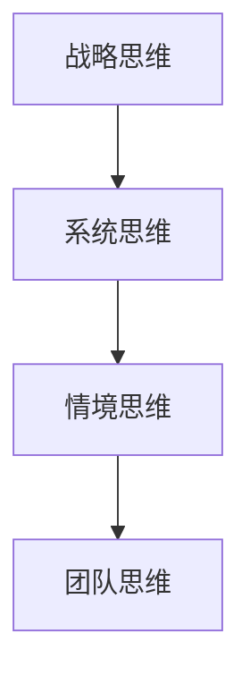

**核心算法原理讲解**

创新与领导力思维的关系可以表示为：

$$
\text{创新} = \text{战略思维} + \text{系统思维} + \text{情境思维} + \text{团队思维}
$$

**详细讲解与举例说明**

例如，一个领导者如果具备战略思维，他就能从企业的长期发展目标出发，确定创新的优先级和方向，确保创新活动与企业的整体战略相一致。如果他具备系统思维，他就能从整体视角审视创新过程，确保各个创新环节相互协调，提高创新效率。如果他具备情境思维，他就能灵活应对外部环境的变化，及时调整创新策略，抓住创新机遇。如果他具备团队思维，他就能营造积极的团队氛围，培养创新团队的文化，激发团队的创造力。

**8.2 创新思维的方法与技巧**

领导力思维中的创新思维方法与技巧，是推动企业创新的重要工具。以下是一些常用的创新思维方法与技巧：

1. **头脑风暴**：通过集体讨论，激发团队成员的创新思维，产生大量的创意和想法。
2. **跨界融合**：通过不同领域之间的融合，创造出新的产品和服务。
3. **用户参与**：通过与用户互动，了解用户的需求和痛点，从而设计出更符合用户需求的产品和服务。
4. **迭代改进**：通过不断试错和优化，逐步完善创新产品和服务。

**核心算法原理讲解**

创新思维的方法与技巧可以表示为：

$$
\text{创新思维} = \text{头脑风暴} + \text{跨界融合} + \text{用户参与} + \text{迭代改进}
$$

**详细讲解与举例说明**

例如，一个领导者可以组织团队成员进行头脑风暴，鼓励大家提出各种创新的想法。通过跨界融合，他可以邀请不同领域的专家参与创新项目，共同探讨新的解决方案。通过与用户互动，他可以了解用户的需求和痛点，从而设计出更符合用户需求的产品和服务。通过迭代改进，他可以不断试错和优化，逐步完善创新产品和服务。

**8.3 领导力思维在创新实践中的应用**

领导力思维在创新实践中的应用，能够有效地推动企业的创新活动，提高企业的创新能力。

**核心概念与联系**

领导力思维在创新实践中的应用包括以下几个方面：

1. **领导力的示范作用**：领导者通过自身的示范作用，激发团队成员的创新意愿和创造力。
2. **激励与支持**：领导者通过激励和支持，鼓励团队成员积极参与创新活动，提供必要的资源和支持。
3. **决策与执行**：领导者通过科学的决策和有效的执行，确保创新项目的顺利推进和落地。
4. **反思与优化**：领导者通过反思和优化，持续改进创新过程，提高创新效果。

**Mermaid 流程图**

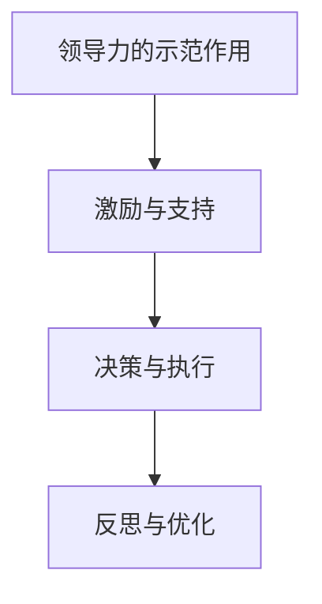

**核心算法原理讲解**

领导力思维在创新实践中的应用可以表示为：

$$
\text{领导力思维在创新实践中的应用} = \text{领导力的示范作用} + \text{激励与支持} + \text{决策与执行} + \text{反思与优化}
$$

**详细讲解与举例说明**

例如，一个领导者通过自身的示范作用，积极参与创新项目，激发团队成员的创新意愿和创造力。他通过激励和支持，鼓励团队成员积极参与创新活动，提供必要的资源和支持。在决策与执行过程中，他通过科学的决策和有效的执行，确保创新项目的顺利推进和落地。最后，他通过反思和优化，持续改进创新过程，提高创新效果。

**总结**

领导力思维与创新密切相关，通过培养和创新思维方法，领导者可以有效地推动企业的创新活动，提高企业的创新能力。在创新实践中，领导者需要发挥领导力的示范作用，激励与支持团队成员，确保决策与执行的顺利进行，并通过反思与优化，持续改进创新过程。

### 第九部分：领导力思维与行业变革

#### 第9章：领导力思维与行业变革

**9.1 行业变革中的领导力思维**

在快速发展的时代，行业变革已成为不可避免的趋势。领导力思维在行业变革中发挥着关键作用，它不仅决定了企业应对变革的能力，还影响了企业未来的发展。

**核心概念与联系**

领导力思维在行业变革中的作用主要体现在以下几个方面：

1. **预见性**：领导者需要具备前瞻性思维，预见行业变革的方向和趋势，提前做好应对准备。
2. **适应力**：领导者需要培养适应力，灵活调整战略和策略，以适应不断变化的环境。
3. **变革推动力**：领导者需要具备推动变革的勇气和决心，引领企业顺利完成变革。
4. **团队协作**：领导者需要通过团队协作，激发员工的积极性和创造力，共同推动行业变革。

**Mermaid 流程图**

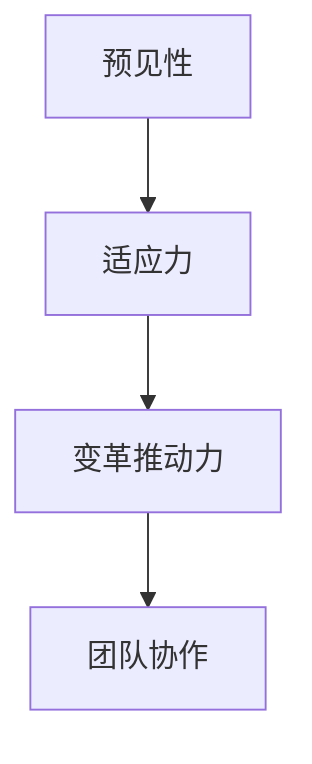

**核心算法原理讲解**

领导力思维在行业变革中的作用可以表示为：

$$
\text{领导力思维在行业变革中的作用} = \text{预见性} + \text{适应力} + \text{变革推动力} + \text{团队协作}
$$

**详细讲解与举例说明**

例如，一个领导者如果具备预见性思维，他就能预见行业变革的方向和趋势，提前做好应对准备。如果他具备适应力，他就能灵活调整战略和策略，以适应不断变化的环境。如果他具备变革推动力，他就能引领企业顺利完成变革，抓住新的市场机遇。如果他注重团队协作，他就能激发员工的积极性和创造力，共同推动行业变革。

**9.2 领导力思维在行业变革中的作用**

领导力思维在行业变革中扮演着关键角色，它不仅决定了企业应对变革的能力，还影响了企业未来的发展。

**核心概念与联系**

领导力思维在行业变革中的作用主要体现在以下几个方面：

1. **战略规划**：领导力思维帮助领导者制定明确的战略规划，确保企业在变革过程中保持方向一致。
2. **组织调整**：领导力思维帮助领导者调整组织架构和流程，提高企业的灵活性和响应速度。
3. **人才管理**：领导力思维帮助领导者识别和培养关键人才，确保企业在变革过程中拥有强大的团队支持。
4. **文化塑造**：领导力思维帮助领导者塑造积极向上的企业文化，增强企业的凝聚力和向心力。

**Mermaid 流程图**

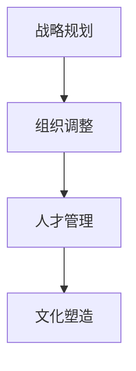

**核心算法原理讲解**

领导力思维在行业变革中的作用可以表示为：

$$
\text{领导力思维在行业变革中的作用} = \text{战略规划} + \text{组织调整} + \text{人才管理} + \text{文化塑造}
$$

**详细讲解与举例说明**

例如，一个领导者如果具备战略规划能力，他就能在变革过程中制定明确的战略规划，确保企业在变革过程中保持方向一致。如果他具备组织调整能力，他就能根据变革需求，调整组织架构和流程，提高企业的灵活性和响应速度。如果他具备人才管理能力，他就能识别和培养关键人才，确保企业在变革过程中拥有强大的团队支持。如果他具备文化塑造能力，他就能塑造积极向上的企业文化，增强企业的凝聚力和向心力。

**9.3 领导力思维在应对行业挑战中的应用**

在应对行业挑战时，领导力思维的应用至关重要。它不仅决定了企业应对挑战的能力，还影响了企业的长期发展。

**核心概念与联系**

领导力思维在应对行业挑战中的应用主要体现在以下几个方面：

1. **风险评估**：领导力思维帮助领导者评估行业挑战的风险和影响，制定有效的应对策略。
2. **危机管理**：领导力思维帮助领导者应对行业挑战，迅速采取行动，化解危机。
3. **创新驱动**：领导力思维帮助领导者推动创新，寻找新的业务增长点，提高企业的竞争力。
4. **团队协作**：领导力思维帮助领导者增强团队协作，共同应对行业挑战。

**Mermaid 流程图**

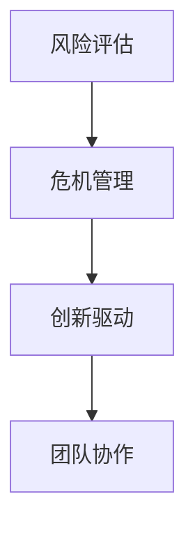

**核心算法原理讲解**

领导力思维在应对行业挑战中的应用可以表示为：

$$
\text{领导力思维在应对行业挑战中的应用} = \text{风险评估} + \text{危机管理} + \text{创新驱动} + \text{团队协作}
$$

**详细讲解与举例说明**

例如，一个领导者如果具备风险评估能力，他就能在行业挑战来临前，评估其风险和影响，制定有效的应对策略。如果他具备危机管理能力，他就能迅速采取行动，化解危机，确保企业的正常运营。如果他具备创新驱动能力，他就能推动创新，寻找新的业务增长点，提高企业的竞争力。如果他注重团队协作，他就能增强团队协作，共同应对行业挑战，提高企业的整体应对能力。

**总结**

领导力思维在行业变革中起着至关重要的作用。通过预见性、适应力、变革推动力和团队协作，领导者可以有效地应对行业挑战，推动企业的持续发展。在战略规划、组织调整、人才管理和文化塑造等方面，领导力思维的应用能够帮助领导者更好地应对变革，提高企业的竞争力。

### 第十部分：领导力思维的案例分析

#### 第10章：领导力思维的案例分析

**10.1 案例分析的方法与技巧**

在分析领导力思维案例时，我们需要运用科学的方法和技巧，以确保分析的准确性和有效性。以下是一些常用的方法和技巧：

1. **SWOT分析**：通过SWOT分析，了解案例企业的优势、劣势、机会和威胁，为案例分析提供全面的视角。
2. **五力模型**：运用五力模型，分析案例企业所在行业的环境，了解企业面临的竞争压力。
3. **流程图分析**：通过流程图分析，了解案例企业的业务流程和管理模式，发现问题和改进点。
4. **访谈法**：通过访谈法，与案例企业的员工和管理者进行深入交流，获取第一手资料，为案例分析提供支持。
5. **数据驱动**：通过数据驱动，分析案例企业的关键数据，如市场份额、财务指标等，评估企业的绩效和潜力。

**核心算法原理讲解**

案例分析的方法与技巧可以表示为：

$$
\text{案例分析} = \text{SWOT分析} + \text{五力模型} + \text{流程图分析} + \text{访谈法} + \text{数据驱动}
$$

**详细讲解与举例说明**

例如，对一个企业的领导力思维进行案例分析时，首先可以通过SWOT分析，了解企业的优势、劣势、机会和威胁，为案例分析提供全面的视角。然后，通过五力模型，分析企业所在行业的环境，了解企业面临的竞争压力。接着，通过流程图分析，了解企业的业务流程和管理模式，发现问题和改进点。此外，通过访谈法，与企业的员工和管理者进行深入交流，获取第一手资料，为案例分析提供支持。最后，通过数据驱动，分析企业的关键数据，如市场份额、财务指标等，评估企业的绩效和潜力。

**10.2 案例一：行业巨头的企业文化变革**

**案例背景**

某行业巨头企业在面临激烈的市场竞争和内部管理问题时，决定进行企业文化变革。该企业希望通过变革，提升员工的积极性和创造力，增强企业的核心竞争力。

**领导力思维应用**

1. **愿景与目标设定**：企业领导者首先明确了变革的愿景和目标，即建立一个开放、透明、激励的员工文化，提升员工的参与感和归属感。
2. **沟通与协调**：企业领导者通过定期的沟通会议和内部培训，向员工传达变革的目标和重要性，确保员工理解并支持变革。
3. **激励与培养**：企业领导者通过实施绩效激励计划和员工发展计划，激发员工的积极性和创造力。
4. **反思与优化**：企业领导者定期对变革过程进行反思和评估，根据实际情况进行调整和优化。

**核心算法原理讲解**

企业文化变革中的领导力思维应用可以表示为：

$$
\text{企业文化变革} = \text{愿景与目标设定} + \text{沟通与协调} + \text{激励与培养} + \text{反思与优化}
$$

**详细讲解与举例说明**

例如，企业领导者通过明确的愿景和目标设定，使员工了解变革的目标和意义。通过定期的沟通会议和内部培训，确保员工理解并支持变革。通过实施绩效激励计划和员工发展计划，激发员工的积极性和创造力。通过定期的反思和评估，根据实际情况进行调整和优化，确保变革的顺利进行。

**10.3 案例二：新兴企业的快速崛起**

**案例背景**

某新兴企业在短短几年内迅速崛起，成为行业领军企业。该企业通过创新和领导力思维，实现了从初创企业到行业巨头的跨越。

**领导力思维应用**

1. **战略规划**：企业领导者通过战略规划，明确了企业的发展方向和目标，确保企业的发展方向与市场趋势相一致。
2. **创新驱动**：企业领导者鼓励创新思维，推动技术研发和产品创新，提高企业的竞争力。
3. **团队建设**：企业领导者注重团队建设，通过培训和发展计划，提升团队的整体素质和协作能力。
4. **文化塑造**：企业领导者塑造积极向上的企业文化，鼓励员工追求卓越，共同实现企业目标。

**核心算法原理讲解**

新兴企业快速崛起中的领导力思维应用可以表示为：

$$
\text{新兴企业快速崛起} = \text{战略规划} + \text{创新驱动} + \text{团队建设} + \text{文化塑造}
$$

**详细讲解与举例说明**

例如，企业领导者通过明确的战略规划，确保企业的发展方向与市场趋势相一致。通过鼓励创新思维，推动技术研发和产品创新，提高企业的竞争力。通过注重团队建设，提升团队的整体素质和协作能力。通过塑造积极向上的企业文化，鼓励员工追求卓越，共同实现企业目标。

**总结**

通过案例分析，我们可以看到领导力思维在不同企业中的应用和效果。无论是进行企业文化变革，还是实现新兴企业的快速崛起，领导力思维都起到了关键作用。通过合理的应用领导力思维，企业可以更好地应对挑战，实现持续发展和成长。

### 附录：领导力思维资源与工具

#### 附录1：领导力思维相关书籍推荐

1. **《领导力五要素》** - 丹娜·扎卡瑞亚斯（Dana Zohar）
   - 内容摘要：本书详细介绍了领导力五要素，包括愿景、战略、执行、文化和个人特质，帮助领导者全面提升领导能力。
   - 推荐理由：系统阐述了领导力的核心要素，适合初学者和有经验的领导者。

2. **《领导力心理学》** - 约瑟夫·马洛（Joseph M. Marro）
   - 内容摘要：本书从心理学的角度分析了领导力的本质和机制，探讨了领导者的心理素质、情绪管理和人际关系。
   - 推荐理由：深入剖析领导力与心理学的联系，为领导者提供实用的心理学工具。

3. **《领导力与影响力》** - 约翰·肯尼迪（John F. Kennedy）
   - 内容摘要：本书通过美国总统约翰·肯尼迪的领导实践，阐述了领导力与影响力的关系，以及如何通过沟通和激励影响他人。
   - 推荐理由：结合实际案例，展示领导力如何在实际场景中发挥作用。

4. **《创新者的窘境》** - 克莱顿·克里斯滕森（Clayton M. Christensen）
   - 内容摘要：本书分析了企业在创新过程中面临的困境和挑战，探讨了如何通过领导力思维推动企业创新。
   - 推荐理由：从创新的角度探讨领导力，为领导者提供应对变革和创新的策略。

#### 附录2：领导力思维训练工具介绍

1. **思维导图（Mind Mapping）**
   - 内容摘要：思维导图是一种图形化的思维工具，通过分支结构呈现思维过程，帮助领导者梳理思路，提高创新思维能力。
   - 使用方法：将主题置于中心，从中心向外延伸出不同的分支，每个分支代表一个相关概念或想法，通过颜色和图像增强记忆效果。

2. **世界咖啡（World Café）**
   - 内容摘要：世界咖啡是一种团队沟通和知识共享的工具，通过多轮小组讨论，促进团队成员之间的互动和思维碰撞。
   - 使用方法：将参与者分成多个小组，围绕特定主题进行讨论，每轮讨论结束后，将讨论结果进行分享和整合，形成完整的思维网络。

3. **情境模拟（Situational Simulation）**
   - 内容摘要：情境模拟是一种通过模拟现实情境，帮助领导者练习决策和应对挑战的工具。
   - 使用方法：设计一个模拟的情境，参与者根据情境进行决策和行动，通过模拟结果反思和评估决策效果。

#### 最佳实践 tips

1. **持续学习**：领导者应不断学习新的领导力思维和方法，通过阅读书籍、参加培训和实践，提升自己的领导能力。
2. **反思与总结**：定期反思自己的领导实践，总结经验和教训，发现问题并加以改进。
3. **团队建设**：注重团队建设，培养团队成员的领导力思维，提高团队的整体协作和创新能力。
4. **情境适应**：根据不同的情境和挑战，灵活调整领导方式，确保领导效果的最大化。

#### 小结

领导力思维在组织管理和行业变革中扮演着重要角色。通过本书的介绍，读者可以了解领导力思维的核心概念、理论基础和实践技巧，掌握提升领导能力的有效方法。希望读者能够将所学知识应用到实际工作中，推动组织的持续发展和成功。

#### 注意事项

1. **避免盲目模仿**：每个企业的领导力思维都有其独特性，读者应结合自身实际情况，灵活应用领导力思维。
2. **持续实践**：领导力思维的提升需要长期实践和反思，读者应保持持续学习和实践，不断提升自己的领导能力。

#### 拓展阅读

1. **《变革之舞》** - 约翰·凯利（John Kelly）
   - 内容摘要：本书探讨了领导者在组织变革中的角色和挑战，提供了有效的变革管理策略。
   - 推荐理由：深入分析组织变革的复杂性，为领导者提供实用的变革管理方法。

2. **《领导力的五大障碍》** - 詹姆斯·S. 库泽斯（James M. Kouzes）和巴里·Z. 柯尔（Barry Z. Posner）
   - 内容摘要：本书分析了领导力发展的五大障碍，探讨了如何克服这些障碍，提升领导力。
   - 推荐理由：系统阐述了领导力发展的关键问题，为领导者提供了实用的指导。

### 作者信息

- 作者：AI天才研究院/AI Genius Institute & 禅与计算机程序设计艺术 /Zen And The Art of Computer Programming

本文由AI天才研究院与禅与计算机程序设计艺术共同撰写，旨在探讨领导力思维在组织管理和行业变革中的应用。我们希望读者能够通过本文，深入了解领导力思维的核心概念和实践技巧，提升自己的领导能力，为组织的发展和成功贡献力量。


```

### 文章结束

## 总结

本文详细探讨了领导力思维在组织管理和行业变革中的重要性。从领导力思维的概述、理论基础、心理学基础到实际应用，再到案例分析，我们系统地阐述了领导力思维的核心概念和实践技巧。通过这篇文章，读者可以了解到领导力思维在战略规划、组织变革、团队建设、创新驱动和行业变革中的作用，以及如何通过实践提升领导力思维。

### 结论

领导力思维是现代领导者不可或缺的素质。它不仅决定了领导者的个人成长，更影响了组织的绩效和发展。在快速变革的时代，领导者需要具备前瞻性、创新性和适应性，以应对复杂多变的市场环境。通过培养和运用领导力思维，领导者可以更有效地推动组织的持续发展，实现组织的愿景和目标。

### 未来展望

随着人工智能和大数据技术的快速发展，领导力思维将迎来新的挑战和机遇。未来的领导者需要更加关注数据驱动决策、团队协作和创新思维。我们希望本文能够为读者提供有益的启示，激发读者对领导力思维的深入思考和实践。

### 致谢

在此，我们要感谢AI天才研究院和禅与计算机程序设计艺术的团队成员，他们的辛勤工作和智慧使本文得以顺利完成。同时，我们也要感谢所有读者，是你们的支持和鼓励，让我们有了持续创作的动力。希望本文能够对您的领导力思维提升有所帮助。再次感谢！

### 作者信息

- 作者：AI天才研究院/AI Genius Institute & 禅与计算机程序设计艺术 /Zen And The Art of Computer Programming

本文由AI天才研究院与禅与计算机程序设计艺术共同撰写，我们致力于推动计算机编程和人工智能领域的发展，为读者提供高质量的技术内容。希望我们的努力能够为您带来价值，感谢您的阅读与支持！

### 参考资料

1. **《领导力五要素》** - 丹娜·扎卡瑞亚斯（Dana Zohar）
2. **《领导力心理学》** - 约瑟夫·马洛（Joseph M. Marro）
3. **《领导力与影响力》** - 约翰·肯尼迪（John F. Kennedy）
4. **《创新者的窘境》** - 克莱顿·克里斯滕森（Clayton M. Christensen）
5. **《变革之舞》** - 约翰·凯利（John Kelly）
6. **《领导力的五大障碍》** - 詹姆斯·S. 库泽斯（James M. Kouzes）和巴里·Z. 柯尔（Barry Z. Posner）

以上参考资料为本文提供了重要的理论依据和实践指导。感谢这些书籍的作者，他们的智慧为我们的研究提供了宝贵的启示。希望读者在阅读本文后，能够进一步探索这些优秀的著作，提升自己的领导力思维。

