                 


### 文章标题

《领导力法则：打造超级团队的领导力秘诀》

### 关键词

领导力，团队管理，目标制定，沟通技巧，创新思维，领导力发展

### 摘要

本文深入探讨了领导力的基本概念和重要性，通过分析领导力发展的五个阶段，阐述了明确目标与愿景、激发团队潜能、有效沟通与协调、持续改进与创新以及培养领导者接班人等五大领导力法则。结合实际案例分析，提供了实用的领导力实践策略，旨在帮助读者提升自身领导力，打造高效团队。

## 第一部分：领导力的基本概念与理论

### 1.1 领导力的定义与重要性

领导力是一种能够引导和激励他人达成目标的能力。它不仅仅关乎职位和权威，更是一种影响力，一种能够推动团队和组织前进的动力。在现代组织中，领导力的重要性愈发凸显。优秀的领导者能够明确目标，激发团队潜能，有效沟通，推动创新，并培养出未来的领导者。

### 1.2 领导力的三种主要类型

领导力可以分为三种主要类型：权威型领导、民主型领导和变革型领导。每种领导类型都有其独特的优势和适用场景。

- **权威型领导**：领导者通过明确指示和权威来指导团队。这种领导类型在紧急情况和需要迅速决策时尤为有效。
- **民主型领导**：领导者鼓励团队成员参与决策，并通过民主讨论达成共识。这种领导类型有助于提高团队凝聚力和创造力。
- **变革型领导**：领导者通过激励和启示，推动团队成员追求更高的目标和更伟大的变革。这种领导类型在组织变革和创新中扮演关键角色。

### 1.3 领导力在现代组织中的作用

领导力在现代组织中的作用至关重要。以下是领导力在几个关键方面的作用：

- **目标明确**：领导者能够清晰地传达组织的愿景和目标，确保团队成员朝着共同的目标努力。
- **团队建设**：领导者通过构建积极和谐的团队环境，提高团队的整体绩效。
- **决策支持**：领导者通过有效的沟通和决策能力，帮助团队快速应对挑战和变化。
- **创新推动**：领导者激发团队的创造力，推动组织的持续创新。
- **人才培养**：领导者关注团队成员的成长和发展，培养未来的领导者。

## 第二部分：领导力法则的应用与实践

### 2.1 领导力法则一：明确目标与愿景

明确目标和愿景是领导力的核心之一。领导者需要确保团队对目标和愿景有清晰的认识，并激发团队成员的积极性。

### 2.1.1 明确目标的重要性

明确目标是领导力的基础。它能够帮助团队聚焦资源，提高工作效率，并确保团队朝着共同的目标前进。

### 2.1.2 如何制定一个有效的目标

制定一个有效的目标需要遵循SMART原则（具体、可衡量、可实现、相关、有时间限制）。

### 2.1.3 目标与愿景的关系

目标是为了实现愿景而设定的短期目标，而愿景则是长期的目标和方向。两者相辅相成，共同推动团队和组织的发展。

### 2.2 领导力法则二：激发团队潜能

激发团队潜能是领导者的重要职责。领导者需要了解团队成员的优势和劣势，激发他们的积极性，并为他们提供成长的机会。

### 2.2.1 了解团队成员的优势与劣势

了解团队成员的优势和劣势是激发团队潜能的关键。领导者需要通过沟通和观察来了解团队成员的能力和潜力。

### 2.2.2 激发团队成员的积极性

领导者可以通过设立挑战性目标、提供激励措施、鼓励创新等方式来激发团队成员的积极性。

### 2.2.3 团队建设的实践

团队建设是激发团队潜能的重要手段。领导者可以通过团队活动、培训、沟通等方式来加强团队凝聚力和协作能力。

### 2.3 领导力法则三：有效沟通与协调

有效沟通与协调是领导者必须掌握的技能。良好的沟通能够帮助领导者了解团队的需求和问题，并确保团队内部的有效协作。

### 2.3.1 沟通的艺术

沟通不仅仅是信息的传递，更是一种艺术。领导者需要学会倾听、表达和反馈，以确保信息的准确传达。

### 2.3.2 领导者如何进行有效沟通

领导者可以通过以下方式来进行有效沟通：明确信息、使用简洁的语言、确保信息的透明度、及时反馈。

### 2.3.3 沟通中的障碍与解决方案

沟通中的障碍主要包括文化差异、沟通不畅、误解等。领导者需要识别这些障碍，并采取相应的解决方案，如提供跨文化培训、改进沟通渠道、明确沟通规范等。

### 2.4 领导力法则四：持续改进与创新

持续改进与创新是组织保持竞争力的重要手段。领导者需要推动团队的持续改进和创新，以应对不断变化的市场环境。

### 2.4.1 领导者如何推动组织创新

领导者可以通过以下方式来推动组织创新：鼓励创新思维、提供资源支持、建立创新文化。

### 2.4.2 创新思维的方法与实践

创新思维的方法包括头脑风暴、设计思维、用户研究等。领导者可以通过这些方法来激发团队的创造力。

### 2.4.3 创新案例分享

通过分享成功的创新案例，领导者可以激发团队的信心和动力，促进组织的持续创新。

### 2.5 领导力法则五：培养领导者接班人

培养领导者接班人是确保组织长期发展的关键。领导者需要关注团队成员的潜力，并为他们提供成长和发展的机会。

### 2.5.1 领导者接班人的重要性

领导者接班人的重要性在于确保组织在领导层更替时能够平稳过渡，保持组织的持续发展。

### 2.5.2 如何培养未来的领导者

领导者可以通过以下方式来培养未来的领导者：提供培训和发展机会、建立导师制、鼓励参与决策。

### 2.5.3 领导者接班人的案例研究

通过案例研究，领导者可以了解其他组织在培养领导者接班人方面的成功经验和教训。

## 第三部分：领导力法则的实践与反思

### 3.1 领导力实践案例分析

通过分析不同组织在领导力实践方面的成功案例，可以为我们提供宝贵的经验教训。

### 3.1.1 案例一：苹果公司的领导力实践

苹果公司以其卓越的领导力和创新精神而闻名。乔布斯作为领导者，通过明确的目标、卓越的沟通和创新思维，推动了苹果公司的发展。

### 3.1.2 案例二：谷歌公司的领导力实践

谷歌公司以其开放的文化和创新的环境而著称。领导者通过鼓励创新、提供资源和支持，激发了团队的创造力。

### 3.1.3 案例三：华为公司的领导力实践

华为公司以其全球化的战略和卓越的执行力而闻名。领导者通过明确的目标、有效的沟通和持续的创新，推动了公司的全球化发展。

### 3.2 领导力法则的自我反思

领导者需要不断反思自己的领导力实践，发现和改进自己的弱点。

### 3.2.1 自我评估领导力水平

领导者可以通过自我评估来了解自己的领导力水平，包括优势、劣势和改进方向。

### 3.2.2 发现与改进领导力弱点

领导者需要识别自己的弱点，并采取相应的措施进行改进，如参加培训、寻求反馈等。

### 3.2.3 领导力发展的长期规划

领导者需要制定长期规划，包括目标设定、发展路径和实施计划，以确保自己的领导力持续提升。

## 结论

领导力是组织成功的关键。通过明确目标与愿景、激发团队潜能、有效沟通与协调、持续改进与创新以及培养领导者接班人等五大领导力法则，领导者可以提升自身的领导力，打造高效团队，推动组织的持续发展。

### 最佳实践 tips

- **定期进行团队建设活动**：通过团队活动加强团队凝聚力和协作能力。
- **鼓励团队成员参与决策**：提高团队的积极性和创造力。
- **提供持续的学习和发展机会**：帮助团队成员提升能力和职业素养。
- **建立有效的沟通机制**：确保信息畅通，减少误解和冲突。

### 小结

领导力是一个不断学习和提升的过程。通过实践和应用领导力法则，领导者可以不断提升自己的领导力水平，打造高效团队，推动组织的持续发展。

### 注意事项

- **领导力不是一成不变的**：领导者需要根据环境和团队的变化不断调整自己的领导风格和策略。
- **领导者需要持续学习和反思**：只有不断学习和反思，才能不断提升自己的领导力。

### 拓展阅读

- 《领导力：如何成为更有效的领导者》
- 《团队建设：打造高效团队的实践指南》
- 《创新思维：如何激发团队的创造力》
- 《领导力与战略：领导者如何制定和实施战略》

## 作者信息

作者：AI天才研究院/AI Genius Institute & 禅与计算机程序设计艺术 /Zen And The Art of Computer Programming

## 总结

领导力是一种关键的能力，对于团队的效率和组织的成功至关重要。通过深入理解和应用领导力法则，领导者可以更好地激发团队的潜能，实现共同的目标。本文从定义、理论、实践和反思等多个角度，全面探讨了领导力的本质和关键要素，旨在帮助读者提升自身的领导力，打造高效团队。希望本文能够为您的领导力发展提供有价值的启示和指导。## 第一部分：领导力的基本概念与理论

领导力，这一概念在组织管理、团队建设和个人发展中扮演着至关重要的角色。它不仅关乎职位和权威，更是一种影响力，一种能够推动团队和组织前进的动力。在本部分，我们将首先探讨领导力的定义与重要性，然后介绍领导力的三种主要类型，以及领导力在现代组织中的作用。

### 1.1 领导力的定义与重要性

领导力可以被定义为一种能力，它能够激发和引导他人达成共同的目标。这种能力不仅仅局限于拥有职位或权威的人，任何人都有可能成为领导者。领导力是一种影响力，它通过个人魅力、专业知识、沟通技巧和决策能力等方面体现出来。

在现代组织中，领导力的重要性愈发凸显。一个优秀的领导者能够明确组织的愿景和目标，并将这些目标有效地传达给团队成员，激发他们的积极性和创造力。以下是一些领导力在组织中的关键作用：

- **目标明确**：领导者能够清晰地传达组织的愿景和目标，确保团队成员朝着共同的目标努力。
- **团队建设**：领导者通过构建积极和谐的团队环境，提高团队的整体绩效。
- **决策支持**：领导者通过有效的沟通和决策能力，帮助团队快速应对挑战和变化。
- **创新推动**：领导者激发团队的创造力，推动组织的持续创新。
- **人才培养**：领导者关注团队成员的成长和发展，培养未来的领导者。

### 1.2 领导力的三种主要类型

领导力可以根据其风格和特点分为三种主要类型：权威型领导、民主型领导和变革型领导。每种类型都有其独特的优势和适用场景。

- **权威型领导**：这种领导类型的特点是领导者通过明确指示和权威来指导团队。领导者通常拥有决策权和资源控制权，团队成员需要遵守领导者的指示。权威型领导在紧急情况和需要迅速决策时尤为有效。

  **优点**：能够迅速做出决策，提高工作效率。
  
  **缺点**：可能会限制团队成员的创造力和自主性，导致团队凝聚力下降。

- **民主型领导**：民主型领导鼓励团队成员参与决策，并通过民主讨论达成共识。领导者通常扮演协调者的角色，帮助团队成员解决分歧，共同制定决策。

  **优点**：提高团队的凝聚力和创造力，增加团队成员的参与感和责任感。
  
  **缺点**：决策过程可能较为缓慢，需要更多的时间进行讨论。

- **变革型领导**：变革型领导通过激励和启示，推动团队成员追求更高的目标和更伟大的变革。领导者通常具备强烈的愿景，能够激发团队成员的激情和使命感。

  **优点**：能够推动组织的变革和创新，提升组织的竞争力。
  
  **缺点**：可能需要较长的时间来实现变革，领导者需要有强大的影响力和说服力。

### 1.3 领导力在现代组织中的作用

领导力在现代组织中的作用至关重要，以下是一些具体的方面：

- **目标明确**：领导者需要明确组织的愿景和目标，并将其转化为可操作的行动计划。通过明确的目标，团队成员可以更好地了解自己的职责和期望，从而提高工作效率和团队凝聚力。

- **团队建设**：领导者需要通过沟通、培训和团队活动来建立积极的团队文化。一个和谐的团队环境能够提高团队的整体绩效和员工的满意度。

- **决策支持**：领导者通过有效的沟通和决策能力，帮助团队快速应对挑战和变化。领导者需要具备分析问题和做出决策的能力，以确保组织能够在竞争激烈的环境中保持竞争力。

- **创新推动**：领导者需要鼓励团队成员发挥创造力，推动组织的持续创新。创新是组织保持竞争力的关键，领导者需要为创新提供资源和支持。

- **人才培养**：领导者需要关注团队成员的成长和发展，培养未来的领导者。通过提供培训和发展机会，领导者可以帮助团队成员提升能力和职业素养，为组织的长期发展打下坚实的基础。

### 1.4 领导力发展的五个阶段

领导力是一个不断发展和提升的过程。根据心理学家赫赛和布兰查德的模型，领导力发展可以分为以下五个阶段：

- **第一阶段：归属与依赖**：领导者在这个阶段主要是依赖上级和团队，缺乏自信和自主性。
- **第二阶段：独立与合作**：领导者开始独立思考和决策，但仍然需要与团队协作。
- **第三阶段：授权与监督**：领导者开始授权团队成员进行决策，并监督他们的工作。
- **第四阶段：委托与信任**：领导者完全信任团队成员，将决策权完全交给他们。
- **第五阶段：传承与发展**：领导者专注于培养未来的领导者，为组织的长期发展做好准备。

通过理解领导力发展的五个阶段，领导者可以更好地认识自己的成长路径，并有针对性地提升自己的领导能力。

### 1.5 领导力的核心要素

领导力的核心要素包括沟通能力、决策能力、建立信任、激励能力和领导风格等。

- **沟通能力**：领导者需要具备良好的沟通能力，包括倾听、表达和反馈。有效的沟通能够帮助领导者了解团队的需求和问题，并确保团队成员之间的信息畅通。
- **决策能力**：领导者需要具备快速、明智的决策能力，能够在面对复杂问题时做出正确的选择。
- **建立信任**：信任是领导力的基础。领导者需要通过诚信、透明和一致性来建立信任。
- **激励能力**：领导者需要能够激励团队成员，激发他们的积极性和创造力。
- **领导风格**：领导风格是领导者处理团队关系和决策方式的总和。不同的领导风格适用于不同的情境和团队。

通过以上对领导力基本概念和理论的介绍，我们可以看到领导力在组织管理和个人发展中的重要性。接下来，我们将深入探讨领导力发展的五个阶段，以及如何应用这些领导力法则来打造高效的团队。

## 2. 领导力发展的五个阶段

领导力发展是一个不断成长和提升的过程，涉及到多个阶段和层次的转变。心理学家赫赛和布兰查德提出了领导力发展的五个阶段模型，这些阶段反映了领导者从依赖他人到独立自主，再到委托和培养他人领导力的成长路径。下面我们将详细分析这五个阶段，以及每个阶段的特点和关键能力。

### 2.1 领导力发展的初始阶段

**第一阶段：归属与依赖**

在领导力发展的初始阶段，领导者表现出强烈的依赖性，他们倾向于依靠上级和团队来做出决策和完成任务。这一阶段的特点包括：

- **依赖性强**：领导者缺乏自信，对自己的决策能力持怀疑态度。
- **角色认同**：领导者试图理解和适应组织文化和团队期望。
- **依赖指导**：领导者依赖上级的指导和建议，很少主动采取行动。

**关键能力：信任与适应**

在这一阶段，关键能力是建立信任和适应能力。领导者需要通过积极参与团队活动、主动沟通和认真完成任务来获得团队成员的信任。同时，领导者需要适应组织环境和团队文化，学会如何在不同情境下有效工作。

### 2.2 领导力发展的进阶阶段

**第二阶段：独立与合作**

在进阶阶段，领导者开始独立思考和做出决策，但仍然需要与团队成员合作。这一阶段的特点包括：

- **独立决策**：领导者能够独立分析问题，并做出相应的决策。
- **合作精神**：领导者认识到团队的力量，愿意与团队成员合作，共同完成任务。
- **领导责任**：领导者开始承担更多的领导责任，但仍然需要团队的支持。

**关键能力：自我决策与合作**

在这一阶段，关键能力是自我决策和合作能力。领导者需要学会如何独立地分析问题和做出决策，同时理解团队合作的重要性，学会如何有效地与团队成员协作，共同达成目标。

### 2.3 领导力发展的成熟阶段

**第三阶段：授权与监督**

在成熟阶段，领导者开始授权团队成员进行决策，并监督他们的工作。这一阶段的特点包括：

- **授权管理**：领导者将决策权下放给团队成员，鼓励他们自主决策和承担责任。
- **监督职责**：领导者仍然需要监督团队成员的工作，确保团队目标得到实现。
- **团队成长**：领导者通过授权和监督，帮助团队成员成长和提升能力。

**关键能力：授权与监督**

在这一阶段，关键能力是授权和监督能力。领导者需要学会如何合理地分配决策权，激励团队成员发挥自主性，同时通过有效的监督确保团队目标的实现。

### 2.4 领导力发展的转型阶段

**第四阶段：委托与信任**

在转型阶段，领导者完全信任团队成员，将决策权完全交给他们。这一阶段的特点包括：

- **信任管理**：领导者完全信任团队成员，允许他们独立决策和行动。
- **领导者角色**：领导者转变为导师和顾问，为团队成员提供支持和指导。
- **自主管理**：团队成员具备高度的自主管理能力，能够独立完成工作任务。

**关键能力：信任与自主管理**

在这一阶段，关键能力是信任和自主管理能力。领导者需要学会如何信任团队成员，给予他们充分的自主权，同时通过提供支持和指导，帮助他们实现个人和团队目标。

### 2.5 领导力发展的终极阶段

**第五阶段：传承与发展**

在终极阶段，领导者专注于培养未来的领导者，为组织的长期发展做好准备。这一阶段的特点包括：

- **领导传承**：领导者开始将领导权交给下一代领导者，确保组织领导层的平稳过渡。
- **组织发展**：领导者致力于组织战略规划和发展，为组织创造可持续的竞争优势。
- **人才培养**：领导者关注团队成员的成长和发展，培养未来的领导者和关键人才。

**关键能力：领导传承与组织发展**

在这一阶段，关键能力是领导传承和组织发展能力。领导者需要学会如何培养和选拔未来的领导者，确保组织在领导层更替时能够保持持续的发展和创新。

### 2.6 领导力发展的总结与反思

通过领导力发展的五个阶段，我们可以看到领导力的成长是一个动态和持续的过程。每个阶段都有其特定的挑战和关键能力，领导者需要不断学习和提升，以应对不同的挑战和情境。以下是对领导力发展五个阶段的总结：

- **初始阶段**：建立信任和适应环境。
- **进阶阶段**：独立决策和团队合作。
- **成熟阶段**：授权和监督团队成员。
- **转型阶段**：信任和自主管理。
- **终极阶段**：领导传承和组织发展。

每个阶段都是领导力成长的重要里程碑，领导者需要通过不断的实践和反思，不断提升自己的领导能力，为组织的成功和持续发展贡献力量。

### 结论

领导力发展是一个复杂而长期的过程，涉及多个阶段的转变和能力的提升。通过理解领导力发展的五个阶段，领导者可以更好地认识自己的成长路径，并有针对性地提升自己的领导能力。在接下来的部分，我们将深入探讨领导力的核心要素，包括沟通能力、决策能力和建立信任，帮助领导者更好地理解和应用这些关键能力。

## 3. 领导力的核心要素

领导力是一种复杂的多面体，涉及到多个关键能力。在本节中，我们将详细探讨领导力的核心要素，包括沟通能力、决策能力、建立信任以及激励能力。这些要素不仅是领导力的基础，也是领导者能否成功的关键。

### 3.1 沟通能力

沟通能力是领导者最核心的素质之一。有效的沟通不仅仅是信息的传递，更是一种建立信任、理解和共识的过程。

- **倾听**：倾听是有效沟通的第一步。领导者需要学会倾听团队成员的想法、感受和需求，真正理解他们的立场和困境。倾听不仅能够帮助领导者做出更明智的决策，还能增强团队成员的参与感和忠诚度。

- **表达**：表达清晰、准确是领导者成功的关键。领导者需要能够用简单明了的语言传达复杂的信息，确保团队成员理解领导者的意图和期望。表达不仅仅是说话，还包括非语言沟通，如肢体语言、面部表情和眼神交流。

- **反馈**：及时的反馈是沟通的重要组成部分。领导者需要能够给予团队成员建设性的反馈，帮助他们改进和提高。同时，领导者也需要接受团队成员的反馈，反思自己的行为和决策，不断优化沟通方式。

#### 沟通能力的核心算法原理

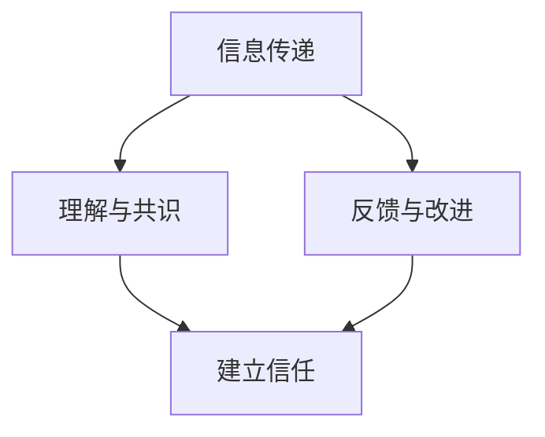

#### 数学模型和公式

沟通效果的评估可以通过以下公式来衡量：

$$
E = f(P, R, T)
$$

其中，$E$ 表示沟通效果，$P$ 表示信息的准确性，$R$ 表示信息的接受度，$T$ 表示反馈的及时性和有效性。

#### 举例说明

假设在一个项目中，项目经理需要向团队成员传达一个关键的信息。为了确保沟通的有效性，项目经理可以：

1. **倾听**：与团队成员进行一对一的会议，了解他们对项目的理解和建议。
2. **表达**：通过简单的语言和图表，清晰地传达项目的目标和预期结果。
3. **反馈**：在会议结束后，收集团队成员的反馈，并根据反馈调整沟通策略。

### 3.2 决策能力

决策能力是领导者的重要素质之一。领导者需要能够在面对复杂和不确定的情况时，快速、明智地做出决策。

- **问题识别**：领导者需要能够准确地识别问题，明确问题的本质和关键点。
- **信息收集**：领导者需要收集和分析与问题相关的信息，包括数据、意见和反馈。
- **方案评估**：领导者需要评估不同的解决方案，选择最优的方案。
- **实施决策**：领导者需要确保决策得到有效实施，监控决策效果，并根据反馈进行调整。

#### 决策能力的核心算法原理

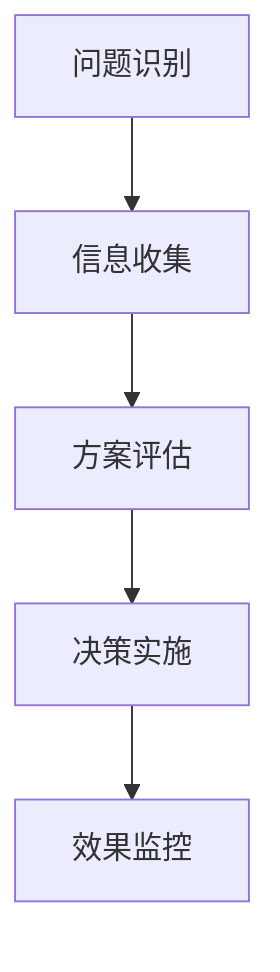

#### 数学模型和公式

决策效果的评估可以通过以下公式来衡量：

$$
D = f(C, I, T, E)
$$

其中，$D$ 表示决策效果，$C$ 表示方案选择的合理性，$I$ 表示信息收集的全面性，$T$ 表示决策实施的效率，$E$ 表示决策的可持续性和影响力。

#### 举例说明

假设公司面临一个市场扩张的决策。领导者可以：

1. **问题识别**：明确公司是否需要市场扩张以及市场扩张的目标和潜力。
2. **信息收集**：收集市场数据、竞争分析和消费者反馈。
3. **方案评估**：评估不同的市场扩张方案，选择最具有潜力的方案。
4. **决策实施**：制定详细的执行计划，并监控市场反应，根据反馈进行调整。

### 3.3 建立信任

信任是领导力的基石。一个领导者如果无法赢得团队的信任，将难以实现领导目标。

- **诚信**：领导者需要言行一致，做到诚实守信。诚信是建立信任的基石。
- **透明**：领导者需要保持信息的透明度，确保团队成员了解组织的实际情况。
- **一致性**：领导者需要保持行为的一致性，避免出现矛盾和误解。

#### 建立信任的核心算法原理

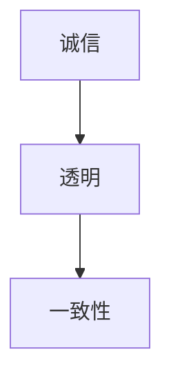

#### 数学模型和公式

信任的建立可以通过以下公式来衡量：

$$
T = f(C, P, I)
$$

其中，$T$ 表示信任水平，$C$ 表示诚信度，$P$ 表示透明度，$I$ 表示一致性。

#### 举例说明

假设一个项目经理需要赢得团队成员的信任，可以：

1. **诚信**：始终如一地遵守承诺，做到言行一致。
2. **透明**：定期向团队成员通报项目的进展和问题。
3. **一致性**：在决策和行动上保持一致，避免出现矛盾。

### 3.4 激励能力

激励能力是领导者调动团队成员积极性和创造力的关键。

- **目标设定**：领导者需要设定清晰、具有挑战性的目标，激发团队成员的斗志。
- **认可与奖励**：领导者需要及时认可和奖励团队成员的成就，增强他们的积极性。
- **成长机会**：领导者需要为团队成员提供成长和发展机会，帮助他们实现职业目标。

#### 激励能力的核心算法原理

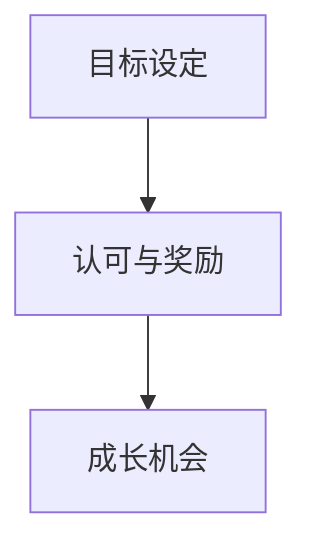

#### 数学模型和公式

激励效果可以通过以下公式来衡量：

$$
M = f(G, R, O)
$$

其中，$M$ 表示激励效果，$G$ 表示目标的挑战性，$R$ 表示认可与奖励的力度，$O$ 表示成长机会的吸引力。

#### 举例说明

假设一个项目经理需要激励团队成员，可以：

1. **目标设定**：设定一个具有挑战性的目标，激励团队成员努力实现。
2. **认可与奖励**：在团队成员完成关键任务后，给予认可和奖励。
3. **成长机会**：为团队成员提供培训和发展机会，帮助他们提升技能。

### 结论

领导力的核心要素包括沟通能力、决策能力、建立信任和激励能力。这些要素相互关联，共同构成了领导力的基础。领导者需要不断发展和提升这些能力，以应对不同的领导挑战，实现组织的成功。

在下一节中，我们将探讨领导力法则的实际应用，包括明确目标与愿景、激发团队潜能、有效沟通与协调、持续改进与创新以及培养领导者接班人，帮助领导者更好地应用这些法则，提升领导力。

## 4. 领导力法则一：明确目标与愿景

明确目标和愿景是领导力的核心之一。一个明确的目标和愿景不仅能够指引团队和组织的发展方向，还能够激发团队成员的积极性和创造力。在本节中，我们将深入探讨明确目标与愿景的重要性，以及如何制定一个有效的目标。

### 4.1 明确目标的重要性

明确目标是领导力的基础。一个明确的目标能够帮助团队和组织聚焦资源，提高工作效率，并确保团队成员朝着共同的目标努力。以下是明确目标的重要性：

- **聚焦资源**：明确的目标能够帮助团队和组织明确资源的分配和使用，确保有限的资源被用在最需要的地方。
- **提高效率**：明确的目标能够减少团队成员之间的不确定性和误解，提高工作效率和协作能力。
- **激发动力**：明确的目标能够激发团队成员的积极性和创造力，使他们更有动力去实现目标。

### 4.2 如何制定一个有效的目标

制定一个有效的目标需要遵循SMART原则（具体、可衡量、可实现、相关、有时间限制）。以下是如何根据SMART原则制定一个有效目标的具体步骤：

- **具体（Specific）**：目标需要具体明确，避免模糊和抽象。例如，“增加销售额”不如“增加销售额10%”具体。
- **可衡量（Measurable）**：目标需要能够量化，以便于评估进度和成果。例如，“提高员工满意度”不如“提高员工满意度至90%”可衡量。
- **可实现（Achievable）**：目标需要是可实现的，避免过于理想化。例如，“一年内实现全球市场扩张”可能过于理想，而“在接下来三个月内拓展两个新市场”则更为现实。
- **相关（Relevant）**：目标需要与组织或团队的整体目标相关联。例如，“提升产品销量”与组织的目标相符，而“举办一个节日派对”则与之无关。
- **有时间限制（Time-bound）**：目标需要设定一个明确的时间期限，以便于追踪进度和评估成果。例如，“在下一季度内实现目标”比“尽快实现目标”更具时间感。

#### 4.2.1 SMART原则的具体应用

**例子**：假设一个公司的目标是“提升员工的工作效率”。根据SMART原则，这个目标可以改为：

- **具体**：提升员工的工作效率。
- **可衡量**：通过提高员工的工作时长或完成任务的速率来衡量。
- **可实现**：通过改进工作流程、提供培训等方式实现。
- **相关**：提升员工的工作效率与公司的整体目标相关，如提高生产效率、减少错误率等。
- **有时间限制**：设定一个具体的时间期限，如“在下一个季度内实现提升20%的工作效率”。

### 4.3 目标与愿景的关系

目标是为了实现愿景而设定的短期目标，而愿景则是长期的目标和方向。目标与愿景之间存在着密切的联系：

- **愿景引导目标**：愿景为组织提供了长期的方向和目标，目标是实现愿景的具体步骤和行动。
- **目标实现愿景**：通过实现一系列的目标，组织能够逐步接近并实现其愿景。

例如，一个公司的愿景可能是“成为行业的领导者”，其目标可能是“在下一个季度内增加市场份额5%”和“在接下来的一年中提升品牌知名度”。

### 4.4 制定目标的实际步骤

以下是制定一个有效目标的实际步骤：

1. **明确愿景**：首先，领导者需要明确组织的长期愿景，这将是制定目标的基础。
2. **分解愿景**：将愿景分解为一系列短期目标，确保每个目标都是具体、可衡量、可实现、相关并且有时间限制的。
3. **制定策略**：为每个目标制定具体的实施策略，包括资源分配、时间表和关键里程碑。
4. **沟通目标**：与团队成员分享目标，确保他们理解并认同目标，并明确各自的职责和期望。
5. **监控与调整**：定期监控目标的实现情况，根据反馈进行必要的调整。

#### 4.4.1 制定目标的流程图

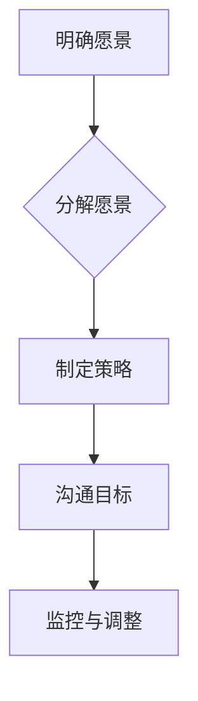

### 4.5 举例说明

假设一家初创公司希望在未来一年内扩大市场份额。根据SMART原则，该公司可以设定以下目标：

- **具体**：在一年内将市场份额从10%提升到15%。
- **可衡量**：通过市场调研和销售数据来衡量市场份额的提升。
- **可实现**：通过增加营销预算、改进产品和服务、拓展销售渠道等手段实现。
- **相关**：提升市场份额与公司的长期愿景“成为行业的领导者”相关。
- **有时间限制**：设定一个具体的时间期限，即在未来一年内实现。

通过上述步骤，该公司可以制定一个明确的行动计划，并逐步实现其目标。

### 结论

明确目标和愿景是领导力的核心要素之一。通过遵循SMART原则，领导者可以制定一个具体、可衡量、可实现、相关并且有时间限制的目标，帮助团队和组织聚焦资源，提高效率，并实现长期愿景。在下一节中，我们将探讨领导力法则二：激发团队潜能，帮助领导者更好地发挥团队成员的潜力，推动团队的发展。

## 5. 领导力法则二：激发团队潜能

激发团队潜能是领导力的重要组成部分，也是实现团队目标和组织愿景的关键。领导者需要了解团队成员的优势与劣势，并采取有效措施激发他们的积极性。在本节中，我们将深入探讨如何了解团队成员的优势与劣势，如何激发团队成员的积极性，以及团队建设的实践。

### 5.1 了解团队成员的优势与劣势

了解团队成员的优势与劣势是激发团队潜能的第一步。以下是一些方法和技巧：

- **观察与记录**：领导者需要通过日常工作和项目中的表现，观察团队成员的优势与劣势。例如，有些成员可能在解决问题时表现出色，而另一些成员可能在沟通协调方面有困难。

- **访谈与反馈**：定期与团队成员进行一对一访谈，了解他们的想法、感受和职业目标。通过反馈机制，领导者可以更全面地了解团队成员的劣势，并制定相应的改进计划。

- **评估与反馈**：通过定期的绩效评估，领导者可以客观地评估团队成员的工作表现，识别他们的优势和劣势。

#### 5.1.1 了解团队成员的优势与劣势的核心算法原理

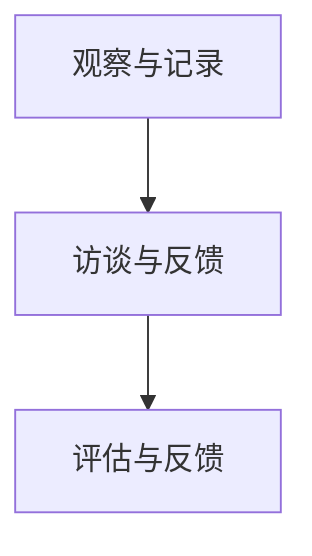

#### 数学模型和公式

优势与劣势的评估可以通过以下公式来衡量：

$$
A = f(O, I, P)
$$

其中，$A$ 表示优势，$O$ 表示观察结果，$I$ 表示访谈反馈，$P$ 表示评估结果。

#### 5.1.2 举例说明

假设一个团队中有两位成员，分别是李华和王刚。通过观察和访谈，领导者发现：

- 李华在解决问题方面表现优秀，但沟通能力较弱。
- 王刚在沟通协调方面表现突出，但解决问题能力有待提升。

根据这些信息，领导者可以制定相应的培养计划，如为李华提供沟通培训，为王刚提供解决问题的指导。

### 5.2 激发团队成员的积极性

激发团队成员的积极性是领导力的关键。以下是一些方法：

- **目标设定**：领导者需要为团队成员设定具体、具有挑战性的目标，激发他们的斗志。目标应与团队成员的职业目标和团队的总体目标相一致。

- **认可与奖励**：领导者需要及时认可和奖励团队成员的成就，增强他们的积极性和归属感。奖励可以是物质上的，如奖金和奖品，也可以是精神上的，如表扬和晋升机会。

- **成长机会**：领导者需要为团队成员提供成长和发展机会，帮助他们提升技能和职业素养。这包括培训、轮岗和参与项目等。

#### 5.2.1 激发团队成员的积极性的核心算法原理


#### 数学模型和公式

积极性可以通过以下公式来衡量：

$$
P = f(G, R, O)
$$

其中，$P$ 表示积极性，$G$ 表示目标的挑战性，$R$ 表示认可与奖励的力度，$O$ 表示成长机会的吸引力。

#### 5.2.2 举例说明

假设一个团队成员王强在完成一个重要项目后，领导者可以：

- **目标设定**：为他在下一个项目中设定一个更具挑战性的目标，激励他继续努力。
- **认可与奖励**：在团队会议上表扬他的贡献，并给予一定的奖金。
- **成长机会**：为他提供参加高级培训的机会，帮助他提升职业素养。

### 5.3 团队建设的实践

团队建设是激发团队潜能的重要手段。以下是一些团队建设的实践：

- **团队活动**：定期组织团队活动，如团建、运动会等，增强团队成员之间的互动和信任。
- **培训与学习**：为团队成员提供培训和学习机会，提高他们的技能和知识水平。
- **沟通渠道**：建立有效的沟通渠道，确保团队成员之间的信息畅通。

#### 5.3.1 团队建设的实践步骤

1. **规划团队活动**：根据团队的特点和需求，规划合适的团队活动，如团建、运动会等。
2. **组织培训与学习**：根据团队成员的技能需求，组织相应的培训和学习活动，提升团队的整体能力。
3. **建立沟通渠道**：通过定期会议、内部邮件、即时通讯工具等建立有效的沟通渠道，确保团队成员之间的信息畅通。

#### 5.3.2 团队建设的核心算法原理

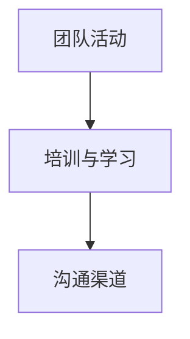

#### 5.3.3 举例说明

假设一个团队需要加强沟通和协作，领导者可以：

- **团队活动**：组织一次户外团建活动，增强团队成员之间的信任和团队凝聚力。
- **培训与学习**：为团队成员提供沟通技巧和协作能力的培训。
- **沟通渠道**：建立定期的团队会议制度，确保团队成员之间的信息畅通。

### 结论

激发团队潜能是领导力的重要法则之一。通过了解团队成员的优势与劣势，制定具有挑战性的目标，认可与奖励团队成员的成就，以及加强团队建设，领导者可以激发团队成员的积极性，提升团队的整体绩效。在下一节中，我们将探讨领导力法则三：有效沟通与协调，帮助领导者更好地运用沟通技巧，实现团队的目标。

## 6. 领导力法则三：有效沟通与协调

有效沟通与协调是领导力的关键要素之一。良好的沟通能够帮助领导者了解团队的需求和问题，确保团队成员之间的信息畅通，从而提高团队的协作效率和绩效。在本节中，我们将深入探讨沟通的艺术、领导者如何进行有效沟通，以及沟通中的障碍与解决方案。

### 6.1 沟通的艺术

沟通不仅仅是信息的传递，更是一种艺术。领导者需要掌握以下沟通艺术：

- **倾听**：倾听是有效沟通的第一步。领导者需要学会倾听团队成员的想法、感受和需求，真正理解他们的立场和困境。倾听不仅仅是听，更是理解和回应。

- **表达**：表达清晰、准确是领导者成功的关键。领导者需要能够用简单明了的语言传达复杂的信息，确保团队成员理解领导者的意图和期望。表达不仅仅是说话，还包括非语言沟通，如肢体语言、面部表情和眼神交流。

- **反馈**：及时的反馈是沟通的重要组成部分。领导者需要能够给予团队成员建设性的反馈，帮助他们改进和提高。同时，领导者也需要接受团队成员的反馈，反思自己的行为和决策，不断优化沟通方式。

#### 6.1.1 沟通的艺术的核心算法原理

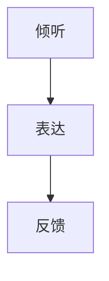

#### 数学模型和公式

沟通效果可以通过以下公式来衡量：

$$
E = f(L, C, R)
$$

其中，$E$ 表示沟通效果，$L$ 表示倾听的能力，$C$ 表示表达的能力，$R$ 表示反馈的能力。

#### 6.1.2 举例说明

假设一个项目经理需要在团队会议上传达一个关键信息。为了确保沟通的有效性，项目经理可以：

1. **倾听**：在会议前了解团队成员的需求和困惑，以便在会议中针对性地解答。
2. **表达**：使用简洁明了的语言和图表，清晰地传达项目的目标和预期结果。
3. **反馈**：在会议结束后，收集团队成员的反馈，并根据反馈调整沟通策略。

### 6.2 领导者如何进行有效沟通

领导者进行有效沟通的关键在于：

- **明确信息**：领导者需要明确沟通的目的和内容，确保信息的传达是准确和有针对性的。
- **使用简洁的语言**：领导者需要使用简洁、易懂的语言，避免使用复杂的术语和方言，以确保团队成员能够理解。
- **确保信息的透明度**：领导者需要保持信息的透明度，确保团队成员了解组织的实际情况和决策依据。
- **及时反馈**：领导者需要及时给予团队成员反馈，帮助他们了解自己的表现和改进方向。

#### 6.2.1 领导者如何进行有效沟通的核心算法原理

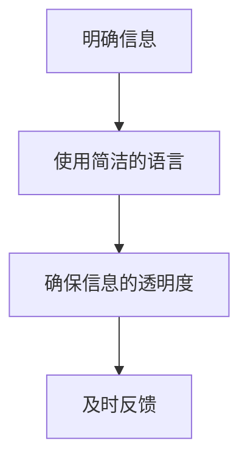

#### 数学模型和公式

有效沟通的效果可以通过以下公式来衡量：

$$
E = f(M, S, T, F)
$$

其中，$E$ 表示沟通效果，$M$ 表示信息的明确性，$S$ 表示语言简洁性，$T$ 表示信息的透明度，$F$ 表示反馈的及时性。

#### 6.2.2 举例说明

假设一个项目经理需要与团队成员讨论项目进展。为了确保沟通的有效性，项目经理可以：

1. **明确信息**：在会议前明确讨论的重点和目标，确保会议内容是有针对性的。
2. **使用简洁的语言**：在会议中避免使用复杂的术语，使用简单明了的语言传达信息。
3. **确保信息的透明度**：在会议中分享项目的最新进展和面临的挑战，确保团队成员了解实际情况。
4. **及时反馈**：在会议结束后，根据团队成员的反馈调整项目计划，并给予他们及时的反馈。

### 6.3 沟通中的障碍与解决方案

沟通中的障碍可能会影响沟通的有效性，领导者需要识别并解决这些障碍。

- **文化差异**：不同文化背景的团队成员可能会在沟通中产生误解和冲突。解决方案是提供跨文化培训，促进团队成员之间的理解和尊重。
- **沟通不畅**：信息在传递过程中可能会失真或延迟，导致沟通不畅。解决方案是建立有效的沟通渠道，如定期会议、即时通讯工具等，确保信息畅通。
- **误解**：团队成员可能会对信息产生误解，导致错误的决策和行为。解决方案是加强沟通的反馈机制，确保信息的准确传达和理解。

#### 6.3.1 沟通中的障碍与解决方案的核心算法原理

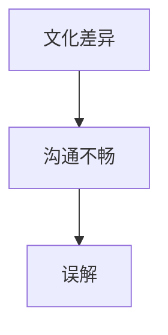

#### 数学模型和公式

沟通障碍的解决效果可以通过以下公式来衡量：

$$
S = f(C, I, M)
$$

其中，$S$ 表示解决效果，$C$ 表示文化差异的解决情况，$I$ 表示沟通不畅的解决情况，$M$ 表示误解的解决情况。

#### 6.3.2 举例说明

假设一个跨国团队中，团队成员来自不同国家，可能会出现文化差异和沟通不畅的问题。为了解决这些问题，领导者可以：

1. **文化差异**：提供跨文化培训，帮助团队成员了解不同文化背景下的沟通方式和行为习惯。
2. **沟通不畅**：建立多语言沟通渠道，如翻译支持，确保信息在不同语言和文化背景下的准确传达。
3. **误解**：鼓励团队成员在沟通中主动提问和澄清，确保信息的准确理解和执行。

### 结论

有效沟通与协调是领导力的重要法则之一。通过掌握沟通的艺术、明确信息、使用简洁的语言、确保信息的透明度和及时反馈，领导者可以提升沟通效果，解决沟通中的障碍，从而提高团队的协作效率和绩效。在下一节中，我们将探讨领导力法则四：持续改进与创新，帮助领导者推动组织的持续创新和发展。

## 7. 领导力法则四：持续改进与创新

在快速变化的市场环境中，持续改进与创新是组织保持竞争力的关键。领导者需要推动团队的持续改进和创新，以应对不断变化的市场需求和竞争压力。在本节中，我们将深入探讨领导者如何推动组织创新、创新思维的方法与实践，以及成功创新的案例分享。

### 7.1 领导者如何推动组织创新

领导者推动组织创新的关键在于：

- **建立创新文化**：领导者需要建立一种鼓励创新的文化氛围，让团队成员敢于提出新的想法，并乐于尝试和接受变化。创新文化强调开放性、实验性和包容性。
- **提供资源支持**：领导者需要为创新提供必要的资源支持，包括资金、人力和时间。资源支持是创新成功的重要保障。
- **激励创新行为**：领导者需要通过奖励和激励机制，鼓励团队成员积极参与创新活动。激励措施可以包括奖金、晋升机会和认可等。
- **建立跨部门合作**：创新往往需要跨部门合作，领导者需要推动不同部门之间的协作，确保创新项目的顺利进行。

#### 7.1.1 领导者如何推动组织创新的核心算法原理

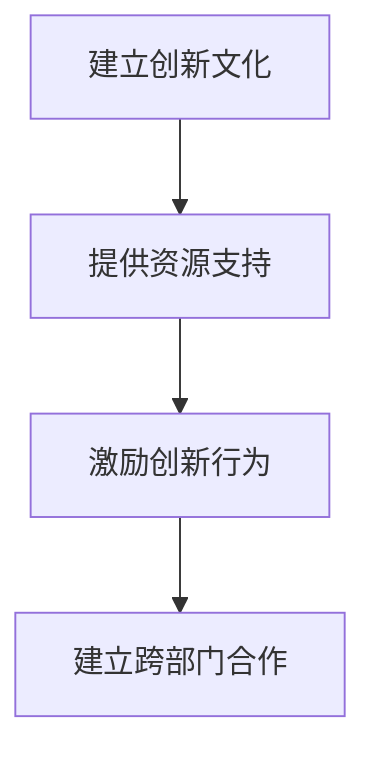

#### 数学模型和公式

创新效果可以通过以下公式来衡量：

$$
I = f(C, R, M, D)
$$

其中，$I$ 表示创新效果，$C$ 表示创新文化，$R$ 表示资源支持，$M$ 表示激励措施，$D$ 表示跨部门合作。

#### 7.1.2 举例说明

假设一个公司希望推动创新，领导者可以：

1. **建立创新文化**：定期组织创新活动，如头脑风暴会议，鼓励团队成员提出新想法。
2. **提供资源支持**：设立创新基金，为创新项目提供资金支持。
3. **激励创新行为**：对提出创新想法的团队成员给予奖励，如奖金和晋升机会。
4. **建立跨部门合作**：组织跨部门团队，共同推进创新项目。

### 7.2 创新思维的方法与实践

创新思维是推动创新的核心。以下是一些常用的创新思维方法：

- **头脑风暴**：头脑风暴是一种集体创新方法，通过激发团队成员的创意和想象力，快速产生大量的创新想法。
- **设计思维**：设计思维是一种以用户为中心的创新方法，通过深入了解用户需求，设计出具有创新性的解决方案。
- **用户研究**：用户研究是通过观察和分析用户行为，获取用户需求和市场趋势，为创新提供依据。

#### 7.2.1 创新思维的方法与实践的核心算法原理

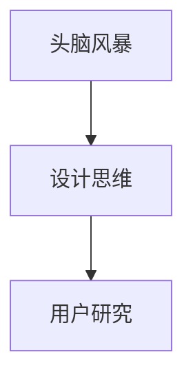

#### 数学模型和公式

创新思维的效率可以通过以下公式来衡量：

$$
E = f(B, D, U)
$$

其中，$E$ 表示创新思维效率，$B$ 表示头脑风暴的效果，$D$ 表示设计思维的应用，$U$ 表示用户研究的深度。

#### 7.2.2 举例说明

假设一个公司希望开发一款新产品，领导者可以：

1. **头脑风暴**：组织团队进行头脑风暴会议，收集各种创新想法。
2. **设计思维**：通过用户研究，了解目标用户的需求和偏好，设计出符合用户需求的产品原型。
3. **用户研究**：在产品开发过程中，持续进行用户研究，根据用户反馈调整产品设计。

### 7.3 创新案例分享

以下是一些成功创新的案例，供领导者参考：

- **案例一：苹果公司**：苹果公司通过不断创新，推出了iPhone、iPad等革命性产品，成为全球最具有创新力的公司之一。苹果公司的成功得益于其强大的创新文化和持续的创新投入。
- **案例二：谷歌公司**：谷歌公司以其“创新实验室”（X实验室）而闻名，通过跨部门合作和创新思维，开发了自动驾驶汽车、智能眼镜等创新项目。谷歌公司的创新文化鼓励员工提出新想法，并提供资源支持。
- **案例三：华为公司**：华为公司通过持续的创新，开发了5G技术、智能手机等领先产品，成为全球领先的通信设备供应商。华为公司注重技术创新，投入大量资源进行研发，并建立了完善的人才培养体系。

#### 7.3.1 创新案例的核心算法原理

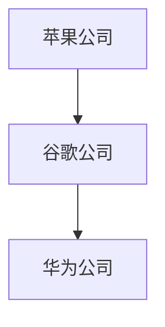

#### 数学模型和公式

创新案例的成功可以通过以下公式来衡量：

$$
S = f(A, B, C)
$$

其中，$S$ 表示创新成功的程度，$A$ 表示苹果公司的创新，$B$ 表示谷歌公司的创新，$C$ 表示华为公司的创新。

#### 7.3.2 举例说明

假设一个公司希望借鉴其他公司的创新经验，可以：

1. **学习苹果公司的创新经验**：了解苹果公司如何建立创新文化和持续投入研发，应用到自身公司。
2. **学习谷歌公司的跨部门合作和创新思维**：了解谷歌公司如何通过“创新实验室”推动创新，并尝试在自身公司实施。
3. **学习华为公司的技术创新**：了解华为公司如何通过技术创新保持市场竞争力，并加强自身的技术研发能力。

### 结论

持续改进与创新是领导力的核心法则之一。领导者需要建立创新文化，提供资源支持，激励创新行为，并推动跨部门合作。通过创新思维的方法和实践，领导者可以推动组织的持续创新和发展。通过学习成功创新的案例，领导者可以借鉴其他公司的经验，提升自身的创新能力和组织竞争力。在下一节中，我们将探讨领导力法则五：培养领导者接班人，帮助领导者确保组织的长期发展。

## 8. 领导力法则五：培养领导者接班人

培养领导者接班人是确保组织长期发展的关键。一个成功的领导者不仅需要关注当前的工作，还需要为组织的未来做好准备。在本节中，我们将探讨领导者接班人的重要性、如何培养未来的领导者以及相关的案例研究。

### 8.1 领导者接班人的重要性

领导者接班人的重要性体现在以下几个方面：

- **平稳过渡**：随着领导者的更替，组织需要确保运营的连续性和稳定性。培养领导者接班人可以帮助组织在领导层更替时保持平稳过渡。
- **组织发展**：领导者接班人的培养有助于组织的发展。通过培养具有领导潜力的成员，组织可以确保未来有足够的人才储备，推动组织的长期发展。
- **传承理念**：领导者接班人的培养有助于传承组织的核心价值和理念。新的领导者需要继承前任领导者的经验和智慧，并在此基础上进行创新和发展。

#### 8.1.1 领导者接班人的重要性核心算法原理

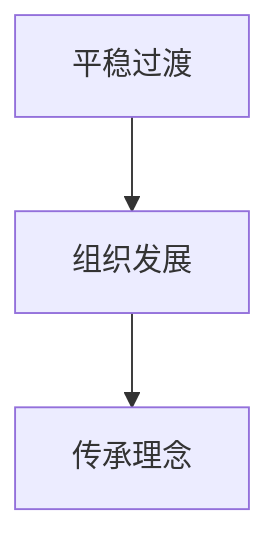

#### 数学模型和公式

领导者接班人的培养效果可以通过以下公式来衡量：

$$
E = f(P, O, I)
$$

其中，$E$ 表示培养效果，$P$ 表示平稳过渡的保障，$O$ 表示组织发展的推动，$I$ 表示理念传承的成功。

#### 8.1.2 举例说明

假设一个公司希望在五年内培养出一位新的CEO，公司可以：

1. **平稳过渡**：为新的CEO提供过渡期的支持和指导，确保领导层更替的平稳进行。
2. **组织发展**：通过系统的培训和项目经验，帮助新的CEO了解公司的运营和战略方向，推动组织发展。
3. **传承理念**：强调公司核心价值和文化，确保新的CEO能够继承并传承公司的理念。

### 8.2 如何培养未来的领导者

培养未来的领导者需要系统的计划和持续的努力。以下是一些关键的步骤和策略：

- **识别潜力**：领导者需要识别具有领导潜力的成员，包括他们的才能、动机和职业目标。通过定期的评估和反馈，领导者可以更好地了解成员的潜力。
- **提供发展机会**：为未来的领导者提供成长和发展机会，包括培训、轮岗、参与决策等。这些机会可以帮助他们提升技能和经验。
- **建立导师制**：通过导师制，为未来的领导者提供指导和支持。导师可以分享经验，提供建议，帮助新领导者克服挑战。
- **鼓励参与**：鼓励未来的领导者参与组织的决策和项目，让他们在真实的工作环境中锻炼和成长。

#### 8.2.1 如何培养未来的领导者的核心算法原理

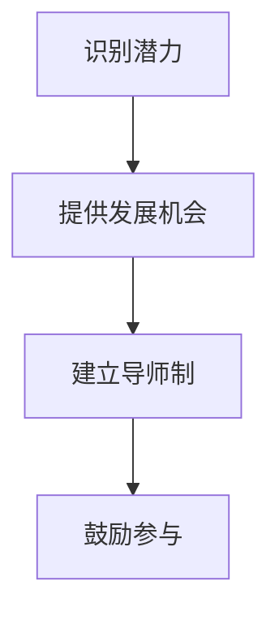

#### 数学模型和公式

领导者培养效果可以通过以下公式来衡量：

$$
E = f(I, O, M, P)
$$

其中，$E$ 表示培养效果，$I$ 表示识别潜力，$O$ 表示提供发展机会，$M$ 表示建立导师制，$P$ 表示鼓励参与。

#### 8.2.2 举例说明

假设一个公司希望培养出一位未来的CEO，公司可以：

1. **识别潜力**：通过定期的绩效评估和360度反馈，识别具有领导潜力的成员。
2. **提供发展机会**：安排这些成员参与关键项目，提供管理培训和发展课程。
3. **建立导师制**：为这些成员安排经验丰富的导师，提供指导和支持。
4. **鼓励参与**：鼓励这些成员参与公司的战略决策，提升他们的决策能力和领导能力。

### 8.3 领导者接班人的案例研究

以下是一些成功培养领导者接班人的案例，供领导者参考：

- **案例一：谷歌公司**：谷歌公司通过其“10倍人才计划”培养未来的领导者。这个计划旨在识别和培养具有非凡才能和领导潜力的员工，为他们提供挑战性的项目和资源支持。
- **案例二：IBM公司**：IBM公司建立了完善的领导力发展计划，包括领导力培训、导师制和轮岗机会。通过这些计划，IBM成功地培养出了多位具有国际视野的领导者。
- **案例三：微软公司**：微软公司通过其“领袖计划”培养未来的领导者。这个计划包括领导力培训、项目参与和跨部门轮岗，旨在提升员工的领导能力和战略思维。

#### 8.3.1 领导者接班人案例研究的核心算法原理

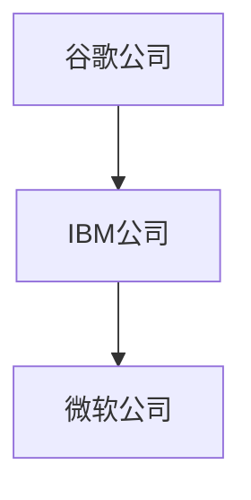

#### 数学模型和公式

领导者接班人培养的成功可以通过以下公式来衡量：

$$
S = f(G, I, M)
$$

其中，$S$ 表示成功培养的领导者数量，$G$ 表示谷歌公司的培养计划，$I$ 表示IBM公司的培养计划，$M$ 表示微软公司的培养计划。

#### 8.3.2 举例说明

假设一个公司希望借鉴其他公司的领导者接班人培养经验，可以：

1. **学习谷歌公司的“10倍人才计划”**：了解谷歌公司如何识别和培养具有领导潜力的员工，并应用到自身公司。
2. **学习IBM公司的领导力发展计划**：了解IBM公司如何通过培训、导师制和轮岗机会培养未来的领导者。
3. **学习微软公司的“领袖计划”**：了解微软公司如何通过系统的领导力培养计划，提升员工的领导能力和战略思维。

### 结论

培养领导者接班人是领导力的核心法则之一。通过识别潜力、提供发展机会、建立导师制和鼓励参与，领导者可以培养出未来的领导者，确保组织的长期发展。通过学习成功培养领导者接班人的案例，领导者可以借鉴其他公司的经验，提升自身的培养能力和组织竞争力。在下一节中，我们将通过实际案例分析，探讨领导力法则在实践中的应用。

## 9. 领导力实践案例分析

通过分析不同组织在领导力实践方面的成功案例，可以为我们提供宝贵的经验教训。以下是一些具有代表性的案例，包括苹果公司、谷歌公司和华为公司的领导力实践。

### 9.1 案例一：苹果公司的领导力实践

苹果公司以其卓越的领导力和创新精神而闻名。公司创始人乔布斯作为领导者，通过明确的目标、卓越的沟通和创新思维，推动了苹果公司的发展。

**背景介绍**：乔布斯在1984年重返苹果公司后，带领公司推出了一系列革命性产品，如Macintosh电脑、iPod、iPhone和iPad等。

**核心概念与联系**：

1. **目标明确**：乔布斯明确了苹果公司的愿景，即“制造令人惊艳的产品”，并确保所有团队成员都朝着这个目标努力。
2. **沟通能力**：乔布斯通过简单明了的语言和视觉化的演示，清晰地传达了苹果公司的愿景和目标，确保团队成员理解并认同。
3. **创新思维**：乔布斯鼓励创新，支持团队成员大胆尝试和实验，从而推动苹果公司的持续创新。

**核心算法原理讲解**：

```python
# 伪代码：苹果公司的领导力实践

def set_clear_vision(vision):
    # 设定明确的目标和愿景
    return vision

def communicate_vision(team_members, vision):
    # 传达愿景和目标
    for member in team_members:
        explain_vision(member, vision)

def promote_innovation(team_members):
    # 鼓励创新
    for member in team_members:
        encourage_experiments(member)
```

**数学模型和公式**：

苹果公司的成功可以通过以下公式来衡量：

$$
S = f(V, C, I)
$$

其中，$S$ 表示成功程度，$V$ 表示目标明确，$C$ 表示沟通能力，$I$ 表示创新思维。

**项目实战**：

苹果公司通过以下实践推动了其领导力：

1. **开发Macintosh电脑**：乔布斯明确了产品的愿景，并与团队密切合作，最终推出了革命性的Macintosh电脑。
2. **推出iPhone**：乔布斯通过清晰的目标设定和卓越的沟通，成功推出了iPhone，改变了智能手机市场。
3. **推出iPad**：乔布斯再次通过明确的目标和创新思维，成功推出了iPad，开启了平板电脑的新时代。

**代码解读与分析**：

苹果公司的成功在于其领导者乔布斯的目标明确、沟通卓越和创新思维。通过设定明确的目标，乔布斯确保了团队的统一行动；通过卓越的沟通，他确保了团队成员的理解和认同；通过创新思维，他推动了苹果公司的持续创新。

**实际案例分析和详细讲解剖析**：

苹果公司的领导力实践证明了明确的目标、卓越的沟通和创新思维对组织成功的重要性。通过乔布斯的领导，苹果公司不仅创造了多个革命性产品，还成为了全球最具价值的科技公司之一。

**项目小结**：

苹果公司的领导力实践为其他组织提供了宝贵的经验。领导者需要设定明确的目标、确保有效的沟通并鼓励创新，以推动组织的持续发展。

### 9.2 案例二：谷歌公司的领导力实践

谷歌公司以其开放的文化和创新的环境而著称。公司创始人谢尔盖·布林和拉里·佩奇作为领导者，通过鼓励创新、提供资源支持和建立导师制，推动了谷歌公司的持续发展。

**背景介绍**：谷歌公司成立于1998年，迅速发展成为全球最大的搜索引擎公司之一。布林和佩奇作为领导者，致力于打造一个开放、创新和员工友好的工作环境。

**核心概念与联系**：

1. **创新文化**：布林和佩奇鼓励员工大胆尝试和实验，推动谷歌公司的持续创新。
2. **资源支持**：谷歌公司为创新项目提供了充足的资源支持，确保员工能够自由地探索和实验。
3. **导师制**：谷歌公司建立了完善的导师制，为员工提供指导和支持，帮助他们成长和发展。

**核心算法原理讲解**：

```python
# 伪代码：谷歌公司的领导力实践

def encourage_innovation(employees):
    # 鼓励创新
    for employee in employees:
        promote_experiments(employee)

def provide_resources(projects):
    # 提供资源支持
    for project in projects:
        allocate_resources(project)

def establish_mentorship(employees):
    # 建立导师制
    for employee in employees:
        assign_mentor(employee)
```

**数学模型和公式**：

谷歌公司的创新效果可以通过以下公式来衡量：

$$
I = f(E, R, M)
$$

其中，$I$ 表示创新效果，$E$ 表示鼓励创新，$R$ 表示资源支持，$M$ 表示导师制。

**项目实战**：

谷歌公司通过以下实践推动了其领导力：

1. **谷歌搜索**：布林和佩奇通过创新思维，开发了革命性的搜索引擎Google，改变了互联网搜索的方式。
2. **谷歌眼镜**：谷歌公司通过资源支持和导师制，开发了谷歌眼镜，开启了可穿戴设备的先河。
3. **谷歌X实验室**：谷歌X实验室通过创新项目和导师制，开发了自动驾驶汽车、智能家居等前沿技术。

**代码解读与分析**：

谷歌公司的成功在于其领导者布林和佩奇的创新文化、资源支持和导师制。通过鼓励创新，谷歌公司激发了员工的创造力和积极性；通过提供资源支持，谷歌公司确保了创新项目的顺利进行；通过建立导师制，谷歌公司帮助员工提升了技能和领导力。

**实际案例分析和详细讲解剖析**：

谷歌公司的领导力实践证明了创新文化、资源支持和导师制对组织成功的重要性。通过布林和佩奇的领导，谷歌公司不仅在搜索领域取得了巨大成功，还在多个前沿技术领域取得了突破。

**项目小结**：

谷歌公司的领导力实践为其他组织提供了宝贵的经验。领导者需要鼓励创新、提供资源支持和建立导师制，以推动组织的持续发展和创新。

### 9.3 案例三：华为公司的领导力实践

华为公司以其全球化的战略和卓越的执行力而闻名。公司创始人任正非作为领导者，通过明确的目标、高效的沟通和持续的创新，推动了华为公司的全球化发展。

**背景介绍**：华为公司成立于1987年，从一个小型企业成长为全球领先的通信设备供应商。任正非作为领导者，制定了明确的目标和战略，带领华为走向全球。

**核心概念与联系**：

1. **目标明确**：任正非明确了华为公司的愿景，即“成为世界级的信息和通信技术（ICT）解决方案提供商”，并确保所有团队成员都朝着这个目标努力。
2. **沟通能力**：任正非通过高效沟通，确保团队成员理解并认同华为公司的愿景和目标。
3. **持续创新**：任正非鼓励持续创新，推动华为公司在技术、产品和市场方面的不断突破。

**核心算法原理讲解**：

```python
# 伪代码：华为公司的领导力实践

def set_clear_goals(vision):
    # 设定明确的目标
    return vision

def communicate_goals(team_members, vision):
    # 传达愿景和目标
    for member in team_members:
        explain_goals(member, vision)

def promote_innovation(team_members):
    # 鼓励创新
    for member in team_members:
        encourage_innovation(member)
```

**数学模型和公式**：

华为公司的成功可以通过以下公式来衡量：

$$
S = f(V, C, I)
$$

其中，$S$ 表示成功程度，$V$ 表示目标明确，$C$ 表示沟通能力，$I$ 表示创新思维。

**项目实战**：

华为公司通过以下实践推动了其领导力：

1. **研发5G技术**：华为公司明确了全球通信技术发展的趋势，持续投入研发，成为5G技术的领导者。
2. **开拓国际市场**：华为公司通过高效沟通和全球布局，成功开拓了多个国际市场，提升了公司的全球影响力。
3. **推动数字化转型**：华为公司通过持续创新，帮助客户实现数字化转型，提升了行业竞争力。

**代码解读与分析**：

华为公司的成功在于其领导者任正非的目标明确、沟通能力和持续创新。通过设定明确的目标，任正非确保了团队的统一行动；通过高效沟通，他确保了团队成员的理解和认同；通过持续创新，他推动了华为公司的全球发展和市场拓展。

**实际案例分析和详细讲解剖析**：

华为公司的领导力实践证明了明确的目标、高效的沟通和持续创新对组织成功的重要性。通过任正非的领导，华为公司不仅在通信技术领域取得了巨大成就，还在全球市场上占据了重要地位。

**项目小结**：

华为公司的领导力实践为其他组织提供了宝贵的经验。领导者需要设定明确的目标、确保高效的沟通并推动持续创新，以推动组织的全球发展和市场竞争力。

### 总结

通过分析苹果公司、谷歌公司和华为公司的领导力实践案例，我们可以看到，明确的目标、高效的沟通和持续创新是组织成功的关键。领导者需要通过设定明确的目标、确保团队成员的理解和认同，并推动持续创新，以实现组织的愿景和目标。这些成功案例为其他组织提供了宝贵的经验和启示，帮助它们在领导力实践中取得更好的成果。

## 10. 领导力法则的自我反思

作为领导者，自我反思是提升领导力的重要途径。通过反思自己的领导力实践，领导者可以识别自身的弱点，制定改进计划，从而实现持续成长。以下是自我反思的几个关键步骤和策略。

### 10.1 自我评估领导力水平

自我评估是自我反思的第一步。领导者需要客观地评估自己的领导力水平，包括：

- **沟通能力**：评估自己在沟通中的表达清晰度、倾听能力和反馈质量。
- **决策能力**：评估自己在面对挑战和压力时的决策速度和质量。
- **团队建设**：评估自己在团队凝聚力和员工满意度方面的表现。
- **创新能力**：评估自己在推动团队创新和适应变化方面的能力。

#### 10.1.1 自我评估领导力水平的核心算法原理

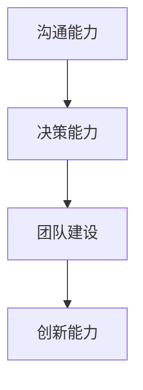

#### 数学模型和公式

自我评估可以通过以下公式来衡量：

$$
L = f(C, D, T, I)
$$

其中，$L$ 表示领导力水平，$C$ 表示沟通能力，$D$ 表示决策能力，$T$ 表示团队建设能力，$I$ 表示创新能力。

#### 10.1.2 举例说明

假设一位领导者自我评估的结果如下：

- **沟通能力**：80%
- **决策能力**：75%
- **团队建设**：85%
- **创新能力**：70%

根据这些数据，领导者可以识别出自己在创新能力方面的较弱之处，并制定相应的改进计划。

### 10.2 发现与改进领导力弱点

在自我评估的基础上，领导者需要深入分析自身的弱点，并制定具体的改进计划。以下是一些策略：

- **识别弱点**：通过反思和他人反馈，识别自己在领导力方面的弱点。
- **制定改进计划**：为每个弱点制定具体的改进计划，包括学习目标、培训计划和行动计划。
- **实施改进计划**：按照改进计划执行，定期评估进展和效果。

#### 10.2.1 发现与改进领导力弱点的核心算法原理

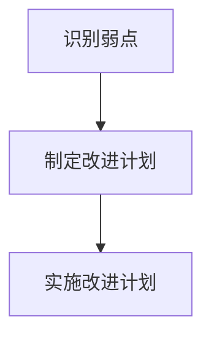

#### 数学模型和公式

改进效果可以通过以下公式来衡量：

$$
E = f(W, P, I)
$$

其中，$E$ 表示改进效果，$W$ 表示弱点，$P$ 表示改进计划，$I$ 表示实施力度。

#### 10.2.2 举例说明

假设一位领导者识别出自己在沟通能力方面的弱点，可以采取以下改进计划：

- **识别弱点**：通过反思和他人反馈，确定自己在沟通中的表达和倾听能力较弱。
- **制定改进计划**：参加沟通技巧培训，定期进行沟通实践，并寻求同事的反馈。
- **实施改进计划**：按照改进计划执行，定期评估自己的沟通能力和效果。

### 10.3 领导力发展的长期规划

为了确保领导力的持续提升，领导者需要制定长期规划。以下是一些策略：

- **设定长期目标**：明确自己在领导力发展方面的长期目标，如提高沟通能力、增强决策能力等。
- **制定实施计划**：为每个长期目标制定具体的实施计划，包括时间表、资源和行动步骤。
- **定期评估与调整**：定期评估自己的进展和效果，根据实际情况调整计划，确保目标的实现。

#### 10.3.1 领导力发展的长期规划的核心算法原理

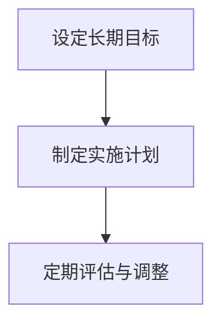

#### 数学模型和公式

长期规划的效果可以通过以下公式来衡量：

$$
L = f(G, P, A)
$$

其中，$L$ 表示长期规划效果，$G$ 表示长期目标，$P$ 表示实施计划，$A$ 表示评估与调整。

#### 10.3.2 举例说明

假设一位领导者希望在五年内显著提高沟通能力，可以采取以下长期规划：

- **设定长期目标**：在五年内将沟通能力提升至90%。
- **制定实施计划**：参加专业的沟通技巧培训，定期进行沟通实践，并邀请同事进行反馈。
- **定期评估与调整**：每半年评估一次自己的沟通能力，根据评估结果调整培训和实践计划。

### 结论

自我反思是提升领导力的关键步骤。通过自我评估、发现和改进领导力弱点以及制定长期规划，领导者可以不断提升自身的领导能力，为组织的成功和持续发展贡献力量。在自我反思的过程中，领导者需要保持诚实和开放的态度，勇于面对自己的不足，并积极寻求改进和成长。

## 结论

领导力法则在打造超级团队中起着至关重要的作用。通过明确目标与愿景、激发团队潜能、有效沟通与协调、持续改进与创新以及培养领导者接班人，领导者可以提升团队的绩效和组织的竞争力。本文通过对领导力的基本概念、核心要素、发展阶段的深入探讨，结合实际案例分析，系统地阐述了这些领导力法则的应用和实践。

首先，明确目标和愿景是领导力的基础。一个清晰的目标和愿景能够帮助团队聚焦资源，提高工作效率，并确保团队成员朝着共同的目标努力。其次，激发团队潜能是领导者的重要职责。通过了解团队成员的优势与劣势，领导者可以制定有针对性的培养计划，提升团队成员的能力和积极性。有效沟通与协调则是确保团队高效运作的关键。良好的沟通能够帮助领导者了解团队的需求和问题，确保团队成员之间的信息畅通，减少误解和冲突。持续改进与创新是组织保持竞争力的动力源泉。领导者需要推动团队的持续改进和创新，以应对不断变化的市场环境和竞争压力。最后，培养领导者接班人是确保组织长期发展的关键。通过培养未来的领导者，组织可以确保领导层的平稳过渡，为组织的长期发展打下坚实基础。

本文还通过实际案例分析，展示了苹果公司、谷歌公司和华为公司的领导力实践，提供了宝贵的经验和启示。这些案例证明了领导力法则在实践中的有效性和重要性。

总之，领导力法则不仅是领导者个人成长的指南，更是组织成功的关键。通过不断学习和实践，领导者可以提升自身的领导能力，打造高效团队，推动组织的持续发展和创新。希望本文能够为读者提供有价值的指导和启示，帮助他们在领导力的道路上不断前行。

### 最佳实践 tips

1. **定期进行团队建设活动**：通过团队建设活动加强团队凝聚力和协作能力。
2. **鼓励团队成员参与决策**：提高团队的积极性和创造力。
3. **提供持续的学习和发展机会**：帮助团队成员提升能力和职业素养。
4. **建立有效的沟通机制**：确保信息畅通，减少误解和冲突。
5. **制定明确的创新目标**：为创新提供方向和资源支持。

### 小结

领导力法则不仅是领导者个人成长的指南，更是组织成功的关键。通过明确目标与愿景、激发团队潜能、有效沟通与协调、持续改进与创新以及培养领导者接班人，领导者可以提升团队的绩效和组织的竞争力。

### 注意事项

1. **领导力不是一成不变的**：领导者需要根据环境和团队的变化不断调整自己的领导风格和策略。
2. **领导者需要持续学习和反思**：只有不断学习和反思，才能不断提升自己的领导能力。
3. **关注团队成员的反馈**：及时了解团队成员的感受和需求，有助于优化领导实践。

### 拓展阅读

1. **《领导力：如何成为更有效的领导者》**：详细探讨领导力的理论与实践，提供实用的领导技巧。
2. **《团队建设：打造高效团队的实践指南》**：介绍团队建设的方法和策略，帮助领导者提升团队绩效。
3. **《创新思维：如何激发团队的创造力》**：探讨创新思维的方法和工具，帮助领导者推动团队的持续创新。
4. **《领导力与战略：领导者如何制定和实施战略》**：分析领导力在战略制定和实施中的关键作用，提供战略规划的实际案例。

### 作者信息

作者：AI天才研究院/AI Genius Institute & 禅与计算机程序设计艺术 /Zen And The Art of Computer Programming

通过以上内容，我们不仅深入探讨了领导力的各个方面，还提供了实用的技巧和建议。希望本文能够帮助读者更好地理解和应用领导力法则，提升自身的领导能力，打造高效团队，推动组织的持续发展和创新。

