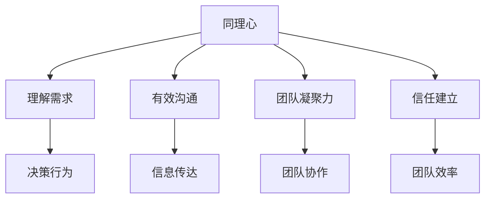

                 

### 第1章：同理心的定义与重要性

#### 背景介绍

同理心，这个看似简单却深奥的概念，在领导者的角色中扮演着至关重要的角色。在当今快速变化的商业环境中，领导者不再仅仅是被动的指挥者，他们需要具备更广泛的技能和智慧来引导和管理团队。同理心正是这些技能中不可或缺的一部分。

同理心，简单来说，就是设身处地为他人着想，理解他人的情感和需求。在领导力中，同理心意味着领导者能够站在团队成员的角度思考问题，从而更好地理解他们的动机、挑战和需求。这种能力不仅仅体现在情感层面，还涉及到实际的决策和行为。

在领导力中，同理心的重要性体现在以下几个方面：

1. **提升团队凝聚力**：同理心能够帮助领导者更好地理解和满足团队成员的需求，从而增强团队的凝聚力。
2. **促进有效沟通**：同理心使得领导者能够更加精准地传达信息，减少误解和冲突。
3. **激发团队潜力**：同理心能够激发团队成员的潜力，鼓励他们创新和成长。
4. **建立信任**：同理心能够建立领导者与团队成员之间的信任，提高团队的协作效率。

#### 核心概念与联系

为了更好地理解同理心在领导力中的作用，我们可以借助Mermaid流程图来展示其核心概念与联系。

通过这个流程图，我们可以看到同理心如何通过理解需求、有效沟通、团队凝聚力、信任建立等核心概念来影响领导力的各个方面。

#### 同理心在领导力中的核心作用

1. **理解需求**：同理心使得领导者能够深入理解团队成员的需求，包括职业发展、工作环境和个人生活。这种理解有助于领导者更好地制定团队目标和分配任务，从而提高团队成员的工作满意度和绩效。

2. **有效沟通**：同理心在沟通中起到了桥梁的作用。领导者通过同理心能够更加准确地理解团队成员的语言和非语言信息，从而避免误解和冲突。这种沟通能力对于领导者来说至关重要，因为有效的沟通能够确保团队目标的实现。

3. **团队凝聚力**：同理心有助于建立团队成员之间的信任和尊重，从而增强团队的凝聚力。一个充满同理心的团队更容易形成共同的愿景和目标，也更能够面对挑战和困难。

4. **信任建立**：同理心能够建立领导者与团队成员之间的信任。当团队成员感受到领导者的理解和支持时，他们更愿意信任领导者，并愿意在团队中发挥自己的最大潜力。

#### 同理心对团队氛围的影响

同理心不仅影响领导者与团队成员之间的关系，还对整个团队的氛围产生深远的影响。一个充满同理心的团队通常具有以下特点：

1. **积极向上**：团队成员感受到领导者的支持，从而更加积极面对工作中的挑战。
2. **开放沟通**：团队成员更愿意分享自己的想法和意见，形成开放、坦诚的沟通氛围。
3. **相互尊重**：团队成员之间相互尊重，减少误解和冲突。
4. **创新氛围**：同理心鼓励团队成员发挥自己的创造力，从而创造一个创新氛围。

#### 同理心在提高工作效率中的作用

同理心不仅有助于提升团队的工作氛围，还直接关系到工作效率。以下是同理心如何影响工作效率的几个方面：

1. **减少冲突**：同理心能够减少团队成员之间的冲突，从而节省时间和精力，提高工作效率。
2. **提升团队协作**：同理心使得团队成员更容易理解和支持彼此，从而提高协作效率。
3. **激励团队成员**：同理心能够激发团队成员的潜力，提高他们的工作动力，从而提升工作效率。
4. **改进决策**：同理心有助于领导者做出更加全面和合理的决策，减少错误和重复工作，从而提高工作效率。

#### 总结

同理心在领导力中具有不可替代的作用。通过同理心，领导者能够更好地理解团队成员的需求，促进有效沟通，增强团队凝聚力，建立信任，从而提升团队的工作效率和氛围。因此，培养和发展同理心能力是每一位领导者的重要任务。

### 第2章：同理心能力培养

#### 背景介绍

同理心不是与生俱来的天赋，而是一种可以通过训练和培养的能力。作为领导者，培养同理心不仅能够提升自己的领导能力，还能够为团队成员创造一个更加和谐、积极的工作环境。本章将探讨如何培养同理心，包括自我同理心、观察与倾听、非言语沟通和建立信任等方面的技巧。

#### 自我同理心的培养

自我同理心，即对自己的理解和同情，是培养同理心的第一步。一个缺乏自我同理心的领导者很难去理解和关心团队成员。以下是培养自我同理心的几个方法：

1. **自我反思**：定期进行自我反思，思考自己的情绪和需求。通过反思，领导者可以更好地理解自己的内心世界。
2. **情绪管理**：学习情绪管理的技巧，如深呼吸、冥想和正念练习，有助于领导者更好地控制自己的情绪，从而更冷静地面对挑战。
3. **自我接纳**：接受自己的不完美，对自己持有宽容和同情的态度。
4. **心理辅导**：如果自我同理心难以培养，领导者可以考虑寻求专业的心理辅导。

#### 观察与倾听的技巧

观察和倾听是培养同理心的关键技能。以下是提升观察和倾听技巧的几种方法：

1. **主动观察**：在团队活动中，领导者应主动观察团队成员的行为和情绪，了解他们的需求和困扰。
2. **倾听技巧**：倾听不仅仅是听别人说什么，更是要理解对方的情感和意图。以下是一些倾听技巧：
   - **全神贯注**：在对方说话时，领导者应全神贯注，避免分心。
   - **开放式问题**：通过开放式问题引导对方表达更多的想法和感受。
   - **肢体语言**：使用积极的肢体语言，如点头、微笑和眼神交流，表示领导者对对方的关注。
   - **总结与反馈**：在对方发言后，领导者可以总结对方的主要观点，并提供反馈，以确保理解正确。

#### 非言语沟通的技巧

非言语沟通在同理心的培养中起着重要作用。以下是几种提升非言语沟通技巧的方法：

1. **肢体语言**：通过肢体语言表达同理心，如点头、拥抱和微笑等。
2. **面部表情**：使用丰富的面部表情来传达情感和同情。
3. **身体姿势**：保持开放的姿势，避免封闭或防御的姿态。
4. **触摸**：适当的触摸，如握手或轻拍背部，可以传递支持和关怀。

#### 建立信任的策略

建立信任是同理心培养中的重要一环。以下是几种建立信任的策略：

1. **透明沟通**：领导者应保持沟通的透明度，确保团队成员了解团队的目标、计划和决策。
2. **诚实与正直**：领导者应以诚实和正直的态度行事，赢得团队成员的信任。
3. **尊重与支持**：领导者应尊重和支持团队成员的意见和决策，建立彼此之间的信任。
4. **一致性**：领导者应在行为和决策上一致，避免出现不一致的情况，损害信任。

#### 实践案例

以下是一个实践案例，展示了同理心培养的方法：

在一个技术项目中，团队面临巨大的压力和挑战。作为团队的领导者，李明意识到团队成员在情感上受到了很大的影响。为了培养同理心，他采取了以下措施：

1. **自我同理心**：李明首先进行了自我反思，理解自己的压力和情绪，并通过冥想和放松技巧来管理自己的情绪。
2. **观察与倾听**：李明在团队会议中更加专注地观察和倾听团队成员的发言，并通过开放式问题和总结来确保理解正确。
3. **非言语沟通**：李明在会议中使用了积极的肢体语言，如点头、微笑和眼神交流，以表达对团队成员的支持和理解。
4. **建立信任**：李明保持了透明沟通，确保团队成员了解项目的进展和面临的挑战，并通过诚实和正直的态度赢得了团队的信任。

通过这些措施，李明成功地培养了团队的同理心，减少了团队成员的焦虑和压力，提高了团队的工作效率和凝聚力。

#### 总结

培养同理心需要领导者付出持续的努力和关注。通过自我同理心、观察与倾听、非言语沟通和建立信任等方面的技巧，领导者可以有效地培养同理心，从而提升自己的领导能力，为团队成员创造一个更加和谐、积极的工作环境。培养同理心不仅有助于提升团队绩效，还能够建立更加牢固的团队关系，为企业的长期发展奠定坚实的基础。

### 第3章：同理心在团队管理中的应用

#### 背景介绍

同理心在团队管理中的应用是现代领导者不可或缺的一部分。它不仅能够帮助领导者更好地理解和管理团队成员，还能够促进团队的整体效率和合作精神。本章将深入探讨同理心在团队管理中的具体应用，包括理解团队成员的需求、处理冲突与矛盾、领导风格与同理心的结合以及促进团队合作与沟通。

#### 理解团队成员的需求

理解团队成员的需求是同理心在团队管理中的核心应用之一。一个成功的领导者应该能够深入了解每个团队成员的期望、动机和挑战。以下是几个关键步骤：

1. **个性化沟通**：领导者应该与每位团队成员进行一对一的沟通，了解他们的个人目标、职业规划和生活需求。这有助于建立信任，并为团队成员提供个性化的支持。
2. **定期反馈**：定期进行反馈会议，不仅关注团队成员的工作表现，还要关注他们的情感状态和需求变化。通过这种持续的沟通，领导者可以及时调整管理策略，满足团队成员的需求。
3. **倾听与反馈**：领导者应该具备出色的倾听技巧，不仅要听团队成员说什么，还要理解他们背后的情感和需求。同时，及时给予反馈，帮助团队成员认识到自己的优势和改进空间。

#### 处理冲突与矛盾

冲突和矛盾在任何团队中都是不可避免的，但同理心可以帮助领导者更好地处理这些问题。以下是几个关键策略：

1. **同理心调解**：在冲突发生时，领导者应设身处地为双方着想，理解他们的情感和动机。通过同理心，领导者可以更客观地分析冲突的原因，并提出合理的解决方案。
2. **倾听双方意见**：在处理冲突时，领导者应给予双方平等的发言机会，倾听他们的观点和感受。这有助于领导者更好地理解冲突的核心问题。
3. **冲突预防**：同理心还可以用于预防冲突。领导者应通过透明的沟通和团队文化建设，提前识别潜在的冲突因素，并采取措施加以解决。

#### 领导风格与同理心的结合

同理心可以与不同的领导风格相结合，产生更好的管理效果。以下是几种常见的领导风格与同理心的结合方式：

1. **民主式领导**：民主式领导者通过同理心鼓励团队成员参与决策过程，提高团队的参与度和满意度。
2. **授权式领导**：同理心使授权式领导者能够更好地理解团队成员的能力和需求，从而授权给最适合的人。
3. **教练式领导**：同理心帮助教练式领导者更深入地理解团队成员的潜力和挑战，提供有针对性的支持和指导。

#### 促进团队合作与沟通

同理心在促进团队合作和沟通中发挥着重要作用。以下是几个关键策略：

1. **建立信任**：同理心能够建立团队成员之间的信任，减少误解和猜疑。通过同理心，领导者可以更有效地解决团队内部的冲突，增强团队的凝聚力。
2. **鼓励分享**：同理心鼓励团队成员分享自己的想法和感受。领导者应创造一个开放、支持的氛围，让团队成员感到安全和受尊重。
3. **反馈与支持**：同理心的领导者不仅给予团队成员反馈，还提供支持和鼓励。这种双向的反馈机制有助于团队成员不断提升自己。

#### 实践案例

以下是一个实践案例，展示了同理心在团队管理中的应用：

在一个跨文化团队中，团队成员来自不同的国家和背景。团队领导者张女士意识到，由于文化差异，团队成员之间存在一定的误解和隔阂。为了解决这个问题，她采取了以下措施：

1. **个性化沟通**：张女士与每位团队成员进行了深入的交流，了解他们的文化背景和个人需求。她通过这些交流，制定了个性化的工作计划和培训方案。
2. **同理心调解**：当团队成员之间出现冲突时，张女士通过同理心调解，理解双方的立场和情感。她提出了基于双方利益的解决方案，成功解决了冲突。
3. **建立信任**：张女士鼓励团队成员分享自己的想法和感受，建立了开放、坦诚的沟通氛围。通过这些措施，团队成员之间的信任得到了显著提升。

通过同理心的应用，张女士成功地管理了这个跨文化团队，提高了团队的整体效率和合作精神。

#### 总结

同理心在团队管理中的应用是多方面的，包括理解团队成员的需求、处理冲突与矛盾、领导风格与同理心的结合以及促进团队合作与沟通。通过同理心，领导者可以更有效地管理团队，提升团队绩效和团队氛围。培养同理心不仅是领导者个人的职责，也是团队和组织长期成功的关键。

### 第4章：同理心在项目管理中的应用

#### 背景介绍

在项目管理中，同理心是一项重要的软技能，它能够帮助项目经理更好地理解项目成员的需求、动机和行为，从而提高项目的成功率和团队的整体绩效。同理心在项目管理的各个阶段都有其独特的应用，本章将深入探讨同理心在项目启动阶段、执行阶段、收尾阶段的具体应用，以及同理心在项目管理中面临的挑战和应对策略。

#### 项目启动阶段的同理心运用

在项目启动阶段，同理心的应用主要体现在以下几个方面：

1. **需求分析**：项目经理通过同理心深入了解客户和项目成员的需求，确保项目的目标清晰、符合实际需求。例如，通过一对一的访谈、问卷调查等方式，项目经理可以收集到客户和团队成员的真实反馈，从而制定更合理的项目计划和目标。
2. **团队组建**：同理心有助于项目经理在团队组建过程中更好地了解每个成员的特长、技能和职业目标，从而合理分配任务，提高团队的协作效率。项目经理可以通过与团队成员的沟通，了解他们的工作偏好和压力状况，确保团队结构合理，成员之间能够相互支持。
3. **沟通策略**：同理心帮助项目经理制定有效的沟通策略，确保信息传达的准确性和及时性。例如，对于不同文化背景的团队成员，项目经理可以采用适当的沟通方式和语言，减少误解和冲突。

#### 项目执行阶段的同理心实践

在项目执行阶段，同理心的应用有助于提高团队的工作效率和项目进度。以下是几个关键策略：

1. **情感管理**：项目经理通过同理心能够更好地理解团队成员的情感状态，及时发现和解决团队中的情绪问题。例如，当团队成员感到压力过大或情绪低落时，项目经理可以提供情感支持和资源，帮助他们恢复工作状态。
2. **反馈与激励**：同理心使得项目经理能够更加关注团队成员的反馈和需求，及时给予正面的反馈和激励。项目经理可以通过定期的团队会议、一对一的沟通等方式，了解团队成员的工作进展和感受，鼓励他们发挥潜力，提高工作满意度。
3. **问题解决**：同理心帮助项目经理在遇到项目问题时，能够从团队成员的角度出发，提出更具创造性和包容性的解决方案。项目经理可以通过与团队成员的深入讨论，了解问题的根本原因，从而制定有效的解决方案。

#### 项目收尾阶段的同理心发挥

在项目收尾阶段，同理心同样发挥着重要作用，主要体现在以下几个方面：

1. **评估与反馈**：同理心使得项目经理能够更加全面地评估项目成果，并给予团队成员及时、准确的反馈。项目经理可以通过一对一的沟通、团队反馈会议等方式，了解团队成员对项目的看法和感受，为未来的项目改进提供宝贵意见。
2. **经验总结**：同理心帮助项目经理在项目结束后，与团队成员一起总结项目经验，分享成功和失败的原因。这种共同总结的过程不仅有助于提升团队的学习能力，还能增强团队成员之间的信任和合作精神。
3. **职业发展**：同理心使得项目经理能够更好地关注团队成员的职业发展需求，为他们提供职业规划和支持。项目经理可以通过与团队成员的交流，了解他们的职业目标和兴趣，帮助他们制定职业发展计划，提升团队的整体竞争力。

#### 同理心在项目管理中的挑战与应对

尽管同理心在项目管理中具有显著的益处，但实际应用中仍面临一些挑战：

1. **时间与资源限制**：项目经理在项目管理中常常面临时间紧迫和资源有限的挑战，这可能导致他们无法投入足够的时间和精力来培养同理心。应对策略是项目经理可以通过高效的时间管理和资源优化，确保在项目的关键节点和关键时刻运用同理心。
2. **文化差异**：在多元文化的团队中，同理心的培养需要项目经理具备跨文化沟通和理解的技能。应对策略是项目经理可以通过学习跨文化沟通技巧、参与跨文化培训等方式，提升自己的跨文化同理心。
3. **情感负担**：同理心要求项目经理对团队成员的情感状态保持敏感，这可能导致他们承受较大的情感负担。应对策略是项目经理可以通过心理辅导、团队建设活动等方式，释放自己的情感压力，保持良好的心理健康。

#### 实践案例

以下是一个实践案例，展示了同理心在项目管理中的应用：

在一个IT项目中，项目经理王先生意识到团队成员在项目执行过程中面临着巨大的压力和挑战。为了运用同理心，他采取了以下措施：

1. **需求分析与团队组建**：王先生在项目启动阶段，通过与团队成员的一对一沟通，了解他们的需求和技能，合理分配任务，确保团队结构合理。
2. **情感管理**：在项目执行过程中，王先生通过定期检查表和一对一的沟通，及时发现团队成员的情感问题，并提供情感支持和资源。
3. **反馈与激励**：王先生在项目进度汇报会议上，积极倾听团队成员的意见和建议，给予及时的反馈和激励，提高团队的工作满意度。
4. **评估与经验总结**：在项目收尾阶段，王先生与团队成员一起进行了项目评估和经验总结，分享了项目的成功和失败原因，提升了团队的学习能力和凝聚力。

通过同理心的应用，王先生成功地管理了项目，提高了团队的工作效率和项目成功率。

#### 总结

同理心在项目管理中的应用是全方位的，它贯穿于项目管理的各个环节，从项目启动到收尾阶段。通过同理心，项目经理能够更好地理解项目成员的需求、动机和行为，提高项目的成功率和团队的整体绩效。尽管同理心的应用面临一些挑战，但通过有效的应对策略，项目经理可以克服这些困难，实现项目的成功。

### 第5章：同理心在跨文化团队管理中的应用

#### 背景介绍

在全球化的大背景下，跨文化团队管理已经成为现代企业中不可避免的现象。同理心在跨文化团队管理中扮演着关键角色，它能够帮助领导者更好地理解不同文化背景的团队成员，减少文化冲突，提升团队的协作效率和整体绩效。本章将深入探讨同理心在跨文化团队管理中的应用，包括跨文化同理心的理解、跨文化沟通中的同理心培养、跨文化团队合作中的同理心实践以及同理心在企业国际化中的应用。

#### 跨文化同理心的理解

跨文化同理心指的是在多元文化背景下，领导者能够理解并尊重不同文化成员的情感、行为和价值观。为了培养跨文化同理心，领导者需要了解以下几个关键点：

1. **文化差异**：不同文化在价值观、沟通方式、工作习惯等方面存在显著差异。领导者需要通过学习和研究，了解不同文化的特点，以便更好地理解团队成员。
2. **情感同理**：在跨文化团队中，领导者需要更加关注团队成员的情感需求，理解他们在不同文化背景下的情感体验。例如，一些文化可能更强调集体主义，而另一些文化可能更注重个人主义。
3. **尊重多样性**：领导者应尊重团队的多样性，避免因为文化差异而产生偏见或歧视。通过尊重多样性，领导者可以营造一个包容、和谐的工作环境。

#### 跨文化沟通中的同理心培养

跨文化沟通中的同理心培养是跨文化团队管理中的重要一环。以下是几个关键策略：

1. **主动倾听**：在跨文化沟通中，领导者应更加主动地倾听团队成员的意见和反馈，理解他们的观点和感受。通过倾听，领导者可以减少误解和冲突，建立信任。
2. **开放式问题**：通过提出开放式问题，领导者可以鼓励团队成员表达自己的想法和感受。这种沟通方式有助于领导者更好地理解团队成员的文化背景和需求。
3. **非言语沟通**：非言语沟通在跨文化沟通中尤为重要。领导者应注重肢体语言、面部表情和语调的变化，以确保信息传达的准确性和有效性。
4. **文化敏感度**：领导者应具备文化敏感度，了解不同文化背景下的沟通习惯和礼仪，避免因为文化差异而产生的误解。

#### 跨文化团队合作中的同理心实践

在跨文化团队合作中，同理心的实践能够有效提升团队的协作效率和整体绩效。以下是几个关键策略：

1. **团队建设活动**：通过组织团队建设活动，如文化交流、团队拓展训练等，领导者可以增进团队成员之间的了解和信任，培养跨文化同理心。
2. **共同目标**：领导者应明确团队的共同目标，确保所有团队成员都朝着同一方向努力。通过共同目标，领导者可以减少文化冲突，提高团队的凝聚力。
3. **角色分工**：在跨文化团队中，领导者应根据团队成员的特长和技能，合理分工，确保每个成员都能发挥自己的优势。这种角色分工有助于提升团队的协作效率。
4. **反馈与支持**：领导者应鼓励团队成员相互反馈和支持，通过定期的团队会议和一对一沟通，了解团队成员的工作进展和需求，提供必要的支持和帮助。

#### 同理心在企业国际化中的应用

同理心在企业国际化中发挥着至关重要的作用。以下是几个关键应用：

1. **市场调研**：在进入新市场时，企业应通过同理心进行深入的市场调研，了解当地的文化、需求和消费习惯，制定符合当地市场的营销策略。
2. **人才招聘**：企业在招聘国际团队成员时，应注重跨文化同理心的培养，确保团队成员具备理解和适应不同文化的能力。
3. **领导力培养**：企业应通过培训和实践，提升领导者的跨文化同理心，确保他们能够有效地管理和领导多元化团队。
4. **文化融合**：企业应积极推动文化融合，尊重和保护本地文化，同时传播企业的核心价值观，建立统一的组织文化。

#### 实践案例

以下是一个实践案例，展示了同理心在跨文化团队管理中的应用：

在一个跨国团队中，团队成员来自不同的国家和地区，包括美国、中国、印度和巴西。团队领导者李女士意识到，由于文化差异，团队成员之间存在一定的隔阂和误解。为了解决这个问题，她采取了以下措施：

1. **文化培训**：李女士组织了跨文化培训，帮助团队成员了解不同文化的特点和沟通习惯，培养跨文化同理心。
2. **团队建设活动**：李女士组织了团队建设活动，如国际美食节和团队拓展训练，增进团队成员之间的了解和信任。
3. **共同目标**：李女士明确了团队的共同目标，确保所有团队成员都朝着同一方向努力。
4. **反馈与支持**：李女士定期组织团队会议和一对一沟通，了解团队成员的工作进展和需求，提供必要的支持和帮助。

通过同理心的应用，李女士成功地管理了这个跨国团队，提高了团队的协作效率和整体绩效。

#### 总结

同理心在跨文化团队管理中的应用具有重要意义。通过培养跨文化同理心，领导者可以更好地理解和管理不同文化背景的团队成员，减少文化冲突，提升团队的协作效率和整体绩效。企业应积极推动同理心的培养和实践，为国际业务的开展和多元化团队的运营奠定坚实的基础。

### 第6章：同理心与领导力

#### 背景介绍

同理心与领导力之间的关系是现代管理学中一个备受关注的话题。同理心不仅是一种情感能力，更是提升领导力的重要途径。在本章中，我们将深入探讨同理心在领导力培养中的作用、同理心与领导风格的关系、同理心在领导决策中的应用以及同理心对团队氛围建设的影响。

#### 同理心在领导力培养中的作用

同理心在领导力培养中扮演着关键角色。以下是同理心在领导力培养中的几个重要作用：

1. **增强沟通能力**：同理心使得领导者能够更加准确地理解团队成员的情感和需求，从而进行更有效的沟通。通过同理心，领导者可以避免误解和冲突，建立良好的团队关系。
2. **提高团队凝聚力**：同理心有助于领导者更好地理解和关心团队成员，从而增强团队的凝聚力。当团队成员感受到领导者的关注和支持时，他们更愿意为团队的目标共同努力。
3. **激发创新与创造力**：同理心能够激发团队成员的潜力，鼓励他们创新和成长。领导者通过同理心，可以了解团队成员的特长和兴趣，为他们提供合适的成长机会。
4. **提升决策质量**：同理心帮助领导者从多个角度考虑问题，从而做出更加全面和合理的决策。领导者通过同理心，可以更好地了解团队成员的反馈和需求，减少决策失误。

#### 同理心与领导风格的关系

同理心与不同的领导风格之间存在密切的关系。以下是几种常见的领导风格与同理心的结合方式：

1. **民主式领导**：民主式领导者通过同理心鼓励团队成员参与决策过程，提高团队的参与度和满意度。民主式领导者注重倾听团队成员的意见，尊重他们的决策权。
2. **授权式领导**：同理心使授权式领导者能够更好地理解团队成员的能力和需求，从而授权给最适合的人。授权式领导者通过同理心，增强团队成员的自信和责任感。
3. **教练式领导**：同理心帮助教练式领导者更深入地理解团队成员的潜力和挑战，提供有针对性的支持和指导。教练式领导者通过同理心，帮助团队成员克服困难，提升能力。

#### 同理心在领导决策中的应用

同理心在领导决策中发挥着重要作用。以下是同理心在领导决策中的应用策略：

1. **全面考虑**：同理心使得领导者能够从多个角度考虑问题，全面评估各种可能的决策方案。通过同理心，领导者可以更好地了解团队成员的需求和反馈，从而做出更合理的决策。
2. **情感智慧**：同理心提高了领导者的情感智慧，使他们能够更好地管理自己的情绪和团队成员的情感。在决策过程中，领导者通过同理心，可以更好地处理团队中的情感问题，减少决策的负面影响。
3. **团队合作**：同理心鼓励领导者与团队成员建立合作关系，共同参与决策过程。通过同理心，领导者可以更好地了解团队成员的观点和意见，从而制定更具包容性的决策。

#### 同理心对团队氛围建设的影响

同理心对团队氛围建设具有深远的影响。以下是同理心在团队氛围建设中的几个关键作用：

1. **建立信任**：同理心能够建立领导者与团队成员之间的信任，提高团队的协作效率。当团队成员感受到领导者的理解和支持时，他们更愿意信任领导者，并愿意在团队中发挥自己的最大潜力。
2. **促进开放沟通**：同理心鼓励团队成员开放地分享自己的想法和感受，形成开放、坦诚的沟通氛围。通过同理心，领导者可以更好地理解团队成员的需求和困扰，从而提供有效的支持和帮助。
3. **减少冲突**：同理心能够减少团队成员之间的冲突，促进团队的和谐与稳定。领导者通过同理心，可以更好地处理团队内部的矛盾和争议，避免冲突的升级。

#### 实践案例

以下是一个实践案例，展示了同理心在领导力中的具体应用：

在一个快速发展的科技公司中，公司创始人李先生注重培养同理心，以提升团队的领导力。以下是他采取的几个措施：

1. **倾听与反馈**：李先生定期与团队成员进行一对一的沟通，倾听他们的意见和反馈，了解他们的需求和困扰。他通过同理心，对团队成员的问题给予关注和支持，从而增强团队的凝聚力。
2. **授权与支持**：李先生通过同理心，了解每个团队成员的能力和特长，将适当的权力和责任交给他们。他鼓励团队成员提出创新的想法，并提供必要的资源和支持，从而激发团队的创造力和创新精神。
3. **情感管理**：李先生通过同理心，关注团队成员的情感状态，及时提供情感支持和资源。当团队成员面临压力和困难时，他通过倾听和鼓励，帮助他们恢复工作状态，保持团队的积极氛围。

通过同理心的培养，李先生成功地提升了团队的领导力，促进了公司的快速发展和团队的和谐稳定。

#### 总结

同理心是提升领导力的重要途径。通过同理心，领导者可以更好地理解团队成员的需求和情感，提高沟通能力，减少冲突，促进团队氛围的建设。培养同理心不仅是领导者个人的职责，也是团队和组织长期成功的关键。通过同理心的培养和实践，领导者可以打造一个高效、和谐的团队，推动企业的持续发展。

### 第7章：同理心的长期影响与持续发展

#### 背景介绍

同理心作为一种重要的领导力和管理能力，不仅在短期内能带来显著的效果，更能在长期内对个人和组织产生深远的影响。本章将探讨同理心的长期影响，包括同理心对个人成长、团队效能和企业文化的推动作用，以及如何通过持续培养和实践来提升同理心。此外，还将展望同理心在领导者未来发展的趋势。

#### 同理心对个人成长的推动作用

同理心不仅对团队和组织有积极影响，也对个人的成长有着深远的作用。以下是同理心在个人成长方面的几个关键影响：

1. **提升情感智力**：同理心有助于提升个人的情感智力，使人们更善于理解和处理情感，从而在生活和工作中更加自如和高效。
2. **增强人际关系**：同理心能够增强人们的人际关系，使他们在社交和团队合作中更加得心应手，建立更广泛的社交网络。
3. **促进个人反思**：同理心鼓励人们反思自己的行为和态度，从而更好地认识自己，提升自我意识和自我提升能力。
4. **提高决策质量**：同理心使得个人在做出决策时能够从多角度考虑问题，减少偏见和狭隘，提高决策的质量和合理性。

#### 同理心对团队效能的推动作用

同理心在团队效能的提升中发挥着重要作用。以下是同理心对团队效能的几个关键影响：

1. **增强团队合作**：同理心能够增强团队成员之间的信任和合作精神，减少冲突和误解，提高团队的整体效率和绩效。
2. **提高沟通效果**：同理心使团队成员能够更好地理解彼此的需求和观点，从而进行更有效、更顺畅的沟通，提高团队的工作效率。
3. **激发创新能力**：同理心能够激发团队成员的创造力和创新精神，鼓励他们提出新的想法和解决方案，从而推动团队的持续创新。
4. **提升员工满意度**：同理心的领导者能够更好地理解和支持团队成员，提高员工的工作满意度和忠诚度，降低员工流失率。

#### 同理心对企业文化的推动作用

同理心在塑造企业文化方面也发挥着关键作用。以下是同理心对企业文化的几个关键影响：

1. **建立信任和尊重**：同理心能够建立组织内部成员之间的信任和尊重，形成一个积极、健康的工作环境，提升整体组织的凝聚力。
2. **促进知识共享**：同理心鼓励团队成员分享知识和经验，促进组织内部的知识共享和传递，提升组织的整体知识水平。
3. **提升客户满意度**：同理心使组织能够更好地理解客户的需求和期望，提供更优质的服务，提升客户的满意度和忠诚度。
4. **增强社会责任感**：同理心使组织更加关注社会和环境问题，提升社会责任感，为组织的可持续发展奠定基础。

#### 如何通过持续培养和实践来提升同理心

同理心不是一朝一夕可以培养出来的，它需要通过持续的培养和实践来不断提升。以下是几个关键策略：

1. **学习和培训**：领导者应积极参加相关的学习和培训，提高自己的同理心能力。可以通过阅读书籍、参加研讨会和工作坊等方式，不断学习和提升同理心知识。
2. **实践与反思**：领导者应将同理心运用到实际工作中，通过实践来提升自己的同理心能力。同时，定期进行反思，总结经验和教训，不断改进自己的领导方式。
3. **团队建设活动**：通过团队建设活动和跨文化交流，增强团队成员之间的相互理解和信任，提升整体团队的同理心水平。
4. **建立反馈机制**：领导者应建立有效的反馈机制，鼓励团队成员提供建设性的反馈，从而不断提升自己的同理心能力。

#### 同理心在领导者未来发展的趋势

随着全球化和数字化的发展，同理心在领导者未来发展中将越来越重要。以下是几个未来趋势：

1. **跨文化领导**：在全球化背景下，领导者需要具备跨文化同理心，能够管理多元文化背景的团队，提升组织的全球竞争力。
2. **科技赋能**：随着人工智能和机器学习技术的发展，领导者可以通过科技手段来辅助提升同理心，如使用情感分析技术来理解团队成员的情感状态。
3. **持续学习**：领导者应保持持续学习的态度，不断更新自己的知识和技能，以适应快速变化的环境。
4. **价值观驱动**：在价值观驱动型组织中，领导者通过同理心来实践组织的核心价值观，提升组织的整体文化氛围。

#### 总结

同理心不仅对个人和团队有积极影响，更能在长期内推动企业文化的建设和发展。通过持续的培养和实践，领导者可以不断提升同理心能力，为个人成长、团队效能和企业文化的提升奠定坚实的基础。未来，同理心将继续在领导者的发展中扮演关键角色，成为推动组织成功的重要力量。

### 作者信息

作者：AI天才研究院/AI Genius Institute & 禅与计算机程序设计艺术 /Zen And The Art of Computer Programming

在本篇技术博客中，我们探讨了同理心在领导力中的重要性，并详细介绍了同理心在团队管理、项目管理、跨文化团队管理等方面的应用。通过一步步的分析和推理，我们揭示了同理心对个人成长、团队效能和企业文化建设的深远影响。

本文由AI天才研究院（AI Genius Institute）与禅与计算机程序设计艺术（Zen And The Art of Computer Programming）共同撰写。我们致力于推动计算机科学和人工智能领域的前沿研究，同时倡导领导者在管理实践中融入同理心，以实现个人、团队和企业的共同成长。

在未来的工作中，我们期待继续探讨更多关于同理心的课题，为领导者提供实用的指导和建议，助力他们在快速变化的商业环境中脱颖而出。

### 拓展阅读

为了进一步深入理解同理心在领导力中的应用，读者可以参考以下书籍和资源：

1. **《同理心：如何理解他人，提升沟通效果》（Empathy: The Secret to Successful Relationships for Leaders）** by Dr. David Rock
2. **《领导者的同理心：理解并支持团队成员》（Leadership and Emotional Intelligence: Understanding and Supporting Team Members）** by Daniel Goleman
3. **《同理心：如何理解他人，创造卓越的领导力》（The Power of Empathy: How Emotions Transform Your Leadership）** by Susan David and Ciarán Mulholland
4. **《跨文化沟通》（Cultural Intelligence: Improving Your CQ to Engage More Productively across Cultures）** by David Livermore
5. **《同理心与领导力》（Empathy and Leadership: The Power of Creating Connection in a Divided World）** by Olivia Fox Cabane

通过阅读这些书籍，读者可以更深入地了解同理心的概念、原理和应用，提升自己的领导能力和同理心水平。同时，也可以关注相关的在线课程和研讨会，以获取更多的实践经验和指导。

### 最佳实践与注意事项

在培养和运用同理心的过程中，以下是一些最佳实践和注意事项：

1. **倾听与观察**：始终保持倾听和观察的态度，不仅仅是听团队成员说什么，还要关注他们的非言语行为和情感状态。
2. **持续反思**：定期进行自我反思，思考自己在同理心方面的不足和改进空间。
3. **避免假设**：避免基于个人经验和假设来理解团队成员，而是通过直接的沟通和互动来获取真实的信息。
4. **尊重多样性**：尊重团队成员的文化背景和观点，避免因文化差异而产生的误解和冲突。
5. **关注长期影响**：同理心不仅影响当前的工作绩效，还会对团队关系和企业的长期发展产生深远影响。因此，领导者应注重同理心的培养和持续实践。

通过遵循这些最佳实践，领导者可以更好地培养和发展同理心，提升团队效能和企业竞争力。同时，也应注意避免因同理心培养不当而产生的负面影响，如过度情绪化或忽视团队成员的实际需求。

### 注意事项

在撰写技术博客时，以下几点是尤为重要的注意事项：

1. **内容质量**：确保文章内容丰富、逻辑清晰、结构紧凑，避免冗余和重复。
2. **格式规范**：使用markdown格式撰写文章，确保标题、子标题和列表的格式一致，便于读者阅读。
3. **代码与公式**：在阐述技术细节时，使用伪代码、latex公式和Mermaid流程图等工具来展示算法和概念，确保代码和公式的格式正确。
4. **实用性与可读性**：文章应具有实用性，提供具体的案例和最佳实践，同时保持文字简洁易懂，避免过于复杂的术语和表达。
5. **总结与结论**：在文章末尾进行总结和结论，明确文章的核心观点和收获，帮助读者快速理解和记忆。

通过遵循这些注意事项，可以撰写出一篇高质量、专业且具有影响力的技术博客文章。同时，也要保持持续学习和改进的态度，不断提升自己的写作能力和技术表达能力。

