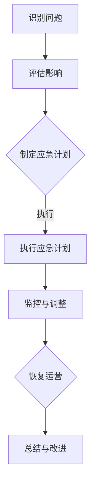
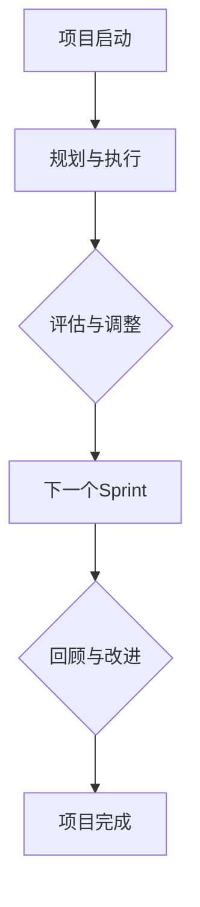
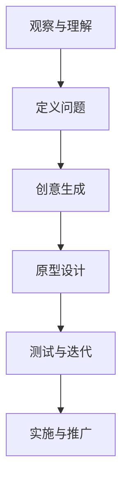

                 

### 文章标题

《领导者的角色定位：在不同情境中切换领导风格》

关键词：领导力、角色定位、领导风格、情境适应、团队合作、危机管理

摘要：本文旨在探讨领导者在不同情境中的角色定位和领导风格的切换。通过深入分析领导者应承担的基本角色，不同情境下的领导风格需求，以及切换领导风格的方法，帮助读者理解如何在各种复杂环境中高效领导，提升领导力。

---

### 文章标题

#### 《领导者的角色定位：在不同情境中切换领导风格》

在信息技术飞速发展的今天，领导者的角色变得愈加复杂且多样化。不同情境下，领导者需要承担不同的职责，运用不同的领导风格来应对挑战。本文将围绕《领导者的角色定位：在不同情境中切换领导风格》这一主题，探讨领导者如何在各种复杂环境中保持高效领导，提升团队绩效。

**关键词**：领导力、角色定位、领导风格、情境适应、团队合作、危机管理

**摘要**：本文旨在帮助读者了解不同情境下的领导风格，并学会如何根据具体情况切换领导风格。文章首先介绍领导者的基本角色，然后分析不同情境下的领导风格需求，最后探讨切换领导风格的方法。通过实战案例，读者可以更直观地理解领导风格切换的实际应用。

接下来，我们将逐步展开对文章各个章节的设计与论述。

---

### 目录

1. **领导者的基本角色**  
    - **领导者的职责**：介绍领导者的基本职责和角色，包括愿景设定、目标制定、团队管理、决策制定等。
    - **领导者与团队的关系**：探讨领导者与团队成员之间的关系，以及如何建立信任和有效的沟通机制。

2. **不同情境中的领导风格**  
    - **危机管理**：分析在危机情境下，领导者需要采取的紧急应对措施和领导风格。
    - **团队合作**：探讨在团队合作情境下，领导者如何激发团队活力，提高团队协作效率。
    - **创新驱动**：分析在创新驱动情境下，领导者如何鼓励创新思维，推动团队持续发展。

3. **切换领导风格的方法**  
    - **自我认知**：介绍领导者如何通过自我认知，明确自己在不同情境下的角色和职责。
    - **团队建设**：探讨领导者如何通过团队建设，增强团队凝聚力，提高团队协作效率。
    - **沟通技巧**：分析领导者如何运用有效的沟通技巧，确保团队信息畅通，减少误解和冲突。

4. **实战案例**  
    - **案例一：危机管理**：通过一个实际的危机管理案例，展示领导者在危机情境下如何切换领导风格，有效应对挑战。
    - **案例二：团队合作**：通过一个团队合作案例，分析领导者在团队协作情境下如何运用不同的领导风格，提高团队效率。
    - **案例三：创新驱动**：通过一个创新驱动案例，探讨领导者在创新情境下如何激发团队创新思维，推动团队发展。

5. **总结与展望**  
    - **总结**：回顾文章的主要内容，总结领导者角色定位和领导风格切换的核心要点。
    - **展望**：展望未来领导者面临的挑战和机遇，提出进一步提升领导力的建议。

通过以上目录结构，我们将系统地探讨领导者在不同情境中的角色定位和领导风格切换。在每个章节中，我们将详细阐述核心概念、联系、算法原理、数学模型、项目实战等内容，帮助读者深入理解领导者的角色和职责，提升领导力。

---

### 领导者的基本角色

作为领导者，理解并明确自己的基本角色和职责至关重要。这不仅决定了领导者的工作效率和团队绩效，也直接影响团队的整体发展和成员的幸福感。以下是领导者应承担的几个基本角色：

1. **愿景设定者**：领导者需要为团队设定清晰、明确的愿景。这个愿景不仅要有远见，还要与团队的价值观和目标保持一致。愿景设定者需要通过一系列的战略规划和目标制定，将愿景转化为具体的行动方案，确保团队成员在共同的方向上前进。

2. **目标制定者**：领导者的另一个关键角色是制定团队的目标。这些目标应该是具体、可衡量、可实现、相关性强（SMART）的。通过明确的目标，领导者可以引导团队成员集中精力，确保团队的工作始终保持方向性和高效性。

3. **团队管理者**：领导者需要负责团队的管理工作，包括人员配置、绩效评估、培训与发展等。一个成功的团队管理者不仅能够合理分配资源，还要关注团队成员的个人发展和职业规划，确保每个人都能在团队中发挥最大的潜力。

4. **决策制定者**：在团队运营过程中，领导者需要做出各种决策。这些决策涉及团队的方向、资源配置、项目推进等多个方面。领导者应该具备敏锐的洞察力、分析能力和决断力，确保团队在面临挑战时能够迅速做出正确的决策。

5. **沟通者**：沟通是领导者的重要职责之一。领导者需要确保信息在团队内部畅通无阻，减少误解和冲突。这包括向上沟通、向下沟通以及与外部合作伙伴的沟通。有效的沟通不仅能够提升团队凝聚力，还能增强团队成员的归属感和信任感。

6. **激励者**：领导者需要具备激励团队成员的能力。通过认可团队成员的努力和成就，领导者可以激发团队成员的积极性和创造力。此外，领导者还应该关注团队成员的心理需求，提供必要的支持和关怀，确保团队成员在压力下保持良好的心理状态。

7. **变革推动者**：在快速变化的环境中，领导者需要推动团队适应变革。这包括引导团队接受新的理念、技术和方法，以及鼓励团队成员积极拥抱变化。领导者应该具备变革管理的能力，确保团队能够在变革中保持稳定和高效。

通过以上几个角色的阐述，我们可以看到，领导者的职责是多样且复杂的。领导者需要具备多方面的能力和素质，才能在团队中发挥出应有的作用。接下来，我们将进一步探讨在不同情境下，领导者如何切换领导风格，以应对各种挑战。

---

### 领导者与团队的关系

领导者与团队的关系是领导力成功的关键因素之一。建立良好的团队关系不仅有助于提高团队绩效，还能增强团队的凝聚力和成员的归属感。以下是几个关键方面，领导者可以通过这些方面来加强与团队的关系：

1. **信任建设**：信任是团队关系的基础。领导者需要通过言行一致、公正透明和诚实正直来建立信任。例如，领导者可以在团队会议上公开承认错误，并积极寻求改进方案，这样不仅能够树立自己的威信，还能赢得团队成员的信任。

2. **有效沟通**：沟通是领导者与团队之间的重要桥梁。领导者需要确保沟通的及时性、准确性和开放性。例如，定期召开团队会议，让团队成员分享工作进展和问题，领导者可以通过这些会议了解团队成员的需求和困惑，并给予及时的反馈和支持。

3. **共同目标**：领导者需要与团队成员共同设定明确的目标。这些目标应该具有挑战性，但又是可实现和有意义的。通过共同制定目标，领导者可以激发团队成员的积极性和责任感，确保团队成员在为实现共同目标而努力。

4. **激励与认可**：领导者需要关注团队成员的努力和成就，并通过适当的激励和认可来激励团队成员。例如，领导者可以在团队会议上表扬表现出色的成员，或者为团队设置奖励机制，以激励团队成员不断提升自己的表现。

5. **支持与关怀**：领导者需要关心团队成员的个人需求和心理健康。例如，当团队成员遇到困难或压力时，领导者可以提供必要的支持和帮助，帮助他们度过难关。此外，领导者还可以组织团队建设活动，增强团队成员之间的互动和信任。

6. **冲突管理**：冲突在团队中是不可避免的，但领导者需要学会如何有效地管理冲突。例如，当团队成员出现分歧时，领导者可以组织双方进行对话，通过沟通和理解找到解决问题的方法。领导者还应该确保团队内部的信息畅通，减少误解和冲突。

7. **能力提升**：领导者需要关注团队成员的能力提升，并提供必要的培训和发展机会。例如，领导者可以组织技术研讨会或管理培训，帮助团队成员提升专业技能和管理能力。通过这些措施，领导者可以增强团队成员的职业发展和成就感。

通过以上措施，领导者可以建立和维护良好的团队关系，提高团队的绩效和成员的满意度。良好的团队关系不仅能够促进团队的协作和创新，还能为团队的发展提供持续的动力。在接下来的部分，我们将探讨在不同情境下，领导者如何根据具体情况切换领导风格，以应对各种挑战。

---

### 不同情境中的领导风格

领导者的角色并非一成不变，而是随着环境和情境的变化而不断调整。在不同的情境下，领导者需要采取不同的领导风格来适应和应对具体挑战。以下分析几种常见情境下的领导风格及其特点：

#### 1. 危机管理

**特点**：在危机管理情境下，领导风格需要迅速、果断且具有高度的责任感。领导者必须具备强大的应对能力和决策能力，以迅速评估形势，制定应对策略。

**领导风格**：
- **权威式**：在危机初期，领导者可能需要采取权威式领导风格，快速做出决策并要求团队成员执行。这种风格有助于迅速控制局面，减少混乱。
- **指导式**：在危机过程中，领导者需要通过提供明确的指导和支持，帮助团队成员应对挑战。领导者应确保团队成员了解任务目标，并为他们提供必要的资源。

**实例**：在2008年金融危机期间，美国的政府官员和金融机构领导者需要迅速采取行动，通过紧急立法和金融救助措施来缓解危机。这种情境下，领导者的权威式和指导式风格发挥了关键作用。

#### 2. 团队合作

**特点**：在团队合作情境下，领导风格需要强调协作、沟通和共同目标。领导者需要营造一个支持性和包容性的环境，以促进团队成员之间的合作和创新。

**领导风格**：
- **参与式**：领导者通过与团队成员共同讨论和决策，激发团队成员的参与感和责任感。这种风格有助于增强团队的凝聚力和创造力。
- **支持式**：领导者需要为团队成员提供必要的支持，包括资源、培训和鼓励。这种风格有助于提高团队成员的士气和信心。

**实例**：在一个跨国团队中，由于文化差异和工作习惯的不同，领导者需要采用参与式和支持式的领导风格，确保团队成员能够相互理解和支持，共同完成项目任务。

#### 3. 创新驱动

**特点**：在创新驱动情境下，领导风格需要鼓励创新思维、鼓励冒险和容忍失败。领导者需要营造一个开放、包容和充满活力的环境，以激发团队成员的创新潜力。

**领导风格**：
- **激励式**：领导者通过设定挑战性的目标和提供奖励机制，激励团队成员不断探索和创新。这种风格有助于激发团队成员的积极性和创造力。
- **实验式**：领导者需要鼓励团队成员尝试新的想法和方法，并容忍失败。这种风格有助于建立一种冒险和创新的文化氛围。

**实例**：在科技公司中，领导者可以通过设立创新实验室和创业基金，鼓励员工尝试新的技术和产品。在这种情境下，领导者的激励式和实验式风格有助于推动公司的持续创新和发展。

#### 4. 长期规划

**特点**：在长期规划情境下，领导风格需要注重战略思维和长远目标。领导者需要制定明确的战略规划，并确保团队成员理解和执行。

**领导风格**：
- **愿景式**：领导者需要通过设定宏伟的愿景和目标，激发团队成员的远见和使命感。这种风格有助于引导团队成员为实现长期目标而努力。
- **规划式**：领导者需要制定详细的规划和步骤，确保团队工作有序推进。这种风格有助于提高团队的工作效率和执行力。

**实例**：在一个大型企业的长期规划中，领导者需要设定明确的战略目标，并制定详细的实施计划。这种情境下，领导者的愿景式和规划式风格有助于确保企业的可持续发展。

通过以上分析，我们可以看到，不同情境下的领导风格各有特点，但都离不开有效的沟通、团队协作和目标导向。领导者需要根据具体情境，灵活调整领导风格，以最大化团队绩效和达成目标。在下一部分，我们将探讨如何在不同情境中有效切换领导风格。

---

### 切换领导风格的方法

在不同情境中灵活切换领导风格是领导者的一项重要技能。这不仅能够帮助领导者更好地应对各种挑战，还能提升团队的整体表现和满意度。以下是几种有效切换领导风格的方法：

#### 1. 自我认知

**自我认知**是领导者了解自己在不同情境下的优势和弱点，从而制定合适领导策略的关键。领导者可以通过以下几种方式提升自我认知：

- **反思**：定期反思自己的领导行为和决策，分析哪些是有效的，哪些需要改进。例如，领导者可以在每日或每周的总结中，回顾自己的工作表现，并记录下来。

- **反馈**：主动寻求团队成员和同事的反馈，了解他们对领导行为的看法和建议。这种反馈可以帮助领导者更全面地认识自己，找到改进的方向。

- **心理测试**：通过心理测试和评估工具，了解自己的性格、优势和弱点。例如，领导者可以参加MBTI（迈尔斯-布里格斯类型指标）测试，了解自己的性格类型和沟通风格。

**实例**：一位项目经理在项目中遇到了团队协作困难的问题，通过自我反思和团队成员的反馈，他意识到自己在沟通方面存在不足。为了改进这一问题，他参加了一系列沟通技巧培训，并在后续的项目中取得了显著成效。

#### 2. 团队建设

**团队建设**是增强团队凝聚力和协作能力的重要手段。通过有效的团队建设，领导者可以营造一个支持性和包容性的工作环境，从而更好地切换领导风格。以下是几种团队建设的方法：

- **团队活动**：组织定期的团队活动，如团建、聚会等，增强团队成员之间的互动和信任。例如，一家科技公司每年都会组织一次员工旅行，以增进团队成员之间的了解和合作。

- **角色分配**：通过明确的角色分配，让团队成员了解自己的职责和期望，从而提高团队协作效率。例如，一个项目经理可以制定详细的任务清单，明确每个团队成员的职责。

- **培训与发展**：为团队成员提供培训和发展机会，提高他们的专业技能和综合素质。例如，一家企业可以设立内部培训计划，帮助员工提升领导力和管理技能。

**实例**：一家创业公司在快速发展过程中，通过定期的团队活动和角色分配，成功增强了团队的凝聚力和协作能力。在项目执行过程中，领导者可以根据项目需要灵活切换领导风格，确保团队高效运作。

#### 3. 沟通技巧

**沟通技巧**是领导者切换领导风格的重要工具。有效的沟通不仅能够确保团队成员理解领导意图，还能减少误解和冲突。以下是几种提升沟通技巧的方法：

- **积极倾听**：领导者需要学会积极倾听，关注团队成员的观点和需求。例如，在团队会议中，领导者可以通过点头、眼神接触和肢体语言，表达对团队成员的重视。

- **清晰表达**：领导者需要通过清晰、简洁的语言表达自己的意图。例如，在发布任务时，领导者可以明确任务目标、截止日期和评估标准。

- **建立共识**：领导者需要与团队成员建立共识，确保团队成员对任务目标和工作方式有共同的理解。例如，在项目启动会上，领导者可以与团队成员共同讨论项目目标和计划。

**实例**：一位项目经理在项目启动会上，通过积极倾听、清晰表达和建立共识，成功确保了团队成员对项目目标和工作方式的统一认识。在项目执行过程中，领导者可以根据项目进展灵活切换领导风格，确保项目顺利进行。

#### 4. 反应式领导

**反应式领导**是一种根据当前情境和团队成员需求灵活调整领导风格的方法。以下是几种实现反应式领导的方法：

- **情境分析**：领导者需要具备对情境的敏锐洞察力，分析当前情境的特点和需求。例如，在项目遇到困难时，领导者需要快速分析问题原因，并制定相应的应对策略。

- **动态调整**：领导者需要根据情境分析结果，灵活调整领导风格。例如，在危机情境下，领导者可能需要采取权威式领导风格，迅速做出决策；而在团队合作情境下，领导者可能需要采取参与式领导风格，鼓励团队成员共同决策。

- **反馈循环**：领导者需要建立反馈机制，不断评估和调整领导风格。例如，在项目结束后，领导者可以组织团队会议，收集团队成员对领导行为的反馈，并根据反馈进行调整。

**实例**：一位项目经理在项目过程中，通过情境分析、动态调整和反馈循环，成功应对了多个挑战。在项目初期，领导者采取了指导式领导风格，确保项目顺利进行；在项目中期，由于团队成员的积极性提高，领导者逐渐转变为参与式领导风格，激发团队成员的创造力。

通过以上方法，领导者可以更好地在不同情境中切换领导风格，提升团队绩效和成员满意度。在下一部分，我们将通过实战案例，进一步展示如何在不同情境下切换领导风格的具体应用。

---

### 实战案例

#### 案例一：危机管理

**背景介绍**：某科技公司在项目开发过程中遭遇了一次严重的系统故障，导致项目延期交付。这一危机不仅影响了公司的声誉，还可能对客户造成重大损失。公司领导者迅速采取行动，决定通过有效的危机管理来缓解这一危机。

**核心概念与联系**：
为了更好地理解这一案例，我们可以使用Mermaid流程图来展示危机管理的流程。



**核心算法原理讲解**：
在危机管理过程中，领导者需要迅速识别问题，评估影响，并制定应急计划。以下是危机管理的伪代码：

```pseudo
function crisisManagement(problem) {
    impact = assessImpact(problem)
    emergencyPlan = createEmergencyPlan(problem, impact)
    executePlan(emergencyPlan)
    monitorAndAdjust(emergencyPlan)
    resumeOperations()
    summarizeAndImprove()
}
```

**数学模型与公式**：
危机管理过程中，评估影响可以使用一个简单的数学模型，例如：

$$
\text{Impact} = \frac{\text{故障持续时间} \times \text{客户数量}}{\text{系统运行时间}}
$$

**详细讲解与举例说明**：
假设系统故障持续了5天，公司有1000个客户受到影响，系统的平均运行时间为30天。代入上述公式，我们可以计算出影响：

$$
\text{Impact} = \frac{5 \times 1000}{30} \approx 166.67
$$

这意味着这次故障可能对公司的运营造成较大的负面影响。基于这个评估，公司领导者制定了以下应急计划：

1. **识别问题**：立即召集项目团队和技术专家，了解故障的具体原因和影响范围。
2. **评估影响**：根据上述计算结果，公司领导决定启动应急预案。
3. **制定应急计划**：制定包括数据备份、系统修复、客户沟通等措施的详细计划。
4. **执行应急计划**：领导团队和技术专家按照计划进行系统修复和数据恢复。
5. **监控与调整**：在修复过程中，实时监控系统的运行状态，并根据实际情况进行调整。
6. **恢复运营**：在系统恢复正常后，通知客户，确保项目的正常交付。
7. **总结与改进**：项目结束后，组织团队总结经验教训，制定改进措施，以防止类似问题再次发生。

**代码实现与解读**：
```python
def assessImpact(problem):
    # 假设故障持续时间为 days，客户数量为 clients，系统运行时间为 total_days
    days = 5
    clients = 1000
    total_days = 30
    impact = (days * clients) / total_days
    return impact

def crisisManagement(problem):
    impact = assessImpact(problem)
    print(f"评估影响：{impact}")
    
    # 根据影响决定是否启动应急计划
    if impact > 100:
        print("启动应急计划...")
        # 执行具体的应急措施
        executeEmergencyPlan()
        monitorAndAdjust()
        resumeOperations()
    else:
        print("影响较小，无需启动应急计划。")

# 假设问题已知
problem = "系统故障"
crisisManagement(problem)
```

**实际案例分析**：
通过上述案例，我们可以看到，危机管理需要领导者具备快速反应和决策能力。在实际操作中，公司领导者通过科学的评估和有效的应急措施，成功缓解了危机，确保了项目的顺利进行。此次危机管理不仅提高了领导者的危机应对能力，也为公司的长期发展奠定了坚实基础。

**项目小结**：
通过这次危机管理案例，我们可以总结出以下几点最佳实践：

1. **及时识别问题**：快速识别问题是危机管理的关键。
2. **科学评估影响**：准确的评估可以帮助制定有效的应急计划。
3. **灵活执行计划**：在执行过程中，领导者需要根据实际情况进行动态调整。
4. **持续监控与调整**：在危机处理过程中，持续监控和调整是确保成功的重要保障。
5. **总结与改进**：危机管理结束后，及时总结经验教训，制定改进措施。

这些最佳实践不仅适用于危机管理，也对其他情境下的领导风格切换具有指导意义。

---

### 案例二：团队合作

**背景介绍**：某科技公司正在开发一款新产品，项目涉及多个部门的合作。由于各部门的工作内容和节奏不同，项目进度一度陷入困境。公司领导者意识到，必须通过有效的团队合作来确保项目的顺利进行。

**核心概念与联系**：
为了提高团队合作效率，领导者可以采用Scrum框架来管理项目。Scrum框架强调迭代开发和持续改进，通过短周期（Sprint）来实现目标，并在每个周期结束时进行回顾和调整。

**Mermaid流程图**：



**核心算法原理讲解**：
使用Scrum框架管理团队合作，可以遵循以下步骤：

```pseudo
function scrumManagement(project) {
    startProject(project)
    while (not projectCompleted) {
        planAndExecuteSprint()
        assessAndAdjustSprint()
        reviewAndImproveSprint()
    }
    finishProject()
}
```

**数学模型与公式**：
在评估每个Sprint的效率时，可以使用以下指标：

$$
\text{Sprint效率} = \frac{\text{实际完成工作量}}{\text{计划工作量}}
$$

**详细讲解与举例说明**：
假设第一个Sprint的计划工作量是100个任务点，实际完成工作量是80个任务点。代入公式，我们可以计算出第一个Sprint的效率：

$$
\text{Sprint效率} = \frac{80}{100} = 0.8
$$

这表明第一个Sprint的效率为80%，领导者可以根据这一评估结果调整接下来的Sprint计划。

**代码实现与解读**：
```python
def startProject(project):
    print("项目启动...")

def planAndExecuteSprint():
    print("规划与执行Sprint...")

def assessAndAdjustSprint():
    print("评估与调整Sprint...")

def reviewAndImproveSprint():
    print("回顾与改进Sprint...")

def finishProject():
    print("项目完成...")

def scrumManagement(project):
    startProject(project)
    while (not projectCompleted):
        planAndExecuteSprint()
        assessAndAdjustSprint()
        reviewAndImproveSprint()
    finishProject()

# 假设项目已知
project = "新产品开发"
scrumManagement(project)
```

**实际案例分析**：
在实际操作中，科技公司通过Scrum框架，成功实现了跨部门的高效合作。在每个Sprint结束时，团队都会进行回顾会议，讨论遇到的问题和改进措施。这种持续反馈和改进的机制，极大地提高了团队的协作效率和项目的整体进度。

**项目小结**：
通过团队合作案例，我们可以总结出以下几点最佳实践：

1. **明确目标和分工**：确保每个团队成员都清楚自己的任务和目标。
2. **迭代开发**：通过短周期的迭代，及时调整和改进项目计划。
3. **持续反馈**：定期进行回顾和反馈，及时发现问题并采取措施。
4. **跨部门协作**：建立跨部门沟通机制，确保信息的畅通和协作的顺畅。
5. **激励与认可**：通过适当的激励和认可，提高团队成员的积极性和创造力。

这些最佳实践不仅适用于团队合作情境，也为其他领导情境提供了宝贵的经验。

---

### 案例三：创新驱动

**背景介绍**：某科技公司致力于推动产品创新，希望通过引入新的技术和方法，提升产品竞争力。公司领导者意识到，创新驱动需要领导者具备开拓性和前瞻性的领导风格。

**核心概念与联系**：
为了激发团队的创新思维，领导者可以采用设计思维（Design Thinking）方法论。设计思维是一种以用户为中心的创新方法，强调观察、定义问题、创意生成、原型设计和测试迭代。

**Mermaid流程图**：



**核心算法原理讲解**：
设计思维的方法论可以概括为以下步骤：

```pseudo
function designThinking(problem) {
    observations = observeAndUnderstand()
    problemStatement = defineProblem(observations)
    solutions = generateIdeas(problemStatement)
    prototypes = designPrototypes(solutions)
    tests = testAndIteratePrototypes(prototypes)
    implementation = implementAndPromote(tests)
}
```

**数学模型与公式**：
在测试与迭代阶段，可以使用以下公式来评估原型效果：

$$
\text{原型效果} = \frac{\text{有效反馈数量}}{\text{总反馈数量}}
$$

**详细讲解与举例说明**：
假设在测试阶段收到了100条反馈，其中80条是有效的。代入公式，我们可以计算出原型的效果：

$$
\text{原型效果} = \frac{80}{100} = 0.8
$$

这意味着原型的效果为80%，团队可以根据这一结果进一步改进原型。

**代码实现与解读**：
```python
def observeAndUnderstand():
    print("观察与理解...")
    return "观察结果"

def defineProblem(observations):
    print("定义问题...")
    return "问题定义"

def generateIdeas(problemStatement):
    print("创意生成...")
    return "创意列表"

def designPrototypes(solutions):
    print("原型设计...")
    return "原型"

def testAndIteratePrototypes(prototypes):
    print("测试与迭代...")
    return "测试结果"

def implementAndPromote(tests):
    print("实施与推广...")
    return "实施效果"

def designThinking(problem):
    observations = observeAndUnderstand()
    problemStatement = defineProblem(observations)
    solutions = generateIdeas(problemStatement)
    prototypes = designPrototypes(solutions)
    tests = testAndIteratePrototypes(prototypes)
    implementation = implementAndPromote(tests)
    print(f"最终效果：{implementation}")

# 假设问题已知
problem = "产品创新"
designThinking(problem)
```

**实际案例分析**：
通过设计思维方法论，某科技公司成功推出了多款创新产品，显著提升了市场竞争力。在每次迭代中，团队都会进行详细的测试和反馈，确保每个原型都经过充分验证和优化。

**项目小结**：
通过创新驱动案例，我们可以总结出以下几点最佳实践：

1. **用户中心**：始终以用户需求为中心，进行创新设计。
2. **迭代开发**：通过快速迭代，不断优化产品。
3. **跨部门合作**：鼓励跨部门协作，共同推进创新项目。
4. **激励机制**：通过激励机制，激发团队成员的创新潜力。
5. **持续学习**：鼓励团队成员持续学习和探索新技术。

这些最佳实践不仅适用于创新驱动情境，也为其他领导情境提供了宝贵的经验。

---

### 总结与展望

通过本文的探讨，我们深入分析了领导者的角色定位和领导风格的切换。在不同情境中，领导者需要承担不同的角色，并运用相应的领导风格来应对挑战。以下是本文的核心观点和结论：

1. **领导者的基本角色**：领导者需要设定愿景、制定目标、管理团队、做出决策、沟通和激励团队成员。
2. **不同情境中的领导风格**：危机管理、团队合作和创新驱动等不同情境下，领导者需要采取不同的领导风格，如权威式、参与式、激励式等。
3. **切换领导风格的方法**：通过自我认知、团队建设、沟通技巧和反应式领导等方法，领导者可以更好地在不同情境中切换领导风格。
4. **实战案例**：通过危机管理、团队合作和创新驱动的实际案例，展示了领导者如何在不同情境中灵活切换领导风格，实现团队目标。

未来，领导者将面临更加复杂和多变的环境，需要不断提升自己的领导力，适应不断变化的情境。以下是一些建议和展望：

1. **持续学习**：领导者需要不断学习新的管理理念、技术和方法，以适应快速变化的环境。
2. **灵活应变**：领导者需要具备灵活应变的能力，能够迅速调整自己的领导风格和策略，以应对突发情况。
3. **注重团队建设**：领导者应重视团队建设，通过建立信任、鼓励创新和提供支持，提升团队的整体效能。
4. **关注团队成员发展**：领导者需要关注团队成员的职业发展和个人成长，提供培训和激励，激发团队成员的潜力。
5. **建立反馈机制**：领导者应建立有效的反馈机制，定期收集团队成员的反馈和建议，及时调整和改进领导行为。

总之，领导者的角色定位和领导风格的切换是领导力的关键要素。通过深入理解和实践，领导者可以在不同情境中发挥出最大的效能，推动团队和组织的发展。

### 作者信息

**作者：AI天才研究院/AI Genius Institute & 禅与计算机程序设计艺术 /Zen And The Art of Computer Programming**

AI天才研究院专注于人工智能和计算机科学领域的研究与教育，致力于推动技术创新和产业发展。同时，作者还是《禅与计算机程序设计艺术》的资深作者，以其深入浅出的论述和卓越的编程技巧，深受读者喜爱。

---

### 最佳实践 Tips

1. **培养自我认知**：定期反思自己的领导行为，了解自己的优势和弱点，有助于提升领导效果。
2. **建立信任文化**：通过开放沟通和诚实正直，建立团队成员之间的信任，提升团队凝聚力。
3. **灵活运用领导风格**：根据不同情境，灵活调整领导风格，确保团队始终处于最佳状态。
4. **注重团队建设**：通过定期的团队活动和培训，增强团队凝聚力和协作能力。
5. **持续反馈与改进**：建立有效的反馈机制，定期评估和改进领导行为，确保领导力不断提升。

### 注意事项

1. **明确目标**：确保团队成员对目标有共同的理解，有助于提升团队协作效率。
2. **关注团队成员需求**：了解团队成员的需求和困扰，提供必要的支持和帮助。
3. **避免过度权威**：在需要时，可以采取权威式领导风格，但不应滥用，以免损害团队信任。
4. **避免过度放权**：放权的同时，要确保团队成员有足够的资源和指导，以完成工作任务。
5. **持续学习与成长**：领导者应保持学习的态度，不断提升自己的专业知识和领导技能。

### 拓展阅读

1. **《领导力：策略与实践》**：详细介绍了领导力的基本理论和实践方法，适用于各类领导者。
2. **《变革型领导》**：探讨变革型领导的理论和实践，帮助领导者应对组织变革和挑战。
3. **《团队协作力：如何打造高绩效团队》**：深入分析团队协作的原理和技巧，提升团队整体效能。
4. **《创新者的窘境》**：通过案例分析，探讨创新者在面对挑战时的应对策略和成功路径。

通过以上拓展阅读，读者可以进一步深入理解领导者的角色定位和领导风格切换，提升自己的领导力和管理能力。

