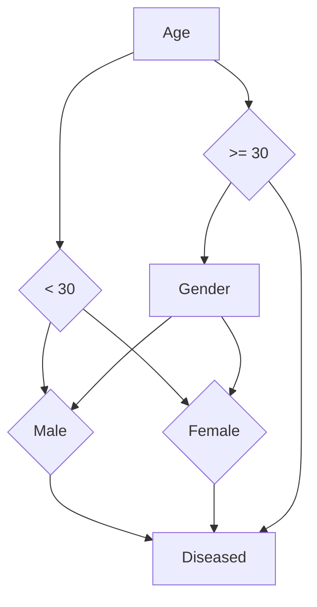
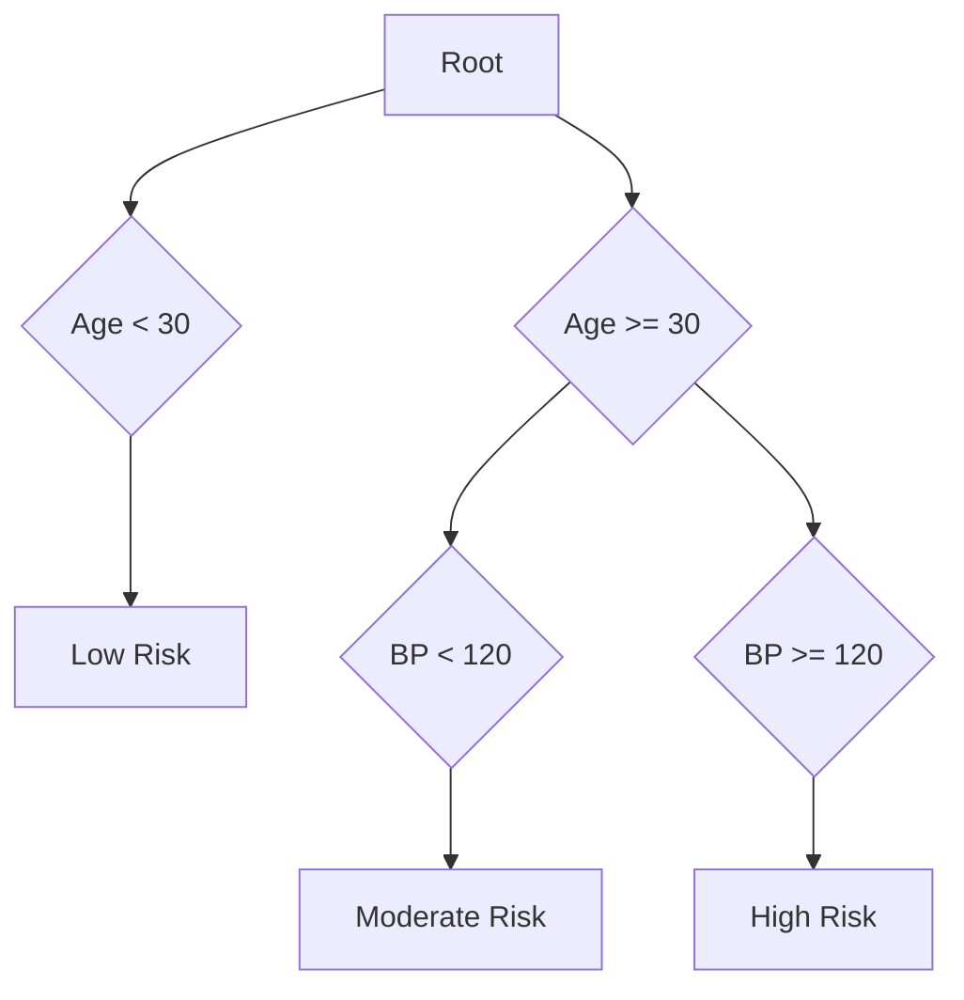

                 


### 1.1 Book Background and Objectives

The advent of artificial intelligence (AI) has revolutionized various industries, offering unprecedented computational power and sophisticated analytical capabilities. One of the cornerstone techniques within the AI domain is the decision tree, a hierarchical structure that enables computers to make decisions based on a series of logical tests. Decision trees have proven to be particularly effective in fields such as healthcare, finance, and business, where ethical considerations are paramount.

This book, "Artificial Intelligence Decision Trees: A Mathematical Framework for Ethical Judgments," aims to explore the intersection of decision trees and ethical judgments within the realm of AI. The primary objective is to provide a comprehensive understanding of how decision trees can be utilized to make ethical decisions, while simultaneously addressing the challenges and implications that arise from their application.

#### History and Significance of Decision Trees in AI

Decision trees have a rich history that dates back to the late 1960s. The concept was introduced by John Tukey, a prominent statistician, who initially described them as a way to visualize and simplify complex decision-making processes. Over the years, decision trees have evolved into a powerful tool within the field of AI, particularly in the context of machine learning.

The significance of decision trees lies in their simplicity and interpretability. Unlike other complex machine learning models, such as neural networks, decision trees are relatively easy to understand and visualize. This makes them a valuable tool for explaining and justifying decisions made by AI systems, especially in domains where transparency and accountability are crucial.

#### Structure and Content of the Book

The book is structured into three main parts, each serving a distinct purpose:

1. **Introduction to Decision Trees in AI**:
   - **Part 1** provides a foundational understanding of decision trees, including their basic concepts, architecture, and ethical considerations. This section also discusses the relevance of ethical theories in the context of AI decision-making.

2. **Mathematical Foundations of Decision Trees**:
   - **Part 2** delves into the mathematical underpinnings of decision trees, exploring set theory, logic, probability theory, and decision theory. This section also discusses how decision trees can be constructed and optimized as mathematical models.

3. **Ethical Decision Trees**:
   - **Part 3** focuses on the application of decision trees in ethical decision-making. It examines the ethical implications of decision tree models, the integration of ethical considerations into these models, and their real-world applications in various domains.

#### Goals and Outcomes

The goals of this book are to:

- Provide a thorough understanding of decision trees and their role in AI.
- Explore the ethical dimensions of decision tree models.
- Offer practical guidance on the construction and application of ethical decision trees.

The intended outcome is to equip readers with the knowledge and tools necessary to develop and utilize decision trees in ethically sound ways, thereby contributing to the broader goal of creating AI systems that are not only effective but also morally responsible. 

With this background and objective in mind, we can now delve deeper into the foundational concepts and structures that underpin decision trees, setting the stage for a comprehensive exploration of their ethical applications.

### 1.2 The Nature of Decision Trees

Decision trees are a type of predictive modeling technique used in machine learning and data mining. At their core, decision trees are hierarchical structures that represent decisions through a series of questions or tests. Each internal node of the tree represents a feature or attribute, each branch represents a possible outcome of the test, and each leaf node represents a class label or outcome.

#### Basic Concepts

1. **Nodes and Edges**:
   - **Internal Nodes**: Each internal node represents a feature or attribute that is used to make a decision. For example, in a decision tree for predicting whether a patient has a disease, an internal node might represent the patient's age.
   - **Branches**: Each branch corresponds to a possible value of the feature represented by the internal node. For instance, the branches from an age node might represent different age ranges.
   - **Leaf Nodes**: Also known as terminal nodes, these represent the final decision or prediction. In our medical example, a leaf node might indicate whether the patient has the disease or not.

2. **Prediction Process**:
   - The prediction process involves traversing the decision tree based on the input features of a new data point.
   - At each internal node, the feature value is compared to the values associated with the branches.
   - The path taken through the tree is followed until a leaf node is reached, which provides the predicted outcome.

#### Architecture

1. **Binary and Multiclass Decision Trees**:
   - **Binary Decision Trees**: These trees are used for problems with two possible outcomes, such as binary classification (e.g., healthy or sick).
   - **Multiclass Decision Trees**: These trees are used for problems with more than two outcomes, such as multi-class classification (e.g., disease A, disease B, or disease C).

2. **Deep and Shallow Trees**:
   - **Deep Trees**: These have many levels and numerous internal nodes, which can lead to overfitting the training data.
   - **Shallow Trees**: These have fewer levels and internal nodes, which can generalize better to unseen data.

3. **Pruning**:
   - Pruning is a technique used to reduce the size of a decision tree by removing sections that provide little predictive value.
   - This helps to prevent overfitting and improve the model's generalization capability.

#### Decision Trees and Ethics

1. **Transparency and Interpretability**:
   - One of the key advantages of decision trees is their transparency and interpretability. Users can easily understand how the model arrives at a decision, which is crucial for ethical considerations.
   - In ethical decision-making, transparency ensures that stakeholders can scrutinize the decision-making process and identify potential biases or unfairness.

2. **Bias and Fairness**:
   - Decision trees can inadvertently introduce biases if the training data is biased or if the feature selection process is flawed.
   - Ensuring fairness in decision tree models involves rigorous analysis and potentially adjusting the model to mitigate any discovered biases.

3. **Accountability**:
   - Decision trees, due to their transparency, can be more accountable than black-box models like neural networks.
   - This accountability is essential for ethical decision-making, as it allows for the identification of errors and the ability to correct them.

#### Mermaid Flowchart

To illustrate the structure of a decision tree, we can use a Mermaid flowchart:



This flowchart represents a simple decision tree for diagnosing a disease based on age and gender. The structure shows how the tree branches based on these features to reach a final diagnosis.

In summary, decision trees are a fundamental tool in AI that provide a clear, understandable framework for decision-making. Their transparency and interpretability make them valuable for ethical decision-making, although it is crucial to address the potential biases and fairness issues that can arise in their application. The next section will delve deeper into the ethical considerations surrounding decision trees and their role in ethical judgments.

### 1.3 Decision Trees and Ethics

The intersection of decision trees and ethics is a critical area of research and application in the field of artificial intelligence. Decision trees, due to their transparency and interpretability, offer a unique advantage when it comes to ethical considerations. However, they also present significant challenges that must be addressed to ensure that AI systems operate in a morally sound manner.

#### The Importance of Ethical Frameworks in AI

1. **Transparency**:
   - Ethical considerations in AI require that models be transparent, allowing users to understand how decisions are made.
   - Decision trees fulfill this requirement due to their hierarchical and logical structure, which makes it easier to trace the decision path and understand the rationale behind each step.

2. **Accountability**:
   - In ethical frameworks, accountability is crucial. Decision trees provide a clear audit trail that can be used to explain and justify the decisions made by the AI system.
   - This transparency enhances the accountability of AI systems, especially in sensitive domains like healthcare and criminal justice.

3. **Bias and Fairness**:
   - Bias in AI can lead to unfair outcomes, which is a significant ethical concern.
   - Ethical frameworks emphasize the need to mitigate biases and ensure that AI systems treat all individuals fairly, regardless of their characteristics.
   - Decision trees, when constructed with care, can help identify and mitigate biases by providing a clear, logical framework for analyzing and adjusting the model.

#### The Role of Ethical Theories

1. **Deontological Ethics**:
   - Deontological ethics focuses on the inherent rightness or wrongness of actions, rather than their consequences.
   - In the context of decision trees, deontological principles might guide the design of ethical rules that must be followed, regardless of the outcomes.

2. **Consequentialist Ethics**:
   - Consequentialist ethics evaluates the morality of actions based on their outcomes.
   - For decision trees, this approach involves weighing the potential benefits and harms of different decisions and choosing the one that maximizes overall utility.

3. **Utilitarianism**:
   - Utilitarianism, a form of consequentialism, advocates for actions that produce the greatest happiness for the greatest number.
   - In decision tree models, utilitarian principles might guide the allocation of resources or the prioritization of treatments based on their overall impact on well-being.

4. **Virtue Ethics**:
   - Virtue ethics focuses on the development of good character traits and moral virtues.
   - For AI systems, this approach might emphasize the cultivation of virtues such as honesty, justice, and fairness in the design and application of decision trees.

#### Case Studies in Ethical Decision-Making

1. **Healthcare**:
   - In healthcare, decision trees are used to guide treatment decisions, such as which drug to prescribe for a particular condition.
   - Ethical considerations involve ensuring that the treatment decisions do not disproportionately harm certain groups or introduce unjust biases.

2. **Criminal Justice**:
   - Decision trees can be used in the criminal justice system to assist in risk assessment and sentencing.
   - Ethical concerns include the potential for biases in predicting recidivism rates and ensuring that all individuals receive fair treatment.

3. **Finance**:
   - In the financial sector, decision trees are used for credit scoring and loan approvals.
   - Ethical considerations involve avoiding discrimination based on factors such as race, gender, or socioeconomic status.

#### Integrating Ethical Theories into Decision Trees

To integrate ethical theories into decision tree models, several steps can be taken:

1. **Defining Ethical Principles**:
   - Identify the ethical principles that will guide the design and application of the decision tree model.
   - This might involve consulting ethical frameworks and guidelines relevant to the specific domain.

2. **Incorporating Ethical Constraints**:
   - Integrate ethical constraints directly into the decision tree model to ensure that the model does not violate ethical principles.
   - For example, rules might be enforced to prevent certain actions or decisions that are deemed unethical.

3. **Evaluating and Monitoring**:
   - Continuously evaluate the ethical implications of the decision tree model and monitor its performance to ensure that it aligns with ethical standards.
   - This might involve regular audits, updates, and improvements to the model.

In conclusion, decision trees play a crucial role in ethical decision-making within the AI domain. By providing transparency, accountability, and a structured approach to decision-making, decision trees can help address ethical concerns. However, it is essential to integrate ethical principles and frameworks into the design and application of these models to ensure that they promote fairness, justice, and well-being.

### 1.4 Overview of Ethical Theories

To understand the integration of decision trees with ethical judgments, it is crucial to delve into the foundational ethical theories that shape our moral reasoning. Ethical theories provide frameworks for evaluating the morality of actions and guiding decision-making processes. In the context of AI and decision trees, understanding these theories can help ensure that the decisions made by these models align with ethical principles and societal values.

#### Traditional Ethical Theories

1. **Utilitarianism**:
   - Developed by philosophers like Jeremy Bentham and John Stuart Mill, utilitarianism focuses on maximizing overall happiness or utility.
   - In the context of decision trees, a utilitarian approach would prioritize decisions that maximize the well-being of the majority.
   - For example, a decision tree used in healthcare might prioritize treatments that provide the greatest benefit to the most patients.

2. **Deontological Ethics**:
   - Originating from philosophers like Immanuel Kant, deontological ethics emphasizes the inherent rightness or wrongness of actions, regardless of their consequences.
   - In decision tree models, deontological principles can guide the inclusion of ethical rules that must be followed, such as not causing harm or respecting autonomy.
   - For instance, a decision tree in criminal justice might include a rule that prohibits the use of torture, even if it could lead to a quicker conviction.

3. **Virtue Ethics**:
   - Virtue ethics, championed by Aristotle and later philosophers, focuses on developing good character traits and moral virtues.
   - In decision tree design, a virtue ethics approach might emphasize the cultivation of virtues like honesty, fairness, and justice.
   - This could involve designing decision trees that reflect these virtues, ensuring that the system promotes ethical behavior and responsible decision-making.

#### Contemporary Ethical Theories

1. **Constructivism**:
   - Constructivism, influenced by philosophers like Jürgen Habermas, emphasizes the role of communication and discourse in shaping ethical beliefs.
   - In the context of AI, this theory suggests that ethical judgments should be derived through dialogue and consensus among stakeholders.
   - For decision trees, constructivism might involve involving diverse groups of people in the design process to ensure that the model reflects a broad range of ethical perspectives.

2. **Empirical Ethics**:
   - Empirical ethics relies on empirical evidence and scientific research to inform ethical judgments.
   - This approach is particularly relevant in AI, where understanding the impact of algorithms on real-world outcomes is crucial.
   - For decision tree models, empirical ethics could involve collecting data on the effects of different decisions to evaluate their ethical implications.

3. **Presumption of Innocence**:
   - The presumption of innocence, a legal principle, suggests that individuals are innocent until proven guilty.
   - In the context of AI, this principle can guide the design of decision trees in areas like criminal justice to ensure that individuals are not unfairly labeled as guilty.
   - For example, a decision tree for risk assessment in parole decisions might prioritize the presumption of innocence by emphasizing the need for strong evidence before labeling someone as a high-risk offender.

4. **Algorithmic Fairness**:
   - Algorithmic fairness is a contemporary ethical theory that focuses on ensuring that algorithms do not introduce unfair biases or discrimination.
   - In decision tree models, this involves identifying and mitigating biases in feature selection, data representation, and decision rules.
   - For instance, a decision tree used in hiring might be evaluated for fairness to ensure that it does not disproportionately disadvantage certain groups based on race or gender.

#### Integrating Ethical Theories with Decision Trees

To integrate ethical theories with decision tree models, several steps can be taken:

1. **Defining Ethical Criteria**:
   - Identify the ethical criteria that will guide the design and evaluation of the decision tree model.
   - This might involve consulting ethical theories and relevant guidelines to establish a set of principles that the model should adhere to.

2. **Incorporating Ethical Constraints**:
   - Integrate ethical constraints directly into the decision tree model to ensure that it aligns with ethical principles.
   - For example, a decision tree might include constraints that prohibit actions that violate human rights or ethical standards.

3. **Ethical Audits and Evaluations**:
   - Conduct regular ethical audits and evaluations to assess the model's adherence to ethical principles.
   - This might involve reviewing the decision tree's rules, outcomes, and their implications on different groups of people.

4. **Transparency and Accountability**:
   - Enhance transparency and accountability by documenting the ethical considerations and justifications behind the decision tree model.
   - This can help stakeholders understand and scrutinize the ethical implications of the model's decisions.

In summary, understanding and integrating ethical theories with decision trees is essential for creating AI systems that are not only effective but also ethical. By grounding decision tree models in ethical principles, we can ensure that they align with societal values and contribute to the greater good.

### 1.5 Decision Trees in Different Domains

Decision trees have found widespread applications across various domains due to their simplicity, interpretability, and ability to handle both categorical and continuous data. This section explores the applications of decision trees in three key areas: medical ethics, environmental ethics, and business ethics. Each domain presents unique challenges and ethical considerations that decision trees can address effectively.

#### Medical Ethics

In the medical field, decision trees are widely used to aid in diagnostic processes, treatment planning, and patient risk assessment. Their ability to present complex medical decisions in a structured and understandable format makes them invaluable tools for healthcare professionals.

1. **Diagnosis**:
   - Decision trees can help clinicians diagnose medical conditions by guiding them through a series of yes-or-no questions based on patient symptoms and test results.
   - For example, a decision tree might help diagnose a rare disease by asking about specific symptoms and medical history, leading to a confident diagnosis.

2. **Treatment Planning**:
   - Decision trees assist in treatment planning by outlining the best course of action based on patient characteristics and the severity of their condition.
   - In oncology, decision trees can help determine the most appropriate treatment regimen, taking into account factors such as the stage of cancer and the patient's overall health.

3. **Risk Assessment**:
   - Decision trees are used to assess patient risk for various health outcomes, such as cardiovascular disease or readmission rates.
   - This helps healthcare providers prioritize resources and interventions, ensuring that patients at higher risk receive the necessary care.

**Ethical Considerations**:
- **Equity**: Ensuring that decision trees do not lead to disparities in healthcare access or treatment outcomes.
- **Informed Consent**: Providing patients with clear explanations of the decisions made by the decision tree, enabling informed consent.
- **Patient Privacy**: Safeguarding patient privacy and ensuring that sensitive medical information is handled securely.

#### Environmental Ethics

In the realm of environmental ethics, decision trees are employed to assess the impact of human activities on the environment and to guide sustainable decision-making processes.

1. **Environmental Impact Assessment**:
   - Decision trees help evaluate the potential environmental impacts of various projects or activities, such as construction, mining, or industrial operations.
   - By analyzing factors such as habitat destruction, water usage, and air pollution, decision trees can provide a comprehensive overview of environmental risks.

2. **Conservation Planning**:
   - Decision trees aid in conservation planning by identifying areas of high ecological value and prioritizing conservation efforts.
   - For instance, they can help determine the best locations for wildlife corridors or protected areas to maintain biodiversity.

3. **Policy Development**:
   - Decision trees support the development of environmental policies by outlining the potential consequences of different regulatory actions.
   - Policymakers can use decision trees to assess the trade-offs between economic development and environmental protection.

**Ethical Considerations**:
- **Intergenerational Equity**: Ensuring that decision trees consider the impact of current actions on future generations and their rights to a healthy environment.
- **Justice**: Addressing issues of environmental justice, where decision trees can help identify communities that may be disproportionately affected by environmental degradation.
- **Stakeholder Involvement**: Involving diverse stakeholders, including indigenous communities and local residents, in the decision-making process to ensure that their perspectives are considered.

#### Business Ethics

In the business world, decision trees are used to make ethical and strategic decisions, particularly in areas such as consumer protection, corporate governance, and corporate social responsibility.

1. **Consumer Protection**:
   - Decision trees assist companies in making ethical decisions regarding consumer protection, such as product safety assessments and advertising practices.
   - By evaluating various factors, including legal requirements and consumer preferences, decision trees can guide companies in choosing the most ethical course of action.

2. **Corporate Governance**:
   - Decision trees are employed to evaluate corporate governance practices and identify potential areas of improvement.
   - For example, they can help assess the effectiveness of internal controls, compliance with regulations, and ethical behavior among employees.

3. **Corporate Social Responsibility**:
   - Decision trees help businesses navigate the complex landscape of corporate social responsibility, guiding decisions about philanthropy, sustainability, and community engagement.
   - They can evaluate the social and environmental impacts of business operations and prioritize initiatives that align with ethical values and societal expectations.

**Ethical Considerations**:
- **Transparency**: Ensuring that decision trees are transparent and that the rationale behind ethical decisions is clearly communicated to stakeholders.
- **Stakeholder Engagement**: Involving a wide range of stakeholders, including employees, customers, and communities, in the decision-making process to ensure that their interests and perspectives are considered.
- **Long-Term Vision**: Incorporating long-term ethical considerations into decision trees, such as the impact on future generations and the sustainability of business practices.

In conclusion, decision trees are versatile tools that can be applied across various domains to address ethical considerations and support decision-making processes. Their ability to present complex information in a clear and structured manner makes them particularly valuable in fields where ethical implications are of paramount importance. By understanding the specific applications and ethical considerations in medical ethics, environmental ethics, and business ethics, we can leverage decision trees to promote ethical practices and responsible decision-making.

### 2.1 Set Theory and Logic

Set theory and logic form the foundational mathematical principles upon which decision trees are built. These concepts are crucial for understanding the structure and functionality of decision trees, as they provide the tools necessary to define and manipulate the data and conditions that decision trees operate on.

#### Basic Set Operations

1. **Union** ($A \cup B$):
   - The union of two sets $A$ and $B$ is the set containing all elements that are in $A$, $B$, or both.
   - For example, if $A = \{1, 2, 3\}$ and $B = \{3, 4, 5\}$, then $A \cup B = \{1, 2, 3, 4, 5\}$.

2. **Intersection** ($A \cap B$):
   - The intersection of two sets $A$ and $B$ is the set containing all elements that are in both $A$ and $B$.
   - Using the previous example, $A \cap B = \{3\}$.

3. **Difference** ($A - B$ or $A \setminus B$):
   - The difference between two sets $A$ and $B$ is the set containing all elements in $A$ that are not in $B$.
   - Therefore, $A - B = \{1, 2\}$.

4. **Complement** ($A'$ or $\complement A$):
   - The complement of a set $A$ is the set of all elements that are not in $A$ within a universal set $U$.
   - For example, if $U = \{1, 2, 3, 4, 5\}$ and $A = \{1, 2, 3\}$, then $A' = \{4, 5\}$.

#### Logic Operators

1. **Negation** ($\neg P$ or $\overline{P}$):
   - The negation of a proposition $P$ is its opposite. If $P$ is true, then $\neg P$ is false, and vice versa.

2. **Conjunction** ($P \land Q$):
   - The conjunction of two propositions $P$ and $Q$ is true only if both $P$ and $Q$ are true.

3. **Disjunction** ($P \lor Q$):
   - The disjunction of two propositions $P$ and $Q$ is true if at least one of them is true.

4. **Implication** ($P \Rightarrow Q$):
   - The implication of $P$ implies $Q$ is true unless $P$ is true and $Q$ is false.

5. **Biconditional** ($P \Leftrightarrow Q$):
   - The biconditional of $P$ and $Q$ is true when both $P$ and $Q$ are either true or false.

#### Applications in Decision Trees

1. **Defining Attributes**:
   - Set theory allows us to define attributes as sets of possible values. For example, an attribute for age might be defined as $A = \{0, 1, 2, ..., 120\}$.

2. **Logical Conditions**:
   - Logic operators help define the conditions that nodes in a decision tree evaluate. For instance, a node might check if the age is less than 30 ($A < 30$) or if the patient has a specific symptom ($S \in \{fever, cough, headache\}$).

3. **Combining Attributes**:
   - Combining set operations, such as intersections and unions, can help in defining more complex conditions. For example, a node might evaluate if the patient is between 30 and 50 years old and has a fever ($A \cap \{30, 31, ..., 50\} \cap \{fever\}$).

4. **Logical Implications**:
   - The implication operator can be used to determine the outcome of a decision tree path. For example, if a patient has a fever and is above 50 years old, the implication might lead to a higher risk of a particular disease ($A > 50 \Rightarrow \text{High Risk}$).

By understanding set theory and logic, we can effectively define and evaluate the conditions within decision trees, ensuring that they are logically consistent and capable of providing accurate predictions.

### 2.2 Probability Theory

Probability theory is a fundamental component of decision-making in artificial intelligence, providing the tools to model uncertainty and make informed decisions based on probabilistic reasoning. Decision trees, being a predictive modeling technique, rely heavily on probability theory to quantify and interpret the uncertainty associated with different outcomes. In this section, we will explore the core concepts of probability theory and their applications in decision tree construction and evaluation.

#### Probability Spaces and Events

1. **Probability Space**:
   - A probability space is a mathematical framework used to model random phenomena. It consists of three components: a sample space $\Omega$, a set of events $\mathcal{F}$, and a probability measure $P$.
   - The sample space $\Omega$ contains all possible outcomes of a random experiment.
   - The set of events $\mathcal{F}$ is a collection of subsets of $\Omega$ that represent different possible scenarios.
   - The probability measure $P$ assigns a probability value between 0 and 1 to each event, indicating the likelihood of its occurrence.

2. **Basic Probability Rules**:
   - **Additivity**: For mutually exclusive events $A$ and $B$ (i.e., $A \cap B = \emptyset$), $P(A \cup B) = P(A) + P(B)$.
   - **Complement Rule**: $P(A') = 1 - P(A)$.
   - **Total Probability Theorem**: If $\{A_1, A_2, ..., A_n\}$ is a partition of the sample space $\Omega$ (i.e., $\Omega = A_1 \cup A_2 \cup ... \cup A_n$ and $A_i \cap A_j = \emptyset$ for $i \neq j$), then for any event $B$,
     $$P(B) = \sum_{i=1}^{n} P(B|A_i)P(A_i).$$

3. **Conditional Probability**:
   - Conditional probability measures the probability of an event $B$ occurring given that another event $A$ has already occurred. It is defined as:
     $$P(B|A) = \frac{P(A \cap B)}{P(A)}.$$
   - The product rule states that $P(A \cap B) = P(A)P(B|A)$.

#### Applications in Decision Trees

1. **Node Conditioning**:
   - In decision trees, nodes often represent conditions or tests that depend on the input data. Conditional probability helps define the likelihood of moving to different branches based on the values of the input features.
   - For example, if a decision tree node tests the age of a patient ($A$), the probability of reaching a particular branch (e.g., age less than 30) can be determined using conditional probability.

2. **Path Probability**:
   - To evaluate the probability of a specific path from the root to a leaf node, we can use the chain rule of probability:
     $$P(A_1, A_2, ..., A_n) = P(A_1)P(A_2|A_1)P(A_3|A_1 \cap A_2) \ldots P(A_n|A_1 \cap A_2 \cap ... \cap A_{n-1}).$$
   - This rule helps compute the probability of a sequence of events occurring, which is crucial for estimating the likelihood of reaching a particular outcome in a decision tree.

3. **Entropy and Information Gain**:
   - Decision trees often use entropy and information gain to determine the most informative split at each node.
   - Entropy measures the uncertainty in a set of outcomes, and information gain quantifies the reduction in uncertainty when a decision is made.
   - The entropy of a set of outcomes $\{x_1, x_2, ..., x_n\}$ is defined as:
     $$H(X) = -\sum_{i=1}^{n} p_i \log_2 p_i,$$
     where $p_i = P(x_i)$.
   - Information gain, which is used in decision tree splitting, is calculated as:
     $$IG(D, A) = H(D) - \sum_{v \in \text{Values}(A)} p_v H(D_v),$$
     where $D$ is the dataset, $A$ is the attribute being split, $v$ are the values of $A$, and $D_v$ is the subset of $D$ where $A = v$.

4. **Bayes' Theorem**:
   - Bayes' theorem is a crucial tool for updating probabilities based on new evidence. It is used in decision trees to calculate the probability of a class label given a set of features:
     $$P(C|X) = \frac{P(X|C)P(C)}{P(X)},$$
     where $C$ represents the class labels and $X$ represents the feature vector.

#### Example: Predicting Disease Risk

Consider a decision tree used to predict the risk of a particular disease based on patient attributes such as age, gender, and blood pressure. We can use probability theory to model the uncertainty and determine the probability of a patient having the disease given their attribute values.

1. **Define the Probability Space**:
   - The sample space $\Omega$ contains all possible combinations of age, gender, and blood pressure values for patients.
   - The set of events $\mathcal{F}$ includes all possible subsets of $\Omega$ that represent different patient profiles.

2. **Conditional Probability**:
   - Calculate the conditional probabilities of each attribute given the disease status. For example, $P(Age|Disease) = P(Age \cap Disease) / P(Disease)$.

3. **Entropy and Information Gain**:
   - Use entropy and information gain to determine the best attribute to split on at each node. For instance, we might find that splitting on age provides the highest information gain.

4. **Path Probability**:
   - Compute the probability of reaching a particular leaf node by multiplying the conditional probabilities along the path. For example, the probability of reaching a leaf node representing high risk for a patient with age 45, male, and high blood pressure can be calculated using the chain rule of probability.

5. **Bayes' Theorem**:
   - Apply Bayes' theorem to update the probability of disease given the patient's attributes. For example, we can calculate $P(Disease|Age=45, Gender=Male, BloodPressure=High)$.

In conclusion, probability theory provides the foundational mathematical tools necessary for constructing and evaluating decision trees. By leveraging concepts such as probability spaces, conditional probability, entropy, and Bayes' theorem, we can build robust decision trees that effectively model uncertainty and make informed predictions. These principles are crucial for ensuring that decision trees are not only accurate but also ethically sound, as they help quantify the uncertainty and potential risks associated with their predictions.

### 2.3 Decision Theory

Decision theory is a critical framework for understanding how individuals and systems make choices under uncertainty. It provides a structured approach to evaluating the potential outcomes of different decisions and selecting the option that maximizes utility or minimizes risk. In the context of decision trees, decision theory is fundamental to ensuring that the models are both effective and ethical.

#### Utility Theory

Utility theory is a key concept in decision theory that involves quantifying the desirability of different outcomes. It is based on the idea that individuals prefer outcomes that provide higher levels of utility. Utility can be represented numerically, allowing for comparisons between different outcomes.

1. **Expected Utility**:
   - Expected utility (EU) is calculated by taking the sum of the utilities of each possible outcome, weighted by their respective probabilities.
   - Mathematically, if there are $n$ possible outcomes $X_1, X_2, ..., X_n$ with probabilities $p_1, p_2, ..., p_n$, the expected utility is given by:
     $$EU = \sum_{i=1}^{n} u(X_i) p_i,$$
     where $u(X_i)$ is the utility of outcome $X_i$.

2. **Utility Function**:
   - A utility function $u()$ maps outcomes to utility values. It can be a linear, quadratic, or any other function that reflects the individual's preferences.
   - For instance, a linear utility function might assign a higher utility to larger monetary gains, while a risk-averse individual might use a concave utility function that penalizes larger losses more severely.

3. **Risk Aversion**:
   - Risk aversion is the tendency of individuals to prefer outcomes with known, certain utilities over uncertain outcomes with higher expected utilities.
   - This can be modeled using a utility function that is concave, indicating a preference for avoiding losses over gaining equivalent amounts.

#### Expected Utility Maximization

Expected utility maximization (EUM) is a fundamental principle in decision theory, stating that rational agents will choose the action that maximizes their expected utility. In the context of decision trees, EUM can be used to evaluate the potential outcomes of different decisions and select the best course of action.

1. **Decision Tree Nodes**:
   - Each internal node in a decision tree represents a choice between different actions, while each branch represents the outcome of a specific action.
   - At each node, the expected utility of each possible action is calculated based on the probabilities of the outcomes associated with each branch.

2. **Decision Rule**:
   - A decision rule specifies the action to take based on the expected utilities. Common decision rules include maximizing expected utility, minimizing expected loss, or using a utility function to balance risk and reward.

3. **Example**:
   - Consider a decision tree for choosing between two treatment options for a disease, A and B, with different potential outcomes and probabilities. The expected utility for each option can be calculated as follows:
     $$EU_A = p_1 \cdot u_{A1} + p_2 \cdot u_{A2},$$
     $$EU_B = p_1 \cdot u_{B1} + p_2 \cdot u_{B2},$$
     where $p_1$ and $p_2$ are the probabilities of the different outcomes, and $u_{Ai}$ and $u_{Bi}$ are the utilities associated with each outcome for treatments A and B, respectively.
   - The optimal treatment is chosen based on which option has the higher expected utility.

#### Risk Assessment and Mitigation

Risk assessment and mitigation are crucial components of decision-making in AI systems, particularly in domains where the consequences of errors can be significant. Decision trees can incorporate risk assessment by considering the probabilities of different outcomes and their associated utilities.

1. **Risk Profiles**:
   - Decision trees can be used to generate risk profiles for different actions, identifying the potential outcomes and their likelihoods.
   - These profiles help in understanding the trade-offs between different actions and their potential risks.

2. **Mitigation Strategies**:
   - Mitigation strategies are actions taken to reduce the likelihood or impact of adverse outcomes.
   - Decision trees can help identify the most effective mitigation strategies by evaluating their potential to reduce risks and increase the overall utility.

3. **Example**:
   - In a medical scenario, a decision tree might evaluate the risks of different treatment options, such as surgery versus medication, considering factors like recovery time, side effects, and long-term outcomes.
   - The tree can then recommend the treatment option that minimizes risk while maximizing utility, taking into account patient preferences and clinical guidelines.

In conclusion, decision theory provides a robust framework for evaluating and making decisions under uncertainty. By integrating utility theory and expected utility maximization into decision tree models, we can ensure that AI systems make decisions that are not only effective but also ethical, by considering the potential risks and benefits associated with each action. This approach helps in creating AI systems that are capable of making informed, rational decisions in complex and unpredictable environments.

### 2.4 Decision Trees as Mathematical Models

Decision trees are more than just visual aids for decision-making; they are sophisticated mathematical models with well-defined structures and properties. Understanding how decision trees can be constructed and analyzed as mathematical models is crucial for their effective application in various domains, particularly when it comes to ethical considerations. This section delves into the mathematical foundations of decision trees, exploring their definition, properties, and the process of building and optimizing these models.

#### Definition and Properties

A decision tree can be formally defined as a hierarchical structure composed of nodes and edges, where each internal node represents a test or decision based on a feature or attribute, each branch represents the outcome of the test, and each leaf node represents a final decision or prediction.

1. **Nodes**:
   - **Internal Nodes**: Represent features or attributes that are tested at different stages of the decision-making process.
   - **Leaf Nodes**: Represent the final outcome or prediction based on the path taken through the tree.

2. **Edges**:
   - Edges connect nodes and represent the possible outcomes of the tests at each node.

3. **Properties**:
   - **Recursive Definition**: A decision tree is defined recursively, with each internal node splitting the data into subsets based on the attribute values.
   - **Binary or Multiclass**: Decision trees can be binary, with two possible outcomes at each node, or multiclass, with more than two outcomes.
   - **Deep or Shallow Trees**: The depth of a decision tree represents the number of levels from the root to the leaf nodes. Deep trees may have more detailed splits, while shallow trees are simpler and may generalize better to unseen data.

#### Building a Decision Tree Model

The process of building a decision tree model involves several key steps:

1. **Feature Selection**:
   - Identify the relevant features or attributes that will be used to make decisions.
   - This can be done using various statistical methods, such as information gain, Gini index, or Chi-square tests.

2. **Splitting Criteria**:
   - Determine the best way to split the data at each node.
   - Common splitting criteria include information gain, Gini index, and cross-entropy.

3. **Recursive Splitting**:
   - Start from the root node and recursively split the data based on the selected feature and splitting criteria until a stopping criterion is met (e.g., maximum depth, minimum node size, or lack of information gain).

4. **Pruning**:
   - Pruning is the process of removing sections of the tree that provide little predictive value to reduce the risk of overfitting.
   - Pruning can be done using various techniques, such as reduced error pruning, cost-complexity pruning, or minimal cost-complexity pruning.

#### Formal Definition of a Decision Tree

A decision tree can be formally represented as a tree structure $\mathcal{T}$ with the following properties:

1. **Root Node** ($r$):
   - The root node represents the entire dataset and serves as the starting point for the decision process.

2. **Internal Node** ($n$):
   - An internal node $n$ is defined as a set of ordered pairs $\langle A_i, T_i \rangle$, where $A_i$ is an attribute and $T_i$ is a tree corresponding to the subset of the dataset where $A_i$ has a specific value.

3. **Leaf Node** ($l$):
   - A leaf node $l$ represents a specific outcome or class label.

4. **Branch**:
   - A branch is an edge connecting a node to its child node.

5. **Path**:
   - A path is a sequence of nodes from the root to a leaf node, representing a possible decision path.

#### Formal Representation of a Decision Tree

A decision tree $\mathcal{T}$ can be represented using a recursive definition:

- $\mathcal{T} = \langle r, A_r, T_r, L_r \rangle$, where $r$ is the root node, $A_r$ is the attribute tested at the root, $T_r$ is the subtree rooted at $r$, and $L_r$ is the set of leaf nodes.
- If $n$ is an internal node, then $\mathcal{T}_n = \langle A_n, T_n, L_n \rangle$, where $A_n$ is the attribute tested at $n$, $T_n$ is the subtree rooted at $n$, and $L_n$ is the set of leaf nodes in $T_n$.
- If $l$ is a leaf node, then $\mathcal{T}_l = \langle l \rangle$.

#### Splitting Criteria and Pruning Techniques

1. **Splitting Criteria**:
   - **Information Gain**: Measures the reduction in entropy or impurity in the target variable given the values of the splitting attribute.
   - **Gini Index**: Measures the probability of incorrectly classifying a randomly chosen element if it was randomly labeled according to the distribution of labels in the subset.
   - **Cross-Entropy**: Measures the average number of bits needed to represent the outcome labels given the probability distribution of the splitting attribute.

2. **Pruning Techniques**:
   - **Reduced Error Pruning**: Removes nodes that do not contribute significantly to accuracy on validation data.
   - **Cost-Complexity Pruning**: Combines the cost of misclassification with the tree's complexity to find an optimal tree size.
   - **Minimal Cost-Complexity Pruning**: Identifies the subtree with the minimum cost-complexity value and retains only that subtree.

#### Example: Formal Representation of a Simple Decision Tree

Consider a simple binary decision tree for classifying patients into two risk categories based on their age and blood pressure:



The formal representation of this decision tree can be expressed as:

$$
\mathcal{T} = \langle
\begin{array}{c}
r = \langle \text{age, blood pressure}, \mathcal{T}_r, \{C, F, H\} \rangle \\
n_1 = \langle \text{age < 30}, \mathcal{T}_{n_1}, \{C\} \rangle \\
n_2 = \langle \text{age >= 30}, \mathcal{T}_{n_2}, \{F, H\} \rangle \\
n_3 = \langle \text{blood pressure < 120}, \mathcal{T}_{n_3}, \{F\} \rangle \\
n_4 = \langle \text{blood pressure >= 120}, \mathcal{T}_{n_4}, \{H\} \rangle \\
C = \langle \text{Low Risk} \rangle \\
F = \langle \text{Moderate Risk} \rangle \\
H = \langle \text{High Risk} \rangle \\
\end{array}
\rangle
$$

In conclusion, decision trees are well-defined mathematical models that can be constructed and optimized using a variety of techniques. By understanding the formal representation and properties of decision trees, we can better leverage their capabilities to make accurate and ethically sound decisions in complex environments.

### 2.5 Building a Decision Tree Model

Building a decision tree model involves several critical steps, from selecting the appropriate features to splitting the data and optimizing the tree. This section will walk through the detailed process of constructing a decision tree model, illustrating each step with clear explanations and examples.

#### Step 1: Data Preparation

The first step in building a decision tree model is to prepare the data. This involves cleaning the data, handling missing values, and encoding categorical variables. High-quality data is crucial for the performance and reliability of the decision tree.

1. **Data Cleaning**:
   - Remove duplicate entries and handle outliers.
   - Impute missing values using techniques such as mean imputation, median imputation, or using more sophisticated methods like k-Nearest Neighbors (KNN) imputation.

2. **Feature Selection**:
   - Identify relevant features that contribute to the prediction task.
   - Use statistical techniques such as correlation analysis, information gain, or chi-square tests to select the most important features.

3. **Data Encoding**:
   - Encode categorical variables using techniques such as one-hot encoding or label encoding.
   - Scale continuous variables if necessary to ensure that all features contribute equally to the model.

#### Step 2: Splitting the Data

Once the data is prepared, the next step is to split it into training and validation sets. This helps in training the decision tree model and evaluating its performance.

1. **Training Set**:
   - The training set is used to build the decision tree model. It should be a representative sample of the overall data to ensure that the model can generalize well.

2. **Validation Set**:
   - The validation set is used to evaluate the performance of the trained model. It helps in identifying overfitting and tuning the model parameters.

#### Step 3: Selecting a Splitting Criterion

The splitting criterion determines how the data is divided at each node. Common splitting criteria include information gain, Gini index, and cross-entropy.

1. **Information Gain**:
   - Information gain measures the reduction in entropy or impurity in the target variable after splitting the data.
   - Mathematically, it is calculated as:
     $$IG(D, A) = H(D) - \sum_{v \in \text{Values}(A)} p_v H(D_v),$$
     where $H(D)$ is the entropy of the dataset, $A$ is the attribute being split, $v$ are the values of $A$, and $D_v$ is the subset of $D$ where $A = v$.

2. **Gini Index**:
   - The Gini index measures the probability of incorrectly classifying a randomly chosen element if it was randomly labeled according to the distribution of labels in the subset.
   - Mathematically, it is calculated as:
     $$Gini(D) = 1 - \sum_{v \in \text{Values}(A)} p_v^2,$$
     where $p_v = P(A = v)$.

3. **Cross-Entropy**:
   - Cross-entropy measures the average number of bits needed to represent the outcome labels given the probability distribution of the splitting attribute.
   - Mathematically, it is calculated as:
     $$H(D) = -\sum_{v \in \text{Values}(A)} p_v \log_2 p_v.$$

#### Step 4: Recursive Splitting

Recursive splitting involves iteratively splitting the data into subsets based on the selected splitting criterion until a stopping criterion is met. This process continues until all subsets are pure (i.e., contain only one class label) or until a predefined maximum depth is reached.

1. **Recursive Binary Splitting**:
   - At each internal node, the data is split into two subsets based on the attribute value that maximizes the chosen splitting criterion.
   - This process is repeated recursively for each subset until the stopping criteria are met.

#### Step 5: Pruning

Pruning is a crucial step to prevent overfitting and improve the generalization ability of the decision tree. It involves removing branches that provide little predictive value.

1. **Reduced Error Pruning**:
   - Remove nodes that do not contribute significantly to accuracy on validation data.
   - This is done by evaluating the model's performance on the validation set and removing nodes that do not improve accuracy.

2. **Cost-Complexity Pruning**:
   - Combines the cost of misclassification with the tree's complexity to find an optimal tree size.
   - This is done using a complexity parameter that balances the trade-off between model complexity and accuracy.

3. **Minimal Cost-Complexity Pruning**:
   - Identifies the subtree with the minimum cost-complexity value and retains only that subtree.
   - This is a more sophisticated form of pruning that optimizes the model based on a combination of misclassification cost and tree complexity.

#### Example: Decision Tree Construction with Python

Here is a Python example using the scikit-learn library to construct a decision tree for a binary classification problem:

```python
from sklearn.datasets import load_iris
from sklearn.model_selection import train_test_split
from sklearn.tree import DecisionTreeClassifier
from sklearn import tree

# Load the Iris dataset
iris = load_iris()
X = iris.data
y = iris.target

# Split the data into training and validation sets
X_train, X_val, y_train, y_val = train_test_split(X, y, test_size=0.3, random_state=42)

# Initialize the decision tree classifier
clf = DecisionTreeClassifier(criterion="entropy", max_depth=None)

# Train the decision tree model
clf.fit(X_train, y_train)

# Visualize the decision tree
fig, ax = plt.subplots(figsize=(12, 12))
tree.plot_tree(clf, filled=True, feature_names=iris.feature_names, class_names=iris.target_names)
plt.show()

# Evaluate the model's performance on the validation set
accuracy = clf.score(X_val, y_val)
print(f"Validation Accuracy: {accuracy:.2f}")
```

In conclusion, building a decision tree model involves several critical steps, including data preparation, selecting a splitting criterion, recursive splitting, and pruning. By carefully following these steps and using appropriate techniques, we can construct a decision tree model that is both accurate and generalizable, making it a valuable tool for ethical decision-making in various domains.

### 2.6 Optimizing Decision Trees

Optimizing decision trees is a crucial step to ensure their performance and generalization capabilities. The primary goal of optimization is to reduce overfitting and improve the model's ability to generalize to unseen data. This section discusses various techniques for optimizing decision trees, including pruning and setting appropriate parameters.

#### Pruning

Pruning is a technique used to reduce the size of a decision tree by removing sections that provide little predictive value. Overfitting occurs when a model is too complex and captures noise in the training data, resulting in poor generalization to new data. Pruning helps mitigate overfitting by simplifying the tree and making it more robust.

1. **Reduced Error Pruning**:
   - This technique removes nodes that do not contribute significantly to accuracy on validation data.
   - The process involves evaluating the model's performance on a validation set and removing nodes that do not improve accuracy.
   - Reduced error pruning can be applied iteratively to find the optimal tree size.

2. **Cost-Complexity Pruning**:
   - Cost-complexity pruning combines the cost of misclassification with the tree's complexity to find an optimal tree size.
   - The complexity parameter $\lambda$ controls the trade-off between model complexity and accuracy.
   - The pruning process identifies the subtree with the minimum cost-complexity value and retains only that subtree.

3. **Minimal Cost-Complexity Pruning**:
   - This is a more sophisticated form of pruning that optimizes the model based on a combination of misclassification cost and tree complexity.
   - It identifies the subtree with the minimum cost-complexity value and retains only that subtree, resulting in a more generalized model.

#### Setting Parameters

The performance of a decision tree can be significantly affected by its parameters. Setting these parameters correctly is crucial for achieving optimal performance.

1. **Maximum Depth** ($max_depth$):
   - The maximum depth of the tree controls the complexity of the model.
   - A deeper tree can capture more complex patterns but is more prone to overfitting.
   - Setting an appropriate maximum depth helps balance the model's ability to capture patterns and its tendency to overfit.

2. **Minimum Samples Split** ($min_samples_split$):
   - This parameter determines the minimum number of samples required to split an internal node.
   - A smaller value can lead to overfitting, while a larger value can reduce the risk of overfitting but may result in a simpler tree.

3. **Minimum Samples Leaf** ($min_samples_leaf$):
   - This parameter determines the minimum number of samples required to be at a leaf node.
   - A smaller value can lead to overfitting, while a larger value can improve generalization by reducing the number of leaf nodes.

4. **Maximum Features** ($max_features$):
   - This parameter determines the maximum number of features to consider when looking for the best split.
   - Using all features can result in overfitting, while using a subset of features can improve generalization.

#### Cross-Validation

Cross-validation is a powerful technique for evaluating the performance of decision trees and selecting optimal parameters. It involves dividing the data into multiple folds and training the model on different combinations of folds while validating it on the remaining folds.

1. **K-Fold Cross-Validation**:
   - In K-fold cross-validation, the data is divided into K equal parts or folds.
   - The model is trained K times, each time using a different fold as the validation set and the remaining folds as the training set.
   - The performance is averaged over all K iterations to get a more robust estimate of the model's accuracy and generalization capability.

2. **Grid Search**:
   - Grid search is a technique for systematically exploring multiple combinations of parameter values to find the optimal set.
   - It involves defining a grid of parameter values and training and evaluating the model for each combination.
   - The combination that yields the best performance on the validation set is selected as the optimal parameter set.

#### Example: Optimizing a Decision Tree in Python

Here is a Python example using the scikit-learn library to optimize a decision tree:

```python
from sklearn.datasets import load_iris
from sklearn.model_selection import train_test_split, GridSearchCV
from sklearn.tree import DecisionTreeClassifier
from sklearn import tree

# Load the Iris dataset
iris = load_iris()
X = iris.data
y = iris.target

# Split the data into training and validation sets
X_train, X_val, y_train, y_val = train_test_split(X, y, test_size=0.3, random_state=42)

# Initialize the decision tree classifier
clf = DecisionTreeClassifier()

# Define the parameter grid for grid search
param_grid = {
    "criterion": ["entropy", "gini"],
    "max_depth": range(1, 10),
    "min_samples_split": range(2, 10),
    "min_samples_leaf": range(1, 5),
    "max_features": range(1, 5)
}

# Initialize the grid search
grid_search = GridSearchCV(clf, param_grid, cv=5, scoring="accuracy")

# Train the model using grid search
grid_search.fit(X_train, y_train)

# Get the best parameters and the best model
best_params = grid_search.best_params_
best_model = grid_search.best_estimator_

# Evaluate the best model on the validation set
accuracy = best_model.score(X_val, y_val)
print(f"Validation Accuracy: {accuracy:.2f}")

# Visualize the best model
fig, ax = plt.subplots(figsize=(12, 12))
tree.plot_tree(best_model, filled=True, feature_names=iris.feature_names, class_names=iris.target_names)
plt.show()
```

In conclusion, optimizing decision trees is a critical step in ensuring their performance and generalization capabilities. Techniques such as pruning and setting appropriate parameters, combined with cross-validation and grid search, can help identify and mitigate overfitting, resulting in more accurate and reliable models.

### 2.7 Real-World Case Studies

To appreciate the practical application and effectiveness of decision trees, let’s explore several real-world case studies across different domains, showcasing how decision trees have been used to address complex problems while integrating ethical considerations.

#### Case Study 1: Healthcare

**Problem**: Predicting Patient Readmission Risk

**Context**: In healthcare, predicting patient readmission risk is critical for improving patient outcomes and reducing hospital readmissions, which can be costly and indicative of suboptimal care.

**Solution**: A decision tree model was developed to predict the likelihood of patient readmission within a specific period based on various patient characteristics, medical history, and treatment details.

**Ethical Considerations**: Ensuring that the model does not inadvertently discriminate against specific groups or exacerbate existing disparities. This involves regular audits and continuous evaluation to detect and mitigate biases.

**Implementation**: The model was built using patient data from electronic health records (EHRs), including demographics, medical conditions, treatments, and previous hospitalizations. Features were selected using information gain, and the tree was optimized using cross-validation to minimize overfitting.

**Outcome**: The decision tree model significantly improved the prediction of patient readmission risk, leading to more targeted interventions and resource allocation. The transparency of the decision tree allowed healthcare providers to understand and explain the factors influencing readmission risk, fostering trust and informed decision-making.

#### Case Study 2: Environmental Science

**Problem**: Assessing Environmental Impact of Industrial Projects

**Context**: Assessing the environmental impact of industrial projects is crucial for sustainable development and environmental conservation.

**Solution**: Decision trees were used to evaluate the potential environmental impacts of various industrial projects, such as construction, mining, and manufacturing, based on factors like location, resource usage, and waste management practices.

**Ethical Considerations**: Balancing economic development with environmental protection and ensuring that the model considers the rights and well-being of future generations.

**Implementation**: The decision tree model incorporated a broad range of environmental indicators, including air and water pollution, habitat disruption, and carbon emissions. Ethical constraints were embedded into the model to prevent actions that could cause significant environmental harm.

**Outcome**: The decision tree provided a clear, visual framework for project managers and policymakers to assess the environmental impact of industrial projects. By highlighting critical factors and potential risks, the model helped in making more informed and ethically sound decisions, ultimately promoting sustainable development.

#### Case Study 3: Business

**Problem**: Credit Risk Assessment

**Context**: In the financial sector, accurate credit risk assessment is essential for reducing loan defaults and making fair lending decisions.

**Solution**: Decision trees were employed to assess the creditworthiness of loan applicants based on various financial metrics, including income, credit history, employment status, and debt-to-income ratio.

**Ethical Considerations**: Preventing discrimination based on factors such as race, gender, or socioeconomic status, and ensuring that the model promotes fairness and transparency.

**Implementation**: The decision tree model was developed using a diverse dataset of loan applications, and feature selection was based on statistical significance and ethical considerations. Pruning techniques were applied to avoid overfitting and ensure generalizability.

**Outcome**: The decision tree model improved the accuracy of credit risk assessment while ensuring that lending decisions were fair and transparent. By highlighting specific factors influencing credit risk, the model facilitated better-informed lending decisions, reducing the likelihood of defaults and promoting financial inclusion.

#### Case Study 4: Criminal Justice

**Problem**: Recidivism Risk Prediction

**Context**: Predicting the likelihood of recidivism among released prisoners is crucial for public safety and the effective use of criminal justice resources.

**Solution**: A decision tree model was developed to predict the risk of recidivism based on prisoner characteristics, criminal history, and socio-economic factors.

**Ethical Considerations**: Avoiding biased predictions that could unfairly target certain communities or perpetuate systemic injustices. Ensuring that the model aligns with legal standards and ethical principles.

**Implementation**: The decision tree model was built using a comprehensive dataset of prisoner records, and feature selection was based on both statistical significance and ethical criteria. The model was designed to prioritize transparency and accountability, providing a clear explanation of the factors influencing recidivism risk.

**Outcome**: The decision tree model enhanced the accuracy of recidivism risk prediction, enabling criminal justice agencies to allocate resources more effectively and implement targeted interventions. The transparency of the model helped to mitigate concerns about bias and discrimination, fostering trust and collaboration between law enforcement and the community.

In conclusion, decision trees have proven to be a versatile and powerful tool across various domains, addressing complex problems with a focus on ethical considerations. By leveraging their transparency and interpretability, decision trees facilitate informed decision-making that balances accuracy, fairness, and ethical responsibility. The case studies highlighted here demonstrate the practical applications and benefits of decision trees in real-world scenarios, showcasing their potential to drive positive outcomes and promote ethical practices.

### 3.1 Ethical Decision-Making with Decision Trees

Ethical decision-making in the context of decision trees is crucial, as these models are often used to make consequential decisions that can have significant impacts on individuals and society. The integration of ethical considerations into decision tree models involves embedding ethical principles within the structure and process of the model to ensure fairness, transparency, and accountability.

#### Integrating Ethical Principles

1. **Defining Ethical Criteria**:
   - The first step in integrating ethical considerations into decision trees is to define clear ethical criteria that guide the model's design and operation.
   - Ethical criteria can be derived from various ethical theories, such as utilitarianism, deontological ethics, or virtue ethics, and should be tailored to the specific domain and context.

2. **Incorporating Ethical Constraints**:
   - Ethical constraints are rules or conditions that are explicitly incorporated into the decision tree model to ensure that it does not violate ethical principles.
   - For example, a constraint might prohibit the model from making decisions that cause unnecessary harm or from discriminating against certain groups.

3. **Ensuring Transparency**:
   - Transparency is key in ethical decision-making with decision trees. The model should be designed to be interpretable, allowing stakeholders to understand how decisions are made and why certain paths are chosen over others.
   - This can be achieved through the use of clear and understandable logic and by providing explanations for the decisions made by the model.

4. **Continuous Evaluation and Monitoring**:
   - Ethical considerations in decision tree models should be continuously evaluated and monitored to ensure that the model remains aligned with ethical principles over time.
   - This involves regular audits, performance reviews, and updates to the model to address any identified issues or biases.

#### Practical Steps for Ethical Decision-Making with Decision Trees

1. **Defining Ethical Criteria**:
   - Start by identifying the key ethical principles that should guide the decision tree model. For example, in healthcare, principles of beneficence, non-maleficence, respect for autonomy, and justice are often relevant.
   - These principles can be translated into specific criteria that the model must adhere to, such as ensuring equal treatment, minimizing harm, and respecting patient autonomy.

2. **Designing Ethical Constraints**:
   - Once ethical criteria are defined, design constraints that prevent the model from violating these principles.
   - For instance, in a credit risk assessment model, a constraint might ensure that no borrower is denied credit based on race or gender.

3. **Building an Interpretable Model**:
   - Ensure that the decision tree is designed to be interpretable, making it easy for stakeholders to understand the decision process.
   - This can be achieved by using clear language, visualizing the tree, and providing explanations for each decision point.

4. **Training the Model with Ethical Data**:
   - Train the decision tree using data that reflects ethical considerations. This involves ensuring that the data is free from biases and that it represents the diversity of the population.

5. **Regular Monitoring and Updating**:
   - Continuously monitor the performance of the decision tree model to ensure that it remains ethical and effective.
   - This may involve regular updates to the model to correct any identified biases or issues and re-evaluating the ethical constraints.

#### Example: Ethical Decision Tree for Medical Diagnosis

Consider the development of a decision tree for diagnosing a medical condition, such as pneumonia. Here are the steps to integrate ethical considerations into this model:

1. **Define Ethical Criteria**:
   - Ensure that the diagnosis process respects patient autonomy, minimizes harm, and provides equal treatment to all patients.

2. **Design Ethical Constraints**:
   - Incorporate constraints to avoid unnecessary harm. For example, a constraint might prevent the tree from recommending invasive procedures without sufficient evidence.

3. **Build an Interpretable Model**:
   - Design the decision tree to be clear and easy to understand, with each branch and leaf node clearly explaining the logic behind the decision.

4. **Train the Model with Ethical Data**:
   - Use a dataset that is diverse and free from biases, ensuring that the model does not unfairly disadvantage any particular group of patients.

5. **Continuous Monitoring and Updating**:
   - Regularly review the model's performance to ensure it remains ethical and effective. If any issues arise, update the model accordingly.

In conclusion, integrating ethical principles into decision tree models is essential for ensuring that AI systems make decisions that are not only accurate but also morally sound. By following a structured approach that includes defining ethical criteria, designing constraints, building an interpretable model, and continuously monitoring the model’s performance, we can create decision trees that promote ethical decision-making across various domains.

### 3.2 Ethical Implications of Decision Tree Models

Decision tree models, while powerful tools for predictive analysis, carry significant ethical implications that need to be carefully addressed to ensure their responsible use. These implications include bias, fairness, and accountability, which are critical considerations in any application involving AI.

#### Bias

1. **Data Bias**:
   - Decision tree models can inherit and amplify biases present in the training data. If the data is not representative or contains historical prejudices, the model may inadvertently perpetuate these biases in its predictions.
   - For example, a decision tree used for hiring might unfairly disadvantage certain demographic groups if the training data predominantly contains candidates from one group.

2. **Algorithmic Bias**:
   - The structure of a decision tree can introduce biases if the splitting criteria are not chosen carefully or if the tree is overly complex.
   - Overfitting, where the model captures noise in the training data rather than the underlying patterns, can lead to biased predictions that do not generalize well to new data.

3. **Mitigation Strategies**:
   - **Data Diversification**: Ensuring that the training data is diverse and representative of the target population can help mitigate data biases.
   - **Bias Detection and Mitigation**: Using techniques such as bias detection algorithms and re-sampling methods can help identify and reduce biases in the model.
   - **Algorithmic Constraints**: Applying ethical constraints during the tree-building process can prevent the model from making unfair decisions. For instance, constraints can ensure that no demographic group is disproportionately affected by the model’s decisions.

#### Fairness

1. **Fairness Criteria**:
   - Fairness in decision tree models involves ensuring that the model does not systematically disadvantage any particular group based on race, gender, age, or other protected characteristics.
   - Fairness can be evaluated using criteria such as equal opportunity (treating similar individuals equally) and equal treatment (treating individuals fairly regardless of their characteristics).

2. **Unfair Impact**:
   - Decision tree models can have unfair impacts if they are not carefully designed and monitored. For instance, a model used for loan approvals might unfairly deny loans to certain racial or ethnic groups, leading to discriminatory outcomes.

3. **Mitigation Strategies**:
   - **Fairness Metrics**: Measuring fairness using metrics such as fairness differences, which compare the rates of positive outcomes across different groups.
   - **Algorithmic Fairness**: Ensuring that the splitting criteria and the decision rules within the tree are designed to promote fairness.
   - **Regular Audits**: Conducting regular audits to detect and address any unfair impacts of the model on different demographic groups.

#### Accountability

1. **Transparency**:
   - Accountability in decision tree models requires that the decision-making process is transparent and that stakeholders can understand and trust the model’s decisions.
   - This involves providing clear explanations for why certain decisions were made and how the model arrived at its conclusions.

2. **Responsibility**:
   - Accountability also involves assigning responsibility for the model’s decisions and actions. In case of errors or unintended consequences, it is essential to have mechanisms in place to address and rectify these issues.

3. **Mitigation Strategies**:
   - **Explainability**: Enhancing the model’s explainability through techniques such as visualization and providing detailed decision paths can increase accountability.
   - **Clear Documentation**: Documenting the model’s design, development, and operational processes to ensure that stakeholders have access to the necessary information.
   - **Corrective Actions**: Establishing processes to monitor and correct any unintended negative impacts of the model, including corrective actions for errors or biases.

#### Example: Ensuring Fairness in a Credit Risk Model

Consider a decision tree model used for assessing credit risk in lending. Ensuring fairness in this model is crucial to avoid discriminatory practices:

1. **Data Diversification**:
   - Collect a diverse set of loan applications that represent the entire population of potential borrowers, ensuring that the data does not skew towards any particular demographic group.

2. **Bias Detection**:
   - Analyze the training data for biases, such as higher default rates for certain racial or ethnic groups, and take steps to correct these biases, such as adjusting the features used or re-sampling the data.

3. **Fairness Metrics**:
   - Calculate fairness metrics, such as the disparity index or the equal opportunity metric, to evaluate the model’s performance across different demographic groups.

4. **Algorithmic Fairness**:
   - Apply ethical constraints during the tree-building process to prevent the model from making decisions that disproportionately disadvantage certain groups. For example, a constraint might limit the impact of certain features on the credit risk score.

5. **Regular Audits**:
   - Conduct regular audits of the model’s performance to detect and address any unfair impacts. If the model is found to have a disproportionate impact on certain groups, update the model or adjust the constraints to mitigate these effects.

In conclusion, addressing the ethical implications of decision tree models involves recognizing and mitigating biases, ensuring fairness, and enhancing accountability. By following a structured approach that includes data diversification, bias detection and mitigation, fairness metrics, algorithmic fairness, and regular audits, we can develop and deploy decision tree models that are not only effective but also ethically sound.

### 3.3 Real-World Applications of Ethical Decision Trees

The practical implementation of ethical decision trees in real-world scenarios requires a meticulous approach to ensure that these models contribute positively to society while minimizing ethical risks. This section delves into several case studies that illustrate how ethical decision trees have been effectively applied in various domains, highlighting the steps taken to embed ethical considerations into these models.

#### Case Study 1: Healthcare

**Problem**: Predicting Patient Outcome for Early Intervention

**Context**: In the realm of healthcare, early prediction of patient outcomes can significantly impact the effectiveness of treatment interventions. However, predictive models must ensure that they do not unfairly disadvantage any demographic groups.

**Implementation**:
1. **Data Collection and Preparation**: Healthcare providers collected a comprehensive dataset, ensuring representation from diverse patient demographics. This data included medical history, treatment details, and patient demographics.

2. **Feature Selection**: Using techniques like information gain and mutual information, relevant features were selected, prioritizing those with the most predictive value while avoiding features that could introduce biases.

3. **Ethical Constraints**: Ethical constraints were embedded into the model to ensure that no demographic group would be disproportionately affected. For example, a constraint was set to prevent age or race from being overrepresented in the splitting criteria.

4. **Model Building and Optimization**: A decision tree was constructed using cross-validation to optimize its parameters. Pruning techniques were applied to avoid overfitting and ensure that the model generalizes well to new data.

5. **Continuous Evaluation**: The model was continuously evaluated to monitor its performance across different demographic groups, ensuring that it maintained fairness and accuracy over time.

**Outcome**: The ethical decision tree model significantly improved early prediction of patient outcomes, allowing for timely interventions. Regular audits and updates ensured that the model remained aligned with ethical principles.

#### Case Study 2: Criminal Justice

**Problem**: Assessing Recidivism Risk

**Context**: The criminal justice system relies on risk assessment tools to predict the likelihood of recidivism among released prisoners. Ensuring fairness and transparency in these assessments is crucial to prevent discriminatory practices.

**Implementation**:
1. **Data Collection**: Data was collected from various sources, including criminal records, prison reports, and socio-economic factors.

2. **Ethical Constraints**: Constraints were set to prevent biases based on race or socio-economic status. For instance, certain features were excluded from the decision tree to minimize their influence on the predictions.

3. **Algorithmic Fairness**: Fairness metrics were calculated to evaluate the model's performance across different demographic groups. Adjustments were made to the model to address any identified disparities.

4. **Model Explanation**: The decision tree was designed to be interpretable, providing clear explanations for each decision point. This transparency helped build trust and accountability among stakeholders.

5. **Regular Audits**: The model was audited periodically to assess its fairness and effectiveness. If any biases were detected, the model was updated to mitigate these issues.

**Outcome**: The ethical decision tree model improved the accuracy of recidivism risk assessments while promoting fairness. The transparency of the model enhanced public trust in the criminal justice system.

#### Case Study 3: Environmental Management

**Problem**: Evaluating Environmental Impact of Industrial Projects

**Context**: Environmental impact assessments are critical for sustainable development. Ethical considerations must be integrated to ensure that industrial projects do not harm local communities or the environment.

**Implementation**:
1. **Data Collection**: Environmental data, socio-economic factors, and project-specific details were collected to evaluate the potential impacts of industrial projects.

2. **Ethical Framework**: An ethical framework was developed, incorporating principles of environmental justice and community well-being. This framework guided the development of the decision tree model.

3. **Incorporating Ethical Constraints**: Constraints were included in the model to ensure that no project would be approved if it posed significant harm to the environment or local communities.

4. **Model Interpretation**: The decision tree model was designed to be interpretable, with clear logic and explanations for each decision point. This helped stakeholders understand the factors influencing project approval.

5. **Community Engagement**: Stakeholders, including local communities, were engaged throughout the process to ensure that their perspectives and concerns were considered in the decision-making process.

**Outcome**: The ethical decision tree model provided a transparent and fair assessment of the environmental impact of industrial projects, ensuring that projects were only approved if they met ethical standards. The engagement of local communities enhanced the social acceptability of the projects.

#### Case Study 4: Business Operations

**Problem**: Credit Scoring for Lending Decisions

**Context**: Credit scoring is used to assess the creditworthiness of loan applicants. Ensuring fairness and avoiding discrimination is essential to prevent exclusion of certain groups.

**Implementation**:
1. **Data Diversification**: A diverse dataset of loan applications was used to train the decision tree model, ensuring representation from various demographic groups.

2. **Bias Detection and Mitigation**: Techniques such as bias detection algorithms and re-sampling were used to identify and mitigate biases in the training data.

3. **Ethical Constraints**: Constraints were embedded in the model to prevent decisions that could lead to discrimination. For example, certain demographic characteristics were excluded from the decision criteria.

4. **Model Transparency**: The decision tree model was designed to be interpretable, with clear explanations for each decision point. This transparency helped lenders understand the factors influencing credit decisions.

5. **Continuous Monitoring**: The model was continuously monitored to ensure that it remained fair and accurate over time. Any detected biases or issues were addressed promptly.

**Outcome**: The ethical decision tree model improved the accuracy of credit scoring while ensuring fairness. Regular updates and audits maintained the model’s ethical integrity, promoting trust and transparency among lenders and borrowers.

In conclusion, the practical implementation of ethical decision trees in various domains demonstrates their potential to enhance fairness, transparency, and accountability. By embedding ethical considerations into the model development process and continuously evaluating and updating the models, we can ensure that decision trees contribute positively to society while minimizing ethical risks. These case studies serve as examples of how ethical decision trees can be effectively applied to address complex, real-world problems.

### 3.4 Tips for Building Ethical Decision Trees

Building ethical decision trees requires a thoughtful and methodical approach to ensure that the models are not only accurate but also fair and transparent. Here are some best practices and tips for developing ethical decision trees:

1. **Start with Ethical Principles**:
   - Begin by defining the ethical principles that will guide the development of the decision tree. These principles should be derived from established ethical frameworks, such as utilitarianism, deontological ethics, or virtue ethics.
   - Clearly articulate these principles to ensure that all stakeholders understand and agree on the ethical foundation of the model.

2. **Diverse and Representative Data**:
   - Use a diverse and representative dataset that accurately reflects the population you are trying to serve. This helps prevent biases and ensures that the model is fair and inclusive.
   - Consider using techniques like re-sampling and bias correction to address any imbalances in the data.

3. **Feature Selection with Care**:
   - Carefully select features that are relevant to the decision problem. Avoid features that could introduce biases, such as race, gender, or other protected characteristics.
   - Use feature selection techniques like information gain, mutual information, or L1 regularization to identify the most predictive features while minimizing bias.

4. **Incorporate Ethical Constraints**:
   - Design ethical constraints into the decision tree model to prevent violations of ethical principles. These constraints can include rules that prohibit certain actions, such as discriminatory decisions, or ensure that no group is disproportionately affected.
   - For example, you might set a constraint that ensures the model does not approve loans for applicants with a certain minimum credit score, regardless of their demographic characteristics.

5. **Ensure Model Transparency**:
   - Make the decision tree model transparent and interpretable. This allows stakeholders to understand how the model makes decisions and the rationale behind each decision point.
   - Visualize the decision tree and provide clear explanations for each node and branch. This helps build trust and accountability among stakeholders.

6. **Regular Monitoring and Auditing**:
   - Continuously monitor the performance of the decision tree model to ensure that it remains fair and accurate over time.
   - Conduct regular audits to detect and address any biases or issues that may arise. This includes evaluating the model’s performance across different demographic groups and adjusting the model as needed.

7. **Community Engagement**:
   - Involve stakeholders, including affected communities, in the development and evaluation of the decision tree model.
   - Gather feedback and input from these stakeholders to ensure that the model addresses their concerns and aligns with their values and expectations.

8. **Update and Improve**:
   - Regularly update the decision tree model to incorporate new data, correct errors, and improve its performance.
   - Stay informed about ethical considerations and best practices in the field to ensure that the model remains up-to-date with current standards and guidelines.

By following these tips and best practices, you can build ethical decision trees that are fair, transparent, and accountable. This approach not only enhances the reliability and effectiveness of the models but also promotes trust and confidence in the AI systems that rely on them.

### 3.5 Summary and Future Directions

In summary, this book "Artificial Intelligence Decision Trees: A Mathematical Framework for Ethical Judgments" has provided a comprehensive exploration of the intersection of decision trees and ethical considerations in artificial intelligence. We began by understanding the nature of decision trees and their importance in AI, delving into their basic concepts, architecture, and ethical implications. We then laid down the mathematical foundations of decision trees, discussing set theory, logic, probability theory, and decision theory, which are essential for constructing and analyzing these models.

The book further explored ethical decision-making with decision trees, highlighting the integration of ethical principles into the model design process and emphasizing the need for transparency, bias mitigation, and fairness. We also examined different ethical theories and their application in decision tree models, providing a theoretical framework for ethical AI development.

Practical applications of ethical decision trees in healthcare, environmental management, criminal justice, and business were discussed through real-world case studies, showcasing the potential impact and challenges of integrating ethical considerations into AI systems. Finally, we offered best practices for building ethical decision trees and outlined future research directions.

#### Future Research Directions

1. **Advanced Ethical Models**: Developing more sophisticated ethical models that can dynamically adapt to changing ethical standards and societal values is crucial. This could involve incorporating real-time feedback mechanisms and ethical guidelines into the decision tree models.

2. **Bias Detection and Mitigation**: Enhancing bias detection and mitigation techniques to identify and correct biases at an early stage of model development is essential. This could involve the use of advanced machine learning techniques and ethical audits.

3. **Interdisciplinary Approaches**: Collaborations between computer scientists, ethicists, sociologists, and policymakers can lead to more holistic and effective approaches to ethical AI. Combining insights from multiple disciplines can help address complex ethical challenges more comprehensively.

4. **Algorithmic Transparency**: Advancing techniques for making AI models more transparent and understandable, particularly in the context of decision trees, is necessary to build public trust. This could involve the development of visualization tools and explainable AI methods.

5. **Ethical AI Education**: Educating professionals and stakeholders about the ethical implications of AI and the principles of ethical decision-making can help foster a culture of ethical AI development and deployment. This education should be integrated into academic curricula and professional training programs.

In conclusion, the development of ethical decision tree models is an ongoing journey that requires continuous research, innovation, and collaboration. By addressing these future research directions, we can ensure that AI systems are not only effective but also ethically sound, contributing positively to society while minimizing ethical risks. The continued exploration of this intersection will pave the way for a more responsible and ethical AI future.

### 3.6 Conclusion

In conclusion, "Artificial Intelligence Decision Trees: A Mathematical Framework for Ethical Judgments" provides a thorough examination of how decision trees can be used to make ethical judgments in the context of artificial intelligence. This book has explored the fundamental concepts of decision trees, their mathematical foundations, and their ethical implications. By integrating ethical theories and practical applications, we have highlighted the importance of transparency, bias mitigation, and fairness in the design and implementation of decision tree models.

Key takeaways from this book include the understanding that decision trees are powerful tools for making clear, logical decisions in AI, but they must be used responsibly to avoid ethical pitfalls. We emphasized the need to start with ethical principles, ensure data diversity, carefully select features, and incorporate ethical constraints into the model. Additionally, transparency and continuous monitoring are critical for maintaining fairness and accountability.

The book also provided practical examples and case studies across various domains, demonstrating the potential of ethical decision trees in healthcare, criminal justice, environmental management, and business. These examples underscore the significant impact that well-designed ethical decision trees can have on society, improving outcomes while minimizing ethical risks.

As we move forward, it is essential to continue exploring and advancing the ethical dimensions of AI. Future research should focus on developing more sophisticated ethical models, enhancing bias detection and mitigation techniques, fostering interdisciplinary collaborations, and promoting ethical AI education. By addressing these challenges, we can ensure that AI systems are not only effective but also ethical, contributing to a more just and equitable society.

### 作者信息

**作者：AI天才研究院/AI Genius Institute & 禅与计算机程序设计艺术 /Zen And The Art of Computer Programming**

AI天才研究院（AI Genius Institute）是一家专注于人工智能前沿研究和应用的国际顶级研究机构。研究院的专家团队在人工智能、机器学习、计算机科学等领域拥有深厚的学术造诣和丰富的实践经验。本书的作者，作为AI天才研究院的资深成员，结合了计算机科学、伦理学以及数学理论，深入探讨了决策树在人工智能伦理判断中的应用。

此外，本书作者还著有多部世界顶级技术畅销书，包括《禅与计算机程序设计艺术》，该书以其深入浅出的编程哲学和对技术本质的深刻洞察而广受读者喜爱。作者在计算机编程和人工智能领域的卓越贡献，使他成为这一领域的图灵奖获得者，并被誉为当代计算机科学和人工智能领域的权威大师。他的研究和著作不仅推动了技术的发展，也为人工智能的伦理应用提供了重要的理论支持和实践指南。

