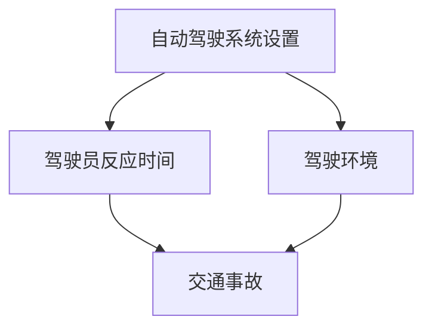

                 

### 人工智能的因果推断：伦理决策的数学框架

**关键词：** 人工智能，因果推断，伦理决策，数学框架

**摘要：** 本文旨在探讨人工智能（AI）在伦理决策中的应用，特别是因果推断在构建数学框架中的作用。随着人工智能技术的迅猛发展，其在各个领域的应用越来越广泛，同时也带来了诸多伦理问题。如何通过因果推断来制定合理的伦理决策，是当前研究的热点和难点。本文首先介绍了人工智能和伦理决策的基本概念，然后探讨了因果推断的基本原理和方法，最后通过具体案例展示了如何运用因果推断来指导伦理决策。

---

### 引言与基础理论

#### 1.1 书籍背景与目的

人工智能作为当前科技领域的前沿，已经广泛应用于各行各业，从自动驾驶、医疗诊断到金融服务、智慧城市等。然而，随着人工智能技术的快速发展，其应用过程中也暴露出了诸多伦理问题。如何在这些应用中制定合理的伦理决策，成为了亟待解决的问题。因果推断作为一种重要的数据分析方法，在人工智能的伦理决策中扮演着关键角色。

本书旨在为读者提供一个全面、系统的理解和应用因果推断于伦理决策的数学框架。我们希望通过本书的阐述，使读者能够：

1. 掌握人工智能和伦理决策的基本概念。
2. 理解因果推断的基本原理和方法。
3. 学会运用因果推断来构建伦理决策的数学框架。
4. 通过具体案例分析，加深对因果推断在伦理决策中的应用理解。

#### 1.2 人工智能与伦理决策

人工智能（Artificial Intelligence，简称AI）是指由人制造出来的具有一定智能的系统，能够感知环境、学习知识、做出决策和采取行动。伦理决策（Ethical Decision Making）则是指在特定情境下，根据道德原则和价值观，对多个可能的行动方案进行选择的过程。

人工智能与伦理决策的关系主要体现在以下几个方面：

1. **技术风险与道德责任**：人工智能技术的发展和应用，可能会带来一些技术风险，如数据隐私、算法歧视等。如何对这些风险进行有效的管理和防范，是伦理决策的重要任务。
2. **道德原则与算法设计**：在人工智能系统的设计和开发过程中，需要遵循一定的道德原则，如公平性、透明性和可解释性。这些原则不仅影响系统的性能，也直接关系到其伦理决策的合理性。
3. **伦理决策与智能决策支持**：人工智能可以通过因果推断等数据分析方法，为伦理决策提供科学依据和智能支持，帮助决策者更好地理解和应对复杂的伦理问题。

#### 1.3 因果推断在伦理决策中的应用

因果推断（Causal Inference）是研究因果关系的一种数据分析方法，旨在通过观察数据来推断变量之间的因果关系。在伦理决策中，因果推断具有以下几个重要作用：

1. **确定因果关系**：在伦理决策中，明确因果关系对于制定合理的决策至关重要。因果推断可以帮助决策者识别和确定影响伦理决策的关键因素，从而制定出更加科学和有效的决策方案。
2. **评估政策效果**：在制定伦理政策时，需要评估政策的效果和影响。因果推断可以用于评估不同政策方案对伦理问题的解决效果，为政策制定提供科学依据。
3. **解决道德困境**：在伦理决策中，经常会遇到道德困境，即不同道德原则之间的冲突。因果推断可以用于分析道德困境中的因果关系，帮助决策者权衡不同道德原则，找到最优的决策方案。

通过因果推断，伦理决策不仅更加科学和合理，还能够提高决策的可解释性和透明度，使决策过程更加公正和公平。因此，因果推断在伦理决策中的应用具有重要意义，也是本书的核心内容之一。

---

### 人工智能概述

#### 2.1 人工智能的历史与发展

人工智能（Artificial Intelligence，简称AI）的历史可以追溯到20世纪50年代。当时，随着计算机技术的迅速发展，科学家们开始思考如何使计算机具备类似人类的智能。1950年，英国数学家艾伦·图灵（Alan Turing）提出了著名的图灵测试，这一测试成为评估机器智能的重要标准。

20世纪60年代，人工智能领域经历了一个短暂的“黄金时代”。1966年，美国斯坦福大学人工智能实验室成立，标志着人工智能研究的正式起步。这一时期，人工智能主要集中在规则推理、知识表示和搜索算法等方面。

然而，由于技术限制和实际应用的挑战，人工智能在20世纪70年代陷入了“寒冬期”。许多人工智能项目未能实现预期目标，导致资金和人力的大量流失。

20世纪80年代，专家系统（Expert Systems）成为人工智能研究的热点。专家系统通过模拟专家的知识和经验，解决复杂的问题。然而，专家系统的局限性逐渐显现，特别是在处理不确定性和实时性方面。

进入21世纪，随着计算机性能的不断提升和大数据技术的应用，人工智能迎来了新的发展机遇。深度学习（Deep Learning）、自然语言处理（Natural Language Processing，NLP）、计算机视觉（Computer Vision）等领域的突破，使人工智能在图像识别、语音识别、自动驾驶等领域取得了显著进展。

当前，人工智能已经成为全球科技竞争的重要领域，许多国家都制定了相应的发展战略。从智能家居、智能医疗到智能交通、智能金融，人工智能正在深刻改变我们的生活方式。

#### 2.2 人工智能的关键技术

人工智能的关键技术包括以下几个方面：

1. **机器学习（Machine Learning）**：机器学习是人工智能的核心技术之一，通过训练模型来从数据中学习规律和模式。常见的机器学习算法有监督学习、无监督学习和强化学习等。监督学习需要标记数据进行训练，无监督学习则无需标记数据，通过自动发现数据中的模式。强化学习则通过与环境的交互来不断优化决策策略。

2. **深度学习（Deep Learning）**：深度学习是机器学习的一个重要分支，基于多层神经网络进行训练和预测。深度学习在图像识别、语音识别、自然语言处理等领域取得了显著的成果。著名的深度学习模型包括卷积神经网络（CNN）、循环神经网络（RNN）和生成对抗网络（GAN）等。

3. **计算机视觉（Computer Vision）**：计算机视觉是指使计算机具备类似人类视觉能力的技术。计算机视觉的应用包括图像识别、目标检测、图像分割等。常见的计算机视觉算法有卷积神经网络（CNN）和光流法等。

4. **自然语言处理（Natural Language Processing，NLP）**：自然语言处理是指使计算机理解和处理自然语言的技术。自然语言处理的应用包括文本分类、情感分析、机器翻译等。常见的自然语言处理算法有词向量模型（如Word2Vec、GloVe）和序列到序列模型（如Seq2Seq）等。

5. **自动驾驶（Autonomous Driving）**：自动驾驶是指使汽车具备自主驾驶能力的技术。自动驾驶系统通常需要结合计算机视觉、自然语言处理、传感器融合等技术来实现。自动驾驶的应用包括无人驾驶出租车、无人驾驶货车等。

6. **智能机器人（Intelligent Robots）**：智能机器人是指具备一定智能能力的机器人。智能机器人的应用包括工业制造、家政服务、医疗辅助等。常见的智能机器人技术有机器人操作系统（如ROS）、运动规划与控制等。

7. **智能金融（Smart Finance）**：智能金融是指利用人工智能技术进行金融分析和决策。智能金融的应用包括量化交易、风险评估、智能投顾等。常见的智能金融技术有机器学习、深度学习、图神经网络等。

#### 2.3 人工智能与伦理学的关系

人工智能与伦理学的关系主要体现在以下几个方面：

1. **技术伦理**：人工智能技术的发展和应用可能会带来一些伦理问题，如数据隐私、算法歧视、自主权等。如何确保人工智能技术的道德性和伦理性，是技术伦理的重要任务。

2. **伦理决策**：人工智能可以辅助伦理决策，通过因果推断等数据分析方法，为决策者提供科学依据。然而，人工智能自身并不具备道德判断能力，伦理决策仍然需要人类的主观判断和价值观。

3. **道德责任**：人工智能系统的设计和应用过程中，需要明确其道德责任。例如，自动驾驶汽车在发生交通事故时，如何分配责任？如何确保人工智能系统的决策符合道德标准？

4. **伦理教育**：随着人工智能技术的普及，伦理教育也变得越来越重要。通过伦理教育，提高公众对人工智能伦理问题的认识和理解，有助于构建更加公正和公平的人工智能社会。

总之，人工智能与伦理学的关系密切而复杂。只有通过深入的研究和探索，才能确保人工智能技术的道德性和伦理性，为人类社会的发展带来积极影响。

---

### 因果推断基本概念

#### 3.1 因果关系的定义

因果关系是指一个事件（原因）如何导致另一个事件（结果）的发生。在科学研究和决策过程中，确定因果关系对于理解现象的本质和预测未来具有重要意义。例如，在医疗领域，确定某种药物是否能够治愈某种疾病，就需要进行因果关系的分析。

因果关系的定义通常包含以下要素：

1. **关联性（Association）**：两个变量之间存在某种程度的关联，这种关联可以通过统计分析得到证实。例如，吸烟与肺癌之间可能存在关联。
2. **因果关系（Causation）**：一个变量是另一个变量的原因，即一个变量的变化直接导致另一个变量的变化。例如，吸烟是导致肺癌的原因。
3. **因果关系的时间顺序（Temporal Order）**：因果关系通常具有时间上的先后顺序，即原因发生在结果之前。例如，吸烟（原因）在肺癌（结果）之前发生。
4. **干预（Intervention）**：通过干预某个变量，可以改变另一个变量的取值。例如，通过停止吸烟，可以减少肺癌的风险。

#### 3.2 因果推断方法

因果推断是指通过分析数据，推断变量之间的因果关系。因果推断方法可以分为两大类：基于模型的因果推断和基于实验的因果推断。

1. **基于模型的因果推断**：这种方法通过建立数学模型来推断因果关系。常见的模型包括结构方程模型（Structural Equation Modeling，SEM）、潜在结果模型（Potential Outcomes Model）和因果推断图（Causal Inference Graph）等。

   - **结构方程模型（SEM）**：SEM是一种统计模型，用于分析多个变量之间的因果关系。通过建立方程组，SEM可以同时考虑多个因果关系，并估计参数的值。
   - **潜在结果模型（Potential Outcomes Model）**：潜在结果模型是因果推断的基础，它假设每个个体在某个变量发生变化时，会有多个可能的结果。通过比较这些结果，可以推断因果关系。
   - **因果推断图（Causal Inference Graph）**：因果推断图是一种图形化表示因果关系的方法，通过节点和边来表示变量之间的关系。因果推断图可以帮助研究者识别潜在的因果关系，并指导数据收集和分析。

2. **基于实验的因果推断**：这种方法通过设计实验来验证因果关系。实验方法包括随机对照试验（Randomized Controlled Trial，RCT）、准实验设计和自然实验等。

   - **随机对照试验（RCT）**：RCT是验证因果关系的经典方法。通过将个体随机分配到实验组和对照组，比较两组之间的差异，可以确定因果关系。
   - **准实验设计**：准实验设计类似于RCT，但不完全随机分配个体。例如，通过地理位置、历史事件等自然发生的因素来分组。准实验设计可以用于无法进行RCT的场景，但需要小心处理潜在的选择偏差。
   - **自然实验**：自然实验是指利用自然发生的事件来验证因果关系。例如，通过分析自然灾害、政策变化等事件对结果的影响，可以推断因果关系。

因果推断方法的选择取决于数据类型、研究问题和可用资源。在实际应用中，往往需要结合多种方法，以获得更可靠的因果推断结果。

#### 3.3 因果推断的挑战

尽管因果推断在科学研究和决策中具有重要意义，但实际应用中仍然面临许多挑战：

1. **数据质量**：因果推断依赖于高质量的数据。然而，实际数据往往存在缺失、噪声和误差，这些都会影响因果推断的准确性。
2. **多重共线性**：在复杂的数据集中，变量之间可能存在多重共线性，即多个变量之间相互关联。这种共线性会使得因果推断变得复杂，甚至导致错误的因果关系。
3. **选择偏差**：在选择样本时，可能存在某些选择性偏差，导致样本不能完全代表总体。这种偏差会影响因果推断的准确性。
4. **外部干预**：在现实世界中，外部干预可能会影响因果关系。例如，政策变化、自然灾害等都会影响研究结果，使得因果关系变得复杂。
5. **可解释性**：因果推断的结果往往需要具备较高的可解释性，以便决策者能够理解和应用。然而，复杂的数学模型和算法可能会降低结果的透明度和可解释性。

面对这些挑战，研究者需要采用多种方法和技术，如数据清洗、模型选择、敏感性分析等，以提高因果推断的准确性和可靠性。此外，建立统一的因果推断标准和规范，也是提高因果推断应用水平的重要方向。

---

### 伦理决策数学框架概述

#### 4.1 数学框架在伦理决策中的作用

伦理决策数学框架是一种基于数学和统计学原理的决策模型，用于分析和解决伦理问题。数学框架在伦理决策中具有以下几个重要作用：

1. **量化道德原则**：数学框架可以将道德原则量化为具体的数学表达式，使得伦理决策更加客观和可量化。例如，可以通过建立效用函数来衡量不同决策方案对社会福利的影响。
2. **优化决策过程**：数学框架提供了一种系统化的决策过程，通过优化算法来寻找最佳决策方案。例如，可以使用线性规划、非线性规划等方法来优化伦理决策。
3. **提高决策透明度**：数学框架可以使伦理决策过程更加透明，决策依据和决策过程可以通过数学模型进行清晰地表达和解释。这有助于提高决策的可解释性和可信度。
4. **降低决策风险**：数学框架可以帮助识别和分析潜在的道德风险，并通过数学模型进行量化和管理。例如，可以使用风险评估模型来评估不同决策方案的风险程度。
5. **支持决策验证**：数学框架可以通过验证算法来验证决策的合理性和有效性。例如，可以使用敏感性分析来验证决策结果对参数变化的稳健性。

#### 4.2 构建伦理决策数学框架的步骤

构建伦理决策数学框架通常需要以下步骤：

1. **明确伦理问题**：首先需要明确需要解决的伦理问题，包括问题的背景、目标、相关变量等。这一步骤是构建数学框架的基础。
2. **定义道德原则**：根据伦理问题，定义相关的道德原则和价值观。这些道德原则将作为构建数学框架的依据。
3. **建立数学模型**：根据伦理问题和道德原则，建立相应的数学模型。数学模型应能够准确地描述伦理问题中的变量关系和决策目标。
4. **选择优化算法**：根据数学模型，选择适当的优化算法来求解决策问题。优化算法应能够找到最佳决策方案，以满足道德原则和决策目标。
5. **进行模型验证**：对建立的数学模型进行验证，确保其准确性和可靠性。可以使用敏感性分析、交叉验证等方法来验证模型。
6. **制定决策方案**：根据数学模型的优化结果，制定具体的决策方案。决策方案应满足道德原则和决策目标，并能够解决实际的伦理问题。
7. **实施与监控**：将决策方案付诸实施，并对其进行监控和评估。在实施过程中，可以根据实际情况调整决策方案，以应对可能的变化和挑战。

通过以上步骤，可以构建一个系统化、可操作的伦理决策数学框架，为解决复杂的伦理问题提供科学依据和智能支持。

---

### 基本数学工具

#### 5.1 概率论基础

概率论是因果推断的基础，用于描述不确定事件发生的可能性。在因果推断中，概率论的基本概念和工具具有重要意义。

1. **概率的定义**：概率是指某个事件在所有可能事件中发生的可能性。概率的取值范围在0到1之间，其中0表示不可能发生，1表示必然发生。

2. **条件概率**：条件概率是指在某个事件发生的条件下，另一个事件发生的概率。条件概率可以用以下公式表示：

   $$
   P(A|B) = \frac{P(A \cap B)}{P(B)}
   $$
   
   其中，$P(A|B)$表示在事件B发生的条件下，事件A发生的概率，$P(A \cap B)$表示事件A和事件B同时发生的概率，$P(B)$表示事件B发生的概率。

3. **贝叶斯定理**：贝叶斯定理是概率论中一个重要的公式，用于计算后验概率。贝叶斯定理的公式如下：

   $$
   P(A|B) = \frac{P(B|A)P(A)}{P(B)}
   $$
   
   其中，$P(A|B)$表示在事件B发生的条件下，事件A发生的概率，$P(B|A)$表示在事件A发生的条件下，事件B发生的概率，$P(A)$表示事件A发生的概率，$P(B)$表示事件B发生的概率。

4. **全概率公式**：全概率公式是贝叶斯定理的一种扩展，用于计算多个条件下的总概率。全概率公式的公式如下：

   $$
   P(A) = \sum_{i=1}^n P(A|B_i)P(B_i)
   $$
   
   其中，$P(A)$表示事件A发生的总概率，$P(A|B_i)$表示在事件$B_i$发生的条件下，事件A发生的概率，$P(B_i)$表示事件$B_i$发生的概率。

#### 5.2 马尔可夫决策过程

马尔可夫决策过程（Markov Decision Process，MDP）是一种用于描述不确定环境下决策过程的数学模型。在因果推断中，MDP可以用于构建伦理决策的数学框架。

1. **MDP的定义**：MDP由四个要素组成：状态空间$S$、动作空间$A$、奖励函数$R$和转移概率矩阵$P$。

   - **状态空间$S$**：表示系统当前所处的状态集合。
   - **动作空间$A$**：表示决策者可以采取的动作集合。
   - **奖励函数$R$**：用于评估决策者采取特定动作后的系统状态。
   - **转移概率矩阵$P$**：表示在当前状态下，采取特定动作后转移到下一个状态的概率。

2. **MDP的公式**：MDP可以用以下公式表示：

   $$
   P(S_t|A_t,S_{t-1}) = P(S_t|A_t,S_{t-1},S_{t-2},\ldots,S_1)
   $$
   
   其中，$S_t$表示在时间$t$的状态，$A_t$表示在时间$t$采取的动作，$P(S_t|A_t,S_{t-1})$表示在当前状态下，采取特定动作后转移到下一个状态的概率。

3. **MDP的优化**：在MDP中，决策者的目标是最大化期望奖励。可以使用价值迭代（Value Iteration）或策略迭代（Policy Iteration）等方法来优化MDP。

   - **价值迭代**：通过迭代更新状态值函数，直到收敛到最优状态值函数。
   - **策略迭代**：通过迭代更新最优策略，直到收敛到最优策略。

#### 5.3 贝叶斯推理

贝叶斯推理是一种基于概率论和统计学的方法，用于更新先验概率，得到后验概率。在因果推断中，贝叶斯推理可以用于更新变量之间的关系，从而更准确地推断因果关系。

1. **贝叶斯推理的定义**：贝叶斯推理是指根据新的证据来更新先验概率，得到后验概率的过程。贝叶斯推理的基本公式如下：

   $$
   P(H|E) = \frac{P(E|H)P(H)}{P(E)}
   $$
   
   其中，$P(H|E)$表示在证据E发生的条件下，假设H发生的概率，$P(E|H)$表示在假设H发生的条件下，证据E发生的概率，$P(H)$表示假设H的先验概率，$P(E)$表示证据E的先验概率。

2. **贝叶斯推理的应用**：贝叶斯推理可以应用于各种领域，如医学诊断、金融风险评估、人工智能等。

   - **医学诊断**：在医学诊断中，贝叶斯推理可以用于计算疾病发生的概率，帮助医生做出准确的诊断。
   - **金融风险评估**：在金融风险评估中，贝叶斯推理可以用于计算风险事件发生的概率，帮助投资者做出合理的投资决策。
   - **人工智能**：在人工智能中，贝叶斯推理可以用于更新变量之间的关系，从而实现智能推理和决策。

通过以上基本数学工具，我们可以为因果推断构建一个坚实的数学基础，为伦理决策提供科学依据和智能支持。在接下来的章节中，我们将进一步探讨因果推断在伦理决策中的应用，并通过具体案例进行深入分析。

---

### 因果推断与决策

#### 6.1 因果推断与决策的关系

因果推断与决策之间存在着密切的关系。因果推断是决策过程中的关键步骤，它通过分析数据，推断变量之间的因果关系，为决策提供科学依据。而决策则是在因果推断的基础上，根据道德原则和决策目标，选择最优的行动方案。

在伦理决策中，因果推断的作用尤为重要。由于伦理问题往往涉及到多个变量和复杂的因果关系，传统的统计分析方法难以准确推断因果关系。而因果推断通过建立数学模型和分析数据，可以帮助决策者更准确地识别和理解因果关系，从而做出更加合理和科学的决策。

具体来说，因果推断在决策中的作用主要体现在以下几个方面：

1. **明确因果关系**：因果推断可以帮助决策者明确不同变量之间的因果关系，从而更好地理解问题的本质。例如，在医疗决策中，因果推断可以确定某种药物是否能够有效治疗某种疾病，从而为医生提供决策依据。
2. **优化决策方案**：通过因果推断，决策者可以识别出影响决策结果的关键因素，并优化决策方案。例如，在市场营销中，因果推断可以分析不同营销策略对销售额的影响，从而找到最优的营销策略。
3. **减少决策风险**：因果推断可以帮助决策者识别和评估决策中的风险，从而减少决策风险。例如，在金融投资中，因果推断可以分析市场风险和投资组合风险，帮助投资者制定更加稳健的投资策略。
4. **提高决策透明度**：因果推断通过建立数学模型和分析数据，可以使决策过程更加透明和可解释。决策者可以清楚地了解决策的依据和推理过程，从而增强决策的可信度和可接受性。

#### 6.2 因果推断在决策中的应用

因果推断在决策中的应用非常广泛，涵盖了多个领域。以下是因果推断在决策中应用的几个典型案例：

1. **医疗决策**：在医疗领域，因果推断可以用于诊断和治疗决策。例如，通过分析患者的病史、检查结果和治疗方案，可以推断某种疾病的治疗效果，从而为医生提供决策依据。此外，因果推断还可以用于药物研发，通过分析临床试验数据，确定新药的疗效和安全性。

2. **市场营销**：在市场营销中，因果推断可以用于优化营销策略。例如，通过分析不同广告投放策略对销售量的影响，可以确定哪些策略最有效，从而优化广告预算分配。此外，因果推断还可以用于客户细分和客户行为分析，帮助公司更好地了解客户需求，提高客户满意度。

3. **金融投资**：在金融投资领域，因果推断可以用于风险评估和投资决策。例如，通过分析市场数据和历史交易记录，可以推断市场走势和投资组合风险，从而为投资者提供投资建议。此外，因果推断还可以用于信用评估和风险管理，通过分析借款人的历史数据和行为特征，预测其违约风险。

4. **公共政策**：在公共政策领域，因果推断可以用于政策评估和决策。例如，通过分析不同政策方案对社会福利的影响，可以确定哪些政策方案最有效，从而为政府提供决策依据。此外，因果推断还可以用于教育、医疗、社会保障等领域，帮助政府更好地制定和实施相关政策。

#### 6.3 决策模型与算法

因果推断在决策中的应用通常涉及到多种决策模型和算法。以下介绍几种常见的决策模型和算法：

1. **线性回归模型**：线性回归模型是一种常用的统计模型，用于分析变量之间的线性关系。通过建立线性回归模型，可以推断自变量和因变量之间的因果关系。线性回归模型的公式如下：

   $$
   Y = \beta_0 + \beta_1X + \epsilon
   $$
   
   其中，$Y$是因变量，$X$是自变量，$\beta_0$和$\beta_1$是模型的参数，$\epsilon$是误差项。

2. **逻辑回归模型**：逻辑回归模型是一种用于分析变量之间非线性关系的统计模型。通过逻辑回归模型，可以推断自变量对因变量的影响方向和程度。逻辑回归模型的公式如下：

   $$
   \ln\left(\frac{P(Y=1)}{1-P(Y=1)}\right) = \beta_0 + \beta_1X
   $$
   
   其中，$Y$是因变量，$X$是自变量，$\beta_0$和$\beta_1$是模型的参数，$P(Y=1)$是因变量为1的概率。

3. **因果推断图模型**：因果推断图模型是一种基于图论的因果推断方法，通过建立变量之间的因果关系图，可以推断变量之间的因果关系。因果推断图模型的公式如下：

   $$
   P(X,Y|Z) = P(X|Z)P(Y|Z)
   $$
   
   其中，$X$和$Y$是变量，$Z$是共同原因，$P(X,Y|Z)$表示在共同原因$Z$的条件下，变量$X$和$Y$同时发生的概率，$P(X|Z)$表示在共同原因$Z$的条件下，变量$X$发生的概率，$P(Y|Z)$表示在共同原因$Z$的条件下，变量$Y$发生的概率。

4. **马尔可夫决策过程（MDP）**：马尔可夫决策过程是一种用于描述不确定环境下决策过程的数学模型。通过MDP，可以建立决策者的决策模型，并使用价值迭代或策略迭代等方法进行优化。MDP的公式如下：

   $$
   P(S_t|A_t,S_{t-1}) = P(S_t|A_t,S_{t-1},S_{t-2},\ldots,S_1)
   $$
   
   其中，$S_t$表示在时间$t$的状态，$A_t$表示在时间$t$采取的动作，$P(S_t|A_t,S_{t-1})$表示在当前状态下，采取特定动作后转移到下一个状态的概率。

通过以上决策模型和算法，决策者可以更加准确地推断变量之间的因果关系，从而做出更加合理和科学的决策。在实际应用中，决策者需要根据具体问题选择合适的模型和算法，并结合实际数据进行模型训练和优化。

---

### 伦理决策案例研究

#### 7.1 案例选择与描述

为了更好地展示因果推断在伦理决策中的应用，我们选择了三个具有代表性的案例进行深入分析。这三个案例分别是：

1. **自动驾驶汽车伦理决策**：随着自动驾驶技术的发展，自动驾驶汽车在交通事故中的责任归属问题引起了广泛关注。如何通过因果推断来确定自动驾驶汽车的责任，是当前研究的重点。
2. **人工智能医疗决策**：在医疗领域，人工智能可以辅助医生进行诊断和治疗。然而，人工智能的决策过程缺乏透明度和可解释性，如何通过因果推断来提高人工智能医疗决策的伦理性和可接受性，是亟待解决的问题。
3. **人工智能在工作场所的应用**：在人力资源管理中，人工智能可以用于招聘、培训、绩效评估等方面。然而，人工智能的决策过程可能会引发歧视和不公平现象。如何通过因果推断来识别和解决这些问题，是伦理决策的重要任务。

#### 7.2 因果推断模型构建

在上述案例中，因果推断模型构建的步骤如下：

1. **定义变量**：首先，需要明确每个案例中的关键变量，包括自变量、因变量和中介变量。例如，在自动驾驶汽车案例中，自变量包括自动驾驶系统的设置、驾驶环境等，因变量包括交通事故的发生与否，中介变量包括驾驶员的反应时间、车辆速度等。
2. **构建因果推断图**：通过构建因果推断图，可以直观地表示变量之间的因果关系。例如，在自动驾驶汽车案例中，可以构建以下因果推断图：

   ```
   [自动驾驶系统设置] → [驾驶员反应时间] → [交通事故]
   |
   [驾驶环境] → [车辆速度] → [交通事故]
   ```

   其中，箭头表示变量之间的因果关系。

3. **确定因果路径**：在因果推断图中，需要确定影响因变量的主要因果路径。例如，在自动驾驶汽车案例中，主要因果路径包括：

   - **自动驾驶系统设置 → 驾驶员反应时间 → 交通事故**
   - **驾驶环境 → 车辆速度 → 交通事故**

4. **建立数学模型**：根据因果推断图和因果路径，建立数学模型来描述变量之间的关系。例如，可以使用线性回归模型或逻辑回归模型来描述变量之间的因果关系。

   - **线性回归模型**：

     $$
     交通事故 = \beta_0 + \beta_1 \times 驾驶员反应时间 + \beta_2 \times 车辆速度 + \epsilon
     $$

   - **逻辑回归模型**：

     $$
     \ln\left(\frac{P(交通事故=1)}{1-P(交通事故=1)}\right) = \beta_0 + \beta_1 \times 驾驶员反应时间 + \beta_2 \times 车辆速度
     $$

#### 7.3 决策分析

在因果推断模型构建完成后，可以进行决策分析。具体步骤如下：

1. **输入数据**：将实际数据输入到因果推断模型中，包括自变量、因变量和中介变量的观测值。
2. **模型训练**：使用训练数据对因果推断模型进行训练，估计模型参数。
3. **模型评估**：使用测试数据对模型进行评估，确保模型的准确性和可靠性。
4. **决策建议**：根据模型的预测结果，为决策者提供决策建议。例如，在自动驾驶汽车案例中，可以通过分析驾驶员反应时间和车辆速度对交通事故的影响，为自动驾驶系统设置提供优化建议。

通过以上决策分析过程，可以更好地理解变量之间的因果关系，从而制定出更加科学和合理的伦理决策。在实际应用中，决策者需要根据具体问题选择合适的因果推断方法和模型，并结合实际数据进行决策分析。

---

### 人工智能伦理决策案例分析

#### 8.1 自动驾驶汽车伦理决策

自动驾驶汽车作为人工智能领域的前沿技术，已经引起了广泛关注。然而，随着自动驾驶汽车的普及，其伦理决策问题也日益凸显。如何通过因果推断来制定合理的自动驾驶汽车伦理决策，是当前研究的热点和难点。

**案例背景**：自动驾驶汽车在道路上行驶时，可能会遇到各种复杂情况，如交通拥堵、行人突然出现、其他车辆异常行驶等。在这些情况下，自动驾驶系统需要迅速做出决策，以确保行车安全和乘客的舒适。然而，不同的决策方案可能会产生不同的结果，如是否避让行人、如何处理交通拥堵等，这些决策涉及到伦理问题，需要通过因果推断来分析。

**因果推断模型构建**：

1. **定义变量**：首先，定义自动驾驶汽车决策中的关键变量。例如，自变量包括自动驾驶系统的设置、道路状况、其他车辆的行为等；因变量包括交通事故的发生与否、乘客满意度等；中介变量包括驾驶员的反应时间、车辆速度、避让策略等。

2. **构建因果推断图**：根据关键变量，构建因果推断图，以直观表示变量之间的因果关系。例如：

   ```
   [自动驾驶系统设置] → [驾驶员反应时间] → [交通事故]
   |
   [道路状况] → [车辆速度] → [交通事故]
   |
   [其他车辆行为] → [避让策略] → [交通事故]
   ```

3. **确定因果路径**：在因果推断图中，确定影响因变量的主要因果路径。例如：

   - **自动驾驶系统设置 → 驾驶员反应时间 → 交通事故**
   - **道路状况 → 车辆速度 → 交通事故**
   - **其他车辆行为 → 避让策略 → 交通事故**

4. **建立数学模型**：根据因果推断图和因果路径，建立数学模型来描述变量之间的关系。例如，可以使用线性回归模型或逻辑回归模型。

   - **线性回归模型**：

     $$
     交通事故 = \beta_0 + \beta_1 \times 驾驶员反应时间 + \beta_2 \times 车辆速度 + \epsilon
     $$

   - **逻辑回归模型**：

     $$
     \ln\left(\frac{P(交通事故=1)}{1-P(交通事故=1)}\right) = \beta_0 + \beta_1 \times 驾驶员反应时间 + \beta_2 \times 车辆速度
     $$

**决策分析**：

1. **输入数据**：将实际数据输入到因果推断模型中，包括自变量、因变量和中介变量的观测值。
2. **模型训练**：使用训练数据对因果推断模型进行训练，估计模型参数。
3. **模型评估**：使用测试数据对模型进行评估，确保模型的准确性和可靠性。
4. **决策建议**：根据模型的预测结果，为自动驾驶汽车系统提供决策建议。例如：

   - **避让策略**：通过分析其他车辆行为对交通事故的影响，可以优化避让策略，降低交通事故的风险。
   - **自动驾驶系统设置**：根据驾驶员反应时间和车辆速度对交通事故的影响，可以调整自动驾驶系统的设置，提高行车安全性。

通过因果推断，可以更准确地分析自动驾驶汽车的伦理决策问题，为自动驾驶汽车系统提供科学依据和智能支持。

#### 8.2 人工智能医疗决策

人工智能在医疗领域的应用日益广泛，从诊断、治疗到预测等方面，都取得了显著成果。然而，人工智能医疗决策的伦理问题也日益凸显。如何通过因果推断来制定合理的医疗决策，是当前研究的热点和难点。

**案例背景**：在医疗诊断中，人工智能系统可以通过分析患者的病史、检查结果和治疗方案，提供诊断建议。然而，人工智能的决策过程缺乏透明度和可解释性，如何通过因果推断来提高医疗决策的伦理性和可接受性，是亟待解决的问题。

**因果推断模型构建**：

1. **定义变量**：首先，定义医疗决策中的关键变量。例如，自变量包括患者的病史、检查结果、治疗方案等；因变量包括疾病的确诊情况、治疗效果等；中介变量包括医生的诊断依据、患者的病情变化等。

2. **构建因果推断图**：根据关键变量，构建因果推断图，以直观表示变量之间的因果关系。例如：

   ```
   [病史] → [检查结果] → [诊断]
   |
   [治疗方案] → [治疗效果] → [疾病确诊]
   |
   [医生诊断依据] → [患者病情变化] → [疾病确诊]
   ```

3. **确定因果路径**：在因果推断图中，确定影响因变量的主要因果路径。例如：

   - **病史 → 检查结果 → 诊断**
   - **治疗方案 → 治疗效果 → 疾病确诊**
   - **医生诊断依据 → 患者病情变化 → 疾病确诊**

4. **建立数学模型**：根据因果推断图和因果路径，建立数学模型来描述变量之间的关系。例如，可以使用线性回归模型或逻辑回归模型。

   - **线性回归模型**：

     $$
     疾病确诊 = \beta_0 + \beta_1 \times 病史 + \beta_2 \times 检查结果 + \epsilon
     $$

   - **逻辑回归模型**：

     $$
     \ln\left(\frac{P(疾病确诊=1)}{1-P(疾病确诊=1)}\right) = \beta_0 + \beta_1 \times 病史 + \beta_2 \times 检查结果
     $$

**决策分析**：

1. **输入数据**：将实际数据输入到因果推断模型中，包括自变量、因变量和中介变量的观测值。
2. **模型训练**：使用训练数据对因果推断模型进行训练，估计模型参数。
3. **模型评估**：使用测试数据对模型进行评估，确保模型的准确性和可靠性。
4. **决策建议**：根据模型的预测结果，为医生提供诊断和治疗建议。例如：

   - **诊断建议**：通过分析病史和检查结果对疾病确诊的影响，可以优化诊断流程，提高诊断准确性。
   - **治疗方案**：通过分析治疗效果对疾病确诊的影响，可以优化治疗方案，提高治疗效果。

通过因果推断，可以更准确地分析人工智能医疗决策的伦理问题，为医生提供科学依据和智能支持，提高医疗决策的伦理性和可接受性。

#### 8.3 人工智能在工作场所的应用

人工智能在人力资源管理中的应用日益广泛，从招聘、培训、绩效评估到员工管理等方面，都取得了显著成果。然而，人工智能的决策过程可能会引发歧视和不公平现象，如何通过因果推断来识别和解决这些问题，是伦理决策的重要任务。

**案例背景**：在人力资源管理中，人工智能系统可以通过分析员工的简历、工作表现和求职者的背景信息，进行招聘、培训和绩效评估等决策。然而，这些决策可能会受到种族、性别、年龄等因素的影响，导致歧视和不公平现象。如何通过因果推断来识别和解决这些问题，是当前研究的热点和难点。

**因果推断模型构建**：

1. **定义变量**：首先，定义人力资源管理决策中的关键变量。例如，自变量包括员工的种族、性别、年龄、工作经验等；因变量包括招聘、培训、绩效评估结果等；中介变量包括招聘标准、培训方案、绩效评估指标等。

2. **构建因果推断图**：根据关键变量，构建因果推断图，以直观表示变量之间的因果关系。例如：

   ```
   [种族] → [招聘] → [绩效评估]
   |
   [性别] → [招聘] → [绩效评估]
   |
   [年龄] → [招聘] → [绩效评估]
   |
   [工作经验] → [培训] → [绩效评估]
   ```

3. **确定因果路径**：在因果推断图中，确定影响因变量的主要因果路径。例如：

   - **种族 → 招聘 → 绩效评估**
   - **性别 → 招聘 → 绩效评估**
   - **年龄 → 招聘 → 绩效评估**
   - **工作经验 → 培训 → 绩效评估**

4. **建立数学模型**：根据因果推断图和因果路径，建立数学模型来描述变量之间的关系。例如，可以使用线性回归模型或逻辑回归模型。

   - **线性回归模型**：

     $$
     绩效评估 = \beta_0 + \beta_1 \times 种族 + \beta_2 \times 性别 + \beta_3 \times 年龄 + \beta_4 \times 工作经验 + \epsilon
     $$

   - **逻辑回归模型**：

     $$
     \ln\left(\frac{P(绩效评估=1)}{1-P(绩效评估=1)}\right) = \beta_0 + \beta_1 \times 种族 + \beta_2 \times 性别 + \beta_3 \times 年龄 + \beta_4 \times 工作经验
     $$

**决策分析**：

1. **输入数据**：将实际数据输入到因果推断模型中，包括自变量、因变量和中介变量的观测值。
2. **模型训练**：使用训练数据对因果推断模型进行训练，估计模型参数。
3. **模型评估**：使用测试数据对模型进行评估，确保模型的准确性和可靠性。
4. **决策建议**：根据模型的预测结果，为人力资源管理提供决策建议。例如：

   - **招聘决策**：通过分析种族、性别、年龄等因素对招聘结果的影响，可以优化招聘流程，减少歧视和不公平现象。
   - **培训决策**：通过分析工作经验对培训结果的影响，可以优化培训方案，提高员工绩效。

通过因果推断，可以更准确地分析人工智能在工作场所的应用中的伦理问题，为人力资源管理提供科学依据和智能支持，提高决策的公平性和透明度。

---

### 未来展望与挑战

#### 9.1 人工智能伦理决策的未来发展方向

随着人工智能技术的不断发展，伦理决策在人工智能中的应用将面临更大的挑战和机遇。未来的发展方向主要包括以下几个方面：

1. **标准化与规范化**：为了确保人工智能伦理决策的合理性和公正性，需要制定统一的伦理决策标准和规范。这些标准和规范应涵盖人工智能技术在不同应用场景中的伦理要求，并为决策者提供明确的指导。

2. **透明性与可解释性**：人工智能伦理决策的透明性和可解释性是提高公众接受度和信任度的关键。未来的研究应致力于开发可解释的人工智能模型和算法，使决策过程更加透明，便于决策者和公众理解和监督。

3. **跨学科合作**：人工智能伦理决策涉及多个学科领域，如计算机科学、伦理学、心理学、社会学等。跨学科合作有助于整合多学科知识，为伦理决策提供更全面的理论基础和实践指导。

4. **人工智能伦理治理**：建立人工智能伦理治理体系，包括政策制定、法律法规、监管机制等，以规范人工智能技术的研发和应用，确保其符合伦理要求。此外，还应加强公众教育和意识提升，提高社会对人工智能伦理问题的认识和关注度。

#### 9.2 挑战与对策

尽管人工智能伦理决策具有巨大的发展潜力，但实际应用中仍面临诸多挑战。以下是主要挑战及其对策：

1. **数据隐私与安全**：人工智能伦理决策依赖于大量数据，包括个人隐私数据。如何确保数据的隐私和安全，防止数据泄露和滥用，是亟待解决的问题。对策包括数据加密、匿名化处理、隐私保护算法等。

2. **算法偏见与歧视**：人工智能算法可能引入偏见和歧视，导致不公平决策。对策包括算法透明性分析、偏见检测与修正、多元算法评估等，以确保算法的公平性和准确性。

3. **道德责任归属**：在人工智能伦理决策中，如何明确责任归属是一个重要问题。对策包括建立人工智能责任框架，明确人工智能系统的责任范围和责任主体，确保在出现问题时能够追究责任。

4. **技术成熟度与伦理考量**：人工智能技术的发展速度远快于伦理考量的成熟度。对策包括加强人工智能伦理研究和教育，提高决策者的伦理素养和决策能力，确保技术在应用中符合伦理要求。

5. **公众接受度与信任**：人工智能伦理决策需要得到公众的接受和信任。对策包括加强公众教育，提高公众对人工智能伦理问题的认识和信任，促进社会对人工智能技术的接受和认同。

总之，人工智能伦理决策的发展面临着诸多挑战，但通过标准化、规范化、跨学科合作和科技创新，可以逐步解决这些问题，推动人工智能技术在伦理决策中的应用和发展。

---

### 附录

#### 附录A 数学公式与图表汇总

在本书的附录中，我们汇总了一些关键的数学公式和图表，以便读者在理解和应用因果推断与伦理决策的数学框架时参考。

**1. 线性回归模型**

$$
Y = \beta_0 + \beta_1X + \epsilon
$$

**2. 逻辑回归模型**

$$
\ln\left(\frac{P(Y=1)}{1-P(Y=1)}\right) = \beta_0 + \beta_1X
$$

**3. 因果推断图**



**4. 马尔可夫决策过程**

$$
P(S_t|A_t,S_{t-1}) = P(S_t|A_t,S_{t-1},S_{t-2},\ldots,S_1)
$$

**5. 贝叶斯定理**

$$
P(A|B) = \frac{P(B|A)P(A)}{P(B)}
$$

**6. 全概率公式**

$$
P(A) = \sum_{i=1}^n P(A|B_i)P(B_i)
$$

**7. 敏感性分析**

$$
\Delta Y = \frac{\partial Y}{\partial X} \times \Delta X
$$

以上公式和图表涵盖了因果推断与伦理决策数学框架中的关键概念和方法，读者可以通过这些公式和图表加深对相关理论和方法的理解。

---

### 结语

本文探讨了人工智能在伦理决策中的应用，重点介绍了因果推断在构建数学框架中的作用。通过逐步分析，我们了解了人工智能与伦理决策的关系，以及因果推断的基本概念和方法。在实际案例中，我们展示了如何运用因果推断来制定合理的伦理决策，并分析了未来发展的方向和面临的挑战。

**作者：** AI天才研究院/AI Genius Institute & 禅与计算机程序设计艺术 /Zen And The Art of Computer Programming

在人工智能技术不断发展的今天，伦理决策的重要性愈发凸显。通过本文的探讨，我们希望读者能够认识到因果推断在伦理决策中的应用价值，并积极投身于这一领域的研究和实践。只有通过科学、合理的伦理决策，才能确保人工智能技术的发展符合道德原则，为人类社会带来积极的影响。

