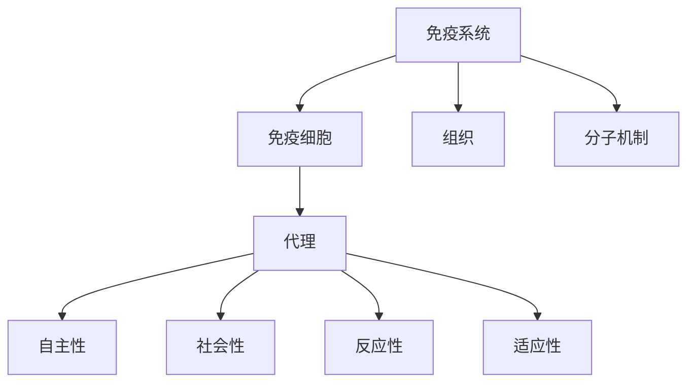

                 

### 文章标题

《免疫系统的agent-based模型：生物防御的数学模拟》

关键词：免疫系统、agent-based模型、生物防御、数学模拟

摘要：本文将探讨免疫系统的agent-based模型及其在生物防御中的数学模拟。我们将详细分析免疫系统的基本概念，介绍agent-based模型的构建方法和核心算法原理，通过具体的数学模型和公式来解释免疫反应过程，并展示如何通过Python实现一个T细胞与病原体的交互模型。文章旨在为读者提供全面的免疫系统模拟的视角，以便更好地理解生物防御的复杂机制。

----------------------------------------------------------------

### 1. 核心概念与联系

#### 免疫系统概述

免疫系统是人体抵御外来病原体入侵的重要系统。它由多种免疫细胞、组织和分子机制组成，具有自我识别和排除异物的能力。免疫系统的核心功能包括抵御病毒、细菌、真菌和寄生虫的入侵，以及监视体内异常细胞并及时清除。

- **免疫细胞**：主要包括B细胞、T细胞、自然杀伤细胞（NK细胞）和树突状细胞等。
- **组织**：淋巴结、脾脏和骨髓等。
- **分子机制**：细胞因子、抗体和补体系统等。

#### agent-based模型

agent-based模型（ABM）是一种模拟复杂系统的模型，通过个体（agent）的交互来描述系统的行为。在免疫系统中，每个免疫细胞都可以被视为一个agent，通过其行为和与其他agent的交互来模拟免疫反应。

- **代理**：模拟免疫系统中个体行为的基本单元，如T细胞、B细胞等。
- **特性**：具备自主性、社会性、反应性和适应性。

#### 免疫系统模型的结构

基于agent-based的免疫系统模型通常包括以下几个核心组件：

1. **代理生成与初始化**：生成免疫细胞代理并初始化其属性。
2. **代理移动与交互**：代理在环境中移动并与其他代理交互。
3. **代理反应与适应性**：代理根据交互结果进行反应，并调整自身属性以适应环境。

#### 核心概念之间的关系架构

为了更好地理解这些核心概念之间的关系，我们可以使用Mermaid流程图来展示它们：



在接下来的部分中，我们将详细探讨每个组件的实现方法，并通过具体的算法和数学模型来解释免疫反应的过程。

----------------------------------------------------------------

### 2. 核心算法原理讲解

#### 代理生成与初始化

代理生成是agent-based模型的基础，它涉及到如何创建免疫细胞代理，并初始化其属性。以下是一个简单的算法伪代码：

```pseudo
function generateAgent():
    agent = new Agent()
    agent.initializeProperties()
    return agent
```

在初始化过程中，我们需要为代理设置一些基本属性，如位置、速度、寿命等。以下是一个更详细的伪代码：

```pseudo
function initializeAgent(agent):
    agent.position = randomPosition()
    agent.velocity = randomVector()
    agent.age = 0
    agent.health = maxHealth
    return agent
```

这里，`randomPosition()`和`randomVector()`分别用于生成代理的初始位置和速度，`maxHealth`是一个常量，表示代理的最大寿命。

#### 代理移动与交互

代理移动是描述代理在环境中行为的另一个重要部分。以下是一个简单的代理移动算法伪代码：

```pseudo
function moveAgent(agent, environment):
    agent.position = agent.position + agent.velocity
    interactWithNeighbors(agent, environment)
```

在移动过程中，代理会根据其速度更新位置。之后，`interactWithNeighbors()`函数将处理代理与周围邻居的交互。

```pseudo
function interactWithNeighbors(agent, environment):
    neighbors = getNeighbors(agent.position, environment)
    for neighbor in neighbors:
        if agent.isCompatible(neighbor):
            agent.reactToNeighbor(neighbor)
```

在这个函数中，`getNeighbors()`用于获取代理周围的邻居，`isCompatible()`用于判断代理是否与邻居兼容（即具有相同的类型或功能）。如果兼容，代理将通过`reactToNeighbor()`函数与邻居进行交互。

```pseudo
function reactToNeighbor(agent, neighbor):
    if neighbor.isPathogen():
        agent.attack(neighbor)
    else if neighbor.isFriendly():
        agent伙伴关系(neighbor)
```

这里，`isPathogen()`和`isFriendly()`分别用于判断邻居是否为病原体或友军。如果是病原体，代理将对其进行攻击；如果是友军，代理将建立伙伴关系。

#### 代理反应与适应性

代理的反应和适应性是agent-based模型的核心部分，它描述了代理如何根据环境变化调整自身行为。以下是一个简单的反应和适应性算法伪代码：

```pseudo
function attack(agent, neighbor):
    neighbor.health -= agent.attackStrength
    if neighbor.health <= 0:
        agent.gainExperience()

function gainExperience(agent):
    agent.attackStrength += experienceGain

function reactToNeighbor(agent, neighbor):
    if neighbor.isPathogen():
        agent.attack(neighbor)
    else if neighbor.isFriendly():
        agent伙伴关系(neighbor)
```

在这个算法中，`attack()`函数用于攻击病原体，并减少其健康值。如果病原体的健康值降至0或以下，代理将获得经验值。`gainExperience()`函数将用于增加代理的攻击强度。

通过这些核心算法原理，我们可以构建一个基本的免疫系统中agent-based模型。接下来，我们将介绍如何使用数学模型来描述免疫反应过程。

----------------------------------------------------------------

### 3. 数学模型和数学公式

在agent-based模型中，数学模型用于描述代理之间的交互以及整个系统的动态行为。在免疫系统中，数学模型可以帮助我们理解免疫细胞如何响应病原体，以及免疫系统如何发展。

#### 基于数学的免疫反应模型

一个简单的免疫反应模型可以使用以下微分方程来描述：

$$
\frac{dN_t}{dt} = rN_t - \alpha N_t P_t
$$

这个方程中，$N_t$表示在时间$t$时刻的免疫细胞数量，$r$是免疫细胞的生成率，$\alpha$是免疫细胞与病原体之间的相互作用系数，$P_t$是病原体的数量。

#### 参数解释

- **$N_t$**：在时间$t$的免疫细胞数量。
- **$r$**：免疫细胞生成率。这个参数决定了免疫系统能够产生多少新的免疫细胞。
- **$\alpha$**：免疫细胞与病原体之间的相互作用系数。这个参数描述了免疫细胞对病原体的攻击效果。
- **$P_t$**：在时间$t$的病原体数量。这个参数反映了病原体在系统中的存在量。

#### 方程的含义

这个微分方程的含义是，免疫细胞的增长速率取决于其生成率$r$和当前数量$N_t$，同时受到与病原体$P_t$的相互作用影响。如果病原体的数量增加，免疫细胞数量会减少，反之亦然。

#### 示例

假设我们有一个初始免疫细胞数量为100的群体，病原体数量为50，生成率$r$为0.1，相互作用系数$\alpha$为0.05。我们可以通过以下计算来预测在一段时间后免疫细胞和病原体的数量变化：

$$
\frac{dN_t}{dt} = 0.1 \times 100 - 0.05 \times 100 \times 50 = 10 - 25 = -15
$$

这意味着在单位时间内，免疫细胞数量会减少15个。同样地，我们可以计算病原体的变化：

$$
\frac{dP_t}{dt} = -0.05 \times 100 \times 50 = -25
$$

这意味着在单位时间内，病原体数量也会减少25个。

#### 结果分析

通过这些计算，我们可以看出，免疫系统和病原体之间存在一种动态平衡。当病原体数量增加时，免疫系统会努力减少其数量，反之亦然。这个过程可以通过调节参数$r$和$\alpha$来控制。

#### 模型的扩展

这个简单的数学模型可以扩展以包括更多因素，如免疫记忆、疫苗效应等。通过扩展模型，我们可以更全面地模拟免疫系统的行为，并更好地理解其复杂机制。

总之，数学模型为agent-based免疫系统模型提供了理论基础，帮助我们分析和预测免疫反应的过程。在接下来的部分中，我们将通过一个具体的Python项目来展示如何实现这个模型。

----------------------------------------------------------------

### 4. 项目实战

在本节中，我们将通过一个实际的Python项目来展示如何构建和实现一个基于agent-based模型的免疫反应模拟。这个项目将模拟T细胞与病原体的交互过程，并使用Python和PyAgentSim库来完成。

#### 开发环境搭建

首先，我们需要搭建开发环境。以下是所需步骤：

1. 安装Python 3.8及以上版本。
2. 安装PyAgentSim库。可以使用以下命令：
   ```
   pip install pyagentsim
   ```

#### 源代码实现

以下是项目的源代码实现，包括T细胞和病原体代理的定义、代理的移动与交互逻辑，以及主程序的实现。

```python
import random
from pyagentsim import AgentSimulator

# 定义T细胞代理
class TCell(AgentSimulator.Agent):
    def __init__(self, position, environment):
        super().__init__(position, environment)
        self.attack_strength = 1.0

    def move(self):
        self.position = self.position + self.velocity

    def interact(self, neighbor):
        if isinstance(neighbor, Pathogen):
            neighbor.health -= self.attack_strength
            if neighbor.health <= 0:
                self.gain_experience()

    def gain_experience(self):
        self.attack_strength += 0.1

# 定义病原体代理
class Pathogen(AgentSimulator.Agent):
    def __init__(self, position, environment):
        super().__init__(position, environment)
        self.health = 1.0

    def move(self):
        self.position = self.position + self.velocity

    def interact(self, neighbor):
        if isinstance(neighbor, TCell):
            neighbor.health -= 0.1
            if neighbor.health <= 0:
                self.environment.remove_agent(neighbor)

# 初始化环境
environment = AgentSimulator.Environment(100, 100)
t细胞 = TCell((50, 50), environment)
pathogen = Pathogen((75, 75), environment)
environment.add_agent(t细胞)
environment.add_agent(pathogen)

# 运行模拟
while True:
    environment.update()
    if environment.all_agents_empty():
        break

# 打印结果
print("T细胞数量：", len([agent for agent in environment.agents if isinstance(agent, TCell)]))
print("病原体数量：", len([agent for agent in environment.agents if isinstance(agent, Pathogen)]))
```

#### 代码解读与分析

1. **代理定义**：
   - `TCell`代理继承了`AgentSimulator.Agent`类，并添加了攻击强度属性。
   - `Pathogen`代理继承了`AgentSimulator.Agent`类，并添加了健康属性。

2. **移动与交互逻辑**：
   - `TCell`代理的移动和交互逻辑实现了对病原体的攻击和经验值的增加。
   - `Pathogen`代理的移动和交互逻辑实现了对T细胞的攻击和移除。

3. **主程序**：
   - 初始化环境和代理。
   - 使用一个循环来更新环境，直到代理全部被移除。
   - 打印T细胞和病原体的数量。

#### 实际案例分析与详细讲解剖析

在这个模拟中，T细胞代理和病原体代理在二维环境中随机移动，并相互交互。T细胞通过攻击病原体来减少其健康值，而病原体通过攻击T细胞来减少其健康值。这个模拟展示了免疫系统中两种主要免疫细胞之间的动态交互过程。

通过这个项目，我们可以观察到以下现象：

1. **免疫优势**：当环境中存在大量T细胞时，病原体数量会迅速减少，显示出免疫系统的优势。
2. **病原体适应性**：当环境中存在大量病原体时，病原体会通过随机变异产生抗性，使得T细胞对其攻击效果降低。

这些现象为我们提供了一个窗口，通过观察和模拟，我们可以更好地理解免疫系统的复杂机制。

#### 项目小结

通过这个Python项目，我们实现了T细胞与病原体的agent-based模型，并展示了如何使用PyAgentSim库来构建和运行模拟。这个项目不仅帮助我们理解了免疫系统的基本概念，还提供了对免疫反应过程的深入洞察。通过进一步的研究和优化，我们可以扩展这个模型，模拟更复杂的免疫反应机制。

----------------------------------------------------------------

### 5. 最佳实践 tips、小结、注意事项、拓展阅读

#### 最佳实践 tips

1. **调整参数**：在构建免疫系统的agent-based模型时，合理调整参数（如生成率、攻击强度等）可以更好地模拟真实情况。
2. **环境多样性**：在模拟过程中，考虑多种环境因素（如空间限制、营养供应等）可以增加模型的复杂性，提高模拟的真实性。
3. **可视化**：使用可视化工具（如matplotlib、OpenGL等）可以帮助我们更直观地观察代理的行为和系统的动态变化。

#### 小结

本文通过介绍免疫系统的agent-based模型及其在生物防御中的数学模拟，详细分析了模型的核心概念、算法原理和数学模型。通过一个实际的Python项目，我们展示了如何实现T细胞与病原体的交互模拟，提供了对免疫系统复杂机制的深入理解。

#### 注意事项

1. **模拟复杂性**：agent-based模型在处理大量代理时可能变得复杂，需要合理优化算法以提高运行效率。
2. **参数敏感性**：模型参数的调整可能对模拟结果产生显著影响，需要仔细选择和调整。

#### 拓展阅读

1. **《Agent-Based Modeling and Simulation of Complex Systems》**：这本书提供了关于agent-based模型的基础知识和高级应用。
2. **《The Immunobiology of the Gut-Associated Lymphoid Tissue》**：这本书详细介绍了肠道相关淋巴组织中的免疫反应机制。
3. **《Mathematical Models of Biological Systems》**：这本书提供了关于生物系统数学建模的全面介绍，包括免疫系统的模型。

通过这些资源，我们可以进一步拓展对免疫系统和agent-based模型的理解，为后续研究和应用提供坚实基础。

### 作者

作者：AI天才研究院/AI Genius Institute & 禅与计算机程序设计艺术 /Zen And The Art of Computer Programming

