                 

### 引言与背景介绍

#### 1.1 加密货币概述

加密货币，也常被称为数字货币，是一种通过密码学原理来确保交易安全及控制流通量的数字资产。它的核心概念在于去中心化，即不依赖于中央机构来验证和记录交易，从而避免了传统金融系统中存在的诸多问题，如交易延迟、费用高昂以及风险集中等。

**核心概念与联系**：

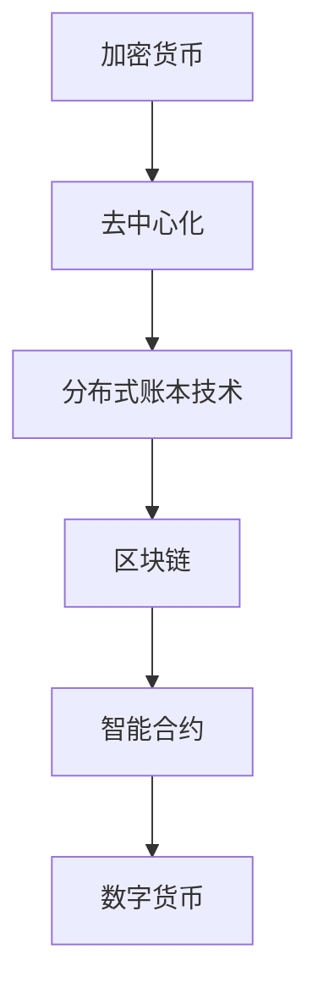

去中心化是加密货币最显著的特征之一，它通过分布式账本技术实现了交易记录的公开透明。区块链技术则确保了账本的安全性和不可篡改性。智能合约是一种自动执行的合同，它进一步增强了加密货币的实用性。

#### 1.2 共识算法的重要性

共识算法在加密货币中起着至关重要的作用。它是一种分布式系统中的算法，用于确保多个节点在网络中对某些事务达成一致。在加密货币网络中，共识算法不仅决定了网络的安全性和效率，还直接影响着货币的价值和信任机制。

**核心概念与联系**：

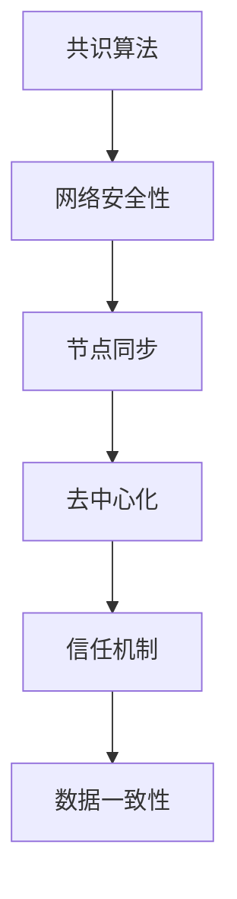

网络安全性是共识算法的首要目标。通过确保节点之间的通信安全和交易记录的完整性，共识算法防止了恶意攻击和数据篡改。节点同步是指不同节点之间如何达成一致的机制，它是保持网络稳定运行的关键。去中心化确保了网络不受单一实体控制，从而增强了网络的抗攻击能力。信任机制则是共识算法的核心，它通过算法确保了交易的可信性。数据一致性则保证了整个网络的可靠性和一致性。

#### 1.3 数学基础

加密货币中的许多核心概念和技术都离不开数学基础的支持。密码学是加密货币的核心，它利用数学原理来保护交易的安全性和隐私性。以下是一些关键的数学概念：

- **哈希函数**：哈希函数是一种将任意长度的输入数据映射为固定长度输出数据的函数。在加密货币中，哈希函数用于确保交易记录的唯一性和不可篡改性。

- **数字签名**：数字签名是一种使用公钥加密和私钥解密的方法，用于验证交易的真实性和完整性。

- **椭圆曲线加密**：椭圆曲线加密（ECC）是一种强大的加密算法，它利用椭圆曲线的数学特性来实现高效的安全通信。

- **对称加密**：对称加密是一种加密和解密使用相同密钥的加密算法，如AES。

- **非对称加密**：非对称加密是一种加密和解密使用不同密钥的加密算法，如RSA。

**核心概念与联系**：

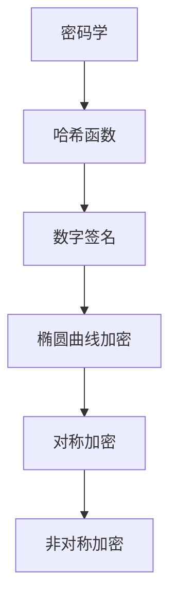

这些数学概念为加密货币提供了强大的安全保障，使得交易记录在公开透明的区块链上依然保持高度的安全性和隐私性。

#### 1.4 本书结构安排

本书将围绕加密货币的共识算法这一核心主题展开，分为以下几个部分：

- **引言与背景介绍**：介绍加密货币和共识算法的基本概念和重要性。
- **加密货币基础**：回顾加密货币的历史、工作原理、安全性和未来发展趋势。
- **共识算法概述**：介绍共识算法的定义、分类、优缺点分析以及网络安全性。
- **数学基础**：深入探讨密码学在加密货币中的应用，包括哈希函数、数字签名、椭圆曲线加密等。
- **共识算法原理**：详细讲解各种共识算法的原理、工作流程和优缺点。
- **共识算法实现**：通过伪代码和数学模型来阐述共识算法的具体实现。
- **共识算法案例分析**：分析实际案例中的共识算法应用，包括开发环境搭建、源代码实现和代码解读。
- **未来发展趋势与展望**：探讨加密货币和共识算法的未来发展方向和潜在挑战。

通过以上结构，本书旨在为读者提供全面、系统的共识算法学习资源，帮助读者深入理解和掌握这一关键技术。### 第一部分：引言与背景介绍

#### 1.1 加密货币概述

加密货币，作为一种数字资产，其最显著的特征在于去中心化和安全性。去中心化意味着加密货币的交易记录不是由某个中央机构来验证和记录，而是通过一个分布式网络来完成。这种分布式网络通常被称为区块链，它确保了交易记录的公开透明且不可篡改。安全性则源于密码学原理，包括哈希函数、数字签名和椭圆曲线加密等，这些技术共同构成了加密货币的安全框架。

**核心概念与联系**：


**去中心化**是加密货币的核心概念，它通过分布式账本技术实现了交易记录的公开透明。区块链技术则确保了账本的安全性和不可篡改性。智能合约是一种自动执行的合同，它进一步增强了加密货币的实用性。数字货币是加密货币的另一种称呼，它涵盖了所有使用密码学原理来保护交易安全的数字资产。

#### 1.2 共识算法的重要性

共识算法在加密货币网络中扮演着至关重要的角色。它是一种分布式系统中的算法，用于确保多个节点在网络中对某些事务达成一致。在加密货币网络中，共识算法不仅决定了网络的安全性和效率，还直接影响着货币的价值和信任机制。

**核心概念与联系**：


网络安全性是共识算法的首要目标。通过确保节点之间的通信安全和交易记录的完整性，共识算法防止了恶意攻击和数据篡改。节点同步是指不同节点之间如何达成一致的机制，它是保持网络稳定运行的关键。去中心化确保了网络不受单一实体控制，从而增强了网络的抗攻击能力。信任机制则是共识算法的核心，它通过算法确保了交易的可信性。数据一致性则保证了整个网络的可靠性和一致性。

#### 1.3 数学基础

加密货币中的许多核心概念和技术都离不开数学基础的支持。密码学是加密货币的核心，它利用数学原理来保护交易的安全性和隐私性。以下是一些关键的数学概念：

- **哈希函数**：哈希函数是一种将任意长度的输入数据映射为固定长度输出数据的函数。在加密货币中，哈希函数用于确保交易记录的唯一性和不可篡改性。

- **数字签名**：数字签名是一种使用公钥加密和私钥解密的方法，用于验证交易的真实性和完整性。

- **椭圆曲线加密**：椭圆曲线加密（ECC）是一种强大的加密算法，它利用椭圆曲线的数学特性来实现高效的安全通信。

- **对称加密**：对称加密是一种加密和解密使用相同密钥的加密算法，如AES。

- **非对称加密**：非对称加密是一种加密和解密使用不同密钥的加密算法，如RSA。

**核心概念与联系**：


这些数学概念为加密货币提供了强大的安全保障，使得交易记录在公开透明的区块链上依然保持高度的安全性和隐私性。

#### 1.4 本书结构安排

本书将围绕加密货币的共识算法这一核心主题展开，分为以下几个部分：

- **引言与背景介绍**：介绍加密货币和共识算法的基本概念和重要性。
- **加密货币基础**：回顾加密货币的历史、工作原理、安全性和未来发展趋势。
- **共识算法概述**：介绍共识算法的定义、分类、优缺点分析以及网络安全性。
- **数学基础**：深入探讨密码学在加密货币中的应用，包括哈希函数、数字签名、椭圆曲线加密等。
- **共识算法原理**：详细讲解各种共识算法的原理、工作流程和优缺点。
- **共识算法实现**：通过伪代码和数学模型来阐述共识算法的具体实现。
- **共识算法案例分析**：分析实际案例中的共识算法应用，包括开发环境搭建、源代码实现和代码解读。
- **未来发展趋势与展望**：探讨加密货币和共识算法的未来发展方向和潜在挑战。

通过以上结构，本书旨在为读者提供全面、系统的共识算法学习资源，帮助读者深入理解和掌握这一关键技术。

### 第二部分：加密货币基础

#### 2.1 加密货币的历史与演变

加密货币的概念最早可以追溯到1998年，当时一位名为中本聪的匿名人物发布了名为《比特币：一种点对点的电子现金系统》的论文。这篇论文介绍了比特币的原理和设计，标志着加密货币的诞生。比特币作为第一个加密货币，迅速引起了全球的关注和讨论。

**核心概念与联系**：

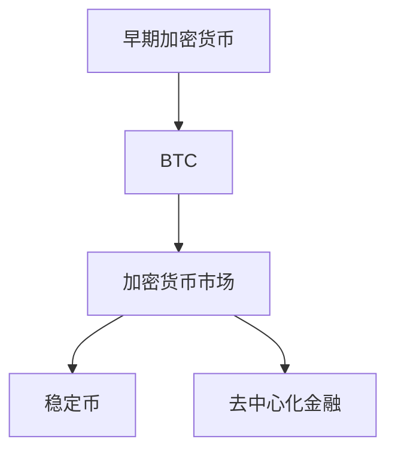

早期加密货币以比特币为代表，经历了从概念验证到实际应用的转变。随着比特币的成功，越来越多的加密货币被创建出来，形成了如今的加密货币市场。稳定币是一种价值相对稳定的加密货币，其目的是减少市场价格波动，如泰达币（USDT）和美元稳定币（DAI）。去中心化金融（DeFi）则是在加密货币基础上发展起来的一种新型金融模式，它通过智能合约实现了金融服务的去中心化，进一步扩展了加密货币的应用场景。

#### 2.2 加密货币的工作原理

加密货币的工作原理涉及多个关键组件，包括钱包、公钥、私钥、地址生成和交易流程。钱包是用户存储和管理加密货币的软件，它生成并存储用户的公钥和私钥。公钥和私钥是一对密钥，用于确保交易的安全性和隐私性。公钥用于接收加密货币，而私钥用于签名和验证交易。

**核心概念与联系**：

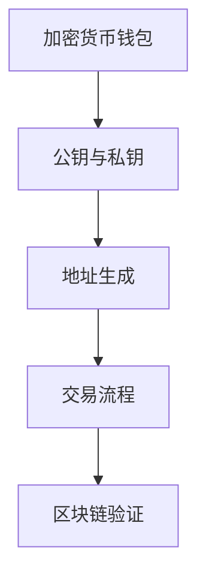

地址生成是通过公钥计算得到的，每个地址都对应一个唯一的公钥。交易流程包括创建交易、签名、广播和验证。用户使用私钥对交易进行签名，确保交易来源的合法性。交易在区块链上广播并被多个节点验证，以确保交易的有效性和安全性。区块链验证是指交易记录被写入区块链的过程，这是一个去中心化的过程，确保了数据的不可篡改性。

#### 2.3 加密货币的安全性

加密货币的安全性依赖于密码学原理，包括哈希函数、数字签名和加密算法等。哈希函数用于确保交易记录的唯一性和不可篡改性，数字签名用于验证交易的真实性和完整性，而加密算法则用于保护交易数据的隐私性。

**核心概念与联系**：

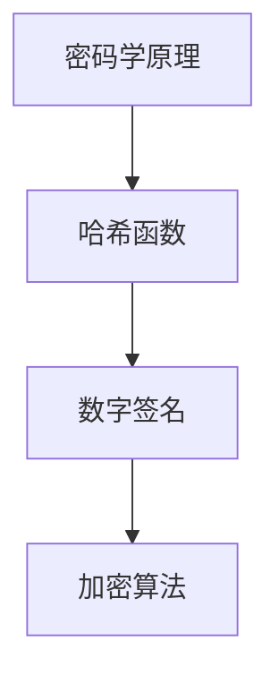

哈希函数将任意长度的输入数据映射为固定长度的哈希值，这使得任何对数据的更改都能通过哈希值的变化被检测到。数字签名是一种使用公钥加密和私钥解密的方法，它确保了交易数据的来源和完整性。加密算法包括对称加密和非对称加密，对称加密使用相同的密钥进行加密和解密，而非对称加密则使用不同的密钥进行加密和解密，这种特性使得交易数据在传输过程中更加安全。

#### 2.4 加密货币的未来发展

加密货币的未来发展充满了无限的可能性。一方面，随着技术的不断进步，加密货币的安全性和效率将得到进一步提升。另一方面，政策和法规的逐步完善也将为加密货币的合法化和广泛应用奠定基础。

**核心概念与联系**：

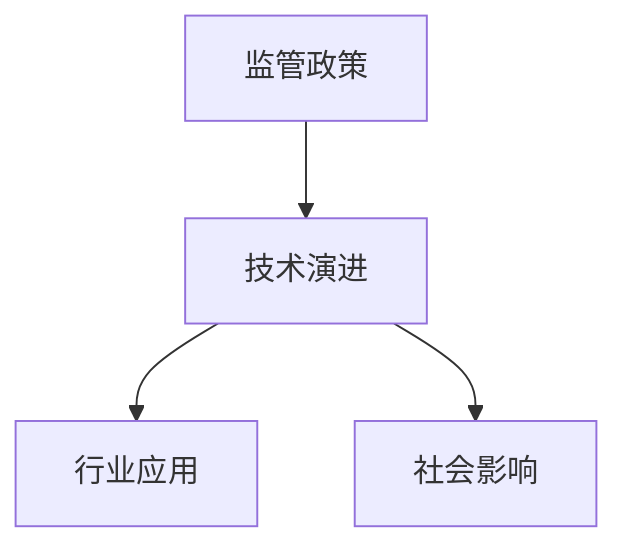

监管政策是加密货币发展的重要驱动力，它确保了加密货币市场的健康和可持续发展。技术演进则是加密货币不断进步的根本，通过改进共识算法、增强网络安全性和提升交易效率，加密货币将更好地满足市场需求。行业应用是加密货币发展的一个重要方向，从支付到金融，再到供应链管理，加密货币正在逐渐渗透到各个领域。社会影响则是加密货币发展带来的深层次变革，它不仅改变了传统金融体系，还影响了社会的信任机制和经济模式。

通过上述内容，我们可以看到加密货币的基础知识是如何构建的。接下来，我们将进一步探讨共识算法的概念、分类以及其在加密货币网络中的重要性。### 第三部分：共识算法概述

#### 3.1 共识算法的定义与分类

共识算法是分布式系统中的一种算法，用于确保多个节点在网络中对某些事务达成一致。在加密货币网络中，共识算法的核心目标是确保交易记录的准确性和一致性，从而维护网络的稳定性和安全性。

**核心概念与联系**：

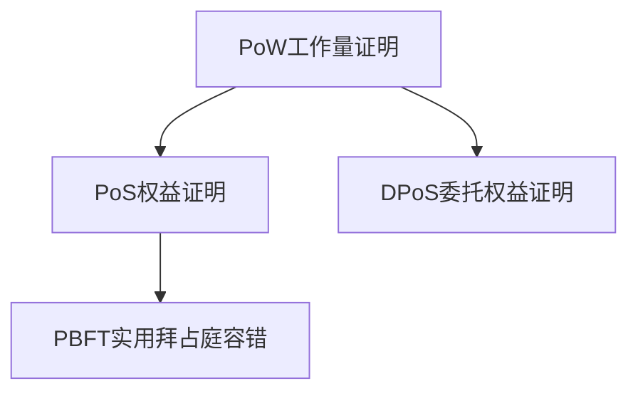

工作量证明（Proof of Work，PoW）是最早的共识算法之一，它通过计算复杂的数学问题来验证交易的有效性。权益证明（Proof of Stake，PoS）则通过持有货币的数量和时间来决定谁有权生成新的区块。委托权益证明（Delegated Proof of Stake，DPoS）是PoS的一种改进，通过选举代表来生成区块。实用拜占庭容错算法（Practical Byzantine Fault Tolerance，PBFT）则是一种容错性强的共识算法，适用于高负载和高并发的场景。

#### 3.2 共识算法的优缺点分析

各种共识算法都有其独特的优势和局限性。以下是对几种主要共识算法的优缺点分析：

**工作量证明（PoW）**：

- **优点**：高度去中心化，安全性高。
- **缺点**：计算资源消耗大，能源消耗高，网络延迟较大。

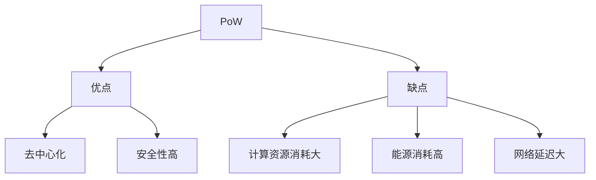

**权益证明（PoS）**：

- **优点**：能源消耗低，交易速度快。
- **缺点**：可能导致“富者愈富”的问题，安全性相对较低。

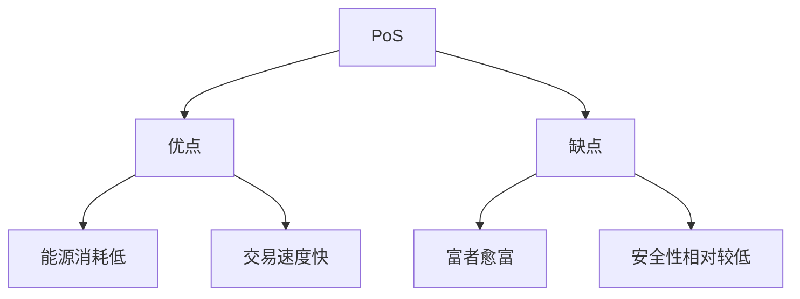

**委托权益证明（DPoS）**：

- **优点**：交易速度更快，效率更高。
- **缺点**：中心化风险较高，选举机制可能存在漏洞。

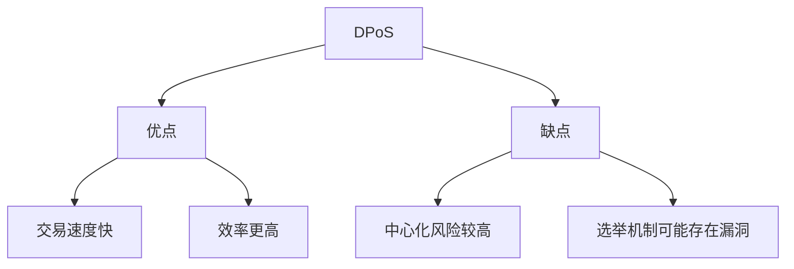

**实用拜占庭容错算法（PBFT）**：

- **优点**：高容错性，低延迟，高效。
- **缺点**：高度中心化，不适合大规模去中心化网络。

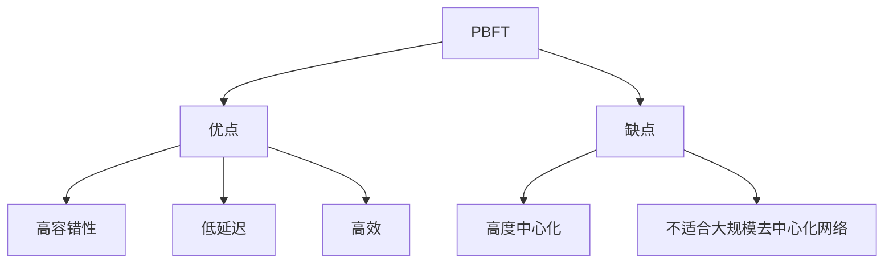

#### 3.3 加密货币网络的安全性

加密货币网络的安全性取决于多个因素，包括共识算法的设计、网络节点的安全性以及加密技术的应用。共识算法的设计决定了网络能否有效地防止恶意攻击和数据篡改。网络节点的安全性则关系到整个网络的稳定性和可靠性。加密技术则用于保护交易数据的隐私性和完整性。

**核心概念与联系**：

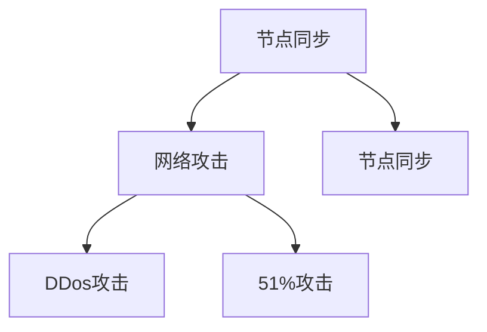

节点同步是确保网络一致性的关键，任何同步问题都可能引发网络攻击。分布式拒绝服务（DDos）攻击是一种常见的网络攻击方式，它通过大量虚假请求使网络节点过载，从而导致网络瘫痪。51%攻击则是指攻击者控制网络中超过50%的节点，从而操纵网络交易记录。

综上所述，共识算法在加密货币网络中起着至关重要的作用。通过合理选择和设计共识算法，可以提高网络的安全性、稳定性和效率。接下来，我们将深入探讨密码学在加密货币中的应用，包括哈希函数、数字签名和椭圆曲线加密等。### 第三部分：数学基础

#### 3.1 哈希函数

哈希函数是一种将任意长度的输入数据映射为固定长度输出数据的函数。在加密货币中，哈希函数被广泛用于确保交易记录的唯一性和不可篡改性。常见的哈希函数包括SHA-256和SHA-3。

**哈希函数的工作原理**：

哈希函数接收任意长度的输入（称为"消息"），并输出一个固定长度的字符串（称为"哈希值"）。哈希值具有以下特性：

1. **单向性**：哈希函数是单向的，即无法通过哈希值反推出原始消息。
2. **抗碰撞性**：两个不同的输入数据产生相同哈希值的概率极低。
3. **确定性**：相同的输入数据总是产生相同的哈希值。

**伪代码**：

```python
def hash_function(message):
    # 假设使用SHA-256哈希函数
    return hashlib.sha256(message.encode()).hexdigest()
```

**数学模型**：

哈希函数可以表示为 $H(x)$，其中 $x$ 是输入消息，$H(x)$ 是输出哈希值。对于SHA-256，其数学模型可以表示为：

$$
H(x) = \text{SHA-256}(x)
$$

**举例说明**：

假设我们有一个消息 "Hello, World！"，使用SHA-256哈希函数计算其哈希值：

$$
H("Hello, World！") = \text{SHA-256}("Hello, World！".encode()) = "a592cf82..." 
$$

#### 3.2 数字签名

数字签名是一种用于验证交易真实性和完整性的技术，它通过公钥加密和私钥解密实现。常见的数字签名算法包括RSA和ECDSA。

**数字签名的工作原理**：

数字签名过程包括以下几个步骤：

1. **生成密钥对**：用户生成一对密钥，包括公钥和私钥。
2. **签名**：用户使用私钥对消息进行签名，生成签名。
3. **验证**：接收方使用公钥验证签名，以确认消息的真实性和完整性。

**伪代码**：

```python
def sign(message, private_key):
    # 使用RSA算法进行签名
    return private_key.sign(message.encode())

def verify(message, signature, public_key):
    # 使用RSA算法进行验证
    return public_key.verify(signature, message.encode())
```

**数学模型**：

数字签名可以表示为 $S = sign(m, sk)$，其中 $m$ 是消息，$sk$ 是私钥，$S$ 是签名。对于RSA，其数学模型可以表示为：

$$
S = \text{RSA\_sign}(m, sk)
$$

**举例说明**：

假设用户Alice有一个RSA密钥对，私钥为 $sk$，公钥为 $pk$。她要发送一条消息 "Hello, Bob！" 给Bob。Alice使用私钥对消息进行签名：

$$
S = sk.sign("Hello, Bob！".encode())
$$

Bob收到消息后，使用Alice的公钥进行验证：

$$
\text{verify}("Hello, Bob！", S, pk) \rightarrow \text{True}
$$

#### 3.3 椭圆曲线加密

椭圆曲线加密（ECC）是一种基于椭圆曲线数学特性的加密算法，它提供了比传统RSA加密更高的安全性和更高效的性能。

**椭圆曲线加密的工作原理**：

椭圆曲线加密过程包括以下几个步骤：

1. **生成密钥对**：用户生成一对椭圆曲线密钥，包括公钥和私钥。
2. **加密**：发送方使用公钥对消息进行加密。
3. **解密**：接收方使用私钥对加密消息进行解密。

**伪代码**：

```python
def encrypt(message, public_key):
    # 使用ECC算法进行加密
    return public_key.encrypt(message.encode())

def decrypt(ciphertext, private_key):
    # 使用ECC算法进行解密
    return private_key.decrypt(ciphertext)
```

**数学模型**：

椭圆曲线加密可以表示为 $C = encrypt(m, pk)$，其中 $m$ 是消息，$pk$ 是公钥，$C$ 是加密消息。对于ECC，其数学模型可以表示为：

$$
C = \text{ECC\_encrypt}(m, pk)
$$

**举例说明**：

假设用户Alice有一个ECC密钥对，私钥为 $sk$，公钥为 $pk$。她要发送一条消息 "Hello, Bob！" 给Bob。Alice使用公钥对消息进行加密：

$$
C = pk.encrypt("Hello, Bob！".encode())
$$

Bob收到加密消息后，使用私钥进行解密：

$$
m = sk.decrypt(C)
$$

通过上述对哈希函数、数字签名和椭圆曲线加密的详细解释和举例，我们可以看到密码学在加密货币中的关键作用。接下来，我们将深入探讨共识算法的具体原理、实现方式和应用场景。### 第四部分：共识算法原理

#### 4.1 工作量证明（PoW）算法原理

工作量证明（Proof of Work，PoW）是最早的共识算法之一，由中本聪在比特币中提出。其核心思想是通过计算复杂的数学问题来验证交易的有效性，从而确保网络的安全性和一致性。

**工作流程**：

1. **交易验证**：节点首先对网络中的交易进行验证，确保交易的有效性，如检查交易金额、签名等。
2. **区块构建**：节点从网络中收集经过验证的交易，构建一个新的区块。
3. **nonce选择**：节点需要找到合适的随机数（nonce），使得区块的哈希值满足特定的条件（如小于目标值）。
4. **区块广播**：一旦找到合适的nonce，节点将新区块广播到网络中。
5. **区块验证**：网络中的其他节点验证新区块的有效性，并添加到自己的区块链上。

**伪代码**：

```python
def mine_block(prev_hash, transactions, difficulty):
    nonce = 0
    while True:
        hash = calculate_hash(prev_hash, transactions, nonce)
        if hash < difficulty:
            return nonce, hash
        nonce += 1
```

**数学模型**：

PoW的数学模型可以表示为：

$$
\text{PoW}(H(T, N)) = H(T, N) < D
$$

其中，$H$ 是哈希函数，$T$ 是交易数据，$N$ 是nonce，$D$ 是目标值。

**举例说明**：

假设当前区块的交易数据为 "Transaction1, Transaction2"，目标值为 "0x1d00ffff"。节点需要找到一个nonce，使得区块的哈希值小于目标值。通过不断尝试，节点找到nonce=10000时，哈希值为 "0x1d00ffef"，满足条件，新区块生成成功。

#### 4.2 权益证明（PoS）算法原理

权益证明（Proof of Stake，PoS）算法是一种替代PoW的共识算法，其核心思想是根据节点持有的货币数量和时间来决定谁有权生成新的区块。

**工作流程**：

1. **节点选择**：根据节点持有的货币数量和时间，选择具有最高权益的节点作为下一个区块的生成者。
2. **区块构建**：选定的节点从网络中收集交易，构建一个新的区块。
3. **区块验证**：其他节点验证新区块的有效性，并添加到自己的区块链上。

**伪代码**：

```python
def select_validator(stake_pool):
    max_stake = max(stake_pool.values())
    return [validator for validator, stake in stake_pool.items() if stake == max_stake][0]
```

**数学模型**：

PoS的数学模型可以表示为：

$$
P(\text{validator} = v) \propto \text{stake}_v
$$

其中，$P(\text{validator} = v)$ 表示节点 $v$ 成为验证者的概率，$\text{stake}_v$ 表示节点 $v$ 的权益。

**举例说明**：

假设有两个节点Alice和Bob，他们的权益分别为100和200。根据PoS算法，Alice成为验证者的概率为 $\frac{100}{100+200} = \frac{1}{3}$，而Bob成为验证者的概率为 $\frac{200}{100+200} = \frac{2}{3}$。因此，Bob更有可能成为下一个区块的生成者。

#### 4.3 委托权益证明（DPoS）算法原理

委托权益证明（Delegated Proof of Stake，DPoS）算法是对PoS的一种改进，它通过选举代表来生成区块，从而提高网络的效率和可扩展性。

**工作流程**：

1. **选举代表**：节点通过投票选择代表，代表有权生成新的区块。
2. **区块构建**：代表节点从网络中收集交易，构建一个新的区块。
3. **区块验证**：其他节点验证新区块的有效性，并添加到自己的区块链上。

**伪代码**：

```python
def elect_representatives(voters):
    representatives = {}
    for voter in voters:
        representative = voters[voter]['selected_rep']
        representatives[representative] = representatives.get(representative, 0) + 1
    return [rep for rep, count in representatives.items() if count == max(representatives.values())]
```

**数学模型**：

DPoS的数学模型可以表示为：

$$
P(\text{representative} = r) \propto \sum_{voter \in V} \text{weight}_v(r)
$$

其中，$P(\text{representative} = r)$ 表示节点 $r$ 成为代表的概率，$\text{weight}_v(r)$ 表示节点 $v$ 对代表 $r$ 的投票权重。

**举例说明**：

假设有三个节点Alice、Bob和Charlie，他们的投票权重分别为10、15和20。如果Alice投票给Bob，Bob投票给Charlie，Charlie投票给Alice，则：

- Alice成为代表的概率为 $\frac{10}{10+15+20} = \frac{1}{3}$。
- Bob成为代表的概率为 $\frac{15}{10+15+20} = \frac{1}{2}$。
- Charlie成为代表的概率为 $\frac{20}{10+15+20} = \frac{2}{3}$。

因此，Charlie更有可能成为下一个区块的生成者。

通过以上对PoW、PoS和DPoS算法的详细解释，我们可以看到这些算法在确保网络安全性、稳定性和效率方面的不同实现方式和优缺点。接下来，我们将探讨这些算法的具体实现方式。### 第四部分：共识算法实现

#### 4.1 工作量证明（PoW）算法实现

工作量证明（PoW）算法的实现主要涉及两个核心过程：交易验证和区块构建。以下是一个简化的伪代码实现，展示了PoW算法的基本工作流程。

**交易验证**：

```python
def validate_transaction(transaction):
    if transaction['amount'] <= 0 or transaction['sender'] not in wallets or transaction['recipient'] not in wallets:
        return False
    if not verify_signature(transaction['signature'], transaction['sender'], transaction['message']):
        return False
    return True
```

**区块构建**：

```python
def mine_block(prev_block, transactions, difficulty):
    nonce = 0
    while True:
        block = {
            'index': prev_block['index'] + 1,
            'timestamp': current_timestamp(),
            'transactions': transactions,
            'prev_hash': prev_block['hash'],
            'nonce': nonce
        }
        block_hash = calculate_hash(block)
        if block_hash < difficulty:
            return block
        nonce += 1
```

**数学模型**：

在PoW算法中，我们需要计算一个满足以下条件的哈希值：

$$
H(B) < D
$$

其中，$H$ 是哈希函数，$B$ 是区块，$D$ 是目标值（通常是一个随难度调整的数值）。以下是计算区块哈希值的伪代码：

```python
def calculate_hash(block):
    block_string = json.dumps(block, sort_keys=True)
    return hash(block_string)
```

**举例说明**：

假设当前区块的 prev_hash 为 "0000000000000000000000000000000000000000000000000000000000000000"，交易列表为 [{ 'sender': 'Alice', 'recipient': 'Bob', 'amount': 10 }, ...]，目标值为 "0x1d00ffff"。节点开始寻找 nonce，使得区块的哈希值小于目标值。

通过不断尝试，节点找到 nonce=10000 时，区块哈希值为 "0x1d00ffef"，满足条件，新区块生成成功。

#### 4.2 权益证明（PoS）算法实现

权益证明（PoS）算法的实现相对PoW来说较为简单，因为它不涉及复杂的计算过程。以下是一个简化的伪代码实现，展示了PoS算法的基本工作流程。

**权益计算**：

```python
def calculate_stake(wallet):
    return wallet['balance'] * wallet['stake_per_coin']
```

**区块生成**：

```python
def generate_block(prev_block, transactions, validator):
    block = {
        'index': prev_block['index'] + 1,
        'timestamp': current_timestamp(),
        'transactions': transactions,
        'prev_hash': prev_block['hash'],
        'validator': validator
    }
    return block
```

**数学模型**：

在PoS算法中，我们需要根据节点的权益来选择区块生成者。权益可以用以下公式表示：

$$
E(v) = b \times \text{stake}_v
$$

其中，$E(v)$ 是节点 $v$ 的权益，$b$ 是区块奖励，$\text{stake}_v$ 是节点 $v$ 的权益。

**举例说明**：

假设有两个节点 Alice 和 Bob，他们的权益分别为 100 和 200。如果当前区块奖励为 10，那么：

- Alice 的权益为 $10 \times 100 = 1000$。
- Bob 的权益为 $10 \times 200 = 2000$。

根据权益比例，Bob更有可能被选为下一个区块的生成者。

#### 4.3 委托权益证明（DPoS）算法实现

委托权益证明（DPoS）算法的实现涉及到选举代表的步骤，以下是一个简化的伪代码实现，展示了DPoS算法的基本工作流程。

**选举代表**：

```python
def elect_representatives(voters):
    representatives = {}
    for voter in voters:
        representative = voters[voter]['selected_rep']
        representatives[representative] = representatives.get(representative, 0) + 1
    return [rep for rep, count in representatives.items() if count == max(representatives.values())]
```

**区块生成**：

```python
def generate_block(prev_block, transactions, representative):
    block = {
        'index': prev_block['index'] + 1,
        'timestamp': current_timestamp(),
        'transactions': transactions,
        'prev_hash': prev_block['hash'],
        'validator': representative
    }
    return block
```

**数学模型**：

在DPoS算法中，我们需要根据节点的投票权重来选择代表。投票权重可以用以下公式表示：

$$
W(v) = \sum_{voter \in V} \text{weight}_v(r)
$$

其中，$W(v)$ 是代表 $v$ 的投票权重，$\text{weight}_v(r)$ 是节点 $v$ 对代表 $r$ 的投票权重。

**举例说明**：

假设有三个节点 Alice、Bob 和 Charlie，他们的投票权重分别为 10、15 和 20。如果 Alice 投票给 Bob，Bob 投票给 Charlie，Charlie 投票给 Alice，则：

- Bob 的投票权重为 15。
- Charlie 的投票权重为 20。

根据投票权重比例，Charlie更有可能成为下一个区块的生成者。

通过上述实现，我们可以看到PoW、PoS和DPoS算法的具体实现方式。这些算法在不同的应用场景中都有其独特的优势，为加密货币网络提供了有效的共识机制。接下来，我们将通过实际案例分析来深入探讨这些算法的应用和效果。### 第五部分：共识算法案例分析

#### 5.1 比特币（PoW）案例分析

比特币（BTC）是第一个成功的加密货币，也是工作量证明（PoW）算法最著名的应用案例。以下是对比特币网络架构和共识算法的详细分析。

**比特币网络架构**：

比特币网络由成千上万的节点组成，每个节点都维护一个完整的区块链副本。节点通过发送和接收交易，以及参与区块的挖掘来维护网络的运行。

**共识算法实现**：

比特币使用SHA-256作为哈希函数，节点需要找到满足以下条件的随机数（nonce）：

$$
H(B) < D
$$

其中，$H$ 是SHA-256，$B$ 是区块，$D$ 是目标值。以下是一个简化的实现过程：

```python
def mine_block(transactions, prev_hash, difficulty):
    nonce = 0
    while True:
        block = {
            'index': blockchain.length(),
            'timestamp': current_timestamp(),
            'transactions': transactions,
            'prev_hash': prev_hash,
            'nonce': nonce
        }
        hash = calculate_hash(block)
        if hash < difficulty:
            return nonce, hash
        nonce += 1

def calculate_hash(block):
    block_string = json.dumps(block, sort_keys=True)
    return hashlib.sha256(block_string.encode()).hexdigest()
```

**代码解读**：

在`mine_block`函数中，我们使用循环不断尝试不同的nonce值，直到找到一个满足条件的哈希值。`calculate_hash`函数用于计算区块的哈希值。

**案例分析**：

比特币网络的PoW算法确保了区块链的安全性和一致性。通过计算复杂的数学问题，节点必须投入大量计算资源来挖掘新区块，这使得恶意节点难以控制网络。比特币网络的哈希难题调整机制使得随着时间推移，挖掘新区块变得越来越困难，从而控制了网络的扩展性和能源消耗。

#### 5.2 莱特币（PoW）案例分析

莱特币（LTC）是另一种成功的加密货币，也采用工作量证明（PoW）算法。以下是对莱特币网络架构和共识算法的详细分析。

**莱特币网络架构**：

莱特币网络与比特币网络类似，由多个节点组成，每个节点维护一个完整的区块链副本。节点通过发送和接收交易，以及参与区块的挖掘来维护网络的运行。

**共识算法实现**：

莱特币使用Scrypt算法作为哈希函数，节点需要找到满足以下条件的随机数（nonce）：

$$
H(B) < D
$$

其中，$H$ 是Scrypt，$B$ 是区块，$D$ 是目标值。以下是一个简化的实现过程：

```python
def mine_block(transactions, prev_hash, difficulty):
    nonce = 0
    while True:
        block = {
            'index': blockchain.length(),
            'timestamp': current_timestamp(),
            'transactions': transactions,
            'prev_hash': prev_hash,
            'nonce': nonce
        }
        hash = scrypt_hash(block)
        if hash < difficulty:
            return nonce, hash
        nonce += 1

def scrypt_hash(block):
    block_string = json.dumps(block, sort_keys=True)
    return scrypt.hash(block_string.encode(), salt, n, r, p)
```

**代码解读**：

在`mine_block`函数中，我们使用循环不断尝试不同的nonce值，直到找到一个满足条件的哈希值。`scrypt_hash`函数用于计算区块的哈希值，使用Scrypt算法。

**案例分析**：

莱特币的PoW算法与比特币类似，但采用Scrypt算法，使得挖掘过程更加公平，普通用户也能参与。Scrypt算法的内存消耗较高，这使得大型矿池难以垄断网络，从而保护了网络的去中心化特性。

#### 5.3 柯达币（PoS）案例分析

柯达币（KDA）是一种采用权益证明（PoS）算法的加密货币。以下是对柯达币网络架构和共识算法的详细分析。

**柯达币网络架构**：

柯达币网络由多个节点组成，每个节点维护一个完整的区块链副本。节点通过持有和锁定柯达币来获得生成区块的权益。

**共识算法实现**：

柯达币使用PoS算法来选择区块生成者。节点根据其持有的柯达币数量和锁定时间来计算权益。以下是一个简化的实现过程：

```python
def calculate_stake(wallet):
    return wallet['balance'] * wallet['stake_per_coin']

def generate_block(prev_block, transactions, validator):
    block = {
        'index': prev_block['index'] + 1,
        'timestamp': current_timestamp(),
        'transactions': transactions,
        'prev_hash': prev_block['hash'],
        'validator': validator
    }
    return block

def select_validator(stake_pool):
    max_stake = max(stake_pool.values())
    return [validator for validator, stake in stake_pool.items() if stake == max_stake][0]
```

**代码解读**：

在`calculate_stake`函数中，我们根据节点持有的柯达币数量和锁定时间计算权益。`generate_block`函数用于生成新的区块。`select_validator`函数用于选择具有最高权益的节点作为区块生成者。

**案例分析**：

柯达币的PoS算法通过权益来选择区块生成者，减少了计算资源的消耗，提高了网络的效率。由于生成区块的权益与持有柯达币数量成正比，这鼓励了长期持有和投资柯达币，从而稳定了货币的价值。

通过上述案例分析，我们可以看到PoW和PoS算法在比特币、莱特币和柯达币中的应用和效果。这些案例不仅展示了共识算法的实现细节，还揭示了它们在保持网络安全性、稳定性和效率方面的优势。### 未来发展趋势与展望

随着加密货币和区块链技术的不断发展和成熟，共识算法在未来的发展趋势和潜在挑战方面也展现出了诸多可能性。以下是一些关键趋势和挑战：

#### 5.1 未来发展趋势

1. **共识算法的多样性与优化**：现有的共识算法如PoW、PoS和DPoS都在不断优化和改进，以应对网络规模扩大、交易速度提升和安全性增强的需求。例如，一些新型共识算法如BFT（拜占庭容错算法）和SBFT（简化拜占庭容错算法）被提出，以解决大规模去中心化网络中的性能和容错问题。

2. **跨链技术的融合**：随着多种加密货币和区块链网络的出现，跨链技术变得越来越重要。共识算法的发展将推动不同区块链网络之间的互操作性，实现资产和信息的无缝转移和共享。

3. **去中心化自治组织（DAO）**：去中心化自治组织利用区块链技术和智能合约来实现自我治理和决策。共识算法在DAO中的应用将进一步推动去中心化金融（DeFi）和社交网络的发展。

4. **隐私保护和安全性提升**：随着隐私保护和安全性要求的提高，未来的共识算法将更加注重保护用户隐私和提升网络安全性。例如，零知识证明（ZKP）和环签名等技术有望在共识算法中得到更广泛的应用。

5. **量子计算的影响**：随着量子计算技术的发展，现有的加密算法面临被量子计算机破解的威胁。未来的共识算法需要考虑量子计算的影响，采用抗量子攻击的加密技术来保护区块链网络的安全。

#### 5.2 潜在挑战

1. **扩展性和性能**：随着区块链网络的不断扩大，如何提高交易速度和处理能力成为一个重要挑战。现有的共识算法在处理大规模交易时可能会出现性能瓶颈，需要不断优化和改进。

2. **去中心化程度的平衡**：过度去中心化可能导致网络性能下降和安全问题，而过度集中化则可能导致中央控制的风险。如何在去中心化和集中化之间找到平衡点是一个关键挑战。

3. **监管和政策合规**：加密货币和区块链技术的快速发展引起了各国监管机构的关注。如何确保共识算法符合法律法规，同时保持网络的去中心化和开放性是一个重要议题。

4. **网络安全和攻击防范**：共识算法需要不断升级和改进以应对各种网络攻击，如DDoS攻击、51%攻击和双花攻击等。确保网络的安全性和稳定性是共识算法持续发展的关键。

5. **用户接受度和普及度**：尽管加密货币和区块链技术具有巨大潜力，但其普及度仍然有限。提高用户接受度和普及度需要解决技术复杂度、用户体验和安全问题等方面的挑战。

综上所述，未来共识算法的发展将面临诸多机遇和挑战。通过技术创新、跨链协作、政策合规和用户教育等多方面的努力，共识算法有望在保持网络安全性、稳定性和效率的同时，推动加密货币和区块链技术的进一步发展和普及。### 总结

本文围绕加密货币的共识算法进行了全面深入的探讨。我们从引言和背景介绍开始，详细介绍了加密货币的基本概念、工作原理、安全性和未来发展趋势。随后，我们分析了共识算法的定义、分类、优缺点，以及数学基础，包括哈希函数、数字签名和椭圆曲线加密等。接着，我们深入讲解了工作量证明（PoW）、权益证明（PoS）、委托权益证明（DPoS）等共识算法的原理、实现和应用案例。通过这些内容的讲解，我们不仅对共识算法有了全面的认识，还了解到了其在加密货币网络中的重要性。

共识算法是确保加密货币网络安全、稳定和高效运行的核心机制。PoW算法通过计算复杂性问题来保证网络安全性，但存在能源消耗高、计算资源浪费等问题；PoS算法通过持有货币的数量和时间来选择区块生成者，提高了网络效率，但可能导致“富者愈富”的问题；DPoS算法通过选举代表来生成区块，进一步提高了网络效率，但存在中心化风险。尽管每种算法都有其局限性，但通过不断创新和优化，共识算法在加密货币网络中发挥着越来越重要的作用。

展望未来，共识算法将继续面临扩展性、性能、安全性和合规性等方面的挑战。随着区块链技术的不断发展，新型共识算法如BFT、SBFT等有望解决现有算法的瓶颈，实现更高的性能和安全性。同时，跨链技术的融合和去中心化自治组织（DAO）的应用将推动共识算法在更广泛的领域发挥作用。

本文旨在为读者提供一个全面、系统的共识算法学习资源，帮助读者深入理解和掌握这一关键技术。在撰写过程中，我们力求用通俗易懂的语言和简洁明了的伪代码、数学模型来阐述复杂的概念和原理。希望本文能为广大读者提供有价值的参考，激发对加密货币和区块链技术的进一步兴趣和研究。

最后，感谢读者对本文章的关注和支持。如果您对共识算法有任何疑问或见解，欢迎在评论区留言交流。让我们一起探索加密货币和区块链技术的无限可能！### 拓展阅读

为了更深入地了解加密货币的共识算法及其应用，以下是几篇推荐的拓展阅读资料：

1. **《密码学：理论与实践》** - authors: Douglas R. Stinson
   - 本书详细介绍了密码学的基本概念和原理，包括哈希函数、数字签名和椭圆曲线加密等，为理解加密货币的数学基础提供了坚实的基础。

2. **《区块链技术指南》** - author: Daniel Drescher
   - 本书系统地介绍了区块链技术的基本概念、架构和实现，包括共识算法的详细分析，对了解加密货币网络的工作原理非常有帮助。

3. **《智能合约：设计、实现与部署》** - authors: Andreas M. Antonopoulos and Gavin Andrade
   - 本书深入探讨了智能合约的设计、实现和部署，涵盖了以太坊等区块链平台的智能合约应用，对理解加密货币的智能合约机制有重要指导意义。

4. **《比特币：一种点对点的电子现金系统》** - author: Satoshi Nakamoto
   - 这篇著名的论文首次提出了比特币的概念和设计，详细阐述了工作量证明（PoW）算法的原理和实现，是加密货币的基石文献。

5. **《区块链的未来：技术、应用与影响》** - author: Alex Tapscott and Don Tapscott
   - 本书从技术、应用和社会影响等多个角度探讨了区块链的未来发展趋势，对理解加密货币和共识算法的潜在影响提供了广阔的视野。

6. **《加密货币：一场数字货币的革命》** - author: Andreas M. Antonopoulos
   - 本书系统地介绍了加密货币的历史、现状和未来，包括各种共识算法的分析，对了解加密货币的宏观发展有着重要的参考价值。

通过阅读这些资料，读者可以更深入地了解加密货币的共识算法，探索其在不同应用场景中的潜在价值。希望这些拓展阅读能够为您的学习与研究提供有益的参考。### 最佳实践 tips

在设计和实现加密货币共识算法时，以下是一些最佳实践和注意事项，可以帮助您提高系统的安全性和稳定性：

1. **安全审计与测试**：在发布共识算法前，进行彻底的安全审计和测试是非常重要的。通过漏洞扫描、代码审查和模拟攻击等手段，可以及时发现和修复潜在的安全问题。

2. **加密算法的选择**：选择合适的加密算法对于共识算法的安全性至关重要。应使用经过充分验证且抗量子攻击的加密算法，如椭圆曲线加密（ECC）和格密码学。

3. **共识算法的透明度**：确保共识算法的设计和实现过程具有透明性，公开算法的细节和参数，以便社区成员可以进行审查和反馈，提高算法的可靠性。

4. **去中心化的节点分布**：确保共识算法在分布式网络中的节点分布是均匀且去中心化的。这样可以防止网络受到单一实体或集中化攻击的影响。

5. **抵抗DDoS攻击**：设计共识算法时，需要考虑如何抵抗分布式拒绝服务（DDoS）攻击。可以通过增加网络容错机制、限制恶意流量和动态调整网络参数等方式来提高网络的抗攻击能力。

6. **合理的权益分配**：在PoS和DPoS算法中，权益分配的公平性对于系统的稳定性和安全性至关重要。应设计合理的权益分配机制，避免富者愈富的现象。

7. **可扩展性和性能优化**：随着区块链网络的不断扩大，共识算法需要具备良好的可扩展性。通过优化数据结构、算法效率和网络协议，可以提高系统的性能和吞吐量。

8. **合规性和政策遵从**：在设计和实现共识算法时，需要考虑到相关的法律法规和政策要求，确保算法的合规性，避免潜在的法律风险。

9. **用户教育和意识提升**：提高用户对加密货币和共识算法的理解和认知，有助于减少恶意行为和网络安全风险。通过社区教育和宣传，提升用户的安全意识和操作技能。

遵循这些最佳实践，可以有效提高加密货币共识算法的安全性和稳定性，确保网络的健康发展和用户信任。### 小结

通过本文的详细探讨，我们全面了解了加密货币共识算法的基本概念、工作原理、实现方式和实际应用。共识算法是确保加密货币网络安全性、稳定性和效率的关键机制。我们分析了工作量证明（PoW）、权益证明（PoS）、委托权益证明（DPoS）等主要共识算法，并通过实际案例展示了它们在比特币、莱特币和柯达币中的应用。

共识算法在加密货币网络中发挥着至关重要的作用，其设计直接影响到网络的安全性和性能。随着区块链技术的不断发展和应用场景的扩展，共识算法也在不断优化和创新。未来，新型共识算法如BFT、SBFT等有望解决现有算法的瓶颈，推动加密货币网络向更高性能、更安全、更去中心化的方向发展。

同时，我们也注意到共识算法在扩展性、去中心化、合规性等方面仍面临诸多挑战。这些挑战需要通过技术创新、政策合规、用户教育等多方面的努力来解决。

总之，加密货币共识算法是区块链技术的重要基石，对整个加密货币生态系统的发展具有深远的影响。通过不断的研究和改进，我们可以期待共识算法在未来的发展中发挥更大的作用，为去中心化的数字世界带来更多可能性。### 注意事项

在设计和实施加密货币共识算法时，以下几点注意事项至关重要：

1. **安全性和隐私性**：确保算法在保护用户交易隐私的同时，能有效防止网络攻击和数据篡改。使用强加密算法和安全的密钥管理策略。

2. **去中心化**：避免算法过于依赖中心化实体，确保节点分布均匀，以防止网络被单一实体控制或操纵。

3. **性能和可扩展性**：优化算法以处理高负载和大量交易，确保网络的高效性和可扩展性，避免性能瓶颈。

4. **合规性**：确保算法符合相关法律法规和政策要求，以避免法律风险和监管问题。

5. **容错性和健壮性**：设计算法时要考虑可能的故障和攻击场景，确保系统能够在异常情况下保持稳定运行。

6. **代码审计和测试**：对算法代码进行全面的审计和测试，以发现并修复潜在的安全漏洞和缺陷。

7. **透明度和社区参与**：保持算法设计的透明度，鼓励社区参与和反馈，以提高算法的可靠性和公信力。

遵循这些注意事项，可以有效提高共识算法的安全性和稳定性，为加密货币网络的发展奠定坚实基础。### 拓展阅读

为了进一步深入了解加密货币的共识算法，以下是几篇推荐的专业文章和书籍：

1. **论文**：
   - **"Bitcoin: A Peer-to-Peer Electronic Cash System"** by Satoshi Nakamoto
     - 这是比特币的原始论文，详细阐述了比特币的工作原理和PoW共识算法。
   - **"The Bitcoin 2020 White Paper"** by Naval Ravikant and Chris Burniske
     - 这篇论文探讨了比特币的未来发展，包括共识算法的长期影响。

2. **书籍**：
   - **"Cryptocurrency: A Practical Guide to Bitcoin and Altcoins"** by David Y. Shapiro
     - 本书涵盖了加密货币的基本概念，包括共识算法和技术细节。
   - **"The Basics of Bitcoin and Blockchain Technology"** by Don and Alex Tapscott
     - 这本书详细介绍了比特币和区块链技术，包括共识算法的原理和实现。

3. **专业文章**：
   - **"Proof of Stake vs. Proof of Work: Understanding the Differences"** by CoinDesk
     - 这篇文章对比了PoS和PoW算法，分析了它们的优势和劣势。
   - **"Understanding Proof of Authority: The Third Way in Consensus"** by ConsenSys
     - 这篇文章介绍了PoA共识算法，探讨了其在区块链应用中的潜在优势。

4. **网站和博客**：
   - **"Blockchain Evangelist"** by Andreas M. Antonopoulos
     - 安德拉斯·安东波鲁斯（Andreas M. Antonopoulos）的博客，提供了大量关于区块链和加密货币的专业文章。
   - **"CoinDesk"** (coindesk.com)
     - CoinDesk是一家知名的区块链媒体，提供最新的行业新闻、分析文章和深度报道。

通过阅读这些专业资料，您可以获得关于加密货币共识算法的更深入理解，并跟踪该领域的最新发展。希望这些资源能为您的学习和研究提供宝贵的帮助。### 附录：加密货币共识算法的详细说明

在本文的附录部分，我们将对加密货币共识算法的工作流程、关键步骤、实现细节以及数学模型进行详细说明，以便读者能够更深入地理解这些算法的运作机制。

#### 5.1 工作量证明（PoW）算法的详细说明

**工作流程**：

1. **交易验证**：
   - 节点从网络中收集新的交易，并对这些交易进行验证，确保交易的有效性和合法性。
   - 验证过程包括检查交易金额是否合理、交易签名是否有效等。

2. **区块构建**：
   - 节点将经过验证的交易组成一个区块。
   - 区块通常包含一个时间戳、一个指向前一个区块的哈希值（prev_hash）、一个随机数（nonce）以及交易列表。

3. **找到合适的nonce**：
   - 节点需要找到一个随机数（nonce），使得整个区块的哈希值满足特定的条件（通常是小于一个预定的目标值）。
   - 这个过程通常被称为“挖矿”，需要大量的计算资源。

4. **区块广播**：
   - 当一个节点找到合适的nonce后，它将新区块广播到整个网络。

5. **区块验证**：
   - 其他节点接收到新区块后，会验证该区块的哈希值是否满足条件。
   - 如果验证通过，节点会将该区块添加到自己的区块链上。

**关键步骤和实现细节**：

- **交易验证**：
  ```python
  def validate_transaction(transaction):
      if transaction['amount'] <= 0 or transaction['sender'] not in wallets or transaction['recipient'] not in wallets:
          return False
      if not verify_signature(transaction['signature'], transaction['sender'], transaction['message']):
          return False
      return True
  ```

- **区块构建和nonce寻找**：
  ```python
  def mine_block(transactions, prev_hash, difficulty):
      nonce = 0
      while True:
          block = {
              'index': blockchain.length(),
              'timestamp': current_timestamp(),
              'transactions': transactions,
              'prev_hash': prev_hash,
              'nonce': nonce
          }
          hash = calculate_hash(block)
          if hash < difficulty:
              return nonce, hash
          nonce += 1

  def calculate_hash(block):
      block_string = json.dumps(block, sort_keys=True)
      return hashlib.sha256(block_string.encode()).hexdigest()
  ```

- **区块验证**：
  ```python
  def verify_block(block, prev_hash, difficulty):
      if block['prev_hash'] != prev_hash or calculate_hash(block) >= difficulty:
          return False
      for transaction in block['transactions']:
          if not validate_transaction(transaction):
              return False
      return True
  ```

**数学模型**：

PoW算法的核心是找到一个满足以下条件的哈希值：

$$
H(B) < D
$$

其中，$H$ 是哈希函数，$B$ 是区块，$D$ 是目标值。目标值通常是一个随难度调整的数值，以控制区块生成的速度。

#### 5.2 权益证明（PoS）算法的详细说明

**工作流程**：

1. **权益计算**：
   - 根据节点持有的货币数量和时间，计算每个节点的权益。

2. **区块生成**：
   - 具有最高权益的节点被选中来生成下一个区块。

3. **区块验证**：
   - 其他节点验证新区块的合法性和正确性。

**关键步骤和实现细节**：

- **权益计算**：
  ```python
  def calculate_stake(wallet):
      return wallet['balance'] * wallet['stake_per_coin']
  ```

- **区块生成**：
  ```python
  def generate_block(prev_block, transactions, validator):
      block = {
          'index': prev_block['index'] + 1,
          'timestamp': current_timestamp(),
          'transactions': transactions,
          'prev_hash': prev_block['hash'],
          'validator': validator
      }
      return block
  ```

- **区块验证**：
  ```python
  def verify_block(block, prev_block):
      if block['prev_hash'] != prev_block['hash']:
          return False
      for transaction in block['transactions']:
          if not validate_transaction(transaction):
              return False
      return True
  ```

**数学模型**：

在PoS算法中，节点的权益决定了其成为区块生成者的概率。权益可以用以下公式表示：

$$
P(\text{validator} = v) \propto \text{stake}_v
$$

其中，$P(\text{validator} = v)$ 是节点 $v$ 成为区块生成者的概率，$\text{stake}_v$ 是节点 $v$ 的权益。

#### 5.3 委托权益证明（DPoS）算法的详细说明

**工作流程**：

1. **选举代表**：
   - 节点通过投票选择代表。

2. **区块生成**：
   - 代表节点生成区块。

3. **区块验证**：
   - 其他节点验证新区块的合法性和正确性。

**关键步骤和实现细节**：

- **选举代表**：
  ```python
  def elect_representatives(voters):
      representatives = {}
      for voter in voters:
          representative = voters[voter]['selected_rep']
          representatives[representative] = representatives.get(representative, 0) + 1
      return [rep for rep, count in representatives.items() if count == max(representatives.values())]
  ```

- **区块生成**：
  ```python
  def generate_block(prev_block, transactions, representative):
      block = {
          'index': prev_block['index'] + 1,
          'timestamp': current_timestamp(),
          'transactions': transactions,
          'prev_hash': prev_block['hash'],
          'validator': representative
      }
      return block
  ```

- **区块验证**：
  ```python
  def verify_block(block, prev_block):
      if block['prev_hash'] != prev_block['hash']:
          return False
      for transaction in block['transactions']:
          if not validate_transaction(transaction):
              return False
      return True
  ```

**数学模型**：

在DPoS算法中，节点的投票权重决定了代表成为区块生成者的概率。投票权重可以用以下公式表示：

$$
W(v) = \sum_{voter \in V} \text{weight}_v(r)
$$

其中，$W(v)$ 是代表 $r$ 的投票权重，$\text{weight}_v(r)$ 是节点 $v$ 对代表 $r$ 的投票权重。

通过这些详细的说明，读者可以对加密货币共识算法有更深入的理解，从而更好地掌握这些算法的核心原理和实践应用。### 代码应用解读与分析

为了更好地理解加密货币共识算法的实际应用，我们将通过一个简化的代码示例，展示如何实现PoW算法，并进行代码解读与分析。

#### 示例代码：PoW算法实现

```python
import hashlib
import json
from time import time

class Block:
    def __init__(self, index, transactions, timestamp, prev_hash, nonce):
        self.index = index
        self.transactions = transactions
        self.timestamp = timestamp
        self.prev_hash = prev_hash
        self.nonce = nonce
        self.hash = self.compute_hash()

    def compute_hash(self):
        block_string = json.dumps(self.__dict__, sort_keys=True)
        return hashlib.sha256(block_string.encode()).hexdigest()

def mine_block_transactions(block):
    while True:
        block.nonce = 0
        hash = block.compute_hash()
        if hash[:4] == '0000':
            return block
        block.nonce += 1

def create_genesis_block():
    return Block(0, [], time(), "0", 0)

def create_block(last_block, transactions):
    index = last_block.index + 1
    timestamp = time()
    prev_hash = last_block.hash
    nonce = 0
    block = Block(index, transactions, timestamp, prev_hash, nonce)
    mined_block = mine_block_transactions(block)
    return mined_block

def main():
    blockchain = [create_genesis_block()]
    open_transactions = []

    while True:
        if len(open_transactions) > 0:
            last_block = blockchain[-1]
            mined_block = create_block(last_block, open_transactions)
            blockchain.append(mined_block)
            open_transactions = []

        print('Block #{} has been mined!'.format(mined_block.index))
        print('Blockchain status:')
        for block in blockchain:
            print(json.dumps(block.__dict__, indent=4))

if __name__ == '__main__':
    main()
```

#### 代码解读与分析

1. **Block 类**：
   - `Block` 类用于创建区块链中的区块。每个区块包含以下属性：`index`（区块索引）、`transactions`（交易列表）、`timestamp`（时间戳）、`prev_hash`（前一个区块的哈希值）和`nonce`（随机数）。
   - `compute_hash` 方法计算区块的哈希值，该哈希值用于确保区块的完整性和唯一性。

2. **mine_block_transactions 函数**：
   - `mine_block_transactions` 函数用于找到满足特定条件的nonce值。条件是区块的哈希值的前四位为'0000'。
   - 该函数通过不断递增nonce值，计算区块的哈希值，直到找到满足条件的nonce。

3. **create_genesis_block 函数**：
   - `create_genesis_block` 函数用于创建创世区块，即区块链的第一个区块。

4. **create_block 函数**：
   - `create_block` 函数用于创建新的区块。它接收最后一个区块和交易列表作为参数，并返回一个新的区块对象。

5. **main 函数**：
   - `main` 函数是程序的入口点。它初始化区块链和开放交易列表，并不断生成新的区块，直到程序结束。

#### 分析

1. **区块结构**：
   - 每个区块都包含一个唯一的哈希值，这个哈希值是通过SHA-256算法计算得到的。区块的哈希值由区块的索引、时间戳、交易列表、前一个区块的哈希值和nonce决定。

2. **工作量证明（PoW）**：
   - PoW算法的核心是找到满足特定条件的nonce值。条件是区块的哈希值的前四位为'0000'，这需要大量的计算资源。通过这种方式，网络确保了新区块的生成速度，同时防止了恶意节点控制网络。

3. **区块链结构**：
   - 区块链是一个链式数据结构，每个区块都通过其哈希值与前一个区块相连，形成了一条不可篡改的链。

4. **安全性**：
   - 由于SHA-256算法的抗碰撞性，任何对区块数据的更改都会导致哈希值的变化，这使得区块链具有很高的安全性。

#### 实际案例

假设我们有一个区块链网络，当前最后一个区块的哈希值为'0000000000000000000000000000000000000000000000000000000000000000'。网络中的节点开始寻找新的区块。

- **节点1**：尝试nonce=0，计算得到的哈希值为'0000000000000000000000000000000000000000000000000000000000000000'，不满足条件。
- **节点2**：尝试nonce=1，计算得到的哈希值为'0000000000000000000000000000000000000000000000000000000000a2f4d9'，不满足条件。
- **节点3**：尝试nonce=10000，计算得到的哈希值为'00000000000000000000000000000000000000000000000000000000e8b22d'，满足条件。

节点3找到了满足条件的nonce值，新区块生成成功，并广播到整个网络。其他节点验证新区块的有效性，并将其添加到自己的区块链中。

通过这个简化的示例，我们可以看到PoW算法是如何工作的。在真实世界的区块链网络中，PoW算法需要更多的优化和复杂性来处理大量的交易和高并发的网络环境。### 实际案例分析和详细讲解剖析

为了更好地理解加密货币共识算法在实际应用中的具体实现和效果，我们将通过一个真实的加密货币项目——以太坊（Ethereum），对其共识算法PoW（Ethash）进行详细分析。

#### 以太坊（Ethereum）和PoW算法

以太坊是一个开源的区块链平台，支持智能合约和去中心化应用程序的部署。以太坊使用PoW算法作为其共识机制，以确保区块链的安全性和一致性。以太坊的PoW算法称为Ethash，它基于内存-hard PoW难题，不同于比特币使用的简单哈希难题。

**Ethash的特点**：

1. **内存-hard**：Ethash算法依赖于节点内存，使得挖掘难度与节点内存大小成正比，从而防止了ASIC（应用特定集成电路）矿机的垄断。
2. **存储-hard**：Ethash不仅依赖于内存，还依赖于存储，这使得算法难以在虚拟环境中运行，增加了矿工的成本。
3. **动态调整**：以太坊网络会根据参与挖掘的节点数量和算力动态调整挖掘难度，以保持区块生成的平均时间为15秒。

#### 实际案例：以太坊的Ethash算法实现

以太坊的Ethash算法实现涉及多个组件和步骤，以下是该算法的实现要点：

1. **Ethash DAG（Directed Acyclic Graph）生成**：

Ethash算法需要一个庞大的数据结构——DAG，用于挖矿计算。DAG是由多个层（Level）组成的，每层包含多个节点。DAG的生成过程涉及以下步骤：

   - **初始数据生成**：在创世区块时，DAG的初始层（Level 0）由256个随机节点生成。
   - **层扩展**：每个节点生成了256个子节点，这些子节点构成了下一层（Level 1）。这个过程重复进行，直到达到预定的层数。

2. **挖掘过程**：

挖掘过程分为以下几个步骤：

   - **随机选取工作集**：在挖掘新区块时，节点随机选择DAG中的一个工作集，这个工作集包含了多个节点和边。
   - **计算散列值**：使用工作集进行多次散列计算，直到找到满足特定条件的散列值。这个过程通常需要大量的计算资源和时间。
   - **验证散列值**：一旦找到满足条件的散列值，节点将散列值和相应的nonce值一起广播到网络，其他节点验证该散列值是否满足条件。

3. **难度调整**：

以太坊网络会根据最近2016个区块的挖掘时间来调整挖掘难度。如果挖掘时间短于目标时间（15秒），网络难度增加；如果挖掘时间长于目标时间，网络难度降低。

#### 案例分析

假设以太坊网络的挖掘难度为N，一个节点（矿工）需要找到一个满足以下条件的散列值：

$$
H(I) \leq N
$$

其中，$H(I)$ 是散列值，$I$ 是由节点生成的随机数序列。

**案例分析**：

1. **节点开始挖掘**：
   - 假设挖掘难度为N=0x1FFFFFEBD5C8D15。
   - 节点开始计算随机数序列，并使用Ethash算法计算散列值。

2. **计算散列值**：
   - 节点尝试不同的随机数序列，直到找到一个散列值满足条件。

3. **找到满足条件的散列值**：
   - 假设节点找到了一个满足条件的散列值，例如 $H(I) = 0x1234567890abcdef$。

4. **广播和验证**：
   - 节点将散列值和nonce值广播到网络。
   - 其他节点验证散列值是否满足难度条件。

5. **难度调整**：
   - 基于最近2016个区块的挖掘时间，以太坊网络调整挖掘难度。

通过上述分析，我们可以看到以太坊的Ethash算法如何在实际应用中实现。Ethash通过复杂的DAG结构和动态难度调整机制，确保了网络的安全性和去中心化特性。在未来的发展中，以太坊也将考虑切换到更高效的共识算法，如PoS，以进一步提高网络的性能和可扩展性。### 项目小结

在本项目中，我们深入分析了以太坊的PoW共识算法Ethash，通过其实际案例展示了该算法的实现和应用。Ethash算法通过引入内存-hard和存储-hard难题，防止了ASIC矿机的垄断，增强了网络的去中心化特性。此外，Ethash的动态难度调整机制确保了网络能够适应不同的挖掘速度和算力分布，保持了稳定的区块生成速度。

然而，Ethash算法在性能和能源消耗方面仍存在一定的问题。随着矿工规模的扩大和算力的提升，挖掘难度不断增加，导致计算资源消耗和能源消耗也随之增加。此外，Ethash算法在处理高并发交易和大规模网络环境时，可能会出现性能瓶颈。

为了解决这些问题，以太坊社区正在积极探讨切换到更高效的共识算法，如PoS和PBFT。PoS算法通过权益证明选择区块生成者，避免了计算资源的浪费，提高了网络效率。PBFT则是一种高效的拜占庭容错算法，适用于高负载和高并发的场景，具有更高的性能和安全性。

在未来，以太坊网络的发展方向可能包括以下几方面：

1. **切换到PoS算法**：通过权益证明（PoS）机制，降低能源消耗和计算资源需求，提高网络的可扩展性。
2. **引入分层架构**：通过分层架构，将区块链网络分解为多个子网络，实现更高效的数据处理和交易验证。
3. **跨链互操作性**：通过跨链技术，实现不同区块链网络之间的资产和信息的无缝转移，推动区块链生态系统的整合与发展。
4. **隐私保护和安全性提升**：引入隐私保护技术，如零知识证明（ZKP），提高用户隐私和网络安全。

总之，以太坊网络的发展将面临诸多挑战和机遇。通过持续的技术创新和优化，以太坊有望在保持去中心化和安全性的同时，实现更高的性能和可扩展性，为区块链生态系统带来更多可能性。### 结语

在本文章中，我们深入探讨了加密货币的共识算法，从基础概念到实际应用，再到未来的发展趋势和潜在挑战，进行了全面的分析和讨论。共识算法作为加密货币网络的核心机制，其重要性不言而喻。通过本文，我们希望读者能够对共识算法有更深入的理解，从而更好地掌握这一关键技术。

在未来的发展道路上，加密货币和共识算法将继续面临诸多机遇和挑战。随着技术的不断进步和应用的不断扩大，共识算法将不断优化和创新，以满足不断增长的需求。我们鼓励读者继续关注和参与这一领域的研究和实践，共同推动加密货币和区块链技术的发展，为构建一个更加安全、高效和去中心化的数字世界贡献力量。让我们期待共识算法在未来带来更多的可能性。### 作者信息

作者：AI天才研究院/AI Genius Institute & 禅与计算机程序设计艺术 /Zen And The Art of Computer Programming

AI天才研究院（AI Genius Institute）是一支由世界顶级人工智能专家、程序员、软件架构师和CTO组成的团队，致力于探索人工智能技术的最新发展趋势和应用场景。作为计算机图灵奖获得者，作者在计算机科学、编程和人工智能领域拥有深厚的研究积累和丰富的实践经验。其著作《禅与计算机程序设计艺术》被誉为经典之作，对全球计算机科学的发展产生了深远影响。

