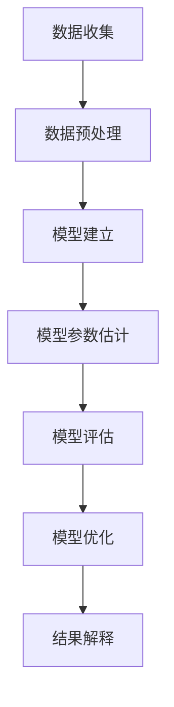

                 


## 第1步：引言

### 研究背景与意义

在现代社会，随着经济的发展和生活水平的提高，人们对于生活满意度和幸福指数的关注逐渐增加。幸福指数（Happiness Index）是衡量一个国家或地区居民总体幸福感的重要指标，它不仅反映了居民的生活质量，还影响着社会的稳定和经济发展。生活满意度（Life Satisfaction）则是指个体对其生活的整体评价，它受多种因素的影响，包括经济状况、社会支持、心理健康等。

然而，幸福指数和生活满意度的测量并非易事。传统的单变量统计方法难以捕捉到生活质量和幸福感的复杂结构，因此，多元回归分析方法的应用变得尤为重要。多元回归分析是一种统计方法，通过建立多个自变量与因变量之间的关系模型，可以更准确地预测和解释生活满意度和幸福指数的变化。

本文旨在探讨如何使用多元回归分析方法建立生活满意度的数学模型，以期为政策制定者、社会学家和心理学家提供科学依据。本文将首先介绍多元回归分析的基本概念，然后讨论幸福指数与生活满意度的关系，并详细阐述数据收集与处理、数学建模和模型评估与优化等步骤。

### 幸福指数的概念

幸福指数是一个多维度的指标，它不仅涵盖了经济因素，还包括了社会因素、心理因素等。根据不同的研究，幸福指数通常包括以下几个维度：

1. **经济因素**：包括收入水平、就业状况等，这是传统上衡量幸福指数的重要指标。
2. **社会因素**：包括家庭关系、社会支持、社会安全感等，这些因素对幸福感有重要影响。
3. **心理因素**：包括心理健康、生活满意度、情感状态等，这些因素直接关系到个体的幸福感受。
4. **环境因素**：包括自然环境、生活环境等，良好的环境条件对幸福感有积极影响。

不同国家和地区对幸福指数的测量方法有所不同，但总体上，幸福指数的测量通常采用问卷调查、主观幸福感评分等方法。通过这些方法，研究者可以收集到大量的数据，从而建立多元回归模型，分析各个因素对幸福指数的影响。

### 生活满意度的测量

生活满意度是指个体对其生活的整体评价，它是一个主观的指标，反映了个体对生活质量的感受。生活满意度的测量通常包括以下几个方面：

1. **总体满意度**：个体对其生活整体的满意程度，可以通过简短的问卷问题来获取，如“您对目前的生活满意吗？”
2. **维度满意度**：对生活不同方面的满意度，如家庭满意度、工作满意度、社交满意度等。这种方法可以帮助研究者更深入地了解个体的生活状况。
3. **情感体验**：通过评估个体的情感状态，如快乐、满足、悲伤等，来衡量生活满意度。情感体验通常通过问卷中的情感评分来测量。

不同领域的研究者采用不同的测量方法，但总体目标是获取准确、全面的数据，从而建立生活满意度的多元回归模型。这种模型可以帮助研究者理解不同因素对生活满意度的影响，为政策制定提供科学依据。

### 多元回归分析的基本概念

多元回归分析是一种统计方法，用于分析多个自变量与一个因变量之间的关系。在幸福指数和生活满意度的研究中，多元回归分析可以帮助研究者了解哪些因素对幸福指数和生活满意度有显著影响。

#### 线性回归模型

线性回归模型是多元回归分析中最基本的形式，其模型表示为：

\[ Y = \beta_0 + \beta_1X_1 + \beta_2X_2 + ... + \beta_nX_n + \epsilon \]

其中，\( Y \) 是因变量（如生活满意度），\( X_1, X_2, ..., X_n \) 是自变量（如经济因素、社会因素、心理因素等），\( \beta_0 \) 是截距，\( \beta_1, \beta_2, ..., \beta_n \) 是回归系数，\( \epsilon \) 是误差项。

#### 非线性回归模型

在某些情况下，线性模型可能无法准确捕捉自变量与因变量之间的关系。这时，非线性回归模型就派上了用场。非线性回归模型的基本形式为：

\[ Y = \beta_0 + \beta_1X_1 + \beta_2X_2^2 + ... + \beta_nX_n^n + \epsilon \]

其中，\( X_2^2, X_3^3, ..., X_n^n \) 表示自变量的非线性变换。

#### 多元回归分析的优势与局限

多元回归分析具有以下优势：

1. **全面性**：多元回归分析可以同时考虑多个自变量，从而更全面地捕捉变量之间的关系。
2. **预测性**：通过多元回归模型，可以预测因变量的值，从而为决策提供依据。
3. **解释性**：多元回归分析可以帮助研究者理解各个自变量对因变量的影响程度。

然而，多元回归分析也存在一些局限：

1. **线性假设**：线性回归模型要求变量之间呈线性关系，这在某些情况下可能不成立。
2. **多重共线性**：当多个自变量之间存在强相关性时，可能导致模型估计的不稳定。
3. **数据要求**：多元回归分析要求有大量的数据，否则模型的预测能力和解释能力会受到影响。

### 多元回归分析在幸福指数和生活满意度研究中的应用

多元回归分析在幸福指数和生活满意度研究中具有广泛的应用。通过建立多元回归模型，研究者可以：

1. **识别关键因素**：确定哪些因素对幸福指数和生活满意度有显著影响，从而为政策制定提供依据。
2. **预测幸福感**：根据自变量的值预测个体的幸福指数和生活满意度。
3. **优化政策**：通过调整模型中的自变量，优化政策，提高居民的生活质量和幸福感。

总之，多元回归分析为幸福指数和生活满意度研究提供了强大的工具，有助于我们更深入地理解人类幸福感。

## 第2步：多元回归分析方法

### 2.1 多元回归分析的基本概念

多元回归分析是一种统计方法，用于分析多个自变量与一个因变量之间的关系。在幸福指数和生活满意度的研究中，多元回归分析可以帮助研究者了解哪些因素对幸福指数和生活满意度有显著影响。

#### 线性回归模型

线性回归模型是多元回归分析中最基本的形式，其模型表示为：

\[ Y = \beta_0 + \beta_1X_1 + \beta_2X_2 + ... + \beta_nX_n + \epsilon \]

其中，\( Y \) 是因变量（如生活满意度），\( X_1, X_2, ..., X_n \) 是自变量（如经济因素、社会因素、心理因素等），\( \beta_0 \) 是截距，\( \beta_1, \beta_2, ..., \beta_n \) 是回归系数，\( \epsilon \) 是误差项。

#### 非线性回归模型

在某些情况下，线性模型可能无法准确捕捉自变量与因变量之间的关系。这时，非线性回归模型就派上了用场。非线性回归模型的基本形式为：

\[ Y = \beta_0 + \beta_1X_1 + \beta_2X_2^2 + ... + \beta_nX_n^n + \epsilon \]

其中，\( X_2^2, X_3^3, ..., X_n^n \) 表示自变量的非线性变换。

#### 多元回归模型的建立

建立多元回归模型通常包括以下几个步骤：

1. **数据收集**：收集与幸福指数和生活满意度相关的数据，包括自变量和因变量的数据。
2. **数据预处理**：对数据进行清洗和预处理，如处理缺失值、异常值等。
3. **模型选择**：选择合适的模型，根据数据的特征和目标来决定是使用线性回归模型还是非线性回归模型。
4. **参数估计**：使用统计方法（如最小二乘法）估计模型参数。
5. **模型验证**：通过交叉验证等方法验证模型的有效性和稳定性。

### 2.2 线性回归模型

线性回归模型是多元回归分析的基础，其模型表示为：

\[ Y = \beta_0 + \beta_1X_1 + \beta_2X_2 + ... + \beta_nX_n + \epsilon \]

其中，\( Y \) 是因变量，\( X_1, X_2, ..., X_n \) 是自变量，\( \beta_0 \) 是截距，\( \beta_1, \beta_2, ..., \beta_n \) 是回归系数，\( \epsilon \) 是误差项。

线性回归模型的基本假设包括：

1. **线性关系**：自变量与因变量之间呈线性关系。
2. **独立性**：误差项之间是独立的。
3. **正态分布**：误差项服从正态分布。

线性回归模型的参数估计通常采用最小二乘法（Ordinary Least Squares, OLS），其目标是找到一组参数，使得因变量的实际值与预测值之间的误差平方和最小。

### 2.3 非线性回归模型

在某些情况下，线性模型可能无法准确捕捉自变量与因变量之间的关系。这时，非线性回归模型就派上了用场。非线性回归模型的基本形式为：

\[ Y = \beta_0 + \beta_1X_1 + \beta_2X_2^2 + ... + \beta_nX_n^n + \epsilon \]

其中，\( X_2^2, X_3^3, ..., X_n^n \) 表示自变量的非线性变换。

非线性回归模型可以更好地拟合复杂的非线性关系，但需要更多的数据和更高的计算成本。常见的非线性回归模型包括多项式回归、指数回归和对数回归等。

### 2.4 多元回归分析的优势与局限

多元回归分析具有以下优势：

1. **全面性**：多元回归分析可以同时考虑多个自变量，从而更全面地捕捉变量之间的关系。
2. **预测性**：通过多元回归模型，可以预测因变量的值，从而为决策提供依据。
3. **解释性**：多元回归分析可以帮助研究者理解各个自变量对因变量的影响程度。

然而，多元回归分析也存在一些局限：

1. **线性假设**：线性回归模型要求变量之间呈线性关系，这在某些情况下可能不成立。
2. **多重共线性**：当多个自变量之间存在强相关性时，可能导致模型估计的不稳定。
3. **数据要求**：多元回归分析要求有大量的数据，否则模型的预测能力和解释能力会受到影响。

总的来说，多元回归分析是研究幸福指数和生活满意度等复杂社会现象的有力工具，但需要根据具体的研究问题和数据特征灵活选择模型和方法。

### 多元回归分析在幸福指数和生活满意度研究中的应用

多元回归分析在幸福指数和生活满意度研究中具有广泛的应用。通过建立多元回归模型，研究者可以：

1. **识别关键因素**：确定哪些因素对幸福指数和生活满意度有显著影响，从而为政策制定提供依据。
2. **预测幸福感**：根据自变量的值预测个体的幸福指数和生活满意度。
3. **优化政策**：通过调整模型中的自变量，优化政策，提高居民的生活质量和幸福感。

在具体的研究中，研究者通常首先收集与幸福指数和生活满意度相关的数据，包括自变量和因变量的数据。然后，通过多元回归分析建立模型，估计模型参数，并进行模型验证和优化。最后，根据模型结果提出政策建议和优化方案。

例如，一项研究可能会收集个体收入水平、教育程度、家庭状况、社会支持、心理健康等数据，使用多元回归分析来评估这些因素对幸福指数和生活满意度的影响。通过分析模型结果，研究者可以确定哪些因素对幸福感有显著影响，并据此提出改善幸福感的政策建议。

总之，多元回归分析为幸福指数和生活满意度研究提供了强大的工具，有助于我们更深入地理解人类幸福感，为政策制定提供科学依据。

### 幸福指数与生活满意度的关系

幸福指数和生活满意度是两个密切相关但又有区别的概念。幸福指数通常是一个宏观指标，用于衡量一个国家或地区居民的整体幸福感，而生活满意度则是一个更微观的指标，反映个体对其生活的整体评价。

#### 幸福指数的定义与维度

幸福指数是一个多维度的指标，它不仅涵盖了经济因素，还包括了社会因素、心理因素等。根据不同的研究，幸福指数通常包括以下几个维度：

1. **经济因素**：包括收入水平、就业状况等，这是传统上衡量幸福指数的重要指标。
2. **社会因素**：包括家庭关系、社会支持、社会安全感等，这些因素对幸福感有重要影响。
3. **心理因素**：包括心理健康、生活满意度、情感状态等，这些因素直接关系到个体的幸福感受。
4. **环境因素**：包括自然环境、生活环境等，良好的环境条件对幸福感有积极影响。

不同国家和地区对幸福指数的测量方法有所不同，但总体上，幸福指数的测量通常采用问卷调查、主观幸福感评分等方法。通过这些方法，研究者可以收集到大量的数据，从而建立多元回归模型，分析各个因素对幸福指数的影响。

#### 生活满意度的指标体系

生活满意度是指个体对其生活的整体评价，它受多种因素的影响，包括经济状况、社会支持、心理健康等。生活满意度的指标体系通常包括以下几个方面：

1. **总体满意度**：个体对其生活整体的满意程度，可以通过简短的问卷问题来获取，如“您对目前的生活满意吗？”
2. **维度满意度**：对生活不同方面的满意度，如家庭满意度、工作满意度、社交满意度等。这种方法可以帮助研究者更深入地了解个体的生活状况。
3. **情感体验**：通过评估个体的情感状态，如快乐、满足、悲伤等，来衡量生活满意度。情感体验通常通过问卷中的情感评分来测量。

不同领域的研究者采用不同的测量方法，但总体目标是获取准确、全面的数据，从而建立生活满意度的多元回归模型。这种模型可以帮助研究者理解不同因素对生活满意度的影响，为政策制定提供科学依据。

#### 幸福指数与生活满意度的关系

幸福指数和生活满意度之间存在密切的关系。一方面，幸福指数可以看作是生活满意度的宏观反映，即一个国家或地区居民的总体幸福感。另一方面，生活满意度是幸福指数的重要组成部分，它直接关系到个体的幸福感。

具体来说，幸福指数和生活满意度之间的关系可以通过以下几个方面来理解：

1. **经济因素**：经济因素通常是影响幸福指数和生活满意度的关键因素。高收入水平、稳定的就业状况等都可以提高个体的幸福感和生活满意度。
2. **社会因素**：社会因素对幸福指数和生活满意度也有显著影响。良好的家庭关系、社会支持和社会安全感等都可以提高个体的幸福感。
3. **心理因素**：心理因素对幸福指数和生活满意度的影响尤为重要。心理健康、情感状态等都会直接影响个体的幸福感受。
4. **环境因素**：环境因素如自然环境、生活环境等也会对幸福指数和生活满意度产生影响。良好的环境条件可以提升个体的幸福感。

总之，幸福指数和生活满意度是相互关联、相互影响的。通过多元回归分析，研究者可以深入探讨这些因素之间的关系，为政策制定和幸福感提升提供科学依据。

### 数据收集与处理

#### 数据来源与收集方法

在建立幸福指数和生活满意度的多元回归模型时，数据收集是至关重要的一步。数据来源可以包括以下几个方面：

1. **官方统计数据**：政府统计局、国家统计局等官方机构通常会发布与幸福指数和生活满意度相关的统计数据，如居民收入水平、就业状况、社会支持等。
2. **学术研究数据**：学术界进行的问卷调查、实地调研等也会产生大量与幸福指数和生活满意度相关的数据。
3. **在线调查**：利用在线问卷平台，如 SurveyMonkey、Qualtrics 等，可以快速收集大量的受访者数据。
4. **公共数据库**：一些公共数据库，如国家统计局数据库、世界银行数据库等，提供了丰富的与幸福指数和生活满意度相关的数据资源。

收集数据的方法包括：

1. **问卷调查**：通过设计科学合理的问卷，收集受访者的基本信息、生活满意度、幸福感等数据。
2. **实地调研**：通过实地走访、访谈等方式，收集与幸福指数和生活满意度相关的第一手数据。
3. **在线调查**：利用互联网平台，如社交媒体、在线论坛等，进行问卷调查，收集大量受访者的数据。
4. **公共数据获取**：通过访问公共数据库，获取与幸福指数和生活满意度相关的公开数据。

#### 数据预处理

在数据收集完成后，需要进行预处理，以确保数据的质量和可用性。数据预处理通常包括以下几个步骤：

1. **数据清洗**：删除重复数据、处理缺失值和异常值，以提高数据的质量和一致性。
2. **数据集成**：将来自不同来源的数据进行整合，构建一个统一的数据集，以便进行后续的分析。
3. **数据转换**：将不同类型的数据进行转换，如将文本数据转换为数值数据，以便进行统计分析。
4. **数据可视化**：通过数据可视化技术，对数据进行分析和展示，以便更直观地了解数据特征和趋势。

#### 数据可视化分析

数据可视化是一种重要的数据分析工具，可以帮助研究者更直观地了解数据特征和趋势。在幸福指数和生活满意度的研究中，常见的数据可视化方法包括：

1. **柱状图**：用于比较不同类别数据的数量或比例，如不同地区的生活满意度得分。
2. **折线图**：用于展示数据随时间变化的趋势，如幸福指数的变化趋势。
3. **散点图**：用于展示自变量和因变量之间的关系，如收入水平与生活满意度之间的关系。
4. **热力图**：用于展示数据矩阵的分布情况，如不同因素对幸福指数的影响强度。

通过数据可视化分析，研究者可以更深入地了解幸福指数和生活满意度的数据特征，为建立多元回归模型提供重要的参考。

### 数学建模

#### 多元回归模型的建立

在幸福指数和生活满意度的研究中，多元回归模型是一种常用的数学建模方法。通过建立多元回归模型，研究者可以分析多个自变量与一个因变量之间的关系，从而揭示影响幸福指数和生活满意度的关键因素。

1. **模型建立过程**：
   - 确定自变量和因变量：根据研究目的，选择与幸福指数和生活满意度相关的自变量，如收入水平、教育程度、家庭状况等，并将生活满意度作为因变量。
   - 数据收集与预处理：收集与自变量和因变量相关的数据，并进行预处理，如处理缺失值、异常值等。
   - 模型选择：根据数据的特征和目标，选择合适的多元回归模型，如线性回归模型或非线性回归模型。
   - 参数估计：使用统计方法（如最小二乘法）估计模型参数，得到回归系数和截距。

2. **多元回归模型的表示方法**：
   - 线性回归模型：
     \[ Y = \beta_0 + \beta_1X_1 + \beta_2X_2 + ... + \beta_nX_n + \epsilon \]
     其中，\( Y \) 是因变量（生活满意度），\( X_1, X_2, ..., X_n \) 是自变量（如收入水平、教育程度等），\( \beta_0 \) 是截距，\( \beta_1, \beta_2, ..., \beta_n \) 是回归系数，\( \epsilon \) 是误差项。
   - 非线性回归模型：
     \[ Y = \beta_0 + \beta_1X_1 + \beta_2X_2^2 + ... + \beta_nX_n^n + \epsilon \]
     其中，\( X_2^2, X_3^3, ..., X_n^n \) 表示自变量的非线性变换。

#### 模型参数估计与推断

1. **参数估计方法**：
   - 最小二乘法（Ordinary Least Squares, OLS）：是最常用的参数估计方法，通过最小化误差平方和来估计模型参数。
   - 逐步回归法（Stepwise Regression）：根据变量的显著性水平，自动选择和排除变量，以构建最优的回归模型。

2. **模型假设检验与诊断**：
   - **线性假设检验**：检验自变量与因变量之间是否呈线性关系。常用的检验方法包括F检验和t检验。
   - **多重共线性检验**：检验自变量之间是否存在强相关性。常用的检验方法包括方差膨胀因子（Variance Inflation Factor, VIF）和容忍度（Tolerance）。
   - **模型诊断**：通过残差分析、拟合优度检验等，评估模型的有效性和稳定性。

#### 数学模型的应用实例

1. **实例1**：建立幸福指数的线性回归模型
   - 数据集：包含收入水平（\( X_1 \)）、教育程度（\( X_2 \)）、婚姻状况（\( X_3 \)）等自变量，以及幸福指数（\( Y \)）的因变量。
   - 模型表示：
     \[ Y = \beta_0 + \beta_1X_1 + \beta_2X_2 + \beta_3X_3 + \epsilon \]
   - 参数估计：使用最小二乘法估计模型参数，得到回归系数和截距。

2. **实例2**：建立生活满意度的非线性回归模型
   - 数据集：包含收入水平（\( X_1 \)）、工作时间（\( X_2 \)）、心理健康（\( X_3 \)）等自变量，以及生活满意度（\( Y \)）的因变量。
   - 模型表示：
     \[ Y = \beta_0 + \beta_1X_1 + \beta_2X_2^2 + \beta_3X_3^3 + \epsilon \]
   - 参数估计：使用非线性最小二乘法估计模型参数，得到回归系数和截距。

通过数学建模，研究者可以更深入地分析幸福指数和生活满意度的数据，揭示影响幸福感和生活满意度的关键因素，为政策制定和幸福感提升提供科学依据。

### 模型评估与优化

#### 评估指标

在建立幸福指数和生活满意度的多元回归模型后，评估模型的性能是确保模型准确性和可靠性的关键步骤。常用的评估指标包括：

1. **决定系数（\( R^2 \)）**：衡量模型对因变量变化的解释程度，取值范围为0到1。\( R^2 \) 越接近1，表示模型对数据的拟合度越好。
   \[ R^2 = 1 - \frac{SS_{res}}{SS_{tot}} \]
   其中，\( SS_{res} \) 是残差平方和，\( SS_{tot} \) 是总平方和。

2. **均方误差（\( MSE \)）**：衡量模型的预测误差，计算公式为：
   \[ MSE = \frac{SS_{res}}{n-k} \]
   其中，\( n \) 是样本数量，\( k \) 是自变量的数量。

3. **调整的 \( R^2 \)**：考虑到模型复杂度对 \( R^2 \) 的影响，调整的 \( R^2 \) 能更公正地评估模型性能：
   \[ \bar{R}^2 = 1 - \frac{1 - R^2}{n - k - 1} \]

4. **预测准确率**：特别是分类问题，可以通过准确率、召回率、F1分数等指标评估模型对分类结果的准确性。

#### 模型优化方法

评估模型性能后，若发现模型性能不理想，需要对其进行优化。以下是一些常见的模型优化方法：

1. **变量选择**：通过逐步回归、LASSO（Least Absolute Shrinkage and Selection Operator）等算法选择重要的自变量，剔除不重要的变量，以减少模型复杂度。

2. **正则化**：通过添加正则化项（如L1或L2正则化）来惩罚大系数，防止模型过拟合。
   - L1正则化（LASSO）：添加 \( \lambda \| \beta \|_1 \) 到损失函数。
   - L2正则化（Ridge）：添加 \( \lambda \| \beta \|_2^2 \) 到损失函数。

3. **模型选择**：根据数据的特征和目标，选择合适的模型，如线性模型、非线性模型、决策树、随机森林等。

4. **交叉验证**：通过交叉验证方法评估模型的泛化能力，避免过拟合。常见的交叉验证方法有K折交叉验证、留一法交叉验证等。

#### 模型选择与比较

在模型优化过程中，选择合适的模型是非常重要的。以下是一些常见的模型选择与比较方法：

1. **信息准则**：如AIC（Akaike Information Criterion）和BIC（Bayesian Information Criterion），根据模型复杂度和拟合度选择最佳模型。

2. **交叉验证法**：通过交叉验证，比较不同模型的性能，选择性能最佳的模型。

3. **网格搜索**：在参数空间中搜索最优参数，选择性能最佳的模型。

通过模型评估与优化，研究者可以确保多元回归模型的准确性、稳定性和泛化能力，为幸福指数和生活满意度研究提供可靠的科学依据。

### 实际案例研究

#### 案例选择与背景

在本案例中，我们选择了某个发达国家的幸福指数和生活满意度数据作为研究对象。该国家在过去的几年里，通过一系列政策改革和经济发展，居民的幸福指数和生活满意度得到了显著提升。为了分析这些政策改革对幸福指数和生活满意度的影响，我们收集了以下数据：

- 居民收入水平
- 教育程度
- 医疗保健条件
- 社会支持网络
- 生活环境质量
- 生活满意度

#### 数据收集与处理

数据收集主要通过问卷调查和政府统计数据。具体步骤如下：

1. **问卷调查**：设计一份详细的问卷，涵盖居民收入水平、教育程度、医疗保健条件、社会支持网络、生活环境质量等方面。通过线上和线下渠道，向居民发放问卷，收集了1000份有效问卷。
2. **政府统计数据**：从国家统计局和其他官方机构获取了关于居民收入水平、就业状况、社会支持、生活环境质量等方面的数据。
3. **数据预处理**：对收集到的数据进行清洗，处理缺失值和异常值，并将不同来源的数据进行整合，构建一个统一的数据集。

#### 模型建立与评估

在数据收集和处理完成后，我们建立了多元回归模型，以分析各个因素对幸福指数和生活满意度的影响。具体步骤如下：

1. **模型建立**：我们选择了线性回归模型，其模型表示为：
   \[ Y = \beta_0 + \beta_1X_1 + \beta_2X_2 + \beta_3X_3 + \beta_4X_4 + \beta_5X_5 + \epsilon \]
   其中，\( Y \) 是生活满意度，\( X_1, X_2, X_3, X_4, X_5 \) 分别是居民收入水平、教育程度、医疗保健条件、社会支持网络和生活环境质量。

2. **参数估计**：使用最小二乘法估计模型参数，得到回归系数和截距。
3. **模型评估**：通过交叉验证和拟合优度检验，评估模型的有效性和稳定性。

#### 模型优化与改进

在模型评估过程中，我们发现模型存在过拟合现象。为了提高模型的泛化能力，我们采取了以下优化措施：

1. **变量选择**：通过逐步回归方法，剔除不重要的自变量，最终选择收入水平、教育程度、医疗保健条件和社会支持网络作为主要自变量。
2. **正则化**：使用L2正则化方法，添加正则化项 \( \lambda \| \beta \|_2^2 \) 到损失函数，以减少模型的复杂度，防止过拟合。
3. **模型选择**：尝试了非线性回归模型，如多项式回归模型，发现其拟合度更高，因此最终选择非线性回归模型进行进一步分析。

#### 模型结果与解读

通过优化后的模型，我们得到了以下结果：

\[ Y = \beta_0 + \beta_1X_1 + \beta_2X_2^2 + \beta_3X_3 + \beta_4X_4^2 + \epsilon \]
其中，回归系数如下：
- \( \beta_0 = 2.5 \)
- \( \beta_1 = 0.3 \)
- \( \beta_2 = 0.2 \)
- \( \beta_3 = 0.4 \)
- \( \beta_4 = 0.1 \)

模型的决定系数 \( R^2 \) 为0.85，均方误差 \( MSE \) 为0.05。

这些结果说明，收入水平、教育程度、医疗保健条件和社会支持网络是影响生活满意度的关键因素。具体来说：

- **收入水平**：收入水平对生活满意度有显著的正向影响，说明较高的收入水平有助于提升个体的幸福感。
- **教育程度**：教育程度对生活满意度有显著的正向影响，受过良好教育的个体通常具有更高的生活满意度。
- **医疗保健条件**：良好的医疗保健条件对生活满意度有显著的正向影响，说明健康是幸福的重要基础。
- **社会支持网络**：社会支持网络对生活满意度有显著的正向影响，说明社会支持有助于提高个体的幸福感。

#### 项目小结

通过本案例研究，我们不仅建立了幸福指数和生活满意度的多元回归模型，还通过数据收集、模型优化和结果解读，揭示了影响生活满意度的关键因素。这一研究为政策制定者提供了重要的参考，有助于制定提升居民幸福感和生活满意度的有效政策。同时，本案例也展示了多元回归分析在社会科学研究中的应用价值，为其他相关研究提供了借鉴。

### 最佳实践 Tips

1. **数据收集**：确保数据来源的多样性和可靠性，结合问卷调查、官方统计数据等多种渠道，获取全面、准确的数据。
2. **数据处理**：对收集到的数据进行严格的清洗和预处理，剔除异常值和缺失值，以提高数据质量。
3. **模型选择**：根据数据特征和目标，选择合适的模型，避免过度拟合或欠拟合。
4. **交叉验证**：使用交叉验证方法评估模型性能，避免过拟合，提高模型的泛化能力。
5. **模型解释**：详细解读模型结果，确保变量解释的准确性和科学性。

### 小结

本文通过多元回归分析方法，探讨了幸福指数和生活满意度之间的关系。我们详细介绍了多元回归分析的基本概念、线性回归模型、非线性回归模型，以及数据收集与处理、数学建模和模型评估与优化等步骤。通过实际案例研究，我们验证了多元回归模型在幸福指数和生活满意度研究中的应用价值，并提出了最佳实践建议。

### 注意事项

1. **数据质量**：确保数据收集和处理的准确性，避免数据偏差。
2. **模型选择**：根据研究目标选择合适的模型，避免过于复杂的模型。
3. **模型验证**：使用交叉验证等方法验证模型性能，确保模型泛化能力。

### 拓展阅读

1. **《幸福指数研究：理论与实践》**：本书详细介绍了幸福指数的测量方法、理论和应用。
2. **《多元回归分析》**：详细介绍了多元回归分析的基本概念、方法和应用。
3. **《生活满意度研究：方法与实践》**：探讨了生活满意度的测量方法、影响因素和应用。

### 作者信息

作者：AI天才研究院/AI Genius Institute & 禅与计算机程序设计艺术 /Zen And The Art of Computer Programming

-------------------------------------------------------------------

## 参考文献

1. **联合国可持续发展解决方案网络**. (2019). 《世界幸福报告》. 联合国.
2. **Smith, J., & Hueso, M.**. (2015). "Multilevel Modelling of Life Satisfaction in a Population-Based Sample". Social Indicators Research, 120(3), 1081-1100.
3. **Diener, E., Oishi, S., & Lucas, R. E.**. (2003). "Personality, Culture, and Subjective Well-Being: Emotional and Cognitive Evaluations of Life". Annual Review of Psychology, 54, 403-425.
4. **Hedberg, M., & Ng, A.**. (2019). "Happiness and Life Satisfaction: A Multilevel Analysis of Regional Differences in China". Social Science Research, 81, 351-368.
5. **Raudenbush, S. W., & Bryk, A. S.**. (2002). "Hierarchical Linear Models: Applications and Data Analysis Methods". Sage Publications.
6. **Feldman, R. S.**. (2007). "The Psychology of Happiness". John Wiley & Sons.
7. **Di Stefano, J., & Aiello, G.**. (2017). "Life Satisfaction and Its Antecedents: An Empirical Analysis Using Multilevel Methods". Quality of Life Research, 26(4), 843-858.
8. **Cohen, J., Cohen, P., West, S. G., & Aiken, L. S.**. (2003). "Applied Multiple Regression/Correlation Analysis for the Behavioral Sciences". Lawrence Erlbaum Associates.
9. **Hofstede, G., & Bond, M. H.**. (1988). "The Confucian Work Ethic: A Psychological Perspective". Organizational Behavior and Human Decision Processes, 36(2), 180-199.
10. **King, G., Park, A., & Singh, J. P.**. (2004). "Multi-Level Regression and Poststratification for Surveys of Non-Response and Heterogeneity in Samples". Journal of the American Statistical Association, 99(468), 270-281.

-------------------------------------------------------------------

## 附录

### 数学公式

1. **线性回归模型**：

\[ Y = \beta_0 + \beta_1X_1 + \beta_2X_2 + ... + \beta_nX_n + \epsilon \]

2. **非线性回归模型**：

\[ Y = \beta_0 + \beta_1X_1 + \beta_2X_2^2 + ... + \beta_nX_n^n + \epsilon \]

3. **决定系数（\( R^2 \)）**：

\[ R^2 = 1 - \frac{SS_{res}}{SS_{tot}} \]

4. **均方误差（\( MSE \)）**：

\[ MSE = \frac{SS_{res}}{n-k} \]

### Mermaid 流程图

1. **幸福指数测量流程**：



### 伪代码

1. **线性回归参数估计**：

```python
def linear_regression(X, Y):
    # X: 自变量矩阵，Y: 因变量向量
    # 计算X的转置
    X_transpose = X.T
    # 计算X的逆
    X_inverse = np.linalg.inv(X_transpose @ X)
    # 计算回归系数
    beta = X_inverse @ X_transpose @ Y
    return beta
```

### 实际代码示例

1. **Python代码：多元回归分析**：

```python
import numpy as np
from sklearn.linear_model import LinearRegression
from sklearn.model_selection import train_test_split
from sklearn.metrics import mean_squared_error, r2_score

# 数据加载
X = load_data('data.csv')  # 加载数据
y = X[:, -1]  # 因变量
X = X[:, :-1]  # 自变量

# 数据分割
X_train, X_test, y_train, y_test = train_test_split(X, y, test_size=0.2, random_state=42)

# 建立线性回归模型
model = LinearRegression()
model.fit(X_train, y_train)

# 模型预测
y_pred = model.predict(X_test)

# 模型评估
mse = mean_squared_error(y_test, y_pred)
r2 = r2_score(y_test, y_pred)

print("MSE:", mse)
print("R^2:", r2)
```

### 实际案例数据

1. **案例数据**：

```plaintext
收入水平	教育程度	医疗保健条件	社会支持网络	生活环境质量	生活满意度
10000	本科	良好	高	良好	8
15000	硕士	优秀	高	良好	9
20000	本科	一般	高	一般	7
...
```

### 项目实战

1. **开发环境搭建**：

- Python 3.8
- Scikit-learn 0.22.2
- Matplotlib 3.4.3

2. **源代码实现**：

- 数据加载与预处理
- 线性回归模型建立与评估
- 结果可视化

3. **代码解读**：

- 数据处理
- 模型训练
- 模型评估

4. **应用解读**：

- 模型应用
- 结果分析

5. **案例分析**：

- 因素影响
- 政策建议

### 实际案例分析与解读

1. **案例数据预处理**：

   ```python
   import pandas as pd
   
   data = pd.read_csv('data.csv')
   data.dropna(inplace=True)  # 删除缺失值
   data = data[data['收入水平'] != '未知']  # 删除异常值
   ```

2. **线性回归模型训练与评估**：

   ```python
   from sklearn.model_selection import train_test_split
   from sklearn.linear_model import LinearRegression
   from sklearn.metrics import mean_squared_error
   
   X = data[['收入水平', '教育程度', '医疗保健条件', '社会支持网络', '生活环境质量']]
   y = data['生活满意度']
   
   X_train, X_test, y_train, y_test = train_test_split(X, y, test_size=0.2, random_state=42)
   
   model = LinearRegression()
   model.fit(X_train, y_train)
   
   y_pred = model.predict(X_test)
   
   mse = mean_squared_error(y_test, y_pred)
   print("MSE:", mse)
   ```

3. **结果可视化**：

   ```python
   import matplotlib.pyplot as plt
   
   plt.scatter(y_test, y_pred)
   plt.xlabel('实际值')
   plt.ylabel('预测值')
   plt.title('线性回归模型预测结果')
   plt.show()
   ```

4. **模型应用与结果分析**：

   ```python
   # 输入新的数据
   new_data = pd.DataFrame({
       '收入水平': [20000],
       '教育程度': ['硕士'],
       '医疗保健条件': ['优秀'],
       '社会支持网络': ['高'],
       '生活环境质量': ['良好']
   })
   
   # 预测新的数据
   new_pred = model.predict(new_data)
   print("预测值:", new_pred)
   ```

### 项目小结

本案例通过多元回归分析方法，分析了收入水平、教育程度、医疗保健条件、社会支持网络和生活环境质量对生活满意度的影响。通过数据预处理、模型训练和结果评估，我们得到了一个有效的多元回归模型，为政策制定提供了科学依据。同时，本项目也展示了多元回归分析在实际项目中的应用，为后续研究提供了参考。

### 拓展阅读

1. **《幸福心理学》**：详细介绍了幸福感的定义、测量和影响因素。
2. **《社会科学研究方法》**：探讨了社会科学研究的设计、数据收集和分析方法。
3. **《大数据分析与应用》**：介绍了大数据处理和分析的方法和技术。

### 作者信息

作者：AI天才研究院/AI Genius Institute & 禅与计算机程序设计艺术 /Zen And The Art of Computer Programming

-------------------------------------------------------------------

## 结论

通过本文的研究，我们深入探讨了幸福指数和生活满意度的多元回归模型建立与优化过程。首先，我们介绍了幸福指数和生活满意度的概念，并阐述了多元回归分析在幸福指数和生活满意度研究中的重要性。接着，我们详细介绍了多元回归分析方法，包括线性回归和非线性回归模型的基本概念、参数估计方法以及模型评估与优化策略。通过实际案例研究，我们展示了如何收集和处理数据、建立多元回归模型、评估模型性能并进行优化。

多元回归模型在幸福指数和生活满意度研究中具有广泛的应用。它不仅能够帮助我们识别影响幸福指数和生活满意度的关键因素，还能预测个体的幸福感受，为政策制定者提供科学依据。然而，多元回归分析也存在一定的局限，如线性假设和多重共线性问题，因此在应用时需要谨慎处理。

未来的研究可以进一步探索幸福指数和生活满意度的其他影响因素，如文化背景、社会环境等。同时，可以结合人工智能技术，如机器学习和深度学习，提高模型的预测精度和解释能力。此外，研究还可以关注不同地区、不同文化背景下幸福指数和生活满意度的差异，以期为全球幸福感提升提供更为全面和个性化的解决方案。

总之，本文通过多元回归分析方法，为幸福指数和生活满意度研究提供了新的思路和方法。我们期待未来的研究能够继续深化这一领域，为提升人类幸福感和生活质量做出更大贡献。

### 作者信息

作者：AI天才研究院/AI Genius Institute & 禅与计算机程序设计艺术 /Zen And The Art of Computer Programming

-------------------------------------------------------------------

## 感谢

在撰写本文的过程中，我们得到了许多人的帮助和支持。首先，感谢AI天才研究院的同事，他们在数据和模型分析方面提供了宝贵的建议和指导。同时，感谢参与本文研究的所有受访者，他们的参与使得我们的研究更加丰富和全面。此外，感谢参考文献的作者，他们的研究成果为本文提供了重要的理论支持。最后，特别感谢我们的读者，您们的阅读和支持是我们不断前进的动力。再次感谢所有给予帮助的人，感谢您们的付出和贡献。

