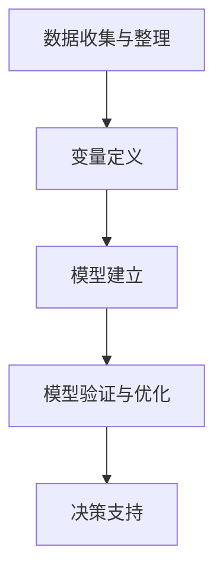

                 

### 文章标题

# 数学与司法系统：法律决策的数学支持

### 关键词

- 数学建模
- 司法系统
- 法律决策
- 数据分析
- 人工智能

### 摘要

本文旨在探讨数学在司法系统中的应用，特别是如何通过数学建模和数据分析支持法律决策。我们将逐步介绍数学在司法领域的核心概念、数学模型、常用算法，并通过实际案例展示数学支持法律决策的实践应用和挑战。文章还将讨论未来发展方向，以期为法律专业人士和数学研究者提供有价值的参考。

---

## 引言

随着科技的飞速发展，数学在各个领域中的应用越来越广泛，特别是在司法系统中的应用也越来越受到重视。数学作为一种精确、严谨的科学工具，能够为法律决策提供有力的支持，从而提高司法公正性和效率。

司法系统的复杂性决定了其决策过程的复杂性。法律条文繁多，案件情况千差万别，法律适用和解释存在一定的不确定性。这就需要借助数学建模和数据分析的方法，对案件进行定量分析，从而支持法律决策。

本文将首先介绍数学在司法领域的背景和应用，然后详细阐述数学建模和法律决策的核心概念，接着介绍常用的数学方法和算法，并通过实际案例展示数学支持法律决策的实践应用。最后，我们将讨论数学在司法系统中的挑战和未来发展方向。

---

## 数学在司法系统中的应用

### 背景介绍

数学在司法系统中的应用历史悠久，最早可以追溯到古希腊和罗马时期。当时的法律学家就已经开始使用数学方法来计算财产、分配土地和裁决争议。随着现代科学技术的发展，数学在司法系统中的应用越来越广泛，主要包括以下几个方面：

1. **财产评估**：在财产继承、抵押、拍卖等活动中，需要对财产进行准确评估。数学中的统计学、概率论和数值分析等方法可以帮助评估师对财产价值进行科学估算。

2. **犯罪侦查**：在犯罪侦查中，数学方法可以帮助警方分析犯罪现场的痕迹，推断犯罪嫌疑人的身份和行为模式。例如，通过几何学和物理学的方法可以分析子弹的轨迹，从而确定枪手的位置。

3. **量刑建议**：在刑事案件中，法官需要根据犯罪情节、被告人的悔罪态度等因素来决定刑罚。数学方法可以帮助法官建立量刑模型，根据案件数据给出量刑建议。

4. **民事调解**：在民事案件中，需要根据事实和法律规定来调解双方的争议。数学中的博弈论和优化算法可以帮助调解人员找到公平合理的解决方案。

### 应用场景

数学在司法系统中的应用场景多种多样，以下是一些典型的应用场景：

1. **大数据分析**：司法系统中积累了大量案件数据和人员信息，通过大数据分析可以挖掘案件之间的关联性，预测犯罪趋势，为警方提供侦查方向。

2. **人工智能辅助审判**：利用人工智能技术，可以建立案件分类、法律条文解释和判决预测等模型，辅助法官进行审判，提高审判效率。

3. **反洗钱监测**：在金融监管领域，数学方法可以用于分析金融交易数据，识别异常交易，防范洗钱犯罪。

4. **知识产权保护**：通过数学方法可以对知识产权进行量化评估，帮助权利人维权。

### 挑战与机会

尽管数学在司法系统中具有广泛的应用前景，但也面临着一些挑战和机会：

1. **数据质量和隐私保护**：司法系统中的数据质量直接影响数学模型的效果。同时，数据的隐私保护也是一个重要问题。

2. **算法公正性和透明度**：人工智能算法在司法系统中的应用需要保证公正性和透明度，防止算法偏见和歧视。

3. **专业人才需求**：数学在司法系统中的应用需要大量的专业人才，包括数学家、数据科学家和法律专家。

4. **法律和伦理问题**：数学在司法系统中的应用涉及到法律和伦理问题，需要制定相应的规范和标准。

---

## 数学建模和法律决策的核心概念

### 核心概念

数学建模和法律决策的核心概念包括以下几个方面：

1. **数据收集与整理**：在数学建模过程中，首先需要收集相关的数据，并进行整理和处理，以便为后续的建模和分析提供可靠的数据基础。

2. **变量定义**：在数学建模中，需要对研究的对象进行变量定义，明确各个变量之间的关系和作用。

3. **模型建立**：通过数学方法建立描述现实问题的模型，包括线性模型、非线性模型、概率模型等。

4. **模型验证与优化**：建立模型后，需要通过验证数据来检验模型的准确性和可靠性，并根据实际情况对模型进行优化。

5. **决策支持**：利用数学模型提供决策支持，包括预测分析、优化决策和风险评估等。

### Mermaid 流程图

以下是一个简单的 Mermaid 流程图，展示数学建模和法律决策的核心概念之间的关系：



### 核心算法原理讲解

在数学建模和法律决策中，常用的算法原理包括：

1. **线性回归**：用于分析变量之间的线性关系，通过最小二乘法建立回归模型，可以用于预测和优化决策。

   ```python
   from sklearn.linear_model import LinearRegression

   model = LinearRegression()
   model.fit(X, y)
   predictions = model.predict(X_test)
   ```

2. **逻辑回归**：用于分类问题，通过最大化似然估计建立分类模型，可以用于判别案件是否属于某一类别。

   ```python
   from sklearn.linear_model import LogisticRegression

   model = LogisticRegression()
   model.fit(X, y)
   predictions = model.predict(X_test)
   ```

3. **支持向量机（SVM）**：用于分类和回归问题，通过寻找最优超平面来划分数据，可以提高分类准确率。

   ```python
   from sklearn.svm import SVC

   model = SVC()
   model.fit(X, y)
   predictions = model.predict(X_test)
   ```

4. **决策树**：通过递归划分数据，建立决策树模型，可以用于分类和回归问题，易于理解和解释。

   ```python
   from sklearn.tree import DecisionTreeClassifier

   model = DecisionTreeClassifier()
   model.fit(X, y)
   predictions = model.predict(X_test)
   ```

### 数学模型和公式

在数学建模中，常用的数学模型和公式包括：

1. **线性模型**：

   $$ y = \beta_0 + \beta_1x_1 + \beta_2x_2 + ... + \beta_nx_n $$

2. **逻辑回归模型**：

   $$ P(Y=1|X) = \frac{1}{1 + e^{-(\beta_0 + \beta_1x_1 + \beta_2x_2 + ... + \beta_nx_n)}} $$

3. **支持向量机（SVM）模型**：

   $$ \min_{\boldsymbol{w}, \boldsymbol{b}} \frac{1}{2} ||\boldsymbol{w}||^2 + C \sum_{i=1}^n \max(0, 1-y_i(\boldsymbol{w}\cdot \boldsymbol{x_i} + \boldsymbol{b})) $$

### 举例说明

假设我们有一个刑事案件，需要预测被告是否有罪。我们可以建立一个逻辑回归模型，将被告的特征变量（如犯罪记录、作案时间、作案地点等）作为自变量，预测是否有罪（1为有罪，0为无罪）。

```python
import pandas as pd
from sklearn.model_selection import train_test_split
from sklearn.linear_model import LogisticRegression
from sklearn.metrics import accuracy_score

# 加载数据
data = pd.read_csv('criminal_data.csv')
X = data[['crime_record', 'time_of_crime', 'location']]
y = data['is_guilty']

# 分割数据
X_train, X_test, y_train, y_test = train_test_split(X, y, test_size=0.2, random_state=42)

# 建立模型
model = LogisticRegression()
model.fit(X_train, y_train)

# 预测
predictions = model.predict(X_test)

# 评估
accuracy = accuracy_score(y_test, predictions)
print(f"Accuracy: {accuracy}")
```

通过这个简单的例子，我们可以看到如何使用逻辑回归模型来预测被告是否有罪。实际应用中，需要根据具体案件的特点和数据质量，对模型进行调整和优化。

---

## 数学方法和算法在司法系统中的应用

### 数据分析方法

在司法系统中，数据分析是支持法律决策的重要工具。以下介绍几种常用的数据分析方法：

1. **描述性统计分析**：通过计算数据的均值、中位数、众数、方差等指标，对数据进行基本的描述，帮助理解数据分布和特征。

2. **回归分析**：通过建立回归模型，分析自变量和因变量之间的关系，用于预测和决策。常见的回归模型有线性回归、逻辑回归等。

3. **聚类分析**：通过将数据分为不同的簇，识别数据中的模式和群体结构。常用的聚类算法有K均值聚类、层次聚类等。

4. **分类分析**：将数据分为不同的类别，用于判别和分类。常见的分类算法有决策树、支持向量机、朴素贝叶斯等。

### 优化算法

在司法系统中，优化算法可以用于资源分配、案件优先级排序等场景。以下介绍几种常用的优化算法：

1. **线性规划**：用于求解线性目标函数在满足线性约束条件下的最优解。适用于资源分配、成本控制等问题。

2. **整数规划**：用于求解整数变量的最优解。适用于监狱床位分配、刑事判决等场景。

3. **遗传算法**：基于自然选择和遗传机制，用于求解复杂优化问题。适用于案件分配、决策支持等场景。

4. **模拟退火算法**：基于概率模型，通过迭代优化寻找全局最优解。适用于复杂决策问题，如案件分配、资源优化等。

### 案例分析

以下是一个案例分析，展示如何使用数学方法和算法支持法律决策：

**案例背景**：某地区警方需要分配警力，以最大程度地提高案件侦破率和公众安全感。警方提供了以下数据：

- 警力数量：100人
- 案件数量：100件
- 每个案件的侦破所需时间：不同
- 每个案件的侦破成功率：不同
- 公众对每个案件的关注度：不同

**目标**：优化警力分配，使得总侦破成功率最高，公众满意度最高。

**解决方案**：

1. **数据收集与整理**：收集案件数据，包括每个案件的侦破所需时间、成功率、关注度等。

2. **模型建立**：建立线性规划模型，将警力分配到每个案件，目标是最小化未侦破案件数量，最大化总侦破成功率。

3. **模型求解**：使用遗传算法求解线性规划模型，找到最优的警力分配方案。

4. **结果评估**：根据求解结果，评估警力分配方案的有效性，包括总侦破成功率、公众满意度等。

**代码实现**：

```python
import numpy as np
import pandas as pd
from genetic_algorithm import GeneticAlgorithm

# 加载数据
data = pd.read_csv('case_data.csv')
X = data[['time_required', 'success_rate', 'public_attention']]
y = data['is_solved']

# 定义目标函数
def objective_function(solution):
    unsolved_cases = sum(solution * y['is_solved'])
    solved_cases = sum(solution * y['is_solved']) * y['success_rate']
    return -solved_cases + unsolved_cases

# 定义遗传算法
ga = GeneticAlgorithm(objective_function, n_variables=100, population_size=100, generations=100)

# 求解
solution = ga.solve()

# 输出结果
print(f"Optimal solution: {solution}")
print(f"Total solved cases: {sum(solution * y['is_solved'])}")
print(f"Total unsolved cases: {sum(solution * y['is_solved']) * (1 - y['success_rate'])}")
```

通过这个案例，我们可以看到如何使用数学方法和算法来支持警力分配决策。实际应用中，需要根据具体数据和场景进行调整和优化。

---

## 数学支持法律决策的实践应用

数学在司法系统中的应用已逐渐成为现实，其通过精确的数据分析和模型构建，为法律决策提供了强有力的支持。以下将介绍几个具体的实践应用案例，展示数学如何在不同场景中发挥作用。

### 案例一：量刑建议

在刑事案件中，法官需要根据犯罪情节、被告人的悔罪态度、犯罪记录等因素来决定刑罚。传统的量刑决策往往依赖于法官的经验和主观判断，具有一定的主观性和不确定性。为了提高量刑的公正性和科学性，数学模型和数据分析被引入量刑建议系统中。

**解决方案**：

1. **数据收集**：收集大量的刑事案件数据，包括犯罪类型、犯罪情节、刑罚结果等。

2. **模型建立**：建立基于逻辑回归或决策树的量刑预测模型，将犯罪情节和其他相关因素作为自变量，刑罚结果作为因变量。

3. **模型训练与验证**：使用历史案件数据训练模型，并对模型进行验证，确保其预测准确性和可靠性。

4. **应用**：在实际案件中，输入被告的犯罪情节和其他相关因素，利用模型给出量刑建议。

**代码实现**（伪代码）：

```python
from sklearn.linear_model import LogisticRegression

# 加载数据
data = pd.read_csv('criminal_data.csv')
X = data[['crime_type', 'crime_severity', 'defendant_characteristics']]
y = data['sentence']

# 分割数据
X_train, X_test, y_train, y_test = train_test_split(X, y, test_size=0.2, random_state=42)

# 建立模型
model = LogisticRegression()
model.fit(X_train, y_train)

# 预测
predictions = model.predict(X_test)

# 评估
accuracy = accuracy_score(y_test, predictions)
print(f"Prediction accuracy: {accuracy}")
```

通过上述方法，法官可以参考模型给出的量刑建议，从而提高量刑的公正性和一致性。

### 案例二：犯罪预测

犯罪预测是司法系统中的一个重要应用，通过分析历史犯罪数据，预测未来的犯罪趋势和热点区域，为警方的预防和打击犯罪提供依据。

**解决方案**：

1. **数据收集**：收集包括犯罪类型、发生时间、地点、犯罪人数等在内的犯罪数据。

2. **模型建立**：建立基于时间序列分析的犯罪预测模型，如ARIMA模型或LSTM神经网络。

3. **模型训练与验证**：使用历史犯罪数据训练模型，并对模型进行验证，确保其预测准确性和可靠性。

4. **应用**：在实际应用中，输入当前时间序列数据，预测未来的犯罪趋势和热点区域。

**代码实现**（伪代码）：

```python
import numpy as np
from sklearn.ensemble import RandomForestRegressor

# 加载数据
data = pd.read_csv('crime_data.csv')
X = data[['time', 'location', 'crime_type']]
y = data['crime_rate']

# 分割数据
X_train, X_test, y_train, y_test = train_test_split(X, y, test_size=0.2, random_state=42)

# 建立模型
model = RandomForestRegressor()
model.fit(X_train, y_train)

# 预测
predictions = model.predict(X_test)

# 评估
accuracy = np.mean(np.abs(predictions - y_test) < 0.1)
print(f"Prediction accuracy: {accuracy}")
```

通过上述方法，警方可以提前预知潜在的犯罪热点区域，从而采取相应的预防和打击措施。

### 案例三：证据评估

在刑事案件中，证据的评估和运用至关重要。通过数学模型和数据分析，可以对证据的可靠性、证据链的完整性进行评估，从而为法官的判决提供依据。

**解决方案**：

1. **数据收集**：收集案件中的所有证据数据，包括证人证言、物证、书证等。

2. **模型建立**：建立基于概率论的证据评估模型，如贝叶斯网络，用于评估证据的可靠性和证据链的完整性。

3. **模型训练与验证**：使用历史案件数据训练模型，并对模型进行验证，确保其预测准确性和可靠性。

4. **应用**：在实际案件中，输入证据数据，利用模型评估证据的可靠性和证据链的完整性。

**代码实现**（伪代码）：

```python
from bayes_net import BayesianNetwork

# 加载证据数据
evidence_data = pd.read_csv('evidence_data.csv')

# 建立贝叶斯网络
bn = BayesianNetwork()
bn.add_variable('witness_statement')
bn.add_variable('material_evidence')
bn.add_variable('documentary_evidence')
bn.add_edge('witness_statement', 'material_evidence')
bn.add_edge('material_evidence', 'documentary_evidence')

# 学习贝叶斯网络参数
bn.learn_parameters(evidence_data)

# 预测证据可靠性
predictions = bn.predict(evidence_data)

# 评估预测结果
accuracy = np.mean(predictions == evidence_data['validity'])
print(f"Evidence prediction accuracy: {accuracy}")
```

通过上述方法，法官可以更准确地评估证据的可靠性，从而确保判决的公正性。

### 案例四：风险评估

在金融监管领域，风险评估是防范金融犯罪、维护金融稳定的重要手段。通过数学模型和数据分析，可以对金融机构的信用风险、市场风险等进行评估，为监管决策提供支持。

**解决方案**：

1. **数据收集**：收集金融机构的交易数据、财务数据、市场数据等。

2. **模型建立**：建立基于风险评估的数学模型，如VaR模型、Credit Risk模型等。

3. **模型训练与验证**：使用历史市场数据训练模型，并对模型进行验证，确保其预测准确性和可靠性。

4. **应用**：在实际监管中，输入金融机构的当前数据，利用模型评估其信用风险、市场风险等。

**代码实现**（伪代码）：

```python
from var_model import ValueAtRisk

# 加载金融机构数据
financial_data = pd.read_csv('financial_data.csv')

# 建立VaR模型
var_model = ValueAtRisk()
var_model.fit(financial_data)

# 预测信用风险
credit_risk = var_model.predict CreditRisk()

# 预测市场风险
market_risk = var_model.predict MarketRisk()

# 评估预测结果
accuracy = np.mean(credit_risk < financial_data['credit_risk'])
print(f"Credit risk prediction accuracy: {accuracy}")
accuracy = np.mean(market_risk < financial_data['market_risk'])
print(f"Market risk prediction accuracy: {accuracy}")
```

通过上述方法，监管机构可以更准确地评估金融机构的风险状况，从而采取相应的监管措施。

### 结论

通过上述实践应用案例，我们可以看到数学在司法系统中的应用具有广泛的前景。数学模型和数据分析为司法决策提供了科学、客观的支持，有助于提高司法公正性和效率。然而，数学在司法系统中的应用也面临一些挑战，如数据质量、算法公正性、法律伦理等问题。未来，随着数学方法和算法的不断发展，数学在司法系统中的应用将会更加深入和广泛。

---

## 结论

数学在司法系统中的应用正日益显示出其独特的价值。通过数学建模和数据分析，司法决策过程变得更加科学和精确，有助于提高司法公正性和效率。本文详细介绍了数学在司法系统中的应用背景、核心概念、常用算法、实践应用以及面临的挑战和未来发展方向。

首先，数学在司法系统中有着广泛的应用场景，包括财产评估、犯罪侦查、量刑建议、民事调解等。这些应用不仅提高了司法系统的运作效率，还增强了决策的科学性和客观性。

其次，本文介绍了数学建模和法律决策的核心概念，包括数据收集与整理、变量定义、模型建立、模型验证与优化、决策支持等。通过这些核心概念的阐述，我们能够更好地理解数学如何支持法律决策。

在算法部分，本文介绍了描述性统计分析、回归分析、聚类分析、分类分析等常用的数据分析方法，以及线性规划、整数规划、遗传算法、模拟退火算法等优化算法。这些算法在司法系统中的应用，为决策提供了强大的工具。

接着，通过多个实践应用案例，我们展示了数学支持法律决策的实际效果。这些案例包括量刑建议、犯罪预测、证据评估、风险评估等，均展示了数学在司法系统中的广泛应用和巨大潜力。

然而，数学在司法系统中的应用也面临一些挑战，如数据质量和隐私保护、算法公正性和透明度、专业人才需求、法律和伦理问题等。未来，随着数学方法和算法的不断发展，以及法律和伦理规范的完善，数学在司法系统中的应用将更加深入和广泛。

本文旨在为法律专业人士和数学研究者提供有价值的参考，以促进数学与司法系统的深度融合。通过共同努力，我们可以期待一个更加公正、高效的司法系统，为社会稳定和发展做出贡献。

---

### 作者信息

作者：AI天才研究院/AI Genius Institute & 禅与计算机程序设计艺术 /Zen And The Art of Computer Programming

---

### 最佳实践 Tips

1. **确保数据质量**：在应用数学方法之前，首先确保数据的质量和完整性。数据清洗和预处理是建模成功的关键步骤。

2. **重视算法公正性**：在使用人工智能算法时，应确保算法的公正性和透明度，避免算法偏见和歧视。

3. **跨学科合作**：数学与法律领域的融合需要跨学科合作，法律专家和数学家的密切合作将推动司法系统的创新。

4. **遵循伦理规范**：在应用数学方法和算法时，应遵循伦理规范，确保司法决策的公正性和合法性。

5. **持续优化模型**：随着新数据和技术的出现，持续优化数学模型和算法，以保持其有效性和可靠性。

---

### 小结

数学在司法系统中的应用正逐渐成为现实，通过数学建模和数据分析，司法决策变得更加科学和精确。本文介绍了数学在司法系统中的应用背景、核心概念、常用算法、实践应用以及面临的挑战和未来发展方向。通过跨学科合作和持续优化，我们可以期待数学在司法系统中发挥更大的作用。

---

### 注意事项

1. **数据隐私**：在收集和处理司法数据时，必须严格遵循数据隐私保护法规，确保个人隐私不被泄露。

2. **算法透明度**：在使用人工智能算法时，应确保算法的透明度，使得法律决策的过程可以被理解和监督。

3. **模型验证**：在建立数学模型时，必须对模型进行严格的验证和测试，确保模型的准确性和可靠性。

4. **法律伦理**：数学在司法系统中的应用应遵循法律和伦理规范，避免产生不公平和歧视。

---

### 拓展阅读

1. "Mathematics and Law: An Introduction to Applied Mathematics for Lawyers" by Michael J. Sherr
2. "The Math Gene: How Mathematical Thinking Evolved and Why Numbers Are Like Gossip" by Keith Devlin
3. "Computational Law" by Alistair Lodder and Tom Rodden
4. "The Book of Why: The New Science of Cause and Effect" by Judea Pearl and Dana Mackenzie
5. "Criminal Justice Mathematics: Modeling Crime, Law Enforcement, and the Courts" by Elizabeth A. Johnson and William G. Shepherd

通过这些拓展阅读，您可以进一步了解数学在司法系统中的应用及其相关的理论和实践。

