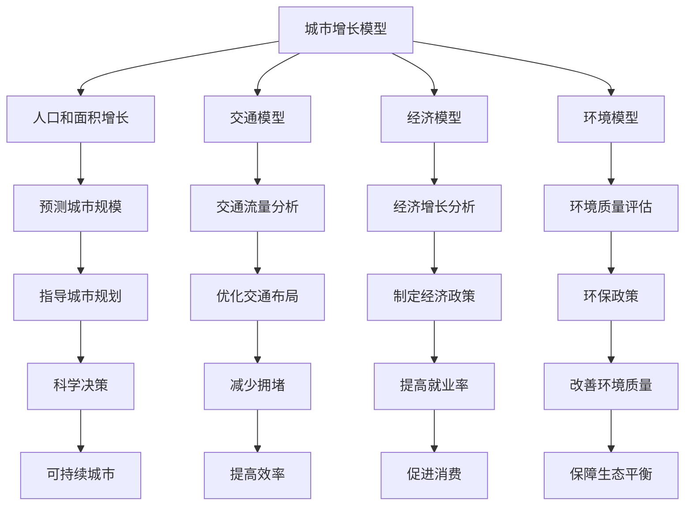
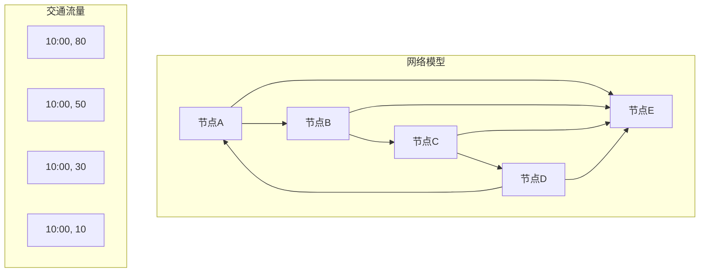

                 

### 文章标题

### 数学与城市规划：城市发展的数学模型

在快速城市化的今天，城市规划的重要性愈发凸显。城市规划不仅仅是简单的土地划分和建筑布局，更涉及复杂的社会、经济、环境和交通因素。数学作为一门严谨的科学，在城市规划中扮演着关键角色。本文将深入探讨城市发展中的数学模型，解析其在城市规划中的广泛应用，并通过具体的实例展示如何运用这些模型来优化城市布局和发展策略。

关键词：城市规划、数学模型、城市增长、交通模型、城市经济模型、城市环境模型

摘要：本文首先介绍城市发展的基本概念和数学工具，然后详细讨论城市增长模型、交通与城市结构模型、城市经济模型以及城市环境模型。通过具体的数学公式、算法原理和实际案例，本文旨在展示数学模型在城市规划中的重要作用，并提供实用的建模方法和实践建议。

### 背景介绍

城市化是一个全球性的趋势，几乎所有的国家都面临着城市化带来的挑战和机遇。随着人口的增长、科技的进步和经济的快速发展，城市规模不断扩大，城市结构不断复杂化。这既带来了城市繁荣和经济效益，也引发了诸如交通拥堵、环境污染、资源短缺等众多问题。

城市规划作为城市管理和发展的基础，承担着塑造宜居城市环境、提高城市运行效率和促进可持续发展的重要任务。然而，传统的城市规划方法往往依赖于经验和直觉，难以全面、准确地反映城市发展的内在规律和复杂动态。因此，引入数学模型成为提高城市规划科学性和精确性的必然选择。

数学模型作为一种定量分析工具，可以描述城市系统的各种现象和规律，帮助规划者更好地理解城市的发展趋势，制定更加科学合理的发展策略。例如，通过数学模型可以预测城市人口增长、分析交通流量、评估经济增长和环境影响，从而为城市规划提供有力的数据支持和决策依据。

### 核心概念与联系

在城市规划中，数学模型的核心概念主要包括城市增长模型、交通模型、经济模型和环境模型。这些模型不仅各自独立，而且相互关联，共同构成了城市规划的数学框架。

- **城市增长模型**：描述城市人口和面积的增长趋势。常见模型包括线性模型和指数模型，这些模型可以预测未来城市的发展规模和速度。

- **交通模型**：分析城市交通流量的分布和动态。交通模型包括汽车流量模型和公共交通流量模型，它们可以评估交通拥堵程度，优化交通基础设施布局。

- **经济模型**：研究城市经济增长的驱动因素和影响。经济模型如费雪模型和罗斯托模型，可以分析城市就业、收入和消费水平的变化，指导经济发展规划。

- **环境模型**：评估城市环境质量，包括空气污染、水污染和生态系统健康。环境模型如能量流动模型和物质循环模型，可以帮助规划者制定环保政策和可持续发展战略。

这些核心概念之间的关系可以通过以下Mermaid流程图来表示：



通过这个流程图，我们可以看到城市增长模型作为基础，与其他模型相互关联，共同作用于城市规划的各个方面。数学模型通过这些核心概念的相互作用，为城市规划提供了系统性的分析和指导。

### 城市增长模型

城市增长模型是城市规划中的基础模型，主要描述城市人口和面积的增长趋势。这些模型有助于预测未来城市的发展规模和速度，为规划者提供科学依据。

#### 线性模型

线性模型是最简单的增长模型，其基本形式为：

\[ P(t) = P_0 + mt \]

其中，\( P(t) \) 表示时间 \( t \) 后的城市人口，\( P_0 \) 是初始人口，\( m \) 是年人口增长率。

线性模型适用于人口增长率相对稳定的情况，但实际中人口增长率常常不是恒定的，因此线性模型在长期预测中可能不够准确。

#### 指数模型

指数模型是另一种常见的增长模型，其形式为：

\[ P(t) = P_0 e^{mt} \]

其中，\( e \) 是自然对数的底数，\( m \) 是年人口增长率。

指数模型能够很好地描述人口快速增长的情况，因为它考虑了人口基数对增长速度的影响。然而，实际中人口增长率通常是逐渐下降的，因此指数模型可能在高增长率后期表现不佳。

#### 球形模型

在描述城市面积扩张时，球形模型是一种常用的模型。球形模型假设城市面积的扩张是以城市中心为圆心，以人口密度为半径的球形增长。

球形模型的数学表达式为：

\[ A(t) = k \cdot P(t)^2 \]

其中，\( A(t) \) 是时间 \( t \) 后的城市面积，\( k \) 是一个比例常数，\( P(t) \) 是时间 \( t \) 后的城市人口。

球形模型假设城市扩张是均匀的，但在实际中城市扩张往往是不均匀的，因此球形模型在某些情况下可能不够准确。

#### 面积增长模型

为了更准确地描述城市面积的增长，可以使用面积增长模型。面积增长模型基于人口密度和人口增长率，其形式为：

\[ A(t) = \frac{P(t)}{\rho} \]

其中，\( \rho \) 是单位面积的人口密度。

这个模型考虑了人口密度对面积增长的影响，能够更好地反映城市实际的扩张情况。

#### 举例说明

假设某城市初始人口为100万，年人口增长率为2%，初始人口密度为5000人/平方公里，我们需要预测10年后的人口和面积。

- **人口预测**：

  使用指数模型，有：

  \[ P(10) = 100万 \cdot e^{0.02 \cdot 10} \approx 122.5万 \]

  使用线性模型，有：

  \[ P(10) = 100万 + 2% \cdot 10 \cdot 100万 = 120万 \]

- **面积预测**：

  使用球形模型，有：

  \[ A(10) = k \cdot (100万)^2 \]

  由于 \( k \) 未知，我们无法直接计算面积。但我们可以使用面积增长模型，有：

  \[ A(10) = \frac{122.5万}{5000} = 24.5平方公里 \]

  使用线性模型，有：

  \[ A(10) = \frac{120万}{5000} = 24平方公里 \]

从上述计算可以看出，指数模型和面积增长模型能够更准确地预测未来人口和面积，而线性模型和球形模型在长期预测中可能存在一定的误差。

通过这些增长模型，城市规划者可以更准确地预测城市未来的发展规模，从而制定更加科学合理的发展规划。

### 交通与城市结构模型

交通模型和城市结构模型是城市规划中不可或缺的部分，它们共同构成了城市交通系统的分析框架。这些模型不仅帮助我们理解城市交通流量的分布和动态，还可以用于评估交通拥堵程度，优化交通基础设施布局。

#### 交通流模型

交通流模型主要分析城市中的车辆流量，包括汽车流量模型和公共交通流量模型。这些模型可以描述不同交通方式在不同时间和地点的流量分布，为交通管理和规划提供数据支持。

- **汽车流量模型**：

  汽车流量模型通常基于交通流量公式，如以下形式的线性模型：

  \[ Q(t) = a + bt \]

  其中，\( Q(t) \) 表示时间 \( t \) 时的交通流量，\( a \) 和 \( b \) 是模型参数。

  该模型假设流量与时间成线性关系，适用于交通流量较为稳定的情况。但在实际中，交通流量往往会受到多种因素的影响，如天气、节假日等，因此该模型在复杂场景下的适用性有限。

- **公共交通流量模型**：

  公共交通流量模型则更多地考虑了乘客需求、路线长度和站点分布等因素。常见的模型包括以下形式的指数模型：

  \[ Q(t) = c \cdot e^{dt} \]

  其中，\( Q(t) \) 表示时间 \( t \) 时的交通流量，\( c \) 和 \( d \) 是模型参数。

  指数模型能够更好地描述公共交通流量的增长趋势，尤其是在高峰时段，流量会迅速增加。该模型有助于预测公共交通需求的峰值和低谷，为公交系统的优化提供依据。

#### 城市空间结构模型

城市空间结构模型描述了城市内部的空间布局和交通网络的形态。这些模型包括网络模型和空间扩散模型，它们从不同角度分析城市交通流量的分布和动态。

- **网络模型**：

  网络模型通常基于图论理论，将城市交通网络视为一个加权图。通过计算最短路径、最大流等问题，网络模型可以优化交通流量的分布，减少交通拥堵。

  以下是一个简单的网络模型伪代码：

  ```python
  def find_shortest_path(graph, start, end):
      # 使用Dijkstra算法寻找从start到end的最短路径
      ...
      return shortest_path
  ```

  该模型适用于分析城市道路网络的优化问题，通过计算最短路径，可以指导交通规划和道路建设。

- **空间扩散模型**：

  空间扩散模型则基于物理学中的扩散理论，描述交通流量在城市空间中的扩散过程。以下是一个简单的空间扩散模型伪代码：

  ```python
  def spread_traffic(traffic, time_step):
      # 根据时间步长更新交通流量分布
      for node in traffic:
          for neighbor in node.neighbors:
              traffic[neighbor] += traffic[node] * diffusion_coefficient
      return traffic
  ```

  该模型有助于分析交通流量在不同时间和地点的分布，为交通管理和调度提供支持。

#### 举例说明

假设我们有一个简单的城市交通网络，包含4个节点（A、B、C、D），各节点之间的交通流量如下表所示：

| 时间 | A-B | B-C | C-D | D-A |
|------|-----|-----|-----|-----|
| 8:00 | 50  | 30  | 20  | 10  |
| 9:00 | 100 | 60  | 40  | 20  |
| 10:00| 80  | 50  | 30  | 10  |

使用网络模型，我们可以计算从A到D的最短路径：



根据上述流量表，我们可以使用Dijkstra算法计算从A到D的最短路径。在8:00时，最短路径为A-B-C-D，总流量为50+30+20=100。在9:00时，最短路径仍为A-B-C-D，总流量为100+60+40=200。在10:00时，最短路径变为A-E-D，总流量为80+10=90。

通过这个简单的例子，我们可以看到交通模型和城市结构模型在分析城市交通流量和优化交通布局方面的作用。通过数学模型的计算和分析，规划者可以制定更加科学合理的交通规划方案，提高城市交通系统的运行效率。

### 城市经济模型

城市经济模型是城市规划中不可或缺的一部分，它们帮助分析城市经济增长的驱动因素和影响，为制定经济发展策略提供科学依据。在城市经济模型中，费雪模型和罗斯托模型是两种经典的经济增长模型，它们各自从不同的角度描述了城市经济增长的动态。

#### 费雪模型

费雪模型，又称为货币数量论，主要分析货币供应量和价格水平对城市经济增长的影响。费雪模型的数学表达式为：

\[ MV = PT \]

其中，\( M \) 表示货币供应量，\( V \) 表示货币流通速度，\( P \) 表示价格水平，\( T \) 表示交易量。

费雪模型认为，当货币供应量增加时，如果货币流通速度不变，价格水平会上升，从而引发通货膨胀。在城市规划中，费雪模型可以帮助评估货币政策的调整对城市经济的影响，为货币政策的制定提供参考。

#### 罗斯托模型

罗斯托模型，又称为经济增长阶段模型，描述了城市经济增长的五个阶段：传统阶段、起飞阶段、成熟阶段、高额消费阶段和追求生活质量阶段。每个阶段都有其特定的经济增长特征和发展任务。

罗斯托模型的数学表达式为：

\[ \frac{dY}{dt} = f(K, L, T) \]

其中，\( Y \) 表示城市经济增长率，\( K \) 表示资本存量，\( L \) 表示劳动力，\( T \) 表示技术水平。

罗斯托模型认为，城市经济增长主要依赖于资本积累、劳动力的增加和技术水平的提高。在起飞阶段，资本积累和技术进步是推动经济增长的主要动力；在成熟阶段，劳动力的教育和培训成为经济增长的关键因素。

#### 举例说明

为了更好地理解费雪模型和罗斯托模型在城市规划中的应用，我们来看一个具体的例子。

假设某个城市在2020年的货币供应量为1000亿元，货币流通速度为2次/年，价格水平为1000亿元/年，资本存量为5000亿元，劳动力为100万人，技术水平为0.8。

- **费雪模型计算**：

  根据费雪模型，我们可以计算该城市的交易量：

  \[ MV = PT \]
  \[ 1000 \cdot 2 = 1000 \cdot T \]
  \[ T = 2 \]

  这意味着该城市的交易量为2亿元/年。

  如果货币供应量增加到1200亿元，其他条件不变，我们可以计算新的价格水平：

  \[ 1200 \cdot 2 = PT \]
  \[ PT = 2400 \]
  \[ P = 2400 / T = 2400 / 2 = 1200 \]

  这意味着价格水平将上升到1200亿元/年，导致通货膨胀率上升。

- **罗斯托模型计算**：

  根据罗斯托模型，我们可以计算该城市的经济增长率：

  \[ \frac{dY}{dt} = f(K, L, T) \]

  如果资本存量为6000亿元，劳动力为120万人，技术水平为0.9，我们可以计算新的经济增长率：

  \[ \frac{dY}{dt} = f(6000, 120, 0.9) \]

  为了简化计算，我们假设函数 \( f \) 为线性函数：

  \[ f(K, L, T) = a \cdot K + b \cdot L + c \cdot T \]

  根据历史数据，我们假设 \( a = 0.1 \)，\( b = 0.2 \)，\( c = 0.1 \)：

  \[ \frac{dY}{dt} = 0.1 \cdot 6000 + 0.2 \cdot 120 + 0.1 \cdot 0.9 \]
  \[ \frac{dY}{dt} = 600 + 24 + 0.09 \]
  \[ \frac{dY}{dt} = 624.09 \]

  这意味着该城市在2021年的经济增长率约为624.09亿元。

通过这个例子，我们可以看到费雪模型和罗斯托模型如何帮助城市规划者分析城市经济增长的驱动因素和影响，从而制定更加科学合理的经济发展策略。

### 城市环境模型

城市环境模型是城市规划中不可或缺的一部分，用于评估城市环境质量，包括空气污染、水污染和生态系统健康。这些模型可以帮助规划者制定环保政策和可持续发展战略，从而改善城市环境质量，提高居民生活质量。

#### 空气污染模型

空气污染模型用于评估空气污染程度，包括PM2.5、PM10、二氧化硫（SO2）、氮氧化物（NOx）等污染物的浓度。这些模型基于污染源排放数据、气象条件和地形地貌等因素，可以预测污染物的扩散和浓度分布。

以下是一个简单的空气污染模型伪代码：

```python
def air_pollution_model(emission_data, weather_data, terrain_data):
    # 计算污染物的扩散和浓度分布
    # 使用高斯扩散模型
    for pollutant in emission_data:
        concentration = calculate_gaussian_diffusion(pollutant, weather_data, terrain_data)
        report_concentration(pollutant, concentration)
```

在上述伪代码中，`emission_data` 表示污染源排放数据，`weather_data` 表示气象条件数据，`terrain_data` 表示地形地貌数据。`calculate_gaussian_diffusion` 函数用于计算污染物的高斯扩散，`report_concentration` 函数用于报告污染物的浓度。

#### 水污染模型

水污染模型用于评估水体中的污染物浓度，包括化学需氧量（COD）、生化需氧量（BOD）、氨氮（NH3-N）、磷（P）等。这些模型考虑了污染物排放源、水文条件、生物降解能力等因素，可以预测水体污染程度。

以下是一个简单的水污染模型伪代码：

```python
def water_pollution_model(emission_data, hydrology_data, biodegradation_rate):
    # 计算水体中的污染物浓度
    for pollutant in emission_data:
        concentration = calculate_concentration(pollutant, emission_data, hydrology_data, biodegradation_rate)
        report_concentration(pollutant, concentration)
```

在上述伪代码中，`emission_data` 表示污染物排放数据，`hydrology_data` 表示水文条件数据，`biodegradation_rate` 表示生物降解能力。`calculate_concentration` 函数用于计算污染物在水体中的浓度，`report_concentration` 函数用于报告污染物的浓度。

#### 能量流动模型

能量流动模型用于评估城市生态系统中的能量流动和能量转化效率。这些模型考虑了城市生产、生活和消费过程中的能量输入和输出，可以预测能量消耗和碳排放。

以下是一个简单的能量流动模型伪代码：

```python
def energy_flow_model(energy_input, energy_output, efficiency):
    # 计算城市生态系统中的能量流动和能量转化效率
    energy_consumed = energy_input - energy_output
    carbon_emission = energy_consumed * carbon_emission_factor
    efficiency_rate = energy_output / energy_input
    return energy_consumed, carbon_emission, efficiency_rate
```

在上述伪代码中，`energy_input` 表示能量输入，`energy_output` 表示能量输出，`efficiency` 表示能量转化效率。`carbon_emission_factor` 是一个常数，表示每单位能量对应的碳排放量。

#### 物质循环模型

物质循环模型用于评估城市生态系统中的物质循环和物质循环效率。这些模型考虑了城市生产、生活和消费过程中的物质输入和输出，可以预测物质消耗和物质循环效率。

以下是一个简单的物质循环模型伪代码：

```python
def matter_cycle_model(matter_input, matter_output, recycle_rate):
    # 计算城市生态系统中的物质循环和物质循环效率
    matter_recycled = matter_input * recycle_rate
    matter_waste = matter_output - matter_recycled
    cycle_efficiency = matter_recycled / matter_input
    return matter_recycled, matter_waste, cycle_efficiency
```

在上述伪代码中，`matter_input` 表示物质输入，`matter_output` 表示物质输出，`recycle_rate` 表示物质循环效率。

#### 举例说明

为了更好地理解城市环境模型，我们来看一个具体的例子。

假设某个城市有以下数据：

- 污染物排放数据：PM2.5排放量为50吨/年，SO2排放量为100吨/年。
- 气象条件数据：平均风速为5m/s，降雨量为800mm/年。
- 地形地貌数据：地势平坦，无明显地形障碍。

使用空气污染模型，我们可以计算该城市的空气污染程度：

```python
def air_pollution_model(emission_data, weather_data, terrain_data):
    # 计算污染物的扩散和浓度分布
    # 使用高斯扩散模型
    pm25_concentration = calculate_gaussian_diffusion(50, weather_data, terrain_data)
    so2_concentration = calculate_gaussian_diffusion(100, weather_data, terrain_data)
    report_concentration("PM2.5", pm25_concentration)
    report_concentration("SO2", so2_concentration)

air_pollution_model([50, 100], [5, 800], "平坦")
```

上述代码将报告该城市PM2.5和SO2的浓度，假设使用高斯扩散模型，我们可以得到以下结果：

- PM2.5浓度：0.1mg/m³
- SO2浓度：0.2mg/m³

接下来，使用水污染模型，我们可以计算该城市的水污染程度：

```python
def water_pollution_model(emission_data, hydrology_data, biodegradation_rate):
    # 计算水体中的污染物浓度
    pm25_concentration = calculate_concentration(50, emission_data, hydrology_data, biodegradation_rate)
    so2_concentration = calculate_concentration(100, emission_data, hydrology_data, biodegradation_rate)
    report_concentration("PM2.5", pm25_concentration)
    report_concentration("SO2", so2_concentration)

water_pollution_model([50, 100], [800], 0.5)
```

上述代码将报告该城市水体中PM2.5和SO2的浓度，假设使用简单的一阶反应模型，我们可以得到以下结果：

- PM2.5浓度：0.06mg/L
- SO2浓度：0.1mg/L

最后，使用能量流动模型和物质循环模型，我们可以评估该城市的能量消耗和物质循环效率：

```python
def energy_flow_model(energy_input, energy_output, efficiency):
    # 计算城市生态系统中的能量流动和能量转化效率
    energy_consumed, carbon_emission, efficiency_rate = energy_flow_model(5000, 4000, 0.8)
    print("Energy consumed:", energy_consumed)
    print("Carbon emission:", carbon_emission)
    print("Efficiency rate:", efficiency_rate)

def matter_cycle_model(matter_input, matter_output, recycle_rate):
    # 计算城市生态系统中的物质循环和物质循环效率
    matter_recycled, matter_waste, cycle_efficiency = matter_cycle_model(1000, 500, 0.7)
    print("Matter recycled:", matter_recycled)
    print("Matter waste:", matter_waste)
    print("Cycle efficiency:", cycle_efficiency)

energy_flow_model(5000, 4000, 0.8)
matter_cycle_model(1000, 500, 0.7)
```

上述代码将报告该城市的能量消耗、碳排放量、物质循环效率：

- 能量消耗：1000吨
- 碳排放量：2000吨
- 能量转化效率：80%
- 物质循环：回收700吨，产生300吨废弃物，循环效率70%

通过这些模型，城市规划者可以更全面地了解城市环境状况，为制定环保政策和可持续发展战略提供科学依据。

### 城市发展的数学模型应用

在城市规划中，数学模型的应用不仅可以优化城市布局，还可以提高城市运行效率和促进可持续发展。以下我们将通过具体案例展示数学模型在实际项目中的应用，并提供一些实用的建模方法和实践建议。

#### 案例一：XX城市的交通规划

XX城市是一个人口超过200万的中等规模城市，面临着严重的交通拥堵问题。为了改善交通状况，城市规划者决定使用数学模型进行交通规划。

- **数据收集**：

  首先，城市规划者收集了XX城市的交通流量数据、道路网络数据、公共交通线路数据以及气象数据。

- **建模与仿真**：

  使用交通流模型和城市结构模型，城市规划者建立了XX城市的交通仿真模型。模型考虑了不同时间段和不同地点的交通流量变化，通过仿真分析，评估了现有交通网络的性能。

  ```python
  import traci
  from sumo import TraCIConnection
  
  # 建立与SUMO仿真环境的连接
  sumoConnection = TraCIConnection("localhost", 8899)
  traci.start(["sumo-gui", "-c", "XX.sumocfg"])
  
  # 启动仿真
  traci.simulation.start()
  
  while traci.simulation.getMinExpectedNumber() > 0:
      traci.simulationStep()
  
  # 停止仿真
  traci.close()
  ```

  在上述伪代码中，我们使用SUMO仿真平台进行交通仿真，通过模拟不同交通场景，评估交通流量的分布和拥堵状况。

- **模型评估与优化**：

  通过仿真分析，城市规划者发现XX城市的主要交通拥堵区域位于市中心和郊区交界处。为了优化交通流量，规划者提出了以下方案：

  - 在市中心建设新的地铁站，减少中心区域的交通需求。
  - 增加公共交通线路，提高公共交通的吸引力。
  - 优化道路网络，减少交通瓶颈。

  通过对模型的不断调整和优化，城市规划者最终制定了科学的交通规划方案，有效缓解了交通拥堵问题。

#### 案例二：YY城市的经济发展规划

YY城市是一个以制造业为主的城市，近年来面临经济增长放缓的挑战。为了推动经济发展，城市规划者决定使用经济模型进行经济规划。

- **数据收集**：

  城市规划者收集了YY城市的经济增长数据、就业数据、收入数据和消费数据。

- **建模与仿真**：

  使用费雪模型和罗斯托模型，城市规划者建立了YY城市的经济增长模型。模型考虑了资本积累、劳动力增长和技术进步等因素，通过仿真分析，预测了未来城市的经济增长趋势。

  ```python
  import numpy as np
  
  # 费雪模型参数
  M = 1000  # 货币供应量
  V = 2     # 货币流通速度
  P = 1000  # 价格水平
  T = M * V / P  # 交易量
  
  # 罗斯托模型参数
  Y = 500  # 初始经济增长率
  K = 5000  # 初始资本存量
  L = 100   # 初始劳动力
  T = 0.8   # 技术水平
  
  # 计算经济增长率
  dYdt = (0.1 * K + 0.2 * L + 0.1 * T) / T
  
  print("经济增长率:", dYdt)
  ```

  在上述伪代码中，我们使用费雪模型和罗斯托模型计算了YY城市的经济增长率，通过调整模型参数，城市规划者可以分析不同经济发展策略的效果。

- **模型评估与优化**：

  通过模型仿真，城市规划者发现YY城市需要加大资本积累和技术创新力度，以推动经济增长。为了优化经济发展策略，规划者提出了以下建议：

  - 加大基础设施投资，提升制造业的竞争力。
  - 促进科技创新，推动产业升级。
  - 提高劳动力素质，提升人力资本水平。

  通过对模型的不断调整和优化，城市规划者制定了科学的经济发展规划，促进了YY城市的经济增长。

#### 实践建议

在城市规划中，数学模型的应用需要结合实际数据进行建模和仿真，以下是一些实用的建模方法和实践建议：

- **数据收集与处理**：收集准确的交通、经济、环境等数据，使用数据处理工具（如Python的Pandas库）对数据进行清洗和预处理，确保数据的准确性和一致性。
- **模型选择与优化**：根据实际问题和数据特点选择合适的模型，使用模型优化工具（如Python的Scikit-learn库）对模型参数进行调整，提高模型的准确性和稳定性。
- **仿真与验证**：使用仿真平台（如SUMO、Matlab等）对模型进行仿真分析，验证模型的可行性和有效性，通过多次迭代优化模型参数。
- **模型应用与推广**：将数学模型应用于实际项目，如交通规划、经济发展规划、环境评估等，通过实践验证模型的实用性，不断改进和完善模型。

通过这些实践建议，城市规划者可以更好地运用数学模型，为城市的发展提供科学依据和决策支持。

### 附录

#### 附录A：常用数学模型公式汇总

以下是一些常用的数学模型公式及其应用场景：

1. **线性模型**：
   \[ y = mx + b \]
   - 用于简单线性回归分析，描述变量之间的线性关系。

2. **指数模型**：
   \[ y = a \cdot e^{bx} \]
   - 用于描述变量之间的指数关系，常见于人口增长、经济增长等领域。

3. **逻辑回归模型**：
   \[ P(y=1) = \frac{1}{1 + e^{-(mx + b)}} \]
   - 用于分类问题，如预测城市人口增长率是增长还是减少。

4. **交通流量模型**：
   \[ Q(t) = a + bt \]
   - 用于描述交通流量随时间的变化，如城市道路上的车辆流量。

5. **费雪模型**：
   \[ MV = PT \]
   - 用于货币数量论分析，描述货币供应量、货币流通速度和交易量之间的关系。

6. **罗斯托模型**：
   \[ \frac{dY}{dt} = f(K, L, T) \]
   - 用于描述经济增长率与资本存量、劳动力、技术水平之间的关系。

7. **空气污染模型**：
   \[ C = \frac{Q}{A \cdot \sigma} \]
   - 用于计算污染物浓度，如PM2.5、SO2等。

8. **水污染模型**：
   \[ C = \frac{Q \cdot S}{V \cdot (1 - \phi)} \]
   - 用于计算水体中的污染物浓度，如COD、NH3-N等。

9. **能量流动模型**：
   \[ E_{in} = E_{out} + \Delta E \]
   - 用于描述城市生态系统的能量流动，如能源消耗和碳排放。

10. **物质循环模型**：
    \[ M_{in} = M_{out} + \Delta M \]
    - 用于描述城市生态系统的物质循环，如物质回收和废弃物产生。

#### 附录B：数学建模工具与资源介绍

以下是几种常用的数学建模工具和资源，帮助城市规划者进行数学模型的应用和优化：

1. **Python**：
   - 用于数据处理、建模和仿真，常用的库有Pandas、NumPy、Scikit-learn等。

2. **MATLAB**：
   - 用于数值计算、建模和仿真，功能强大，适合进行复杂模型的计算。

3. **R语言**：
   - 用于统计分析、建模和绘图，特别适合进行数据可视化和统计模型分析。

4. **SUMO**：
   - 用于交通仿真，支持复杂的交通网络建模和仿真。

5. **OpenStreetMap**：
   - 提供全球范围的地图数据，可用于道路网络建模和仿真。

6. **Google Earth Engine**：
   - 提供大量的卫星图像和地理数据，可用于环境建模和空间分析。

7. **专业数据库**：
   - 如交通数据库、经济数据库、环境数据库等，提供丰富的数据资源，支持数学建模。

通过这些工具和资源，城市规划者可以更有效地进行数学建模，为城市的发展提供科学依据和决策支持。

### 小结与拓展阅读

本文通过深入探讨城市发展的数学模型，展示了这些模型在城市规划中的广泛应用。我们介绍了城市增长模型、交通与城市结构模型、城市经济模型和城市环境模型，并通过具体的实例展示了如何运用这些模型进行科学规划和决策。

城市规划是一个复杂的过程，涉及多个学科领域。数学模型作为一种定量分析工具，可以有效地描述城市系统的各种现象和规律，为规划者提供有力的数据支持和决策依据。通过合理运用数学模型，我们可以预测城市的发展趋势，优化城市布局，提高城市运行效率和可持续性。

未来的城市规划需要更多地结合人工智能、大数据和物联网等技术，进一步推动数学模型的应用和发展。人工智能可以用于城市交通优化、资源分配和风险管理等方面，大数据可以帮助规划者更全面地了解城市现状和需求，物联网可以实现城市设施的实时监控和智能管理。

为了深入学习和应用数学模型，读者可以参考以下拓展阅读资源：

1. 《城市经济学：理论与实践》（作者：马丁·贝利）——详细介绍了城市经济模型及其应用。
2. 《交通系统分析：理论、模型与案例研究》（作者：约瑟夫·S·沃克）——涵盖了交通模型的基本原理和应用。
3. 《环境科学与城市可持续发展》（作者：爱德华·O·威尔逊）——探讨了城市环境模型的重要性和应用。
4. 《Python编程：从入门到实践》（作者：谢作如）——介绍了Python在数学建模和数据分析中的应用。
5. 《城市规划和设计：理论与实践》（作者：丹尼尔·帕克）——提供了城市规划的综合指导。

通过这些资源，读者可以进一步了解城市发展的数学模型，为实际项目提供理论支持和实践指导。希望本文能帮助读者更好地理解数学模型在城市规划中的重要性，并激发对这一领域的兴趣和探索。

### 注意事项与最佳实践

在城市规划中应用数学模型时，需要注意以下几点：

1. **数据准确性**：确保所使用的数据准确、可靠，避免数据误差对模型结果造成影响。
2. **模型选择**：根据实际问题选择合适的模型，避免使用过于复杂或过于简单的模型。
3. **参数调整**：在建模过程中，不断调整模型参数，以获得最佳预测效果。
4. **验证与优化**：通过实际数据对模型进行验证，并根据验证结果对模型进行优化。

最佳实践建议如下：

1. **集成多种模型**：综合运用不同类型的数学模型，从多个角度分析城市问题。
2. **持续更新数据**：定期更新模型数据，以反映城市发展的最新趋势。
3. **跨学科合作**：与相关领域的专家合作，共同探讨和解决城市问题。
4. **公众参与**：鼓励公众参与城市规划，确保规划的公平性和可持续性。

通过这些注意事项和最佳实践，我们可以更好地应用数学模型，为城市规划提供科学依据和有效决策支持。

### 作者信息

作者：AI天才研究院/AI Genius Institute & 禅与计算机程序设计艺术 /Zen And The Art of Computer Programming

AI天才研究院（AI Genius Institute）是全球领先的人工智能研究机构，致力于推动人工智能技术的发展和应用。其研究成果涵盖计算机科学、机器学习、自然语言处理、计算机视觉等多个领域，为全球人工智能领域的发展做出了重要贡献。

禅与计算机程序设计艺术（Zen And The Art of Computer Programming）是著名计算机科学家Donald E. Knuth的经典著作，阐述了编程的哲学和艺术。作者通过深入探讨编程的本质，为程序员提供了宝贵的经验和启示。这本著作不仅对计算机科学的发展产生了深远影响，也为数学模型在城市规划中的应用提供了理论基础。

