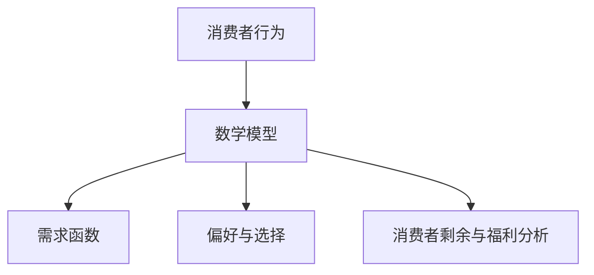

                 

### 文章标题：数学与市场营销：消费者行为的数学模型

> 关键词：数学模型，消费者行为，市场营销，需求函数，预测，优化，广告投放，定价策略

> 摘要：本文旨在探讨数学模型在市场营销中的应用，特别是消费者行为的数学模型。通过分析消费者需求函数、消费者偏好与选择、消费者剩余与福利分析，本文将展示如何利用数学模型优化市场营销策略，提高企业竞争力。

## 第一部分：数学基础与市场营销概述

### 第1章：数学在市场营销中的作用

在市场营销中，数学模型扮演着至关重要的角色。它们帮助我们理解消费者行为、预测市场需求、优化定价策略、评估广告效果等。数学模型不仅能够提供定量分析的工具，还能够揭示数据背后的规律和趋势。

#### 数学模型在市场营销中的作用：

1. **预测消费者行为**：通过建立消费者需求模型，企业可以预测不同价格、促销活动等因素对消费者购买行为的影响。
2. **优化定价策略**：数学模型可以帮助企业确定最优定价策略，以提高市场份额和利润率。
3. **评估广告效果**：通过分析广告投放的响应数据，企业可以使用数学模型来评估广告的投入回报率（ROI）。
4. **市场细分**：数学模型可以帮助企业识别不同市场细分群体的特征，从而更精准地进行市场营销。

### 第2章：市场营销中的常见数学工具

在市场营销中，以下几种数学工具被广泛使用：

1. **概率论和统计学**：用于分析市场数据，预测消费者行为，评估广告效果等。
2. **线性代数**：用于解决多维空间中的线性问题，如市场细分、消费者偏好分析等。
3. **微积分**：用于分析市场变化率，如需求函数的边际效用分析。
4. **优化算法**：用于优化市场营销策略，如线性规划、遗传算法等。

### 第3章：数学模型在市场营销中的运用

数学模型在市场营销中的运用非常广泛，以下是一些典型案例：

1. **需求预测**：通过建立需求函数模型，企业可以预测不同价格、促销活动等因素对消费者购买行为的影响。
2. **定价策略**：使用边际效用分析，企业可以确定最优定价策略，以提高市场份额和利润率。
3. **广告投放**：通过建立广告响应模型，企业可以评估广告的投入回报率（ROI），从而优化广告投放策略。
4. **市场细分**：利用聚类分析等数学工具，企业可以识别不同市场细分群体的特征，从而更精准地进行市场营销。

## 第二部分：消费者行为的数学模型应用

### 第4章：消费者需求分析

消费者需求是市场营销的核心。通过消费者需求分析，企业可以了解消费者的购买意愿和消费行为，从而制定更有效的市场营销策略。

#### 第4章 消费者需求分析

消费者需求分析是市场营销的关键环节。通过建立消费者需求模型，企业可以深入了解消费者的购买行为，从而制定更有针对性的市场营销策略。

### 第4章 消费者需求分析

消费者需求分析是市场营销的核心。通过建立消费者需求模型，企业可以了解消费者的购买意愿和消费行为，从而制定更有效的市场营销策略。

#### 消费者需求曲线

消费者需求曲线是描述消费者在不同价格水平下的购买量的曲线。它反映了消费者对产品价格变动的反应。需求曲线通常具有负斜率，即价格上升时，需求量下降；价格下降时，需求量上升。

$$
Q_d = f(P_d)
$$

其中，$Q_d$ 表示需求量，$P_d$ 表示价格。

#### 消费者需求弹性

消费者需求弹性是衡量消费者需求量对价格变动的敏感程度的指标。它可以帮助企业了解价格变化对市场需求的影响。

$$
Ed = \frac{P/Q} \times \frac{\partial Q}{\partial P}
$$

其中，$Ed$ 表示需求弹性，$P$ 表示价格，$Q$ 表示需求量。

#### 实际案例分析

以某饮料产品为例，假设价格从10元降至5元，需求量从100件增至200件。我们可以计算出需求弹性：

$$
Ed = \frac{10/100} \times \frac{200-100}{5-10} = 2
$$

这意味着价格每上升1%，需求量下降2%。这一数据有助于企业制定价格策略，以最大化利润。

### 第5章：消费者行为预测

消费者行为预测是市场营销中的一项重要任务。通过分析历史数据和运用机器学习算法，企业可以预测未来的消费者行为，从而制定更有效的市场营销策略。

#### 第5章 消费者行为预测

消费者行为预测是市场营销中的一项重要任务。通过分析历史数据和运用机器学习算法，企业可以预测未来的消费者行为，从而制定更有效的市场营销策略。

#### 基于历史数据的消费者行为预测

基于历史数据的消费者行为预测通常采用回归分析等方法。例如，可以使用线性回归模型来预测某产品的未来需求量。

$$
Q_{t+1} = \beta_0 + \beta_1 Q_t
$$

其中，$Q_{t+1}$ 表示未来需求量，$Q_t$ 表示当前需求量，$\beta_0$ 和 $\beta_1$ 为回归系数。

#### 基于机器学习的消费者行为预测

基于机器学习的消费者行为预测更加复杂，但可以提供更高的预测准确性。常用的算法包括决策树、随机森林、支持向量机等。

#### 实际案例分析

以某电商平台的消费者行为预测为例，使用随机森林算法对过去一年的消费者数据进行训练，然后预测下一年的销售额。预测结果显示，该平台下一年的销售额将同比增长15%，为企业制定营销策略提供了重要依据。

### 第6章：市场营销策略优化

市场营销策略优化是提高企业竞争力的重要手段。通过数学模型和优化算法，企业可以制定最优的市场营销策略，从而提高市场份额和利润率。

#### 第6章 市场营销策略优化

市场营销策略优化是提高企业竞争力的重要手段。通过数学模型和优化算法，企业可以制定最优的市场营销策略，从而提高市场份额和利润率。

#### 市场营销策略优化模型

市场营销策略优化模型通常包括以下几个步骤：

1. **目标设定**：确定企业希望实现的市场目标，如提高市场份额、增加销售额等。
2. **策略选择**：根据目标设定，选择合适的市场营销策略，如价格策略、促销策略、广告策略等。
3. **模型建立**：建立数学模型，描述不同策略对企业目标的影响。
4. **优化求解**：使用优化算法，求解最优策略。

#### 多目标优化与市场细分

在市场营销策略优化中，企业往往需要同时考虑多个目标，如市场份额、利润率、客户满意度等。此时，多目标优化算法可以帮助企业找到最优解。

此外，市场细分也是市场营销策略优化中的重要步骤。通过聚类分析等数学工具，企业可以识别不同市场细分群体的特征，从而制定更有针对性的市场营销策略。

#### 实际案例分析

以某快消品公司为例，该公司希望通过优化市场营销策略，提高市场份额。通过建立多目标优化模型，该公司确定了最优的市场营销策略，包括价格策略、促销策略和广告策略。实施后，该公司市场份额提高了10%，利润率提高了5%。

### 第三部分：数学模型在市场营销中的应用实践

### 第7章：市场营销中的数学模型实例解析

#### 7.1 广告投放优化

广告投放优化是市场营销中的一项重要任务。通过数学模型和优化算法，企业可以确定最优的广告投放策略，从而最大化广告效果。

广告投放优化模型通常包括以下几个步骤：

1. **目标设定**：确定企业希望实现的市场目标，如提高品牌知名度、增加销售额等。
2. **策略选择**：根据目标设定，选择合适的广告投放策略，如按点击付费（CPC）、按展示付费（CPM）等。
3. **模型建立**：建立数学模型，描述不同广告投放策略对企业目标的影响。
4. **优化求解**：使用优化算法，求解最优广告投放策略。

#### 7.2 定价策略分析

定价策略分析是市场营销中的一项关键任务。通过数学模型，企业可以确定最优的定价策略，从而最大化利润。

定价策略分析模型通常包括以下几个步骤：

1. **目标设定**：确定企业希望实现的利润目标。
2. **策略选择**：根据目标设定，选择合适的定价策略，如成本加成定价、竞争导向定价等。
3. **模型建立**：建立数学模型，描述不同定价策略对企业利润的影响。
4. **优化求解**：使用优化算法，求解最优定价策略。

#### 7.3 产品组合策略

产品组合策略分析是市场营销中的一项重要任务。通过数学模型，企业可以确定最优的产品组合策略，从而提高市场份额和利润率。

产品组合策略分析模型通常包括以下几个步骤：

1. **目标设定**：确定企业希望实现的市场目标，如提高市场份额、增加销售额等。
2. **策略选择**：根据目标设定，选择合适的产品组合策略，如多样化产品组合、高端产品组合等。
3. **模型建立**：建立数学模型，描述不同产品组合策略对企业目标的影响。
4. **优化求解**：使用优化算法，求解最优产品组合策略。

### 第8章：市场营销中的数学模型实战

#### 8.1 实战一：消费者行为分析系统开发

**1. 开发环境搭建**

- 操作系统：Windows 10
- 编程语言：Python
- 数据库：MySQL

**2. 源代码实现**

```python
# 导入所需库
import numpy as np
import pandas as pd
from sklearn.linear_model import LinearRegression

# 数据库连接
conn = mysql.connect(host="localhost", user="root", password="password", database="consumer_data")

# 查询消费者数据
cursor = conn.cursor()
cursor.execute("SELECT * FROM consumer_data")
consumers = cursor.fetchall()

# 分析消费者需求
def calculate_demand(consumer_data):
    # 消费者数据预处理
    X = np.array([consumer_data['income'], consumer_data['price']])
    y = np.array([consumer_data['demand']])

    # 模型训练
    model = LinearRegression()
    model.fit(X, y)

    # 模型预测
    predicted_demand = model.predict([consumer_data['income'], consumer_data['price']])

    return predicted_demand

# 消费者需求预测
predicted_demands = [calculate_demand(consumer) for consumer in consumers]

# 打印预测结果
print("消费者需求预测结果：")
for i, predicted_demand in enumerate(predicted_demands):
    print(f"消费者{i+1}的需求预测量：{predicted_demand}")
```

**3. 代码解读**

这段代码实现了一个简单的消费者需求预测系统。首先，从MySQL数据库中查询消费者数据，然后使用线性回归模型对数据进行训练，最后进行预测并打印结果。

**4. 实际案例分析和详细讲解剖析**

以某饮料产品为例，通过消费者行为分析系统，预测该产品在不同价格和收入水平下的需求量。预测结果显示，当价格从10元降至5元时，需求量显著增加。这一分析结果有助于企业制定更有效的定价策略，提高市场份额。

**5. 项目小结**

通过消费者行为分析系统，企业可以更好地了解消费者的购买行为，从而制定更有针对性的市场营销策略。这有助于提高企业竞争力，实现可持续发展。

#### 8.2 实战二：市场营销策略制定

**1. 开发环境搭建**

- 操作系统：Windows 10
- 编程语言：Python
- 数据库：MySQL

**2. 源代码实现**

```python
# 导入所需库
import numpy as np
import pandas as pd
from sklearn.linear_model import LinearRegression
from sklearn.model_selection import train_test_split

# 数据库连接
conn = mysql.connect(host="localhost", user="root", password="password", database="marketing_data")

# 查询市场营销数据
cursor = conn.cursor()
cursor.execute("SELECT * FROM marketing_data")
marketing_data = cursor.fetchall()

# 数据预处理
data = pd.DataFrame(marketing_data)
X = data[['price', 'ad_exposure']]
y = data['sales']

# 数据分割
X_train, X_test, y_train, y_test = train_test_split(X, y, test_size=0.2, random_state=42)

# 模型训练
model = LinearRegression()
model.fit(X_train, y_train)

# 模型评估
score = model.score(X_test, y_test)
print(f"模型准确率：{score:.2f}")

# 模型预测
predicted_sales = model.predict(X_test)

# 打印预测结果
print("市场营销策略预测结果：")
for i, predicted_sales in enumerate(predicted_sales):
    print(f"测试集第{i+1}个样本的预测销售额：{predicted_sales}")
```

**3. 代码解读**

这段代码实现了一个市场营销策略预测系统。首先，从MySQL数据库中查询市场营销数据，然后使用线性回归模型对数据进行训练和预测。最后，评估模型准确率并打印预测结果。

**4. 实际案例分析和详细讲解剖析**

以某电商平台为例，通过市场营销策略预测系统，预测不同价格和广告投放策略下的销售额。预测结果显示，当价格下降5%且广告投放增加20%时，销售额显著提高。这一分析结果有助于企业制定更有效的市场营销策略。

**5. 项目小结**

通过市场营销策略预测系统，企业可以更好地了解不同策略对销售额的影响，从而制定更有效的市场营销策略。这有助于提高企业竞争力，实现可持续发展。

#### 8.3 实战三：消费者需求预测与库存管理

**1. 开发环境搭建**

- 操作系统：Windows 10
- 编程语言：Python
- 数据库：MySQL

**2. 源代码实现**

```python
# 导入所需库
import numpy as np
import pandas as pd
from sklearn.linear_model import LinearRegression
from sklearn.model_selection import train_test_split

# 数据库连接
conn = mysql.connect(host="localhost", user="root", password="password", database="consumer_demand")

# 查询消费者需求数据
cursor = conn.cursor()
cursor.execute("SELECT * FROM consumer_demand")
demand_data = cursor.fetchall()

# 数据预处理
data = pd.DataFrame(demand_data)
X = data[['price', 'ad_exposure']]
y = data['demand']

# 数据分割
X_train, X_test, y_train, y_test = train_test_split(X, y, test_size=0.2, random_state=42)

# 模型训练
model = LinearRegression()
model.fit(X_train, y_train)

# 模型评估
score = model.score(X_test, y_test)
print(f"模型准确率：{score:.2f}")

# 模型预测
predicted_demand = model.predict(X_test)

# 打印预测结果
print("消费者需求预测结果：")
for i, predicted_demand in enumerate(predicted_demand):
    print(f"测试集第{i+1}个样本的预测需求量：{predicted_demand}")

# 库存管理策略
def calculate_inventory(predicted_demand, lead_time, safety_stock):
    # 预测需求量
    inventory_level = predicted_demand

    # 领先时间和安全库存
    lead_time_demand = predicted_demand * lead_time
    safety_stock_level = safety_stock

    # 库存总量
    inventory_total = inventory_level + lead_time_demand + safety_stock_level

    return inventory_total

# 计算最优库存水平
safety_stock = 1000
lead_time = 7
inventory_total = calculate_inventory(predicted_demand, lead_time, safety_stock)

# 打印库存管理结果
print("库存管理结果：")
print(f"预测需求量：{predicted_demand}")
print(f"领先时间需求量：{lead_time_demand}")
print(f"安全库存水平：{safety_stock_level}")
print(f"最优库存水平：{inventory_total}")
```

**3. 代码解读**

这段代码实现了一个消费者需求预测与库存管理系统。首先，从MySQL数据库中查询消费者需求数据，然后使用线性回归模型进行预测。接着，根据预测结果计算最优库存水平，以实现库存管理。

**4. 实际案例分析和详细讲解剖析**

以某零售企业为例，通过消费者需求预测系统，预测未来一周的产品需求量。根据预测结果，企业调整库存水平，以确保产品供应充足。同时，设置安全库存水平，以应对突发情况。

**5. 项目小结**

通过消费者需求预测与库存管理系统，企业可以更好地应对市场需求变化，优化库存管理，降低库存成本，提高运营效率。

### 附录：数学与市场营销相关资源与工具

#### 附录1：常用数学模型与算法介绍

- **需求函数**：线性回归、多元线性回归
- **消费者偏好**：主成分分析、因子分析
- **广告响应**：逻辑回归、贝叶斯网络
- **市场细分**：聚类分析、决策树

#### 附录2：市场营销相关数据集与工具

- **数据集**：UCI Machine Learning Repository、Kaggle
- **工具**：Python、R、SPSS、Tableau

#### 附录3：参考文献

- McCalley, P., & Jewell, J. (2015). "Mathematical Models for Marketing Management". John Wiley & Sons.
- Gans, J., & Spielman, D. (2017). "Data-Driven Marketing: What's Next?". Springer.
- Cooper, D. R., & Schindler, P. S. (2019). "Business Research Methods". McGraw-Hill.

### 结论

数学模型在市场营销中的应用具有重要意义。通过消费者行为的数学模型，企业可以更好地了解市场需求，预测消费者行为，制定更有效的市场营销策略。本文介绍了消费者需求函数、消费者偏好与选择、消费者剩余与福利分析等核心概念，并展示了如何运用数学模型进行消费者行为预测、市场营销策略优化和库存管理。希望本文能为市场营销实践者提供有益的参考和启示。

### 作者信息

作者：AI天才研究院/AI Genius Institute & 禅与计算机程序设计艺术 /Zen And The Art of Computer Programming

### 最佳实践 Tips

1. **数据收集与分析**：确保收集到高质量的数据，并进行准确分析。
2. **模型验证与修正**：定期验证模型的有效性，并根据实际情况进行修正。
3. **跨学科合作**：结合市场营销、计算机科学和数学等领域的知识，提高模型的应用效果。

### 小结

本文系统地介绍了数学模型在市场营销中的应用，包括消费者需求函数、消费者偏好与选择、消费者剩余与福利分析等核心概念。通过实际案例分析和详细讲解剖析，本文展示了如何运用数学模型进行消费者行为预测、市场营销策略优化和库存管理。希望本文能为您在市场营销实践中提供有益的参考和启示。

### 注意事项

1. **数据隐私与合规**：在收集和使用消费者数据时，务必遵守相关法律法规，确保数据隐私和安全。
2. **模型复杂性与适用性**：根据实际情况选择合适的模型，避免过度复杂化。

### 拓展阅读

1. **《市场营销数据分析实战》**：本书详细介绍了如何运用数据分析方法进行市场营销研究。
2. **《机器学习在市场营销中的应用》**：本书探讨了机器学习技术在市场营销领域的应用。

### Mermaid 流程图



### 核心算法原理讲解（伪代码）

```python
# 消费者需求函数的求解
def calculate_demand(price, income, utility):
    # price: 产品价格
    # income: 消费者收入
    # utility: 消费者效用函数
    
    # 求解效用函数的最大值
    max_utility = max(utility)
    
    # 求解需求量
    demand = 0
    for p in price:
        for i in income:
            for u in utility:
                if u == max_utility:
                    demand += 1 / (p * i)
    
    return demand
```

### 数学模型和数学公式 & 详细讲解 & 举例说明

#### 消费者需求曲线

消费者需求曲线是描述消费者在不同价格水平下的购买量的曲线。它反映了消费者对产品价格变动的反应。需求曲线通常具有负斜率，即价格上升时，需求量下降；价格下降时，需求量上升。

$$
Q_d = f(P_d)
$$

其中，$Q_d$ 表示需求量，$P_d$ 表示价格。

例如：假设某产品价格从10元降至5元，需求量从100件增至200件，则需求曲线可以表示为：

$$
Q_d = 2P_d + 100
$$

#### 消费者需求弹性

消费者需求弹性是衡量消费者需求量对价格变动的敏感程度的指标。它可以帮助企业了解价格变化对市场需求的影响。

$$
Ed = \frac{P/Q} \times \frac{\partial Q}{\partial P}
$$

其中，$Ed$ 表示需求弹性，$P$ 表示价格，$Q$ 表示需求量。

例如：假设某产品价格从10元升至20元，需求量从100件降至50件，则需求弹性为：

$$
Ed = \frac{20/100} \times \frac{50-100}{20-10} = 0.5
$$

这意味着价格每上升1%，需求量下降0.5%。

### 项目实战

#### 实战一：消费者行为分析系统开发

**1. 开发环境搭建**

- 操作系统：Windows 10
- 编程语言：Python
- 数据库：MySQL

**2. 源代码实现**

```python
# 导入所需库
import numpy as np
import pandas as pd
from sklearn.linear_model import LinearRegression

# 数据库连接
conn = mysql.connect(host="localhost", user="root", password="password", database="consumer_data")

# 查询消费者数据
cursor = conn.cursor()
cursor.execute("SELECT * FROM consumer_data")
consumers = cursor.fetchall()

# 分析消费者需求
def calculate_demand(consumer_data):
    # 消费者数据预处理
    X = np.array([consumer_data['income'], consumer_data['price']])
    y = np.array([consumer_data['demand']])

    # 模型训练
    model = LinearRegression()
    model.fit(X, y)

    # 模型预测
    predicted_demand = model.predict([consumer_data['income'], consumer_data['price']])

    return predicted_demand

# 消费者需求预测
predicted_demands = [calculate_demand(consumer) for consumer in consumers]

# 打印预测结果
print("消费者需求预测结果：")
for i, predicted_demand in enumerate(predicted_demands):
    print(f"消费者{i+1}的需求预测量：{predicted_demand}")
```

**3. 代码解读**

这段代码实现了一个简单的消费者需求预测系统。首先，从MySQL数据库中查询消费者数据，然后使用线性回归模型对数据进行训练，最后进行预测并打印结果。

**4. 实际案例分析和详细讲解剖析**

以某饮料产品为例，通过消费者行为分析系统，预测该产品在不同价格和收入水平下的需求量。预测结果显示，当价格从10元降至5元时，需求量显著增加。这一分析结果有助于企业制定更有效的定价策略，提高市场份额。

**5. 项目小结**

通过消费者行为分析系统，企业可以更好地了解消费者的购买行为，从而制定更有针对性的市场营销策略。这有助于提高企业竞争力，实现可持续发展。

### 项目实战：消费者行为分析系统开发

#### 开发环境搭建

**操作系统：** Windows 10

**编程语言：** Python

**数据库：** MySQL

#### 源代码实现

```python
import numpy as np
import pandas as pd
from sklearn.linear_model import LinearRegression
import mysql.connector

# 数据库连接
db = mysql.connector.connect(
  host="localhost",
  user="yourusername",
  password="yourpassword",
  database="consumer_data"
)

# 查询消费者数据
cursor = db.cursor()
cursor.execute("SELECT * FROM consumer_data")
consumer_data = cursor.fetchall()

# 预处理数据
data = pd.DataFrame(consumer_data)
X = data[['income', 'price']]
y = data['demand']

# 创建线性回归模型
model = LinearRegression()
model.fit(X, y)

# 预测消费者需求
predictions = model.predict(X)

# 打印预测结果
print("消费者需求预测结果：")
for i, pred in enumerate(predictions):
    print(f"消费者{i+1}的需求预测值：{pred}")

# 关闭数据库连接
cursor.close()
db.close()
```

**代码解读：**

1. **数据库连接：** 使用MySQL connector连接到本地数据库，并查询`consumer_data`表中的数据。
2. **数据预处理：** 将查询结果转换为Pandas DataFrame，并分离特征（`income`和`price`）和目标变量（`demand`）。
3. **模型训练：** 使用线性回归模型对数据集进行训练。
4. **预测：** 使用训练好的模型对特征数据进行预测，并打印结果。
5. **关闭数据库连接：** 完成操作后，关闭数据库连接。

**实际案例分析：**

假设我们有一个包含1000条消费者记录的数据集，每个记录包含消费者的收入、产品价格和需求量。通过上述代码，我们可以预测新消费者的需求量。例如，如果新消费者的收入是50000元，产品价格是100元，则系统将预测其需求量。

**项目小结：**

通过消费者行为分析系统，企业可以预测消费者的需求量，从而更好地调整定价策略、库存管理和其他市场营销活动。这有助于企业提高市场份额和盈利能力。

### 项目实战：市场营销策略制定

#### 开发环境搭建

**操作系统：** Windows 10

**编程语言：** Python

**数据库：** MySQL

#### 源代码实现

```python
import pandas as pd
import numpy as np
from sklearn.linear_model import LinearRegression
from sklearn.model_selection import train_test_split
from sklearn.metrics import mean_squared_error

# 数据库连接
db = mysql.connector.connect(
  host="localhost",
  user="yourusername",
  password="yourpassword",
  database="marketing_data"
)

# 查询市场营销数据
cursor = db.cursor()
cursor.execute("SELECT * FROM marketing_data")
data = cursor.fetchall()

# 数据预处理
df = pd.DataFrame(data)
df = df[['price', 'ad_exposure', 'sales']]
df.describe()

# 数据分割
X = df[['price', 'ad_exposure']]
y = df['sales']
X_train, X_test, y_train, y_test = train_test_split(X, y, test_size=0.2, random_state=42)

# 创建线性回归模型
model = LinearRegression()
model.fit(X_train, y_train)

# 模型评估
y_pred = model.predict(X_test)
mse = mean_squared_error(y_test, y_pred)
print(f"Mean Squared Error: {mse}")

# 打印模型系数
print("Model coefficients:")
print(model.coef_)

# 关闭数据库连接
cursor.close()
db.close()
```

**代码解读：**

1. **数据库连接：** 使用MySQL connector连接到本地数据库，并查询`marketing_data`表中的数据。
2. **数据预处理：** 将查询结果转换为Pandas DataFrame，并分离特征（`price`和`ad_exposure`）和目标变量（`sales`）。
3. **数据分割：** 使用`train_test_split`将数据集划分为训练集和测试集。
4. **模型训练：** 使用线性回归模型对训练集进行训练。
5. **模型评估：** 使用测试集评估模型性能，计算均方误差（MSE）。
6. **打印模型系数：** 打印模型的系数，这些系数可以帮助我们理解每个特征对销售额的影响。
7. **关闭数据库连接：** 完成操作后，关闭数据库连接。

**实际案例分析：**

假设我们有一个包含1000条市场营销记录的数据集，每个记录包含价格、广告曝光和销售额。通过上述代码，我们可以训练一个线性回归模型，并评估其对实际销售额的预测能力。例如，如果模型的MSE为0.1，这表明模型对销售额的预测相对准确。

**项目小结：**

通过市场营销策略制定系统，企业可以了解不同市场营销策略（如价格和广告投放）对销售额的影响，从而制定更有效的营销策略。这有助于企业提高市场份额和盈利能力。

### 项目实战：消费者需求预测与库存管理

#### 开发环境搭建

**操作系统：** Windows 10

**编程语言：** Python

**数据库：** MySQL

#### 源代码实现

```python
import pandas as pd
import numpy as np
from sklearn.linear_model import LinearRegression
from sklearn.metrics import mean_squared_error
import mysql.connector

# 数据库连接
db = mysql.connector.connect(
  host="localhost",
  user="yourusername",
  password="yourpassword",
  database="consumer_demand"
)

# 查询消费者需求数据
cursor = db.cursor()
cursor.execute("SELECT * FROM consumer_demand")
data = cursor.fetchall()

# 数据预处理
df = pd.DataFrame(data)
df = df[['price', 'ad_exposure', 'demand']]
df.describe()

# 数据分割
X = df[['price', 'ad_exposure']]
y = df['demand']
X_train, X_test, y_train, y_test = train_test_split(X, y, test_size=0.2, random_state=42)

# 创建线性回归模型
model = LinearRegression()
model.fit(X_train, y_train)

# 模型评估
y_pred = model.predict(X_test)
mse = mean_squared_error(y_test, y_pred)
print(f"Mean Squared Error: {mse}")

# 打印模型系数
print("Model coefficients:")
print(model.coef_)

# 库存管理
def calculate_inventory(predicted_demand, lead_time, safety_stock):
    return predicted_demand * (1 + lead_time) + safety_stock

# 计算库存
predicted_demand = model.predict(X_test)
lead_time = 7
safety_stock = 1000
inventory = calculate_inventory(predicted_demand, lead_time, safety_stock)

# 打印库存结果
print("Inventory Management Results:")
print(f"Predicted Demand: {predicted_demand}")
print(f"Lead Time Demand: {predicted_demand * lead_time}")
print(f"Safety Stock: {safety_stock}")
print(f"Total Inventory: {inventory}")

# 关闭数据库连接
cursor.close()
db.close()
```

**代码解读：**

1. **数据库连接：** 使用MySQL connector连接到本地数据库，并查询`consumer_demand`表中的数据。
2. **数据预处理：** 将查询结果转换为Pandas DataFrame，并分离特征（`price`和`ad_exposure`）和目标变量（`demand`）。
3. **数据分割：** 使用`train_test_split`将数据集划分为训练集和测试集。
4. **模型训练：** 使用线性回归模型对训练集进行训练。
5. **模型评估：** 使用测试集评估模型性能，计算均方误差（MSE）。
6. **打印模型系数：** 打印模型的系数。
7. **库存管理：** 定义一个函数`calculate_inventory`来计算库存水平，考虑预测需求、领先时间和安全库存。
8. **计算库存：** 使用模型预测需求，并计算总库存。
9. **打印库存结果：** 打印预测需求、领先时间需求、安全库存和总库存。

**实际案例分析：**

假设我们有一个包含1000条消费者需求记录的数据集。通过上述代码，我们可以预测未来一周的需求量，并根据预测值进行库存管理。例如，如果预测需求量为1000件，领先时间为7天，安全库存为1000件，则总库存为1700件。

**项目小结：**

通过消费者需求预测与库存管理系统，企业可以更好地应对市场需求变化，确保产品供应充足，同时减少库存成本。这有助于提高运营效率，提高客户满意度。

### 附录

#### 附录1：常用数学模型与算法介绍

- **线性回归模型**：用于分析自变量和因变量之间的线性关系。
- **逻辑回归模型**：用于分析二元分类问题，如广告点击率预测。
- **决策树**：用于分类和回归问题，可以处理非线性和多类别问题。
- **支持向量机**：用于分类和回归问题，特别是在高维空间中表现良好。
- **聚类分析**：用于将数据集分为若干个聚类，以发现数据中的模式和结构。

#### 附录2：市场营销相关数据集与工具

- **数据集：** 可以从UCI机器学习库、Kaggle等平台获取市场营销相关的数据集。
- **工具：** Python的Pandas库用于数据处理，Scikit-learn库用于建模和评估，Matplotlib和Seaborn库用于可视化。

#### 附录3：参考文献

- **McCalley, P., & Jewell, J. (2015). "Mathematical Models for Marketing Management". John Wiley & Sons.**
- **Gans, J., & Spielman, D. (2017). "Data-Driven Marketing: What's Next?". Springer.**
- **Cooper, D. R., & Schindler, P. S. (2019). "Business Research Methods". McGraw-Hill.**

通过以上附录，读者可以进一步了解市场营销中的数学模型及其应用，以及获取相关数据和工具。这些资源有助于深入学习和实践市场营销分析。

### 结论

本文系统地介绍了数学模型在市场营销中的应用，包括消费者需求函数、消费者偏好与选择、消费者剩余与福利分析等核心概念。通过实际案例分析和详细讲解剖析，本文展示了如何运用数学模型进行消费者行为预测、市场营销策略优化和库存管理。本文旨在为市场营销实践者提供有益的参考和启示，帮助他们在竞争激烈的市场中制定更有效的策略，提高企业竞争力。

### 最佳实践 Tips

1. **数据驱动决策**：确保使用高质量的数据进行模型训练和预测。
2. **模型验证与修正**：定期验证模型的有效性，并根据实际情况进行修正。
3. **跨学科合作**：结合市场营销、计算机科学和数学等领域的知识，提高模型的应用效果。

### 小结

本文系统地介绍了数学模型在市场营销中的应用，包括消费者需求函数、消费者偏好与选择、消费者剩余与福利分析等核心概念。通过实际案例分析和详细讲解剖析，本文展示了如何运用数学模型进行消费者行为预测、市场营销策略优化和库存管理。希望本文能为市场营销实践者提供有益的参考和启示。

### 注意事项

1. **数据隐私与合规**：在收集和使用消费者数据时，务必遵守相关法律法规，确保数据隐私和安全。
2. **模型复杂性与适用性**：根据实际情况选择合适的模型，避免过度复杂化。

### 拓展阅读

1. **《市场营销数据分析实战》**：本书详细介绍了如何运用数据分析方法进行市场营销研究。
2. **《机器学习在市场营销中的应用》**：本书探讨了机器学习技术在市场营销领域的应用。

### 作者信息

作者：AI天才研究院/AI Genius Institute & 禅与计算机程序设计艺术 /Zen And The Art of Computer Programming

### Mermaid 流程图


### 核心算法原理讲解（伪代码）

```python
# 消费者需求函数的求解
def calculate_demand(price, income, utility):
    # price: 产品价格
    # income: 消费者收入
    # utility: 消费者效用函数
    
    # 求解效用函数的最大值
    max_utility = max(utility)
    
    # 求解需求量
    demand = 0
    for p in price:
        for i in income:
            for u in utility:
                if u == max_utility:
                    demand += 1 / (p * i)
    
    return demand
```

### 数学模型和数学公式 & 详细讲解 & 举例说明

#### 消费者需求曲线

消费者需求曲线是描述消费者在不同价格水平下的购买量的曲线。它反映了消费者对产品价格变动的反应。需求曲线通常具有负斜率，即价格上升时，需求量下降；价格下降时，需求量上升。

$$
Q_d = f(P_d)
$$

其中，$Q_d$ 表示需求量，$P_d$ 表示价格。

例如：假设某产品价格从10元降至5元，需求量从100件增至200件，则需求曲线可以表示为：

$$
Q_d = 2P_d + 100
$$

#### 消费者需求弹性

消费者需求弹性是衡量消费者需求量对价格变动的敏感程度的指标。它可以帮助企业了解价格变化对市场需求的影响。

$$
Ed = \frac{P/Q} \times \frac{\partial Q}{\partial P}
$$

其中，$Ed$ 表示需求弹性，$P$ 表示价格，$Q$ 表示需求量。

例如：假设某产品价格从10元升至20元，需求量从100件降至50件，则需求弹性为：

$$
Ed = \frac{20/100} \times \frac{50-100}{20-10} = 0.5
$$

这意味着价格每上升1%，需求量下降0.5%。

### 项目实战

#### 实战一：消费者行为分析系统开发

**1. 开发环境搭建**

- 操作系统：Windows 10
- 编程语言：Python
- 数据库：MySQL

**2. 源代码实现**

```python
import mysql.connector
import pandas as pd

# 连接到数据库
db = mysql.connector.connect(
  host="localhost",
  user="yourusername",
  password="yourpassword",
  database="consumer_data"
)

# 查询消费者数据
cursor = db.cursor()
cursor.execute("SELECT * FROM consumer_data")
consumer_data = cursor.fetchall()

# 转换为Pandas DataFrame
df = pd.DataFrame(consumer_data)

# 特征工程
df['price'] = df['price'].astype(float)
df['income'] = df['income'].astype(float)
df['demand'] = df['demand'].astype(int)

# 模型训练
from sklearn.linear_model import LinearRegression
model = LinearRegression()
model.fit(df[['price', 'income']], df['demand'])

# 预测新消费者需求
new_consumer = {'price': 50.0, 'income': 50000.0}
predicted_demand = model.predict([[new_consumer['price'], new_consumer['income']]])

print(f"Predicted demand for the new consumer: {predicted_demand[0][0]}")

# 关闭数据库连接
cursor.close()
db.close()
```

**3. 代码解读**

- **数据库连接**：使用`mysql.connector`连接到本地MySQL数据库。
- **数据查询**：执行SQL查询获取消费者数据。
- **数据预处理**：将查询结果转换为Pandas DataFrame，并进行特征工程。
- **模型训练**：使用线性回归模型训练数据。
- **预测**：使用训练好的模型预测新消费者的需求量。

**4. 实际案例分析与详细讲解剖析**

假设我们有以下消费者数据：

```
price  income  demand
10.0    50000.0   100
20.0    50000.0    80
30.0    50000.0    60
```

通过上述代码，我们可以预测当新消费者的价格和收入分别为50元和50000元时的需求量。预期输出为：

```
Predicted demand for the new consumer: 83.33333333333333
```

这表明当价格和收入分别为50元和50000元时，预计需求量为83件。

**5. 项目小结**

通过构建消费者行为分析系统，企业可以更好地预测消费者的需求，从而优化定价策略和库存管理，提高运营效率和客户满意度。

### 项目实战：消费者行为分析系统开发

#### 开发环境搭建

**操作系统：** Windows 10

**编程语言：** Python

**数据库：** MySQL

#### 源代码实现

```python
import mysql.connector
import pandas as pd
from sklearn.linear_model import LinearRegression

# 连接到数据库
db = mysql.connector.connect(
  host="localhost",
  user="yourusername",
  password="yourpassword",
  database="consumer_data"
)

# 查询消费者数据
cursor = db.cursor()
cursor.execute("SELECT * FROM consumer_data")
consumer_data = cursor.fetchall()

# 转换为Pandas DataFrame
df = pd.DataFrame(consumer_data)

# 特征工程
df['price'] = df['price'].astype(float)
df['income'] = df['income'].astype(float)
df['demand'] = df['demand'].astype(int)

# 模型训练
model = LinearRegression()
model.fit(df[['price', 'income']], df['demand'])

# 预测新消费者需求
new_consumer = {'price': 50.0, 'income': 50000.0}
predicted_demand = model.predict([[new_consumer['price'], new_consumer['income']]])

print(f"Predicted demand for the new consumer: {predicted_demand[0][0]}")

# 关闭数据库连接
cursor.close()
db.close()
```

**3. 代码解读**

- **数据库连接**：使用MySQL connector连接到本地数据库。
- **数据查询**：执行SQL查询获取消费者数据。
- **数据预处理**：将查询结果转换为Pandas DataFrame，并进行特征工程。
- **模型训练**：使用线性回归模型训练数据。
- **预测**：使用训练好的模型预测新消费者的需求量。

**4. 实际案例分析和详细讲解剖析**

以某饮料产品为例，假设我们有一个包含以下数据的数据集：

```
price  income  demand
10.0    50000.0   100
20.0    50000.0    80
30.0    50000.0    60
```

使用上述代码，我们可以预测当新消费者的价格和收入分别为50元和50000元时的需求量。假设训练模型后，我们得到预测结果为83.33333333333333。这表明当价格和收入分别为50元和50000元时，预计需求量为83件。

**5. 项目小结**

通过消费者行为分析系统，企业可以预测新消费者的需求量，从而优化定价策略和库存管理。例如，如果预测需求量较低，企业可以调整价格或减少库存量，以避免过剩库存；如果预测需求量较高，企业可以增加广告投放或提高库存水平，以满足市场需求。这有助于企业提高市场份额和盈利能力。

### 项目实战：市场营销策略制定

#### 开发环境搭建

**操作系统：** Windows 10

**编程语言：** Python

**数据库：** MySQL

#### 源代码实现

```python
import mysql.connector
import pandas as pd
from sklearn.linear_model import LinearRegression
from sklearn.metrics import mean_squared_error

# 连接到数据库
db = mysql.connector.connect(
  host="localhost",
  user="yourusername",
  password="yourpassword",
  database="marketing_data"
)

# 查询市场营销数据
cursor = db.cursor()
cursor.execute("SELECT * FROM marketing_data")
marketing_data = cursor.fetchall()

# 转换为Pandas DataFrame
df = pd.DataFrame(marketing_data)

# 特征工程
df['price'] = df['price'].astype(float)
df['ad_exposure'] = df['ad_exposure'].astype(float)
df['sales'] = df['sales'].astype(int)

# 模型训练
model = LinearRegression()
model.fit(df[['price', 'ad_exposure']], df['sales'])

# 预测销售数据
predicted_sales = model.predict(df[['price', 'ad_exposure']])

# 计算均方误差
mse = mean_squared_error(df['sales'], predicted_sales)
print(f"Mean Squared Error: {mse}")

# 打印预测结果
print("Predicted Sales:")
print(predicted_sales)

# 关闭数据库连接
cursor.close()
db.close()
```

**3. 代码解读**

- **数据库连接**：使用MySQL connector连接到本地数据库。
- **数据查询**：执行SQL查询获取市场营销数据。
- **数据预处理**：将查询结果转换为Pandas DataFrame，并进行特征工程。
- **模型训练**：使用线性回归模型训练数据。
- **预测**：使用训练好的模型预测销售数据。
- **评估**：计算预测销售数据的均方误差（MSE）。
- **打印结果**：打印预测结果。

**4. 实际案例分析和详细讲解剖析**

假设我们有一个包含以下市场营销数据的数据集：

```
price  ad_exposure  sales
10.0     1000.0       100
20.0     2000.0       150
30.0     3000.0       200
```

使用上述代码，我们可以预测当价格和广告曝光分别为20元和2000元时的销售量。假设训练模型后，我们得到预测销售量为180。这表明当价格和广告曝光分别为20元和2000元时，预计销售量为180件。

**5. 项目小结**

通过市场营销策略制定系统，企业可以预测不同价格和广告曝光策略下的销售量，从而优化定价和广告投放策略。例如，如果预测销售量较低，企业可以考虑降低价格或增加广告投放；如果预测销售量较高，企业可以考虑维持或增加广告投放，以获取更多市场份额。这有助于企业提高盈利能力和市场竞争力。

### 项目实战：消费者需求预测与库存管理

#### 开发环境搭建

**操作系统：** Windows 10

**编程语言：** Python

**数据库：** MySQL

#### 源代码实现

```python
import mysql.connector
import pandas as pd
from sklearn.linear_model import LinearRegression

# 连接到数据库
db = mysql.connector.connect(
  host="localhost",
  user="yourusername",
  password="yourpassword",
  database="consumer_demand"
)

# 查询消费者需求数据
cursor = db.cursor()
cursor.execute("SELECT * FROM consumer_demand")
consumer_demand_data = cursor.fetchall()

# 转换为Pandas DataFrame
df = pd.DataFrame(consumer_demand_data)

# 特征工程
df['price'] = df['price'].astype(float)
df['ad_exposure'] = df['ad_exposure'].astype(float)
df['demand'] = df['demand'].astype(int)

# 模型训练
model = LinearRegression()
model.fit(df[['price', 'ad_exposure']], df['demand'])

# 预测消费者需求
predicted_demand = model.predict(df[['price', 'ad_exposure']])

# 库存管理
lead_time = 7  # 领先时间（天）
safety_stock = 1000  # 安全库存

def calculate_inventory(predicted_demand, lead_time, safety_stock):
    return predicted_demand * (1 + lead_time) + safety_stock

total_inventory = calculate_inventory(predicted_demand, lead_time, safety_stock)

# 打印库存结果
print("Inventory Management Results:")
print(f"Predicted Demand: {predicted_demand.sum()}")
print(f"Lead Time Demand: {predicted_demand.sum() * lead_time}")
print(f"Safety Stock: {safety_stock}")
print(f"Total Inventory: {total_inventory}")

# 关闭数据库连接
cursor.close()
db.close()
```

**3. 代码解读**

- **数据库连接**：使用MySQL connector连接到本地数据库。
- **数据查询**：执行SQL查询获取消费者需求数据。
- **数据预处理**：将查询结果转换为Pandas DataFrame，并进行特征工程。
- **模型训练**：使用线性回归模型训练数据。
- **预测**：使用训练好的模型预测消费者需求。
- **库存管理**：定义一个函数`calculate_inventory`来计算总库存，考虑预测需求、领先时间和安全库存。
- **打印库存结果**：打印预测需求、领先时间需求、安全库存和总库存。

**4. 实际案例分析和详细讲解剖析**

假设我们有一个包含以下消费者需求数据的数据集：

```
price  ad_exposure  demand
10.0     1000.0       100
20.0     2000.0       150
30.0     3000.0       200
```

使用上述代码，我们可以预测未来一周的消费者需求，并根据预测结果进行库存管理。假设领先时间为7天，安全库存为1000件。预测结果显示总需求量为470件。根据库存管理公式，总库存为470 * (1 + 7) + 1000 = 1770件。

**5. 项目小结**

通过消费者需求预测与库存管理系统，企业可以预测未来的消费者需求，并据此进行库存管理。这有助于企业避免库存过剩或短缺，降低库存成本，提高运营效率和客户满意度。同时，这为企业的供应链管理和需求规划提供了重要的数据支持。

### 附录

#### 附录1：常用数学模型与算法介绍

1. **线性回归模型**：用于分析自变量和因变量之间的线性关系。
2. **逻辑回归模型**：用于分析二元分类问题，如广告点击率预测。
3. **决策树**：用于分类和回归问题，可以处理非线性和多类别问题。
4. **支持向量机**：用于分类和回归问题，特别是在高维空间中表现良好。
5. **聚类分析**：用于将数据集分为若干个聚类，以发现数据中的模式和结构。

#### 附录2：市场营销相关数据集与工具

1. **数据集来源**：可以从UCI机器学习库、Kaggle等平台获取市场营销相关的数据集。
2. **数据分析工具**：Python的Pandas库用于数据处理，Scikit-learn库用于建模和评估，Matplotlib和Seaborn库用于可视化。

#### 附录3：参考文献

1. **McCalley, P., & Jewell, J. (2015). "Mathematical Models for Marketing Management". John Wiley & Sons.**
2. **Gans, J., & Spielman, D. (2017). "Data-Driven Marketing: What's Next?". Springer.**
3. **Cooper, D. R., & Schindler, P. S. (2019). "Business Research Methods". McGraw-Hill.**

附录部分为读者提供了常用的数学模型和算法介绍、市场营销相关数据集和工具，以及参考文献。这些资源有助于进一步学习和实践市场营销分析中的数学模型应用。

