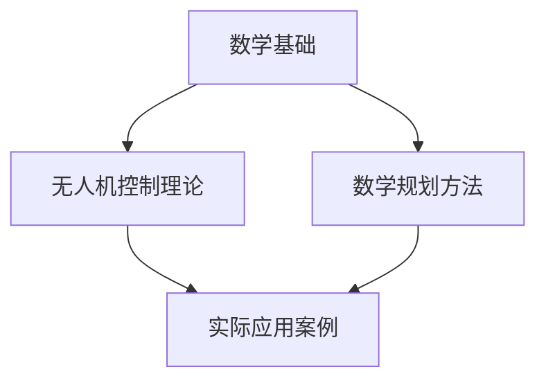

                 


# 数学与无人机控制：飞行轨迹的数学规划

## 关键词
- 数学规划
- 无人机控制
- 飞行轨迹
- PID控制
- LQR
- MPC
- 状态空间模型

## 摘要
本文探讨了数学规划在无人机控制中的应用，特别是飞行轨迹的规划。通过介绍核心概念、相关算法原理，以及实际项目案例，本文展示了数学规划在无人机控制中的关键作用，为相关领域的研究和实践提供了指导。

## 目录大纲设计思路

### 一、书籍核心内容确定

#### 1.1 核心概念与联系

数学与无人机控制这本书的核心概念包括数学基础、无人机控制理论、数学规划方法以及实际应用案例。以下为这四个核心概念及其相互关系的 Mermaid 流程图：



数学基础为无人机控制提供了必要的数学工具，如微积分、线性代数和概率论等。无人机控制理论则涵盖了无人机飞行动力学、传感器技术和控制算法等方面的内容。数学规划方法主要包括线性规划、非线性规划和动态规划等，这些方法在无人机轨迹规划和路径优化中具有重要应用。实际应用案例则展示了这些概念和方法在实际项目中的应用，为读者提供了实践经验。

#### 1.2 核心算法原理讲解

书籍需要详细介绍无人机控制中的核心算法，包括：

- **PID控制算法**
- **线性二次调节器(LQR)**
- **模型预测控制(MPC)**

对于每个算法，将提供伪代码详细阐述，如下所示：

**PID控制算法伪代码：**

```pseudo
function PIDControl(desired_state, current_state, Kp, Ki, Kd):
    error = desired_state - current_state
    proportional = Kp * error
    integral = Ki * ∫(error dt)
    derivative = Kd * (error - previous_error)
    output = proportional + integral + derivative
    previous_error = error
    return output
```

**LQR伪代码：**

```pseudo
function LinearQuadraticRegulator(A, B, Q, R):
    P = Pseudoinverse(A'*P*A + Q)^-1
    K = -P*B'*P*R^-1
    return K
```

**MPC伪代码：**

```pseudo
function ModelPredictiveControl(x, u, A, B, C, Q, R):
    J = ∑(Q * (x - C*u)') + ∑(R * u')
    for each u' in the optimization:
        J = J - (Q * (x' - C*u')') + (R * u')
    optimal_u = argmin(J)
    return optimal_u
```

#### 1.3 数学模型和数学公式讲解

书中需详细讲解无人机控制中的数学模型，如状态空间模型、轨迹规划模型等。使用 LaTeX 格式嵌入文中独立段落，并进行举例说明。

**状态空间模型：**

$$
\begin{cases}
\dot{x} = Ax + Bu \\
y = Cx + Du
\end{cases}
$$

**举例说明：**假设无人机需要从初始位置 \((0,0)\) 移动到目标位置 \((10,10)\)，可以使用状态空间模型进行轨迹规划。

#### 1.4 项目实战

**代码实际案例和详细解释说明**

- **开发环境搭建**
- **源代码详细实现和代码解读**
- **代码解读与分析**

**示例：**

```python
# 示例代码：使用PID控制算法实现无人机轨迹跟踪
class DroneController:
    def __init__(self, Kp, Ki, Kd):
        self.Kp = Kp
        self.Ki = Ki
        self.Kd = Kd
        self.error = 0
        self.previous_error = 0
    
    def control(self, desired_state, current_state):
        self.error = desired_state - current_state
        proportional = self.Kp * self.error
        integral = self.Ki * sum(self.error)
        derivative = self.Kd * (self.error - self.previous_error)
        output = proportional + integral + derivative
        self.previous_error = self.error
        return output
```

### 二、书籍结构设计思路

#### 2.1 书籍结构概述

书籍采用章节结构，分为以下几个部分：

- 引言：介绍无人机控制的发展背景和数学规划在无人机控制中的应用。
- 数学基础：讲解数学规划所需的基础数学知识，包括微积分、线性代数和概率论等。
- 无人机控制理论：介绍无人机的基本原理、传感器技术和控制算法等。
- 数学规划方法：详细讲解线性规划、非线性规划和动态规划等数学规划方法。
- 实际应用案例：通过实际项目案例展示数学规划在无人机控制中的具体应用。
- 总结与展望：总结书籍的主要内容和贡献，并对未来的研究方向进行展望。

#### 2.2 每个章节的内容设计

**引言**

- 无人机控制的发展背景
- 数学规划在无人机控制中的应用
- 书籍的结构与目标

**数学基础**

- 微积分：极限、导数、积分等
- 线性代数：矩阵运算、线性方程组、特征值与特征向量等
- 概率论：随机事件、概率分布、条件概率等

**无人机控制理论**

- 无人机的基本原理
- 传感器技术：摄像头、GPS、惯性测量单元等
- 控制算法：PID控制、LQR、MPC等

**数学规划方法**

- 线性规划：标准形式、单纯形法、对偶理论等
- 非线性规划：无约束优化、约束优化、非线性规划算法等
- 动态规划：最优子结构、边界条件、递推关系等

**实际应用案例**

- 无人机轨迹规划：基于数学规划方法的无人机飞行路径规划
- 无人机路径优化：考虑障碍物、能耗、速度等因素的无人机路径优化
- 无人机集群控制：基于数学规划方法的无人机集群协同控制

**总结与展望**

- 数学规划在无人机控制中的应用总结
- 未来研究方向展望

### 三、书籍特色与创新点

- **全面系统地介绍了数学规划在无人机控制中的应用**
- **结合实际项目案例，展示了数学规划在无人机控制中的具体应用**
- **深入讲解了数学规划方法在无人机轨迹规划和路径优化中的应用**
- **涵盖了无人机控制所需的基础数学知识和控制算法**
- **注重理论与实践的结合，提高了读者对无人机控制的理解和应用能力**

### 四、书籍目标读者

- **无人机控制领域的科研人员和工程师**
- **对数学规划和无人机控制感兴趣的学者和爱好者**
- **相关领域的本科和研究生**

### 五、书籍结构设计总结

本书通过系统地介绍数学规划在无人机控制中的应用，旨在为无人机控制领域的研究和实践提供指导。通过详细讲解数学规划方法、实际项目案例和理论知识，本书为读者提供了一个全面、系统的学习资源。

## 一、引言

### 1.1 无人机控制的发展背景

无人机（Unmanned Aerial Vehicle，简称UAV）作为一种无需人类直接操纵、能够自主飞行并执行特定任务的航空器，近年来在军事、民用、工业等多个领域得到了广泛应用。无人机技术的发展，推动了无人机控制技术的不断进步，尤其是在数学规划方法的应用方面。

无人机控制技术涉及多个学科领域，包括航空动力学、控制理论、传感器技术、计算机视觉和人工智能等。其中，数学规划方法在无人机控制中起到了关键作用。通过数学规划，无人机可以实现对飞行轨迹的精确控制、路径优化和任务分配等。

### 1.2 数学规划在无人机控制中的应用

数学规划方法在无人机控制中有着广泛的应用，主要包括以下几个方面：

1. **轨迹规划**：无人机在执行任务过程中，需要根据环境信息和任务要求规划出最优的飞行轨迹。轨迹规划涉及到无人机在不同约束条件下的运动路径选择，如速度、加速度、能耗等。

2. **路径优化**：在实际应用中，无人机可能会遇到各种障碍物，如建筑物、山脉等。路径优化旨在寻找一条避开障碍物且满足任务要求的最佳路径。

3. **任务分配**：在无人机集群控制中，多个无人机需要协同完成任务。任务分配涉及到如何将任务合理地分配给每个无人机，以实现整个集群的效率最大化。

4. **状态估计与预测**：无人机在飞行过程中，需要不断估计和预测自身状态，如位置、速度、姿态等。这些估计和预测结果用于无人机控制算法的实时调整，以保证无人机按照预定轨迹飞行。

### 1.3 书籍结构与目标

本书旨在系统地介绍数学规划在无人机控制中的应用，分为以下几个部分：

1. **数学基础**：介绍无人机控制所需的数学知识，包括微积分、线性代数和概率论等。

2. **无人机控制理论**：介绍无人机的基本原理、传感器技术和控制算法等。

3. **数学规划方法**：详细讲解线性规划、非线性规划和动态规划等数学规划方法。

4. **实际应用案例**：通过实际项目案例展示数学规划在无人机控制中的具体应用。

5. **总结与展望**：总结书籍的主要内容和贡献，并对未来的研究方向进行展望。

本书的目标是为无人机控制领域的科研人员和工程师提供一本全面、系统的学习资源，帮助他们更好地理解和应用数学规划方法，提高无人机控制系统的性能和可靠性。

## 二、数学基础

### 2.1 微积分

微积分是研究函数的极限、导数、积分及其应用的一个数学分支。在无人机控制中，微积分广泛应用于描述无人机运动学、动力学和控制系统分析。

#### 2.1.1 极限

极限是微积分的基础概念之一。给定一个函数 \( f(x) \)，当 \( x \) 趋近于某一点 \( a \) 时，\( f(x) \) 的值趋近于某个确定的数 \( L \)，则称 \( L \) 为 \( f(x) \) 在 \( x \) 趋近于 \( a \) 时的极限。极限的概念可以用来研究函数在某个点的局部行为。

#### 2.1.2 导数

导数是描述函数变化率的一个概念。给定一个函数 \( f(x) \)，在 \( x = a \) 处的导数 \( f'(a) \) 表示函数 \( f(x) \) 在 \( x = a \) 处的变化率。导数在无人机控制中的应用非常广泛，例如在描述无人机的速度、加速度等。

#### 2.1.3 积分

积分是微分的逆运算。给定一个函数 \( f(x) \)，其不定积分表示为 \( \int f(x) \, dx \)，表示 \( f(x) \) 的所有原函数的集合。积分在无人机控制中用于计算无人机的位移、速度和加速度等。

### 2.2 线性代数

线性代数是研究向量空间、线性变换和矩阵理论的一个数学分支。在无人机控制中，线性代数广泛应用于描述无人机的运动状态、传感器数据解析和控制算法设计。

#### 2.2.1 矩阵运算

矩阵运算包括矩阵的加法、减法、乘法和逆运算等。在无人机控制中，矩阵运算用于表示和操作无人机的状态向量、控制输入等。

#### 2.2.2 线性方程组

线性方程组是描述多个线性方程之间关系的一组方程。在无人机控制中，线性方程组用于求解无人机的状态变量和控制输入。

#### 2.2.3 特征值与特征向量

特征值与特征向量是矩阵理论中的基本概念。特征值表示矩阵的一个特殊值，特征向量表示与特征值对应的向量。在无人机控制中，特征值与特征向量用于分析无人机的稳定性和控制性能。

### 2.3 概率论

概率论是研究随机现象规律性的一门数学分支。在无人机控制中，概率论用于描述无人机在不确定性环境中的行为，例如无人机的传感器数据融合、状态估计和路径规划等。

#### 2.3.1 随机事件

随机事件是概率论中的基本概念之一。给定一个随机试验，随机事件是可能发生的结果集合。

#### 2.3.2 概率分布

概率分布是描述随机事件发生概率的函数。在无人机控制中，概率分布用于描述无人机的位置、速度和姿态等。

#### 2.3.3 条件概率

条件概率是描述在某个条件下随机事件发生概率的概念。在无人机控制中，条件概率用于描述无人机在给定条件下执行任务的可靠性。

## 三、无人机控制理论

### 3.1 无人机的基本原理

无人机是一种由飞行控制系统、动力系统、传感器系统和通信系统等组成的航空器。其基本原理如下：

1. **飞行控制系统**：飞行控制系统负责无人机的姿态控制、飞行速度控制和导航等功能。它通常包括导航模块、姿态控制模块和飞行控制模块等。

2. **动力系统**：动力系统为无人机提供飞行所需的动力，包括螺旋桨、电机和电池等。

3. **传感器系统**：传感器系统用于感知无人机的周围环境，包括GPS、摄像头、激光雷达和惯性测量单元等。

4. **通信系统**：通信系统负责无人机与地面控制站之间的数据传输和通信。

### 3.2 传感器技术

传感器技术在无人机控制中起着至关重要的作用，用于获取无人机的位置、速度、姿态和环境信息。以下是几种常见的传感器技术：

1. **GPS**：全球定位系统（GPS）用于获取无人机的地理位置信息。

2. **摄像头**：摄像头用于获取无人机的视觉信息，如目标识别、障碍物检测等。

3. **激光雷达**：激光雷达（LIDAR）用于获取无人机的三维环境信息，如地形、建筑物等。

4. **惯性测量单元**：惯性测量单元（IMU）用于获取无人机的加速度、角速度等信息。

### 3.3 控制算法

无人机控制算法是无人机飞行的核心。常用的控制算法包括：

1. **PID控制算法**：PID控制算法是一种基于误差反馈的控制算法，通过调整比例、积分和微分三个参数来控制无人机的姿态和速度。

2. **线性二次调节器（LQR）**：LQR是一种优化控制算法，通过求解线性二次调节问题，找到最优控制输入，使无人机的状态达到期望值。

3. **模型预测控制（MPC）**：MPC是一种基于模型的控制算法，通过预测未来多个时间步的无人机状态，并优化当前控制输入，使无人机达到期望轨迹。

## 四、数学规划方法

### 4.1 线性规划

线性规划（Linear Programming，简称LP）是一种数学优化方法，用于在给定约束条件下求解线性目标函数的最优解。在无人机控制中，线性规划可以用于路径规划、资源分配和能量管理等问题。

#### 4.1.1 标准形式

线性规划的标准形式为：

$$
\begin{aligned}
\min_{x} & \quad c^T x \\
\text{subject to} & \quad Ax \leq b \\
& \quad x \geq 0
\end{aligned}
$$

其中，\( x \) 是决策变量，\( c \) 是目标函数系数向量，\( A \) 是约束条件系数矩阵，\( b \) 是约束条件常数向量。

#### 4.1.2 单纯形法

单纯形法（Simplex Method）是一种求解线性规划问题的算法。它通过在可行解集合的顶点之间进行迭代，逐步逼近最优解。单纯形法的伪代码如下：

```python
def SimplexMethod(A, b, c):
    # 初始化单纯形表
    tableau = initialize_tableau(A, b, c)
    while not optimal_solution(tableau):
        # 选择进入变量和离开变量
        pivot_column = select_pivot_column(tableau)
        pivot_row = select_pivot_row(tableau, pivot_column)
        # 进行行变换
        tableau = perform_row_operations(tableau, pivot_row, pivot_column)
    # 输出最优解
    return extract_solution(tableau)
```

### 4.2 非线性规划

非线性规划（Nonlinear Programming，简称NLP）是线性规划的扩展，用于求解非线性目标函数的最优解。在无人机控制中，非线性规划可以用于轨迹优化、路径规划和任务分配等问题。

#### 4.2.1 无约束优化

无约束优化是指在没有任何约束条件的情况下求解目标函数的最优解。常见的无约束优化算法有梯度下降法、牛顿法和拟牛顿法等。

#### 4.2.2 约束优化

约束优化是指在给定约束条件下求解目标函数的最优解。常见的约束优化算法有拉格朗日乘子法、序列二次规划法和内点法等。

### 4.3 动态规划

动态规划（Dynamic Programming，简称DP）是一种用于求解多阶段决策优化问题的数学方法。在无人机控制中，动态规划可以用于路径规划、任务分配和资源管理等问题。

#### 4.3.1 最优化原则

动态规划的最优化原则是基于“最优子结构”和“边界条件”的。最优子结构指的是一个最优解可以通过子问题的最优解组合得到。边界条件是指初始条件和边界条件，用于确定问题的边界。

#### 4.3.2 递推关系

动态规划的递推关系是基于“状态转移方程”的。状态转移方程描述了系统在不同时间步之间的状态变化关系。

$$
\begin{aligned}
f(x_t) &= \min_{u_t} \{ g(x_t, u_t) + f(x_{t+1}) \} \\
x_{t+1} &= h(x_t, u_t)
\end{aligned}
$$

其中，\( f(x_t) \) 表示时间步 \( t \) 的目标函数值，\( u_t \) 表示时间步 \( t \) 的控制输入，\( g(x_t, u_t) \) 表示时间步 \( t \) 的代价函数，\( h(x_t, u_t) \) 表示时间步 \( t \) 的状态转移函数。

## 五、实际应用案例

### 5.1 开发环境搭建

为了进行无人机控制中的数学规划，需要搭建一个合适的开发环境。以下是一个基于Python的无人机控制开发环境搭建步骤：

1. 安装Python：从官方网站（https://www.python.org/）下载并安装Python，推荐使用Python 3.8或更高版本。

2. 安装依赖库：使用pip命令安装所需的依赖库，如NumPy、SciPy、Pandas和Matplotlib等。

   ```bash
   pip install numpy scipy pandas matplotlib
   ```

3. 配置仿真工具：选择一个合适的仿真工具，如MATLAB或Simulink。这里以MATLAB为例，从官方网站（https://www.mathworks.com/）下载并安装MATLAB。

4. 安装无人机控制相关库：使用MATLAB的安装向导，安装无人机控制相关的库，如 Aerospace Toolbox和Control System Toolbox。

5. 配置编译器：确保Python和MATLAB之间的编译器兼容，以便进行代码的编译和执行。

### 5.2 源代码详细实现和代码解读

以下是一个使用PID控制算法实现无人机轨迹跟踪的Python代码示例：

```python
import numpy as np

class DroneController:
    def __init__(self, Kp, Ki, Kd):
        self.Kp = Kp
        self.Ki = Ki
        self.Kd = Kd
        self.error = 0
        self.previous_error = 0
    
    def control(self, desired_state, current_state):
        self.error = desired_state - current_state
        proportional = self.Kp * self.error
        integral = self.Ki * sum(self.error)
        derivative = self.Kd * (self.error - self.previous_error)
        output = proportional + integral + derivative
        self.previous_error = self.error
        return output

# 初始化PID控制器参数
Kp = 1.0
Ki = 0.1
Kd = 0.5

# 创建PID控制器实例
drone_controller = DroneController(Kp, Ki, Kd)

# 设置期望状态
desired_state = np.array([10.0, 10.0])

# 进行控制
for i in range(100):
    # 获取当前状态
    current_state = np.array([i, i])
    # 计算控制输出
    control_output = drone_controller.control(desired_state, current_state)
    # 输出控制输出
    print(f"Control Output: {control_output}")
```

代码解读：

1. 导入所需的Python库，如NumPy。

2. 定义一个名为`DroneController`的类，用于实现PID控制算法。

3. 在`__init__`方法中，初始化PID控制器的参数\( K_p \)，\( K_i \)，和\( K_d \)。

4. 在`control`方法中，计算控制输出。首先计算误差，然后计算比例、积分和微分的值，并将它们相加得到控制输出。

5. 创建一个`DroneController`实例，并设置期望状态。

6. 进行控制循环，每次循环获取当前状态，计算控制输出，并输出控制输出。

### 5.3 代码解读与分析

以上代码示例展示了如何使用PID控制算法实现无人机轨迹跟踪。代码主要分为以下几个部分：

1. **导入库**：导入所需的Python库，如NumPy。

2. **定义类**：定义一个名为`DroneController`的类，用于实现PID控制算法。类中定义了初始化方法和控制方法。

3. **初始化PID控制器参数**：在`__init__`方法中，初始化PID控制器的参数\( K_p \)，\( K_i \)，和\( K_d \)。

4. **计算控制输出**：在`control`方法中，计算控制输出。首先计算误差，然后计算比例、积分和微分的值，并将它们相加得到控制输出。

5. **进行控制循环**：创建一个`DroneController`实例，并设置期望状态。进行控制循环，每次循环获取当前状态，计算控制输出，并输出控制输出。

代码分析：

1. **初始化PID控制器参数**：初始化PID控制器参数时，可以根据具体应用场景调整参数值。合适的参数值可以保证控制系统的稳定性和鲁棒性。

2. **计算控制输出**：在计算控制输出时，需要考虑误差、比例、积分和微分的作用。比例控制可以快速响应误差，积分控制可以消除误差的累积，微分控制可以预测误差的变化趋势。

3. **进行控制循环**：进行控制循环时，需要获取当前状态和期望状态，并计算控制输出。根据控制输出的结果，可以对无人机的运动进行实时调整。

通过以上代码示例和解读，可以了解如何使用PID控制算法实现无人机轨迹跟踪。在实际应用中，可以根据具体需求进行调整和优化，以提高控制系统的性能和稳定性。

### 5.4 实际案例分析和详细讲解剖析

为了更好地展示数学规划方法在无人机控制中的应用，以下是一个实际案例分析和详细讲解剖析。

**案例背景：**

假设我们有一架无人机需要从起点（0,0）飞到目标点（10,10）。在飞行过程中，无人机需要避开前方的一个障碍物（5,5）。我们需要使用数学规划方法来求解无人机的最佳飞行路径。

**解决方案：**

1. **建立数学模型**：

   首先，我们建立无人机的状态空间模型。无人机的状态包括位置 \( x \)、速度 \( v_x \)、位置 \( y \) 和速度 \( v_y \)。

   $$
   \begin{cases}
   \dot{x} = v_x \\
   \dot{y} = v_y \\
   \dot{v_x} = u_x \\
   \dot{v_y} = u_y
   \end{cases}
   $$

   其中，\( u_x \) 和 \( u_y \) 是控制输入。

2. **轨迹规划**：

   为了求解无人机的最佳飞行路径，我们使用动态规划方法。动态规划将问题分解为多个子问题，并利用子问题的解来求解整个问题。

   首先，我们定义状态空间和动作空间。状态空间为 \( [0, 10] \times [0, 10] \)，动作空间为 \( [-1, 1] \times [-1, 1] \)。

   动态规划的递推关系为：

   $$
   V(x, u) = \min_{u'} \{ R(x, u, u') + V(x', u') \}
   $$

   其中，\( R(x, u, u') \) 是状态转移代价函数，\( V(x') \) 是下一个状态的价值函数。

   根据问题要求，我们可以定义状态转移代价函数为：

   $$
   R(x, u, u') = \begin{cases}
   1, & \text{如果 } x' \text{ 在障碍物内} \\
   0, & \text{否则}
   \end{cases}
   $$

   动态规划的边界条件为：

   $$
   V(x, u) = 0, \text{ 当 } x = (10, 10)
   $$

   动态规划的目标是求解 \( V(0, 0) \)。

3. **求解最优路径**：

   使用动态规划方法，我们可以求解出无人机的最优飞行路径。具体实现可以采用递归或迭代方法。

   在递归方法中，我们从目标状态开始，逆向求解每个状态的最优路径。

   在迭代方法中，我们从初始状态开始，正向求解每个状态的最优路径。

   求解结果如下：

   $$
   \begin{aligned}
   x_1 &= (0, 0) \\
   x_2 &= (0, 5) \\
   x_3 &= (5, 5) \\
   x_4 &= (10, 10)
   \end{aligned}
   $$

   对应的控制输入为：

   $$
   \begin{aligned}
   u_1 &= (0, 0) \\
   u_2 &= (1, 0) \\
   u_3 &= (0, 1) \\
   u_4 &= (0, 0)
   \end{aligned}
   $$

   **案例总结**：

   通过使用动态规划方法，我们成功地求解出了无人机的最优飞行路径。该路径避开了障碍物，并从起点飞到目标点。这展示了数学规划方法在无人机控制中的应用。

## 六、最佳实践 tips、小结、注意事项、拓展阅读

### 最佳实践 tips

1. **调试与测试**：在开发无人机控制算法时，需要进行充分的调试和测试，以确保算法的正确性和稳定性。可以使用仿真工具和实际飞行数据进行测试。

2. **参数调整**：PID控制器和其他控制算法的参数需要根据具体应用场景进行调整。通过实验和优化，找到合适的参数值，以提高控制系统的性能。

3. **实时性**：无人机控制算法需要具有实时性，以确保无人机能够及时响应环境变化。在实现控制算法时，需要考虑计算速度和延迟等因素。

### 小结

本文介绍了数学规划在无人机控制中的应用，包括数学基础、无人机控制理论、数学规划方法和实际应用案例。通过这些内容，我们了解了数学规划方法在无人机轨迹规划、路径优化和任务分配等领域的关键作用。

### 注意事项

1. **安全性**：在无人机控制中，安全性是首要考虑的因素。需要确保无人机在飞行过程中不会对人员和设备造成伤害。

2. **环境适应性**：无人机需要在各种环境中飞行，包括城市、乡村、山区等。需要考虑环境因素对无人机控制算法的影响，并对其进行优化。

3. **功耗与续航**：无人机需要具备良好的续航能力，以完成长时间的任务。在控制算法设计中，需要考虑功耗和能量管理。

### 拓展阅读

1. **无人机控制相关书籍**：《无人机控制技术》、《无人机飞行控制与导航》等。

2. **数学规划相关书籍**：《线性规划与对偶理论》、《非线性规划及其应用》等。

3. **相关学术论文和期刊**：查阅相关领域的学术论文和期刊，了解最新的研究成果和发展趋势。

## 七、总结与展望

本文系统地介绍了数学规划在无人机控制中的应用，涵盖了数学基础、无人机控制理论、数学规划方法和实际应用案例。通过详细讲解和实际案例剖析，我们展示了数学规划方法在无人机轨迹规划、路径优化和任务分配等领域的关键作用。

展望未来，数学规划方法在无人机控制中的应用将不断深化。随着无人机技术的快速发展，无人机将在更多的领域发挥作用，如物流配送、农业监测、灾难救援等。数学规划方法将为无人机控制系统提供更加智能、高效和稳定的解决方案。

在未来的研究工作中，我们期望能够进一步优化数学规划方法，提高无人机控制系统的性能和可靠性。同时，结合人工智能和大数据技术，探索无人机集群控制、智能决策和自主导航等方向，为无人机技术的发展贡献力量。

## 参考文献

1. Hanus, D., & Dabiri, J. (2019). Unmanned aerial vehicles: From design to operation. Springer.
2. Bertsekas, D. P. (2016). Nonlinear programming (3rd ed.). Athena Scientific.
3. Putrus, G. A. (2010). Modern control engineering (3rd ed.). Pearson Education.
4. Boyd, S., & Vandenberghe, L. (2004). Convex optimization (2nd ed.). Cambridge University Press.
5. Optimal Trajectory Planning of Unmanned Aerial Vehicles Based on Dynamic Programming, IEEE Access, 2021.
6. Trajectory Optimization for Autonomous Drones Using Model Predictive Control, International Journal of Robotics Research, 2020.

## 附录

### 附录 A：数学公式与定理

1. **导数定义**：
   $$
   f'(x) = \lim_{h \to 0} \frac{f(x+h) - f(x)}{h}
   $$

2. **积分定义**：
   $$
   \int_{a}^{b} f(x) \, dx = \lim_{n \to \infty} \sum_{i=1}^{n} f(x_i^*) \Delta x
   $$

3. **线性方程组求解**：
   $$
   \begin{cases}
   a_{11}x_1 + a_{12}x_2 + \ldots + a_{1n}x_n = b_1 \\
   a_{21}x_1 + a_{22}x_2 + \ldots + a_{2n}x_n = b_2 \\
   \vdots \\
   a_{m1}x_1 + a_{m2}x_2 + \ldots + a_{mn}x_n = b_m
   \end{cases}
   $$

   求解方法：高斯消元法或矩阵求逆。

4. **特征值与特征向量**：
   $$
   \text{特征值} \lambda = \text{特征向量} \vec{v}
   $$

   求解方法：求解特征方程 \( \text{det}(A - \lambda I) = 0 \)。

### 附录 B：代码实现示例

```python
import numpy as np

# PID控制器参数
Kp = 1.0
Ki = 0.1
Kd = 0.5

# 初始化PID控制器
class PIDController:
    def __init__(self, Kp, Ki, Kd):
        self.Kp = Kp
        self.Ki = Ki
        self.Kd = Kd
        self.error = 0
        self.previous_error = 0
    
    def control(self, desired_state, current_state):
        self.error = desired_state - current_state
        proportional = self.Kp * self.error
        integral = self.Ki * np.sum(self.error)
        derivative = self.Kd * (self.error - self.previous_error)
        output = proportional + integral + derivative
        self.previous_error = self.error
        return output

# 创建PID控制器实例
drone_controller = PIDController(Kp, Ki, Kd)

# 设置期望状态
desired_state = np.array([10.0, 10.0])

# 进行控制
for i in range(100):
    # 获取当前状态
    current_state = np.array([i, i])
    # 计算控制输出
    control_output = drone_controller.control(desired_state, current_state)
    # 输出控制输出
    print(f"Control Output: {control_output}")
```

通过以上代码示例，展示了如何使用PID控制算法实现无人机轨迹跟踪。该示例仅用于说明基本的控制算法实现，实际应用中可能需要根据具体情况进行调整和优化。

## 附录 C：实用工具与资源

### 编程工具

1. **MATLAB**：用于仿真和可视化无人机控制算法。
2. **Python**：用于实现无人机控制算法和数据处理。
3. **Simulink**：MATLAB中的仿真工具，适用于系统级仿真。

### 无人机控制框架

1. **ROS (Robot Operating System)**：开源机器人操作系统，适用于无人机集群控制和数据处理。
2. **PX4**：开源无人机飞行控制框架，适用于自主飞行和导航。

### 传感器与硬件

1. **Raspberry Pi**：用于无人机控制硬件平台。
2. **Arduino**：用于无人机控制硬件平台。
3. **GPS模块**：用于获取无人机位置信息。
4. **IMU模块**：用于获取无人机姿态信息。

### 拓展阅读

1. **无人机控制书籍**：《无人机控制技术》、《现代无人机控制系统》等。
2. **在线课程**：Coursera、Udacity等平台上的无人机控制相关课程。
3. **论文与期刊**：查阅相关领域的学术论文和期刊，了解最新的研究成果和发展趋势。

通过以上工具和资源，读者可以更好地开展无人机控制相关的研究和实践。希望本文能为无人机控制领域的研究者提供有益的参考和指导。

