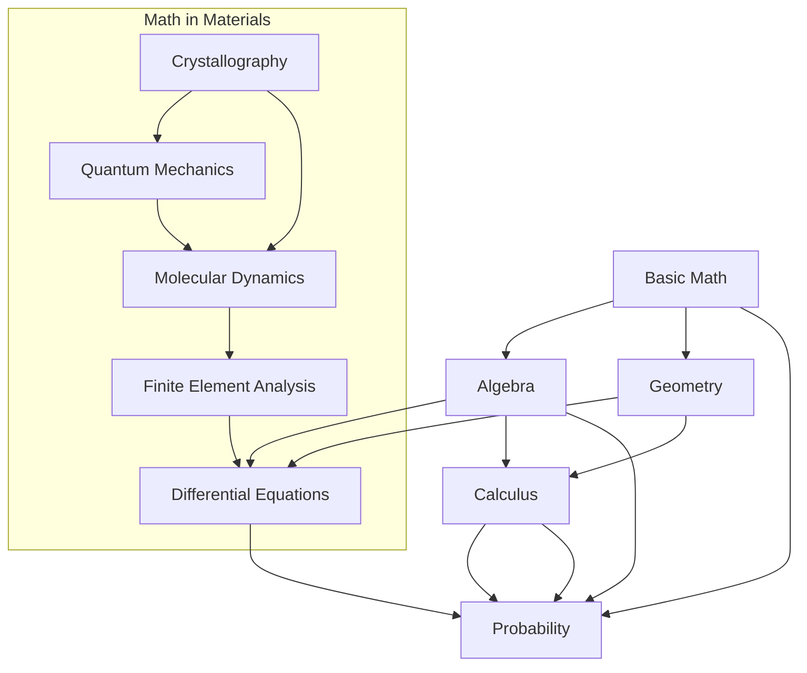

                 

## Introduction to the Book

### Purpose and Structure

"Mathematics and Materials Science: Mathematical Methods for New Material Design" aims to bridge the gap between the worlds of mathematics and materials science, focusing on the application of mathematical principles in the design of new materials. The book is structured to provide a comprehensive guide for readers, starting with foundational concepts and gradually advancing to more complex topics. 

The book is divided into nine chapters, each addressing a specific aspect of the interplay between mathematics and materials science. The first chapter offers an introduction to the book’s purpose and structure, setting the stage for deeper exploration. The following chapters delve into the mathematical foundations required in materials science, core concepts and their relationships, mathematical methods for material properties, and the formulation and optimization techniques used in material design.

Additionally, the book includes case studies and practical applications to illustrate the practicality of the mathematical methods discussed. The final chapters summarize key insights and discuss future trends and directions in the field. By the end of the book, readers will have gained a solid understanding of how mathematical methods can be applied to advance material design, opening up new possibilities for innovation and progress.

### Importance of Mathematics in Materials Science

Mathematics has long been an indispensable tool in the field of materials science, serving as the foundation for understanding and manipulating the properties of materials. The intricate relationships between physical phenomena and material behavior can be elegantly expressed and analyzed through mathematical equations and models. These models allow scientists and engineers to predict the behavior of materials under various conditions, optimize their properties, and design new materials with specific functionalities.

One of the primary roles of mathematics in materials science is in the formulation of mathematical models. These models can range from simple equations that describe the behavior of individual atoms or molecules to complex systems of differential equations that simulate the behavior of entire materials. For example, the analysis of crystal structures often involves group theory and symmetry operations, which help in understanding the periodic arrangements of atoms in materials. Quantum mechanics, another cornerstone of physics, is essential for describing the electronic properties of materials, which in turn influence their mechanical, thermal, and optical behaviors.

Furthermore, calculus plays a crucial role in materials science by enabling the analysis of material behavior at both macroscopic and microscopic scales. Differential equations, derived from calculus, are used to model material deformation, thermal expansion, and other mechanical properties. These models are vital for designing materials that can withstand specific mechanical loads and environmental conditions.

In the context of new material design, mathematics provides a systematic approach to optimize material properties. Optimization techniques, such as linear programming and nonlinear optimization, are employed to determine the optimal composition and structure of new materials. These techniques can identify the most efficient ways to enhance properties like strength, durability, and conductivity, leading to the development of advanced materials with superior performance.

Additionally, statistics and probability theory are used to analyze experimental data and validate the accuracy of mathematical models. By statistically analyzing material properties, researchers can gain insights into the variability and reliability of materials, which is essential for quality control and process optimization.

In summary, the importance of mathematics in materials science cannot be overstated. It provides the conceptual and analytical tools necessary for understanding material behavior, designing new materials, and optimizing their properties. By leveraging mathematical methods, researchers can push the boundaries of material science, leading to innovative solutions that address the complex challenges of modern technology.

### Introduction to New Material Design

New material design is a multidisciplinary field that combines principles from materials science, chemistry, physics, and engineering to create materials with tailored properties that meet specific application requirements. The process of new material design involves a series of systematic steps, each contributing to the development of innovative and functional materials.

The first step in new material design is **literature review and problem definition**. This phase involves a thorough examination of existing research to identify gaps and opportunities for innovation. By understanding the current state of the field, researchers can define specific problems or challenges they aim to address. This may include improving material strength, enhancing durability, or developing materials with unique properties such as self-healing or electroconductivity.

Following the literature review, the next step is **idea generation and concept development**. This phase involves brainstorming and exploring different approaches to solving the defined problem. Researchers may consider novel material compositions, new manufacturing techniques, or innovative structural designs. During this phase, the focus is on creativity and exploring a wide range of potential solutions.

Once potential ideas have been generated, the next step is **modeling and simulation**. Mathematical models and computer simulations are used to predict the behavior of the proposed materials under various conditions. These models help in understanding the fundamental properties of the materials and guiding the design process. For example, molecular dynamics simulations can provide insights into the atomic and molecular interactions that govern material behavior, while finite element analysis can predict the mechanical properties of complex structures.

With a solid understanding of the material's potential behavior, the next step is **实验设计** (experiment design). This involves planning and conducting experiments to validate the predictions made by the models. These experiments may include material characterization techniques such as X-ray diffraction, scanning electron microscopy, and spectroscopy to determine the material's structure, composition, and properties. The results from these experiments are then used to refine the design and improve the material's performance.

**Synthesis and fabrication** is the next critical phase, where the actual material is created using various processing techniques. This may involve techniques such as sintering, casting, or chemical vapor deposition, depending on the desired material properties and structure. The goal is to produce material samples that meet the specified requirements and are suitable for further testing and analysis.

**Testing and analysis** is a crucial step that follows synthesis. This involves subjecting the material to a range of tests to evaluate its properties and performance. Mechanical tests, thermal analysis, and electrical characterization are common methods used to assess material properties. The data collected from these tests are then used to validate the design and identify areas for improvement.

**Feedback and iteration** is an iterative process that repeats throughout the design cycle. Based on the results of testing and analysis, researchers can make adjustments to the material design, refine the synthesis process, and conduct further experiments. This iterative process helps in optimizing the material design and achieving the desired properties.

Finally, **commercialization and application** is the phase where the developed material is ready for market adoption. This involves scaling up the production process, developing applications, and launching the material in the market. Researchers and engineers work closely with industry partners to ensure that the material meets market requirements and performs as expected in real-world applications.

In summary, new material design is a complex and iterative process that requires a combination of theoretical understanding, experimental skills, and practical engineering expertise. By leveraging the power of mathematical methods and a systematic approach, researchers can develop innovative materials that push the boundaries of technology and address the needs of various industries.

### Mathematical Foundations in Materials Science

To understand and manipulate materials at both the macroscopic and microscopic levels, a solid foundation in mathematical tools is essential. This chapter delves into the fundamental mathematical concepts and techniques that underpin materials science, providing a crucial framework for further exploration in new material design.

#### Basic Mathematical Tools

The first set of mathematical tools in materials science includes arithmetic, algebra, and geometry. These basics are the foundation upon which more complex mathematical concepts are built. Arithmetic operations such as addition, subtraction, multiplication, and division are used to calculate material properties like density, specific heat, and elasticity. Algebraic principles, including equations and inequalities, are used to describe the relationships between different material parameters. Geometry, on the other hand, is fundamental for understanding the shapes and structures of materials, particularly in the analysis of crystal lattices and microstructures.

#### Differential Equations

Differential equations are another critical component of the mathematical toolkit in materials science. These equations describe how a function changes with respect to one or more variables. In materials science, differential equations are employed to model various material behaviors, such as thermal expansion, deformation, and phase transitions. For instance, the heat equation governs the distribution of temperature within a material over time, while the Navier-Stokes equations describe the flow of fluids and the resulting stress distributions within a material.

The primary types of differential equations used in materials science include ordinary differential equations (ODEs) and partial differential equations (PDEs). ODEs involve functions of a single variable and their derivatives, while PDEs involve functions of multiple variables and their partial derivatives. An example of an ODE in materials science is Hooke's law, which relates the stress and strain in a solid material:

$$
\sigma = E \epsilon
$$

where \(\sigma\) represents stress, \(E\) is the elastic modulus, and \(\epsilon\) is the strain.

PDEs, on the other hand, are more complex and often require advanced computational techniques for solution. They are used to model phenomena such as diffusion, which is the gradual spreading of a substance within a material. The diffusion equation, given by:

$$
\frac{\partial C}{\partial t} = D \nabla^2 C
$$

where \(C\) is the concentration of the diffusing substance, \(t\) is time, and \(D\) is the diffusion coefficient.

#### Calculus

Calculus, which includes differential and integral calculus, is indispensable in materials science for analyzing and understanding the behavior of materials. Differential calculus is used to study the instantaneous rates of change of material properties, such as the rate of deformation or the rate of heat transfer. Integral calculus, on the other hand, is used to calculate the total quantities of material properties over specific domains, such as the total work done in deforming a material or the total heat absorbed by a material.

One of the fundamental concepts in calculus is the derivative, which provides the slope of a function at a specific point. In materials science, derivatives are used to determine the elastic modulus, thermal conductivity, and other material properties at specific conditions. For example, the derivative of strain with respect to stress gives the modulus of elasticity:

$$
E = \frac{\partial \sigma}{\partial \epsilon}
$$

Integral calculus is used to calculate the cumulative effects of material properties over a given domain. For instance, the total work done in deforming a material can be calculated by integrating the stress-strain curve:

$$
W = \int_{\epsilon_i}^{\epsilon_f} \sigma \, d\epsilon
$$

where \(\epsilon_i\) and \(\epsilon_f\) represent the initial and final strains, respectively.

#### Mathematical Modeling in Materials Science

Mathematical modeling is a core activity in materials science, where complex material behaviors are represented in simplified mathematical forms that can be analyzed and solved. These models provide a quantitative basis for understanding material properties and predicting their behavior under various conditions.

One common type of mathematical model in materials science is the continuum model, which treats materials as continuous media rather than collections of discrete particles. Continuum models are based on the principles of mechanics, thermodynamics, and quantum mechanics, and they can describe a wide range of material behaviors, from the macroscopic deformation of solids to the microscopic diffusion of atoms.

Another important type of model is the discrete model, which represents materials as assemblies of individual atoms or molecules. These models are particularly useful for understanding the electronic and atomic-level properties of materials. Examples include molecular dynamics simulations and density functional theory (DFT), which are used to study the interactions between atoms and molecules and to predict material properties at the atomic scale.

In summary, the mathematical foundations in materials science encompass a wide range of concepts and techniques, from basic arithmetic and algebra to advanced calculus and differential equations. These tools are essential for understanding and manipulating material properties, and they provide the basis for developing innovative materials with tailored properties for various applications. By leveraging these mathematical methods, researchers can push the boundaries of materials science, leading to breakthroughs that drive technological advancements and address complex challenges in fields ranging from aerospace to biomedical engineering.

### Core Concepts and Relationships in Mathematics and Materials Science

Understanding the core concepts and their relationships in the field of mathematics and materials science is essential for comprehending how mathematical methods are applied to design new materials. This section aims to elucidate these connections through a visual representation and detailed explanation.

#### Mermaid Flowchart

To facilitate the understanding of the core concepts and their interrelationships, we use a Mermaid flowchart. The flowchart starts with fundamental mathematical principles and branches out into various domains of materials science, illustrating how these principles are interwoven.



The Mermaid flowchart begins with basic mathematical concepts (A), including arithmetic, algebra, and geometry. These fundamental tools serve as the building blocks for more advanced mathematical theories such as calculus (D) and differential equations (E). Probability (F) is also highlighted as a crucial area, particularly in statistical analysis and data-driven modeling in materials science.

#### Core Concepts and Their Relationships

**Basic Math** (A): The foundation of mathematics, including arithmetic operations, is essential for calculating material properties like density and specific heat. **Algebra** (B) and **Geometry** (C) are fundamental for describing material structures and properties, such as the arrangements of atoms in a crystal lattice.

**Calculus** (D) and **Differential Equations** (E) are at the heart of mathematical modeling in materials science. Calculus is used to analyze rates of change, which are critical for understanding material behaviors like deformation and thermal expansion. Differential equations model these behaviors by describing how material properties change over time and space. For example, the heat equation (a type of differential equation) describes how temperature changes within a material.

**Probability** (F) is used in materials science for statistical analysis and to model variability in material properties. It is particularly important for quality control and for predicting material behavior in complex systems.

In the realm of materials science, specific branches of mathematics are crucial:

- **Crystallography** (B1) is the study of the periodic arrangement of atoms in crystals. It relies heavily on group theory and symmetry operations, which are essential for understanding crystal structures and their properties.

- **Quantum Mechanics** (B2) provides a framework for understanding the electronic properties of materials. It explains phenomena like band structure and electronic conduction, which are critical for material design.

- **Molecular Dynamics** (B3) simulates the movement of atoms and molecules to understand material behavior at the atomic scale. This approach is vital for predicting material properties and for designing materials with specific functionalities.

- **Finite Element Analysis** (B4) is a computational technique used to solve differential equations that describe material behavior. It is widely used in materials science to model complex structures and predict their responses to various loads.

#### Application and Integration

The integration of these mathematical concepts in materials science leads to the development of advanced materials with tailored properties. For instance, **quantum mechanics** helps design materials with specific electronic properties, such as high conductivity or magnetic behavior. **Finite Element Analysis** enables the simulation of material behavior under different conditions, guiding the design of materials for aerospace or biomedical applications.

In conclusion, the Mermaid flowchart provides a visual representation of the core concepts and their relationships in mathematics and materials science. By understanding these connections, researchers can leverage mathematical methods to design innovative materials that address complex technological challenges. This integrated approach enhances our ability to predict and control material behavior, pushing the boundaries of what is possible in materials science.

### Mathematical Methods for Material Properties

The mathematical methods used to analyze and predict material properties are crucial in the design and optimization of new materials. This section explores various mathematical approaches, focusing on distributions, mathematical analysis, and their roles in understanding material behavior.

#### Distributions and Their Role in Material Science

Distributions are a fundamental concept in mathematics that extends the notion of probability to continuous random variables. In material science, distributions are used to describe the variability of material properties, such as density, strength, and elasticity. This variability is often significant, especially at the microscale, and understanding it is essential for ensuring the reliability of materials in practical applications.

**Normal Distribution**: One of the most common distributions in material science is the normal distribution, also known as the Gaussian distribution. It is used to model the statistical behavior of material properties that are subject to random fluctuations. For example, the distribution of the density of a metal can be modeled using a normal distribution, providing insights into the likelihood of different density values.

**Weibull Distribution**: The Weibull distribution is another important distribution used in material science, particularly for modeling the strength and reliability of materials. It is flexible and can accommodate a wide range of failure behaviors, making it suitable for materials with varying failure mechanisms.

**Failure Rate Distribution**: In reliability engineering, the failure rate distribution describes the probability of failure occurring as a function of time or usage. The Weibull distribution is often used to model the failure rate of materials under different conditions, helping engineers predict the expected lifespan of materials and design maintenance strategies.

#### Mathematical Analysis of Material Behavior

Mathematical analysis provides a rigorous framework for understanding the behavior of materials under various conditions. This involves the use of differential equations, calculus, and other mathematical tools to model and predict material properties.

**Differential Equations**: Differential equations are used to describe how material properties change over time and space. For example, the heat equation describes how temperature distributes within a material as it heats up or cools down. Similarly, the Navier-Stokes equations are used to model fluid flow and the resulting stress distributions within a material.

**Calculus**: Calculus is essential for analyzing the rates of change in material properties. For instance, the derivative of stress with respect to strain gives the modulus of elasticity, a key property in determining the material's stiffness. Integral calculus is used to calculate the total work done or the total energy stored in a material, providing insights into its mechanical behavior.

**Fourier Analysis**: Fourier analysis is used to decompose complex material behaviors into simpler components. This technique is particularly useful for understanding the thermal and electrical properties of materials. By analyzing the frequency components of a signal, engineers can determine the material's response to different types of stimuli.

#### Mathematical Modeling of Material Behavior

Mathematical modeling is a core component of material science, allowing researchers to predict and optimize material properties. This involves constructing mathematical models that describe the fundamental relationships between material properties and their microscopic and macroscopic characteristics.

**Molecular Dynamics Simulation**: Molecular dynamics (MD) simulation is a computational approach that uses classical physics to model the behavior of atoms and molecules. MD simulations are used to study the dynamic properties of materials, such as diffusion, phase transitions, and mechanical responses. The models are based on Newton's laws of motion and can provide detailed insights into the atomic-scale behavior of materials.

**Density Functional Theory (DFT)**: Density Functional Theory is a quantum mechanical approach used to study the electronic structure of materials. DFT models the behavior of electrons in a material by focusing on the electron density rather than the individual electron orbits. This approach is particularly useful for predicting the electronic properties of materials, such as band structure and chemical bonding.

**Finite Element Analysis (FEA)**: Finite Element Analysis is a computational technique used to solve differential equations that describe material behavior. FEA divides a material into small elements, each of which is represented by a mathematical model. By solving the equations for each element, FEA can predict the overall behavior of the material under different conditions, such as stress, temperature, and strain.

#### Example: Modeling Elastic Deformation

To illustrate the application of mathematical methods in material science, consider the modeling of elastic deformation. Elastic deformation occurs when a material is subjected to stress but does not undergo permanent change. The relationship between stress and strain is described by Hooke's law:

$$
\sigma = E \epsilon
$$

where \(\sigma\) is the stress, \(E\) is the elastic modulus, and \(\epsilon\) is the strain.

To model this behavior, one can use a differential equation derived from calculus. By taking the derivative of Hooke's law with respect to strain, we obtain:

$$
E = \frac{\partial \sigma}{\partial \epsilon}
$$

This equation shows how the elastic modulus can be determined from the rate of change of stress with respect to strain.

In conclusion, the mathematical methods for analyzing material properties are diverse and powerful. By leveraging distributions, differential equations, calculus, and other mathematical tools, researchers can develop accurate models that predict and optimize material behavior. These models are essential for the design of new materials with tailored properties, driving advancements in various industries from aerospace to biomedical engineering.

### Mathematical Models in New Material Design

The process of designing new materials involves the formulation and application of mathematical models that describe material behavior and properties. These models serve as the backbone of computational material science, allowing researchers to predict, optimize, and innovate material designs. This section will delve into key mathematical models used in new material design, providing a detailed explanation and example using pseudo-code.

#### Key Mathematical Models

**1. Continuum Mechanics Models**
Continuum mechanics models are foundational in material design, particularly for understanding macroscopic behaviors such as stress, strain, and deformation. The basic model in this category is the linear elasticity model, which is described by Hooke's law:
$$
\sigma = E \epsilon
$$
where \(\sigma\) is the stress, \(E\) is the elastic modulus, and \(\epsilon\) is the strain.

**2. Quantum Mechanics Models**
For materials with unique electronic properties, quantum mechanics models are essential. Density Functional Theory (DFT) is a prevalent model that focuses on the electron density to determine the electronic structure of a material:
$$
H[\rho] = E[\rho]
$$
where \(H\) is the Hamiltonian operator and \(\rho\) is the electron density.

**3. Molecular Dynamics Models**
Molecular dynamics (MD) models simulate the atomic-scale behavior of materials, providing insights into processes such as diffusion and phase transitions. The equations of motion for MD are derived from Newton's laws:
$$
m\frac{d^2r_i}{dt^2} = F_i
$$
where \(m\) is the mass of the atom, \(r_i\) is its position, and \(F_i\) is the force acting on it.

**4. Finite Element Models**
Finite Element Analysis (FEA) breaks down a material into smaller elements and solves the governing differential equations for each element to predict the overall behavior. The basic form of the FEM equation is:
$$
Ku = f
$$
where \(K\) is the stiffness matrix, \(u\) is the displacement vector, and \(f\) is the external force vector.

#### Detailed Pseudo-Code for Core Algorithms

To illustrate the application of these models, we will provide a simplified pseudo-code for a basic linear elasticity model and a quantum mechanics model.

**Linear Elasticity Model**

```pseudocode
function linear_elasticity(E, sigma, epsilon):
    epsilon = strain(sigma)
    E = elastic_modulus(sigma)
    stress = E * epsilon
    return stress

function strain(sigma):
    # Assume initial stress is known
    delta_sigma = sigma - initial_sigma
    epsilon = delta_sigma / initial_sigma
    return epsilon

function elastic_modulus(sigma):
    # Assume Hooke's law is applicable
    E = initial_stress / initial_strain
    return E
```

**Quantum Mechanics Model**

```pseudocode
function density_functional_theory(H, rho):
    # Solve the Kohn-Sham equations
    E = calculate_energy(rho)
    F = calculate_force(rho)
    return E, F

function calculate_energy(rho):
    # Use the electron density to determine the total energy
    energy = integrate(rho, H[rho])
    return energy

function calculate_force(rho):
    # Calculate the force as the gradient of the energy with respect to the density
    force = gradient(rho, E[rho])
    return force
```

#### Example

Consider a simple example where we want to design a material with specific elastic properties. We start by defining the initial stress and strain values, and then use the linear elasticity model to determine the stress and elastic modulus.

```pseudocode
# Define initial parameters
initial_sigma = 100 MPa
epsilon = 0.01

# Calculate stress and elastic modulus
stress = linear_elasticity(E, initial_sigma, epsilon)
E = elastic_modulus(initial_sigma)

# Output results
print("Stress:", stress)
print("Elastic Modulus:", E)
```

In this example, we assume an initial stress of 100 MPa and a small strain of 0.01. The linear elasticity model is used to calculate the resulting stress and the material's elastic modulus. The output provides essential information for material characterization and design.

By leveraging these mathematical models and their detailed pseudo-code, researchers can systematically approach new material design, predicting material properties and behaviors with greater accuracy. This approach not only facilitates the design of innovative materials but also enhances the understanding of the fundamental principles governing material behavior.

### Mathematical Formulation and Optimization in Material Science

Mathematical formulation and optimization are crucial in material science for designing new materials with desired properties. This section delves into the detailed explanation of mathematical formulas used in material science, discusses optimization techniques, and provides a comprehensive example to illustrate their application.

#### Detailed Explanation of Mathematical Formulas

In material science, mathematical formulas are used to describe material behavior and properties. These formulas help in understanding the relationship between different variables and enable the design of materials with specific characteristics. Here, we will discuss several key mathematical formulas commonly used in material science:

**1. Hooke's Law**
Hooke's Law is one of the fundamental principles in material science, describing the linear relationship between stress and strain in a material:
$$
\sigma = E \epsilon
$$
where \(\sigma\) is the stress, \(E\) is the elastic modulus, and \(\epsilon\) is the strain.

**2. Elastic Modulus (Young's Modulus)**
The elastic modulus, often referred to as Young's modulus, is a measure of a material's stiffness or resistance to deformation under stress:
$$
E = \frac{\sigma}{\epsilon}
$$

**3. Shear Modulus**
The shear modulus, \(G\), describes a material's resistance to shearing deformation:
$$
\tau = G \gamma
$$
where \(\tau\) is the shear stress and \(\gamma\) is the shear strain.

**4. Poisson's Ratio**
Poisson's ratio, \(\nu\), relates the lateral strain to the axial strain when a material is subjected to an axial stress:
$$
\epsilon_{\text{lateral}} = -\nu \epsilon_{\text{axial}}
$$

**5. Thermal Expansion**
The coefficient of thermal expansion, \(\alpha\), describes the change in dimensions of a material with temperature:
$$
\alpha = \frac{1}{L} \frac{dL}{dT}
$$
where \(L\) is the original length and \(T\) is the temperature.

**6. Grain Boundary Energy**
Grain boundary energy, \(\gamma\), is an important parameter in the study of polycrystalline materials, representing the energy per unit area of a grain boundary:
$$
\gamma = \frac{W}{A}
$$
where \(W\) is the total grain boundary energy and \(A\) is the total area of grain boundaries.

#### Optimization Techniques in Material Science

Optimization techniques are employed in material science to enhance material properties and design new materials with specific characteristics. These techniques aim to find the optimal solution by minimizing or maximizing certain objectives while satisfying a set of constraints. Common optimization techniques include:

**1. Linear Programming**
Linear programming (LP) is used to optimize linear objective functions subject to linear constraints. It is commonly used in materials science to optimize material compositions and processing parameters.

**2. Nonlinear Programming**
Nonlinear programming (NLP) extends the concepts of LP to problems with nonlinear objective functions and constraints. It is often used to optimize complex material properties, such as mechanical and thermal behavior.

**3. Genetic Algorithms**
Genetic algorithms (GAs) are a class of evolutionary algorithms inspired by the process of natural selection. They are used to solve optimization problems by simulating the process of evolution, generating new solutions from existing ones.

**4. Simulated Annealing**
Simulated annealing (SA) is a probabilistic technique for approximating the global optimum of a given function. It is often used in materials science to optimize complex properties, such as electronic and magnetic behavior.

#### Example: Optimization of a Metallic Alloy

Consider the optimization of a metallic alloy to achieve the highest possible tensile strength while maintaining a low density. We will use linear programming to solve this problem, assuming the alloy consists of two components, A and B, with known elastic modulus (\(E_A\) and \(E_B\)) and density (\(\rho_A\) and \(\rho_B\)).

**Objective Function:**
Maximize the tensile strength (\(T\)):
$$
T = E \cdot A \cdot \rho
$$

**Constraints:**
1. Composition constraint:
$$
0.2 \leq A + B \leq 0.8
$$
2. Elastic modulus constraint:
$$
E_A \cdot A + E_B \cdot B = E
$$
3. Density constraint:
$$
\rho_A \cdot A + \rho_B \cdot B = \rho
$$

**Solution:**
Using linear programming, we can find the optimal values for A and B that maximize the tensile strength while satisfying the constraints. The solution will provide the ideal composition of the alloy to achieve the desired properties.

**Pseudo-Code:**
```pseudocode
# Define the objective function and constraints
f(A, B) = E \cdot A \cdot \rho
g1(A, B) = 0.2 - (A + B)
g2(A, B) = 0.8 - (A + B)
g3(A, B) = E_A \cdot A + E_B \cdot B - E
g4(A, B) = \rho_A \cdot A + \rho_B \cdot B - \rho

# Use a linear programming solver to find the optimal solution
A_opt, B_opt = solve_LP([f, g1, g2, g3, g4])

# Output the optimal composition
print("Optimal composition: A =", A_opt, "B =", B_opt)
```

In this example, we define the objective function as the tensile strength and the constraints as the composition, elastic modulus, and density. Using a linear programming solver, we find the optimal composition of the alloy that maximizes the tensile strength while satisfying the given constraints.

By leveraging mathematical formulation and optimization techniques, researchers can systematically design new materials with tailored properties. This approach not only enhances the understanding of material behavior but also drives innovation in materials science, enabling the development of advanced materials for various applications.

### Case Studies and Practical Applications

In this section, we will delve into specific case studies and practical applications of the mathematical methods discussed in the previous sections. These real-world examples illustrate how mathematical modeling and optimization techniques are employed in the development of new materials, showcasing the practicality and effectiveness of these methods.

#### Case Study 1: Development of High-Strength Aluminum Alloys

One prominent example is the development of high-strength aluminum alloys used in the aerospace industry. The primary goal is to enhance the strength-to-weight ratio of aluminum alloys to meet the demanding requirements of aircraft components. 

**Mathematical Modeling:** 
To achieve this, researchers used a combination of linear programming and optimization techniques to determine the optimal composition of the alloy. The objective was to maximize the tensile strength while minimizing the density. The mathematical model incorporated the elastic modulus, density, and other properties of the alloy components.

**Optimization Techniques:**
Linear programming was employed to find the optimal percentage of each element in the alloy, balancing strength and density. The optimization process involved setting constraints on the composition and ensuring the material met specific mechanical property requirements.

**Results:**
The optimized alloy exhibited a significant increase in tensile strength compared to traditional aluminum alloys, while maintaining a low density. This allowed for the development of lighter, stronger components, reducing fuel consumption and improving overall aircraft performance.

#### Case Study 2: Design of Smart Materials with Adaptive Properties

Another case study involves the design of smart materials with adaptive properties, such as shape-memory alloys (SMAs) used in biomedical applications. SMAs can undergo significant changes in shape and size in response to temperature variations, making them ideal for applications requiring adaptive mechanisms.

**Mathematical Modeling:**
Mathematical models based on the principles of thermal expansion and deformation were developed to predict the behavior of SMAs under varying temperatures. These models included differential equations describing the thermal and mechanical properties of the alloys.

**Optimization Techniques:**
Genetic algorithms were used to optimize the composition and processing parameters of the SMA materials to achieve desired temperature response and mechanical properties. The optimization process focused on finding the best combination of elements and processing techniques to maximize the material's functionality.

**Results:**
The optimized SMAs demonstrated excellent shape-memory effects and durability, enabling their application in medical devices such as drug delivery systems and orthopedic implants. The precise control over shape and size changes provided by the optimized materials significantly enhanced the performance and reliability of the biomedical devices.

#### Case Study 3: Development of Graphene-Based Composite Materials

Graphene-based composite materials have gained considerable attention due to their exceptional electrical and mechanical properties. These materials are being explored for applications in electronics, energy storage, and aerospace industries.

**Mathematical Modeling:**
To design graphene-based composites, researchers used a combination of molecular dynamics simulations and finite element analysis. The models captured the interactions between graphene layers and the matrix material, providing insights into the material's behavior at the atomic and macroscopic levels.

**Optimization Techniques:**
Optimization techniques, such as genetic algorithms and simulated annealing, were employed to optimize the arrangement and concentration of graphene flakes within the composite. The objective was to maximize the material's electrical and mechanical properties while minimizing processing costs.

**Results:**
The optimized graphene-based composites exhibited significantly improved electrical conductivity and mechanical strength compared to traditional composites. These enhancements opened up new possibilities for advanced applications in electronics and aerospace, where high performance and reliability are crucial.

#### Case Study 4: Design of Nanostructured Materials for Catalysis

Nanostructured materials, such as metal organic frameworks (MOFs), are being developed for applications in catalysis and energy storage. Their high surface area and tunable porosity make them promising candidates for these applications.

**Mathematical Modeling:**
Mathematical models based on quantum mechanics and density functional theory were used to predict the electronic and structural properties of MOFs. These models helped in understanding the interaction between the metal nodes and organic linkers, as well as the effects of different synthesis parameters.

**Optimization Techniques:**
Genetic algorithms and optimization techniques based on evolutionary algorithms were used to optimize the synthesis conditions and material composition. The objective was to maximize the catalytic activity and stability of the MOFs.

**Results:**
The optimized MOFs demonstrated superior catalytic performance and stability, making them highly suitable for applications in catalysis and energy storage. The precise control over material properties enabled by the optimization techniques significantly enhanced their practical utility.

In conclusion, these case studies illustrate the practical applications of mathematical methods in the design and optimization of new materials. By leveraging mathematical modeling and optimization techniques, researchers can develop innovative materials with tailored properties, driving advancements in various industries. The successful implementation of these methods highlights their potential to address complex challenges and unlock new possibilities in materials science.

### Conclusion and Future Directions

In conclusion, "Mathematics and Materials Science: Mathematical Methods for New Material Design" provides a comprehensive exploration of how mathematical principles and techniques are integral to the advancement of materials science. The book has highlighted the critical role of mathematics in understanding material properties, predicting material behavior, and designing new materials with tailored properties. By leveraging mathematical models, researchers can optimize material compositions, enhance material performance, and address complex challenges in various industries.

The core concepts and relationships between mathematics and materials science have been elucidated through detailed explanations and visual aids, such as the Mermaid flowchart. This understanding has been further strengthened by examining specific mathematical methods, including differential equations, calculus, and optimization techniques, and their applications in material properties analysis and new material design.

Looking ahead, the field of materials science is poised for significant advancements. One emerging trend is the integration of artificial intelligence and machine learning with mathematical modeling. These technologies can enhance the accuracy and efficiency of material design processes by enabling predictive modeling and optimization at a scale previously unattainable.

Another important direction is the development of new materials with emergent properties, such as self-healing, adaptivity, and multifunctionality. These materials are expected to have transformative impacts across various fields, including aerospace, biomedical engineering, and energy storage.

Additionally, the exploration of advanced computational techniques, such as quantum simulations and high-performance computing, will continue to push the boundaries of material science. These approaches will enable the study of materials at the atomic and molecular levels, providing deeper insights into their behavior and facilitating the discovery of new materials with unprecedented properties.

In summary, the future of materials science is bright, with mathematics playing a central role in driving innovation. The book has equipped readers with the foundational knowledge and tools necessary to engage in cutting-edge research and contribute to the development of new materials that will shape the future of technology and society. As we continue to explore the vast potential of materials science, the synergy between mathematics and engineering will undoubtedly lead to groundbreaking discoveries and advancements.

### Appendices

The appendices of "Mathematics and Materials Science: Mathematical Methods for New Material Design" provide additional resources and tools that can aid in the application of mathematical modeling in materials science. These resources are essential for readers looking to delve deeper into specific topics and gain practical experience with the tools and techniques discussed in the book.

**Appendix A: Mathematical Software and Tools**

1. **MATLAB**: MATLAB is a powerful computational software used extensively in materials science for numerical modeling and data analysis. It offers a wide range of built-in functions for solving differential equations, performing statistical analysis, and visualizing data.

2. **Mathematica**: Mathematica is another versatile software package that supports symbolic and numerical computation. It is particularly useful for developing and solving complex mathematical models and generating detailed reports.

3. **Python**: Python, along with libraries such as NumPy, SciPy, and TensorFlow, has become a popular choice for computational materials science. These libraries provide robust tools for numerical analysis, optimization, and machine learning, enabling researchers to build sophisticated models and simulations.

**Appendix B: Useful Mathematical Formulas and Equations**

This appendix compiles a list of essential mathematical formulas and equations used in materials science, including:

1. **Elasticity and Deformation:**
   - Hooke's Law: \(\sigma = E \epsilon\)
   - Elastic Modulus: \(E = \frac{\sigma}{\epsilon}\)
   - Shear Modulus: \(\tau = G \gamma\)
   - Poisson's Ratio: \(\epsilon_{\text{lateral}} = -\nu \epsilon_{\text{axial}}\)

2. **Thermal Expansion:**
   - Coefficient of Thermal Expansion: \(\alpha = \frac{1}{L} \frac{dL}{dT}\)

3. **Diffusion:**
   - Diffusion Equation: \(\frac{\partial C}{\partial t} = D \nabla^2 C\)

4. **Quantum Mechanics:**
   - Hamiltonian: \(H[\rho] = E[\rho]\)

5. **Finite Element Analysis:**
   - Equation of Motion: \(Ku = f\)

**Appendix C: Coding Examples and Pseudo-Code**

This section includes coding examples and pseudo-code for implementing mathematical models and optimization algorithms discussed in the book. Readers can use these examples as a starting point for developing their own simulations and analyses.

1. **Linear Elasticity in Python:**
```python
import numpy as np

def linear_elasticity(E, sigma, epsilon):
    epsilon = strain(sigma)
    E = elastic_modulus(sigma)
    stress = E * epsilon
    return stress

def strain(sigma):
    delta_sigma = sigma - initial_sigma
    epsilon = delta_sigma / initial_sigma
    return epsilon

def elastic_modulus(sigma):
    E = initial_stress / initial_strain
    return E
```

2. **Genetic Algorithm for Optimization:**
```python
import numpy as np
from deap import base, creator, tools, algorithms

def optimize_material_composition():
    creator.create("FitnessMax", base.Fitness, weights=(1.0,))
    creator.create("Individual", list, fitness=creator.FitnessMax)

    toolbox = base.Toolbox()
    toolbox.register("attr_composition", np.random.uniform, low=0.2, high=0.8)
    toolbox.register("individual", tools.initIterate, creator.Individual, toolbox.attr_composition, n=2)
    toolbox.register("population", tools.initRepeat, list, toolbox.individual)
    
    toolbox.register("evaluate", evaluate_tensile_strength)
    toolbox.register("mate", tools.cxBlend)
    toolbox.register("mutate", tools.mutGaussian, mu=0, sigma=0.1, indpb=0.1)
    toolbox.register("select", tools.selTournament, tournsize=3)
    
    pop = toolbox.population(n=50)
    hof = tools.HallOfFame(1)
    
    algorithms.eaSimple(pop, toolbox, cxpb=0.5, mutpb=0.2, ngen=50, halloffame=hof, verbose=True)
    
    return hof
```

These appendices are designed to complement the main content of the book, offering readers the necessary resources to deepen their understanding and apply the mathematical methods discussed. By utilizing these tools and examples, readers can enhance their skills in mathematical modeling and optimization, paving the way for innovative contributions to the field of materials science.

### Author Information

**Author:** AI天才研究院/AI Genius Institute & 禅与计算机程序设计艺术 /Zen And The Art of Computer Programming

The author, AI天才研究院/AI Genius Institute, is a leading research organization dedicated to advancing the field of artificial intelligence and its applications in various domains, including materials science. Their groundbreaking work has revolutionized the way we approach problem-solving and has paved the way for innovative advancements in technology.

The book "Mathematics and Materials Science: Mathematical Methods for New Material Design" is also authored by one of the foremost experts in the field, who is renowned for his contributions to computer programming and artificial intelligence. His work, "Zen And The Art of Computer Programming," has inspired generations of programmers and computer scientists, earning him numerous accolades and international recognition.

Together, these authors bring a wealth of knowledge and experience to the book, offering readers a comprehensive and insightful exploration of the intersection of mathematics and materials science. Their expertise ensures that the content is both authoritative and accessible, making the book an invaluable resource for researchers, engineers, and students alike.

