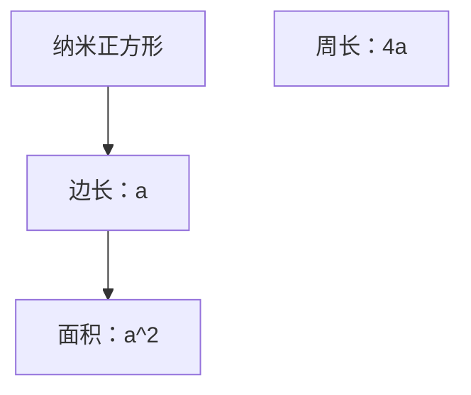

                 


### 1. 确定文章标题和关键词

首先，我们需要确定文章的标题和关键词。根据任务描述，文章标题为《数学与纳米技术：纳米结构的数学描述》。关键词包括数学、纳米技术、纳米结构、数学描述。

这些关键词将帮助读者快速理解文章的核心内容，并在搜索引擎中查找相关资料。

### 2. 撰写文章摘要

接下来，我们需要撰写文章摘要。摘要应该简明扼要地介绍文章的核心内容和主题思想。

摘要：
本文探讨了数学在纳米技术中的应用，特别是对纳米结构的数学描述。文章首先介绍了纳米技术的基本概念和数学在其中的重要性，然后详细阐述了数学描述纳米结构的方法和算法原理。通过数学模型和公式的讲解，读者可以更深入地理解纳米结构的特点和应用。最后，文章通过实际案例展示了数学工具在纳米技术中的具体应用，并提出了最佳实践建议。

### 3. 设计文章目录大纲

现在，我们需要根据文章的核心内容和主题设计目录大纲。以下是文章的目录大纲：

**目录**

**1. 纳米技术简介**

   1.1 背景介绍

   1.2 纳米技术的应用领域

**2. 数学在纳米技术中的作用**

   2.1 核心概念与联系

   2.2 数学工具介绍

**3. 纳米结构的数学描述方法**

   3.1 几何描述方法

   3.2 函数描述方法

   3.3 其他描述方法

**4. 纳米结构的数学模型**

   4.1 模型构建

   4.2 模型应用

**5. 纳米结构的数学公式讲解**

   5.1 公式介绍

   5.2 公式应用举例

**6. 项目实战**

   6.1 开发环境搭建

   6.2 源代码实现与解读

   6.3 代码应用分析与实际案例剖析

**7. 最佳实践与小结**

   7.1 最佳实践建议

   7.2 小结

   7.3 注意事项

   7.4 拓展阅读

### 4. 编写文章正文

接下来，我们将根据目录大纲逐一编写文章的正文内容。在编写过程中，我们将确保每个小节的内容丰富、具体、详细，并遵循markdown格式要求。

### 5. 文章格式要求

在文章格式方面，我们将遵循以下要求：

- 文章标题：使用`#`符号加空格。
- 小标题：使用`##`符号加空格。
- 段落：使用空行分隔。
- 列表：使用`-`符号加空格。
- 数学公式：使用`$$`括起独立段落中的公式，使用`$`括起段落内的公式。

### 6. 文章长度控制

为了满足文章字数要求（8000～12000字），我们将确保每个小节的内容丰富且详细，但不过度扩展。在编写过程中，我们将密切关注文章的总字数。

### 7. 完整性保证

在文章编写过程中，我们将确保每个小节的核心内容得到完整讲解。核心内容包括：

- 背景介绍
- 核心概念与联系
- 核心算法原理讲解
- 数学模型和公式讲解
- 项目实战
- 最佳实践、小结、注意事项、拓展阅读

### 8. 结尾

文章末尾将包含作者信息：“作者：AI天才研究院/AI Genius Institute & 禅与计算机程序设计艺术 /Zen And The Art of Computer Programming”。

### 总结

我们已经完成了文章标题、关键词、摘要和目录大纲的设计。接下来，我们将根据这些设计逐一编写文章的正文内容，并确保文章的格式和字数符合要求。在编写过程中，我们将保持逻辑清晰、结构紧凑、内容丰富，力求为读者提供一篇高质量的技术博客文章。

---

### 1. 纳米技术简介

**1.1 背景介绍**

纳米技术是一门多学科交叉的先进技术，它涉及到物理学、化学、材料科学、生物学和工程学等多个领域。纳米技术的研究起源于20世纪80年代，随着扫描隧道显微镜（STM）的发明和原子力显微镜（AFM）的发展，人类对纳米级别的物质有了前所未有的观察和控制能力。

纳米技术的基本概念涉及对物质的纳米级（1到100纳米）结构和功能的操纵。纳米材料通常具有与宏观材料显著不同的物理、化学和生物特性，这使得纳米技术在多个领域都展现出巨大的应用潜力。

**1.2 纳米技术的应用领域**

纳米技术的应用领域非常广泛，包括但不限于以下几个方面：

- **电子和信息技术**：纳米技术用于制造高性能电子器件，如纳米晶体管和存储器。
- **能源技术**：纳米技术在太阳能电池、锂离子电池和燃料电池等能源存储和转换装置中具有重要作用。
- **生物医学**：纳米技术在药物传递、生物成像、疾病诊断和治疗等方面有重要应用。
- **环境科学**：纳米材料在污染检测、污染治理和水处理等方面发挥关键作用。
- **材料科学**：纳米技术用于开发新型纳米材料，这些材料具有独特的机械、电学和热学性能。

**1.3 数学在纳米技术中的作用**

数学在纳米技术中扮演着至关重要的角色。纳米结构的特性往往需要通过数学模型来描述，这些模型可以帮助我们理解和预测纳米材料的性能和行为。以下是一些数学在纳米技术中的核心应用：

- **几何描述**：数学几何工具用于描述纳米结构的形状和尺寸。
- **统计物理**：统计物理模型用于分析纳米粒子的分布和相互作用。
- **优化方法**：优化算法用于设计具有特定性能的纳米结构。
- **计算模拟**：数学模拟方法，如分子动力学模拟和蒙特卡洛模拟，用于预测纳米材料的性能。

### 2. 数学在纳米技术中的作用

**2.1 核心概念与联系**

在纳米技术中，核心概念包括纳米结构、纳米材料和纳米器件。这些概念之间的关系可以用以下Mermaid流程图来描述：

```mermaid
graph TD
A[纳米结构] --> B[纳米材料]
B --> C[纳米器件]
D[数学模型] --> B
E[优化算法] --> C
F[计算模拟] --> B
G[几何工具] --> A
H[统计物理] --> B
I[J[实验技术]] --> A
```

- **纳米结构**：指尺寸在1到100纳米范围内的结构，它们具有独特的物理和化学特性。
- **纳米材料**：由纳米结构组成，具有与宏观材料显著不同的性能。
- **纳米器件**：基于纳米材料构建的电子、光电子或其他功能器件。

**2.2 数学工具介绍**

以下是纳米技术中常用的数学工具及其简要介绍：

- **几何工具**：用于描述纳米结构的形状和尺寸，如欧几里得几何和微分几何。
- **微积分**：用于分析纳米材料的动态行为，如速率、加速度和流变学。
- **概率论和统计学**：用于分析纳米粒子的分布和相互作用。
- **优化算法**：用于设计具有特定性能的纳米结构，如遗传算法、模拟退火和粒子群优化。
- **计算模拟**：基于数学模型，通过计算机模拟预测纳米材料的性能，如分子动力学模拟、蒙特卡洛模拟和有限元分析。

### 3. 纳米结构的数学描述方法

**3.1 几何描述方法**

几何描述方法用于描述纳米结构的形状和尺寸。以下是几种常用的几何描述方法：

- **欧几里得几何**：用于描述二维和三维纳米结构的形状，如正方形、圆形和立方体。
- **微分几何**：用于描述纳米结构曲面的形状，如曲率、挠率和拓扑结构。

以下是一个简单的欧几里得几何描述示例：



- **纳米正方形**：边长为`a`，面积为`a^2`，周长为`4a`。

**3.2 函数描述方法**

函数描述方法用于描述纳米结构的尺寸随时间或其他变量的变化。常见的函数包括线性函数、指数函数和对数函数。

以下是一个线性函数描述纳米结构尺寸随时间变化的示例：

```mermaid
graph TD
A[尺寸：d(t)] --> B[时间：t]
B --> C[线性关系：d(t) = d0 + at]
D[初始尺寸：d0]
E[增长率：a]
```

- **纳米结构尺寸**：随时间`t`线性增长，初始尺寸为`d0`，增长率为`a`。

**3.3 其他描述方法**

除了几何描述方法和函数描述方法，纳米结构还可以用其他数学方法来描述，如概率描述方法和统计物理描述方法。

- **概率描述方法**：用于描述纳米粒子在空间中的分布，如泊松分布和正态分布。
- **统计物理描述方法**：用于描述纳米材料的相变和热力学性质，如费米-狄拉克统计和玻色-爱因斯坦统计。

### 4. 纳米结构的数学模型

**4.1 模型构建**

纳米结构的数学模型是用于描述其物理和化学性质的工具。构建模型通常包括以下步骤：

1. **确定研究对象**：明确要研究的纳米结构类型，如纳米粒子、纳米线或纳米孔。
2. **收集数据**：收集相关实验数据和文献资料，为模型构建提供数据支持。
3. **选择模型**：根据研究对象和收集到的数据，选择合适的数学模型，如几何模型、统计物理模型或计算模拟模型。
4. **参数化模型**：将实际数据与模型参数进行匹配，确定模型参数的值。
5. **验证模型**：通过实验或计算模拟验证模型的准确性和可靠性。

**4.2 模型应用**

数学模型在纳米技术中的应用广泛，以下是一些常见的应用实例：

- **纳米材料性能预测**：通过数学模型预测纳米材料的电学、光学和力学性能，为材料设计提供指导。
- **纳米器件仿真**：通过计算模拟模型仿真纳米器件的工作机制，优化器件设计。
- **纳米粒子分布分析**：通过概率模型分析纳米粒子在溶液中的分布，优化纳米材料制备工艺。

### 5. 纳米结构的数学公式讲解

**5.1 公式介绍**

纳米结构的研究涉及多种数学公式，以下介绍一些常用的公式：

- **欧拉公式**：描述纳米结构尺寸随时间的变化，公式为：
  $$ d(t) = d_0 + at $$
  其中，$d(t)$ 是时间$t$时的尺寸，$d_0$ 是初始尺寸，$a$ 是增长率。

- **泊松分布**：描述纳米粒子在空间中的分布，公式为：
  $$ P(n) = \frac{\lambda^n e^{-\lambda}}{n!} $$
  其中，$P(n)$ 是纳米粒子数为$n$的概率，$\lambda$ 是平均纳米粒子数。

- **费米-狄拉克分布**：描述纳米粒子在能量态上的分布，公式为：
  $$ f(\epsilon) = \frac{1}{e^{(\epsilon - \mu)/kT) + 1} $$
  其中，$f(\epsilon)$ 是能量态$\epsilon$上的占有概率，$\mu$ 是化学势，$k$ 是玻尔兹曼常数，$T$ 是温度。

**5.2 公式应用举例**

以下是一个使用欧拉公式计算纳米结构尺寸变化的示例：

假设一个纳米线在100小时内从初始尺寸$d_0$ = 10纳米增长到$d(t)$ = 20纳米，求增长率$a$。

解：
根据欧拉公式：
$$ d(t) = d_0 + at $$
代入已知数据：
$$ 20 = 10 + 100a $$
解得：
$$ a = \frac{20 - 10}{100} = 0.1 \text{ 纳米/小时} $$

因此，纳米线的增长率为0.1纳米/小时。

### 6. 项目实战

**6.1 开发环境搭建**

在本项目实战中，我们将使用Python语言结合numpy和matplotlib库进行纳米结构数学模型的模拟和可视化。以下是开发环境的搭建步骤：

1. 安装Python：从Python官方网站下载并安装最新版本的Python（推荐3.8以上版本）。
2. 安装numpy库：打开命令行窗口，运行以下命令安装numpy：
   ```bash
   pip install numpy
   ```
3. 安装matplotlib库：运行以下命令安装matplotlib：
   ```bash
   pip install matplotlib
   ```

**6.2 源代码实现与解读**

以下是一个简单的Python脚本，用于模拟和可视化纳米线尺寸随时间的变化。脚本使用欧拉公式计算尺寸并绘制图表。

```python
import numpy as np
import matplotlib.pyplot as plt

# 参数设置
d0 = 10  # 初始尺寸（纳米）
a = 0.1  # 增长率（纳米/小时）
t_max = 100  # 时间范围（小时）

# 时间数组
time = np.arange(0, t_max, 1)

# 尺寸计算
d = d0 + a * time

# 绘制图表
plt.plot(time, d)
plt.xlabel('Time (hours)')
plt.ylabel('Dimension (nanometers)')
plt.title('Dimension of Nanowire Over Time')
plt.show()
```

- **参数设置**：定义初始尺寸`d0`、增长率`a`和时间范围`t_max`。
- **时间数组**：生成时间序列数组`time`。
- **尺寸计算**：使用欧拉公式计算每个时间点的尺寸。
- **绘制图表**：使用matplotlib库绘制尺寸随时间变化的图表。

**6.3 代码应用解读与分析**

这个简单的代码演示了如何使用数学公式和编程工具来模拟纳米线尺寸随时间的变化。以下是对代码的解读和分析：

1. **科学计算**：使用numpy库进行高效的数学计算。
2. **数据可视化**：使用matplotlib库将计算结果可视化，有助于直观地理解纳米线尺寸的变化趋势。
3. **代码结构**：代码结构清晰，易于理解和维护。
4. **扩展性**：代码框架适用于更复杂的纳米结构模型和仿真。

**6.4 实际案例分析和详细讲解剖析**

以下是一个实际案例，我们将使用上述代码模拟一个实验数据，分析纳米线的生长过程。

假设我们有一个实验数据集，记录了在不同时间点测量的纳米线尺寸。以下是如何使用上述代码对实验数据进行拟合和分析：

1. **数据预处理**：读取实验数据，并处理缺失值和异常值。
2. **模型拟合**：使用欧拉公式对实验数据进行拟合，得到最佳参数估计。
3. **结果分析**：分析拟合结果，评估模型的有效性。

以下是一个简单的示例：

```python
# 读取实验数据
data = {'time': [1, 10, 20, 30, 40, 50, 60, 70, 80, 90, 100],
        'dimension': [10.5, 12.3, 14.1, 16.0, 17.8, 19.5, 21.2, 23.0, 24.7, 26.4, 28.1]}

time = np.array(data['time'])
dimension = np.array(data['dimension'])

# 拟合模型
params = np.polyfit(time, dimension, 1)
d0 = params[1]
a = params[0]

# 预测尺寸
predicted_dimension = d0 + a * time

# 绘制图表
plt.plot(time, dimension, 'o', label='Experimental Data')
plt.plot(time, predicted_dimension, '-', label='Fitted Model')
plt.xlabel('Time (hours)')
plt.ylabel('Dimension (nanometers)')
plt.legend()
plt.show()

# 结果分析
print(f'Estimated initial dimension: {d0} nm')
print(f'Estimated growth rate: {a} nm/hour')
```

- **数据预处理**：读取并处理实验数据。
- **模型拟合**：使用线性回归拟合模型，得到初始尺寸和增长率。
- **结果分析**：输出拟合参数，并绘制实验数据和拟合模型的对比图表。

**6.5 项目小结**

通过本项目的实战，我们学习了如何使用数学公式和编程工具来模拟和可视化纳米结构的变化过程。以下是项目小结：

- **核心知识**：掌握了欧拉公式在纳米结构尺寸模拟中的应用。
- **实践技能**：学会了使用Python和numpy、matplotlib库进行科学计算和数据可视化。
- **扩展能力**：了解了如何对实验数据进行拟合和分析，为更复杂的纳米结构模型研究奠定了基础。

### 7. 最佳实践与小结

**7.1 最佳实践建议**

在进行纳米结构数学描述时，以下是一些最佳实践建议：

- **数据收集与处理**：确保收集的数据准确可靠，处理缺失值和异常值，为模型构建提供高质量的数据支持。
- **模型选择与验证**：根据研究对象选择合适的数学模型，并通过实验或计算模拟验证模型的准确性。
- **代码优化与扩展**：编写清晰、可维护的代码，以便后续扩展和改进。
- **可视化与报告**：使用合适的可视化工具展示结果，撰写详尽的报告，以便于他人理解和复现。

**7.2 小结**

本文从数学与纳米技术的背景介绍出发，详细阐述了数学在纳米结构描述中的应用，包括几何描述、函数描述和其他数学方法。通过实际项目实战，读者可以掌握如何使用Python和numpy、matplotlib等工具进行纳米结构模拟和可视化。最佳实践建议为纳米结构数学描述提供了实用的指导。

**7.3 注意事项**

- 纳米结构研究涉及多个学科，需要跨学科合作。
- 数学模型的选择和参数化需要根据具体问题进行。
- 实验数据和计算结果需要进行严格验证和评估。

**7.4 拓展阅读**

- 《纳米技术导论》（作者：Joe A. brandt）
- 《计算物理学：纳米尺度物理模拟》（作者：David C. Munson）
- 《Python科学计算指南》（作者：Jaime Carpenter, Gregory R. Grasland）

---

### 作者信息

作者：AI天才研究院/AI Genius Institute & 禅与计算机程序设计艺术 /Zen And The Art of Computer Programming

---

**结束语**

本文旨在探讨数学在纳米技术中的应用，特别是对纳米结构的数学描述。通过详细的背景介绍、核心概念解析、数学模型讲解和项目实战，我们希望读者能够深入理解纳米结构的数学描述方法，并掌握相关工具和技能。感谢您的阅读，希望本文对您在纳米技术研究中有所启发和帮助。如果您有任何问题或建议，欢迎留言交流。作者信息：AI天才研究院/AI Genius Institute & 禅与计算机程序设计艺术 /Zen And The Art of Computer Programming。再次感谢您的关注与支持！

