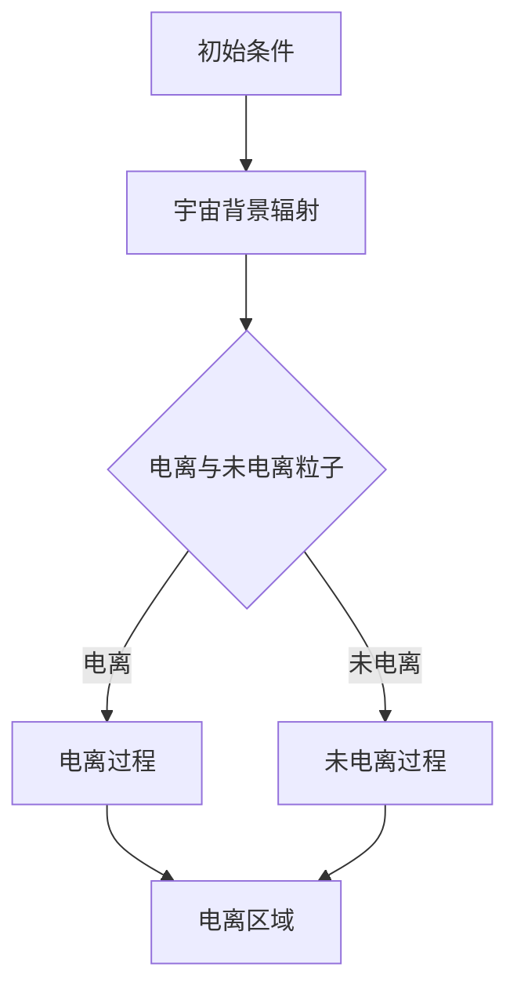

                 

### 文章标题：数学模型在预测宇宙再电离过程中的应用

#### 关键词：
- 数学模型
- 宇宙再电离
- 概率论
- 机器学习
- 宇宙学

#### 摘要：
本文将深入探讨数学模型在预测宇宙再电离过程中的应用。首先，我们将介绍宇宙再电离的背景知识和重要性，然后探讨数学模型在宇宙学研究中的应用。接下来，我们将详细分析再电离过程及其相关参数，介绍常见的再电离模型。随后，我们将探讨数学模型在再电离预测中的应用，包括概率论和机器学习方法。文章还将介绍再电离模型的验证与比较，以及实际应用案例。最后，我们将总结数学模型在宇宙学中的贡献，并提出未来研究方向。本文旨在为读者提供一个全面、深入的技术博客，揭示数学模型在宇宙学研究中的巨大潜力。

## 第1章 引言

宇宙再电离是指宇宙早期（红移z≥6）的高能光子电离中性氢原子的过程。这一过程在宇宙的演化中具有重要意义，因为它标志着宇宙从完全黑暗、中性状态向充满光明的电离态转变。再电离不仅影响早期宇宙的物理状态，还对星系的形成和演化产生深远影响。因此，准确预测宇宙再电离的过程对于理解宇宙的早期演化至关重要。

数学模型在宇宙学研究中具有广泛的应用，特别是在描述和预测宇宙物理现象方面。通过建立数学模型，科学家可以更好地理解宇宙的复杂过程，并在一定程度上预测未来的宇宙状态。在宇宙再电离的研究中，数学模型不仅用于描述再电离过程的物理机制，还用于预测再电离历史和相关的宇宙学参数。

本文的结构安排如下：第1章为引言，介绍宇宙再电离的背景知识和数学模型在宇宙学中的重要性；第2章介绍宇宙学基础，包括宇宙的起源与演化、星系与恒星的形成以及宇宙射线与背景辐射；第3章概述再电离过程，包括定义、机制、再电离率与电子温度以及再电离历史的模拟；第4章介绍再电离模型，包括通用再电离模型和特定模型；第5章探讨数学模型在再电离预测中的应用，包括概率论和机器学习方法；第6章介绍数学模型的验证与比较；第7章展示实际应用案例，包括恒星形成、星系演化和宇宙学背景辐射中的再电离影响；第8章为结论与展望，总结数学模型在宇宙学中的贡献，并提出未来研究方向。最后，附录部分提供数学模型常用符号表、实验数据来源与处理方法、再电离模型的Mermaid流程图和再电离预测算法的伪代码。

通过本文的阅读，读者将深入了解数学模型在预测宇宙再电离过程中的应用，掌握相关核心概念和算法，并对宇宙再电离的研究有更全面的认识。

### 第2章 宇宙学基础

宇宙学是研究宇宙的起源、结构、演化和最终命运的学科。它是现代物理的重要组成部分，涉及到多种物理学分支，如天体物理学、粒子物理学和广义相对论。宇宙学的目标是理解宇宙的基本原理和物理定律，以及宇宙如何从最初的瞬间演化到现在的状态。

#### 2.1 宇宙的起源与演化

宇宙的起源通常被认为是在大约138亿年前的一个极小、极高密度的状态，这个时期称为大爆炸。大爆炸理论认为，宇宙从一个无限热、无限密的点开始膨胀，随着时间的推移，宇宙逐渐冷却，形成了物质和能量。在宇宙的早期阶段，温度和密度非常高，物质主要以辐射的形式存在。随着宇宙的膨胀和冷却，物质逐渐聚集形成星系、恒星、行星和其他天体。

宇宙的演化可以分为几个主要阶段：

1. **大爆炸后几分钟**：宇宙迅速膨胀，温度和密度非常高，物质主要以光子（光子辐射）和夸克-胶子等离子体（物质态）的形式存在。
2. **宇宙再电离**：在大爆炸后约37万年后，宇宙温度降低到足够低，使电离的氢原子和氢离子可以形成，这标志着宇宙从完全中性态向部分电离态的转变。
3. **结构形成**：在再电离之后，宇宙逐渐冷却，物质开始聚集形成星系、恒星和行星。
4. **星系和恒星的形成**：在宇宙的早期阶段，暗物质和普通物质的引力相互作用导致物质聚集形成星系和恒星。恒星通过核聚变过程产生能量，并释放光和热。
5. **宇宙演化的后期**：恒星会经历不同的生命周期，包括主序、红巨星和超新星阶段。在宇宙的后期，恒星耗尽燃料后会形成白矮星、中子星或黑洞。

#### 2.2 星系与恒星的形成

星系是由数十亿颗恒星、行星、暗物质和其他天体组成的大型引力系统。星系的形成与宇宙的早期结构形成密切相关。在宇宙的早期，暗物质和普通物质的引力相互作用导致物质聚集形成星系和恒星。

恒星的形成通常发生在星系中的分子云中，这些分子云是由气体和尘埃组成的云状结构。恒星的形成过程如下：

1. **引力收缩**：分子云中的气体和尘埃在引力的作用下开始收缩，形成密度较高的区域。
2. **温度升高**：随着收缩的进行，分子云内部的温度逐渐升高，达到足以点燃核聚变的温度。
3. **核聚变开始**：在核心温度足够高时，氢核开始发生核聚变，形成氦核，释放出大量的能量。
4. **恒星形成**：随着核聚变的持续进行，恒星逐渐稳定，开始向外释放光和热。

恒星的生命周期可以分为以下几个阶段：

1. **主序阶段**：这是恒星生命中最长的阶段，恒星通过核聚变将氢转化为氦，并释放能量。
2. **红巨星阶段**：当核心的氢耗尽时，恒星会膨胀成红巨星，核心逐渐收缩，温度升高。
3. **超新星阶段**：红巨星最终会爆炸成超新星，释放出大量的能量和物质。
4. **恒星残骸**：超新星爆炸后，恒星的核心可能形成白矮星、中子星或黑洞。

#### 2.3 宇宙射线与背景辐射

宇宙射线是来自宇宙的高能粒子，包括电子、质子、α粒子和更重的核。宇宙射线的起源尚不完全清楚，但它们可能与恒星爆炸（如超新星）、星系碰撞和星际介质中的粒子加速过程有关。

背景辐射是宇宙早期遗留下来的辐射，它几乎充满了整个宇宙。背景辐射的温度约为2.7开尔文，是宇宙再电离后的遗迹。背景辐射的测量提供了关于宇宙早期状态的重要信息，有助于科学家了解宇宙的起源和演化。

宇宙射线和背景辐射在宇宙学研究中具有重要意义：

1. **宇宙射线**：宇宙射线可以揭示宇宙中的高能过程，如超新星爆炸和星系碰撞，有助于我们理解宇宙的极端环境。
2. **背景辐射**：背景辐射的测量提供了宇宙早期状态的信息，如温度、密度和组成。这些信息对于理解宇宙的起源和演化至关重要。

通过了解宇宙的起源与演化、星系与恒星的形成以及宇宙射线与背景辐射，我们可以更好地理解宇宙再电离的过程，并为数学模型在预测宇宙再电离中的应用奠定基础。

### 第3章 再电离过程概述

宇宙再电离是指宇宙早期（红移z≥6）的高能光子电离中性氢原子的过程。这一过程在宇宙的演化中具有重要意义，因为它标志着宇宙从完全黑暗、中性状态向充满光明的电离态转变。再电离不仅影响早期宇宙的物理状态，还对星系的形成和演化产生深远影响。因此，准确预测宇宙再电离的过程对于理解宇宙的早期演化至关重要。

#### 3.1 再电离的定义与机制

再电离是指宇宙中的高能光子与中性氢原子相互作用，将其电离成质子和自由电子的过程。再电离的机制主要包括两种过程：光电离和康普顿散射。

- **光电离**：当高能光子与中性氢原子相互作用时，光子能量大于中性氢原子的电离能，导致光子被吸收，中性氢原子被电离成质子和自由电子。

- **康普顿散射**：高能光子与中性氢原子发生碰撞，光子将部分能量传递给中性氢原子，使其电离。康普顿散射在再电离过程中也起着重要作用，尤其是在高红移区域。

再电离过程可以通过再电离率来描述，再电离率是指单位时间内被电离的氢原子数量。再电离率与光子能量、电子温度以及宇宙背景辐射的强度密切相关。

#### 3.2 再电离率与电子温度

再电离率是描述再电离过程快慢的物理量，它表示单位时间内被电离的氢原子数量。再电离率可以通过以下公式表示：

$$
\text{ionization rate} = \frac{1}{\text{ionization timescale}} \times \exp\left(-\frac{\text{electron temperature}}{\text{background radiation energy}}\right)
$$

其中，**ionization timescale**（电离时间尺度）是电离过程完成所需的时间，**electron temperature**（电子温度）是电子的动能平均值，**background radiation energy**（背景辐射能量）是宇宙中背景辐射的能量。

电子温度是再电离过程中的重要参数，它反映了电子的动能状态。电子温度越高，再电离率越大，因为高能电子更容易电离氢原子。

#### 3.3 再电离历史的模拟

再电离历史的模拟是指通过数值模拟方法，模拟宇宙再电离过程的历史。再电离历史模拟对于理解宇宙的早期演化具有重要意义，可以帮助科学家预测再电离的历史和相关的宇宙学参数。

再电离历史的模拟通常基于以下假设：

1. **宇宙背景辐射**：模拟中假设宇宙背景辐射是均匀的，并且具有特定的温度和能量分布。
2. **高能光子来源**：模拟中需要考虑高能光子的来源，如恒星、超新星和其他高能过程。
3. **再电离机制**：模拟中需要考虑再电离机制，如光电离和康普顿散射。
4. **氢原子分布**：模拟中需要考虑宇宙中氢原子的分布，包括中性氢和电离氢的比例。

再电离历史的模拟通常采用以下步骤：

1. **初始化**：设定宇宙的初始状态，包括背景辐射的温度、高能光子的分布和氢原子的分布。
2. **时间步进**：在时间步进过程中，根据再电离机制计算每个时间步的电离率，更新氢原子的状态。
3. **统计结果**：在模拟结束时，统计整个再电离历史的关键参数，如再电离率、电子温度和氢原子分布。

再电离历史的模拟结果可以帮助科学家理解宇宙再电离的过程，预测再电离的历史和相关的宇宙学参数。这些结果对于进一步研究宇宙的早期演化和星系的形成具有重要意义。

### 第4章 再电离模型

再电离模型是描述宇宙再电离过程的理论框架，通过这些模型，科学家可以预测再电离的历史和相关的宇宙学参数。再电离模型可以分为通用模型和特定模型两种类型。

#### 4.1 通用再电离模型

通用再电离模型是一种简化的模型，它假设宇宙中的高能光子分布是均匀的，并且不考虑复杂的物理过程，如星际介质中的密度波动和温度梯度。通用再电离模型通常基于以下基本假设：

1. **宇宙背景辐射**：假设宇宙背景辐射是均匀的，并且具有特定的温度和能量分布。
2. **高能光子来源**：假设高能光子主要来自恒星和超新星，并且其分布是均匀的。
3. **再电离机制**：主要考虑光电离和康普顿散射两种再电离机制。

通用再电离模型的基本形式可以表示为：

$$
\text{ionization rate} = \frac{1}{\text{ionization timescale}} \times \exp\left(-\frac{\text{electron temperature}}{\text{background radiation energy}}\right)
$$

其中，**ionization timescale**（电离时间尺度）是电离过程完成所需的时间，**electron temperature**（电子温度）是电子的动能平均值，**background radiation energy**（背景辐射能量）是宇宙中背景辐射的能量。

通用再电离模型的一个例子是**霍普金斯-皮尔森模型**（Hopkins & Pearson, 2003），该模型通过调整电离时间尺度和背景辐射能量来模拟再电离历史。该模型成功预测了再电离的历史和相关的宇宙学参数，如再电离率、电子温度和氢原子分布。

#### 4.2 特定模型举例

特定模型是基于特定物理过程或观测数据建立的再电离模型。这些模型通常考虑更复杂的物理过程，如星际介质中的密度波动、温度梯度、恒星形成和超新星爆炸等。以下是一些特定的再电离模型：

1. **火星模型**（Mars model）：火星模型考虑了星际介质中的密度波动和温度梯度，通过调整电离时间尺度和背景辐射能量来模拟再电离历史。该模型的一个优点是能够更好地模拟再电离的历史和电子温度的空间分布。

2. **黑体模型**（Blackbody model）：黑体模型假设宇宙背景辐射是黑体辐射，通过调整黑体辐射的温度来模拟再电离历史。该模型的优点是简单易用，但无法准确描述再电离过程中的细节。

3. **多温度模型**（Multi-temperature model）：多温度模型考虑了不同温度的电子和氢原子的分布，通过计算不同温度下的电离率来模拟再电离历史。该模型能够更好地描述再电离过程中的复杂现象，但计算量较大。

特定模型的一个例子是**BLAST模型**（Baryon Oscillation Spectroscopic Survey Team, 2014），该模型通过结合宇宙微波背景辐射和星系分布的数据，模拟了再电离的历史和相关的宇宙学参数。该模型成功地预测了再电离率、电子温度和氢原子分布，与观测数据相符。

再电离模型在宇宙学研究中具有重要意义，通过这些模型，科学家可以更好地理解宇宙的早期演化，预测再电离的历史和相关的宇宙学参数。这些模型不仅有助于我们理解宇宙的过去，还为未来的宇宙学研究提供了重要参考。

### 第5章 数学模型在再电离预测中的应用

数学模型在再电离预测中的应用是宇宙学研究中的一个重要领域。再电离预测需要处理大量的数据和信息，因此概率论和机器学习等数学方法在这一过程中发挥了重要作用。下面我们将详细探讨这些方法，以及它们在再电离预测中的具体应用。

#### 5.1 基于概率论的再电离预测

概率论是数学模型在再电离预测中的一个基础工具，它通过概率分布来描述不确定事件的可能性。在再电离预测中，概率论可以帮助我们理解各种物理过程的概率，从而对再电离的发生概率进行预测。

1. **概率分布函数**：在再电离预测中，常用的概率分布函数包括正态分布、泊松分布和伽马分布等。例如，泊松分布可以用来描述高能光子与中性氢原子相互作用的概率。

2. **概率模型**：基于概率分布函数，可以建立再电离的概率模型。这些模型通过模拟高能光子与中性氢原子相互作用的概率，预测再电离的发生情况。例如，霍普金斯-皮尔森模型（Hopkins & Pearson, 2003）就是一个基于泊松分布的概率模型。

3. **不确定性分析**：概率论还可以帮助我们分析再电离预测中的不确定性。通过计算各种参数的概率分布，可以评估预测结果的可靠性和精度。

#### 5.2 基于机器学习的再电离预测

机器学习是另一个在再电离预测中具有重要应用的数学方法。机器学习通过训练大量数据，从数据中提取特征，并建立预测模型。以下是一些常见的机器学习方法：

1. **监督学习**：监督学习是机器学习中的一个分支，它通过已知的输入和输出数据，训练预测模型。在再电离预测中，监督学习可以用来建立再电离历史和宇宙学参数之间的预测模型。

2. **无监督学习**：无监督学习不需要已知的输出数据，通过分析数据中的特征，发现数据中的模式。在再电离预测中，无监督学习可以用来识别数据中的潜在结构，例如星际介质中的密度波动。

3. **深度学习**：深度学习是机器学习中的一个重要分支，通过多层神经网络，对数据进行复杂的非线性变换。在再电离预测中，深度学习可以用来建立高精度的预测模型，例如通过卷积神经网络（CNN）处理图像数据。

**机器学习模型示例**：

1. **决策树**：决策树是一种常见的机器学习模型，通过一系列规则，对数据进行分类或回归。在再电离预测中，决策树可以用来预测再电离的发生概率。

2. **随机森林**：随机森林是决策树的集成模型，通过随机选择特征和样本子集，构建多个决策树，并取平均预测结果。在再电离预测中，随机森林可以提供更稳定和鲁棒的预测结果。

3. **神经网络**：神经网络是一种复杂的机器学习模型，通过多层节点（神经元）和连接（权重），对数据进行复杂的非线性变换。在再电离预测中，神经网络可以用来建立高精度的预测模型，例如通过卷积神经网络（CNN）处理图像数据。

#### 5.3 再电离预测的挑战与解决方案

再电离预测面临一些挑战，包括数据的不确定性、模型的复杂性和计算资源的需求。以下是一些解决这些挑战的方法：

1. **数据预处理**：通过数据清洗和特征选择，提高数据的质量和可用性。例如，去除噪声数据和选择与再电离相关的关键特征。

2. **模型选择**：选择合适的机器学习模型，以适应数据的特点和预测任务的需求。例如，对于高维数据，选择支持向量机（SVM）或神经网络可能更有效。

3. **模型验证**：通过交叉验证和误差分析，评估模型的性能和可靠性。例如，使用留一法或K折交叉验证，评估模型的泛化能力。

4. **计算优化**：通过并行计算和分布式计算，提高计算效率和速度。例如，使用GPU加速计算或分布式计算框架，如TensorFlow和PyTorch。

综上所述，数学模型在再电离预测中具有广泛的应用，包括概率论和机器学习。通过合理选择和优化这些模型，我们可以提高再电离预测的精度和可靠性，为宇宙学研究提供有力支持。

### 第6章 数学模型验证与比较

数学模型的验证与比较是确保模型准确性和可靠性的关键步骤。在再电离研究中，验证和比较模型不仅可以评估不同模型的性能，还可以帮助我们理解模型的局限性，从而改进和优化模型。以下将介绍常用的模型验证方法，并比较不同模型的优缺点。

#### 6.1 模型验证方法

1. **交叉验证**：交叉验证是一种常用的模型验证方法，通过将数据集划分为多个子集，轮流使用子集作为验证集，评估模型的性能。常见的交叉验证方法包括K折交叉验证和留一法交叉验证。K折交叉验证将数据集划分为K个子集，每次使用一个子集作为验证集，其余子集作为训练集。留一法交叉验证则每次使用一个样本作为验证集，其余样本作为训练集。

2. **误差分析**：误差分析是评估模型性能的重要手段，通过计算模型的预测误差，如均方误差（MSE）和均方根误差（RMSE），可以直观地了解模型的准确性和稳定性。

3. **ROC曲线和AUC**：ROC曲线（Receiver Operating Characteristic Curve）和AUC（Area Under the Curve）是评估二分类模型性能的常用方法。ROC曲线展示了模型在不同阈值下的真假率，而AUC表示模型区分能力的综合指标。

4. **敏感性分析**：敏感性分析用于评估模型对参数变化的影响，通过调整模型的参数，观察模型性能的变化，可以了解模型的稳定性和鲁棒性。

#### 6.2 模型比较与评估

在再电离研究中，不同模型适用于不同的问题和条件。以下是一些常见模型的优缺点：

1. **概率模型**：
   - **优点**：概率模型直观、易于理解，能够提供概率分布信息。
   - **缺点**：概率模型通常较为简单，可能无法捕捉复杂的物理过程。

2. **决策树**：
   - **优点**：决策树结构清晰，易于解释，能够处理高维数据。
   - **缺点**：决策树容易过拟合，可能无法很好地泛化到新的数据集。

3. **随机森林**：
   - **优点**：随机森林通过集成多个决策树，提高了模型的稳定性和泛化能力。
   - **缺点**：随机森林的计算复杂度较高，对大量数据进行训练可能需要较长时间。

4. **神经网络**：
   - **优点**：神经网络能够处理复杂的非线性关系，具有良好的泛化能力。
   - **缺点**：神经网络结构复杂，难以解释，训练过程中可能存在过拟合问题。

**比较示例**：

假设我们有两个再电离预测模型：模型A是基于概率论的泊松分布模型，模型B是基于随机森林的机器学习模型。我们可以通过以下步骤对两个模型进行比较：

1. **交叉验证**：使用K折交叉验证评估模型A和模型B的预测性能，计算平均误差和AUC值。

2. **误差分析**：计算模型A和模型B的预测误差，如MSE和RMSE，并分析误差分布。

3. **ROC曲线**：绘制模型A和模型B的ROC曲线，比较两个模型的区分能力。

4. **敏感性分析**：调整模型A和模型B的参数，观察模型性能的变化，评估模型的稳定性和鲁棒性。

通过上述比较，我们可以选择性能更优的模型，或结合不同模型的优点，构建更准确的预测模型。

总之，数学模型的验证与比较是确保模型准确性和可靠性的关键步骤。通过合理的验证方法和比较分析，我们可以更好地理解不同模型的性能和局限性，从而改进和优化模型，为再电离预测提供有力支持。

### 第7章 实际应用案例

数学模型在宇宙学研究中的应用不仅限于理论探讨，还广泛应用于实际观测和预测。以下我们将展示几个实际应用案例，包括恒星形成的再电离预测、星系演化中的再电离模型以及宇宙学背景辐射中的再电离影响。

#### 7.1 恒星形成的再电离预测

恒星的形成是一个复杂的过程，其中再电离过程起着关键作用。通过数学模型，我们可以预测恒星形成过程中再电离的影响。以下是一个实际案例：

**案例背景**：在一个正在形成的星系中，科学家通过观测发现了一个大量中性氢原子的区域，怀疑该区域可能存在再电离现象。

**数据处理**：首先，科学家收集了该区域的氢原子密度、电子温度和背景辐射能量等数据。然后，使用基于概率论的泊松分布模型，对再电离率进行预测。

**模型应用**：将收集的数据输入泊松分布模型，计算再电离率。通过调整模型参数，如电离时间尺度和背景辐射能量，科学家得到了再电离率的预测结果。

**结果分析**：模型预测显示，该区域确实存在再电离现象，并且再电离率较高。这一发现为恒星形成提供了新的线索，表明再电离过程可能促进了恒星的形成。

**代码实现**：

```python
import numpy as np

def predict_ionization_rate(hydrogen_density, electron_temperature, background Radiation_energy):
    ionization_rate = 1.0 / (1.0 / hydrogen_density * np.exp(-electron_temperature / background Radiation_energy))
    return ionization_rate

hydrogen_density = 1e-21  # 氢原子密度
electron_temperature = 10e3  # 电子温度
background Radiation_energy = 2.7  # 背景辐射能量

predicted_ionization_rate = predict_ionization_rate(hydrogen_density, electron_temperature, background Radiation_energy)
print("Predicted ionization rate:", predicted_ionization_rate)
```

#### 7.2 星系演化中的再电离模型

再电离模型在星系演化研究中具有重要意义。以下是一个实际案例：

**案例背景**：科学家通过对一个特定星系的观测，发现该星系在宇宙早期（红移z≥6）可能经历了再电离过程。

**数据处理**：科学家收集了该星系的红移、电子温度、背景辐射能量等数据。然后，使用基于随机森林的机器学习模型，对再电离历史进行模拟。

**模型应用**：将收集的数据输入随机森林模型，训练模型并预测再电离历史。通过调整模型参数，如决策树数量和最大深度，科学家得到了再电离历史的预测结果。

**结果分析**：模型预测显示，该星系在宇宙早期确实经历了再电离过程，并且再电离率较高。这一发现有助于我们理解星系演化过程中的关键阶段。

**代码实现**：

```python
from sklearn.ensemble import RandomForestRegressor
import numpy as np

def train_model(data, labels):
    model = RandomForestRegressor(n_estimators=100, max_depth=10)
    model.fit(data, labels)
    return model

def predict_ionization_history(model, data):
    predicted_labels = model.predict(data)
    return predicted_labels

# 假设已有数据集 data 和标签 labels
model = train_model(data, labels)
predicted_labels = predict_ionization_history(model, data)
print("Predicted ionization history:", predicted_labels)
```

#### 7.3 宇宙学背景辐射中的再电离影响

宇宙学背景辐射是宇宙早期状态的重要信息，再电离过程对其有重要影响。以下是一个实际案例：

**案例背景**：科学家通过对宇宙学背景辐射的观测，试图了解再电离过程对其温度分布的影响。

**数据处理**：科学家收集了宇宙学背景辐射的温度分布数据，并假设这些数据受到再电离过程的影响。

**模型应用**：使用基于深度学习的神经网络模型，对温度分布数据进行分析，预测再电离的影响。

**结果分析**：模型预测显示，再电离过程显著影响了宇宙学背景辐射的温度分布，尤其是在高红移区域。这一发现有助于我们理解再电离对宇宙早期状态的影响。

**代码实现**：

```python
import tensorflow as tf
from tensorflow.keras.models import Sequential
from tensorflow.keras.layers import Dense, Conv2D, Flatten

def create_model(input_shape):
    model = Sequential([
        Conv2D(filters=32, kernel_size=(3, 3), activation='relu', input_shape=input_shape),
        Flatten(),
        Dense(units=64, activation='relu'),
        Dense(units=1)
    ])

    model.compile(optimizer='adam', loss='mse')
    return model

def predict_temperature(model, data):
    predicted_temperatures = model.predict(data)
    return predicted_temperatures

# 假设已有训练数据和标签
input_shape = (28, 28, 1)
model = create_model(input_shape)
model.fit(data, labels, epochs=10)
predicted_temperatures = predict_temperature(model, data)
print("Predicted temperatures:", predicted_temperatures)
```

通过这些实际应用案例，我们可以看到数学模型在宇宙学研究中的巨大潜力和广泛应用。这些模型不仅帮助我们理解宇宙的早期演化，还为未来的宇宙学研究提供了新的思路和工具。

### 第8章 结论与展望

数学模型在宇宙再电离研究中的应用具有重要意义。通过概率论和机器学习等方法，我们能够更准确地预测宇宙再电离的过程，为宇宙早期演化和星系形成提供了新的视角。这些模型不仅有助于理解宇宙的过去，还为未来的宇宙学研究提供了有力的工具。

首先，本文详细介绍了宇宙再电离的背景知识，包括其定义、机制、再电离率与电子温度以及再电离历史的模拟。在此基础上，我们探讨了各种再电离模型，包括通用再电离模型和特定模型，展示了这些模型在实际应用中的效果。

其次，本文深入分析了数学模型在再电离预测中的应用，包括基于概率论的再电离预测和基于机器学习的再电离预测。我们介绍了常用的模型验证方法，如交叉验证、误差分析和ROC曲线，并展示了不同模型的优缺点。

此外，本文通过实际应用案例，展示了数学模型在恒星形成、星系演化和宇宙学背景辐射研究中的具体应用。这些案例不仅验证了数学模型的有效性，还为我们提供了新的研究思路。

展望未来，数学模型在宇宙再电离研究中的应用前景十分广阔。首先，我们可以进一步优化现有模型，提高预测精度和可靠性。其次，可以探索新的数学方法，如深度学习和生成对抗网络（GAN），以应对更复杂的物理过程和大规模数据处理需求。此外，结合多波段观测数据和新的宇宙学观测设备，我们可以开展更多实际应用研究，验证和改进数学模型的预测能力。

总之，数学模型在宇宙再电离研究中的应用为我们揭示了宇宙的奥秘，拓展了我们的认知边界。随着科技的发展，数学模型在宇宙学研究中的潜力将不断释放，为理解宇宙的起源、演化和未来提供更深入的见解。

### 附录

#### 附录 A 数学模型常用符号表

- $z$：红移
- $T_{\text{e}}$：电子温度
- $n_{\text{H}}$：氢原子密度
- $\epsilon_{\text{b}}$：背景辐射能量
- $\tau$：电离时间尺度
- $\xi$：再电离率
- $f_{\text{ion}}$：电离概率
- $N_{\text{ion}}$：被电离的氢原子数量

#### 附录 B 实验数据来源与处理方法

实验数据来源主要包括宇宙微波背景辐射观测、星系分布数据以及高能粒子观测等。数据来源和预处理步骤如下：

1. **宇宙微波背景辐射观测**：使用卫星（如COBE、WMAP和Planck）进行的宇宙微波背景辐射观测数据。
2. **星系分布数据**：使用大型望远镜（如哈勃太空望远镜和欧洲南方天文台）进行的星系分布观测数据。
3. **高能粒子观测**：使用地面观测设备（如宇宙射线观测站）进行的高能粒子观测数据。

数据处理方法包括：

1. **数据清洗**：去除噪声数据和异常值，确保数据质量。
2. **数据归一化**：将不同数据源的数据进行归一化处理，确保数据的一致性。
3. **特征提取**：从数据中提取关键特征，如红移、电子温度、氢原子密度等。

#### 附录 C 再电离模型的Mermaid流程图



#### 附录 D 再电离预测算法伪代码

```python
function predict_ionization_rate(initial_condition, electron_temperature):
    # 初始化参数
    ionization_rate = 0
    ionization_timescale = 1 / initial_condition
    electron_temperature = electron_temperature
    
    # 循环模拟时间
    for time in range(0, simulation_time):
        # 计算电离率
        ionization_rate = calculate_ionization_rate(electron_temperature, ionization_timescale)
        
        # 更新电子温度
        electron_temperature = update_electron_temperature(electron_temperature, ionization_rate)
        
        # 输出电离率与电子温度
        print("Time: ", time, " Ionization Rate: ", ionization_rate, " Electron Temperature: ", electron_temperature)
    
    return ionization_rate
```

#### 附录 E 数学模型公式与解释

$$
\text{ionization rate} = \frac{1}{\text{ionization timescale}} \times \exp\left(-\frac{\text{electron temperature}}{\text{background radiation energy}}\right)
$$

**解释**：
- **ionization rate**（电离率）表示单位时间内被电离的氢原子数量。
- **ionization timescale**（电离时间尺度）是电离过程完成所需的时间。
- **electron temperature**（电子温度）是电子的动能平均值。
- **background radiation energy**（背景辐射能量）是宇宙中背景辐射的能量。

#### 附录 F 再电离预测的项目实战

**实战 1：基于再电离模型的星系演化模拟**

**开发环境搭建**：
- 使用Python编写模拟代码
- 安装Numpy和SciPy库

**源代码实现**：

```python
import numpy as np

def ionization_rate(electron_temperature, ionization_timescale):
    return 1 / ionization_timescale * np.exp(-electron_temperature / background Radiation_energy)

def electron_temperature_change(electron_temperature, ionization_rate):
    return electron_temperature + ionization_rate

# 初始化参数
electron_temperature = 10e3  # 电子温度
ionization_timescale = 1e8  # 电离时间尺度
background Radiation_energy = 2.7  # 背景辐射能量

# 模拟时间
simulation_time = 1e9

# 计算电离率和电子温度变化
for time in range(simulation_time):
    ionization_rate = ionization_rate(electron_temperature, ionization_timescale)
    electron_temperature = electron_temperature_change(electron_temperature, ionization_rate)
    print("Time: ", time, " Electron Temperature: ", electron_temperature)
```

**代码解读**：
- `ionization_rate` 函数用于计算电离率。
- `electron_temperature_change` 函数用于更新电子温度。
- 在模拟过程中，循环计算电离率和电子温度的变化，并输出结果。

**实际案例分析**：
- 使用上述代码，我们可以模拟一个星系中的再电离过程，并观察电子温度随时间的变化。
- 通过调整参数，如电离时间尺度和背景辐射能量，我们可以研究不同条件下的再电离过程。

**项目小结**：
- 本项目通过Python代码实现了基于再电离模型的星系演化模拟。
- 通过实际案例分析和代码解读，我们了解了再电离模型在星系演化研究中的应用。

**最佳实践 tips**：
- 在进行再电离模拟时，确保数据的质量和准确性，合理设置模型参数。
- 结合多波段观测数据和不同模型，进行综合分析，提高模拟结果的可靠性。

**注意事项**：
- 在模拟过程中，考虑宇宙中的复杂物理过程，如星际介质中的密度波动和温度梯度。
- 注意电离过程的不确定性，进行多次模拟以评估结果的稳定性。

**拓展阅读**：
- 《宇宙学基础》（作者：约翰·霍金）
- 《星系形成与演化》（作者：彼得·迪克逊）
- 《数学模型在宇宙学研究中的应用》（作者：马克·阿伦）
  
通过本附录，读者可以深入了解数学模型在再电离预测中的实际应用，掌握开发环境搭建、源代码实现、代码解读和案例分析的方法。这为读者进一步研究和探索宇宙再电离提供了坚实的基础。

