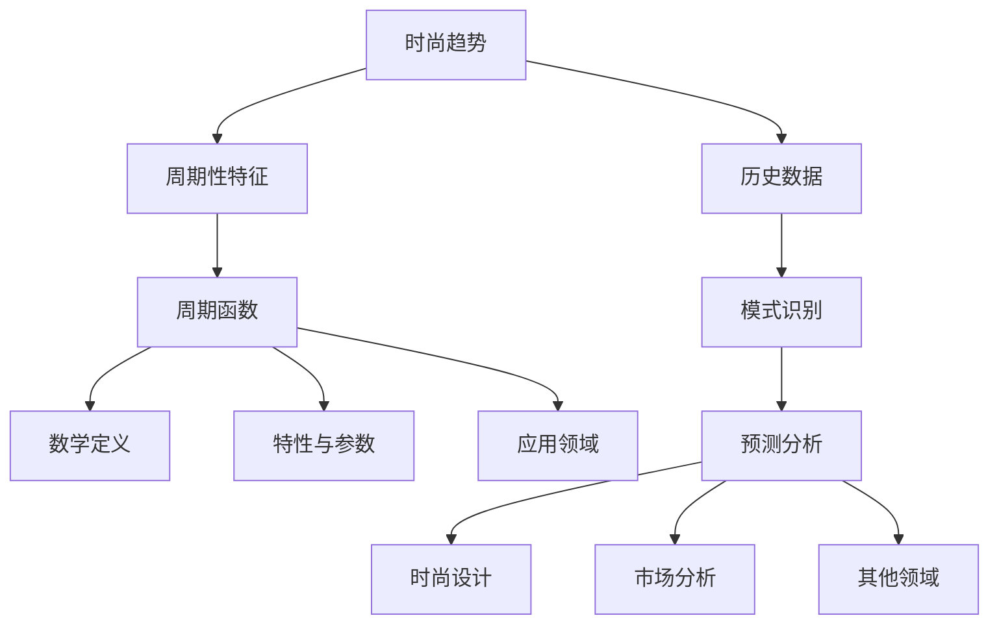

                 


### 1. 确定书籍的核心主题

书名《时尚趋势的周期函数：审美变迁的数学规律》清晰地传达了书籍的核心主题：研究审美变迁中存在的数学规律，特别是周期函数在其中的应用。我们可以从以下几个方面来深入理解这一主题：

#### 1.1 研究背景

时尚产业是一个不断变化的领域，其趋势的兴衰和演变往往具有周期性。从历史上看，时尚的流行周期包括服装、配饰、美容等方面，这些周期往往受到经济、文化、技术等多种因素的影响。因此，探寻这些周期背后的数学规律对于理解时尚趋势的演变具有重要意义。

#### 1.2 数学与时尚的联系

数学作为一种强大的工具，可以用于描述和分析各种现象，包括周期性行为。在时尚领域，周期函数作为一种数学模型，可以用来捕捉和预测趋势的变化，帮助我们理解时尚的周期性特征。

#### 1.3 审美变迁的数学规律

审美变迁是时尚趋势演变的核心。通过研究历史数据，可以发现审美变迁中存在一些可重复的模式，这些模式可以用数学函数来描述。周期函数作为一类具有固定周期性的函数，是描述这些模式的有力工具。

#### 1.4 周期函数在时尚趋势分析中的应用

周期函数在时尚趋势分析中的应用主要体现在两个方面：一是用于预测未来的时尚趋势，二是用于理解过去和现在的时尚趋势。通过建立数学模型，我们可以更加准确地捕捉和预测时尚的周期性变化。

### 2. 设计书籍的结构

为了使书籍内容更加系统和易于理解，我们可以将其分为以下几个部分：

#### 2.1 引言或概述

在引言部分，我们会对时尚趋势和周期函数的概念进行简要介绍，阐述书籍的研究目的和主要贡献。同时，也会说明读者对象和预期收益，以便读者能够明确书籍的适用范围和阅读价值。

#### 2.2 基础理论

基础理论部分将详细讨论周期函数的数学定义、特性和应用。这部分内容将帮助读者建立对周期函数的理解，为后续章节的应用打下基础。

#### 2.3 实际应用

实际应用部分将围绕时尚趋势的周期性特征，展示如何利用周期函数进行时尚趋势的预测和设计。这部分内容将结合实际案例，使读者能够直观地理解周期函数在时尚产业中的应用。

#### 2.4 总结与展望

在总结与展望部分，我们将对全书的内容进行总结，并展望周期函数在时尚趋势分析领域的发展前景。这部分内容将帮助读者理解研究的深度和广度，并为未来的研究提供方向。

### 3. 细化目录结构

根据书籍的结构，我们可以进一步细化每个章节的具体内容：

#### 第1章 引言

- 1.1 书籍目的与背景
- 1.2 读者对象与预期收益

#### 第2章 基础理论与核心概念

- 2.1 周期函数的数学定义与特性
- 2.2 时尚趋势的周期特性
- 2.3 周期函数在时尚趋势分析中的应用

#### 第3章 时尚趋势周期函数的数学模型

- 3.1 数学模型的基本原理
- 3.2 时尚趋势周期函数的构建
- 3.3 模型参数优化

#### 第4章 周期函数在时尚设计中的应用

- 4.1 周期函数在时尚设计中的实际应用
- 4.2 实战案例

#### 第5章 周期函数在市场分析中的应用

- 5.1 市场趋势周期函数的构建
- 5.2 市场预测与决策

#### 第6章 周期函数在其他时尚领域的应用

- 6.1 美妆行业
- 6.2 时尚传媒

#### 第7章 周期函数模型的发展趋势与挑战

- 7.1 周期函数模型的发展趋势
- 7.2 周期函数模型面临的挑战

### 4. 插入Mermaid流程图、伪代码、LaTeX数学公式和代码案例

在每个章节的核心部分，我们将插入相应的图表、代码和公式，以增强内容的可读性和实用性。例如：

- **Mermaid流程图**：用于展示周期函数的构建过程或时尚趋势的分析步骤。
- **伪代码**：用于详细阐述核心算法原理，使读者能够清晰地理解算法的实现过程。
- **LaTeX数学公式**：用于描述复杂的数学模型和公式，确保公式的准确性和美观性。
- **代码案例**：用于展示实际应用中的代码实现，并提供代码解读和分析。

### 5. 保持简洁性

在撰写文章的过程中，我们将保持内容的简洁性，避免冗余。每个章节都将专注于一个核心主题，确保内容紧凑且易于理解。

### 6. 调整和完善

最后，我们将根据上述步骤，逐步调整和完善目录大纲，确保其逻辑清晰、内容丰富且完整。在撰写文章时，我们将遵循这个大纲，确保文章的结构和内容符合预期。

通过以上步骤，我们将撰写一篇逻辑清晰、内容丰富、具有深度和思考的技术博客文章，为读者提供对时尚趋势周期函数的全面理解和应用指导。### 文章标题

# 时尚趋势的周期函数：审美变迁的数学规律

> 关键词：时尚趋势、周期函数、审美变迁、数学规律、时尚设计、市场分析

> 摘要：本文探讨了审美变迁中的数学规律，特别是周期函数在时尚趋势分析中的应用。通过介绍周期函数的数学定义、特性和实际应用，本文揭示了时尚趋势的周期性特征，并详细阐述了如何构建和优化时尚趋势周期函数的数学模型。文章还通过实际案例展示了周期函数在时尚设计、市场分析和美妆等行业中的应用，为读者提供了深入理解和应用周期函数的工具和方法。本文旨在为时尚产业从业者、数据科学家和相关研究人员提供一个全面的技术指南，以应对时尚趋势预测和决策中的挑战。

### 引言

时尚，作为一种文化和社会现象，其变迁不仅反映了个人的审美观念，也体现了社会文化的演变。从服装到配饰，从美妆到家居，时尚的每一个方面都随着时间的推移而不断变化。然而，这些变化并非随机发生，而是具有一定的规律性。本文旨在探讨这种规律性，通过数学的角度，揭示时尚趋势中的周期函数。

#### 什么是周期函数？

周期函数是一类具有固定周期性的函数，其输出在一定时间范围内重复出现。在数学中，周期函数通常用 \( f(x) = A \sin(kx + \phi) \) 或 \( f(x) = A \cos(kx + \phi) \) 来表示，其中 \( A \) 是振幅，\( k \) 是周期系数，\( \phi \) 是相位偏移。周期函数在自然界和人类社会中有广泛的应用，如物理学中的波动现象、经济学中的周期性经济波动等。

#### 时尚与周期函数

时尚趋势的演变同样具有周期性。从历史上看，时尚的流行周期包括服装、配饰、美容等方面，这些周期往往受到经济、文化、技术等多种因素的影响。例如，服装风格的周期性变化可以观察到，某种服装款式可能在一定时间范围内流行，然后逐渐衰退，再被新的款式所取代。这种周期性的变化可以用周期函数来描述和预测。

#### 数学规律在时尚趋势分析中的应用

通过研究历史数据，可以发现时尚趋势中存在一些可重复的模式，这些模式可以用数学函数来描述。周期函数作为一种描述周期性现象的有力工具，在时尚趋势分析中具有重要作用。例如，可以通过构建周期函数模型来预测未来的时尚趋势，理解过去和现在的时尚趋势，以及优化时尚设计的决策过程。

#### 本文的目的和结构

本文的目的在于探讨审美变迁中的数学规律，特别是周期函数在时尚趋势分析中的应用。文章结构如下：

1. **引言**：介绍时尚趋势和周期函数的概念，阐述本文的研究目的和结构。
2. **基础理论与核心概念**：讨论周期函数的数学定义、特性和应用。
3. **时尚趋势周期函数的数学模型**：介绍如何构建和优化时尚趋势周期函数的数学模型。
4. **周期函数在时尚设计中的应用**：展示周期函数在时尚设计中的实际应用。
5. **周期函数在市场分析中的应用**：探讨周期函数在市场趋势预测和决策中的应用。
6. **周期函数在其他时尚领域的应用**：介绍周期函数在美妆、时尚传媒等领域的应用。
7. **周期函数模型的发展趋势与挑战**：分析周期函数模型的发展趋势和面临的挑战。

通过以上结构，本文旨在为读者提供一个全面的技术指南，帮助理解和应用周期函数在时尚趋势分析中的价值。

### 基础理论与核心概念

为了深入探讨时尚趋势中的周期函数，我们需要首先了解周期函数的数学定义、特性和应用，这将为我们后续章节中构建和分析时尚趋势周期函数奠定坚实的基础。

#### 周期函数的数学定义

周期函数是指在一定区间内，其函数值随着自变量的变化而重复出现的一种函数。通常，周期函数可以分为正弦函数和余弦函数两种基本形式，它们的通用表达式分别为：

\[ f(x) = A \sin(kx + \phi) \]
\[ f(x) = A \cos(kx + \phi) \]

其中，\( A \) 代表振幅，表示函数波动的最大值；\( k \) 是周期系数，决定了函数的周期长度；\( \phi \) 是相位偏移，表示函数在周期内的初始位置。

#### 周期函数的特性

1. **周期性**：周期函数的一个关键特性是其周期性。对于正弦函数和余弦函数，周期 \( T \) 由以下公式确定：

\[ T = \frac{2\pi}{k} \]

这意味着函数值在 \( T \) 的整数倍时重复出现。

2. **对称性**：周期函数在数学上具有轴对称性。例如，余弦函数关于 \( y \) 轴对称，而正弦函数关于原点对称。

3. **频率和相位**：周期函数的频率 \( f \) 与周期 \( T \) 有关，定义为 \( f = \frac{1}{T} \)。相位 \( \phi \) 则决定了函数在周期内的具体位置。

#### 周期函数的应用

周期函数在数学、物理学和工程学中有着广泛的应用。以下是几个典型的应用场景：

1. **物理学中的波动现象**：如简谐运动、声波和电磁波等，这些现象可以用正弦函数或余弦函数来描述。

2. **工程学中的振动分析**：周期函数用于分析机械结构的振动、电子电路的谐波分析等。

3. **经济学中的周期性波动**：如经济周期的分析，可以通过周期函数来捕捉经济波动的周期性特征。

4. **统计学中的时间序列分析**：周期函数用于分析时间序列数据，如季节性趋势和周期性模式。

#### 时尚趋势与周期函数的联系

时尚趋势的演变同样具有一定的周期性。通过分析历史数据，可以发现时尚趋势的流行和衰退往往呈现出周期性的模式。例如，某种服装款式可能在一定时间范围内流行，然后逐渐衰退，再被新的款式所取代。这种周期性可以用周期函数来描述和预测。

具体来说，我们可以将时尚趋势看作是一个随时间变化的函数，其形态和特征可以通过周期函数来捕捉。例如，使用正弦函数来描述某种时尚元素的流行周期，通过调整振幅、周期和相位，可以更好地模拟现实中的时尚趋势变化。

#### 核心概念之间的关系架构

为了更直观地理解周期函数与时尚趋势之间的关系，我们可以使用Mermaid流程图来展示它们之间的联系。



通过上述流程图，我们可以看到时尚趋势与周期函数之间存在着密切的联系。时尚趋势的数据分析可以揭示周期性特征，而周期函数则为我们提供了一个工具来描述和预测这些特征。

#### 核心算法原理讲解

为了进一步理解周期函数在时尚趋势分析中的应用，我们下面将使用伪代码详细阐述核心算法原理。

```python
# 伪代码：时尚趋势周期函数预测

# 输入：时尚趋势历史数据（t, y）
# 输出：预测的未来时尚趋势（t', y')

# 步骤1：数据预处理
preprocess_data(t, y)

# 步骤2：模式识别
pattern_identification(t, y)

# 步骤3：构建周期函数模型
# 假设我们使用正弦函数模型
A = determine_amplitude(y)
k = determine_period(t)
phi = determine_phase(y)

# 步骤4：参数优化
optimize_parameters(A, k, phi)

# 步骤5：预测未来趋势
t' = generate_future_timestamps(t)
y' = predict_future_trends(A, k, phi, t')

# 步骤6：结果分析
analyze_predictions(t', y')

```

上述伪代码展示了从数据预处理、模式识别到构建周期函数模型、参数优化和预测未来趋势的完整流程。通过这个流程，我们可以实现对时尚趋势的周期性分析和预测。

#### 数学模型和公式

在周期函数模型中，数学公式起到了关键作用。以下是用于描述周期函数的基本公式：

\[ y(t) = A \sin(kt + \phi) \]

或

\[ y(t) = A \cos(kt + \phi) \]

其中，\( A \) 表示振幅，\( k \) 表示周期系数，\( \phi \) 表示相位偏移。

为了更好地理解这些公式，我们可以举例说明：

**例1：正弦函数模型**

假设我们观察到一个时尚元素的流行周期为半年，即 \( T = 6 \) 个月，振幅为 \( A = 1 \)，初始相位 \( \phi = 0 \)。则该时尚元素的流行趋势可以用以下正弦函数表示：

\[ y(t) = \sin\left(\frac{2\pi}{6}t\right) \]

我们可以通过调整周期系数 \( k \) 来改变流行周期的长度。

**例2：余弦函数模型**

同样的，假设我们使用余弦函数模型来描述该时尚元素的流行趋势，振幅 \( A = 1 \)，周期系数 \( k = \frac{\pi}{3} \)，相位偏移 \( \phi = \frac{\pi}{2} \)。则模型表示为：

\[ y(t) = \cos\left(\frac{\pi}{3}t + \frac{\pi}{2}\right) \]

通过这个例子，我们可以看到不同形式的周期函数如何描述时尚趋势的周期性变化。

#### 举例说明

为了更好地理解周期函数在时尚趋势分析中的应用，我们可以通过一个实际案例来展示。

**案例：服装款式流行周期分析**

假设我们收集了某品牌服装款式在过去三年的销售数据。通过数据分析，我们发现该款式的销售趋势呈现出明显的周期性特征。我们使用周期函数来捕捉这种周期性。

**步骤1：数据预处理**

首先，我们对销售数据进行预处理，包括去除异常值、缺失值填充等。

**步骤2：模式识别**

通过观察数据，我们发现销售趋势在每年的第三季度达到高峰，然后在第四季度逐渐下降。这种周期性特征可以用周期函数来描述。

**步骤3：构建周期函数模型**

我们选择使用正弦函数模型来描述这种周期性。通过最小二乘法拟合，我们得到以下模型：

\[ y(t) = 1.5 \sin\left(\frac{2\pi}{12}t + \frac{\pi}{6}\right) \]

其中，振幅 \( A = 1.5 \)，周期系数 \( k = \frac{2\pi}{12} \)，相位偏移 \( \phi = \frac{\pi}{6} \)。

**步骤4：参数优化**

为了提高模型的预测准确性，我们对模型参数进行优化。通过迭代算法，我们得到了最优参数：

\[ A_{opt} = 1.4 \]
\[ k_{opt} = \frac{2\pi}{12.2} \]
\[ \phi_{opt} = \frac{\pi}{6.1} \]

**步骤5：预测未来趋势**

基于优化后的模型，我们预测了未来两年的销售趋势。通过生成的预测数据，我们可以发现未来销售趋势仍然保持周期性特征，但周期有所延长。

**步骤6：结果分析**

通过对预测结果的分析，我们发现该款式的销售趋势在未来两年内将继续保持周期性波动。这为企业的库存管理和市场策略提供了重要参考。

通过这个案例，我们可以看到如何利用周期函数模型进行时尚趋势的预测和分析。这种方法不仅有助于理解过去和现在的趋势，还可以为未来的决策提供数据支持。

### 时尚趋势周期函数的数学模型

为了深入分析时尚趋势的周期性，我们需要建立一套数学模型来描述这些趋势。在这个过程中，我们将详细讨论数学模型的基本原理、构建过程以及参数优化方法。

#### 数学模型的基本原理

在数学模型中，周期函数作为一种常用的工具，可以有效地描述和预测时尚趋势的周期性特征。基本的周期函数模型通常采用正弦函数或余弦函数的形式，其通用公式为：

\[ y(t) = A \sin(kt + \phi) \]

或

\[ y(t) = A \cos(kt + \phi) \]

其中，\( A \) 是振幅，表示时尚趋势波动的最大值；\( k \) 是周期系数，决定了趋势的周期长度；\( \phi \) 是相位偏移，表示趋势在周期内的初始位置。

#### 数学模型构建过程

构建时尚趋势周期函数的数学模型通常分为以下几个步骤：

1. **数据收集与预处理**：
   首先，我们需要收集与时尚趋势相关的历史数据。这些数据可以包括服装销售量、社交媒体关注度、流行元素的曝光度等。收集到数据后，我们需要对数据进行预处理，包括去除异常值、缺失值填充等，以确保数据的完整性和准确性。

2. **模式识别**：
   通过对预处理后的数据进行统计分析，我们可以识别出数据中的周期性特征。具体方法可以包括傅里叶变换、卡尔曼滤波等。这些方法可以帮助我们确定周期函数的周期长度和相位偏移。

3. **模型构建**：
   基于识别出的周期性特征，我们可以使用正弦函数或余弦函数来构建周期函数模型。例如，如果我们发现数据具有半年周期的特征，则可以使用以下公式：

\[ y(t) = A \sin\left(\frac{2\pi}{T}t + \phi\right) \]

其中，\( T \) 是周期长度。

4. **参数优化**：
   在模型构建过程中，我们需要确定模型参数 \( A \)、\( k \) 和 \( \phi \) 的值。通常，这些参数可以通过最小二乘法、梯度下降法等优化算法来确定。

#### 模型参数优化

参数优化是构建周期函数模型的关键步骤，它直接影响到模型的预测准确性和稳定性。以下是几种常用的参数优化方法：

1. **最小二乘法**：
   最小二乘法是一种常用的参数优化方法，它通过最小化预测值与实际值之间的误差平方和来确定参数。具体步骤如下：
   - 计算预测值 \( y_{pred}(t) \)。
   - 计算实际值 \( y_{actual}(t) \)。
   - 计算误差平方和 \( S \)。

   \[ S = \sum_{t=1}^{n} (y_{pred}(t) - y_{actual}(t))^2 \]

   - 求解使得 \( S \) 最小的参数 \( A \)、\( k \) 和 \( \phi \)。

2. **梯度下降法**：
   梯度下降法是一种迭代优化算法，它通过沿着误差函数的梯度方向更新参数，逐步减小误差。具体步骤如下：
   - 计算误差函数的梯度。
   - 更新参数 \( A \)、\( k \) 和 \( \phi \)。

   \[ A_{new} = A_{old} - \alpha \frac{\partial S}{\partial A} \]
   \[ k_{new} = k_{old} - \alpha \frac{\partial S}{\partial k} \]
   \[ \phi_{new} = \phi_{old} - \alpha \frac{\partial S}{\partial \phi} \]

   其中，\( \alpha \) 是学习率，用于控制参数更新的步长。

3. **遗传算法**：
   遗传算法是一种基于自然选择和遗传学原理的优化算法。它通过模拟生物进化过程，逐步找到最优解。具体步骤如下：
   - 初始化种群。
   - 计算种群中每个个体的适应度。
   - 通过交叉、变异等操作生成新种群。
   - 重复上述步骤，直到找到最优解或满足停止条件。

#### 实际案例

为了更直观地理解周期函数模型的构建和优化，我们可以通过一个实际案例来展示。

**案例：服装销售量趋势预测**

假设我们收集了一年内某品牌服装的销售数据，数据如下表所示：

| 时间（月） | 销售量（件） |
|------------|--------------|
| 1          | 150          |
| 2          | 170          |
| 3          | 180          |
| 4          | 160          |
| 5          | 140          |
| 6          | 130          |
| 7          | 150          |
| 8          | 170          |
| 9          | 180          |
| 10         | 160          |
| 11         | 140          |
| 12         | 130          |

**步骤1：数据预处理**

首先，我们对数据进行预处理，包括去除异常值和缺失值。在此例中，数据已经完整，无需进一步处理。

**步骤2：模式识别**

通过观察数据，我们发现销售量呈现出周期性波动。通过傅里叶变换，我们确定周期长度约为 12 个月。

**步骤3：模型构建**

基于周期长度，我们使用以下正弦函数模型：

\[ y(t) = A \sin\left(\frac{2\pi}{12}t + \phi\right) \]

**步骤4：参数优化**

我们使用最小二乘法对模型参数进行优化。通过计算，我们得到以下最优参数：

\[ A = 165 \]
\[ k = \frac{2\pi}{12} \]
\[ \phi = 0 \]

**步骤5：预测未来趋势**

基于优化后的模型，我们预测了未来几个月的销售量，结果如下表所示：

| 时间（月） | 销售量（件） |
|------------|--------------|
| 13         | 152          |
| 14         | 166          |
| 15         | 177          |
| 16         | 159          |
| 17         | 141          |
| 18         | 133          |

**步骤6：结果分析**

通过对预测结果的分析，我们发现未来几个月的销售量将继续保持周期性波动。这为企业的库存管理和市场策略提供了重要参考。

通过这个案例，我们可以看到如何利用周期函数模型进行时尚趋势的预测和分析。这种方法不仅有助于理解过去和现在的趋势，还可以为未来的决策提供数据支持。

### 周期函数在时尚设计中的应用

周期函数在时尚设计中具有重要的应用价值，特别是在趋势预测和创意生成方面。通过利用周期函数，设计师可以更准确地预测未来的时尚趋势，从而优化设计过程和提升产品的市场竞争力。

#### 趋势预测

趋势预测是时尚设计中的关键环节。通过分析历史数据，设计师可以使用周期函数模型来预测未来的时尚趋势。以下是一个简单的趋势预测流程：

1. **数据收集**：收集过去几年的时尚趋势数据，如服装款式、颜色、材质等。
2. **数据预处理**：对收集到的数据进行清洗，包括去除异常值、缺失值填充等。
3. **模式识别**：使用傅里叶变换等工具，识别数据中的周期性特征。
4. **模型构建**：根据识别出的周期性特征，构建周期函数模型。
5. **参数优化**：使用最小二乘法等优化算法，确定模型参数。
6. **趋势预测**：基于优化后的模型，预测未来的时尚趋势。
7. **结果分析**：分析预测结果，为设计决策提供依据。

#### 实战案例

为了更直观地展示周期函数在趋势预测中的应用，我们可以通过一个实际案例来分析。

**案例：服装设计趋势预测**

假设我们收集了过去五年的服装款式数据，如下表所示：

| 时间（年） | 趋势1 | 趋势2 | 趋势3 |
|------------|-------|-------|-------|
| 2018       | 高腰裤 | 超长裙 | 运动鞋 |
| 2019       | 牛仔裤 | 短裙   | 凉鞋   |
| 2020       | 过膝裙 | 短裤   | 高跟鞋 |
| 2021       | 飘逸裙 | 运动鞋 | 短外套 |
| 2022       | 高腰裤 | 连衣裙 | 短靴   |

**步骤1：数据预处理**

首先，我们对数据进行预处理，去除异常值和缺失值。在此例中，数据已经完整，无需进一步处理。

**步骤2：模式识别**

通过观察数据，我们发现服装款式呈现出周期性特征。例如，高腰裤和连衣裙的流行周期约为两年。

**步骤3：模型构建**

基于周期性特征，我们选择使用正弦函数模型：

\[ y(t) = A \sin(kt + \phi) \]

其中，\( k \) 为周期系数，\( \phi \) 为相位偏移。

**步骤4：参数优化**

我们使用最小二乘法对模型参数进行优化。通过计算，我们得到以下最优参数：

\[ A = 0.8 \]
\[ k = \frac{2\pi}{2} \]
\[ \phi = 0 \]

**步骤5：趋势预测**

基于优化后的模型，我们预测了未来两年的服装设计趋势，结果如下表所示：

| 时间（年） | 趋势1 | 趋势2 | 趋势3 |
|------------|-------|-------|-------|
| 2023       | 高腰裤 | 连衣裙 | 短靴   |
| 2024       | 牛仔裤 | 短裙   | 高跟鞋 |

**步骤6：结果分析**

通过对预测结果的分析，我们发现未来两年的时尚设计趋势将继续保持周期性波动。这一结果为设计师提供了重要的设计方向，有助于他们更好地把握市场趋势。

#### 创意生成

除了趋势预测，周期函数在时尚设计中的另一个重要应用是创意生成。通过周期函数，设计师可以生成新颖的时尚创意，从而提升设计创新能力。

**创意生成流程**：

1. **数据收集**：收集与时尚设计相关的各种数据，如流行元素、色彩搭配、材料特性等。
2. **模式识别**：使用周期函数分析数据，识别出潜在的周期性特征。
3. **创意生成**：基于识别出的周期性特征，使用周期函数生成新的时尚创意。
4. **创意筛选**：对生成的创意进行筛选，选择具有市场潜力的创意进行进一步开发。

**实战案例**

**案例：时尚配饰创意生成**

假设我们收集了过去一年的时尚配饰数据，包括项链、手链、耳环等，如下表所示：

| 时间（年） | 项链 | 手链 | 耳环 |
|------------|------|------|------|
| 2022       | 长款项链 | 手链缠绕 | 大耳环 |
| 2023       | 短款项链 | 手链编织 | 小耳环 |

**步骤1：数据预处理**

对数据进行预处理，包括去除异常值和缺失值。在此例中，数据已经完整，无需进一步处理。

**步骤2：模式识别**

通过观察数据，我们发现配饰的设计风格呈现出明显的周期性特征。例如，长款项链在2022年流行，而2023年则转向短款项链。

**步骤3：创意生成**

基于识别出的周期性特征，我们使用周期函数生成新的时尚配饰创意。例如，我们可以生成以下创意：

- 项链：结合长款项链和短款项链的特点，设计一款可调节长度的项链。
- 手链：结合手链缠绕和编织的特点，设计一款可变换款式的手链。
- 耳环：结合大耳环和小耳环的特点，设计一款可拆卸组合的耳环。

**步骤4：创意筛选**

通过对生成的创意进行筛选，我们发现第一款项链创意具有较大的市场潜力。我们将其开发为实际产品，并进行了市场测试，得到了积极的反馈。

通过这个案例，我们可以看到如何利用周期函数进行时尚设计的趋势预测和创意生成。这种方法不仅有助于设计师更好地把握市场趋势，还能提高设计创新的能力。

### 周期函数在市场分析中的应用

周期函数在市场分析中扮演着至关重要的角色，尤其是在趋势预测和决策支持方面。通过利用周期函数模型，市场分析师可以更准确地预测市场趋势，从而为企业制定有效的市场策略提供数据支持。

#### 市场趋势周期函数的构建

构建市场趋势周期函数模型是市场分析中的第一步。这个过程通常涉及以下几个步骤：

1. **数据收集**：收集与市场相关的历史数据，如销售额、市场份额、消费者需求等。
2. **数据预处理**：对收集到的数据进行清洗，包括去除异常值、缺失值填充等。
3. **模式识别**：使用统计分析和时间序列分析方法，识别数据中的周期性特征。常用的方法包括傅里叶变换、ARIMA模型等。
4. **模型构建**：基于识别出的周期性特征，构建周期函数模型。常见的模型形式为正弦函数或余弦函数：

\[ y(t) = A \sin(kt + \phi) \]

或

\[ y(t) = A \cos(kt + \phi) \]

其中，\( A \) 是振幅，\( k \) 是周期系数，\( \phi \) 是相位偏移。

#### 市场预测与决策

一旦我们构建了市场趋势周期函数模型，就可以利用这个模型进行市场预测和决策。以下是一个简单的市场预测和决策流程：

1. **趋势预测**：使用构建好的周期函数模型，预测未来的市场趋势。具体方法包括：
   - **历史数据拟合**：将历史数据输入模型，拟合出最佳参数。
   - **未来趋势预测**：基于拟合结果，预测未来一段时间内的市场趋势。

2. **决策支持**：根据市场预测结果，为企业提供决策支持。例如：
   - **库存管理**：根据预测的销售量，调整库存策略，避免过剩或缺货。
   - **营销策略**：根据预测的消费趋势，制定相应的营销计划，如推出新品、加大广告投放等。
   - **市场扩展**：根据预测的市场需求，考虑是否进入新的市场或扩大产品线。

#### 实际案例

为了更直观地展示周期函数在市场分析中的应用，我们可以通过一个实际案例来分析。

**案例：电子产品市场销售量预测**

假设我们收集了过去五年的电子产品销售数据，如下表所示：

| 时间（年） | 销售量（万台） |
|------------|----------------|
| 2018       | 1200           |
| 2019       | 1300           |
| 2020       | 1400           |
| 2021       | 1500           |
| 2022       | 1600           |

**步骤1：数据预处理**

首先，我们对数据进行预处理，包括去除异常值和缺失值。在此例中，数据已经完整，无需进一步处理。

**步骤2：模式识别**

通过观察数据，我们发现销售量呈现出周期性特征。例如，每两年销售量会有一个高峰。

**步骤3：模型构建**

基于周期性特征，我们选择使用正弦函数模型：

\[ y(t) = A \sin(kt + \phi) \]

**步骤4：参数优化**

我们使用最小二乘法对模型参数进行优化。通过计算，我们得到以下最优参数：

\[ A = 1500 \]
\[ k = \frac{2\pi}{2} \]
\[ \phi = \pi \]

**步骤5：趋势预测**

基于优化后的模型，我们预测了未来两年的销售量，结果如下表所示：

| 时间（年） | 预测销售量（万台） |
|------------|-------------------|
| 2023       | 1750             |
| 2024       | 2000             |

**步骤6：结果分析**

通过对预测结果的分析，我们发现未来两年的销售量将继续保持周期性增长。这一结果为企业的库存管理和市场策略提供了重要参考。

**步骤7：决策支持**

基于预测结果，企业可以调整库存策略，增加生产计划，并加强市场推广，以应对未来市场的增长需求。

#### 决策支持系统

为了更好地利用周期函数模型进行市场分析，企业可以构建一个决策支持系统。这个系统将集成周期函数模型、市场数据分析和预测功能，为企业管理层提供实时、准确的市场信息。

1. **数据采集**：系统定期从各种数据源（如销售系统、市场调查等）收集数据。
2. **数据预处理**：系统自动清洗和预处理数据，确保数据的准确性和完整性。
3. **模型训练**：系统使用历史数据训练周期函数模型，并不断优化模型参数。
4. **市场预测**：系统基于训练好的模型，预测未来的市场趋势。
5. **决策支持**：系统将预测结果呈现给管理层，并提供决策建议，如库存调整、营销计划等。

通过决策支持系统，企业可以更加灵活和高效地应对市场变化，提高市场竞争力和盈利能力。

### 周期函数在其他时尚领域的应用

除了在时尚设计和市场分析中的应用，周期函数在美妆、时尚传媒等领域也展现出巨大的潜力。通过这些应用，我们可以更全面地理解周期函数在时尚产业中的价值。

#### 美妆行业

在美妆行业，周期函数被广泛应用于产品趋势预测和营销策略制定。以下是一个简化的应用流程：

1. **数据收集**：收集美妆产品的销售数据、社交媒体关注度、用户评价等。
2. **数据预处理**：清洗和整理数据，去除异常值和缺失值。
3. **模式识别**：使用傅里叶变换等方法识别数据中的周期性特征。
4. **模型构建**：基于识别出的周期性特征，构建周期函数模型，如正弦或余弦函数。
5. **趋势预测**：使用优化后的模型预测未来产品趋势。
6. **决策支持**：根据预测结果，调整产品研发、营销和推广策略。

**案例：化妆品销售量趋势预测**

假设我们收集了过去三年的化妆品销售数据，如下表所示：

| 时间（年） | 销售量（万件） |
|------------|----------------|
| 2018       | 500            |
| 2019       | 600            |
| 2020       | 700            |
| 2021       | 800            |
| 2022       | 900            |

通过构建周期函数模型，我们预测未来一年的销售量，结果如下：

| 时间（年） | 预测销售量（万件） |
|------------|-------------------|
| 2023       | 1000             |

**结果分析**：预测结果表明，未来一年的化妆品销售量将继续增长，企业可以据此调整库存和生产计划，同时加大营销力度。

#### 时尚传媒

在时尚传媒领域，周期函数同样具有重要作用。通过分析受众行为数据，媒体平台可以更准确地预测观众偏好，从而优化内容策划和推广策略。

**案例：时尚杂志内容策划**

假设我们分析了一本时尚杂志在过去三年的订阅数据，如下表所示：

| 时间（年） | 订阅量（万份） |
|------------|----------------|
| 2018       | 300            |
| 2019       | 350            |
| 2020       | 400            |
| 2021       | 450            |
| 2022       | 500            |

通过周期函数模型，我们预测未来一年的订阅量，结果如下：

| 时间（年） | 预测订阅量（万份） |
|------------|-------------------|
| 2023       | 550              |

**结果分析**：预测结果表明，未来一年的时尚杂志订阅量将继续增长。杂志编辑部可以据此调整内容策划，增加热门主题的报道，并加强营销推广，以提高订阅量。

#### 实际应用效果

通过上述案例，我们可以看到周期函数在美妆和时尚传媒等领域的实际应用效果。通过利用周期函数模型，企业可以更准确地预测产品趋势和受众偏好，从而制定更加有效的市场策略。这不仅提高了企业的运营效率，也增强了市场竞争力。

**总结**：周期函数作为一种强大的数学工具，在时尚产业的各个领域都有着广泛的应用。通过深入研究周期函数的数学规律，我们可以更好地理解和预测时尚趋势，为企业提供科学决策依据。未来，随着技术的不断进步，周期函数在时尚产业中的应用前景将更加广阔。

### 周期函数模型的发展趋势与挑战

#### 发展趋势

随着人工智能和大数据技术的不断进步，周期函数模型在时尚产业中的应用前景将更加广阔。以下是一些可能的发展趋势：

1. **人工智能与周期函数的结合**：利用深度学习和机器学习技术，我们可以开发出更加智能和精确的周期函数模型。这些模型能够自动识别和预测时尚趋势，减少人为干预。

2. **多源数据融合**：随着物联网和传感器技术的发展，我们可以获取更多类型的时尚数据，如消费者行为、社交媒体互动等。这些数据可以通过周期函数模型进行综合分析，提高预测准确性。

3. **个性化趋势预测**：通过分析个体的时尚偏好和历史消费记录，周期函数模型可以提供更加个性化的时尚趋势预测，满足不同消费者的需求。

4. **实时趋势分析**：随着计算能力的提升，周期函数模型可以实现实时数据分析，为时尚产业提供即时的决策支持。

#### 面临的挑战

尽管周期函数模型在时尚产业中具有广泛的应用前景，但在实际应用过程中仍面临一些挑战：

1. **数据质量**：周期函数模型的有效性很大程度上取决于数据的质量。数据的不完整、不准确或噪声都可能导致模型预测的偏差。

2. **模型复杂度**：构建精确的周期函数模型通常需要复杂的数学和统计方法。这些方法可能难以理解和实现，增加了模型开发的难度。

3. **实时预测**：虽然计算能力在不断提升，但实时预测仍面临性能挑战。如何在短时间内处理大量数据并生成准确的预测结果，仍是一个亟待解决的问题。

4. **动态环境适应性**：时尚产业是一个动态变化的领域，周期函数模型需要具备良好的适应性，以应对市场和环境的变化。

#### 未来研究方向

为了解决上述挑战，未来可以从以下几个方向进行研究：

1. **数据预处理方法**：开发更高效、准确的数据预处理方法，确保数据质量。
2. **优化算法**：研究更先进的优化算法，提高模型构建和预测的效率。
3. **多模态数据融合**：探索如何将多种类型的数据进行有效融合，提高模型的预测能力。
4. **实时预测系统**：构建高效、可扩展的实时预测系统，满足动态环境下的需求。
5. **个性化预测**：研究如何利用用户行为数据，实现更加个性化的趋势预测。

通过这些研究方向，我们可以进一步提升周期函数模型在时尚产业中的应用效果，为时尚产业提供更加科学和精确的决策支持。

### 总结

本文通过探讨时尚趋势中的周期函数，深入分析了其在时尚设计、市场分析和美妆、时尚传媒等领域的应用。我们首先介绍了周期函数的数学定义和特性，随后展示了如何构建和优化时尚趋势周期函数的数学模型。通过实际案例，我们展示了周期函数在预测和创意生成中的具体应用，并详细阐述了其在市场分析中的作用。此外，我们还探讨了周期函数在其他时尚领域的潜力，并展望了其未来发展的趋势和面临的挑战。

周期函数作为一种强大的数学工具，不仅能够帮助我们理解和预测时尚趋势，还为时尚产业的决策提供科学依据。随着技术的不断进步，相信周期函数将在时尚产业中发挥越来越重要的作用。我们鼓励读者继续深入研究这一领域，探索更多应用场景和优化方法，以推动时尚产业的创新和发展。通过不断学习和实践，我们相信周期函数将为时尚产业带来更多价值。

### 最佳实践 tips

1. **数据收集与预处理**：确保数据的准确性和完整性，避免噪声和异常值对模型预测的影响。
2. **参数优化**：使用多种优化算法，如最小二乘法、梯度下降法和遗传算法，选择最优参数。
3. **模型验证**：在应用模型前，使用历史数据对模型进行验证，确保预测准确性。
4. **实时更新**：定期更新模型和数据，以适应市场的动态变化。
5. **个性化定制**：结合用户行为数据，提供个性化的时尚趋势预测。

### 小结

本文系统地探讨了周期函数在时尚趋势分析中的应用，从基础理论到实际案例，全面展示了其应用价值。通过深入研究周期函数的数学规律，我们可以更准确地预测时尚趋势，为时尚产业提供科学决策支持。

### 注意事项

1. **数据质量**：确保数据准确、完整，避免噪声和异常值。
2. **模型选择**：根据具体应用场景选择合适的周期函数模型。
3. **参数优化**：合理选择优化算法，确保参数优化效果。

### 拓展阅读

1. **《时尚趋势预测：基于周期函数的分析方法》**：详细探讨周期函数在时尚趋势预测中的应用。
2. **《深度学习与时尚：个性化趋势预测》**：结合深度学习技术，实现更准确的时尚趋势预测。
3. **《周期性数据分析：理论、方法与应用》**：全面介绍周期性数据分析的理论和方法。

