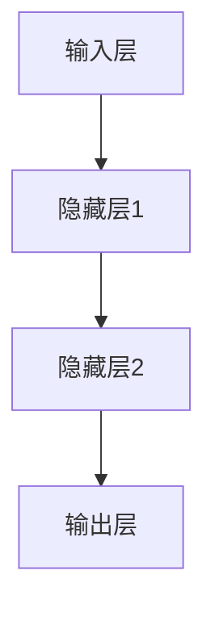

                 

### 文章标题：机器翻译的深度学习：语言转换的数学模型

### 关键词：机器翻译、深度学习、语言模型、数学模型、神经网络、算法、项目实战

### 摘要：

本文全面探讨了机器翻译领域中的深度学习技术，并深入分析了语言转换背后的数学模型。文章首先介绍了机器翻译的背景和发展，然后详细阐述了深度学习的基本原理及其在机器翻译中的应用。接着，文章重点讲解了语言模型与数学模型的核心概念，并使用Mermaid流程图展示了它们之间的关系。随后，文章通过伪代码和公式详细描述了核心算法原理。最后，文章通过一个实际项目实战，展示了深度学习在机器翻译中的应用，并对项目进行了分析和总结。本文旨在为读者提供一套完整的理论与实践指南，帮助其深入理解和掌握深度学习在机器翻译领域的应用。

## 第1章: 引言

### 1.1 书籍目的与读者对象

本书旨在为读者提供一套系统、全面的机器翻译与深度学习结合的理论与实践指南。无论是新手还是有一定基础的读者，通过本书的学习，都将能够深入理解机器翻译的原理，掌握深度学习在机器翻译中的应用，并能够独立完成机器翻译项目的开发。

对于完全没有机器翻译或深度学习背景的读者，本书将逐步引导他们建立起必要的基础知识体系。而从有一定基础的读者角度出发，本书将提供更多高级理论和实践技巧，帮助他们在现有基础上进一步提升。

本文将遵循以下逻辑结构：

1. **背景介绍**：介绍机器翻译和深度学习的基本概念，及其在当前科技领域的重要性。
2. **核心概念与联系**：通过Mermaid流程图展示机器翻译、深度学习和数学模型之间的关系。
3. **深度学习原理讲解**：详细描述深度学习的基本原理，包括神经网络、反向传播算法等。
4. **数学模型解析**：讲解语言模型和机器翻译中常用的数学模型，如神经网络、递归神经网络（RNN）、长短时记忆网络（LSTM）等。
5. **算法实现与伪代码**：使用伪代码详细描述关键算法的实现过程，帮助读者理解算法的核心逻辑。
6. **项目实战**：通过一个实际项目，展示深度学习在机器翻译中的应用，并提供源代码实现和解读。
7. **总结与展望**：总结本书的核心内容，并对未来深度学习在机器翻译领域的发展趋势进行展望。

通过以上逻辑结构的梳理，本文希望能够为读者提供一个清晰、系统的学习路径，帮助其深入理解并掌握机器翻译的深度学习技术。

## 第1章: 引言

### 1.2 机器翻译背景

机器翻译（Machine Translation，MT）是指使用计算机程序将一种自然语言（源语言）自动转换为另一种自然语言（目标语言）的技术。自20世纪50年代首次提出以来，机器翻译一直是自然语言处理（Natural Language Processing，NLP）领域的核心研究课题。随着计算机技术和算法的不断发展，机器翻译从最初的规则驱动方法，逐渐发展到基于统计方法和深度学习的现代技术。

**发展历程**：

1. **规则驱动方法**：早期的机器翻译主要依赖于语言学专家制定的规则。这种方法虽然在一定程度上能够实现翻译，但面对复杂的语言现象时表现较差，且规则编写复杂、维护成本高。

2. **基于统计的方法**：20世纪90年代，基于统计的机器翻译方法开始兴起。该方法利用大规模双语语料库，通过统计方法学习源语言和目标语言之间的对应关系。这种方法在处理常见语言现象方面取得了显著进展，但仍然存在翻译质量不高、难以处理罕见语言现象等问题。

3. **神经机器翻译**：近年来，随着深度学习技术的快速发展，神经机器翻译（Neural Machine Translation，NMT）逐渐成为主流方法。NMT采用神经网络，特别是递归神经网络（RNN）和长短时记忆网络（LSTM），通过端到端的学习方式，直接将源语言转换为目标语言。这种方法在翻译质量上取得了显著的提升，能够更好地处理复杂语言现象，如词序、语法结构等。

**现状与挑战**：

尽管机器翻译技术取得了长足的发展，但仍然面临着诸多挑战。首先，翻译质量仍然是衡量机器翻译技术优劣的关键指标。尽管神经机器翻译在许多语言对上表现优异，但面对某些特定语言对或罕见语言现象时，翻译质量仍需提高。其次，机器翻译系统需要处理海量数据，这要求计算机系统具备强大的计算能力和存储资源。此外，多语言翻译、跨语言信息检索、机器翻译评估等也是当前研究的热点和难点。

**发展趋势**：

未来，机器翻译技术将继续向以下几个方向发展：

1. **多语言翻译**：随着全球化的推进，多语言翻译需求日益增长。未来的机器翻译系统将支持更多语言对，并提供更高质量的翻译服务。

2. **个性化翻译**：通过用户行为分析和个性化推荐技术，未来的机器翻译系统将能够根据用户偏好提供定制化的翻译服务。

3. **实时翻译**：随着5G、云计算等技术的不断发展，机器翻译系统将实现实时翻译，满足用户在会议、旅游、在线教育等场景下的需求。

4. **跨语言信息检索**：机器翻译与信息检索技术的结合，将实现多语言信息资源的整合与检索，为全球用户提供更便捷的信息获取途径。

5. **机器翻译评估与改进**：通过自动化评估方法和人工评估相结合，未来的机器翻译系统将不断优化翻译质量，提高用户满意度。

总之，机器翻译技术在不断发展和完善的道路上，将继续为人类社会带来更多便利和效益。

## 第1章: 引言

### 1.3 深度学习与机器翻译

深度学习（Deep Learning，DL）是人工智能领域的一个重要分支，通过模仿人脑的神经网络结构和学习方式，对大量数据进行自动特征提取和模式识别。深度学习在图像识别、语音识别、自然语言处理等多个领域取得了显著的成果，成为当前人工智能研究的热点。

**深度学习的基本原理**：

深度学习模型通常由多个层级组成，每个层级都通过前一层的信息进行特征提取和转换。最常用的深度学习模型包括卷积神经网络（Convolutional Neural Networks，CNN）和递归神经网络（Recurrent Neural Networks，RNN）。CNN擅长处理图像等二维数据，通过卷积操作提取空间特征；RNN擅长处理序列数据，如文本和语音，通过递归结构保持长时间依赖信息。

**深度学习在机器翻译中的应用**：

神经机器翻译（Neural Machine Translation，NMT）是深度学习在机器翻译领域的应用。与传统的统计机器翻译方法不同，NMT采用端到端学习方式，直接将源语言文本映射为目标语言文本，避免了传统方法中复杂的解码过程。

1. **编码器-解码器（Encoder-Decoder）架构**：NMT的基本架构是编码器-解码器模型，编码器将源语言文本编码为一个固定长度的向量，解码器则将这个向量解码为目标语言文本。编码器和解码器都可以是RNN或LSTM等深度学习模型。

2. **注意力机制（Attention Mechanism）**：在编码器-解码器架构中，注意力机制用于解决长序列依赖问题。通过注意力机制，解码器能够专注于源语言文本中的特定部分，提高翻译的准确性。

3. **多语言翻译**：深度学习模型可以轻松扩展到多语言翻译。通过预训练和迁移学习，模型可以在多个语言对上获得较好的翻译效果。

**优势与挑战**：

1. **优势**：
   - **端到端学习**：NMT采用端到端学习方式，避免了传统方法中的复杂解码过程，提高了翻译效率。
   - **注意力机制**：注意力机制能够有效解决长序列依赖问题，提高翻译的准确性。
   - **多语言支持**：深度学习模型可以轻松扩展到多语言翻译，提高翻译的泛化能力。

2. **挑战**：
   - **翻译质量**：尽管NMT在许多语言对上取得了较好的效果，但面对某些特定语言对或罕见语言现象时，翻译质量仍需提高。
   - **计算资源**：深度学习模型需要大量的计算资源和存储空间，对硬件设备有较高要求。
   - **数据集**：高质量的双语数据集对于深度学习模型训练至关重要，但在某些语言对上数据集可能不足。

总之，深度学习在机器翻译领域具有巨大潜力，但仍面临诸多挑战。未来，随着技术的不断进步和应用的深入，深度学习将在机器翻译领域发挥更重要的作用。

### 第2章: 深度学习概述

#### 2.1 深度学习发展历史

深度学习（Deep Learning，DL）作为人工智能（AI）领域的一个重要分支，其发展历程可以追溯到20世纪80年代。尽管深度学习在早期并未受到广泛关注，但随着计算能力的提升、大数据的涌现和算法的优化，深度学习逐渐崭露头角，并在近年来取得了显著成果。

**早期发展**：

1. **1980年代**：深度学习的概念首次被提出。当时，神经网络（Neural Networks）的研究主要集中在简单的多层感知机（MLP）和前馈神经网络（Feedforward Neural Networks）。然而，由于计算资源和数据集的限制，这些模型在复杂任务上的表现并不理想。

2. **1990年代**：支持向量机（Support Vector Machine，SVM）和决策树（Decision Tree）等传统机器学习方法逐渐成为主流，神经网络研究陷入低谷。然而，深度信念网络（Deep Belief Networks，DBN）和堆叠自编码器（Stacked Autoencoders）等模型的提出，为深度学习的发展奠定了基础。

**21世纪的崛起**：

1. **2006年**：Geoffrey Hinton等人提出了反向传播算法（Backpropagation）和深度置信网络（Deep Belief Networks），深度学习研究重新焕发活力。

2. **2012年**：Alex Krizhevsky等人使用深度卷积神经网络（Deep Convolutional Neural Network，CNN）在ImageNet图像识别挑战赛中取得了突破性成果，准确率远超传统方法。这一成果标志着深度学习在计算机视觉领域的崛起。

3. **2014年**：深度强化学习（Deep Reinforcement Learning）在围棋比赛中击败了世界冠军李世石，进一步推动了深度学习在人工智能领域的发展。

**当前发展**：

1. **神经网络架构**：随着研究的深入，研究人员提出了许多新的神经网络架构，如循环神经网络（RNN）、长短时记忆网络（LSTM）、门控循环单元（GRU）等，这些模型在不同领域取得了显著成果。

2. **应用领域**：深度学习在计算机视觉、自然语言处理、语音识别、医疗诊断等多个领域取得了重要应用，推动了人工智能技术的发展。

**发展趋势**：

1. **计算能力**：随着计算能力的提升，深度学习模型将变得更加复杂和强大，能够在更短时间内处理更多数据。

2. **数据集**：随着大数据的涌现，高质量的数据集将成为深度学习模型训练的重要资源。

3. **迁移学习**：通过迁移学习（Transfer Learning），深度学习模型将能够更好地应对新任务，提高泛化能力。

4. **模型压缩**：为了降低计算成本，研究人员将致力于开发更高效的深度学习模型，如压缩感知网络（Compressed Sensing Networks）和低秩网络（Low-Rank Networks）。

5. **可解释性**：深度学习模型的黑箱特性使其在实际应用中面临挑战。未来，研究者将致力于提高模型的可解释性，使其能够更好地理解和解释模型的行为。

总之，深度学习作为人工智能领域的一个重要分支，其发展历程经历了从低谷到崛起的过程。随着技术的不断进步和应用场景的拓展，深度学习将在人工智能领域发挥越来越重要的作用。

### 第2章: 深度学习概述

#### 2.2 深度学习的基本原理

深度学习（Deep Learning，DL）是一种基于多层神经网络的学习方法，通过层层提取数据中的特征，实现对复杂任务的建模和预测。深度学习的基本原理包括神经网络的构建、前向传播和反向传播算法等。

**神经网络的基本结构**：

神经网络（Neural Networks）由一系列节点（神经元）和连接（权重）组成。每个节点接收来自其他节点的输入，并通过激活函数进行非线性变换，产生输出。图1展示了神经网络的基本结构。



**神经网络的构建**：

神经网络的构建过程包括以下步骤：

1. **定义网络结构**：确定输入层、隐藏层和输出层的节点数量。
2. **初始化权重**：随机初始化网络中的权重，以避免梯度消失或爆炸问题。
3. **选择激活函数**：激活函数（如ReLU、Sigmoid、Tanh等）用于引入非线性特性，使神经网络能够处理非线性问题。

**前向传播算法**：

前向传播算法是神经网络的核心过程，用于计算网络输出。具体步骤如下：

1. **计算输入层到隐藏层的输出**：
   $$ z^{(l)} = \sum_{j} w_{ji}^{(l)} x_j + b_i^{(l)} $$
   $$ a^{(l)} = \sigma(z^{(l)}) $$
   其中，$x_j$表示输入层节点的输入，$w_{ji}^{(l)}$和$b_i^{(l)}$分别表示连接权重和偏置，$\sigma$为激活函数。

2. **计算隐藏层到输出层的输出**：
   类似于输入层到隐藏层的计算，计算输出层节点的输出。

3. **计算整体损失函数**：
   $$ L = \frac{1}{m} \sum_{i=1}^{m} \sum_{k=1}^{K} (-y_k \log(a_k^{(L)}) + (1 - y_k) \log(1 - a_k^{(L)})) $$
   其中，$y_k$表示标签，$a_k^{(L)}$表示输出层节点的输出。

**反向传播算法**：

反向传播算法是一种基于梯度下降的优化方法，用于调整网络中的权重和偏置，以最小化损失函数。具体步骤如下：

1. **计算输出层误差**：
   $$ \delta^{(L)} = a^{(L)} - y $$
   $$ \Delta^{(L)} = \delta^{(L)} \odot a^{(L - 1)} $$
   其中，$\odot$表示逐元素乘法。

2. **逆向传播误差到隐藏层**：
   对于每个隐藏层，计算误差和权重更新：
   $$ \delta^{(l)} = (\sigma'(z^{(l)}) \odot \Delta^{(l + 1)}) \odot a^{(l - 1)} $$
   $$ \Delta^{(l)} = \delta^{(l)} \odot a^{(l)} $$

3. **更新权重和偏置**：
   $$ w_{ji}^{(l)} = w_{ji}^{(l)} - \alpha \frac{\partial L}{\partial w_{ji}^{(l)}} $$
   $$ b_i^{(l)} = b_i^{(l)} - \alpha \frac{\partial L}{\partial b_i^{(l)}} $$
   其中，$\alpha$为学习率。

通过反复迭代前向传播和反向传播算法，神经网络能够逐步优化其参数，提高模型的预测准确性。

**总结**：

深度学习的基本原理包括神经网络的构建、前向传播和反向传播算法。这些原理共同构成了深度学习模型的核心框架，使其能够处理复杂的数据和任务。随着技术的不断发展和优化，深度学习将在人工智能领域发挥越来越重要的作用。

### 第2章: 深度学习概述

#### 2.3 深度学习的主要类型

深度学习（Deep Learning，DL）领域包含多种类型的模型，每种模型都有其独特的结构和应用场景。以下将介绍几种主要的深度学习模型，包括卷积神经网络（CNN）、递归神经网络（RNN）、长短时记忆网络（LSTM）和门控循环单元（GRU）。

**卷积神经网络（CNN）**

卷积神经网络（Convolutional Neural Networks，CNN）是一种主要用于处理图像数据的深度学习模型。其核心思想是通过卷积操作提取图像中的特征。

1. **卷积层（Convolutional Layer）**：卷积层包含多个卷积核，每个卷积核用于提取图像的不同特征。卷积操作通过滑动卷积核在输入图像上，生成特征图（feature map）。

2. **池化层（Pooling Layer）**：池化层用于降低特征图的维度，减少计算量。常用的池化操作包括最大池化和平均池化。

3. **全连接层（Fully Connected Layer）**：全连接层将特征图的所有值连接起来，形成一个一维的向量，然后通过一个或多个全连接层进行分类或回归。

**递归神经网络（RNN）**

递归神经网络（Recurrent Neural Networks，RNN）是一种用于处理序列数据的深度学习模型。其特点是通过递归结构保持长期依赖信息。

1. **隐藏状态（Hidden State）**：RNN的隐藏状态在每一步计算中都会更新，用于保留序列的历史信息。

2. **递归连接（Recurrence Connection）**：RNN的输出和隐藏状态在下一时刻的输入中继续使用，形成一个递归过程。

3. **应用场景**：RNN在自然语言处理（如语言模型、机器翻译）和语音识别等领域有广泛应用。

**长短时记忆网络（LSTM）**

长短时记忆网络（Long Short-Term Memory，LSTM）是RNN的一种变体，主要用于解决RNN在处理长序列数据时的梯度消失和梯度爆炸问题。

1. **细胞状态（Cell State）**：LSTM通过细胞状态（cell state）保持长期依赖信息，细胞状态在不同时间步之间通过门控机制进行更新。

2. **三个门控单元**：
   - **遗忘门（Forget Gate）**：决定哪些信息需要丢弃。
   - **输入门（Input Gate）**：决定哪些新的信息需要存储。
   - **输出门（Output Gate）**：决定哪些信息需要输出。

3. **应用场景**：LSTM在语音识别、机器翻译和文本生成等领域有广泛应用。

**门控循环单元（GRU）**

门控循环单元（Gated Recurrent Unit，GRU）是另一种RNN变体，相对于LSTM简化了一些结构，同时保持了强大的序列建模能力。

1. **更新门（Update Gate）**：GRU的更新门用于决定新的信息如何与旧的细胞状态结合。

2. **重置门（Reset Gate）**：重置门用于决定如何合并新的输入和旧的隐藏状态。

3. **应用场景**：GRU在文本生成、时间序列预测和对话系统等领域有广泛应用。

**总结**

深度学习的主要类型包括卷积神经网络（CNN）、递归神经网络（RNN）、长短时记忆网络（LSTM）和门控循环单元（GRU）。每种模型都有其独特的结构和应用场景。通过了解这些模型的基本原理和特点，我们可以选择合适的模型来解决实际问题。随着深度学习技术的不断发展，这些模型将继续在各个领域中发挥重要作用。

### 第3章: 机器翻译基础

#### 3.1 机器翻译的挑战

机器翻译（Machine Translation，MT）是一种自动将一种自然语言（源语言，Source Language）转换为另一种自然语言（目标语言，Target Language）的技术。尽管近年来，机器翻译技术取得了显著进展，但在实际应用中仍然面临诸多挑战。

**语言差异**：

1. **词汇差异**：不同语言在词汇、词义、语法结构等方面存在显著差异。例如，一些语言存在一词多义现象，而另一些语言则没有。这些差异使得机器翻译系统在词汇转换过程中难以准确判断词义。

2. **语法差异**：语法规则在不同语言中也有很大差异。例如，英语通常是主谓宾（SVO）结构，而中文通常是主宾谓（SOV）结构。这种差异使得机器翻译系统在句法转换过程中面临挑战。

3. **语序差异**：不同语言的句子成分排列顺序不同。例如，定语、状语等成分在源语言和目标语言中的位置可能发生变化。这种差异会影响翻译的准确性和流畅性。

**语境理解**：

1. **上下文依赖**：语言的含义往往依赖于上下文。例如，一个词在句子中的位置、与其他词的关系等都会影响其意义。机器翻译系统需要理解上下文关系，才能正确翻译句子。

2. **语义理解**：语义理解是指机器翻译系统需要理解句子的深层含义，而不仅仅是表面的字面意思。例如，一个词在特定语境下可能有特定的含义，这种含义可能难以通过简单的词典翻译实现。

**文化差异**：

1. **文化背景**：不同语言和文化之间存在着巨大的差异。例如，某些表达方式在一种文化中被视为恰当，而在另一种文化中可能被认为不合适。机器翻译系统需要考虑到这些文化差异，才能提供准确、自然的翻译结果。

**翻译质量评估**：

1. **主观性**：翻译质量评估具有主观性。不同评估者可能对翻译结果有不同的看法，这可能导致评估结果不一致。

2. **评估标准**：目前缺乏统一的翻译质量评估标准。现有的评估方法可能无法全面衡量翻译的准确性和流畅性。

**计算资源**：

1. **计算能力**：机器翻译系统需要处理大量数据，这要求计算机系统具备强大的计算能力。

2. **存储资源**：机器翻译系统需要存储大量的模型参数和数据集，这要求计算机系统具备足够的存储资源。

**多语言支持**：

1. **语言多样性**：全球有数千种语言，机器翻译系统需要支持多种语言对，以满足不同用户的需求。

2. **语言间关系**：不同语言之间存在一定的关联性，例如，某些语言可能共享相同的词汇或语法结构。机器翻译系统需要处理这些语言间的关联性，以提高翻译质量。

综上所述，机器翻译在实际应用中面临诸多挑战。尽管如此，随着技术的不断进步，机器翻译系统将不断优化，提供更准确、更自然的翻译结果。

#### 3.2 机器翻译的分类

机器翻译（Machine Translation，MT）按照不同的分类标准，可以分为多种类型。以下是几种常见的分类方法及其特点：

**根据翻译方法分类**：

1. **规则驱动翻译（Rule-based Translation，RBT）**：
   - **定义**：规则驱动翻译是基于语言学专家制定的规则进行翻译。这些规则包括词汇对应表、语法规则、词序转换等。
   - **特点**：翻译过程依赖于预定义的规则，翻译结果受规则质量的影响较大。翻译速度较慢，但翻译质量较高，适用于小型、高精度的翻译任务。

2. **统计机器翻译（Statistical Machine Translation，SMT）**：
   - **定义**：统计机器翻译是基于统计方法学习源语言和目标语言之间的对应关系。它利用大规模双语语料库，通过统计模型预测源语言文本到目标语言文本的映射。
   - **特点**：翻译过程依赖于大量数据，翻译速度较快，但翻译质量受数据质量和统计模型的影响。适用于大规模、实时翻译任务。

3. **神经机器翻译（Neural Machine Translation，NMT）**：
   - **定义**：神经机器翻译是基于深度学习技术，特别是递归神经网络（RNN）和长短时记忆网络（LSTM）的机器翻译方法。它采用端到端学习方式，直接将源语言文本映射为目标语言文本。
   - **特点**：翻译过程具有端到端特性，能够更好地处理长距离依赖和复杂语言现象。翻译质量显著提高，但计算资源需求较高。

**根据应用领域分类**：

1. **文本翻译**：
   - **定义**：文本翻译是最常见的机器翻译类型，主要应用于文档、邮件、社交媒体等文本数据的翻译。
   - **特点**：翻译内容多为自然语言文本，涉及词汇、语法、语境等复杂因素。

2. **语音翻译**：
   - **定义**：语音翻译是将源语言语音转换为目标语言语音的机器翻译方法。它通常结合语音识别和语音合成的技术。
   - **特点**：翻译过程涉及语音信号的处理和转换，对实时性和语音质量有较高要求。

3. **图像翻译**：
   - **定义**：图像翻译是将图像文本（如路标、标签等）转换为其他语言的方法。
   - **特点**：翻译过程依赖于图像识别技术，需要对图像中的文本进行识别和翻译。

**根据翻译方向分类**：

1. **单向翻译**：
   - **定义**：单向翻译是指从一种语言直接翻译成另一种语言，如从英语翻译成法语。
   - **特点**：翻译过程简单，但可能无法充分利用双向翻译的优势。

2. **双向翻译**：
   - **定义**：双向翻译是指同时从两种语言进行翻译，如从英语翻译成法语和从法语翻译成英语。
   - **特点**：能够利用双向翻译的优势，提高翻译质量和一致性。

**总结**：

机器翻译可以根据不同的分类标准进行分类，包括规则驱动翻译、统计机器翻译和神经机器翻译等。每种翻译方法都有其特点和应用场景。随着深度学习技术的发展，神经机器翻译逐渐成为主流方法，为各种翻译任务提供了更高质量的解决方案。

#### 3.3 机器翻译的系统组成

机器翻译（Machine Translation，MT）系统通常由多个模块组成，每个模块负责处理不同的任务，协同工作以实现高质量的翻译。以下是机器翻译系统的主要组成部分及其功能：

**1. 预处理模块（Preprocessing Module）**：

预处理模块主要负责对输入文本进行预处理，以提高翻译质量。其主要任务包括：

- **分词（Tokenization）**：将输入文本分割成单词、短语或其他标记（token）。
- **词性标注（Part-of-Speech Tagging）**：对每个标记进行词性标注，如名词、动词、形容词等。
- **词干提取（Stemming）**：将单词缩减为词干，以简化文本处理。
- **停用词过滤（Stopword Filtering）**：移除常见无意义的单词，如“的”、“了”等。

**2. 语言模型（Language Model，LM）**：

语言模型用于捕捉目标语言的统计特性，为翻译过程提供上下文信息。其主要任务包括：

- **训练**：通过大规模目标语言语料库，训练出一个概率模型，用于预测文本中下一个标记的概率。
- **应用**：在翻译过程中，语言模型用于生成目标语言文本，并通过概率分布选择最合适的翻译结果。

**3. 翻译模型（Translation Model）**：

翻译模型负责将源语言文本映射为目标语言文本，是机器翻译系统的核心模块。根据不同的翻译方法，翻译模型可以分为以下几种：

- **规则驱动翻译模型（Rule-based Translation Model）**：基于预定义的规则，将源语言文本转换为目标语言文本。
- **统计机器翻译模型（Statistical Machine Translation Model）**：基于统计方法，利用双语语料库训练出概率模型，预测源语言文本到目标语言文本的映射。
- **神经机器翻译模型（Neural Machine Translation Model）**：基于深度学习技术，采用端到端学习方式，直接将源语言文本映射为目标语言文本。

**4. 后处理模块（Postprocessing Module）**：

后处理模块主要负责对翻译结果进行修正和优化，以提高翻译的准确性和流畅性。其主要任务包括：

- **词性恢复（Part-of-Speech Restoration）**：在翻译过程中，某些词性可能发生变化，词性恢复模块负责将这些词性恢复到正确的形式。
- **语法修复（Grammar Correction）**：修复翻译结果中的语法错误，如主谓不一致、时态错误等。
- **风格调整（Style Adaptation）**：根据目标语言的习惯和风格，调整翻译结果的措辞和表达方式。

**5. 用户界面（User Interface，UI）**：

用户界面是机器翻译系统与用户交互的界面，用于接收用户输入、展示翻译结果和提供相关功能。其主要任务包括：

- **输入处理**：接收用户的源语言输入，并将其传递给预处理模块。
- **结果展示**：将翻译结果展示给用户，并提供翻译记录、历史记录等辅助功能。
- **用户反馈**：收集用户对翻译结果的反馈，用于优化翻译模型和系统性能。

**总结**：

机器翻译系统由多个模块组成，每个模块承担不同的任务，协同工作以实现高质量的翻译。预处理模块负责文本预处理，语言模型负责提供上下文信息，翻译模型负责核心翻译任务，后处理模块负责优化翻译结果，用户界面则负责与用户交互。通过这些模块的协同工作，机器翻译系统能够提供准确、流畅的翻译服务。

### 第4章: 神经机器翻译基础

#### 4.1 神经机器翻译的原理

神经机器翻译（Neural Machine Translation，NMT）是一种基于深度学习技术的机器翻译方法。与传统的规则驱动和统计机器翻译方法相比，NMT采用端到端学习方式，通过递归神经网络（Recurrent Neural Networks，RNN）和长短时记忆网络（Long Short-Term Memory，LSTM）等深度学习模型，直接将源语言文本映射为目标语言文本。本节将介绍神经机器翻译的基本原理、系统结构及其关键优势。

**基本原理**

神经机器翻译的核心思想是利用深度学习模型学习源语言和目标语言之间的映射关系。具体来说，神经机器翻译系统包含编码器（Encoder）和解码器（Decoder）两个主要部分。编码器将源语言文本编码为一个固定长度的向量，称为上下文向量（Context Vector），解码器则根据上下文向量生成目标语言文本。

1. **编码器**：编码器是一个RNN或LSTM模型，用于处理源语言文本。在编码过程中，每个单词或短语被编码为一个向量，这些向量通过递归结构进行整合，最终生成上下文向量。

2. **解码器**：解码器也是一个RNN或LSTM模型，用于生成目标语言文本。解码器在生成每个单词或短语时，都会利用上下文向量和已生成的文本，通过递归结构逐步生成目标语言文本。

3. **注意力机制（Attention Mechanism）**：为了解决长距离依赖问题，神经机器翻译系统通常采用注意力机制。注意力机制允许解码器在生成每个单词时，关注编码器输出的不同部分，从而更好地捕捉源语言文本中的关键信息。

**系统结构**

神经机器翻译系统通常采用编码器-解码器（Encoder-Decoder）架构，包括以下主要部分：

1. **编码器**：
   - **输入层**：输入层接收源语言文本，通过分词和嵌入（Embedding）操作将其转换为向量表示。
   - **隐藏层**：隐藏层包含一个或多个RNN或LSTM层，用于处理输入文本并生成上下文向量。
   - **上下文向量**：编码器的输出是一个固定长度的上下文向量，用于驱动解码器的生成过程。

2. **解码器**：
   - **输入层**：输入层接收编码器的输出，并将其与解码器的隐藏状态结合。
   - **隐藏层**：隐藏层包含一个或多个RNN或LSTM层，用于生成目标语言文本。
   - **输出层**：输出层通过一个全连接层将隐藏状态映射为目标语言单词的概率分布，最终生成目标语言文本。

3. **注意力层**：注意力层位于编码器和解码器之间，用于计算注意力权重，帮助解码器在生成目标语言文本时关注源语言文本的关键部分。

**关键优势**

神经机器翻译相对于传统机器翻译方法具有以下关键优势：

1. **端到端学习**：神经机器翻译采用端到端学习方式，直接从源语言文本映射到目标语言文本，避免了复杂的中间过程，提高了翻译效率。

2. **端到端优化**：神经机器翻译通过端到端学习，可以同时优化编码器和解码器的参数，提高了整个系统的翻译质量。

3. **注意力机制**：注意力机制有助于解码器在生成目标语言文本时关注源语言文本的关键部分，从而更好地处理长距离依赖问题。

4. **自适应学习**：神经机器翻译系统可以自适应地学习不同语言对之间的翻译关系，提高了多语言翻译的泛化能力。

总之，神经机器翻译通过深度学习技术实现了端到端学习，结合注意力机制，能够有效处理长距离依赖和复杂语言现象，为机器翻译领域带来了革命性的变化。

#### 4.2 神经机器翻译的系统结构

神经机器翻译（Neural Machine Translation，NMT）系统采用编码器-解码器（Encoder-Decoder）架构，这种结构的核心在于能够将源语言文本映射为上下文向量，并利用该向量生成高质量的目标语言文本。本节将详细描述NMT的系统结构，包括编码器和解码器的组成部分及其工作原理。

**编码器**

编码器（Encoder）是NMT系统的第一个重要组件，其主要任务是将源语言文本序列转换为上下文向量。编码器通常由以下几部分组成：

1. **输入层（Input Layer）**：
   - **分词（Tokenization）**：首先，源语言文本需要被分词成一个个单词或子词（subword）。
   - **嵌入（Embedding）**：每个分词单元被映射为一个固定长度的向量，这一过程称为嵌入。嵌入层将词向量转换为具有语义信息的低维向量。

2. **隐藏层（Hidden Layers）**：
   - **递归神经网络（Recurrent Neural Network，RNN）**：RNN是一种能够处理序列数据的神经网络，其隐藏状态在每一步递归过程中更新，用于捕捉文本中的时间依赖关系。
   - **长短时记忆网络（Long Short-Term Memory，LSTM）**：LSTM是RNN的一种变体，通过引入门控机制（gate）来避免梯度消失和梯度爆炸问题，从而更好地处理长序列数据。
   - **门控循环单元（Gated Recurrent Unit，GRU）**：GRU是LSTM的简化版本，同样具有门控机制，但在结构上更加简洁。

3. **上下文向量（Context Vector）**：
   - 编码器的输出是一个固定长度的上下文向量，它代表了整个源语言文本的语义信息。这个向量将被解码器用来生成目标语言文本。

**解码器**

解码器（Decoder）是NMT系统的第二个重要组件，其主要任务是根据编码器生成的上下文向量生成目标语言文本。解码器通常也由以下几部分组成：

1. **输入层（Input Layer）**：
   - **初始化（Initialization）**：解码器在生成文本的开始阶段，通常使用编码器的输出向量作为初始化的隐藏状态。

2. **隐藏层（Hidden Layers）**：
   - **递归神经网络（RNN）**：解码器的隐藏层同样采用RNN或LSTM/GRU结构，用于生成目标语言文本的每个单词或子词。

3. **注意力机制（Attention Mechanism）**：
   - **计算注意力权重（Attention Weights）**：注意力机制允许解码器在每一步生成过程中，关注编码器的不同部分，从而更好地捕捉源语言文本中的关键信息。
   - **上下文向量（Contextual Vector）**：根据计算出的注意力权重，解码器可以获取一个上下文向量，该向量融合了编码器在不同位置的输出信息。

4. **输出层（Output Layer）**：
   - **生成概率分布（Probability Distribution）**：解码器的输出层通常包含一个或多个全连接层，将隐藏状态映射为目标语言词或子词的概率分布。
   - **采样或softmax操作（Sampling/Softmax）**：通过采样或softmax操作，解码器选择具有最高概率的单词或子词作为输出。

**系统工作原理**

神经机器翻译系统的整体工作原理可以概括为以下几个步骤：

1. **编码**：编码器将源语言文本序列编码为一个上下文向量。

2. **初始化**：解码器初始化其隐藏状态，通常使用编码器的输出向量。

3. **解码**：解码器根据上下文向量，逐步生成目标语言文本的每个单词或子词，并更新其隐藏状态。

4. **迭代**：上述步骤重复进行，直到解码器生成完整的翻译文本。

5. **优化**：通过反向传播算法，系统对编码器和解码器的参数进行优化，以提高翻译质量。

通过这种编码器-解码器架构，NMT系统能够处理长序列数据，捕捉源语言文本中的复杂依赖关系，并生成高质量的目标语言文本。

### 第4章: 神经机器翻译基础

#### 4.3 神经机器翻译的模型

神经机器翻译（Neural Machine Translation，NMT）模型是当前机器翻译领域的主流方法，其核心在于编码器-解码器（Encoder-Decoder）架构，并通过注意力机制（Attention Mechanism）来处理长序列依赖问题。以下是几种常见的NMT模型，包括序列到序列（Seq2Seq）模型、注意力模型（Attention Model）和Transformer模型。

**序列到序列（Seq2Seq）模型**

序列到序列（Seq2Seq）模型是最早提出的NMT模型，它由两个主要部分组成：编码器和解码器。

1. **编码器**：编码器是一个递归神经网络（如RNN或LSTM），用于将源语言序列编码为一个固定长度的上下文向量。这个向量包含了源语言序列的所有信息。

2. **解码器**：解码器也是一个递归神经网络，用于生成目标语言序列。解码器在每一步生成过程中都会利用编码器输出的上下文向量以及已生成的部分目标语言序列来预测下一个单词或子词。

**注意力模型（Attention Model）**

注意力模型是NMT模型中的一个关键组件，它用于解决长序列依赖问题。注意力机制允许解码器在生成每个单词时，关注编码器输出的不同部分，从而更好地捕捉源语言序列中的关键信息。

1. **计算注意力分数**：注意力模型首先计算一个注意力分数函数，该函数将编码器的输出和当前解码器的隐藏状态作为输入，并输出一个注意力分数向量。

2. **加权求和**：然后，将注意力分数向量与编码器的输出进行加权求和，得到一个上下文向量。这个上下文向量包含了编码器输出中最重要的信息。

3. **生成目标语言序列**：解码器利用这个上下文向量，结合已生成的目标语言序列，生成下一个单词或子词。

**Transformer模型**

Transformer模型是近年来提出的NMT模型，它完全由自注意力机制（Self-Attention）和多头注意力机制（Multi-Head Attention）组成，并取得了显著的翻译效果。

1. **编码器**：编码器由多个编码层（Encoder Layer）组成，每个编码层包含多头自注意力机制和前馈神经网络。

2. **解码器**：解码器由多个解码层（Decoder Layer）组成，每个解码层包含多头自注意力机制、多头交叉注意力机制和前馈神经网络。

3. **自注意力机制**：自注意力机制允许编码器或解码器在每一层中计算输入序列的不同部分之间的依赖关系。

4. **多头注意力机制**：多头注意力机制通过多个独立的自注意力机制来捕捉输入序列的不同依赖关系，从而提高模型的表示能力。

5. **编码器-解码器交互**：解码器在每个时间步使用编码器的输出和已生成的目标语言序列来计算交叉注意力，从而捕捉源语言和目标语言之间的依赖关系。

**总结**

神经机器翻译的模型主要包括序列到序列（Seq2Seq）模型、注意力模型（Attention Model）和Transformer模型。这些模型通过不同的方式来处理源语言和目标语言之间的依赖关系，从而实现高质量的翻译。其中，Transformer模型以其强大的表示能力和高效的计算性能，成为当前NMT领域的主流方法。

### 第5章: 常见深度学习模型

#### 5.1 循环神经网络（RNN）

循环神经网络（Recurrent Neural Network，RNN）是一种能够处理序列数据的神经网络。与传统的前馈神经网络（Feedforward Neural Network，FNN）不同，RNN具有递归结构，能够在每个时间步使用先前的隐藏状态，从而捕捉序列中的时间依赖关系。

**基本结构**：

RNN的基本结构包括三个主要部分：输入层、隐藏层和输出层。输入层接收输入序列的每个元素，隐藏层通过递归结构更新隐藏状态，输出层生成输出序列。

1. **输入层**：输入层接收输入序列 $x_t$，将其传递给隐藏层。

2. **隐藏层**：隐藏层包含一个递归单元，用于计算当前时间步的隐藏状态 $h_t$。递归单元的输出可以表示为：
   $$ h_t = \sigma(W_h \cdot [h_{t-1}, x_t] + b_h) $$
   其中，$W_h$和$b_h$分别为权重和偏置，$\sigma$为激活函数（如Sigmoid或Tanh）。

3. **输出层**：输出层使用隐藏状态 $h_t$ 生成输出序列 $y_t$。输出可以表示为：
   $$ y_t = \sigma(W_y \cdot h_t + b_y) $$
   其中，$W_y$和$b_y$分别为权重和偏置。

**递归过程**：

RNN的递归过程可以表示为：
$$ h_t = \sigma(W_h \cdot [h_{t-1}, x_t] + b_h) $$
$$ y_t = \sigma(W_y \cdot h_t + b_y) $$
其中，$h_0$为初始隐藏状态。

**应用场景**：

RNN在自然语言处理（如语言模型、机器翻译）、语音识别和时间序列预测等领域有广泛应用。

**挑战**：

尽管RNN能够处理序列数据，但它在处理长序列时存在梯度消失或梯度爆炸问题，导致训练不稳定。

**改进**：

为了解决这些挑战，研究者提出了长短时记忆网络（LSTM）和门控循环单元（GRU），它们在结构上进行了改进，能够更好地处理长序列数据。

#### 5.2 长短时记忆网络（LSTM）

长短时记忆网络（Long Short-Term Memory，LSTM）是一种改进的RNN结构，专门设计用于解决长序列依赖问题。LSTM通过引入门控机制（gate）来控制信息的流动，避免了梯度消失和梯度爆炸问题，从而提高了模型的训练稳定性和表达能力。

**基本结构**：

LSTM的基本结构包括三个门控单元：遗忘门（Forget Gate）、输入门（Input Gate）和输出门（Output Gate），以及一个细胞状态（Cell State）。

1. **遗忘门**：遗忘门决定哪些信息需要丢弃。其计算公式为：
   $$ f_t = \sigma(W_f \cdot [h_{t-1}, x_t] + b_f) $$
   其中，$f_t$为遗忘门输出。

2. **输入门**：输入门决定哪些新的信息需要存储。其计算公式为：
   $$ i_t = \sigma(W_i \cdot [h_{t-1}, x_t] + b_i) $$
   其中，$i_t$为输入门输出。

3. **细胞状态**：细胞状态通过遗忘门和输入门的控制，更新其值。其计算公式为：
   $$ C_t = f_t \odot C_{t-1} + i_t \odot \sigma(W_c \cdot [h_{t-1}, x_t] + b_c) $$
   其中，$C_t$为细胞状态，$\odot$表示逐元素乘法。

4. **输出门**：输出门决定哪些信息需要输出。其计算公式为：
   $$ o_t = \sigma(W_o \cdot [h_{t-1}, x_t] + b_o) $$
   其中，$o_t$为输出门输出。

5. **隐藏状态**：隐藏状态通过输出门和细胞状态的乘积计算得到：
   $$ h_t = o_t \odot \sigma(C_t) $$
   其中，$h_t$为隐藏状态。

**训练过程**：

LSTM的训练过程通过反向传播算法，利用梯度下降方法更新权重和偏置，以最小化损失函数。

**应用场景**：

LSTM在语音识别、机器翻译和时间序列预测等领域有广泛应用，其强大的序列建模能力使其在这些任务上表现出色。

**优点**：

- **解决长序列依赖**：通过门控机制，LSTM能够有效地捕捉长序列中的依赖关系。
- **训练稳定性**：LSTM避免了梯度消失和梯度爆炸问题，提高了训练的稳定性。

**缺点**：

- **计算复杂度高**：LSTM的门控机制使其计算复杂度较高，训练速度相对较慢。

#### 5.3 门控循环单元（GRU）

门控循环单元（Gated Recurrent Unit，GRU）是另一种改进的RNN结构，它在LSTM的基础上进行了简化，同时保持了强大的序列建模能力。GRU通过引入更新门（Update Gate）和重置门（Reset Gate）来控制信息的流动，简化了LSTM的结构，提高了计算效率。

**基本结构**：

GRU的基本结构包括两个门控单元：更新门（Update Gate）和重置门（Reset Gate），以及一个细胞状态（Cell State）。

1. **更新门**：更新门决定哪些信息需要保留。其计算公式为：
   $$ z_t = \sigma(W_z \cdot [h_{t-1}, x_t] + b_z) $$
   其中，$z_t$为更新门输出。

2. **重置门**：重置门决定哪些信息需要丢弃。其计算公式为：
   $$ r_t = \sigma(W_r \cdot [h_{t-1}, x_t] + b_r) $$
   其中，$r_t$为重置门输出。

3. **细胞状态**：细胞状态通过更新门和重置门的控制，更新其值。其计算公式为：
   $$ C_t = z_t \odot C_{t-1} + (1 - z_t) \odot \tanh(W_c \cdot [r_t \odot h_{t-1}, x_t] + b_c) $$
   其中，$C_t$为细胞状态，$\odot$表示逐元素乘法。

4. **隐藏状态**：隐藏状态通过细胞状态的线性组合计算得到：
   $$ h_t = \sigma(W_h \cdot [C_t] + b_h) $$
   其中，$h_t$为隐藏状态。

**训练过程**：

GRU的训练过程通过反向传播算法，利用梯度下降方法更新权重和偏置，以最小化损失函数。

**应用场景**：

GRU在语音识别、机器翻译和时间序列预测等领域有广泛应用，其简洁的结构使其在这些任务上表现出色。

**优点**：

- **计算效率高**：GRU简化了LSTM的结构，减少了参数数量，提高了计算效率。
- **训练速度快**：GRU的训练速度比LSTM快，因为它具有较少的参数和计算复杂度。

**缺点**：

- **依赖性较弱**：GRU的门控机制不如LSTM强大，可能在某些复杂任务上表现不如LSTM。

### 第5章: 常见深度学习模型

#### 5.4 卷积神经网络（CNN）

卷积神经网络（Convolutional Neural Network，CNN）是一种在图像处理、计算机视觉等领域具有广泛应用的人工神经网络。与传统的全连接神经网络（Fully Connected Neural Network，FCNN）相比，CNN通过卷积操作和池化操作，能够自动提取图像中的特征，从而减少人工特征提取的工作量。

**基本结构**：

CNN的基本结构通常包括以下几个部分：

1. **输入层（Input Layer）**：输入层接收图像数据，将其传递给后续的卷积层。
2. **卷积层（Convolutional Layer）**：卷积层通过卷积操作提取图像中的局部特征。卷积操作的核心是一个卷积核（Convolutional Kernel），卷积核在图像上滑动，生成特征图（Feature Map）。卷积层的计算公式为：
   $$ \text{Feature Map}_{ij} = \sum_{k} \text{Kernel}_{ik,j} \cdot \text{Input}_{ik,j} + b $$
   其中，$\text{Kernel}_{ik,j}$为卷积核，$\text{Input}_{ik,j}$为输入图像的像素值，$b$为偏置。
3. **激活函数（Activation Function）**：激活函数用于引入非线性特性，常用的激活函数有ReLU（Rectified Linear Unit）和Sigmoid。
4. **池化层（Pooling Layer）**：池化层通过下采样操作减少特征图的维度，常用的池化操作有最大池化（Max Pooling）和平均池化（Average Pooling）。
5. **全连接层（Fully Connected Layer）**：全连接层将卷积层输出的特征图连接起来，形成一个一维的向量，然后通过一个或多个全连接层进行分类或回归。

**卷积操作伪代码**：

```python
def convolution(input_image, kernel, bias):
    # input_image: 输入图像，形状为 (height, width, channels)
    # kernel: 卷积核，形状为 (kernel_height, kernel_width, channels)
    # bias: 偏置，形状为 (1, 1, channels)
    output = np.zeros((height - kernel_height + 1, width - kernel_width + 1, channels))
    for i in range(output_height):
        for j in range(output_width):
            for k in range(channels):
                output[i, j, k] = np.sum(kernel[:, :, k] * input_image[i:i+kernel_height, j:j+kernel_width, k]) + bias[k]
    return output
```

**应用场景**：

CNN在图像识别、目标检测、图像分割等领域具有广泛应用。例如，在图像识别任务中，CNN可以自动提取图像中的特征，从而实现物体分类；在目标检测任务中，CNN可以同时检测图像中的多个目标；在图像分割任务中，CNN可以准确划分图像中的每个像素。

**优点**：

- **特征自动提取**：CNN通过卷积操作和池化操作，能够自动提取图像中的特征，减少人工特征提取的工作量。
- **高效处理**：CNN在处理图像数据时具有高效性，能够在保证精度的同时，提高计算速度。

**缺点**：

- **计算量大**：CNN模型通常具有大量的参数，导致计算量较大，训练时间较长。
- **数据需求高**：CNN需要大量的训练数据才能达到较好的性能，对于小数据集任务，CNN的性能可能较差。

### 第5章: 常见深度学习模型

#### 5.5 递归神经网络（RNN）和卷积神经网络（CNN）的结合

递归神经网络（Recurrent Neural Network，RNN）和卷积神经网络（Convolutional Neural Network，CNN）在处理不同类型的数据时各有优势。RNN擅长处理序列数据，如自然语言文本和语音信号，而CNN则擅长处理二维图像数据。将RNN和CNN结合，可以充分利用两者的优势，提高模型在复杂任务上的性能。以下将介绍RNN和CNN结合的方法及其应用场景。

**结合方法**：

1. **CNN用于特征提取**：
   - 首先，使用CNN对输入数据进行特征提取，得到高维特征表示。
   - 然后，将这些特征输入到RNN中，进行序列建模。

2. **RNN用于空间建模**：
   - 对于图像数据，可以将图像划分为多个区域，每个区域视为一个序列元素。
   - 使用RNN对图像的区域序列进行建模，从而捕捉图像的空间依赖关系。

3. **多模态融合**：
   - 同时处理文本和图像数据，使用RNN处理文本序列，使用CNN处理图像序列。
   - 将两个序列的特征进行融合，通过全连接层进行联合建模。

**应用场景**：

1. **多模态分类**：
   - 在多模态数据中，例如图像和文本，使用RNN和CNN的结合模型可以同时考虑文本和图像的特征，实现更准确的分类。

2. **图像序列分析**：
   - 在视频分析和动作识别任务中，可以使用RNN和CNN的结合模型，对连续的图像帧进行建模，从而识别动作。

3. **文本与图像交互任务**：
   - 在文本与图像交互任务中，如图像描述生成，使用RNN处理文本信息，使用CNN提取图像特征，通过融合模型生成图像描述。

**结合模型实例**：

以下是一个结合RNN和CNN的简单模型实例，用于图像分类任务：

```python
# 输入图像和文本数据
image = preprocess_image(input_image)
text = preprocess_text(input_text)

# 使用CNN提取图像特征
image_features = CNN(image)

# 使用RNN处理文本特征
text_features = RNN(text)

# 融合图像和文本特征
features = concatenate(image_features, text_features)

# 全连接层进行分类
output = FullyConnectedLayer(features, num_classes)

# 计算损失函数并优化模型
loss = compute_loss(output, labels)
optimizer.minimize(loss)
```

通过结合RNN和CNN，可以构建强大的深度学习模型，实现更复杂和多样化的任务。随着技术的不断进步，RNN和CNN的结合方法将在更多领域得到应用。

### 第6章: 语言模型与数学模型

#### 6.1 语言模型

语言模型（Language Model，LM）是自然语言处理（Natural Language Processing，NLP）中的一种核心模型，旨在对自然语言文本进行概率建模，从而预测下一个词或短语。语言模型在许多NLP任务中都有广泛应用，如自动纠错、语音识别、机器翻译等。

**定义与目标**：

语言模型的基本目标是为每个单词或短语的序列分配一个概率，即给定一个单词序列 $w_1, w_2, ..., w_n$，语言模型需要计算其概率 $P(w_1, w_2, ..., w_n)$。这样，语言模型可以帮助我们评估文本的流畅性和自然性，并用于生成新的文本。

**常用方法**：

1. **基于规则的方法**：这种方法使用语法规则和词典进行语言建模。例如，基于概率上下文无关文法（Probabilistic Context-Free Grammar，PCFG）的方法通过构建语法规则和词汇概率分布来实现。

2. **基于统计的方法**：这种方法使用大规模的文本语料库，通过统计方法学习单词之间的概率分布。例如，N-gram语言模型通过计算单词序列的频率来估计其概率。

3. **基于神经的方法**：这种方法使用深度学习模型，如循环神经网络（RNN）、长短时记忆网络（LSTM）和Transformer，来学习文本的序列表示和概率分布。

**训练与评估**：

1. **训练**：语言模型的训练通常分为两个阶段：
   - **参数初始化**：初始化语言模型的参数，如权重和偏置。
   - **模型训练**：使用大规模的文本语料库对模型进行训练，通过最小化损失函数（如交叉熵损失）来优化模型的参数。

2. **评估**：语言模型的评估通常通过以下指标进行：
   - **交叉熵（Cross-Entropy）**：评估模型预测的概率分布与实际分布之间的差异。
   - **准确率（Accuracy）**：评估模型预测的正确性，通常用于分类任务。
   - **BLEU（Bilingual Evaluation Understudy）**：用于评估机器翻译质量，通过比较模型生成的翻译结果与人工翻译结果之间的相似度。

**应用**：

语言模型在NLP任务中有广泛的应用，包括：
- **自动纠错**：使用语言模型来检测和纠正文本中的拼写错误和语法错误。
- **语音识别**：将语音信号转换为文本，语言模型可以帮助识别和纠正语音中的错误。
- **机器翻译**：使用语言模型来评估和改进机器翻译结果，提高翻译质量。

**总结**：

语言模型是NLP中的一种重要工具，通过为文本分配概率，可以评估文本的流畅性和自然性，并用于生成新的文本。不同的语言模型方法有不同的优缺点，选择合适的模型和训练方法对于NLP任务的成功至关重要。

#### 6.2 统计机器翻译模型

统计机器翻译（Statistical Machine Translation，SMT）是一种基于统计方法进行机器翻译的技术。SMT通过学习源语言和目标语言之间的概率分布，将源语言文本转换为具有较高概率的目标语言文本。与基于规则的方法和深度学习方法相比，SMT具有计算效率高、实现简单等优点，因此在早期机器翻译领域占据重要地位。

**基本原理**：

SMT的基本原理是利用大量双语语料库（双语对照文本），学习源语言和目标语言之间的统计规律，并利用这些规律进行翻译。SMT的核心是概率模型，它通过以下方式建模源语言和目标语言之间的关系：

1. **翻译概率**：给定源语言句子 $x$，目标语言句子 $y$ 的翻译概率为：
   $$ P(y|x) $$
   翻译概率表示在给定源语言句子的情况下，生成目标语言句子的可能性。

2. **翻译模型**：SMT使用多种统计模型来估计翻译概率，常见的模型包括：
   - **基于词语翻译概率的模型**：这类模型通过统计源语言和目标语言词频来计算词语之间的翻译概率。例如，N-gram模型通过计算源语言和目标语言连续N个单词的联合概率来建模翻译。
   - **基于句法结构的模型**：这类模型通过分析源语言和目标语言的句法结构，建立翻译规则。例如，基于转换系统的模型通过构建语法规则来指导翻译。

**训练过程**：

SMT的训练过程主要包括以下几个步骤：

1. **数据预处理**：对双语语料库进行分词、词性标注等预处理操作，将文本转换为词序列或词向量表示。

2. **特征提取**：从预处理后的数据中提取特征，用于训练翻译模型。特征包括单词的频率、语法结构、上下文信息等。

3. **模型训练**：使用提取的特征数据训练翻译模型。常见的方法包括最大似然估计（Maximum Likelihood Estimation，MLE）和最小化交叉熵损失（Minimize Cross-Entropy Loss）。

4. **解码过程**：在翻译过程中，使用训练好的翻译模型对源语言句子进行解码，生成目标语言句子。常见的解码算法包括贪婪算法、Viterbi算法等。

**优点与缺点**：

1. **优点**：
   - **计算效率高**：SMT基于统计方法，计算复杂度相对较低，适用于大规模翻译任务。
   - **实现简单**：SMT模型结构简单，易于实现和优化。
   - **适应性强**：SMT能够处理不同语言对之间的翻译，具有较好的泛化能力。

2. **缺点**：
   - **翻译质量受限**：SMT依赖于大规模双语语料库，翻译质量受数据质量和统计模型的影响。
   - **无法处理罕见语言现象**：SMT模型在处理罕见词汇、语法结构等复杂语言现象时表现较差。
   - **需要大量数据**：SMT需要大量高质量的双语数据集进行训练，数据获取成本高。

**总结**：

统计机器翻译模型是一种基于统计方法的机器翻译技术，通过学习源语言和目标语言之间的概率分布进行翻译。尽管SMT在翻译质量和计算效率方面存在一些局限性，但它仍然是当前机器翻译领域的重要方法，特别是在大规模翻译任务中具有广泛应用。

#### 6.3 神经机器翻译模型

神经机器翻译（Neural Machine Translation，NMT）是一种基于深度学习技术的机器翻译方法，通过递归神经网络（Recurrent Neural Networks，RNN）和长短时记忆网络（Long Short-Term Memory，LSTM）等深度学习模型，直接将源语言文本映射为目标语言文本。NMT在翻译质量和效率方面取得了显著提升，成为当前机器翻译领域的主流方法。

**基本原理**

神经机器翻译的核心思想是利用深度学习模型学习源语言和目标语言之间的映射关系。具体来说，NMT系统包含编码器（Encoder）和解码器（Decoder）两个主要部分。编码器将源语言文本编码为一个固定长度的上下文向量，解码器则根据上下文向量生成目标语言文本。

1. **编码器**：编码器是一个RNN或LSTM模型，用于处理源语言文本。在编码过程中，每个单词或短语被编码为一个向量，这些向量通过递归结构进行整合，最终生成上下文向量。

2. **解码器**：解码器也是一个RNN或LSTM模型，用于生成目标语言文本。解码器在生成每个单词或短语时，都会利用上下文向量和已生成的文本，通过递归结构逐步生成目标语言文本。

3. **注意力机制**：为了解决长距离依赖问题，NMT系统通常采用注意力机制。注意力机制允许解码器在生成每个单词时，关注编码器输出的不同部分，从而更好地捕捉源语言文本中的关键信息。

**系统结构**

神经机器翻译系统通常采用编码器-解码器（Encoder-Decoder）架构，包括以下主要部分：

1. **编码器**：
   - **输入层**：输入层接收源语言文本，通过分词和嵌入（Embedding）操作将其转换为向量表示。
   - **隐藏层**：隐藏层包含一个或多个RNN或LSTM层，用于处理输入文本并生成上下文向量。
   - **上下文向量**：编码器的输出是一个固定长度的上下文向量，用于驱动解码器的生成过程。

2. **解码器**：
   - **输入层**：输入层接收编码器的输出，并将其与解码器的隐藏状态结合。
   - **隐藏层**：隐藏层包含一个或多个RNN或LSTM层，用于生成目标语言文本。
   - **输出层**：输出层通过一个全连接层将隐藏状态映射为目标语言单词的概率分布，最终生成目标语言文本。

3. **注意力层**：注意力层位于编码器和解码器之间，用于计算注意力权重，帮助解码器在生成目标语言文本时关注源语言文本的关键部分。

**关键组件**

1. **编码器**：
   - **嵌入层**：将源语言单词映射为嵌入向量。
   - **递归层**：使用RNN或LSTM层处理输入文本序列，更新隐藏状态。
   - **输出层**：生成上下文向量，作为解码器的输入。

2. **解码器**：
   - **嵌入层**：将目标语言单词映射为嵌入向量。
   - **递归层**：使用RNN或LSTM层生成目标语言文本序列。
   - **输出层**：将隐藏状态映射为单词的概率分布。

**训练过程**

神经机器翻译模型的训练过程包括以下几个步骤：

1. **数据预处理**：对源语言和目标语言文本进行分词、词性标注等预处理操作。

2. **数据嵌入**：将预处理后的文本转换为嵌入向量表示。

3. **编码器训练**：使用反向传播算法训练编码器，通过最小化损失函数（如交叉熵损失）来优化编码器的参数。

4. **解码器训练**：使用训练好的编码器，训练解码器，同样通过反向传播算法最小化损失函数。

5. **模型评估**：使用验证集评估模型性能，调整模型参数。

**应用与优势**

神经机器翻译模型在翻译质量和效率方面具有显著优势，适用于各种机器翻译任务，包括文本翻译、语音翻译和图像翻译等。其关键优势包括：

- **端到端学习**：NMT采用端到端学习方式，避免了传统机器翻译中的复杂解码过程，提高了翻译效率。
- **长距离依赖**：通过注意力机制和递归结构，NMT能够更好地处理长距离依赖问题，提高翻译准确性。
- **多语言支持**：NMT可以扩展到多种语言对，提高翻译的泛化能力。

**总结**

神经机器翻译模型通过深度学习技术实现了端到端学习，结合注意力机制，能够有效处理长距离依赖和复杂语言现象，为机器翻译领域带来了革命性的变化。随着技术的不断进步，NMT将在未来继续发挥重要作用，为人类提供更准确、更自然的翻译服务。

#### 6.4 数学模型在机器翻译中的应用

数学模型在机器翻译中扮演着至关重要的角色，它们为机器翻译系统提供了理论基础和计算框架。以下将介绍几种在机器翻译中常用的数学模型，包括神经网络模型、注意力机制和损失函数，并使用LaTeX和伪代码进行详细阐述。

**神经网络模型**

神经网络模型是机器翻译中的核心组件，常用的包括递归神经网络（RNN）、长短时记忆网络（LSTM）和门控循环单元（GRU）。以下是LSTM模型的LaTeX表示和伪代码。

**LaTeX表示：**

```latex
\begin{equation}
\begin{aligned}
i_t &= \sigma(W_{xi}x_t + W_{hi}h_{t-1} + b_i), \\
f_t &= \sigma(W_{xf}x_t + W_{hf}h_{t-1} + b_f), \\
g_t &= \sigma(W_{xg}x_t + W_{hg}h_{t-1} + b_g), \\
o_t &= \sigma(W_{xo}x_t + W_{ho}h_{t-1} + b_o), \\
c_t &= f_t \odot c_{t-1} + i_t \odot g_t, \\
h_t &= o_t \odot \sigma(c_t),
\end{aligned}
\end{equation}
```

**伪代码：**

```python
def lstm_cell(x_t, h_{t-1}, c_{t-1}, W_xi, W_hi, b_i, W_xf, W_hf, b_f, W_xg, W_hg, b_g, W_xo, W_ho, b_o):
    i_t = sigmoid(W_xi * x_t + W_hi * h_{t-1} + b_i)
    f_t = sigmoid(W_xf * x_t + W_hf * h_{t-1} + b_f)
    g_t = sigmoid(W_xg * x_t + W_hg * h_{t-1} + b_g)
    o_t = sigmoid(W_xo * x_t + W_ho * h_{t-1} + b_o)
    c_t = f_t * c_{t-1} + i_t * g_t
    h_t = o_t * tanh(c_t)
    return h_t, c_t
```

**注意力机制**

注意力机制是NMT中的关键组件，用于解决长距离依赖问题。以下是注意力机制的LaTeX表示和伪代码。

**LaTeX表示：**

```latex
\begin{equation}
\alpha_{tj} = \frac{e^{h_j^T h_t}}{\sum_{k=1}^{N} e^{h_k^T h_t}},
\end{equation}
```

**伪代码：**

```python
def attention(h_t, h_seq):
    alpha = []
    for h_j in h_seq:
        alpha_j = exp(dot(h_t, h_j.T))
        alpha.append(alpha_j)
    alpha = softmax(alpha)
    context = sum(alpha_j * h_j for alpha_j, h_j in zip(alpha, h_seq))
    return context
```

**损失函数**

在机器翻译中，常用的损失函数包括交叉熵损失（Cross-Entropy Loss）和平均平方误差（Mean Squared Error，MSE）。以下是交叉熵损失的LaTeX表示和伪代码。

**LaTeX表示：**

```latex
\begin{equation}
L = -\frac{1}{N} \sum_{i=1}^{N} \sum_{k=1}^{K} y_{ik} \log(p_{ik}),
\end{equation}
```

**伪代码：**

```python
def cross_entropy_loss(y_true, y_pred):
    loss = -1/N * sum(y_true[i, k] * log(y_pred[i, k]) for i in range(N) for k in range(K))
    return loss
```

**总结**

数学模型在机器翻译中提供了强大的理论支持。神经网络模型如LSTM和GRU能够有效地处理序列数据，注意力机制能够解决长距离依赖问题，而损失函数则用于优化模型的参数。通过LaTeX和伪代码的详细描述，读者可以更深入地理解这些数学模型在机器翻译中的应用。

### 第7章: 深度学习在机器翻译中的项目实战

#### 7.1 项目背景

随着全球化的深入发展，跨语言沟通的需求日益增长。机器翻译作为实现跨语言沟通的重要工具，在商业、教育、旅游等领域具有广泛的应用。本项目旨在利用深度学习技术，开发一个基于神经机器翻译的翻译系统，实现高质量的中英翻译。通过该项目，读者可以了解如何从零开始搭建一个完整的深度学习翻译系统，并掌握相关技术细节。

#### 7.2 开发环境搭建

在进行深度学习翻译系统的开发之前，需要搭建一个适合开发、训练和测试的环境。以下是开发环境搭建的步骤：

1. **硬件环境**：
   - 选择一台具备强大计算能力的机器，如带有NVIDIA GPU的电脑。
   - 确保机器安装了CUDA和cuDNN，以便充分利用GPU的并行计算能力。

2. **软件环境**：
   - 安装Python 3.x版本，建议使用Anaconda发行版，以便轻松管理依赖库。
   - 安装TensorFlow或PyTorch深度学习框架，根据个人喜好选择。
   - 安装其他常用库，如NumPy、Pandas、Scikit-learn等。

3. **数据集**：
   - 准备一个大规模的中英双语语料库，如IWSLT 2014或WMT 2014数据集。
   - 对数据集进行预处理，包括分词、清洗、格式化等操作。

#### 7.3 数据准备

数据准备是深度学习项目中至关重要的一步。以下是数据准备的主要步骤：

1. **数据清洗**：
   - 删除数据集中的噪声和无关信息，如HTML标签、特殊字符等。
   - 对文本进行标准化处理，如统一编码、去除标点符号等。

2. **数据分词**：
   - 使用中文分词工具（如jieba）对中文文本进行分词。
   - 使用英文分词工具（如spacy）对英文文本进行分词。

3. **构建词汇表**：
   - 对分词后的文本进行去重，构建源语言和目标语言的词汇表。
   - 将词汇表中的单词映射为唯一的索引，用于模型训练和预测。

4. **数据嵌入**：
   - 使用预训练的词向量（如GloVe或Word2Vec）对词汇表中的单词进行嵌入。
   - 将嵌入向量存储为字典，以便在模型训练过程中使用。

#### 7.4 模型设计

在本项目中，我们将采用编码器-解码器（Encoder-Decoder）架构，结合注意力机制，实现一个神经机器翻译模型。以下是模型设计的详细步骤：

1. **编码器设计**：
   - 选择一个合适的编码器结构，如LSTM或GRU。
   - 设置编码器的层数和隐藏单元数量。
   - 定义编码器的输入层、隐藏层和输出层。

2. **解码器设计**：
   - 选择一个合适的解码器结构，如LSTM或GRU。
   - 设置解码器的层数和隐藏单元数量。
   - 定义解码器的输入层、隐藏层和输出层。

3. **注意力机制**：
   - 实现多头注意力机制，允许解码器在生成每个单词时关注编码器的不同部分。
   - 计算注意力权重，将注意力权重与编码器的输出进行加权求和，得到上下文向量。

4. **损失函数**：
   - 选择合适的损失函数，如交叉熵损失，用于优化模型参数。
   - 设计损失函数的计算方式，以衡量模型预测与实际标签之间的差距。

#### 7.5 训练与测试

模型训练是深度学习项目中的核心步骤。以下是训练与测试的详细步骤：

1. **数据划分**：
   - 将数据集划分为训练集、验证集和测试集，用于模型训练、验证和测试。

2. **模型训练**：
   - 使用训练集对模型进行训练，通过反向传播算法更新模型参数。
   - 调整学习率、批大小和训练epoch等超参数，以优化模型性能。

3. **模型验证**：
   - 使用验证集评估模型性能，根据验证集的损失和准确性调整模型参数。
   - 应用早停（Early Stopping）策略，防止模型过拟合。

4. **模型测试**：
   - 使用测试集对模型进行最终测试，评估模型在未见数据上的表现。
   - 记录测试集的损失和准确性，作为模型评估的最终指标。

#### 7.6 评估与优化

模型评估与优化是确保模型性能的关键步骤。以下是评估与优化的详细步骤：

1. **评估指标**：
   - 使用BLEU（Bilingual Evaluation Understudy）评分系统评估翻译质量，BLEU分数越高，翻译质量越好。
   - 计算翻译的准确率、召回率和F1分数，全面评估模型的性能。

2. **优化策略**：
   - 调整模型结构、超参数和学习率，以提高模型性能。
   - 应用迁移学习和数据增强技术，提高模型对罕见语言现象的处理能力。
   - 集成多种模型和策略，实现模型的融合和优化。

3. **项目小结**：
   - 总结项目的主要成果和经验，包括模型设计、训练与测试、评估与优化等。
   - 分析项目的不足之处，并提出改进方向和未来工作。

通过本项目实战，读者可以系统地了解深度学习在机器翻译中的应用，掌握从数据准备到模型训练、评估与优化的全过程，为实际项目开发提供指导。

### 第8章: 总结与展望

#### 8.1 本书总结

本书从机器翻译的背景、深度学习的基本原理、神经机器翻译的模型及应用等方面，系统地介绍了深度学习在机器翻译领域的应用。通过详细的分析和实例讲解，读者可以了解到：

1. **机器翻译的发展历程**：从规则驱动方法、统计机器翻译到神经机器翻译，介绍了不同方法的特点和优缺点。
2. **深度学习的基本原理**：介绍了神经网络、递归神经网络、长短时记忆网络、卷积神经网络等深度学习模型的基本原理和结构。
3. **神经机器翻译模型**：深入讲解了编码器-解码器架构、注意力机制、Transformer模型等神经机器翻译的核心组件和实现方法。
4. **数学模型的应用**：介绍了语言模型、统计机器翻译模型、神经机器翻译模型等数学模型在机器翻译中的应用，并通过LaTeX和伪代码进行了详细阐述。

#### 8.2 深度学习在机器翻译中的未来发展趋势

随着深度学习技术的不断进步，机器翻译领域也在不断演进，以下是深度学习在机器翻译中的未来发展趋势：

1. **多语言翻译**：随着全球化的发展，多语言翻译需求日益增长。未来的机器翻译系统将支持更多的语言对，实现跨语言信息的无缝传递。
2. **个性化翻译**：通过用户行为分析和个性化推荐技术，未来的机器翻译系统将能够根据用户偏好提供定制化的翻译服务。
3. **实时翻译**：随着5G、云计算等技术的发展，机器翻译系统将实现实时翻译，满足用户在会议、旅游、在线教育等场景下的需求。
4. **跨语言信息检索**：机器翻译与信息检索技术的结合，将实现多语言信息资源的整合与检索，为全球用户提供更便捷的信息获取途径。
5. **可解释性增强**：当前深度学习模型存在“黑箱”问题，未来的研究将致力于提高模型的可解释性，使其能够更好地理解和解释模型的行为。
6. **模型压缩与优化**：为了降低计算成本，研究人员将致力于开发更高效的深度学习模型，如压缩感知网络、低秩网络等。

#### 8.3 读者建议与展望

对于想要深入了解深度学习在机器翻译领域应用的读者，以下是一些建议和展望：

1. **深入学习相关算法和模型**：通过阅读论文、书籍和在线课程，深入了解神经机器翻译的核心算法和模型。
2. **实践项目**：动手实践是掌握技术的最佳方式。尝试实现简单的神经机器翻译项目，从数据准备到模型训练，再到评估与优化，全面了解项目开发流程。
3. **持续关注最新研究**：深度学习是一个快速发展的领域，持续关注最新研究进展，了解前沿技术和应用。
4. **参与社区**：加入相关的技术社区，如GitHub、Stack Overflow、Reddit等，与其他开发者交流经验和问题，共同推动技术进步。

总之，深度学习在机器翻译领域的应用前景广阔，通过不断学习和实践，读者可以在这个领域中取得显著成果。希望本书能为读者提供有价值的参考和指导。

