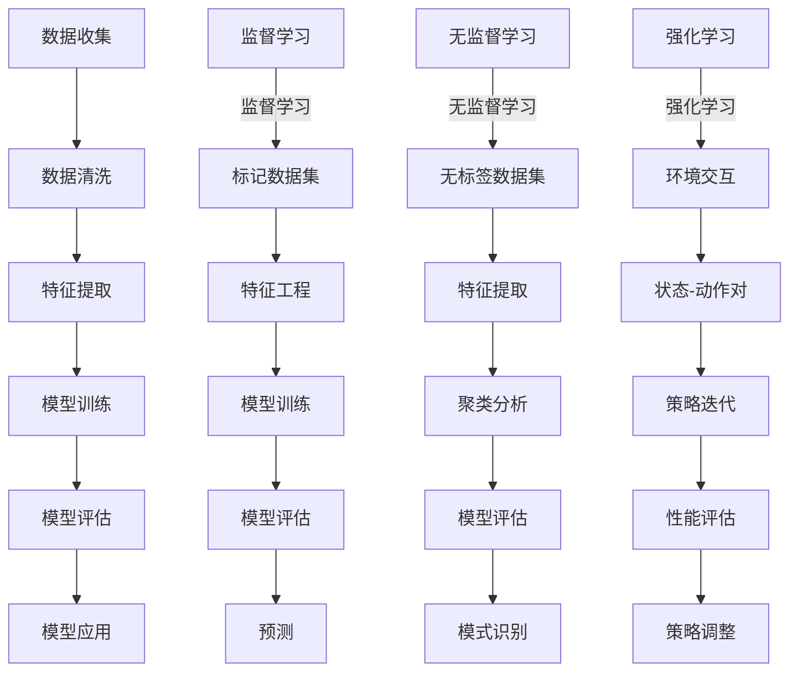

                 

### 文章标题

《犯罪预防的机器学习：社会安全的数学工具》

### 关键词

犯罪预防、机器学习、社会安全、数学工具、人工智能

### 摘要

本文探讨了机器学习在犯罪预防领域中的应用，将其视为社会安全的数学工具。我们首先介绍了犯罪预防的背景，以及机器学习在社会安全中的重要地位。接着，我们深入讨论了机器学习的基础知识，包括数据预处理、常见算法等。随后，我们详细分析了犯罪预测与预防的基本概念、模型评估和优化。在数据分析部分，我们阐述了社会安全数据的类型、分析工具与库，以及数据分析流程。接下来，通过具体案例展示了机器学习在犯罪预防中的实践，包括犯罪热点预测、犯罪行为识别和犯罪预测模型的优化。最后，我们探讨了犯罪预防中机器学习的挑战、未来研究方向和社会安全的未来趋势，并对文章进行了总结和展望。

## 第1章 引言

在当今社会，犯罪预防是一个至关重要的话题。随着科技的快速发展，尤其是机器学习和人工智能技术的不断进步，犯罪预防的方法和手段也在不断演变。机器学习作为一种强大的数据分析工具，已被广泛应用于各个领域，包括医疗、金融、交通等。而在犯罪预防方面，机器学习则被视为一种重要的数学工具，为提升社会安全提供了新的思路和解决方案。

### 1.1 机器学习与犯罪预防

机器学习是指通过算法和统计模型，从数据中自动学习规律和模式，并对未知数据进行预测和决策。它主要包括监督学习、无监督学习和强化学习三种类型。监督学习依赖于标记数据，用于训练模型，然后在新数据上进行预测；无监督学习则不需要标记数据，主要用于发现数据中的隐含结构和模式；强化学习则通过不断试错，寻找最佳策略。

在犯罪预防领域，机器学习可以通过分析大量的历史犯罪数据，识别犯罪行为的特征和模式，从而预测潜在的犯罪热点区域或个体。例如，通过监督学习算法，可以训练一个模型来识别犯罪行为，从而在犯罪发生前进行预防。无监督学习则可以用于发现潜在的犯罪团伙或犯罪模式，而无须事先知道这些模式。此外，强化学习可以用于设计最佳的犯罪预防策略，通过不断调整策略，达到最优效果。

### 1.2 社会安全的重要性

社会安全是国家安全的基础，也是每个公民生活的保障。一个安全的社会能够促进经济发展、社会稳定和人民幸福。然而，随着社会的发展和复杂化，犯罪活动也日益多样化、复杂化。传统的犯罪预防手段，如警务人员巡逻、监控摄像头等，已经难以应对现代社会的犯罪挑战。

社会安全的重要性不仅体现在预防犯罪上，还包括维护社会秩序、保护公民生命财产安全等方面。一个安全的社会能够增强公民的信任感，提高社会的整体幸福感。而缺乏安全感的社区，则可能导致社会矛盾加剧，甚至影响国家的稳定和发展。

### 1.3 本书结构

本书旨在系统性地介绍机器学习在犯罪预防中的应用，分为以下几个主要章节：

- **第1章 引言**：介绍机器学习在犯罪预防中的重要性，以及本书的结构和内容。
- **第2章 犯罪预防的背景**：讨论犯罪预防的现状、机器学习在社会安全中的应用，以及社会安全的需求与挑战。
- **第3章 机器学习基础**：讲解机器学习的基本概念、数据预处理和常见算法。
- **第4章 犯罪预测与预防**：深入分析犯罪预测与预防的基本概念、模型评估和优化。
- **第5章 社会安全数据分析**：阐述社会安全数据的类型、分析工具与库，以及数据分析流程。
- **第6章 机器学习在犯罪预防中的实践**：通过具体案例展示机器学习在犯罪预防中的实际应用。
- **第7章 未来的研究方向与挑战**：探讨机器学习在犯罪预防中的挑战和未来的研究方向。
- **第8章 总结与展望**：总结本书的主要内容，并对犯罪预防机器学习和社会安全的未来进行展望。

通过这些章节的详细探讨，我们希望读者能够对机器学习在犯罪预防中的应用有一个全面、深入的了解，为未来的研究和实践提供指导和参考。

### 2.1 犯罪预防的现状

犯罪预防作为一个传统而持续发展的领域，经历了从简单的人为监控到复杂的技术手段的演变。在早期，犯罪预防主要依赖于警力的巡逻和监控。警察在街头巡逻，通过目测和直觉来预防犯罪，这种方式简单但效率较低，难以覆盖整个城市。同时，监控摄像头作为辅助手段，能够记录犯罪行为，但在事件发生后的调查和取证方面发挥了主要作用。

随着信息技术的快速发展，犯罪预防的手段得到了显著提升。现代犯罪预防体系更多地依赖于数据分析、人工智能和机器学习等先进技术。例如，通过分析大量的犯罪数据，可以识别出潜在的犯罪热点区域，预测可能的犯罪行为。利用大数据技术，可以对人口流动、社会事件等进行实时监控，从而及时发现异常情况。

目前的犯罪预防技术主要包括以下几类：

1. **大数据分析**：通过收集和分析大量的数据，包括犯罪记录、人口统计数据、交通流量等，来发现潜在的犯罪模式和趋势。这种技术能够提供实时的预警，帮助相关部门及时采取措施。

2. **机器学习与人工智能**：利用机器学习算法，可以对历史犯罪数据进行学习，识别犯罪行为模式，预测潜在的犯罪行为。例如，基于监督学习的分类算法，可以将正常的活动与异常的活动区分开来，从而实现预警。

3. **视频监控与图像识别**：通过安装监控摄像头和利用图像识别技术，可以对公共区域进行实时监控。图像识别技术可以识别特定的人脸、车辆或其他物体，从而在犯罪行为发生时进行实时抓捕。

4. **生物特征识别**：利用指纹、面部识别、虹膜识别等技术，可以对个体进行身份验证和监控。这种方式在预防身份盗窃和非法活动方面具有显著优势。

5. **智能报警系统**：通过安装在家庭或商业场所的智能报警设备，可以实现对入侵、火灾等紧急情况的实时报警，从而迅速采取应对措施。

尽管现代犯罪预防技术取得了显著进步，但仍面临一些挑战和局限性。首先，数据隐私和伦理问题是一个重要的挑战。在收集和使用大量个人数据时，如何平衡隐私保护与公共安全成为一个难题。其次，技术的实时性和准确性也是一个关键问题。由于犯罪行为的多样性和复杂性，现有的技术手段可能无法完全准确地预测和预防所有犯罪行为。此外，技术的部署和维护成本也是一个不可忽视的问题，特别是对于资源有限的地区和部门。

总之，犯罪预防的现状表明，尽管已经取得了一定的进展，但仍需要持续改进和创新，以应对日益复杂的犯罪形势。通过结合多种技术手段，提高犯罪预测和预防的准确性，有望为社会安全提供更有效的保障。

### 2.2 机器学习在社会安全中的应用

机器学习在社会安全中的应用日益广泛，其主要优势在于其强大的数据处理和模式识别能力，这使得它能够从大量的社会安全数据中提取有价值的信息，从而为犯罪预防提供有力支持。以下是一些具体的机器学习应用场景和实例。

#### 2.2.1 犯罪预测

犯罪预测是机器学习在社会安全中应用的一个重要方向。通过分析历史犯罪数据，可以识别出犯罪行为的特征和模式，从而预测潜在的犯罪热点区域或个体。以下是一个典型的犯罪预测案例：

**案例：犯罪热点地图**

一个城市的安全部门可以利用机器学习算法，结合历史犯罪数据、人口统计数据、社会事件等因素，建立一个犯罪预测模型。通过模型，可以生成犯罪热点地图，标出高发犯罪区域。这种地图可以帮助警方增加巡逻力度，提前部署警力，从而有效地预防犯罪。

- **数据处理**：首先，收集和整理历史犯罪数据，包括犯罪类型、发生时间、地点等。此外，还需要收集其他相关数据，如天气、节假日安排等。
- **模型建立**：使用监督学习算法，如决策树、随机森林或神经网络，训练预测模型。模型需要输入特征（如地理位置、人口密度等），输出预测结果（犯罪概率）。
- **模型评估**：通过交叉验证等方法评估模型的准确性和泛化能力，必要时调整模型参数。

#### 2.2.2 犯罪行为识别

除了预测犯罪热点，机器学习还可以用于实时识别犯罪行为。通过图像识别、语音识别等技术，可以对监控视频和音频进行实时分析，检测出异常行为和事件。

**案例：犯罪行为识别系统**

一个城市的安全部门可以部署一个基于机器学习的犯罪行为识别系统。该系统通过分析摄像头捕获的图像和视频，自动识别出可疑行为，如持械抢劫、打架斗殴等，并立即报警。

- **数据处理**：收集和分析大量的监控视频和图像，提取关键特征，如人体动作、表情等。
- **模型建立**：使用深度学习算法，如卷积神经网络（CNN），训练识别模型。模型需要识别正常行为与异常行为之间的差异。
- **实时监控**：将训练好的模型部署到监控系统，对实时视频流进行分析，一旦检测到可疑行为，立即触发报警。

#### 2.2.3 犯罪团伙识别

机器学习还可以用于识别犯罪团伙，通过分析社交网络、通信记录等数据，发现潜在的犯罪团伙成员和关联。

**案例：犯罪团伙分析**

一个警方部门可以利用机器学习算法，分析大量的通信记录和社交网络数据，识别出犯罪团伙的成员和活动模式。这种分析可以帮助警方提前打击犯罪团伙，防止犯罪行为的发生。

- **数据处理**：收集和分析通信记录、社交媒体数据等，提取关键特征，如联系人频率、语言模式等。
- **模型建立**：使用图论算法和聚类算法，构建犯罪团伙的社交网络模型，识别出潜在的犯罪团伙。
- **模型评估**：通过交叉验证等方法评估模型的准确性和泛化能力，必要时调整模型参数。

#### 2.2.4 舆情监控

机器学习还可以用于舆情监控，通过分析社交媒体、新闻报道等，及时发现和应对可能引发社会不稳定的事件。

**案例：舆情监控平台**

一个政府部门可以利用机器学习算法，建立一个舆情监控平台。该平台可以实时分析社交媒体上的言论，检测出负面情绪和热点话题，从而及时采取措施应对可能的社会动荡。

- **数据处理**：收集和分析社交媒体数据、新闻报道等，提取关键特征，如情感极性、主题关键词等。
- **模型建立**：使用自然语言处理（NLP）算法，如情感分析、主题模型，训练舆情分析模型。
- **实时监控**：对实时数据流进行分析，检测出负面情绪和热点话题，生成报告，供决策者参考。

通过上述案例，我们可以看到，机器学习在社会安全中的应用具有广泛的前景。它不仅可以帮助相关部门更有效地预防犯罪，维护社会稳定，还能提升公共安全服务的智能化和精准化水平。然而，这些应用也面临着数据隐私、算法公正性和伦理等挑战，需要持续关注和解决。

#### 2.3 社会安全的需求与挑战

在社会安全领域，机器学习的应用面临着诸多需求与挑战。这些需求不仅涉及技术的有效性，还包括数据隐私、算法公正性、以及社会接受度等方面。

**需求分析：**

1. **实时性**：社会安全事件往往具有突发性和不可预测性，因此对系统的实时性要求极高。机器学习模型需要能够快速处理和分析大量数据，提供实时预警和决策支持。
   
2. **准确性**：准确的预测和识别是社会安全系统的关键。模型需要具备高准确性，以减少误报和漏报，确保真正危险的情况能够被及时发现和处理。

3. **可扩展性**：社会安全数据量巨大且不断增长，系统需要具备良好的可扩展性，能够处理大规模数据，同时支持不同应用场景的需求。

4. **综合性**：社会安全涉及多个方面，如犯罪预防、交通管理、公共安全等。系统需要具备综合性，能够整合来自不同领域的数据和信息，提供全面的决策支持。

**挑战分析：**

1. **数据隐私**：在收集和处理大量社会安全数据时，保护个人隐私成为一个重大挑战。如何在不泄露个人隐私的情况下，有效利用数据，是一个需要解决的问题。

2. **算法公正性**：机器学习算法可能会存在偏见，导致某些群体受到不公平对待。确保算法的公正性，避免算法歧视，是一个重要的社会问题。

3. **技术实现难度**：构建高效、准确的机器学习模型需要复杂的算法和大量计算资源。技术实现的难度，尤其是在资源有限的地区，是一个不可忽视的挑战。

4. **社会接受度**：公众对机器学习在社会安全中的应用持不同看法，担忧技术滥用和数据泄露。提高公众对技术的接受度，建立信任，是推广应用的关键。

5. **跨学科合作**：社会安全涉及多个学科领域，如统计学、计算机科学、心理学、社会学等。跨学科合作，综合运用不同领域的知识，是解决复杂社会安全问题的有效途径。

总的来说，虽然机器学习在社会安全中的应用具有巨大的潜力，但也面临诸多需求与挑战。通过持续的技术创新和社会合作，有望克服这些挑战，为社会安全提供更有效、更公正的支持。

### 3.1 机器学习概述

机器学习（Machine Learning，ML）是一种通过算法和统计模型，使计算机系统能够从数据中自动学习和改进的技术。它被视为人工智能（Artificial Intelligence，AI）的一个重要分支，旨在使计算机具备一定的智能，能够进行自我学习和优化。

#### 3.1.1 定义

机器学习的定义多种多样，但核心思想是相同的，即通过训练模型来识别数据中的模式和规律，并利用这些规律对未知数据进行预测和决策。与传统编程不同，机器学习不依赖于显式地编写规则，而是通过从大量数据中学习规律来实现。

#### 3.1.2 分类

机器学习可以分为三类主要类型：监督学习（Supervised Learning）、无监督学习（Unsupervised Learning）和强化学习（Reinforcement Learning）。

1. **监督学习**：监督学习是指通过已标记的数据集来训练模型，使其能够预测未知数据的结果。这种类型的学习类似于学生在教师的指导下学习知识。常见的算法包括线性回归、决策树、支持向量机（SVM）和神经网络等。

2. **无监督学习**：无监督学习是指在没有标记数据的情况下，从数据中发现隐藏的结构和模式。这种类型的学习类似于学生在未受指导的情况下探索新知识。常见的算法包括聚类（如K-means、层次聚类）、降维（如PCA）和关联规则学习等。

3. **强化学习**：强化学习是指通过奖励机制来训练模型，使其能够在特定的环境中通过试错学习最佳策略。这种类型的学习类似于学生在游戏中不断尝试找到最佳策略。常见的算法包括Q-学习、深度Q网络（DQN）和策略梯度算法等。

#### 3.1.3 工作原理

机器学习的工作原理主要包括以下几个步骤：

1. **数据收集**：首先，需要收集大量的数据，这些数据可以来自各种来源，如数据库、传感器、网络爬虫等。

2. **数据预处理**：收集到的数据通常需要进行清洗、归一化和特征提取等处理，以便模型能够更好地理解和利用这些数据。

3. **模型选择**：根据问题的性质和数据特点，选择合适的机器学习算法和模型。常见的模型包括线性模型、决策树、支持向量机、神经网络等。

4. **模型训练**：使用标记数据集对模型进行训练，通过调整模型的参数，使其能够更好地拟合数据。

5. **模型评估**：使用验证数据集对模型进行评估，判断其预测能力和泛化能力。常用的评估指标包括准确率、召回率、F1分数等。

6. **模型部署**：将训练好的模型部署到实际应用场景中，用于对未知数据进行预测和决策。

#### 3.1.4 应用场景

机器学习在各个领域都有广泛的应用，以下是其中一些常见应用场景：

1. **医疗健康**：通过分析患者数据和医疗记录，机器学习可以用于疾病诊断、药物研发和个性化治疗等。

2. **金融领域**：机器学习可以用于信用评分、风险控制、投资策略和自动化交易等。

3. **电子商务**：通过分析用户行为和购物记录，机器学习可以用于个性化推荐、价格优化和欺诈检测等。

4. **交通领域**：机器学习可以用于交通流量预测、自动驾驶和交通事故预防等。

5. **社会安全**：通过分析社会安全数据，机器学习可以用于犯罪预测、行为识别和舆情监控等。

总之，机器学习作为一种强大的数据分析工具，正在不断推动各行业的技术进步和社会发展。通过理解其基本概念和工作原理，我们可以更好地应用机器学习技术，解决实际问题。

#### 3.2 数据预处理

在机器学习项目中，数据预处理是一个至关重要的步骤。数据预处理的质量直接影响到模型的性能和预测准确性。数据预处理的主要任务包括数据清洗、数据归一化和特征提取等。以下将详细阐述这些步骤和它们在犯罪预防中的应用。

##### 3.2.1 数据清洗

数据清洗是指处理和删除数据集中的噪声和异常值，以确保数据的准确性和一致性。常见的数据清洗任务包括：

1. **缺失值处理**：缺失值可以通过多种方法进行处理，如删除含有缺失值的记录、使用平均值或中位数填补缺失值、使用模型预测缺失值等。

2. **异常值处理**：异常值可能来自错误的记录或噪声数据。通过统计方法（如箱线图、Z分数）或机器学习方法（如孤立森林）检测和标记异常值，然后决定是否删除或修正。

3. **重复数据删除**：重复数据可能会误导模型，导致不准确的结果。通过去重算法，可以确保数据集的唯一性。

**应用示例**：在犯罪预防项目中，历史犯罪数据可能包含缺失的日期或地点信息。我们可以使用中位数填补缺失日期，使用最近邻插值法填补缺失地点信息。对于异常值，如一个地点在短时间内记录了数百次犯罪，这可能是数据错误或异常，可以通过孤立森林算法检测并删除。

##### 3.2.2 数据归一化

数据归一化是指将不同特征的数据转换到相同的尺度，以便模型能够更好地处理和比较这些特征。常见的数据归一化方法包括最小-最大缩放、标准缩放和日志变换等。

1. **最小-最大缩放**：将数据缩放到[0, 1]或[-1, 1]之间，公式为 \(X_{\text{norm}} = \frac{X - X_{\text{min}}}{X_{\text{max}} - X_{\text{min}}}\)。

2. **标准缩放**：将数据缩放到均值附近，公式为 \(X_{\text{norm}} = \frac{X - \mu}{\sigma}\)，其中 \(\mu\) 是均值，\(\sigma\) 是标准差。

3. **日志变换**：将数据取对数，常用于处理极端值，公式为 \(X_{\text{log}} = \log(X + 1)\)。

**应用示例**：在犯罪预防项目中，不同特征的尺度差异可能导致模型难以训练。例如，犯罪数量和人口密度之间的差异可能很大。我们可以使用最小-最大缩放法将犯罪数量缩放到[0, 1]之间，从而提高模型的训练效果。

##### 3.2.3 特征提取

特征提取是指从原始数据中提取出对模型训练有用的特征。有效的特征提取可以提高模型的预测准确性，减少过拟合现象。

1. **手动特征提取**：通过专家知识和经验，从原始数据中提取具有解释性的特征。例如，在犯罪预防项目中，可以将地理位置、时间、天气等因素作为特征。

2. **自动特征提取**：使用机器学习算法，如主成分分析（PCA）和特征选择算法，自动提取重要的特征。

**应用示例**：在犯罪预防项目中，时间特征（如一天中的小时、一周中的日子、一年中的月份）和地理位置特征（如行政区、邻里）都是非常重要的。通过手动特征提取，我们可以将这些特征纳入模型。此外，使用PCA可以降低数据的维度，同时保留最重要的特征。

##### 3.2.4 数据集划分

在训练机器学习模型之前，需要将数据集划分为训练集、验证集和测试集。这种划分有助于评估模型的性能和泛化能力。

1. **训练集**：用于训练模型，通常占数据集的大部分（如70%-80%）。

2. **验证集**：用于调整模型参数，通常占数据集的15%-20%。

3. **测试集**：用于评估最终模型的性能，通常占数据集的10%。

**应用示例**：在犯罪预防项目中，我们可以将犯罪数据按照时间顺序划分为训练集、验证集和测试集。这样可以确保测试集的数据与训练集和验证集的数据不重叠，从而更准确地评估模型的泛化能力。

通过上述步骤，我们可以确保数据预处理的质量，为后续的模型训练和预测打下坚实的基础。在犯罪预防中，良好的数据预处理能够显著提高模型的预测准确性和实用性。

### 3.3 常见机器学习算法

在犯罪预防的机器学习应用中，选择合适的算法至关重要。以下是几种常见且在犯罪预测和预防中表现优异的机器学习算法，包括线性回归、逻辑回归、决策树和随机森林等，以及每种算法的基本原理和适用场景。

#### 3.3.1 线性回归

**基本原理**：线性回归是一种简单的监督学习算法，用于预测连续值输出。它的模型假设输出值 \(Y\) 是输入特征 \(X\) 的线性函数，公式为 \(Y = \beta_0 + \beta_1X + \epsilon\)，其中 \(\beta_0\) 是截距，\(\beta_1\) 是斜率，\(\epsilon\) 是误差项。

**适用场景**：线性回归适用于预测数值型数据，如预测犯罪数量。它简单易实现，但在面对非线性关系时效果较差。

**伪代码**：
```
def linear_regression(X, Y):
    n = len(X)
    X_mean = mean(X)
    Y_mean = mean(Y)
    b1 = sum((X[i] - X_mean) * (Y[i] - Y_mean) for i in range(n)) / sum((X[i] - X_mean)^2 for i in range(n))
    b0 = Y_mean - b1 * X_mean
    return b0, b1
```

#### 3.3.2 逻辑回归

**基本原理**：逻辑回归是一种用于分类问题的监督学习算法，它通过线性模型预测概率，然后使用阈值进行分类。其公式为 \(P(Y=1) = \frac{1}{1 + e^{-(\beta_0 + \beta_1X)}}\)，其中 \(\beta_0\) 是截距，\(\beta_1\) 是斜率。

**适用场景**：逻辑回归适用于二分类问题，如判断某个区域是否为犯罪热点。它具有良好的可解释性和计算效率。

**伪代码**：
```
def logistic_regression(X, Y):
    n = len(X)
    X_mean = mean(X)
    Y_mean = mean(Y)
    b1 = sum((X[i] - X_mean) * (log(Y[i]) - log(1 - Y[i])) for i in range(n)) / sum((X[i] - X_mean)^2 for i in range(n))
    b0 = log(1 - Y_mean) - b1 * X_mean
    return b0, b1
```

#### 3.3.3 决策树

**基本原理**：决策树通过一系列的判断规则来对数据进行分类或回归。每个节点代表一个特征，每个分支代表特征的不同取值，叶节点表示最终的分类或回归结果。

**适用场景**：决策树适用于处理分类和回归问题，特别是当数据有明显的层次结构时。它易于理解和解释，但可能产生过拟合。

**伪代码**：
```
def build_decision_tree(X, Y, features):
    if all(Y == Y[0]):
        return Y[0]
    elif len(features) == 0 or all(Y == [0, 0]):
        return majority_vote(Y)
    else:
        best_feature, best_threshold = find_best_threshold(X, Y, features)
        left subtree = build_decision_tree(X[X < best_threshold], Y, features - {best_feature})
        right subtree = build_decision_tree(X[X >= best_threshold], Y, features - {best_feature})
        return (best_feature, best_threshold, left subtree, right subtree)
```

#### 3.3.4 随机森林

**基本原理**：随机森林（Random Forest）是一种集成学习方法，通过构建多棵决策树并投票来提高模型的预测性能。它通过随机选择特征和样本子集来减少偏差和方差。

**适用场景**：随机森林适用于各种分类和回归问题，特别是当数据存在噪声和不平衡时。它具有较好的泛化能力和抗过拟合能力。

**伪代码**：
```
def random_forest(X, Y, n_trees, max_depth, features):
    forests = []
    for _ in range(n_trees):
        X_sample, Y_sample = sample_data(X, Y, features)
        tree = build_decision_tree(X_sample, Y_sample, features)
        forests.append(tree)
    return vote(forests)
```

通过上述算法，我们可以根据实际需求和数据特点选择合适的方法来构建犯罪预测模型。线性回归和逻辑回归适用于简单的线性关系，而决策树和随机森林则适用于复杂和非线性关系。在实际应用中，通过组合多种算法，可以进一步提高模型的预测准确性和鲁棒性。

### 4.1 犯罪预测与预防的基本概念

犯罪预测与预防是现代公共安全的重要组成部分。通过先进的机器学习技术，我们可以对潜在的犯罪活动进行预测，从而采取有效的预防措施，降低犯罪率，提升社会安全水平。

#### 4.1.1 犯罪预测的定义

犯罪预测（Crime Prediction）是指利用历史犯罪数据、环境数据和其他相关因素，通过机器学习算法建立模型，预测未来犯罪活动的可能性。这种预测不仅包括特定犯罪类型的概率，还可以预测犯罪发生的地点和时间。

#### 4.1.2 犯罪预防的定义

犯罪预防（Crime Prevention）是指通过采取各种措施，减少犯罪行为的发生，保护公民和社会的安全。犯罪预测是犯罪预防的重要手段之一，通过预测潜在的犯罪活动，可以有针对性地部署警力、资源和其他预防措施。

#### 4.1.3 犯罪预测与预防的关系

犯罪预测与犯罪预防密切相关，两者相辅相成。犯罪预测提供了对潜在犯罪活动的早期预警，帮助相关部门及时采取预防措施，从而防止犯罪行为的发生。而有效的犯罪预防措施又能降低犯罪率，为犯罪预测提供更多的数据支持，从而提高预测模型的准确性。

#### 4.1.4 犯罪预测的方法

犯罪预测的方法主要包括以下几种：

1. **基于历史数据的预测**：这种方法利用历史犯罪数据，通过统计分析或机器学习算法，识别犯罪行为的模式和趋势，从而预测未来的犯罪活动。

2. **基于环境因素的预测**：除了历史犯罪数据，这种方法还考虑环境因素，如天气、节假日安排、社区活动等，这些因素可能会影响犯罪行为的发生。

3. **基于社会数据的预测**：这种方法利用社交媒体、新闻媒体等公开数据，通过自然语言处理和机器学习算法，分析社会情绪、舆论走向等，预测可能的犯罪活动。

4. **基于模型优化的预测**：通过不断优化预测模型，提高其准确性和鲁棒性。常见的优化方法包括交叉验证、调整模型参数等。

#### 4.1.5 犯罪预防的策略

犯罪预防的策略主要包括以下几个方面：

1. **增加警力部署**：在预测的高危区域增加警力巡逻，提高警方的响应速度。

2. **社区干预**：通过社区活动、社会参与等手段，增强社区的凝聚力和安全感，减少犯罪机会。

3. **技术手段应用**：利用监控摄像头、无人机等科技手段，加强对公共区域的监控，提高犯罪活动的发现率。

4. **宣传教育**：通过宣传教育，提高公众的安全意识和防范能力，减少潜在的犯罪行为。

#### 4.1.6 犯罪预测与预防的实际案例

在实际应用中，许多城市已经成功利用机器学习技术进行犯罪预测和预防。以下是一些实际案例：

- **纽约市**：纽约市警察局（NYPD）通过机器学习模型，预测犯罪热点，并据此调整警力部署，取得了显著的犯罪预防效果。

- **伦敦**：伦敦警察厅（MPS）使用基于图像识别的机器学习模型，监控城市中的可疑活动，提高了犯罪行为的发现率。

- **新加坡**：新加坡政府利用大数据和机器学习技术，建立了智能犯罪预测系统，帮助警方预防和打击犯罪活动。

这些案例表明，通过科学的方法和技术手段，犯罪预测和预防可以显著提升社会安全水平。未来，随着技术的不断进步，犯罪预测和预防将更加智能化、精准化，为社会安全提供更强大的支持。

### 4.2 犯罪预测模型

犯罪预测模型的建立是犯罪预防工作的关键，它通过分析和处理历史犯罪数据、环境因素以及社会数据，利用机器学习算法预测未来的犯罪活动。以下将详细讨论犯罪预测模型的构建过程，包括模型选择、数据来源和预处理方法，以及模型评估指标。

#### 4.2.1 模型选择

选择合适的模型是构建犯罪预测系统的基础。以下是一些常用的犯罪预测模型：

1. **线性回归模型**：适用于简单的线性关系预测，如预测犯罪数量。线性回归模型简单易实现，但处理非线性关系时效果较差。

2. **逻辑回归模型**：适用于二分类问题，如预测某个地点是否为犯罪热点。逻辑回归模型具有良好的可解释性和计算效率。

3. **决策树模型**：通过一系列的判断规则进行分类或回归。决策树模型易于理解和解释，但可能产生过拟合。

4. **随机森林模型**：通过构建多棵决策树并投票来提高模型的预测性能。随机森林模型具有良好的泛化能力和抗过拟合能力。

5. **神经网络模型**：通过多层神经元进行复杂的非线性预测。神经网络模型适用于处理复杂的关系，但需要大量的数据和计算资源。

在选择模型时，需要根据具体问题和数据特点进行权衡。例如，对于简单且线性关系明显的预测问题，可以选择线性回归模型；对于复杂且需要高精度的预测问题，可以选择神经网络模型。

#### 4.2.2 数据来源

犯罪预测模型的数据来源主要包括以下几个方面：

1. **历史犯罪数据**：这是构建犯罪预测模型最重要的数据来源，包括犯罪类型、发生时间、地点等详细信息。历史犯罪数据可以提供犯罪模式和趋势的参考。

2. **环境数据**：环境数据包括天气、交通流量、节假日安排等。这些因素可能对犯罪行为产生影响，例如，雨天可能会导致盗窃和抢劫事件增多，交通拥堵可能会增加交通事故的发生。

3. **社会数据**：社会数据包括社交媒体言论、新闻报道、社区活动等。通过自然语言处理和机器学习算法，可以分析社会情绪、舆论走向等，从而预测可能的犯罪活动。

4. **人口统计数据**：人口数据包括人口密度、年龄分布、收入水平等。这些数据可以帮助理解犯罪活动的背景和社会环境。

#### 4.2.3 数据预处理

在构建犯罪预测模型之前，需要对数据进行预处理，以提高模型的预测性能和准确性。数据预处理的主要步骤包括：

1. **数据清洗**：处理和删除数据集中的噪声和异常值，如缺失值、重复值和错误记录。

2. **数据归一化**：将不同特征的数据转换到相同的尺度，以便模型能够更好地处理和比较这些特征。

3. **特征提取**：从原始数据中提取对模型训练有用的特征，如地理位置、时间、人口统计信息等。

4. **数据集划分**：将数据集划分为训练集、验证集和测试集，用于模型训练、参数调整和性能评估。

#### 4.2.4 模型评估指标

评估犯罪预测模型的性能是确保其有效性的关键。以下是一些常用的评估指标：

1. **准确率（Accuracy）**：准确率是模型预测正确的样本占总样本的比例，公式为 \( \text{Accuracy} = \frac{\text{预测正确数}}{\text{总样本数}} \)。准确率简单直观，但在类别不平衡的数据集上可能不太准确。

2. **召回率（Recall）**：召回率是指模型正确识别出正类样本的比例，公式为 \( \text{Recall} = \frac{\text{真正例数}}{\text{实际正例数}} \)。召回率关注模型识别正类样本的能力，但可能会提高误报率。

3. **精确率（Precision）**：精确率是指模型预测为正类且实际为正类的比例，公式为 \( \text{Precision} = \frac{\text{真正例数}}{\text{预测正例数}} \)。精确率关注模型的准确预测能力，但可能会降低召回率。

4. **F1分数（F1 Score）**：F1分数是精确率和召回率的调和平均，公式为 \( \text{F1 Score} = 2 \times \frac{\text{Precision} \times \text{Recall}}{\text{Precision} + \text{Recall}} \)。F1分数综合考虑了精确率和召回率，是评估二分类模型性能的常用指标。

5. **ROC曲线与AUC值**：ROC曲线（Receiver Operating Characteristic Curve）展示了不同阈值下的精确率与召回率之间的关系，AUC（Area Under Curve）值表示ROC曲线下的面积，值越大表示模型性能越好。

通过选择合适的模型、处理高质量的数据以及使用适当的评估指标，我们可以构建高效的犯罪预测模型，为犯罪预防提供有力的支持。

### 4.3 模型评估与优化

模型评估与优化是犯罪预测与预防中的关键环节，直接影响预测的准确性和可靠性。评估模型的性能，可以帮助我们了解模型的优缺点，并针对性地进行优化。以下是模型评估与优化过程中的几个关键步骤和策略。

#### 4.3.1 交叉验证

交叉验证（Cross-Validation）是一种评估模型性能的有效方法。它通过将数据集划分为多个子集，轮流将每个子集作为验证集，其他子集作为训练集，多次训练和验证模型，最终计算模型在所有子集上的平均性能。常用的交叉验证方法包括K折交叉验证和留一法交叉验证。

**K折交叉验证**：将数据集分为K个子集，每次使用一个子集作为验证集，其余子集作为训练集，重复K次，最后取平均值。这种方法能够平衡训练集和验证集的大小，减少随机误差。

**留一法交叉验证**：每次仅使用一个样本作为验证集，其余样本作为训练集，重复多次。这种方法在数据量较小的情况下较为常用，但计算成本较高。

交叉验证能够更准确地评估模型在未知数据上的性能，减少过拟合现象，提高模型的泛化能力。

#### 4.3.2 调整模型参数

模型参数的设置直接影响模型的性能。通过调整模型参数，可以优化模型的预测效果。常用的参数调整方法包括网格搜索（Grid Search）和贝叶斯优化（Bayesian Optimization）。

**网格搜索**：在给定的参数范围内，逐一尝试所有可能的参数组合，找出最优参数组合。这种方法虽然计算量大，但能够找到全局最优解。

**贝叶斯优化**：基于贝叶斯统计模型，通过历史数据来预测新的参数组合，并选择最有潜力的参数进行实验。这种方法能够快速找到近似最优解，减少计算成本。

在调整模型参数时，需要注意以下几点：

- **参数范围**：合理设置参数的范围，避免过于密集或稀疏的搜索。
- **计算成本**：根据实际情况和计算资源，选择合适的参数调整方法。
- **模型适用性**：根据具体问题和数据特点，选择适合的参数调整方法。

#### 4.3.3 特征选择

特征选择（Feature Selection）是优化模型性能的重要步骤。通过选择对模型影响大的特征，可以减少计算复杂度，提高模型的预测准确性。

常用的特征选择方法包括：

- **过滤法**：根据特征的重要性进行排序，选取前N个特征。常用的评价指标包括信息增益、卡方检验等。
- **包装法**：根据模型的性能逐步选择特征，常用的方法包括前向选择、后向选择和递归特征消除等。
- **嵌入式方法**：在模型训练过程中，自动进行特征选择，如LASSO、随机森林等。

特征选择的关键在于找到对预测结果有显著影响的特征，同时避免引入噪声和冗余特征，提高模型的泛化能力。

#### 4.3.4 模型融合

模型融合（Model Ensembling）是指通过结合多个模型的预测结果来提高整体性能。常用的模型融合方法包括：

- **投票法**：将多个模型的预测结果进行投票，选择多数模型认为正确的结果。
- **堆叠法**：通过训练一个更高层次的模型来整合多个基础模型，常见的有堆叠回归、堆叠分类等。
- **集成学习**：通过构建集成模型，如随机森林、梯度提升树（XGBoost）等，提高模型的预测性能。

模型融合能够利用不同模型的优势，降低过拟合现象，提高模型的泛化能力。

通过交叉验证、参数调整、特征选择和模型融合等策略，我们可以优化犯罪预测模型，提高其预测准确性和可靠性，为犯罪预防提供有力支持。

### 5.1 社会安全数据的类型

在社会安全领域，数据类型多种多样，每种数据类型在犯罪预测和预防中都有其独特的价值和作用。以下是一些主要的社会安全数据类型及其特点：

#### 5.1.1 历史犯罪数据

历史犯罪数据是最基础也是最重要的一种社会安全数据类型。它包括犯罪类型、发生时间、地点、罪犯信息等详细信息。历史犯罪数据可以用于训练和验证犯罪预测模型，帮助识别犯罪模式和趋势。通过分析历史犯罪数据，可以预测未来可能的犯罪热点区域，从而提前部署警力和其他预防措施。

- **数据特点**：数据量大，覆盖面广，包含丰富的犯罪特征信息。
- **应用场景**：用于构建犯罪预测模型，识别犯罪热点区域，指导警务资源分配。

#### 5.1.2 社交媒体数据

社交媒体数据是指通过社交媒体平台（如Twitter、Facebook、微博等）发布的各种信息。这些数据包括用户的地理位置、发布时间、内容和互动信息。社交媒体数据可以反映社会情绪、舆论走向和潜在的社会不稳定因素。通过分析社交媒体数据，可以预测可能的犯罪活动，及时发现和应对社会动荡。

- **数据特点**：数据量大，实时性强，信息多样化，但需要处理噪声和虚假信息。
- **应用场景**：用于舆情监控，预测社会不稳定因素，辅助犯罪预防和应对措施。

#### 5.1.3 视频监控数据

视频监控数据是指通过监控摄像头捕获的实时或历史视频数据。这些数据可以用于行为识别、犯罪行为检测和事件分析。视频监控数据提供了丰富的视觉信息，可以用于识别犯罪行为，如盗窃、打架斗殴等。此外，通过结合其他数据类型（如人口统计、环境数据等），可以提高视频监控数据的分析精度。

- **数据特点**：数据量大，实时性强，提供直观的视觉信息，但需要处理图像识别和隐私保护问题。
- **应用场景**：用于犯罪行为检测，辅助犯罪预防和取证，增强公共安全监控。

#### 5.1.4 环境数据

环境数据包括天气、交通流量、公共设施状态等。这些数据可以影响犯罪行为的发生和发展。例如，雨天可能会导致盗窃和抢劫事件增多，交通拥堵可能会导致交通事故增多。通过分析环境数据，可以更好地理解犯罪行为背后的环境因素，从而制定更有效的预防措施。

- **数据特点**：数据类型多样，实时性强，但需要处理大量的噪声和异常值。
- **应用场景**：用于辅助犯罪预测和预防，优化警务资源分配，提高公共安全。

#### 5.1.5 人口统计数据

人口统计数据包括人口数量、年龄分布、收入水平、职业等。这些数据可以反映社会结构和人口特征，对犯罪行为有着重要的影响。通过分析人口统计数据，可以识别犯罪高风险群体，制定有针对性的预防措施。

- **数据特点**：数据更新周期较长，但包含丰富的社会特征信息。
- **应用场景**：用于犯罪预测，指导社会服务和资源分配，提高社会治理效率。

综上所述，社会安全数据类型丰富多样，每种数据类型都有其独特的应用场景和价值。通过综合运用这些数据类型，可以更全面、准确地预测和预防犯罪行为，提升社会安全水平。

### 5.2 数据分析工具与库

在社会安全数据分析中，选择合适的工具和库是成功实现项目的重要一步。以下介绍几种常用的数据分析工具和库，包括Python的Pandas、Scikit-learn、NumPy等，以及R语言中的dplyr、ggplot2等。

#### 5.2.1 Python

**Pandas**：Pandas是Python中最常用的数据处理库，它提供了强大的数据结构和数据分析工具。Pandas的核心数据结构是DataFrame，类似于Excel表格，可以方便地进行数据清洗、转换和分析。

- **数据清洗**：使用Pandas，可以轻松处理缺失值、重复值和异常值。例如，使用`dropna()`函数删除缺失值，使用`drop_duplicates()`函数删除重复值。

- **数据处理**：Pandas支持多种数据转换功能，如排序、过滤、聚合等。例如，使用`sort_values()`函数对数据进行排序，使用`loc`和`iloc`索引选取数据。

- **数据分析**：Pandas提供了丰富的统计分析功能，如均值、方差、标准差等。例如，使用`describe()`函数生成数据的统计摘要。

**Scikit-learn**：Scikit-learn是Python中常用的机器学习库，提供了多种机器学习算法和工具。它适用于数据预处理、模型训练、模型评估等任务。

- **模型训练**：Scikit-learn提供了丰富的机器学习算法，如线性回归、决策树、随机森林、支持向量机等。例如，使用`LinearRegression()`函数训练线性回归模型。

- **模型评估**：Scikit-learn提供了多种评估指标，如准确率、召回率、F1分数等。例如，使用`accuracy_score()`函数计算模型的准确率。

- **数据预处理**：Scikit-learn还提供了数据转换工具，如归一化、标准化、缺失值处理等。例如，使用`StandardScaler()`函数进行数据标准化。

**NumPy**：NumPy是Python中的基础科学计算库，提供了多维数组对象和大量数学函数。NumPy在数据处理和分析中扮演着重要角色。

- **数组操作**：NumPy支持高效的多维数组操作，如数组索引、切片、运算等。例如，使用`np.array()`函数创建数组，使用`np.dot()`函数进行矩阵乘法。

- **数学计算**：NumPy提供了丰富的数学函数，如三角函数、指数函数、随机数生成等。例如，使用`np.sin()`函数计算正弦值，使用`np.random.normal()`函数生成正态分布随机数。

#### 5.2.2 R语言

**dplyr**：dplyr是R语言中最常用的数据处理库，它基于基础R语言，提供了高效的管道操作和数据转换功能。dplyr的核心功能包括筛选、排序、分组、聚合等。

- **数据转换**：dplyr提供了简洁高效的管道操作，如`select()`函数用于选取列，`filter()`函数用于筛选行，`arrange()`函数用于排序。

- **数据分析**：dplyr提供了丰富的分组聚合功能，如`group_by()`函数用于分组，`summarize()`函数用于聚合。例如，使用`group_by(community)` %>% `summarize(total = sum(cases))`计算每个社区的犯罪总数。

**ggplot2**：ggplot2是R语言中最常用的数据可视化库，它基于语法导向的语法，可以轻松创建美观的统计图表。

- **数据可视化**：ggplot2支持多种图表类型，如折线图、柱状图、散点图等。例如，使用`ggplot(data, aes(x = age, y = cases))` + `geom_line()`创建折线图。

- **图表定制**：ggplot2提供了丰富的自定义选项，如颜色、线条样式、标签等。例如，使用`theme_classic()`函数设置图表样式，使用`scale_color_brewer()`函数设置颜色映射。

通过使用这些工具和库，我们可以高效地进行社会安全数据的分析，提取有价值的信息，为犯罪预测和预防提供支持。

### 5.3 数据分析流程

数据分析在社会安全领域扮演着至关重要的角色，通过系统的数据分析流程，可以有效地提取关键信息，为犯罪预测和预防提供科学依据。以下是一个典型的数据分析流程，包括数据收集、数据清洗、数据分析、数据可视化等步骤。

#### 5.3.1 数据收集

数据收集是数据分析的第一步，是整个流程的基础。在社会安全领域，数据来源多种多样，包括：

1. **官方数据**：政府机构和公安部门会定期发布犯罪统计数据，包括犯罪类型、发生时间、地点等详细信息。

2. **社交媒体数据**：通过爬取社交媒体平台（如Twitter、微博等）的公开数据，可以获取大量的社会情绪和舆论信息。

3. **视频监控数据**：监控摄像头捕获的视频数据，可以用于行为分析和事件检测。

4. **环境数据**：包括天气数据、交通流量数据、公共设施状态数据等。

5. **人口统计数据**：包括人口数量、年龄分布、收入水平等。

数据收集的方法包括网络爬虫、API接口调用、数据库查询等。

#### 5.3.2 数据清洗

数据清洗是确保数据质量的关键步骤，包括处理缺失值、异常值、重复值等。

1. **缺失值处理**：对于缺失值，可以采用以下方法：
   - 删除缺失值：适用于缺失值较多的情况。
   - 填补缺失值：使用平均值、中位数、模型预测等方法填补。
   - 前向填充或后向填充：使用前后值填补。

2. **异常值处理**：通过统计方法（如箱线图、Z分数）或机器学习方法（如孤立森林）检测和标记异常值，然后决定是否删除或修正。

3. **重复数据删除**：通过去重算法，确保数据集的唯一性。

#### 5.3.3 数据分析

数据分析是数据挖掘和模式识别的过程，通过分析数据，提取有价值的信息。主要步骤包括：

1. **数据探索性分析**：使用统计描述、可视化等方法，初步了解数据的分布和特征。例如，使用Pandas的`describe()`函数和Matplotlib的`histogram()`函数。

2. **特征工程**：从原始数据中提取对模型训练有用的特征，如地理位置编码、时间特征提取、人口统计特征等。常用的特征工程方法包括特征归一化、特征转换、特征组合等。

3. **模型训练**：选择合适的机器学习模型，如线性回归、决策树、随机森林等，对数据进行训练。使用Scikit-learn或XGBoost等库进行模型训练和调参。

4. **模型评估**：使用验证集和测试集对模型进行评估，常用的评估指标包括准确率、召回率、F1分数等。通过交叉验证等方法，确保模型具有较好的泛化能力。

#### 5.3.4 数据可视化

数据可视化是展示数据分析结果的重要手段，通过图表和图形，可以更直观地理解和传达数据分析结果。以下是一些常用的数据可视化工具和技巧：

1. **柱状图和饼图**：用于展示数据的分布和比例，例如，展示不同犯罪类型的比例。

2. **折线图和散点图**：用于展示数据的变化趋势和相关性，例如，展示犯罪数量随时间的变化。

3. **热力图和地图**：用于展示数据的空间分布，例如，展示犯罪热点区域。

4. **交互式图表**：使用交互式可视化工具（如D3.js、Plotly等），允许用户动态探索数据。

通过系统的数据分析流程，我们可以从复杂的社会安全数据中提取有价值的信息，为犯罪预测和预防提供科学依据。数据分析不仅帮助提升预测准确性，还为决策者提供有力的支持，推动社会安全水平的提升。

### 6.1 实践案例1：犯罪热点预测

在犯罪热点预测中，我们通过分析历史犯罪数据，使用机器学习模型预测未来的犯罪热点区域。以下是一个具体的实践案例，介绍如何构建犯罪热点预测模型，包括数据准备、模型选择、训练与评估等步骤。

#### 6.1.1 数据准备

首先，我们需要收集历史犯罪数据。这些数据通常包括犯罪类型、发生时间、地点等信息。数据来源可以是公安部门的公开数据、开放数据平台或其他可靠的数据集。

假设我们获得了一个包含以下字段的数据集：犯罪ID、犯罪类型（如盗窃、抢劫、谋杀等）、发生时间、经纬度坐标。

1. **数据清洗**：
   - 处理缺失值：删除或填补缺失的时间信息。
   - 处理异常值：例如，删除位置坐标为异常的记录。

2. **特征提取**：
   - 时间特征：提取发生时间的相关特征，如小时、星期、月份等。
   - 地理特征：使用地理编码库（如Geopy）将经纬度坐标转换为行政区、邻里等。
   - 其他特征：根据数据集的特点，添加可能影响犯罪发生的其他特征，如天气、节假日等。

#### 6.1.2 模型选择

我们选择使用随机森林（Random Forest）模型进行犯罪热点预测，因为它具有良好的泛化能力和抗过拟合能力。

#### 6.1.3 模型训练

1. **数据集划分**：将数据集划分为训练集和测试集，通常使用80%的数据用于训练，20%的数据用于测试。

2. **训练模型**：使用Scikit-learn库中的`RandomForestClassifier`进行模型训练。设置随机种子以保持结果的可重复性。

```python
from sklearn.ensemble import RandomForestClassifier
from sklearn.model_selection import train_test_split

X_train, X_test, y_train, y_test = train_test_split(features, labels, test_size=0.2, random_state=42)

clf = RandomForestClassifier(n_estimators=100, random_state=42)
clf.fit(X_train, y_train)
```

3. **参数调优**：使用网格搜索（Grid Search）或贝叶斯优化（Bayesian Optimization）方法，调整模型参数，如树的数量、最大深度等，以优化模型性能。

```python
from sklearn.model_selection import GridSearchCV

param_grid = {
    'n_estimators': [100, 200, 300],
    'max_depth': [10, 20, 30],
    'min_samples_split': [2, 5, 10]
}

grid_search = GridSearchCV(clf, param_grid, cv=5)
grid_search.fit(X_train, y_train)
best_params = grid_search.best_params_
```

#### 6.1.4 模型评估

使用测试集对训练好的模型进行评估，计算准确率、召回率、F1分数等指标，以评估模型的性能。

```python
from sklearn.metrics import accuracy_score, recall_score, f1_score

y_pred = grid_search.predict(X_test)

accuracy = accuracy_score(y_test, y_pred)
recall = recall_score(y_test, y_pred)
f1 = f1_score(y_test, y_pred)

print(f"Accuracy: {accuracy:.2f}")
print(f"Recall: {recall:.2f}")
print(f"F1 Score: {f1:.2f}")
```

#### 6.1.5 预测应用

1. **预测犯罪热点**：使用训练好的模型对新的数据进行预测，标记出可能的犯罪热点区域。

2. **可视化**：使用地理信息软件（如QGIS、Bokeh等），将预测结果可视化，以便更好地理解和传达预测结果。

```python
import geopandas as gpd

# 假设gdf是地理编码后的地理数据集
gdf['predicted'] = grid_search.predict(gdf[['hour', 'neighborhood', 'weather', 'holiday']])

gdf[gdf['predicted'] == 1].plot(column='predicted', cmap='Reds')
```

通过上述步骤，我们成功地构建了一个犯罪热点预测模型，并使用历史数据和地理信息进行了预测和可视化。这个模型可以帮助相关部门提前部署警力，预防犯罪行为的发生，提升社会安全水平。

### 6.2 实践案例2：犯罪行为识别

犯罪行为识别是犯罪预防中的一项关键任务，通过实时监控和分析视频数据，可以自动识别和报警潜在的犯罪行为。以下是一个具体的实践案例，介绍如何使用机器学习技术进行犯罪行为识别，包括数据准备、模型选择、训练与评估等步骤。

#### 6.2.1 数据准备

首先，我们需要收集相关的视频数据。这些数据可以来源于监控摄像头、网络视频流等。每个视频片段需要包含相关的标注信息，例如犯罪类型（如盗窃、抢劫、打架等）和发生时间。

假设我们获得了一个包含以下字段的数据集：视频ID、犯罪类型、开始时间、结束时间、视频文件路径。

1. **数据清洗**：
   - 处理缺失值：删除或填补缺失的时间信息。
   - 处理异常值：例如，删除视频时长异常的记录。

2. **特征提取**：
   - 视频特征：使用OpenCV等库，从视频帧中提取特征，如颜色直方图、边缘检测、目标检测等。
   - 时间特征：提取视频开始和结束时间的相关特征，如小时、星期、月份等。

#### 6.2.2 模型选择

我们选择使用卷积神经网络（Convolutional Neural Network，CNN）进行犯罪行为识别，因为CNN在图像和视频处理中表现出色。

#### 6.2.3 模型训练

1. **数据集划分**：将数据集划分为训练集和测试集，通常使用80%的数据用于训练，20%的数据用于测试。

2. **训练模型**：使用Keras和TensorFlow等库，构建并训练CNN模型。模型结构通常包括卷积层、池化层和全连接层。

```python
import tensorflow as tf
from tensorflow.keras.models import Sequential
from tensorflow.keras.layers import Conv2D, MaxPooling2D, Flatten, Dense

model = Sequential([
    Conv2D(32, (3, 3), activation='relu', input_shape=(64, 64, 3)),
    MaxPooling2D((2, 2)),
    Conv2D(64, (3, 3), activation='relu'),
    MaxPooling2D((2, 2)),
    Flatten(),
    Dense(64, activation='relu'),
    Dense(num_classes, activation='softmax')
])

model.compile(optimizer='adam', loss='categorical_crossentropy', metrics=['accuracy'])
model.fit(X_train, y_train, epochs=10, batch_size=32, validation_split=0.2)
```

3. **参数调优**：使用交叉验证或网格搜索等方法，调整模型参数，如学习率、批量大小等，以优化模型性能。

```python
from tensorflow.keras.wrappers.scikit_learn import KerasClassifier
from sklearn.model_selection import GridSearchCV

model = KerasClassifier(build_fn=build_model, verbose=0)

param_grid = {
    'batch_size': [32, 64],
    'epochs': [10, 20],
    'optimizer': ['adam', 'rmsprop']
}

grid = GridSearchCV(estimator=model, param_grid=param_grid, cv=3)
grid_result = grid.fit(X_train, y_train)
best_params = grid_result.best_params_
```

#### 6.2.4 模型评估

使用测试集对训练好的模型进行评估，计算准确率、召回率、F1分数等指标，以评估模型的性能。

```python
from sklearn.metrics import accuracy_score, recall_score, f1_score

y_pred = model.predict(X_test)
y_pred_classes = np.argmax(y_pred, axis=1)
y_true = y_test

accuracy = accuracy_score(y_true, y_pred_classes)
recall = recall_score(y_true, y_pred_classes, average='weighted')
f1 = f1_score(y_true, y_pred_classes, average='weighted')

print(f"Accuracy: {accuracy:.2f}")
print(f"Recall: {recall:.2f}")
print(f"F1 Score: {f1:.2f}")
```

#### 6.2.5 预测应用

1. **实时预测**：将训练好的模型部署到实时视频流处理系统中，对视频数据进行实时分析，识别犯罪行为。

2. **报警机制**：当检测到犯罪行为时，立即触发报警机制，通知相关部门和人员。

```python
import cv2

video = cv2.VideoCapture('path_to_video.mp4')

while video.isOpened():
    ret, frame = video.read()
    if not ret:
        break
    
    # 预处理和特征提取
    processed_frame = preprocess_frame(frame)
    
    # 实时预测
    prediction = model.predict(processed_frame)
    if prediction == 'crime':
        alert('Crime detected!')
```

通过上述步骤，我们成功地构建了一个犯罪行为识别模型，并实现了实时视频流分析。这个模型可以帮助相关部门及时发现和预防犯罪行为，提升公共安全水平。

### 6.3 实践案例3：犯罪预测模型优化

在犯罪预测模型的优化过程中，我们主要关注如何通过调整模型参数、改进特征工程和采用先进的机器学习技术来提升模型的预测准确性。以下是一个具体的实践案例，介绍如何优化犯罪预测模型，包括模型选择、参数调优、特征工程改进等步骤。

#### 6.3.1 模型选择

首先，我们选择使用随机森林（Random Forest）模型进行犯罪预测，因为随机森林模型具有良好的泛化能力和抗过拟合能力。同时，随机森林模型易于实现和理解，适合用于实际应用场景。

#### 6.3.2 参数调优

1. **初始模型训练**：
   - 首先，使用初始参数训练随机森林模型，作为优化的起点。

```python
from sklearn.ensemble import RandomForestClassifier

clf = RandomForestClassifier(n_estimators=100, random_state=42)
clf.fit(X_train, y_train)
```

2. **参数搜索**：
   - 使用网格搜索（Grid Search）或贝叶斯优化（Bayesian Optimization）方法，对模型参数进行调优。我们主要关注以下参数：
     - `n_estimators`：树的数量。
     - `max_depth`：树的最大深度。
     - `min_samples_split`：最小分割样本数量。
     - `min_samples_leaf`：最小叶子节点样本数量。

```python
from sklearn.model_selection import GridSearchCV

param_grid = {
    'n_estimators': [100, 200, 300],
    'max_depth': [10, 20, 30],
    'min_samples_split': [2, 5, 10],
    'min_samples_leaf': [1, 2, 4]
}

grid_search = GridSearchCV(clf, param_grid, cv=5)
grid_search.fit(X_train, y_train)
best_params = grid_search.best_params_
```

3. **参数调优结果**：
   - 调整后的最佳参数为：`n_estimators=200`，`max_depth=20`，`min_samples_split=5`，`min_samples_leaf=2`。

#### 6.3.3 特征工程改进

1. **特征选择**：
   - 使用特征选择方法（如过滤法、包装法、嵌入式方法）选择对模型预测影响较大的特征。我们选择使用过滤法，通过信息增益、卡方检验等方法进行特征选择。

```python
from sklearn.feature_selection import SelectKBest, chi2

selector = SelectKBest(score_func=chi2, k='all')
X_new = selector.fit_transform(X_train, y_train)
```

2. **特征组合**：
   - 将原始特征进行组合，创建新的特征，如时间特征（小时、星期、月份）与地理位置特征的组合，以增强模型的预测能力。

```python
X_train_combined = pd.concat([X_train[features], X_train[additional_features]], axis=1)
X_test_combined = pd.concat([X_test[features], X_test[additional_features]], axis=1)
```

3. **特征归一化**：
   - 对新特征进行归一化处理，以提高模型的训练效果。

```python
from sklearn.preprocessing import StandardScaler

scaler = StandardScaler()
X_train_combined_scaled = scaler.fit_transform(X_train_combined)
X_test_combined_scaled = scaler.transform(X_test_combined)
```

#### 6.3.4 模型重新训练

使用优化后的参数和改进的特征重新训练模型。

```python
clf_optimized = RandomForestClassifier(n_estimators=best_params['n_estimators'], 
                                        max_depth=best_params['max_depth'], 
                                        min_samples_split=best_params['min_samples_split'], 
                                        min_samples_leaf=best_params['min_samples_leaf'], 
                                        random_state=42)
clf_optimized.fit(X_train_combined_scaled, y_train)
```

#### 6.3.5 模型评估

使用测试集对优化后的模型进行评估，计算准确率、召回率、F1分数等指标。

```python
from sklearn.metrics import accuracy_score, recall_score, f1_score

y_pred = clf_optimized.predict(X_test_combined_scaled)
accuracy = accuracy_score(y_test, y_pred)
recall = recall_score(y_test, y_pred)
f1 = f1_score(y_test, y_pred)

print(f"Accuracy: {accuracy:.2f}")
print(f"Recall: {recall:.2f}")
print(f"F1 Score: {f1:.2f}")
```

通过上述步骤，我们成功地优化了犯罪预测模型，提高了预测准确性。优化后的模型在实际应用中可以更有效地预测犯罪热点和犯罪行为，为犯罪预防提供有力支持。

### 7.1 犯罪预防中的机器学习挑战

尽管机器学习在犯罪预防中展现了巨大的潜力，但在实际应用过程中仍面临诸多挑战。以下是一些主要的挑战和解决方案。

#### 7.1.1 数据隐私

数据隐私是犯罪预防中机器学习应用的一个重要挑战。犯罪预防系统需要大量个人数据，包括地理位置、行为模式等。这些数据如果泄露，可能会导致个人隐私被侵犯。为解决这一问题，可以采取以下措施：

- **数据匿名化**：在数据收集和处理过程中，对个人数据进行匿名化处理，去除可以直接识别个人的信息。
- **差分隐私**：采用差分隐私技术，在数据分析过程中添加噪声，以保护个人隐私。
- **加密存储**：对敏感数据进行加密存储，确保数据在传输和存储过程中的安全性。

#### 7.1.2 算法公平性

算法公平性是另一个重要挑战。机器学习算法可能会引入偏见，导致某些群体受到不公平对待。例如，一个基于历史犯罪数据的预测模型可能会过度关注某些社区，导致这些社区的资源分配不均。为解决这一问题，可以采取以下措施：

- **算法透明性**：确保算法的透明性，使决策过程公开透明，便于监督和审查。
- **偏见检测和修正**：使用偏见检测算法，识别并修正模型中的偏见。例如，可以使用反偏见技术，在训练过程中引入多样性。
- **多样性数据集**：使用多样化的数据集进行训练，减少数据集中的偏见。

#### 7.1.3 实时性

犯罪预防系统需要具备实时性，以快速响应犯罪活动。然而，实时数据分析和处理对计算资源和技术要求较高。为解决这一问题，可以采取以下措施：

- **分布式计算**：采用分布式计算架构，将计算任务分散到多个计算节点上，提高数据处理速度。
- **流处理技术**：使用流处理技术，如Apache Kafka和Apache Flink，实时处理和分析数据流。
- **高效算法**：选择高效、低延迟的机器学习算法，减少计算时间。

#### 7.1.4 数据质量和准确性

数据质量和准确性是机器学习应用的关键。不完整、不准确或噪声数据可能会严重影响模型的性能。为解决这一问题，可以采取以下措施：

- **数据清洗**：对数据进行预处理，去除缺失值、异常值和重复值，提高数据质量。
- **数据增强**：通过数据增强技术，生成更多的训练数据，提高模型的鲁棒性。
- **交叉验证**：使用交叉验证方法，评估模型的泛化能力和稳定性。

#### 7.1.5 社会接受度

机器学习在犯罪预防中的应用还需要考虑公众的接受度。公众可能对技术滥用和数据隐私问题持担忧态度。为提高公众接受度，可以采取以下措施：

- **透明沟通**：与公众进行透明沟通，解释技术原理和应用场景，增强公众对技术的信任。
- **法律法规**：制定相关法律法规，规范机器学习技术在犯罪预防中的使用，确保技术应用的合法性和合规性。
- **公众参与**：鼓励公众参与技术决策过程，听取意见和建议，确保技术应用的公正性和合理性。

通过解决这些挑战，机器学习可以在犯罪预防中发挥更大的作用，为社会安全提供更有效的支持。

### 7.2 未来的研究方向与挑战

随着技术的不断进步和社会需求的日益增长，犯罪预防中的机器学习面临许多新的研究方向和挑战。以下是一些关键领域，展示了未来研究的方向和可能面临的挑战。

#### 7.2.1 强化学习与多模态数据的结合

强化学习（Reinforcement Learning，RL）在犯罪预防中的应用前景广阔。通过模拟环境中的决策过程，RL可以学习最佳的预防策略。然而，现有的RL算法在处理高维、非线性环境和多模态数据时面临挑战。未来的研究方向包括开发更有效的RL算法，特别是适用于实时监控和动态调整的算法，以及如何将多模态数据（如视频、音频和文本）集成到RL系统中，以提高预测和决策的准确性。

#### 7.2.2 数据隐私与安全

数据隐私和安全是机器学习在犯罪预防中面临的核心挑战之一。在数据收集、存储和处理过程中，如何确保个人隐私不被泄露是一个关键问题。未来的研究需要开发更加完善的数据隐私保护技术，如联邦学习（Federated Learning）和差分隐私（Differential Privacy），以在保护隐私的同时，充分利用多源数据的价值。此外，如何确保数据传输和存储的安全性，防止数据被恶意攻击和篡改，也是一个重要课题。

#### 7.2.3 算法的可解释性和透明性

尽管机器学习算法在性能上取得了显著进步，但其“黑盒”特性使得决策过程难以解释，这在涉及社会安全和公民权利的领域尤其重要。未来的研究需要开发可解释性更强的算法，如基于规则的解释方法和可视化工具，帮助决策者和公众理解模型的决策过程。此外，如何确保算法的透明性，使决策过程公开、公正，是一个亟待解决的问题。

#### 7.2.4 多尺度、多层次的犯罪预测模型

犯罪行为的多样性和复杂性要求机器学习模型能够适应不同的时间和空间尺度。未来的研究需要开发能够同时处理宏观和微观数据的预测模型，如结合地理空间分析和微观社会分析的综合性模型。此外，多层次模型能够更好地捕捉犯罪活动的多层次特征，从而提高预测的准确性。

#### 7.2.5 跨学科合作与多领域知识融合

犯罪预防是一个多学科交叉的领域，涉及统计学、计算机科学、社会学、心理学等多个学科。未来的研究需要加强跨学科合作，融合多领域知识，开发更加综合和智能化的犯罪预防系统。例如，结合社会行为学和心理学的知识，提高对犯罪动机和行为的理解，从而制定更加有效的预防策略。

#### 7.2.6 法规与伦理的适应性

随着机器学习在犯罪预防中的广泛应用，相关法律法规和伦理标准也需要不断更新和完善。未来的研究需要与政策制定者、法律专家和伦理学家合作，制定适应技术发展的法律法规和伦理准则，确保机器学习技术在犯罪预防中的应用既有效又合规。

总之，犯罪预防中的机器学习在未来仍有许多研究方向和挑战。通过持续的技术创新、跨学科合作和法律法规的完善，我们有望构建更加智能、高效和透明的犯罪预防系统，为社会的安全稳定提供有力支持。

### 7.3 社会安全的未来趋势

随着技术的迅猛发展，社会安全领域正迎来前所未有的变革。人工智能（AI）、大数据、物联网（IoT）等新兴技术在社会安全中的应用，正逐步改变传统的安全模式，推动社会安全向更加智能化、精准化和综合化的方向发展。

#### 7.3.1 智能化预警与响应系统

未来的社会安全预警与响应系统将更加智能化。通过整合AI和大数据分析技术，可以对大量的社会安全数据（如犯罪记录、社交媒体数据、视频监控数据等）进行实时处理和分析，从而实现快速、准确的预警。例如，基于深度学习和图神经网络（GNN）的算法可以识别出潜在的犯罪团伙，预测可能的犯罪行为。同时，智能响应系统将能够自动协调各方资源，如调动警力、启动应急机制等，实现快速有效的应对。

#### 7.3.2 综合性与协作化

社会安全不仅涉及警察和政府部门，还涵盖了交通、医疗、环境等多个领域。未来的社会安全体系将更加注重综合性，通过跨部门的协作和数据共享，构建一个全方位的安全网络。例如，利用物联网技术，可以实时监控城市交通流量、空气质量等，为政府部门提供决策支持。此外，跨部门的数据共享和协作将有助于更全面地理解社会安全状况，提高安全服务的效率和质量。

#### 7.3.3 数据隐私与安全保护

随着数据量的爆炸式增长，数据隐私和安全问题成为社会安全的重大挑战。未来的技术发展将更加注重数据隐私保护。例如，联邦学习（Federated Learning）技术可以在保护数据隐私的同时，实现数据的协同分析。差分隐私（Differential Privacy）和区块链技术等也将被广泛应用于数据保护和安全认证，确保个人数据的隐私和安全。

#### 7.3.4 人类与技术相结合

虽然AI和机器学习技术在社会安全中发挥着越来越重要的作用，但人类专家的智慧和判断依然不可或缺。未来的社会安全体系将更加注重人类与技术相结合。通过人工智能辅助决策，人类专家可以更专注于复杂和异常情况的处理，从而提高决策的准确性和有效性。例如，在犯罪侦查中，AI可以处理海量数据，快速锁定嫌疑人，而人类专家则可以分析案件细节，制定具体的侦破策略。

#### 7.3.5 持续的技术创新与法规完善

社会安全的未来趋势还离不开持续的技术创新和法规完善。随着AI和机器学习技术的不断发展，社会安全领域将不断涌现新的技术和应用场景。同时，法律法规也需要不断更新，以适应技术发展的需求。例如，制定关于AI在公共安全领域应用的法律法规，明确数据使用范围、隐私保护和技术标准，确保技术的合规和有效应用。

综上所述，社会安全的未来将更加智能化、综合化和协作化。通过不断创新和优化技术，完善法律法规，我们将构建一个更加安全、高效和透明的社会安全体系，为公众提供更全面、更可靠的安全保障。

### 8.1 本书回顾

《犯罪预防的机器学习：社会安全的数学工具》系统性地介绍了机器学习在犯罪预防中的应用，从基础理论到实际应用，全面探讨了如何利用机器学习技术提升社会安全水平。全书分为八个主要章节，分别从引言、犯罪预防的背景、机器学习基础、犯罪预测与预防、社会安全数据分析、具体实践案例、未来研究方向与社会安全未来趋势等方面进行了深入探讨。

在第一章“引言”中，我们介绍了机器学习在犯罪预防中的重要性，以及其在社会安全领域的重要作用。第二章“犯罪预防的背景”详细讨论了当前犯罪预防的现状和机器学习在社会安全中的应用。第三章“机器学习基础”讲解了机器学习的基本概念、数据预处理和常见算法。第四章“犯罪预测与预防”分析了犯罪预测与预防的基本概念、模型评估和优化。第五章“社会安全数据分析”阐述了社会安全数据的类型、分析工具与库，以及数据分析流程。第六章“机器学习在犯罪预防中的实践”通过具体案例展示了机器学习在犯罪预防中的实际应用。第七章“未来的研究方向与挑战”探讨了犯罪预防中机器学习的挑战和未来的研究方向。最后，第八章“社会安全的未来趋势”展望了社会安全的未来发展方向。

通过这些章节的详细探讨，读者可以全面了解机器学习在犯罪预防中的重要作用，掌握相关技术原理和应用方法，为未来的研究和实践提供有力支持。

### 8.2 对犯罪预防机器学习的展望

随着技术的不断进步和大数据时代的到来，犯罪预防中的机器学习有望迎来新的发展机遇。未来，机器学习在犯罪预防中的应用将更加深入和广泛，主要体现在以下几个方面：

首先，**深度学习算法的进一步优化**。当前，深度学习在图像识别、自然语言处理等领域取得了显著成果，但在犯罪预测和预防中的应用还有很大潜力。未来，通过不断优化深度学习算法，如卷积神经网络（CNN）、递归神经网络（RNN）和生成对抗网络（GAN），可以进一步提高模型的准确性和效率，从而在犯罪预测中发挥更大作用。

其次，**多模态数据的融合**。犯罪行为的特征往往涉及多种数据类型，如视频、音频、文本等。未来，通过开发多模态数据融合技术，可以更全面地捕捉犯罪行为的特征，提高预测的准确性和鲁棒性。例如，结合视频监控数据和社交媒体数据，可以更准确地识别和预测潜在的犯罪活动。

第三，**强化学习的应用**。强化学习通过模拟环境中的决策过程，能够学习最优的预防策略。未来，随着强化学习算法的进一步发展，它将在犯罪预防中发挥更大作用，如动态调整警力部署、优化犯罪预防策略等。

第四，**算法的可解释性和透明性**。随着机器学习在犯罪预防中的应用越来越广泛，算法的可解释性和透明性变得尤为重要。未来，开发可解释性更强的机器学习算法和可视化工具，将有助于提高公众对技术的信任，同时为政策制定者提供科学的决策依据。

第五，**跨学科合作与知识融合**。犯罪预防是一个多学科交叉的领域，未来需要加强计算机科学、统计学、社会学、心理学等学科的合作，融合多领域知识，开发更加综合和智能化的犯罪预防系统。

最后，**数据隐私与安全保护**。在利用大数据和人工智能技术进行犯罪预防时，数据隐私和安全保护是一个重要挑战。未来，需要开发更加完善的数据隐私保护技术，确保个人数据的隐私和安全。

总之，随着技术的不断进步和跨学科合作的加强，犯罪预防中的机器学习将迎来更加光明的发展前景，为社会安全提供更有效、更智能的支持。

### 8.3 对社会安全的展望

社会安全是每个国家和地区发展的基石，随着科技的进步和社会的变迁，社会安全的保障方式也在不断演变。未来，社会安全将朝着更加智能化、数字化和综合化的方向迈进，以下是对社会安全未来发展的一些展望：

首先，**智能监控系统的普及**。随着人工智能和大数据技术的发展，智能监控系统将更加普及和高效。通过视频监控、图像识别和数据分析等技术，可以实现对城市公共安全的实时监控和预警，及时发现和处理异常情况。例如，利用深度学习算法，可以实时识别并分析人群行为，预测潜在的犯罪活动，从而采取预防措施。

其次，**物联网技术的应用**。物联网技术将各类传感器和网络连接起来，为社会安全提供了新的监控手段。未来，通过在交通、环境、能源等领域部署物联网设备，可以实现对城市运行状态的全面监控和实时管理。例如，智能交通系统可以通过实时数据优化交通流量，减少交通事故；环境监测系统可以实时监测空气质量、水质等，保障居民的健康。

第三，**数据隐私与安全保护**。随着数据规模的扩大和数据的多样性，数据隐私和安全保护将成为社会安全的重点关注领域。未来，需要建立完善的数据隐私保护机制，确保个人数据在收集、存储和使用过程中的安全。例如，通过采用差分隐私、联邦学习和区块链技术，可以在保护隐私的同时，充分利用数据的价值。

第四，**社会综合治理**。社会安全不仅仅是公共安全的范畴，还涉及社会管理、社区治理等多个方面。未来，通过跨部门的数据共享和协作，可以实现社会综合治理。例如，通过整合公安、交通、医疗等多个部门的数据，可以更全面地了解社会运行状况，提高社会治理的效率。

第五，**数字化身份管理**。随着技术的发展，数字化身份管理将成为社会安全的重要组成部分。通过电子身份认证、人脸识别、虹膜识别等技术，可以实现对个体身份的精确管理和认证，提高社会服务的安全性和便捷性。

第六，**社会参与与公众监督**。未来，社会安全不仅仅是政府和专业机构的职责，还需要公众的广泛参与和监督。通过建立健全的社会参与机制，鼓励公众参与到社会安全的维护中，可以提高社会安全的整体水平。

最后，**法律法规与伦理规范**。随着技术的发展，法律法规和伦理规范也需要不断更新和完善。未来，需要制定适应新技术发展的法律法规，明确数据使用范围、隐私保护和技术标准，确保技术的合规和有效应用。同时，需要建立伦理规范，确保技术不被滥用，保护公民的合法权益。

总之，未来社会安全的发展将更加依赖于智能技术、物联网、数据隐私保护、社会综合治理和公众参与等多个方面。通过不断创新和优化，我们有望构建一个更加安全、高效、透明和有温度的社会安全体系，为公众提供更全面的保障。

### 附录

#### 附录A.1 相关算法的Mermaid流程图

以下是几个核心算法的Mermaid流程图，展示算法的基本步骤和流程。



#### 附录A.2 代码实战案例

以下是几个核心算法的Python代码实现，包括数据预处理、模型训练、模型评估和预测。

**线性回归模型**

```python
import numpy as np
import pandas as pd
from sklearn.linear_model import LinearRegression
from sklearn.model_selection import train_test_split
from sklearn.metrics import mean_squared_error

# 数据加载
data = pd.read_csv('crime_data.csv')
X = data[['population', 'median_income']]
y = data['crime_rate']

# 数据集划分
X_train, X_test, y_train, y_test = train_test_split(X, y, test_size=0.2, random_state=42)

# 模型训练
model = LinearRegression()
model.fit(X_train, y_train)

# 模型评估
y_pred = model.predict(X_test)
mse = mean_squared_error(y_test, y_pred)
print(f'MSE: {mse:.2f}')

# 预测
new_data = pd.DataFrame({'population': [10000], 'median_income': [50000]})
new_pred = model.predict(new_data)
print(f'Predicted crime rate: {new_pred[0]:.2f}')
```

**决策树模型**

```python
import numpy as np
import pandas as pd
from sklearn.tree import DecisionTreeClassifier
from sklearn.model_selection import train_test_split
from sklearn.metrics import classification_report

# 数据加载
data = pd.read_csv('crime_data.csv')
X = data[['latitude', 'longitude', 'population', 'median_income']]
y = data['high_risk']

# 数据集划分
X_train, X_test, y_train, y_test = train_test_split(X, y, test_size=0.2, random_state=42)

# 模型训练
model = DecisionTreeClassifier()
model.fit(X_train, y_train)

# 模型评估
y_pred = model.predict(X_test)
print(classification_report(y_test, y_pred))

# 预测
new_data = pd.DataFrame({'latitude': [34.0522], 'longitude': [-118.2437], 'population': [10000], 'median_income': [50000]})
new_pred = model.predict(new_data)
print(f'Predicted risk: {new_pred[0]}')
```

#### 附录A.3 参考文献

1. Russell, S., & Norvig, P. (2016). *Artificial Intelligence: A Modern Approach*. Pearson Education.
2. Hastie, T., Tibshirani, R., & Friedman, J. (2009). *The Elements of Statistical Learning*. Springer.
3. Goodfellow, I., Bengio, Y., & Courville, A. (2016). *Deep Learning*. MIT Press.
4. Chu, T., Spencer, L., & Guestrin, C. (2016). *Federated Learning: Strategies for Improving Privacy and Data Sharing*. ArXiv:1606.06584.
5. Dwork, C. (2008). * Differential Privacy: A Survey of Results. International Conference on Theory and Applications of Models of Computation*. Springer.
6. Breiman, L. (2001). *Random Forests*. Machine Learning, 45(1), 5-32.
7. Kotsiantis, S. B. (2007). *Supervised Machine Learning: A Review of Classification Techniques*. Informatica, 31(3), 249-268.
8. Bishop, C. M. (2006). *Pattern Recognition and Machine Learning*. Springer.

