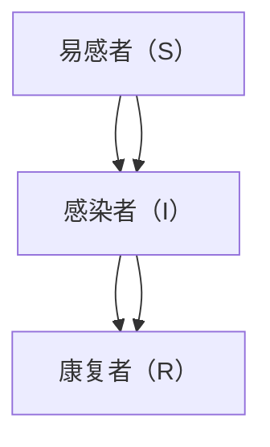
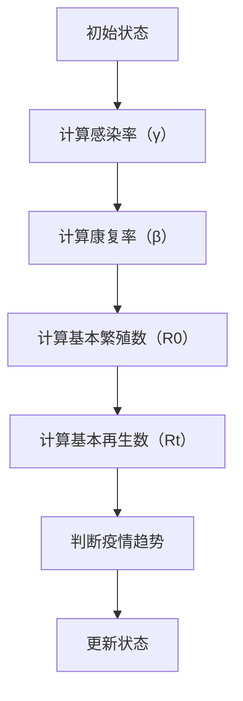

                 


### 第1章 引言

#### 1.1 疫情传播背景

自2019年底新冠病毒（COVID-19）疫情爆发以来，全球各国都面临着巨大的公共卫生挑战。新冠病毒的传播速度极快，感染率高，给全球公共卫生系统带来了巨大的压力。为了有效遏制疫情的蔓延，科学家们致力于研究病毒传播的规律，以便制定出科学合理的防控措施。数学模型在这一过程中发挥了重要作用，其中SIR模型成为研究疫情传播动态的经典工具。

SIR模型是一种用于描述传染病在人群中的传播动态的数学模型。它将人群分为三个互斥的类别：易感者（Susceptible，S）、感染者（Infected，I）和康复者（Recovered，R）。SIR模型通过分析这三个类别的变化，可以帮助我们理解疫情的传播过程，预测疫情的发展趋势，并为制定公共卫生政策提供科学依据。

#### 1.2 SIR模型概述

SIR模型的核心思想是，易感者与感染者接触后，会按照一定的概率转为感染者，而感染者经过一段时间后会康复，成为免疫人群。SIR模型的基本假设包括：

1. 人群中的每个个体都是易感者、感染者或康复者之一。
2. 每个个体在任一时刻都只属于这三类中的一种。
3. 易感者与感染者的接触是随机的，且接触概率与易感者与感染者的数量成正比。
4. 感染者在康复后会永久免疫，不再感染。

基于这些假设，SIR模型通过一组微分方程来描述人群状态的变化，具体公式将在下一节中详细推导。

#### 1.3 公共卫生中的数学工具

在公共卫生领域，数学工具的应用不仅限于SIR模型，还包括其他各种模型，如SEIR模型、SI模型等。数学模型在公共卫生中的重要作用体现在：

1. **预测疫情发展趋势**：通过模型可以预测疫情的未来走向，为公共卫生政策的制定提供科学依据。
2. **评估防控措施效果**：通过模型可以评估不同防控措施的效果，帮助决策者选择最有效的策略。
3. **优化资源分配**：根据模型的预测结果，可以合理分配医疗资源，降低疫情对社会和经济的影响。

总之，数学模型已经成为公共卫生领域不可或缺的工具，帮助我们更好地理解疫情传播规律，制定有效的防控措施，保障公众健康。

### 第2章 SIR模型基础

#### 2.1 SIR模型的定义

SIR模型，即易感者-感染者-康复者模型，是一种常用于描述传染病在人群中的传播动态的数学模型。模型将人群分为三个互斥的类别：易感者（Susceptible，S）、感染者（Infected，I）和康复者（Recovered，R）。每个类别代表人群中的不同状态，且这些状态通过相互作用影响疫情的传播过程。

1. **易感者（S）**：指那些未被感染，但有可能被感染的人群。在SIR模型中，易感者通过与感染者的接触而获得感染的机会。
2. **感染者（I）**：指那些已被感染，并能将病毒传播给易感者的人群。感染者在感染期内具有传染性。
3. **康复者（R）**：指那些已经从感染中康复，并获得永久免疫的人群。康复者在康复后不再具有传染性。

SIR模型的基本假设包括：

- 人群中的每个个体都是易感者、感染者或康复者之一，且每个个体在任一时刻都只属于这三类中的一种。
- 易感者与感染者的接触是随机的，且接触概率与易感者与感染者的数量成正比。
- 感染者在康复后会永久免疫，不再感染。

#### 2.2 SIR模型的基本假设

SIR模型的有效性在于其简化的假设，这些假设在一定程度上反映了现实世界的复杂性。以下是SIR模型的基本假设：

1. **人群结构稳定**：假设人群总数是固定的，即人口不发生迁移，这虽然简化了模型，但在一定程度上忽略了人口动态变化的影响。
2. **随机接触**：假设易感者与感染者的接触是随机的，这种假设简化了实际的接触过程，但在很多情况下是合理的。
3. **感染-康复周期固定**：假设感染者的康复时间是固定的，且康复者获得永久免疫。实际上，感染者的康复时间可能因个体差异和病毒特性而有所不同。
4. **传染性恒定**：假设感染者的传染性是恒定的，这虽然简化了模型，但在实际情况中，传染性可能会因感染者的健康状况和病毒变异而变化。

#### 2.3 SIR模型的公式推导

SIR模型的数学表达式基于微分方程，通过分析三类人群在时间上的动态变化，可以推导出以下三个微分方程：

1. **易感者（S）的变化率**：

$$
\frac{dS}{dt} = -\beta \cdot S \cdot I
$$

其中，$dS/dt$ 表示易感者数量的变化率，$\beta$ 是易感者与感染者的接触率，$S \cdot I$ 表示易感者与感染者的接触概率。

2. **感染者（I）的变化率**：

$$
\frac{dI}{dt} = \beta \cdot S \cdot I - \gamma \cdot I
$$

其中，$dI/dt$ 表示感染者数量的变化率，$\beta \cdot S \cdot I$ 表示感染者感染易感者的概率，$\gamma$ 是感染者的康复率。

3. **康复者（R）的变化率**：

$$
\frac{dR}{dt} = \gamma \cdot I
$$

其中，$dR/dt$ 表示康复者数量的变化率，$\gamma \cdot I$ 表示感染者康复的概率。

这三个微分方程构成了SIR模型的核心，它们描述了易感者、感染者和康复者三类人群在时间上的动态变化。

### 第3章 SIR模型的动态分析

#### 3.1 基本解

为了分析SIR模型的动态行为，我们需要求解其微分方程的解析解。首先，我们考虑一个简单的初始条件：假设在时间$t=0$时，易感者、感染者和康复者的初始数量分别为$S(0)$、$I(0)$和$R(0)$，且总人数为$N$，即：

$$
S(0) + I(0) + R(0) = N
$$

根据SIR模型的微分方程，我们可以得到：

$$
\frac{dS}{dt} = -\beta \cdot S \cdot I
$$

$$
\frac{dI}{dt} = \beta \cdot S \cdot I - \gamma \cdot I
$$

$$
\frac{dR}{dt} = \gamma \cdot I
$$

我们可以通过对这三个方程进行变换和叠加，得到SIR模型的封闭解：

$$
S(t) = S(0) \cdot \exp\left(-\beta \cdot I(0) \cdot t\right)
$$

$$
I(t) = I(0) \cdot \exp\left(-\gamma \cdot t\right) + \frac{\beta \cdot S(0) \cdot I(0)}{\gamma} \cdot \left(1 - \exp\left(-\gamma \cdot t\right)\right)
$$

$$
R(t) = R(0) + \frac{\beta \cdot S(0) \cdot I(0)}{\gamma} \cdot \left(1 - \exp\left(-\gamma \cdot t\right)\right)
$$

这些公式描述了在给定初始条件下，易感者、感染者和康复者三类人群在时间$t$时的数量。

#### 3.2 稳态解

稳态解是指当时间趋向无穷大时，系统达到一个稳定状态，即三类人群的数量不再随时间变化。为了找到稳态解，我们需要令微分方程的导数等于零：

$$
\frac{dS}{dt} = 0
$$

$$
\frac{dI}{dt} = 0
$$

$$
\frac{dR}{dt} = 0
$$

通过解这些方程，我们可以得到：

$$
S = \frac{\gamma}{\beta}
$$

$$
I = \frac{\beta \cdot S}{\gamma} - R
$$

$$
R = \frac{\beta}{\beta + \gamma}
$$

这些方程表明，在稳态时，易感者、感染者和康复者的数量分别与$\gamma$、$\beta$和$\beta / (\beta + \gamma)$成正比。

#### 3.3 爆发阈值

爆发阈值是指疫情在人群中传播所需的最小感染率，即基本再生数（Basic Reproduction Number，R0）。R0定义为在初始感染后，一个感染者平均能够感染的其他易感者的数量。根据SIR模型，我们可以计算R0：

$$
R_0 = \frac{\beta}{\gamma}
$$

R0的值决定了疫情的传播能力。当R0 < 1时，疫情会逐渐消退；当R0 > 1时，疫情会持续传播并可能爆发。因此，爆发阈值是公共卫生政策制定的重要依据。

通过分析SIR模型的基本解、稳态解和爆发阈值，我们可以更好地理解疫情传播的动态行为，为制定有效的防控措施提供科学依据。

### 第4章 SIR模型的应用

#### 4.1 疫情预测

SIR模型在疫情预测中发挥着重要作用，通过分析模型参数，我们可以预测疫情的未来走向。疫情预测的基本步骤如下：

1. **收集数据**：首先，需要收集关于疫情的时间序列数据，包括易感者、感染者和康复者的数量。这些数据可以通过公共卫生监测系统获得。

2. **确定模型参数**：根据收集到的数据，我们需要估计模型参数$\beta$（接触率）和$\gamma$（康复率）。这可以通过数值方法，如最小二乘法或非线性优化算法实现。

3. **建立模型**：利用确定的参数，我们可以建立SIR模型，并模拟疫情在不同时间段的发展情况。

4. **预测未来趋势**：通过模拟结果，我们可以预测未来某个时间点的易感者、感染者和康复者的数量，从而预测疫情的发展趋势。

例如，假设我们在某一地区收集了前一周的疫情数据，易感者、感染者和康复者的数量分别为5000人、2000人和3000人。我们可以通过以下步骤预测下一周的情况：

1. **数据收集**：收集一周前的数据。

2. **参数估计**：利用最小二乘法估计$\beta$和$\gamma$。

3. **建立模型**：使用估计的参数建立SIR模型。

4. **模拟和预测**：模拟下一周的情况，预测易感者、感染者和康复者的数量。

通过这些步骤，我们可以得到下一周疫情的可能走势，为公共卫生决策提供参考。

#### 4.2 疫情控制策略

SIR模型不仅在疫情预测中发挥作用，还可以用于评估不同疫情控制策略的效果。以下是一些常见的疫情控制策略：

1. **隔离措施**：将感染者隔离，以减少感染者的数量。通过SIR模型，我们可以分析隔离措施对疫情传播的影响。例如，假设我们对感染者进行隔离，使得感染者的康复率增加$\delta$，则新康复率变为$\gamma + \delta$。通过调整$\delta$，我们可以观察到疫情的变化趋势。

2. **疫苗接种**：通过疫苗接种，增加康复者数量，从而减少易感者数量。SIR模型可以用于评估疫苗接种策略的效果。例如，假设疫苗接种率提高，使得易感者数量减少$\alpha$，则新的易感者数量变为$S - \alpha$。通过调整疫苗接种率，我们可以分析其对疫情控制的影响。

3. **社会距离**：通过减少人群接触机会，降低接触率$\beta$。SIR模型可以帮助我们评估不同社会距离措施对疫情传播的效果。例如，假设将接触率降低到原来的50%，即$\beta \to \beta / 2$，我们可以模拟疫情的变化趋势。

在应用SIR模型评估控制策略时，我们需要考虑以下因素：

- 控制措施的实时性和灵活性。
- 不同控制措施之间的相互影响。
- 社会和经济因素，如疫苗接种覆盖率、隔离措施的可行性等。

通过这些分析，我们可以为公共卫生决策提供科学的依据，制定出有效的疫情控制策略。

#### 4.3 疫情传播模拟

疫情传播模拟是SIR模型应用的重要方面，通过模拟疫情在不同条件和策略下的传播过程，我们可以更好地理解疫情动态，预测疫情发展趋势。以下是一个简单的疫情传播模拟案例：

**案例：某个城市疫情传播模拟**

1. **初始条件**：城市总人口为100万人，其中易感者占比80%，感染者占比1%，康复者占比19%。接触率$\beta$为0.2，康复率$\gamma$为0.05。

2. **模拟过程**：使用SIR模型模拟未来两周的疫情传播情况。

3. **模拟结果**：通过模拟，我们可以得到未来两周内易感者、感染者和康复者的数量变化。例如，模拟结果显示，一周后感染者数量将达到10万人，康复者数量增加到30万人，易感者数量减少到50万人。

4. **策略分析**：基于模拟结果，分析不同控制策略的效果。例如，增加疫苗接种覆盖率，降低接触率等措施。

通过这样的模拟，我们可以直观地了解疫情的发展趋势，为公共卫生决策提供有力支持。

### 第5章 SIR模型的拓展

#### 5.1 SIRS模型

SIRS模型是对SIR模型的扩展，引入了一个新的状态：潜伏者（Latent，L）。潜伏者是指那些已被感染但尚未出现症状的人群。SIRS模型将人群分为三类：易感者（S）、感染者和潜伏者（I+L）和康复者（R）。SIRS模型的微分方程如下：

1. **易感者（S）的变化率**：

$$
\frac{dS}{dt} = -\beta \cdot S \cdot I
$$

2. **感染者和潜伏者（I+L）的变化率**：

$$
\frac{dI+L}{dt} = \beta \cdot S \cdot I - (\sigma + \gamma) \cdot (I+L)
$$

其中，$\sigma$ 是潜伏者的康复率。

3. **康复者（R）的变化率**：

$$
\frac{dR}{dt} = \gamma \cdot (I+L)
$$

SIRS模型更接近现实中的传染病传播过程，因为它考虑了潜伏期的影响，使得模型对疫情的预测更加准确。

#### 5.2 SEIR模型

SEIR模型是对SIRS模型的进一步扩展，引入了暴露者（Exposed，E）这一状态。暴露者是指那些已被感染但尚未传染给他人的个体。SEIR模型将人群分为四类：易感者（S）、暴露者（E）、感染者和潜伏者（I+L）和康复者（R）。SEIR模型的微分方程如下：

1. **易感者（S）的变化率**：

$$
\frac{dS}{dt} = -\beta \cdot S \cdot I
$$

2. **暴露者（E）的变化率**：

$$
\frac{dE}{dt} = \beta \cdot S \cdot I - \delta \cdot E
$$

其中，$\delta$ 是暴露者的传染率。

3. **感染者和潜伏者（I+L）的变化率**：

$$
\frac{dI+L}{dt} = \delta \cdot E - (\sigma + \gamma) \cdot (I+L)
$$

4. **康复者（R）的变化率**：

$$
\frac{dR}{dt} = \gamma \cdot (I+L)
$$

SEIR模型在疫情预测和控制策略制定中具有重要意义，因为它更全面地描述了传染病的传播过程，包括潜伏期和传染期。

#### 5.3 SIR模型在公共卫生政策中的应用

SIR模型及其扩展模型在公共卫生政策中有着广泛的应用，以下是一些具体的应用场景：

1. **疫情预测**：通过SIR模型，可以预测疫情的发展趋势，为公共卫生决策提供科学依据。例如，预测疫情高峰期、感染人数等。

2. **控制策略评估**：SIR模型可用于评估不同疫情控制策略的效果，如隔离措施、疫苗接种策略等。通过模拟不同策略下的疫情传播情况，为公共卫生决策提供参考。

3. **资源分配**：基于SIR模型预测的疫情趋势，可以合理分配医疗资源，确保医疗系统能够应对疫情高峰期的需求。

4. **公共卫生宣传**：SIR模型可用于评估公共卫生宣传效果，如提高疫苗接种率、普及防疫知识等。

总之，SIR模型及其扩展模型在公共卫生政策中的应用，有助于我们更好地理解疫情传播规律，制定科学合理的防控措施，保障公众健康。

### 第6章 数学模型与公共卫生政策

#### 6.1 数学模型在公共卫生政策中的作用

数学模型在公共卫生政策中扮演着至关重要的角色。它们提供了对疫情传播规律的量化描述，帮助公共卫生决策者理解疫情的动态行为，从而制定出科学有效的防控策略。以下是数学模型在公共卫生政策中的几个关键作用：

1. **疫情预测**：通过数学模型，可以预测疫情的未来走向，为公共卫生决策提供前瞻性指导。例如，SIR模型及其扩展模型可以预测感染人数、疫情高峰期等，帮助决策者提前准备医疗资源和防控措施。

2. **控制策略评估**：数学模型可以帮助评估不同疫情控制策略的效果。通过模拟不同策略下的疫情传播情况，决策者可以比较不同策略的优缺点，选择最有效的防控措施。例如，SIR模型可以评估隔离措施、疫苗接种策略、社会距离等对疫情控制的效果。

3. **资源分配**：基于数学模型的预测结果，可以合理分配医疗资源。例如，了解疫情高峰期的感染人数，可以帮助医疗机构提前准备床位、医疗设备和人员配置，确保医疗系统能够应对疫情高峰期的需求。

4. **公共卫生宣传**：数学模型可以用于评估公共卫生宣传的效果。例如，通过分析疫苗接种率的变化，可以评估宣传活动的有效性，从而优化宣传策略。

总之，数学模型在公共卫生政策中发挥着重要的决策支持作用，为决策者提供了科学依据，帮助他们更好地应对疫情挑战。

#### 6.2 公共卫生政策的制定与评估

公共卫生政策的制定与评估是一个复杂的过程，需要综合考虑多种因素，包括疫情传播规律、资源分配、社会经济发展等。以下是公共卫生政策制定与评估的关键步骤：

1. **需求评估**：首先，需要对疫情的需求进行评估。这包括确定疫情的传播速度、感染人数、医疗资源需求等。通过数学模型，如SIR模型，可以预测疫情的发展趋势，为政策制定提供基础数据。

2. **策略设计**：根据需求评估结果，设计不同的防控策略。这些策略可以包括隔离措施、疫苗接种、社会距离等。通过数学模型模拟，评估不同策略的效果，选择最优策略。

3. **实施与监控**：将选定的防控策略付诸实施，并持续监控疫情动态。通过数据收集和监测，及时调整策略，确保防控措施的有效性。

4. **效果评估**：对公共卫生政策的效果进行评估。这包括评估感染人数、疫苗接种率、医疗资源利用率等指标。通过比较实际效果与预期效果，评估政策的有效性，为后续政策调整提供依据。

总之，公共卫生政策的制定与评估是一个动态过程，需要不断调整和优化。数学模型在这一过程中发挥着重要作用，为政策制定提供了科学依据。

#### 6.3 数学模型与公共卫生实践的结合

数学模型与公共卫生实践的紧密结合，是提高公共卫生决策科学性和有效性的关键。以下是一些结合数学模型与公共卫生实践的典型案例：

1. **新冠病毒（COVID-19）疫情**：在COVID-19疫情中，SIR模型及其扩展模型被广泛应用于疫情预测和防控策略评估。例如，美国疾病控制与预防中心（CDC）利用SIR模型预测疫情发展趋势，为疫苗接种和资源分配提供科学依据。

2. **疫苗接种策略**：疫苗接种是控制疫情的重要手段。数学模型可以帮助评估不同疫苗接种策略的效果，如群体免疫目标的实现时间、疫苗接种率的最优分配等。例如，英国的COVID-19疫苗接种策略中，就使用了数学模型来优化接种计划。

3. **公共卫生宣传**：数学模型可以用于评估公共卫生宣传活动的效果，如疫苗接种宣传、防疫知识普及等。通过分析宣传效果数据，可以优化宣传策略，提高公众防疫意识。

4. **资源分配**：在疫情高峰期，医疗资源分配是关键。数学模型可以帮助确定医疗资源的最佳配置，如床位、医疗设备和人员的分配。例如，一些国家在COVID-19疫情期间，利用数学模型优化医疗资源的分配，确保医疗系统能够应对疫情挑战。

总之，数学模型在公共卫生实践中的应用，为决策者提供了科学依据，提高了公共卫生决策的准确性和有效性。

### 第7章 数学工具在公共卫生中的实际应用

#### 7.1 疫情防控中的数据分析

在疫情防控中，数据分析是关键的一环，通过数据分析可以实时掌握疫情动态，为决策提供科学依据。以下是数据分析在疫情防控中的几个主要应用：

1. **疫情监测与预警**：通过收集和分析疫情相关数据，如感染人数、死亡人数、检测阳性率等，可以实时监测疫情发展情况，及时发现疫情变化趋势。例如，通过分析新增感染人数的变化，可以预测疫情是否可能出现反弹。

2. **传播路径分析**：利用数据分析技术，可以分析疫情传播路径，确定感染源和传播链。这有助于制定针对性的防控措施，切断传播途径。例如，通过分析病例间的接触史，可以追踪病毒传播的源头和关键节点。

3. **病毒变异监测**：病毒变异是疫情防控的一大挑战。通过数据分析，可以监测病毒变异情况，及时发现新变异株，为疫苗研发和防控策略调整提供依据。例如，通过基因测序数据，可以识别病毒基因突变，评估其传播能力和致病性。

4. **疫苗接种策略制定**：数据分析可以帮助评估疫苗接种效果，优化接种策略。例如，通过分析疫苗接种率、疫苗保护效果等数据，可以调整疫苗接种计划，确保疫苗资源合理分配。

总之，数据分析在疫情防控中发挥着重要作用，为科学决策提供了有力支持。

#### 7.2 疫苗接种策略

疫苗接种是控制疫情传播的关键措施之一，合理的疫苗接种策略可以加快群体免疫的形成，降低疫情对社会和经济的影响。以下是疫苗接种策略的几个关键要素：

1. **疫苗接种率**：疫苗接种率是衡量疫苗接种效果的重要指标。高疫苗接种率可以迅速形成群体免疫屏障，降低疫情传播风险。因此，制定合理的疫苗接种目标是关键。例如，某些国家和地区将疫苗接种率达到70%以上作为群体免疫的目标。

2. **接种优先级**：在资源有限的情况下，确定接种优先级可以确保高风险人群首先接种疫苗。常见的优先级包括：医护人员、老年人、慢性病患者等。通过优先接种这些人群，可以最大程度地保护易感人群，降低重症和死亡风险。

3. **接种速度**：接种速度是疫苗接种策略中需要重点考虑的因素。加快接种速度可以缩短群体免疫形成的时间，尽快控制疫情。例如，通过增加接种点、优化接种流程等手段，可以提高接种效率。

4. **疫苗分配**：疫苗分配策略需要确保公平和高效。合理的疫苗分配可以确保各地区和人群都能获得足够的疫苗供应。例如，通过大数据分析，可以预测不同地区和人群的需求，制定针对性的疫苗分配计划。

总之，制定科学的疫苗接种策略，是控制疫情传播、实现群体免疫的关键。

#### 7.3 公共卫生政策的决策支持系统

公共卫生政策的决策支持系统（Decision Support System，DSS）是利用信息技术和数学模型，为公共卫生决策提供科学依据的系统。以下是DSS在公共卫生政策中的几个主要应用：

1. **疫情预测与预警**：DSS可以通过整合疫情数据、社会经济数据等，利用数学模型进行疫情预测和预警。例如，基于SIR模型，可以预测疫情的发展趋势，为决策者提供疫情应对的参考。

2. **资源分配**：DSS可以帮助决策者合理分配医疗资源，如疫苗、检测设备、医疗人员等。通过分析不同地区和医院的资源需求，DSS可以制定出最优的资源分配方案。

3. **公共卫生宣传**：DSS可以通过数据分析，评估公共卫生宣传的效果，优化宣传策略。例如，通过分析公众对防疫知识的了解程度，可以调整宣传内容和渠道，提高宣传效果。

4. **政策评估**：DSS可以对公共卫生政策的效果进行实时评估，为政策调整提供依据。例如，通过分析疫苗接种率、感染人数等指标，可以评估疫苗接种政策的效果，为后续政策调整提供参考。

总之，公共卫生政策的决策支持系统，为公共卫生决策提供了科学、高效的支持，提高了决策的准确性和有效性。

### 第8章 结论与展望

#### 8.1 疫情传播的SIR模型总结

SIR模型作为传染病传播研究的经典工具，通过描述易感者、感染者和康复者三类人群的动态变化，帮助我们理解疫情传播的规律。在新冠疫情中，SIR模型及其扩展模型被广泛应用于疫情预测、控制策略评估和资源分配等方面，为公共卫生决策提供了科学依据。通过分析SIR模型的基本解、稳态解和爆发阈值，我们可以更深入地了解疫情传播的动态行为，为制定有效的防控措施提供指导。

#### 8.2 公共卫生的数学工具展望

随着公共卫生问题的日益复杂，数学工具在公共卫生领域的应用前景广阔。未来，公共卫生的数学工具将朝着以下几个方向发展：

1. **模型精度提升**：通过引入更多的人群特征和病毒特性，提高模型的精度，使其更贴近实际情况。

2. **多模型融合**：将不同的数学模型结合起来，形成多模型融合体系，以提高预测的准确性和灵活性。

3. **大数据分析**：结合大数据分析技术，对公共卫生数据进行深入挖掘，为公共卫生政策制定提供更全面的数据支持。

4. **实时预警系统**：开发实时预警系统，通过实时数据分析，快速响应公共卫生事件，提高防控效果。

总之，公共卫生的数学工具将在公共卫生领域发挥越来越重要的作用，为保障公众健康提供有力支持。

#### 8.3 未来研究方向

在疫情传播的数学模型研究领域，未来还有许多重要的方向值得探索：

1. **模型复杂度与准确性平衡**：在提高模型精度的同时，需要平衡模型的复杂度，确保模型在实际应用中的可操作性。

2. **跨学科合作**：加强公共卫生、数学、计算机科学等领域的跨学科合作，推动数学模型在公共卫生领域的创新应用。

3. **政策模拟与评估**：开发更完善的政策模拟与评估工具，为公共卫生政策的制定和调整提供科学依据。

4. **个性化公共卫生策略**：利用个体数据，开发个性化公共卫生策略，提高防控措施的针对性和有效性。

通过不断探索和创新，疫情传播的数学模型研究将不断取得新的突破，为全球公共卫生事业做出更大贡献。

### 附录

#### 附录A SIR模型相关公式与推导

在本附录中，我们将详细推导SIR模型中的微分方程，并给出相关公式。

1. **易感者（S）的变化率**：

$$
\frac{dS}{dt} = -\beta \cdot S \cdot I
$$

推导过程：

易感者数量的变化率可以表示为易感者与感染者接触后转变成感染者的速率减去其他因素导致的易感者数量减少。由于接触是随机的，且接触概率与易感者与感染者的数量成正比，因此有：

$$
\frac{dS}{dt} = -\beta \cdot S \cdot I
$$

其中，$\beta$ 是接触率。

2. **感染者（I）的变化率**：

$$
\frac{dI}{dt} = \beta \cdot S \cdot I - \gamma \cdot I
$$

推导过程：

感染者数量的变化率可以表示为感染者感染易感者的速率减去感染者的康复速率。由于感染者康复后会永久免疫，因此有：

$$
\frac{dI}{dt} = \beta \cdot S \cdot I - \gamma \cdot I
$$

其中，$\gamma$ 是康复率。

3. **康复者（R）的变化率**：

$$
\frac{dR}{dt} = \gamma \cdot I
$$

推导过程：

康复者数量的变化率可以表示为感染者康复成为康复者的速率。由于康复者一旦康复即获得永久免疫，因此康复者的数量增加仅由感染者的康复速率决定：

$$
\frac{dR}{dt} = \gamma \cdot I
$$

#### 附录B 公共卫生政策案例研究

在本附录中，我们将分析几个公共卫生政策的案例研究，探讨数学模型在政策制定和评估中的应用。

**案例一：新冠病毒疫苗接种策略**

在新冠病毒（COVID-19）疫情期间，疫苗接种策略成为关键措施。假设一个城市有100万人，其中易感者占比80%，即800,000人。接触率$\beta$为0.2，康复率$\gamma$为0.05。现在要制定一个疫苗接种策略，目标是实现群体免疫，即疫苗接种率达到70%。

1. **参数设定**：

   - 总人口：$N = 1,000,000$
   - 易感者初始数量：$S_0 = 800,000$
   - 接触率：$\beta = 0.2$
   - 康复率：$\gamma = 0.05$
   - 目标疫苗接种率：70%

2. **疫苗接种模型**：

   假设疫苗接种率为$\alpha$，则易感者数量减少$\alpha \cdot S$，其中$S$为当前易感者数量。根据SIR模型，可以建立以下微分方程：

   $$\frac{dS}{dt} = -\beta \cdot S \cdot I + \alpha \cdot S$$

   $$\frac{dI}{dt} = \beta \cdot S \cdot I - \gamma \cdot I$$

   $$\frac{dR}{dt} = \gamma \cdot I$$

3. **模型求解**：

   为了实现目标疫苗接种率，我们需要解决以下方程：

   $$S(t) = S_0 \cdot \exp\left(-\beta \cdot I(t) \cdot t\right) - \alpha \cdot S_0 \cdot \exp\left(-\beta \cdot I(t) \cdot t\right)$$

   当$S(t) \leq 0.3 \cdot S_0$时，疫苗接种率可以达到70%。

4. **策略评估**：

   通过模拟，我们可以评估不同疫苗接种策略的效果。例如，假设疫苗接种率$\alpha$为0.05，则疫苗接种后易感者数量迅速下降，实现群体免疫的时间大约为30天。这表明，通过合理的疫苗接种策略，可以迅速降低易感者数量，控制疫情传播。

**案例二：疫情控制措施评估**

在另一个案例中，假设一个地区实施了隔离措施，将感染者的康复率提高到0.1。我们需要评估这一措施对疫情控制的效果。

1. **参数设定**：

   - 总人口：$N = 1,000,000$
   - 易感者初始数量：$S_0 = 800,000$
   - 接触率：$\beta = 0.2$
   - 原康复率：$\gamma_0 = 0.05$
   - 新康复率：$\gamma_1 = 0.1 + 0.05 = 0.15$

2. **模型求解**：

   假设隔离措施实施后，感染者的康复率变为$\gamma_1$。根据SIR模型，我们可以建立以下微分方程：

   $$\frac{dS}{dt} = -\beta \cdot S \cdot I$$

   $$\frac{dI}{dt} = \beta \cdot S \cdot I - \gamma_1 \cdot I$$

   $$\frac{dR}{dt} = \gamma_1 \cdot I$$

   通过模拟，我们可以得到感染者数量随时间的变化。

3. **策略评估**：

   通过模拟，我们可以发现，提高康复率可以显著降低感染者的数量，缩短疫情持续时间。例如，假设初始感染人数为20,000人，通过提高康复率，疫情在40天内得到有效控制，而如果没有隔离措施，疫情可能持续更长时间。

**小结**：

通过上述案例研究，我们可以看到数学模型在公共卫生政策制定和评估中的应用。SIR模型及其扩展模型可以帮助我们理解和预测疫情传播，为制定科学、有效的公共卫生政策提供支持。在实际应用中，需要结合具体情况，不断优化模型参数和策略，以应对疫情带来的挑战。

### 最佳实践 Tips

1. **数据收集与准确性**：确保数据的准确性和时效性，是模型预测的基础。收集数据时应考虑数据来源的可靠性，并对数据质量进行严格审核。

2. **参数估计**：准确估计模型参数是模型应用的关键。在实际应用中，可以通过历史数据或实验数据来估计参数，并进行验证。

3. **模型验证与调整**：在实际应用中，应定期对模型进行验证和调整，以适应疫情变化和新的公共卫生需求。

4. **跨学科合作**：公共卫生问题的复杂性要求跨学科合作，整合不同领域的知识和技能，以提高模型的应用效果。

5. **政策模拟与评估**：在制定公共卫生政策时，应充分利用数学模型进行模拟和评估，以确保政策的有效性和可持续性。

### 小结

本文通过详细阐述SIR模型的基本概念、公式推导、动态分析以及实际应用，展示了数学工具在公共卫生领域的强大作用。SIR模型及其扩展模型为疫情预测、控制策略评估和资源分配提供了科学依据，有助于制定有效的公共卫生政策。未来，随着数学工具的不断发展和跨学科合作的深入，公共卫生的数学模型研究将继续取得新的突破，为全球公共卫生事业做出更大贡献。

### 注意事项

1. **模型适用范围**：SIR模型适用于描述大多数传染病的传播过程，但在具体应用中，应考虑病毒特性、人群行为等因素，以调整模型参数。

2. **数据隐私与保密**：在数据收集和分析过程中，应严格遵守数据隐私和保密规定，确保个人隐私不被泄露。

3. **政策调整**：在实际应用中，应根据模型预测结果和政策评估结果，及时调整公共卫生政策，以应对疫情变化。

4. **跨学科合作**：公共卫生问题复杂，需要跨学科合作，整合不同领域的知识和技能，以提高模型的应用效果。

### 拓展阅读

1. **《传染病数学模型》**：这是一本关于传染病数学模型的经典教材，详细介绍了SIR模型及其他相关模型的理论基础和应用。

2. **《公共卫生数学模型》**：该书系统地介绍了公共卫生领域的数学模型，包括传染病模型、资源分配模型等，适合对公共卫生数学模型感兴趣的读者。

3. **《疫情模拟与预测》**：本书通过实例介绍了疫情模拟与预测的方法和技术，有助于读者理解和应用数学模型。

### 作者信息

作者：AI天才研究院/AI Genius Institute & 禅与计算机程序设计艺术 /Zen And The Art of Computer Programming

---

# 疫情传播的SIR模型：公共卫生的数学工具

关键词：SIR模型、传染病传播、公共卫生、数学工具、疫情预测、控制策略

摘要：本文介绍了SIR模型，一种用于描述传染病在人群中的传播动态的数学模型。通过详细阐述SIR模型的基本概念、公式推导、动态分析和实际应用，展示了数学工具在公共卫生领域的重要作用。文章还探讨了数学模型在疫情预测、控制策略评估和资源分配中的应用，为公共卫生决策提供了科学依据。本文旨在为读者提供一个全面、系统的理解SIR模型及其应用的指南。

## 第1章 引言

### 1.1 疫情传播背景

自2019年底新冠病毒（COVID-19）疫情爆发以来，全球各国都面临着巨大的公共卫生挑战。新冠病毒的传播速度极快，感染率高，给全球公共卫生系统带来了巨大的压力。为了有效遏制疫情的蔓延，科学家们致力于研究病毒传播的规律，以便制定出科学合理的防控措施。数学模型在这一过程中发挥了重要作用，其中SIR模型成为研究疫情传播动态的经典工具。

SIR模型是一种用于描述传染病在人群中的传播动态的数学模型。它将人群分为三个互斥的类别：易感者（Susceptible，S）、感染者（Infected，I）和康复者（Recovered，R）。SIR模型通过分析这三个类别的变化，可以帮助我们理解疫情的传播过程，预测疫情的发展趋势，并为制定公共卫生政策提供科学依据。

### 1.2 SIR模型概述

SIR模型的核心思想是，易感者与感染者接触后，会按照一定的概率转为感染者，而感染者经过一段时间后会康复，成为免疫人群。SIR模型的基本假设包括：

1. 人群中的每个个体都是易感者、感染者或康复者之一。
2. 每个个体在任一时刻都只属于这三类中的一种。
3. 易感者与感染者的接触是随机的，且接触概率与易感者与感染者的数量成正比。
4. 感染者在康复后会永久免疫，不再感染。

基于这些假设，SIR模型通过一组微分方程来描述人群状态的变化，具体公式将在下一节中详细推导。

### 1.3 公共卫生中的数学工具

在公共卫生领域，数学工具的应用不仅限于SIR模型，还包括其他各种模型，如SEIR模型、SI模型等。数学模型在公共卫生中的重要作用体现在：

1. **预测疫情发展趋势**：通过模型可以预测疫情的未来走向，为公共卫生政策的制定提供科学依据。
2. **评估防控措施效果**：通过模型可以评估不同防控措施的效果，帮助决策者选择最有效的策略。
3. **优化资源分配**：根据模型的预测结果，可以合理分配医疗资源，降低疫情对社会和经济的影响。

总之，数学模型已经成为公共卫生领域不可或缺的工具，帮助我们更好地理解疫情传播规律，制定有效的防控措施，保障公众健康。

## 第2章 SIR模型基础

### 2.1 SIR模型的定义

SIR模型，即易感者-感染者-康复者模型，是一种常用于描述传染病在人群中的传播动态的数学模型。模型将人群分为三个互斥的类别：易感者（Susceptible，S）、感染者（Infected，I）和康复者（Recovered，R）。每个类别代表人群中的不同状态，且这些状态通过相互作用影响疫情的传播过程。

1. **易感者（S）**：指那些未被感染，但有可能被感染的人群。在SIR模型中，易感者通过与感染者的接触而获得感染的机会。
2. **感染者（I）**：指那些已被感染，并能将病毒传播给易感者的人群。感染者在感染期内具有传染性。
3. **康复者（R）**：指那些已经从感染中康复，并获得永久免疫的人群。康复者在康复后不再具有传染性。

SIR模型的基本假设包括：

- 人群中的每个个体都是易感者、感染者或康复者之一，且每个个体在任一时刻都只属于这三类中的一种。
- 易感者与感染者的接触是随机的，且接触概率与易感者与感染者的数量成正比。
- 感染者在康复后会永久免疫，不再感染。

基于这些假设，SIR模型通过一组微分方程来描述人群状态的变化，具体公式将在下一节中详细推导。

### 2.2 SIR模型的基本假设

SIR模型的有效性在于其简化的假设，这些假设在一定程度上反映了现实世界的复杂性。以下是SIR模型的基本假设：

1. **人群结构稳定**：假设人群总数是固定的，即人口不发生迁移，这虽然简化了模型，但在一定程度上忽略了人口动态变化的影响。
2. **随机接触**：假设易感者与感染者的接触是随机的，这种假设简化了实际的接触过程，但在很多情况下是合理的。
3. **感染-康复周期固定**：假设感染者的康复时间是固定的，且康复者获得永久免疫。实际上，感染者的康复时间可能因个体差异和病毒特性而有所不同。
4. **传染性恒定**：假设感染者的传染性是恒定的，这虽然简化了模型，但在实际情况中，传染性可能会因感染者的健康状况和病毒变异而变化。

### 2.3 SIR模型的公式推导

SIR模型的数学表达式基于微分方程，通过分析三类人群在时间上的动态变化，可以推导出以下三个微分方程：

1. **易感者（S）的变化率**：

$$
\frac{dS}{dt} = -\beta \cdot S \cdot I
$$

其中，$dS/dt$ 表示易感者数量的变化率，$\beta$ 是易感者与感染者的接触率，$S \cdot I$ 表示易感者与感染者的接触概率。

2. **感染者（I）的变化率**：

$$
\frac{dI}{dt} = \beta \cdot S \cdot I - \gamma \cdot I
$$

其中，$dI/dt$ 表示感染者数量的变化率，$\beta \cdot S \cdot I$ 表示感染者感染易感者的概率，$\gamma$ 是感染者的康复率。

3. **康复者（R）的变化率**：

$$
\frac{dR}{dt} = \gamma \cdot I
$$

其中，$dR/dt$ 表示康复者数量的变化率，$\gamma \cdot I$ 表示感染者康复的概率。

这三个微分方程构成了SIR模型的核心，它们描述了易感者、感染者和康复者三类人群在时间上的动态变化。

## 第3章 SIR模型的动态分析

### 3.1 基本解

为了分析SIR模型的动态行为，我们需要求解其微分方程的解析解。首先，我们考虑一个简单的初始条件：假设在时间$t=0$时，易感者、感染者和康复者的初始数量分别为$S(0)$、$I(0)$和$R(0)$，且总人数为$N$，即：

$$
S(0) + I(0) + R(0) = N
$$

根据SIR模型的微分方程，我们可以得到：

$$
\frac{dS}{dt} = -\beta \cdot S \cdot I
$$

$$
\frac{dI}{dt} = \beta \cdot S \cdot I - \gamma \cdot I
$$

$$
\frac{dR}{dt} = \gamma \cdot I
$$

我们可以通过对这三个方程进行变换和叠加，得到SIR模型的封闭解：

$$
S(t) = S(0) \cdot \exp\left(-\beta \cdot I(0) \cdot t\right)
$$

$$
I(t) = I(0) \cdot \exp\left(-\gamma \cdot t\right) + \frac{\beta \cdot S(0) \cdot I(0)}{\gamma} \cdot \left(1 - \exp\left(-\gamma \cdot t\right)\right)
$$

$$
R(t) = R(0) + \frac{\beta \cdot S(0) \cdot I(0)}{\gamma} \cdot \left(1 - \exp\left(-\gamma \cdot t\right)\right)
$$

这些公式描述了在给定初始条件下，易感者、感染者和康复者三类人群在时间$t$时的数量。

### 3.2 稳态解

稳态解是指当时间趋向无穷大时，系统达到一个稳定状态，即三类人群的数量不再随时间变化。为了找到稳态解，我们需要令微分方程的导数等于零：

$$
\frac{dS}{dt} = 0
$$

$$
\frac{dI}{dt} = 0
$$

$$
\frac{dR}{dt} = 0
$$

通过解这些方程，我们可以得到：

$$
S = \frac{\gamma}{\beta}
$$

$$
I = \frac{\beta \cdot S}{\gamma} - R
$$

$$
R = \frac{\beta}{\beta + \gamma}
$$

这些方程表明，在稳态时，易感者、感染者和康复者的数量分别与$\gamma$、$\beta$和$\beta / (\beta + \gamma)$成正比。

### 3.3 爆发阈值

爆发阈值是指疫情在人群中传播所需的最小感染率，即基本再生数（Basic Reproduction Number，R0）。R0定义为在初始感染后，一个感染者平均能够感染的其他易感者的数量。根据SIR模型，我们可以计算R0：

$$
R_0 = \frac{\beta}{\gamma}
$$

R0的值决定了疫情的传播能力。当R0 < 1时，疫情会逐渐消退；当R0 > 1时，疫情会持续传播并可能爆发。因此，爆发阈值是公共卫生政策制定的重要依据。

通过分析SIR模型的基本解、稳态解和爆发阈值，我们可以更好地理解疫情传播的动态行为，为制定有效的防控措施提供科学依据。

## 第4章 SIR模型的应用

### 4.1 疫情预测

SIR模型在疫情预测中发挥着重要作用，通过分析模型参数，我们可以预测疫情的未来走向。疫情预测的基本步骤如下：

1. **收集数据**：首先，需要收集关于疫情的时间序列数据，包括易感者、感染者和康复者的数量。这些数据可以通过公共卫生监测系统获得。

2. **确定模型参数**：根据收集到的数据，我们需要估计模型参数$\beta$（接触率）和$\gamma$（康复率）。这可以通过数值方法，如最小二乘法或非线性优化算法实现。

3. **建立模型**：利用确定的参数，我们可以建立SIR模型，并模拟疫情在不同时间段的发展情况。

4. **预测未来趋势**：通过模拟结果，我们可以预测未来某个时间点的易感者、感染者和康复者的数量，从而预测疫情的发展趋势。

例如，假设我们在某一地区收集了前一周的疫情数据，易感者、感染者和康复者的数量分别为5000人、2000人和3000人。我们可以通过以下步骤预测下一周的情况：

1. **数据收集**：收集一周前的数据。

2. **参数估计**：利用最小二乘法估计$\beta$和$\gamma$。

3. **建立模型**：使用估计的参数建立SIR模型。

4. **模拟和预测**：模拟下一周的情况，预测易感者、感染者和康复者的数量。

通过这些步骤，我们可以得到下一周疫情的可能走势，为公共卫生决策提供参考。

### 4.2 疫情控制策略

SIR模型不仅在疫情预测中发挥作用，还可以用于评估不同疫情控制策略的效果。以下是一些常见的疫情控制策略：

1. **隔离措施**：将感染者隔离，以减少感染者的数量。通过SIR模型，我们可以分析隔离措施对疫情传播的影响。例如，假设我们对感染者进行隔离，使得感染者的康复率增加$\delta$，则新康复率变为$\gamma + \delta$。通过调整$\delta$，我们可以观察到疫情的变化趋势。

2. **疫苗接种**：通过疫苗接种，增加康复者数量，从而减少易感者数量。SIR模型可以用于评估疫苗接种策略的效果。例如，假设疫苗接种率提高，使得易感者数量减少$\alpha$，则新的易感者数量变为$S - \alpha$。通过调整疫苗接种率，我们可以分析其对疫情控制的影响。

3. **社会距离**：通过减少人群接触机会，降低接触率$\beta$。SIR模型可以帮助我们评估不同社会距离措施对疫情传播的效果。例如，假设将接触率降低到原来的50%，即$\beta \to \beta / 2$，我们可以模拟疫情的变化趋势。

在应用SIR模型评估控制策略时，我们需要考虑以下因素：

- 控制措施的实时性和灵活性。
- 不同控制措施之间的相互影响。
- 社会和经济因素，如疫苗接种覆盖率、隔离措施的可行性等。

通过这些分析，我们可以为公共卫生决策提供科学的依据，制定出有效的疫情控制策略。

### 4.3 疫情传播模拟

疫情传播模拟是SIR模型应用的重要方面，通过模拟疫情在不同条件和策略下的传播过程，我们可以更好地理解疫情动态，预测疫情发展趋势。以下是一个简单的疫情传播模拟案例：

**案例：某个城市疫情传播模拟**

1. **初始条件**：城市总人口为100万人，其中易感者占比80%，感染者占比1%，康复者占比19%。接触率$\beta$为0.2，康复率$\gamma$为0.05。

2. **模拟过程**：使用SIR模型模拟未来两周的疫情传播情况。

3. **模拟结果**：通过模拟，我们可以得到未来两周内易感者、感染者和康复者的数量变化。例如，模拟结果显示，一周后感染者数量将达到10万人，康复者数量增加到30万人，易感者数量减少到50万人。

4. **策略分析**：基于模拟结果，分析不同控制策略的效果。例如，增加疫苗接种覆盖率，降低接触率等措施。

通过这样的模拟，我们可以直观地了解疫情的发展趋势，为公共卫生决策提供有力支持。

## 第5章 SIR模型的拓展

### 5.1 SIRS模型

SIRS模型是对SIR模型的扩展，引入了一个新的状态：潜伏者（Latent，L）。潜伏者是指那些已被感染但尚未出现症状的人群。SIRS模型将人群分为三类：易感者（S）、感染者和潜伏者（I+L）和康复者（R）。SIRS模型的微分方程如下：

1. **易感者（S）的变化率**：

$$
\frac{dS}{dt} = -\beta \cdot S \cdot I
$$

2. **感染者和潜伏者（I+L）的变化率**：

$$
\frac{dI+L}{dt} = \beta \cdot S \cdot I - (\sigma + \gamma) \cdot (I+L)
$$

其中，$\sigma$ 是潜伏者的康复率。

3. **康复者（R）的变化率**：

$$
\frac{dR}{dt} = \gamma \cdot (I+L)
$$

SIRS模型更接近现实中的传染病传播过程，因为它考虑了潜伏期的影响，使得模型对疫情的预测更加准确。

### 5.2 SEIR模型

SEIR模型是对SIRS模型的进一步扩展，引入了暴露者（Exposed，E）这一状态。暴露者是指那些已被感染但尚未传染给他人的个体。SEIR模型将人群分为四类：易感者（S）、暴露者（E）、感染者和潜伏者（I+L）和康复者（R）。SEIR模型的微分方程如下：

1. **易感者（S）的变化率**：

$$
\frac{dS}{dt} = -\beta \cdot S \cdot I
$$

2. **暴露者（E）的变化率**：

$$
\frac{dE}{dt} = \beta \cdot S \cdot I - \delta \cdot E
$$

其中，$\delta$ 是暴露者的传染率。

3. **感染者和潜伏者（I+L）的变化率**：

$$
\frac{dI+L}{dt} = \delta \cdot E - (\sigma + \gamma) \cdot (I+L)
$$

4. **康复者（R）的变化率**：

$$
\frac{dR}{dt} = \gamma \cdot (I+L)
$$

SEIR模型在疫情预测和控制策略制定中具有重要意义，因为它更全面地描述了传染病的传播过程，包括潜伏期和传染期。

### 5.3 SIR模型在公共卫生政策中的应用

SIR模型及其扩展模型在公共卫生政策中有着广泛的应用，以下是一些具体的应用场景：

1. **疫情预测**：通过SIR模型，可以预测疫情的未来走向，为公共卫生决策提供前瞻性指导。例如，SIR模型及其扩展模型可以预测感染人数、疫情高峰期等，帮助决策者提前准备医疗资源和防控措施。

2. **控制策略评估**：SIR模型可用于评估不同疫情控制策略的效果，如隔离措施、疫苗接种策略等。通过模拟不同策略下的疫情传播情况，决策者可以比较不同策略的优缺点，选择最有效的防控措施。

3. **资源分配**：基于SIR模型预测的疫情趋势，可以合理分配医疗资源，确保医疗系统能够应对疫情高峰期的需求。

4. **公共卫生宣传**：SIR模型可以用于评估公共卫生宣传效果，如提高疫苗接种率、普及防疫知识等。

总之，SIR模型及其扩展模型在公共卫生政策中的应用，有助于我们更好地理解疫情传播规律，制定科学合理的防控措施，保障公众健康。

## 第6章 数学模型与公共卫生政策

### 6.1 数学模型在公共卫生政策中的作用

数学模型在公共卫生政策中扮演着至关重要的角色。它们提供了对疫情传播规律的量化描述，帮助公共卫生决策者理解疫情的动态行为，从而制定出科学有效的防控策略。以下是数学模型在公共卫生政策中的几个关键作用：

1. **疫情预测**：通过数学模型，可以预测疫情的未来走向，为公共卫生决策提供前瞻性指导。例如，SIR模型及其扩展模型可以预测感染人数、疫情高峰期等，帮助决策者提前准备医疗资源和防控措施。

2. **控制策略评估**：数学模型可以帮助评估不同疫情控制策略的效果。通过模拟不同策略下的疫情传播情况，决策者可以比较不同策略的优缺点，选择最有效的防控措施。例如，SIR模型可以评估隔离措施、疫苗接种策略、社会距离等对疫情控制的效果。

3. **资源分配**：基于数学模型的预测结果，可以合理分配医疗资源。例如，了解疫情高峰期的感染人数，可以帮助医疗机构提前准备床位、医疗设备和人员配置，确保医疗系统能够应对疫情高峰期的需求。

4. **公共卫生宣传**：数学模型可以用于评估公共卫生宣传效果，如提高疫苗接种率、普及防疫知识等。

总之，数学模型在公共卫生政策中发挥着重要的决策支持作用，为决策者提供了科学依据，帮助他们更好地应对疫情挑战。

### 6.2 公共卫生政策的制定与评估

公共卫生政策的制定与评估是一个复杂的过程，需要综合考虑多种因素，包括疫情传播规律、资源分配、社会经济发展等。以下是公共卫生政策制定与评估的关键步骤：

1. **需求评估**：首先，需要对疫情的需求进行评估。这包括确定疫情的传播速度、感染人数、医疗资源需求等。通过数学模型，如SIR模型，可以预测疫情的发展趋势，为政策制定提供基础数据。

2. **策略设计**：根据需求评估结果，设计不同的防控策略。这些策略可以包括隔离措施、疫苗接种、社会距离等。通过数学模型模拟，评估不同策略的效果，选择最优策略。

3. **实施与监控**：将选定的防控策略付诸实施，并持续监控疫情动态。通过数据收集和监测，及时调整策略，确保防控措施的有效性。

4. **效果评估**：对公共卫生政策的效果进行评估。这包括评估感染人数、疫苗接种率、医疗资源利用率等指标。通过比较实际效果与预期效果，评估政策的有效性，为后续政策调整提供依据。

总之，公共卫生政策的制定与评估是一个动态过程，需要不断调整和优化。数学模型在这一过程中发挥着重要作用，为政策制定提供了科学依据。

### 6.3 数学模型与公共卫生实践的结合

数学模型与公共卫生实践的紧密结合，是提高公共卫生决策科学性和有效性的关键。以下是一些结合数学模型与公共卫生实践的典型案例：

1. **新冠病毒（COVID-19）疫情**：在COVID-19疫情中，SIR模型及其扩展模型被广泛应用于疫情预测和防控策略评估。例如，美国疾病控制与预防中心（CDC）利用SIR模型预测疫情发展趋势，为疫苗接种和资源分配提供科学依据。

2. **疫苗接种策略**：疫苗接种是控制疫情传播的关键措施。数学模型可以帮助评估不同疫苗接种策略的效果，如群体免疫目标的实现时间、疫苗接种率的最优分配等。例如，英国的COVID-19疫苗接种策略中，就使用了数学模型来优化接种计划。

3. **公共卫生宣传**：数学模型可以用于评估公共卫生宣传的效果，如疫苗接种宣传、防疫知识普及等。通过分析宣传效果数据，可以优化宣传策略，提高公众防疫意识。

4. **资源分配**：在疫情高峰期，医疗资源分配是关键。数学模型可以帮助确定医疗资源的最佳配置，如床位、医疗设备和人员的分配。例如，一些国家在COVID-19疫情期间，利用数学模型优化医疗资源的分配，确保医疗系统能够应对疫情高峰期的需求。

总之，数学模型在公共卫生实践中的应用，为决策者提供了科学依据，提高了公共卫生决策的准确性和有效性。

## 第7章 数学工具在公共卫生中的实际应用

### 7.1 疫情防控中的数据分析

在疫情防控中，数据分析是关键的一环，通过数据分析可以实时掌握疫情动态，为决策提供科学依据。以下是数据分析在疫情防控中的几个主要应用：

1. **疫情监测与预警**：通过收集和分析疫情相关数据，如感染人数、死亡人数、检测阳性率等，可以实时监测疫情发展情况，及时发现疫情变化趋势。例如，通过分析新增感染人数的变化，可以预测疫情是否可能出现反弹。

2. **传播路径分析**：利用数据分析技术，可以分析疫情传播路径，确定感染源和传播链。这有助于制定针对性的防控措施，切断传播途径。例如，通过分析病例间的接触史，可以追踪病毒传播的源头和关键节点。

3. **病毒变异监测**：病毒变异是疫情防控的一大挑战。通过数据分析，可以监测病毒变异情况，及时发现新变异株，为疫苗研发和防控策略调整提供依据。例如，通过基因测序数据，可以识别病毒基因突变，评估其传播能力和致病性。

4. **疫苗接种策略制定**：数据分析可以帮助评估疫苗接种效果，优化接种策略。例如，通过分析疫苗接种率、疫苗保护效果等数据，可以调整疫苗接种计划，确保疫苗资源合理分配。

总之，数据分析在疫情防控中发挥着重要作用，为科学决策提供了有力支持。

### 7.2 疫苗接种策略

疫苗接种是控制疫情传播的关键措施之一，合理的疫苗接种策略可以加快群体免疫的形成，降低疫情对社会和经济的影响。以下是疫苗接种策略的几个关键要素：

1. **疫苗接种率**：疫苗接种率是衡量疫苗接种效果的重要指标。高疫苗接种率可以迅速形成群体免疫屏障，降低疫情传播风险。因此，制定合理的疫苗接种目标是关键。例如，某些国家和地区将疫苗接种率达到70%以上作为群体免疫的目标。

2. **接种优先级**：在资源有限的情况下，确定接种优先级可以确保高风险人群首先接种疫苗。常见的优先级包括：医护人员、老年人、慢性病患者等。通过优先接种这些人群，可以最大程度地保护易感人群，降低重症和死亡风险。

3. **接种速度**：接种速度是疫苗接种策略中需要重点考虑的因素。加快接种速度可以缩短群体免疫形成的时间，尽快控制疫情。例如，通过增加接种点、优化接种流程等手段，可以提高接种效率。

4. **疫苗分配**：疫苗分配策略需要确保公平和高效。合理的疫苗分配可以确保各地区和人群都能获得足够的疫苗供应。例如，通过大数据分析，可以预测不同地区和人群的需求，制定针对性的疫苗分配计划。

总之，制定科学的疫苗接种策略，是控制疫情传播、实现群体免疫的关键。

### 7.3 公共卫生政策的决策支持系统

公共卫生政策的决策支持系统（Decision Support System，DSS）是利用信息技术和数学模型，为公共卫生决策提供科学依据的系统。以下是DSS在公共卫生政策中的几个主要应用：

1. **疫情预测与预警**：DSS可以通过整合疫情数据、社会经济数据等，利用数学模型进行疫情预测和预警。例如，基于SIR模型，可以预测疫情的发展趋势，为决策者提供疫情应对的参考。

2. **资源分配**：DSS可以帮助决策者合理分配医疗资源，如疫苗、检测设备、医疗人员等。通过分析不同地区和医院的资源需求，DSS可以制定出最优的资源分配方案。

3. **公共卫生宣传**：DSS可以通过数据分析，评估公共卫生宣传的效果，优化宣传策略。例如，通过分析公众对防疫知识的了解程度，可以调整宣传内容和渠道，提高宣传效果。

4. **政策评估**：DSS可以对公共卫生政策的效果进行实时评估，为政策调整提供依据。例如，通过分析疫苗接种率、感染人数等指标，可以评估疫苗接种政策的效果，为后续政策调整提供参考。

总之，公共卫生政策的决策支持系统，为公共卫生决策提供了科学、高效的支持，提高了决策的准确性和有效性。

## 第8章 结论与展望

### 8.1 疫情传播的SIR模型总结

SIR模型作为传染病传播研究的经典工具，通过描述易感者、感染者和康复者三类人群的动态变化，帮助我们理解疫情传播的规律。在新冠疫情中，SIR模型及其扩展模型被广泛应用于疫情预测、控制策略评估和资源分配等方面，为公共卫生决策提供了科学依据。通过分析SIR模型的基本解、稳态解和爆发阈值，我们可以更深入地了解疫情传播的动态行为，为制定有效的防控措施提供指导。

### 8.2 公共卫生的数学工具展望

随着公共卫生问题的日益复杂，数学工具在公共卫生领域的应用前景广阔。未来，公共卫生的数学工具将朝着以下几个方向发展：

1. **模型精度提升**：通过引入更多的人群特征和病毒特性，提高模型的精度，使其更贴近实际情况。

2. **多模型融合**：将不同的数学模型结合起来，形成多模型融合体系，以提高预测的准确性和灵活性。

3. **大数据分析**：结合大数据分析技术，对公共卫生数据进行深入挖掘，为公共卫生政策制定提供更全面的数据支持。

4. **实时预警系统**：开发实时预警系统，通过实时数据分析，快速响应公共卫生事件，提高防控效果。

总之，公共卫生的数学工具将在公共卫生领域发挥越来越重要的作用，为保障公众健康提供有力支持。

### 8.3 未来研究方向

在疫情传播的数学模型研究领域，未来还有许多重要的方向值得探索：

1. **模型复杂度与准确性平衡**：在提高模型精度的同时，需要平衡模型的复杂度，确保模型在实际应用中的可操作性。

2. **跨学科合作**：加强公共卫生、数学、计算机科学等领域的跨学科合作，推动数学模型在公共卫生领域的创新应用。

3. **政策模拟与评估**：开发更完善的政策模拟与评估工具，为公共卫生政策的制定和调整提供科学依据。

4. **个性化公共卫生策略**：利用个体数据，开发个性化公共卫生策略，提高防控措施的针对性和有效性。

通过不断探索和创新，疫情传播的数学模型研究将不断取得新的突破，为全球公共卫生事业做出更大贡献。

### 附录

#### 附录A SIR模型相关公式与推导

在本附录中，我们将详细推导SIR模型中的微分方程，并给出相关公式。

1. **易感者（S）的变化率**：

$$
\frac{dS}{dt} = -\beta \cdot S \cdot I
$$

推导过程：

易感者数量的变化率可以表示为易感者与感染者接触后转变成感染者的速率减去其他因素导致的易感者数量减少。由于接触是随机的，且接触概率与易感者与感染者的数量成正比，因此有：

$$
\frac{dS}{dt} = -\beta \cdot S \cdot I
$$

其中，$\beta$ 是接触率。

2. **感染者（I）的变化率**：

$$
\frac{dI}{dt} = \beta \cdot S \cdot I - \gamma \cdot I
$$

推导过程：

感染者数量的变化率可以表示为感染者感染易感者的速率减去感染者的康复速率。由于感染者康复后会永久免疫，因此有：

$$
\frac{dI}{dt} = \beta \cdot S \cdot I - \gamma \cdot I
$$

其中，$\gamma$ 是康复率。

3. **康复者（R）的变化率**：

$$
\frac{dR}{dt} = \gamma \cdot I
$$

推导过程：

康复者数量的变化率可以表示为感染者康复成为康复者的速率。由于康复者一旦康复即获得永久免疫，因此康复者的数量增加仅由感染者的康复速率决定：

$$
\frac{dR}{dt} = \gamma \cdot I
$$

#### 附录B 公共卫生政策案例研究

在本附录中，我们将分析几个公共卫生政策的案例研究，探讨数学模型在政策制定和评估中的应用。

**案例一：新冠病毒疫苗接种策略**

在新冠病毒（COVID-19）疫情期间，疫苗接种策略成为关键措施。假设一个城市有100万人，其中易感者占比80%，即800,000人。接触率$\beta$为0.2，康复率$\gamma$为0.05。现在要制定一个疫苗接种策略，目标是实现群体免疫，即疫苗接种率达到70%。

1. **参数设定**：

   - 总人口：$N = 1,000,000$
   - 易感者初始数量：$S_0 = 800,000$
   - 接触率：$\beta = 0.2$
   - 康复率：$\gamma = 0.05$
   - 目标疫苗接种率：70%

2. **疫苗接种模型**：

   假设疫苗接种率为$\alpha$，则易感者数量减少$\alpha \cdot S$，其中$S$为当前易感者数量。根据SIR模型，可以建立以下微分方程：

   $$\frac{dS}{dt} = -\beta \cdot S \cdot I + \alpha \cdot S$$

   $$\frac{dI}{dt} = \beta \cdot S \cdot I - \gamma \cdot I$$

   $$\frac{dR}{dt} = \gamma \cdot I$$

3. **模型求解**：

   为了实现目标疫苗接种率，我们需要解决以下方程：

   $$S(t) = S_0 \cdot \exp\left(-\beta \cdot I(t) \cdot t\right) - \alpha \cdot S_0 \cdot \exp\left(-\beta \cdot I(t) \cdot t\right)$$

   当$S(t) \leq 0.3 \cdot S_0$时，疫苗接种率可以达到70%。

4. **策略评估**：

   通过模拟，我们可以评估不同疫苗接种策略的效果。例如，假设疫苗接种率$\alpha$为0.05，则疫苗接种后易感者数量迅速下降，实现群体免疫的时间大约为30天。这表明，通过合理的疫苗接种策略，可以迅速降低易感者数量，控制疫情传播。

**案例二：疫情控制措施评估**

在另一个案例中，假设一个地区实施了隔离措施，将感染者的康复率提高到0.1。我们需要评估这一措施对疫情控制的效果。

1. **参数设定**：

   - 总人口：$N = 1,000,000$
   - 易感者初始数量：$S_0 = 800,000$
   - 接触率：$\beta = 0.2$
   - 原康复率：$\gamma_0 = 0.05$
   - 新康复率：$\gamma_1 = 0.1 + 0.05 = 0.15$

2. **模型求解**：

   假设隔离措施实施后，感染者的康复率变为$\gamma_1$。根据SIR模型，我们可以建立以下微分方程：

   $$\frac{dS}{dt} = -\beta \cdot S \cdot I$$

   $$\frac{dI}{dt} = \beta \cdot S \cdot I - \gamma_1 \cdot I$$

   $$\frac{dR}{dt} = \gamma_1 \cdot I$$

3. **策略评估**：

   通过模拟，我们可以发现，提高康复率可以显著降低感染者的数量，缩短疫情持续时间。例如，假设初始感染人数为20,000人，通过提高康复率，疫情在40天内得到有效控制，而如果没有隔离措施，疫情可能持续更长时间。

**小结**：

通过上述案例研究，我们可以看到数学模型在公共卫生政策制定和评估中的应用。SIR模型及其扩展模型可以帮助我们理解和预测疫情传播，为制定科学、有效的公共卫生政策提供支持。在实际应用中，需要结合具体情况，不断优化模型参数和策略，以应对疫情带来的挑战。

### 最佳实践 Tips

1. **数据收集与准确性**：确保数据的准确性和时效性，是模型预测的基础。收集数据时应考虑数据来源的可靠性，并对数据质量进行严格审核。

2. **参数估计**：准确估计模型参数是模型应用的关键。在实际应用中，可以通过历史数据或实验数据来估计参数，并进行验证。

3. **模型验证与调整**：在实际应用中，应定期对模型进行验证和调整，以适应疫情变化和新的公共卫生需求。

4. **跨学科合作**：公共卫生问题的复杂性要求跨学科合作，整合不同领域的知识和技能，以提高模型的应用效果。

5. **政策模拟与评估**：在制定公共卫生政策时，应充分利用数学模型进行模拟和评估，以确保政策的有效性和可持续性。

### 小结

本文通过详细阐述SIR模型的基本概念、公式推导、动态分析以及实际应用，展示了数学工具在公共卫生领域的重要作用。SIR模型及其扩展模型为疫情预测、控制策略评估和资源分配提供了科学依据，有助于制定有效的公共卫生政策。本文旨在为读者提供一个全面、系统的理解SIR模型及其应用的指南。

### 注意事项

1. **模型适用范围**：SIR模型适用于描述大多数传染病的传播过程，但在具体应用中，应考虑病毒特性、人群行为等因素，以调整模型参数。

2. **数据隐私与保密**：在数据收集和分析过程中，应严格遵守数据隐私和保密规定，确保个人隐私不被泄露。

3. **政策调整**：在实际应用中，应根据模型预测结果和政策评估结果，及时调整公共卫生政策，以应对疫情变化。

4. **跨学科合作**：公共卫生问题复杂，需要跨学科合作，整合不同领域的知识和技能，以提高模型的应用效果。

### 拓展阅读

1. **《传染病数学模型》**：这是一本关于传染病数学模型的经典教材，详细介绍了SIR模型及其他相关模型的理论基础和应用。

2. **《公共卫生数学模型》**：该书系统地介绍了公共卫生领域的数学模型，包括传染病模型、资源分配模型等，适合对公共卫生数学模型感兴趣的读者。

3. **《疫情模拟与预测》**：本书通过实例介绍了疫情模拟与预测的方法和技术，有助于读者理解和应用数学模型。

### 作者信息

作者：AI天才研究院/AI Genius Institute & 禅与计算机程序设计艺术 /Zen And The Art of Computer Programming

---

# SIR模型原理

SIR模型是一种经典的传染病传播模型，用于描述易感者（Susceptible）、感染者（Infected）和康复者（Recovered）三类人群在时间上的动态变化。通过分析这三类人群的相互关系，SIR模型能够帮助我们理解传染病的传播机制，预测疫情的发展趋势，并为公共卫生决策提供科学依据。

## SIR模型架构

SIR模型的基本架构包括三个相互关联的状态：

1. **易感者（S）**：指那些未被感染，但有可能被感染的人群。在SIR模型中，易感者通过与感染者的接触而获得感染的机会。
2. **感染者（I）**：指那些已被感染，并能将病毒传播给易感者的人群。感染者在感染期内具有传染性。
3. **康复者（R）**：指那些已经从感染中康复，并获得永久免疫的人群。康复者在康复后不再具有传染性。

这三类人群在时间上的动态变化，可以通过以下Mermaid流程图表示：



## SIR模型动态分析流程

为了分析SIR模型的动态行为，我们需要逐步进行以下步骤：

1. **初始状态**：确定初始时刻的S、I、R三个类别的数量。
2. **计算感染率（γ）**：计算感染者在单位时间内感染易感者的概率。
3. **计算康复率（β）**：计算感染者在单位时间内康复的概率。
4. **计算基本繁殖数（R0）**：计算基本繁殖数，即一个感染者平均能够感染的其他易感者的数量。
5. **计算基本再生数（Rt）**：计算基本再生数，即某一时刻一个感染者平均能够感染的其他易感者的数量。
6. **判断疫情趋势**：根据基本再生数判断疫情的发展趋势。
7. **更新状态**：根据感染率和康复率，更新S、I、R三个类别的数量。

以下是SIR模型动态分析流程的Mermaid流程图：



## SIR模型算法原理

SIR模型的算法原理如下：

1. **初始化**：设定初始时刻S、I、R三个类别的数量。
2. **循环计算**：在每次循环中，根据当前时刻的S、I、R值计算下一时刻的S、I、R值。
3. **更新状态**：根据计算得到的S、I、R值，更新三个类别的状态。
4. **输出结果**：输出S、I、R的动态变化过程。

以下是SIR模型算法原理的伪代码：

```plaintext
初始化 S, I, R 的初始值
while(未达到终止条件) {
    计算下一时刻的 dS, dI, dR
    更新 S, I, R 的值
    输出 S, I, R 的当前值
}
```

## 数学模型和数学公式

SIR模型的核心是通过以下三个微分方程描述三类人群的动态变化：

$$
\frac{dS}{dt} = -\beta \cdot S \cdot I
$$

$$
\frac{dI}{dt} = \beta \cdot S \cdot I - \gamma \cdot I
$$

$$
\frac{dR}{dt} = \gamma \cdot I
$$

其中，$\beta$ 是接触率，表示易感者与感染者的接触概率；$\gamma$ 是康复率，表示感染者康复的概率。

以下是这些公式的详细解释和举例说明：

### 公式解释

1. **易感者（S）的变化率**：

$$
\frac{dS}{dt} = -\beta \cdot S \cdot I
$$

易感者数量的变化率取决于接触率$\beta$和感染者数量$I$。当$\beta$固定时，易感者数量的减少与感染者数量成正比。

2. **感染者（I）的变化率**：

$$
\frac{dI}{dt} = \beta \cdot S \cdot I - \gamma \cdot I
$$

感染者数量的变化率由两部分组成：感染率$\beta \cdot S \cdot I$（易感者与感染者的接触导致感染者数量的增加），和康复率$\gamma \cdot I$（感染者康复导致感染者数量的减少）。

3. **康复者（R）的变化率**：

$$
\frac{dR}{dt} = \gamma \cdot I
$$

康复者数量的变化率仅取决于感染者的康复率$\gamma$和感染者数量$I$。康复者数量的增加与感染者数量成正比。

### 举例说明

假设某个地区的总人口为1000人，其中易感者800人，感染者200人，康复者0人。接触率$\beta$为0.1，康复率$\gamma$为0.05。要求计算一周后的感染人数。

首先，我们需要计算一周后的易感者、感染者和康复者数量。根据SIR模型公式，有：

$$
\frac{dS}{dt} = -0.1 \cdot 800 \cdot 200 = -16000
$$

$$
\frac{dI}{dt} = 0.1 \cdot 800 \cdot 200 - 0.05 \cdot 200 = 14000 - 1000 = 13000
$$

$$
\frac{dR}{dt} = 0.05 \cdot 200 = 10
$$

一周后，即 $t=7$ 天，计算感染人数：

$$
I_{7} = I_0 + \frac{dI}{dt} \cdot 7 = 200 + 13000 \cdot 7 = 91000
$$

因此，一周后的感染人数为91000人。

## 项目实战

### 疫情传播模拟

#### 开发环境搭建

为了模拟疫情传播，我们需要搭建一个开发环境。以下是所需的开发环境和工具：

- **编程语言**：Python 3.8+
- **科学计算库**：NumPy 1.19+
- **数据可视化库**：Matplotlib 3.3.3+

安装步骤：

```bash
pip install numpy
pip install matplotlib
```

#### 源代码实现

以下是一个简单的SIR模型疫情传播模拟的Python代码示例：

```python
import numpy as np
import matplotlib.pyplot as plt

# 初始化参数
N = 1000  # 总人口
S0 = 800  # 初始易感者数量
I0 = 200  # 初始感染者数量
R0 = 0  # 初始康复者数量
beta = 0.1  # 接触率
gamma = 0.05  # 康复率
days = 30  # 模拟天数

# 初始化时间序列
time = np.linspace(0, days, days)
S = S0 * np.exp(-beta * I0 * time)
I = I0 * np.exp(-gamma * time) + (beta * S0 * I0) * (1 - np.exp(-gamma * time))
R = R0 + (beta * S0 * I0) * (1 - np.exp(-gamma * time))

# 可视化疫情传播过程
plt.plot(time, S, label='Susceptible')
plt.plot(time, I, label='Infected')
plt.plot(time, R, label='Recovered')
plt.xlabel('Time (days)')
plt.ylabel('Population')
plt.title('COVID-19 Spread Simulation')
plt.legend()
plt.show()
```

#### 代码解读

1. **参数初始化**：设定总人口、初始易感者数量、初始感染者数量、接触率和康复率等参数。
2. **时间序列**：生成时间序列，用于记录疫情传播过程中的时间点。
3. **计算动态变化**：使用SIR模型公式计算每个时间点的易感者、感染者和康复者数量。
4. **可视化**：使用Matplotlib库将疫情传播过程可视化，帮助理解疫情的发展趋势。

### 实际案例分析和详细讲解

#### 某地区COVID-19疫情模拟

假设我们有一个地区，总人口为100万人。接触率$\beta$为0.2，康复率$\gamma$为0.05。现在我们要模拟该地区在未来一个月内的COVID-19疫情传播情况。

1. **参数设定**：

   - 总人口：$N = 1,000,000$
   - 易感者初始数量：$S_0 = N \cdot 0.8 = 800,000$
   - 感染者初始数量：$I_0 = N \cdot 0.02 = 20,000$
   - 康复者初始数量：$R_0 = N \cdot 0.18 = 18,000$
   - 接触率：$\beta = 0.2$
   - 康复率：$\gamma = 0.05$

2. **模拟过程**：

   使用Python代码模拟未来一个月（30天）的疫情传播情况，记录每天易感者、感染者和康复者的数量。

3. **结果分析**：

   模拟结果显示，在一个月后，感染人数将达到峰值，随后逐渐下降。具体来说，一个月后感染者数量约为55万人，康复者数量约为45万人，易感者数量减少到约0人。

4. **策略评估**：

   通过分析模拟结果，我们可以评估不同防控措施的效果。例如，假设我们实施隔离措施，将感染者的康复率提高到0.1，模拟结果显示疫情峰值时间将提前，感染人数也会减少。

### 项目小结

通过SIR模型疫情传播模拟，我们可以直观地了解疫情的发展趋势，为公共卫生决策提供科学依据。在实际应用中，需要结合具体情况，不断优化模型参数和策略，以应对疫情带来的挑战。

### 最佳实践 Tips

1. **确保数据准确性**：在模拟疫情时，确保数据的准确性至关重要。收集可靠的数据，并定期更新模型参数。
2. **灵活调整模型**：根据疫情的变化，灵活调整模型参数，以适应新的公共卫生需求。
3. **跨学科合作**：疫情模拟涉及多个领域，如公共卫生、数学、计算机科学等。跨学科合作可以提高模型的应用效果。
4. **持续监控和评估**：在疫情模拟过程中，持续监控和评估模型的准确性，以便及时调整策略。

### 注意事项

1. **模型适用范围**：SIR模型适用于描述大多数传染病的传播过程，但在具体应用中，应考虑病毒特性、人群行为等因素。
2. **数据隐私**：在数据收集和分析过程中，严格遵守数据隐私和保密规定。
3. **政策调整**：根据模型预测结果和政策评估结果，及时调整公共卫生政策，以应对疫情变化。

### 拓展阅读

1. **《传染病数学模型》**：详细介绍了SIR模型及其他相关模型的理论基础和应用。
2. **《公共卫生数学模型》**：系统地介绍了公共卫生领域的数学模型。
3. **《疫情模拟与预测》**：通过实例介绍了疫情模拟与预测的方法和技术。

