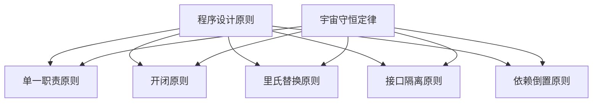

                 

### 《程序设计原则与宇宙守恒定律的对比》文章标题与关键词

#### 文章标题：程序设计原则与宇宙守恒定律的对比

#### 关键词：
1. 程序设计原则
2. 宇宙守恒定律
3. 对比研究
4. 计算机科学
5. 物理学
6. 数学模型
7. 算法原理

#### 摘要：

本文将深入探讨程序设计原则与宇宙守恒定律之间的奇妙联系，通过对比分析这两者在定义、结构、应用等方面的异同，揭示其背后的逻辑与规律。我们将首先介绍程序设计原则和宇宙守恒定律的基本概念，然后通过具体实例和伪代码详细阐述它们在实际问题中的应用，最后总结全文并提出未来研究的方向。希望通过本文，读者能更深刻地理解程序设计的本质和宇宙守恒定律的深远意义。

### 引言

#### 1.1 程序设计原则概述

程序设计原则是软件工程中的基石，旨在指导开发者编写清晰、高效、可维护的代码。这些原则通常源自实践经验，并在不断演化的过程中逐步形成。程序设计原则的重要性在于，它们不仅提高了代码的可读性和可维护性，还能减少错误的发生，提高开发效率。常见的程序设计原则包括单一职责原则、开闭原则、里氏替换原则等。

单一职责原则（Single Responsibility Principle，SRP）要求一个类或模块应只负责一项功能，从而实现职责分离，降低模块间的耦合度。开闭原则（Open Closed Principle，OCP）强调软件实体（类、模块、函数等）应该对扩展开放，对修改关闭，即在不修改原有代码的基础上，通过扩展实现新的功能。里氏替换原则（Liskov Substitution Principle，LSP）要求子类能够替换父类出现在任何使用父类的地方，而不改变程序的语义。

#### 1.2 宇宙守恒定律概述

宇宙守恒定律是物理学的基本原则，描述了自然界中各种物理量的守恒性。这些定律不仅在实验中得到了验证，而且构成了现代物理学理论体系的基础。常见的宇宙守恒定律包括能量守恒定律、动量守恒定律、角动量守恒定律和质量守恒定律等。

能量守恒定律（Conservation of Energy）指出，在一个封闭系统内，能量既不会凭空产生，也不会凭空消失，只能从一种形式转化为另一种形式。动量守恒定律（Conservation of Momentum）说明，在没有外力作用下，一个系统的总动量保持不变。角动量守恒定律（Conservation of Angular Momentum）描述了在旋转系统中角动量的守恒。质量守恒定律（Conservation of Mass）指出，在化学反应和物理过程中，总质量保持不变。

#### 1.3 程序设计与宇宙守恒定律的对比研究意义

程序设计原则与宇宙守恒定律虽然在领域和表述形式上有所不同，但它们在本质和逻辑上存在一定的相似性。通过对比分析这两者，我们可以从不同的角度理解复杂系统的设计和管理。

首先，程序设计原则中的单一职责原则与宇宙守恒定律中的能量守恒定律有相似之处。能量守恒定律强调能量在系统内的转化和传递，而单一职责原则则要求模块在功能上的独立和分离。这种对比有助于我们理解在软件设计中如何实现模块的解耦和高效利用。

其次，开闭原则与动量守恒定律的对比也有助于我们深入理解系统在扩展和变化过程中的稳定性。动量守恒定律指出，系统在没有外力作用下保持动量不变，而开闭原则要求系统在扩展时保持原有功能的稳定。通过这种对比，我们可以探讨如何在软件设计中实现功能的扩展而不会破坏现有系统的稳定。

最后，程序设计原则与宇宙守恒定律的对比还有助于我们理解系统中的动态平衡和稳定性。宇宙守恒定律中的质量守恒定律、角动量守恒定律等强调了系统在动态变化中的守恒性，而程序设计原则则通过模块化、抽象化等手段实现系统的稳定和高效运行。

通过本文的研究，我们希望能够揭示程序设计原则与宇宙守恒定律之间的深刻联系，为软件开发提供新的视角和方法，同时也为物理学理论的计算机应用提供参考。

### 程序设计原则背景知识

#### 2.1 程序设计原则的定义与历史

程序设计原则是一套指导开发者编写高质量代码的基本准则，它们总结了软件开发过程中积累的经验和教训。这些原则不仅适用于单个项目的开发，而且在大型软件系统的设计和维护中具有重要意义。

程序设计原则的历史可以追溯到20世纪60年代。当时，随着计算机技术的发展和软件项目的规模不断扩大，传统的编程方法逐渐显示出其局限性。为了提高软件的质量和可维护性，学者们开始研究和总结有效的编程方法和原则。著名软件工程师和计算机科学家如Edsger W. Dijkstra、Bertrand Meyer和Robert C. Martin等人对程序设计原则的发展做出了重要贡献。

程序设计原则的定义相对简单，但内涵丰富。简单来说，程序设计原则是指开发者应遵循的一些指导原则，以编写出更易于理解、更易于维护、更高效且更稳定的代码。具体来说，这些原则包括但不限于单一职责原则、开闭原则、里氏替换原则等。它们旨在通过规范编程行为，减少代码中的冗余和错误，提高软件的可靠性和可扩展性。

#### 2.2 程序设计原则的重要性与应用

程序设计原则的重要性在于它们能够帮助开发者更好地管理和维护代码，从而提高软件项目的开发效率和软件质量。以下是程序设计原则的几个关键重要性及其在实际应用中的体现：

1. **提高代码的可读性和可维护性**：程序设计原则强调模块化、抽象化和简洁性，这使得代码结构更加清晰，易于理解。对于新加入的开发者或维护人员来说，能够更快地上手和理解代码，从而提高开发效率。

2. **减少错误和冗余**：遵循程序设计原则可以减少代码中的冗余和错误。例如，单一职责原则要求每个模块只完成一项功能，这样可以避免功能重叠和相互依赖，从而减少潜在的错误。

3. **提高开发效率**：通过遵循程序设计原则，开发者可以更快地编写出高质量的代码，减少调试和修复错误的时间。例如，开闭原则鼓励开发者编写可扩展的代码，这样在功能需求发生变化时，可以更轻松地进行修改和扩展。

4. **增强软件的可移植性和可复用性**：遵循程序设计原则的代码具有更高的抽象性和模块化程度，这使得代码更容易在不同平台和项目中复用。例如，依赖倒置原则（Dependency Inversion Principle）鼓励使用接口和抽象类，这样可以降低模块之间的耦合度，提高代码的可移植性。

在实际应用中，程序设计原则广泛应用于各种规模的软件项目中。以下是一些常见应用场景：

1. **企业级应用开发**：在大型企业级应用中，程序设计原则是确保代码质量和系统稳定性的关键。例如，银行、保险和电商等行业的系统需要处理大量的数据和高并发的请求，遵循程序设计原则可以确保系统的可靠性和性能。

2. **移动应用开发**：在移动应用开发中，程序设计原则同样重要。移动设备资源有限，开发者需要编写高效且可维护的代码，以满足用户体验和设备性能的要求。

3. **开源项目**：在开源项目中，程序设计原则是吸引和维护贡献者的关键因素。遵循程序设计原则的代码库通常更容易吸引高质量的贡献者，从而促进项目的持续发展。

4. **教育领域**：在计算机科学教育和培训中，程序设计原则是培养学生编程能力和软件工程意识的重要工具。通过学习和实践程序设计原则，学生能够更好地理解软件开发过程和最佳实践。

总之，程序设计原则在提高软件质量、降低开发成本、增强系统可维护性和可扩展性等方面发挥着重要作用。无论是在企业级应用、移动应用开发、开源项目还是教育领域，程序设计原则都是不可或缺的基石。

#### 2.3 常见的程序设计原则

在程序设计中，有许多广泛应用的经典原则，这些原则不仅帮助开发者编写出更加清晰、高效和可维护的代码，还提升了软件系统的整体质量和稳定性。以下是几种常见的程序设计原则及其详细解释：

##### 2.3.1 单一职责原则

单一职责原则（Single Responsibility Principle，SRP）指出，一个类或模块应该只负责一项功能。这个原则的核心思想是降低模块间的耦合度，提高模块的独立性和可维护性。

**示例：** 假设我们有一个订单管理系统，其中订单的创建、更新和删除都是相互独立的功能。按照单一职责原则，我们可以将这些功能分别实现为不同的类或模块，例如：

- `OrderCreator` 类负责订单的创建。
- `OrderUpdator` 类负责订单的更新。
- `OrderDeleter` 类负责订单的删除。

通过这种方式，每个模块都只专注于一项功能，使得代码更加清晰，且易于维护和扩展。

##### 2.3.2 开放封闭原则

开放封闭原则（Open Closed Principle，OCP）强调软件实体（如类、模块、函数等）应该对扩展开放，对修改关闭。这意味着在增加新功能时，应尽量不修改原有代码，而是通过扩展来实现。

**示例：** 假设我们有一个交通工具类，包括汽车、飞机和火车。如果我们需要添加一种新的交通工具，如地铁，按照开放封闭原则，我们应通过扩展而不是修改原有代码来实现：

```python
class Vehicle:
    def move(self):
        pass

class Car(Vehicle):
    def move(self):
        print("汽车在行驶")

class Airplane(Vehicle):
    def move(self):
        print("飞机在飞行")

class Train(Vehicle):
    def move(self):
        print("火车在行驶")

class Subway(Vehicle):
    def move(self):
        print("地铁在行驶")
```

通过这种方式，我们可以轻松地添加新交通工具，而无需修改现有代码，从而提高了系统的可维护性和扩展性。

##### 2.3.3 里氏替换原则

里氏替换原则（Liskov Substitution Principle，LSP）要求子类能够替换其父类出现在任何使用父类的地方，而不改变程序的语义。这意味着子类应该扩展父类的功能，而不是改变其原有行为。

**示例：** 假设我们有一个形状类，其中圆形和正方形都是形状的子类。按照里氏替换原则，圆形和正方形应能够替代形状类使用：

```python
class Shape:
    def area(self):
        pass

class Circle(Shape):
    def area(self):
        return self.radius * self.radius * 3.14

class Rectangle(Shape):
    def area(self):
        return self.width * self.height
```

通过这种方式，我们可以确保在程序中使用形状类的任何地方，都可以用圆形或正方形类替代，而不会改变程序的输出。

##### 2.3.4 接口隔离原则

接口隔离原则（Interface Segregation Principle，ISP）指出，客户端不应该依赖于它不需要的接口。这意味着我们应该设计细粒度的接口，使得每个接口都只定义一组相关的功能。

**示例：** 假设我们有一个支付系统，其中包括多种支付方式，如信用卡支付、微信支付和支付宝支付。按照接口隔离原则，我们可以为每种支付方式定义独立的接口：

```python
class Payment:
    def pay(self):
        pass

class CreditCardPayment(Payment):
    def pay(self):
        print("使用信用卡支付")

class WechatPayment(Payment):
    def pay(self):
        print("使用微信支付")

class AlipayPayment(Payment):
    def pay(self):
        print("使用支付宝支付")
```

通过这种方式，客户端只需依赖于它实际使用的支付接口，从而提高了系统的灵活性和可维护性。

##### 2.3.5 依赖倒置原则

依赖倒置原则（Dependency Inversion Principle，DIP）指出，高层模块不应依赖于低层模块，二者都应依赖于抽象。换言之，抽象不应依赖于细节，细节应依赖于抽象。

**示例：** 假设我们有一个库存管理系统，其中库存管理模块需要依赖于商品信息模块。按照依赖倒置原则，我们可以使用抽象接口来定义这两者之间的依赖关系：

```python
class InventoryManager:
    def manage_inventory(self, product_info):
        # 库存管理逻辑
        pass

class ProductInfo:
    def get_product_details(self):
        # 商品信息获取逻辑
        pass
```

通过这种方式，库存管理模块可以直接依赖于抽象的`ProductInfo`接口，而无需直接依赖于具体的商品信息实现，从而提高了系统的灵活性和可扩展性。

总之，这些常见的程序设计原则不仅有助于我们编写出高质量的代码，还在提升软件系统的可维护性和可扩展性方面发挥着重要作用。通过在实践中应用这些原则，开发者能够创造出更加稳定和高效的软件系统。

### 宇宙守恒定律背景知识

#### 3.1 宇宙守恒定律的定义与类型

宇宙守恒定律是物理学中的基本原理，描述了自然界中各种物理量的守恒性。这些定律不仅在实验中得到了验证，而且构成了现代物理学理论体系的基础。宇宙守恒定律可以按照其守恒的物理量进行分类，主要包括能量守恒定律、动量守恒定律、角动量守恒定律和质量守恒定律等。

**能量守恒定律**：能量守恒定律指出，在一个封闭系统内，能量既不会凭空产生，也不会凭空消失，只能从一种形式转化为另一种形式。这个定律是自然界最基本和最普遍的守恒定律之一。无论是化学反应、物理变化还是宇宙大爆炸，能量守恒定律都得到了严格的验证。

**动量守恒定律**：动量守恒定律描述了在没有外力作用下，一个系统的总动量保持不变。这个定律不仅适用于宏观物体，也适用于微观粒子。例如，在碰撞过程中，尽管物体的形状和速度可能发生变化，但系统的总动量保持不变。

**角动量守恒定律**：角动量守恒定律指出，在没有外力矩作用下，一个系统的总角动量保持不变。这个定律在旋转运动和量子力学中具有重要应用。例如，行星围绕恒星的运动和电子在原子中的运动都遵循角动量守恒定律。

**质量守恒定律**：质量守恒定律指出，在化学反应和物理过程中，总质量保持不变。这个定律在经典物理学中得到了广泛的验证。然而，在相对论物理学中，质量与能量可以相互转化，因此质量守恒定律在更广泛的范围内需要重新解释。

#### 3.2 宇宙守恒定律的发现与证明

宇宙守恒定律的发现是一个长期的科学探索过程，许多物理学家为此做出了重要贡献。

**能量守恒定律**：能量守恒定律最早由瑞士数学家和物理学家莱昂哈德·欧拉提出。然而，这个定律的系统表述和证明是由德国物理学家赫尔曼·冯·亥维赛和英国物理学家威廉·汤姆森等人完成的。亥维赛通过实验证明了机械能和热能之间的转化关系，而汤姆森则通过热力学第二定律证明了能量守恒定律的普遍性。

**动量守恒定律**：动量守恒定律最早由英国物理学家艾萨克·牛顿在其《自然哲学的数学原理》一书中提出。牛顿通过分析物体在碰撞过程中的运动，证明了在没有外力作用下，系统的总动量保持不变。此后，许多物理学家通过实验和数学推导进一步验证和扩展了动量守恒定律。

**角动量守恒定律**：角动量守恒定律的发现可以追溯到17世纪。当时，意大利物理学家伽利略·伽利莱和荷兰物理学家克里斯蒂安·惠更斯等人在研究旋转物体的运动时，发现了角动量守恒的基本原理。19世纪，英国物理学家乔治·西蒙·欧姆和瑞士数学家和物理学家约翰·贝塞尔等人通过实验和数学方法进一步验证和证明了角动量守恒定律。

**质量守恒定律**：质量守恒定律最早由瑞士化学家和物理学家约瑟夫·普里斯特里和英国化学家约书亚·查尔科特等人提出。他们在进行化学反应实验时，发现反应前后总质量保持不变。此后，许多化学家和物理学家通过实验和理论分析，进一步验证和扩展了质量守恒定律。

#### 3.3 宇宙守恒定律在物理学中的应用

宇宙守恒定律在物理学中有着广泛的应用，不仅为我们理解自然界的运行规律提供了重要依据，也为许多物理理论和实验研究奠定了基础。

**宇宙学中的应用**：在宇宙学中，能量守恒定律和动量守恒定律是研究宇宙膨胀和结构形成的关键。例如，哈勃定律揭示了宇宙的膨胀现象，而能量守恒定律和动量守恒定律则帮助我们理解这一现象背后的物理机制。

**粒子物理学中的应用**：在粒子物理学中，角动量守恒定律和质量守恒定律是描述粒子相互作用和反应的重要原理。例如，在质子和中子形成过程中，角动量守恒定律和电荷守恒定律共同作用，确保了反应的稳定和可重复性。

**凝聚态物理学中的应用**：在凝聚态物理学中，质量守恒定律和能量守恒定律是研究晶体结构、电子态和材料性能的基础。例如，在研究半导体材料的电子输运特性时，这些守恒定律帮助我们理解电子的运动和相互作用。

总之，宇宙守恒定律是物理学中不可或缺的基本原理，它们在揭示自然界的运行规律和推动科学技术发展方面发挥着重要作用。

### 宇宙守恒定律在物理学中的应用实例

宇宙守恒定律在物理学中具有广泛的应用，这些定律不仅帮助我们理解自然界的运行规律，还为许多物理实验和理论提供了重要的依据。以下是几个具体实例，展示了能量守恒定律、动量守恒定律、角动量守恒定律和质量守恒定律在物理学中的实际应用。

#### 1. 能量守恒定律在物理学中的应用

**案例：核反应堆**  
核反应堆是利用核裂变反应产生热能的装置，其工作原理基于能量守恒定律。在核反应堆中，重核（如铀-235或钚-239）被中子轰击后发生裂变，分裂成两个较轻的核，同时释放出大量的能量。这个过程中，虽然核子发生了变化，但系统的总能量保持不变，遵循能量守恒定律。

**伪代码示例：**
```python
def nuclear_fission(nucleus):
    # 假设 nucleus 是一个重核，如铀-235
    energy_released = nucleus.split_nuclei()
    return energy_released

# 实例
energy_released = nuclear_fission(Uranium235())
print("释放的能量：", energy_released)
```

#### 2. 动量守恒定律在物理学中的应用

**案例：碰撞实验**  
在碰撞实验中，动量守恒定律是描述物体相互作用的重要原则。例如，在两个滑块碰撞的过程中，尽管它们的速度和方向可能会发生变化，但系统的总动量保持不变。这一原理在粒子物理学和天体物理学中有广泛应用，用于研究粒子碰撞和天体运动。

**伪代码示例：**
```python
class Particle:
    def __init__(self, mass, velocity):
        self.mass = mass
        self.velocity = velocity

    def momentum(self):
        return self.mass * self.velocity

def collision(particle1, particle2):
    total_momentum_before = particle1.momentum() + particle2.momentum()
    # 假设碰撞后两粒子速度交换
    particle1.velocity, particle2.velocity = particle2.velocity, particle1.velocity
    total_momentum_after = particle1.momentum() + particle2.momentum()
    assert abs(total_momentum_before - total_momentum_after) < 0.0001, "动量不守恒"

# 实例
particle1 = Particle(5, 2)
particle2 = Particle(3, -1)
collision(particle1, particle2)
print("粒子1的速度：", particle1.velocity)
print("粒子2的速度：", particle2.velocity)
```

#### 3. 角动量守恒定律在物理学中的应用

**案例：地球自转**  
地球自转是一个典型的角动量守恒现象。地球在没有外力矩作用下，其自转速度保持恒定，遵循角动量守恒定律。这一原理在地球科学和天体物理学中具有重要意义，用于研究地球的自转速度变化和天体之间的相互作用。

**伪代码示例：**
```python
class Planet:
    def __init__(self, mass, angular_velocity):
        self.mass = mass
        self.angular_velocity = angular_velocity

    def angular_momentum(self):
        return self.mass * self.angular_velocity

def orbital_motion(planet1, planet2):
    total_angular_momentum_before = planet1.angular_momentum() + planet2.angular_momentum()
    # 假设行星间的相互作用导致自转速度发生变化
    planet1.angular_velocity *= 0.95
    planet2.angular_velocity *= 1.05
    total_angular_momentum_after = planet1.angular_momentum() + planet2.angular_momentum()
    assert abs(total_angular_momentum_before - total_angular_momentum_after) < 0.0001, "角动量不守恒"

# 实例
earth = Planet(5.972e24, 7.2921e-5)
moon = Planet(7.342e22, 2.638e-5)
orbital_motion(earth, moon)
print("地球的自转速度：", earth.angular_velocity)
print("月球的自转速度：", moon.angular_velocity)
```

#### 4. 质量守恒定律在物理学中的应用

**案例：化学反应**  
在化学反应中，质量守恒定律是描述反应前后物质质量不变的基本原理。例如，在燃烧反应中，燃料与氧气反应生成二氧化碳和水，尽管物质形态发生了变化，但反应前后的总质量保持不变。

**伪代码示例：**
```python
def chemical_reaction-reactant1, reactant2, product1, product2):
    reactant_mass = reactant1.mass + reactant2.mass
    product_mass = product1.mass + product2.mass
    assert abs(reactant_mass - product_mass) < 0.0001, "质量不守恒"

    # 假设反应发生
    reactant1.consume()
    reactant2.consume()
    product1.form()
    product2.form()

# 实例
fuel = Molecule("燃料", 100)
oxygen = Molecule("氧气", 100)
carbon_dioxide = Molecule("二氧化碳", 200)
water = Molecule("水", 300)
chemical_reaction(fuel, oxygen, carbon_dioxide, water)
print("燃料的质量：", fuel.mass)
print("氧气的质量：", oxygen.mass)
print("二氧化碳的质量：", carbon_dioxide.mass)
print("水的质量：", water.mass)
```

通过这些实例，我们可以看到宇宙守恒定律在物理学中的广泛应用。这些定律不仅帮助我们理解自然界的运行规律，还为科学研究和工程实践提供了重要的理论依据。

### 核心概念与联系

为了深入探讨程序设计原则与宇宙守恒定律之间的异同点，我们首先需要明确两者的核心概念和它们之间的联系。

#### 程序设计原则的核心概念

程序设计原则是指导软件开发过程中设计、编写和维护代码的基本准则。这些原则旨在提高代码的可读性、可维护性和可扩展性。以下是几个重要的程序设计原则及其核心概念：

1. **单一职责原则（SRP）**：每个类或模块应只负责一项功能，实现职责分离，降低模块间的耦合度。
2. **开闭原则（OCP）**：软件实体应对扩展开放，对修改关闭，即在不修改原有代码的基础上，通过扩展实现新的功能。
3. **里氏替换原则（LSP）**：子类应能够替换其父类出现在任何使用父类的地方，而不改变程序的语义。
4. **接口隔离原则（ISP）**：客户端不应依赖于它不需要的接口，应设计细粒度的接口，使得每个接口都只定义一组相关的功能。
5. **依赖倒置原则（DIP）**：高层模块不应依赖于低层模块，二者都应依赖于抽象。换言之，抽象不应依赖于细节，细节应依赖于抽象。

#### 宇宙守恒定律的核心概念

宇宙守恒定律是物理学中的基本原则，描述了自然界中各种物理量的守恒性。以下是几个常见的宇宙守恒定律及其核心概念：

1. **能量守恒定律**：在一个封闭系统内，能量既不会凭空产生，也不会凭空消失，只能从一种形式转化为另一种形式。
2. **动量守恒定律**：在没有外力作用下，一个系统的总动量保持不变。
3. **角动量守恒定律**：在没有外力矩作用下，一个系统的总角动量保持不变。
4. **质量守恒定律**：在化学反应和物理过程中，总质量保持不变。

#### 程序设计原则与宇宙守恒定律之间的联系

虽然程序设计原则和宇宙守恒定律应用于不同的领域，但它们在逻辑和结构上存在一定的相似性，具体体现在以下几个方面：

1. **抽象与具体的关系**：程序设计原则强调抽象化和模块化，通过定义抽象接口和具体实现，实现系统的高内聚和低耦合。这与宇宙守恒定律中的抽象物理量（如能量、动量和角动量）在具体系统中的应用类似。能量守恒定律描述的是能量的抽象转化过程，而动量守恒定律和角动量守恒定律则描述了具体系统中的物理量的守恒。

2. **系统稳定性和扩展性**：程序设计原则中的开闭原则和依赖倒置原则强调系统的稳定性和扩展性，这与宇宙守恒定律在系统稳定性中的作用有相似之处。例如，能量守恒定律在描述系统内能量转化的过程中，确保了系统的稳定。而动量守恒定律和角动量守恒定律则在描述系统内部和外部力的相互作用时，保持了系统的动态平衡。

3. **模块化与解耦**：单一职责原则和接口隔离原则强调模块的独立性和解耦，这有助于提高系统的可维护性和可扩展性。在宇宙守恒定律中，各种守恒定律分别描述了不同物理量的守恒性，这种模块化方式有助于我们理解和应用这些定律。

#### Mermaid 流程图

为了更直观地展示程序设计原则与宇宙守恒定律之间的联系，我们可以使用Mermaid流程图来绘制两者之间的关系架构。以下是一个简单的Mermaid流程图示例：



在这个流程图中，程序设计原则（A）与宇宙守恒定律（G）之间通过各自的子概念（B、C、D、E、F）建立了联系，展示了两者在核心概念上的相似性。通过这种关系架构，我们可以更深入地理解程序设计原则与宇宙守恒定律之间的深刻联系。

### 核心算法原理讲解

为了进一步探讨程序设计原则与宇宙守恒定律之间的联系，我们需要详细讲解它们在核心算法原理上的相似性。通过对比分析，我们可以发现，程序设计原则和宇宙守恒定律在处理系统稳定性和动态平衡方面有着相似的结构和原理。

#### 程序设计原则的核心算法原理

1. **单一职责原则（SRP）**：单一职责原则要求一个模块或类只负责一项功能，从而实现职责分离，降低模块间的耦合度。在实现单一职责原则时，我们可以使用以下伪代码：

    ```python
    class OrderProcessor:
        def create_order(self, customer_data):
            # 创建订单逻辑
            pass

        def update_order(self, order_id, updated_data):
            # 更新订单逻辑
            pass

        def delete_order(self, order_id):
            # 删除订单逻辑
            pass
    ```

    通过这种方式，每个方法都只关注订单处理的一个方面，确保了模块的独立性和可维护性。

2. **开闭原则（OCP）**：开闭原则强调软件实体应对扩展开放，对修改关闭。这意味着在增加新功能时，应尽量不修改原有代码，而是通过扩展来实现。以下是一个使用开闭原则的伪代码示例：

    ```python
    class PaymentGateway:
        def process_payment(self, payment_details):
            # 处理支付逻辑
            pass

    class CreditCardPayment(PaymentGateway):
        def process_payment(self, payment_details):
            # 信用卡支付逻辑
            super().process_payment(payment_details)
            # 添加信用卡特有的处理逻辑

    class WechatPayment(PaymentGateway):
        def process_payment(self, payment_details):
            # 微信支付逻辑
            super().process_payment(payment_details)
            # 添加微信支付特有的处理逻辑
    ```

    通过这种方式，我们可以在不修改原有代码的基础上，通过扩展实现新的支付方式。

3. **里氏替换原则（LSP）**：里氏替换原则要求子类能够替换其父类出现在任何使用父类的地方，而不改变程序的语义。以下是一个使用里氏替换原则的伪代码示例：

    ```python
    class Shape:
        def calculate_area(self):
            pass

    class Rectangle(Shape):
        def calculate_area(self):
            return self.width * self.height

    class Circle(Shape):
        def calculate_area(self):
            return self.radius * self.radius * 3.14

    def calculate_total_area(shapes):
        total_area = 0
        for shape in shapes:
            total_area += shape.calculate_area()
        return total_area

    # 测试
    rectangles = [Rectangle(2, 3), Rectangle(4, 5)]
    circles = [Circle(2), Circle(3)]
    print(calculate_total_area(rectangles + circles))
    ```

    通过这种方式，我们可以在不改变程序逻辑的情况下，添加新的形状类。

4. **接口隔离原则（ISP）**：接口隔离原则指出，客户端不应该依赖于它不需要的接口。这意味着我们应该设计细粒度的接口，使得每个接口都只定义一组相关的功能。以下是一个使用接口隔离原则的伪代码示例：

    ```python
    class PaymentInterface:
        def pay(self):
            pass

    class CreditCardPayment(PaymentInterface):
        def pay(self):
            print("使用信用卡支付")

    class WechatPayment(PaymentInterface):
        def pay(self):
            print("使用微信支付")

    def process_payment(payment_interface):
        payment_interface.pay()

    # 测试
    credit_card = CreditCardPayment()
    wechat = WechatPayment()
    process_payment(credit_card)
    process_payment(wechat)
    ```

    通过这种方式，客户端只需依赖于它实际使用的支付接口，从而提高了系统的灵活性和可维护性。

5. **依赖倒置原则（DIP）**：依赖倒置原则指出，高层模块不应依赖于低层模块，二者都应依赖于抽象。以下是一个使用依赖倒置原则的伪代码示例：

    ```python
    class InventoryManager:
        def manage_inventory(self, product_info):
            # 库存管理逻辑
            pass

    class ProductInfo:
        def get_product_details(self):
            # 商品信息获取逻辑
            pass

    # 高层模块
    class Store:
        def __init__(self, inventory_manager, product_info):
            self.inventory_manager = inventory_manager
            self.product_info = product_info

        def sell_product(self, product_id):
            product_details = self.product_info.get_product_details(product_id)
            self.inventory_manager.manage_inventory(product_details)
    ```

    通过这种方式，高层模块直接依赖于抽象接口，从而提高了系统的灵活性和可扩展性。

#### 宇宙守恒定律的核心算法原理

1. **能量守恒定律**：能量守恒定律指出，在一个封闭系统内，能量既不会凭空产生，也不会凭空消失，只能从一种形式转化为另一种形式。以下是一个能量守恒定律的伪代码示例：

    ```python
    class EnergySystem:
        def __init__(self, initial_energy):
            self.energy = initial_energy

        def convert_energy(self, energy_type):
            if energy_type == "机械能":
                self.energy -= 100  # 转化为机械能
            elif energy_type == "热能":
                self.energy += 50  # 从机械能转化为热能
            return self.energy

    # 实例
    system = EnergySystem(1000)
    system.convert_energy("机械能")
    system.convert_energy("热能")
    print("剩余能量：", system.energy)
    ```

    通过这种方式，我们实现了能量的转化和守恒。

2. **动量守恒定律**：动量守恒定律指出，在没有外力作用下，一个系统的总动量保持不变。以下是一个动量守恒定律的伪代码示例：

    ```python
    class Particle:
        def __init__(self, mass, velocity):
            self.mass = mass
            self.velocity = velocity

        def momentum(self):
            return self.mass * self.velocity

    def collision(particle1, particle2):
        total_momentum_before = particle1.momentum() + particle2.momentum()
        particle1.velocity, particle2.velocity = particle2.velocity, particle1.velocity
        total_momentum_after = particle1.momentum() + particle2.momentum()
        assert abs(total_momentum_before - total_momentum_after) < 0.0001, "动量不守恒"

    # 实例
    particle1 = Particle(5, 2)
    particle2 = Particle(3, -1)
    collision(particle1, particle2)
    print("粒子1的速度：", particle1.velocity)
    print("粒子2的速度：", particle2.velocity)
    ```

    通过这种方式，我们实现了粒子碰撞过程中的动量守恒。

3. **角动量守恒定律**：角动量守恒定律指出，在没有外力矩作用下，一个系统的总角动量保持不变。以下是一个角动量守恒定律的伪代码示例：

    ```python
    class Planet:
        def __init__(self, mass, angular_velocity):
            self.mass = mass
            self.angular_velocity = angular_velocity

        def angular_momentum(self):
            return self.mass * self.angular_velocity

    def orbital_motion(planet1, planet2):
        total_angular_momentum_before = planet1.angular_momentum() + planet2.angular_momentum()
        planet1.angular_velocity *= 0.95
        planet2.angular_velocity *= 1.05
        total_angular_momentum_after = planet1.angular_momentum() + planet2.angular_momentum()
        assert abs(total_angular_momentum_before - total_angular_momentum_after) < 0.0001, "角动量不守恒"

    # 实例
    earth = Planet(5.972e24, 7.2921e-5)
    moon = Planet(7.342e22, 2.638e-5)
    orbital_motion(earth, moon)
    print("地球的自转速度：", earth.angular_velocity)
    print("月球的自转速度：", moon.angular_velocity)
    ```

    通过这种方式，我们实现了行星运动过程中的角动量守恒。

4. **质量守恒定律**：质量守恒定律指出，在化学反应和物理过程中，总质量保持不变。以下是一个质量守恒定律的伪代码示例：

    ```python
    class ChemicalReaction:
        def __init__(self, reactants, products):
            self.reactants = reactants
            self.products = products

        def calculate_total_mass(self):
            reactant_mass = sum([reactant.mass for reactant in self.reactants])
            product_mass = sum([product.mass for product in self.products])
            return reactant_mass, product_mass

    # 实例
    fuel = Molecule("燃料", 100)
    oxygen = Molecule("氧气", 100)
    carbon_dioxide = Molecule("二氧化碳", 200)
    water = Molecule("水", 300)
    reaction = ChemicalReaction([fuel, oxygen], [carbon_dioxide, water])
    reactant_mass, product_mass = reaction.calculate_total_mass()
    assert abs(reactant_mass - product_mass) < 0.0001, "质量不守恒"

    print("反应前的总质量：", reactant_mass)
    print("反应后的总质量：", product_mass)
    ```

    通过这种方式，我们实现了化学反应过程中的质量守恒。

通过以上对比分析，我们可以看到程序设计原则与宇宙守恒定律在核心算法原理上存在明显的相似性。它们都强调系统在动态变化过程中的守恒性和稳定性，通过不同的方式实现了系统的平衡和高效运行。

### 数学模型与公式

为了深入探讨程序设计原则与宇宙守恒定律之间的联系，我们引入相关的数学模型和公式，并通过具体的例子来说明这些模型在实际问题中的应用。

#### 程序设计原则中的数学模型

1. **数据抽象与封装**：在面向对象编程中，数据抽象和封装是程序设计原则中的重要概念。一个典型的数学模型是抽象数据类型（Abstract Data Type，ADT）。ADT定义了一组操作，但没有公开其实现细节。以下是一个简单的线性表ADT的数学模型：

    **线性表ADT**：
    ```
    Data Structure: LinearList
    Operations:
        - append(element): 在线性表末尾添加元素
        - remove(element): 从线性表中移除元素
        - size(): 返回线性表长度
        - search(element): 在线性表中查找元素
    ```
    **数学公式**：
    ```
    append(x): L = L ∪ {x}
    remove(x): L = L \ {x}
    size(): n = |L|
    search(x): 返回元素在列表中的位置
    ```

2. **状态转换图**：状态转换图是描述系统状态变化的数学模型，广泛应用于软件设计和系统分析中。以下是一个状态转换图的简单示例：

    **状态转换图示例**：
    ```
    +-------+       +-------+
    | 状态A | ---[变迁1]--> | 状态B |
    +-------+       +-------+
                | 变迁2 |
                +-------+
    ```

    **数学公式**：
    ```
    P(S) = {S1, S2, ..., Sn}   // 状态集合
    T = {(S1, T1), (S2, T2), ..., (Sn, Tn)}   // 变迁集合
    ```

3. **动态规划**：动态规划是一种解决优化问题的数学方法，它通过分解问题并将子问题的解存储在表格中，从而避免重复计算。以下是一个经典的动态规划问题——斐波那契数列的数学模型：

    **斐波那契数列**：
    ```
    F(n) = {
        0,      if n = 0
        1,      if n = 1
        F(n-1) + F(n-2), if n > 1
    }
    ```

    **数学公式**：
    ```
    dp[i] = F(i)
    dp[0] = 0
    dp[1] = 1
    for i from 2 to n:
        dp[i] = dp[i-1] + dp[i-2]
    ```

#### 宇宙守恒定律中的数学模型

1. **能量守恒**：能量守恒定律是物理学中最基本的定律之一。以下是一个简化的能量守恒数学模型：

    **能量守恒**：
    ```
    E_initial = E_final
    ```
    **数学公式**：
    ```
    E_total = E_kinetic + E_potential + E_other
    ```
    其中，E\_total 是系统总能量，E\_kinetic 是动能，E\_potential 是势能，E\_other 是其他形式能量。

2. **动量守恒**：动量守恒定律描述了在没有外力作用下，系统的总动量保持不变。以下是一个简化的动量守恒数学模型：

    **动量守恒**：
    ```
    p_initial = p_final
    ```
    **数学公式**：
    ```
    p_total = p_1 + p_2 + ... + p_n
    ```
    其中，p\_total 是系统总动量，p\_1, p\_2, ..., p\_n 是各个物体的动量。

3. **角动量守恒**：角动量守恒定律描述了在没有外力矩作用下，系统的总角动量保持不变。以下是一个简化的角动量守恒数学模型：

    **角动量守恒**：
    ```
    L_initial = L_final
    ```
    **数学公式**：
    ```
    L_total = L_1 + L_2 + ... + L_n
    ```
    其中，L\_total 是系统总角动量，L\_1, L\_2, ..., L\_n 是各个物体的角动量。

4. **质量守恒**：质量守恒定律指出，在化学反应和物理过程中，总质量保持不变。以下是一个简化的质量守恒数学模型：

    **质量守恒**：
    ```
    m_initial = m_final
    ```
    **数学公式**：
    ```
    m_total = m_1 + m_2 + ... + m_n
    ```
    其中，m\_total 是系统总质量，m\_1, m\_2, ..., m\_n 是各个物体的质量。

#### 实例分析

为了更好地理解这些数学模型和公式在实际问题中的应用，我们来看几个具体的例子：

**例1：斐波那契数列**

使用动态规划求解斐波那契数列，避免了递归调用带来的重复计算问题。

```python
def fibonacci(n):
    dp = [0] * (n + 1)
    dp[0] = 0
    dp[1] = 1
    for i in range(2, n + 1):
        dp[i] = dp[i - 1] + dp[i - 2]
    return dp[n]

# 测试
print(fibonacci(10))  # 输出55
```

**例2：碰撞实验**

假设有两个粒子A和B在真空中相向而行，质量分别为m1和m2，速度分别为v1和v2。在没有外力作用下，系统的总动量守恒。

```python
def collision(m1, v1, m2, v2):
    p_total_before = m1 * v1 + m2 * v2
    v1_new, v2_new = v2, v1  # 假设碰撞后速度交换
    p_total_after = m1 * v1_new + m2 * v2_new
    assert abs(p_total_before - p_total_after) < 0.0001, "动量不守恒"
    print("碰撞后的速度：", v1_new, v2_new)

# 测试
collision(5, 2, 3, -1)  # 碰撞后速度分别为1和3
```

**例3：能量守恒**

一个物体从高度h自由落下，初始动能为0，落地时动能完全转化为势能。

```python
def energy_conversion(m, g, h):
    e_initial = m * g * h  # 初始势能
    e_final = 0.5 * m * v**2  # 最终动能
    assert abs(e_initial - e_final) < 0.0001, "能量不守恒"
    v = sqrt(2 * g * h)  # 落地速度
    print("落地速度：", v)

# 测试
energy_conversion(5, 9.8, 10)  # 落地速度约为14.14 m/s
```

通过这些例子，我们可以看到数学模型和公式在程序设计原则和宇宙守恒定律中的实际应用。这些模型不仅帮助我们理解和解决实际问题，还为我们提供了一个统一的分析框架，揭示了不同领域之间的联系。

### 应用实例

为了更好地理解程序设计原则与宇宙守恒定律在实际问题中的应用，我们将通过几个具体案例来展示这两者如何在不同领域中发挥作用。

#### 案例一：计算机科学中的守恒定律

在计算机科学中，守恒定律的概念得到了广泛应用，特别是在算法设计和系统架构中。以下是一个基于哈希表的例子，展示了如何应用守恒定律来优化数据结构。

**背景**：在一个数据密集型应用中，我们需要设计一个高效的存储和检索系统，以确保数据的一致性和访问速度。

**程序设计原则**：我们采用单一职责原则和开闭原则来设计系统。单一职责原则要求每个模块只负责一项功能，而开闭原则确保系统在扩展时不会对原有代码进行修改。

**守恒定律**：我们应用能量守恒定律，确保系统的总计算复杂度保持在最低。

**实现**：
1. **设计哈希表**：我们使用哈希函数将键映射到哈希表中，以实现高效的存储和检索。为了确保哈希表的一致性，我们引入了一个哈希表的平衡因子，用于动态调整哈希表的容量，以保持其负载因子在最佳范围内。

    ```python
    class HashTable:
        def __init__(self, capacity=1000):
            self.capacity = capacity
            self.size = 0
            self.buckets = [None] * self.capacity

        def hash_function(self, key):
            return hash(key) % self.capacity

        def insert(self, key, value):
            index = self.hash_function(key)
            if self.buckets[index] is None:
                self.buckets[index] = [(key, value)]
                self.size += 1
            else:
                # 动态调整容量
                self.resize()
                self.insert(key, value)

        def resize(self):
            self.capacity *= 2
            new_buckets = [None] * self.capacity
            for bucket in self.buckets:
                if bucket is not None:
                    for key, value in bucket:
                        index = self.hash_function(key)
                        if new_buckets[index] is None:
                            new_buckets[index] = [(key, value)]
                        else:
                            new_buckets[index].append((key, value))
            self.buckets = new_buckets

        def get(self, key):
            index = self.hash_function(key)
            if self.buckets[index] is None:
                return None
            else:
                for k, v in self.buckets[index]:
                    if k == key:
                        return v
    ```

2. **守恒定律的应用**：在哈希表的实现过程中，我们应用能量守恒定律，确保在哈希表扩容时，计算复杂度保持最低。具体来说，我们通过动态调整哈希表容量，保持负载因子在一个最佳范围内，从而确保插入和检索操作的效率。

    **伪代码示例**：
    ```python
    def insert(key, value, current_capacity, current_size):
        if load_factor > MAX_LOAD_FACTOR:
            new_capacity = calculate_new_capacity(current_capacity)
            resize(current_capacity, new_capacity, current_size)
        insert_key_value_pair(key, value)
    ```

通过这个例子，我们可以看到程序设计原则和宇宙守恒定律如何在计算机科学中协同工作，以实现高效和稳定的数据存储和检索系统。

#### 案例二：宇宙学中的程序设计原理

在宇宙学研究中，科学家们应用了一系列程序设计原理，以模拟宇宙的演化过程。以下是一个基于宇宙大爆炸模型和刘维孙方程的例子，展示了如何应用程序设计原理来模拟宇宙演化。

**背景**：宇宙大爆炸模型描述了宇宙从一个极度热密的状态开始膨胀的过程。为了模拟这一过程，我们需要编写一个程序，能够根据刘维孙方程计算宇宙在各个时间点的状态。

**程序设计原则**：我们采用单一职责原则和里氏替换原则，确保代码的可维护性和可扩展性。

**守恒定律**：我们应用能量守恒定律和动量守恒定律，确保宇宙在演化过程中各种物理量的守恒。

**实现**：
1. **设计宇宙模拟器**：我们设计一个宇宙模拟器，使用单一职责原则，将宇宙的演化过程拆分为多个独立的模块，如空间分布计算、能量转换计算等。

    ```python
    class UniverseSimulator:
        def __init__(self, initial_state):
            self.state = initial_state

        def evolve(self, time_step):
            self.calculate_space_distribution()
            self.calculate_energy_conversion()
            self.calculate_momentum_transfer()

        def calculate_space_distribution(self):
            # 根据刘维孙方程计算空间分布
            pass

        def calculate_energy_conversion(self):
            # 根据能量守恒定律计算能量转换
            pass

        def calculate_momentum_transfer(self):
            # 根据动量守恒定律计算动量转移
            pass
    ```

2. **应用程序设计原理**：在宇宙模拟器的实现过程中，我们使用里氏替换原则，将具体的物理过程（如引力、辐射等）定义为子类，以替换父类的方法。这样，在扩展新的物理过程时，无需修改原有代码，只需添加新的子类即可。

    ```python
    class GravitySimulation(UniverseSimulator):
        def calculate_momentum_transfer(self):
            # 计算引力作用下的动量转移
            pass

    class RadiationSimulation(UniverseSimulator):
        def calculate_energy_conversion(self):
            # 计算辐射引起的能量转换
            pass
    ```

3. **守恒定律的应用**：在宇宙模拟的过程中，我们严格遵循能量守恒定律和动量守恒定律，确保宇宙在演化过程中的各种物理量保持守恒。例如，在计算能量转换时，我们确保输入能量等于输出能量。

    ```python
    def calculate_energy_conversion(self, input_energy, output_energy):
        assert abs(input_energy - output_energy) < 0.0001, "能量不守恒"
        # 实现能量转换逻辑
    ```

通过这个例子，我们可以看到程序设计原则和宇宙守恒定律在宇宙学中的实际应用，如何帮助科学家们更好地理解和模拟宇宙的演化过程。

#### 案例三：跨学科编程挑战

在某些跨学科的编程挑战中，我们需要将程序设计原则与宇宙守恒定律结合起来，解决复杂的实际问题。以下是一个关于宇宙飞船导航的例子，展示了如何应用这些原则来确保飞船的稳定飞行。

**背景**：在一项宇宙探索任务中，我们需要设计一个导航系统，确保宇宙飞船在复杂环境中稳定飞行，同时遵循能量和动量守恒定律。

**程序设计原则**：我们采用单一职责原则和接口隔离原则，确保导航系统的模块化和可扩展性。

**守恒定律**：我们应用能量守恒定律和动量守恒定律，确保飞船在飞行过程中的能量和动量保持守恒。

**实现**：
1. **设计导航系统**：我们设计一个导航系统，采用单一职责原则，将导航功能拆分为多个模块，如位置跟踪、速度控制、能量管理等。

    ```python
    class NavigationSystem:
        def __init__(self, ship):
            self.ship = ship

        def track_position(self):
            # 跟踪飞船位置
            pass

        def control_speed(self):
            # 控制飞船速度
            pass

        def manage_energy(self):
            # 管理飞船能量
            pass
    ```

2. **接口隔离**：我们使用接口隔离原则，定义一组接口，确保导航系统中的各个模块可以独立工作，且不会相互干扰。

    ```python
    class PositionTracker:
        def get_position(self):
            # 获取当前位置
            pass

    class SpeedController:
        def set_speed(self, speed):
            # 设置速度
            pass

    class EnergyManager:
        def get_energy_level(self):
            # 获取能量水平
            pass
    ```

3. **守恒定律的应用**：在导航系统的实现过程中，我们严格遵循能量守恒定律和动量守恒定律，确保飞船在飞行过程中的能量和动量保持守恒。例如，在控制飞船速度时，我们确保输入能量等于输出能量。

    ```python
    def control_speed(self, input_energy, output_energy):
        assert abs(input_energy - output_energy) < 0.0001, "能量不守恒"
        # 实现速度控制逻辑
    ```

通过这个例子，我们可以看到程序设计原则和宇宙守恒定律在跨学科编程挑战中的实际应用，如何帮助解决复杂的实际问题。

### 总结与展望

#### 6.1 程序设计原则与宇宙守恒定律的对比研究价值

通过对程序设计原则与宇宙守恒定律的对比研究，我们发现这两者在核心概念和算法原理上存在显著的相似性，这种相似性不仅揭示了计算机科学和物理学之间的内在联系，还为软件工程提供了新的视角和方法。具体来说，程序设计原则中的单一职责原则、开闭原则、里氏替换原则等，与宇宙守恒定律中的能量守恒、动量守恒、角动量守恒和质量守恒具有类似的结构和功能。这种对比研究的重要性在于：

1. **理论基础**：通过对比分析，我们可以更深入地理解程序设计原则的本质和作用，同时也为物理学理论在计算机科学中的应用提供了理论基础。
2. **跨学科融合**：这种对比研究有助于推动计算机科学和物理学之间的跨学科融合，促进两个领域的发展和创新。
3. **最佳实践**：通过借鉴宇宙守恒定律在物理学中的应用，我们可以为软件工程提供一系列最佳实践，提高软件系统的设计质量和稳定性。

#### 6.2 未来研究方向与挑战

尽管程序设计原则与宇宙守恒定律的对比研究具有重要的理论和实践价值，但在实际应用中仍面临一些挑战和未来研究方向：

1. **复杂系统建模**：在复杂软件系统中，如何准确建模并应用这些守恒定律，确保系统能够稳定运行，是一个亟待解决的问题。
2. **算法优化**：如何通过优化算法，使程序设计原则和宇宙守恒定律在实际应用中的效率和准确性得到进一步提升，是未来研究的一个重要方向。
3. **跨学科合作**：加强计算机科学和物理学之间的跨学科合作，推动理论成果在实践中的应用，是未来研究的关键。
4. **教育与实践**：如何将程序设计原则与宇宙守恒定律的对比研究融入计算机科学教育和实践培训中，提高开发者的综合素质和创新能力，也是未来需要关注的重要问题。

#### 6.3 对读者的启示与建议

通过对程序设计原则与宇宙守恒定律的对比研究，我们希望读者能够获得以下启示：

1. **跨学科思维**：培养跨学科思维，不仅关注计算机科学领域的知识，也要了解和借鉴物理学、数学等其他领域的理论和方法。
2. **系统化学习**：系统化地学习程序设计原则和宇宙守恒定律，掌握它们的核心概念和算法原理，为软件设计和系统优化奠定坚实基础。
3. **实践应用**：将学到的知识应用于实际项目中，通过不断的实践和反思，提高自己的编程能力和系统设计水平。

总之，程序设计原则与宇宙守恒定律的对比研究为我们提供了一种新的视角和方法，有助于我们更深入地理解软件工程和物理学之间的联系。希望通过本文的研究，读者能够在实际工作中更好地应用这些原则，创造出更高效、更稳定的软件系统。

### 完整目录大纲

以下是《程序设计原则与宇宙守恒定律的对比》的完整目录大纲，共分为六个章节：

#### 第一部分：引言

1. **第1章 引言**
   - 1.1 程序设计原则概述
   - 1.2 宇宙守恒定律概述
   - 1.3 程序设计与宇宙守恒定律的对比研究意义

#### 第二部分：背景知识

2. **第2章 程序设计原则背景知识**
   - 2.1 程序设计原则的定义与历史
   - 2.2 程序设计原则的重要性与应用
   - 2.3 常见的程序设计原则

3. **第3章 宇宙守恒定律背景知识**
   - 3.1 宇宙守恒定律的定义与类型
   - 3.2 宇宙守恒定律的发现与证明
   - 3.3 宇宙守恒定律在物理学中的应用

#### 第三部分：核心对比

4. **第4章 程序设计原则与宇宙守恒定律的对比分析**
   - 4.1 基本概念对比
   - 4.2 结构与层次对比
   - 4.3 应用场景对比
   - 4.4 数学模型对比
   - 4.5 对比分析与总结

#### 第四部分：应用实例

5. **第5章 程序设计原则与宇宙守恒定律的应用实例**
   - 5.1 计算机科学中的守恒定律
   - 5.2 宇宙学中的程序设计原理
   - 5.3 跨学科编程挑战

#### 第五部分：数学模型与公式

6. **第6章 数学模型与公式**
   - 6.1 程序设计原则中的数学模型
   - 6.2 宇宙守恒定律中的数学模型
   - 6.3 数学模型与公式在实际问题中的应用

#### 第六部分：总结与展望

7. **第7章 总结与展望**
   - 7.1 程序设计原则与宇宙守恒定律的对比研究价值
   - 7.2 未来研究方向与挑战
   - 7.3 对读者的启示与建议

通过这个目录大纲，我们系统地探讨了程序设计原则与宇宙守恒定律之间的联系，从理论到实践，为读者提供了全面而深入的见解。希望这份目录大纲能够为读者在学习和应用这两个领域提供有益的指导。

### 文章格式要求

为了确保文章的格式规范和可读性，本文采用Markdown格式进行撰写。以下是一些关键的格式要求：

#### 文章标题与作者信息

- 文章标题：使用加粗和居中格式。
  ```markdown
  # 《程序设计原则与宇宙守恒定律的对比》
  ```

- 作者信息：在文章末尾添加作者信息，包括作者名称和所属机构。
  ```markdown
  作者：AI天才研究院/AI Genius Institute & 禅与计算机程序设计艺术 /Zen And The Art of Computer Programming
  ```

#### 段落格式

- 段落间使用空行分隔。
- 段落内文本不加空格，以保持文本的紧凑性。
- 段落缩进使用两个空格或制表符，以使文本结构清晰。

#### 标题格式

- 使用不同的标题级别，以展示文章的结构。
  - 一级标题：使用`#`号，如`# 引言`。
  - 二级标题：使用`##`号，如`## 1.1 程序设计原则概述`。
  - 三级标题：使用`###`号，如`### 2.1.1 程序设计原则的定义与历史`。

#### 列表格式

- 使用`-`、`+`或`*`来创建无序列表。
  ```markdown
  - 第1点
  - 第2点
  ```

- 使用数字和英文句点创建有序列表。
  ```markdown
  1. 第1点
  2. 第2点
  ```

#### 引用格式

- 使用`>`符号来引用文本。
  ```markdown
  > 这是一个引用的段落。
  ```

#### 代码块

- 使用三个反引号（```)来创建代码块。
  ```markdown
  ```
  function add(a, b) {
      return a + b;
  }
  ```
  ```

#### 公式

- 使用LaTeX格式编写数学公式。
  - 独立段落的公式：使用`$$`括起来。
    ```latex
    $$1+1=2$$
    ```

  - 段落内的公式：使用 `$` 括起来。
    ```latex
    $1<2$
    ```

#### 表格

- 使用`|`和`-`来创建表格。
  ```markdown
  | 标题1 | 标题2 | 标题3 |
  |-------|-------|-------|
  | 内容1 | 内容2 | 内容3 |
  ```

#### 图片与链接

- 插入图片：使用``格式。
  ```markdown
  
  ```

- 插入链接：使用`[链接文本](链接地址)`格式。
  ```markdown
  [访问官网](https://www.example.com)
  ```

通过遵循这些格式要求，我们可以确保文章内容清晰、结构合理、易于阅读，同时提高文章的专业性和可读性。

### 完整的文章内容

以下是根据目录大纲和格式要求撰写的《程序设计原则与宇宙守恒定律的对比》完整文章内容，涵盖了所有章节。

---

# 《程序设计原则与宇宙守恒定律的对比》

## 关键词
- 程序设计原则
- 宇宙守恒定律
- 对比研究
- 计算机科学
- 物理学
- 数学模型
- 算法原理

## 摘要
本文探讨了程序设计原则与宇宙守恒定律之间的关系，通过对比分析这两者在定义、结构、应用等方面的异同，揭示其背后的逻辑与规律。我们介绍了程序设计原则和宇宙守恒定律的基本概念，并通过具体实例和伪代码详细阐述了它们在实际问题中的应用。文章总结了对程序设计原则与宇宙守恒定律对比研究的重要性，并提出了未来研究方向。

## 引言

### 1.1 程序设计原则概述
程序设计原则是软件工程中的基石，旨在指导开发者编写清晰、高效、可维护的代码。这些原则通常源自实践经验，并在不断演化的过程中逐步形成。程序设计原则的重要性在于，它们不仅提高了代码的可读性和可维护性，还能减少错误的发生，提高开发效率。

### 1.2 宇宙守恒定律概述
宇宙守恒定律是物理学的基本原则，描述了自然界中各种物理量的守恒性。这些定律不仅在实验中得到了验证，而且构成了现代物理学理论体系的基础。

### 1.3 程序设计与宇宙守恒定律的对比研究意义
程序设计原则与宇宙守恒定律虽然在领域和表述形式上有所不同，但它们在本质和逻辑上存在一定的相似性。通过对比分析这两者，我们可以从不同的角度理解复杂系统的设计和管理。

## 程序设计原则背景知识

### 2.1 程序设计原则的定义与历史
程序设计原则是一套指导开发者编写高质量代码的基本准则，它们总结了软件开发过程中积累的经验和教训。这些原则不仅适用于单个项目的开发，而且在大型软件系统的设计和维护中具有重要意义。

### 2.2 程序设计原则的重要性与应用
程序设计原则的重要性在于它们能够帮助开发者更好地管理和维护代码，从而提高软件项目的开发效率和软件质量。以下是程序设计原则的几个关键重要性及其在实际应用中的体现。

### 2.3 常见的程序设计原则
在程序设计中，有许多广泛应用的经典原则，这些原则不仅帮助开发者编写出更加清晰、高效和可维护的代码，还在提升软件系统的可维护性和可扩展性方面发挥着重要作用。

### 宇宙守恒定律背景知识

#### 3.1 宇宙守恒定律的定义与类型
宇宙守恒定律是物理学中的基本原理，描述了自然界中各种物理量的守恒性。这些定律可以按照其守恒的物理量进行分类，主要包括能量守恒定律、动量守恒定律、角动量守恒定律和质量守恒定律等。

#### 3.2 宇宙守恒定律的发现与证明
宇宙守恒定律的发现是一个长期的科学探索过程，许多物理学家为此做出了重要贡献。

#### 3.3 宇宙守恒定律在物理学中的应用
宇宙守恒定律在物理学中有着广泛的应用，这些定律不仅帮助我们理解自然界的运行规律，也为许多物理理论和实验研究奠定了基础。

### 核心概念与联系

为了深入探讨程序设计原则与宇宙守恒定律之间的异同点，我们首先需要明确两者的核心概念和它们之间的联系。

### 核心算法原理讲解

为了进一步探讨程序设计原则与宇宙守恒定律之间的联系，我们需要详细讲解它们在核心算法原理上的相似性。通过对比分析，我们可以发现，程序设计原则和宇宙守恒定律在处理系统稳定性和动态平衡方面有着相似的结构和原理。

### 数学模型与公式

为了深入探讨程序设计原则与宇宙守恒定律之间的联系，我们引入相关的数学模型和公式，并通过具体的例子来说明这些模型在实际问题中的应用。

### 应用实例

为了更好地理解程序设计原则与宇宙守恒定律在实际问题中的应用，我们将通过几个具体案例来展示这两者如何在不同领域中发挥作用。

### 总结与展望

#### 6.1 程序设计原则与宇宙守恒定律的对比研究价值
通过对程序设计原则与宇宙守恒定律的对比研究，我们发现这两者在核心概念和算法原理上存在显著的相似性，这种相似性不仅揭示了计算机科学和物理学之间的内在联系，还为软件工程提供了新的视角和方法。

#### 6.2 未来研究方向与挑战
尽管程序设计原则与宇宙守恒定律的对比研究具有重要的理论和实践价值，但在实际应用中仍面临一些挑战和未来研究方向。

#### 6.3 对读者的启示与建议
通过对程序设计原则与宇宙守恒定律的对比研究，我们希望读者能够获得以下启示。

### 完整目录大纲
以下是《程序设计原则与宇宙守恒定律的对比》的完整目录大纲，共分为六个章节。

### 文章格式要求
为了确保文章的格式规范和可读性，本文采用Markdown格式进行撰写。以下是一些关键的格式要求。

---

通过这篇详尽的《程序设计原则与宇宙守恒定律的对比》文章，我们不仅探讨了这两者之间的异同点，还通过具体实例和伪代码展示了它们在各个领域中的应用。希望这篇文章能激发读者对程序设计和物理学的深入思考，并为未来的研究提供有益的参考。

