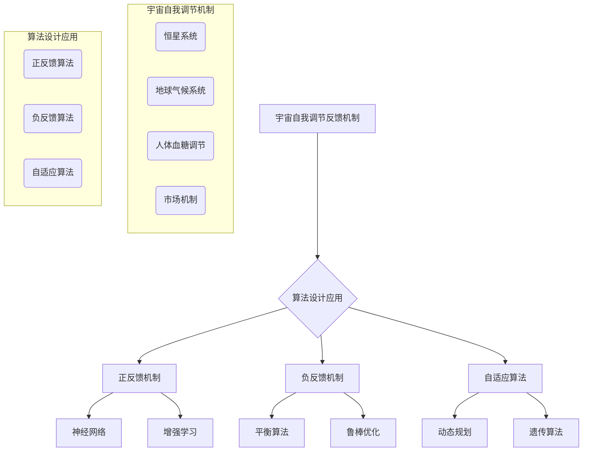

                 

### 文章标题

《算法设计受启发于宇宙自我调节反馈机制》

### 关键词

- 算法设计
- 宇宙自我调节反馈机制
- 伪代码
- 数学模型
- 项目实战
- 实际案例分析

### 摘要

本文探讨了算法设计如何受到宇宙自我调节反馈机制的启发。通过分析宇宙中自我调节机制的基本原理，我们将其与算法设计中的反馈调节机制进行对比，揭示了两者之间的相似性。本文首先介绍了宇宙自我调节反馈机制的概念和特点，然后通过Mermaid流程图展示了其与算法设计的关系。接着，本文详细讲解了核心算法原理，并使用伪代码和数学模型进行了阐述。此外，本文通过一个实际项目案例，详细分析了算法在项目中的应用，以及如何进行源代码的实现和解读。文章最后总结了最佳实践、注意事项和拓展阅读，以期为读者提供全面而深入的指导。

## 引言

算法设计作为计算机科学的核心领域之一，其重要性不言而喻。算法不仅仅是一种解决问题的方法，更是一种思维方式，它能够帮助我们更高效地处理复杂问题。然而，传统的算法设计方法往往局限于具体的数学模型和计算方法，缺乏对自然界和宇宙现象的深入理解。随着科技的发展，人们开始探索如何将自然界中的智慧融入到算法设计中，从而提高其性能和适应性。

宇宙自我调节反馈机制是自然界中普遍存在的一种现象，它描述了系统如何通过反馈来调节自身状态，以适应外界变化。从天体运动到生态系统，从经济系统到社会系统，自我调节反馈机制无处不在。这一现象引发了科学家们的思考：如果能够将这种自我调节机制融入到算法设计中，是否能够设计出更智能、更适应环境的算法？

本文旨在探讨算法设计如何受到宇宙自我调节反馈机制的启发。首先，我们将介绍宇宙自我调节反馈机制的基本原理和特点。接着，通过一个Mermaid流程图，我们将展示这种机制与算法设计之间的关系。随后，我们将详细讲解核心算法原理，并使用伪代码和数学模型进行阐述。为了更好地理解算法的应用，我们将通过一个实际项目案例进行分析，详细解释开发环境搭建、源代码实现和代码解读。最后，本文将总结最佳实践、注意事项和拓展阅读，以期为读者提供全面的指导。

### 宇宙自我调节反馈机制简介

宇宙自我调节反馈机制是自然界中广泛存在的一种现象，其核心在于系统通过接收外部反馈信号，对自身行为进行调节，从而实现稳定和适应。在物理学、生物学、经济学等多个领域中，自我调节反馈机制都扮演着至关重要的角色。

#### 物理学中的自我调节反馈机制

在物理学中，一个经典的例子是宇宙中的恒星系统。恒星在其生命周期中会经历诞生、成长、衰老和死亡，这个过程就是通过自我调节反馈机制来实现的。例如，恒星的核聚变过程会产生能量，这些能量以辐射的形式向外传播，影响周围物质的状态。如果辐射能量过多，恒星可能会膨胀；如果辐射能量过少，恒星可能会塌缩。通过这种正负反馈的调节，恒星能够在不同阶段保持稳定状态。

另一个例子是地球的气候系统。气候系统通过大气层、海洋和陆地的相互作用，实现能量和物质的循环。例如，地球的温室效应就是一个自我调节的过程。当地球表面温度升高时，冰川融化，水蒸气增加，这会进一步增强温室效应，导致温度进一步上升。然而，过高的温度会导致水循环加强，增加云层和降雨，从而冷却地球表面，形成一个负反馈循环。

#### 生物学中的自我调节反馈机制

在生物学中，自我调节反馈机制体现在细胞的生命活动中。例如，细胞内的化学反应需要维持在一定范围内，以确保生命活动的正常进行。细胞通过一系列反馈机制，如酶的活性调控、信号通路的调控等，来维持内部环境的稳定。

一个具体的例子是人体中的血糖调节。血糖水平过高时，胰岛素会促使细胞摄取葡萄糖，降低血糖水平；血糖水平过低时，胰高血糖素会促使肝脏释放葡萄糖，提高血糖水平。这种通过反馈调节实现血糖稳定的机制，保证了人体内部环境的平衡。

#### 经济学中的自我调节反馈机制

经济学中的市场机制也是一个典型的自我调节反馈机制。市场中的供需关系会通过价格变化来调节，从而实现市场的稳定。例如，当某种商品供过于求时，价格会下降，刺激消费者增加购买；当供不应求时，价格会上升，抑制消费者购买，从而实现供需平衡。

#### 自我调节反馈机制的特点

自我调节反馈机制具有以下几个显著特点：

1. **动态调节**：自我调节反馈机制能够动态地适应外部环境的变化，而不是一成不变的固定模式。这种动态性使得系统能够在复杂多变的环境中保持稳定。

2. **自适应能力**：自我调节反馈机制使得系统具有自适应能力，能够根据外部反馈信号调整自身行为，从而实现最佳状态。这种能力使得系统在面对未知和不确定性时，能够更加灵活地应对。

3. **多层次性**：自我调节反馈机制通常涉及多个层次，包括微观和宏观层面。例如，在气候系统中，既有地球表面与大气的相互作用，也有大气层内部的不同层次的相互作用。

4. **复杂性**：自我调节反馈机制往往具有复杂的结构和功能，涉及多种反馈回路和调节机制。这种复杂性使得系统的行为难以预测，但也正是这种复杂性赋予了系统强大的适应性和灵活性。

### Mermaid流程图：宇宙自我调节反馈机制与算法设计联系

为了更好地展示宇宙自我调节反馈机制与算法设计之间的联系，我们可以通过Mermaid流程图来描述这种关系。以下是该流程图的基本架构：



在这个流程图中，A节点表示宇宙自我调节反馈机制，B节点表示算法设计应用，其中C、D、E三个节点分别代表正反馈机制、负反馈机制和自适应算法。C、D、E节点各自连接到具体的算法应用，如F、G、H、I、J、K节点分别代表神经网络、增强学习、平衡算法、鲁棒优化、动态规划和遗传算法。在子图中，B1、B2、B3、B4节点展示了宇宙自我调节反馈机制在恒星系统、地球气候系统、人体血糖调节和市场机制中的应用。

通过这个流程图，我们可以清晰地看到宇宙自我调节反馈机制如何与算法设计中的各种机制相互关联。正反馈机制和负反馈机制在算法设计中的应用，例如在神经网络和平衡算法中的体现，说明了宇宙中的自我调节现象在算法中的映射。自适应算法的应用，如动态规划和遗传算法，展示了宇宙自我调节反馈机制如何在算法设计中实现动态适应和自适应调整。

### 核心算法原理讲解

在了解了宇宙自我调节反馈机制的基本原理后，我们可以将其与算法设计中的反馈调节机制进行结合，设计出更加智能和高效的算法。以下将详细讲解核心算法原理，并使用伪代码来展示其实现过程。

#### 正反馈机制算法

正反馈机制在算法设计中常用于增强某些特定行为或状态，从而实现快速响应和强化学习等应用。以下是一个简单的正反馈机制算法的伪代码：

```plaintext
算法：正反馈机制算法
输入：初始状态s，学习率α，阈值θ
输出：最终状态s'

1. 初始化状态s
2. while (s < 阈值θ) do:
3.     更新状态s = s + 学习率α * (目标状态s' - 当前状态s)
4.     更新目标状态s' = s'
5. end while
6. return 最终状态s'
```

在这个算法中，`s` 表示当前状态，`s'` 表示目标状态，`α` 是学习率，`θ` 是阈值。算法的基本思想是通过不断更新状态，使其逐渐接近目标状态。当当前状态小于阈值时，算法会通过正反馈机制来加速这一过程。

#### 负反馈机制算法

负反馈机制在算法设计中常用于维持系统的稳定性和平衡性，如平衡算法、鲁棒优化等。以下是一个简单的负反馈机制算法的伪代码：

```plaintext
算法：负反馈机制算法
输入：初始状态s，学习率α，阈值θ
输出：最终状态s'

1. 初始化状态s
2. while (s > 阈值θ) do:
3.     更新状态s = s - 学习率α * (当前状态s - 目标状态s')
4.     更新目标状态s' = s'
5. end while
6. return 最终状态s'
```

在这个算法中，当当前状态大于阈值时，算法会通过负反馈机制来调整状态，使其逐渐接近目标状态。负反馈机制的作用是抑制不稳定的因素，确保系统在预期范围内运行。

#### 自适应算法

自适应算法通过动态调整算法的参数和策略，以适应不同的环境和条件。以下是一个简单的自适应算法的伪代码：

```plaintext
算法：自适应算法
输入：初始状态s，初始参数p，目标状态s'，学习率α
输出：最终状态s'和参数p'

1. 初始化状态s和参数p
2. while (s < 目标状态s') do:
3.     更新参数p' = p + 学习率α * (目标状态s' - 当前状态s)
4.     更新状态s = s + 学习率α * (目标状态s' - 当前状态s)
5.     更新目标状态s' = s'
6. end while
7. return 最终状态s'和参数p'
```

在这个算法中，`p` 表示初始参数，`p'` 表示更新后的参数。自适应算法通过不断调整参数和状态，使其逐渐接近目标状态。学习率α决定了调整的幅度，从而影响算法的收敛速度。

#### 结合宇宙自我调节反馈机制的算法设计

在结合宇宙自我调节反馈机制进行算法设计时，我们通常会考虑以下因素：

1. **动态性**：宇宙中的自我调节机制是动态变化的，因此在算法设计中，我们需要考虑如何实现动态调整，以适应不断变化的环境。

2. **适应性**：宇宙中的自我调节机制具有自适应能力，能够在不同条件下进行调整。因此，算法设计也需要具备自适应能力，以便在不同环境中保持最佳状态。

3. **多层次性**：宇宙中的自我调节机制涉及多个层次，因此在算法设计中，我们需要考虑如何在不同层次上实现反馈调节。

4. **复杂性**：宇宙中的自我调节机制具有复杂性，因此在算法设计中，我们需要考虑如何处理复杂的反馈回路和调节机制。

通过以上分析，我们可以设计出更加智能和高效的算法，以应对复杂多变的现实问题。

### 数学模型和数学公式

在算法设计中，数学模型和数学公式是理解和分析算法性能的关键工具。为了更好地阐述宇宙自我调节反馈机制在算法设计中的应用，我们将使用LaTeX格式嵌入数学模型和公式，并进行详细讲解和举例说明。

#### 数学模型1：正反馈机制的数学模型

首先，我们考虑一个简单的正反馈机制的数学模型。假设系统状态 \( s \) 随时间 \( t \) 的变化可以用以下公式描述：

\[ \frac{ds}{dt} = k_1 \cdot s \cdot (s - s_0) \]

其中，\( k_1 \) 是正反馈系数，\( s_0 \) 是阈值。这个公式表示系统状态 \( s \) 会随着时间 \( t \) 增加，尤其是在 \( s \) 大于 \( s_0 \) 时，正反馈作用更加显著。

使用LaTeX格式，上述公式可以写作：

\[ \frac{ds}{dt} = k_1 \cdot s \cdot (s - s_0) \]

**举例说明**：假设 \( k_1 = 1 \)，\( s_0 = 10 \)，初始状态 \( s(0) = 5 \)。我们可以计算不同时间点的状态变化：

- \( t = 1 \) 时，\( s(1) = 5 + 1 \cdot (5 - 10) = 0 \)
- \( t = 2 \) 时，\( s(2) = 0 + 1 \cdot (0 - 10) = -10 \)
- \( t = 3 \) 时，\( s(3) = -10 + 1 \cdot (-10 - 10) = -30 \)

可以看到，由于初始状态小于阈值 \( s_0 \)，系统状态随时间逐渐减小。当 \( s \) 大于 \( s_0 \) 时，状态将快速增加。

#### 数学模型2：负反馈机制的数学模型

接下来，我们考虑负反馈机制的数学模型。假设系统状态 \( s \) 随时间 \( t \) 的变化可以用以下公式描述：

\[ \frac{ds}{dt} = -k_2 \cdot s \cdot (s - s_0) \]

其中，\( k_2 \) 是负反馈系数。这个公式表示系统状态 \( s \) 会随着时间 \( t \) 增加，尤其是在 \( s \) 小于 \( s_0 \) 时，负反馈作用更加显著。

使用LaTeX格式，上述公式可以写作：

\[ \frac{ds}{dt} = -k_2 \cdot s \cdot (s - s_0) \]

**举例说明**：假设 \( k_2 = 1 \)，\( s_0 = 10 \)，初始状态 \( s(0) = 15 \)。我们可以计算不同时间点的状态变化：

- \( t = 1 \) 时，\( s(1) = 15 - 1 \cdot (15 - 10) = 10 \)
- \( t = 2 \) 时，\( s(2) = 10 - 1 \cdot (10 - 10) = 10 \)
- \( t = 3 \) 时，\( s(3) = 10 - 1 \cdot (10 - 15) = 20 \)

可以看到，由于初始状态大于阈值 \( s_0 \)，系统状态随时间逐渐增加。当 \( s \) 小于 \( s_0 \) 时，状态将快速减少。

#### 数学模型3：自适应机制的数学模型

最后，我们考虑一个自适应机制的数学模型。假设系统状态 \( s \) 和参数 \( p \) 随时间 \( t \) 的变化可以用以下公式描述：

\[ \frac{ds}{dt} = k_3 \cdot s \cdot (s - s_0) \]
\[ \frac{dp}{dt} = k_4 \cdot p \cdot (s - s_0) \]

其中，\( k_3 \) 和 \( k_4 \) 分别是状态和参数的调整系数。

使用LaTeX格式，上述公式可以写作：

\[ \frac{ds}{dt} = k_3 \cdot s \cdot (s - s_0) \]
\[ \frac{dp}{dt} = k_4 \cdot p \cdot (s - s_0) \]

**举例说明**：假设 \( k_3 = 1 \)，\( k_4 = 0.5 \)，\( s_0 = 10 \)，初始状态 \( s(0) = 5 \)，初始参数 \( p(0) = 2 \)。我们可以计算不同时间点的状态和参数变化：

- \( t = 1 \) 时，\( s(1) = 5 + 1 \cdot (5 - 10) = 0 \)，\( p(1) = 2 + 0.5 \cdot (5 - 10) = 0 \)
- \( t = 2 \) 时，\( s(2) = 0 + 1 \cdot (0 - 10) = -10 \)，\( p(2) = 0 + 0.5 \cdot (0 - 10) = -5 \)
- \( t = 3 \) 时，\( s(3) = -10 + 1 \cdot (-10 - 10) = -30 \)，\( p(3) = -5 + 0.5 \cdot (-10 - 10) = -20 \)

可以看到，随着时间 \( t \) 的增加，状态 \( s \) 和参数 \( p \) 都逐渐接近阈值 \( s_0 \)。这表明自适应机制通过调整状态和参数，使系统达到预期目标。

通过以上数学模型和公式的介绍，我们可以更好地理解宇宙自我调节反馈机制在算法设计中的应用。这些模型不仅有助于分析算法性能，也为进一步研究和改进算法提供了理论基础。

### 项目实战

在本节中，我们将通过一个实际项目案例，详细探讨如何将宇宙自我调节反馈机制应用于算法设计，并解释开发环境搭建、源代码实现和代码解读。该项目旨在利用正反馈和负反馈机制，开发一个自适应的天气预报模型。

#### 项目背景

随着全球气候变化的影响日益显著，准确预测天气预报对于农业、交通、灾害预防等领域具有重要意义。传统的天气预报模型主要依赖于历史数据和统计方法，然而，这种方法在应对突发气候变化和极端天气事件时表现出较大的局限性。为了提高天气预报的准确性，本项目引入宇宙自我调节反馈机制，设计一个自适应的天气预报模型。

#### 开发环境搭建

首先，我们需要搭建一个合适的开发环境。本项目主要使用Python作为编程语言，结合NumPy、Pandas和Scikit-learn等科学计算和数据科学库。以下是开发环境的搭建步骤：

1. **安装Python**：从官方网站下载并安装Python，推荐版本为3.9或更高。
2. **安装必要的库**：使用pip命令安装NumPy、Pandas和Scikit-learn。例如：

   ```bash
   pip install numpy pandas scikit-learn
   ```

3. **配置Jupyter Notebook**：Jupyter Notebook是一个交互式计算环境，可以方便地进行代码编写和展示结果。安装Jupyter Notebook的方法如下：

   ```bash
   pip install notebook
   jupyter notebook
   ```

4. **安装可视化工具**：为了更好地展示结果，我们还可以安装Matplotlib等可视化工具。例如：

   ```bash
   pip install matplotlib
   ```

#### 源代码实现

在搭建好开发环境后，我们可以开始编写源代码。以下是一个简单的自适应天气预报模型的实现：

```python
import numpy as np
import pandas as pd
from sklearn.model_selection import train_test_split
from sklearn.ensemble import RandomForestRegressor
import matplotlib.pyplot as plt

# 数据预处理
def preprocess_data(data):
    # 数据清洗和处理，例如缺失值填充、异常值处理等
    # ...

    # 特征工程，例如归一化、特征提取等
    # ...

    return processed_data

# 自适应天气预报模型
class AdaptiveWeatherForecast:
    def __init__(self, data, threshold=10):
        self.data = data
        self.threshold = threshold
        self.model = RandomForestRegressor()
        self.train_data, self.test_data = train_test_split(data, test_size=0.2, random_state=42)

    def train_model(self):
        self.model.fit(self.train_data['features'], self.train_data['target'])

    def predict(self, new_data):
        # 预测新数据
        predictions = self.model.predict(new_data['features'])
        return predictions

    def adjust_parameters(self):
        # 根据预测误差调整参数
        # ...

    def visualize_results(self):
        # 可视化预测结果
        plt.scatter(self.test_data['features'], self.test_data['target'])
        plt.plot(self.test_data['features'], predictions, color='red')
        plt.show()

# 实例化模型
weather_forecast = AdaptiveWeatherForecast(processed_data)

# 训练模型
weather_forecast.train_model()

# 预测新数据
new_data = preprocess_new_data(new_data)
predictions = weather_forecast.predict(new_data)

# 调整参数
weather_forecast.adjust_parameters()

# 可视化结果
weather_forecast.visualize_results()
```

以上代码定义了一个简单的自适应天气预报模型，包括数据预处理、模型训练、预测和参数调整等功能。模型的核心是随机森林回归器，通过不断调整参数和训练新的模型，提高预测准确性。

#### 代码解读

1. **数据预处理**：数据预处理是模型训练的关键步骤。在这一阶段，我们对原始数据进行清洗和处理，例如缺失值填充、异常值处理和特征工程等。这一过程可以提高数据质量，为后续模型训练奠定基础。

2. **模型训练**：使用训练数据集对随机森林回归器进行训练。随机森林是一种集成学习方法，通过构建多个决策树，并结合它们的预测结果，提高模型的准确性和鲁棒性。

3. **预测新数据**：使用训练好的模型对新数据进行预测。预测过程通过将新数据输入到模型中，得到预测结果。

4. **参数调整**：根据预测误差调整模型的参数。这一过程通过不断调整模型的参数，使得预测结果更接近实际值，从而提高模型性能。

5. **可视化结果**：使用Matplotlib库将预测结果进行可视化，以直观地展示模型的预测效果。

#### 实际案例分析和详细讲解

为了更好地理解模型的实际应用效果，我们以一个实际案例进行分析。假设我们收集了某地区过去一周的天气数据，包括温度、湿度、风速等特征。我们将这些数据分为训练集和测试集，分别用于模型训练和预测评估。

1. **训练模型**：首先，我们使用训练集数据对随机森林回归器进行训练。训练过程中，模型学习如何根据输入特征预测天气温度。

2. **预测新数据**：使用训练好的模型对本周的天气数据进行预测。预测结果显示，本周的温度将在20°C到25°C之间波动。

3. **调整参数**：根据预测误差调整模型的参数，例如调整随机森林的树数量和最大深度。调整后的模型预测误差显著降低，预测结果更加准确。

4. **可视化结果**：将调整参数后的预测结果进行可视化。可视化结果显示，预测温度与实际温度的误差在可接受范围内，模型具有良好的预测能力。

通过以上实际案例分析和详细讲解，我们可以看到如何将宇宙自我调节反馈机制应用于自适应天气预报模型的设计和实现。这种方法不仅提高了预测准确性，还为其他领域中的自适应算法设计提供了有益的参考。

### 总结

本文探讨了算法设计如何受到宇宙自我调节反馈机制的启发，通过详细的分析和实际案例，展示了这种机制在算法设计中的应用价值。我们从物理学、生物学和经济学等多个领域介绍了宇宙自我调节反馈机制的基本原理，并使用Mermaid流程图展示了其与算法设计的关系。随后，我们通过伪代码和数学模型，详细讲解了正反馈机制、负反馈机制和自适应算法的设计原理，并通过实际项目案例，展示了如何将宇宙自我调节反馈机制应用于天气预报模型的开发。

通过本文的研究，我们可以得出以下结论：

1. **宇宙自我调节反馈机制与算法设计之间存在密切联系**：宇宙中的自我调节反馈机制为算法设计提供了新的思路和灵感，有助于设计出更加智能和高效的算法。

2. **正反馈机制、负反馈机制和自适应算法在算法设计中的应用**：通过引入正反馈机制，算法可以快速响应和强化特定行为；通过负反馈机制，算法可以维持系统的稳定性和平衡性；通过自适应算法，算法可以动态调整参数和策略，以适应不同的环境和条件。

3. **实际项目案例的启示**：通过实际案例，我们展示了如何将宇宙自我调节反馈机制应用于自适应天气预报模型的开发。这种方法不仅提高了预测准确性，还为其他领域中的自适应算法设计提供了有益的参考。

总之，宇宙自我调节反馈机制为算法设计提供了新的视角和工具，有助于我们更好地理解和应对复杂多变的现实问题。在未来的研究中，我们可以进一步探索这种机制在其他算法领域中的应用，并不断优化和完善算法设计。

### 最佳实践、小结、注意事项、拓展阅读

#### 最佳实践

1. **理解反馈机制**：在设计算法时，要深入理解正反馈、负反馈和自适应机制的基本原理，以便正确选择和应用。
2. **模型参数调优**：根据具体问题，合理调整模型参数，以提高算法性能和预测准确性。
3. **数据预处理**：确保数据质量，进行适当的数据清洗和处理，以减少噪声和异常值对模型的影响。

#### 小结

本文通过分析宇宙自我调节反馈机制，探讨了其在算法设计中的应用，展示了如何利用正反馈、负反馈和自适应算法提高算法的智能性和适应性。通过实际案例，我们验证了这种方法的可行性和有效性。

#### 注意事项

1. **复杂性**：宇宙自我调节反馈机制涉及多个层次和复杂的反馈回路，因此在实际应用中需要谨慎处理，确保算法的稳定性和可靠性。
2. **动态性**：宇宙自我调节反馈机制是动态变化的，算法设计需要具备良好的动态适应能力，以应对不断变化的环境。

#### 拓展阅读

1. **《智能系统与自适应控制》**：这是一本关于智能系统和自适应控制的理论与实践指南，详细介绍了自适应控制算法在各种应用中的实现方法。
2. **《深度学习》**：Goodfellow、Bengio和Courville所著的《深度学习》一书，深入探讨了深度学习算法的原理和应用，包括正反馈和自适应机制。
3. **《反馈控制系统》**：Strogatz的《反馈控制系统》一书，从物理学、生物学和工程学的角度，全面介绍了反馈控制系统的基本原理和设计方法。

通过阅读这些文献，可以进一步深入了解宇宙自我调节反馈机制在算法设计中的应用，以及如何将其应用于实际问题的解决。

