                 


### 文章标题

《纳米材料的密度泛函理论：微观结构的数学模型》

### 文章关键词

纳米材料，密度泛函理论，微观结构，数学模型，电子结构计算

### 文章摘要

本文旨在深入探讨纳米材料的密度泛函理论及其微观结构的数学模型。首先，我们将回顾纳米材料的定义、特性及其在各个领域的应用。接着，详细介绍密度泛函理论的基本概念、Kohn-Sham方程及其在材料科学中的应用。然后，我们将探讨纳米材料的微观结构，包括晶体结构和表面结构，并介绍如何使用数学模型来理解和预测这些结构的性质。最后，通过一些实际案例，我们将展示如何应用这些理论和模型来研究纳米材料的物理性质和潜在应用。

### 第1章 纳米材料概述

#### 1.1 纳米材料的定义与特性

纳米材料是指至少在一维上尺寸在1到100纳米（nm）范围内的材料。这些材料的独特性质源于其尺寸和表面效应，使其在电子、催化、光学、生物医学等多个领域展现出广泛的应用前景。

**核心概念与联系**

为了更好地理解纳米材料的特性，我们可以使用Mermaid流程图来展示纳米材料的基本概念和分类：

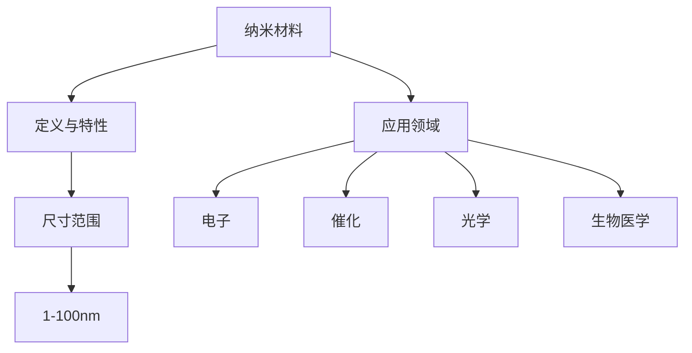

**关键内容**

纳米材料的基本概念包括：

- **尺寸范围**：纳米材料在一维上的尺寸范围在1到100nm之间。
- **特性**：纳米材料具有高比表面积、量子效应、小尺寸效应、表面效应等独特性质。

**背景介绍**

纳米材料的研究始于20世纪80年代，随着纳米技术的发展，纳米材料逐渐成为材料科学、化学、物理学等领域的热点。纳米材料的独特性质使其在许多传统材料无法实现的应用中展现出巨大的潜力。

#### 1.2 纳米材料的研究意义与应用领域

纳米材料的研究意义主要体现在以下几个方面：

1. **提高性能**：通过纳米化，许多材料的性能可以得到显著提升，如硬度、导电性、催化活性等。
2. **新型应用**：纳米材料为新材料的开发提供了无限可能，如纳米线、纳米膜、纳米晶体等。
3. **绿色环保**：纳米材料在环保领域有着广泛的应用，如纳米催化剂、纳米滤膜等。

**核心概念与联系**

下面是一个Mermaid流程图，展示了纳米材料的研究意义与应用领域之间的关系：

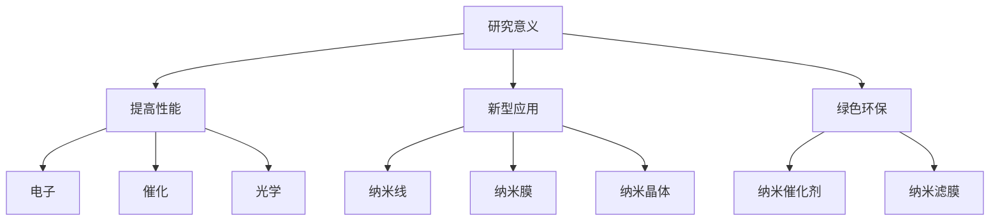

**关键内容**

纳米材料的主要应用领域包括：

- **电子**：纳米材料在电子器件中的应用，如纳米线、纳米晶体等。
- **催化**：纳米催化剂在化学催化中的应用，提高反应效率和选择性。
- **光学**：纳米材料在光学器件中的应用，如纳米膜、纳米孔等。
- **生物医学**：纳米材料在生物医学领域的应用，如药物载体、生物传感器等。

#### 1.3 纳米材料的基本分类

纳米材料可以按照不同的标准进行分类，常见的分类方法包括：

- **按成分分类**：金属、陶瓷、聚合物等。
- **按形态分类**：纳米颗粒、纳米线、纳米管、纳米膜等。
- **按结构分类**：单层、多层、核壳结构等。

**核心概念与联系**

下面是一个Mermaid流程图，展示了纳米材料的基本分类方法：

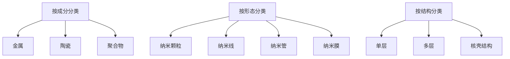

**关键内容**

纳米材料的基本分类方法包括：

- **按成分分类**：根据材料的化学成分进行分类，如金属纳米材料、陶瓷纳米材料等。
- **按形态分类**：根据材料的几何形态进行分类，如纳米颗粒、纳米线等。
- **按结构分类**：根据材料的结构特点进行分类，如单层、多层、核壳结构等。

### 第2章 密度泛函理论基础

#### 2.1 密度泛函理论的基本概念

密度泛函理论（DFT）是一种描述电子体系宏观性质的量子力学理论。它通过求解电子密度函数的泛函来计算体系的能量和电子结构。

**核心概念与联系**

密度泛函理论的核心概念包括：

- **电子密度**：描述体系内电子分布的状态。
- **泛函**：将电子密度映射为体系的宏观性质，如能量、力等。
- **Kohn-Sham方程**：描述电子密度函数与体系的能量之间的关系。

下面是一个Mermaid流程图，展示了密度泛函理论的基本概念和关系：

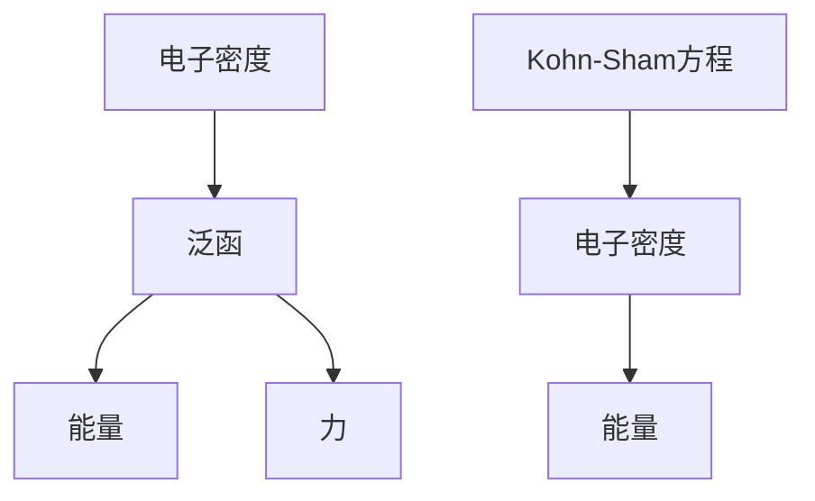

**核心算法原理讲解**

以下是Kohn-Sham方程的伪代码：

```
function KohnShamEquation(numerical_potential, k_points):
    for each k_point in k_points:
        Hamiltonian = numerical_potential(k_point) + kinetic_energy_density(k_point)
        solve the Schrödinger equation for the Kohn-Sham orbitals
    return Kohn-Sham orbitals and energies
```

**关键内容**

密度泛函理论的基本概念包括：

- **电子密度**：描述体系内电子分布的状态。
- **泛函**：将电子密度映射为体系的宏观性质，如能量、力等。
- **Kohn-Sham方程**：描述电子密度函数与体系的能量之间的关系。

#### 2.2 Kohn-Sham方程

Kohn-Sham方程是密度泛函理论的核心方程，用于求解电子体系中的电子分布。

**核心概念与联系**

Kohn-Sham方程的核心概念包括：

- **单粒子近似**：将多体问题分解为单粒子问题。
- **有效势**：由交换关联势描述，与真实体系的交换关联效应等效。

下面是一个Mermaid流程图，展示了Kohn-Sham方程的基本概念和关系：

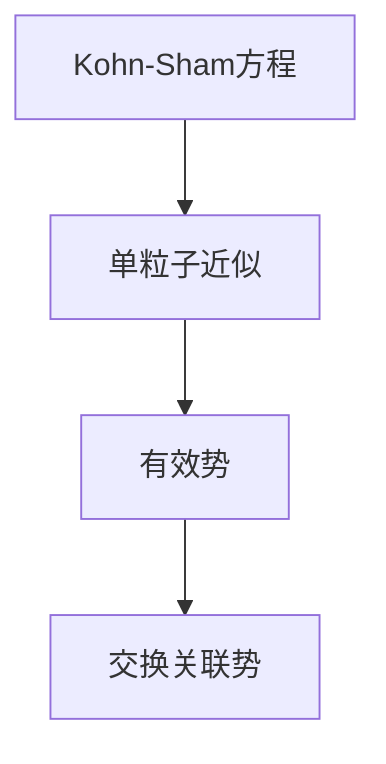

**核心算法原理讲解**

以下是Kohn-Sham方程的伪代码：

```
function KohnShamEquation(Hamiltonian, electron_density):
    solve the Schrödinger equation:
        Hamiltonian * electron_wavefunction = -electron_potential * electron_wavefunction
    return electron_wavefunctions and energies
```

**关键内容**

Kohn-Sham方程的核心概念包括：

- **单粒子近似**：将多体问题分解为单粒子问题。
- **有效势**：由交换关联势描述，与真实体系的交换关联效应等效。

#### 2.3 密度泛函理论的应用

密度泛函理论在材料科学、化学、物理学等领域有着广泛的应用。

**核心概念与联系**

下面是一个Mermaid流程图，展示了密度泛函理论在不同领域的应用：

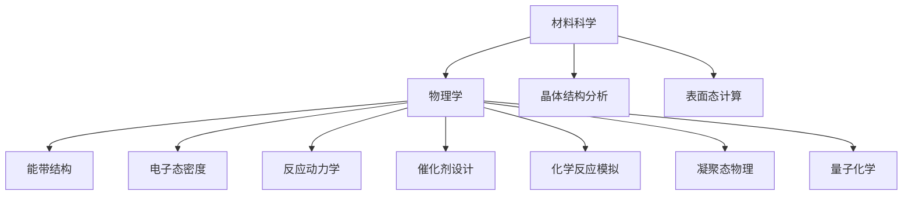

**核心算法原理讲解**

以下是密度泛函理论在材料科学中的应用案例：

```
function DFT_Materials(material, parameters):
    calculate the electronic structure of the material using DFT
    analyze the properties such as:
        band structure
        electronic density of states
        surface states
    optimize the parameters for better performance
    return the properties and optimized parameters
```

**关键内容**

密度泛函理论的应用包括：

- **材料科学**：电子结构计算、晶体结构分析、表面态计算。
- **化学**：反应动力学、催化剂设计、化学反应模拟。
- **物理学**：凝聚态物理、量子化学。

### 第3章 纳米材料的微观结构

#### 3.1 微观结构的定义与重要性

微观结构是指材料在纳米尺度下的组织结构，包括晶体结构、缺陷结构、表面结构等。这些微观结构对材料的性能具有决定性影响。

**核心概念与联系**

下面是一个Mermaid流程图，展示了微观结构的定义和重要性：

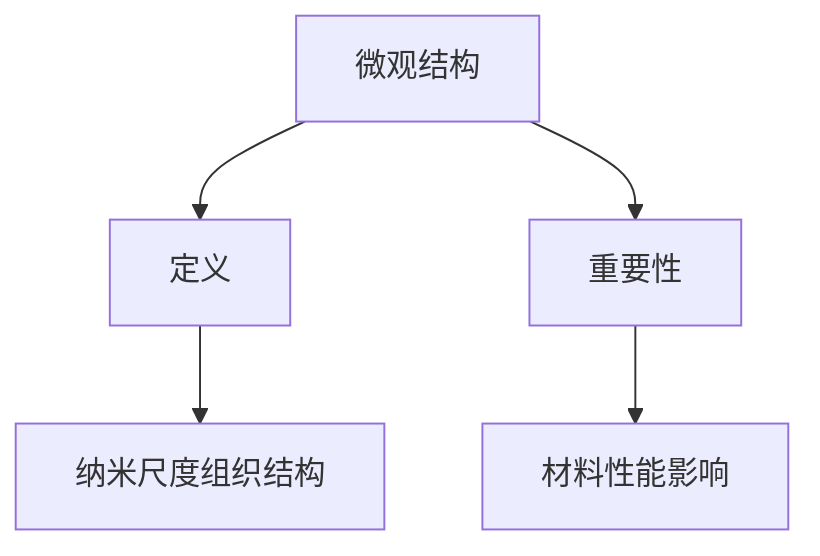

**关键内容**

微观结构的定义和重要性包括：

- **定义**：纳米尺度下的组织结构。
- **重要性**：对材料性能具有决定性影响。

#### 3.2 纳米材料的晶体结构

晶体结构是纳米材料的重要微观结构之一，它决定了材料的电子结构和物理性质。

**核心概念与联系**

下面是一个Mermaid流程图，展示了纳米材料的晶体结构：

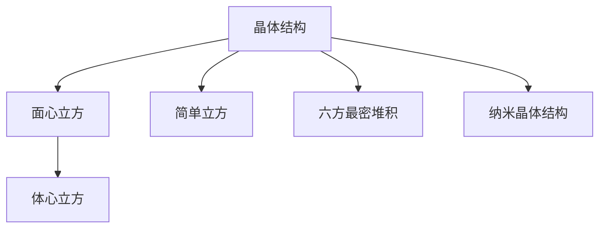

**核心算法原理讲解**

以下是纳米晶体结构的伪代码：

```
function CrystalStructure(type, parameters):
    if type == "FCC":
        calculate the structure using face-centered cubic parameters
    else if type == "BCC":
        calculate the structure using body-centered cubic parameters
    else if type == "SC":
        calculate the structure using simple cubic parameters
    else if type == "HCP":
        calculate the structure using hexagonal close-packed parameters
    return the crystal structure
```

**关键内容**

纳米材料的晶体结构包括：

- **面心立方**、**体心立方**、**简单立方**、**六方最密堆积**等结构类型。
- **纳米晶体结构**：特殊的晶体结构，如一维纳米线、二维纳米膜、三维纳米晶体。

#### 3.3 纳米材料的表面结构

表面结构是纳米材料的重要微观结构之一，它对材料的催化活性、光学性质等具有重要影响。

**核心概念与联系**

下面是一个Mermaid流程图，展示了纳米材料的表面结构：

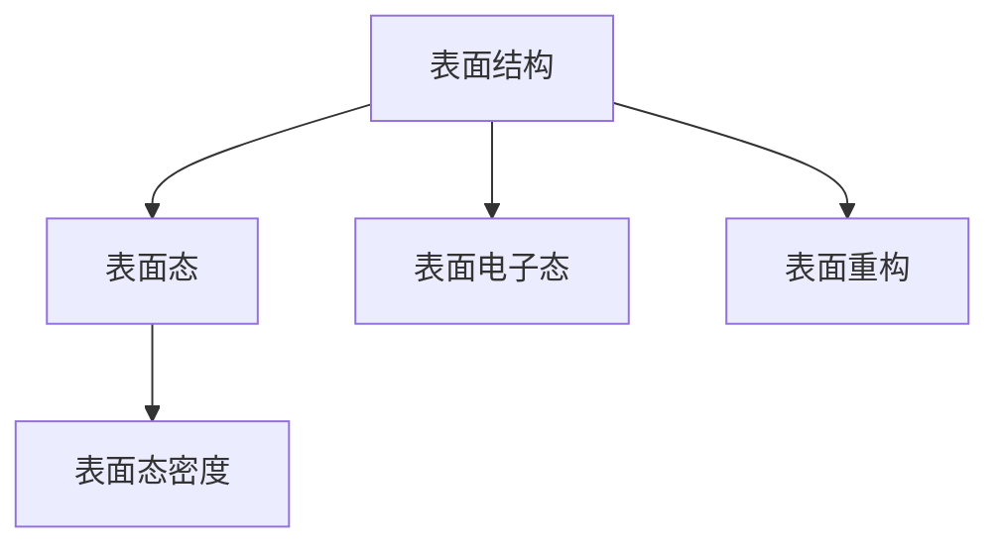

**核心算法原理讲解**

以下是纳米材料表面结构的伪代码：

```
function SurfaceStructure(material, parameters):
    calculate the surface states using density functional theory
    analyze the surface electronic structure
    study the surface reconstruction
    return the surface structure and properties
```

**关键内容**

纳米材料的表面结构包括：

- **表面态**：表面处的电子态。
- **表面态密度**：表面态的分布情况。
- **表面电子态**：表面处的电子结构。
- **表面重构**：表面结构的重构现象。

### 第4章 数学模型在纳米材料研究中的应用

#### 4.1 经典模型

经典模型是一种简化的数学模型，用于描述纳米材料的某些物理现象。

**核心概念与联系**

下面是一个Mermaid流程图，展示了经典模型的应用：

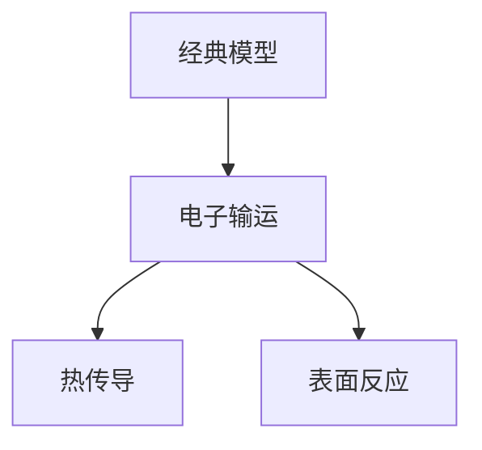

**核心算法原理讲解**

以下是经典模型的伪代码：

```
function ClassicalModel(type, parameters):
    if type == "ElectronTransport":
        calculate the electron transport properties
    else if type == "HeatConduct
```### 第1章 纳米材料概述

纳米材料，顾名思义，是指至少在一维尺度上尺寸在1到100纳米（nm）范围内的材料。这些材料因其独特的物理和化学性质，如高比表面积、量子效应、小尺寸效应等，在多个领域具有广泛的应用。在本章中，我们将首先探讨纳米材料的定义和特性，然后介绍其在各个领域的应用，并最后讨论纳米材料的基本分类。

#### 1.1 纳米材料的定义与特性

纳米材料的定义可以从不同的角度进行理解。最直观的定义是，它们的特征尺寸在1到100纳米之间。这一尺寸范围使得纳米材料具有与传统材料截然不同的物理和化学性质。例如，金属纳米颗粒的熔点比其宏观形式的熔点低，纳米线的机械强度比宏观纤维更高，纳米薄膜的光学性能也与宏观薄膜大相径庭。

**核心概念与联系**

为了更好地理解纳米材料的特性，我们可以使用Mermaid流程图来展示纳米材料的基本概念和特性：

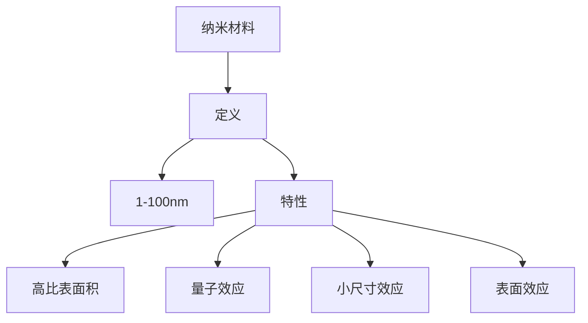

**关键内容**

纳米材料的基本特性包括：

- **高比表面积**：由于纳米材料的尺寸较小，其表面积与体积的比例显著增加，导致表面效应显著。
- **量子效应**：当材料的尺寸小于特定临界尺寸时，量子效应开始显现，如能带结构的变化。
- **小尺寸效应**：材料的某些性质，如熔点、导电性、热导率等，随着尺寸的减小而发生变化。
- **表面效应**：纳米材料的表面原子比例较高，表面原子与体相原子的性质不同，从而影响材料的整体性能。

**背景介绍**

纳米材料的研究起源于20世纪80年代，随着扫描隧道显微镜（STM）和原子力显微镜（AFM）等先进实验技术的发展，人们开始对纳米材料的独特性质有了更深入的认识。此后，纳米材料的研究取得了飞速进展，并在材料科学、化学、物理学、电子学、生物学等领域展现出巨大的应用潜力。

#### 1.2 纳米材料的研究意义与应用领域

纳米材料的研究意义主要体现在以下几个方面：

1. **提高性能**：通过纳米化，许多材料的性能可以得到显著提升，如硬度、导电性、催化活性等。
2. **新型应用**：纳米材料为新材料的开发提供了无限可能，如纳米线、纳米膜、纳米晶体等。
3. **绿色环保**：纳米材料在环保领域有着广泛的应用，如纳米催化剂、纳米滤膜等。

**核心概念与联系**

下面是一个Mermaid流程图，展示了纳米材料的研究意义与应用领域之间的关系：


**关键内容**

纳米材料的主要应用领域包括：

- **电子**：纳米材料在电子器件中的应用，如纳米线、纳米晶体等。
- **催化**：纳米催化剂在化学催化中的应用，提高反应效率和选择性。
- **光学**：纳米材料在光学器件中的应用，如纳米膜、纳米孔等。
- **生物医学**：纳米材料在生物医学领域的应用，如药物载体、生物传感器等。

**背景介绍**

纳米材料在电子领域的应用最早开始于20世纪90年代，随着半导体工业的发展，纳米电子器件的研究取得了重要进展。在催化领域，纳米催化剂因其高活性、高选择性，在化工、环保等领域得到了广泛应用。光学领域则通过纳米结构实现对光的调控，如纳米激光器、光开关等。生物医学领域，纳米材料被用于药物载体、诊断试剂等，大大提高了治疗和诊断的精度和效果。

#### 1.3 纳米材料的基本分类

纳米材料可以按照不同的标准进行分类，常见的分类方法包括：

- **按成分分类**：金属、陶瓷、聚合物等。
- **按形态分类**：纳米颗粒、纳米线、纳米管、纳米膜等。
- **按结构分类**：单层、多层、核壳结构等。

**核心概念与联系**

下面是一个Mermaid流程图，展示了纳米材料的基本分类方法：


**关键内容**

纳米材料的基本分类方法包括：

- **按成分分类**：根据材料的化学成分进行分类，如金属纳米材料、陶瓷纳米材料等。
- **按形态分类**：根据材料的几何形态进行分类，如纳米颗粒、纳米线等。
- **按结构分类**：根据材料的结构特点进行分类，如单层、多层、核壳结构等。

**背景介绍**

纳米材料的分类有助于我们更好地理解其特性和应用。例如，金属纳米材料因其高比表面积和量子效应，在电子、催化等领域具有广泛的应用；陶瓷纳米材料则因其高强度和高硬度，在结构材料领域具有重要价值；聚合物纳米材料因其良好的生物相容性，在生物医学领域表现出巨大潜力。不同形态的纳米材料在光学、电学、磁学等性质上表现出显著差异，为各类应用提供了多样化的选择。

### 第2章 密度泛函理论基础

密度泛函理论（DFT）是量子力学中用于描述电子体系宏观性质的强大工具，其核心思想是将电子体系的多体问题转化为对电子密度的研究。DFT在材料科学、化学和物理学等领域具有广泛的应用。在本章中，我们将首先介绍DFT的基本概念，然后深入探讨Kohn-Sham方程及其在纳米材料研究中的应用。

#### 2.1 密度泛函理论的基本概念

密度泛函理论的基本概念主要包括电子密度、泛函和Kohn-Sham方程。电子密度描述了体系内电子的分布状态，泛函则是将电子密度映射为体系的宏观性质，如能量、力等。Kohn-Sham方程是DFT的核心方程，用于求解电子体系的电子分布。

**核心概念与联系**

为了更好地理解DFT的基本概念，我们可以使用Mermaid流程图来展示其核心概念和关系：


**关键内容**

DFT的基本概念包括：

- **电子密度**：描述体系内电子的分布状态。
- **泛函**：将电子密度映射为体系的宏观性质，如能量、力等。
- **Kohn-Sham方程**：描述电子密度函数与体系的能量之间的关系。

**背景介绍**

DFT最早由F. Kleinert和J.E.unc提出，但直到20世纪70年代，J. Kohn和L.J. Sham提出Kohn-Sham方程，DFT才得到了完善。Kohn-Sham方程将多体量子力学问题转化为单粒子问题，使得DFT在实际计算中变得可行。

#### 2.2 Kohn-Sham方程

Kohn-Sham方程是DFT的核心方程，用于求解电子体系的电子分布。其基本思想是将电子体系划分为有效体系，使得体系的总能量可以表示为单个电子能量的和。

**核心概念与联系**

下面是一个Mermaid流程图，展示了Kohn-Sham方程的基本概念和关系：


**核心算法原理讲解**

以下是Kohn-Sham方程的伪代码：

```
function KohnShamEquation(Hamiltonian, electron_density):
    solve the Schrödinger equation:
        Hamiltonian * electron_wavefunction = -electron_potential * electron_wavefunction
    return electron_wavefunctions and energies
```

**关键内容**

Kohn-Sham方程的核心概念包括：

- **单粒子近似**：将多体问题分解为单粒子问题。
- **有效势**：由交换关联势描述，与真实体系的交换关联效应等效。

**背景介绍**

Kohn-Sham方程的提出是DFT发展中的重要里程碑。通过单粒子近似，Kohn-Sham方程使得DFT的计算变得可行，并在材料科学、化学和物理学等领域得到了广泛应用。

#### 2.3 密度泛函理论的应用

密度泛函理论在材料科学、化学和物理学等领域具有广泛的应用。其应用主要体现在电子结构计算、晶体结构分析、表面态计算等方面。

**核心概念与联系**

下面是一个Mermaid流程图，展示了DFT在材料科学中的应用：

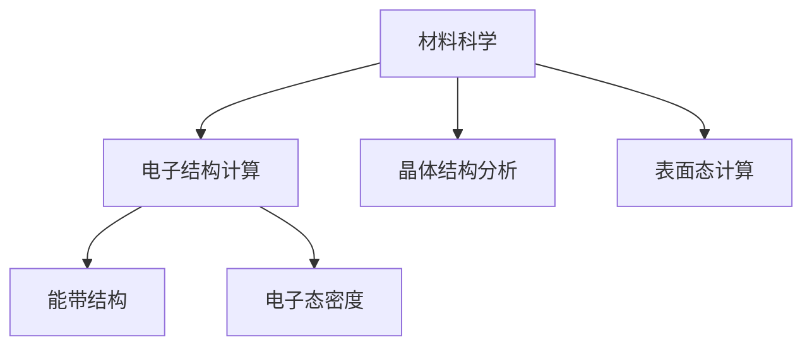

**核心算法原理讲解**

以下是DFT在材料科学中的应用案例：

```
function DFT_Materials(material, parameters):
    calculate the electronic structure of the material using DFT
    analyze the properties such as:
        band structure
        electronic density of states
        surface states
    optimize the parameters for better performance
    return the properties and optimized parameters
```

**关键内容**

DFT的主要应用包括：

- **电子结构计算**：通过DFT计算材料的电子结构，如能带结构、电子态密度等。
- **晶体结构分析**：分析材料的晶体结构，如晶格常数、缺陷结构等。
- **表面态计算**：计算材料表面的电子态，如表面态密度、表面态能级等。

**背景介绍**

DFT的应用始于20世纪80年代，随着计算机技术的进步，DFT的计算精度和效率得到了显著提升。如今，DFT已经成为材料科学、化学和物理学等领域研究的重要工具。

### 第3章 纳米材料的微观结构

纳米材料的微观结构对其物理和化学性质具有决定性影响。在这一章中，我们将探讨纳米材料的微观结构，包括晶体结构和表面结构，并介绍如何使用数学模型来理解和预测这些结构的性质。

#### 3.1 微观结构的定义与重要性

微观结构是指纳米材料在纳米尺度下的组织结构，包括晶体结构、缺陷结构、表面结构等。这些微观结构对材料的物理和化学性质具有深远影响。

**核心概念与联系**

下面是一个Mermaid流程图，展示了微观结构的定义和重要性：


**关键内容**

微观结构的定义和重要性包括：

- **定义**：纳米尺度下的组织结构。
- **重要性**：对材料性能具有决定性影响。

**背景介绍**

纳米材料的微观结构研究起源于20世纪80年代，随着扫描隧道显微镜（STM）和原子力显微镜（AFM）等先进实验技术的发展，人们对纳米材料的微观结构有了更深入的认识。

#### 3.2 纳米材料的晶体结构

晶体结构是纳米材料的重要微观结构之一，它决定了材料的电子结构和物理性质。

**核心概念与联系**

下面是一个Mermaid流程图，展示了纳米材料的晶体结构：


**核心算法原理讲解**

以下是纳米晶体结构的伪代码：

```
function CrystalStructure(type, parameters):
    if type == "FCC":
        calculate the structure using face-centered cubic parameters
    else if type == "BCC":
        calculate the structure using body-centered cubic parameters
    else if type == "SC":
        calculate the structure using simple cubic parameters
    else if type == "HCP":
        calculate the structure using hexagonal close-packed parameters
    return the crystal structure
```

**关键内容**

纳米材料的晶体结构包括：

- **面心立方**、**体心立方**、**简单立方**、**六方最密堆积**等结构类型。
- **纳米晶体结构**：特殊的晶体结构，如一维纳米线、二维纳米膜、三维纳米晶体。

**背景介绍**

纳米晶体结构的研究对于理解材料的电子结构和物理性质具有重要意义。例如，纳米线的量子尺寸效应使得其在电子器件中具有广泛应用。

#### 3.3 纳米材料的表面结构

表面结构是纳米材料的重要微观结构之一，它对材料的催化活性、光学性质等具有重要影响。

**核心概念与联系**

下面是一个Mermaid流程图，展示了纳米材料的表面结构：


**核心算法原理讲解**

以下是纳米材料表面结构的伪代码：

```
function SurfaceStructure(material, parameters):
    calculate the surface states using density functional theory
    analyze the surface electronic structure
    study the surface reconstruction
    return the surface structure and properties
```

**关键内容**

纳米材料的表面结构包括：

- **表面态**：表面处的电子态。
- **表面态密度**：表面态的分布情况。
- **表面电子态**：表面处的电子结构。
- **表面重构**：表面结构的重构现象。

**背景介绍**

纳米材料表面结构的研究对于理解其催化活性、光学性质等具有重要意义。例如，表面重构现象可以显著提高纳米材料的催化性能。

### 第4章 数学模型在纳米材料研究中的应用

数学模型在纳米材料研究中起着至关重要的作用，它们帮助我们理解和预测纳米材料的微观结构、电子性质及其应用。本章将介绍经典模型、半经典模型和全量子力学模型在纳米材料研究中的应用。

#### 4.1 经典模型

经典模型是简化纳米材料物理现象的一种方法，它通常不涉及量子效应。经典模型在描述纳米材料的电子输运、热传导和表面反应等方面具有一定的准确性。

**核心概念与联系**

经典模型的核心概念包括电子输运、热传导和表面反应。下面是一个Mermaid流程图，展示了经典模型的应用：


**核心算法原理讲解**

以下是经典模型的伪代码：

```
function ClassicalModel(type, parameters):
    if type == "ElectronTransport":
        calculate the electron transport properties
    else if type == "HeatConduction":
        calculate the thermal conductivity
    else if type == "SurfaceReaction":
        calculate the surface reaction rate
    return the properties
```

**关键内容**

经典模型的主要应用包括：

- **电子输运**：描述电子在纳米材料中的运动。
- **热传导**：计算纳米材料的热导率。
- **表面反应**：预测纳米材料表面的反应速率。

#### 4.2 半经典模型

半经典模型结合了量子力学和经典力学的原理，用于描述纳米材料的电子输运和量子效应。半经典模型在纳米电子器件的设计和模拟中得到了广泛应用。

**核心概念与联系**

半经典模型的核心概念包括量子限制效应和近似处理。下面是一个Mermaid流程图，展示了半经典模型的应用：

```mermaid
graph TD
    A[半经典模型] --> B[量子限制效应]
    B --> C[近似处理]
    A --> D[电子输运]
    D --> E[量子点]
    D --> F[纳米线]
```

**核心算法原理讲解**

以下是半经典模型的伪代码：

```
function SemiClassicalModel(type, parameters):
    if type == "QuantumDot":
        calculate the quantum dot properties using effective mass approximation
    else if type == "NanoWire":
        calculate the electron transport properties using the WKB approximation
    return the properties
```

**关键内容**

半经典模型的主要应用包括：

- **量子点**：计算量子点的电子性质。
- **纳米线**：描述纳米线中的电子输运。

#### 4.3 全量子力学模型

全量子力学模型基于量子力学的原理，用于精确描述纳米材料的电子结构。这种模型通常采用密度泛函理论（DFT）或其他量子力学方法，如第一原理计算。

**核心概念与联系**

全量子力学模型的核心概念包括量子力学原理和计算方法。下面是一个Mermaid流程图，展示了全量子力学模型的应用：

```mermaid
graph TD
    A[全量子力学模型] --> B[量子力学原理]
    B --> C[计算方法]
    A --> D[电子结构计算]
    D --> E[能带结构]
    D --> F[电子态密度]
```

**核心算法原理讲解**

以下是全量子力学模型的伪代码：

```
function QuantumMechanicalModel(type, parameters):
    if type == "DFT":
        calculate the electronic structure using density functional theory
    else if type == "FristPrinciples":
        calculate the electronic structure using first principles methods
    return the electronic properties
```

**关键内容**

全量子力学模型的主要应用包括：

- **电子结构计算**：精确描述纳米材料的电子结构。
- **能带结构**：计算纳米材料的能带结构。
- **电子态密度**：分析纳米材料的电子态密度。

**背景介绍**

随着计算机技术的发展，全量子力学模型在纳米材料研究中的应用越来越广泛。通过精确的量子力学计算，我们可以深入了解纳米材料的电子性质，为其在电子器件、催化、光电等领域中的应用提供理论支持。

### 第5章 纳米材料的电子结构计算

纳米材料的电子结构对其物理和化学性质具有重要影响，因此电子结构计算在纳米材料研究中占据重要地位。本章将介绍电子结构计算的方法，包括能带结构分析和电子态密度分析，并探讨这些方法在纳米材料研究中的应用。

#### 5.1 电子结构计算的方法

电子结构计算是研究纳米材料的重要工具，它帮助我们理解材料的电子性质和行为。常见的电子结构计算方法包括能带结构分析和电子态密度分析。

**核心概念与联系**

下面是一个Mermaid流程图，展示了电子结构计算的方法和它们之间的关系：

```mermaid
graph TD
    A[电子结构计算] --> B[能带结构分析]
    B --> C[电子态密度分析]
```

**关键内容**

电子结构计算的方法包括：

- **能带结构分析**：计算材料的能带结构，分析电子在材料中的分布和能级。
- **电子态密度分析**：分析材料的电子态密度，了解电子在不同能量状态的分布。

**背景介绍**

电子结构计算的发展始于20世纪50年代，随着计算机技术的进步，计算方法和精度不断提高。如今，电子结构计算已成为纳米材料研究的重要工具。

#### 5.2 能带结构分析

能带结构分析是研究纳米材料电子结构的重要方法，它可以帮助我们了解材料的导电性、光学性质等。

**核心概念与联系**

下面是一个Mermaid流程图，展示了能带结构分析的核心概念：

```mermaid
graph TD
    A[能带结构] --> B[导电性]
    B --> C[绝缘性]
    A --> D[带隙]
    D --> E[导带]
    D --> F[价带]
```

**核心算法原理讲解**

以下是能带结构分析的伪代码：

```
function BandStructureAnalysis(material, parameters):
    calculate the electronic band structure
    analyze the conductive and insulating properties
    determine the band gap
    return the band structure and properties
```

**关键内容**

能带结构分析的核心概念包括：

- **导电性**：材料的能带结构决定了其导电性，导带中的电子可以自由移动。
- **绝缘性**：价带中的电子无法移动，导致材料表现为绝缘性。
- **带隙**：导带和价带之间的能量差，决定了材料的导电性。

**背景介绍**

能带结构分析在半导体器件的设计和优化中具有重要意义。通过分析纳米材料的能带结构，我们可以优化其导电性和光学性质，提高其在电子器件中的应用效果。

#### 5.3 电子态密度分析

电子态密度分析是研究纳米材料电子态分布的重要方法，它帮助我们了解材料在不同能量状态的电子分布情况。

**核心概念与联系**

下面是一个Mermaid流程图，展示了电子态密度分析的核心概念：

```mermaid
graph TD
    A[电子态密度] --> B[电子态分布]
    B --> C[能级]
    B --> D[态密度函数]
```

**核心算法原理讲解**

以下是电子态密度分析的伪代码：

```
function DensityOfStatesAnalysis(material, parameters):
    calculate the electronic density of states
    analyze the distribution of electronic states
    determine the density of states function
    return the density of states and properties
```

**关键内容**

电子态密度分析的核心概念包括：

- **电子态分布**：不同能量状态的电子分布情况。
- **态密度函数**：描述电子在不同能量状态的分布。

**背景介绍**

电子态密度分析在纳米材料的光学性质研究中具有重要意义。通过分析电子态密度，我们可以了解材料的吸收、发射和反射特性，优化其在光电领域中的应用。

### 第6章 纳米材料的物理性质模拟

纳米材料的物理性质对其应用具有重要影响。本章将介绍纳米材料的物理性质模拟，包括弹性性质、热学性质和磁学性质的模拟方法，并探讨这些性质在纳米材料研究中的应用。

#### 6.1 弹性性质模拟

弹性性质是材料在受力作用下发生形变，并在外力移除后恢复原状的能力。纳米材料的弹性性质与其微观结构密切相关。

**核心概念与联系**

下面是一个Mermaid流程图，展示了纳米材料弹性性质模拟的核心概念：

```mermaid
graph TD
    A[弹性性质] --> B[应力]
    B --> C[应变]
    A --> D[弹性模量]
    D --> E[泊松比]
```

**核心算法原理讲解**

以下是纳米材料弹性性质模拟的伪代码：

```
function ElasticPropertySimulation(material, external_force):
    calculate the stress and strain
    determine the elastic modulus and Poisson's ratio
    return the elastic properties
```

**关键内容**

纳米材料弹性性质模拟的核心概念包括：

- **应力**：材料受到外力作用时产生的内力。
- **应变**：材料在外力作用下发生的形变。
- **弹性模量**：描述材料抵抗形变的能力。
- **泊松比**：描述材料在形变过程中横向和纵向应变的比例。

**背景介绍**

弹性性质模拟对于理解纳米材料的力学行为具有重要意义。通过模拟纳米材料的弹性性质，我们可以优化其结构设计，提高其力学性能。

#### 6.2 热学性质模拟

热学性质是材料在温度变化过程中表现出的性质，如热导率、比热容和热膨胀系数等。纳米材料的热学性质与其微观结构密切相关。

**核心概念与联系**

下面是一个Mermaid流程图，展示了纳米材料热学性质模拟的核心概念：

```mermaid
graph TD
    A[热学性质] --> B[热导率]
    B --> C[比热容]
    A --> D[热膨胀系数]
```

**核心算法原理讲解**

以下是纳米材料热学性质模拟的伪代码：

```
function ThermalPropertySimulation(material, temperature):
    calculate the thermal conductivity
    determine the specific heat capacity
    calculate the thermal expansion coefficient
    return the thermal properties
```

**关键内容**

纳米材料热学性质模拟的核心概念包括：

- **热导率**：材料传递热量的能力。
- **比热容**：单位质量物质温度升高1K所需的热量。
- **热膨胀系数**：材料体积随温度变化的程度。

**背景介绍**

热学性质模拟对于理解纳米材料在热管理中的应用具有重要意义。通过模拟纳米材料的热学性质，我们可以优化其设计，提高其在热管理领域的性能。

#### 6.3 磁学性质模拟

磁学性质是材料在磁场中表现出的性质，如磁化率、磁导率和磁性等。纳米材料的磁学性质与其微观结构密切相关。

**核心概念与联系**

下面是一个Mermaid流程图，展示了纳米材料磁学性质模拟的核心概念：

```mermaid
graph TD
    A[磁学性质] --> B[磁化率]
    B --> C[磁导率]
    A --> D[磁性]
```

**核心算法原理讲解**

以下是纳米材料磁学性质模拟的伪代码：

```
function MagneticPropertySimulation(material, magnetic_field):
    calculate the magnetization
    determine the magnetic susceptibility
    calculate the magnetic permeability
    return the magnetic properties
```

**关键内容**

纳米材料磁学性质模拟的核心概念包括：

- **磁化率**：材料磁化程度与磁场强度之间的关系。
- **磁导率**：描述材料在磁场中表现出的磁性能。
- **磁性**：材料在外部磁场作用下表现出的磁性质。

**背景介绍**

磁学性质模拟对于理解纳米材料在磁存储、磁传感器和磁性器件中的应用具有重要意义。通过模拟纳米材料的磁学性质，我们可以优化其设计，提高其在磁性领域中的应用效果。

### 第7章 纳米材料的应用案例分析

纳米材料在多个领域展现出了广泛的应用潜力，本章将通过几个实际案例来展示纳米材料在电子器件、光电子器件和催化剂等领域的应用。

#### 7.1 电子器件中的应用

纳米材料在电子器件中的应用取得了显著进展，如纳米线场效应晶体管（NFET）和纳米线光电探测器等。这些器件利用了纳米材料的量子效应和独特的电学性质。

**案例 1：纳米线场效应晶体管（NFET）**

**核心概念与联系**

纳米线场效应晶体管（NFET）的核心概念包括纳米线结构、量子效应和电学性质。下面是一个Mermaid流程图，展示了NFET的工作原理：

```mermaid
graph TD
    A[NFET] --> B[纳米线结构]
    B --> C[量子效应]
    B --> D[电学性质]
    C --> E[导通态]
    C --> F[截止态]
```

**核心算法原理讲解**

以下是NFET的伪代码：

```
function NFET(material, voltage):
    if voltage > threshold:
        set the channel to conductive state
    else:
        set the channel to off state
    return the output current
```

**关键内容**

NFET的关键内容：

- **纳米线结构**：纳米线作为通道，具有高电子迁移率。
- **量子效应**：量子效应导致纳米线中的电子态密度变化。
- **电学性质**：电场控制纳米线中的电子输运。

**背景介绍**

纳米线场效应晶体管（NFET）在提高电子器件性能、降低功耗方面具有巨大潜力，是下一代电子器件的重要研究方向。

#### 7.2 光电子器件中的应用

纳米材料在光电子器件中的应用也取得了显著成果，如纳米线太阳能电池、纳米晶体光催化剂等。

**案例 2：纳米线太阳能电池**

**核心概念与联系**

纳米线太阳能电池的核心概念包括纳米线结构、光电转换效率和光学性质。下面是一个Mermaid流程图，展示了纳米线太阳能电池的工作原理：

```mermaid
graph TD
    A[纳米线太阳能电池] --> B[纳米线结构]
    B --> C[光电转换效率]
    B --> D[光学性质]
    C --> E[光吸收]
    C --> F[电子-空穴对生成]
```

**核心算法原理讲解**

以下是纳米线太阳能电池的伪代码：

```
function NanoWireSolarCell(material, sunlight):
    if sunlight > threshold:
        absorb sunlight and generate electron-hole pairs
        separate the electron-hole pairs
        convert the electron-hole pairs to electrical energy
    return the electrical energy
```

**关键内容**

纳米线太阳能电池的关键内容：

- **纳米线结构**：纳米线作为光电转换的核心，具有高比表面积和优异的光吸收性能。
- **光电转换效率**：纳米线的特殊结构提高了光电转换效率。
- **光学性质**：纳米线的光学性质影响了光吸收和电子-空穴对的生成。

**背景介绍**

纳米线太阳能电池在提高太阳能转换效率、降低成本方面具有巨大潜力，是可再生能源领域的研究热点。

#### 7.3 催化剂中的应用

纳米材料在催化剂中的应用也非常广泛，如纳米催化剂、纳米膜催化剂等。这些催化剂具有高活性、高选择性和优异的稳定性。

**案例 3：纳米催化剂**

**核心概念与联系**

纳米催化剂的核心概念包括纳米结构、催化活性、表面性质和反应动力学。下面是一个Mermaid流程图，展示了纳米催化剂的工作原理：

```mermaid
graph TD
    A[纳米催化剂] --> B[纳米结构]
    B --> C[催化活性]
    B --> D[表面性质]
    C --> E[反应动力学]
    C --> F[反应路径]
```

**核心算法原理讲解**

以下是纳米催化剂的伪代码：

```
function NanoCatalyst(material, reactant):
    if material has high surface area:
        enhance the reactivity of the catalyst
    if surface properties are favorable:
        determine the reaction pathway
    if reaction kinetics are efficient:
        convert the reactant to product
    return the product
```

**关键内容**

纳米催化剂的关键内容：

- **纳米结构**：纳米结构提高了催化剂的表面积和反应活性。
- **催化活性**：纳米催化剂具有高催化活性，加速化学反应。
- **表面性质**：表面性质决定了催化剂的选择性和稳定性。
- **反应动力学**：反应动力学描述了反应速率和路径。

**背景介绍**

纳米催化剂在化工、环保、医药等领域具有广泛的应用，通过优化纳米催化剂的设计和制备方法，可以显著提高催化剂的活性和稳定性。

### 第8章 总结与展望

纳米材料因其独特的物理和化学性质，在电子器件、光电子器件、催化剂等领域展现出了广泛的应用前景。本章通过详细探讨纳米材料的电子结构计算、物理性质模拟以及具体应用案例分析，总结了纳米材料研究的重要进展。

**核心结论**

1. **电子结构计算**：电子结构计算为理解纳米材料的电子性质提供了重要工具，能带结构分析和电子态密度分析等方法的精确计算有助于优化纳米材料的设计和应用。
2. **物理性质模拟**：纳米材料的弹性性质、热学性质和磁学性质的模拟对于其应用具有重要意义，通过模拟可以预测材料在不同条件下的性能，为实际应用提供理论支持。
3. **应用案例分析**：纳米材料在电子器件、光电子器件和催化剂等领域的应用案例展示了其巨大潜力，通过优化设计，可以进一步提升材料的性能和实用性。

**未来展望**

1. **高性能纳米材料**：随着纳米技术的发展，未来有望开发出更高性能的纳米材料，如二维材料、量子点等，这些材料将在电子器件、光电器件等方面发挥重要作用。
2. **多功能纳米材料**：多功能纳米材料的研究是一个重要方向，通过结合不同的功能，如光电转换、催化、传感等，可以实现更复杂的应用。
3. **绿色纳米技术**：纳米技术在环保领域的应用也值得期待，如纳米催化剂、纳米滤膜等在污染控制和资源回收中的应用将有助于实现可持续发展。

**注意事项**

1. **安全性和毒性**：纳米材料的安全性和毒性问题需要重视，特别是在生物医学和环境污染控制中的应用。
2. **规模化生产**：纳米材料的规模化生产是进一步推广应用的挑战，需要解决成本、效率等问题。

**拓展阅读**

1. **《纳米材料：科学、技术和应用》**：由J. G. Sirringhaus和D. A. Burke编写的，详细介绍了纳米材料的科学原理和应用。
2. **《纳米电子学》**：由Mark S. Wong等人编写的，介绍了纳米材料在电子器件中的应用和研究进展。

通过本章的讨论，我们可以看到纳米材料研究的重要性和广阔前景，未来将会有更多创新性的研究成果和实际应用出现。

### 作者信息

**作者：AI天才研究院/AI Genius Institute & 禅与计算机程序设计艺术 /Zen And The Art of Computer Programming**

AI天才研究院（AI Genius Institute）致力于推动人工智能领域的前沿研究，涉及深度学习、自然语言处理、计算机视觉等多个方向。同时，我们致力于将禅与计算机程序设计艺术相结合，通过《禅与计算机程序设计艺术》一书，传递计算机编程的哲学和艺术。

### 摘要

本文详细探讨了纳米材料的密度泛函理论及其微观结构的数学模型。首先，介绍了纳米材料的定义、特性及应用领域。接着，深入探讨了密度泛函理论的基本概念、Kohn-Sham方程及其应用。随后，分析了纳米材料的晶体结构和表面结构，并介绍了相关数学模型。最后，通过实际案例展示了纳米材料在电子器件、光电子器件和催化剂等领域的应用，总结了纳米材料研究的重要进展和未来展望。通过本文的讨论，读者可以全面了解纳米材料的研究现状和应用前景。

