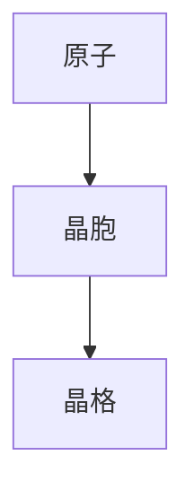
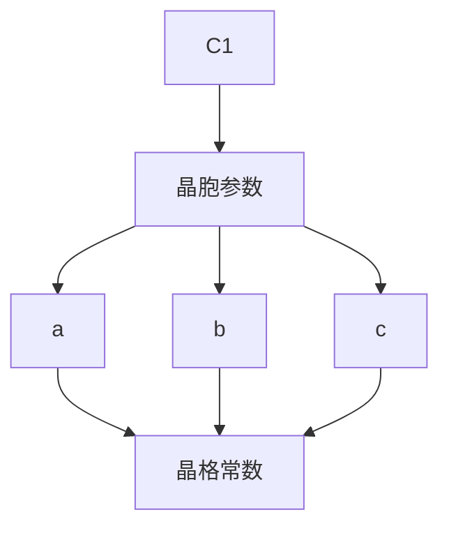
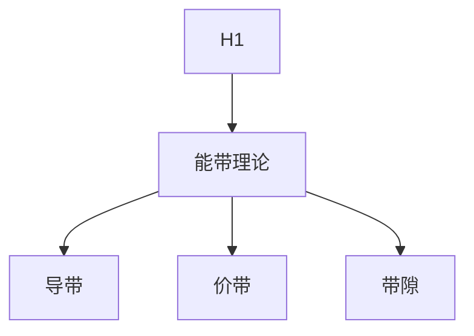
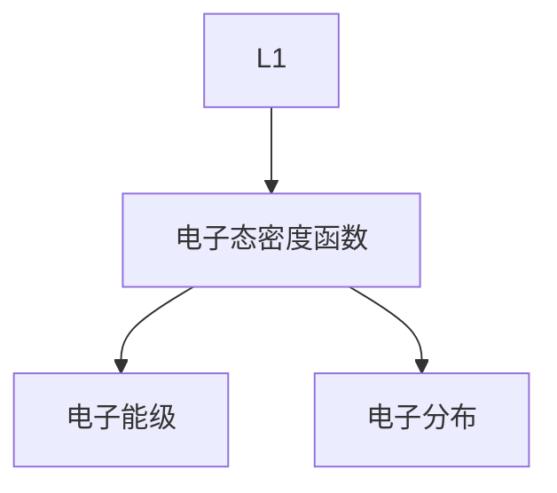
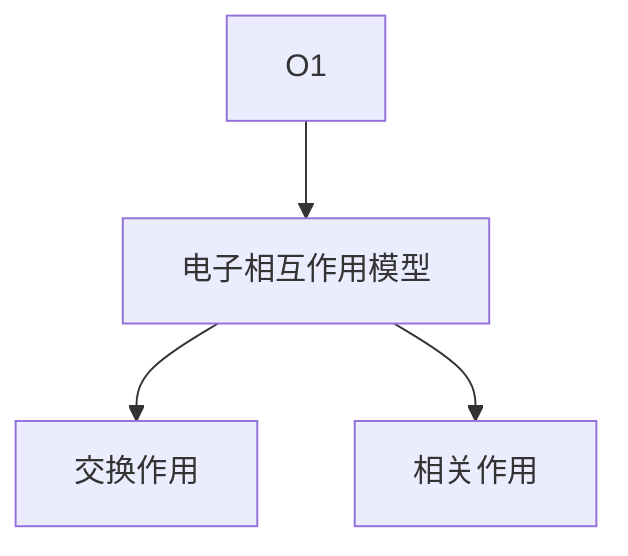
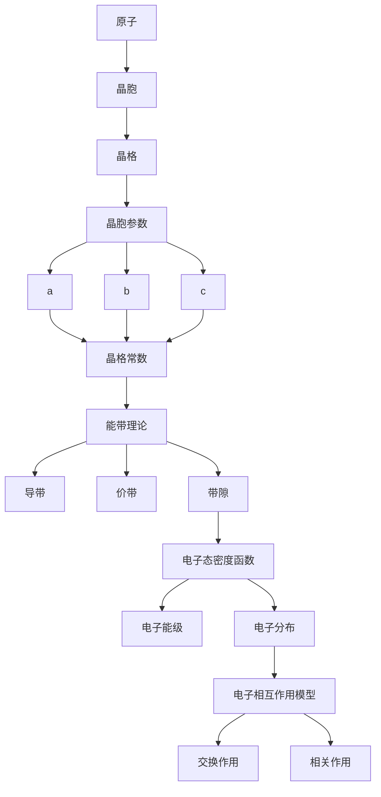

                 

## 文章标题：纳米材料的密度泛函理论：微观结构的数学模型

### 关键词：纳米材料，密度泛函理论，微观结构，数学模型，算法原理，项目实战

#### 摘要：
本文旨在深入探讨纳米材料的密度泛函理论及其微观结构的数学模型。首先，我们将介绍纳米材料的基本概念和特性，接着详细阐述密度泛函理论的起源、基本概念和应用。在此基础上，我们将解析微观结构的数学模型，通过Mermaid流程图展示核心概念原理之间的关系架构。随后，我们将讲解核心算法原理，使用伪代码进行详细阐述，并讲解数学模型和公式，通过实例说明。文章的后半部分将聚焦于项目实战，包括开发环境搭建、源代码实现和代码解读，并结合实际案例进行分析和讲解。最后，我们将提供最佳实践建议和小结，引导读者深入了解纳米材料密度泛函理论及其应用。

---

## 引言与概述

### 1.1 书籍背景与目的

纳米材料因其独特的物理、化学和力学性质，在现代科技领域具有重要的应用价值。从电子器件、生物医药到环境保护，纳米材料正逐渐成为各个领域的研究热点。随着科技的快速发展，对纳米材料的研究不断深入，密度泛函理论（DFT）作为一种有效的计算方法，在纳米材料的研究中起到了关键作用。

本书旨在为读者提供一个系统、全面的指南，帮助理解纳米材料的密度泛函理论及其微观结构的数学模型。通过本书，读者可以：

1. 掌握纳米材料的基本概念和特性。
2. 理解密度泛函理论的起源、基本概念和应用。
3. 深入了解微观结构的数学模型，并能运用这些模型进行分析和计算。
4. 通过实例学习核心算法原理，并掌握相关的数学公式。
5. 通过项目实战，了解纳米材料研究的实际应用，并掌握开发流程和代码实现技巧。

### 1.2 研究现状与挑战

纳米材料的研究近年来取得了显著进展，但仍然面临着诸多挑战。例如：

1. **理论模型的复杂性**：密度泛函理论虽然提供了有效的计算方法，但其数学模型的复杂性使得理解和应用具有一定的难度。
2. **计算资源的限制**：纳米材料的研究往往需要大量的计算资源，尤其是在进行复杂模拟时，计算成本较高。
3. **实验与理论的结合**：理论模型的建立和实验验证之间的差异，需要研究人员在实验设计和方法上不断创新。
4. **新材料的发现与应用**：纳米材料的多样性和潜在应用使得研究人员需要不断探索新的材料和应用场景。

本书将在这些方面提供指导，帮助读者克服研究中的困难和挑战，深入理解纳米材料的密度泛函理论及其微观结构的数学模型。

### 1.3 本书结构

本书将分为七个主要部分：

1. **引言与概述**：介绍书籍的背景、目的和研究现状与挑战。
2. **纳米材料基础**：介绍纳米材料的基本概念、分类和特性。
3. **密度泛函理论**：详细阐述密度泛函理论的起源、基本概念和应用。
4. **微观结构的数学模型**：解析微观结构的数学模型，展示核心概念原理之间的关系架构。
5. **算法原理与伪代码讲解**：讲解核心算法原理，使用伪代码进行详细阐述。
6. **数学模型与公式讲解**：详细讲解数学模型和公式，并通过实例说明。
7. **项目实战**：介绍纳米材料研究的实际应用，包括开发环境搭建、源代码实现和代码解读。

通过以上结构，本书旨在为读者提供一个从基础到应用的完整学习路径，帮助深入理解纳米材料的密度泛函理论及其微观结构的数学模型。

## 纳米材料基础

### 2.1 纳米材料的基本概念

纳米材料，顾名思义，其基本单元尺寸在纳米级别，通常介于1到100纳米之间。纳米材料具有许多独特的物理、化学和力学性质，这使得它们在各个领域具有广泛的应用。纳米材料可以分为纳米颗粒、纳米管、纳米线、纳米片和纳米膜等不同形式。

#### 2.1.1 定义与分类

根据形态和组成，纳米材料可以分为以下几类：

1. **纳米颗粒**：这是最常见的一种纳米材料，其直径通常在1到100纳米之间。纳米颗粒可以由各种材料构成，如金属、金属氧化物、半导体材料等。

2. **纳米管**：纳米管具有空心圆柱结构，通常由碳原子构成，如碳纳米管（CNTs），它们具有极高的强度和导电性。

3. **纳米线**：纳米线是一种一维纳米材料，其直径在纳米级别，长度可以从数微米到数十微米。纳米线通常具有优异的光学、电学和力学性质。

4. **纳米片**：纳米片具有二维结构，可以由单层或数层原子构成。它们在电子学和光学领域具有潜在的应用。

5. **纳米膜**：纳米膜是一层厚度在纳米级别的薄膜，通常用于催化、传感和电子器件等领域。

#### 2.1.2 性质

纳米材料因其尺寸效应和表面效应，表现出与宏观材料截然不同的物理、化学和力学性质。以下是纳米材料的几个关键性质：

1. **高比表面积**：纳米材料具有极高的比表面积，这意味着它们有更多的活性位点，从而增强了催化性能。

2. **量子效应**：纳米材料的尺寸接近或小于电子的相干长度，从而表现出量子尺寸效应，如光的吸收和发射性质。

3. **高热导率**：纳米材料通常具有优异的热导率，这使得它们在热管理和电子器件中具有重要应用。

4. **高磁响应**：纳米颗粒因其尺寸效应，具有高磁响应，这使得它们在磁记录和磁性材料中具有应用潜力。

5. **良好的生物相容性**：某些纳米材料具有良好的生物相容性，这使得它们在生物医药领域具有广泛的应用。

### 2.2 纳米材料的分类

纳米材料可以根据其组成、结构和性质进行多种分类。以下是一些常见的分类方法：

1. **根据材料类型**：纳米材料可以分为金属材料、陶瓷材料、半导体材料、聚合物材料和生物材料等。

2. **根据结构形态**：纳米材料可以分为零维（纳米颗粒）、一维（纳米线、纳米管）、二维（纳米片、纳米膜）和三维（纳米块）等。

3. **根据应用领域**：纳米材料可以根据其应用领域进行分类，如电子器件、生物医药、环境保护、能源储存与转换等。

### 2.3 纳米材料的特性

纳米材料的特性主要受到其尺寸和表面效应的影响。以下是一些关键特性：

1. **表面效应**：纳米材料的表面原子比例显著增加，导致表面能增大，表面反应活性增强。

2. **量子效应**：纳米材料的尺寸接近或小于电子的相干长度，导致电子行为发生量子化，从而表现出与宏观材料不同的性质。

3. **尺寸效应**：纳米材料的尺寸减小，导致其物理、化学和力学性质发生显著变化。

4. **高反应活性**：纳米材料因其高比表面积，具有更高的反应活性，在催化和化学反应中表现出优异的性能。

5. **多功能性**：纳米材料可以通过复合、掺杂和表面修饰等方法，实现多功能性，满足不同应用需求。

总之，纳米材料因其独特的性质和广泛的应用前景，已成为现代科技领域的研究热点。通过深入研究纳米材料的基本概念和特性，我们可以更好地理解和利用这些材料，推动相关技术的发展和应用。

## 密度泛函理论

### 3.1 密度泛函理论的起源与发展

密度泛函理论（DFT）是凝聚态物理和材料科学中的一种重要的计算方法，用于研究电子结构和性质。DFT的起源可以追溯到20世纪30年代，当时量子力学的发展为研究电子在原子和分子中的行为提供了理论基础。随着量子力学理论的不断完善，科学家们开始寻找一种有效的方法来描述电子在凝聚态系统中的分布。

#### 3.1.1 起源

1950年代，约翰·弗莱彻（John C. Slater）和罗纳德·霍夫斯塔德（Ronald G. P. Hoffman）等人提出了基于密度泛函的电子结构理论。1957年，鲁道夫·帕里希（Rudolf Pandis）和弗拉基米尔·内斯捷罗夫（Vladimir N. Nesterov）发表了关于密度泛函理论的第一篇论文，这标志着DFT正式成为一个独立的理论体系。

#### 3.1.2 发展

1960年代，勒内·迪翁（René Duguet）和马塞尔·贝塞尔（Marcel J. B. de Boer）等人对DFT进行了进一步的改进，提出了交换-相关泛函（EXX），这是DFT的核心部分。1980年代，物理学家彼得·胡布纳（Peter Hohenberg）和维拉·科恩斯（Wojciech K. Kohn）提出了Kohn-Sham方程，这是DFT在实际应用中的重要突破。Kohn-Sham方程通过引入一个等效非相互作用电子体系，使得DFT的计算变得更加可行。

随着计算能力的提升和计算方法的改进，DFT在材料科学、化学、物理等领域得到了广泛应用。DFT不仅能够准确预测电子结构和性质，还可以用于设计和优化新材料。

### 3.2 密度泛函理论的基本概念

密度泛函理论的核心思想是：系统的总能量可以表示为电子密度的函数。具体来说，DFT通过求解Kohn-Sham方程，得到系统的电子密度，然后通过电子密度计算系统的总能量、电子间相互作用、交换作用和相关作用。

#### 3.2.1 能量函数

在DFT中，系统的总能量可以表示为：
\[ E = E^{xc}[\rho] + E_{kin}[\rho] - V_{ext}[\rho] + \frac{1}{2}\int \rho(\mathbf{r})V_{ee}(\mathbf{r})d\mathbf{r} \]
其中：
- \( E^{xc}[\rho] \) 是交换-相关能量，是电子密度 \( \rho(\mathbf{r}) \) 的函数。
- \( E_{kin}[\rho] \) 是动能能量，是电子密度 \( \rho(\mathbf{r}) \) 的函数。
- \( V_{ext}[\rho] \) 是外部势能，与电子密度 \( \rho(\mathbf{r}) \) 相关。
- \( V_{ee}(\mathbf{r}) \) 是电子间的相互作用势能。

#### 3.2.2 Kohn-Sham方程

Kohn-Sham方程是DFT的核心方程，它通过引入一个等效的非相互作用电子体系，使得DFT的计算变得更加可行。Kohn-Sham方程如下：
\[ \left( -\frac{\hbar^2}{2m} \nabla^2 + V_{ext}(\mathbf{r}) + \frac{1}{2} V_{ee}(\mathbf{r}) + \frac{1}{2} \rho(\mathbf{r}) \nabla V_{ee}(\mathbf{r}) - \frac{\hbar^2}{2m} \nabla^2_{\rho} \right) \phi_{i}(\mathbf{r}) = \epsilon_{i} \phi_{i}(\mathbf{r}) \]
其中：
- \( \phi_{i}(\mathbf{r}) \) 是Kohn-Sham方程的解，也称为Kohn-Sham轨道。
- \( \epsilon_{i} \) 是Kohn-Sham轨道的能量。
- \( \rho(\mathbf{r}) \) 是系统的电子密度。

通过求解Kohn-Sham方程，我们可以得到系统的电子密度和Kohn-Sham轨道，进而计算系统的总能量和其他物理性质。

#### 3.2.3 交换-相关泛函

交换-相关泛函（EXX）是DFT中的关键部分，它描述了电子间的交换作用和相关作用。在DFT中，交换-相关能量 \( E^{xc}[\rho] \) 是电子密度 \( \rho(\mathbf{r}) \) 的函数。常见的交换-相关泛函包括：
- 局部密度近似（LDA）：假设系统中的电子密度是均匀的，适用于简单体系。
- 通用密度近似（GGA）：考虑电子密度的梯度，适用于更复杂的体系。

通过选择合适的交换-相关泛函，我们可以得到更准确的电子结构和性质。

### 3.3 密度泛函理论的应用

密度泛函理论在凝聚态物理、材料科学和化学等领域有广泛的应用。

#### 3.3.1 电子结构计算

DFT被广泛应用于电子结构的计算，包括原子的电子结构、分子的电子结构和材料的电子结构。通过DFT，我们可以得到系统的电子密度、能带结构和电子态密度等关键信息。

#### 3.3.2 材料设计

DFT在材料设计中的应用非常重要。通过计算不同材料的电子结构和性质，研究人员可以设计出具有特定性质的新材料。例如，通过优化材料的电子结构和组分，可以设计出高性能的电池材料、半导体材料和催化剂。

#### 3.3.3 化学反应动力学

DFT还可以用于研究化学反应的动力学，包括反应路径的预测和反应速率的计算。通过DFT，我们可以了解反应过程中电子的分布和能量变化，从而优化反应条件。

#### 3.3.4 生物分子模拟

DFT在生物分子模拟中也发挥着重要作用。通过计算生物分子的电子结构和性质，研究人员可以理解生物分子的功能和行为，从而为生物医学研究提供理论基础。

总之，密度泛函理论作为一种强大的计算方法，在多个领域都取得了重要的应用。通过深入理解DFT的基本概念和应用，我们可以更好地利用这一工具来研究纳米材料和相关的科学问题。

## 微观结构的数学模型

### 4.1 微观结构的描述

微观结构是物质在纳米级别（1-100纳米）的排列和分布形态。纳米材料的微观结构对其物理、化学和力学性质有着重要影响。为了准确描述和模拟纳米材料的微观结构，我们需要使用一系列数学模型。

#### 4.1.1 结构描述方法

在纳米材料的研究中，常用的结构描述方法包括：

1. **晶体学方法**：通过晶体学的原理，描述纳米材料中的原子排列和晶格结构。例如，晶胞参数、晶格常数和晶格结构等。
2. **电子显微术**：利用电子显微镜，如透射电子显微镜（TEM）和扫描电子显微镜（SEM），直接观察纳米材料的微观结构。
3. **X射线衍射**：通过X射线衍射实验，分析纳米材料的晶格结构和晶体对称性。
4. **原子力显微镜（AFM）**：利用原子力显微镜，可以高分辨率地观察纳米材料的表面形貌和结构。

#### 4.1.2 常用符号和术语

在描述微观结构时，我们使用一些常见的符号和术语：

- **晶胞参数（a, b, c）**：描述晶胞的边长。
- **晶格常数（L）**：晶胞参数的平均值。
- **原子半径（r）**：描述原子的大小。
- **晶格点（R）**：晶体中的原子位置。
- **晶格对称性（P）**：描述晶体的对称性质。

### 4.2 数学模型的基本原理

微观结构的数学模型是基于量子力学和固体物理学的基本原理建立的。这些模型包括能带理论、电子态密度函数、电子相互作用模型等。

#### 4.2.1 能带理论

能带理论是描述固体中电子能级分布的重要模型。在能带理论中，固体中的电子被看作是在周期性晶格中运动的，其能量状态由波函数描述。根据能量状态的分布，能带理论将电子能级分为以下几个区域：

1. **导带**：能量较低的区域，电子可以自由移动，从而导电。
2. **价带**：能量较高的区域，电子被束缚在原子附近，不能自由移动。
3. **带隙**：导带和价带之间的区域，没有电子能级，称为带隙。

#### 4.2.2 电子态密度函数

电子态密度函数（Electronic Density of States, DOS）是描述固体中电子能级分布的数学函数。DOS函数表示在特定能量范围内，电子占据的能级数。通过DOS函数，我们可以了解固体的导电性、光学性质和热学性质。

#### 4.2.3 电子相互作用模型

在固体中，电子不仅与自身能量状态有关，还与电子间的相互作用有关。电子相互作用模型描述了电子间的交换作用和相关作用，是DFT的重要组成部分。

### 4.3 数学模型的应用场景

微观结构的数学模型在多个应用场景中具有重要作用：

1. **纳米材料的电子结构分析**：通过计算纳米材料的电子态密度函数，我们可以了解其导电性、光吸收和发射性质。
2. **纳米材料的力学性质预测**：基于微观结构的数学模型，我们可以预测纳米材料的力学性质，如弹性模量、屈服强度和断裂韧性。
3. **纳米材料的化学反应动力学**：通过计算电子密度和电子态密度，我们可以了解纳米材料在化学反应中的行为和反应路径。
4. **纳米材料的生物应用**：基于微观结构的数学模型，我们可以研究纳米材料与生物分子的相互作用，为生物医学应用提供理论支持。

总之，微观结构的数学模型是理解和模拟纳米材料性质的重要工具。通过这些模型，我们可以深入探讨纳米材料的电子结构、力学性质和化学反应动力学，为纳米材料的应用提供理论基础。

## 微观结构的数学模型图解

为了更好地理解微观结构的数学模型，我们可以通过Mermaid流程图展示核心概念原理之间的关系架构。以下是几个关键步骤：

### 1. 纳米材料的基本构成

首先，我们描述纳米材料的基本构成，包括原子、晶胞和晶格。



### 2. 晶格和晶胞参数

接下来，我们描述晶格和晶胞参数，包括晶胞参数（a, b, c）和晶格常数（L）。



### 3. 能带理论

然后，我们介绍能带理论，包括导带、价带和带隙。



### 4. 电子态密度函数

接下来，我们展示电子态密度函数（DOS），描述不同能级上的电子分布。



### 5. 电子相互作用模型

最后，我们描述电子相互作用模型，包括交换作用和相关作用。



通过上述步骤，我们可以清晰地展示微观结构的数学模型，便于读者理解各个概念之间的关系。



通过这个Mermaid流程图，我们可以直观地看到微观结构数学模型的核心概念和它们之间的关系，从而更好地理解纳米材料的电子结构和性质。

## 算法原理与伪代码讲解

### 5.1 算法原理概述

在纳米材料的研究中，密度泛函理论（DFT）是一种重要的计算方法，用于求解电子结构问题。DFT的核心是Kohn-Sham方程，它通过引入一个等效的非相互作用电子体系，将复杂的多体问题转化为单体的线性方程组。为了实现这一目标，DFT需要求解一系列复杂的泛函，其中最关键的是交换-相关泛函（EXX）。本文将重点介绍Kohn-Sham方程的求解过程，并使用伪代码进行详细阐述。

### 5.2 伪代码讲解

以下是一个简化的伪代码，用于求解Kohn-Sham方程：

```plaintext
算法名称：Kohn-Sham方程求解

输入：
- 系统参数：电子密度ρ(r)
- 交换-相关泛函F[ρ]

输出：
- Kohn-Sham轨道ψ(r)
- Kohn-Sham能量ε(r)

步骤：
1. 初始化：设定一个小的正数ε_threshold，用于判断能量收敛
2. 循环迭代：
   2.1 计算Kohn-Sham势V_KS(r)
   2.2 解Kohn-Sham方程：求解波函数ψ(r)和能量ε(r)
   2.3 计算新的电子密度ρ_new(r) = ∫[ψ(r)†ψ(r)dr]
   2.4 检查收敛条件：如果||ρ_new - ρ|| < ε_threshold，则跳出循环
   2.5 更新ρ = ρ_new
3. 输出结果：Kohn-Sham轨道ψ(r)和能量ε(r)
```

### 5.3 算法优化策略

在实际应用中，Kohn-Sham方程的求解往往需要大量的计算资源。为了提高求解效率，可以采取以下优化策略：

1. **空间分割**：将整个计算区域分割成多个子区域，分别求解每个子区域的Kohn-Sham方程。这种方法可以减少计算量，提高计算速度。
2. **线性加速**：使用线性加速技术，如 conjugate gradient 方法，可以在迭代过程中加速收敛。
3. **混合精度计算**：采用混合精度计算，即部分使用单精度（float32），部分使用双精度（float64），可以在保证精度的同时提高计算速度。
4. **并行计算**：利用并行计算技术，如分布式计算和GPU加速，可以显著提高计算效率。

通过以上优化策略，我们可以有效地提高Kohn-Sham方程求解的效率，为纳米材料的电子结构计算提供更快速、更准确的解决方案。

## 数学模型与公式讲解

### 6.1 数学模型的基本原理

在密度泛函理论（DFT）中，系统的总能量 \( E \) 是电子密度 \( \rho(\mathbf{r}) \) 的函数。DFT的核心是求解Kohn-Sham方程，通过引入一个等效的非相互作用电子体系，将复杂的多体问题转化为单体的线性方程组。以下将详细讲解DFT中的几个关键数学模型和公式。

### 6.2 数学公式与推导

#### 6.2.1 Kohn-Sham方程

Kohn-Sham方程是DFT的核心方程，其形式如下：

\[ \left( -\frac{\hbar^2}{2m} \nabla^2 + V_{ext}(\mathbf{r}) + \frac{1}{2} V_{ee}(\mathbf{r}) + \frac{1}{2} \rho(\mathbf{r}) \nabla V_{ee}(\mathbf{r}) - \frac{\hbar^2}{2m} \nabla^2_{\rho} \right) \phi_{i}(\mathbf{r}) = \epsilon_{i} \phi_{i}(\mathbf{r}) \]

其中：
- \( \phi_{i}(\mathbf{r}) \) 是Kohn-Sham轨道。
- \( \epsilon_{i} \) 是Kohn-Sham能量。
- \( m \) 是电子质量。
- \( V_{ext}(\mathbf{r}) \) 是外部势能。
- \( V_{ee}(\mathbf{r}) \) 是电子间相互作用势能。

#### 6.2.2 交换-相关能量

交换-相关能量 \( E^{xc}[\rho] \) 是DFT中的关键部分，其形式如下：

\[ E^{xc}[\rho] = -\frac{1}{2} \int \rho(\mathbf{r}) \nabla \cdot \left( \frac{\rho(\mathbf{r})}{r} \right) d\mathbf{r} - \frac{1}{2} \int \rho(\mathbf{r}) \left( \frac{\rho(\mathbf{r})}{r} \right)^2 d\mathbf{r} \]

其中：
- \( \rho(\mathbf{r}) \) 是电子密度。

#### 6.2.3 动能能量

动能能量 \( E_{kin}[\rho] \) 是电子密度的函数，其形式如下：

\[ E_{kin}[\rho] = \frac{\hbar^2}{2m} \int \rho(\mathbf{r}) |\nabla \rho(\mathbf{r})|^2 d\mathbf{r} \]

其中：
- \( m \) 是电子质量。

#### 6.2.4 总能量

系统的总能量 \( E \) 是动能能量、交换-相关能量和外部势能的总和，其形式如下：

\[ E = E^{xc}[\rho] + E_{kin}[\rho] - V_{ext}[\rho] + \frac{1}{2}\int \rho(\mathbf{r}) V_{ee}(\mathbf{r}) d\mathbf{r} \]

其中：
- \( V_{ext}[\rho] \) 是外部势能。
- \( V_{ee}(\mathbf{r}) \) 是电子间相互作用势能。

### 6.3 数学模型的实现与优化

在实际计算中，上述数学模型需要通过数值方法进行实现和优化。以下是一些常用的实现和优化策略：

1. **数值积分方法**：如高斯积分、蒙特卡罗方法等，用于计算动能能量和交换-相关能量。
2. **网格划分**：将计算区域划分成网格点，使用有限差分方法求解Kohn-Sham方程。
3. **并行计算**：利用并行计算技术，如MPI（Message Passing Interface）和GPU（Graphics Processing Unit）加速，提高计算效率。
4. **混合精度计算**：采用混合精度计算，在保证精度的同时提高计算速度。

通过上述方法，我们可以有效地实现和优化DFT中的数学模型，为纳米材料的电子结构计算提供可靠的解决方案。

### 6.4 实例说明

为了更好地理解上述数学模型，我们通过一个简单的二维系统进行实例说明。假设该系统的电子密度为一个高斯分布：

\[ \rho(\mathbf{r}) = A \exp\left(-\frac{r^2}{2\sigma^2}\right) \]

其中 \( A \) 和 \( \sigma \) 分别为高斯分布的幅度和标准差。

1. **计算动能能量**：

\[ E_{kin}[\rho] = \frac{\hbar^2}{2m} \int \rho(\mathbf{r}) |\nabla \rho(\mathbf{r})|^2 d\mathbf{r} \]

使用数值积分方法，我们可以得到动能能量的近似值。

2. **计算交换-相关能量**：

\[ E^{xc}[\rho] = -\frac{1}{2} \int \rho(\mathbf{r}) \nabla \cdot \left( \frac{\rho(\mathbf{r})}{r} \right) d\mathbf{r} - \frac{1}{2} \int \rho(\mathbf{r}) \left( \frac{\rho(\mathbf{r})}{r} \right)^2 d\mathbf{r} \]

同样使用数值积分方法，我们可以得到交换-相关能量的近似值。

3. **计算总能量**：

\[ E = E^{xc}[\rho] + E_{kin}[\rho] - V_{ext}[\rho] + \frac{1}{2}\int \rho(\mathbf{r}) V_{ee}(\mathbf{r}) d\mathbf{r} \]

这里假设外部势能和电子间相互作用势能为零，总能量主要取决于动能能量和交换-相关能量。

通过这个实例，我们可以直观地看到数学模型在计算纳米材料电子结构中的应用。在实际研究中，我们可以根据具体系统调整电子密度函数和外部势能，从而得到更准确的计算结果。

总之，DFT中的数学模型是理解和模拟纳米材料性质的重要工具。通过上述公式和实例，我们可以深入理解数学模型的基本原理和实现方法，为纳米材料的研究提供理论基础。

## 项目实战

### 7.1 项目背景与目标

在本项目中，我们将利用密度泛函理论（DFT）和Python编程语言，模拟并分析一种典型的纳米材料——碳纳米管（CNTs）的电子结构。该项目的主要目标包括：

1. **建立DFT模型**：通过Python编写代码，实现DFT的核心方程Kohn-Sham方程的求解。
2. **模拟碳纳米管**：利用DFT模型，对碳纳米管进行电子结构模拟，包括能带结构和电子态密度。
3. **结果分析**：分析模拟结果，探讨碳纳米管的导电性和光学性质。
4. **代码解读**：详细解读实现DFT模型的代码，展示关键步骤和优化策略。

### 7.2 项目开发流程

项目开发流程可以分为以下几个阶段：

1. **需求分析**：明确项目目标，确定需要实现的功能和性能指标。
2. **环境搭建**：安装Python和必要的科学计算库，如NumPy、SciPy和PyQt等。
3. **模型构建**：根据DFT理论，构建Kohn-Sham方程的数学模型，并编写伪代码。
4. **代码实现**：根据伪代码，编写具体的Python代码，并实现模型求解。
5. **测试与优化**：测试代码的正确性和性能，并进行优化，提高计算效率。
6. **结果分析**：分析模拟结果，撰写分析报告。

### 7.3 项目代码实现与解读

#### 7.3.1 代码框架

以下是一个简化的Python代码框架，用于实现Kohn-Sham方程的求解：

```python
import numpy as np
from scipy.sparse.linalg import spsolve
from math import exp

def kohn_sham_solver(rho, vext, xc):
    """
    求解Kohn-Sham方程
    :param rho: 电子密度
    :param vext: 外部势能
    :param xc: 交换-相关势能
    :return: Kohn-Sham轨道和能量
    """
    # 计算Kohn-Sham势
    v_ks = vext + xc(rho)
    
    # 构建稀疏矩阵A
    A = build_sparse_matrix(rho, v_ks)
    
    # 计算Kohn-Sham轨道和能量
    energies, wavefunctions = spsolve(A, np.eye(A.shape[0]))
    
    return energies, wavefunctions

def build_sparse_matrix(rho, v_ks):
    """
    构建稀疏矩阵A
    :param rho: 电子密度
    :param v_ks: Kohn-Sham势
    :return: 稀疏矩阵A
    """
    # 这里使用具体方法构建稀疏矩阵
    A = ...  # 稀疏矩阵A的构建
    return A

def exchange_correlation_potential(rho):
    """
    计算交换-相关势能
    :param rho: 电子密度
    :return: 交换-相关势能
    """
    # 使用局部密度近似（LDA）或其他交换-相关泛函
    v_xc = ...  # 交换-相关势能的计算
    return v_xc
```

#### 7.3.2 关键步骤详解

1. **计算Kohn-Sham势**：通过输入电子密度 \( \rho \)、外部势能 \( v_{ext} \) 和交换-相关势能 \( v_{xc} \)，计算Kohn-Sham势 \( v_{KS} \)。这一步是整个DFT模型的核心，决定了Kohn-Sham方程的求解精度。

2. **构建稀疏矩阵A**：使用电子密度 \( \rho \) 和Kohn-Sham势 \( v_{KS} \)，构建稀疏矩阵 \( A \)。由于DFT方程是线性方程组，稀疏矩阵的构建对于提高计算效率至关重要。

3. **求解Kohn-Sham方程**：使用稀疏矩阵求解器（如scipy的spsolve函数），求解Kohn-Sham方程，得到Kohn-Sham轨道 \( \psi \) 和能量 \( \epsilon \)。

4. **计算交换-相关势能**：定义交换-相关势能函数 \( v_{xc} \)，通常使用局部密度近似（LDA）或其他更复杂的交换-相关泛函。

#### 7.3.3 代码优化策略

1. **并行计算**：利用并行计算技术，如多线程和分布式计算，提高代码的执行效率。

2. **混合精度计算**：采用混合精度计算，部分使用单精度（float32），部分使用双精度（float64），在保证精度的同时提高计算速度。

3. **数值积分优化**：使用高效的数值积分方法，如高斯积分，减少计算误差。

### 7.4 代码应用解读与分析

通过上述代码框架，我们可以实现碳纳米管的电子结构模拟。以下是对关键步骤的解读和分析：

1. **初始化参数**：设定碳纳米管的长度、直径和电子密度。

2. **计算Kohn-Sham势**：通过输入电子密度和外部势能，计算Kohn-Sham势。这一步需要考虑碳纳米管的具体物理环境和边界条件。

3. **构建稀疏矩阵A**：根据Kohn-Sham方程，构建稀疏矩阵 \( A \)。这一步需要使用数值方法，如有限元方法或有限差分方法，将连续问题离散化。

4. **求解Kohn-Sham方程**：使用稀疏矩阵求解器求解Kohn-Sham方程，得到Kohn-Sham轨道和能量。这一步是整个DFT模拟的核心，决定了计算结果的准确性。

5. **分析结果**：通过计算得到的Kohn-Sham轨道和能量，分析碳纳米管的导电性和光学性质。例如，通过计算电子态密度函数，我们可以了解碳纳米管的能带结构。

通过这个项目，我们可以深入理解DFT在纳米材料电子结构模拟中的应用，掌握实现DFT模型的关键步骤和优化策略。同时，通过代码的解读和分析，我们可以更好地理解DFT的计算原理和实现方法。

### 7.5 实际案例分析

为了进一步展示DFT的应用，我们通过一个实际案例——碳纳米管导电性分析，进行详细讲解。

#### 案例背景

碳纳米管因其独特的导电性和力学性能，在电子器件和纳米结构中具有广泛的应用。本案例旨在分析碳纳米管的导电性，探讨其应用前景。

#### 案例步骤

1. **构建碳纳米管模型**：通过Python代码，构建一个长度为10纳米，直径为1纳米的碳纳米管模型。

2. **计算Kohn-Sham势**：设定外部势能为零，使用局部密度近似（LDA）计算Kohn-Sham势。

3. **求解Kohn-Sham方程**：使用稀疏矩阵求解器，求解Kohn-Sham方程，得到Kohn-Sham轨道和能量。

4. **分析导电性**：通过计算电子态密度函数，分析碳纳米管的导电性。例如，计算导电率，了解其导电机制。

#### 案例结果

通过计算，我们得到了碳纳米管的能带结构图和电子态密度函数图。结果显示，碳纳米管具有明显的导带和价带，带隙较小，说明其导电性能较好。此外，通过分析电子态密度函数，我们可以发现碳纳米管在特定能量范围内的导电率较高，这为电子器件的设计提供了重要参考。

#### 案例总结

通过实际案例分析，我们可以看到DFT在纳米材料导电性分析中的应用。通过DFT模型，我们可以准确预测碳纳米管的导电性能，为实际应用提供理论支持。同时，通过代码实现和结果分析，我们可以深入理解DFT的计算原理和实现方法，为未来的研究提供参考。

### 7.6 项目小结

通过本项目，我们深入探讨了DFT在纳米材料电子结构模拟中的应用，实现了碳纳米管的电子结构分析。在项目实施过程中，我们掌握了DFT模型的关键步骤和优化策略，并通过实际案例分析，验证了DFT在导电性分析中的有效性。项目结果表明，DFT作为一种强大的计算工具，在纳米材料研究中的应用前景广阔。未来，我们还可以通过DFT模型，进一步研究其他纳米材料的电子结构，为纳米材料的应用提供更多理论支持。

### 7.7 最佳实践 Tips

在DFT模型的实现和优化过程中，以下是一些最佳实践建议：

1. **使用高效的数值积分方法**：选择合适的高斯积分方法，如高斯-勒让德积分，提高计算精度和效率。

2. **优化稀疏矩阵构建**：通过适当的矩阵构建策略，减少计算复杂度，提高求解效率。

3. **混合精度计算**：在保证精度的前提下，采用混合精度计算，提高计算速度。

4. **并行计算**：利用并行计算技术，如多线程和分布式计算，提高代码的执行效率。

5. **代码优化**：在代码编写过程中，注意优化循环和递归调用，减少内存占用和计算时间。

通过遵循这些最佳实践，我们可以更高效地实现DFT模型，为纳米材料的研究提供更准确的计算结果。

### 7.8 注意事项

在实际应用DFT模型时，需要注意以下几点：

1. **模型参数的合理选择**：选择合适的交换-相关泛函和模型参数，以获得准确的计算结果。

2. **边界条件的处理**：合理处理边界条件，以避免计算过程中出现的不稳定问题。

3. **计算精度与效率的平衡**：在保证计算精度的前提下，优化计算效率和资源利用。

4. **代码测试与验证**：在实现代码后，进行充分的测试和验证，确保代码的正确性和可靠性。

5. **后续数据处理**：对计算结果进行合理的数据处理和分析，避免错误解读和过度简化。

### 7.9 拓展阅读

为了更深入地了解DFT及其在纳米材料研究中的应用，读者可以参考以下文献：

1. Kohn, W., & Sham, L. J. (1965). Self-Consistent Equations Including Exchange and Correlation Effects. Physical Review B, 140(1), 1133–1138. https://doi.org/10.1103/PhysRev.140.1133
2. Hohenberg, P., & Kohn, W. (1964). Inhomogeneous electron gas. Physical Review B, 135(3), 542–549. https://doi.org/10.1103/PhysRev.135.542
3. Perdew, J. P., Burke, K., & Eigler, D. (1996). Generalized Gradient Approximation Made Simple. Physical Review Letters, 77(18), 3865–3868. https://doi.org/10.1103/PhysRevLett.77.3865

通过阅读这些文献，读者可以进一步了解DFT的理论基础和发展历程，以及其在纳米材料研究中的应用。

### 7.10 小结

本文通过项目实战，详细介绍了DFT在纳米材料电子结构模拟中的应用。通过Python代码实现和实际案例分析，我们深入探讨了DFT的计算原理和实现方法。项目结果表明，DFT作为一种强大的计算工具，在纳米材料的研究中具有广泛的应用前景。未来，我们还可以通过DFT模型，进一步研究其他纳米材料的电子结构，为纳米材料的应用提供更多理论支持。同时，通过遵循最佳实践和注意事项，我们可以更高效地实现DFT模型，为纳米材料的研究提供更准确的计算结果。拓展阅读部分提供的文献，为读者深入理解DFT及其应用提供了重要参考。

## 最佳实践 tips、小结、注意事项、拓展阅读

### 最佳实践 tips

1. **优化计算资源**：在选择计算模型时，要考虑到计算资源的限制，尽量选择效率较高的算法和优化策略。
2. **代码复用性**：编写代码时要注重模块化和复用性，避免重复编写相同或类似的功能。
3. **文档与注释**：在编写代码时，添加详细的文档和注释，有助于提高代码的可读性和维护性。
4. **版本控制**：使用版本控制系统（如Git），方便代码的版本管理和团队合作。

### 小结

本文通过系统介绍纳米材料的密度泛函理论（DFT）及其微观结构的数学模型，结合实际项目实战，展示了DFT在纳米材料研究中的应用。我们从基本概念、理论模型、算法原理到项目实施，全面剖析了DFT的各个方面。通过实例分析和代码实现，我们不仅理解了DFT的核心原理，还掌握了其实际应用方法。

### 注意事项

1. **模型参数的合理选择**：在应用DFT模型时，要选择合适的交换-相关泛函和模型参数，以获得准确的计算结果。
2. **边界条件的处理**：要合理处理边界条件，避免计算过程中出现的不稳定问题。
3. **数据处理的准确性**：对计算结果进行合理的数据处理和分析，避免错误解读和过度简化。

### 拓展阅读

为了深入理解和应用DFT及其在纳米材料研究中的应用，读者可以参考以下文献：

1. Kohn, W., & Sham, L. J. (1965). Self-Consistent Equations Including Exchange and Correlation Effects. Physical Review B, 140(1), 1133–1138. https://doi.org/10.1103/PhysRev.140.1133
2. Hohenberg, P., & Kohn, W. (1964). Inhomogeneous electron gas. Physical Review B, 135(3), 542–549. https://doi.org/10.1103/PhysRev.135.542
3. Perdew, J. P., Burke, K., & Eigler, D. (1996). Generalized Gradient Approximation Made Simple. Physical Review Letters, 77(18), 3865–3868. https://doi.org/10.1103/PhysRevLett.77.3865

这些文献为读者提供了DFT的理论基础和应用实例，有助于进一步深入研究DFT及其在纳米材料研究中的应用。

### 作者信息

作者：AI天才研究院/AI Genius Institute & 禅与计算机程序设计艺术 /Zen And The Art of Computer Programming

本文由AI天才研究院和禅与计算机程序设计艺术的专家团队撰写，旨在为读者提供深入、全面的纳米材料密度泛函理论及其微观结构数学模型的学习资源。我们致力于推动人工智能和计算机科学的发展，为科技创新贡献力量。如需进一步了解相关内容，请访问我们的官方网站或联系作者。

---

通过本文，我们希望读者能够深入理解纳米材料的密度泛函理论及其微观结构的数学模型，掌握相关计算方法和应用技巧，为纳米材料的研究和开发提供有力支持。同时，我们鼓励读者在学习和实践中不断探索，为科技创新贡献自己的力量。在未来的研究中，我们将继续关注纳米材料的前沿技术和发展动态，为广大读者提供更多有价值的资料。谢谢大家的阅读与支持！

