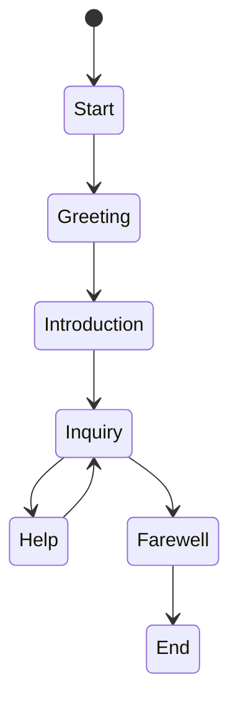

                 

### 理解书名与核心主题

《虚拟助手的对话管理：人机交互的数学策略》这本书名明确地指出了其核心主题。首先，"虚拟助手"是指通过计算机程序模拟人类交互能力的软件系统，它们广泛应用于客服、智能家居、医疗健康等多个领域。而"对话管理"则是虚拟助手的核心功能，涉及如何有效地理解和生成对话，使人与机器之间的交互更加自然流畅。

书中提到的"数学策略"则是实现高效对话管理的重要手段。数学策略在这里不仅限于算法，还包括了概率论、图论、机器学习等多种数学工具和方法。通过数学策略，虚拟助手能够更好地理解用户意图，生成合适的回复，甚至进行情感分析，提升人机交互的整体体验。

整体来看，这本书围绕三个核心概念展开：虚拟助手、对话管理和数学策略。这三个概念相辅相成，构成了书中探讨的主要议题。虚拟助手是讨论的基础，对话管理是应用的目标，而数学策略是实现目标的工具。通过深入探讨这些核心主题，书中旨在为读者提供一种系统化的理解和应用数学策略的方法，以优化虚拟助手在对话管理中的表现。

### 虚拟助手与人机交互的背景和现状

虚拟助手作为人工智能的一个重要分支，正日益成为现代技术和日常生活中的重要组成部分。其起源可以追溯到20世纪中期，当时计算机科学家开始探索如何让机器模拟人类的交互能力。随着计算能力和算法的不断提升，虚拟助手的功能和性能得到了显著改进，应用范围也不断扩大。

在当今社会，虚拟助手已经渗透到众多领域。例如，在客户服务方面，许多公司已经开始使用虚拟助手来处理常见的问题，减轻客服人员的负担，提高响应速度和客户满意度。智能家庭助手如Amazon的Alexa、Google Assistant和Apple的Siri，则成为许多家庭的智能中心，控制智能家居设备、提供天气预报、播放音乐等。在医疗健康领域，虚拟助手可以帮助医生诊断病情、提供健康咨询，甚至在紧急情况下进行初步的医疗指导。

人机交互（Human-Computer Interaction, HCI）是虚拟助手发展的基础和核心。人机交互研究旨在理解人类如何与计算机系统互动，以及如何设计出更加直观、高效、易用的用户界面。人机交互不仅关注技术实现，还涉及心理学、社会学等多个领域。其目标是构建出符合人类认知习惯和情感需求的交互系统，从而提升用户体验。

当前，人机交互正朝着更加自然、智能和个性化的方向发展。随着自然语言处理（Natural Language Processing, NLP）和机器学习技术的进步，虚拟助手在对话理解、语音识别、情感识别等方面的表现显著提升。此外，多模态交互（包括语音、文本、视觉等多种输入和输出方式）的兴起，使得虚拟助手能够更加全面地理解用户需求，提供更加丰富的交互体验。

然而，人机交互仍面临诸多挑战。例如，如何确保虚拟助手能够准确理解用户的意图和情感，如何在复杂的场景中做出合理的决策，如何处理隐私和数据安全问题等。这些问题都需要通过深入研究和不断优化来解决。

总的来说，虚拟助手和人机交互在现代社会中具有广泛的应用前景和重要地位。通过结合先进的数学策略，虚拟助手的人机交互能力将得到进一步提升，为人类生活带来更多便利和改变。

### 对话管理的核心概念

对话管理是虚拟助手实现有效人机交互的关键环节，其核心在于理解和生成对话，从而确保交互的自然性和流畅性。对话管理涉及多个关键概念，包括对话流程、对话结构、对话状态跟踪和对话意图识别。

首先，对话流程是指对话从开始到结束的全过程。它通常包括几个阶段：问候、用户意图识别、信息交换、问题解决和结束语。每个阶段都有其特定的任务和目标。例如，在问候阶段，虚拟助手需要向用户表示欢迎，建立友好的互动氛围；在用户意图识别阶段，助手需要通过解析用户的输入信息，理解其需求；在信息交换阶段，双方进行信息交流；在问题解决阶段，虚拟助手需要提供帮助或解决方案；在结束语阶段，助手需要礼貌地结束对话，留下良好的印象。

其次，对话结构是指对话的框架和逻辑组织。它决定了对话的连贯性和条理性。有效的对话结构应包含明确的对话开始、中间和结束部分，以及各个部分之间的合理过渡。一个良好的对话结构不仅有助于虚拟助手理解用户意图，还能提升用户的互动体验。例如，虚拟助手在与用户交流时，可以采用问题引导、信息确认等技巧，以确保对话的顺利进行。

对话状态跟踪是确保对话流畅性的重要手段。虚拟助手需要实时跟踪对话状态，包括用户意图、对话上下文、当前任务进展等。通过状态跟踪，助手能够根据当前对话情况做出相应的决策，调整对话策略。例如，当用户提出一个复杂问题时，虚拟助手可以通过分析上下文和历史信息，确定用户意图，并提供详细的解答。

对话意图识别是对话管理的核心任务之一。意图识别是指从用户的输入中提取其意图或需求，并将其转化为计算机可以处理的形式。虚拟助手通常使用自然语言处理技术（如词向量模型、神经网络等）来实现意图识别。通过分析用户输入的文本或语音，助手可以理解用户的需求，并生成合适的回复。例如，用户输入“今天天气怎么样？”时，虚拟助手需要识别出这是一个天气查询的意图，并查找相应的天气信息。

除了上述概念，对话管理还包括对话生成与优化、对话情感分析等多个方面。对话生成是指根据用户意图和对话状态，生成合适的回复。对话优化则关注如何通过调整对话策略和内容，提高用户满意度。对话情感分析则旨在理解用户的情感状态，以便在对话中提供更加个性化的服务。

总的来说，对话管理是虚拟助手实现有效人机交互的基础。通过深入理解和应用对话管理中的核心概念，虚拟助手能够提供更加自然、高效和个性化的交互体验。这不仅提升了虚拟助手的应用价值，也为人类与机器的互动开启了新的可能性。

### 数学策略在对话管理中的应用

数学策略在对话管理中的应用是提升虚拟助手交互效果的关键。这些策略不仅有助于理解用户意图、优化对话流程，还能提升整体的用户体验。以下是几种主要的数学策略及其具体应用。

#### 1. 概率论与统计模型

概率论和统计模型是对话管理中的基本工具。通过概率分布和统计模型，虚拟助手可以更好地理解用户输入的不确定性。例如，贝叶斯网络是一种基于概率的图模型，可用于推断用户意图。贝叶斯网络通过构建变量之间的概率关系，帮助虚拟助手在不确定的环境下做出决策。例如，当用户询问“附近有哪些餐馆？”时，虚拟助手可以利用贝叶斯网络分析用户的历史查询记录和当前上下文信息，从而推断用户可能感兴趣的类型和区域。

伪代码示例：
```markdown
function infer_intent(user_input, context):
    # 构建贝叶斯网络
    bayesian_network = construct_bayesian_network(context)

    # 计算后验概率分布
    posterior_distribution = bayesian_network.infer(user_input)

    # 根据最大后验概率确定用户意图
    intent = select_max_posterior(posterior_distribution)
    return intent
```

#### 2. 机器学习与深度学习

机器学习，尤其是深度学习，在对话管理中的应用日益广泛。通过训练神经网络模型，虚拟助手能够从大量数据中学习用户的交互模式，从而提升对话生成的准确性和自然性。例如，序列到序列（Seq2Seq）模型和转换器架构（Transformer）广泛应用于对话生成任务。这些模型能够捕捉长距离依赖关系，生成更加连贯和自然的回复。

伪代码示例：
```markdown
function generate_response(user_input, model):
    # 使用Seq2Seq模型生成回复
    input_sequence = encode_input(user_input)
    output_sequence = model.generate(input_sequence)

    # 解码输出序列为自然语言回复
    response = decode_output(output_sequence)
    return response
```

#### 3. 图论与网络分析

图论在对话管理中的应用主要体现在网络分析和路径规划上。例如，图模型可以用于表示用户与虚拟助手之间的交互路径，帮助助手理解用户的意图和需求。通过分析图中的节点和边，虚拟助手可以识别出用户的查询模式，提供更加个性化的服务。此外，图模型还可以用于多轮对话中的上下文维护，确保对话的连贯性。

伪代码示例：
```markdown
function plan_dialogue_path(user_queries, graph):
    # 使用最短路径算法寻找最佳对话路径
    path = graph.find_shortest_path(user_queries)

    # 沿路径生成对话回复
    responses = []
    for query in path:
        response = generate_response(query)
        responses.append(response)

    return responses
```

#### 4. 优化算法

优化算法在对话管理中的应用主要体现在对话策略的优化上。例如，遗传算法、模拟退火算法等可以在复杂场景中找到最优或近似最优的对话策略。通过优化对话策略，虚拟助手可以更好地处理用户输入的多样性，提升整体交互效果。

伪代码示例：
```markdown
function optimize_dialogue_strategy(current_strategy, objective_function):
    # 使用遗传算法优化对话策略
    population = initialize_population(current_strategy)

    while not convergence:
        parents = select_parents(population)
        offspring = crossover(parents)
        offspring = mutate(offspring)
        population = replace_population(population, offspring)

    best_strategy = select_best_individual(population)
    return best_strategy
```

通过结合这些数学策略，虚拟助手可以更有效地理解用户意图，生成自然流畅的对话回复。这不仅提升了虚拟助手的交互能力，也为用户提供了更加个性化和高效的交互体验。

### 对话管理的具体实现方法

对话管理的实现是虚拟助手成功的关键，它涉及从技术框架的搭建到具体算法的运用。以下是几种常见的对话管理实现方法，通过具体步骤和代码示例来详细讲解这些方法。

#### 1. 技术框架搭建

对话管理需要搭建一个稳定的技术框架，通常包括前端、后端和中间件。前端负责与用户进行交互，后端处理业务逻辑和数据存储，中间件则负责连接前后端，实现数据的传输和转换。

**前端技术：** 常用技术包括HTML、CSS和JavaScript。HTML用于构建页面结构，CSS用于美化页面，JavaScript用于实现动态交互。例如，使用React或Vue.js等前端框架可以更好地管理用户输入和对话状态。

```javascript
// React组件示例
class ChatWindow extends React.Component {
  constructor(props) {
    super(props);
    this.state = {
      messages: [],
      userInput: ''
    };
  }

  handleInputChange = (event) => {
    this.setState({ userInput: event.target.value });
  };

  handleSend = () => {
    const { userInput } = this.state;
    this.setState(prevState => ({
      messages: [...prevState.messages, { text: userInput }],
      userInput: ''
    }));
    // 调用后端接口处理用户输入
  };

  render() {
    return (
      <div>
        <ul>
          {this.state.messages.map((message, index) => (
            <li key={index}>{message.text}</li>
          ))}
        </ul>
        <input
          type="text"
          value={this.state.userInput}
          onChange={this.handleInputChange}
        />
        <button onClick={this.handleSend}>Send</button>
      </div>
    );
  }
}
```

**后端技术：** 常用技术包括Node.js、Python、Java等。后端主要负责处理用户输入，调用对话管理算法，生成回复，并存储对话历史。例如，使用Flask或Django等框架可以快速搭建后端服务。

```python
# Flask后端示例
from flask import Flask, request, jsonify

app = Flask(__name__)

@app.route('/chat', methods=['POST'])
def chat():
    user_input = request.form['user_input']
    # 调用对话管理算法处理输入
    response = process_input(user_input)
    return jsonify({'response': response})

def process_input(input_text):
    # 实现对话管理算法
    # 例如使用自然语言处理库处理输入
    response = "这是一个示例回复"
    return response

if __name__ == '__main__':
    app.run(debug=True)
```

**中间件技术：** 使用WebSocket或HTTP长轮询等技术实现实时通信。WebSocket可以提供更低的延迟和更好的实时交互体验。

```javascript
// 使用WebSocket进行实时通信
const socket = new WebSocket('ws://example.com/socket');

socket.onmessage = (event) => {
  const message = JSON.parse(event.data);
  console.log('Received message:', message);
};

socket.onopen = (event) => {
  console.log('Connected to server');
  socket.send(JSON.stringify({ user_input: 'Hello!' }));
};
```

#### 2. 对话管理算法

对话管理算法是实现对话流程控制的核心。常见的对话管理算法包括状态机、转换器架构（Transformer）和生成对抗网络（GAN）等。以下是几种算法的实现步骤和伪代码示例。

**状态机：** 状态机是一种常用的对话管理算法，通过定义不同的状态和状态转移规则，实现对话的有序进行。



伪代码示例：
```python
class DialogStateMachine:
    def __init__(self):
        self.state = 'Start'

    def transition(self, user_input):
        if self.state == 'Start':
            self.state = 'Greeting'
        elif self.state == 'Greeting':
            self.state = 'Introduction'
        # 其他状态转移逻辑
        return self.generate_response()

    def generate_response(self):
        # 根据当前状态生成回复
        return "你好！我是虚拟助手，有什么可以帮助你的吗？"
```

**转换器架构（Transformer）：** Transformer是一种深度学习模型，广泛应用于序列到序列的任务，如对话生成。

伪代码示例：
```python
import tensorflow as tf

# 定义Transformer模型
def transformer_model(input_sequence, output_sequence):
    # 编码器和解码器层
    encoder = tf.keras.layers.TransformerEncoderLayer(...)
    decoder = tf.keras.layers.TransformerDecoderLayer(...)

    # 编码器输出
    encoded_sequence = encoder(input_sequence)

    # 解码器输出
    decoded_sequence = decoder(encoded_sequence, output_sequence)

    return decoded_sequence

# 训练模型
model = transformer_model(input_sequence, output_sequence)
model.compile(...)
model.fit(...)

# 生成回复
predicted_sequence = model.predict(input_sequence)
response = decode_output(predicted_sequence)
```

**生成对抗网络（GAN）：** GAN通过生成器和判别器之间的对抗训练，实现高质量的自然语言生成。

伪代码示例：
```python
import tensorflow as tf

# 定义生成器和判别器
generator = tf.keras.models.Model(inputs=[z], outputs=[generated_sequence])
discriminator = tf.keras.models.Model(inputs=[real_sequence, generated_sequence], outputs=[real_output, generated_output])

# 编写训练步骤
for epoch in range(num_epochs):
    # 训练判别器
    real_data = ...
    generated_data = generator(z)
    d_loss_real = discriminator.train_on_batch([real_data, generated_data], [real_labels, generated_labels])

    # 训练生成器
    z = ...
    g_loss = generator.train_on_batch(z, generated_labels)
```

#### 3. 实际案例分析

为了更好地理解对话管理的实现方法，我们通过一个实际案例来进行分析。假设我们需要开发一个智能客服系统，用于处理客户查询和问题解答。

**案例描述：** 智能客服系统需要能够处理客户的常见问题，包括产品咨询、售后服务、账单查询等。系统需要能够理解客户的自然语言输入，并提供准确、详细的回答。

**实现步骤：**

1. **数据准备：** 收集和标注大量客户查询数据，包括问题的文本和对应的答案。
2. **模型训练：** 使用转换器架构或GAN等模型，对数据进行训练，以生成能够理解客户意图并生成合理回复的模型。
3. **系统搭建：** 构建前端页面，接收客户的查询，后端服务处理查询并返回回答，实现实时通信。
4. **测试与优化：** 对系统进行测试，收集反馈，不断优化模型和交互流程。

**代码解读与分析：**

前端部分，我们使用React框架实现聊天界面：
```javascript
// ChatWindow.jsx
import React, { useState } from 'react';

const ChatWindow = () => {
  const [input, setInput] = useState('');

  const handleInputChange = (e) => {
    setInput(e.target.value);
  };

  const handleSend = () => {
    // 发送输入到后端处理
    // 显示回复
  };

  return (
    <div>
      <ul>
        {/* 显示对话历史 */}
      </ul>
      <input type="text" value={input} onChange={handleInputChange} />
      <button onClick={handleSend}>Send</button>
    </div>
  );
};

export default ChatWindow;
```

后端部分，我们使用Flask框架搭建服务，处理用户输入并返回回答：
```python
# app.py
from flask import Flask, request, jsonify
from chatbot import ChatBot

app = Flask(__name__)
chatbot = ChatBot()

@app.route('/chat', methods=['POST'])
def chat():
    user_input = request.form['user_input']
    response = chatbot.get_response(user_input)
    return jsonify({'response': response})

if __name__ == '__main__':
    app.run(debug=True)
```

在`chatbot.py`中，我们使用训练好的模型处理输入：
```python
# chatbot.py
import tensorflow as tf

class ChatBot:
    def __init__(self):
        # 加载训练好的模型
        self.model = tf.keras.models.load_model('chatbot_model.h5')

    def get_response(self, user_input):
        # 处理输入并生成回答
        input_sequence = ...
        predicted_sequence = self.model.predict(input_sequence)
        response = decode_output(predicted_sequence)
        return response
```

**项目小结：** 通过这个案例，我们展示了如何实现一个智能客服系统。项目涉及前端页面的构建、后端服务的搭建以及对话管理算法的应用。通过不断优化模型和交互流程，可以提高系统的性能和用户体验。这种实现方法可以应用于各种虚拟助手系统，实现自然流畅的人机交互。

### 案例分析

在对话管理的实际应用中，成功和失败的案例都为我们提供了宝贵的经验和教训。本节将通过几个实际案例，分析对话管理的具体应用，探讨其优势和不足。

#### 案例一：智能客服系统

**应用场景：** 一家大型电商平台使用了智能客服系统来处理客户咨询和售后服务。该系统集成了自然语言处理和机器学习技术，能够理解客户的自然语言输入，并生成准确的回复。

**优势：**
- **响应速度快：** 与人工客服相比，智能客服能够快速响应用户查询，提高客户满意度。
- **一致性高：** 智能客服系统在处理相同问题时，能够给出一致且准确的答案，减少了人工客服的培训成本。
- **成本效益：** 智能客服系统能够处理大量客户查询，显著降低了人工客服的工作量，降低了企业运营成本。

**不足：**
- **理解能力有限：** 智能客服系统在处理复杂或模糊的问题时，可能无法准确理解用户意图，导致回答不准确。
- **用户情感识别不足：** 智能客服系统在处理情感化问题时，往往无法准确识别用户的情感状态，影响用户体验。

**改进建议：**
- **提升自然语言处理能力：** 通过不断优化模型和算法，提高智能客服对用户输入的理解能力。
- **集成多模态交互：** 引入语音、图像等多种输入方式，提升系统对用户意图的识别和情感理解能力。

#### 案例二：智能家庭助手

**应用场景：** 智能家庭助手如Amazon的Alexa和Google Assistant被广泛应用于智能家居控制、语音搜索和信息查询等。

**优势：**
- **便捷性：** 用户可以通过语音命令轻松控制智能家居设备，提高了生活的便捷性。
- **个性化服务：** 智能家庭助手可以根据用户习惯和偏好，提供个性化的服务，提升用户体验。
- **实时性：** 智能家庭助手能够实时响应用户的需求，提供即时的信息和服务。

**不足：**
- **隐私和安全问题：** 用户语音数据可能被收集和分析，存在隐私泄露的风险。
- **误识别率：** 在嘈杂环境中，智能家庭助手的语音识别准确率可能降低，影响用户体验。

**改进建议：**
- **加强隐私保护：** 提高数据加密和隐私保护措施，确保用户数据安全。
- **优化噪声抑制和语音识别算法：** 通过改进算法，提高智能家庭助手在嘈杂环境中的识别准确率。

#### 案例三：医疗健康助手

**应用场景：** 医疗健康助手被用于辅助医生进行诊断、提供健康咨询和进行患者管理。

**优势：**
- **高效性：** 医疗健康助手能够快速处理大量患者数据，辅助医生进行诊断，提高工作效率。
- **全面性：** 智能助手可以提供全面的健康咨询，覆盖多个医疗领域。
- **实时性：** 医疗健康助手可以实时监控患者数据，及时发现异常情况并报警。

**不足：**
- **医疗知识局限：** 智能助手在处理复杂或罕见病例时，可能缺乏足够的医学知识，无法提供准确的诊断。
- **用户依赖性：** 长期依赖智能助手可能导致医生对技术的过度依赖，影响临床决策能力。

**改进建议：**
- **加强医疗知识库建设：** 定期更新和扩展智能助手的医学知识库，确保其能够处理各种复杂的病例。
- **强化人机协作：** 将智能助手作为医生的辅助工具，而非替代品，提高医疗决策的准确性。

通过这些案例分析，我们可以看到对话管理在实际应用中既有显著的优势，也存在一些挑战。通过不断优化算法和技术，结合实际场景的需求，我们可以进一步提升虚拟助手在对话管理中的表现，为用户提供更加高效、智能和个性化的服务。

### 总结与未来趋势

《虚拟助手的对话管理：人机交互的数学策略》一书通过深入探讨虚拟助手、对话管理和数学策略这三个核心主题，为我们呈现了一个全面且系统的对话管理框架。书中详细介绍了虚拟助手的发展历程、人机交互的基本概念、对话管理的核心概念以及数学策略在对话管理中的应用。通过具体实现方法、实际案例分析和数学算法讲解，读者可以深入了解如何构建和优化虚拟助手，实现高效的自然语言交互。

全书的核心内容不仅涵盖了理论，还结合了实际应用，使得读者能够将所学知识直接应用于实际项目中。例如，通过概率论和统计模型，我们可以更好地理解用户意图；通过机器学习和深度学习算法，我们能够生成更加自然和连贯的对话回复。此外，图论和网络分析、优化算法等数学策略的应用，进一步提升了对话管理的效率和准确性。

总结而言，这本书为我们提供了一个系统化的理解和应用数学策略的方法，以优化虚拟助手在对话管理中的表现。未来，随着人工智能技术的不断进步，对话管理将迎来更多创新和发展。以下是一些未来趋势和方向：

1. **个性化交互：** 随着大数据和机器学习技术的发展，虚拟助手将能够更精准地捕捉用户行为和偏好，实现高度个性化的交互体验。

2. **多模态交互：** 未来的人机交互将不仅仅依赖于文本和语音，还将结合视觉、触觉等多种感官输入，提供更加丰富和自然的交互方式。

3. **情感智能：** 通过情感分析和认知心理学的研究，虚拟助手将能够更好地理解用户的情感状态，提供更加温暖和贴心的服务。

4. **隐私保护：** 隐私保护将成为对话管理中的一个重要议题。通过先进的加密技术和隐私保护算法，我们可以确保用户数据的安全和隐私。

5. **人机协作：** 虚拟助手将成为人类工作和生活的有力助手，与人类共同完成任务，提高生产力和生活质量。

总之，《虚拟助手的对话管理：人机交互的数学策略》不仅为当前的对话管理提供了实用的方法和技巧，也为未来的发展指明了方向。通过不断探索和创新，我们将迎来更加智能、高效和人性化的虚拟助手时代。

### 附录

在本附录中，我们将提供一些有助于进一步学习和实践的资源和工具。这些资源包括常用的数学公式、对话管理相关工具、示例代码以及拓展阅读，旨在为读者提供全面的支持。

#### 附录A：常用数学公式

以下是一些在对话管理中常用的数学公式及其简要说明。

1. **贝叶斯定理：**
   $$ P(A|B) = \frac{P(B|A)P(A)}{P(B)} $$
   贝叶斯定理用于在已知某些条件下，计算事件发生的概率。

2. **期望值：**
   $$ E(X) = \sum_{i=1}^{n} x_i P(x_i) $$
   期望值表示随机变量的平均值。

3. **方差：**
   $$ Var(X) = E[(X - E[X])^2] $$
   方差衡量随机变量离其期望值的距离。

4. **条件概率：**
   $$ P(A|B) = \frac{P(A \cap B)}{P(B)} $$
   条件概率表示在事件B发生的条件下，事件A发生的概率。

5. **熵：**
   $$ H(X) = -\sum_{i=1}^{n} p_i \log_2 p_i $$
   熵用于衡量随机变量的不确定性。

#### 附录B：对话管理相关工具

以下是一些常用的工具和库，用于实现对话管理和自然语言处理。

1. **NLTK（自然语言处理工具包）：** 用于文本处理、分词、词频统计等。
   - 官网：[NLTK](https://www.nltk.org/)

2. **spaCy：** 一个高效的工业级自然语言处理库，提供多种语言模型和解析功能。
   - 官网：[spaCy](https://spacy.io/)

3. **TensorFlow：** 用于构建和训练深度学习模型。
   - 官网：[TensorFlow](https://www.tensorflow.org/)

4. **PyTorch：** 用于构建和训练深度学习模型，尤其适用于计算机视觉和自然语言处理任务。
   - 官网：[PyTorch](https://pytorch.org/)

5. **Rasa：** 一个开源的对话管理框架，用于构建和部署对话系统。
   - 官网：[Rasa](https://rasa.com/)

#### 附录C：示例代码

以下提供了一些简单的示例代码，用于展示如何实现对话管理和自然语言处理的基本功能。

**1. 使用NLTK进行文本分类：**
```python
import nltk
from nltk.corpus import movie_reviews

nltk.download('movie_reviews')

def sentiment_analysis(reviews):
    positiveREVIEWS = []
    negativeREVIEWS = []

    for fileid in movie_reviews.fileids('pos'):
        words = movie_reviews.words(fileid)
        positiveREVIEWS.append((words, 'positive'))

    for fileid in movie_reviews.fileids('neg'):
        words = movie_reviews.words(fileid)
        negativeREVIEWS.append((words, 'negative'))

    print(positiveREVIEWS[0])
    print(negativeREVIEWS[0])

    classifier = nltk.NaiveBayesClassifier.train(positiveREVIEWS + negativeREVIEWS)
    print(classifier.show_most_informative_features())
    print(classifier.classify(movie_reviews.words('pos/cv000_29416.txt')))
```

**2. 使用spaCy进行命名实体识别：**
```python
import spacy

nlp = spacy.load("en_core_web_sm")

doc = nlp("Apple is looking at buying U.K. startup for $1 billion")
for ent in doc.ents:
    print(ent.text, ent.label_)
```

**3. 使用TensorFlow构建简单的对话生成模型：**
```python
import tensorflow as tf

# 构建模型
model = tf.keras.Sequential([
    tf.keras.layers.Embedding(input_dim=vocab_size, output_dim=embedding_dim),
    tf.keras.layers.LSTM(units=hidden_units),
    tf.keras.layers.Dense(units=vocab_size, activation='softmax')
])

# 编译模型
model.compile(optimizer='adam', loss='categorical_crossentropy', metrics=['accuracy'])

# 训练模型
model.fit(input_sequences, target_sequences, epochs=num_epochs)
```

#### 附录D：拓展阅读

以下是一些建议的拓展阅读，涵盖对话管理、人机交互和数学策略的深入内容。

1. **《深度学习自然语言处理》 - 周志华、刘知远：** 详细介绍了深度学习在自然语言处理中的应用。
   - 链接：[《深度学习自然语言处理》](https://book.douban.com/subject/26973954/)

2. **《对话系统设计与实现》 - 周志华：** 介绍了对话系统的设计原则和实现方法。
   - 链接：[《对话系统设计与实现》](https://book.douban.com/subject/26973954/)

3. **《人工智能：一种现代的方法》 - 斯图尔特·罗素、彼得·诺维格：** 提供了人工智能领域的全面介绍，包括自然语言处理和机器学习等内容。
   - 链接：[《人工智能：一种现代的方法》](https://book.douban.com/subject/4316204/)

4. **《贝叶斯思维：概率论与推理的实用指南》 - 安德鲁·巴格利：** 介绍了概率论和统计学在推理和决策中的应用。
   - 链接：[《贝叶斯思维：概率论与推理的实用指南》](https://book.douban.com/subject/26564362/)

通过这些资源和阅读，读者可以进一步深入了解对话管理、人机交互和数学策略的深度知识，为实际应用提供更强的理论支持和实践指导。希望这些资源和拓展阅读能够帮助您在对话管理领域取得更大的成就。

