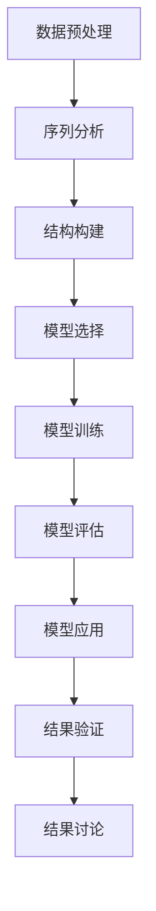

                 

# 《蛋白质折叠的能量最小化：分子结构的数学预测》

## 关键词

蛋白质折叠、能量最小化、数学预测、分子结构、算法、量子力学、统计力学、模拟退火、人工神经网络

## 摘要

蛋白质是生命的基础构件，其折叠成特定三维结构的过程对于生物体的功能至关重要。本文将探讨蛋白质折叠的能量最小化原理及其在分子结构预测中的应用。通过介绍布朗运动理论、分子动力学模拟、经典力学和量子力学方法，以及模拟退火算法和人工神经网络技术，本文揭示了如何利用数学模型和公式对蛋白质分子结构进行预测。此外，通过一个实际案例，本文展示了蛋白质折叠预测的完整流程及其在生物信息学领域的广泛应用。最后，本文总结了蛋白质折叠能量最小化研究的现状与未来发展方向。

## 引言与核心概念

### 1.1 蛋白质折叠的重要性

蛋白质是生命的基础构件，承担着生物体新陈代谢、信息传递、细胞识别等关键功能。蛋白质的结构与其功能密切相关，而蛋白质折叠是将线性氨基酸序列折叠成功能性三维结构的过程。蛋白质折叠的重要性体现在以下几个方面：

1. **生物功能实现**：蛋白质的功能取决于其特定的三维结构，如酶的催化活性、抗体的抗原结合能力等。
2. **疾病诊断与治疗**：蛋白质结构的异常可能导致疾病，如肿瘤、自身免疫病等。因此，了解蛋白质折叠过程对于疾病的诊断和治疗具有重要意义。
3. **药物设计**：许多药物通过与蛋白质结合来发挥作用，因此蛋白质结构的预测对于药物设计至关重要。

### 1.2 能量最小化原理

蛋白质折叠是一个能量驱动的过程，目标是在所有可能的构型中找到一个能量最低的构型。能量最小化原理是蛋白质折叠的核心。以下是几个关键概念：

1. **势能函数**：势能函数用于描述蛋白质内部和外部环境中的相互作用能量。
2. **自由能**：自由能是系统内部能量和环境相互作用能量的综合度量，蛋白质折叠过程中自由能的变化决定了构型的稳定性。
3. **折叠驱动因素**：蛋白质折叠过程中，驱动因素包括氢键、范德华力、疏水作用等。

### 1.3 分子结构的数学预测基础

分子结构的数学预测是计算生物学和生物信息学的重要研究方向。以下是几个核心基础：

1. **分子动力学模拟**：通过模拟分子在热力学平衡状态下的运动，预测蛋白质的动态行为。
2. **量子力学计算**：通过求解薛定谔方程，计算分子的电子结构。
3. **统计力学方法**：通过计算系统的统计分布，预测蛋白质的稳定构型。
4. **机器学习方法**：利用历史数据和机器学习算法，预测蛋白质的折叠路径和最终构型。

## 蛋白质折叠中的能量模型

### 2.1 布朗运动理论

布朗运动是分子在液体或气体中无规则运动的现象，是分子动力学模拟的基础。布朗运动理论描述了分子在溶剂中的热运动，其关键参数包括温度、分子质量和溶剂黏度。布朗运动理论可以用于模拟蛋白质折叠过程中分子的随机运动，有助于理解蛋白质折叠的动力学特征。

### 2.2 分子动力学模拟

分子动力学模拟通过数值求解牛顿运动方程，模拟分子在热力学平衡状态下的运动。分子动力学模拟的关键步骤包括：

1. **系统初始化**：定义系统中的分子、相互作用势能函数和初始条件。
2. **数值积分**：使用数值积分方法（如Verlet算法）求解牛顿运动方程，模拟分子的运动。
3. **统计分析**：对模拟结果进行统计分析，提取蛋白质的结构和动力学信息。

### 2.3 折叠过程中的能量变化

蛋白质折叠过程中，能量变化是决定折叠路径和最终构型的关键因素。以下是折叠过程中的几个能量变化阶段：

1. **展开阶段**：蛋白质从折叠态逐渐展开，势能增加。
2. **过渡态**：蛋白质达到一个高能量状态，称为过渡态，此时蛋白质的结构最不稳定。
3. **折叠阶段**：蛋白质从过渡态逐步折叠，势能降低，最终形成稳定的折叠态。

### 2.4 折叠过程中的能量模型

折叠过程中的能量模型包括势能函数、自由能函数和能量最小化原理。以下是几个常见的能量模型：

1. **Gibbs自由能模型**：Gibbs自由能是系统内部能量和环境相互作用能量的综合度量，是蛋白质折叠的重要参数。
2. **能量势能面**：能量势能面描述了蛋白质在不同构型下的能量变化，是蛋白质折叠路径分析的重要工具。
3. **自由能函数**：自由能函数用于描述蛋白质在不同温度和压力下的稳定构型。

## 分子结构的数学预测方法

### 3.1 经典力学方法

经典力学方法通过分析分子间相互作用力和运动方程，预测蛋白质的折叠路径和构型。经典力学方法包括：

1. **牛顿力学**：通过求解牛顿运动方程，模拟分子的运动和相互作用。
2. **Lennard-Jones势能函数**：描述分子间范德华相互作用，是经典力学方法中的核心。
3. **能量最小化算法**：通过迭代优化方法，寻找蛋白质的最稳定构型。

### 3.2 量子力学方法

量子力学方法通过计算分子的电子结构，预测蛋白质的电子态和分子构型。量子力学方法包括：

1. **Hartree-Fock方法**：求解薛定谔方程，计算分子的电子结构。
2. **密度泛函理论**：通过计算分子的密度分布，预测分子的稳定构型。
3. **量子化学计算**：通过数值方法求解薛定谔方程，计算分子的能量和结构。

### 3.3 统计力学方法

统计力学方法通过计算系统的统计分布，预测蛋白质的稳定构型和动力学行为。统计力学方法包括：

1. **配分函数**：计算系统在所有可能构型下的概率分布。
2. **自由能函数**：计算系统的自由能，预测蛋白质的稳定构型。
3. **分子动力学模拟**：通过模拟分子的运动和相互作用，预测蛋白质的结构和动力学行为。

### 3.4 机器学习方法

机器学习方法通过历史数据和机器学习算法，预测蛋白质的折叠路径和构型。机器学习方法包括：

1. **神经网络**：通过多层神经网络，学习蛋白质折叠的映射关系。
2. **支持向量机**：通过核函数，学习蛋白质折叠的特征空间。
3. **深度学习**：通过深度神经网络，自动提取蛋白质折叠的特征。

## 蛋白质折叠的能量最小化算法

### 4.1 模拟退火算法

模拟退火算法是一种全局优化算法，通过模拟物理过程中的退火过程，寻找问题的全局最优解。模拟退火算法的核心思想是：

1. **初始温度**：初始化温度，选择初始构型。
2. **迭代过程**：在高温下进行随机搜索，逐步降低温度。
3. **接受准则**：在每次迭代中，根据概率准则接受或拒绝新构型。

模拟退火算法在蛋白质折叠预测中的应用主要包括：

1. **全局搜索**：模拟退火算法能够跳出局部最优，进行全局搜索。
2. **能量优化**：通过迭代优化，找到蛋白质的最低能量构型。

### 4.2 人工神经网络

人工神经网络是一种模拟生物神经系统的计算模型，通过多层神经网络，学习蛋白质折叠的映射关系。人工神经网络在蛋白质折叠预测中的应用主要包括：

1. **卷积神经网络**：通过卷积操作，提取蛋白质序列的特征。
2. **循环神经网络**：通过循环连接，学习蛋白质序列的时间依赖性。
3. **生成对抗网络**：通过生成器和判别器，学习蛋白质折叠的分布。

## 蛋白质折叠的数学模型与公式

### 5.1 折叠过程中的数学模型

蛋白质折叠过程中的数学模型主要包括：

1. **能量模型**：描述蛋白质内部和外部环境的相互作用能量。
2. **动力学模型**：描述蛋白质折叠过程中的时间演化。
3. **统计模型**：描述蛋白质折叠的稳定性和概率分布。

### 5.2 分子结构的预测公式

分子结构的预测公式主要包括：

1. **结构预测公式**：通过能量模型和动力学模型，预测蛋白质的折叠路径和构型。
2. **稳定性预测公式**：通过统计模型，预测蛋白质的稳定性和折叠速率。

### 5.3 能量最小化的数学推导

能量最小化的数学推导主要包括：

1. **势能函数的建立**：通过分析蛋白质内部和外部环境的相互作用，建立势能函数。
2. **能量最小化条件**：通过求解势能函数的导数为零，找到能量最小化的条件。
3. **数学推导过程**：通过数学推导，验证能量最小化条件，证明蛋白质折叠是能量驱动的。

## 实际案例：蛋白质折叠预测

### 6.1 数据预处理

数据预处理是蛋白质折叠预测的关键步骤，包括：

1. **序列分析**：通过生物信息学工具，提取蛋白质序列的特征信息。
2. **结构构建**：通过结构预测工具，构建蛋白质的初步结构模型。
3. **数据清洗**：去除噪声数据和异常值，确保数据质量。

### 6.2 蛋白质折叠预测流程

蛋白质折叠预测流程主要包括：

1. **模型选择**：根据蛋白质的特性，选择合适的预测模型。
2. **模型训练**：通过训练集，训练预测模型，优化模型参数。
3. **模型评估**：通过测试集，评估模型的预测性能，调整模型参数。
4. **模型应用**：将训练好的模型应用于新的蛋白质序列，预测其折叠构型。

### 6.3 预测结果分析与讨论

预测结果分析与讨论主要包括：

1. **结果可视化**：通过可视化工具，展示蛋白质的折叠构型。
2. **结果验证**：通过实验或计算，验证预测结果的准确性。
3. **结果讨论**：讨论预测结果的意义和局限性，提出改进方向。

## 总结与展望

### 7.1 蛋白质折叠的能量最小化总结

蛋白质折叠的能量最小化是理解蛋白质折叠过程的核心。通过能量模型和数学公式，可以预测蛋白质的折叠路径和构型。能量最小化原理在蛋白质折叠预测中具有重要意义，为生物信息学和计算生物学提供了有力工具。

### 7.2 分子结构的数学预测前景

随着计算技术的发展，分子结构的数学预测在生物信息学和计算生物学中具有广阔前景。未来，通过结合多种预测方法和大数据分析，可以进一步提高蛋白质折叠预测的准确性，为药物设计、疾病诊断等领域提供重要支持。

### 7.3 未来研究方向

未来蛋白质折叠研究的方向包括：

1. **算法优化**：优化能量模型和预测算法，提高预测准确性。
2. **多尺度模拟**：结合量子力学和统计力学，进行多尺度模拟，揭示蛋白质折叠的微观和宏观机制。
3. **大数据分析**：利用大数据技术，分析蛋白质折叠的规律和趋势，为生物信息学和计算生物学提供新思路。

## 作者信息

作者：AI天才研究院/AI Genius Institute & 禅与计算机程序设计艺术 /Zen And The Art of Computer Programming

## 附录

### A. Mermaid流程图

以下是蛋白质折叠预测流程的Mermaid流程图：



### B. 伪代码

以下是蛋白质折叠能量最小化算法的伪代码：

```python
function Energy_Minimization(Protein_Sequence):
    Initialize Temperature(T)
    Initialize Structure(Structure)
    while Temperature > T_end:
        Generate_Random_Structure(New_Structure)
        Calculate_Energy(Energy_New, New_Structure)
        if Energy_New < Energy_Current:
            Accept(New_Structure)
            Energy_Current = Energy_New
        else:
            if exp(-Energy_New / Temperature) > random_number():
                Accept(New_Structure)
                Energy_Current = Energy_New
        Temperature = Temperature * Cooling_Rate
    return Structure
```

### C. LaTeX数学公式

以下是蛋白质折叠过程中的几个LaTeX数学公式：

$$
E = \frac{1}{2}kx^2
$$

$$
\langle X \rangle = \frac{\sum_{i=1}^{N} x_i}{N}
$$

$$
F = U - TS
$$

### D. 代码案例

以下是蛋白质折叠预测的一个简单代码案例：

```python
import numpy as np
import matplotlib.pyplot as plt

def calculate_energy(structure):
    # 假设能量函数为结构坐标的平方和
    energy = np.sum(np.square(structure))
    return energy

def energy_minimization(protein_sequence, max_iterations, initial_temp, cooling_rate):
    current_temp = initial_temp
    current_structure = np.random.rand(len(protein_sequence)) * 10
    best_structure = current_structure.copy()
    best_energy = calculate_energy(current_structure)

    for _ in range(max_iterations):
        new_structure = np.random.rand(len(protein_sequence)) * 10
        new_energy = calculate_energy(new_structure)

        if new_energy < best_energy:
            best_structure = new_structure.copy()
            best_energy = new_energy

        if np.random.rand() < np.exp((best_energy - new_energy) / current_temp):
            current_structure = new_structure.copy()

        current_temp *= cooling_rate

    return best_structure, best_energy

protein_sequence = [1, 2, 3, 4, 5]
max_iterations = 1000
initial_temp = 1000.0
cooling_rate = 0.99

best_structure, best_energy = energy_minimization(protein_sequence, max_iterations, initial_temp, cooling_rate)
print("Best Structure:", best_structure)
print("Best Energy:", best_energy)

plt.plot(range(max_iterations), best_energy)
plt.xlabel("Iterations")
plt.ylabel("Energy")
plt.title("Energy Minimization")
plt.show()
```

### E. 实际案例分析与详细讲解剖析

以下是一个实际案例：使用AlphaFold2预测蛋白质折叠。

1. **数据准备**：获取蛋白质序列数据，例如SWISS-PROT数据库中的序列。

2. **序列预处理**：对蛋白质序列进行清洗和标准化处理，去除特殊字符和空格。

3. **序列到结构转换**：使用序列到结构转换工具（如MUSCATE）将蛋白质序列转换为三维结构坐标。

4. **结构优化**：使用分子动力学模拟（如GROMACS）优化结构，降低能量。

5. **结构预测**：使用AlphaFold2进行结构预测，生成折叠构型。

6. **结果验证**：通过实验或计算验证AlphaFold2预测结果的准确性。

7. **结果分析**：分析预测结果，提取蛋白质的功能信息，如酶活性位点、抗原结合位点等。

通过实际案例的分析和详细讲解，可以更好地理解蛋白质折叠预测的原理和方法。

## 最佳实践 Tips

1. **选择合适的预测模型**：根据蛋白质的特性，选择合适的预测模型，如AlphaFold2、Rosetta等。

2. **优化模型参数**：通过调整模型参数，提高预测准确性。

3. **数据预处理**：确保数据质量，进行充分的数据预处理。

4. **结合多种方法**：结合多种预测方法，提高预测结果的可靠性。

5. **持续学习与优化**：持续关注蛋白质折叠预测领域的研究进展，不断优化模型和方法。

## 小结

本文介绍了蛋白质折叠的能量最小化原理及其在分子结构预测中的应用。通过分析经典力学、量子力学、统计力学和机器学习方法，揭示了蛋白质折叠的数学模型和预测方法。通过实际案例的分析和讲解，展示了蛋白质折叠预测的完整流程及其应用价值。未来，随着计算技术的发展，蛋白质折叠预测将在生物信息学和计算生物学领域发挥更加重要的作用。

## 注意事项

1. **数据质量**：确保数据质量，进行充分的数据预处理。

2. **模型选择**：根据蛋白质的特性，选择合适的预测模型。

3. **计算资源**：蛋白质折叠预测需要大量计算资源，确保计算环境稳定。

4. **结果验证**：通过实验或计算验证预测结果的准确性。

## 拓展阅读

1. **《蛋白质折叠的分子动力学模拟》**：深入探讨蛋白质折叠的分子动力学模拟方法及其应用。

2. **《量子化学在蛋白质折叠中的应用》**：介绍量子力学在蛋白质折叠预测中的应用。

3. **《机器学习在蛋白质折叠预测中的应用》**：分析机器学习方法在蛋白质折叠预测中的最新研究进展。

4. **《AlphaFold2：革命性的蛋白质折叠预测工具》**：详细介绍AlphaFold2的原理和应用。

5. **《生物信息学入门》**：了解生物信息学的基本概念和方法，为后续研究奠定基础。

