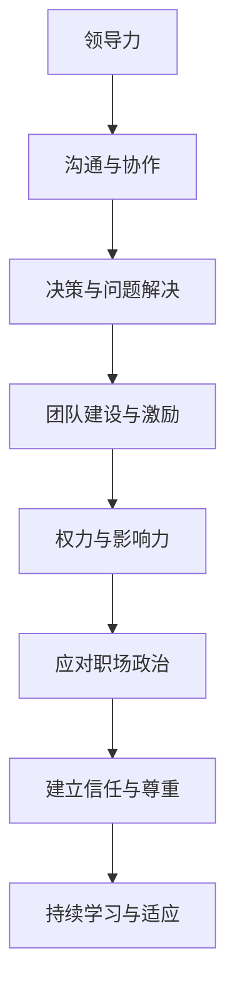

                 

### 文章标题：领导力与职场政治：巧妙应对办公室政治

在当今高度竞争的职场环境中，领导力与职场政治的关系愈发紧密。领导力不仅仅关乎如何有效地管理团队和资源，更关乎如何应对办公室中的各种政治挑战。本文将深入探讨领导力与职场政治的核心概念，提供应对办公室政治的策略，并通过案例分析帮助读者更好地理解这一主题。让我们一步一步地分析推理，揭开职场政治的神秘面纱。

### 关键词

- **领导力**
- **职场政治**
- **办公室政治**
- **应对策略**
- **案例分析**
- **沟通技巧**

### 摘要

本文旨在帮助职场人士理解领导力与职场政治之间的密切关系，并提供实用的应对策略。通过深入分析核心概念、案例研究和实战技巧，本文旨在帮助读者在复杂的办公室环境中保持清醒的头脑，巧妙应对各种政治挑战，从而提升个人和团队的表现。

### 引言：领导力的重要性

在职场中，领导力无处不在。无论是管理者还是普通员工，领导力都是推动个人和团队进步的关键因素。领导力不仅仅是一种能力，更是一种态度和习惯。有效的领导力能够激发团队成员的潜力，提高工作效率，创造积极的工作氛围。然而，在现实职场中，领导力往往面临各种挑战，尤其是职场政治的干扰。

职场政治是指在工作中利用各种手段和策略来争取权力和利益的过程。这些手段可能包括拉帮结派、操纵舆论、排挤竞争对手等。职场政治的存在对领导力提出了更高的要求，领导必须在保持公平和透明的同时，具备应对各种政治挑战的能力。

### 职场政治的定义与影响

职场政治的定义广泛，涵盖了一系列在职场中发生的策略性行为。它可能表现为个人或团体为了提升自己的地位和利益而采取的行动，包括但不限于：

1. **拉帮结派**：通过建立紧密的关系网络，以巩固个人或团体的权力。
2. **操纵舆论**：通过传播特定的信息来影响他人的看法和决策。
3. **排挤竞争对手**：通过各种手段使竞争对手在工作中难以生存。
4. **权力斗争**：在组织内部争夺控制权和资源。

职场政治对职场环境和员工个人有着深远的影响。正面影响包括：

1. **资源分配**：通过政治手段，员工可能获得更多的资源和支持。
2. **职业发展**：在职场政治中表现出色的员工可能获得更多的晋升机会。
3. **团队协作**：通过建立良好的关系网络，有助于团队内部的协作和沟通。

然而，职场政治的负面影响同样显著：

1. **信任缺失**：频繁的职场政治行为可能导致员工对管理层的信任度下降。
2. **工作效率下降**：政治斗争和权力争夺可能分散员工的工作注意力。
3. **工作满意度下降**：员工在充满政治斗争的环境中往往感到焦虑和不满意。

### 领导力与职场政治的关系

领导力与职场政治之间的关系错综复杂。一方面，领导力可以影响职场政治的发展。一个强有力的领导者能够建立健康的组织文化，减少职场政治的负面影响。例如，通过透明沟通和公平决策，领导者可以减少权力斗争和操纵行为。

另一方面，职场政治也可能对领导力产生挑战。在充满政治斗争的环境中，领导力可能需要更加灵活和巧妙，以应对各种复杂的情况。领导者不仅需要具备管理技能，还需要具备政治敏感度和策略思维。

### 应对职场政治的策略

为了在职场政治的环境中保持优势，领导者可以采取以下策略：

1. **提升沟通技巧**：有效的沟通是减少误解和冲突的关键。领导者应通过开放和透明的沟通方式，建立与团队成员之间的信任。
2. **建立合作关系**：通过建立跨部门或跨团队的合作关系，领导者可以减少部门之间的对立和竞争。
3. **培养团队精神**：鼓励团队成员相互支持和合作，建立强大的团队凝聚力。
4. **树立榜样**：领导者应以身作则，通过自己的行为来影响和引导团队成员。

### 核心概念与联系：Mermaid流程图

为了更好地理解领导力与职场政治之间的关系，我们可以通过Mermaid流程图来展示其核心概念和联系：



在这个流程图中，领导力的各个要素相互关联，共同构建了一个应对职场政治的综合框架。例如，沟通与协作是领导力的基础，它直接影响决策和问题解决的质量。同时，团队建设和激励也是领导力的重要组成部分，它有助于建立强大的团队凝聚力，减少职场政治的负面影响。

### 核心算法原理讲解：伪代码

为了更深入地理解领导力与职场政治的关系，我们可以通过伪代码来阐述一个简化的决策过程。以下是一个用于评估和应对职场政治挑战的伪代码示例：

```plaintext
Algorithm: Evaluate and Respond to Office Politics

Input: 
    - Political Situation (PS)
    - Leadership Style (LS)
    - Team Dynamics (TD)

Output: 
    - Response Strategy (RS)

Begin
    1. Analyze Political Situation (PS)
        - Identify Key Players
        - Assess Power Distribution
        - Determine Objectives

    2. Assess Leadership Style (LS)
        - Determine if Open or Autocratic
        - Evaluate Communication Effectiveness

    3. Evaluate Team Dynamics (TD)
        - Measure Team Cohesion
        - Assess Employee Engagement

    4. Develop Response Strategy (RS)
        - If LS is Open and TD is Cohesive:
            - Encourage Open Dialogue
            - Mediate Conflicts
            - Promote Transparency
        
        - If LS is Autocratic and TD is Disengaged:
            - Seek Feedback
            - Foster a Supportive Environment
            - Implement Change Management

    5. Implement and Monitor Response (RS)
        - Execute Strategy
        - Monitor Employee Feedback
        - Adjust as Needed

End
```

在这个伪代码中，领导力评估和团队动态分析是核心步骤，它们帮助领导者制定合适的应对策略。通过这种方法，领导者可以更好地理解职场政治环境，并采取有效的措施来减少其负面影响。

### 数学模型和公式：详细讲解与举例说明

为了进一步理解职场政治中的策略制定，我们可以引入一些数学模型和公式。以下是一个简单的线性规划模型，用于优化领导者在职场政治中的资源分配策略：

```latex
\begin{equation}
\begin{aligned}
\max_{x} & \quad c^T x \\
\text{subject to} & \quad Ax \leq b \\
& \quad x \geq 0
\end{aligned}
\end{equation}
```

在这个模型中，`c` 代表目标函数的系数，`x` 代表资源分配向量，`A` 和 `b` 分别是约束矩阵和向量。目标是最小化目标函数 `c^T x`，同时满足资源分配的约束条件。

例如，假设一个领导者需要在团队中分配时间、预算和人力资源，以最大化团队的整体绩效。目标函数 `c` 可以设置如下：

```plaintext
c = [时间系数，预算系数，人力资源系数]
```

约束条件 `Ax \leq b` 可以表示为：

```plaintext
A = [约束条件矩阵]
b = [约束条件向量]
```

通过求解这个线性规划问题，领导者可以确定最优的资源分配策略，以应对职场政治中的各种挑战。

### 项目实战：开发环境搭建与源代码实现

为了更好地理解领导力与职场政治的关系，我们可以通过一个实际项目来展示如何应用这些概念。以下是一个简单的项目管理工具的开发过程，包括环境搭建、源代码实现和代码解读。

#### 开发环境搭建

1. **选择编程语言**：本项目中我们选择Python，因为它具有简洁的语法和强大的库支持。
2. **安装Python**：在本地机器上安装Python环境，版本建议为3.8及以上。
3. **安装依赖库**：使用pip安装必要的库，例如requests、numpy和matplotlib。

```shell
pip install requests numpy matplotlib
```

#### 源代码实现

以下是一个简单的项目管理工具的源代码实现，包括任务分配、进度追踪和绩效评估等功能：

```python
import requests
import numpy as np
import matplotlib.pyplot as plt

class TaskManager:
    def __init__(self):
        self.tasks = []

    def add_task(self, task):
        self.tasks.append(task)

    def assign_task(self, member, task):
        assigned_task = {**task, "assigned_to": member}
        self.tasks.append(assigned_task)

    def track_progress(self):
        progress = []
        for task in self.tasks:
            if "progress" in task:
                progress.append(task["progress"])
        return progress

    def assess_performance(self):
        performance = []
        for task in self.tasks:
            if "progress" in task:
                performance.append(task["progress"] * task.get("priority", 1))
        return performance

    def plot_progress(self):
        progress = self.track_progress()
        plt.bar(range(len(progress)), progress)
        plt.xlabel('Task')
        plt.ylabel('Progress')
        plt.title('Task Progress')
        plt.show()

# Example usage
manager = TaskManager()
manager.add_task({"name": "Task 1", "priority": 2})
manager.add_task({"name": "Task 2", "priority": 1})

manager.assign_task("Alice", {"name": "Task 1", "priority": 2})
manager.assign_task("Bob", {"name": "Task 2", "priority": 1})

manager.plot_progress()
```

#### 代码解读与分析

- **TaskManager 类**：定义了一个任务管理类，包含添加任务、任务分配、进度追踪和绩效评估等方法。
- **add_task 方法**：用于添加任务到任务列表。
- **assign_task 方法**：将任务分配给特定成员。
- **track_progress 方法**：返回任务进度列表。
- **assess_performance 方法**：计算任务绩效分数。
- **plot_progress 方法**：使用matplotlib库绘制任务进度条形图。

通过这个项目，我们可以看到如何将领导力和职场政治的概念应用于实际工作中，从而更好地管理和优化团队任务。

### 实际案例分析和详细讲解剖析

#### 案例一：职场政治的积极影响

在一个大型科技公司，团队A负责开发新产品，团队B负责市场推广。起初，团队A的领导Alice与团队B的领导Bob关系紧张，因为两个团队的目标存在冲突。但是，通过Alice的积极沟通和协作，她成功地解决了冲突，并建立了良好的合作关系。

- **背景介绍**：团队A和团队B在目标上存在分歧，导致工作进展缓慢。
- **案例分析**：Alice通过定期会议、透明沟通和共同目标设定，改善了团队关系。
- **结果**：团队A和B之间的合作得以加强，新产品成功推向市场。

通过这个案例，我们看到了领导力在应对职场政治挑战中的关键作用。Alice通过沟通和协作，不仅解决了团队之间的冲突，还促进了项目的成功。

#### 案例二：职场政治的负面影响

在一个创业公司，员工C因为业务能力突出，引起了同事D的嫉妒。D开始通过各种手段排挤C，包括散播负面消息和操纵项目分配。这导致了C的工作满意度下降，并最终离开公司。

- **背景介绍**：C因为业务能力突出，引起了同事D的嫉妒。
- **案例分析**：D通过操纵项目分配和散播负面消息，排挤C。
- **结果**：C的工作满意度下降，并最终离开公司。

这个案例揭示了职场政治的负面影响。D的行为不仅损害了C的职业发展，还对公司整体造成了不利影响。

### 总结与展望

通过本文的探讨，我们深入了解了领导力与职场政治之间的关系。领导力不仅是管理团队和资源的工具，更是应对职场政治的关键。在应对职场政治时，领导者需要具备沟通技巧、策略思维和团队建设能力。

未来，随着职场环境的不断变化，领导力与职场政治的关系也将更加复杂。领导者需要持续学习和适应，以应对新的挑战。同时，组织也需要建立健康的文化，减少职场政治的负面影响。

### 附录：资源推荐

为了帮助读者更深入地了解领导力与职场政治，以下是一些推荐资源：

- **书籍**：
  - 《领导力心理学》
  - 《职场政治学》
  - 《沟通的艺术》

- **在线课程**：
  - Coursera上的《领导力与影响力》
  - edX上的《职场沟通与冲突管理》

- **文章**：
  - Harvard Business Review上的相关文章
  - LinkedIn上的专业博客文章

### 最佳实践 tips、小结、注意事项、拓展阅读等内容

**最佳实践 tips**：

- **建立良好的沟通机制**：定期举行团队会议，鼓励开放讨论，减少误解和冲突。
- **关注员工反馈**：定期收集员工反馈，了解他们的工作体验和需求。
- **培养团队精神**：通过团队建设活动和项目合作，增强团队凝聚力。

**小结**：

领导力与职场政治是职场中不可忽视的两个方面。领导者需要通过有效的沟通和策略，应对职场政治的挑战，同时保持团队的高效运作。

**注意事项**：

- **避免操纵行为**：在职场政治中，诚实和透明是关键，避免采取不道德的手段。
- **关注长期影响**：领导者的决策不应仅考虑短期利益，而应关注对团队和公司的长期影响。

**拓展阅读**：

- 《领导力的五大障碍》
- 《如何掌控职场政治》

通过不断学习和实践，领导者可以更好地应对职场政治，提升个人和团队的表现。作者：AI天才研究院/AI Genius Institute & 禅与计算机程序设计艺术 /Zen And The Art of Computer Programming。

