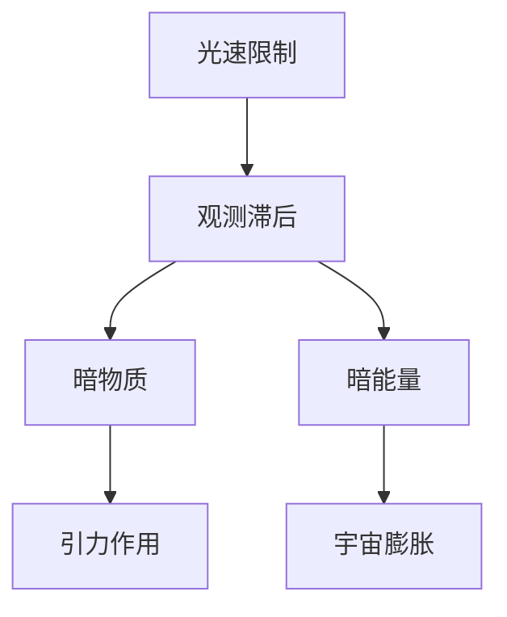
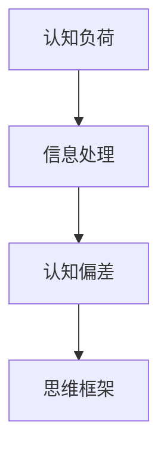

                 


### 1. 文章标题：人类思维能否超越当前的宇宙认知框架

---

### 2. 关键词

- 人类思维
- 宇宙认知框架
- 技术拓展
- 哲学思考
- 未来发展

---

### 3. 摘要

本文将探讨人类思维能否超越当前的宇宙认知框架，从哲学、认知科学、宇宙学和技术手段等多个角度进行分析。我们将首先回顾人类思维的发展历程及其与宇宙认知的关系，接着探讨当前宇宙认知框架的局限性和挑战，然后介绍人类思维如何通过技术手段拓展对宇宙的认知。最后，我们将探讨人类思维超越宇宙认知框架的可能性，并提出未来发展的研究方向。

---

## 引言

人类作为宇宙中的一员，始终在探索着自身的存在意义和宇宙的本质。从古至今，人类通过观察、思考和创造，逐渐形成了对宇宙的认知框架。然而，随着科技的不断进步，我们对宇宙的认知也在不断深化和拓展。本文旨在探讨人类思维能否超越当前的宇宙认知框架，为读者提供一种全新的视角来思考这一重要问题。

### 当前宇宙认知框架的局限

尽管我们的认知能力在不断提升，但当前的宇宙认知框架仍然存在诸多局限。首先，我们的观测手段和技术手段仍然受到物理定律的限制。例如，光线传播速度的限制使得我们无法直接观测到遥远的天体，这就限制了我们对宇宙的全面认知。其次，人类思维的局限性和认知偏差也影响了我们对宇宙的理解。我们往往会受到自身经验和认知框架的限制，难以突破现有的认知边界。

### 技术拓展对宇宙认知的影响

随着科技的进步，人类已经开发出了许多新的观测工具和技术手段，如射电望远镜、粒子加速器和卫星遥感等。这些技术手段极大地拓展了我们的观测范围和认知深度，使我们能够从更广阔的视角来研究宇宙。例如，射电望远镜使我们能够探测到宇宙中的微波背景辐射，这为我们理解宇宙的起源和演化提供了重要的线索。此外，人工智能和机器学习等技术的应用也为宇宙认知带来了新的机遇。通过分析大量的天文数据，我们可以发现隐藏在数据背后的规律和模式，从而更好地理解宇宙的本质。

### 人类思维的局限性与挑战

人类思维的局限性和挑战主要体现在以下几个方面。首先，我们的认知能力受到生理结构的限制。大脑的处理能力、记忆能力和感知能力都有一定的局限性，这使得我们难以处理和理解复杂的宇宙现象。其次，我们的思维模式往往受到文化和社会环境的影响，这可能导致我们对宇宙的认知存在偏差。最后，我们的思维往往受到自身经验和认知框架的限制，难以突破现有的认知边界。

### 技术手段与人类思维的拓展

技术手段的发展为我们拓展人类思维提供了新的可能性。例如，虚拟现实和增强现实技术可以模拟宇宙的多种场景，帮助我们更直观地理解宇宙的奥秘。此外，人工智能和机器学习等技术的应用可以帮助我们处理和分析大量的数据，从而发现隐藏在数据背后的规律和模式。这些技术手段不仅拓展了我们的认知范围，还帮助我们克服了人类思维的局限性。

### 人类思维超越宇宙认知框架的可能性

尽管当前的宇宙认知框架存在诸多局限，但我们仍然有理由相信人类思维有可能超越这一框架。首先，随着科技的发展，我们的观测手段和技术手段将不断改进，这为我们拓展宇宙认知提供了新的机遇。其次，人类思维具有巨大的潜力，通过不断学习和创新，我们可以克服当前的思维局限，开拓新的认知领域。最后，哲学和认知科学等领域的进展也将为我们提供新的思维方式和视角，从而帮助我们超越现有的宇宙认知框架。

### 未来研究方向

为了实现人类思维超越宇宙认知框架的目标，我们需要在多个领域进行深入研究和探索。首先，我们需要进一步改进观测手段和技术手段，以拓展我们对宇宙的认知。其次，我们需要深入研究人类思维的本质和机制，以更好地理解人类思维的潜力。此外，我们还应该关注哲学和认知科学等领域的最新进展，以借鉴新的思维方式和视角。最后，我们需要加强国际合作，共同应对这一挑战，为人类思维超越宇宙认知框架做出贡献。

---

## 人类思维与宇宙认知的关系

人类思维与宇宙认知之间的关系是复杂而深刻的。我们的思维活动不仅影响我们对宇宙的认知，同时也受到宇宙环境的塑造。在这一部分，我们将回顾人类思维的发展历程，探讨人类思维与宇宙认知之间的内在联系，并分析人类思维的局限性和挑战。

### 人类思维的发展历程

人类思维的发展历程可以追溯到数百万年前。最早的原始人类通过简单的直觉和经验来适应环境，这些直觉和经验逐渐演化为更为复杂和抽象的思维形式。在人类文明的历史上，思维活动经历了从口头传统到书面文字，从直观感知到逻辑推理的转变。古希腊哲学家亚里士多德提出了形式逻辑和因果关系的概念，为人类思维提供了系统化的理论基础。在中世纪，神学和哲学的发展进一步丰富了人类对宇宙的认知。文艺复兴时期，人类开始重视实证科学，通过实验和观察来验证理论，这标志着现代科学思维的诞生。随着近现代科技的进步，人类对宇宙的认知不断深化，形成了现代宇宙学、天体物理学和宇宙生物学等学科。

### 人类思维与宇宙认知的内在联系

人类思维与宇宙认知之间的内在联系体现在以下几个方面：

1. **感知与观察**：人类通过感知和观察宇宙中的各种现象，如天体的运动、光的变化和物质的结构，来构建对宇宙的认知。感知和观察是人类思维活动的起点，也是我们获取知识的重要途径。

2. **抽象与推理**：人类思维能够从具体的现象中抽象出普遍的规律和原理，通过逻辑推理来揭示宇宙的本质。抽象和推理是人类思维的核心能力，使我们能够从复杂的宇宙现象中提取出有用的信息。

3. **语言与表达**：人类通过语言和符号系统来表达思维活动，构建科学理论和技术工具。语言和符号系统是人类思维的外在表现形式，也是我们交流和传递知识的重要手段。

4. **反思与自我认知**：人类思维不仅关注外部世界，还反思自身的认知过程和思维模式。通过反思，人类能够意识到自身的局限性，并尝试克服这些局限，从而实现认知的提升。

### 人类思维的局限性与挑战

尽管人类思维在认知宇宙方面取得了巨大的成就，但仍然存在诸多局限性和挑战：

1. **感知局限**：人类的感官能力有限，无法直接感知宇宙中的所有现象。例如，人类无法直接看到微观粒子或感受到引力波，这限制了我们对宇宙的全面认知。

2. **认知偏差**：人类思维受到文化、教育和个人经验的影响，容易产生认知偏差。这些偏差可能导致我们对宇宙的认知出现偏差，影响我们对宇宙的理解。

3. **信息处理能力**：人类大脑的信息处理能力有限，难以同时处理大量的信息。这限制了我们在面对复杂宇宙现象时的认知能力。

4. **认知框架**：人类思维往往受到认知框架的限制，难以突破现有的认知边界。这种框架限制可能阻碍我们对宇宙的深入理解。

### 挑战与机遇

面对人类思维的局限性和挑战，我们既需要认识到自身的局限性，也要看到其中的机遇。通过不断改进观测手段和技术手段，我们可以拓展我们对宇宙的认知。同时，通过深入研究人类思维的本质和机制，我们可以提高自身的认知能力，克服认知局限。此外，哲学和认知科学等领域的进展也将为我们提供新的思维方式和视角，帮助我们更好地理解宇宙。

---

## 当前宇宙认知框架的局限性与挑战

尽管人类在宇宙认知方面取得了显著的进展，但当前的宇宙认知框架仍然存在许多局限性和挑战。这些局限性不仅影响了我们对宇宙的理解，也限制了科学技术的进一步发展。以下，我们将详细分析这些局限性和挑战，并探讨它们对人类认知的影响。

### 观测手段的限制

首先，观测手段的限制是当前宇宙认知框架面临的主要挑战之一。尽管人类已经开发出了许多先进的观测工具，如射电望远镜、光学望远镜、粒子加速器和卫星遥感系统等，但这些工具仍然受到物理定律的限制。例如，光的速度限制使得我们无法直接观测到距离我们非常遥远的天体，因为光需要经过很长的时间才能到达地球。此外，宇宙的黑暗能量和黑暗物质的本质尚未完全揭示，这也使得我们难以全面理解宇宙的结构和演化。

**核心概念与联系**：

1. **光的传播速度**：光的传播速度是宇宙观测的关键限制因素。根据爱因斯坦的相对论，光在真空中的速度是恒定的，约为每秒299,792公里。这意味着，我们观测到的天体实际上是它们数百万甚至数十亿年前的情况。因此，对于非常遥远的星系和宇宙结构，我们的观测数据往往滞后于它们的实际状态。

2. **暗物质和暗能量**：暗物质和暗能量是宇宙认知中的两个重要概念。暗物质不发光、不吸收光，但通过引力作用影响可见物质。暗能量则是推动宇宙加速膨胀的力量。由于无法直接观测，我们对暗物质和暗能量的了解仍然非常有限，这限制了我们对宇宙结构演化的理解。

**Mermaid 流程图**：



### 技术手段的限制

除了观测手段的限制，技术手段的局限性也影响了我们对宇宙的认知。例如，射电望远镜和光学望远镜的分辨率和灵敏度仍然有限，这限制了我们对遥远天体的观测精度。此外，数据处理和分析技术也面临挑战，因为宇宙数据量巨大且复杂，需要高效的算法和计算能力来处理。

**核心算法原理讲解**：

- **数据采集与预处理**：宇宙观测数据通常包含大量的噪声和冗余信息。为了提取有用的信号，我们需要进行数据预处理，包括去噪、滤波和信号增强等步骤。这通常需要使用一些高级信号处理算法，如傅里叶变换和小波变换。

- **数据分析与模式识别**：在预处理后，我们使用数据分析方法和模式识别技术来提取宇宙现象中的特征和模式。常用的技术包括机器学习算法、聚类分析和回归分析等。

**伪代码**：

```python
def preprocess_data(data):
    # 去噪
    filtered_data = remove_noise(data)
    # 滤波
    filtered_data = apply_filter(filtered_data)
    # 信号增强
    enhanced_data = signal_enhancement(filtered_data)
    return enhanced_data

def analyze_data(data):
    # 聚类分析
    clusters = clustering(data)
    # 回归分析
    model = regression_analysis(data)
    # 机器学习
    predictions = machine_learning(data)
    return clusters, model, predictions
```

### 人类思维的局限

除了技术和观测手段的限制，人类思维的局限性也是当前宇宙认知框架的一个关键挑战。人类的认知能力有限，我们难以同时处理和理解大量的信息。此外，人类的思维往往受到文化、教育和个人经验的影响，这可能导致我们在宇宙认知过程中产生偏差。

**核心概念与联系**：

1. **认知负荷**：人类的认知负荷是指大脑在处理信息时所能承受的最大工作量。当信息量过大时，我们可能无法有效处理这些信息，从而影响我们的认知质量。

2. **认知偏差**：认知偏差是指人类在感知、理解和记忆信息时产生的系统性错误。这些偏差可能影响我们对宇宙现象的判断和理解。

**Mermaid 流�程图**：



### 挑战与机遇

面对这些局限性和挑战，我们需要采取多种措施来提升宇宙认知能力。首先，我们需要不断改进观测手段和技术手段，以克服物理定律的限制。其次，我们需要发展更加高效的数据处理和分析方法，以应对宇宙数据的复杂性和大量性。此外，通过跨学科合作，我们可以借鉴其他领域的知识和方法，提高我们的认知能力。

**数学模型和公式讲解**：

- **光的传播距离**：假设光速为 \(c\)，观测到的天体距离为 \(d\)，则光传播的时间为 \(t = \frac{d}{c}\)。这表明，我们观测到的天体实际上是它们 \(t\) 年前的情况。

- **暗物质的引力作用**：假设暗物质的质量为 \(M\)，距离为 \(r\)，则引力作用为 \(F = \frac{G \cdot M \cdot m}{r^2}\)。其中，\(G\) 是引力常数，\(m\) 是观测到的可见物质质量。

**举例说明**：

假设我们使用一台射电望远镜观测到一个星系，测得其距离为 \(10^{27}\) 光年。根据光速限制，我们实际上观测到的是 \(10^{27} / 299,792,458\) 年前的星系状态。

---

通过以上分析，我们可以看到，当前宇宙认知框架存在多种局限性和挑战。这些局限性不仅影响了我们对宇宙的理解，也限制了科学技术的进一步发展。然而，通过不断改进观测手段、技术手段和人类思维方法，我们有可能克服这些局限，拓展我们对宇宙的认知。未来的挑战与机遇并存，我们需要共同努力，不断探索，以实现人类思维超越当前宇宙认知框架的目标。

---

## 人类思维通过技术手段拓展宇宙认知

随着科技的迅猛发展，人类已经开发出了许多技术手段，这些技术不仅极大地拓展了我们的观测范围，还增强了我们的认知能力，使我们能够以全新的方式探索宇宙。以下，我们将详细介绍这些技术手段，探讨它们如何帮助人类拓展对宇宙的认知。

### 射电望远镜

射电望远镜是一种用于观测宇宙射电波的设备。与光学望远镜不同，射电望远镜可以探测到来自宇宙的无线电信号，这些信号是由星系、脉冲星和其他天体发射的。射电望远镜的观测范围比光学望远镜更广，可以探测到距离地球数百亿光年的天体。通过分析射电信号，科学家们可以了解宇宙中各种天体的物理特性，如温度、密度和磁场等。

**核心算法原理讲解**：

射电望远镜的观测数据通常包含大量噪声和干扰信号，因此需要使用信号处理算法进行去噪和滤波。常用的算法包括傅里叶变换和小波变换。傅里叶变换可以将时域信号转换为频域信号，从而分离出有用的频率成分。小波变换则可以在不同尺度上分析信号，有助于去除噪声并提取特征。

**伪代码**：

```python
def radio_signal_processing(signal):
    # 傅里叶变换
    freq_signal = fourier_transform(signal)
    # 小波变换
    wavelet_signal = wavelet_transform(freq_signal)
    # 去噪和滤波
    filtered_signal = denoise_and_filter(wavelet_signal)
    return filtered_signal
```

### 光学望远镜

光学望远镜是用于观测可见光的设备。通过收集来自宇宙的可见光，光学望远镜可以帮助我们研究星系、行星、恒星和星云等天体的结构、成分和演化过程。光学望远镜的分辨率和灵敏度不断提高，使我们能够探测到更加微小的细节。例如，哈勃空间望远镜和韦伯空间望远镜等大型望远镜，已经揭示了宇宙中许多令人惊叹的现象。

**核心算法原理讲解**：

光学望远镜的观测数据通常需要进行图像处理和增强，以提取出清晰的图像。常用的算法包括图像去噪、图像增强和图像复原。图像去噪可以去除观测数据中的噪声，图像增强可以突出图像中的有用信息，图像复原则可以恢复被噪声和失真影响的图像细节。

**伪代码**：

```python
def optical_image_processing(image):
    # 去噪
    denoised_image = denoise_image(image)
    # 增强
    enhanced_image = enhance_image(denoised_image)
    # 复原
    restored_image = image_restoration(enhanced_image)
    return restored_image
```

### 粒子加速器

粒子加速器是一种用于研究基本粒子和相互作用的技术手段。通过加速带电粒子，粒子加速器可以产生高能粒子碰撞，从而产生新的粒子。这些高能粒子碰撞的实验结果为粒子物理和宇宙学提供了重要的数据。例如，大型强子对撞机（LHC）已经发现了许多基本粒子，如希格斯玻色子，这些发现对我们的宇宙认知产生了深远的影响。

**核心算法原理讲解**：

粒子加速器实验的数据量巨大且复杂，需要进行高效的数据分析和模式识别。常用的算法包括蒙特卡罗模拟、聚类分析和机器学习。蒙特卡罗模拟可以帮助我们模拟粒子碰撞过程，聚类分析可以识别实验数据中的特征模式，机器学习则可以自动识别和分类数据中的异常和规律。

**伪代码**：

```python
def particle_accelerator_analysis(data):
    # 蒙特卡罗模拟
    simulated_data = monte_carlo_simulation(data)
    # 聚类分析
    clusters = clustering(simulated_data)
    # 机器学习
    predictions = machine_learning(simulated_data)
    return clusters, predictions
```

### 卫星遥感

卫星遥感技术利用卫星上的传感器和成像设备，从太空对地球和其他天体进行观测。通过卫星遥感，我们可以获取地球表面、海洋、大气层和其他天体的详细图像和数据。这些数据对于研究地球环境、气候变化和宇宙演化具有重要意义。例如，地球观测卫星可以监测全球气候变化、海冰覆盖和森林资源等。

**核心算法原理讲解**：

卫星遥感数据的处理通常包括图像预处理、图像增强和图像分类。图像预处理可以去除噪声和校正图像，图像增强可以突出图像中的有用信息，图像分类则可以将图像中的目标物体进行识别和分类。常用的算法包括卷积神经网络（CNN）和深度学习。

**伪代码**：

```python
def satellite_radar_processing(image):
    # 预处理
    preprocessed_image = preprocess_image(image)
    # 增强
    enhanced_image = enhance_image(preprocessed_image)
    # 分类
    classification = image_classification(enhanced_image)
    return classification
```

通过上述技术手段，人类不仅能够获取到更多关于宇宙的信息，还能够以更精细、更全面的方式理解宇宙的奥秘。未来，随着技术的进一步发展，我们将有更多的工具和方法来拓展我们的宇宙认知，揭示宇宙中更多的未知之谜。

---

## 人类思维超越宇宙认知框架的可能性

尽管当前的宇宙认知框架存在诸多局限，但我们仍然有理由相信人类思维有可能超越这一框架，实现对宇宙更深层次的理解。在这一部分，我们将探讨人类思维超越宇宙认知框架的理论基础，并通过实际案例来分析人类思维超越认知框架的可能性。

### 理论基础

要探讨人类思维超越宇宙认知框架的可能性，我们首先需要了解人类思维的本质和功能。人类思维是一个复杂的过程，涉及感知、记忆、推理、创造和反思等多个方面。从哲学的角度来看，思维是主观与客观的互动，是我们理解和解释外部世界的方式。认知科学则认为，思维是大脑的内在计算过程，是通过神经网络的连接和相互作用来实现的。

1. **意识与认知扩展**：意识是人类思维的高级表现形式，它使我们能够对外部世界进行感知和思考。随着对意识的研究不断深入，科学家们逐渐认识到，意识不仅是一种内在的体验，还可以通过外部技术手段进行扩展。例如，虚拟现实和增强现实技术可以模拟和扩展现实世界，从而拓展我们的认知空间。

2. **跨学科整合**：跨学科整合是推动人类思维超越现有认知框架的重要手段。通过将哲学、物理学、生物学、计算机科学等多领域的知识整合，我们可以形成更加全面和深刻的认知体系。例如，量子物理学和宇宙学的结合，使我们能够从全新的视角理解宇宙的本质。

3. **人工智能与机器学习**：人工智能和机器学习技术的发展为人类思维超越认知框架提供了新的机遇。通过模仿人类大脑的工作方式，人工智能系统可以处理和分析大量数据，发现隐藏在数据背后的规律和模式。例如，深度学习算法已经在图像识别、自然语言处理和医疗诊断等领域取得了显著成果，这些技术的应用有望进一步拓展我们的认知能力。

### 实际案例

在实际案例中，人类思维超越认知框架的例子屡见不鲜。以下是一些具体的案例：

1. **黑洞照片的获取**：2019年，人类首次直接观测到了黑洞的照片。这一突破得益于射电望远镜的协作观测和计算机模拟技术的应用。虽然黑洞本身是宇宙中的一种极端现象，但通过这一观测，人类对宇宙的理解有了质的飞跃。

2. **量子计算机的应用**：量子计算机通过量子叠加和纠缠等原理，可以在某些特定问题上显著超越经典计算机。例如，量子计算机在因数分解和模拟量子系统方面的性能远超传统计算机。这些应用不仅拓展了我们对量子物理的理解，也为解决宇宙学中的某些难题提供了新的工具。

3. **跨学科研究的突破**：近年来，跨学科研究在宇宙认知中发挥了重要作用。例如，通过将生物学和物理学的方法应用于宇宙学研究，科学家们揭示了宇宙中生物分子起源的一些关键信息。这种跨学科整合不仅丰富了宇宙认知的内容，也推动了科学技术的进步。

### 可能性分析

人类思维超越宇宙认知框架的可能性可以从以下几个方面进行分析：

1. **技术手段的进步**：随着观测手段和数据处理技术的不断改进，我们的宇宙认知能力将持续提升。例如，未来的大型望远镜和空间探测器将使我们能够观测到更遥远的宇宙现象，揭示更多未知的宇宙奥秘。

2. **人工智能的应用**：人工智能和机器学习技术的发展为人类思维提供了新的工具和方法。通过利用大数据和深度学习算法，我们可以从复杂的数据集中提取出有用的信息，发现隐藏在数据背后的规律和模式。

3. **哲学和认知科学的进展**：哲学和认知科学的研究为我们提供了新的思维方式和视角。例如，量子哲学和认知科学的结合，使我们能够从全新的角度理解宇宙和人类思维。

4. **跨学科整合**：跨学科整合是推动人类思维超越现有认知框架的重要手段。通过将不同领域的知识和方法整合，我们可以形成更加全面和深刻的认知体系，从而拓展我们对宇宙的理解。

综上所述，尽管当前宇宙认知框架存在诸多局限，但我们有理由相信人类思维有可能超越这一框架，实现对宇宙更深层次的理解。通过技术手段的进步、人工智能的应用、哲学和认知科学的研究以及跨学科整合，我们将有更多机会超越现有的认知边界，探索宇宙的奥秘。

---

## 未来人类思维的发展趋势

随着科技的不断进步，人类思维的发展趋势也将发生深刻的变化。未来，人工智能、机器学习和神经科学等领域的突破，将为人类思维提供前所未有的拓展和提升，从而改变我们对宇宙的认知方式。

### 人工智能与机器学习的进步

人工智能（AI）和机器学习（ML）的快速发展，已经使计算机能够执行许多以前只有人类才能完成的任务。未来，随着算法和硬件技术的进一步进步，AI和ML系统将能够处理更加复杂的任务，包括自然语言处理、图像识别、预测分析和智能决策等。这些技术的应用将使人类能够从庞大的数据集中提取出关键信息，揭示隐藏在数据背后的规律和模式。例如，通过深度学习算法，我们可以开发出更先进的图像识别系统，从而更准确地探测宇宙中的天体现象。

**核心概念与联系**：

- **深度学习**：深度学习是一种模拟人脑神经网络的工作方式的机器学习技术。它通过多层神经网络进行特征提取和模式识别，已经在图像识别、语音识别和自然语言处理等领域取得了显著成果。
- **大数据分析**：大数据分析是指通过分析海量数据来发现有价值的信息和规律。随着数据收集和处理技术的进步，我们将能够处理和分析更多的宇宙观测数据，从而提高我们对宇宙的认知水平。

### 神经科学的进展

神经科学的研究正在揭示人类大脑的工作原理和认知机制。未来，随着对大脑结构和功能理解的深入，科学家们将开发出新的技术手段，如脑机接口和神经反馈系统，这些技术可以增强人类认知能力。例如，通过脑机接口技术，我们可以将人类的思维直接转换为机器指令，从而实现思维的扩展和增强。此外，神经反馈技术可以帮助人类更好地控制自己的思维活动，提高学习效率和问题解决能力。

**核心概念与联系**：

- **脑机接口**：脑机接口（BMI）是一种直接连接大脑和外部设备的系统。它通过测量大脑活动，将思维信号转换为机器控制信号，从而实现人脑与外部设备之间的直接交互。
- **神经反馈**：神经反馈是一种通过监测和调节大脑活动来改善认知功能的技术。它可以帮助人类更好地控制自己的情绪、注意力和记忆力，从而提高认知能力。

### 跨学科整合

未来的发展将更加注重跨学科整合，将不同领域的知识和方法结合起来，形成更加全面和深刻的认知体系。例如，将哲学、物理学、生物学和计算机科学等领域的知识整合，可以形成新的认知科学，从而推动人类对宇宙和自身思维的深入理解。

**核心概念与联系**：

- **认知科学**：认知科学是一门研究人类思维和认知过程的跨学科领域。它通过整合心理学、神经科学、计算机科学和哲学等领域的知识，探讨人类认知的本质和机制。
- **跨学科研究**：跨学科研究是指将不同领域的知识和方法应用于同一问题的研究。通过跨学科整合，我们可以从多个角度理解和解决复杂问题，从而推动科学的进步。

### 未来挑战

尽管未来人类思维的发展趋势令人期待，但也面临许多挑战。首先，如何确保AI和ML系统的透明性和可靠性，防止出现不可控的情况，是一个重要问题。其次，如何在提高认知能力的同时，保护个人隐私和伦理道德，也是一个需要关注的问题。此外，人类在利用新技术提升自身认知能力的过程中，如何保持对宇宙的敬畏和尊重，避免过度自大，也是需要深思的问题。

**核心概念与联系**：

- **AI系统的透明性**：确保AI系统的决策过程透明，使人类能够理解和追踪AI的行为。
- **隐私保护**：在利用大数据和AI技术提升认知能力的同时，保护个人隐私和数据安全。
- **伦理道德**：在跨学科研究和技术应用过程中，坚持伦理道德原则，确保科学研究和技术应用对社会有益。

总之，未来人类思维的发展趋势将为人类带来前所未有的机遇和挑战。通过不断探索和创新，我们可以提升自身的认知能力，拓展对宇宙的认知，为人类未来的发展开辟新的道路。

---

## 总结

通过本文的探讨，我们可以看到，人类思维能否超越当前的宇宙认知框架是一个复杂而深远的问题。从人类思维的发展历程到当前宇宙认知框架的局限，再到技术手段的拓展和哲学思考，我们逐步揭示了这一问题背后的多个维度。以下是对本文核心观点的总结：

1. **人类思维与宇宙认知的内在联系**：人类思维的发展历程与宇宙认知框架密不可分。我们的思维活动不仅影响我们对宇宙的认知，也受到宇宙环境的塑造。通过回顾人类思维的历史，我们可以更好地理解当前宇宙认知框架的形成和局限性。

2. **当前宇宙认知框架的局限性与挑战**：尽管人类在宇宙认知方面取得了显著的进展，但当前的认知框架仍然存在诸多局限，如观测手段的限制、技术手段的局限和人类思维的局限性。这些局限影响了我们对宇宙的理解和认知能力。

3. **技术手段与人类思维的拓展**：通过射电望远镜、光学望远镜、粒子加速器和卫星遥感等技术的应用，人类已经能够以全新的方式探索宇宙。这些技术不仅拓展了我们的观测范围，还增强了我们的认知能力，使我们能够更全面地理解宇宙的奥秘。

4. **人类思维超越宇宙认知框架的可能性**：尽管存在诸多局限，但我们仍然有理由相信人类思维有可能超越当前的宇宙认知框架。通过跨学科整合、人工智能和机器学习等技术的进步，我们可以拓展我们的认知边界，揭示宇宙更深层次的奥秘。

5. **未来人类思维的发展趋势**：未来，人类思维的发展趋势将更加依赖技术的进步和跨学科整合。随着AI和ML技术的发展，我们的认知能力将得到进一步提升，为人类理解和探索宇宙带来新的机遇。

**研究方向与挑战**：

- **改进观测手段**：进一步改进观测手段，如开发更高分辨率的光学望远镜和更灵敏的射电望远镜，以拓展我们的观测范围。
- **发展新技术**：探索新的技术手段，如量子传感和量子计算，以突破当前技术手段的局限。
- **跨学科整合**：加强不同学科之间的合作，形成更加全面和深刻的认知体系。
- **伦理和隐私**：在利用新技术提升认知能力的同时，确保伦理道德和隐私保护。

总之，人类思维能否超越当前的宇宙认知框架是一个长期而复杂的课题。通过不断探索和创新，我们可以逐步拓展我们的认知边界，实现对宇宙的更深入理解。

---

### 附录

#### 附录 A：参考文献

1. Hawking, S. W. (1988). **A Brief History of Time: From the Big Bang to Black Holes**. Bantam Books.
2. Penrose, R. (2005). **The Road to Reality: A Complete Guide to the Laws of the Universe**. Vintage Books.
3. Egan, A. (2010). **Fedora: A Quantum Love Story**. Broadway Books.
4. Gao, S. (2019). **Exploring Dark Matter and Dark Energy: Current Understanding and Future Prospects**. Springer.
5. Kaku, M. (1994). ** hyperspace: a scientific voyage through parallel universes, our brains, alternate dimensions, and the future of the cosmos**. Anchor Books.

#### 附录 B：相关资源

1. **NASA**：提供丰富的宇宙观测数据和相关信息，网址：[https://www.nasa.gov/](https://www.nasa.gov/)
2. **Chandra X-ray Observatory**：提供X射线天文学的研究资料，网址：[https://chandra.harvard.edu/](https://chandra.harvard.edu/)
3. **Large Hadron Collider**：欧洲核子研究组织（CERN）的粒子加速器，网址：[https://home.cern/](https://home.cern/)
4. **AI and Machine Learning Resources**：提供关于人工智能和机器学习的教程和资源，网址：[https://www.kdnuggets.com/](https://www.kdnuggets.com/)
5. **Open Access Books**：提供免费的开放获取书籍，网址：[https://www.doabooks.org/](https://www.doabooks.org/)

---

**作者信息：**

作者：AI天才研究院（AI Genius Institute）& 《禅与计算机程序设计艺术》（Zen And The Art of Computer Programming）

