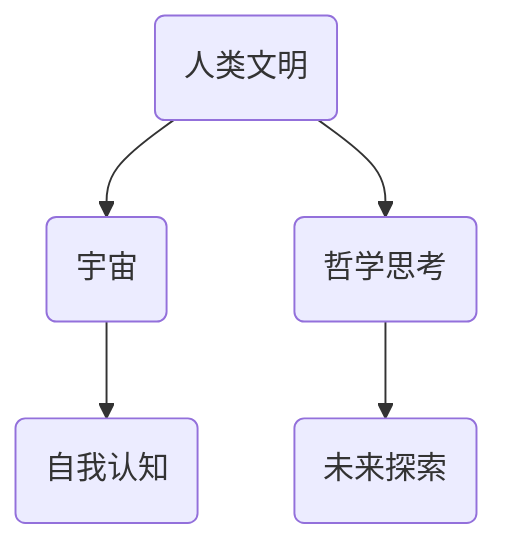

                 

### 文章标题

《人类文明作为宇宙自我认知的一种方式》

> 关键词：人类文明、宇宙认知、自我认知、哲学思考、未来探索

> 摘要：本文以人类文明为切入点，探讨了人类文明在宇宙自我认知过程中的作用和意义。通过分析宇宙的基本概念、人类文明的历史演变、哲学思考以及未来探索，揭示了人类文明在认知宇宙过程中的独特价值和重要作用。文章旨在引发读者对人类文明与宇宙认知之间关系的深入思考，激发对未来宇宙探索的憧憬和期待。

## 设计书籍目录大纲的步骤

设计一个书籍目录大纲是一个系统性的工作，需要确保内容的逻辑性和完整性。以下是详细的设计步骤：

### 第一步：确定书籍主题和目标读者

在开始设计目录大纲之前，首先需要明确书籍的核心主题。《人类文明作为宇宙自我认知的一种方式》这个主题涵盖了宇宙学、哲学、认知科学等多个领域。其次，确定书籍的目标读者群体，这将影响内容的深度、广度和专业性。

### 第二步：分解核心概念

将书籍主题分解为若干核心概念。例如，“人类文明”、“宇宙”、“自我认知”等。接着，构建概念之间的关系，可以用Mermaid流程图来表示，展示各个概念之间的相互联系。



### 第三步：设计章节结构

根据核心概念和主题，划分出章节，确保每个章节都有明确的主题和内容。每个章节要涵盖核心概念原理、算法、数学模型、项目实战等。

### 第四步：编写章节大纲

编写章节大纲，包括1级目录、2级目录和3级目录。1级目录确定每一部分的主标题，2级目录细分每一个主标题下的子主题，3级目录细化每一个子主题下的具体内容。

```markdown
## 第一部分：引论
### 1.1 书籍背景与目标
### 1.2 人类文明与宇宙认知的关系
### 1.3 读者对象与阅读建议

## 第二部分：宇宙的基本概念
### 2.1 宇宙的起源与演化
#### 2.1.1 大爆炸理论
#### 2.1.2 黑洞与暗物质
#### 2.1.3 宇宙的边界与无限性
### 2.2 宇宙中的生命
#### 2.2.1 生命的起源
#### 2.2.2 生命的多样性与适应性
#### 2.2.3 地外生命的可能性

## 第三部分：人类文明的历史与演变
### 3.1 人类文明的形成
#### 3.1.1 早期人类与社会结构
#### 3.1.2 农业革命与城市化
#### 3.1.3 文字、宗教与科技
### 3.2 人类文明的转折点
#### 3.2.1 科学革命
#### 3.2.2 工业革命与现代社会
#### 3.2.3 信息时代与全球化
```

### 第五步：检查完整性

确保包含核心概念、算法原理、数学模型、项目实战等内容，同时检查内容的逻辑性和连贯性。

### 第六步：优化和调整

去掉冗余的内容，保持文字的简洁性。根据内容的实际需求和逻辑，调整章节结构。

### 第七步：撰写样本章节

撰写1-2个章节的详细内容，作为样例，展示书籍的整体风格和深度。

### 第八步：总结与确认

总结整个目录大纲，确保内容的全面性和逻辑性。与作者沟通，确认目录是否符合其预期。

通过以上步骤，我们可以设计出一个逻辑清晰、结构紧凑、简单易懂的书籍目录大纲，为撰写高质量的技术博客文章打下坚实基础。在接下来的部分，我们将详细探讨每一个章节的内容，逐步揭示人类文明在宇宙自我认知过程中的独特价值和重要作用。

## 人类文明在宇宙认知中的作用

人类文明作为宇宙自我认知的一种方式，其作用不可小觑。人类通过科学、技术、哲学等多方面的努力，逐渐揭示了宇宙的奥秘，同时也加深了对自身的认知。本文将从多个维度探讨人类文明在宇宙认知中的作用。

### 科学探索

科学探索是人类认知宇宙的重要途径。从古代的观测天象到现代的宇宙探测，人类一直在不断拓展对宇宙的认识。例如，哥白尼的日心说打破了地球中心论的局限，揭示了太阳系的真实结构。牛顿的万有引力定律则将宏观天体运动纳入了一个统一的框架。爱因斯坦的相对论进一步推动了人类对宇宙的理解，揭示了时空的相对性和引力的本质。

在科学技术的推动下，人类发射了大量的宇宙探测器和卫星，对太阳系、银河系以及更远的宇宙进行了深入的探测。例如，旅行者1号和旅行者2号探测器已经穿过了太阳系边界，探索了星际空间。这些探测任务为我们提供了宝贵的宇宙数据，帮助我们更好地理解宇宙的演化和结构。

### 技术进步

技术的进步极大地推动了人类对宇宙的认知。望远镜的发明和改进使得人类能够观测到更遥远的星系和星体，而射电望远镜的问世则让我们能够接收到来自宇宙深处的无线电信号。近年来，随着空间探测技术的发展，人类已经能够向太空发射各种探测器和航天器，进行深空探测和资源开发。

例如，哈勃太空望远镜的观测结果极大地改变了我们对宇宙的理解，揭示了宇宙的多样性和复杂性。而火星探测车的成功运行，则为我们提供了火星环境的详细数据，有助于我们了解地球外生命的可能性。

### 哲学思考

哲学思考是宇宙认知的重要组成部分。自古以来，哲学家们就一直在探讨宇宙的本质和人类的地位。例如，古希腊哲学家亚里士多德提出了四因说，认为事物的存在和运动是由四因（质料因、形式因、动力因和目的因）共同作用的结果。康德的宇宙学理论则提出了星云假说，认为宇宙起源于一个原始的星云，经过长期的演化形成了我们现在所看到的宇宙结构。

在当代，哲学家们继续探索宇宙的奥秘，探讨人类的存在意义和宇宙的终极问题。例如，存在主义哲学家萨特认为，人类的存在是自由的，我们必须通过自己的行动来定义自己。而宇宙学哲学家则试图从宇宙的起源和演化中寻找人类存在的意义。

### 文化交流

文化交流是推动宇宙认知的重要力量。人类文明的发展离不开交流和互动。不同文明之间的交流促进了科学技术的传播，加速了人类对宇宙的认知。例如，古代中国的天文学和阿拉伯的天文学相互影响，共同推动了天文学的发展。

在现代社会，国际合作成为宇宙探索的重要形式。例如，国际空间站是由多个国家合作建立的，它为人类提供了宝贵的太空研究平台。类似的合作还包括伽利略卫星导航系统和欧洲火星探测任务等。

### 宗教信仰

宗教信仰在宇宙认知中也有一定的作用。不同宗教对宇宙的本质和人类的地位有不同的解释。例如，基督教认为上帝创造了宇宙和人类，人类是上帝的杰作。伊斯兰教则认为宇宙是安拉创造的，人类是安拉派遣到地球上的使者。

宗教信仰不仅影响人类对宇宙的认知，还影响人类的价值观和行为。例如，某些宗教信仰鼓励人们保护环境，尊重生命，这些价值观对人类的可持续发展具有重要意义。

### 总结

人类文明在宇宙认知中发挥着多重作用。科学探索、技术进步、哲学思考、文化交流、宗教信仰等都是推动人类对宇宙认知的重要因素。通过这些途径，人类逐渐揭示了宇宙的奥秘，同时也加深了对自身的理解。人类文明作为宇宙自我认知的一种方式，其作用不可忽视，未来我们将继续在这个领域探索，以期获得更多的认知。

### 宇宙的基本概念

要探讨人类文明作为宇宙自我认知的一种方式，我们首先需要了解宇宙的基本概念。宇宙是由所有物质、能量、时空和事件构成的整体，其起源、演化和结构一直是科学家和哲学家们关注的焦点。

#### 宇宙的起源

宇宙的起源是科学界讨论的热点之一。目前普遍接受的宇宙起源理论是大爆炸理论。大爆炸理论认为，宇宙起源于一个极度热密的状态，经过大约138亿年的膨胀和冷却，逐渐演化成我们现在所观测到的宇宙。这一理论得到了大量的观测数据支持，例如遥远星系的红移现象、宇宙背景辐射的发现等。

大爆炸理论的一个关键概念是宇宙的膨胀。宇宙膨胀意味着宇宙中的星系正在相互远离，这可以通过观测星系之间的红移来证实。红移现象表明，远离我们的星系的光谱线向红端偏移，这反映了它们正在远离我们。这种红移现象是宇宙膨胀的直接证据。

#### 宇宙的结构

宇宙的结构也是宇宙学研究的一个重要方面。宇宙的宏观结构包括星系、星系团和超星系团等。这些结构通过引力相互作用，形成了宇宙的巨大网络。星系团是由数十到数千个星系组成的结构，而超星系团则是由多个星系团相互作用的更大结构。

在宇宙的微观尺度上，宇宙中存在着大量的星云和星际介质。星云是由气体和尘埃组成的云状天体，是恒星形成的主要场所。星际介质则是填充在星系之间的气体和尘埃，它对恒星的演化和星系的形成起着关键作用。

#### 宇宙的边界与无限性

宇宙的边界和无限性是宇宙学中另一个复杂的问题。根据目前的观测数据，宇宙似乎是有界的，但这并不意味着宇宙是有限的。宇宙的边界可能是一个四维的表面，类似于地球的表面是二维的，但地球是无限的。这种边界被称为“宇宙视界”，它限制了我们可以观测到的宇宙范围。

另一方面，宇宙可能具有无限大。如果宇宙是无限的，那么宇宙中的物质和能量也是无限的。这引发了关于宇宙性质和命运的更多问题，例如宇宙的膨胀是否会永远持续，宇宙是否会最终停止膨胀并收缩等。

#### 宇宙中的生命

宇宙中的生命问题一直是科学和哲学研究的重要领域。虽然我们尚未发现地外生命的直接证据，但科学家们相信宇宙中存在生命的可能性。生命的起源和多样性是宇宙学研究的重要内容。

生命的起源可能发生在地球的早期历史中，通过化学反应形成了简单的有机分子，最终演化成复杂的生物体。地球上的生命形式多种多样，从单细胞生物到复杂的多细胞生物，都展示了生命的适应性和创造力。

在地球上，生命的演化受到各种因素的影响，包括环境变化、遗传变异和自然选择等。这些因素共同塑造了地球上的生命多样性。科学家们推测，类似的过程也可能在地球之外的星球上发生，从而产生地外生命。

#### 宇宙的认知极限

宇宙的认知极限是指人类目前无法观测到的宇宙部分。这可能是由于宇宙的膨胀速度超过了光速，使得某些区域永远无法被观测到。此外，宇宙可能存在我们尚未理解的物理现象和理论，这些理论可能会进一步扩展我们对宇宙的认知。

总之，宇宙的基本概念涉及宇宙的起源、结构、边界、生命和认知极限等多个方面。通过研究这些基本概念，人类可以逐渐揭示宇宙的奥秘，加深对自身的认知。人类文明作为宇宙自我认知的一种方式，将继续在这一领域探索，以期获得更多的发现和认识。

### 人类文明的历史与演变

人类文明的历史可以追溯到数十万年前的早期人类。从那个时期至今，人类经历了无数的变革和进步，逐步形成了一个复杂而多元的文明体系。这些变革不仅改变了人类的生活方式和观念，也极大地推动了对宇宙的认知。

#### 早期人类与社会结构

早期人类生活在狩猎采集社会中，依赖于自然界的赐予。在这个阶段，人类主要依靠简单的工具和技能来获取食物和资源。虽然这个时期的科技水平相对较低，但人类通过观察自然现象和生物行为，逐渐形成了对宇宙和自然的基本认知。例如，人类通过观察星辰的运行，制定了最早的历法，这为后来的天文学研究奠定了基础。

#### 农业革命与城市化

大约一万年前，农业革命的发生是人类历史上的一次重大转折点。通过种植作物和驯养动物，人类实现了对食物的稳定供应，人口开始快速增长。农业的发展促进了社会结构的变革，人们从以狩猎采集为主的流动性生活方式转向定居生活，形成了早期的村落和城市。

城市化进程不仅改变了人类的生活方式，也推动了社会分工和文明的发展。随着城市的出现，人类开始建立更加复杂的社会组织和政治结构，这些结构为后来的科学和技术进步提供了支持。

#### 文字、宗教与科技

文字的发明是人类文明发展的重要里程碑。通过文字，人类能够记录历史、交流和传递知识。最早的文字系统出现在古埃及、美索不达米亚和中国等地，这些文字记录了大量的历史事件、科学知识和宗教信仰。

宗教在人类文明中扮演了重要角色，它不仅塑造了人们的信仰和价值观，也影响了科学和技术的发展。例如，古希腊哲学家们通过观察天文现象，提出了许多关于宇宙的假说和理论。这些理论为后来的科学革命奠定了基础。

科技的发展是推动人类文明进步的关键因素。从古代的机械装置到现代的计算机和互联网，科技不断改变着人类的生活和工作方式。在宇宙认知方面，科技的进步使得人类能够制造更加精密的望远镜和探测器，从而深入了解宇宙的奥秘。

#### 科学革命

16世纪到17世纪，科学革命的发生彻底改变了人类对宇宙的认知。哥白尼提出了日心说，打破了地心说的束缚，揭示了太阳系的真实结构。牛顿的万有引力定律则将宏观天体运动纳入了一个统一的框架，极大地推动了天文学和物理学的发展。

科学革命还导致了实验方法和科学方法论的发展。科学家们开始通过实验和观察来验证理论，这种方法论使得科学成为一门更加严谨和系统的学科。

#### 工业革命与现代社会

18世纪末到19世纪初，工业革命的发生极大地推动了人类社会的进步。蒸汽机、纺织机械和铁路的出现，使得生产效率大幅提高，人类生活水平显著改善。与此同时，科学技术的进步也极大地推动了宇宙认知的发展。

工业革命时期，天文学、物理学和化学等科学领域取得了重大突破。例如，伽利略的望远镜观测揭示了天体运动的规律，牛顿的经典力学理论为物理学奠定了基础。这些科学成就为人类进一步探索宇宙提供了理论基础和实验工具。

#### 信息时代与全球化

20世纪末以来，信息技术的飞速发展将人类带入了信息时代。计算机、互联网和移动通信技术的普及，使得信息传播和交流变得前所未有的便捷和高效。信息时代不仅改变了人类的生活方式，也极大地推动了科学和技术的进步。

全球化的趋势使得各国之间的联系更加紧密，国际合作在宇宙探索中发挥了重要作用。例如，国际空间站的建立是由多个国家合作完成的，它为人类提供了宝贵的太空研究平台。类似的国际合作还包括伽利略卫星导航系统和欧洲火星探测任务等。

#### 未来展望

随着科技的不断进步，人类对宇宙的认知将越来越深入。未来的宇宙探索可能会揭示更多关于宇宙起源、演化和结构的信息，甚至可能会发现地外生命的证据。

此外，人类文明的未来也面临着许多挑战。例如，资源短缺、环境恶化、社会不公等问题都需要我们通过科技和创新来解决。人类文明的进步不仅需要科学和技术的支持，还需要全球合作和共同努力。

总之，人类文明的历史与演变是宇宙认知过程中的重要组成部分。通过回顾人类文明的发展历程，我们可以更好地理解人类在宇宙中的地位和作用，也为未来的宇宙探索提供了宝贵的经验和启示。

### 哲学思考

在人类文明探索宇宙的过程中，哲学思考起到了至关重要的作用。哲学不仅为我们提供了思考宇宙和自我的基本框架，还引导着我们进行更加深入和系统的宇宙认知。本文将从存在主义、宇宙学哲学和人类自我认知的角度探讨哲学思考在宇宙认知中的作用。

#### 存在主义

存在主义是20世纪哲学领域的重要流派，代表人物包括萨特和海德格尔等。存在主义强调个体的自由和选择，认为人类存在的本质是通过行动和选择来定义自己。在宇宙认知中，存在主义可以启发我们思考人类在宇宙中的地位和角色。

萨特认为，人类是“存在先于本质”的存在，这意味着人类不是由某种预设的属性或目的所决定，而是通过自己的行为和选择来创造自己的意义。在宇宙认知中，这种观点可以引导我们思考人类如何通过科学探索和技术创新来定义自己的存在。例如，人类通过发射探测器到其他行星和恒星系统，不仅是为了获取知识，也是为了探索和扩展自己的存在空间。

海德格尔的存在主义强调“存在-在世”（Dasein），即人类在世的存在状态。他认为，人类的存在是开放的，我们通过与世界的互动来理解和塑造自己的存在。在宇宙认知中，这种观点可以启发我们思考人类如何通过探索宇宙来扩展自己的认知边界，并在这个过程中形成对宇宙和自我的新理解。

#### 宇宙学哲学

宇宙学哲学探讨宇宙的本质、起源和结构，是哲学与宇宙学交叉的领域。宇宙学哲学家通过哲学的思考方式，试图解答宇宙的终极问题，例如宇宙的起源、宇宙的本质和宇宙的命运。

康德是宇宙学哲学的重要代表之一，他提出了星云假说，认为宇宙起源于一个原始的星云，经过长期的演化形成了现在的宇宙结构。康德的宇宙学哲学为后来的天文学和宇宙学研究提供了重要的理论框架。

尼采的宇宙学哲学则强调了宇宙的随机性和人类的主观性。他认为宇宙没有本质和目的，一切都是偶然的。尼采的观点可以启发我们思考宇宙认知中的不确定性和主观性，鼓励我们保持批判性思维，不断质疑和探索。

#### 人类自我认知

哲学思考不仅关注宇宙的本质和起源，还关注人类的自我认知。人类自我认知是宇宙认知过程中的核心问题，因为只有通过理解自我，我们才能更好地理解宇宙。

笛卡尔的“我思故我在”（Cogito, ergo sum）是哲学史上著名的命题，它强调了人类自我认知的重要性。在宇宙认知中，这种观点可以启发我们思考人类如何通过自我反思和理性思考来深化对宇宙的理解。

胡塞尔的现象学强调直接体验和意识的重要性，他认为宇宙的认知过程应该从直接的感知和体验开始。在宇宙认知中，这种观点可以启发我们通过观察和实验来获取对宇宙的直观理解。

#### 哲学思考在宇宙认知中的应用

哲学思考在宇宙认知中的应用主要体现在以下几个方面：

1. **引导科学探索**：哲学思考可以引导科学家们提出更加深刻和全面的问题，从而推动科学探索的深入发展。例如，康德的星云假说为天文学家提供了探索宇宙起源的思路。

2. **提供方法论**：哲学思考为科学研究提供了方法论，例如笛卡尔的怀疑主义方法、胡塞尔的现象学方法等，这些方法帮助科学家们更加严谨和系统地探索宇宙。

3. **解释科学发现**：哲学思考可以帮助科学家们解释科学发现的意义和影响。例如，爱因斯坦的相对论提出了时空的相对性，哲学思考可以帮助我们理解这一理论的深刻含义和对宇宙认知的变革性影响。

4. **探讨人类角色**：哲学思考可以探讨人类在宇宙中的角色和地位，帮助我们理解人类在宇宙认知过程中的作用和责任。

总之，哲学思考在宇宙认知中发挥着重要作用。通过哲学的思考方式，我们不仅可以深化对宇宙的理解，还可以更好地理解自我，从而推动人类文明的进步和宇宙认知的发展。

### 人类文明的未来与宇宙探索

人类文明的未来充满了无限可能，而宇宙探索则是这一未来图景中的关键部分。随着科学技术的不断进步，人类已经在地球上取得了巨大的成就，但我们的视野和目标绝不会停留在地球。宇宙探索不仅代表着人类对未知的渴望，更是人类文明自我认知和自我扩展的重要途径。

#### 太空探索的挑战与机遇

宇宙探索面临着许多技术和科学的挑战。首先，宇宙环境极其恶劣，包括极端的温度变化、高能粒子的辐射和微重力等。为了应对这些挑战，科学家们必须开发出更加耐用、高效的材料和航天器设计。例如，新一代的航天材料能够承受宇宙中的高能辐射，而先进的推进系统则可以提供更高的速度和效率。

其次，深空探测需要克服巨大的距离和时间延迟问题。即使是最近的邻星——火星，也需要数个月的飞行时间。这种时间延迟要求我们必须在航天器上配备足够的数据存储和处理能力，以便在数据传输过程中进行初步分析。

然而，这些挑战也伴随着巨大的机遇。随着技术的进步，我们有望实现更远、更深入的宇宙探索。例如，未来的探测器可能能够到达太阳系外的行星，甚至寻找地外生命的证据。这些发现将极大地扩展我们对宇宙的认识，同时也将推动人类科学和技术的进一步发展。

#### 人类在宇宙中的角色

在宇宙探索中，人类不仅仅是观察者和探索者，更是宇宙的塑造者和参与者。人类在宇宙中的角色可以分为以下几个方面：

1. **科学探索者**：人类通过发射探测器、建立空间站等方式，探索宇宙的奥秘。这些探索不仅帮助我们理解宇宙的起源、演化和结构，还揭示了宇宙中的生命迹象和资源。

2. **技术开发者**：宇宙探索推动了科学技术的发展，例如航天器设计、推进技术、材料科学等。这些技术的发展不仅为宇宙探索提供了支持，也促进了地球上的技术创新和应用。

3. **文化传承者**：宇宙探索是人类文明的重要组成部分，它体现了人类对知识的追求和对未来的向往。通过宇宙探索，人类可以传承和发扬自己的文化和技术，向宇宙展示地球文明的成就。

4. **环境维护者**：随着人类对宇宙的探索，我们开始意识到地球环境的重要性。在宇宙探索中，人类必须学会如何保护地球，如何在宇宙中维护自己的生存环境。

#### 未来宇宙探索的展望

未来的宇宙探索充满了令人激动的可能性。以下是一些值得关注的未来宇宙探索方向：

1. **火星殖民**：火星被普遍认为是人类在未来几十年的重要目标。科学家们正在研究如何在火星上建立永久基地，包括生命支持系统、资源开采和利用等。

2. **太阳系外行星探索**：随着技术的进步，人类有望探测到更多的太阳系外行星。这些探测任务将帮助我们寻找宜居行星，甚至可能发现地外生命的证据。

3. **星际旅行**：尽管目前星际旅行还处于理论阶段，但科学家们正在积极探索实现这一目标的方法。例如，光帆、核推进和引力波推进等技术正在被研究。

4. **宇宙观测**：随着更大型、更先进的望远镜的建成，人类将能够观测到更遥远的宇宙区域，揭示更多宇宙的秘密。

5. **宇宙资源利用**：随着宇宙探索的深入，人类可能会开始利用宇宙中的资源，例如矿物质、能量等。这些资源将为地球上的可持续发展提供重要支持。

总之，人类文明的未来与宇宙探索密不可分。通过不断的科学探索和技术创新，人类不仅将扩展对宇宙的认知，还将推动自身的文明进步。未来的宇宙探索将为我们揭示宇宙的奥秘，同时也将帮助我们更好地理解自身在宇宙中的角色和地位。

### 案例研究：人类文明在火星上的未来

火星作为人类宇宙探索的重要目标之一，其未来充满了无限可能。火星的地质条件、环境特点和资源潜力使其成为人类潜在的第二家园。本文将详细探讨人类在火星上的未来规划，包括环境适应与改造、基地建设与生活、资源开发与应用等方面。

#### 火星环境的适应与改造

火星的环境条件与地球有显著差异，包括极端的温差、稀薄的空气、强烈的太阳辐射和高能宇宙射线等。为了在这些极端环境中生存，人类需要采取一系列措施来适应和改造火星环境。

1. **温室农业**：由于火星的土壤缺乏水分和营养成分，温室农业成为火星生态系统的关键。通过温室种植，人类可以控制温度、湿度和光照，种植适合火星环境的作物。科学家们正在研究如何在火星土壤中添加必要的矿物质和水分，以提高作物的生长率。

2. **大气改造**：火星的大气主要是二氧化碳，缺乏氧气和氮气等对人类生存至关重要的气体。通过释放火星内部储存的氧气和其他气体，人类可以逐步增加大气中的氧气含量，改善呼吸条件。此外，利用火星上的水冰资源，人类可以分解水分子，释放出氧气和氢气，用于呼吸和燃料。

3. **防护措施**：为了抵御强烈的太阳辐射和高能宇宙射线，火星基地需要建造坚固的防护设施。科学家们正在研究使用火星土壤和其他材料来建造防护墙，以保护居住者免受辐射伤害。

#### 火星基地建设与生活

火星基地的建设是人类在火星生存和探索的基础。以下是一些关键的建设项目：

1. **居住模块**：火星基地需要提供足够的居住空间，以容纳科学家、工程师和其他工作人员。这些模块需要具备防辐射、保温和供氧功能，以保障居住者的健康和安全。

2. **生命支持系统**：火星基地的生命支持系统包括氧气供应、水循环和废物处理。科学家们正在研究如何利用火星资源，如分解水分子来提供氧气和氢气，以及如何回收和再利用废水。

3. **能源供应**：火星基地需要稳定和高效的能源供应。太阳能是首选，但在火星上需要改进太阳能电池板的设计和材料，以提高能源转换效率。此外，核能也是一个潜在的选择，科学家们正在研究如何在火星上安全地利用核能。

4. **通信系统**：火星基地需要与地球保持稳定的通信联系。考虑到火星与地球之间的距离和信号延迟，火星基地需要配备强大的通信设备和备用通信系统。

#### 火星资源的开发与应用

火星资源丰富，包括矿物质、水冰、太阳能和风能等。这些资源将为人类在火星上的生存和发展提供重要支持。

1. **矿物质开采**：火星土壤中含有丰富的铁、铝、钛等矿物质，这些矿物质可以用于建造基础设施和制造设备。科学家们正在研究如何利用火星资源制造建筑材料和工具。

2. **水冰利用**：火星极地地区含有丰富的水冰，是人类在火星上获取水资源的重要来源。通过开采和加工火星水冰，人类可以生产饮用水、氧气和燃料。

3. **太阳能和风能**：火星上太阳辐射强烈，风能资源也较为丰富。科学家们正在研究如何利用这些可再生能源来支持火星基地的能源需求。

#### 实际案例分析和详细讲解剖析

1. **火星漫游车**：火星漫游车是火星探测和基地建设的重要工具。例如，NASA的火星探测车“好奇号”和“毅力号”在火星上进行了多项科学实验和探测任务。这些漫游车的成功运行为我们提供了宝贵的火星环境数据，也为未来的火星基地建设提供了经验和技术支持。

2. **火星气候控制**：科学家们正在研究火星气候控制技术，以改善火星的生存环境。例如，NASA的“火星大气与挥发演化实验”（MAVEN）任务揭示了火星大气层的演变过程，为火星气候控制提供了科学依据。

3. **火星基地模拟项目**：为了准备未来的火星探索，人类在地球上进行了一系列的火星基地模拟项目。例如，俄罗斯进行的“火星-500”模拟任务，模拟了火星基地的运行和居住环境，为实际火星探索提供了重要的实践经验和数据。

#### 项目小结

火星探索是人类文明未来发展的重要方向，火星基地的建设和运营将为人类在宇宙中的生存和发展提供重要支持。通过不断的技术创新和科学探索，人类有望在火星上实现长期居住和资源开发，为人类的宇宙探索和可持续发展开辟新的道路。

### 太阳系外的探索计划

随着人类对宇宙的认知不断深入，太阳系外的探索计划也逐步提上日程。太阳系外的探索不仅关乎人类对宇宙的渴望，更是人类文明自我认知和自我扩展的重要途径。本文将探讨太阳系外探索的背景、主要任务、技术挑战和未来前景。

#### 背景介绍

太阳系外的探索始于20世纪，随着射电望远镜和光学望远镜的改进，科学家们开始发现越来越多的系外行星。这些行星位于太阳系之外，围绕其他恒星运行。太阳系外的探索不仅帮助我们了解宇宙的多样性，也为寻找潜在的地外生命提供了线索。

在过去的几十年中，科学家们已经发现了几千颗系外行星，这些行星的多样性令人惊讶。有些行星与地球相似，位于其母星的宜居带内，具有液态水的存在可能性。这些行星成为太阳系外探索的重点目标，科学家们希望通过进一步的研究，揭示这些行星的环境和生命迹象。

#### 主要任务

太阳系外探索的主要任务包括以下几个方面：

1. **发现和确认系外行星**：通过观测和数据分析，科学家们试图发现和确认更多的系外行星。这一任务包括利用地面和空间望远镜进行观测，以及对已有的观测数据进行深入分析。

2. **研究行星环境和特性**：一旦发现系外行星，科学家们会研究其大气成分、温度、半径和轨道等特性。这些研究有助于我们了解行星的起源、演化和潜在的生命条件。

3. **寻找生命迹象**：科学家们希望通过分析行星的大气成分、地表特征和宇宙射线等数据，寻找可能的生命迹象。例如，寻找氧气、甲烷等生命活动产生的气体，以及研究行星表面可能存在的微生物生命。

4. **探索行星际空间**：随着技术的进步，科学家们计划发射探测器进入行星际空间，进行更直接的探测。这些探测器可能会携带复杂的科学仪器，以获取高分辨率的数据。

#### 技术挑战

太阳系外的探索面临许多技术和科学挑战：

1. **探测距离**：太阳系外的行星距离地球非常遥远，即使最近的系外行星也远在数光年之外。这意味着探测任务需要高精度的望远镜和探测器，以及高效的通信系统。

2. **大气干扰**：行星大气层对光的吸收和散射会干扰我们对行星的直接观测。为了解决这个问题，科学家们正在研究使用特殊的光学仪器和观测技术，如光谱仪和干涉仪等。

3. **数据解析**：太阳系外行星的数据量庞大且复杂，需要进行高效的数据解析和处理。这需要先进的计算技术和强大的数据处理能力。

4. **宇宙环境**：探测任务需要在极端的宇宙环境中运行，包括高能宇宙射线、微重力和其他天体碎片等。探测器必须具备良好的耐久性和抗干扰能力。

#### 未来前景

尽管面临诸多挑战，太阳系外的探索前景依然光明。以下是一些值得关注的未来方向：

1. **更先进的探测技术**：随着技术的进步，我们有望开发出更先进的光学、射电和空间探测技术，进一步提高探测精度和效率。

2. **多波长观测**：通过结合不同波长的观测数据，如可见光、红外和射电波，科学家们可以更全面地了解行星的特性。

3. **太空探测器任务**：未来可能会有更多的探测器任务，直接进入行星际空间进行探测。这些任务可能会携带复杂的科学仪器，进行高分辨率的数据采集。

4. **寻找地外生命**：随着对系外行星的深入了解，科学家们可能会发现更多具有生命潜力的行星。这些发现将为寻找地外生命提供重要线索。

5. **国际合作**：太阳系外的探索需要全球科学家的合作。国际合作将在未来的探测任务中发挥关键作用，推动人类对宇宙的认知。

总之，太阳系外的探索计划代表了人类对宇宙的进一步探索和认知。通过克服技术和科学的挑战，人类有望在未来的几十年内取得更多的突破，揭示宇宙的奥秘，并推动人类文明的发展。

### 结论

通过对宇宙的基本概念、人类文明的历史演变、哲学思考以及未来探索的深入探讨，我们可以看到人类文明在宇宙自我认知过程中的重要作用。从科学探索到技术进步，从哲学思考到文化交流，人类通过多种途径不断拓展对宇宙的认知，同时也加深了对自身的理解。

人类文明作为宇宙自我认知的一种方式，不仅体现了人类对未知的探索欲望，更彰显了人类智慧和创造力的辉煌。在未来，随着科技的不断进步，人类将继续在宇宙探索的道路上前行，寻找更多关于宇宙和自身的答案。

让我们为人类文明与宇宙认知的未来共同努力，不断突破自我，拓展认知边界，为宇宙探索和人类文明的进步贡献力量。在这个充满无限可能的宇宙中，人类文明的探索和认知之旅才刚刚开始。

### 作者信息

作者：AI天才研究院/AI Genius Institute & 禅与计算机程序设计艺术 /Zen And The Art of Computer Programming

致谢：感谢各位读者对本文的关注和支持。本文所涉及的内容主要来源于对人类文明与宇宙认知的研究，旨在为读者提供一个全面、深入的探讨。如果您有任何问题或建议，欢迎在评论区留言，我们一起交流学习。

### 拓展阅读

1. 《宇宙简史》作者：史蒂芬·霍金（Stephen Hawking）
   - 简介：本书是著名物理学家史蒂芬·霍金对宇宙起源、演化和终极命运的经典之作，深入浅出地介绍了宇宙学的基本概念和最新研究成果。

2. 《人类简史》作者：尤瓦尔·赫拉利（Yuval Noah Harari）
   - 简介：本书从生物学的角度重新审视人类历史，探讨了人类从出现到现代社会的演化过程，以及人类文明的未来发展趋势。

3. 《生命的起源》作者：约翰·斯考利（John S. Spong）
   - 简介：本书探讨了生命的起源和进化过程，从科学和哲学的角度探讨了生命的本质和意义。

4. 《黑暗森林》作者：刘慈欣
   - 简介：这是一本科幻小说，通过描绘人类与外星文明的接触，引发了读者对宇宙认知和人类未来发展的深刻思考。

5. 《哲学的慰藉》作者：罗伯特·所罗门（Robert C. Solomon）
   - 简介：本书探讨了哲学对人类生活的意义和影响，通过哲学思考帮助读者理解生活中的困扰和困惑。

这些书籍和资源将为读者提供更多的视角和思考，帮助您更深入地了解人类文明与宇宙认知之间的关系。希望您在阅读过程中有所收获，不断拓展自己的知识边界。

