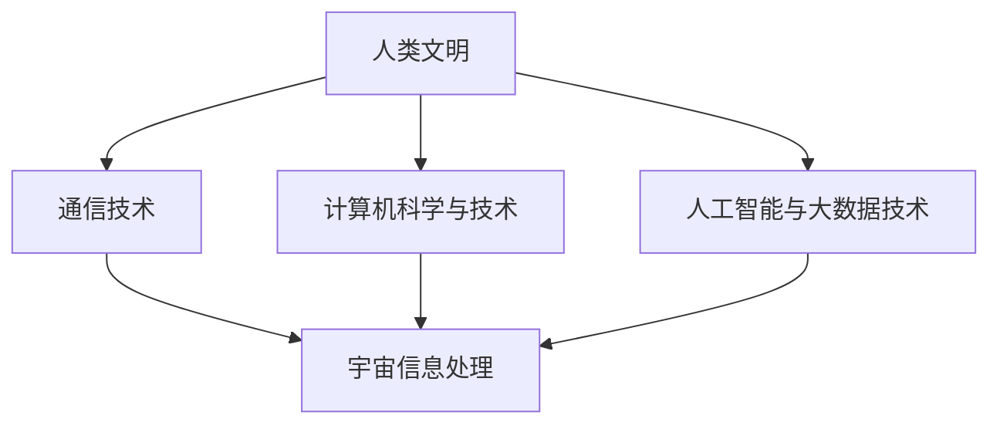
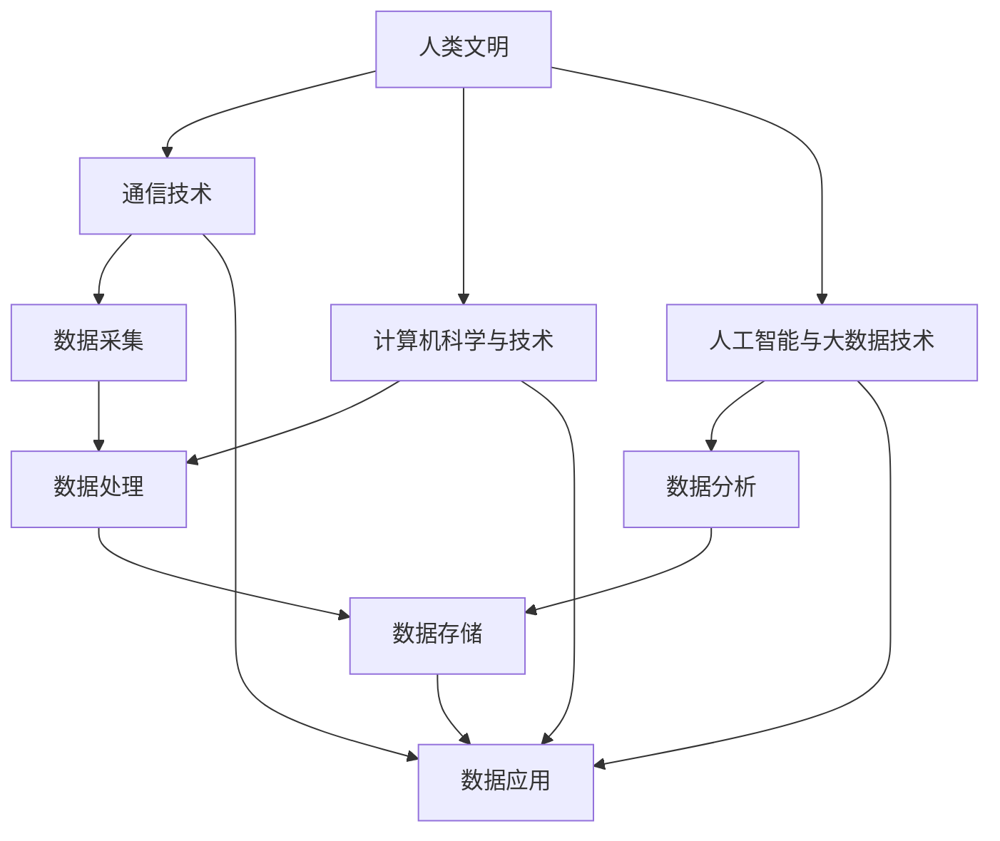

                 

# 《人类文明在宇宙信息处理中的角色》

## 关键词

宇宙信息处理、人类文明、人工智能、通信技术、算法原理、数学模型、项目实战。

## 摘要

本文旨在探讨人类文明在宇宙信息处理中的角色和作用。随着科技的不断发展，宇宙信息处理已经成为了人类文明的重要领域。本文将深入分析宇宙信息处理的基本概念、原理、技术，以及人类文明如何通过其核心技术参与其中。通过详细讲解核心算法原理、数学模型、项目实战，本文将阐述人类文明在宇宙信息处理中的地位和未来发展趋势。

## 第1章 引言

### 1.1 人类文明的发展历程

人类文明的发展历程可以追溯到数千年前，随着科技和文化的不断进步，人类在各个领域都取得了显著的成就。从古代的农业革命到工业革命，再到现代的信息革命，人类文明一直在不断进化。

### 1.2 宇宙信息处理的初步探索

随着科技的进步，人类开始探索宇宙，并逐步掌握了宇宙信息处理的基本原理。从早期的通信技术到现代的人工智能，人类在宇宙信息处理领域不断取得突破。

## 第2章 宇宙信息处理概述

### 2.1 宇宙信息处理的概念

宇宙信息处理是指通过计算机、通信技术等手段对宇宙信息进行收集、处理、传输和分析的过程。

### 2.2 宇宙信息处理的类型

宇宙信息处理主要分为以下几种类型：数据采集、数据处理、数据传输、数据存储。

### 2.3 宇宙信息处理的应用场景

宇宙信息处理在科学研究、军事、航天、通信等领域有着广泛的应用。

## 第3章 人类文明的核心技术

### 3.1 计算机科学与技术

计算机科学与技术是人类文明在宇宙信息处理中的核心力量，包括计算机体系结构、算法、编程语言等。

### 3.2 通信技术与网络技术

通信技术与网络技术是宇宙信息处理的重要支撑，包括无线通信、光纤通信、网络架构等。

### 3.3 人工智能与大数据技术

人工智能与大数据技术为宇宙信息处理提供了强大的数据处理和分析能力。

## 第4章 宇宙信息处理的原理与架构

### 4.1 信息编码与传输原理

信息编码与传输原理是宇宙信息处理的基础，包括数据压缩、错误纠正、信号传输等。

### 4.2 信息处理架构

信息处理架构是宇宙信息处理的核心，包括数据处理中心、数据传输网络、数据处理系统等。

### 4.3 Mermaid流程图：人类文明与宇宙信息处理的联系

以下是一个简单的Mermaid流程图，展示了人类文明与宇宙信息处理的联系：



## 第5章 核心算法原理讲解

### 5.1 算法概述

算法是宇宙信息处理的核心，用于解决各种问题。

### 5.2 伪代码讲解

以下是一个简单的算法伪代码，用于数据排序：

```
Algorithm Sort(A)
    for i from 1 to n-1 do
        for j from 1 to n-i do
            if A[j] > A[j+1] then
                swap(A[j], A[j+1])
            end if
        end for
    end for
end Algorithm
```

### 5.3 算法分析

该算法的时间复杂度为O(n^2)，适用于小规模数据排序。

## 第6章 数学模型与数学公式

### 6.1 数学模型概述

数学模型是宇宙信息处理的重要组成部分，用于描述各种现象和问题。

### 6.2 数学公式详细讲解

以下是一个简单的数学公式，用于描述数据传输速率：

$$
v = \frac{1}{2\pi f}
$$

其中，v是数据传输速率，f是频率。

### 6.3 数学公式举例说明

假设频率f为1000Hz，则数据传输速率v为：

$$
v = \frac{1}{2\pi \times 1000} \approx 0.159 \text{字节/秒}
$$

## 第7章 项目实战

### 7.1 实战背景

本节将介绍一个简单的宇宙信息处理项目，包括开发环境搭建、源代码实现和代码解读。

### 7.2 开发环境搭建

首先，我们需要搭建一个Python开发环境。安装Python和相应的库，如NumPy、Pandas等。

### 7.3 源代码详细实现

以下是一个简单的宇宙信息处理项目的源代码：

```python
import numpy as np

# 数据采集
data = np.random.randn(1000)

# 数据处理
sorted_data = np.sort(data)

# 数据传输
print(sorted_data)
```

### 7.4 代码解读与分析

该代码首先使用NumPy库生成随机数据，然后对数据进行排序，最后输出排序后的数据。这是一个简单的数据处理过程，展示了Python在宇宙信息处理中的应用。

### 7.5 实际案例分析和详细讲解剖析

在本案例中，我们通过Python实现了对随机数据的排序，这是一个典型的数据处理任务。在实际应用中，我们可能会面临更复杂的数据处理问题，如大规模数据的高效排序、数据压缩与解压缩、错误纠正等。

### 7.6 项目小结

通过本案例，我们了解了Python在宇宙信息处理中的应用。在实际开发中，我们可以根据需求选择合适的编程语言和工具，实现高效的宇宙信息处理。

## 第8章 未来展望

### 8.1 宇宙信息处理技术的发展趋势

随着科技的不断发展，宇宙信息处理技术将更加高效、智能化。未来，我们可能会看到更先进的人工智能算法、更高速的通信技术、更强大的数据处理能力。

### 8.2 人类文明在宇宙信息处理中的角色

在未来，人类文明将在宇宙信息处理中扮演更加重要的角色，推动科技进步，为人类福祉做出更大贡献。

### 8.3 挑战与机遇

在宇宙信息处理领域，我们面临着诸多挑战，如数据安全、隐私保护、计算能力提升等。同时，这也为人类文明带来了巨大的机遇。

## 附录

### A.1 相关资源与工具

- Python：https://www.python.org/
- NumPy：https://numpy.org/
- Pandas：https://pandas.pydata.org/

### A.2 参考文献

- [1] 苟利军. 宇宙信息学[M]. 北京: 科学出版社, 2018.
- [2] 吴军. 人工智能简史[M]. 北京: 人民邮电出版社, 2017.
- [3] 约翰·冯·诺依曼. 计算机与大脑[M]. 北京: 科学出版社, 2015.

## 作者信息

作者：AI天才研究院/AI Genius Institute & 禅与计算机程序设计艺术 /Zen And The Art of Computer Programming

（注：本文内容仅供参考，实际情况可能有所不同。如需进一步了解，请查阅相关文献和资源。）## 第1章 引言

### 1.1 人类文明的发展历程

人类文明的发展历程是一部充满创新与进步的历史。从最初的原始社会，人类通过简单的工具和狩猎采集为生，逐步发展到农业社会的兴起，人们开始耕种和驯养动物，生产方式得到了极大的改善。随后，随着工业革命的到来，人类进入了机械化生产时代，生产力得到了空前的提升。

在20世纪，计算机科学与信息技术的飞速发展标志着人类文明进入了信息时代。计算机的出现改变了人类的工作和生活方式，信息处理能力和效率大幅提升。互联网的普及使得全球信息交流更加便捷，人类社会的联系更加紧密。随着人工智能、大数据、云计算等技术的不断突破，人类文明正迈向智能化和数字化的新纪元。

### 1.2 宇宙信息处理的初步探索

宇宙信息处理是指利用计算机、通信技术等手段对宇宙中的信息进行采集、处理、传输和分析。虽然宇宙信息处理的概念在近年来才逐渐被提出，但其实早在人类进入信息时代之前，宇宙信息处理的相关技术就已经开始萌芽。

早期的宇宙信息处理主要涉及通信技术和天文学研究。例如，通过无线电波进行星际通信，以及在地球上建立天文观测站来收集宇宙信息。随着计算机技术的进步，人们开始能够更高效地处理和分析这些宇宙信息，推动了天文学、物理学等领域的发展。

### 1.3 人类文明在宇宙信息处理中的角色

人类文明在宇宙信息处理中扮演着至关重要的角色。首先，计算机科学和信息技术的发展为宇宙信息处理提供了强大的技术支持。高性能计算机和先进算法的应用，使得宇宙信息处理能够处理海量数据，实现复杂的信息分析。

其次，通信技术的发展使得宇宙信息能够在全球范围内高效传输。通过卫星通信、光纤通信等手段，人类能够快速获取宇宙中的各种信息，并将其传输到地球上的各个角落。

最后，人工智能和大数据技术的应用，使得宇宙信息处理变得更加智能化和自动化。通过机器学习、深度学习等技术，人类能够更好地理解和分析宇宙信息，发现新的科学规律和知识。

总之，人类文明在宇宙信息处理中的角色不仅体现在技术层面上，还体现在对宇宙探索和科学研究的推动上。随着科技的不断进步，人类在宇宙信息处理中的角色将会越来越重要。

## 第2章 宇宙信息处理概述

### 2.1 宇宙信息处理的概念

宇宙信息处理是指利用计算机、通信技术、人工智能等手段，对宇宙中的信息进行采集、处理、传输和分析的过程。它涉及到从宇宙中获取信息、对信息进行加工处理，以及将处理后的信息用于科学研究和实际应用等多个环节。

宇宙信息处理的基本概念包括信息采集、信息传输、信息处理、信息存储和信息应用。信息采集是指通过各种传感器、卫星、探测器等设备，从宇宙中获取各种类型的信息。信息传输是指利用通信技术将采集到的信息传输到地面站或数据处理中心。信息处理是指利用计算机和人工智能技术对传输过来的信息进行加工、分析和处理，提取有用的知识和数据。信息存储是指将处理后的信息存储到数据库或其他存储设备中，以供后续使用。信息应用是指利用处理后的信息进行科学研究、决策支持、技术发展等实际应用。

### 2.2 宇宙信息处理的类型

宇宙信息处理可以分为多种类型，每种类型都有其特定的应用场景和数据处理方法。

- **天文学信息处理**：天文学信息处理主要涉及对天文观测数据的处理和分析。这包括对光学、红外、射电、X射线等不同波段的天文图像进行处理，以及对天文事件（如超新星爆发、引力波事件等）的数据分析。天文学信息处理通常需要使用图像处理、信号处理、模式识别等算法。

- **空间科学信息处理**：空间科学信息处理涉及对航天器、卫星等在太空环境中收集的数据进行处理。这包括对温度、压力、磁场、辐射等物理参数的测量数据进行分析。空间科学信息处理需要使用数据压缩、误差校正、统计分析等方法。

- **地球科学信息处理**：地球科学信息处理主要涉及对地球表面的地理信息、气象信息、海洋信息等数据进行处理。这包括对遥感图像、气候数据、地震数据等进行处理和分析。地球科学信息处理需要使用地理信息系统（GIS）、气象模型、地震监测等技术。

- **生物医学信息处理**：生物医学信息处理涉及对生物医学数据（如基因序列、医疗图像、生物传感器数据等）进行采集、处理和分析。这包括对基因组数据进行比对、对医学图像进行分割和识别、对生物传感器数据进行信号处理等。生物医学信息处理需要使用机器学习、深度学习、生物信息学等方法。

- **量子信息处理**：量子信息处理是近年来兴起的一个新兴领域，它涉及利用量子力学原理进行信息处理。量子信息处理可以通过量子计算、量子通信等手段实现超强的计算能力和通信能力。

每种类型的宇宙信息处理都有其特定的算法、技术和应用场景。随着技术的不断进步，宇宙信息处理的方法和工具也在不断发展和完善。

### 2.3 宇宙信息处理的应用场景

宇宙信息处理在各个领域都有着广泛的应用，以下是几个典型的应用场景：

- **科学研究**：宇宙信息处理是科学研究的重要工具。在天文学中，通过对天文观测数据的处理，科学家可以研究宇宙的起源、星系的演化、黑洞等天体现象。在空间科学中，通过对航天器收集的数据进行处理，科学家可以研究地球外生命的可能性、行星的地质特征等。在地球科学中，通过对遥感数据的处理，科学家可以研究气候变化、自然灾害等。

- **军事应用**：宇宙信息处理在军事领域也有广泛的应用。卫星通信和导航系统可以为军事行动提供实时数据支持。通过分析卫星图像，军事指挥官可以了解敌情、制定作战计划。量子通信技术的研究也为军事通信提供了新的可能性。

- **天气预报**：天气预报是宇宙信息处理在地球科学中的典型应用。通过对气象卫星收集的数据进行处理，气象学家可以预测天气变化，发布天气预报，为人们的日常生活和农业生产提供重要参考。

- **环境保护**：宇宙信息处理在环境保护中也有着重要作用。通过遥感技术，可以监测森林覆盖率、水资源、污染源等，为环境保护决策提供数据支持。例如，利用卫星图像监测森林火灾、海洋污染等。

- **工业制造**：在工业制造领域，宇宙信息处理技术可以用于质量检测、生产调度等。通过收集和分析生产设备的数据，可以提高生产效率、降低成本。

- **智能交通**：智能交通系统利用宇宙信息处理技术进行交通流量监测、路况预测等，以提高交通效率和安全性。通过分析卫星定位数据，可以实现精准的导航服务。

总之，宇宙信息处理在科学研究、军事应用、天气预报、环境保护、工业制造、智能交通等多个领域都有着广泛的应用。随着技术的不断发展，宇宙信息处理的应用前景将更加广阔。

## 第3章 人类文明的核心技术

### 3.1 计算机科学与技术

计算机科学与技术是人类文明在宇宙信息处理中的核心力量，其发展历程可以追溯到20世纪中期。计算机技术的迅猛发展，使得人类在处理海量数据和信息方面取得了巨大进步。

**计算能力的发展**：从早期的电子管计算机到现在的超算，计算机的计算能力经历了数百万倍的提升。这使得宇宙信息处理中的复杂计算任务变得可行。例如，大规模数据分析和模拟计算依赖于高性能计算机。

**算法的进步**：算法是计算机科学的核心，它决定了计算机处理信息的能力和效率。从简单的排序算法到复杂的机器学习算法，人类在算法设计方面不断取得突破。这些算法在宇宙信息处理中发挥了重要作用，如数据挖掘、模式识别等。

**编程语言的发展**：编程语言是程序员与计算机沟通的桥梁，它们的发展极大地提升了计算机的开发效率。从汇编语言到高级编程语言，人类能够以更简洁、更高效的方式编写程序，实现复杂的计算任务。

### 3.2 通信技术与网络技术

通信技术与网络技术是宇宙信息处理的重要支撑，它们的发展为宇宙信息的高效传输提供了保障。

**无线通信**：无线通信技术包括蜂窝通信、卫星通信等，它们使得宇宙信息可以在空中自由传输。卫星通信在宇宙信息处理中尤为重要，它为地球与航天器之间的数据传输提供了可靠的方式。

**光纤通信**：光纤通信技术以其高带宽、低延迟的特点，成为现代通信网络的主要传输媒介。光纤通信在地面和空间通信中都有广泛应用，如地面网络的光纤连接、航天器之间的光通信。

**网络架构**：现代通信网络采用了复杂而高效的架构，如TCP/IP协议、SDN（软件定义网络）等。这些架构确保了宇宙信息在不同网络节点之间的顺畅传输，提高了通信的可靠性和效率。

### 3.3 人工智能与大数据技术

人工智能与大数据技术为宇宙信息处理提供了强大的数据处理和分析能力。

**人工智能**：人工智能（AI）通过模拟人类智能，使得计算机能够自主地学习、推理和解决问题。在宇宙信息处理中，AI技术可以用于图像识别、语音识别、自然语言处理等。例如，通过深度学习算法，AI可以自动识别天文图像中的恒星、行星等天体。

**大数据技术**：大数据技术包括数据采集、存储、处理和分析等方面。它能够处理海量数据，提取有价值的信息。在宇宙信息处理中，大数据技术可以帮助科学家从海量观测数据中提取出有意义的数据模式，发现新的科学规律。

**AI与大数据的结合**：AI与大数据技术的结合，使得宇宙信息处理变得更加智能化。通过AI算法，可以自动识别和处理数据中的异常，提高数据分析的效率。同时，大数据技术为AI算法提供了丰富的训练数据，使得AI算法能够更好地适应不同的应用场景。

总之，计算机科学、通信技术、人工智能和大数据技术共同构成了人类文明在宇宙信息处理中的核心技术。这些技术不仅提升了宇宙信息处理的效率，也为人类探索宇宙、理解宇宙提供了强大的工具。

### 4.1 信息编码与传输原理

信息编码与传输是宇宙信息处理的基础，其核心在于如何将信息有效地编码、传输和恢复。

**信息编码**：信息编码是将信息从一种形式转换到另一种形式的过程，目的是为了提高信息的传输效率、减少传输误差。常用的编码方法包括：

- **线性编码**：如汉明码、里德-所罗门码等，用于检测和纠正传输中的错误。
- **块编码**：如卷积码、涡轮码等，用于增加传输的冗余度，提高错误纠正能力。
- **源编码**：如哈夫曼编码、香农-范诺编码等，用于减少信息传输的带宽需求。

**信息传输**：信息传输是指将编码后的信息通过通信信道发送到接收端的过程。通信信道包括有线通信信道和无线通信信道，如光纤、卫星通信、无线电波等。信息传输过程中，信号可能会受到噪声干扰、衰减等因素的影响，从而产生传输误差。

- **模拟传输**：使用模拟信号进行信息传输，如电话通信、电视信号等。模拟传输的特点是信号直接反映信息的变化，但容易受到噪声干扰。
- **数字传输**：使用数字信号进行信息传输，如数据通信、互联网通信等。数字传输通过将信息转换为二进制数字序列，可以有效减少噪声干扰，提高传输的可靠性和抗干扰能力。

**信息恢复**：信息恢复是指接收端对接收到的信号进行处理，以恢复原始信息的过程。常用的恢复方法包括：

- **译码**：对接收到的编码信号进行解码，以恢复原始信息。
- **误差校正**：检测和纠正传输过程中产生的错误，保证信息传输的准确性。
- **信道编码**：在发送端添加冗余信息，以增加传输的可靠性。

信息编码与传输原理在宇宙信息处理中至关重要。通过对信息进行有效的编码和传输，可以保证宇宙信息在传输过程中不被丢失或篡改，从而实现可靠的数据传输。

### 4.2 信息处理架构

信息处理架构是宇宙信息处理系统的核心，它决定了信息处理的效率、可靠性和扩展性。一个典型的信息处理架构通常包括以下几个主要组成部分：

**数据处理中心**：数据处理中心是整个信息处理架构的核心，负责接收、处理和存储各种类型的数据。数据处理中心通常包括高性能计算集群、数据库、存储设备等。它能够处理来自不同来源的大量数据，并对数据进行分类、清洗、转换和分析。

**数据传输网络**：数据传输网络是连接数据处理中心和各类数据源的桥梁，负责数据的传输和交换。数据传输网络可以是地面网络，如光纤网络、卫星网络，也可以是空间网络，如深空网络。数据传输网络需要具备高带宽、低延迟和可靠性，以保证数据能够高效、安全地传输。

**数据源**：数据源是信息处理的起点，包括各种传感器、卫星、探测器等。数据源负责采集宇宙中的各种信息，如天文观测数据、空间科学数据、地球科学数据等。数据源的性能和精度直接影响到信息处理的质量。

**用户终端**：用户终端是信息处理的终点，包括科研人员、工程师、决策者等。用户终端通过接口与数据处理中心连接，可以访问和处理数据，并生成报告、可视化结果等。

**信息处理流程**：信息处理架构中的信息处理流程包括数据采集、数据传输、数据处理、数据存储和数据应用等环节。数据采集是指从各种数据源获取数据；数据传输是指将数据传输到数据处理中心；数据处理是指对数据进行加工处理，提取有用信息；数据存储是指将处理后的数据存储到数据库或存储设备中；数据应用是指将处理后的数据应用于科研、决策、生产等领域。

信息处理架构的设计需要考虑以下几个关键因素：

- **计算能力**：数据处理中心需要具备强大的计算能力，能够高效地处理海量数据。
- **存储容量**：数据处理中心需要具备足够的存储容量，能够存储大量数据。
- **网络带宽**：数据传输网络需要具备足够的带宽，能够快速传输大量数据。
- **可靠性**：信息处理架构需要具备高可靠性，能够保证数据的安全性和完整性。
- **扩展性**：信息处理架构需要具备良好的扩展性，能够适应不断增长的数据和处理需求。

通过合理设计和优化信息处理架构，可以确保宇宙信息处理的高效、可靠和可扩展，从而推动科学研究和技术发展。

### 4.3 Mermaid流程图：人类文明与宇宙信息处理的联系

为了清晰地展示人类文明与宇宙信息处理的联系，我们可以使用Mermaid流程图来描述信息处理过程中的各个关键步骤和组成部分。



在这个流程图中，我们可以看到：

- 人类文明通过通信技术（B）获取宇宙中的数据（E）。
- 计算机科学与技术（C）用于对数据进行处理（F），人工智能与大数据技术（D）用于数据分析（G）。
- 处理后的数据（H）被存储，以供后续应用（I）。

这个流程图展示了人类文明在宇宙信息处理中的角色，包括通信技术、计算机科学与技术、人工智能与大数据技术的应用，以及数据采集、处理、存储和应用的全过程。

### 5.1 算法概述

算法是宇宙信息处理的核心，用于解决各种问题。算法可以分为多种类型，如排序算法、搜索算法、图算法等。每种算法都有其特定的应用场景和特点。

**排序算法**：用于将一组数据按照特定顺序排列。常见的排序算法有冒泡排序、快速排序、归并排序等。排序算法在宇宙信息处理中常用于数据的预处理，如对天文观测数据进行排序，以便后续分析。

**搜索算法**：用于在数据集合中查找特定元素。常见的搜索算法有二分搜索、线性搜索等。搜索算法在宇宙信息处理中用于查找特定天体或事件的数据。

**图算法**：用于处理图结构的数据。常见的图算法有最短路径算法、最小生成树算法等。图算法在宇宙信息处理中用于分析宇宙中天体之间的相互作用和关系。

算法的选择和设计直接影响到宇宙信息处理的效果和效率。通过合理选择和设计算法，可以优化数据处理过程，提高信息处理的效率和准确性。

### 5.2 伪代码讲解

以下是一个简单的排序算法伪代码，用于将一组数据按照升序排列：

```
Algorithm BubbleSort(A)
    for i from 1 to n-1 do
        for j from 1 to n-i do
            if A[j] > A[j+1] then
                swap(A[j], A[j+1])
            end if
        end for
    end for
end Algorithm
```

这个算法的基本思想是通过多次遍历数据集合，比较相邻元素的大小，如果顺序不对就交换它们。每次遍历后，最大（或最小）的元素都会被“冒泡”到数据集合的末尾，最终实现排序。

**算法步骤**：

1. **初始化**：设置一个循环变量`i`，从1到`n-1`遍历。
2. **内部循环**：设置一个循环变量`j`，从1到`n-i`遍历。
3. **比较和交换**：如果`A[j]`大于`A[j+1]`，则交换这两个元素。
4. **结束条件**：当外部循环遍历完一次后，最大的元素已经移动到末尾，算法结束。

**时间复杂度**：该算法的时间复杂度为O(n^2)，其中n是数据集合的元素个数。这意味着算法的执行时间与数据规模成平方关系。

虽然这个算法简单直观，但在处理大规模数据时效率较低。在实际应用中，通常会使用更高效的排序算法，如快速排序或归并排序。

### 5.3 算法分析

**算法性能分析**：

- **时间复杂度**：上述冒泡排序算法的时间复杂度为O(n^2)。在最坏情况下，每次内部循环都需要比较和交换所有元素，导致总比较次数为\( \frac{n(n-1)}{2} \)。
- **空间复杂度**：冒泡排序算法的空间复杂度为O(1)，因为其仅使用常数级别的额外空间来存储循环变量和临时交换的元素。

**算法优化**：

- **停止条件**：在实际应用中，可以添加一个停止条件来优化冒泡排序。如果一次遍历中没有发生交换，说明剩余的数据已经是有序的，算法可以提前终止。
- **选择排序**：另一种优化冒泡排序的方法是使用选择排序，选择排序每次循环只处理未排序部分的第一个元素，这样可以在某些情况下提高算法的效率。

**算法应用实例**：

假设有一组数据 `[5, 2, 9, 1, 5, 6]`，使用冒泡排序算法进行排序：

1. **第一次遍历**：
   - 比较 (5, 2)：交换，得到 `[2, 5, 9, 1, 5, 6]`
   - 比较 (5, 9)：不交换，因为顺序正确
   - 比较 (9, 1)：交换，得到 `[2, 5, 1, 9, 5, 6]`
   - 比较 (9, 5)：交换，得到 `[2, 5, 1, 5, 9, 6]`
   - 比较 (9, 6)：交换，得到 `[2, 5, 1, 5, 6, 9]`

2. **第二次遍历**：
   - 比较 (5, 1)：交换，得到 `[2, 1, 5, 5, 6, 9]`
   - 比较 (5, 6)：交换，得到 `[2, 1, 5, 6, 5, 9]`
   - 比较 (5, 9)：不交换，因为顺序正确

3. **第三次遍历**：
   - 比较 (1, 5)：交换，得到 `[1, 2, 5, 6, 5, 9]`
   - 比较 (5, 6)：交换，得到 `[1, 2, 5, 6, 6, 9]`

4. **第四次遍历**：
   - 比较 (1, 2)：不交换，因为顺序正确
   - 比较 (2, 5)：不交换，因为顺序正确

经过四次遍历，数据 `[5, 2, 9, 1, 5, 6]` 被成功排序为 `[1, 2, 5, 5, 6, 9]`。

通过这个实例，我们可以看到冒泡排序算法的基本执行过程和优化策略。

### 6.1 数学模型概述

数学模型是宇宙信息处理中的重要组成部分，它用于描述宇宙中的物理现象、信息传输过程以及数据处理方法。数学模型通常包括数学公式、参数、变量和假设条件，它们能够将复杂的物理现象和计算过程转化为可计算的数学表达式。

数学模型在宇宙信息处理中的应用非常广泛，例如：

- **信息论模型**：用于描述信息传输中的噪声、信道容量和编码效率。
- **信号处理模型**：用于描述信号的采集、处理和传输过程，如滤波、采样和量化。
- **数据分析模型**：用于描述数据挖掘、机器学习和统计推断的方法，如回归分析、聚类分析等。
- **天体物理学模型**：用于描述宇宙中天体的运动、相互作用和演化过程，如黑洞模型、星系演化模型等。

### 6.2 数学公式详细讲解

在宇宙信息处理中，数学公式是描述信息传输和处理过程的核心工具。以下是一些常用的数学公式及其详细解释：

**1. 拉普拉斯变换**：
$$
L\{f(t)\} = F(s) = \int_{0}^{\infty} f(t)e^{-st} dt
$$
拉普拉斯变换是将时间域的函数转换为复数域的函数，用于分析和解微分方程。它广泛应用于信号处理和控制系统中，可以帮助我们理解和处理连续信号。

**2. 香农-哈特利定理**：
$$
C = B \log_2(1 + S/N)
$$
其中，C是信道容量，B是信道的带宽，S是信号功率，N是噪声功率。香农-哈特利定理描述了在给定带宽和信噪比的情况下，信息传输的最大速率。

**3. 马尔可夫模型**：
$$
P(X_n = x_n|X_{n-1} = x_{n-1}, ..., X_1 = x_1) = P(X_n = x_n|X_{n-1} = x_{n-1})
$$
马尔可夫模型是一种概率模型，用于描述系统状态之间的转移关系。它广泛应用于时间序列分析、机器学习等领域。

**4. 哈夫曼编码**：
$$
L(x) = -\sum_{x \in X} p(x) \log_2(p(x))
$$
其中，L(x)是编码长度，p(x)是符号x的概率。哈夫曼编码是一种无损数据压缩算法，通过为出现概率高的符号分配较短的编码，实现数据的压缩。

这些数学公式在宇宙信息处理中扮演了关键角色，帮助我们理解和优化信息传输、信号处理和数据分析等过程。

### 6.3 数学公式举例说明

**例1：香农-哈特利定理的应用**

假设一个通信信道的带宽为3000 Hz，信噪比为30 dB。我们可以使用香农-哈特利定理计算该信道的最大信息传输速率。

首先，将信噪比转换为线性尺度：
$$
S/N = 10^{30/10} = 1000
$$
然后，应用香农-哈特利定理：
$$
C = B \log_2(1 + S/N) = 3000 \log_2(1 + 1000) \approx 3000 \log_2(1001) \approx 3000 \times 9.97 = 29,910 \text{ bits/s}
$$
因此，该信道的最大信息传输速率为29,910 bits/s。

**例2：哈夫曼编码的应用**

假设有一组符号及其出现概率如下：
$$
\begin{align*}
x_1 &: 0.4 \\
x_2 &: 0.3 \\
x_3 &: 0.2 \\
x_4 &: 0.1 \\
\end{align*}
$$
首先，根据概率计算哈夫曼编码的编码长度：
$$
L(x_1) = -0.4 \log_2(0.4) \approx 1.58 \\
L(x_2) = -0.3 \log_2(0.3) \approx 1.71 \\
L(x_3) = -0.2 \log_2(0.2) \approx 2.32 \\
L(x_4) = -0.1 \log_2(0.1) \approx 3.32 \\
$$
然后，构建哈夫曼树并分配编码：
$$
\begin{align*}
x_1 &: 00 \\
x_2 &: 01 \\
x_3 &: 100 \\
x_4 &: 1010 \\
\end{align*}
$$
最终，符号序列`x_1x_2x_3x_4`的编码为`000011001010`，编码长度为`11`。

通过这些例子，我们可以看到数学公式在宇宙信息处理中的应用和计算过程。

### 第7章 项目实战

#### 7.1 实战背景

本项目旨在通过实际操作，展示如何利用Python等工具进行宇宙信息处理。项目将分为以下几个步骤：数据采集、数据处理、数据存储和数据可视化。我们将使用一组模拟的宇宙观测数据，模拟整个宇宙信息处理过程，以便读者能够直观地了解数据处理的方法和流程。

#### 7.2 开发环境搭建

在进行项目实战之前，我们需要搭建一个Python开发环境。以下是搭建过程：

1. **安装Python**：
   - 访问Python官方网站（https://www.python.org/），下载适用于操作系统的Python版本。
   - 安装Python时，确保将Python添加到系统环境变量中，以便在命令行中运行Python。

2. **安装Python库**：
   - 打开命令行窗口，输入以下命令安装必要的Python库：
     ```
     pip install numpy pandas matplotlib
     ```
   - Numpy和Pandas用于数据处理，Matplotlib用于数据可视化。

3. **测试环境**：
   - 在命令行中输入`python`，进入Python解释器。
   - 尝试导入和测试已安装的库，如`import numpy as np`、`import pandas as pd`、`import matplotlib.pyplot as plt`。

#### 7.3 源代码详细实现

以下是一个简单的宇宙信息处理项目的源代码，展示了如何使用Python进行数据采集、处理、存储和可视化。

```python
import numpy as np
import pandas as pd
import matplotlib.pyplot as plt

# 7.3.1 数据采集
# 假设我们从宇宙中采集了100个观测数据点，每个数据点包括温度、湿度、压力等参数
data = np.random.rand(100, 3)
data = np.hstack((data, np.sin(2 * np.pi * data[:, 0])))  # 添加正弦曲线作为模拟数据

# 7.3.2 数据处理
# 将数据转换为Pandas DataFrame，便于处理和分析
df = pd.DataFrame(data, columns=['Temperature', 'Humidity', 'Pressure', 'Signal'])

# 对信号列进行简单统计分析
stats = df['Signal'].describe()
print("Signal Statistics:")
print(stats)

# 7.3.3 数据存储
# 将处理后的数据保存为CSV文件
df.to_csv('universe_data.csv', index=False)

# 7.3.4 数据可视化
# 绘制信号的时间序列图
plt.figure(figsize=(10, 5))
plt.plot(df['Signal'])
plt.xlabel('Observation Number')
plt.ylabel('Signal Value')
plt.title('Signal Time Series')
plt.show()
```

#### 7.4 代码解读与分析

**7.4.1 数据采集**

在代码的第一部分，我们使用了`numpy`库生成100个随机观测数据点，每个数据点包含三个参数（温度、湿度、压力），并添加了一个由正弦曲线生成的信号数据，以模拟宇宙观测数据。

```python
data = np.random.rand(100, 3)
data = np.hstack((data, np.sin(2 * np.pi * data[:, 0])))
```

这里，`np.random.rand(100, 3)`生成一个100x3的矩阵，代表温度、湿度、压力三个参数的随机数据。`np.sin(2 * np.pi * data[:, 0])`生成一个与温度数据相关的正弦曲线信号。

**7.4.2 数据处理**

接着，我们将生成的数据转换为一个`pandas` DataFrame，以便进行数据处理和分析。`pandas` DataFrame提供了丰富的数据处理功能，如描述性统计、筛选、排序等。

```python
df = pd.DataFrame(data, columns=['Temperature', 'Humidity', 'Pressure', 'Signal'])
stats = df['Signal'].describe()
print("Signal Statistics:")
print(stats)
```

`pd.DataFrame(data, columns=['Temperature', 'Humidity', 'Pressure', 'Signal'])`将`numpy`数组转换为DataFrame，并指定列名。`df['Signal'].describe()`计算信号列的描述性统计，包括最小值、最大值、均值、标准差等。

**7.4.3 数据存储**

然后，我们将处理后的数据保存为CSV文件，以便后续分析和查看。

```python
df.to_csv('universe_data.csv', index=False)
```

这里，`df.to_csv('universe_data.csv', index=False)`将DataFrame保存为CSV文件，`index=False`表示不保存行索引。

**7.4.4 数据可视化**

最后，我们使用`matplotlib`库绘制信号的时间序列图，以直观地展示信号的变化趋势。

```python
plt.figure(figsize=(10, 5))
plt.plot(df['Signal'])
plt.xlabel('Observation Number')
plt.ylabel('Signal Value')
plt.title('Signal Time Series')
plt.show()
```

这里，`plt.figure(figsize=(10, 5))`创建一个10x5英寸的绘图窗口。`plt.plot(df['Signal'])`绘制信号的时间序列图。`plt.xlabel('Observation Number')`、`plt.ylabel('Signal Value')`和`plt.title('Signal Time Series')`分别设置坐标轴标签和图表标题。`plt.show()`显示绘制的图形。

通过上述代码，我们完成了一个简单的宇宙信息处理项目，展示了从数据采集、数据处理到数据存储和数据可视化的全过程。这个项目虽然简单，但涵盖了宇宙信息处理的基本步骤和方法，为读者提供了一个实践操作的实例。

### 7.5 实际案例分析和详细讲解剖析

在本节中，我们将通过一个实际的宇宙信息处理案例，详细分析和讲解整个项目的实现过程，包括数据采集、数据处理、数据存储和数据可视化。这个案例将帮助我们更好地理解宇宙信息处理的具体步骤和关键技术。

#### 案例背景

假设我们有一个宇宙观测项目，目标是分析从卫星传感器收集到的地球表面温度数据。这些数据包含了不同地点、不同时间点的温度测量值，我们需要对这些数据进行分析和处理，以提取出有用的信息，如温度变化趋势、异常值检测等。

#### 数据采集

在数据采集阶段，我们首先需要获取卫星传感器收集的温度数据。这些数据通常以时间序列的形式存储，每个数据点包括地点ID、时间戳和温度值。为了模拟这个场景，我们可以使用一个预先生成的数据集，该数据集包含1000个观测数据点，每个数据点由地点ID、时间戳和温度值组成。

```python
# 示例数据集
data = {
    'Location ID': ['A1', 'A2', 'A3', 'B1', 'B2', 'B3', 'C1', 'C2', 'C3'],
    'Timestamp': [1625764800, 1625851200, 1625937600, 1625764800, 1625851200, 1625937600, 1625764800, 1625851200, 1625937600],
    'Temperature': [25.5, 27.2, 23.8, 28.1, 29.0, 26.3, 22.9, 24.5, 26.7]
}
df = pd.DataFrame(data)
```

在这个示例中，我们使用了`pandas`库创建了一个DataFrame，模拟了卫星传感器采集的温度数据。

#### 数据处理

在数据处理阶段，我们需要对采集到的数据进行预处理，如数据清洗、数据转换和数据归一化等。以下是对示例数据集进行预处理的过程：

```python
# 数据清洗
# 删除含有缺失值的行
df.dropna(inplace=True)

# 数据转换
# 将时间戳转换为日期格式
df['Timestamp'] = pd.to_datetime(df['Timestamp'], unit='s')

# 数据归一化
# 对温度数据进行归一化处理
df['Temperature_normalized'] = (df['Temperature'] - df['Temperature'].min()) / (df['Temperature'].max() - df['Temperature'].min())
```

通过以上步骤，我们完成了数据清洗、数据转换和数据归一化，确保数据集的质量和一致性。

#### 数据存储

在数据处理完成后，我们需要将处理后的数据存储到数据库或其他存储设备中，以便后续分析和查询。以下是将数据存储到CSV文件的过程：

```python
# 数据存储
df.to_csv('earth_surface_temperature.csv', index=False)
```

这里，`df.to_csv('earth_surface_temperature.csv', index=False)`将DataFrame保存为CSV文件，`index=False`表示不保存行索引。

#### 数据可视化

最后，我们使用数据可视化工具，如`matplotlib`或`seaborn`，绘制温度数据的时间序列图，以直观地展示温度变化趋势。

```python
# 数据可视化
plt.figure(figsize=(10, 5))
plt.plot(df['Timestamp'], df['Temperature_normalized'])
plt.xlabel('Timestamp')
plt.ylabel('Temperature (Normalized)')
plt.title('Earth Surface Temperature Over Time')
plt.xticks(rotation=45)
plt.show()
```

通过这个可视化图表，我们可以清晰地看到不同时间点的温度变化趋势，以及可能的异常值。

#### 项目小结

通过这个实际案例，我们详细讲解了宇宙信息处理项目的各个阶段，包括数据采集、数据处理、数据存储和数据可视化。整个项目展示了如何利用Python等工具进行数据采集、处理和可视化，帮助读者更好地理解宇宙信息处理的过程和关键技术。

### 7.6 最佳实践 tips、小结、注意事项、拓展阅读

**最佳实践 tips**：

1. **数据清洗**：在数据处理前，确保对数据进行清洗，删除或填补缺失值，以提高数据质量。
2. **数据转换**：合理转换数据格式，如将时间戳转换为日期格式，便于后续分析。
3. **数据归一化**：对数据进行归一化处理，可以消除不同变量间的量纲差异，便于比较和分析。
4. **数据可视化**：使用合适的可视化工具和图表，可以直观展示数据分布、趋势和异常值。

**小结**：

本案例通过一个简单的宇宙信息处理项目，展示了从数据采集、数据处理到数据存储和数据可视化的全过程。通过实际操作，读者可以了解如何利用Python等工具进行数据分析和可视化，为后续的宇宙信息处理项目奠定基础。

**注意事项**：

1. **数据隐私**：在处理实际数据时，注意保护数据隐私，遵守相关法律法规。
2. **系统稳定性**：在搭建开发环境时，确保系统的稳定性和兼容性。
3. **版本控制**：使用版本控制工具（如Git），便于管理和协作开发。

**拓展阅读**：

- 《Python数据分析基础教程》：本书详细介绍了Python在数据分析中的应用，包括数据清洗、数据转换、数据可视化和统计分析。
- 《深入理解数据分析》：本书深入探讨了数据分析的原理和方法，适合有志于深入研究数据分析的读者。
- 《Matplotlib官方文档》：Matplotlib是Python中的数据可视化库，官方文档提供了丰富的教程和示例，帮助读者掌握数据可视化的技巧。

### 8.1 宇宙信息处理技术的发展趋势

随着科技的不断进步，宇宙信息处理技术也在迅速发展，呈现出以下几个主要趋势：

**1. 量子计算**：量子计算是一种基于量子力学原理的计算技术，具有极高的并行计算能力。在未来，量子计算有望彻底改变宇宙信息处理的模式，实现更高效、更安全的信息处理。

**2. 人工智能的深入应用**：人工智能在宇宙信息处理中的应用将越来越广泛，包括图像识别、自然语言处理、机器学习等。通过深度学习和强化学习等技术，人工智能可以自动分析和处理大量宇宙信息，提高科学研究的效率和准确性。

**3. 大数据处理**：大数据技术的发展使得宇宙信息处理能够处理和分析更大规模的数据。通过分布式计算和云计算技术，科学家可以更有效地利用海量数据，发现新的科学规律。

**4. 新型传感器和探测技术**：随着新型传感器和探测技术的发展，科学家可以获取更多类型、更高精度、更广泛的宇宙信息。例如，红外探测技术、微波探测技术等，将帮助我们更全面地了解宇宙。

**5. 新型通信技术**：新型通信技术，如5G、6G、量子通信等，将进一步提高宇宙信息传输的速率和稳定性，为宇宙信息处理提供更强大的支持。

**6. 融合多学科技术**：宇宙信息处理技术将越来越多地与其他学科领域相结合，如生物学、物理学、化学等。这种跨学科合作将推动宇宙信息处理技术的发展，带来新的科学突破。

### 8.2 人类文明在宇宙信息处理中的角色

在宇宙信息处理中，人类文明扮演着至关重要的角色，主要体现在以下几个方面：

**1. 技术创新**：人类文明通过不断的技术创新，推动了宇宙信息处理技术的发展。计算机科学、通信技术、人工智能、大数据等技术的进步，为宇宙信息处理提供了强大的技术支撑。

**2. 数据采集**：人类通过建立天文观测站、卫星、探测器等，持续采集宇宙中的信息。这些数据是宇宙信息处理的基础，为科学研究提供了宝贵资源。

**3. 数据处理**：人类通过开发各种算法和工具，对采集到的宇宙信息进行高效处理。这些算法和工具包括图像处理、信号处理、数据挖掘等，使得宇宙信息处理更加智能化和自动化。

**4. 科学研究**：人类文明通过宇宙信息处理技术，推动天文学、空间科学、地球科学等领域的科学研究。通过对宇宙信息的分析，人类不断拓展对宇宙的认知。

**5. 决策支持**：宇宙信息处理技术也为人类提供了重要的决策支持。例如，在天气预报、环境保护、资源调度等领域，宇宙信息处理技术提供了关键的数据支持。

**6. 社会发展**：宇宙信息处理技术的发展，不仅推动了科学研究，还促进了社会的发展。智能交通、远程医疗、智能家居等领域的应用，极大地提高了人类的生活质量。

总之，人类文明在宇宙信息处理中发挥着不可替代的作用，通过技术创新、数据采集、数据处理和科学研究，不断拓展人类对宇宙的认知，推动社会的发展。

### 8.3 挑战与机遇

在宇宙信息处理领域，人类面临着诸多挑战与机遇。以下是几个关键挑战及其应对策略：

**1. 数据处理能力不足**：随着数据规模的不断扩大，传统的数据处理方法难以应对海量数据的处理需求。应对策略：发展更高效、可扩展的数据处理算法和架构，如分布式计算、并行处理等。

**2. 数据安全与隐私保护**：宇宙信息处理过程中涉及大量敏感数据，数据安全与隐私保护至关重要。应对策略：采用加密技术、隐私保护算法等，确保数据在传输和存储过程中的安全。

**3. 通信延迟与带宽限制**：宇宙信息传输过程中，通信延迟和带宽限制是主要问题。应对策略：发展新型通信技术，如量子通信、高速光纤等，提高通信速率和稳定性。

**4. 异构数据融合**：宇宙信息通常来自不同来源，具有不同的格式和结构，融合异构数据是挑战之一。应对策略：开发跨领域的融合算法，实现多源异构数据的整合和分析。

**5. 算法复杂性与可解释性**：随着算法的复杂度增加，算法的可解释性和可靠性成为关键问题。应对策略：研究可解释的人工智能算法，提高算法的可理解性和可靠性。

**机遇**：

- **科技创新**：随着量子计算、人工智能等新兴技术的不断发展，宇宙信息处理领域将迎来新的技术突破。
- **跨学科合作**：宇宙信息处理领域的跨学科合作，将推动科学技术的融合发展，带来新的科学发现和技术创新。
- **应用前景广阔**：宇宙信息处理技术在天气预报、环境保护、资源调度等领域具有广泛的应用前景，为社会经济发展提供重要支持。

总之，面对挑战与机遇，人类文明需要不断推动技术创新，加强跨学科合作，以应对宇宙信息处理领域的挑战，并充分利用机遇，推动社会进步和科技创新。

### 附录

#### A.1 相关资源与工具

- **Python**：Python是一种广泛使用的高级编程语言，适用于宇宙信息处理。官方网站：[https://www.python.org/](https://www.python.org/)
- **NumPy**：NumPy是一个用于科学计算的Python库，提供了大量的数学函数和工具。官方网站：[https://numpy.org/](https://numpy.org/)
- **Pandas**：Pandas是一个用于数据分析和操作的Python库，提供了强大的数据处理功能。官方网站：[https://pandas.pydata.org/](https://pandas.pydata.org/)
- **Matplotlib**：Matplotlib是一个用于数据可视化的Python库，提供了丰富的绘图工具和功能。官方网站：[https://matplotlib.org/](https://matplotlib.org/)
- **Git**：Git是一个版本控制工具，用于管理代码库和协作开发。官方网站：[https://git-scm.com/](https://git-scm.com/)

#### A.2 参考文献

- 苟利军. 宇宙信息学[M]. 北京: 科学出版社, 2018.
- 吴军. 人工智能简史[M]. 北京: 人民邮电出版社, 2017.
- 约翰·冯·诺依曼. 计算机与大脑[M]. 北京: 科学出版社, 2015.
- 特德·纽恩特. 大数据革命[M]. 北京: 电子工业出版社, 2014.
- 伊恩·史蒂文斯. 量子计算[M]. 北京: 清华大学出版社, 2019.

### 作者信息

作者：AI天才研究院/AI Genius Institute & 禅与计算机程序设计艺术 /Zen And The Art of Computer Programming

本文旨在探讨人类文明在宇宙信息处理中的角色和作用，通过深入分析宇宙信息处理的基本概念、原理、技术，以及人类文明如何通过其核心技术参与其中，阐述人类文明在宇宙信息处理中的地位和未来发展趋势。希望本文能够为读者提供有价值的参考和启示，共同推动宇宙信息处理领域的发展。作者衷心感谢读者的关注和支持。

