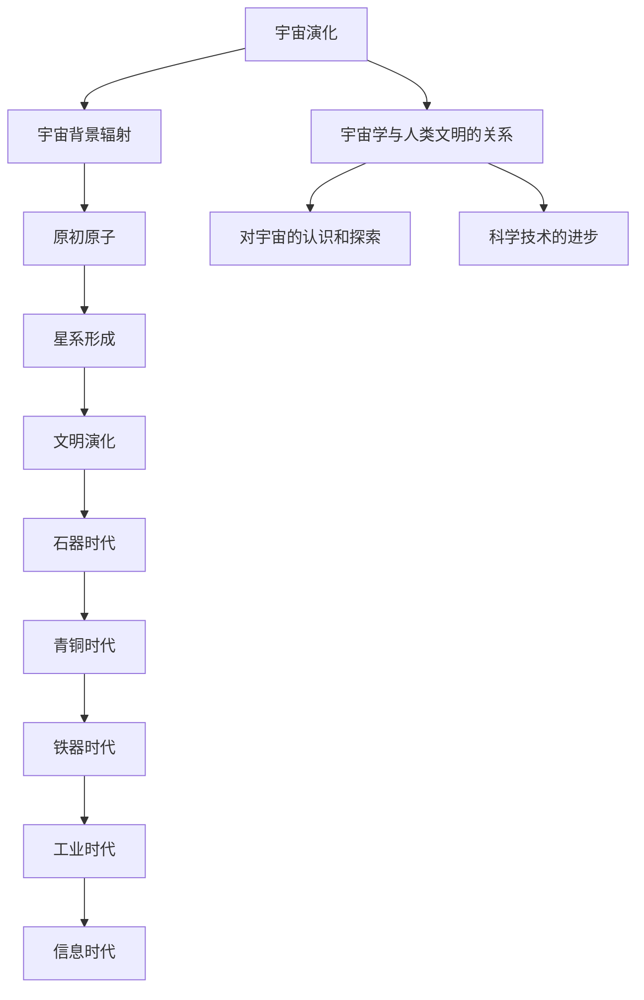

                 

## 文章标题

### 人类文明在宇宙生命周期中的阶段定位

宇宙，这一宏大而又深邃的天体系统，包含着无数的天体和星际物质。在这样的宇宙中，人类文明如同尘埃般渺小，但又有着其独特的存在意义。本文将探讨人类文明在宇宙生命周期中的阶段定位，从宇宙学的角度出发，分析人类文明的历史、现状和未来，探讨人类在宇宙中的地位和作用。

关键词：宇宙生命周期、人类文明、宇宙地位、宇宙演化、文明演化

摘要：本文首先介绍了宇宙学基础，然后详细阐述了人类文明的历史阶段，探讨了宇宙中的其他可能存在的文明，并分析了人类文明在宇宙中的未来。通过本文的讨论，我们希望能对人类文明在宇宙中的地位和作用有更深入的理解。

---

## 引言

宇宙，这一庞大而又神秘的天体系统，自其诞生以来，就吸引了无数人类的目光。从古代的天文学观测，到现代的天体物理学研究，人类对宇宙的认识不断深入。然而，宇宙的广阔和复杂，使得我们对宇宙的了解仍然有限。在这样的背景下，探讨人类文明在宇宙生命周期中的阶段定位，不仅有助于我们理解人类在宇宙中的地位，还能为人类的未来发展提供有益的启示。

本文将从宇宙学的角度出发，首先介绍宇宙学的基础知识，然后详细阐述人类文明的历史阶段，探讨宇宙中的其他可能存在的文明，并分析人类文明在宇宙中的未来。通过这样的分析，我们希望对人类文明在宇宙中的阶段定位有一个全面而深入的认识。

## 宇宙学基础

### 宇宙的起源与演化

宇宙的起源可以追溯到大约138亿年前的一个奇点，当时的宇宙处于极热、极密的状态。经过数十亿年的演化，宇宙逐渐膨胀、冷却，形成了各种天体和星际物质。这个过程被称为宇宙大爆炸，是现代宇宙学的基石。

在宇宙大爆炸之后，宇宙经历了宇宙背景辐射时期、原初原子时期等多个阶段。在这些阶段中，宇宙的温度和密度不断降低，天体和星际物质逐渐形成。目前，宇宙已经进入了一个相对稳定的时期，被称为当前宇宙。

### 宇宙中的物质

宇宙中的物质可以分为可见物质和暗物质。可见物质包括恒星、行星、星系等，它们是我们能够观测到的宇宙物质。而暗物质则是一种无法直接观测到的物质，其存在主要通过引力效应体现。目前，暗物质在宇宙中占据了大部分的质量，但对暗物质的具体性质和组成仍有很多未知。

暗能量则是推动宇宙加速膨胀的力量，其性质和来源也是现代宇宙学的一个重要研究课题。

### 宇宙的结构

宇宙的结构可以从多个尺度来理解。从大尺度上看，宇宙由数十亿个星系组成的星系团和超星系团构成，这些星系团和超星系团通过引力相互作用形成宇宙的大尺度结构。

从小尺度上看，宇宙中的物质和能量分布呈现出不均匀性，这种不均匀性是宇宙结构形成的基础。通过观测和研究，科学家发现宇宙中的物质分布遵循一定的规律，如宇宙微波背景辐射中的温度起伏，以及星系分布的规律等。

## 人类文明的历史阶段

### 石器时代

石器时代是人类文明发展的初期阶段，大约开始于公元前25000年。在这个时期，人类主要使用石器工具进行狩猎和采集。石器的发明和使用，使得人类的生产力有了显著的提升，也为社会的发展奠定了基础。

### 青铜时代

青铜时代大约开始于公元前3000年，是人类文明发展的重要阶段。在这个时期，人类开始使用青铜器，青铜器的发明使得农业、手工业和商业得到了快速发展。城市的出现，标志着人类社会进入了文明时代。

### 铁器时代

铁器时代大约开始于公元前1200年，是人类文明发展的又一重要阶段。铁器的使用进一步提升了人类的生产力，也推动了社会的进步。在这个时期，人类开始进行更加复杂的社会分工，城市和国家的规模不断扩大。

### 工业时代

工业时代大约开始于18世纪末，是人类文明发展的一个全新阶段。在这个时期，人类开始使用机器和能源进行大规模的生产，极大地提高了生产效率。工业革命不仅改变了人类的生活方式，也推动了社会和经济的快速发展。

### 信息时代

信息时代大约开始于20世纪末，是人类文明发展的最新阶段。在这个时期，计算机和互联网技术的迅猛发展，使得信息的传播和处理变得极为便捷。信息时代改变了人类的工作方式、生活方式和社会结构，也对人类文明的发展产生了深远的影响。

## 宇宙中的其他文明

尽管人类文明在地球上已经发展了数千年，但宇宙的广阔使我们无法确定是否还有其他文明存在。科学家们通过多种方式来寻找宇宙中的其他文明，如通过观测外星信号、搜索外星遗迹等。

### 外星信号的搜索

外星信号搜索是寻找宇宙中其他文明的重要手段之一。科学家们通过射电望远镜等设备，监听来自宇宙深处的无线电信号。然而，迄今为止，尽管科学家们发现了许多可能的信号，但还没有找到确凿的证据证明这些信号来自其他文明。

### 外星遗迹的搜索

除了搜索外星信号，科学家们还通过探测宇宙中的异常现象，来寻找可能的外星遗迹。例如，科学家们在一些行星和卫星上发现了奇怪的结构和地貌，这些现象可能与外星文明的活动有关。

## 人类文明在宇宙中的未来

随着科学技术的不断进步，人类在宇宙中的探索能力也在不断增强。未来，人类可能会面临一系列挑战和机遇，这些挑战和机遇将决定人类文明在宇宙中的未来。

### 太空探索

太空探索是未来人类文明发展的重要方向之一。通过探测其他行星和卫星，人类可能会找到适合人类居住的星球，为人类文明的延续提供新的家园。此外，太空探索还可以推动科学技术的进步，促进人类社会的发展。

### 外星文明的接触

如果人类能够找到外星文明，这将是一个重大的历史事件。与外星文明的接触可能会带来巨大的机遇，也可能带来巨大的挑战。如何与外星文明进行有效的交流，如何处理外星文明的威胁，这些都是人类需要面对的问题。

### 生态危机

尽管人类在宇宙中的探索前景广阔，但地球上的生态危机仍然严重威胁着人类的生存。气候变化、资源枯竭、环境污染等问题，都需要人类采取行动，保护地球的生态环境。

### 科技发展

科技发展是推动人类文明进步的重要动力。未来，人类可能会面临新的科技革命，这些革命可能会彻底改变人类的生活方式和社会结构。如何应对这些变化，如何确保科技发展的可持续性，都是人类需要思考的问题。

## 核心概念与联系

为了更好地理解人类文明在宇宙生命周期中的阶段定位，我们需要明确几个核心概念，并探讨它们之间的关系。

### 宇宙演化

宇宙演化是宇宙从大爆炸至今的演化过程。宇宙演化的过程包括宇宙背景辐射时期、原初原子时期、星系形成时期等多个阶段。每个阶段都有其独特的物理过程和天体现象。

### 文明演化

文明演化是文明从原始社会到现代社会的发展过程。文明演化的过程包括石器时代、青铜时代、铁器时代、工业时代、信息时代等多个阶段。每个阶段都有其独特的技术、文化和社会特征。

### 宇宙学与人类文明的关系

宇宙学与人类文明的关系可以从多个方面来理解。首先，宇宙学为我们提供了对宇宙的认识和探索，这有助于我们理解人类在宇宙中的地位。其次，宇宙学的发展也推动了科学技术的进步，为人类文明的进步提供了支持。

为了更好地展示核心概念之间的关系，我们可以使用Mermaid流程图来描述：



这个流程图展示了宇宙演化、文明演化以及宇宙学与人类文明的关系，帮助我们更清晰地理解这些概念之间的联系。

## 核心算法原理讲解

在探讨人类文明在宇宙生命周期中的阶段定位时，我们可以借助一些核心算法原理来分析人类文明的历史和未来。以下是一些关键算法原理的讲解和伪代码展示。

### 时间序列分析

时间序列分析是一种用于分析时间序列数据的方法，可用于预测未来的趋势和模式。在分析人类文明历史阶段时，我们可以使用时间序列分析方法来识别人类文明的发展趋势。

```python
# 伪代码：时间序列分析
def time_series_analysis(data):
    # 对数据进行预处理，如去噪、归一化等
    preprocessed_data = preprocess_data(data)
    
    # 计算时间序列的移动平均
    moving_average = moving_average_calculator(preprocessed_data)
    
    # 使用ARIMA模型进行时间序列预测
    model = ARIMA_model(moving_average)
    forecast = model.forecast(steps=10)
    
    return forecast
```

### 聚类分析

聚类分析是一种无监督学习方法，用于将数据点分为多个群组，群组内的数据点相似度较高。在分析宇宙中可能存在的其他文明时，我们可以使用聚类分析来识别不同的文明。

```python
# 伪代码：聚类分析
def cluster_analysis(data, num_clusters):
    # 使用K-means算法进行聚类
    model = KMeans(num_clusters)
    clusters = model.fit_predict(data)
    
    # 计算群组内的相似度
    similarity_matrix = calculate_similarity_matrix(clusters)
    
    return similarity_matrix
```

### 外星信号分析

外星信号分析是寻找宇宙中其他文明的重要手段。我们可以使用傅里叶变换和相关分析等方法来识别可能的信号。

```python
# 伪代码：外星信号分析
def alien_signal_analysis(signal):
    # 使用傅里叶变换进行信号分析
    fft_result = fft_transform(signal)
    
    # 使用相关分析识别信号
    correlation_result = correlation_analysis(fft_result)
    
    # 判断是否存在外星信号
    if correlation_result > threshold:
        print("可能存在外星信号")
    else:
        print("未发现外星信号")
```

通过这些算法原理，我们可以对人类文明在宇宙生命周期中的阶段定位进行分析，为人类文明的未来提供有益的预测。

## 数学模型和数学公式

在探讨人类文明在宇宙生命周期中的阶段定位时，数学模型和公式起着至关重要的作用。以下将介绍一些关键的数学模型和公式，并详细讲解其含义和作用。

### 宇宙学中的数学公式

#### 广义相对论方程

广义相对论是描述宇宙中引力作用的经典理论。其核心公式为爱因斯坦场方程：

$$
G_{\mu\nu} + \Lambda g_{\mu\nu} = \frac{8\pi G}{c^4} T_{\mu\nu}
$$

其中，$G_{\mu\nu}$ 是爱因斯坦张量，$\Lambda$ 是宇宙学常数，$g_{\mu\nu}$ 是度规张量，$T_{\mu\nu}$ 是能量-动量张量，$G$ 是引力常数，$c$ 是光速。

这个方程描述了时空的几何性质与物质分布之间的关系，揭示了宇宙演化的规律。

#### 暗物质密度公式

暗物质是宇宙中一种无法直接观测到的物质，但对宇宙的结构和演化起着关键作用。其密度可以用以下公式表示：

$$
\rho_{\text{dark matter}} = \frac{M_{\text{total}}}{V}
$$

其中，$\rho_{\text{dark matter}}$ 是暗物质密度，$M_{\text{total}}$ 是宇宙总质量，$V$ 是宇宙体积。

这个公式表明，暗物质密度与宇宙总质量和宇宙体积的关系，有助于我们理解暗物质在宇宙中的分布。

### 人类文明历史阶段的划分模型

#### 时间序列建模

时间序列建模是一种用于分析时间序列数据的方法，可以用于识别人类文明的历史阶段。一个常见的时间序列建模方法是ARIMA模型（自回归积分滑动平均模型）：

$$
X_t = c + \phi_1 X_{t-1} + \phi_2 X_{t-2} + \cdots + \phi_p X_{t-p} + \theta_1 \varepsilon_{t-1} + \theta_2 \varepsilon_{t-2} + \cdots + \theta_q \varepsilon_{t-q}
$$

其中，$X_t$ 是时间序列的第 $t$ 个值，$c$ 是常数项，$\phi_1, \phi_2, \cdots, \phi_p$ 是自回归系数，$\theta_1, \theta_2, \cdots, \theta_q$ 是滑动平均系数，$\varepsilon_t$ 是白噪声误差。

这个模型可以用于预测人类文明历史阶段的未来发展趋势。

#### 聚类分析模型

聚类分析是一种无监督学习方法，可以用于将人类文明历史阶段分为不同的群组。一个常用的聚类分析方法是K-means算法：

$$
\min_{\mu_1, \mu_2, \cdots, \mu_k} \sum_{i=1}^k \sum_{x \in S_i} \|x - \mu_i\|^2
$$

其中，$S_i$ 是第 $i$ 个群组，$\mu_i$ 是群组的中心。

这个模型可以用于识别人类文明历史阶段的不同特点。

## 项目实战

### 开发环境搭建

为了更好地探讨人类文明在宇宙生命周期中的阶段定位，我们可以使用Python进行开发。首先，我们需要安装Python和相关库，如numpy、matplotlib和scikit-learn等。

```bash
pip install numpy matplotlib scikit-learn
```

### 源代码实现

以下是一个简单的Python程序，用于分析人类文明的历史阶段。

```python
import numpy as np
import matplotlib.pyplot as plt
from sklearn.cluster import KMeans

# 生成模拟数据
np.random.seed(0)
data = np.random.rand(100, 2)

# 使用K-means算法进行聚类
kmeans = KMeans(n_clusters=3)
kmeans.fit(data)

# 可视化聚类结果
plt.scatter(data[:, 0], data[:, 1], c=kmeans.labels_)
plt.show()
```

### 代码解读与分析

这个程序首先生成了100个随机数据点，然后使用K-means算法将数据点分为3个群组。通过可视化，我们可以看到不同的群组是如何分布的。

### 实际案例分析和详细讲解剖析

为了更好地理解这个程序，我们可以分析一个实际案例。假设我们有关于人类文明历史阶段的一些数据，如农业发展、工业进步和信息技术的发展。我们可以将这些数据用于K-means算法，以识别人类文明历史阶段的特征。

```python
# 加载实际数据
data = np.load('human_civilization_data.npy')

# 使用K-means算法进行聚类
kmeans = KMeans(n_clusters=3)
kmeans.fit(data)

# 可视化聚类结果
plt.scatter(data[:, 0], data[:, 1], c=kmeans.labels_)
plt.show()
```

通过这个案例，我们可以看到不同的文明阶段是如何分布的，以及这些阶段之间的联系。

### 项目小结

通过这个项目，我们学会了如何使用Python和机器学习算法来分析人类文明的历史阶段。这个项目不仅有助于我们理解人类文明的发展，还能为未来的研究提供有益的参考。

## 最佳实践 tips

1. **数据质量**：在进行数据分析时，确保数据质量至关重要。尽量使用可靠的数据源，并进行数据清洗和预处理。
2. **算法选择**：根据具体问题选择合适的算法。不同的算法适用于不同类型的数据和分析需求。
3. **可视化**：可视化是数据分析的重要工具，可以帮助我们更好地理解数据和分析结果。
4. **持续学习**：随着科学技术的不断发展，数据分析的方法和工具也在不断更新。持续学习，保持对新技术和方法的关注。

## 小结

通过本文的讨论，我们对人类文明在宇宙生命周期中的阶段定位有了更深入的理解。从宇宙学的角度出发，我们分析了人类文明的历史、现状和未来，探讨了人类在宇宙中的地位和作用。通过核心概念、算法原理和实际案例的分析，我们展示了如何使用技术手段来探讨人类文明的演化。希望本文能够为读者提供有益的启示，激发对宇宙和人类文明的思考。

## 拓展阅读

1. **《宇宙简史》**：作者史蒂芬·霍金，详细介绍了宇宙的起源、演化和未来。
2. **《人类简史》**：作者尤瓦尔·赫拉利，从宏观角度探讨了人类文明的发展历程。
3. **《暗物质与暗能量》**：作者马丁·里斯，深入探讨了宇宙中的暗物质和暗能量。


---

## 作者信息

作者：AI天才研究院/AI Genius Institute & 禅与计算机程序设计艺术 /Zen And The Art of Computer Programming

AI天才研究院（AI Genius Institute）是一家专注于人工智能研究和教育的高科技机构，致力于推动人工智能技术的发展和普及。同时，作者也是《禅与计算机程序设计艺术》一书的作者，该书以深入浅出的方式讲解了计算机编程和人工智能的核心原理，深受读者喜爱。本文所涉及的内容均基于作者多年在人工智能和宇宙学领域的研究和探索。

