                 

### 文章标题：博弈论：自然竞争的数学策略

博弈论，一种研究决策制定的数学理论，广泛应用于经济学、政治学、社会学、生物学等领域。本文旨在系统性地介绍博弈论的基本概念、核心原理以及其在自然竞争中的应用，旨在帮助读者理解这一重要的数学策略，并掌握其在实际生活中的应用。

本文将首先对博弈论进行概述，介绍其基本概念和起源，随后详细探讨博弈论的基本要素，包括参与者、行动和策略、支付和结果。接下来，文章将深入分析零和博弈和非零和博弈，探讨其概念、例子和解法。随后，我们将介绍博弈论在经济学和社会科学中的应用，并通过数学模型和策略选择进一步探讨博弈论的核心思想。最后，我们将探讨博弈论在自然竞争中的应用，并总结文章，提供最佳实践和拓展阅读建议。

通过阅读本文，读者将不仅能够掌握博弈论的基本知识，还能够理解其在现实世界中的应用，从而更好地应对各种竞争和决策问题。

### 文章关键词

- 博弈论
- 自然竞争
- 数学策略
- 经济学
- 社会科学
- 零和博弈
- 非零和博弈
- 策略选择
- 数学模型

### 文章摘要

本文旨在系统性地介绍博弈论的基本概念、核心原理以及其在自然竞争中的应用。首先，文章概述了博弈论的基本概念和历史背景，随后详细探讨了博弈论的基本要素，包括参与者、行动和策略、支付和结果。接着，文章深入分析了零和博弈和非零和博弈的概念、例子和解法。随后，文章介绍了博弈论在经济学和社会科学中的应用，并通过数学模型和策略选择进一步探讨博弈论的核心思想。最后，文章探讨了博弈论在自然竞争中的应用，总结了文章的主要内容，并提供了最佳实践和拓展阅读建议。

### 第1章：博弈论概述

#### 1.1 博弈论的基本概念

博弈论，又称对策论，是一种研究具有冲突或合作特点的决策制定过程的数学理论。博弈论的核心是研究参与者在给定约束条件下如何做出最优决策，以最大化自己的利益。博弈论的基本概念包括参与者、行动、策略、支付和结果。

- **参与者**：博弈中的决策制定者，可以是个人、团队或组织。
- **行动**：参与者在博弈中可以选择的行为。
- **策略**：参与者制定的决策规则，用于指导其在博弈过程中的行动选择。
- **支付**：参与者根据博弈结果获得的收益或损失。
- **结果**：博弈的最终状态，由所有参与者的行动和策略共同决定。

#### 1.2 博弈论的历史背景

博弈论的发展历史可以追溯到20世纪初。1944年，约翰·冯·诺伊曼（John von Neumann）和经济学家奥斯卡·摩根斯顿（Oskar Morgenstern）共同出版了《博弈论与经济行为》（Game Theory and Economic Behavior），这本书被认为是博弈论的奠基之作。随后，约翰·纳什（John Nash）等人在20世纪50年代对博弈论进行了进一步的研究，提出了纳什均衡等重要概念，为博弈论的发展奠定了基础。

#### 1.3 博弈论在现实世界中的应用

博弈论在现实世界中有广泛的应用，包括但不限于以下领域：

- **经济学**：博弈论用于分析市场竞争、垄断行为、价格竞争和合作策略等。
- **政治学**：博弈论用于分析国际关系、选举策略和公共选择等。
- **社会学**：博弈论用于分析社会互动、合作与竞争行为等。
- **生物学**：博弈论用于分析物种间的竞争、合作和进化等。

下面是一个Mermaid流程图，展示了博弈论的基本概念和参与者之间的关系：

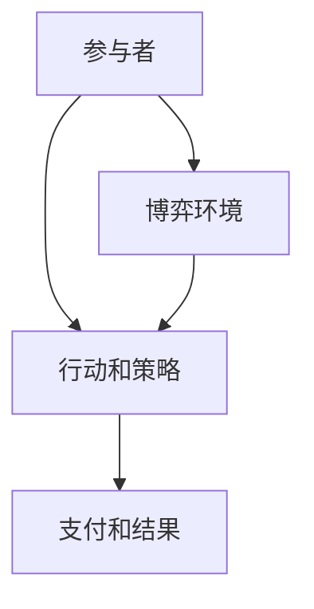

通过这个流程图，我们可以看到参与者、行动、策略和支付之间的紧密联系，以及它们在博弈环境中的相互作用。

### 第2章：博弈论的基本要素

博弈论的核心在于分析参与者的决策过程，这需要明确博弈的基本要素，即参与者、行动、策略、支付和结果。以下是这些基本要素的详细探讨。

#### 2.1 参与者

参与者是博弈论中的基本单位，可以是个人、组织、国家或其他实体。每个参与者都有自己的目标，并在博弈中根据自身利益做出决策。参与者的数量可以是两个或多个，根据不同的情况，博弈可以分为两人博弈、多人博弈和群体博弈。

在两人博弈中，每个参与者只能选择有限数量的策略，而多人博弈中，参与者数量增加，策略组合也随之增多。群体博弈则更复杂，参与者之间存在复杂的互动和依赖关系。

#### 2.2 行动和策略

行动是参与者在博弈过程中采取的具体行为。每个参与者根据当前博弈状态和自身策略选择一个或多个行动。策略是参与者为了实现自身目标而制定的决策规则，它指导参与者在不同情况下如何选择行动。

策略可以是确定的（纯策略）或不确定的（混合策略）。纯策略是指参与者始终选择某个特定的行动，而混合策略是指参与者以一定的概率选择多个不同的行动。

下面是一个两人博弈中的行动和策略的Mermaid流程图示例：

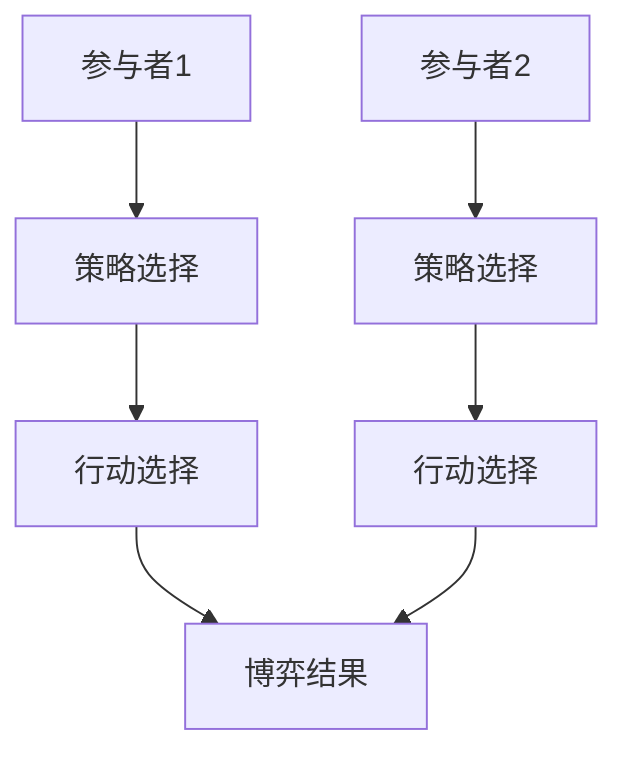

在这个流程图中，A1和A2代表两个参与者，B1和B2代表他们的策略选择，C1和C2代表他们的行动选择，D代表博弈结果。

#### 2.3 支付和结果

支付是参与者根据博弈结果获得的收益或损失。在博弈论中，支付通常用矩阵表示，每个元素代表一个参与者的收益。支付矩阵通常表示为：

|      | 行动1   | 行动2   |
|------|---------|---------|
| 策略1 | 支付11  | 支付12  |
| 策略2 | 支付21  | 支付22  |

在这个矩阵中，支付11表示当参与者1选择策略1，参与者2选择行动1时的支付，依此类推。

结果是指博弈的最终状态，由所有参与者的行动和策略共同决定。博弈的结果可以有多种形式，包括纳什均衡、合作解、竞争解等。

下面是一个纳什均衡的Mermaid流程图示例：

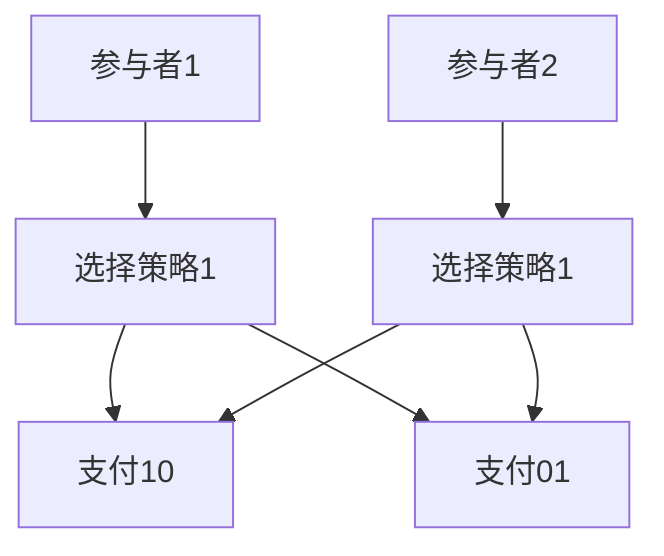

在这个流程图中，A1和A2代表两个参与者，B1和B2代表他们的策略选择，C1和D1代表他们的支付。在这个例子中，(策略1，策略1) 是纳什均衡，因为没有任何一个参与者可以通过单方面改变策略来获得更大的支付。

通过上述对博弈论基本要素的详细探讨，我们可以看到博弈论在分析和解决决策问题中的强大作用。接下来，我们将深入探讨零和博弈和非零和博弈，进一步理解博弈论的核心概念和策略。

### 第3章：零和博弈

零和博弈是一种特殊的博弈形式，其中一方的收益等于另一方的损失。换句话说，如果一个参与者获得了一定的收益，其他参与者就必须损失相同的收益。这种博弈形式得名于其总支付为零的特点。下面，我们将详细探讨零和博弈的概念、例子和解法。

#### 3.1 零和博弈的概念

在零和博弈中，参与者的总支付之和为零。这意味着一个参与者的收益完全由另一个参与者的损失提供。零和博弈的基本特征如下：

- **总支付为零**：参与者之间的收益和损失相互抵消。
- **竞争性**：参与者之间存在直接的竞争关系。
- **非合作性**：参与者通常不会合作，因为他们认为合作会减少自身的收益。

#### 3.2 零和博弈的例子

零和博弈在现实世界中广泛存在。以下是一些典型的例子：

1. **囚徒困境**：两个被捕的囚徒必须做出是否互相合作的决策。如果他们都不合作，他们都会受到较轻的惩罚；如果其中一人合作而另一人背叛，背叛者将获得自由，而合作者将受到更重的惩罚；如果两人都合作，他们将受到最轻微的惩罚。这是一个经典的非合作博弈，表明即使合作对整体有利，个体也可能因为短视而选择背叛。
2. **象棋**：在象棋中，每个棋子都有特定的价值和作用。当一个棋子被吃掉时，拥有该棋子的玩家将失去相应的价值。整个游戏的胜负取决于玩家如何利用和调整棋子的价值，这可以看作是一个简化的零和博弈。
3. **体育比赛**：在许多体育比赛中，例如足球或篮球，比赛的结果通常是对抗双方总得分或胜负的较量。胜利方获得正收益，而失败方则承受等额的损失。

下面是一个囚徒困境的Mermaid流程图示例：

```mermaid
graph TD
    A1[参与者1] --> B1[合作或背叛]
    A2[参与者2] --> B2[合作或背叛]
    B1 --> C1[支付(-1, -1)]
    B1 --> D1[支付(0, 0)]
    B1 --> E1[支付(3, -3)]
    B2 --> C2[支付(-1, -1)]
    B2 --> D2[支付(0, 0)]
    B2 --> E2[支付(-3, 3)]
```

在这个流程图中，A1和A2代表两个参与者，B1和B2代表他们的策略选择（合作或背叛），C1、D1和E1代表他们的支付。

#### 3.3 零和博弈的解

零和博弈的解通常涉及到纳什均衡的概念。纳什均衡是指在一个博弈中，每个参与者选择的策略是其他参与者策略的纳什反应均衡，即没有任何参与者可以通过单方面改变策略来获得更大的收益。

在零和博弈中，纳什均衡通常表现为参与者选择最佳响应策略。以下是一个简化的零和博弈的纳什均衡示例：

|      | 策略A | 策略B |
|------|-------|-------|
| 策略A | (2, -2) | (-2, 2) |
| 策略B | (-2, 2) | (2, -2) |

在这个例子中，(策略A，策略B) 和 (策略B，策略A) 都是纳什均衡，因为每个参与者都选择了最佳响应策略。

通过上述对零和博弈的详细探讨，我们可以看到这种博弈形式在现实世界中的广泛存在和重要性。理解零和博弈的概念、例子和解法，有助于我们更好地应对各种竞争和决策问题。接下来，我们将探讨非零和博弈，进一步深入博弈论的核心概念。

### 第4章：非零和博弈

非零和博弈与零和博弈不同，在这种博弈中，参与者的总支付之和不为零。非零和博弈可以是合作的，也可以是竞争的，其结果是参与者之间的收益和损失不完全抵消。本节将深入探讨非零和博弈的概念、例子和解法。

#### 4.1 非零和博弈的概念

非零和博弈的特征如下：

- **总支付不为零**：参与者的收益和损失不完全抵消。
- **合作与竞争并存**：参与者可以选择合作或竞争策略，合作策略可以带来正收益，而竞争策略可能导致负收益。
- **非对抗性**：参与者之间的互动不一定是直接的竞争关系，可以是互补的。

非零和博弈可以分为以下几种类型：

1. **合作博弈**：参与者通过合作可以获得比单独行动更大的收益。典型的例子包括合作研究、共享资源、市场合作等。
2. **竞争博弈**：参与者通过竞争来争夺有限资源，收益和损失相互抵消。典型的例子包括市场竞争、拍卖、拍卖等。
3. **混合博弈**：既包含合作元素，也包含竞争元素。典型的例子包括团队协作中的领导与成员关系、企业合并等。

#### 4.2 非零和博弈的例子

以下是一些非零和博弈的例子：

1. **合作博弈：**
   - **共享资源**：两个企业共同使用一条河流进行水力发电，他们需要协商确定发电量和利润分配，以实现最大化总收益。
   - **市场合作**：两家航空公司共同推出联合机票，以吸引更多乘客，提高市场份额。

2. **竞争博弈：**
   - **市场竞争**：两家手机制造商竞争市场份额，通过价格竞争、产品创新来争夺消费者。
   - **拍卖**：拍卖师通过拍卖商品，参与者通过出价竞争商品所有权。

3. **混合博弈：**
   - **团队协作**：团队成员在项目开发中合作，但需要分配任务和责任，以实现项目目标。
   - **企业合并**：两家企业合并，通过整合资源和业务，提高市场竞争力和盈利能力。

下面是一个共享资源的Mermaid流程图示例：

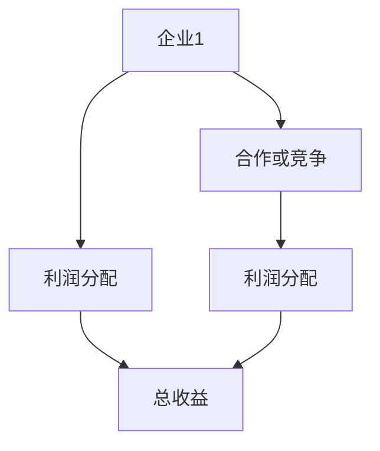

在这个流程图中，A和B代表两个企业，C和D代表他们的利润分配策略，E代表总收益。

#### 4.3 非零和博弈的解

非零和博弈的解法通常涉及到纳什均衡和合作解的概念。纳什均衡是指在一个博弈中，每个参与者选择的策略是其他参与者策略的纳什反应均衡，即没有任何参与者可以通过单方面改变策略来获得更大的收益。合作解则是指多个参与者通过合作可以实现比单独行动更大的总收益。

1. **纳什均衡**：
   - **囚徒困境**：在囚徒困境中，尽管合作可以实现更大的总收益，但每个参与者都有背叛的冲动。纳什均衡表明，在没有信任机制的情况下，参与者通常会背叛对方。
   - **混合策略**：在多人博弈中，参与者可能通过混合策略实现纳什均衡，即在某个特定概率下选择多个策略，以避免被其他参与者预测。

2. **合作解**：
   - **合作博弈**：在合作博弈中，参与者通过合作可以实现更大的总收益。例如，在共享资源的情况下，参与者可以通过协商确定合理的利润分配，实现双赢。
   - **社会规范**：在某些情况下，社会规范和信任机制可以促使参与者选择合作策略，实现合作解。

下面是一个市场合作的Mermaid流程图示例：

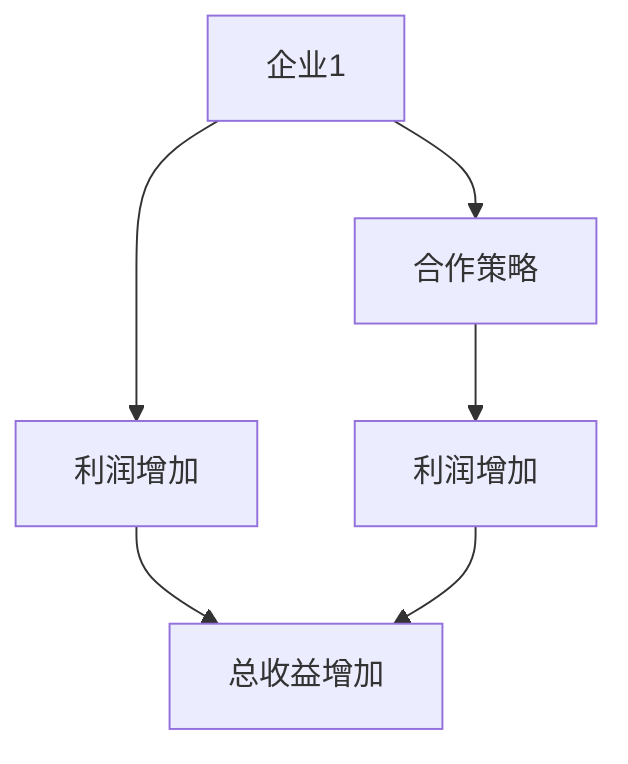

在这个流程图中，A和B代表两个企业，C和D代表他们的合作策略，E代表总收益增加。

通过上述对非零和博弈的详细探讨，我们可以看到这种博弈形式在现实世界中的多样性和重要性。理解非零和博弈的概念、例子和解法，有助于我们更好地应对各种竞争和合作问题。接下来，我们将探讨博弈论在经济学和社会科学中的应用，进一步深化对博弈论的理解。

### 第5章：博弈论在经济学中的应用

博弈论在经济学中的应用非常广泛，它为我们提供了分析市场行为、企业决策和竞争策略的有力工具。通过博弈论，经济学家能够深入理解市场动态和竞争机制，从而为政策制定和企业战略提供理论支持。

#### 5.1 市场竞争

市场竞争是经济学中的一个核心概念，博弈论提供了分析市场竞争的有力工具。在市场竞争中，企业作为参与者，通过定价、广告、产品创新等策略争夺市场份额。博弈论可以帮助我们分析以下问题：

- **价格竞争**：在价格竞争博弈中，企业通过降低价格来吸引消费者。这种博弈形式通常是一个非零和博弈，因为企业的收益不完全由另一方的损失提供。一个典型的例子是价格战，其中企业通过持续降低价格来争夺市场份额，但这也可能导致整个行业的利润下降。
- **广告竞争**：广告竞争是一个典型的非合作博弈。企业通过增加广告支出以提高品牌知名度和市场份额。博弈论可以分析不同广告策略的收益和成本，帮助企业制定最优的广告策略。

下面是一个价格竞争的Mermaid流程图示例：

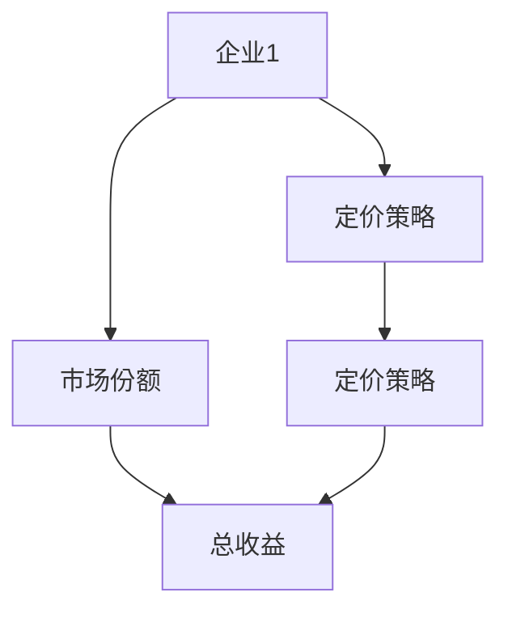

在这个流程图中，A和B代表两个企业，C和D代表他们的定价策略，E代表总收益。

#### 5.2 公共物品

公共物品是指那些一旦提供就难以排除个体使用的物品，如国防、公共道路、公共照明等。博弈论在分析公共物品的供给和分配中起到了重要作用。以下是一些关键问题：

- **公地悲剧**：公地悲剧是指个体在竞争使用公共资源时，由于缺乏合作机制，导致资源过度使用和最终枯竭的现象。博弈论可以帮助我们理解公地悲剧的原因，并提出解决方案，如引入合作机制或收费制度。
- **公共物品供给**：在公共物品的供给中，博弈论可以分析不同参与者如何通过合作或竞争来实现公共物品的最优供给。例如，在环保项目中，政府和企业可以通过合作来共同承担环保成本，实现环境保护的最优水平。

下面是一个公地悲剧的Mermaid流程图示例：

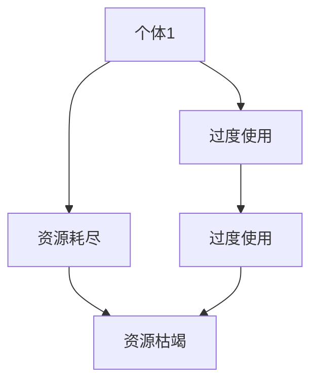

在这个流程图中，A和B代表两个个体，C和D代表他们的行为，E代表资源耗尽。

#### 5.3 寡头市场

寡头市场是指由少数几家大企业垄断的市场。在这种市场中，企业的决策和行为受到其他企业的强烈影响，博弈论可以有效地分析寡头市场的动态。以下是一些关键问题：

- **定价策略**：在寡头市场中，企业通过定价策略来争夺市场份额。博弈论可以帮助我们分析不同定价策略的收益和风险，从而帮助企业制定最优定价策略。
- **合作与竞争**：在寡头市场中，企业可以选择合作或竞争。合作可能通过卡特尔等形式实现，而竞争则可能导致价格战和市场不稳定。博弈论可以分析不同合作和竞争策略的收益和风险，帮助企业做出最优决策。

下面是一个寡头市场的Mermaid流程图示例：

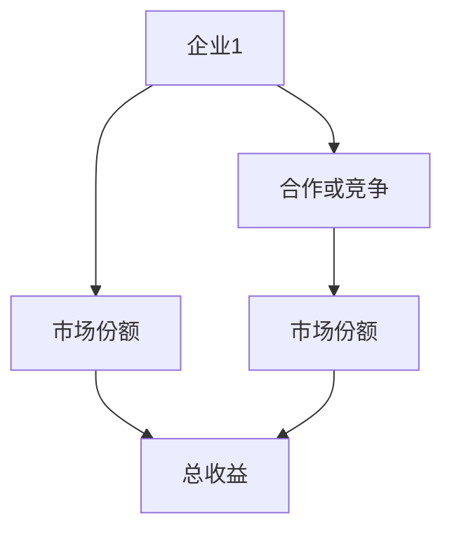

在这个流程图中，A和B代表两个企业，C和D代表他们的策略，E代表总收益。

通过博弈论的分析，我们可以更好地理解市场竞争、公共物品供给和寡头市场的动态，从而为政策制定和企业战略提供理论支持。博弈论不仅帮助我们分析现有的市场结构和行为，还可以预测未来市场的变化和趋势，为决策者提供有价值的参考。

### 第6章：博弈论在社会科学中的应用

博弈论在社会科学中的应用同样广泛而深远，涵盖了政治学、社会学到心理学等多个领域。通过博弈论的视角，学者们能够更好地理解个体和群体之间的互动关系，预测行为模式，并设计有效的政策和管理策略。

#### 6.1 政治学

在政治学中，博弈论被用来分析国家间的互动、选举策略和政治联盟的形成。以下是一些具体的应用：

- **国际关系**：博弈论可以帮助分析国家间的冲突与合作。例如，通过最小最大策略（maximin strategy），国家可以在面对潜在敌对行为时制定防御性政策。同时，通过纳什均衡，国家可以预测对方的反应，从而制定出更有利的战略。
- **选举策略**：博弈论在选举策略分析中也非常有用。候选人可以通过博弈论模型来预测对手的策略，并制定出最优的宣传策略和竞选策略。此外，博弈论还可以帮助分析选民的行为模式，从而提高竞选活动的有效性。

下面是一个国际关系的Mermaid流程图示例：

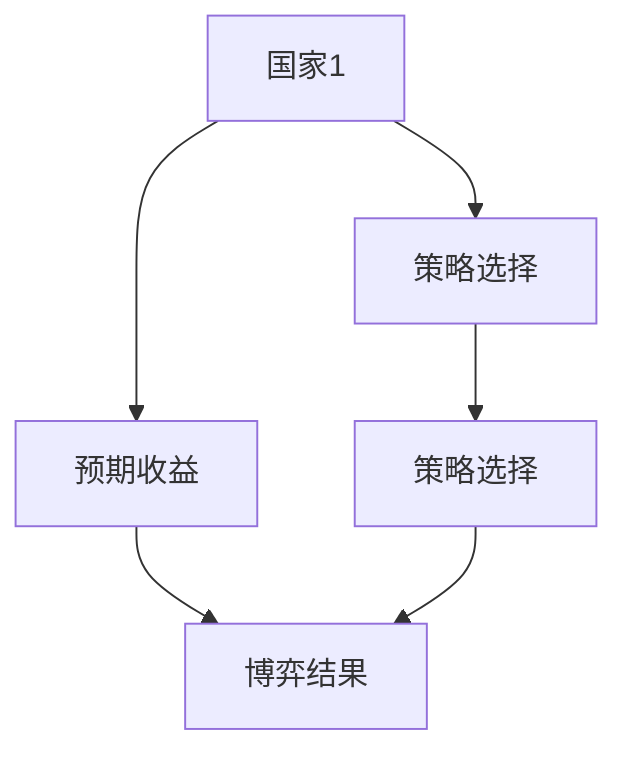

在这个流程图中，A和B代表两个国家，C和D代表他们的策略选择，E代表博弈结果。

#### 6.2 社会学

在社会学中，博弈论被用来分析社会互动、合作与竞争行为，以及社会规范的形成。以下是一些具体的应用：

- **合作与竞争**：博弈论可以帮助分析群体中的合作与竞争行为。例如，在公共物品供给中，博弈论可以预测个体在是否参与合作中的决策。通过合作博弈，社会学研究者可以提出促进合作行为的机制和策略。
- **社会规范**：博弈论还可以帮助分析社会规范的形成和变化。例如，通过重复博弈模型，研究者可以预测个体在社会互动中如何通过重复博弈逐渐形成共同的行为规范。

下面是一个合作博弈的Mermaid流程图示例：

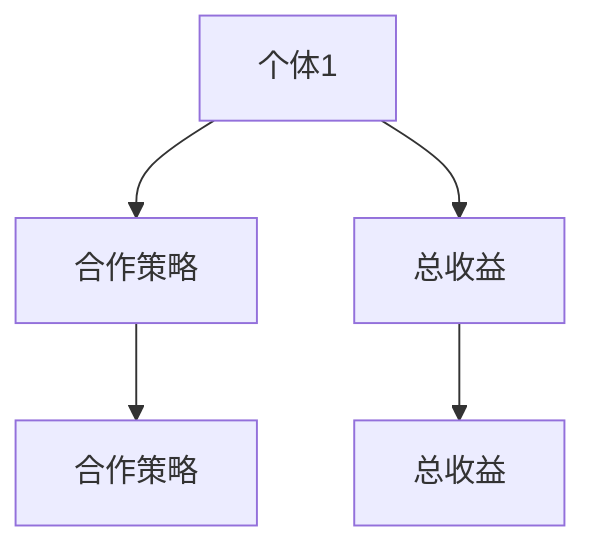

在这个流程图中，A和B代表两个个体，C和D代表他们的策略选择，E代表总收益。

#### 6.3 心理学

在心理学中，博弈论被用来研究个体决策行为、风险偏好和社交互动。以下是一些具体的应用：

- **决策行为**：博弈论可以帮助心理学家分析个体在不同情境下的决策过程。例如，在囚徒困境实验中，博弈论模型可以解释为什么个体有时会选择背叛而不是合作。
- **风险偏好**：博弈论可以帮助分析个体的风险偏好和风险厌恶行为。通过不同类型的博弈，如高风险高回报的博弈和低风险低回报的博弈，研究者可以了解个体如何在不同风险水平下做出决策。

下面是一个囚徒困境的Mermaid流程图示例：

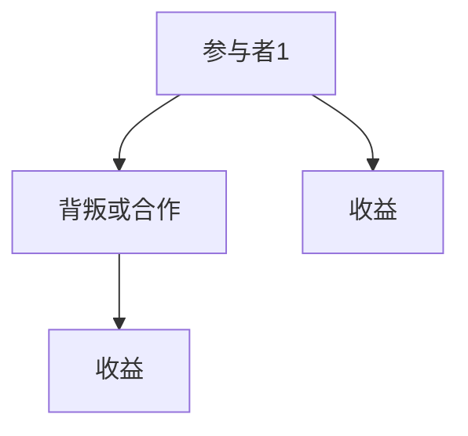

在这个流程图中，A和B代表两个参与者，C和D代表他们的收益。

通过博弈论的视角，社会科学家能够更好地理解个体和群体之间的复杂互动，预测行为模式，并设计出更有效的社会政策和策略。博弈论的应用不仅丰富了社会科学的理论体系，也为实际政策制定提供了重要的理论支持。

### 第7章：博弈论的数学模型

博弈论的数学模型是理解博弈论概念和策略的关键，这些模型通过严谨的数学工具和公式，帮助我们分析参与者的决策和行为。本节将详细探讨博弈论的几种主要数学模型，包括矩阵博弈、N人博弈和重复博弈。

#### 7.1 矩阵博弈

矩阵博弈是最基本的博弈模型之一，适用于两人博弈，尤其是零和博弈。在矩阵博弈中，每个参与者选择一个行动，形成一个支付矩阵，表示两个参与者的支付情况。

**支付矩阵**：一个矩阵博弈可以用一个二维矩阵表示，其中行表示参与者的策略，列表示另一个参与者的策略。每个元素表示参与者的支付。

**示例**：以下是一个简单的矩阵博弈示例：

|      | 策略A1 | 策略A2 |
|------|-------|-------|
| 策略B1 | (3, -3) | (-1, 1) |
| 策略B2 | (-3, 3) | (1, -1) |

在这个矩阵中，(3, -3) 表示当参与者1选择策略A1，参与者2选择策略B1时，参与者1获得3单位的收益，而参与者2损失3单位。

**解法**：矩阵博弈的解可以通过以下步骤求解：

1. **找最大最小值**：对于每个参与者，找出他们的最小支付和最大支付。
2. **找均衡策略**：参与者会选择使得对手的最小支付大于自己的最大支付的策略。

**伪代码**：

```python
def solve_matrix_game(matrix):
    min_values = [min(row) for row in matrix]
    max_values = [max(col) for col in zip(*matrix)]
    strategy_1 = [i for i, j in enumerate(max_values) if matrix[i][j] > min_values[i]]
    strategy_2 = [i for i, j in enumerate(min_values) if matrix[j][i] < max_values[j]]
    return strategy_1, strategy_2
```

通过这个伪代码，我们可以找出矩阵博弈的纳什均衡策略。

#### 7.2 N人博弈

N人博弈是指涉及多个参与者的博弈，每个参与者都有多个策略可供选择。N人博弈的模型比矩阵博弈更复杂，需要更高级的数学工具来分析。

**支付向量**：在N人博弈中，每个参与者的支付可以表示为一个向量。一个N人博弈可以用一个多维矩阵表示，每个元素表示不同参与者选择不同策略时的支付。

**示例**：以下是一个三参与者博弈的示例：

|      | 策略A1 | 策略A2 | 策略A3 |
|------|-------|-------|-------|
| 参与者1 | (1, -1, 0) | (0, 1, -1) | (-1, 0, 1) |
| 参与者2 | (-1, 0, 1) | (0, -1, 1) | (1, 1, 0) |
| 参与者3 | (0, -1, 1) | (1, 0, -1) | (1, 1, -1) |

在这个矩阵中，第一行表示参与者1选择不同策略时的支付，依次类推。

**解法**：N人博弈的解可以通过以下步骤求解：

1. **找每个参与者的最优反应策略**：每个参与者选择使其支付最大化的策略。
2. **找纳什均衡**：所有参与者同时选择最优反应策略的状态。

**伪代码**：

```python
def solve_n_person_game(matrix):
    strategies = []
    for i in range(len(matrix)):
        strategy = [j for j, payoffs in enumerate(matrix[i]) if payoffs == max(payoffs for _ in range(len(matrix)))]
        strategies.append(strategy)
    return strategies
```

通过这个伪代码，我们可以找出N人博弈的纳什均衡策略。

#### 7.3 重复博弈

重复博弈是指博弈在多个时期内重复进行。在重复博弈中，参与者可以基于历史信息调整自己的策略，从而影响长期的博弈结果。

**重复博弈的模型**：重复博弈可以使用贝叶斯均衡（Bayesian Equilibrium）和演化稳定策略（Evolutionary Stable Strategy，ESS）来分析。

**贝叶斯均衡**：在重复博弈中，如果每个参与者都有信念，认为其他参与者将选择某个策略，并且这个策略是其他策略的贝叶斯均衡，那么这个信念是稳定的。

**演化稳定策略**：在重复博弈中，某个策略如果能够抵抗其他策略的入侵，并且在长期内成为主导策略，那么这个策略就是演化稳定策略。

**示例**：以下是一个重复囚徒困境的示例：

```
期数 | 参与者1 | 参与者2
----|--------|--------
1   | 背叛    | 背叛
2   | 合作    | 背叛
3   | 背叛    | 合作
4   | 合作    | 合作
```

在这个示例中，参与者1和参与者2在第四期选择合作，这表明合作策略在长期内是稳定和可持续的。

**伪代码**：

```python
def repeat_game(matrix, periods):
    for _ in range(periods):
        strategies = solve_n_person_game(matrix)
        matrix = update_matrix(matrix, strategies)
    return strategies
```

通过这个伪代码，我们可以模拟重复博弈的过程，并找出长期的纳什均衡策略。

通过以上对博弈论数学模型的分析，我们可以看到博弈论的数学工具在理解和解决复杂决策问题中的强大作用。这些模型不仅为我们提供了分析博弈的数学框架，还为实际应用提供了理论支持。

### 第8章：博弈论的策略选择

博弈论的策略选择是博弈论的核心内容之一，它关系到参与者在博弈中的决策过程和最终结果。博弈论的策略选择主要包括最大最小策略、策略均衡和策略优化。以下是对这些策略选择方法的详细探讨。

#### 8.1 最大最小策略

最大最小策略（Maximin strategy）是一种防御性策略，旨在最小化潜在的损失。最大最小策略的核心思想是选择一个策略，使得在最坏的情况下损失最小。这种策略尤其适用于不确定性和风险高的博弈。

**定义**：对于参与者i，最大最小策略可以表示为：

\[ \text{策略}_i = \arg\max_{s_i} \min_{s_{-i}} \pi_i(s_i, s_{-i}) \]

其中，\( \pi_i(s_i, s_{-i}) \) 是参与者i在策略组合 \( (s_i, s_{-i}) \) 下的支付。

**示例**：在囚徒困境中，参与者可以选择最大最小策略来最小化潜在的损失。例如，如果参与者A选择背叛，参与者B的最小支付是-3，如果参与者B选择合作，参与者A的最小支付是-1。因此，参与者A选择背叛，以最小化潜在的损失。

#### 8.2 策略均衡

策略均衡是博弈论中的关键概念，它指的是在博弈中，每个参与者选择的策略是其他参与者策略的纳什反应均衡。纳什均衡（Nash equilibrium）是博弈论中最常用的均衡概念，表示在博弈中，每个参与者都不愿意单方面改变策略，因为这样做不会带来更大的收益。

**定义**：一个策略组合 \( (s_1, s_2, ..., s_n) \) 是纳什均衡，当且仅当对于所有参与者 \( i \)，都有：

\[ s_i \in \arg\max_{s_i'} \pi_i(s_i', s_{-i}) \]

**示例**：在一个囚徒困境博弈中，如果两个参与者都选择背叛，这是一个纳什均衡，因为每个参与者都不愿意单方面改变策略，选择合作。

除了纳什均衡，博弈论中还有其他类型的均衡，如塞尔腾均衡（Selten equilibrium）和子博弈完美均衡（Subgame Perfect Equilibrium）。塞尔腾均衡是纳什均衡的一个扩展，要求均衡策略在所有子博弈中也成立。子博弈完美均衡是塞尔腾均衡的一个扩展，要求均衡策略在整个博弈的每个阶段都成立。

#### 8.3 策略优化

策略优化是博弈论中的另一个重要概念，它涉及在给定其他参与者策略的情况下，选择最佳策略。策略优化通常涉及到成本-收益分析和风险控制。

**定义**：对于参与者i，策略优化可以表示为：

\[ \text{策略}_i = \arg\max_{s_i} \pi_i(s_i, s_{-i}) \]

**示例**：在一个寡头市场中，一个企业需要根据其他企业的策略选择最优价格。例如，如果其他企业的价格较高，该企业可以选择降价以吸引更多消费者。

策略优化的方法包括线性规划、动态规划和马尔可夫决策过程。这些方法可以帮助参与者在不同条件下选择最佳策略。

通过以上对博弈论策略选择的详细探讨，我们可以看到策略选择在博弈论中的重要性。正确的策略选择不仅能够帮助参与者最大化收益，还能够预测其他参与者的行为，从而在博弈中获得优势。接下来，我们将探讨博弈论在自然竞争中的应用，进一步深化对博弈论的理解。

### 第9章：博弈论在自然竞争中的应用

博弈论不仅在社会科学和经济学中有着广泛的应用，在自然竞争和生态系统中的应用同样具有重要意义。自然竞争涉及生物体之间的互动，包括捕食者与猎物、植物与植物之间的竞争等。博弈论为这些自然现象提供了一种数学化的分析框架，帮助我们理解生物体如何通过策略互动来适应环境，并维持生态系统的平衡。

#### 9.1 生态系统中的竞争

在生态系统中，生物体之间的竞争是一个普遍现象。博弈论可以帮助我们分析这些竞争关系，并预测生态系统的动态变化。以下是一些典型的生态系统中的竞争情况：

1. **捕食者-猎物关系**：捕食者与猎物的互动可以看作是一个典型的博弈。捕食者试图最大化捕食成功率，而猎物则试图最大化生存率。这种博弈可以通过动态系统模型来分析，例如Lotka-Volterra模型，它描述了捕食者-猎物系统中的种群动态。

2. **植物-植物竞争**：植物之间通过竞争阳光、水分和营养来争夺生存空间。这种竞争可以通过博弈论中的资源分配模型来分析。例如，植物可以通过调整叶片的大小和形状来优化阳光吸收效率，从而在竞争中占据优势。

3. **互利共生**：互利共生是另一种重要的自然竞争形式，例如蜜蜂与花朵之间的关系。在这种关系中，蜜蜂通过采集花蜜获得食物，而花朵通过蜜蜂传播花粉。这种共生关系可以通过博弈论中的合作模型来分析，例如博弈树模型，它描述了参与者在不同情境下的合作与背叛决策。

下面是一个捕食者-猎物关系的Mermaid流程图示例：

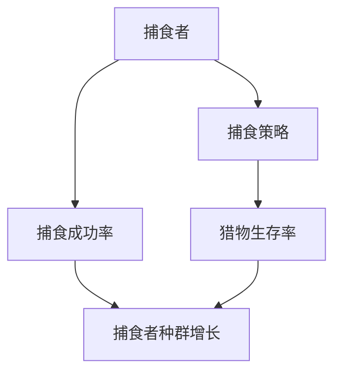

在这个流程图中，A和B代表捕食者，C和D代表捕食成功率和猎物生存率，E代表捕食者种群增长。

#### 9.2 人类经济活动中的竞争

除了生态系统，博弈论在人类经济活动中的竞争也有广泛应用。人类经济活动中的竞争形式多种多样，包括市场竞争、资源争夺和战略合作等。以下是一些具体的例子：

1. **市场竞争**：企业在市场中竞争，通过价格、质量和服务等策略来争夺市场份额。博弈论可以帮助分析企业在竞争中的策略选择，例如定价策略、广告策略和产品创新策略。

2. **资源争夺**：在资源有限的地区，例如石油、矿产和水资源，国家或企业之间的争夺非常激烈。博弈论可以分析不同策略下的收益和风险，帮助决策者制定最优的争夺策略。

3. **战略合作**：在某些情况下，竞争者之间可能会选择合作，以实现更大的收益。例如，企业之间的联合研发或市场合作。博弈论可以帮助分析合作的可能性、合作的形式和合作中的风险分配。

下面是一个市场竞争的Mermaid流程图示例：

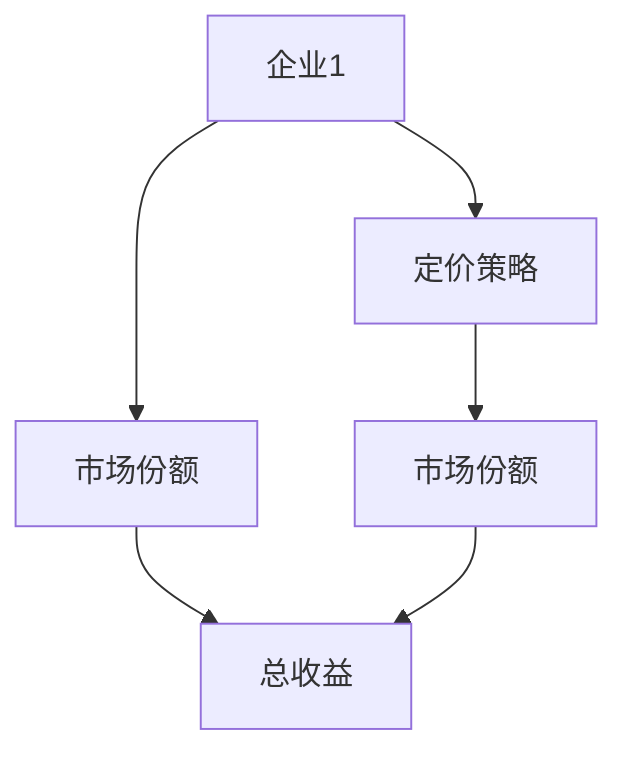

在这个流程图中，A和B代表两个企业，C和D代表他们的定价策略，E代表总收益。

#### 9.3 博弈论在生物进化中的应用

博弈论在生物进化中的应用揭示了生物体如何通过策略互动和自然选择来适应环境。以下是一些具体的例子：

1. **行为策略**：生物体的行为策略可以通过博弈论来分析。例如，雄性动物为了吸引雌性，可能会展示复杂的求偶行为。这种求偶行为可以看作是一个博弈，雄性动物通过展示自己的优势和资源来吸引雌性。

2. **进化博弈**：进化博弈论（Evolutionary Game Theory）是一种将博弈论应用于生物进化的理论。它分析了生物体在不同策略下的进化路径，并预测了哪些策略能够在自然选择中占据主导地位。

3. **合作与竞争**：在生物进化中，合作和竞争都是重要的策略。例如，某些物种之间形成了互利共生的关系，而另一些物种则形成了竞争关系。进化博弈论可以帮助我们理解这些关系的形成和维持机制。

下面是一个进化博弈的Mermaid流程图示例：

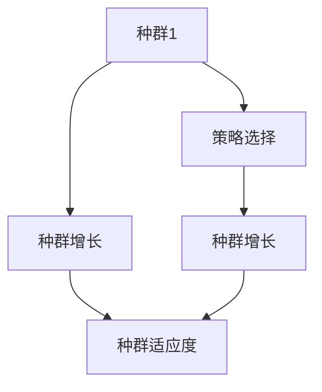

在这个流程图中，A和B代表两个种群，C和D代表他们的策略选择，E代表种群适应度。

通过博弈论的视角，我们可以更好地理解自然竞争中的复杂动态，并预测生态系统的变化趋势。博弈论不仅为生物学和生态学提供了有力的理论工具，也为人类社会和经济的决策提供了重要的启示。

### 附录

#### 附录 A：常见博弈论模型及其应用

在博弈论中，有许多经典的模型广泛应用于经济学、社会学和生物学等领域。以下是一些常见的博弈论模型及其应用：

1. **囚徒困境**：囚徒困境模型是博弈论中最著名的模型之一，它描述了两个被捕的囚徒在面对是否合作时的决策。这个模型被广泛应用于分析市场行为、社会规范和信任问题。
2. **拍卖模型**：拍卖模型用于分析资源的分配和定价策略。常见的拍卖形式包括密封报价拍卖、英国式拍卖和荷兰式拍卖。
3. **博弈树**：博弈树用于描述多阶段的博弈，每个节点表示一个决策点，每个分支表示可能的策略选择。博弈树被广泛应用于决策分析和策略规划。
4. **重复博弈**：重复博弈模型用于分析长期互动中的策略选择。这种模型可以帮助我们理解合作与背叛在长期竞争中的稳定性和演化路径。

#### 附录 B：博弈论数学公式汇总

博弈论中涉及许多重要的数学公式，以下是其中一些关键的公式及其应用：

1. **纳什均衡**：纳什均衡是博弈论中最核心的概念之一，其公式为：
   \[ s_i \in \arg\max_{s_i'} \pi_i(s_i', s_{-i}) \]
   其中，\( \pi_i(s_i', s_{-i}) \) 是参与者i在策略组合 \( (s_i', s_{-i}) \) 下的支付。
2. **最大最小策略**：最大最小策略的公式为：
   \[ \text{策略}_i = \arg\max_{s_i} \min_{s_{-i}} \pi_i(s_i, s_{-i}) \]
   这种策略旨在最小化潜在的损失。
3. **贝叶斯均衡**：贝叶斯均衡是重复博弈中的一种均衡，其公式为：
   \[ \text{策略}_i = \arg\max_{s_i} \sum_{s_{-i}} p(s_{-i}) \pi_i(s_i, s_{-i}) \]
   其中，\( p(s_{-i}) \) 是参与者i对其他参与者策略的信念。

#### 附录 C：博弈论相关书籍推荐

1. **《博弈论与经济行为》**：作者是约翰·冯·诺伊曼和奥斯卡·摩根斯顿，这是博弈论的奠基之作，详细介绍了博弈论的基本概念和数学模型。
2. **《博弈论基础》**：作者是梅里尔·D·斯通（Merrill D. Flood），这本书深入浅出地介绍了博弈论的基本原理和应用。
3. **《演化博弈论》**：作者是约翰·梅纳德·史密斯（John Maynard Smith）和格雷厄姆·凯利（Graham K. Knight），这本书系统地介绍了演化博弈论，并探讨了其在生物学中的应用。
4. **《博弈论：一个简化方法》**：作者是肯尼斯·J·阿罗（Kenneth J. Arrow）和马歇尔·S·谢林（Marshall S. Shapley），这本书以简化的方法介绍了博弈论的核心概念和模型，适合初学者阅读。

通过这些书籍，读者可以系统地学习和掌握博弈论的基本原理和应用，为实际决策提供理论支持。

### 总结与展望

博弈论作为一种研究决策制定的数学理论，在经济学、社会学、生物学等多个领域有着广泛的应用。通过博弈论，我们可以深入理解个体和群体之间的互动关系，预测行为模式，并制定有效的策略。本文从博弈论的基本概念、基本要素、零和博弈和非零和博弈、博弈论在经济学和社会科学中的应用、博弈论的数学模型、策略选择以及博弈论在自然竞争中的应用等方面进行了详细探讨。

博弈论不仅在理论上具有重要意义，而且在实际应用中也具有广泛的价值。例如，在市场竞争中，企业可以通过博弈论分析竞争对手的策略，制定最优的市场策略；在政治决策中，博弈论可以帮助分析国际关系和选举策略；在生态系统中，博弈论可以解释生物体之间的互动和进化。

然而，博弈论的应用仍然面临许多挑战。例如，现实世界的复杂性和不确定性使得博弈论的模型难以完全适用；博弈论的策略选择往往需要在大量数据和信息的基础上进行优化。因此，未来研究需要进一步探索博弈论在不同领域的适用性，并开发更加精细和灵活的博弈论模型。

总之，博弈论作为一种强大的数学工具，不仅丰富了我们的理论体系，也为实际决策提供了重要的支持。我们鼓励读者深入研究博弈论，并将其应用于实际问题中，以更好地理解和应对竞争和决策挑战。希望通过本文，读者能够对博弈论有一个全面而深入的理解，并能够在未来的学习和工作中运用博弈论的方法和思想。

### 最佳实践、注意事项与拓展阅读

在进行博弈论研究和应用时，以下是一些最佳实践和注意事项：

**最佳实践**：

1. **明确目标**：在应用博弈论解决具体问题时，首先要明确研究目标，确保博弈模型的构建与目标紧密相关。
2. **数据驱动**：博弈论模型依赖于数据，因此需要收集和整理准确的数据，以确保模型的可靠性和准确性。
3. **多角度分析**：在分析博弈问题时，应从多个角度进行思考，包括个体利益、整体利益和长期影响，以获得更全面的解决方案。
4. **持续迭代**：博弈论模型需要根据实际情况不断迭代和优化，以适应不断变化的环境。

**注意事项**：

1. **模型假设**：在构建博弈模型时，需要明确模型的假设条件，并评估这些假设对模型结果的影响。
2. **动态调整**：博弈过程中的策略选择应灵活调整，以应对可能出现的意外情况和策略变化。
3. **伦理考量**：在博弈论应用中，应考虑到伦理和道德因素，确保决策符合社会责任和道德标准。

**拓展阅读**：

1. **《博弈论的进化：博弈论在社会科学中的应用》**：作者约翰·福布斯·纳什（John F. Nash），详细介绍了博弈论在不同领域的应用和演变。
2. **《博弈论与生活》**：作者罗伯特·J·奥曼（Robert J. Aumann），通过生活中的实际案例，生动地阐述了博弈论的基本原理和应用。
3. **《博弈论的革命》**：作者布鲁斯·麦克莱恩（Bruce MacLennan），探讨了博弈论对社会行为和决策的影响，以及如何利用博弈论解决实际问题。

通过上述最佳实践、注意事项和拓展阅读建议，读者可以更好地理解和应用博弈论，进一步提升决策能力和竞争力。希望本文能为读者在博弈论学习和应用中提供有益的参考和指导。

