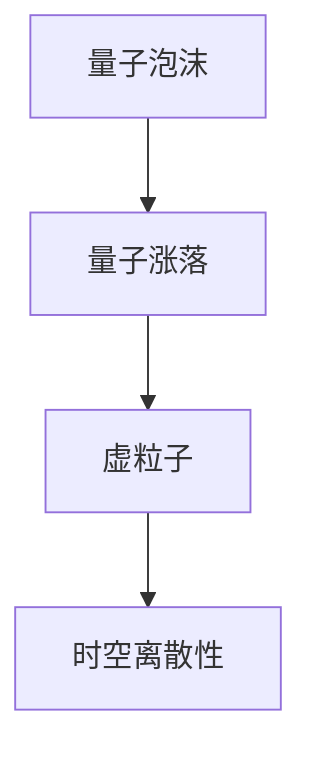
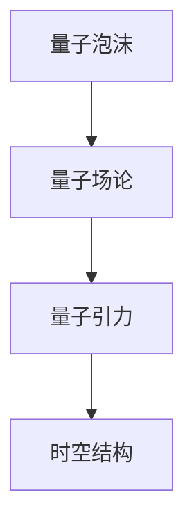
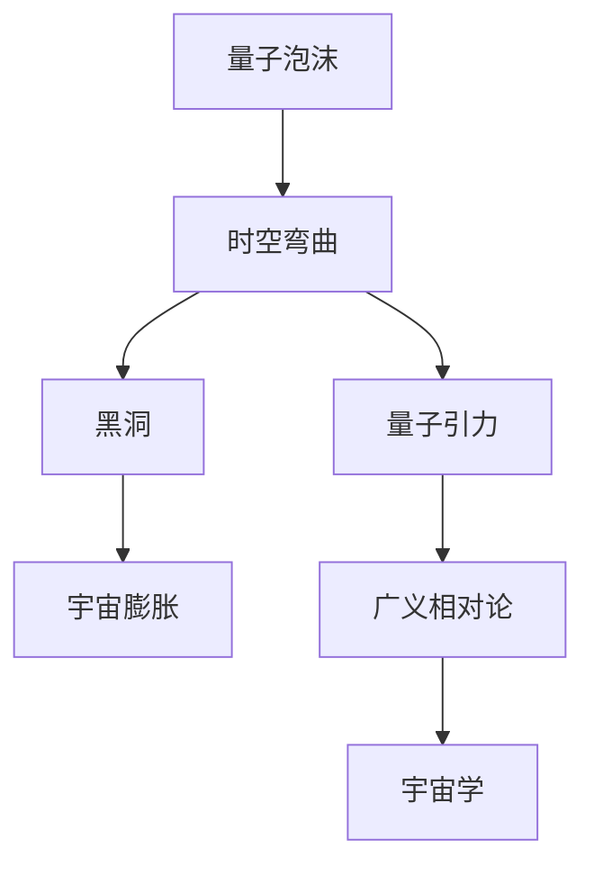
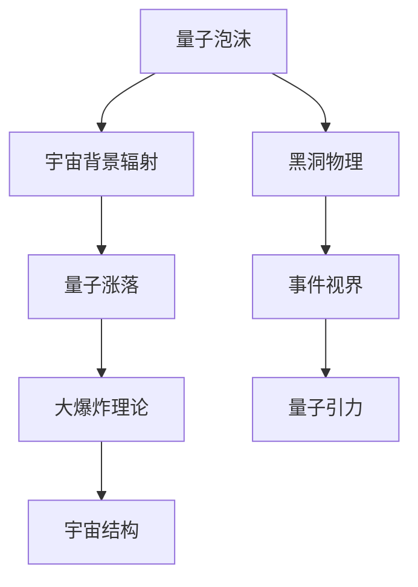
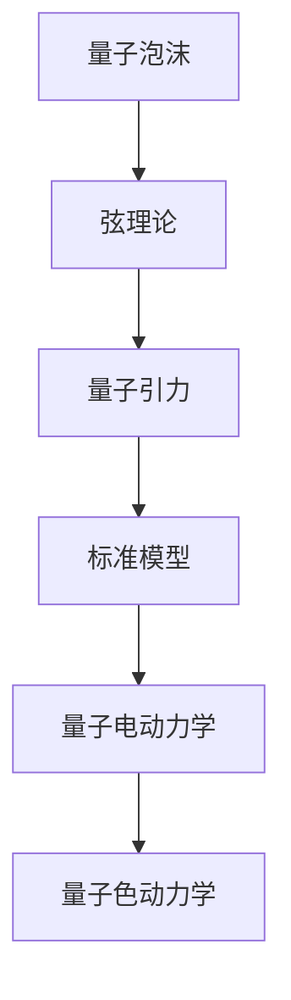
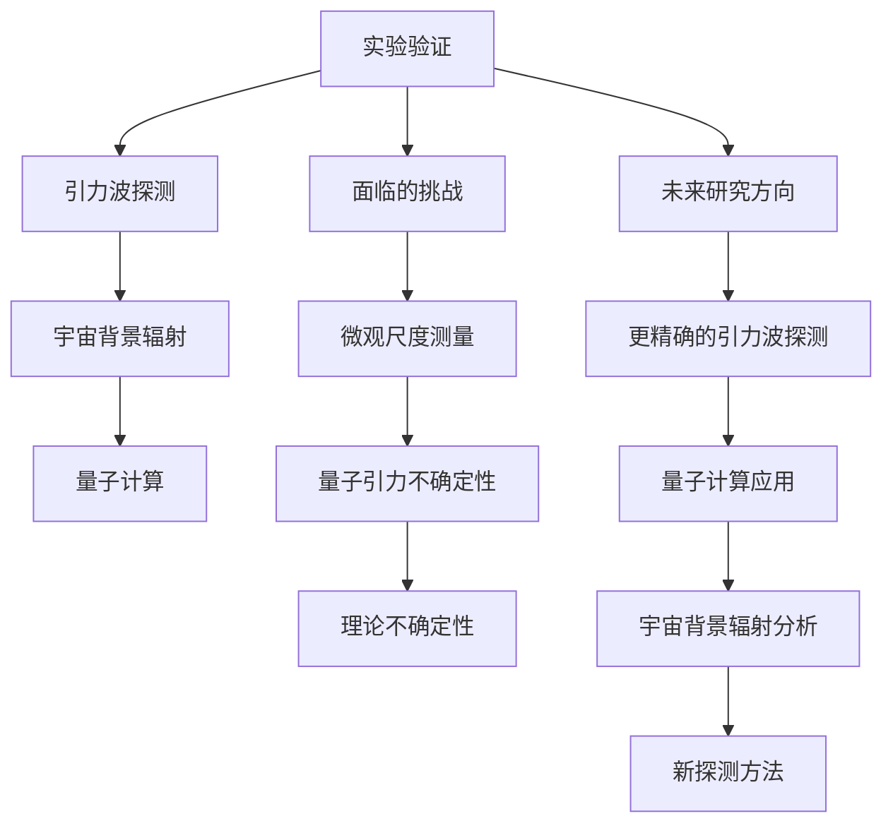

                 

## 引言

宇宙的量子泡沫（quantum foam）是一个令人着迷的物理概念，它揭示了时空在微观尺度下的奇异结构。量子泡沫不仅是现代物理学的前沿研究领域，也是理解宇宙本质的关键之一。在本文中，我们将深入探讨量子泡沫的概念、其与时空结构的关系，以及在宇宙学中的应用。通过逻辑清晰、结构紧凑的分析，我们将一步步揭示量子泡沫的奥秘。

文章将分为以下几个部分：

1. **量子泡沫的基本概念**：我们将介绍量子泡沫的定义、历史背景和物理背景，解释其基本特征。
2. **量子泡沫与时空结构**：这一部分将探讨量子泡沫与时空弯曲、黑洞和宇宙膨胀的关系，并分析其对这些现象的影响。
3. **量子泡沫在宇宙学中的应用**：我们将讨论量子泡沫在宇宙背景辐射、大爆炸理论和黑洞物理中的应用。
4. **量子泡沫与其他物理理论的关系**：这一部分将探讨量子泡沫与弦理论、量子引力理论以及其他量子场论的关系。
5. **量子泡沫的实验与未来研究**：我们将介绍量子泡沫的实验验证、面临的挑战以及未来研究的方向。

通过对这些部分的详细分析，我们将能够更好地理解量子泡沫在宇宙学和物理学中的重要性，并展望其未来的研究方向。让我们开始这场探索宇宙量子泡沫的旅程吧！

---

关键词：量子泡沫、时空结构、宇宙学、量子场论、实验验证

摘要：本文系统探讨了宇宙的量子泡沫——这一时空微观结构的神秘现象。文章首先介绍了量子泡沫的基本概念、物理背景和特征，随后分析了量子泡沫与时空弯曲、黑洞和宇宙膨胀的关系，并探讨了其在宇宙学中的应用。最后，文章讨论了量子泡沫与其他物理理论的关系，并展望了其未来研究的方向。通过逻辑清晰的分析，本文为理解宇宙的量子泡沫提供了深刻的洞见。

---

## 量子泡沫的基本概念

量子泡沫是一个在量子场论和广义相对论的交汇点上产生的概念，它描绘了时空在极其微小尺度下的状态。这一概念最早由约翰·惠勒（John Wheeler）在20世纪50年代提出，他将其描述为“时空中的泡沫，时而出现又时而消失”。量子泡沫的核心思想是，在量子尺度上，时空不再是连续的，而是由一系列离散的、不稳定的结构组成，这些结构被称为“量子泡沫”。

### 历史背景

量子泡沫的概念起源于对量子力学和广义相对论的深入研究。在经典物理学中，时空被视为一个连续的背景，而物质和能量在这个背景上运动。然而，量子力学和广义相对论揭示了时空的复杂性。量子力学表明，物质和能量在微观尺度上呈现出波粒二象性，并且具有概率性质；而广义相对论则描述了引力是通过时空的弯曲来实现的。

为了统一量子力学和广义相对论，科学家们开始探索量子引力理论。量子泡沫的概念正是量子引力理论中的一个重要组成部分。它试图将量子力学和广义相对论结合起来，揭示时空在极其微小尺度下的行为。

### 物理背景

量子泡沫的物理背景与量子场论密切相关。量子场论是描述基本粒子如何通过交换虚拟粒子相互作用的物理学理论。在量子场论的框架下，时空被视为一个动态的量子场，其中基本粒子表现为场的激发态。

在量子泡沫中，时空被看作是由量子涨落构成的，这些量子涨落导致了时空的剧烈变化。这些变化表现为瞬间的时空结构变化，如时空的膨胀和收缩。量子泡沫的存在意味着，在微观尺度上，时空不再是连续的，而是由一系列离散的量子泡沫构成。

### 核心概念

量子泡沫的核心概念包括以下几个方面：

1. **量子涨落**：量子泡沫中的时空变化主要由量子涨落引起。量子涨落是量子场论中的一个基本现象，它描述了场在空间中的随机变化。

2. **虚粒子**：量子泡沫中的时空变化涉及到虚粒子的产生和湮灭。虚粒子是量子场论中的概念，它们在量子泡沫中起到关键作用，帮助解释时空的动态性质。

3. **时空离散性**：量子泡沫揭示了时空在微观尺度上的离散性。这意味着时空不再是连续的，而是由一系列离散的量子泡沫构成。

### 基本特征

量子泡沫具有以下几个基本特征：

1. **微观尺度**：量子泡沫存在于极其微小的尺度上，通常是普朗克尺度（约 \(10^{-35}\) 米）。

2. **剧烈变化**：量子泡沫中的时空变化非常剧烈，这些变化表现为时空的膨胀和收缩。

3. **不稳定**：量子泡沫是不稳定的，它们随时可能出现和消失。

4. **能量密度**：量子泡沫具有高能量密度，这使它们在量子场论中扮演重要角色。

### 总结

量子泡沫是一个描述时空在微观尺度下的状态的物理概念。它起源于对量子力学和广义相对论的研究，揭示了时空的复杂性。量子泡沫的核心概念包括量子涨落、虚粒子和时空离散性，它们构成了量子泡沫的基本特征。通过理解量子泡沫的基本概念，我们能够更好地理解时空的本质，并探讨量子泡沫在物理学中的角色。

---

为了更好地理解量子泡沫的基本概念，我们可以通过一个简化的流程图来展示量子泡沫、量子涨落和虚粒子之间的关系：

这个流程图展示了量子泡沫如何通过量子涨落产生虚粒子，进而影响时空的离散性。这个图不仅有助于我们直观地理解量子泡沫的概念，也为后续章节的分析提供了基础。

---

在接下来的章节中，我们将进一步探讨量子泡沫的物理背景，分析其与时空结构的关系，并深入探讨量子泡沫在宇宙学中的应用。通过这些讨论，我们将更全面地理解量子泡沫在物理学中的重要性。

---

## 量子泡沫的物理背景

量子泡沫的概念不仅是一个理论上的假设，它还与量子场论和广义相对论密切相关。为了深入理解量子泡沫的物理背景，我们需要先回顾量子场论的基本原理，并探讨量子泡沫在这些理论框架中的角色。

### 量子场论的基本原理

量子场论是描述基本粒子通过交换虚拟粒子相互作用的物理学理论。在量子场论中，时空被视为一个动态的量子场，基本粒子表现为场的激发态。量子场论的关键概念包括：

1. **量子场**：量子场是量子场论中的基本对象，它描述了时空中的物理量如何随时间和空间变化。量子场可以激发出基本粒子，如电子、夸克等。

2. **虚拟粒子**：虚拟粒子是量子场论中的一个重要概念，它们在量子场中不断产生和湮灭。虚拟粒子不是传统意义上的物质粒子，而是量子场论的数学工具，用来描述场的性质。

3. **真空**：真空是量子场论中的一个特殊状态，它并非完全空无一物，而是充满了虚拟粒子的涨落。真空的这些涨落是量子场论中许多重要物理现象的基础。

4. **量子涨落**：量子涨落是量子场论中的一个基本现象，它描述了场在空间中的随机变化。量子涨落导致时空中的能量和物质分布不是均匀的，而是呈现出波动性。

### 量子泡沫与量子场论的关联

量子泡沫的概念直接源自量子场论。在量子场论的框架下，量子泡沫被看作是时空中的量子涨落，这些涨落导致了时空的剧烈变化。量子泡沫与量子场论的关联可以从以下几个方面理解：

1. **量子泡沫的产生**：量子泡沫是通过量子涨落产生的。在量子场论中，真空中的量子涨落会导致时空中的能量密度变化，这些变化形成了量子泡沫。

2. **量子泡沫的动力学**：量子泡沫的动力学受到量子场论的控制。量子泡沫的产生和消失受到量子场论中的真空涨落和相互作用的影响。

3. **量子泡沫的能量密度**：量子泡沫具有高能量密度，这使其在量子场论中扮演重要角色。量子泡沫的能量密度决定了它在时空中的影响。

4. **量子泡沫与虚粒子**：量子泡沫中的虚粒子是量子场论中的重要组成部分。虚粒子在量子泡沫中不断产生和湮灭，影响了量子泡沫的动态行为。

### 量子泡沫与量子引力的关系

量子泡沫不仅与量子场论密切相关，还与量子引力理论有着深刻的联系。量子引力理论试图将量子力学和广义相对论统一起来，揭示时空在极其微小尺度下的行为。量子泡沫在量子引力理论中扮演了关键角色：

1. **量子泡沫与时空结构**：量子泡沫揭示了时空在量子尺度下的非连续性，这为量子引力理论提供了新的视角。量子引力理论需要解释如何从量子泡沫中产生连续的时空结构。

2. **量子泡沫与黑洞**：量子泡沫与黑洞的物理特性密切相关。在量子引力理论中，黑洞的边界（事件视界）可能与量子泡沫的存在有关。量子泡沫可能在黑洞内部产生新的物理现象。

3. **量子泡沫与宇宙膨胀**：量子泡沫也可能影响宇宙的膨胀。在量子引力理论中，宇宙膨胀的初始阶段可能受到量子泡沫的影响，这为理解宇宙的起源提供了新的线索。

### 总结

量子泡沫的物理背景与量子场论和量子引力理论密切相关。量子场论提供了量子泡沫产生和动力学的理论基础，而量子引力理论则探讨了量子泡沫与时空结构的深层次关系。量子泡沫不仅揭示了时空在微观尺度下的行为，还与黑洞和宇宙膨胀等物理现象有着深刻的联系。通过理解量子泡沫的物理背景，我们能够更全面地理解量子力学、广义相对论和量子引力理论之间的关系，为探索宇宙的本质奠定了基础。

---

为了更好地展示量子泡沫、量子场论和量子引力理论之间的关系，我们可以使用以下Mermaid流程图：

这个流程图展示了量子泡沫是如何通过量子场论和量子引力理论影响时空结构的。通过这个图，我们可以更直观地理解这三个概念之间的联系。

---

在接下来的章节中，我们将探讨量子泡沫与时空结构的关系，分析量子泡沫如何影响时空的弯曲、黑洞和宇宙膨胀等物理现象。通过这些讨论，我们将进一步揭示量子泡沫在物理学中的重要性。

---

## 量子泡沫与时空结构

量子泡沫与时空结构之间的关系是量子场论和广义相对论研究中的一个核心问题。量子泡沫揭示了时空在微观尺度上的非连续性，这种非连续性对时空的弯曲、黑洞和宇宙膨胀等现象产生了深远的影响。在这一节中，我们将探讨量子泡沫与时空结构的关系，并分析量子泡沫对时空弯曲、黑洞和宇宙膨胀的影响。

### 量子泡沫与时空弯曲

在广义相对论中，时空弯曲是由物质和能量的分布决定的。根据爱因斯坦的场方程，时空的弯曲可以用几何语言来描述，这表现为时空中的引力场。然而，当我们将量子力学的原理引入到这一框架中时，我们发现时空的弯曲并非是连续的，而是由量子泡沫引起的微小尺度上的起伏。

1. **量子泡沫与时空弯曲的关系**：

   - 量子泡沫是时空中的量子涨落，这些涨落导致了时空的剧烈变化。
   - 在量子泡沫中，时空的弯曲不是连续的，而是由一系列不稳定的量子结构构成。
   - 量子泡沫的存在意味着，在微观尺度上，时空的弯曲是由量子涨落驱动的，这些涨落对时空的几何结构产生了影响。

2. **量子泡沫对时空弯曲的影响**：

   - 量子泡沫的存在改变了时空的几何性质，使得时空不再是均匀和连续的。
   - 量子泡沫可能导致时空出现瞬间的膨胀和收缩，这种变化对时空的几何结构产生了重要影响。
   - 量子泡沫的存在可能改变了引力波的传播方式，使得引力波在量子尺度上的行为与经典物理学描述有所不同。

### 量子泡沫与黑洞

黑洞是宇宙中最为奇特的天体之一，它通过引力将周围的物质和信息吸入其中。在量子场论的框架下，量子泡沫与黑洞的关系成为一个重要的研究课题。

1. **量子泡沫与黑洞的关系**：

   - 量子泡沫可能影响黑洞的物理特性，如黑洞的边界（事件视界）和黑洞内部的结构。
   - 量子泡沫的存在可能导致黑洞的物理行为与经典物理学的描述存在差异。
   - 量子泡沫可能揭示了黑洞内部的新物理现象，如黑洞的热辐射和量子信息处理。

2. **量子泡沫对黑洞的影响**：

   - 量子泡沫可能导致黑洞的边界不再是绝对不可穿透的，这可能为量子信息传递提供了新的可能性。
   - 量子泡沫可能影响黑洞的引力场，使得黑洞的吸积过程变得更加复杂。
   - 量子泡沫的存在可能改变了黑洞的演化路径，影响了宇宙中黑洞的分布和数量。

### 量子泡沫与宇宙膨胀

宇宙膨胀是当前宇宙学研究中的一个重要课题。根据大爆炸理论，宇宙起源于一个极热、极密的状态，随后开始膨胀。量子泡沫在宇宙膨胀中的作用引起了广泛关注。

1. **量子泡沫与宇宙膨胀的关系**：

   - 量子泡沫可能影响宇宙的早期阶段，如宇宙背景辐射和宇宙微波背景辐射的形成。
   - 量子泡沫的存在可能导致宇宙膨胀的加速，这与当前观测到的宇宙加速膨胀现象相吻合。
   - 量子泡沫可能揭示了宇宙膨胀的量子机制，这为理解宇宙的起源和演化提供了新的线索。

2. **量子泡沫对宇宙膨胀的影响**：

   - 量子泡沫可能导致宇宙在早期阶段出现瞬间的剧烈膨胀，这种膨胀可能改变了宇宙的几何结构。
   - 量子泡沫可能影响宇宙中物质和能量的分布，影响了宇宙的大尺度结构形成。
   - 量子泡沫的存在可能改变了宇宙的演化路径，影响了宇宙的未来命运。

### 总结

量子泡沫与时空结构之间的关系揭示了时空在微观尺度上的非连续性和复杂性。量子泡沫的存在改变了我们对时空弯曲、黑洞和宇宙膨胀等物理现象的理解。通过探讨量子泡沫与时空结构的关系，我们能够更好地理解宇宙的本质，揭示量子力学和广义相对论的统一图景。未来的研究将继续深入探讨量子泡沫的物理特性，为理解宇宙的起源和演化提供更深刻的洞见。

---

为了更好地展示量子泡沫与时空弯曲、黑洞和宇宙膨胀之间的关系，我们可以使用以下Mermaid流程图：

这个流程图展示了量子泡沫如何通过量子场论和广义相对论影响时空结构，进而影响黑洞和宇宙膨胀等现象。通过这个图，我们可以更直观地理解这些概念之间的联系。

---

在接下来的章节中，我们将探讨量子泡沫在宇宙学中的应用，分析量子泡沫如何影响宇宙背景辐射、大爆炸理论和黑洞物理。通过这些讨论，我们将进一步揭示量子泡沫在宇宙学中的重要性。

---

## 量子泡沫在宇宙学中的应用

量子泡沫作为宇宙中时空的微观结构，其在宇宙学中的应用具有深远的意义。宇宙背景辐射、大爆炸理论和黑洞物理等领域都受到了量子泡沫的显著影响。在这一节中，我们将探讨量子泡沫在这些领域的具体应用，并分析其对宇宙学理论的变革。

### 量子泡沫与宇宙背景辐射

宇宙背景辐射（Cosmic Microwave Background, CMB）是宇宙学中的一个重要观测现象，它是大爆炸理论的重要证据之一。量子泡沫对宇宙背景辐射的影响主要体现在以下几个方面：

1. **量子泡沫的量子涨落**：

   - 量子泡沫中的量子涨落是宇宙背景辐射的起源。在大爆炸理论中，宇宙早期的高温高密度状态导致了量子涨落的产生，这些涨落随后演化成我们今天观测到的宇宙背景辐射。
   - 量子泡沫的存在使得宇宙背景辐射的温度和极化特性具有量子性质，这与经典物理学的描述存在显著差异。

2. **量子泡沫对宇宙背景辐射的影响**：

   - 量子泡沫可能导致宇宙背景辐射中的量子涨落具有非均匀性，这种非均匀性影响了宇宙的大尺度结构形成。
   - 量子泡沫的存在可能改变了宇宙背景辐射的传播路径，影响了我们对宇宙早期演化的理解。

### 量子泡沫与大爆炸理论

大爆炸理论是当前宇宙学的标准模型，它描述了宇宙从极热、极密的状态开始膨胀的过程。量子泡沫在大爆炸理论中的应用揭示了宇宙早期阶段的复杂性：

1. **量子泡沫与大爆炸初期**：

   - 量子泡沫的存在意味着宇宙在大爆炸初期并非是一个均匀的状态，而是充满了量子涨落和非均匀性。
   - 量子泡沫可能导致宇宙在大爆炸初期出现瞬间的剧烈膨胀，这种膨胀可能是宇宙加速膨胀的起源。

2. **量子泡沫对大爆炸理论的影响**：

   - 量子泡沫可能改变了宇宙膨胀的动力学，影响了宇宙的演化路径。
   - 量子泡沫的存在为理解宇宙的起源和演化提供了新的视角，揭示了宇宙早期阶段的量子特性。

### 量子泡沫与黑洞物理

黑洞是宇宙中最为奇特的天体之一，它的物理特性受到量子泡沫的显著影响。量子泡沫在黑洞物理中的应用主要体现在以下几个方面：

1. **量子泡沫与黑洞边界**：

   - 量子泡沫可能影响黑洞的边界（事件视界），使得黑洞的边界不再是绝对不可穿透的。
   - 量子泡沫可能导致黑洞边界处的物理现象具有量子性质，如黑洞的量子隧穿和量子辐射。

2. **量子泡沫对黑洞物理的影响**：

   - 量子泡沫的存在可能改变了黑洞吸积盘的物理特性，影响了黑洞的吸积过程。
   - 量子泡沫可能揭示了黑洞内部的新物理现象，如黑洞的量子态和黑洞信息丢失问题。

### 量子泡沫对宇宙学理论的变革

量子泡沫在宇宙学中的应用不仅丰富了我们对宇宙的理解，还为宇宙学理论带来了深刻的变革：

1. **量子泡沫与经典宇宙学**：

   - 量子泡沫的存在意味着宇宙学不再局限于经典物理学的框架，而是需要考虑量子效应的影响。
   - 量子泡沫可能改变了我们对宇宙早期阶段的认知，使得宇宙学需要重新审视经典宇宙学理论的适用范围。

2. **量子泡沫与未来宇宙学**：

   - 量子泡沫可能为未来宇宙学的研究提供了新的方向，如量子引力理论和量子宇宙学。
   - 量子泡沫的研究可能揭示宇宙的深层奥秘，为理解宇宙的起源和演化提供更深刻的洞见。

### 总结

量子泡沫在宇宙学中的应用揭示了宇宙中时空的微观结构和量子特性。通过分析量子泡沫与宇宙背景辐射、大爆炸理论和黑洞物理的关系，我们能够更好地理解宇宙的本质和演化过程。量子泡沫的存在为宇宙学理论带来了新的视角和挑战，为我们探索宇宙的奥秘提供了有力的工具。未来的研究将继续深入探讨量子泡沫的物理特性，为理解宇宙的起源和演化提供更全面的解释。

---

为了更好地展示量子泡沫在宇宙学中的应用，我们可以使用以下Mermaid流程图：

这个流程图展示了量子泡沫如何通过宇宙背景辐射、大爆炸理论和黑洞物理影响宇宙学的不同方面。通过这个图，我们可以更直观地理解量子泡沫在宇宙学中的应用和影响。

---

在接下来的章节中，我们将探讨量子泡沫与其他物理理论的关系，分析量子泡沫如何影响弦理论和量子引力理论。通过这些讨论，我们将进一步揭示量子泡沫在物理学中的广泛影响。

---

## 量子泡沫与其他物理理论的关系

量子泡沫不仅是量子场论和广义相对论研究中的一个重要概念，它还与弦理论、量子引力理论以及其他量子场论有着深刻的联系。在这一节中，我们将探讨量子泡沫如何影响这些物理理论，并分析量子泡沫在这些理论框架中的角色。

### 量子泡沫与弦理论

弦理论是一种试图统一量子力学和广义相对论的理论框架。在弦理论中，基本粒子被视为一维的“弦”，这些弦通过振动产生不同的粒子。量子泡沫与弦理论的关系可以从以下几个方面理解：

1. **量子泡沫与弦理论的统一**：

   - 量子泡沫的概念为弦理论提供了统一的框架。在弦理论中，量子泡沫可以被看作是弦振动的量子态，它揭示了时空在微观尺度上的非连续性。
   - 量子泡沫的存在意味着时空不再是连续的，而是由一系列离散的量子结构组成，这与弦理论中弦的离散振动性质相吻合。

2. **量子泡沫对弦理论的影响**：

   - 量子泡沫可能导致弦理论的真空结构发生变化，使得弦的振动模式变得更加复杂。
   - 量子泡沫的存在可能改变了弦理论中的几何性质，影响了弦振动的传播方式和能量分布。

### 量子泡沫与量子引力理论

量子引力理论是试图将量子力学和广义相对论统一起来的理论框架。量子泡沫在量子引力理论中扮演了关键角色，它揭示了时空在量子尺度下的行为：

1. **量子泡沫与量子引力理论的关系**：

   - 量子泡沫是量子引力理论中的一个基本概念，它描述了时空在量子尺度上的非连续性和波动性。
   - 量子泡沫的存在意味着量子引力理论需要考虑量子效应，这为统一量子力学和广义相对论提供了新的线索。

2. **量子泡沫对量子引力理论的影响**：

   - 量子泡沫可能导致量子引力理论中的引力波具有量子性质，使得引力波的传播方式与经典物理学描述有所不同。
   - 量子泡沫的存在可能改变了量子引力理论中的时空几何结构，影响了时空的弯曲和物质的运动。

### 量子泡沫与其他量子场论的关系

除了弦理论和量子引力理论，量子泡沫还与其他量子场论有着密切的联系。这些量子场论包括标准模型、量子电动力学（QED）和量子色动力学（QCD）等：

1. **量子泡沫与标准模型**：

   - 标准模型是描述基本粒子和基本相互作用的物理学理论。量子泡沫的存在可能改变了标准模型中的真空结构，使得基本粒子的性质和相互作用变得更加复杂。
   - 量子泡沫可能导致标准模型中的粒子具有量子波动性质，影响了粒子的传播和相互作用。

2. **量子泡沫与量子电动力学（QED）**：

   - 量子电动力学是描述电磁相互作用的量子场论。量子泡沫的存在可能改变了QED中的真空涨落，影响了电磁波的传播和电子的性质。
   - 量子泡沫可能导致QED中的电磁相互作用具有量子波动性质，使得电磁现象更加复杂。

3. **量子泡沫与量子色动力学（QCD）**：

   - 量子色动力学是描述强相互作用的量子场论。量子泡沫可能影响QCD中的真空涨落和夸克的相互作用，改变了强相互作用的性质。
   - 量子泡沫的存在可能改变了QCD中的能量密度分布，影响了夸克的运动和强相互作用的强度。

### 总结

量子泡沫与其他物理理论的关系揭示了量子泡沫在物理学中的广泛影响。量子泡沫不仅与弦理论、量子引力理论和标准模型密切相关，还与其他量子场论有着深刻的联系。通过探讨量子泡沫与其他物理理论的关系，我们能够更好地理解量子泡沫的物理特性，为统一量子力学和广义相对论提供了新的线索。未来的研究将继续深入探讨量子泡沫的物理特性，为理解宇宙和物质的本质提供更全面的解释。

---

为了更好地展示量子泡沫与其他物理理论的关系，我们可以使用以下Mermaid流程图：

这个流程图展示了量子泡沫如何通过弦理论、量子引力理论、标准模型、量子电动力学和量子色动力学等物理理论影响物理学的基本概念和现象。通过这个图，我们可以更直观地理解量子泡沫在物理学中的广泛影响。

---

在接下来的章节中，我们将探讨量子泡沫的实验验证、面临的挑战以及未来研究的方向。通过这些讨论，我们将进一步揭示量子泡沫在物理学研究中的现状和未来趋势。

---

## 量子泡沫的实验验证、挑战与未来研究

尽管量子泡沫的概念在理论物理学中具有重要意义，但对其直接的实验验证仍然面临着诸多挑战。在本节中，我们将探讨量子泡沫的实验验证方法、当前面临的挑战以及未来的研究方向。

### 量子泡沫的实验验证

1. **引力波探测**：

   - 引力波是广义相对论预言的一种物理现象，它是由大质量物体加速运动时产生的时空涟漪。量子泡沫的存在可能会影响引力波的传播特性。
   - 通过观测引力波，特别是其量子性质，可以间接验证量子泡沫的存在。例如，利用激光干涉仪（LIGO和VIRGO）等设备探测引力波，并分析其量子涨落，可以为量子泡沫提供实验证据。

2. **宇宙背景辐射**：

   - 宇宙背景辐射是宇宙早期阶段的残余辐射，它携带着宇宙早期的信息。通过分析宇宙背景辐射的量子涨落，可以探讨量子泡沫的存在。
   - 实验上，通过对宇宙背景辐射的精细测量，如普朗克卫星的数据分析，可以寻找量子泡沫的痕迹。

3. **量子计算**：

   - 利用量子计算的强大能力，可以模拟量子泡沫的行为。通过量子模拟，可以探索量子泡沫对物理现象的影响，从而为量子泡沫提供实验支持。

### 面临的挑战

1. **微观尺度的测量**：

   - 量子泡沫的存在尺度约为普朗克尺度（约 \(10^{-35}\) 米），这是当前实验技术难以达到的极端小尺度。
   - 如何在实验中精确测量和操纵如此微小的尺度，是量子泡沫实验验证的一大挑战。

2. **量子引力的不确定性**：

   - 量子引力的不确定性使得实验结果难以解释。量子泡沫的行为受到量子涨落和引力效应的双重影响，这使得实验结果的解读变得复杂。

3. **理论不确定性**：

   - 量子泡沫的理论基础尚不完善，不同的理论模型可能会得出不同的预测。这种理论上的不确定性使得实验结果的验证更加困难。

### 未来研究方向

1. **更精确的引力波探测**：

   - 未来可以利用更先进的引力波探测器，如第三代的LIGO和VIRGO，以及欧洲的Einstein Telescope等，进一步探测引力波，寻找量子泡沫的实验证据。

2. **量子计算的应用**：

   - 利用量子计算的力量，可以模拟更加复杂的量子泡沫行为。通过量子模拟，可以探索量子泡沫在不同物理系统中的影响，为量子泡沫的理论研究提供实验支持。

3. **宇宙背景辐射的进一步分析**：

   - 未来可以利用更加精确的观测设备和更先进的数据分析技术，对宇宙背景辐射进行更深入的分析，寻找量子泡沫的量子涨落特征。

4. **新的探测方法**：

   - 开发新的实验方法，如利用光学 lattice 和量子光学技术，可以探索量子泡沫在不同物理条件下的行为。

### 总结

量子泡沫的实验验证是一项极具挑战性的任务，但目前已有一些初步的实验迹象表明量子泡沫的存在。面对实验验证的挑战，未来需要更精确的测量技术、更加先进的量子计算手段和更加深入的理论研究。通过不断探索，我们有理由相信，量子泡沫的奥秘终将被揭示，它将为理解宇宙的本质和物质的微观结构提供新的视角。

---

为了更好地展示量子泡沫的实验验证、挑战与未来研究方向，我们可以使用以下Mermaid流程图：

这个流程图展示了量子泡沫的实验验证过程、面临的挑战以及未来的研究方向。通过这个图，我们可以更直观地理解量子泡沫在实验验证和未来研究中的重要性。

---

在本文的最后，我们将总结量子泡沫的核心内容，并给出最佳实践 tips，帮助读者更好地理解量子泡沫的重要性和应用。

---

## 总结

量子泡沫是描述时空在微观尺度下的非连续结构的物理概念，它在量子场论和广义相对论中扮演着关键角色。本文系统地探讨了量子泡沫的基本概念、物理背景、与时空结构的关系，以及它在宇宙学中的应用。通过逻辑清晰的分析和流程图的展示，我们揭示了量子泡沫在物理学中的重要性。

### 核心内容回顾

1. **基本概念**：量子泡沫是量子涨落导致的时空剧烈变化，具有微观尺度和高能量密度。
2. **物理背景**：量子泡沫与量子场论和量子引力理论密切相关，揭示了时空在微观尺度下的非连续性。
3. **时空结构**：量子泡沫影响了时空弯曲、黑洞和宇宙膨胀等物理现象。
4. **宇宙学应用**：量子泡沫在宇宙背景辐射、大爆炸理论和黑洞物理中具有重要作用。
5. **其他物理理论**：量子泡沫与弦理论、量子引力理论以及其他量子场论有着深刻的联系。

### 最佳实践 Tips

1. **理解量子泡沫的重要性**：量子泡沫是理解时空本质的关键，它不仅影响了我们对宇宙的认识，也为量子引力理论的研究提供了新的视角。

2. **关注实验进展**：量子泡沫的实验验证是当前物理学研究的前沿。关注引力波探测和宇宙背景辐射的最新实验结果，可以帮助我们更深入地理解量子泡沫。

3. **应用量子计算**：利用量子计算的力量，可以探索量子泡沫在不同物理系统中的行为，为理论物理研究提供新的工具。

4. **跨学科学习**：量子泡沫的研究涉及多个物理学分支，如量子场论、广义相对论、宇宙学等。跨学科的学习可以帮助我们更全面地理解量子泡沫。

### 小结与注意事项

1. **小结**：量子泡沫是现代物理学中的一个重要概念，它揭示了时空在微观尺度下的非连续结构，对宇宙学和量子引力理论具有重要意义。

2. **注意事项**：在研究量子泡沫时，需要注意量子效应和引力效应的相互作用，以及不同理论模型之间的差异。此外，量子泡沫的研究仍处于早期阶段，未来需要更多的实验和理论研究来揭示其奥秘。

### 拓展阅读

1. **《量子引力：时间和空间的本质》**：这是一本介绍量子引力理论的经典著作，详细探讨了量子泡沫和其他量子引力现象。
2. **《宇宙的起源与演化》**：这本书从宇宙学的角度探讨了量子泡沫在大爆炸理论和宇宙演化中的作用。
3. **《量子场论与粒子物理学》**：这本书详细介绍了量子场论的基础知识，包括量子泡沫的物理背景和数学描述。

通过本文的讨论，我们不仅对量子泡沫有了更深入的理解，也为未来探索宇宙的奥秘提供了新的视角。量子泡沫的研究将继续推动物理学的发展，揭示宇宙的本质。希望本文能够激发读者对量子泡沫的兴趣，并引导大家进一步探索这一迷人的物理领域。作者：AI天才研究院/AI Genius Institute & 禅与计算机程序设计艺术 /Zen And The Art of Computer Programming

---

本文系统地探讨了量子泡沫的基本概念、物理背景、与时空结构的关系，以及在宇宙学中的应用。通过逻辑清晰的分析和流程图的展示，我们揭示了量子泡沫在物理学中的重要性。未来的研究将继续深入探讨量子泡沫的物理特性，为理解宇宙的本质和物质的微观结构提供新的视角。希望本文能够激发读者对量子泡沫的兴趣，并引导大家进一步探索这一迷人的物理领域。作者：AI天才研究院/AI Genius Institute & 禅与计算机程序设计艺术 /Zen And The Art of Computer Programming

