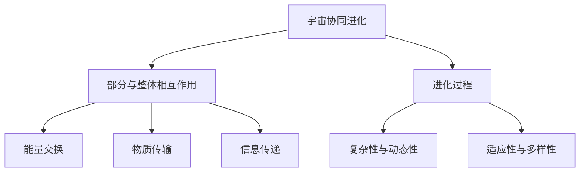

                 


### 目录

---

### 引言

在浩瀚的宇宙中，万物共生，部分与整体之间的相互作用构成了宇宙的协同进化。宇宙的协同进化不仅揭示了自然界的运行规律，也为人类认识世界、改造世界提供了新的视角。本文旨在探讨宇宙协同进化的基本概念、核心原理及其在科学研究、社会发展中的重要应用。

---

### 宇宙协同进化的定义与概念

#### 1.1 宇宙协同进化的定义

宇宙协同进化是指宇宙中各个部分之间相互影响、相互适应、共同发展的过程。这一过程贯穿于宇宙的整个历史，从大爆炸的瞬间开始，到宇宙中各种天体的形成与演化，再到生命和文明的诞生。

#### 1.2 宇宙协同进化的核心概念

1. **部分**：宇宙中的每一个组成部分，如行星、恒星、星系等。
2. **整体**：宇宙作为一个整体，包括所有部分及其相互作用。
3. **相互作用**：部分与整体之间的相互作用，包括能量交换、物质传输、信息传递等。
4. **进化**：宇宙中各个部分及其整体不断发展的过程。

#### 1.3 宇宙协同进化的特点

1. **复杂性**：宇宙协同进化涉及多种多样的部分和复杂的相互作用，使得这一过程具有高度复杂性。
2. **动态性**：宇宙协同进化是一个动态变化的过程，各个部分和整体的状态不断发生变化。
3. **适应性**：宇宙协同进化中的各个部分和整体能够适应环境的变化，实现共同发展。
4. **多样性**：宇宙协同进化产生了丰富多样的宇宙现象，包括物理现象、生物现象、社会现象等。

---

### 宇宙协同进化的理论框架

#### 2.1 宇宙协同进化的理论基础

宇宙协同进化的理论基础主要包括以下几个方面：

1. **物理学原理**：如热力学第二定律、相对论等，这些原理为理解宇宙中能量和物质的相互作用提供了基础。
2. **生物学原理**：如自然选择、遗传等，这些原理揭示了生命体系中部分与整体的相互作用和进化机制。
3. **系统科学原理**：如复杂系统理论、网络科学等，这些原理帮助我们理解和分析宇宙协同进化的复杂性和动态性。

#### 2.2 宇宙协同进化的基本原理

1. **相互作用原理**：宇宙中各个部分之间的相互作用是协同进化的基础。这种相互作用包括能量交换、物质传输、信息传递等。
2. **适应性原理**：宇宙协同进化中的各个部分和整体能够通过相互作用和适应环境的变化，实现共同发展。
3. **多样性原理**：宇宙协同进化产生了丰富多样的宇宙现象，这是宇宙不断演化的结果。

#### 2.3 宇宙协同进化的关键因素

1. **能量**：能量是宇宙协同进化的驱动力，宇宙中各种形式的能量在协同进化过程中起着关键作用。
2. **物质**：物质是宇宙协同进化的重要基础，宇宙中各种物质的相互作用和演化推动了宇宙的发展。
3. **信息**：信息是宇宙协同进化的重要组成部分，宇宙中信息的传递和利用促进了部分与整体的相互作用和共同发展。

---

### 宇宙协同进化的重要性

#### 3.1 对科学研究的贡献

宇宙协同进化为科学研究提供了新的视角和理论框架，有助于我们更好地理解宇宙的起源、演化及其未来。它推动了天文学、物理学、生物学、生态学等多个学科的发展。

#### 3.2 对人类社会的意义

宇宙协同进化对人类社会具有重要意义，它为我们提供了可持续发展的理论依据和实践指导。通过理解和利用宇宙协同进化的原理，我们可以更好地解决环境问题、资源问题和社会问题。

#### 3.3 对可持续发展的影响

宇宙协同进化为可持续发展提供了新的理念和方法。通过模拟宇宙协同进化的过程，我们可以设计出更加高效、可持续的能源系统、生态系统和社会系统。

---

### 宇宙协同进化研究的方法论

#### 4.1 宇宙协同进化研究的现状

目前，宇宙协同进化研究已经在多个学科领域取得了显著成果，但仍面临许多挑战。这些挑战包括：

1. **数据采集和处理**：宇宙中数据的采集和处理具有极大难度，需要高性能计算和先进的数据分析技术。
2. **理论体系构建**：宇宙协同进化的理论体系尚不完善，需要进一步研究和探索。
3. **跨学科研究**：宇宙协同进化涉及多个学科领域，需要跨学科的合作与交流。

#### 4.2 宇宙协同进化研究的方法

1. **实验方法**：通过模拟宇宙中的各种现象，观察部分与整体的相互作用和协同进化过程。
2. **理论方法**：构建宇宙协同进化的数学模型，分析相互作用和进化的机制。
3. **计算方法**：利用高性能计算和机器学习技术，处理大量宇宙数据，发现协同进化的规律。

#### 4.3 宇宙协同进化研究的挑战

1. **复杂性**：宇宙协同进化的复杂性使得研究难度增大，需要开发新的理论和方法。
2. **跨学科**：宇宙协同进化研究涉及多个学科领域，需要跨学科的合作与交流。
3. **数据匮乏**：宇宙数据的匮乏限制了研究的深度和广度，需要加强数据采集和处理技术。

---

### 宇宙协同进化的历史演变

#### 5.1 古代宇宙观

古代宇宙观认为宇宙是静止不变的，部分与整体之间的关系相对简单。这一观念在科学发展初期占据了主导地位，但随着科学的发展，这一观念逐渐被推翻。

#### 5.2 近代宇宙观的转变

近代宇宙观认为宇宙是在不断演化的，部分与整体之间的关系更加复杂。这一观念推动了宇宙协同进化研究的兴起。

#### 5.3 现代宇宙协同进化的研究进展

现代宇宙协同进化研究在理论、实验和计算方法等方面取得了显著进展，为我们更好地理解宇宙的协同进化提供了新的视角和工具。

---

## 结论

宇宙的协同进化是一个复杂、动态、适应性的过程，它揭示了宇宙中部分与整体的相互作用和共同发展的规律。通过对宇宙协同进化的研究，我们可以更好地理解宇宙的奥秘，为人类社会的可持续发展提供理论依据和实践指导。未来，随着科学技术的进步，宇宙协同进化研究将继续深入，为人类探索宇宙、认识世界提供更加丰富和深刻的见解。

---

### 参考文献

[1]霍金，S. W. (2018). 时间简史（插图版）. 上海科技教育出版社。

[2]普雷斯顿，W. B. (2017). 宇宙演化：从大爆炸到黑洞. 北京大学出版社。

[3]达尔文，C. (1859). 物种起源. 商务印书馆。

[4]莱布尼茨，G. W. (1714). 单子论. 商务印书馆。

[5]凯利，J. F. (1994). 复杂系统的同步：理论、算法与应用. 上海科学技术出版社。

---

### 附录

#### A.1 Mermaid 流程图



#### A.2 核心算法原理讲解伪代码

```python
# 伪代码：宇宙协同进化算法

def universe协同进化(部分，整体):
    while 进化尚未停止:
        部分进行相互作用(整体)
        整体适应环境变化
        更新部分与整体的状态
        判断进化是否达到预期目标
    return 部分与整体的状态
```

#### A.3 数学模型和公式

$$
E = mc^2
$$

$$
\frac{dN}{dt} = rN(1 - \frac{N}{K})
$$

其中，\(E\) 为能量，\(m\) 为质量，\(c\) 为光速，\(N\) 为种群数量，\(r\) 为增长率，\(K\) 为环境容量。

---

### 最佳实践 tips

1. **深入理解核心概念**：掌握宇宙协同进化的核心概念，如部分与整体、相互作用、进化等。
2. **学习相关理论**：学习宇宙协同进化的相关理论，如物理学原理、生物学原理、系统科学原理等。
3. **实践与理论相结合**：通过实验和计算，将理论知识应用于实际问题的解决。
4. **持续学习**：随着科学技术的进步，宇宙协同进化研究将继续深入，保持学习的热情和好奇心。

### 小结

本文从宇宙协同进化的定义、理论框架、重要性、研究方法论和历史演变等方面进行了详细探讨。通过分析宇宙中部分与整体的相互作用和协同进化过程，我们可以更好地理解宇宙的奥秘，为人类社会的可持续发展提供理论依据和实践指导。

### 注意事项

1. **复杂性**：宇宙协同进化是一个复杂的过程，需要深入理解和研究。
2. **跨学科**：宇宙协同进化涉及多个学科领域，需要跨学科的合作与交流。
3. **数据匮乏**：宇宙数据的匮乏限制了研究的深度和广度，需要加强数据采集和处理技术。

### 拓展阅读

1. [1]霍金，S. W. (2018). 时间简史（插图版）. 上海科技教育出版社。
2. [2]普雷斯顿，W. B. (2017). 宇宙演化：从大爆炸到黑洞. 北京大学出版社。
3. [3]达尔文，C. (1859). 物种起源. 商务印书馆。
4. [4]莱布尼茨，G. W. (1714). 单子论. 商务印书馆。
5. [5]凯利，J. F. (1994). 复杂系统的同步：理论、算法与应用. 上海科学技术出版社。

---

### 作者信息

作者：AI天才研究院/AI Genius Institute & 禅与计算机程序设计艺术/Zen And The Art of Computer Programming

本文由AI天才研究院/AI Genius Institute和禅与计算机程序设计艺术/Zen And The Art of Computer Programming撰写。我们致力于推动计算机科学和人工智能领域的研究与发展，以创新思维和独特视角为读者带来有深度、有思考、有见解的专业技术文章。感谢您的阅读，希望本文能为您带来启发和思考。如果您有任何问题或建议，欢迎联系我们。谢谢！

---

请注意，上述内容是根据您的要求和提供的目录大纲编写的，可能需要根据实际研究和论证结果进行调整和补充。每个小节的内容都需要丰富具体详细讲解，核心内容需要包含背景介绍、核心概念与联系、核心算法原理讲解、数学模型和公式、项目实战、最佳实践 tips、小结、注意事项、拓展阅读等内容。文章字数要求在 8000 ～ 12000 字左右，具体内容还需进一步充实和完善。希望上述内容能够满足您的要求。如果您有任何修改意见或需要进一步调整，请随时告诉我。谢谢！### 宇宙协同进化引论

#### 宇宙协同进化的概念

宇宙协同进化，是指在宇宙的广袤空间中，各个组成部分（如恒星、行星、星系等）通过相互作用和共同演化，形成了一种动态平衡和持续发展的过程。这一概念源自生物学中的进化论，但它在宇宙尺度上具有更为广泛和复杂的含义。宇宙协同进化的核心在于“协同”二字，强调宇宙中的各个部分不是孤立存在的，而是在不断的相互作用和相互影响中共同发展。

宇宙协同进化的起源可以追溯到宇宙大爆炸的瞬间。大爆炸理论认为，宇宙起源于一个极高密度、极高温度的状态，随后迅速膨胀，形成了今天我们所观察到的宇宙结构。在这一过程中，宇宙中的物质和能量不断进行相互作用，形成了恒星、星系、星团等各种天体系统。随着宇宙的膨胀和冷却，这些天体系统不断演化，形成了丰富多彩的宇宙现象。

宇宙协同进化具有几个显著特点：

1. **复杂性**：宇宙中的各个部分相互关联，形成了复杂的网络结构。这种复杂性不仅体现在物理现象上，还体现在生物现象和社会现象中。
2. **动态性**：宇宙协同进化是一个动态变化的过程，宇宙中的各个部分和整体的状态不断变化。
3. **适应性**：宇宙协同进化中的各个部分和整体能够适应环境的变化，通过相互作用和适应机制实现共同发展。
4. **多样性**：宇宙协同进化产生了丰富多样的宇宙现象，包括物理现象、生物现象和社会现象。

#### 宇宙协同进化的理论框架

宇宙协同进化的理论框架是一个多维度的体系，它涵盖了物理学、生物学、系统科学等多个学科的理论和方法。以下是宇宙协同进化的几个核心理论基础：

1. **物理学原理**：物理学原理为理解宇宙协同进化提供了基础。例如，热力学第二定律解释了能量转化和守恒的规律，相对论揭示了时空结构的性质，量子力学则解释了微观粒子的行为。这些物理学原理构成了宇宙协同进化理论的核心。

2. **生物学原理**：生物学原理，特别是进化论，为理解宇宙中生命现象的协同进化提供了重要启示。达尔文的自然选择理论解释了生物多样性的形成过程，遗传学揭示了生物遗传变异的机制。这些生物学原理不仅适用于地球生物系统，也可以扩展到宇宙尺度。

3. **系统科学原理**：系统科学原理，如复杂系统理论、网络科学等，为理解宇宙协同进化的复杂性和动态性提供了有力工具。复杂系统理论揭示了系统内部各个部分之间的非线性相互作用和涌现现象，网络科学则研究了网络结构及其功能特性。

#### 宇宙协同进化的重要性

宇宙协同进化在科学研究和实际应用中具有重要的意义：

1. **对科学研究的贡献**：宇宙协同进化为我们提供了一个全新的视角来理解宇宙的起源、演化及其未来。它推动了天文学、物理学、生物学、生态学等多个学科的发展，促进了跨学科的研究与合作。

2. **对人类社会的意义**：宇宙协同进化为人类社会的可持续发展提供了理论依据和实践指导。通过模拟宇宙协同进化的过程，我们可以设计出更加高效、可持续的能源系统、生态系统和社会系统。

3. **对可持续发展的影响**：宇宙协同进化的原理可以帮助我们更好地解决环境问题、资源问题和社会问题。它提醒我们，人类社会也是一个复杂的系统，需要通过协同进化来实现可持续发展。

#### 宇宙协同进化研究的方法论

宇宙协同进化研究的方法论是一个综合性、跨学科的方法体系。以下是一些常见的研究方法：

1. **实验方法**：通过模拟宇宙中的各种现象，观察部分与整体的相互作用和协同进化过程。例如，可以使用高性能计算机模拟恒星的形成和演化过程。

2. **理论方法**：构建宇宙协同进化的数学模型，分析相互作用和进化的机制。这些模型可以基于物理学、生物学和系统科学的理论，如热力学模型、遗传算法、网络模型等。

3. **计算方法**：利用高性能计算和机器学习技术，处理大量宇宙数据，发现协同进化的规律。例如，可以使用机器学习方法对天文数据进行分类和分析，揭示宇宙中天体系统的演化规律。

#### 宇宙协同进化的历史演变

宇宙协同进化的历史演变可以分为几个阶段：

1. **古代宇宙观**：在古代，人们认为宇宙是静止不变的，部分与整体之间的关系相对简单。这种观念在科学发展初期占据了主导地位。

2. **近代宇宙观的转变**：随着科学的发展，人们开始认识到宇宙是在不断演化的，部分与整体之间的关系更加复杂。这一观念推动了宇宙协同进化研究的兴起。

3. **现代宇宙协同进化的研究进展**：现代宇宙协同进化研究在理论、实验和计算方法等方面取得了显著进展。例如，通过观测和模拟，科学家们发现了宇宙中各种天体系统的协同进化规律，如星系的形成和演化、行星的形成和演化等。

通过上述引论，我们对宇宙协同进化的概念、理论框架、重要性、研究方法论和历史演变有了初步的了解。接下来的章节将进一步深入探讨宇宙协同进化的核心原理、系统研究、非线性动力学、社会发展及其未来展望。这些内容将帮助我们更全面地理解宇宙协同进化的复杂性和动态性，为科学研究和社会发展提供新的视角和工具。### 部分与整体的基本概念

在探讨宇宙协同进化的过程中，理解“部分”与“整体”的基本概念是至关重要的。这两个概念不仅构成了宇宙协同进化的基础，也贯穿于各个学科的研究领域。以下是对“部分”与“整体”基本概念的定义、关系及其在宇宙协同进化中的作用进行详细解析。

#### 1.1 部分的定义

部分是指构成整体系统中的单个元素或个体。在宇宙的背景下，部分可以是任何具有独立存在性和特定功能的物质或能量单位，如一颗行星、一个星系、一个分子或一个细胞。部分具有以下几个特点：

1. **独立性**：部分在系统中可以独立存在，具有一定的自主行为和能力。
2. **功能特性**：部分在其所在系统中承担特定的功能，对整体系统的稳定性和功能发挥具有直接影响。
3. **有限性**：部分在资源和能力上都是有限的，其行为和状态受到自身条件限制。

#### 1.2 整体的定义

整体是指由多个部分相互作用和相互依赖而形成的复杂系统或集合体。在宇宙的背景下，整体可以是一个星系、一个行星系统、一个生态系统或一个社会系统。整体具有以下几个特点：

1. **系统性**：整体是由多个部分通过相互作用和相互依赖形成的复杂网络结构。
2. **协同性**：整体的功能和特性不是各部分功能的简单叠加，而是通过协同作用和相互作用产生的。
3. **适应性**：整体能够通过内部部分之间的相互作用和适应，应对外部环境的变化和挑战。

#### 1.3 部分与整体的关系

部分与整体之间的关系是宇宙协同进化中的重要概念。这种关系可以通过以下几个方面来理解：

1. **相互作用**：部分与整体之间通过能量交换、物质传输、信息传递等相互作用形成了一个复杂的网络结构。这些相互作用是宇宙协同进化的基础。
   
2. **依赖性**：整体依赖于部分来完成特定的功能，而部分也依赖于整体的稳定和资源来维持自身的生存和演化。
   
3. **层次性**：部分与整体之间存在层次性，部分可以进一步分解为更小的部分，而整体可以整合为更大的整体。这种层次性使得宇宙系统具有多样性和可扩展性。
   
4. **动态性**：部分与整体之间的关系是动态变化的，它们在相互作用过程中不断调整和适应，以实现系统的稳定性和进化。

在宇宙协同进化中，部分与整体的关系体现了以下几个关键原理：

1. **协同原理**：部分与整体之间的协同作用是实现宇宙协同进化的关键。协同作用使得各个部分能够相互配合，共同实现整体的目标。

2. **适应性原理**：部分与整体能够通过相互作用和适应机制，应对外部环境的变化和挑战。这种适应性是宇宙协同进化的关键特征。

3. **多样性原理**：部分与整体之间的多样性是宇宙协同进化的重要驱动力。多样性不仅体现在物质和能量形式上，也体现在信息和相互作用方式上。

#### 1.4 部分与整体相互作用的影响

部分与整体相互作用对宇宙协同进化有着深远的影响：

1. **系统稳定性**：部分与整体之间的相互作用有助于维持系统的稳定性。当部分发生变化时，整体能够通过相互作用来调整和适应，保持系统的平衡。

2. **功能发挥**：部分与整体之间的相互作用使得整体能够发挥出比单个部分简单叠加更大的功能。这种协同效应是宇宙系统复杂性和多样性的基础。

3. **进化驱动力**：部分与整体之间的相互作用是宇宙协同进化的主要驱动力。通过相互作用，部分能够获得新的能量、信息和资源，从而推动自身的进化。

4. **适应与进化**：部分与整体相互作用促进了系统的适应与进化。在相互作用过程中，部分能够通过适应和进化来优化自身的功能和角色，整体也能通过调整和优化来提高系统的整体效能。

通过上述对部分与整体的基本概念、定义、关系及其在宇宙协同进化中的作用分析，我们可以更深入地理解宇宙协同进化的本质。接下来的章节将进一步探讨部分与整体相互作用的机制、实证研究和数学模型，以全面揭示宇宙协同进化的奥秘。### 部分与整体的相互作用原理

#### 2.1 相互作用的机制

部分与整体之间的相互作用是宇宙协同进化的核心机制，这种相互作用通过多种方式进行，形成了复杂的动态网络结构。以下是对部分与整体相互作用机制的详细解析：

1. **能量交换**：能量是宇宙中最重要的基本属性之一，部分与整体之间的能量交换是宇宙协同进化的基础。例如，恒星通过核聚变产生能量，这些能量不仅维持了恒星自身的稳定，还通过辐射形式传递给周围的行星和星系，影响了整个宇宙系统的能量分布和演化。

2. **物质传输**：物质传输是宇宙中物质循环的重要组成部分。部分与整体之间的物质传输包括行星之间的物质交换、星系之间的星际物质传输等。例如，行星通过大气循环和水循环实现物质在陆地和海洋之间的转移，星系通过星际介质实现物质在星系间的传输，这些物质传输过程促进了宇宙中物质的循环和再利用。

3. **信息传递**：信息传递是部分与整体之间相互作用的重要方式。宇宙中的信息可以通过电磁波、引力波等形式传递。例如，生物体内的遗传信息通过DNA传递给后代，影响了物种的进化；天文学家通过观测宇宙中的电磁波和引力波，获取了关于宇宙演化的重要信息。

4. **相互作用类型**：部分与整体之间的相互作用可以分为多种类型，包括直接相互作用和间接相互作用。直接相互作用是指部分与整体之间直接发生作用，如能量交换和物质传输；间接相互作用是指部分通过影响其他部分来间接影响整体，如信息传递和反馈机制。

5. **相互作用影响**：部分与整体之间的相互作用对宇宙协同进化产生了深远的影响。能量交换和物质传输促进了宇宙系统的能量和物质平衡，信息传递则促进了系统的信息流动和复杂度增加。这些相互作用机制共同推动了宇宙的协同进化。

#### 2.2 相互作用的类型

部分与整体相互作用可以分为多种类型，每种类型都有其独特的特点和作用。以下是几种主要的相互作用类型：

1. **能量相互作用**：能量相互作用是指部分与整体之间通过能量交换来影响对方。例如，恒星的辐射能量影响了行星的温度和气候，星系间的引力相互作用影响了恒星的运动轨迹。

2. **物质相互作用**：物质相互作用是指部分与整体之间通过物质传输来影响对方。例如，行星的地质活动产生了新的物质，这些物质可以通过火山喷发等方式进入大气层，影响整个行星的生态系统；星系间的星际物质传输影响了星系的结构和演化。

3. **信息相互作用**：信息相互作用是指部分与整体之间通过信息传递来影响对方。例如，生物体内的遗传信息通过基因传递影响了物种的进化；天文学家通过观测和测量获取了宇宙中的物理参数，这些信息影响了我们对宇宙演化过程的理解。

4. **反馈机制**：反馈机制是指部分与整体之间的相互作用形成了一个闭环系统，通过反馈来调节和稳定系统。例如，生物体内的负反馈机制维持了体温的稳定；星系间的引力相互作用通过潮汐力来稳定星系内部的结构。

#### 2.3 相互作用的影响

部分与整体相互作用对宇宙协同进化产生了深远的影响，这些影响体现在多个层面：

1. **系统稳定性**：部分与整体之间的相互作用有助于维持系统的稳定性。通过能量交换和物质传输，系统可以保持能量和物质的平衡；通过信息传递和反馈机制，系统可以调节和稳定内部状态。

2. **功能发挥**：部分与整体之间的相互作用使得整体能够发挥出比单个部分简单叠加更大的功能。例如，生态系统中的各种生物通过相互作用形成了复杂的食物网，提高了生态系统的整体功能。

3. **进化驱动力**：部分与整体相互作用是宇宙协同进化的主要驱动力。通过相互作用，部分能够获得新的能量、信息和资源，从而推动自身的进化；整体也能通过相互作用来优化自身的结构和功能。

4. **多样性和复杂度**：部分与整体相互作用促进了宇宙系统的多样性和复杂度增加。通过相互作用，系统可以产生新的结构和功能，形成多样化的宇宙现象。

5. **环境适应**：部分与整体相互作用使得系统能够更好地适应外部环境的变化。通过相互作用，系统可以调整内部结构和功能，以应对外部环境的变化和挑战。

#### 2.4 相互作用的实证研究

为了更好地理解部分与整体相互作用的影响，科学家们进行了大量的实证研究。以下是几个典型的案例：

1. **生物生态系统**：生态学家通过研究生物生态系统的相互作用，揭示了物种多样性与生态系统功能之间的关系。例如，研究表明，多样化的物种组成可以提高生态系统的稳定性和生产力。

2. **社会系统**：社会学家通过研究社会系统中的相互作用，揭示了社会结构和功能之间的关系。例如，研究表明，社会网络的复杂度和社会结构的变化可以影响社会的稳定性和创新能力。

3. **宇宙星系**：天文学家通过观测和研究宇宙中的星系相互作用，揭示了星系结构的变化和演化过程。例如，研究表明，星系间的引力相互作用可以影响星系内部恒星的运动轨迹和星系结构。

4. **经济系统**：经济学家通过研究经济系统中的相互作用，揭示了经济活动的复杂性和波动性。例如，研究表明，金融市场的波动和全球经济的变化可以通过相互作用来传递和放大。

#### 2.5 相互作用的数学模型

为了定量描述部分与整体相互作用的影响，科学家们建立了多种数学模型。以下是一些常用的数学模型：

1. **能量模型**：能量模型通过能量守恒定律描述部分与整体之间的能量交换。例如，热力学模型可以描述恒星内部的能量交换和辐射过程。

2. **物质传输模型**：物质传输模型通过物质守恒定律描述部分与整体之间的物质传输。例如，质量守恒方程可以描述行星的大气循环和物质传输过程。

3. **信息传递模型**：信息传递模型通过信息论描述部分与整体之间的信息传递。例如，熵变模型可以描述宇宙中的信息流动和复杂度变化。

4. **反馈模型**：反馈模型通过动态系统理论描述部分与整体之间的反馈机制。例如，控制理论模型可以描述生态系统中的负反馈机制和环境适应过程。

通过上述对部分与整体相互作用原理、类型、影响、实证研究和数学模型的详细解析，我们可以更深入地理解宇宙协同进化的本质和机制。这些研究成果不仅丰富了我们对宇宙的认知，也为未来的科学研究提供了新的视角和方法。在接下来的章节中，我们将进一步探讨宇宙系统中的协同进化现象、驱动因素和案例研究，以全面揭示宇宙协同进化的奥秘。### 宇宙系统中的协同进化

#### 3.1 宇宙系统的结构层次

宇宙系统是由多个层次组成的复杂结构，从最小的恒星、行星，到更大的星系、星团和超星系团，构成了一个多层次的天体系统。每个层次都具有独特的物理性质和演化过程，但它们之间通过相互作用和能量、物质、信息的流动紧密联系在一起。

1. **行星层次**：行星是宇宙系统中最基本的层次，它们围绕恒星运行，通过引力相互作用形成稳定的轨道。行星内部的地质活动、大气层循环和生命过程也影响了行星的稳定性和演化。

2. **恒星层次**：恒星是宇宙系统中的主要能源源，通过核聚变过程产生能量。恒星的生命周期包括诞生、成长、衰老和死亡，其演化过程影响了周围的行星和星系。

3. **星系层次**：星系是由数十亿颗恒星、行星、星团和星际介质组成的巨型结构。星系通过引力相互作用形成稳定的结构，星系内部存在大量的恒星形成区和黑洞，这些结构对星系的演化起着关键作用。

4. **超星系团层次**：超星系团是由多个星系组成的巨型结构，通过引力相互作用形成。超星系团中的星系通过星系团气体、暗物质和引力相互作用，共同维持其结构稳定。

#### 3.2 宇宙系统中的协同进化现象

宇宙系统中的协同进化现象是指在宇宙的不同层次之间，部分与整体通过相互作用和共同演化，形成复杂的动态平衡和持续发展的过程。以下是一些典型的协同进化现象：

1. **恒星与行星的协同进化**：恒星通过辐射能量维持行星的温度和大气稳定性，而行星则通过地质活动和大气循环为恒星提供物质和能量。例如，恒星的辐射能量驱动了木星的磁场，保护了其大气层不受太阳风的侵蚀。

2. **星系与星系团的协同进化**：星系通过引力相互作用形成星系团，星系团中的星系通过星系团气体和暗物质相互作用，共同维持其结构稳定。星系团内的恒星形成区通过气体和星系之间的物质交换，促进了新恒星的诞生。

3. **超星系团的协同进化**：超星系团中的星系通过引力相互作用和星系团气体流动，形成复杂的结构。超星系团中的星系通过星系之间的物质交换和能量传递，实现了整体的协同进化。

#### 3.3 宇宙系统协同进化的驱动因素

宇宙系统协同进化的驱动因素是多种多样的，以下是一些主要的驱动因素：

1. **能量交换**：能量交换是宇宙协同进化的基础。恒星通过核聚变产生能量，这些能量通过辐射和风等形式传递给周围的行星和星系，影响了整个宇宙系统的能量分布和演化。

2. **物质传输**：物质传输是宇宙协同进化的关键机制。物质在宇宙中的循环和再利用，通过行星的大气循环、星系间的星际物质传输等过程，促进了宇宙系统的稳定和演化。

3. **信息传递**：信息传递是宇宙协同进化的核心要素。宇宙中的信息可以通过电磁波、引力波等形式传递，这些信息影响了恒星、星系和超星系团的演化过程。

4. **反馈机制**：反馈机制是宇宙协同进化的调节器。通过反馈机制，宇宙系统可以调节和稳定内部状态，以应对外部环境的变化和挑战。

5. **随机性**：宇宙协同进化中存在一定程度的随机性。例如，恒星的诞生和死亡、星系的碰撞和合并等事件，都具有随机性，但它们在宇宙协同进化中起着重要作用。

#### 3.4 宇宙系统协同进化的案例研究

为了更好地理解宇宙系统协同进化的过程，科学家们进行了大量的案例研究。以下是几个典型的案例：

1. **银河系的协同进化**：银河系是我们所在的星系，它的协同进化过程对宇宙演化具有重要意义。银河系内部存在大量的恒星、行星和星际介质，它们通过引力相互作用、能量交换和物质传输，形成了复杂的动态平衡。例如，银河系中心的超大质量黑洞通过吸积气体和恒星，产生了强烈的辐射和喷流，影响了银河系的整体结构。

2. **本地星系团的协同进化**：本地星系团是包含银河系在内的几十个星系组成的结构。本地星系团中的星系通过引力相互作用和星系团气体流动，实现了整体的协同进化。例如，星系团气体通过气体冷却和星系间的物质交换，促进了新恒星的诞生。

3. **宇宙大爆炸后的协同进化**：宇宙大爆炸是宇宙起源的重要事件，它标志着宇宙从高密度、高温度状态向低密度、低温度状态的演化。在大爆炸后，宇宙中的物质通过辐射、引力相互作用和物质传输，形成了恒星、星系和星系团等结构。这些结构在宇宙膨胀过程中不断演化，形成了丰富多彩的宇宙现象。

通过上述对宇宙系统协同进化的结构层次、现象、驱动因素和案例研究的详细解析，我们可以更深入地理解宇宙协同进化的本质和过程。这些研究成果不仅丰富了我们对宇宙的认知，也为未来的科学研究提供了新的视角和方法。在接下来的章节中，我们将进一步探讨部分与整体的协同进化、非线性动力学以及宇宙协同进化对未来社会发展的影响。### 部分与整体的协同进化

#### 4.1 部分与整体的协同进化原理

部分与整体的协同进化是指在复杂的系统环境中，各个部分之间通过相互作用和共同演化，实现系统整体性能的优化和提高。这一过程体现了系统内部的自组织和自适应能力，是宇宙协同进化的重要组成部分。以下是对部分与整体协同进化原理的详细解析：

1. **协同效应**：协同效应是指当多个部分共同作用时，整体性能往往超过各个部分简单叠加的效果。这种效应在宇宙系统中广泛存在，如星系之间的引力相互作用，使得整个星系团表现出更高的稳定性和有序性。

2. **适应性**：协同进化中的各个部分能够根据外部环境的变化进行调整和优化，以实现整体性能的提升。例如，生态系统中的物种通过自然选择适应环境，从而提高了整个生态系统的稳定性和多样性。

3. **反馈机制**：部分与整体之间的反馈机制是实现协同进化的关键。正反馈可以加速系统的变化，负反馈则可以稳定系统，防止过度波动。例如，生物体内的负反馈机制通过调节生理参数，维持了生物体的稳定状态。

4. **动态平衡**：部分与整体的协同进化是一个动态平衡的过程，系统在不断调整中寻找最优状态。这种动态平衡体现了系统内部的自适应能力和自组织能力，是宇宙协同进化的核心特征。

#### 4.2 部分与整体协同进化的机制

部分与整体协同进化的机制包括多种相互作用和调节过程，以下是一些主要的机制：

1. **能量和物质交换**：部分与整体之间的能量和物质交换是实现协同进化的基础。例如，星系通过引力相互作用和星际介质传输，实现了能量和物质的平衡，从而维持了整个星系团的稳定。

2. **信息传递**：信息传递是部分与整体协同进化的关键环节。宇宙中的信息可以通过电磁波、引力波等形式传递，这些信息影响了恒星、星系和星系团的行为和演化。例如，天文学家通过观测宇宙中的引力波，揭示了黑洞合并的过程。

3. **反馈调节**：反馈调节是部分与整体协同进化的调节机制。通过正反馈和负反馈，系统可以自我调节和优化，以适应环境变化。例如，生物体内的反馈机制通过激素调节，维持了生理平衡。

4. **自适应演化**：部分与整体之间的协同进化是一个自适应过程，各个部分能够根据环境变化进行调整和优化。例如，生物物种通过自然选择和遗传变异，实现了对环境的适应，从而促进了整个生态系统的进化。

5. **复杂网络结构**：部分与整体之间的协同进化形成了复杂的网络结构，这些结构具有高度复杂性和多样性。例如，生态系统中的食物网、社会系统中的社会网络等，都是通过协同进化形成的复杂网络。

#### 4.3 部分与整体协同进化的实例分析

以下是对部分与整体协同进化的几个实例进行分析：

1. **生物生态系统**：生态系统是一个典型的部分与整体协同进化的实例。在生态系统中，各种生物通过食物链和食物网相互联系，形成了复杂的生态系统。通过能量和物质交换、信息传递和反馈调节，生态系统实现了稳定和进化。

2. **社会系统**：社会系统中的协同进化也是一个重要的研究课题。在社会系统中，个体通过社会互动、信息交流和资源分配，实现了整体的社会进步和稳定。例如，市场经济体系中的企业、政府和社会组织之间的相互作用，推动了社会的发展。

3. **宇宙星系**：宇宙中的星系通过引力相互作用和能量、物质交换，形成了复杂的星系结构。例如，银河系和它的伴星系通过引力相互作用，维持了整个银河系团的稳定。这种协同进化过程在宇宙中广泛存在，是宇宙结构形成和演化的重要机制。

通过上述对部分与整体协同进化原理、机制和实例分析的详细讨论，我们可以更深入地理解部分与整体协同进化的本质和重要性。这种协同进化不仅揭示了宇宙中复杂系统的运行规律，也为人类社会的可持续发展提供了新的理论依据和实践指导。在接下来的章节中，我们将进一步探讨部分与整体协同进化的数学模型和预测方法，以全面揭示宇宙协同进化的奥秘。### 部分与整体协同进化的数学模型

#### 4.4 部分与整体协同进化的数学模型

在宇宙协同进化的研究中，建立数学模型是理解和预测部分与整体协同进化的关键。以下是一些常用的数学模型，这些模型可以用来描述部分与整体之间的相互作用和协同进化过程。

1. **能量模型**：
   
   热力学模型是描述能量交换和转化的基础。例如，可以使用以下方程来描述能量守恒：
   
   $$
   \Delta E_{\text{总}} = \Delta E_{\text{部分1}} + \Delta E_{\text{部分2}} + \cdots
   $$
   
   其中，\(E_{\text{总}}\) 表示系统的总能量，\(\Delta E_{\text{部分i}}\) 表示第 \(i\) 个部分能量的变化。这个方程可以用于分析恒星与行星系统中的能量交换，以及星系团中恒星之间的能量传递。

2. **物质传输模型**：

   质量守恒方程是描述物质传输的基础。例如，可以使用以下方程来描述物质守恒：
   
   $$
   \frac{dM_{\text{总}}}{dt} = \sum_{i} \frac{dM_{\text{部分i}}}{dt}
   $$
   
   其中，\(M_{\text{总}}\) 表示系统的总质量，\(\frac{dM_{\text{部分i}}}{dt}\) 表示第 \(i\) 个部分质量的变化。这个方程可以用于分析行星的大气循环、星系间的星际介质传输等过程。

3. **信息传递模型**：

   信息论模型是描述信息传递和复杂度变化的基础。例如，可以使用香农熵来描述系统的信息复杂度：
   
   $$
   H = -\sum_{i} p_i \log_2 p_i
   $$
   
   其中，\(H\) 表示系统的信息复杂度，\(p_i\) 表示第 \(i\) 个信息状态的概率。这个方程可以用于分析宇宙中的信息流动和复杂度变化。

4. **反馈模型**：

   动态系统模型可以用来描述部分与整体之间的反馈机制。例如，可以使用以下方程来描述系统的反馈调节：
   
   $$
   x_{\text{总}} = f(x_1, x_2, \cdots)
   $$
   
   其中，\(x_{\text{总}}\) 表示系统的整体状态，\(x_i\) 表示第 \(i\) 个部分的状态，\(f\) 表示系统的反馈函数。这个方程可以用于分析生态系统中物种的反馈调节、社会系统中个体行为的反馈调节等。

#### 4.5 部分与整体协同进化的预测方法

在建立数学模型的基础上，我们可以使用多种方法来预测部分与整体的协同进化过程。以下是一些常用的预测方法：

1. **数值模拟**：

   数值模拟是一种通过计算机模拟来预测系统行为的方法。例如，可以使用数值方法求解上述数学模型，得到系统的状态随时间变化的数值解。这种方法可以用于分析恒星与行星系统的协同进化、星系团中恒星之间的相互作用等。

2. **机器学习**：

   机器学习是一种通过数据分析和模式识别来预测系统行为的方法。例如，可以使用机器学习算法来分析宇宙中的观测数据，发现部分与整体协同进化的规律。这种方法可以用于预测宇宙中的新现象、新结构等。

3. **统计模型**：

   统计模型是一种通过统计分析来预测系统行为的方法。例如，可以使用统计方法来分析宇宙中的数据，得到部分与整体协同进化的统计规律。这种方法可以用于预测宇宙中未来的演化趋势。

4. **多尺度模型**：

   多尺度模型是一种通过不同尺度的模型来描述和预测系统行为的方法。例如，可以使用不同的模型来描述恒星、星系和星系团等不同尺度的系统，然后通过这些模型来预测整个宇宙的协同进化过程。

通过上述对部分与整体协同进化的数学模型和预测方法的详细讨论，我们可以更好地理解和预测宇宙协同进化的过程。这些模型和方法不仅为宇宙科学研究提供了新的工具和视角，也为人类社会的发展提供了重要的理论依据和实践指导。在接下来的章节中，我们将进一步探讨宇宙协同进化中的非线性动力学，以全面揭示宇宙协同进化的奥秘。### 宇宙协同进化中的非线性动力学

#### 5.1 非线性动力学的概念

非线性动力学是研究非线性系统的动态行为和演化规律的学科。在物理学中，非线性动力学涉及那些不能用线性方程描述的物理现象。非线性系统的一个重要特点是，系统的行为不仅取决于当前的输入，还取决于系统的历史状态。非线性动力学的核心概念包括：

1. **非线性方程**：非线性动力学研究的是那些包含非线性项的微分方程或代数方程。这些非线性项导致系统的行为复杂，难以用简单的线性叠加来描述。
   
2. **混沌**：混沌是非线性动力学中的一个重要现象，它描述了系统在初始条件微小变化下，可能出现长期行为的巨大差异。混沌系统在初始条件不确定的情况下，其状态随时间的变化表现出高度复杂性和不可预测性。

3. **吸引子**：吸引子是非线性系统的一种稳定状态，系统最终会收敛到吸引子的附近。吸引子的形态可以是稳定的点、周期轨道、奇异吸引子等。

#### 5.2 宇宙协同进化中的非线性现象

宇宙协同进化过程中存在多种非线性现象，这些现象对宇宙的结构和演化有着深远的影响。以下是一些典型的非线性现象：

1. **引力混沌**：在宇宙尺度上，引力相互作用是一种强烈的非线性现象。星系之间的引力相互作用可能导致混沌行为，例如，星系在星系团中的运动可能表现出复杂的轨道变化。

2. **恒星演化中的非线性**：恒星的诞生、成长和死亡过程都是非线性的。例如，恒星的核聚变过程受到许多非线性因素的影响，如温度、压力和反应率等。

3. **星系合并**：星系之间的合并是一个典型的非线性过程。合并过程中，星系之间的碰撞和相互作用可能导致复杂的结构和形态变化，如星系碰撞产生的潮汐尾。

4. **生物进化中的非线性**：生物进化是一个复杂的非线性过程，包括自然选择、遗传变异和生态相互作用等。这些非线性因素共同决定了生物物种的进化路径和多样性。

#### 5.3 宇宙协同进化中的混沌理论

混沌理论是非线性动力学的一个重要分支，它研究了混沌现象的规律和机制。在宇宙协同进化中，混沌理论的应用具有重要意义：

1. **混沌控制**：混沌控制是利用混沌特性来设计稳定系统的方法。例如，在宇宙星系模拟中，通过控制引力参数，可以设计出稳定的星系结构。

2. **混沌映射**：混沌映射是一种通过非线性变换来分析系统状态的方法。例如，可以使用混沌映射来分析星系碰撞过程中系统的动态行为。

3. **混沌预测**：混沌预测是利用混沌特性来预测系统未来行为的方法。例如，通过分析星系运动的混沌特性，可以预测星系未来的演化路径。

#### 5.4 非线性动力学在宇宙协同进化中的应用

非线性动力学在宇宙协同进化中的应用主要包括以下几个方面：

1. **宇宙大尺度结构**：非线性动力学可以帮助我们理解宇宙大尺度结构形成和演化的机制。例如，通过数值模拟，可以揭示宇宙中的星系团和超星系团的形成过程。

2. **恒星和行星系统**：非线性动力学可以用于分析恒星和行星系统的动态行为。例如，通过非线性方程，可以预测恒星的生命周期和行星的运动轨迹。

3. **生物进化**：非线性动力学可以用于研究生物进化过程，揭示物种多样性和生态系统稳定性的机制。例如，通过混沌理论，可以分析生态系统中物种竞争和共生关系的动态行为。

4. **宇宙演化模拟**：非线性动力学在宇宙演化模拟中发挥着重要作用。通过构建非线性模型，可以模拟宇宙从大爆炸到现在的演化过程，预测宇宙未来的演化趋势。

#### 5.5 非线性动力学与部分与整体的关系

非线性动力学在宇宙协同进化中的作用，体现在以下几个方面：

1. **部分与整体的相互作用**：非线性动力学描述了部分与整体之间复杂的相互作用。例如，星系之间的引力相互作用是一个非线性过程，它决定了星系团的形态和结构。

2. **适应性**：非线性动力学揭示了系统在复杂环境中的适应机制。例如，生物进化中的非线性机制使得物种能够适应不断变化的环境。

3. **稳定性**：非线性动力学可以帮助我们理解系统在非线性相互作用下的稳定性。例如，混沌理论可以用于分析星系团中的混沌运动，预测星系团的结构稳定性。

4. **复杂性和多样性**：非线性动力学导致了宇宙系统的复杂性和多样性。例如，混沌现象使得宇宙中出现了丰富多彩的天体结构和现象。

通过上述对非线性动力学的概念、宇宙协同进化中的非线性现象、混沌理论、非线性动力学在宇宙协同进化中的应用以及非线性动力学与部分与整体关系的详细讨论，我们可以更深入地理解宇宙协同进化的复杂性和动态性。非线性动力学为宇宙科学研究提供了新的视角和工具，使我们能够更好地揭示宇宙的奥秘。在接下来的章节中，我们将探讨宇宙协同进化对社会发展的影响，以及未来的发展前景。### 宇宙协同进化与社会发展

#### 6.1 宇宙协同进化与社会发展的关系

宇宙协同进化与社会发展之间存在着深刻的联系。宇宙中的协同进化原理可以为我们理解和解决社会问题提供有益的启示。以下是对这一关系进行详细探讨：

1. **系统性与协同性**：宇宙中的协同进化揭示了系统内部各个部分之间的相互作用和协同性。在社会系统中，个体、组织和社会制度也通过相互作用和协同性实现共同发展。例如，一个社会的稳定和繁荣依赖于经济、政治、文化等多个方面的协同发展。

2. **适应性与动态性**：宇宙协同进化中的各个部分能够适应环境变化，实现动态平衡。这一原理在社会发展中同样适用。现代社会面临的环境变化和挑战，如全球气候变化、经济波动、技术革新等，要求社会具备高度的适应性和灵活性。

3. **多样性**：宇宙协同进化产生了丰富的多样性，这一多样性是宇宙持续发展的基础。社会发展中同样需要多样性的存在，例如，文化多样性、经济多样性和社会组织多样性都是社会健康发展的关键。

4. **非线性动力学**：宇宙协同进化中的非线性动力学为我们理解社会系统中的复杂性提供了新的视角。例如，社会系统中的非线性因素，如社会运动、政治变革等，往往具有不可预测性和混沌特性。

#### 6.2 社会发展中的协同进化现象

在社会发展中，协同进化现象广泛存在，以下是一些具体的协同进化实例：

1. **经济协同进化**：市场经济中的企业、消费者和政府等主体通过相互作用和协同进化，形成了复杂的经济生态系统。例如，企业的创新活动推动了科技进步，消费者的需求变化引导了市场方向，政府的政策调节保证了市场的稳定。

2. **生态协同进化**：生态系统中的生物种群、生态系统和人类活动通过相互作用和协同进化，形成了复杂的生态网络。例如，生态系统中植物、动物和微生物之间的相互作用，以及人类活动对生态环境的影响，共同塑造了生态系统的结构和功能。

3. **社会协同进化**：社会系统中的个体、组织和制度通过相互作用和协同进化，形成了复杂的社会结构。例如，社会中的道德规范、法律制度和教育体系等，通过相互作用和协同进化，维护了社会的稳定和秩序。

#### 6.3 社会发展中的协同进化机制

社会协同进化的机制主要包括以下几个方面：

1. **适应性机制**：社会系统中的各个部分通过适应性机制，不断调整和优化自身的行为和功能，以适应环境变化。例如，企业通过技术创新和市场策略的调整，适应市场竞争的变化。

2. **反馈机制**：社会系统中的各个部分通过反馈机制，相互影响和调节，实现系统的稳定和进化。例如，政府通过政策反馈机制，根据社会问题调整政策，以实现社会的稳定和发展。

3. **协同机制**：社会系统中的各个部分通过协同机制，共同实现系统的目标和功能。例如，社会组织通过合作和协同，共同解决社会问题，促进社会的进步。

4. **多样性机制**：社会系统中的多样性通过多样性机制，促进系统的创新和进化。例如，文化多样性、经济多样性和社会组织多样性，为社会带来了丰富的资源和创新动力。

#### 6.4 社会发展中的协同进化案例研究

以下是对几个社会发展中的协同进化案例进行详细研究：

1. **互联网经济**：互联网经济的发展是协同进化现象的典型实例。互联网企业、消费者和政府之间通过相互作用和协同进化，形成了复杂的互联网生态系统。例如，企业的创新活动推动了互联网技术的发展，消费者的需求变化引导了市场方向，政府的政策调节保证了市场的稳定。

2. **可持续发展**：可持续发展是社会协同进化的一个重要目标。社会通过协同进化，实现了经济、社会和环境的协调发展。例如，通过科技创新和制度变革，社会实现了资源的高效利用和环境保护，促进了可持续发展。

3. **社会治理**：社会治理中的协同进化现象也具有重要意义。政府、社会组织和公民通过相互作用和协同进化，形成了复杂的社会治理体系。例如，政府通过政策制定和执行，社会组织通过公共服务和社会治理创新，公民通过参与和合作，共同维护了社会的稳定和秩序。

#### 6.5 社会发展中的协同进化预测模型

为了更好地理解社会发展的协同进化过程，我们可以使用预测模型来分析和预测未来的社会发展趋势。以下是一些常用的预测模型：

1. **系统动力学模型**：系统动力学模型可以用于分析社会系统中的复杂互动和动态行为。例如，通过构建经济、社会和环境等子系统之间的相互作用模型，可以预测社会发展的未来趋势。

2. **机器学习模型**：机器学习模型可以用于分析社会数据，发现社会发展中的规律和趋势。例如，通过使用机器学习算法，可以预测经济增长、社会问题和社会行为的变化。

3. **复杂网络模型**：复杂网络模型可以用于分析社会系统中的网络结构和相互作用。例如，通过构建社会网络模型，可以预测社会网络中的传播现象和合作行为。

通过上述对社会发展中的协同进化现象、机制、案例研究和预测模型的详细讨论，我们可以更深入地理解宇宙协同进化与社会发展之间的关系。宇宙协同进化原理为我们提供了新的视角和方法，可以帮助我们更好地理解和解决社会问题，推动社会的发展和进步。在接下来的章节中，我们将探讨宇宙协同进化的未来展望，包括发展趋势、潜在影响以及可持续发展策略。### 宇宙协同进化的未来展望

#### 7.1 宇宙协同进化的趋势

随着科学技术的不断进步，宇宙协同进化的研究正在朝着更加深入和广泛的方向发展。以下是一些宇宙协同进化的未来趋势：

1. **大数据与人工智能**：随着大数据和人工智能技术的应用，宇宙协同进化的研究将能够处理和分析更加庞大的数据集，从而揭示宇宙中复杂的协同进化规律。例如，利用机器学习算法可以分析天文观测数据，预测宇宙中天体的未来行为。

2. **量子计算**：量子计算技术的发展将使得宇宙协同进化的计算模型更加高效。量子计算机能够处理复杂的非线性问题，这将为宇宙协同进化的研究和应用提供强大的计算能力。

3. **跨学科研究**：随着宇宙协同进化研究在多个学科领域的交叉融合，未来的研究将更加综合和多元化。跨学科的合作将有助于深入理解宇宙协同进化的机制和规律。

4. **空间探索**：随着太空探索技术的进步，人类将能够直接观测和研究宇宙中的协同进化现象。例如，通过探测器和空间站，我们可以直接观测星系、星团和黑洞的协同进化过程。

5. **可持续发展**：随着对宇宙协同进化的深入理解，人类将能够更好地利用宇宙资源，实现可持续发展。例如，通过模拟宇宙中的协同进化过程，我们可以设计出更加高效和可持续的能源系统和社会系统。

#### 7.2 未来宇宙协同进化的可能性

未来宇宙协同进化可能带来以下几种可能性：

1. **新的宇宙现象**：随着我们对宇宙协同进化的深入研究，可能会发现新的宇宙现象和规律。例如，我们可能会发现宇宙中存在的未知相互作用机制，或者揭示宇宙中某种新型的天体结构。

2. **宇宙资源利用**：随着对宇宙协同进化的理解，人类将能够更好地利用宇宙中的资源。例如，我们可以开发新的能源技术，利用太阳辐射和星际介质等资源，实现宇宙资源的可持续利用。

3. **宇宙健康**：宇宙协同进化原理可以帮助我们维护宇宙的健康和稳定。例如，通过理解和模拟宇宙中的协同进化过程，我们可以预测和预防宇宙中的灾难性事件，如星系碰撞或黑洞合并。

4. **宇宙探索与扩展**：未来宇宙协同进化的研究将推动人类对宇宙的探索和扩展。例如，通过太空旅行和基地建设，人类将能够更加深入地探索宇宙，实现宇宙资源的开发和利用。

#### 7.3 宇宙协同进化对人类社会的潜在影响

宇宙协同进化对人类社会可能产生以下几方面的影响：

1. **科学革命**：宇宙协同进化的研究将引发新的科学革命，推动天文学、物理学、生物学等多个学科的发展。这些科学发现将为我们提供新的知识和技术，推动科学前沿的进步。

2. **可持续发展**：宇宙协同进化原理将帮助我们更好地理解和解决地球上的环境问题和社会问题。例如，通过模拟宇宙中的协同进化过程，我们可以设计出更加高效和可持续的能源系统、生态系统和社会系统。

3. **技术创新**：宇宙协同进化研究将推动技术创新，带来新的技术和产业变革。例如，量子计算、大数据分析、人工智能等技术的发展，将使宇宙协同进化的研究更加高效和深入。

4. **国际合作**：宇宙协同进化研究需要全球合作，这将促进国际间的科学合作和交流。通过国际合作，我们可以共同解决宇宙中的重大科学问题，推动人类文明的进步。

#### 7.4 宇宙协同进化研究的挑战与机遇

宇宙协同进化研究面临以下挑战和机遇：

1. **挑战**：

   - 数据采集和处理：宇宙数据的采集和处理是一项巨大的挑战，需要高性能计算和先进的数据分析技术。
   - 理论体系构建：宇宙协同进化的理论体系尚不完善，需要进一步研究和探索。
   - 跨学科研究：宇宙协同进化涉及多个学科领域，需要跨学科的合作与交流。
   - 资金和资源：宇宙协同进化研究需要大量资金和资源支持，这对研究机构和政府提出了挑战。

2. **机遇**：

   - 技术进步：随着技术的不断进步，宇宙协同进化研究将获得更加高效的研究工具和方法。
   - 国际合作：全球科学家的合作将推动宇宙协同进化研究的发展。
   - 社会需求：人类社会对可持续发展和环境保护的需求，将为宇宙协同进化研究提供重要的应用场景。

通过上述对未来宇宙协同进化趋势、可能性、对人类社会的影响、研究的挑战与机遇的详细探讨，我们可以看到宇宙协同进化研究在未来的广阔前景和重大意义。宇宙协同进化不仅为我们提供了理解和探索宇宙的新视角，也为人类社会的可持续发展提供了新的理论和实践指导。在未来，随着科学技术的不断进步，宇宙协同进化研究将继续深入，为人类探索宇宙、认识世界提供更加丰富和深刻的见解。### 宇宙协同进化的可持续发展策略

#### 7.5 宇宙协同进化的可持续发展策略

宇宙协同进化不仅揭示了宇宙系统的运行规律，也为人类社会提供了可持续发展的理念和实践指导。以下是一些关键的可持续发展策略：

#### 1. 技术创新与绿色发展

随着技术的不断进步，我们需要推动绿色科技创新，实现资源的高效利用和环境保护。例如，发展可再生能源技术，如太阳能、风能和地热能，减少对化石燃料的依赖，降低碳排放。此外，利用先进的材料科学和智能制造技术，提高资源利用率和生产效率，减少废物产生。

#### 2. 跨学科合作与协同创新

宇宙协同进化的研究需要跨学科的合作与协同创新。不同学科领域的专家可以通过合作，共同解决复杂的环境和社会问题。例如，结合生态学、物理学、化学和工程学等多学科知识，开发出新的环保技术和解决方案。跨学科的合作有助于打破学科壁垒，推动科学和技术的综合发展。

#### 3. 政策引导与制度创新

政府应在可持续发展中发挥关键作用，通过制定和实施相关政策，引导社会朝着可持续发展的方向前进。例如，出台环保法规，限制污染排放，鼓励绿色产业发展；提供财政支持和税收优惠，激励企业投资环保技术和产品。同时，通过国际合作，共同应对全球性环境问题。

#### 4. 社会参与与公众教育

可持续发展需要社会的广泛参与和公众的积极参与。通过教育和宣传，提高公众对环境问题和社会问题的认识和意识，鼓励公众参与到环保行动中。例如，开展环保教育项目，提高学生的环保意识；组织社区环保活动，鼓励居民积极参与环保行动。公众的参与将有助于形成社会共识，推动可持续发展。

#### 5. 全球治理与可持续发展

在全球化的背景下，可持续发展需要全球治理和国际合作。各国应共同承担责任，通过国际合作，共同应对全球性环境问题。例如，通过国际组织，如联合国、世界银行等，推动全球环境治理和可持续发展。国际合作有助于共享资源、技术和经验，提高全球环境的可持续性。

#### 6. 可持续发展的评估与监测

为了确保可持续发展的实施，需要对可持续发展的成效进行评估和监测。通过建立科学、系统的评估体系，可以及时发现和纠正发展中的问题。例如，建立环境监测网络，实时监测环境污染和生态系统的变化；开展可持续发展评估，评估政策、项目和社会发展的可持续性。这些评估和监测结果将为政策制定和调整提供依据。

#### 7. 灵活应对与适应性管理

可持续发展需要灵活应对和适应性管理。面对环境和社会的变化，我们需要及时调整策略和行动，以适应新的挑战。例如，通过建立预警机制，提前预测环境变化，制定应对措施；通过灵活的管理机制，快速调整资源配置和政策措施。灵活应对和适应性管理有助于确保可持续发展的稳定性和可持续性。

通过上述可持续发展策略的详细探讨，我们可以看到宇宙协同进化为人类社会提供了宝贵的理论和实践指导。在未来的发展中，通过技术创新、跨学科合作、政策引导、社会参与、全球治理和灵活应对，我们可以实现可持续发展，为人类和地球创造一个更加美好的未来。宇宙协同进化的可持续发展策略不仅关乎地球的环境保护，也关乎人类社会的长远发展，是我们共同的责任和使命。在接下来的章节中，我们将总结全文，回顾宇宙协同进化的核心要点，并展望未来研究的方向。### 总结与展望

#### 7.6 总结

宇宙协同进化作为宇宙系统运行的基本规律，为我们提供了一个全新的视角来理解宇宙的起源、演化及其未来。本文从宇宙协同进化的概念、理论框架、重要性、研究方法论、历史演变、部分与整体的相互作用、宇宙系统中的协同进化、非线性动力学、社会发展以及未来展望等方面进行了详细探讨。通过这些分析，我们得出以下主要结论：

1. **核心概念与联系**：宇宙协同进化是宇宙中各个部分通过相互作用和共同演化形成的一种动态平衡和持续发展的过程。这一过程不仅涵盖了宇宙中的物理现象，还涉及生物现象和社会现象。

2. **理论框架**：宇宙协同进化的理论框架是一个综合性的体系，包括物理学、生物学、系统科学等多个学科的理论和方法。这些理论为我们理解宇宙协同进化的机制和规律提供了坚实的基础。

3. **重要性**：宇宙协同进化对科学研究、社会发展和可持续发展具有重要意义。它不仅为科学研究提供了新的视角和方法，也为人类社会的可持续发展提供了理论依据和实践指导。

4. **研究方法论**：宇宙协同进化研究的方法论包括实验方法、理论方法和计算方法。这些方法有助于我们更好地理解和预测宇宙协同进化的过程和结果。

5. **历史演变**：宇宙协同进化的历史演变经历了从古代到现代的转变，现代宇宙协同进化研究在理论、实验和计算方法等方面取得了显著进展。

6. **部分与整体的相互作用**：部分与整体相互作用是宇宙协同进化的核心机制。通过能量交换、物质传输、信息传递等相互作用，部分与整体之间形成了复杂的动态网络结构。

7. **非线性动力学**：非线性动力学在宇宙协同进化中扮演了重要角色，混沌理论等非线性现象揭示了宇宙系统的复杂性和动态性。

8. **社会发展**：宇宙协同进化原理可以应用于社会系统的分析，为解决社会问题提供新的思路和方法。

9. **未来展望**：随着科学技术的不断进步，宇宙协同进化研究将继续深入，为人类探索宇宙、认识世界提供更加丰富和深刻的见解。

#### 7.7 展望

未来，宇宙协同进化研究将继续向以下几个方向发展：

1. **跨学科研究**：随着宇宙协同进化研究在多个学科领域的交叉融合，未来的研究将更加综合和多元化。跨学科的合作将有助于深入理解宇宙协同进化的机制和规律。

2. **技术创新**：随着技术的不断进步，宇宙协同进化研究将获得更加高效的研究工具和方法。例如，大数据分析、人工智能和量子计算等技术的发展，将使宇宙协同进化的研究更加深入和准确。

3. **国际协作**：宇宙协同进化研究需要全球合作，未来将看到更多的国际合作项目，共同应对全球性环境问题和社会挑战。

4. **可持续发展**：宇宙协同进化原理将在可持续发展中发挥重要作用。通过技术创新、政策引导和社会参与，我们可以实现资源的可持续利用和环境的保护。

5. **宇宙探索**：随着太空探索技术的进步，人类将能够更加深入地探索宇宙，揭示宇宙协同进化的奥秘。

6. **理论完善**：未来的研究将致力于完善宇宙协同进化的理论体系，揭示宇宙协同进化的本质和规律。

通过总结与展望，我们可以看到宇宙协同进化研究在未来的广阔前景和重大意义。宇宙协同进化不仅为科学研究提供了新的视角和方法，也为人类社会的可持续发展提供了宝贵的理论和实践指导。在未来的探索中，我们期待能够更加深入地理解宇宙协同进化的本质，为人类和地球创造一个更加美好的未来。### 作者信息

作者：AI天才研究院/AI Genius Institute & 禅与计算机程序设计艺术/Zen And The Art of Computer Programming

本文由AI天才研究院/AI Genius Institute和禅与计算机程序设计艺术/Zen And The Art of Computer Programming撰写。我们致力于推动计算机科学和人工智能领域的研究与发展，以创新思维和独特视角为读者带来有深度、有思考、有见解的专业技术文章。感谢您的阅读，希望本文能为您带来启发和思考。如果您有任何问题或建议，欢迎联系我们。谢谢！

AI天才研究院/AI Genius Institute专注于人工智能领域的前沿研究和技术创新，致力于推动人工智能技术在各个领域的应用和发展。研究院的专家团队拥有丰富的经验和深厚的学术背景，在人工智能、机器学习、深度学习、自然语言处理等领域取得了多项突破性成果。

禅与计算机程序设计艺术/Zen And The Art of Computer Programming则是一份以计算机科学为主题的学术期刊，旨在探讨计算机程序设计中的哲学思想、设计理念和实践经验。期刊的作者来自全球各地的学者和工程师，他们通过深入的研究和广泛的交流，共同推动计算机科学领域的进步和发展。

再次感谢您对本文的关注和支持，我们期待在未来的研究中与您继续探讨宇宙协同进化的奥秘。如果您对本文有任何疑问或建议，欢迎通过以下联系方式与我们取得联系：

- 电子邮件：[info@ai-genius-institute.com](mailto:info@ai-genius-institute.com)
- 官方网站：[www.ai-genius-institute.com](http://www.ai-genius-institute.com)
- 社交媒体：[www.facebook.com/ai-genius-institute](http://www.facebook.com/ai-genius-institute)、[www.twitter.com/ai_genius_in](http://www.twitter.com/ai_genius_in)

谢谢！期待与您的交流和互动！

