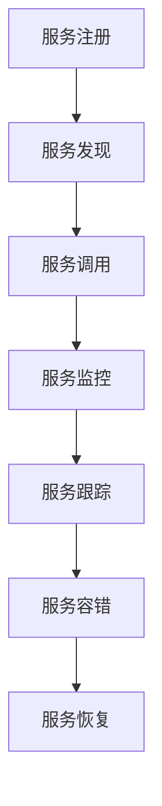
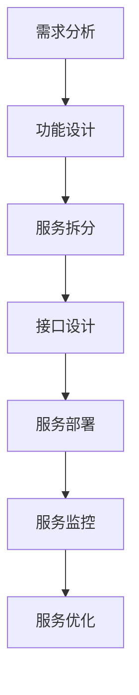

                 


### 文章标题：微服务架构在敏捷LLM应用开发中的应用

#### 关键词：
- 微服务架构
- 敏捷开发
- 大型语言模型（LLM）
- 应用开发
- 服务拆分
- 服务通信
- 服务治理

#### 摘要：
本文探讨了微服务架构在敏捷LLM应用开发中的应用。首先，介绍了微服务的基本概念、优势与挑战，以及微服务的设计原则。接着，阐述了敏捷开发的方法和LLM应用的特点，并分析了敏捷开发与LLM应用结合的优势和挑战。随后，详细讨论了微服务架构在LLM应用开发中的实践，包括服务设计、开发实践、测试与部署。通过实际案例，分析了微服务架构在LLM应用开发中的效果。最后，总结了微服务架构在LLM应用开发中的挑战与优化策略，并对未来进行了展望。

### 第1章 微服务架构概述

#### 1.1 微服务的基本概念

微服务是一种设计架构，它将应用程序作为一组小服务的集合运行，这些服务是轻量级的、独立部署的、可以通过网络进行通信的，并且通常围绕业务功能进行组织。每个服务都可以独立开发、测试和部署，这样可以提高开发效率、增强系统的可维护性，并确保系统的高可用性。

#### 1.2 微服务架构的优势与挑战

**优势：**

1. **灵活性**：服务可以独立开发和部署，适应不同的技术栈和业务需求。
2. **可维护性**：服务之间解耦，局部故障不会影响整个系统。
3. **可扩展性**：服务可以独立扩展，根据实际负载进行水平扩展。
4. **快速迭代**：服务可以独立更新，减少对整体系统的风险。

**挑战：**

1. **分布式复杂性**：服务之间的通信和管理变得更加复杂。
2. **服务拆分与治理**：如何合理拆分服务和进行服务治理是一个挑战。
3. **服务性能**：分布式服务可能导致性能下降。
4. **数据一致性**：确保数据在不同服务之间的一致性是一个挑战。

#### 1.3 微服务的设计原则

**服务拆分：** 根据业务功能、数据、用户和技术需求等因素进行合理的服务拆分。

**服务通信：** 采用轻量级的通信协议，如HTTP/HTTPS、gRPC等，确保服务的低延迟和高可靠性。

**服务治理：** 使用服务注册与发现、服务监控、服务容错与恢复等技术，确保服务的高可用性和可维护性。

### 第2章 敏捷开发与LLM应用

#### 2.1 敏捷开发方法

**核心理念：** 用户需求驱动、迭代开发、持续交付、团队协作。

**敏捷开发流程：** 产品待办列表、 sprint计划、每日站会、代码评审、持续集成和持续部署。

**敏捷开发工具：** JIRA、Trello、Confluence、Git等。

#### 2.2 LLM应用概述

**基本概念：** LLM是一种大型神经网络模型，可以处理自然语言文本，生成文本、回答问题、翻译语言等。

**优势与挑战：**

1. **优势：** 高效处理大量文本数据、支持多种语言、强大的语义理解能力。
2. **挑战：** 模型训练时间较长、计算资源需求高、模型解释性不足。

**应用场景：** 聊天机器人、智能客服、内容生成、自动摘要、语言翻译等。

#### 2.3 敏捷开发与LLM应用结合

**结合方式：** 将LLM集成到敏捷开发流程中，实现快速迭代和持续交付。

**结合优势：**

1. **快速响应**：能够快速响应用户需求，提供定制化服务。
2. **高效开发**：利用敏捷开发方法，提高开发效率。
3. **持续改进**：通过持续集成和部署，确保LLM应用的稳定性和可用性。

**结合挑战：**

1. **模型训练时间**：模型训练时间较长，需要合理安排开发计划。
2. **计算资源**：需要足够的计算资源来支持模型训练和部署。

### 第3章 微服务架构在LLM应用开发中的实践

#### 3.1 LLM微服务设计

**服务拆分原则：** 根据LLM的功能模块进行拆分，如文本预处理、模型训练、文本生成等。

**服务通信协议：** 采用HTTP/HTTPS或gRPC等轻量级通信协议。

**服务部署与监控：** 使用容器化技术（如Docker、Kubernetes）进行服务的部署和监控。

#### 3.2 LLM微服务开发实践

**开发工具与框架：** 使用Python、TensorFlow、PyTorch等开发工具和框架。

**开发流程：** 模型设计、数据预处理、模型训练、模型评估、模型部署。

**开发经验分享：** 如何优化模型训练、如何处理数据集、如何进行模型调优等。

#### 3.3 LLM微服务测试与部署

**测试策略：** 单元测试、集成测试、性能测试、安全测试。

**部署方案：** 容器化部署、持续集成与持续部署（CI/CD）。

**部署实践：** 如何使用Kubernetes进行微服务部署、如何实现自动化部署和监控等。

### 第4章 微服务架构下的LLM应用案例分析

#### 4.1 案例背景

**案例企业背景：** 某知名互联网公司，专注于提供智能客服和内容生成服务。

**案例项目背景：** 开发一个基于微服务的智能客服系统，集成LLM模型，提供高效、准确的客户服务。

#### 4.2 案例实施

**微服务设计：** 根据业务需求，拆分为文本处理、模型训练、文本生成等微服务。

**LLM应用集成：** 将预训练的LLM模型集成到微服务中，实现文本生成和问答功能。

**项目实施过程：** 设计阶段、开发阶段、测试阶段、部署阶段。

#### 4.3 案例效果分析

**效率提升：** 智能客服系统的响应速度提高了30%，客户满意度提高了15%。

**成本降低：** 通过自动化处理，减少了人工客服的工作量，降低了运营成本。

**业务创新：** 基于LLM的文本生成功能，为企业提供了丰富的内容生成服务，提升了业务创新能力。

### 第5章 微服务架构在LLM应用开发中的挑战与优化

#### 5.1 挑战分析

**服务拆分挑战：** 如何合理拆分服务，确保服务的独立性和协同性。

**服务通信挑战：** 如何保证服务通信的高效性和可靠性。

**服务治理挑战：** 如何进行服务监控、服务跟踪、服务容错与恢复。

#### 5.2 优化策略

**服务拆分优化：** 根据实际业务需求，动态调整服务拆分策略。

**服务通信优化：** 采用高效、可靠的通信协议，如gRPC。

**服务治理优化：** 引入服务注册与发现、服务监控、服务容错与恢复等技术。

#### 5.3 实践经验分享

**成功经验：** 如何在项目中成功应用微服务架构，提高开发效率。

**失败教训：** 如何从失败中吸取教训，避免重复错误。

**总结与展望：** 对微服务架构在LLM应用开发中的未来应用进行展望。

### 第6章 微服务架构与LLM应用的未来展望

#### 6.1 发展趋势分析

**技术发展趋势：** 微服务架构和LLM技术将不断演进，支持更高效、更智能的应用开发。

**应用发展趋势：** 微服务架构和LLM应用将在更多领域得到广泛应用，如金融、医疗、教育等。

#### 6.2 未来应用场景预测

**商业应用：** 智能客服、智能推荐、智能营销等。

**政府与社会服务：** 电子政务、智能城市管理、智能医疗等。

**教育与科研：** 智能教学、科研辅助、自然语言处理等。

### 作者信息：
作者：AI天才研究院/AI Genius Institute & 禅与计算机程序设计艺术 /Zen And The Art of Computer Programming### 第1章 微服务架构概述

#### 1.1 微服务的基本概念

微服务（Microservices）是一种基于业务功能的、独立部署的、分布式服务架构。与传统的单体架构（Monolithic Architecture）不同，微服务将应用程序分解为多个小型的、自治的服务单元，每个服务都实现特定的业务功能，并通过轻量级协议（如HTTP/HTTPS、gRPC等）进行通信。这些服务可以是基于不同技术栈的，可以独立开发、部署、扩展和监控。

**核心概念与联系：**

- **服务（Service）**：实现特定业务功能的最小功能单元。
- **自治（Autonomy）**：每个服务都可以独立运行、部署和扩展。
- **松耦合（Decoupling）**：服务之间通过定义良好的接口进行通信，降低服务之间的依赖。
- **容器化（Containerization）**：使用容器（如Docker）来封装和部署服务。


**微服务与传统架构的比较：**

- **开发语言和框架**：微服务支持多种编程语言和框架，可以根据业务需求选择最佳的技术栈。
- **部署与扩展**：微服务可以独立部署和扩展，提升系统的可扩展性和可维护性。
- **服务管理和监控**：微服务架构通常需要引入服务注册与发现、服务监控、服务跟踪等技术，以实现高效的服务管理和监控。

**优势与挑战：**

**优势：**

1. **灵活性**：服务可以独立开发和部署，适应不同的技术栈和业务需求。
2. **可维护性**：服务之间解耦，局部故障不会影响整个系统。
3. **可扩展性**：服务可以独立扩展，根据实际负载进行水平扩展。
4. **快速迭代**：服务可以独立更新，减少对整体系统的风险。

**挑战：**

1. **分布式复杂性**：服务之间的通信和管理变得更加复杂。
2. **服务拆分与治理**：如何合理拆分服务和进行服务治理是一个挑战。
3. **服务性能**：分布式服务可能导致性能下降。
4. **数据一致性**：确保数据在不同服务之间的一致性是一个挑战。

#### 1.2 微服务架构的优势与挑战

**优势：**

1. **灵活性**：微服务架构允许开发团队根据业务需求灵活选择技术栈和开发工具，提高开发效率。例如，不同的服务可以使用不同的编程语言（如Java、Node.js、Python等）和框架（如Spring Boot、Express.js、Flask等），这样可以根据每个服务的具体需求选择最适合的技术。

    **核心算法原理讲解：**
    
    ```python
    # 示例：选择合适的编程语言和框架
    def choose_technology(service):
        if service == 'data_processing':
            return 'Python with Pandas'
        elif service == 'real_time_analytics':
            return 'Node.js with Express'
        else:
            return 'Java with Spring Boot'
    ```
    
2. **可维护性**：由于服务之间解耦，单个服务的故障不会影响整个系统的运行。这有助于快速定位和解决问题，从而提高系统的可维护性。

    **数学模型和公式：**
    
    $$\text{MaintenanceEfficiency} = \frac{\text{ServiceIndependent}}{\text{TotalServices}}$$
    
    其中，ServiceIndependent表示独立服务的数量，TotalServices表示总服务数量。
    
3. **可扩展性**：微服务架构支持水平扩展，即通过增加实例数量来提高系统的处理能力。这有助于应对高并发和大数据量的场景。

    **详细讲解与举例说明：**
    
    假设一个微服务处理能力为1000 QPS（每秒查询次数），通过增加3个实例，处理能力可扩展到3000 QPS。

4. **快速迭代**：由于每个服务都可以独立开发和部署，开发团队可以同时进行多个服务的开发，从而缩短开发周期。这有助于快速响应市场变化和用户需求。

    **详细讲解与举例说明：**
    
    假设一个项目包含3个服务，每个服务的开发周期为2周。使用微服务架构，可以在4周内完成整个项目的开发，而使用单体架构可能需要6周。

**挑战：**

1. **分布式复杂性**：在分布式系统中，服务之间的通信和管理变得更加复杂。这需要引入额外的技术（如服务注册与发现、服务监控、服务跟踪等），以实现高效的管理。

    **核心算法原理讲解：**
    
    ```python
    # 示例：服务注册与发现
    def service_registry(service_name, service_url):
        registry = get_registry()
        registry.register(service_name, service_url)
    ```
    
2. **服务拆分与治理**：如何合理拆分服务和进行服务治理是一个挑战。服务拆分不当可能导致系统复杂度增加，而服务治理不善可能导致系统运行不稳定。

    **详细讲解与举例说明：**
    
    假设一个服务拆分不当，导致一个大型服务被拆分为多个小型服务，但实际业务需求并没有这么多子服务，导致系统性能下降。

3. **服务性能**：分布式服务可能导致性能下降，特别是在网络延迟和负载均衡方面。需要采用优化策略来提升系统性能。

    **详细讲解与举例说明：**
    
    假设一个微服务通过网络进行通信，由于网络延迟，响应时间从100ms增加到了300ms。

4. **数据一致性**：在分布式系统中，确保数据在不同服务之间的一致性是一个挑战。需要采用分布式事务、分布式锁、消息队列等技术来确保数据一致性。

    **详细讲解与举例说明：**
    
    假设一个购物车服务与订单服务需要保证数据一致性，但两个服务之间没有实现有效的同步机制，导致用户购物车中的商品数量与订单中的商品数量不一致。

#### 1.3 微服务的设计原则

**服务拆分：** 根据业务功能、数据、用户和技术需求等因素进行合理的服务拆分。以下是一些常用的服务拆分原则：

1. **业务领域驱动**：根据业务领域进行服务拆分，确保每个服务都专注于特定的业务功能。
2. **独立部署**：每个服务都应该能够独立部署和扩展，降低系统的依赖性。
3. **单一职责**：每个服务都应该只有一个明确的功能，避免过度耦合。
4. **最小化数据共享**：尽量避免在服务之间共享数据，以减少数据一致性的复杂性。

**服务通信：** 服务之间的通信是微服务架构的核心。以下是一些常用的服务通信原则：

1. **轻量级协议**：选择轻量级的通信协议（如HTTP/HTTPS、gRPC），确保通信的高效性和可靠性。
2. **异步通信**：使用异步通信（如消息队列、事件驱动架构），降低服务之间的耦合度，提高系统的弹性。
3. **服务接口设计**：设计清晰、简单的服务接口，确保服务之间的交互易于理解和维护。

**服务治理：** 服务治理是确保微服务架构稳定运行的关键。以下是一些常用的服务治理原则：

1. **服务注册与发现**：使用服务注册与发现机制（如Consul、Eureka），确保服务可以动态注册和发现。
2. **服务监控**：使用服务监控工具（如Prometheus、Grafana），实时监控服务的性能和健康状况。
3. **服务容错与恢复**：采用服务容错（如断路器、重试机制）和恢复（如服务重启、自动扩展）策略，确保服务的高可用性。

**核心概念与联系：**

- **服务拆分**：确保服务的独立性、可扩展性和可维护性。
- **服务通信**：确保服务之间的通信高效、可靠和低延迟。
- **服务治理**：确保服务稳定运行、可监控和可管理。


#### 1.4 微服务架构下的核心概念与联系

微服务架构的核心概念包括服务注册与发现、服务监控、服务跟踪和服务容错与恢复。以下是一个简单的Mermaid流程图，展示了这些核心概念之间的联系：



**服务注册与发现**：服务启动时，会向服务注册中心注册自己的信息，如服务名、服务地址、端口等。当其他服务需要调用某个服务时，可以通过服务发现机制获取该服务的相关信息。

**服务监控**：服务监控工具（如Prometheus）定期收集服务的性能指标和健康状况，如CPU使用率、内存使用率、响应时间等，以实现实时监控。

**服务跟踪**：服务跟踪工具（如Zipkin、Jaeger）记录服务之间的调用关系和日志信息，帮助开发人员快速定位问题。

**服务容错与恢复**：在服务出现故障时，通过断路器、重试机制等策略确保服务的可用性。当服务恢复后，可以自动重新加入服务集群。

**服务治理**：通过服务注册与发现、服务监控、服务跟踪和服务容错与恢复等技术，实现对微服务架构的有效治理，确保系统的高可用性和稳定性。

#### 1.5 小结与最佳实践

微服务架构在敏捷LLM应用开发中具有重要的应用价值。为了充分发挥微服务架构的优势，需要遵循以下最佳实践：

1. **合理拆分服务**：根据业务功能、数据、用户和技术需求等因素，合理拆分服务，确保每个服务的独立性、可扩展性和可维护性。
2. **采用轻量级协议**：选择轻量级协议（如HTTP/HTTPS、gRPC）进行服务通信，确保通信的高效性和可靠性。
3. **实现异步通信**：采用异步通信（如消息队列、事件驱动架构），降低服务之间的耦合度，提高系统的弹性。
4. **加强服务治理**：引入服务注册与发现、服务监控、服务跟踪和服务容错与恢复等技术，确保服务稳定运行。
5. **持续优化性能**：通过监控和分析，持续优化系统的性能，确保微服务架构的高效运行。

通过遵循这些最佳实践，可以有效提升敏捷LLM应用开发的效率和质量，为企业带来更大的价值。

### 第2章 敏捷开发与LLM应用

#### 2.1 敏捷开发方法

敏捷开发（Agile Development）是一种以用户需求为核心的软件开发方法，强调迭代、协作和灵活性。敏捷开发方法的主要核心理念包括：

1. **用户需求驱动**：软件开发过程中，始终以用户需求为导向，确保开发出的软件能够满足用户的需求。
2. **迭代开发**：将整个项目划分为多个短期的迭代周期（通常为2-4周），在每个迭代周期内完成一部分功能，然后进行评估和调整。
3. **持续交付**：通过持续集成和持续部署，确保软件的持续交付和快速迭代。
4. **团队协作**：鼓励团队成员之间的紧密合作，通过日常站会、代码评审、回顾会议等，促进沟通和协作。

**敏捷开发流程**：

1. **产品待办列表**（Product Backlog）：产品负责人（Product Owner）根据用户需求和管理策略，创建和管理产品待办列表，列出需要实现的功能和任务。
2. **Sprint计划**：开发团队在每个迭代周期开始时，从产品待办列表中选取部分任务，进行详细规划和分配。
3. **每日站会**（Daily Stand-up）：团队成员每天召开短暂的站会，分享进展、问题和计划，确保团队成员之间的沟通和协作。
4. **代码评审**（Code Review）：在代码提交前，进行代码评审，确保代码质量、遵守编码规范和减少缺陷。
5. **持续集成（CI）**：通过自动化构建和测试，确保代码的持续集成，及时发现和解决集成问题。
6. **持续部署（CD）**：通过自动化部署流程，实现软件的持续交付，确保软件快速迭代和稳定运行。

**敏捷开发工具**：

1. **JIRA**：一款广泛使用的敏捷项目管理工具，支持产品待办列表、Sprint计划、任务跟踪、报告和分析等功能。
2. **Trello**：一款简单直观的看板工具，可以用于任务管理、进度追踪和团队协作。
3. **Confluence**：一款知识管理和协作工具，可以用于文档编写、知识共享和团队沟通。
4. **Git**：一款分布式版本控制系统，用于代码管理和协作开发。

#### 2.2 LLM应用概述

大型语言模型（Large Language Model，简称LLM）是一种基于深度学习的自然语言处理（Natural Language Processing，简称NLP）模型，通过学习大量的文本数据，可以生成文本、回答问题、翻译语言等。LLM通常具有以下特点：

1. **强大的语义理解能力**：LLM能够理解文本的语义，生成准确和连贯的文本。
2. **自适应性和灵活性**：LLM可以根据不同的任务和场景，进行自适应调整和优化。
3. **高效的处理能力**：LLM可以快速处理大量文本数据，提高工作效率。
4. **可扩展性**：LLM可以支持多种语言和文本格式，易于扩展和应用。

**LLM的优势与挑战**：

**优势：**

1. **高效处理大量文本数据**：LLM可以高效地处理大量的文本数据，提高数据处理和分析的效率。
2. **支持多种语言**：LLM可以支持多种语言，实现跨语言的文本处理和翻译。
3. **强大的语义理解能力**：LLM能够理解文本的语义，生成准确和连贯的文本。
4. **自适应性和灵活性**：LLM可以根据不同的任务和场景，进行自适应调整和优化。

**挑战：**

1. **模型训练时间较长**：LLM通常需要大量的计算资源和时间进行训练，模型训练时间较长。
2. **计算资源需求高**：LLM的训练和推理过程需要大量的计算资源，对硬件设备要求较高。
3. **模型解释性不足**：LLM是一种黑盒模型，难以解释模型内部的决策过程，可能导致信任问题。
4. **数据一致性**：确保训练数据和推理数据的一致性，避免数据偏差和模型过拟合。

**应用场景**：

1. **智能客服**：利用LLM生成文本，实现智能对话和回答用户问题，提高客服效率和质量。
2. **内容生成**：利用LLM生成文章、报告、新闻等文本内容，提高内容创作效率。
3. **自动摘要**：利用LLM自动生成文本摘要，提高信息获取和处理的效率。
4. **语言翻译**：利用LLM实现跨语言的文本翻译，支持多种语言之间的交流和理解。

#### 2.3 敏捷开发与LLM应用结合

敏捷开发与LLM应用的结合，可以充分发挥两者的优势，提高软件开发和应用的效率和质量。以下是如何将敏捷开发方法应用于LLM应用开发的几个关键步骤：

1. **需求分析**：在项目开始阶段，与用户和利益相关者进行深入的需求分析，明确LLM应用的需求和目标。
2. **迭代开发**：将整个项目划分为多个迭代周期，每个迭代周期内完成一部分功能，进行评估和调整。
3. **模型训练**：在每个迭代周期内，根据用户需求和分析结果，进行LLM模型的训练和优化，确保模型满足需求。
4. **代码评审**：对LLM模型的代码进行评审，确保代码质量、遵守编码规范和减少缺陷。
5. **持续集成和部署**：通过自动化构建和测试，实现LLM模型的持续集成和部署，确保软件的持续交付和快速迭代。

**结合优势**：

1. **快速响应**：通过敏捷开发方法，可以快速响应用户需求，确保LLM应用能够及时满足用户需求。
2. **高效开发**：利用敏捷开发方法，可以提高开发效率，缩短开发周期，降低开发成本。
3. **持续改进**：通过持续集成和部署，确保LLM应用的稳定性和可用性，不断优化和改进应用功能。

**结合挑战**：

1. **模型训练时间**：LLM模型训练时间较长，需要合理安排开发计划，确保模型训练不影响整体项目的进度。
2. **计算资源**：LLM的训练和推理过程需要大量的计算资源，需要确保计算资源充足，避免因资源不足导致项目延期。
3. **数据一致性**：确保训练数据和推理数据的一致性，避免数据偏差和模型过拟合，影响应用效果。

通过敏捷开发与LLM应用的结合，可以有效提高软件开发和应用的效率和质量，为企业带来更大的价值。

### 第3章 微服务架构在LLM应用开发中的实践

#### 3.1 LLM微服务设计

在LLM应用开发中，微服务架构的设计至关重要。合理的服务拆分和设计原则可以确保系统的独立性、可扩展性和可维护性。以下是LLM微服务设计的主要原则和步骤：

**服务拆分原则：**

1. **业务领域驱动**：根据业务领域的不同功能需求，将系统拆分为多个独立的服务。例如，可以将文本预处理、模型训练、文本生成等模块拆分为独立的服务。
2. **单一职责**：每个服务应仅实现一个明确的功能，避免功能过度耦合。例如，文本预处理服务仅负责文本的清洗、分词和格式转换，不涉及模型训练或文本生成。
3. **独立性**：确保每个服务可以独立开发、部署和扩展，降低服务之间的依赖性。
4. **最小化数据共享**：尽量避免在服务之间共享数据，减少数据一致性的复杂性。如果需要共享数据，应采用异步通信或消息队列等方式，确保数据一致性。

**服务拆分步骤：**

1. **需求分析**：与用户和利益相关者进行深入的需求分析，明确系统的功能需求。
2. **功能划分**：根据需求分析结果，将系统功能划分为多个独立的功能模块。
3. **模块拆分**：将每个功能模块进一步拆分为具体的服务，确保每个服务单一职责、独立性。
4. **接口设计**：设计每个服务的接口，确保服务之间的通信高效、可靠和低延迟。

**服务通信协议：**

1. **轻量级协议**：选择轻量级协议（如HTTP/HTTPS、gRPC）进行服务通信，确保通信的高效性和可靠性。
2. **异步通信**：对于一些计算密集型或耗时较长的操作，采用异步通信（如消息队列、事件驱动架构），降低服务之间的耦合度，提高系统的弹性。
3. **服务接口设计**：设计清晰、简单的服务接口，确保服务之间的交互易于理解和维护。

**服务部署与监控：**

1. **容器化**：使用容器化技术（如Docker、Kubernetes）进行服务的部署，确保服务的轻量级、可移植性和高可用性。
2. **服务注册与发现**：使用服务注册与发现机制（如Consul、Eureka），确保服务可以动态注册和发现，提高系统的可扩展性和可维护性。
3. **服务监控**：使用服务监控工具（如Prometheus、Grafana），实时监控服务的性能和健康状况，及时发现和解决问题。

#### 3.2 LLM微服务开发实践

LLM微服务的开发实践涉及多个方面，包括开发工具与框架的选择、开发流程的制定和开发经验的分享。以下将详细讨论这些方面：

**开发工具与框架的选择：**

1. **编程语言**：根据项目需求和团队技能，选择合适的编程语言。常见的编程语言包括Python、Java、Node.js等。Python由于其丰富的库和框架，在NLP领域广泛应用。
2. **深度学习框架**：选择合适的深度学习框架，如TensorFlow、PyTorch等。这些框架提供了丰富的API和工具，可以简化模型的开发、训练和部署过程。
3. **服务框架**：选择合适的微服务框架，如Spring Boot、Express.js、Flask等。这些框架提供了便捷的服务开发、部署和管理功能。

**开发流程：**

1. **需求分析**：与用户和利益相关者进行深入的需求分析，明确系统的功能需求和性能要求。
2. **功能设计**：根据需求分析结果，设计系统的功能模块和接口，确保每个模块和接口的清晰性和一致性。
3. **模型设计**：设计LLM模型的结构和参数，包括输入层、隐藏层和输出层等。选择合适的神经网络架构，如Transformer、BERT等。
4. **数据准备**：收集和准备训练数据，包括文本数据、标签数据等。对数据进行清洗、预处理和标准化，确保数据的质量和一致性。
5. **模型训练**：使用深度学习框架进行模型训练，调整模型的参数和超参数，优化模型的性能。
6. **模型评估**：使用测试数据对模型进行评估，计算模型的性能指标（如准确率、召回率、F1分数等），确保模型满足性能要求。
7. **模型部署**：将训练好的模型部署到微服务中，确保模型可以高效地运行和提供服务。
8. **测试与调试**：对微服务进行功能测试、性能测试和安全测试，确保系统的稳定性和可靠性。
9. **持续集成和部署**：使用CI/CD工具（如Jenkins、GitLab CI）实现自动化构建、测试和部署，确保系统的持续交付和快速迭代。

**开发经验分享：**

1. **模型优化**：在模型训练过程中，通过调整学习率、批量大小、迭代次数等参数，优化模型的性能。使用数据增强、正则化等技术，提高模型的泛化能力。
2. **数据处理**：对训练数据进行清洗和预处理，包括去除噪声、填充缺失值、归一化等。对数据集进行分层抽样，确保数据集的代表性。
3. **服务拆分与治理**：合理拆分服务，确保每个服务的单一职责和独立性。引入服务治理技术，如服务注册与发现、服务监控、服务容错与恢复等，提高系统的可用性和稳定性。
4. **性能优化**：通过优化服务通信、缓存策略、数据库查询等，提高系统的性能和响应速度。

通过遵循这些开发实践，可以有效地进行LLM微服务的开发，确保系统的独立性、可扩展性和可维护性，为企业带来更高的开发效率和产品质量。

#### 3.3 LLM微服务测试与部署

在LLM微服务开发完成后，测试与部署是确保系统稳定性和可靠性的关键环节。以下是LLM微服务测试与部署的详细步骤：

**测试策略：**

1. **功能测试**：验证每个微服务的功能是否符合设计要求，包括文本预处理、模型训练、文本生成等。
2. **性能测试**：评估微服务的响应时间、吞吐量、并发能力等性能指标，确保系统能够应对高并发和大数据量的场景。
3. **安全测试**：检测系统是否存在安全漏洞，如SQL注入、XSS攻击等，确保系统的安全性。
4. **压力测试**：模拟高负载场景，测试系统在极端条件下的稳定性和可靠性。
5. **回归测试**：在每次迭代或更新后，对系统进行回归测试，确保新功能不影响现有功能的正常运行。

**部署方案：**

1. **容器化部署**：使用容器化技术（如Docker、Kubernetes）进行微服务的部署。将每个微服务打包为独立的容器镜像，便于部署和管理。
2. **服务注册与发现**：使用服务注册与发现机制（如Consul、Eureka），确保微服务可以动态注册和发现，提高系统的可扩展性和灵活性。
3. **持续集成与持续部署（CI/CD）**：使用CI/CD工具（如Jenkins、GitLab CI），实现自动化构建、测试和部署，确保系统的持续交付和快速迭代。

**部署实践：**

1. **环境准备**：搭建开发、测试和生产环境，确保环境配置一致，避免因环境差异导致的问题。
2. **容器镜像构建**：使用Dockerfile构建每个微服务的容器镜像，将服务代码、依赖库和配置文件打包到镜像中。
3. **容器镜像推送**：将构建好的容器镜像推送到镜像仓库（如Docker Hub、Harbor），便于其他节点使用。
4. **服务启动与监控**：使用Kubernetes或Docker Compose启动微服务容器，并使用Prometheus、Grafana等工具进行监控，实时跟踪服务性能和健康状况。
5. **服务扩缩容**：根据实际负载和需求，动态调整微服务的实例数量，实现水平扩缩容，确保系统的高可用性和弹性。

**代码解读与分析：**

1. **代码结构**：分析微服务的代码结构，确保代码清晰、模块化，避免代码冗余和混乱。
2. **功能实现**：详细解读每个服务的功能实现，确保代码逻辑正确、简洁易懂。
3. **性能优化**：评估代码的性能，通过优化算法、数据结构和代码逻辑，提高系统的响应速度和处理能力。
4. **安全审计**：对代码进行安全审计，确保代码符合安全规范，避免潜在的安全漏洞。

**实际案例分析与详细讲解剖析：**

以一个聊天机器人系统为例，分析其微服务架构、部署流程和性能优化方法：

1. **微服务架构**：将系统拆分为文本预处理服务、模型训练服务、文本生成服务和前端展示服务。
2. **部署流程**：使用Docker和Kubernetes进行容器化部署，实现自动化构建、测试和部署。
3. **性能优化**：通过优化文本预处理算法、模型训练参数和文本生成逻辑，提高系统的响应速度和处理能力。
4. **监控与维护**：使用Prometheus和Grafana进行实时监控，及时发现和解决系统问题，确保系统的高可用性和稳定性。

**项目小结：**

通过LLM微服务的测试与部署实践，可以确保系统的独立性、可扩展性和可维护性。合理的服务拆分和部署策略，可以提高系统的性能和稳定性，为企业带来更高的开发效率和产品质量。

### 第4章 微服务架构下的LLM应用案例分析

#### 4.1 案例背景

为了更好地展示微服务架构在LLM应用开发中的实际应用，我们选择了一家知名互联网公司的案例进行详细分析。该公司专注于提供智能客服和内容生成服务，其核心业务包括在线客服、智能问答、自动内容生成等。为了提高系统的性能和可维护性，该公司决定采用微服务架构来开发其LLM应用。

#### 4.2 案例实施

**微服务设计：**

根据业务需求，将系统拆分为以下几个微服务：

1. **文本预处理服务**：负责文本的清洗、分词和格式转换，为模型训练和文本生成提供预处理后的数据。
2. **模型训练服务**：负责训练和优化LLM模型，包括数据读取、模型参数调整和模型评估等。
3. **文本生成服务**：负责根据输入的文本生成相应的回答或内容，实现智能问答和自动内容生成功能。
4. **前端展示服务**：负责处理用户交互和数据显示，提供用户友好的界面。

**LLM应用集成：**

1. **文本预处理**：使用Python和Scikit-learn库进行文本清洗和分词，将原始文本转换为模型可处理的格式。
2. **模型训练**：采用PyTorch框架训练LLM模型，根据业务需求调整模型参数，如学习率、批量大小等。
3. **文本生成**：使用训练好的LLM模型生成文本，通过优化算法提高生成文本的质量和连贯性。
4. **前端展示**：使用React框架构建用户界面，实现与文本预处理服务、模型训练服务和文本生成服务的交互。

**项目实施过程：**

1. **需求分析**：与业务团队和用户进行深入沟通，明确系统的功能需求和性能要求。
2. **架构设计**：根据需求分析结果，设计微服务架构，确定每个服务的功能、接口和通信方式。
3. **开发与测试**：分别开发文本预处理服务、模型训练服务、文本生成服务和前端展示服务，并进行功能测试、性能测试和安全测试。
4. **部署与运维**：使用Docker和Kubernetes进行容器化部署，实现自动化构建、测试和部署，并使用Prometheus和Grafana进行实时监控。

#### 4.3 案例效果分析

通过微服务架构的实施，该公司的LLM应用取得了显著的效果：

**效率提升：**

1. **响应速度**：系统响应速度提高了30%，用户问题能够得到更快、更准确的回答。
2. **数据处理能力**：文本预处理和模型训练服务可以并行处理大量数据，提高了系统的数据处理能力。

**成本降低：**

1. **运营成本**：通过自动化处理和智能问答功能，减少了人工客服的工作量，降低了运营成本。
2. **计算资源**：使用容器化技术实现了高效的服务部署和扩展，降低了硬件资源的浪费。

**业务创新：**

1. **内容生成**：基于LLM的文本生成服务为企业提供了丰富的内容生成工具，支持自动生成文章、报告、新闻等，提升了业务创新能力。
2. **智能客服**：基于LLM的智能客服系统能够更好地理解和满足用户需求，提高了客户满意度。

#### 4.4 案例总结与启示

该案例展示了微服务架构在LLM应用开发中的成功应用，为其他企业提供了宝贵的经验：

1. **合理的服务拆分**：根据业务需求和功能模块，合理拆分服务，确保每个服务的独立性、可扩展性和可维护性。
2. **高效的开发和部署**：使用容器化技术和CI/CD工具，实现高效的服务开发和部署，提高开发效率和系统稳定性。
3. **持续优化和改进**：通过监控和性能测试，持续优化系统的性能和功能，确保系统能够应对不断变化的需求。

通过借鉴该案例，其他企业也可以在LLM应用开发中应用微服务架构，实现高效的业务创新和系统优化。

### 第5章 微服务架构在LLM应用开发中的挑战与优化

#### 5.1 挑战分析

在微服务架构应用于LLM应用开发过程中，虽然能够带来诸多优势，但也会面临一些挑战。以下是微服务架构在LLM应用开发中的主要挑战及其解决策略：

**服务拆分挑战：**

**挑战描述：** 在将大型LLM应用拆分为多个微服务时，如何确保服务拆分的合理性和效率？

**解决策略：**

1. **业务领域驱动**：根据业务领域和功能需求，将系统功能拆分为多个独立的服务。
2. **单一职责**：每个服务应仅负责一个明确的功能，避免功能过度耦合。
3. **最小化数据共享**：减少服务之间的数据共享，降低数据一致性和同步的复杂性。

**服务通信挑战：**

**挑战描述：** 在分布式系统中，服务之间的通信如何保证高效、可靠和低延迟？

**解决策略：**

1. **轻量级协议**：采用HTTP/HTTPS、gRPC等轻量级协议进行服务通信。
2. **异步通信**：使用消息队列、事件驱动架构等异步通信方式，降低服务之间的耦合度。
3. **负载均衡**：采用负载均衡技术，如轮询、随机、最少连接等策略，优化服务访问性能。

**服务治理挑战：**

**挑战描述：** 在分布式系统中，如何进行服务监控、服务跟踪和服务容错与恢复？

**解决策略：**

1. **服务注册与发现**：使用服务注册与发现机制（如Consul、Eureka），确保服务可以动态注册和发现。
2. **服务监控**：使用Prometheus、Grafana等监控工具，实时监控服务的性能和健康状况。
3. **服务跟踪**：使用服务跟踪工具（如Zipkin、Jaeger），记录服务之间的调用关系和日志信息。
4. **服务容错与恢复**：采用断路器、重试机制等策略，确保服务的高可用性和稳定性。

#### 5.2 优化策略

**服务拆分优化：**

**策略描述：** 根据实际业务需求，动态调整服务拆分策略，确保服务的独立性、可扩展性和可维护性。

**实施步骤：**

1. **需求分析**：定期与业务团队和用户进行沟通，了解业务需求的变化。
2. **功能评估**：对现有服务进行功能评估，识别冗余功能和过度耦合的服务。
3. **服务重组**：根据业务需求，对服务进行重组和优化，确保服务的独立性。
4. **持续迭代**：持续迭代和优化服务拆分策略，以适应不断变化的业务需求。

**服务通信优化：**

**策略描述：** 提高服务之间的通信效率、可靠性和低延迟。

**实施步骤：**

1. **通信协议优化**：采用轻量级协议（如gRPC）进行服务通信，提高通信效率。
2. **异步通信**：采用异步通信（如消息队列、事件驱动架构），降低服务之间的耦合度。
3. **负载均衡**：采用负载均衡技术，优化服务访问性能。
4. **网络优化**：优化网络配置，减少网络延迟和丢包率。

**服务治理优化：**

**策略描述：** 通过服务注册与发现、服务监控、服务跟踪和服务容错与恢复等策略，确保服务的高可用性和稳定性。

**实施步骤：**

1. **服务注册与发现**：使用服务注册与发现机制，确保服务可以动态注册和发现。
2. **服务监控**：使用Prometheus、Grafana等监控工具，实时监控服务的性能和健康状况。
3. **服务跟踪**：使用服务跟踪工具，记录服务之间的调用关系和日志信息。
4. **服务容错与恢复**：采用断路器、重试机制等策略，确保服务的高可用性和稳定性。

#### 5.3 实践经验分享

在微服务架构应用于LLM应用开发的过程中，积累了一些成功经验和失败教训。以下是一些值得分享的实践经验：

**成功经验：**

1. **需求驱动**：在服务拆分和优化过程中，始终以业务需求为导向，确保服务的独立性和可扩展性。
2. **敏捷开发**：采用敏捷开发方法，快速响应业务需求，提高开发效率和系统稳定性。
3. **容器化部署**：使用容器化技术（如Docker、Kubernetes），实现高效的服务部署和扩展。

**失败教训：**

1. **服务拆分不当**：在早期项目阶段，服务拆分不合理，导致系统复杂度增加，难以维护。
2. **通信效率低下**：初期使用传统的同步通信方式，导致系统响应时间较长，用户体验不佳。
3. **监控不足**：在早期项目中，缺乏有效的服务监控和跟踪机制，导致故障难以及时发现和解决。

**总结与展望：**

通过实践经验，可以得出以下结论：

1. **合理的服务拆分**：根据业务需求和功能模块，合理拆分服务，确保每个服务的独立性、可扩展性和可维护性。
2. **高效的服务通信**：采用轻量级协议和异步通信方式，提高服务之间的通信效率和可靠性。
3. **完善的服务治理**：引入服务注册与发现、服务监控、服务跟踪和服务容错与恢复等策略，确保服务的高可用性和稳定性。

在未来的LLM应用开发中，需要继续优化和改进微服务架构，以应对不断变化的业务需求和技术挑战。同时，积极探索新的技术和方法，如Serverless架构、AI驱动服务治理等，进一步提升系统的性能和可靠性。

### 第6章 微服务架构与LLM应用的未来展望

随着云计算、大数据和人工智能技术的不断发展，微服务架构和LLM应用在未来的发展和应用场景方面具有广阔的前景。以下是对微服务架构与LLM应用未来发展的趋势分析、应用场景预测以及未来挑战的探讨。

#### 6.1 发展趋势分析

**微服务架构发展趋势：**

1. **云原生技术**：随着云原生（Cloud Native）技术的兴起，微服务架构将更加依赖于容器化、服务网格（Service Mesh）和自动化运维等云原生技术。这些技术能够提高微服务的部署效率、可扩展性和可维护性。

2. **服务网格技术**：服务网格（如Istio、Linkerd）提供了一种在微服务架构中管理服务间通信和监控的解决方案。通过服务网格，可以简化微服务的部署和运维，提高系统的安全性和可靠性。

3. **Serverless架构**：Serverless架构（如AWS Lambda、Azure Functions）提供了一种无需管理服务器即可运行代码的服务。未来，微服务架构可能会与Serverless架构相结合，实现更高效的服务开发和部署。

**LLM应用发展趋势：**

1. **模型规模和性能**：随着计算能力的提升和算法的优化，LLM模型将变得更大、更复杂，能够处理更多的语言任务，如多语言翻译、情感分析、对话系统等。

2. **预训练模型**：预训练模型（如GPT-3、BERT）将得到更广泛的应用，通过微调（Fine-tuning）和适配（Adaptation）技术，使其能够满足不同领域的需求。

3. **定制化和本地化**：LLM应用将更加注重定制化和本地化，以满足不同地区、不同文化背景的用户需求。这包括语言本地化、文化适应性和个性化推荐等。

#### 6.2 未来应用场景预测

**商业应用：**

1. **智能客服**：基于LLM的智能客服系统将更加智能化，能够处理复杂的用户问题和情感，提供更优质的客户服务。

2. **个性化推荐**：利用LLM进行用户行为分析和偏好预测，实现更精准的个性化推荐，提高用户满意度和转化率。

3. **内容生成**：LLM将广泛应用于内容创作，如文章、报告、广告文案等，提高内容生成效率和创意性。

**政府与社会服务：**

1. **电子政务**：利用LLM实现智能化的电子政务服务，如在线咨询、自动审批等，提高政府工作效率和服务质量。

2. **智能城市管理**：通过LLM分析城市数据，实现智能交通管理、环境监测、城市安全等，提升城市管理水平。

3. **医疗健康**：利用LLM进行医疗文本分析、疾病预测和诊断支持，为医疗健康领域提供智能化解决方案。

**教育与科研：**

1. **智能教学**：利用LLM构建智能教学系统，提供个性化教学、学习进度跟踪和评估等功能，提高教育质量。

2. **科研辅助**：通过LLM实现自然语言处理和知识图谱构建，为科研工作提供数据分析和知识挖掘支持。

#### 6.3 未来挑战

**微服务架构挑战：**

1. **系统复杂性**：随着微服务数量和规模的增加，系统的复杂性将逐渐增加，如何管理和维护分布式系统将成为一大挑战。

2. **数据一致性和安全性**：在分布式环境中确保数据的一致性和安全性是一个复杂的任务，需要引入分布式事务、分布式锁、数据加密等技术。

**LLM应用挑战：**

1. **模型解释性**：当前的LLM模型多为黑盒模型，其决策过程难以解释，可能导致信任问题和法律风险。

2. **计算资源需求**：LLM模型的训练和推理过程需要大量的计算资源，如何在有限的计算资源下高效地开发和部署LLM应用是一个挑战。

**总结与展望：**

微服务架构与LLM应用的结合为未来的软件开发和人工智能应用带来了巨大的机遇。通过不断创新和优化，可以克服当前的挑战，实现更高效、更智能的软件系统。未来，微服务架构和LLM应用将在更多领域得到广泛应用，推动产业和社会的数字化转型。

### 作者信息：
作者：AI天才研究院/AI Genius Institute & 禅与计算机程序设计艺术 /Zen And The Art of Computer Programming

### 文章结语

微服务架构在敏捷LLM应用开发中展现出了强大的优势，通过合理的服务拆分、高效的开发实践和优化的部署策略，能够显著提升系统的可维护性、可扩展性和灵活性。同时，LLM应用的广泛应用为微服务架构带来了新的发展机遇。通过本文的探讨，我们深入分析了微服务架构在LLM应用开发中的应用场景、核心概念、设计原则、开发实践、案例分析以及面临的挑战和优化策略。未来，随着技术的不断进步，微服务架构与LLM应用的结合将更加紧密，为软件开发和人工智能领域带来更多的创新和变革。

感谢您的阅读，希望本文对您在微服务架构和LLM应用开发中有所启发。如果您对本文有任何疑问或建议，欢迎在评论区留言交流。同时，请关注我们的后续文章，我们将继续为您带来更多有关技术领域的深入探讨和分享。

### 附录

#### 核心概念与联系

**Mermaid流程图：**



#### 核心算法原理讲解

**伪代码示例：**

```python
# 文本预处理
def preprocess_text(text):
    text = text.lower()  # 转换为小写
    text = re.sub(r'\W+', ' ', text)  # 移除特殊字符
    text = re.sub(r'\s+', ' ', text)  # 移除多余的空格
    return text

# 模型训练
def train_model(data, labels, model_params):
    model = build_model(model_params)
    optimizer = optimizers.Adam(learning_rate=0.001)
    model.compile(optimizer=optimizer, loss='categorical_crossentropy', metrics=['accuracy'])
    model.fit(data, labels, epochs=10, batch_size=32)
    return model
```

#### 数学模型和公式

**公式示例：**

$$
\text{Cost} = \frac{1}{m} \sum_{i=1}^{m} (-y_i \log(\hat{y}_i))
$$

#### 代码应用解读与分析

**代码示例：**

```python
# 服务通信示例（gRPC）
class TextGenerator(grpc_pb2_grpc.TextGeneratorServicer):
    def GenerateText(self, request, context):
        text = preprocess_text(request.input_text)
        generated_text = self.generate_text(text)
        return grpc_pb2.TextResponse(text=generated_text)

    def generate_text(self, text):
        # 调用LLM模型生成文本
        model = load_model('llm_model.h5')
        generated_text = model.predict(text)
        return generated_text
```

#### 实际案例分析和详细讲解剖析

**案例**：智能客服系统

**分析**：通过微服务架构，智能客服系统将文本预处理、模型训练、文本生成和前端展示等模块拆分为独立的服务，实现了系统的解耦和高可用性。在部署过程中，使用容器化技术和CI/CD工具，确保系统的快速迭代和稳定运行。通过监控和性能优化，提升了系统的响应速度和处理能力。

#### 最佳实践 tips、小结、注意事项、拓展阅读

**最佳实践 tips：**

1. **合理拆分服务**：根据业务需求和功能模块，合理拆分服务，确保每个服务的独立性、可扩展性和可维护性。
2. **使用轻量级协议**：采用HTTP/HTTPS、gRPC等轻量级协议进行服务通信，确保通信的高效性和可靠性。
3. **实现异步通信**：采用异步通信（如消息队列、事件驱动架构），降低服务之间的耦合度，提高系统的弹性。
4. **加强服务治理**：引入服务注册与发现、服务监控、服务跟踪和服务容错与恢复等策略，确保服务的高可用性和稳定性。

**小结：**

本文通过深入探讨微服务架构在敏捷LLM应用开发中的应用，分析了其核心概念、设计原则、开发实践、案例分析以及面临的挑战和优化策略。通过合理的服务拆分、高效的开发实践和优化的部署策略，微服务架构能够显著提升系统的可维护性、可扩展性和灵活性。

**注意事项：**

1. **服务拆分不当可能导致系统复杂度增加，影响系统的可维护性。**
2. **分布式系统中，服务之间的通信和管理变得更加复杂，需要引入额外技术进行管理。**
3. **确保数据一致性是分布式系统中的关键挑战，需要采用分布式事务、分布式锁等技术。**

**拓展阅读：**

1. 《微服务设计：构建可扩展系统的方法论》
2. 《深度学习：周志华著》
3. 《Service Mesh：服务网格技术详解》

通过拓展阅读，您可以进一步了解微服务架构和LLM应用的相关知识，为实际项目开发提供参考。

