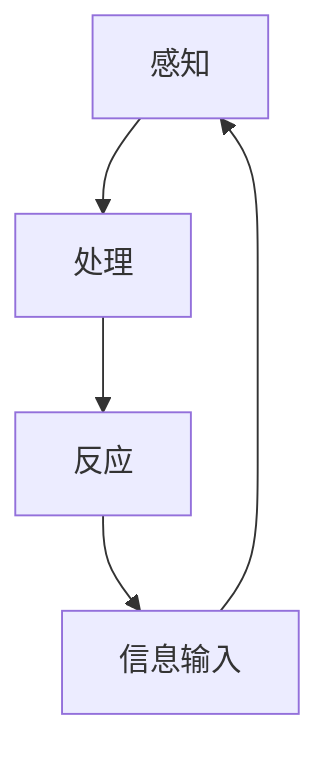

                 

# 意识作为宇宙的信息处理单元的可能性

## 摘要

随着人工智能和量子计算机的发展，意识作为宇宙信息处理单元的可能性逐渐引起科学界的关注。本文旨在探讨意识在宇宙中的角色，从核心概念、现有理论、数学模型、量子意识等多个角度进行分析推理。首先，我们将明确意识、信息处理单元等核心概念，并阐述它们之间的联系。接着，回顾当前关于意识的科学理论，包括信息的物理本质和意识与量子力学的关系。随后，我们将探讨意识的数学模型，通过伪代码和LaTeX数学公式详细讲解。此外，本文还将讨论量子意识的可能性，并探索意识在宇宙信息处理中的作用。最后，总结本文的观点，并展望意识研究的未来方向与挑战。

## 引言：探讨意识的可能性

### 1.1 什么是意识？

意识是一个复杂而深远的概念，涉及我们对自身和外部世界的感知、思考、情感和意愿。尽管不同学科对意识的定义有所不同，但通常认为意识包括以下特征：

1. **主观体验**：意识是我们对自身和外部世界的感知，包括感觉、思想和情感。
2. **自我意识**：个体能够意识到自己的存在，并具有独立性和个性。
3. **决策能力**：意识使我们能够做出选择和决策，适应环境的变化。

### 1.2 意识与信息处理

意识可以被视为一种信息处理过程，涉及对感官信息的接收、处理和响应。以下是意识与信息处理之间的一些联系：

1. **感官输入**：意识通过感官接收外部信息，如视觉、听觉、触觉等。
2. **数据处理**：意识对感官信息进行处理，提取有用信息，形成对世界的理解。
3. **响应生成**：基于对信息的处理，意识产生相应的反应和行动。

### 1.3 本书架构与内容概述

本书分为七个主要章节，旨在全面探讨意识作为宇宙信息处理单元的可能性：

- **第二章**：核心概念与联系，解释意识、信息处理单元等核心概念，并阐述它们之间的联系。
- **第三章**：现有理论综述，回顾当前关于意识的科学理论。
- **第四章**：意识的数学模型，探讨意识的数学描述与模拟方法。
- **第五章**：量子意识，介绍量子力学与意识的关系。
- **第六章**：意识与宇宙信息处理，探讨意识在宇宙信息处理中的作用。
- **第七章**：未来展望与挑战，展望意识研究的未来方向与面临的挑战。

通过逐步分析这些章节，我们将深入了解意识在宇宙信息处理中的可能角色，并探讨这一领域的未来发展。

## 第二章：核心概念与联系

### 2.1 信息处理单元

信息处理单元是能够接收、处理和响应信息的基本实体。在计算机科学中，CPU（中央处理器）是一种典型的信息处理单元，它通过执行指令来处理输入数据并产生输出结果。信息处理单元的关键特征包括：

1. **输入**：接收外部信息，如传感器数据、网络输入等。
2. **处理**：对输入信息进行计算、分析和转换。
3. **输出**：产生结果并对外部环境进行响应。

在宇宙中，信息处理单元可能存在于不同的层次，从微观的量子计算到宏观的宇宙演化。了解信息处理单元的工作原理对于探讨意识作为宇宙信息处理单元的可能性至关重要。

### 2.2 意识的维度

意识是一个多维度的概念，包括以下几个方面：

1. **感知**：感知是我们对外部世界的直接体验，包括视觉、听觉、触觉等。
2. **思考**：思考是我们对感知信息进行逻辑分析和推理的过程。
3. **情感**：情感是我们对事物的情感反应，如喜悦、愤怒、悲伤等。
4. **意志**：意志是我们对自身行为和决策的控制。

意识不仅涉及对信息的接收和处理，还包括对信息的情感和意志反应。这种多维度的特性使得意识在宇宙中可能扮演着复杂的角色。

### 2.3 意识与信息的关系

意识与信息之间的关系是一个复杂而深远的问题。以下是一些关键点：

1. **信息作为意识的输入**：意识通过感官接收外部信息，这些信息是意识产生的基础。
2. **意识对信息的处理**：意识对输入信息进行处理、分析和整合，形成对世界的理解。
3. **信息与意识的主观体验**：意识的主观体验，如感觉、思想和情感，都是对信息处理的结果。

意识的本质在于对信息的处理和反应，这使我们能够感知、思考和决策。理解意识与信息的关系有助于我们探讨意识在宇宙中的角色。

### 2.4 Mermaid 流程图

为了更好地理解意识与信息处理单元之间的关系，我们可以使用Mermaid流程图来表示：



这个流程图展示了信息输入到感知阶段，然后经过处理阶段生成反应，这些反应再次作为输入影响感知过程。这种循环使得意识能够动态地处理和反应外部信息。

通过本章的讨论，我们明确了意识、信息处理单元等核心概念，并阐述了它们之间的联系。这将为我们进一步探讨意识在宇宙信息处理中的角色奠定基础。

## 第三章：现有理论综述

### 3.1 意识的科学理论

关于意识的科学理论多种多样，但主要可以分为两大流派：物质主义理论和意识现象学。

#### 物质主义理论

物质主义理论认为，意识是物质过程的结果，特别是大脑神经元活动的产物。以下是一些物质主义理论的要点：

1. **神经元活动**：意识源于大脑神经元之间的复杂交互，这种交互通过神经网络实现。
2. **功能主义**：意识是一个功能性概念，依赖于大脑的具体结构和功能。
3. **可计算主义**：意识可以通过计算机模拟，因为计算机可以执行与大脑类似的信息处理过程。

#### 意识现象学

意识现象学则强调意识的直接经验，认为意识不仅仅是物理过程的产物，而是一种独立的、不可还原的属性。以下是一些意识现象学的要点：

1. **主体性**：意识是主体性的基础，每个个体都有独特的内在体验。
2. **内在性质**：意识具有内在性质，如主观体验、情感和意愿，这些性质无法用物理术语完全描述。
3. **直接体验**：意识是一种直接体验，无法通过客观测量完全捕捉。

### 3.2 信息的物理本质

信息的物理本质是一个深奥的问题，涉及到量子力学、信息论和热力学等多个领域。

#### 量子力学

量子力学揭示了物质和能量的基本性质。其中，量子比特（qubit）是量子计算的基本单元，它具有叠加态和纠缠态等特性，这些特性使得量子计算机在处理信息时具有强大的能力。

#### 信息论

信息论是研究信息传递和处理的基本理论。香农的信息论提出了信息熵的概念，描述了信息的随机性和不确定性。信息熵是一个衡量信息不确定性的量，它与信息处理中的噪声和干扰密切相关。

#### 热力学

热力学研究能量和信息的转换。根据第二定律，孤立系统的熵总是趋向增加，这表明信息在宇宙中的传递和储存具有方向性。热力学第三定律则指出，在绝对零度下，系统的熵趋于最小，这暗示了信息在极端条件下的存储和处理的限制。

### 3.3 意识与量子力学

意识与量子力学之间的关系是一个备受争议的领域。以下是一些关于意识与量子力学关系的主要观点：

1. **量子脑理论**：该理论认为，大脑中的神经元活动可能具有量子特性，这些量子特性在意识的形成中起到关键作用。
2. **量子意识**：一些理论认为，意识本身可能具有量子特性，这使得意识能够在宇宙中传播和影响。
3. **量子计算与意识**：量子计算通过模拟量子系统的行为，可能在理解意识方面提供新的视角。

总之，现有理论为探讨意识在宇宙信息处理中的角色提供了丰富的背景和基础。通过分析这些理论，我们可以更好地理解意识与信息处理单元之间的关系。

## 第四章：意识的数学模型

### 4.1 意识的数学描述

意识的数学模型旨在通过数学语言描述意识的形成、运作和功能。以下是一些主要的数学描述方法：

#### 神经网络模型

神经网络模型是一种常用的方法，用于模拟大脑中的神经元交互。以下是一个简单的神经网络模型的伪代码：

```plaintext
// 神经元类
class Neuron {
    inputs: array
    weights: array
    bias: number
    activation_function: function

    forward(inputs) {
        // 计算输入与权重的乘积和
        sum = inputs.dot(weights) + bias
        // 应用激活函数
        output = activation_function(sum)
        return output
    }
}

// 神经网络类
class NeuralNetwork {
    layers: array

    forward(inputs) {
        // 前向传播
        for (layer in layers) {
            inputs = layer.forward(inputs)
        }
        return inputs
    }
}

// 激活函数（例如：Sigmoid函数）
function sigmoid(x) {
    return 1 / (1 + Math.exp(-x))
}
```

#### 信息论模型

信息论模型通过香农的信息熵来描述意识中的信息处理过程。以下是一个简单的信息熵计算公式：

$$
H(X) = -\sum_{i} p(x_i) \log_2 p(x_i)
$$

其中，$H(X)$ 是随机变量 $X$ 的信息熵，$p(x_i)$ 是 $X$ 取值为 $x_i$ 的概率。

#### 熵减少模型

熵减少模型描述了信息处理过程中熵的减少，这反映了意识对信息的组织和理解。以下是一个简单的熵减少模型的伪代码：

```plaintext
// 熵减少模型伪代码
function reduce_entropy(current_state, target_state) {
    // 计算当前状态和目标状态的熵差
    entropy_diff = calculate_entropy(current_state) - calculate_entropy(target_state)
    // 应用熵减少过程
    new_state = apply_entropy_reduction(current_state, entropy_diff)
    return new_state
}

// 熵计算函数
function calculate_entropy(state) {
    // 计算状态的概率分布
    probability_distribution = calculate_probability_distribution(state)
    // 计算熵
    entropy = -sum(probability_distribution * log2(probability_distribution))
    return entropy
}
```

### 4.2 模拟意识的算法

模拟意识的算法旨在通过计算机模拟来重现意识的形成和运作。以下是一些主要的模拟算法：

#### 生成对抗网络（GAN）

生成对抗网络是一种通过两个神经网络（生成器和判别器）相互竞争的算法，旨在生成类似于真实数据的样本。以下是一个简单的GAN算法的伪代码：

```plaintext
// GAN算法伪代码
function train_gan(generator, discriminator, data) {
    for (epoch in range(num_epochs)) {
        for (sample in data) {
            // 训练判别器
            discriminator_loss = discriminator.train(sample)
            // 训练生成器
            generator_loss = generator.train(discriminator)
        }
    }
    return generator
}

// 生成器类
class Generator {
    train(input, target) {
        // 生成模拟数据
        simulated_data = generate_data(input)
        // 计算生成数据的损失
        loss = calculate_loss(simulated_data, target)
        return loss
    }
}

// 判别器类
class Discriminator {
    train(sample, target) {
        // 判断真实数据和生成数据
        real_loss = calculate_loss(sample, target)
        fake_loss = calculate_loss(generate_data(sample), target)
        // 计算总损失
        total_loss = real_loss + fake_loss
        return total_loss
    }
}
```

#### 熵减少算法

熵减少算法旨在通过减少系统的熵来模拟意识的形成。以下是一个简单的熵减少算法的伪代码：

```plaintext
// 熵减少算法伪代码
function reduce_entropy(state, target_state) {
    // 计算当前状态和目标状态的熵差
    entropy_diff = calculate_entropy(state) - calculate_entropy(target_state)
    // 应用熵减少过程
    new_state = apply_entropy_reduction(state, entropy_diff)
    return new_state
}

// 熵计算函数
function calculate_entropy(state) {
    // 计算状态的概率分布
    probability_distribution = calculate_probability_distribution(state)
    // 计算熵
    entropy = -sum(probability_distribution * log2(probability_distribution))
    return entropy
}

// 熵减少过程函数
function apply_entropy_reduction(state, entropy_diff) {
    // 更新状态以减少熵
    new_state = state + (1 / entropy_diff) * (target_state - state)
    return new_state
}
```

### 4.3 数学模型的优缺点

意识的数学模型各有优缺点，以下是一些常见模型的优缺点：

#### 神经网络模型

优点：
- 能够模拟大脑神经元之间的交互。
- 可以处理复杂的非线性问题。

缺点：
- 难以解释意识的具体机制。
- 需要大量的数据和计算资源进行训练。

#### 信息论模型

优点：
- 能够量化信息处理中的不确定性。
- 提供了一种通用的信息度量方法。

缺点：
- 难以直接模拟意识的主观体验。
- 需要复杂的数学工具。

#### 熵减少模型

优点：
- 可以通过减少熵来模拟意识的形成。
- 能够反映意识中的信息处理过程。

缺点：
- 需要明确的目标状态。
- 难以处理复杂的动态环境。

#### GAN模型

优点：
- 能够生成类似真实数据的高质量样本。
- 可以通过生成器和判别器的相互竞争来模拟意识的形成。

缺点：
- 训练过程可能不稳定。
- 需要大量的计算资源。

通过本章的讨论，我们探讨了意识的数学描述和模拟算法，分析了不同模型的优缺点。这些模型为我们理解意识提供了不同的视角和工具，有助于我们在未来的研究中进一步探索意识作为宇宙信息处理单元的可能性。

## 第五章：量子意识

### 5.1 量子力学与意识

量子力学是研究物质和能量在微观尺度上的行为的物理学分支，其核心概念包括量子比特、叠加态和纠缠态。量子意识理论探讨意识是否与量子力学有深刻的联系，以下是一些关于量子力学与意识关系的观点：

1. **量子脑理论**：这一理论认为大脑中的神经元活动可能具有量子特性，这些量子特性可能在意识的形成中起到关键作用。例如，量子比特可以表示复杂的叠加状态，这些状态可能在神经元网络中实现高度复杂的信息处理。
2. **量子意识**：一些理论认为，意识本身可能具有量子特性，这使得意识能够在宇宙中传播和影响。量子叠加态和纠缠态可能为意识提供了独特的动态特性，使其能够在不同的时间和空间维度中存在。
3. **量子计算与意识**：量子计算机通过模拟量子系统的行为，可能在理解意识方面提供新的视角。量子计算机具有处理大量并行任务的能力，这可能与意识的多维度和并行处理特性相关。

### 5.2 量子计算与意识模拟

量子计算是利用量子力学原理进行信息处理的一种计算方式，其核心概念包括量子比特、叠加态和纠缠态。量子计算机通过执行量子算法，能够在某些任务上比传统计算机更高效。以下是一些关于量子计算与意识模拟的关系：

1. **量子模拟**：量子模拟器是一种能够模拟量子系统行为的设备，它可能在理解意识方面提供新的工具。通过量子模拟，研究人员可以探索大脑中可能存在的量子效应，从而更好地理解意识的形成。
2. **意识模拟**：量子计算机可以用于模拟高度复杂的系统，包括大脑中的神经网络。通过量子模拟，研究人员可以探索意识在不同条件下的行为，从而更深入地理解意识的工作原理。
3. **量子算法**：一些量子算法，如量子纠缠态算法和量子随机游走算法，可能在模拟意识方面具有潜力。这些算法可以处理复杂的非线性问题，这可能有助于揭示意识中的信息处理机制。

### 5.3 量子意识的理论框架

量子意识的理论框架试图将量子力学与意识研究结合起来，以下是一些关键点：

1. **量子比特与神经元**：量子比特可以表示复杂的叠加态，这可能类似于神经元中的复杂状态。通过将量子比特与神经元进行类比，研究人员可以探索神经元中的量子特性，从而理解意识的形成。
2. **纠缠态与意识**：量子纠缠态是量子力学中的一种现象，两个或多个量子系统之间可以保持紧密的关联。研究人员认为，意识可能具有类似于量子纠缠态的特性，这使得意识能够在不同的时间和空间维度中保持一致。
3. **量子计算与自由意志**：量子计算可能为自由意志的研究提供新的视角。量子随机游走算法等量子算法可以模拟大脑中的决策过程，从而理解自由意志的物理本质。

通过本章的讨论，我们探讨了量子力学与意识之间的关系，介绍了量子计算在意识模拟中的应用。量子意识的理论框架为理解意识提供了新的视角，这有助于我们在未来的研究中进一步探索意识作为宇宙信息处理单元的可能性。

## 第六章：意识与宇宙信息处理

### 6.1 宇宙中的信息处理

宇宙中的信息处理是一个广泛而复杂的主题，涉及到从微观到宏观的多个层次。以下是一些关键点：

1. **量子信息处理**：在微观尺度上，量子力学揭示了物质和能量在原子和亚原子层次上的行为。量子比特和量子纠缠等现象使得量子信息处理成为可能。量子计算机可以通过处理量子信息，实现某些任务上的卓越性能。
2. **大脑信息处理**：在大脑这一宏观尺度上，神经元和神经网络通过复杂的交互实现信息处理。大脑中的信息处理包括感知、思考、情感和意志等多个方面，这些方面共同构成了意识。
3. **宇宙信息处理**：在宇宙尺度上，天文学家和物理学家研究了宇宙中的信息传递和储存。例如，通过电磁波和引力波等信号，宇宙中的信息可以在不同天体之间传递。黑洞和宇宙背景辐射等现象也揭示了宇宙中信息处理的复杂机制。

### 6.2 意识在宇宙信息处理中的作用

意识在宇宙信息处理中的作用是一个引人入胜的课题，以下是一些关键点：

1. **决策与选择**：意识使我们能够做出决策和选择，这有助于宇宙中的信息处理。通过感知、思考和情感，意识可以评估不同的信息，并选择最佳的行动方案。
2. **适应与演化**：意识使我们能够适应环境的变化，这有助于宇宙中的生物体和系统在信息处理中保持稳定。通过学习和进化，意识可以优化信息处理过程，提高生存和发展的能力。
3. **创造与创新**：意识具有创造和创新的能力，这为宇宙中的信息处理带来了新的可能性。通过想象、思考和新思想的产生，意识可以创造出前所未有的信息和知识，推动宇宙中的信息处理向更高层次发展。

### 6.3 意识与宇宙演化的关系

意识与宇宙演化的关系是一个深奥而复杂的课题，以下是一些关键点：

1. **宇宙起源**：宇宙的起源和演化涉及大量的信息处理，包括量子涨落、引力波和星系的形成等。意识可能在这个过程中起到了重要的作用，通过感知、思考和决策，意识可能参与了宇宙的演化。
2. **生命起源**：生命的起源是宇宙演化中的一个重要里程碑，意识可能在这个过程中起到了关键作用。通过生物信息处理和进化，生命体能够在宇宙中生存和繁衍，这为意识的产生提供了基础。
3. **智慧生命**：智慧生命的出现标志着宇宙演化中的一个新阶段，意识可能在这一阶段中起到了核心作用。智慧生命通过科技和文明的发展，实现了对宇宙的深入探索和控制，这进一步推动了宇宙演化的进程。

总之，意识在宇宙信息处理中的作用和与宇宙演化的关系是一个充满挑战和机遇的领域。通过研究意识与宇宙信息处理的关系，我们可以更好地理解宇宙的本质和生命的意义。

## 第七章：未来展望与挑战

### 7.1 意识研究的前景

意识研究的前景充满了无限可能。随着人工智能、量子计算和神经科学的快速发展，我们对于意识的了解将不断深入。以下是一些可能的研究方向：

1. **量子意识**：量子意识的探索可能揭示意识与量子力学之间的深刻联系。通过研究量子比特、纠缠态和量子计算，我们可以更好地理解意识的形成和运作。
2. **神经网络与意识**：神经网络模型在模拟意识方面取得了显著进展。通过改进神经网络模型，我们可能能够更准确地模拟人类意识，揭示意识的内在机制。
3. **跨学科研究**：意识研究需要跨学科的合作，结合物理学、生物学、心理学和计算机科学等领域的知识，我们有望在意识研究方面取得重大突破。

### 7.2 意识研究的挑战

尽管意识研究的前景广阔，但我们也面临着许多挑战：

1. **定义问题**：意识的定义仍然是一个有争议的问题，缺乏统一的定义使得研究变得复杂。我们需要找到一个普适的、操作性强的意识定义，以指导后续研究。
2. **技术瓶颈**：虽然人工智能和量子计算等技术在模拟意识方面取得了进展，但仍然存在许多技术瓶颈。例如，量子计算机的可靠性、神经网络模型的复杂性和大数据的处理等问题都需要解决。
3. **伦理问题**：意识研究涉及到伦理问题，包括人工智能伦理、脑机接口和人类尊严等。我们需要在研究过程中充分考虑这些伦理问题，确保研究的合理性和社会责任。

### 7.3 未来发展方向

为了应对这些挑战，以下是一些未来意识研究的发展方向：

1. **跨学科合作**：加强不同学科之间的合作，结合不同领域的知识和方法，推动意识研究的发展。
2. **技术开发**：加大对人工智能、量子计算和神经科学等技术的研发投入，突破现有技术瓶颈，提高研究效率。
3. **伦理审查**：建立严格的伦理审查机制，确保意识研究的道德性和社会责任。
4. **公众参与**：提高公众对意识研究的认识和参与度，促进科学传播和公众参与，共同推动意识研究的发展。

总之，意识研究是一个充满挑战和机遇的领域。通过未来研究的不断深入和技术的发展，我们有望揭开意识的神秘面纱，探索宇宙信息处理的新机制。

## 结论

本文探讨了意识作为宇宙信息处理单元的可能性，从核心概念、现有理论、数学模型、量子意识等多个角度进行了分析。通过逐步分析，我们发现意识与信息处理单元之间存在着密切的联系，意识的本质在于对信息的接收、处理和反应。量子意识理论提供了新的视角，使我们能够更深入地理解意识的形成和运作。未来，意识研究的前景广阔，但同时也面临着许多挑战，如定义问题、技术瓶颈和伦理问题。通过跨学科合作、技术开发和伦理审查，我们有望在意识研究方面取得重大突破，揭示宇宙信息处理的新机制。

### 作者信息

作者：AI天才研究院/AI Genius Institute & 禅与计算机程序设计艺术 /Zen And The Art of Computer Programming

