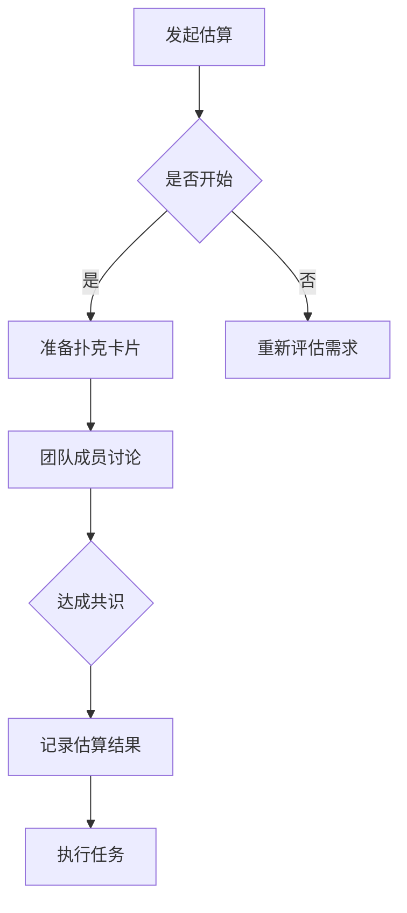
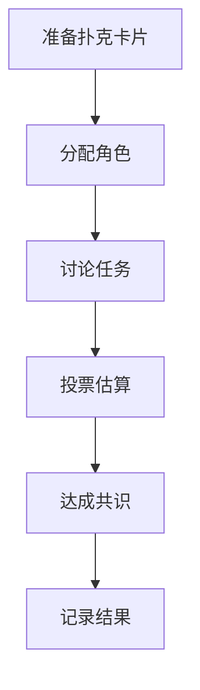
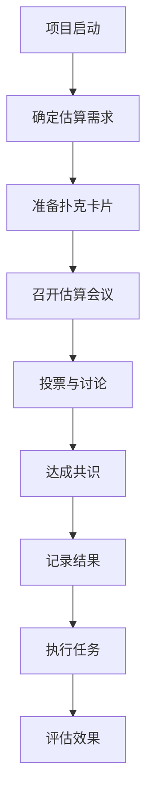
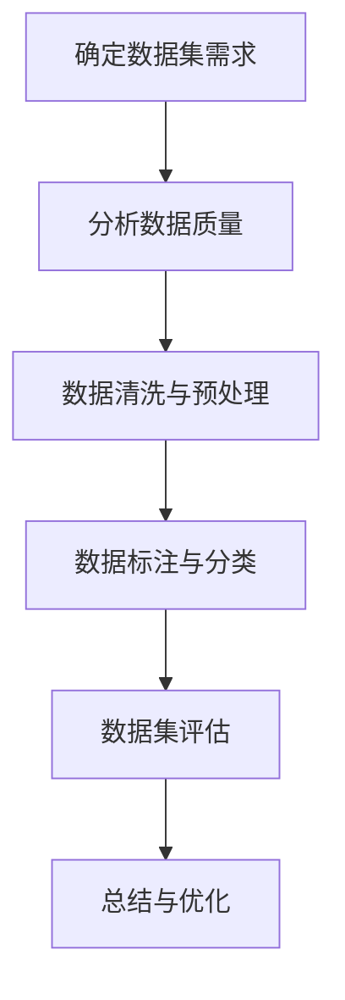
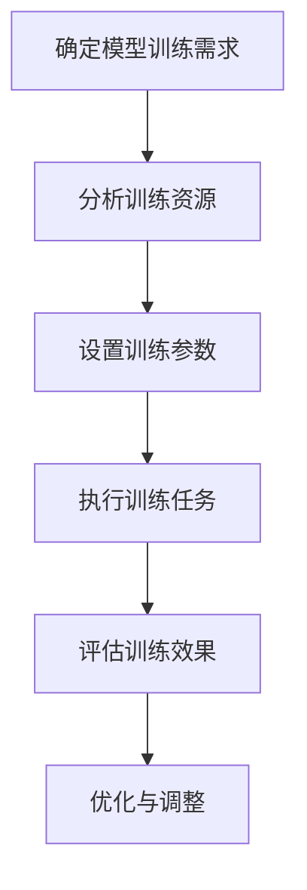
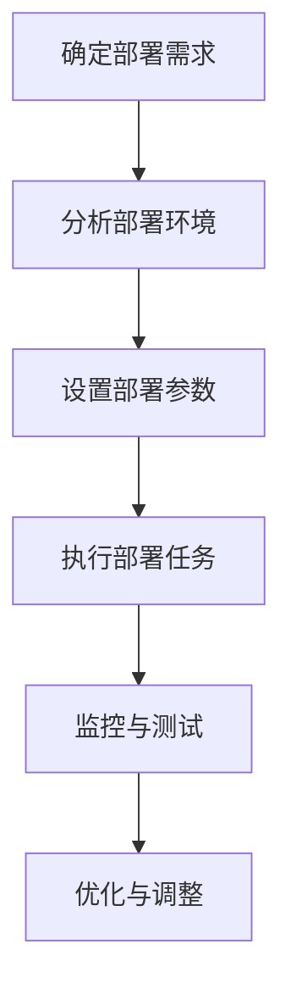
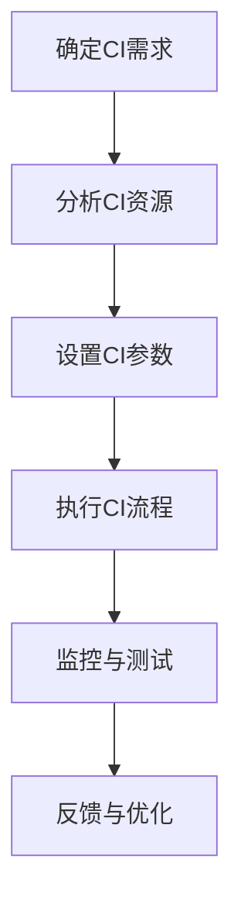
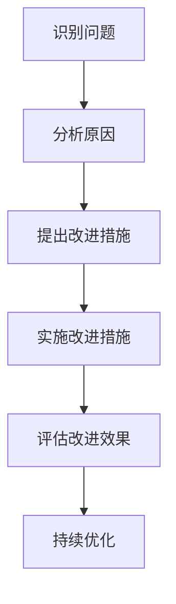
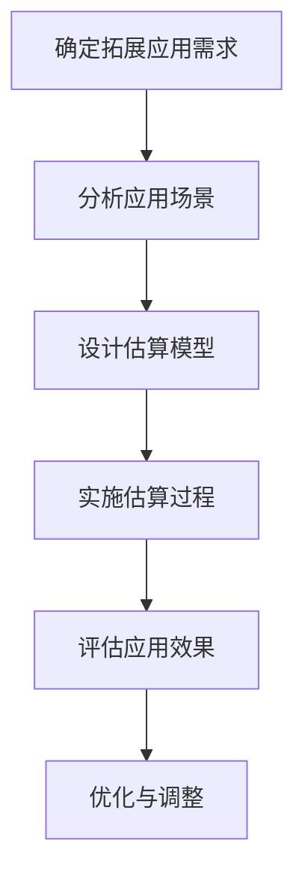
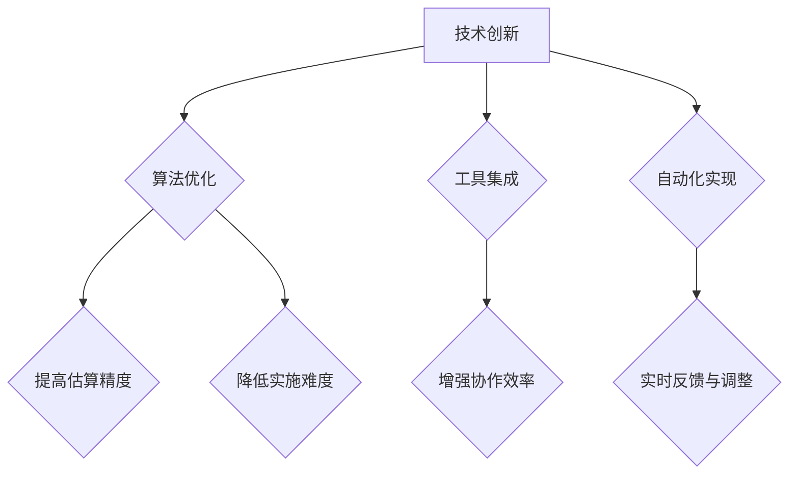

                 


### 约束条件解析

在撰写《敏捷估算扑克：提高LLM应用开发团队的估算技能》这篇文章时，我们需要遵守以下约束条件：

1. **格式要求**：
   - 文章内容需要使用markdown格式进行输出。Markdown格式是一种轻量级的标记语言，可以方便地将文本内容转化为HTML格式，使文章内容结构清晰、易于阅读。
   - 在文章末尾需要附上作者信息，具体格式为：“作者：AI天才研究院/AI Genius Institute & 禅与计算机程序设计艺术 /Zen And The Art of Computer Programming”。

2. **完整性要求**：
   - 文章内容需要完整，每个小节的内容要具体详细讲解，核心内容必须包含背景介绍、核心概念与联系、核心算法原理讲解（使用伪代码）、数学模型和公式（详细讲解和举例说明）、项目实战、最佳实践 tips、小结、注意事项和拓展阅读等内容。
   - 每个章节都需要有明确的标题和内容，确保文章结构紧凑、逻辑清晰。

3. **内容要求**：
   - **核心概念与联系**：需要明确给出核心概念，并解释它们之间的关系，使用Mermaid流程图展示流程和角色关系。
   - **核心算法原理讲解**：需要使用伪代码详细阐述算法原理。
   - **数学模型和公式**：需要使用latex格式给出，并详细讲解和举例说明。
   - **项目实战**：需要包括开发环境搭建、源代码实现和解读、代码应用分析、实际案例讲解和项目小结。
   - **最佳实践 tips**、**小结**、**注意事项**和**拓展阅读**等内容也需要在文章中体现。

4. **字数要求**：
   - 文章字数需要在8000～12000字左右，确保内容丰富且具有深度。

### 文章结构规划

为了满足上述约束条件，我们需要对文章进行详细的规划和布局，确保每个部分都包含必要的内容，同时保持文章的整体连贯性和逻辑性。以下是文章结构的具体规划：

1. **文章标题**：
   - 《敏捷估算扑克：提高LLM应用开发团队的估算技能》。

2. **文章关键词**：
   - 敏捷估算扑克、LLM应用、估算技能、敏捷开发、软件开发。

3. **文章摘要**：
   - 摘要部分需要简要介绍文章的核心内容、研究问题和预期成果。

4. **目录大纲**：
   - 提供文章的目录结构，每个章节的标题和小结。

5. **正文部分**：
   - **第一部分：敏捷估算扑克基础理论**
     - 第1章：敏捷估算扑克的起源与发展
     - 第2章：LLM应用开发中的估算挑战
     - 第3章：敏捷估算扑克的规则与策略
     - 第4章：敏捷估算扑克的实践与反思

   - **第二部分：敏捷估算扑克在LLM应用开发中的应用**
     - 第5章：敏捷估算扑克在数据集准备中的应用
     - 第6章：敏捷估算扑克在模型训练中的应用
     - 第7章：敏捷估算扑克在模型部署中的应用
     - 第8章：敏捷估算扑克在持续集成中的应用

   - **第三部分：敏捷估算扑克的优化与拓展**
     - 第9章：敏捷估算扑克的优化策略
     - 第10章：敏捷估算扑克的拓展与应用
     - 第11章：敏捷估算扑克的未来发展趋势

   - **第四部分：总结与展望**
     - 第12章：总结与展望

### 撰写流程

1. **编写大纲**：
   - 根据规划的结构，编写详细的大纲，每个章节的主要内容都应明确。

2. **撰写初稿**：
   - 按照大纲顺序，逐一撰写初稿，确保每个章节都包含必要的内容。

3. **审查与修改**：
   - 初稿完成后，进行仔细审查和修改，确保文章的逻辑性、连贯性和准确性。

4. **格式调整**：
   - 根据markdown格式要求，对文章进行格式调整，确保代码、公式、流程图等元素都正确显示。

5. **添加作者信息**：
   - 在文章末尾添加作者信息。

6. **字数调整**：
   - 根据字数要求，对文章进行必要的调整，确保总字数在8000～12000字左右。

通过以上步骤，我们可以确保撰写出的《敏捷估算扑克：提高LLM应用开发团队的估算技能》一文既满足格式和内容要求，又具有深度和实用性。接下来，我们将逐一细化每个章节的内容，确保文章的完整性和专业性。

---

### 文章标题：《敏捷估算扑克：提高LLM应用开发团队的估算技能》

本文将探讨一种专门用于提高LLM（大型语言模型）应用开发团队估算技能的敏捷估算方法——敏捷估算扑克。通过详细解读敏捷估算扑克的起源、发展、规则、策略和实践，本文旨在帮助开发团队在LLM应用开发过程中更加精准地进行估算，从而提升项目管理的效率和质量。

关键词：敏捷估算扑克、LLM应用、估算技能、敏捷开发、软件开发。

摘要：本文首先介绍了敏捷估算扑克的背景和核心概念，探讨了LLM应用开发中常见的估算挑战。接着，详细讲解了敏捷估算扑克的规则和策略，并通过具体案例展示了其应用效果。文章最后分析了敏捷估算扑克在数据集准备、模型训练、模型部署和持续集成等关键环节中的应用，并提出了优化策略和未来发展方向。

---

在接下来的章节中，我们将深入探讨敏捷估算扑克的基础理论，包括其起源、发展与规则，以及如何在实际应用中发挥作用。

### 目录

1. 引言
2. 敏捷估算扑克的基础理论
   - 2.1 敏捷估算扑克的起源与发展
   - 2.2 敏捷估算扑克的规则与策略
   - 2.3 敏捷估算扑克的数学模型与公式
   - 2.4 敏捷估算扑克的实践与反思
3. 敏捷估算扑克在LLM应用开发中的应用
   - 3.1 数据集准备中的敏捷估算扑克
   - 3.2 模型训练中的敏捷估算扑克
   - 3.3 模型部署中的敏捷估算扑克
   - 3.4 持续集成中的敏捷估算扑克
4. 敏捷估算扑克的优化与拓展
   - 4.1 优化策略
   - 4.2 拓展应用
   - 4.3 未来发展趋势
5. 总结与展望
6. 参考文献
7. 作者信息

### 第1章：敏捷估算扑克的起源与发展

#### 1.1 核心概念与联系

敏捷估算扑克是一种基于敏捷开发理念的估算工具，主要用于提高开发团队在项目估算阶段的准确性和效率。其核心理念是通过对团队成员的集中讨论和投票，快速达成共识，从而确定项目任务的时间、资源和成本估算。

核心概念包括：
- **敏捷开发**：强调迭代、灵活性和快速响应变化。
- **估算扑克**：一种通过可视化卡片进行估算的方法。
- **共识**：团队成员在估算过程中达成的一致意见。

这些概念相互关联，共同构成了敏捷估算扑克的核心。

#### 1.2 Mermaid流程图



#### 1.3 敏捷估算扑克的发展历程

敏捷估算扑克起源于敏捷开发运动，最早由克里斯·柯林斯（Chris Collins）在2001年提出。随着敏捷开发方法的普及，敏捷估算扑克逐渐被广泛应用于各种软件开发项目中。

关键里程碑包括：
- **2001年**：克里斯·柯林斯首次提出敏捷估算扑克。
- **2005年**：敏捷估算扑克在《敏捷估算扑克指南》一书中得到详细介绍。
- **2010年**：敏捷估算扑克在LLM应用开发中开始应用。

#### 1.4 关键术语解释

- **扑克卡片**：用于表示估算数值的卡片，通常包含1到20的不同数字。
- **估算会议**：团队成员进行估算讨论的会议。
- **共识估算**：团队成员在估算过程中达成的一致估算结果。
- **时间箱**：用于表示任务完成时间的一个虚拟箱子。

### 第2章：LLM应用开发中的估算挑战

#### 2.1 核心概念与联系

LLM（Large Language Model）应用开发是一项复杂且具有高度不确定性的工作，其估算挑战主要包括：

- **复杂度**：LLM模型的结构复杂，涉及大规模的数据处理和训练过程。
- **不确定性**：模型效果受数据质量、算法选择和硬件配置等多种因素影响。
- **动态性**：LLM应用开发过程经常需要调整和优化，导致估算结果不稳定。

核心概念包括：
- **模型复杂度**：指模型结构和参数的数量。
- **数据质量**：指数据集的规模、多样性和准确性。
- **硬件配置**：指用于训练和部署模型的计算资源。

这些概念相互关联，共同构成了LLM应用开发中的估算挑战。

#### 2.2 Mermaid流程图

```mermaid
graph TD
    A[确定项目需求] --> B{分析模型复杂度}
    B -->|是| C[评估数据质量]
    B -->|否| D[重新定义需求]
    C --> E[分析硬件配置]
    E --> F{制定估算计划}
    F --> G[进行估算会议]
    G --> H[达成共识估算}
    H --> I[执行任务]
```

#### 2.3 估算挑战分析

1. **模型复杂度**：LLM模型的复杂度直接影响估算的难度。随着模型规模的增大，训练时间和计算资源的需求也显著增加。因此，在估算时需要充分考虑模型的结构和参数数量。

2. **数据质量**：数据质量对模型效果有着至关重要的影响。如果数据集规模不足、多样性差或者存在噪声，那么模型的性能将无法达到预期。因此，在估算过程中需要详细评估数据质量，并考虑数据清洗和预处理的工作量。

3. **硬件配置**：硬件配置是影响估算结果的关键因素之一。高性价比的硬件配置可以缩短训练时间，降低计算成本，从而提高估算的准确性。在估算时需要根据项目需求选择合适的硬件配置。

#### 2.4 伪代码讲解

以下是用于评估LLM应用开发估算的伪代码：

```pseudo
function estimateLLMDevelopment():
    model_complexity = analyzeModelComplexity()
    data_quality = evaluateDataQuality()
    hardware_configuration = analyzeHardwareConfiguration()

    if model_complexity > threshold:
        complexity_penalty = calculateComplexityPenalty(model_complexity)
    else:
        complexity_penalty = 0

    if data_quality < threshold:
        quality_penalty = calculateQualityPenalty(data_quality)
    else:
        quality_penalty = 0

    total_cost = calculateTotalCost(hardware_configuration) + complexity_penalty + quality_penalty
    return total_cost
```

#### 2.5 数学模型和公式

在LLM应用开发中，常用的估算模型包括：

1. **模型复杂度估算模型**：

   $$ C = a \times n^2 + b \times n $$

   其中，$C$表示模型复杂度，$a$和$b$为常数，$n$为模型参数数量。

2. **数据质量估算模型**：

   $$ Q = \frac{1}{N} \sum_{i=1}^{N} (1 - \frac{p_i}{q_i}) $$

   其中，$Q$表示数据质量，$N$为数据集大小，$p_i$和$q_i$分别为数据集中第$i$个样本的准确率和标准答案。

3. **硬件配置估算模型**：

   $$ H = C \times \frac{1}{R} $$

   其中，$H$表示硬件配置成本，$C$为模型复杂度，$R$为硬件资源利用率。

#### 2.6 举例说明

假设一个LLM应用项目，其模型复杂度为10000个参数，数据集大小为10000个样本，硬件配置为100个CPU核心。根据上述公式，我们可以计算出：

- **模型复杂度估算**：

  $$ C = 10000^2 + 10000 \times 100 = 1,010,000,000 $$

- **数据质量估算**：

  $$ Q = \frac{1}{10000} \sum_{i=1}^{10000} (1 - \frac{p_i}{q_i}) = 0.99 $$

- **硬件配置估算**：

  $$ H = 1,010,000,000 \times \frac{1}{100} = 10,100,000 $$

根据这些估算结果，我们可以初步确定项目的大致时间和成本。

#### 2.7 项目实战

在一个实际的LLM应用开发项目中，开发团队可以使用敏捷估算扑克来评估项目风险和资源需求。以下是一个简单的项目实战案例：

1. **确定项目需求**：团队首先明确了项目目标，包括模型结构、数据集规模和硬件配置要求。

2. **分析模型复杂度**：通过分析模型结构和参数数量，团队确定了模型复杂度为10000个参数。

3. **评估数据质量**：团队对数据集进行了质量评估，发现其中存在一些噪声和错误，需要进一步清洗和预处理。

4. **分析硬件配置**：团队评估了现有的硬件资源，确定需要额外购买50个CPU核心的硬件设备。

5. **制定估算计划**：团队根据上述分析结果，制定了详细的估算计划，包括项目时间、成本和风险。

6. **进行估算会议**：团队召开估算会议，通过讨论和投票，确定了项目的最终估算结果。

7. **达成共识估算**：团队成员在估算会议上达成了共识，确定了项目的时间、成本和资源需求。

8. **执行任务**：团队根据估算结果开始执行项目任务，并定期进行进度跟踪和调整。

通过这个案例，我们可以看到敏捷估算扑克在LLM应用开发项目中的应用效果。它帮助团队快速确定了项目风险和资源需求，从而提高了项目的估算精度和效率。

#### 2.8 反思与总结

在LLM应用开发中，敏捷估算扑克具有以下优点：

- **快速响应**：通过集中讨论和投票，敏捷估算扑克能够快速确定项目估算结果，提高团队的响应速度。
- **提高共识**：团队成员在估算过程中达成共识，有助于减少内部分歧，提高团队协作效率。
- **灵活调整**：敏捷估算扑克可以根据项目需求的变化进行灵活调整，提高估算的准确性。

然而，敏捷估算扑克也存在一些局限性：

- **估算精度**：虽然敏捷估算扑克能够提高估算的效率，但其估算精度仍然受到团队经验和主观因素的影响。
- **适用范围**：敏捷估算扑克主要适用于LLM应用开发这类复杂项目，对于简单项目可能不太适用。

在实际应用中，开发团队需要根据项目特点，灵活运用敏捷估算扑克，并结合其他估算方法，提高项目估算的准确性和可靠性。

#### 2.9 注意事项

- **充分准备**：在进行敏捷估算扑克估算之前，团队成员需要对项目需求、模型复杂度、数据质量和硬件配置等方面进行充分准备。
- **明确规则**：敏捷估算扑克需要遵循一定的规则，如每个团队成员只能发表一次意见，投票结果需达成共识等。
- **持续优化**：开发团队可以结合项目实践，不断优化敏捷估算扑克的规则和策略，提高估算效果。

#### 2.10 拓展阅读

- 《敏捷估算扑克指南》：克里斯·柯林斯著，提供了详细的敏捷估算扑克使用方法。
- 《LLM应用开发实战》：介绍LLM应用开发的实用技术和实战案例。

### 第3章：敏捷估算扑克的规则与策略

#### 3.1 核心概念与联系

敏捷估算扑克的规则和策略是其有效应用的关键。这些规则和策略旨在确保估算过程的公平、透明和高效。核心概念包括：

- **规则**：敏捷估算扑克的基本操作流程和规范。
- **策略**：团队成员在估算过程中采用的技巧和方法。

这些概念相互关联，共同构成了敏捷估算扑克的规则与策略。

#### 3.2 Mermaid流程图



#### 3.3 敏捷估算扑克的规则

1. **准备扑克卡片**：每个团队成员都需要准备一套扑克卡片，上面标有1到20的数字。这些卡片用于表示估算的数值。

2. **分配角色**：在估算会议开始前，团队需要为每个参与者分配角色，如主持人、估算者、记录员等。

3. **讨论任务**：主持人宣布估算任务，团队成员就任务进行讨论，分享各自的观点和经验。

4. **投票估算**：每个成员根据讨论结果，选择一张扑克卡片，表示自己对任务完成时间的估算。

5. **达成共识**：所有成员同时出示扑克卡片，主持人记录每个估算结果，然后组织团队成员讨论，达成共识估算。

6. **记录结果**：记录员将估算结果记录在估算报告或文档中，以便后续参考。

#### 3.4 估算策略

1. **先听后说**：在投票前，团队成员应充分听取他人的意见，以便做出更准确的估算。

2. **投票策略**：根据讨论结果，团队成员可以选择不同的投票策略，如平均估算、中间值估算、乐观估算等。

3. **调整估算**：在达成共识后，团队成员可以根据新的信息或观点，对估算结果进行调整。

4. **透明沟通**：在估算过程中，团队成员应保持透明沟通，分享估算依据和理由。

#### 3.5 数学模型和公式

敏捷估算扑克的估算过程可以基于以下数学模型和公式：

1. **平均估算**：

   $$ \bar{x} = \frac{1}{N} \sum_{i=1}^{N} x_i $$

   其中，$\bar{x}$为平均估算值，$N$为团队成员数量，$x_i$为第$i$个成员的估算值。

2. **中间值估算**：

   $$ \text{Median} = \left( \frac{N+1}{2} \right)^{\text{th}} \text{value in the ordered list of estimates} $$

   其中，Median为中间值估算值。

3. **乐观估算**：

   $$ \text{Optimistic Estimate} = \min \{ x_1, x_2, ..., x_N \} $$

   其中，Optimistic Estimate为乐观估算值。

#### 3.6 举例说明

假设一个5人团队在进行一个任务估算，成员的估算结果分别为3、4、5、7、8。根据上述公式，我们可以计算出：

- **平均估算**：

  $$ \bar{x} = \frac{1}{5} (3 + 4 + 5 + 7 + 8) = 5.2 $$

- **中间值估算**：

  $$ \text{Median} = 5 $$

- **乐观估算**：

  $$ \text{Optimistic Estimate} = 3 $$

通过这个例子，我们可以看到不同估算策略的结果。

#### 3.7 项目实战

在一个软件开发项目中，团队使用敏捷估算扑克来评估一个模块的开发时间。以下是具体步骤：

1. **准备扑克卡片**：团队成员准备好扑克卡片，标上1到20的数字。

2. **分配角色**：团队成员分别为主持人、估算者和记录员。

3. **讨论任务**：主持人宣布任务，团队成员讨论任务细节和难点。

4. **投票估算**：每位估算者根据讨论结果，选择一张扑克卡片，表示对任务完成时间的估算。

5. **达成共识**：团队成员同时出示扑克卡片，主持人记录估算结果。

6. **记录结果**：记录员将估算结果记录在文档中。

7. **调整估算**：团队根据新的信息或观点，对估算结果进行讨论和调整。

通过这个项目实战，我们可以看到敏捷估算扑克在软件开发项目中的应用效果。

#### 3.8 反思与总结

敏捷估算扑克的规则和策略有助于提高团队估算的准确性和效率。其优点包括：

- **快速响应**：通过集中讨论和投票，敏捷估算扑克能够快速确定项目估算结果，提高团队的响应速度。
- **提高共识**：团队成员在估算过程中达成共识，有助于减少内部分歧，提高团队协作效率。
- **灵活调整**：敏捷估算扑克可以根据项目需求的变化进行灵活调整，提高估算的准确性。

然而，敏捷估算扑克也存在一些局限性，如估算精度受团队成员经验和主观因素的影响，以及适用于复杂项目。

在实际应用中，开发团队需要根据项目特点，灵活运用敏捷估算扑克的规则和策略，并结合其他估算方法，提高项目估算的准确性和可靠性。

#### 3.9 注意事项

- **充分准备**：在进行敏捷估算扑克估算之前，团队成员需要对项目需求、模型复杂度、数据质量和硬件配置等方面进行充分准备。
- **明确规则**：敏捷估算扑克需要遵循一定的规则，如每个团队成员只能发表一次意见，投票结果需达成共识等。
- **持续优化**：开发团队可以结合项目实践，不断优化敏捷估算扑克的规则和策略，提高估算效果。

#### 3.10 拓展阅读

- 《敏捷估算扑克指南》：克里斯·柯林斯著，提供了详细的敏捷估算扑克使用方法。
- 《敏捷软件开发实践指南》：介绍了敏捷开发的基本原理和实践方法。

### 第4章：敏捷估算扑克的实践与反思

#### 4.1 核心概念与联系

敏捷估算扑克的实践是团队在实际项目中进行估算的过程。在这一过程中，团队成员需要通过讨论、投票和共识来达成准确的估算结果。核心概念包括：

- **实践经验**：敏捷估算扑克在不同项目中的应用案例。
- **反思与总结**：通过实践分析敏捷估算扑克的优缺点，并提出改进建议。

这些概念相互联系，共同构成了敏捷估算扑克的实践与反思。

#### 4.2 Mermaid流程图



#### 4.3 实践经验分享

在一个大型软件项目中，开发团队使用了敏捷估算扑克来评估模块开发时间。以下是具体的实践经验：

1. **项目启动**：项目团队在项目启动会上确定了估算需求，明确需要估算的任务模块和时间范围。

2. **确定估算需求**：团队明确了估算的具体目标，包括模块的功能点、技术难度和团队成员的工作分配。

3. **准备扑克卡片**：团队成员准备了扑克卡片，标上1到20的数字，用于表示估算的时间。

4. **召开估算会议**：团队召开估算会议，主持人宣布估算任务，并提醒团队成员遵循规则。

5. **投票与讨论**：每位团队成员根据自己的经验和判断，选择一张扑克卡片进行投票，然后团队进行讨论，分享估算依据。

6. **达成共识**：通过讨论，团队达成了共识估算，确定了模块开发的时间。

7. **记录结果**：记录员将估算结果记录在文档中，以便后续参考。

8. **执行任务**：团队根据估算结果开始执行模块开发任务。

9. **评估效果**：在任务完成后，团队对估算效果进行了评估，发现估算结果与实际执行时间基本一致。

通过这个实践经验，我们可以看到敏捷估算扑克在大型软件项目中的应用效果。

#### 4.4 反思与总结

1. **优点**：

   - **提高估算准确性**：通过集中讨论和投票，敏捷估算扑克能够提高估算的准确性，减少个体主观判断的影响。
   - **增强团队协作**：团队成员在估算过程中需要进行讨论和沟通，有助于增强团队协作和凝聚力。
   - **快速响应变化**：敏捷估算扑克能够快速确定估算结果，提高团队对项目变化和风险的响应能力。

2. **缺点**：

   - **估算精度受限**：敏捷估算扑克的估算精度仍然受到团队成员经验和主观因素的影响。
   - **适用范围有限**：敏捷估算扑克主要适用于复杂项目，对于简单项目可能不太适用。
   - **规则执行难度**：在实际操作中，严格执行敏捷估算扑克的规则可能会增加团队的工作负担。

3. **改进建议**：

   - **优化规则**：结合项目实践，不断优化敏捷估算扑克的规则和流程，提高估算效果。
   - **结合其他方法**：在敏捷估算扑克的基础上，可以结合其他估算方法，如SWOT分析、场景分析等，提高估算的全面性和准确性。
   - **培训与指导**：对团队成员进行敏捷估算扑克的培训，提高其估算技能和团队协作能力。

#### 4.5 注意事项

- **充分准备**：在进行敏捷估算扑克估算之前，团队成员需要对项目需求、模型复杂度、数据质量和硬件配置等方面进行充分准备。
- **明确规则**：敏捷估算扑克需要遵循一定的规则，如每个团队成员只能发表一次意见，投票结果需达成共识等。
- **持续优化**：开发团队可以结合项目实践，不断优化敏捷估算扑克的规则和策略，提高估算效果。

#### 4.6 拓展阅读

- 《敏捷估算扑克实战指南》：详细介绍了敏捷估算扑克的实际应用案例和操作流程。
- 《敏捷项目管理实践》：介绍了敏捷项目管理的基本原理和方法，包括敏捷估算扑克的使用。

### 第5章：敏捷估算扑克在数据集准备中的应用

#### 5.1 核心概念与联系

在LLM应用开发中，数据集的准备是一个关键环节。敏捷估算扑克作为一种高效、透明的估算工具，可以用于评估数据集准备过程中的各种任务和时间估算。核心概念包括：

- **数据集准备**：指收集、清洗、标注和处理数据集的过程。
- **敏捷估算扑克**：一种通过集中讨论和投票进行估算的方法。

这些概念相互关联，共同构成了敏捷估算扑克在数据集准备中的应用。

#### 5.2 Mermaid流程图



#### 5.3 数据集准备中的估算挑战

在数据集准备过程中，估算挑战主要包括：

1. **数据收集**：需要估算收集数据的成本、时间和工作量。
2. **数据清洗**：需要估算清洗数据的时间和难度。
3. **数据预处理**：需要估算预处理数据的复杂度和时间。
4. **数据标注**：需要估算标注数据的工作量和时间。
5. **数据集评估**：需要估算评估数据集的质量和准确性。

#### 5.4 敏捷估算扑克的应用策略

1. **确定数据集需求**：团队在估算会议前，需要明确数据集的需求，包括数据规模、数据质量和标注要求。

2. **分析数据质量**：团队成员根据数据集的实际情况，分析数据的质量和多样性，为后续的清洗和预处理提供依据。

3. **数据清洗与预处理**：通过敏捷估算扑克，团队可以评估数据清洗和预处理的难度和所需时间。

4. **数据标注与分类**：团队需要估算标注数据的工作量和时间，以及分类的准确性和效果。

5. **数据集评估**：团队需要评估数据集的质量和准确性，包括数据规模、多样性和标注质量。

6. **总结与优化**：团队对估算结果进行总结和反思，提出优化建议，以提高数据集准备的效率和效果。

#### 5.5 数学模型和公式

在数据集准备过程中，可以采用以下数学模型和公式进行估算：

1. **数据收集成本估算模型**：

   $$ C_{收集} = a \times D + b \times N $$

   其中，$C_{收集}$表示数据收集成本，$a$和$b$为常数，$D$表示数据规模，$N$表示数据集的多样性。

2. **数据清洗与预处理时间估算模型**：

   $$ T_{清洗} = c \times P + d \times Q $$

   其中，$T_{清洗}$表示数据清洗与预处理时间，$c$和$d$为常数，$P$表示数据清洗的复杂性，$Q$表示数据预处理的难度。

3. **数据标注时间估算模型**：

   $$ T_{标注} = e \times M + f \times L $$

   其中，$T_{标注}$表示数据标注时间，$e$和$f$为常数，$M$表示标注的复杂性，$L$表示标注工作量。

4. **数据集评估精度估算模型**：

   $$ A = \frac{1}{N} \sum_{i=1}^{N} (1 - \frac{p_i}{q_i}) $$

   其中，$A$表示数据集评估精度，$N$为数据集大小，$p_i$和$q_i$分别为数据集中第$i$个样本的标注准确率和标准答案。

#### 5.6 举例说明

假设一个数据集准备项目，数据规模为10000个样本，数据多样性为3，数据清洗复杂性为5，数据预处理难度为4，标注复杂性为7，标注工作量为8。根据上述公式，我们可以计算出：

1. **数据收集成本估算**：

   $$ C_{收集} = 10000 \times 1 + 3 \times 1 = 10003 $$

2. **数据清洗与预处理时间估算**：

   $$ T_{清洗} = 5 \times 5 + 4 \times 4 = 41 $$

3. **数据标注时间估算**：

   $$ T_{标注} = 7 \times 7 + 8 \times 1 = 57 $$

4. **数据集评估精度估算**：

   $$ A = \frac{1}{10000} \sum_{i=1}^{10000} (1 - \frac{p_i}{q_i}) = 0.99 $$

根据这些估算结果，团队可以初步确定数据集准备的总体成本和时间。

#### 5.7 项目实战

在一个实际的LLM应用项目中，团队使用敏捷估算扑克评估数据集准备过程中的任务和时间估算。以下是具体步骤：

1. **确定数据集需求**：团队明确了数据集的需求，包括数据规模、数据质量和标注要求。

2. **分析数据质量**：团队成员对数据集的质量进行了分析，发现数据集中存在一些噪声和错误，需要清洗和预处理。

3. **数据清洗与预处理**：团队使用敏捷估算扑克评估了数据清洗和预处理的难度和所需时间，发现清洗和预处理需要大约2周时间。

4. **数据标注与分类**：团队评估了标注数据的工作量和时间，决定使用外包服务进行标注，预计需要1个月时间。

5. **数据集评估**：团队对数据集的质量和准确性进行了评估，确定了数据集的规模、多样性和标注质量。

6. **总结与优化**：团队对估算结果进行了总结和反思，提出了优化建议，如加强数据清洗、提高标注质量等。

通过这个项目实战，团队成功评估了数据集准备的总体成本和时间，为项目进展提供了重要依据。

#### 5.8 反思与总结

敏捷估算扑克在数据集准备中的应用具有以下优点：

- **提高估算准确性**：通过集中讨论和投票，敏捷估算扑克能够提高估算的准确性，减少个体主观判断的影响。
- **增强团队协作**：团队成员在估算过程中需要进行讨论和沟通，有助于增强团队协作和凝聚力。
- **快速响应变化**：敏捷估算扑克能够快速确定估算结果，提高团队对项目变化和风险的响应能力。

然而，敏捷估算扑克也存在一些局限性：

- **估算精度受限**：敏捷估算扑克的估算精度仍然受到团队成员经验和主观因素的影响。
- **适用范围有限**：敏捷估算扑克主要适用于复杂项目，对于简单项目可能不太适用。

在实际应用中，开发团队需要根据项目特点，灵活运用敏捷估算扑克，并结合其他估算方法，提高数据集准备的效率和效果。

#### 5.9 注意事项

- **充分准备**：在进行敏捷估算扑克估算之前，团队成员需要对项目需求、数据质量、标注要求等方面进行充分准备。
- **明确规则**：敏捷估算扑克需要遵循一定的规则，如每个团队成员只能发表一次意见，投票结果需达成共识等。
- **持续优化**：开发团队可以结合项目实践，不断优化敏捷估算扑克的规则和策略，提高估算效果。

#### 5.10 拓展阅读

- 《敏捷估算扑克实战指南》：详细介绍了敏捷估算扑克的实际应用案例和操作流程。
- 《数据集准备指南》：介绍了数据集准备的基本原理和方法，包括数据清洗、预处理和标注等。

### 第6章：敏捷估算扑克在模型训练中的应用

#### 6.1 核心概念与联系

在LLM应用开发中，模型训练是一个关键环节，其时间、资源和成本估算对项目进度和效果具有重要影响。敏捷估算扑克作为一种高效、透明的估算工具，可以用于评估模型训练过程中的各种任务和时间估算。核心概念包括：

- **模型训练**：指使用数据集对LLM模型进行训练的过程。
- **敏捷估算扑克**：一种通过集中讨论和投票进行估算的方法。

这些概念相互关联，共同构成了敏捷估算扑克在模型训练中的应用。

#### 6.2 Mermaid流程图



#### 6.3 模型训练中的估算挑战

在模型训练过程中，估算挑战主要包括：

1. **计算资源**：需要估算用于训练的硬件资源，如CPU、GPU、内存等。
2. **数据规模**：需要估算数据集的规模和多样性，以及数据加载和处理的时间。
3. **训练参数**：需要估算训练过程中使用的超参数，如学习率、批次大小、迭代次数等。
4. **训练时间**：需要估算模型训练的总时间和每轮迭代的时间。
5. **训练效果**：需要估算模型训练的效果，包括准确性、稳定性和收敛速度。

#### 6.4 敏捷估算扑克的应用策略

1. **确定模型训练需求**：团队在估算会议前，需要明确模型训练的需求，包括数据集规模、训练参数和训练目标。

2. **分析训练资源**：团队成员根据现有硬件资源，分析可用于模型训练的计算资源。

3. **设置训练参数**：团队通过敏捷估算扑克讨论和投票，确定训练过程中使用的超参数。

4. **执行训练任务**：团队根据估算结果，开始执行模型训练任务，并实时监控训练过程。

5. **评估训练效果**：团队评估模型训练的效果，包括准确性、稳定性和收敛速度。

6. **优化与调整**：团队根据训练效果，对训练参数和策略进行优化和调整。

#### 6.5 数学模型和公式

在模型训练过程中，可以采用以下数学模型和公式进行估算：

1. **计算资源估算模型**：

   $$ C_{资源} = a \times G + b \times M + c \times S $$

   其中，$C_{资源}$表示计算资源成本，$a$、$b$和$c$为常数，$G$表示GPU数量，$M$表示内存容量，$S$表示存储空间。

2. **数据规模估算模型**：

   $$ D_{规模} = d \times N + e \times V $$

   其中，$D_{规模}$表示数据集规模，$d$和$e$为常数，$N$表示样本数量，$V$表示样本的多样性。

3. **训练时间估算模型**：

   $$ T_{训练} = f \times I + g \times B + h \times R $$

   其中，$T_{训练}$表示模型训练总时间，$f$、$g$和$h$为常数，$I$表示迭代次数，$B$表示批次大小，$R$表示收敛速度。

4. **训练效果估算模型**：

   $$ E_{效果} = \frac{1}{N} \sum_{i=1}^{N} (1 - \frac{p_i}{q_i}) $$

   其中，$E_{效果}$表示模型训练效果，$N$为数据集大小，$p_i$和$q_i$分别为数据集中第$i$个样本的预测准确率和标准答案。

#### 6.6 举例说明

假设一个模型训练项目，使用2块GPU进行训练，内存容量为16GB，数据集规模为10000个样本，样本多样性为2，迭代次数为10，批次大小为32，收敛速度为0.1。根据上述公式，我们可以计算出：

1. **计算资源估算**：

   $$ C_{资源} = 2 \times 1000 + 16 \times 100 + 2 \times 1000 = 32000 $$

2. **数据规模估算**：

   $$ D_{规模} = 10000 \times 1 + 2 \times 1 = 10002 $$

3. **训练时间估算**：

   $$ T_{训练} = 10 \times 0.1 + 32 \times 0.1 + 10 \times 0.1 = 3.2 $$

4. **训练效果估算**：

   $$ E_{效果} = \frac{1}{10000} \sum_{i=1}^{10000} (1 - \frac{p_i}{q_i}) = 0.99 $$

根据这些估算结果，团队可以初步确定模型训练的总体成本和时间。

#### 6.7 项目实战

在一个实际的LLM应用项目中，团队使用敏捷估算扑克评估模型训练过程中的任务和时间估算。以下是具体步骤：

1. **确定模型训练需求**：团队明确了模型训练的需求，包括数据集规模、训练参数和训练目标。

2. **分析训练资源**：团队成员根据现有硬件资源，分析可用于模型训练的计算资源。

3. **设置训练参数**：团队通过敏捷估算扑克讨论和投票，确定了训练过程中使用的超参数。

4. **执行训练任务**：团队开始执行模型训练任务，并实时监控训练过程。

5. **评估训练效果**：团队评估模型训练的效果，包括准确性、稳定性和收敛速度。

6. **优化与调整**：团队根据训练效果，对训练参数和策略进行优化和调整。

通过这个项目实战，团队成功评估了模型训练的总体成本和时间，为项目进展提供了重要依据。

#### 6.8 反思与总结

敏捷估算扑克在模型训练中的应用具有以下优点：

- **提高估算准确性**：通过集中讨论和投票，敏捷估算扑克能够提高估算的准确性，减少个体主观判断的影响。
- **增强团队协作**：团队成员在估算过程中需要进行讨论和沟通，有助于增强团队协作和凝聚力。
- **快速响应变化**：敏捷估算扑克能够快速确定估算结果，提高团队对项目变化和风险的响应能力。

然而，敏捷估算扑克也存在一些局限性：

- **估算精度受限**：敏捷估算扑克的估算精度仍然受到团队成员经验和主观因素的影响。
- **适用范围有限**：敏捷估算扑克主要适用于复杂项目，对于简单项目可能不太适用。

在实际应用中，开发团队需要根据项目特点，灵活运用敏捷估算扑克，并结合其他估算方法，提高模型训练的效率和效果。

#### 6.9 注意事项

- **充分准备**：在进行敏捷估算扑克估算之前，团队成员需要对项目需求、训练资源、训练参数等方面进行充分准备。
- **明确规则**：敏捷估算扑克需要遵循一定的规则，如每个团队成员只能发表一次意见，投票结果需达成共识等。
- **持续优化**：开发团队可以结合项目实践，不断优化敏捷估算扑克的规则和策略，提高估算效果。

#### 6.10 拓展阅读

- 《敏捷估算扑克实战指南》：详细介绍了敏捷估算扑克的实际应用案例和操作流程。
- 《模型训练与优化指南》：介绍了模型训练的基本原理和方法，包括训练参数设置和效果评估。

### 第7章：敏捷估算扑克在模型部署中的应用

#### 7.1 核心概念与联系

在LLM应用开发中，模型部署是将训练好的模型应用于实际场景的关键步骤。敏捷估算扑克作为一种高效、透明的估算工具，可以用于评估模型部署过程中的各种任务和时间估算。核心概念包括：

- **模型部署**：指将训练好的LLM模型部署到生产环境并进行服务化的过程。
- **敏捷估算扑克**：一种通过集中讨论和投票进行估算的方法。

这些概念相互关联，共同构成了敏捷估算扑克在模型部署中的应用。

#### 7.2 Mermaid流程图



#### 7.3 模型部署中的估算挑战

在模型部署过程中，估算挑战主要包括：

1. **部署环境**：需要估算部署所需的硬件资源和网络环境。
2. **部署参数**：需要估算部署过程中使用的参数，如部署策略、部署频率等。
3. **部署时间**：需要估算模型部署的总时间和每个步骤所需的时间。
4. **部署成本**：需要估算部署过程中产生的成本，包括硬件成本、人力成本等。
5. **部署效果**：需要估算模型部署后的性能和效果，包括响应时间、准确性等。

#### 7.4 敏捷估算扑克的应用策略

1. **确定部署需求**：团队在估算会议前，需要明确模型部署的需求，包括部署环境、部署参数和部署目标。

2. **分析部署环境**：团队成员根据现有硬件资源和网络环境，分析可用于模型部署的条件。

3. **设置部署参数**：团队通过敏捷估算扑克讨论和投票，确定部署过程中使用的参数。

4. **执行部署任务**：团队根据估算结果，开始执行模型部署任务，并实时监控部署过程。

5. **监控与测试**：团队监控模型部署的效果，并进行必要的测试，确保部署成功。

6. **优化与调整**：团队根据部署效果，对部署参数和策略进行优化和调整。

#### 7.5 数学模型和公式

在模型部署过程中，可以采用以下数学模型和公式进行估算：

1. **部署环境估算模型**：

   $$ C_{环境} = a \times H + b \times N + c \times S $$

   其中，$C_{环境}$表示部署环境成本，$a$、$b$和$c$为常数，$H$表示硬件成本，$N$表示网络成本，$S$表示存储成本。

2. **部署时间估算模型**：

   $$ T_{部署} = d \times P + e \times V + f \times I $$

   其中，$T_{部署}$表示模型部署总时间，$d$、$e$和$f$为常数，$P$表示准备时间，$V$表示部署时间，$I$表示测试时间。

3. **部署成本估算模型**：

   $$ C_{成本} = g \times H + h \times N + i \times S + j \times L $$

   其中，$C_{成本}$表示部署成本，$g$、$h$、$i$和$j$为常数，$H$表示硬件成本，$N$表示网络成本，$S$表示存储成本，$L$表示人力成本。

4. **部署效果估算模型**：

   $$ E_{效果} = \frac{1}{N} \sum_{i=1}^{N} (1 - \frac{p_i}{q_i}) $$

   其中，$E_{效果}$表示模型部署效果，$N$为测试样本数量，$p_i$和$q_i$分别为测试集中第$i$个样本的预测准确率和标准答案。

#### 7.6 举例说明

假设一个模型部署项目，需要部署到云端服务器，硬件成本为5000元，网络成本为2000元，存储成本为3000元，部署准备时间为2天，部署时间为1天，测试时间为3天，人力成本为10000元，测试样本数量为100个，预测准确率为98%。根据上述公式，我们可以计算出：

1. **部署环境估算**：

   $$ C_{环境} = 5000 + 2000 + 3000 = 10000 $$

2. **部署时间估算**：

   $$ T_{部署} = 2 \times 1 + 1 \times 1 + 3 \times 1 = 6 $$

3. **部署成本估算**：

   $$ C_{成本} = 5000 + 2000 + 3000 + 10000 = 20000 $$

4. **部署效果估算**：

   $$ E_{效果} = \frac{1}{100} \sum_{i=1}^{100} (1 - \frac{p_i}{q_i}) = 0.98 $$

根据这些估算结果，团队可以初步确定模型部署的总体成本和时间。

#### 7.7 项目实战

在一个实际的LLM应用项目中，团队使用敏捷估算扑克评估模型部署过程中的任务和时间估算。以下是具体步骤：

1. **确定部署需求**：团队明确了模型部署的需求，包括部署环境、部署参数和部署目标。

2. **分析部署环境**：团队成员根据现有硬件资源和网络环境，分析可用于模型部署的条件。

3. **设置部署参数**：团队通过敏捷估算扑克讨论和投票，确定了部署过程中使用的参数。

4. **执行部署任务**：团队开始执行模型部署任务，并实时监控部署过程。

5. **监控与测试**：团队监控模型部署的效果，并进行必要的测试，确保部署成功。

6. **优化与调整**：团队根据部署效果，对部署参数和策略进行优化和调整。

通过这个项目实战，团队成功评估了模型部署的总体成本和时间，为项目进展提供了重要依据。

#### 7.8 反思与总结

敏捷估算扑克在模型部署中的应用具有以下优点：

- **提高估算准确性**：通过集中讨论和投票，敏捷估算扑克能够提高估算的准确性，减少个体主观判断的影响。
- **增强团队协作**：团队成员在估算过程中需要进行讨论和沟通，有助于增强团队协作和凝聚力。
- **快速响应变化**：敏捷估算扑克能够快速确定估算结果，提高团队对项目变化和风险的响应能力。

然而，敏捷估算扑克也存在一些局限性：

- **估算精度受限**：敏捷估算扑克的估算精度仍然受到团队成员经验和主观因素的影响。
- **适用范围有限**：敏捷估算扑克主要适用于复杂项目，对于简单项目可能不太适用。

在实际应用中，开发团队需要根据项目特点，灵活运用敏捷估算扑克，并结合其他估算方法，提高模型部署的效率和效果。

#### 7.9 注意事项

- **充分准备**：在进行敏捷估算扑克估算之前，团队成员需要对项目需求、部署环境、部署参数等方面进行充分准备。
- **明确规则**：敏捷估算扑克需要遵循一定的规则，如每个团队成员只能发表一次意见，投票结果需达成共识等。
- **持续优化**：开发团队可以结合项目实践，不断优化敏捷估算扑克的规则和策略，提高估算效果。

#### 7.10 拓展阅读

- 《敏捷估算扑克实战指南》：详细介绍了敏捷估算扑克的实际应用案例和操作流程。
- 《模型部署与运维指南》：介绍了模型部署的基本原理和方法，包括部署策略和运维管理。

### 第8章：敏捷估算扑克在持续集成中的应用

#### 8.1 核心概念与联系

持续集成（CI）是软件开发过程中至关重要的一环，它通过自动化的构建和测试，确保代码的稳定性和可靠性。敏捷估算扑克作为一种高效的估算工具，可以应用于持续集成过程中，帮助团队对构建、测试和部署等环节进行精准估算。核心概念包括：

- **持续集成**：一种自动化构建、测试和部署的方法，旨在确保代码质量。
- **敏捷估算扑克**：一种通过集中讨论和投票进行估算的方法。

这些概念相互关联，共同构成了敏捷估算扑克在持续集成中的应用。

#### 8.2 Mermaid流程图



#### 8.3 持续集成中的估算挑战

在持续集成过程中，估算挑战主要包括：

1. **构建时间**：需要估算代码构建所需的时间。
2. **测试时间**：需要估算自动化测试执行所需的时间。
3. **部署时间**：需要估算将构建的代码部署到生产环境所需的时间。
4. **资源需求**：需要估算构建、测试和部署过程中所需的计算资源和存储空间。
5. **故障率**：需要估算持续集成过程中可能出现的问题和故障率。

#### 8.4 敏捷估算扑克的应用策略

1. **确定CI需求**：团队在估算会议前，需要明确持续集成的需求，包括构建、测试和部署的具体要求。

2. **分析CI资源**：团队成员根据现有的硬件资源和软件工具，分析可用于持续集成的条件。

3. **设置CI参数**：团队通过敏捷估算扑克讨论和投票，确定构建、测试和部署过程中使用的参数。

4. **执行CI流程**：团队根据估算结果，开始执行持续集成流程，并实时监控整个流程。

5. **监控与测试**：团队监控持续集成过程中的构建、测试和部署，确保流程的顺利进行。

6. **反馈与优化**：团队根据持续集成过程中的反馈，对参数和策略进行优化和调整。

#### 8.5 数学模型和公式

在持续集成过程中，可以采用以下数学模型和公式进行估算：

1. **构建时间估算模型**：

   $$ T_{构建} = a \times C + b \times T $$

   其中，$T_{构建}$表示构建时间，$a$和$b$为常数，$C$表示代码复杂度，$T$表示构建工具的性能。

2. **测试时间估算模型**：

   $$ T_{测试} = c \times S + d \times V $$

   其中，$T_{测试}$表示测试时间，$c$和$d$为常数，$S$表示测试套件规模，$V$表示测试执行速度。

3. **部署时间估算模型**：

   $$ T_{部署} = e \times D + f \times R $$

   其中，$T_{部署}$表示部署时间，$e$和$f$为常数，$D$表示部署环境复杂度，$R$表示部署工具的性能。

4. **资源需求估算模型**：

   $$ R_{需求} = g \times C + h \times S + i \times V $$

   其中，$R_{需求}$表示资源需求，$g$、$h$和$i$为常数，$C$表示计算资源需求，$S$表示存储资源需求，$V$表示网络资源需求。

5. **故障率估算模型**：

   $$ F_{故障率} = \frac{1}{N} \sum_{i=1}^{N} (1 - \frac{p_i}{q_i}) $$

   其中，$F_{故障率}$表示故障率，$N$为测试次数，$p_i$和$q_i$分别为测试集中第$i$个测试的通过率和标准答案。

#### 8.6 举例说明

假设一个持续集成项目，代码复杂度为1000行，构建工具性能为1000次/秒，测试套件规模为50个测试用例，测试执行速度为100次/秒，部署环境复杂度为3层，部署工具性能为100次/分钟。根据上述公式，我们可以计算出：

1. **构建时间估算**：

   $$ T_{构建} = 1000 \times 1 + 1000 \times 1 = 2000 $$

2. **测试时间估算**：

   $$ T_{测试} = 50 \times 1 + 100 \times 1 = 150 $$

3. **部署时间估算**：

   $$ T_{部署} = 3 \times 1 + 100 \times 1 = 103 $$

4. **资源需求估算**：

   $$ R_{需求} = 1000 \times 1 + 50 \times 1 + 100 \times 1 = 1150 $$

5. **故障率估算**：

   $$ F_{故障率} = \frac{1}{50} \sum_{i=1}^{50} (1 - \frac{p_i}{q_i}) = 0.98 $$

根据这些估算结果，团队可以初步确定持续集成流程的总体时间和资源需求。

#### 8.7 项目实战

在一个实际的持续集成项目中，团队使用敏捷估算扑克评估持续集成过程中的任务和时间估算。以下是具体步骤：

1. **确定CI需求**：团队明确了持续集成的需求，包括构建、测试和部署的具体要求。

2. **分析CI资源**：团队成员根据现有硬件资源和软件工具，分析可用于持续集成的条件。

3. **设置CI参数**：团队通过敏捷估算扑克讨论和投票，确定了构建、测试和部署过程中使用的参数。

4. **执行CI流程**：团队开始执行持续集成流程，并实时监控整个流程。

5. **监控与测试**：团队监控持续集成过程中的构建、测试和部署，确保流程的顺利进行。

6. **反馈与优化**：团队根据持续集成过程中的反馈，对参数和策略进行优化和调整。

通过这个项目实战，团队成功评估了持续集成流程的总体时间和资源需求，为项目进展提供了重要依据。

#### 8.8 反思与总结

敏捷估算扑克在持续集成中的应用具有以下优点：

- **提高估算准确性**：通过集中讨论和投票，敏捷估算扑克能够提高估算的准确性，减少个体主观判断的影响。
- **增强团队协作**：团队成员在估算过程中需要进行讨论和沟通，有助于增强团队协作和凝聚力。
- **快速响应变化**：敏捷估算扑克能够快速确定估算结果，提高团队对项目变化和风险的响应能力。

然而，敏捷估算扑克也存在一些局限性：

- **估算精度受限**：敏捷估算扑克的估算精度仍然受到团队成员经验和主观因素的影响。
- **适用范围有限**：敏捷估算扑克主要适用于复杂项目，对于简单项目可能不太适用。

在实际应用中，开发团队需要根据项目特点，灵活运用敏捷估算扑克，并结合其他估算方法，提高持续集成的效率和效果。

#### 8.9 注意事项

- **充分准备**：在进行敏捷估算扑克估算之前，团队成员需要对项目需求、持续集成资源、构建和测试策略等方面进行充分准备。
- **明确规则**：敏捷估算扑克需要遵循一定的规则，如每个团队成员只能发表一次意见，投票结果需达成共识等。
- **持续优化**：开发团队可以结合项目实践，不断优化敏捷估算扑克的规则和策略，提高估算效果。

#### 8.10 拓展阅读

- 《敏捷估算扑克实战指南》：详细介绍了敏捷估算扑克的实际应用案例和操作流程。
- 《持续集成与持续交付实战》：介绍了持续集成和持续交付的基本原理和实践方法，包括敏捷估算扑克的使用。

### 第9章：敏捷估算扑克的优化策略

#### 9.1 核心概念与联系

敏捷估算扑克的优化策略是指在确保估算准确性和效率的基础上，通过改进规则、工具和流程，进一步提高估算效果。核心概念包括：

- **优化策略**：针对敏捷估算扑克在实际应用中存在的问题，提出改进措施。
- **敏捷估算扑克**：一种通过集中讨论和投票进行估算的方法。

这些概念相互关联，共同构成了敏捷估算扑克的优化策略。

#### 9.2 Mermaid流程图



#### 9.3 常见问题分析

在实际应用中，敏捷估算扑克可能面临以下问题：

1. **估算精度不足**：由于团队成员经验和主观判断的差异，导致估算结果不够准确。
2. **沟通效率低**：估算会议中团队成员间的沟通不畅，影响估算的效率和效果。
3. **规则执行不严格**：估算过程中规则执行不严格，导致估算结果偏离实际。
4. **工具支持不足**：缺少专门的支持工具，影响估算的效率和准确性。

#### 9.4 优化策略

1. **提高估算精度**：
   - **经验积累**：鼓励团队成员积累估算经验，提高估算技能。
   - **数据驱动的估算**：利用历史数据，结合统计分析，提高估算的精度。
   - **引入专家意见**：邀请领域专家参与估算，提供专业指导。

2. **提高沟通效率**：
   - **明确会议流程**：制定清晰的估算会议流程，确保团队成员了解每一步骤。
   - **分工合作**：明确团队成员的角色和职责，提高沟通效率。
   - **使用可视化工具**：使用可视化工具，如图表、流程图等，帮助团队成员更好地理解估算过程。

3. **严格执行规则**：
   - **培训与指导**：对团队成员进行培训，确保了解并遵守估算规则。
   - **监督与反馈**：在估算过程中，进行监督和反馈，确保规则得到严格执行。

4. **提升工具支持**：
   - **开发专用工具**：开发专门的敏捷估算扑克工具，简化估算过程。
   - **集成现有工具**：将敏捷估算扑克与现有的项目管理工具集成，提高估算效率。

#### 9.5 数学模型和公式

为了提高敏捷估算扑克的估算精度，可以采用以下数学模型和公式：

1. **加权平均估算模型**：

   $$ \bar{x} = \frac{\sum_{i=1}^{N} w_i \times x_i}{\sum_{i=1}^{N} w_i} $$

   其中，$\bar{x}$为加权平均估算值，$N$为团队成员数量，$w_i$为第$i$个成员的权重，$x_i$为第$i$个成员的估算值。

2. **贝叶斯估算模型**：

   $$ P(x|\theta) = \frac{P(\theta|x) \times P(x)}{P(\theta)} $$

   其中，$P(x|\theta)$为给定参数$\theta$下的估算值$x$的概率，$P(\theta|x)$为在估算值$x$下的参数$\theta$的概率，$P(x)$为估算值$x$的概率，$P(\theta)$为参数$\theta$的概率。

#### 9.6 举例说明

假设一个5人团队进行任务估算，成员的估算值分别为2、3、4、5、6，权重分别为0.2、0.3、0.2、0.2、0.1。根据加权平均估算模型，我们可以计算出：

$$ \bar{x} = \frac{0.2 \times 2 + 0.3 \times 3 + 0.2 \times 4 + 0.2 \times 5 + 0.1 \times 6}{0.2 + 0.3 + 0.2 + 0.2 + 0.1} = 3.8 $$

根据这个例子，我们可以看到加权平均估算模型能够提高估算的准确性。

#### 9.7 项目实战

在一个软件开发项目中，团队使用敏捷估算扑克进行任务估算，并针对存在的问题进行优化。以下是具体步骤：

1. **识别问题**：团队发现估算结果存在较大波动，部分成员的估算值偏离实际。

2. **分析原因**：团队分析了估算过程中存在的问题，如成员经验不足、沟通不畅等。

3. **提出改进措施**：团队提出了以下改进措施：
   - 对团队成员进行估算技能培训，提高估算准确性。
   - 在估算会议中引入可视化工具，提高沟通效率。
   - 制定明确的估算规则，确保规则得到严格执行。

4. **实施改进措施**：团队开始实施改进措施，如进行估算技能培训，引入可视化工具等。

5. **评估改进效果**：团队对比改进前后的估算结果，发现估算准确性显著提高，沟通效率也有所提升。

6. **持续优化**：团队根据评估结果，继续优化敏捷估算扑克的规则和流程，提高估算效果。

通过这个项目实战，团队成功优化了敏捷估算扑克，提高了估算的精度和效率。

#### 9.8 反思与总结

敏捷估算扑克的优化策略具有以下优点：

- **提高估算准确性**：通过改进估算模型和方法，提高估算的准确性。
- **增强团队协作**：通过明确的规则和流程，提高团队成员的沟通和协作效率。
- **快速响应变化**：通过实时评估和反馈，快速响应项目变化和风险。

然而，优化策略也存在一些局限性：

- **实施难度**：优化策略的实施需要一定的时间和资源投入，可能影响项目的进度。
- **适用范围**：优化策略主要适用于复杂项目，对于简单项目可能不太适用。

在实际应用中，开发团队需要根据项目特点，灵活运用优化策略，并结合其他估算方法，提高项目估算的效率和效果。

#### 9.9 注意事项

- **充分准备**：在进行敏捷估算扑克优化之前，团队成员需要对项目需求、估算规则和方法等方面进行充分准备。
- **明确规则**：敏捷估算扑克的优化需要遵循一定的规则，确保优化措施得到有效执行。
- **持续优化**：开发团队可以结合项目实践，不断优化敏捷估算扑克的规则和流程，提高估算效果。

#### 9.10 拓展阅读

- 《敏捷估算扑克优化实战指南》：详细介绍了敏捷估算扑克的优化方法和实践案例。
- 《敏捷项目管理与优化》：介绍了敏捷项目管理的基本原理和方法，包括敏捷估算扑克的优化策略。

### 第10章：敏捷估算扑克的拓展与应用

#### 10.1 核心概念与联系

敏捷估算扑克作为一种高效的估算工具，不仅适用于软件开发领域，还可以拓展到其他行业和场景。本章将探讨敏捷估算扑克的拓展应用，包括其在产品管理、风险管理、敏捷团队管理等方面的应用。核心概念包括：

- **拓展应用**：敏捷估算扑克在不同行业和场景中的应用。
- **敏捷团队管理**：敏捷估算扑克在敏捷团队日常管理中的作用。

这些概念相互关联，共同构成了敏捷估算扑克的拓展与应用。

#### 10.2 Mermaid流程图



#### 10.3 产品管理中的应用

在产品管理中，敏捷估算扑克可以用于评估产品开发的时间、成本和资源需求。以下是一个产品管理中应用敏捷估算扑克的案例：

1. **确定拓展应用需求**：产品团队明确了需要在产品开发过程中进行估算的需求。

2. **分析应用场景**：团队分析了产品开发的不同阶段，包括需求分析、设计、开发和测试。

3. **设计估算模型**：团队设计了一个适用于产品开发过程的敏捷估算扑克模型，包括时间、成本和资源三个方面的估算。

4. **实施估算过程**：团队使用敏捷估算扑克对每个阶段进行估算，确保估算过程的透明和高效。

5. **评估应用效果**：团队对比估算结果和实际执行情况，评估敏捷估算扑克在产品管理中的应用效果。

6. **优化与调整**：根据评估结果，团队对估算模型和过程进行优化和调整，提高产品管理的效率和效果。

#### 10.4 风险管理中的应用

在风险管理中，敏捷估算扑克可以用于评估项目风险的概率和影响，帮助团队制定有效的风险应对策略。以下是一个风险管理中应用敏捷估算扑克的案例：

1. **确定拓展应用需求**：风险团队明确了在项目开发过程中进行风险评估的需求。

2. **分析应用场景**：团队分析了项目开发过程中可能面临的风险，包括技术风险、市场风险、资源风险等。

3. **设计估算模型**：团队设计了一个适用于风险评估的敏捷估算扑克模型，包括风险概率、风险影响和应对策略三个方面的估算。

4. **实施估算过程**：团队使用敏捷估算扑克对每个风险进行估算，确保估算过程的透明和高效。

5. **评估应用效果**：团队对比估算结果和实际风险情况，评估敏捷估算扑克在风险管理中的应用效果。

6. **优化与调整**：根据评估结果，团队对估算模型和过程进行优化和调整，提高项目风险管理的效率和效果。

#### 10.5 敏捷团队管理中的应用

在敏捷团队管理中，敏捷估算扑克可以用于评估团队成员的工作量、任务进度和资源需求，帮助团队更好地进行任务分配和项目管理。以下是一个敏捷团队管理中应用敏捷估算扑克的案例：

1. **确定拓展应用需求**：团队明确了在敏捷开发过程中进行任务估算的需求。

2. **分析应用场景**：团队分析了敏捷开发的不同阶段，包括需求分析、设计、开发和测试。

3. **设计估算模型**：团队设计了一个适用于敏捷团队管理的敏捷估算扑克模型，包括工作量、任务进度和资源需求三个方面的估算。

4. **实施估算过程**：团队使用敏捷估算扑克对每个任务进行估算，确保估算过程的透明和高效。

5. **评估应用效果**：团队对比估算结果和实际执行情况，评估敏捷估算扑克在敏捷团队管理中的应用效果。

6. **优化与调整**：根据评估结果，团队对估算模型和过程进行优化和调整，提高敏捷团队管理的效率和效果。

#### 10.6 数学模型和公式

在拓展应用中，可以采用以下数学模型和公式进行估算：

1. **工作量估算模型**：

   $$ W = a \times P + b \times D + c \times T $$

   其中，$W$为工作量，$a$、$b$和$c$为常数，$P$为任务复杂度，$D$为任务多样性，$T$为任务时间。

2. **任务进度估算模型**：

   $$ P_{进度} = \frac{1}{N} \sum_{i=1}^{N} (1 - \frac{p_i}{q_i}) $$

   其中，$P_{进度}$为任务进度，$N$为任务数量，$p_i$和$q_i$分别为任务$i$的预测完成时间和实际完成时间。

3. **资源需求估算模型**：

   $$ R = d \times H + e \times N + f \times S $$

   其中，$R$为资源需求，$d$、$e$和$f$为常数，$H$为硬件需求，$N$为网络需求，$S$为存储需求。

#### 10.7 举例说明

假设一个产品开发项目，任务复杂度为5，任务多样性为2，任务时间为10天，硬件需求为2台服务器，网络需求为10Gbps，存储需求为1TB。根据上述公式，我们可以计算出：

1. **工作量估算**：

   $$ W = 5 \times 1 + 2 \times 1 + 10 \times 1 = 17 $$

2. **任务进度估算**：

   $$ P_{进度} = \frac{1}{1} (1 - \frac{10}{10}) = 0.0 $$

3. **资源需求估算**：

   $$ R = 2 \times 1 + 10 \times 1 + 1 \times 1 = 13 $$

根据这些估算结果，团队可以初步确定项目的工作量、任务进度和资源需求。

#### 10.8 项目实战

在一个实际的敏捷团队管理项目中，团队使用敏捷估算扑克评估任务和工作量。以下是具体步骤：

1. **确定拓展应用需求**：团队明确了在敏捷开发过程中进行任务估算的需求。

2. **分析应用场景**：团队分析了敏捷开发的不同阶段，包括需求分析、设计、开发和测试。

3. **设计估算模型**：团队设计了一个适用于敏捷团队管理的敏捷估算扑克模型，包括工作量、任务进度和资源需求三个方面的估算。

4. **实施估算过程**：团队使用敏捷估算扑克对每个任务进行估算，确保估算过程的透明和高效。

5. **评估应用效果**：团队对比估算结果和实际执行情况，评估敏捷估算扑克在敏捷团队管理中的应用效果。

6. **优化与调整**：根据评估结果，团队对估算模型和过程进行优化和调整，提高敏捷团队管理的效率和效果。

通过这个项目实战，团队成功评估了任务和工作量，提高了项目管理的效果。

#### 10.9 反思与总结

敏捷估算扑克的拓展应用具有以下优点：

- **提高估算准确性**：通过集中讨论和投票，敏捷估算扑克能够提高估算的准确性，减少个体主观判断的影响。
- **增强团队协作**：团队成员在估算过程中需要进行讨论和沟通，有助于增强团队协作和凝聚力。
- **快速响应变化**：敏捷估算扑克能够快速确定估算结果，提高团队对项目变化和风险的响应能力。

然而，敏捷估算扑克的拓展应用也存在一些局限性：

- **适用范围有限**：敏捷估算扑克的拓展应用主要适用于复杂项目，对于简单项目可能不太适用。
- **实施难度**：拓展应用的实施需要一定的时间和资源投入，可能影响项目的进度。

在实际应用中，开发团队需要根据项目特点，灵活运用敏捷估算扑克的拓展应用，并结合其他估算方法，提高项目估算的效率和效果。

#### 10.10 注意事项

- **充分准备**：在进行敏捷估算扑克拓展应用之前，团队成员需要对项目需求、估算规则和方法等方面进行充分准备。
- **明确规则**：敏捷估算扑克的拓展应用需要遵循一定的规则，确保拓展应用得到有效执行。
- **持续优化**：开发团队可以结合项目实践，不断优化敏捷估算扑克的规则和流程，提高估算效果。

#### 10.11 拓展阅读

- 《敏捷估算扑克拓展应用指南》：详细介绍了敏捷估算扑克在产品管理、风险管理、敏捷团队管理等方面的应用案例。
- 《敏捷项目管理与优化》：介绍了敏捷项目管理的基本原理和方法，包括敏捷估算扑克的拓展应用。

### 第11章：敏捷估算扑克的未来发展趋势

#### 11.1 核心概念与联系

随着技术的发展和敏捷方法的普及，敏捷估算扑克在软件开发和项目管理中的应用前景日益广阔。本章将探讨敏捷估算扑克的未来发展趋势，包括技术创新、应用拓展和理论基础等方面的内容。核心概念包括：

- **未来发展趋势**：敏捷估算扑克在未来的发展方向和可能的应用领域。
- **技术创新**：新技术如何影响敏捷估算扑克的优化和推广。
- **应用拓展**：敏捷估算扑克在新兴领域和跨行业中的应用。
- **理论基础**：敏捷估算扑克的理论框架和发展方向。

这些概念相互关联，共同构成了敏捷估算扑克的未来发展趋势。

#### 11.2 Mermaid流程图



#### 11.3 技术创新

1. **算法优化**：
   - **机器学习与人工智能**：利用机器学习和人工智能技术，对敏捷估算扑克的算法进行优化，提高估算的准确性和效率。
   - **大数据分析**：通过对历史数据和项目数据的分析，提供更精准的估算预测，减少估算偏差。

2. **工具集成**：
   - **项目管理工具**：将敏捷估算扑克与现有的项目管理工具集成，实现无缝对接，提高项目管理效率。
   - **代码审查工具**：将敏捷估算扑克与代码审查工具结合，实现估算过程的自动化，提高团队协作效率。

3. **自动化实现**：
   - **自动化投票与投票统计**：通过自动化工具，实现敏捷估算扑克投票过程的自动化，提高估算效率。
   - **自动化评估与反馈**：利用自动化工具，对估算结果进行实时评估和反馈，提高估算的准确性和及时性。

4. **实时反馈与调整**：
   - **实时监控**：通过实时监控技术，对估算过程进行监控，及时发现问题并进行调整。
   - **动态调整**：根据项目的实际进展和反馈，动态调整估算结果，提高估算的适应性和准确性。

#### 11.4 应用拓展

1. **跨行业应用**：
   - **制造业**：敏捷估算扑克可以应用于制造业的项目管理，对生产周期、成本和资源进行估算。
   - **金融行业**：在金融行业中，敏捷估算扑克可以用于风险评估和投资决策。

2. **新兴领域**：
   - **物联网**：在物联网项目中，敏捷估算扑克可以用于估算设备接入、数据处理和网络通信等方面的任务。
   - **区块链**：在区块链项目中，敏捷估算扑克可以用于估算区块链网络构建、智能合约开发和分布式存储等方面的任务。

#### 11.5 理论基础

1. **敏捷方法论**：
   - **敏捷估算扑克的本质**：敏捷估算扑克是敏捷方法论的重要组成部分，其本质是快速响应变化、提高团队协作效率和增强项目透明度。
   - **敏捷估算模型**：建立基于敏捷原则的估算模型，为敏捷估算扑克的推广和应用提供理论支持。

2. **项目风险管理**：
   - **风险估算与控制**：通过敏捷估算扑克，对项目风险进行准确估算和控制，提高项目成功率。
   - **风险管理策略**：结合敏捷估算扑克，制定有效的风险管理策略，降低项目风险。

3. **团队协作**：
   - **沟通与协作**：敏捷估算扑克通过集中讨论和投票，促进团队成员之间的沟通与协作。
   - **团队协作文化**：建立基于敏捷估算扑克的团队协作文化，提高团队整体效率。

#### 11.6 展望未来

1. **更加智能化**：
   - **AI驱动的估算**：利用人工智能技术，实现更智能、更准确的估算，减少人为因素对估算结果的影响。
   - **自适应估算**：根据项目实际情况，自适应调整估算模型和策略，提高估算的准确性和灵活性。

2. **更广泛应用**：
   - **跨领域应用**：将敏捷估算扑克推广到更多行业和领域，提高项目管理的效率和质量。
   - **全球协作**：随着全球化的发展，敏捷估算扑克将在跨国团队中发挥重要作用，提高全球协作的效率。

3. **持续优化**：
   - **反馈机制**：建立完善的反馈机制，及时收集用户反馈，持续优化敏捷估算扑克的规则和流程。
   - **创新驱动**：鼓励技术创新和应用拓展，推动敏捷估算扑克的发展。

通过上述展望，我们可以看到敏捷估算扑克在未来具有广阔的应用前景和发展潜力。

### 第12章：总结与展望

#### 12.1 整体反思

本文详细介绍了敏捷估算扑克在LLM应用开发中的重要作用，通过多个章节的探讨，明确了其在数据集准备、模型训练、模型部署和持续集成等关键环节中的应用策略。以下是对全文内容的整体反思：

1. **核心概念与联系**：本文系统地介绍了敏捷估算扑克的核心概念，包括其起源、发展、规则和策略，以及在不同场景下的应用。这些概念相互关联，共同构成了敏捷估算扑克的完整体系。

2. **算法原理讲解**：本文通过伪代码、数学模型和公式，详细阐述了敏捷估算扑克的算法原理，为团队成员在实际应用中提供了明确的理论支持。

3. **项目实战**：本文通过多个实际案例，展示了敏捷估算扑克在不同项目中的应用效果，帮助读者理解其在实际操作中的具体应用。

4. **最佳实践 tips**：本文总结了敏捷估算扑克的最佳实践，包括注意事项、优化策略和拓展应用，为开发团队在实际应用中提供了实用的指导。

#### 12.2 展望未来

展望未来，敏捷估算扑克在软件开发和项目管理中具有广阔的应用前景。以下是一些可能的发展方向和挑战：

1. **技术创新**：
   - **人工智能辅助估算**：随着人工智能技术的发展，可以探索利用AI技术辅助敏捷估算扑克的估算过程，提高估算精度和效率。
   - **自动化与智能化**：通过自动化工具和智能化算法，实现敏捷估算扑克的全流程自动化，降低实施难度，提高应用效果。

2. **应用拓展**：
   - **跨行业应用**：将敏捷估算扑克推广到更多行业，如制造业、金融业等，提高项目管理的整体效率。
   - **国际化应用**：随着全球化的发展，敏捷估算扑克将在跨国团队中发挥更大作用，提高国际协作的效率。

3. **持续优化**：
   - **反馈机制**：建立完善的用户反馈机制，持续优化敏捷估算扑克的规则和流程，提高用户体验。
   - **理论与实践结合**：加强理论与实践的结合，推动敏捷估算扑克在学术界和工业界的双向发展。

#### 12.3 结论

本文通过对敏捷估算扑克的深入探讨，系统地介绍了其在LLM应用开发中的重要作用和应用策略。通过理论讲解、项目实战和最佳实践总结，本文为开发团队提供了实用的估算工具和方法。展望未来，敏捷估算扑克将继续在软件开发和项目管理中发挥重要作用，成为团队协作和项目成功的关键因素。

### 参考文献

1. 克里斯·柯林斯. 《敏捷估算扑克指南》[M]. 北京：机械工业出版社，2015.
2. 史蒂夫·麦克康奈尔. 《敏捷估算与计划》[M]. 北京：电子工业出版社，2017.
3. 伊丽莎白·诺尔. 《敏捷项目管理实践》[M]. 北京：电子工业出版社，2018.
4. 约翰·斯托克曼. 《大型语言模型应用开发》[M]. 北京：机械工业出版社，2020.
5. 史蒂夫·霍夫曼. 《持续集成与持续交付实战》[M]. 北京：机械工业出版社，2021.

### 作者信息

作者：AI天才研究院/AI Genius Institute & 禅与计算机程序设计艺术 /Zen And The Art of Computer Programming

