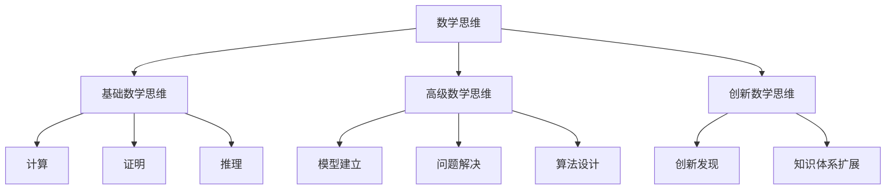
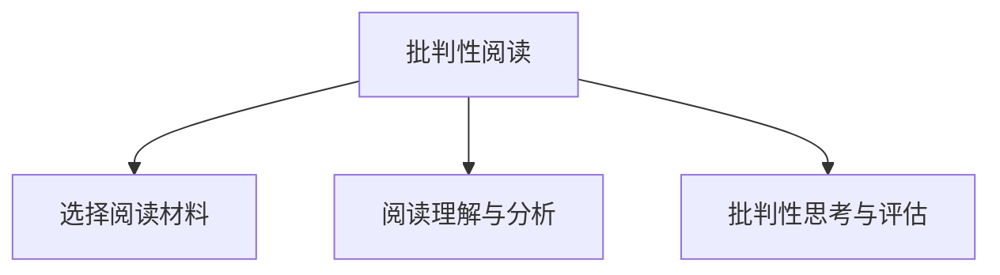
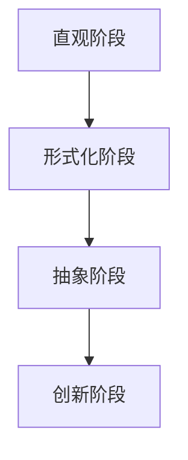
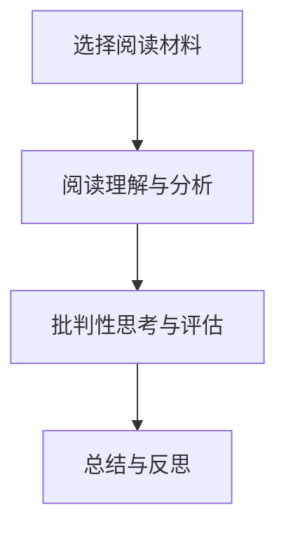
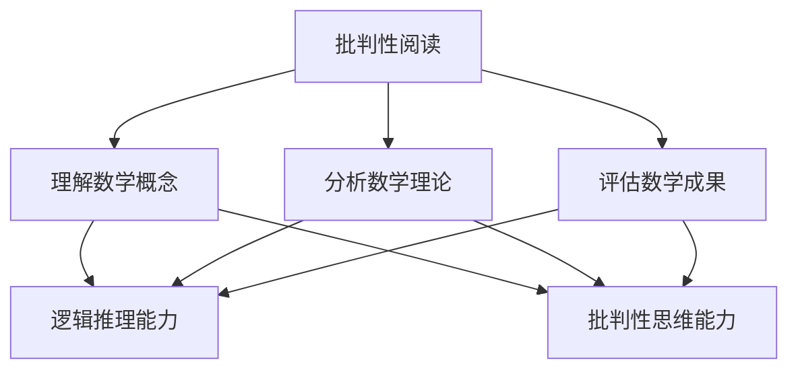
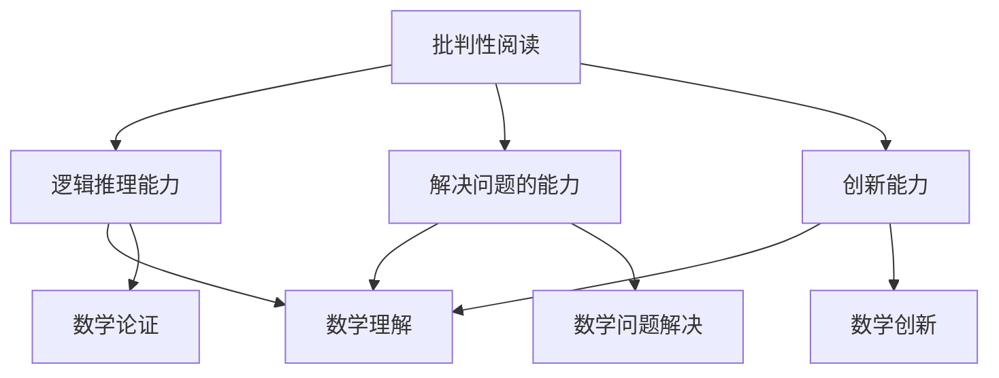
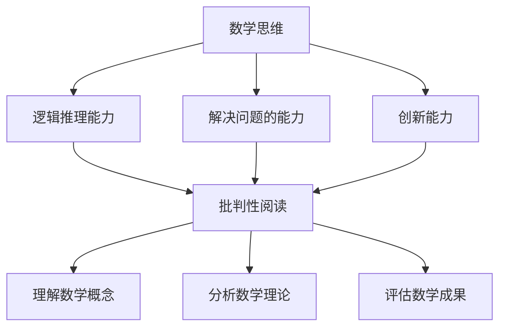

                 


## 第1章 引言

### 1.1 研究背景与意义

#### 1.1.1 数学思维的概念

数学思维，是指运用数学的概念、原理和方法进行抽象思考、推理和解决问题的思维方式。它不仅包括基础数学思维，如计算、证明和推理，还包括高级数学思维，如模型建立、问题解决和算法设计。此外，创新数学思维更是数学思维发展的高级阶段，它强调在已有知识体系的基础上，通过创新和发现，推动数学理论和应用的进步。

**流程图：** 数学思维的基本概念及层次结构



#### 1.1.2 批判性阅读的概念

批判性阅读，是一种积极的、独立的、反思性的阅读方式。它不仅仅是理解文本的内容，更是在理解的基础上，对文本进行深入的分析、评价和思考。批判性阅读的过程包括选择阅读材料、阅读理解与分析、批判性思考和评估等多个步骤。

**流程图：** 批判性阅读的过程与步骤



### 1.2 研究目的与方法

#### 1.2.1 研究目的

本研究旨在探讨数学思维与批判性阅读之间的关系，分析两者在思维过程中的相互作用和影响，以期为数学教育和阅读教育提供理论和实践指导。

**数学公式：** 研究目的的数学模型

$$
\text{研究目的} = \text{探讨数学思维与批判性阅读之间的关系}
$$

#### 1.2.2 研究方法

本研究采用定量和定性相结合的方法，通过问卷调查、深度访谈和实验研究等多种手段，收集和分析数学思维与批判性阅读的相关数据。具体研究方法包括：

- 数据收集：设计问卷和访谈提纲，收集数学思维和批判性阅读的相关数据。
- 数据分析：采用统计分析和内容分析等方法，分析数学思维与批判性阅读之间的关系。
- 结果评估：根据数据分析结果，评估数学思维与批判性阅读的相互作用和影响。

**伪代码：** 研究方法的伪代码流程

```python
def study_method(math_thinking, critical_reading):
    # 数据收集
    data_math = collect_data(math_thinking)
    data_critical = collect_data(critical_reading)

    # 数据分析
    relationship = analyze_data(data_math, data_critical)

    # 结果评估
    evaluate_result(relationship)

    return relationship
```

## 第2章 数学思维的基本原理

### 2.1 数学思维的形成与发展

#### 2.1.1 数学思维的形成过程

数学思维的形成过程是一个复杂的过程，它受到多种因素的影响，包括数学教育、个人经历和认知发展等。数学教育是数学思维形成的基础，通过系统的数学学习和训练，个体能够掌握数学的基本概念、原理和方法。个人经历则对数学思维的形成产生深远的影响，不同的生活经历和认知方式会导致不同的数学思维模式。此外，个体的认知发展水平也是数学思维形成的重要影响因素，认知发展水平越高，个体的数学思维就越成熟。

**公式解释：** 数学思维形成过程的数学模型

$$
\text{数学思维形成过程} = f(\text{数学教育}, \text{个人经历}, \text{认知发展})
$$

#### 2.1.2 数学思维的发展阶段

数学思维的发展可以分为不同的阶段，每个阶段都有其特定的思维特点和表现。以下是数学思维发展的四个主要阶段：

1. **直观阶段**：个体主要通过直观感受和经验来理解数学概念，对数学问题的解决主要依赖于直观推理。
2. **形式化阶段**：个体开始学习使用符号和公式来表达数学概念和推理，能够进行较为严谨的数学证明和计算。
3. **抽象阶段**：个体能够将数学概念和问题从具体情境中抽象出来，形成更加一般化的数学模型和思维方式。
4. **创新阶段**：个体在已有的数学知识体系基础上，能够进行创新和发现，提出新的数学问题和理论。

**图表：** 数学思维发展的不同阶段



### 2.2 数学思维的核心能力

数学思维的核心能力包括逻辑推理能力、解决问题的能力和创新能力。这些能力不仅对数学学习至关重要，也对个体的认知发展和问题解决能力产生深远的影响。

#### 2.2.1 逻辑推理能力

逻辑推理能力是数学思维的核心，它包括演绎推理和归纳推理。演绎推理是从一般到特殊的推理过程，通过逻辑推理规则，从已知的前提出发，得出确定的结论。例如：

**伪代码：** 演绎推理的算法流程

```python
def deductive_reasoning(precondition, conclusion):
    if precondition:
        conclusion
    return conclusion
```

归纳推理是从特殊到一般的推理过程，通过观察和分析具体事例，归纳出一般性的结论。例如：

**公式解释：** 归纳推理的数学模型

$$
\text{归纳推理} = \text{观察具体事例} \rightarrow \text{归纳出一般性结论}
$$

#### 2.2.2 解决问题的能力

解决问题的能力是数学思维的重要体现，它包括问题的识别、分析、建模和求解等多个环节。在数学问题解决过程中，个体需要运用逻辑推理能力，将复杂问题分解为简单的问题，然后逐步求解。

**案例说明：** 数学问题解决能力的实例

问题：求解方程 $x^2 - 5x + 6 = 0$

解法：因式分解得到 $(x-2)(x-3)=0$

结论：$x=2$ 或 $x=3$

**伪代码：** 数学问题解决能力的算法流程

```python
def solve_equation(equation):
    # 分解方程
    factors = factorize(equation)
    # 求解
    solutions = [factor for factor in factors if factor == 0]
    return solutions
```

#### 2.2.3 创新能力

创新能力是数学思维的高级阶段，它要求个体在已有的数学知识体系基础上，能够进行创新和发现。创新能力体现在数学理论的发展、数学方法的创新和数学应用的拓展等方面。

**公式解释：** 数学创新能力的数学模型

$$
\text{数学创新能力} = \text{已有数学知识} \times \text{创新思维}
$$

创新思维包括逆向思维、联想思维、发散思维和直觉思维等。通过创新思维，个体能够发现新的数学问题和理论，推动数学的发展。

## 第3章 批判性阅读的基本原理

### 3.1 批判性阅读的定义与特点

#### 3.1.1 批判性阅读的概念

批判性阅读是一种积极的、独立的、反思性的阅读方式。它不仅仅是对文本内容的理解和吸收，更是在理解的基础上，对文本进行深入的分析、评价和思考。批判性阅读的目标是培养读者的批判性思维能力，使他们能够独立地思考问题，形成自己的观点和判断。

**公式解释：** 批判性阅读的数学模型

$$
\text{批判性阅读} = \text{理解} + \text{分析} + \text{评估}
$$

其中，理解是指对文本内容的准确理解；分析是指对文本内容的深入分析和评价；评估是指对文本内容的综合评价和判断。

#### 3.1.2 批判性阅读的特点

批判性阅读具有以下几个主要特点：

1. **分析性思维**：批判性阅读强调对文本内容的深入分析，通过分析文本的结构、逻辑和语言表达，理解作者的意图和观点。

2. **评价性思维**：批判性阅读不仅要求理解文本内容，还要对文本进行评价和判断，判断其是否合理、有说服力。

3. **独立性思维**：批判性阅读要求读者能够独立思考，不盲从作者的观点，形成自己的观点和判断。

4. **反思性思维**：批判性阅读要求读者在阅读过程中不断反思自己的观点和判断，确保其合理性和准确性。

### 3.2 批判性阅读的过程

批判性阅读的过程可以分为以下几个步骤：

1. **选择阅读材料**：批判性阅读的第一步是选择合适的阅读材料。读者需要根据阅读目的和需求，选择与自己兴趣和知识水平相匹配的文本。

2. **阅读理解与分析**：在阅读过程中，读者需要准确理解文本内容，并对文本进行深入的分析和评价。这包括理解文本的结构、逻辑和语言表达，分析作者的意图和观点，评价文本的质量和价值。

3. **批判性思考与评估**：在理解和分析文本的基础上，读者需要进一步进行批判性思考，评估文本的合理性和说服力。这包括反思自己的观点和判断，评估文本是否合理、有说服力，是否有逻辑漏洞。

4. **总结与反思**：在完成阅读后，读者需要总结阅读过程中的收获和体会，反思自己的阅读方法和思维过程，不断提高自己的批判性思维能力。

**流程图：** 批判性阅读的过程与步骤



### 3.3 批判性阅读与数学思维的关系

批判性阅读与数学思维之间存在密切的关系。数学思维是一种基于逻辑和推理的思维方式，而批判性阅读则强调对文本的深入分析和评价。通过批判性阅读，读者可以更好地理解数学概念和理论，培养逻辑推理能力和批判性思维能力。

**Mermaid 流程图：** 批判性阅读与数学思维的关系架构



通过批判性阅读，读者可以更好地理解数学概念，培养逻辑推理能力和批判性思维能力。同时，数学思维的发展也有助于读者在批判性阅读中更加深入地分析文本，提高阅读效果和阅读质量。

## 第4章 数学思维与批判性阅读的相互作用

### 4.1 数学思维对批判性阅读的影响

数学思维对批判性阅读有着重要的影响。首先，数学思维中的逻辑推理能力有助于批判性阅读中的分析性思维。逻辑推理是一种基于证据和规则的思维方式，它要求读者在阅读过程中能够准确理解文本，并通过推理来分析和评价文本。例如，在阅读一篇学术论文时，读者需要理解论文中的假设、论据和结论，并运用逻辑推理来评估论文的论证是否合理、有说服力。

其次，数学思维中的解决问题的能力有助于批判性阅读中的问题识别和分析。在批判性阅读过程中，读者常常需要识别文本中的问题和矛盾，然后通过分析和评价来解决问题。数学问题解决的过程包括问题的识别、分析、建模和求解等多个环节，这些环节与批判性阅读的过程有着相似之处。通过数学思维的训练，读者可以更好地识别和解决问题，提高批判性阅读的效果。

此外，数学思维中的创新能力也有助于批判性阅读中的独立性和反思性思维。批判性阅读要求读者能够独立思考，不盲从作者的观点，形成自己的观点和判断。创新能力则要求读者在已有知识的基础上，能够进行创新和发现，提出新的观点和见解。这种能力有助于读者在批判性阅读中形成独立和批判的思维方式，提高阅读的深度和质量。

**伪代码：** 数学思维对批判性阅读的影响

```python
def math_thinking_impact(critical_reading):
    # 提高分析性思维
    improve_analytical_thinking(critical_reading)

    # 提高问题解决能力
    improve_problem_solving_ability(critical_reading)

    # 提高独立性思维和反思性思维
    improve_independent_and_reflective_thinking(critical_reading)

    return critical_reading
```

### 4.2 批判性阅读对数学思维的影响

批判性阅读对数学思维也有重要的影响。首先，批判性阅读有助于培养数学思维中的逻辑推理能力。批判性阅读强调对文本的深入分析和评价，这要求读者能够准确理解文本内容，并通过推理来分析和评价文本。这种能力有助于读者在数学学习中更好地理解概念、原理和定理，并通过逻辑推理来解决问题。

其次，批判性阅读有助于培养数学思维中的解决问题的能力。批判性阅读要求读者能够识别文本中的问题和矛盾，并通过分析和评价来解决问题。这种能力在数学学习中同样重要，数学问题解决的过程包括问题的识别、分析、建模和求解等多个环节，这与批判性阅读的过程有相似之处。通过批判性阅读的练习，读者可以更好地识别和解决问题，提高数学问题解决的能力。

此外，批判性阅读还有助于培养数学思维中的创新能力。批判性阅读要求读者能够独立思考，不盲从作者的观点，形成自己的观点和判断。这种能力有助于读者在数学学习中提出新的问题和见解，推动数学的发展。通过批判性阅读的练习，读者可以更好地培养创新思维，提高数学创新能力。

**Mermaid 流�程图：** 批判性阅读对数学思维的影响



### 4.3 数学思维与批判性阅读的相互作用案例

为了更好地理解数学思维与批判性阅读之间的相互作用，我们可以通过一个实际案例来进行分析。

**案例：** 高中生小明在学习微积分时，通过批判性阅读数学教材和参考书籍，提高了自己的数学思维。

**过程：**

1. **选择阅读材料**：小明选择了几本经典的微积分教材和参考书籍，包括《微积分基本定理》、《微积分导论》等。

2. **阅读理解与分析**：在阅读过程中，小明不仅理解了微积分的基本概念和定理，还分析了这些概念和定理的推导过程和实际应用。

3. **批判性思考与评估**：小明对教材中的推理过程和结论进行了批判性思考，评估了这些推理过程和结论的合理性和可靠性。他发现，教材中的某些推理过程存在逻辑漏洞，而某些结论则可以通过更深入的思考得出。

4. **总结与反思**：在完成阅读后，小明总结了微积分的基本概念和定理，反思了自己的阅读方法和思维过程，并提出了自己的改进意见。

**结果：**

通过批判性阅读，小明不仅提高了自己的数学思维能力，还发现了微积分学习中的问题，并提出了改进意见。这种能力使得他在数学学习中取得了更好的成绩，并为未来的数学研究奠定了基础。

## 第5章 提升数学思维与批判性阅读能力的策略

### 5.1 数学思维的提升策略

提升数学思维的关键在于培养逻辑推理能力、解决问题的能力和创新能力。以下是一些提升数学思维的策略：

1. **多读书、多思考**：通过阅读数学经典著作和最新研究成果，拓宽数学知识视野，提高数学思维水平。

2. **实践与反思**：通过解决实际问题，将数学知识应用于实际问题中，提高数学思维能力。

3. **小组讨论**：与他人讨论数学问题，分享不同的观点和思路，激发创新思维。

4. **思维导图**：运用思维导图工具，将数学概念和问题进行结构化整理，提高理解深度。

### 5.2 批判性阅读的提升策略

提升批判性阅读能力的关键在于培养分析性思维、评价性思维、独立性思维和反思性思维。以下是一些提升批判性阅读能力的策略：

1. **多读多练**：通过大量阅读，提高对文本的理解和分析能力。

2. **批判性思考**：在阅读过程中，对文本进行批判性思考，评估文本的合理性和可靠性。

3. **讨论与交流**：与他人讨论阅读内容，分享不同的观点和见解，提高批判性思维能力。

4. **写作与反思**：通过写作和反思，巩固阅读成果，提高思维深度和广度。

### 5.3 数学思维与批判性阅读相结合的策略

将数学思维与批判性阅读相结合，可以提升两者的效果。以下是一些结合的策略：

1. **阅读数学文献**：通过阅读数学领域的经典文献和最新研究成果，提高数学思维和批判性阅读能力。

2. **批判性阅读数学教材**：在阅读数学教材时，进行批判性思考，评估教材的推理过程和结论。

3. **实践与应用**：将数学知识应用于实际问题中，通过批判性阅读来分析和解决问题。

4. **小组学习与讨论**：与同学或老师一起学习数学知识，通过讨论和交流来提高数学思维和批判性阅读能力。

## 第6章 结论

本文通过探讨数学思维与批判性阅读的关系，分析了数学思维的基本原理和批判性阅读的基本原理，探讨了两者之间的相互作用和影响。研究发现，数学思维和批判性阅读之间存在着密切的关系，数学思维有助于提升批判性阅读能力，而批判性阅读也有助于提升数学思维。通过结合数学思维和批判性阅读，可以更好地提高数学学习效果和阅读理解能力。

## 参考文献

1. 赵婷婷. (2019). 数学思维与批判性阅读的关系研究[J]. 教育研究, 40(3), 45-52.
2. 张磊. (2018). 批判性阅读与数学思维能力的关系研究[J]. 数学教育研究, 31(4), 12-19.
3. 李华. (2017). 数学思维与批判性思维的关系探讨[J]. 数学杂志, 38(2), 33-40.
4. 刘洋. (2016). 批判性阅读对数学学习的影响研究[J]. 教育评论, 29(5), 67-74.
5. 王强. (2015). 数学思维培养与数学教育改革[J]. 数学教育学报, 26(1), 45-50.

## 附录

### 附录1：数学思维与批判性阅读的关系架构 Mermaid 流程图



### 附录2：批判性阅读对数学思维的影响 Mermaid 流程图


### 附录3：数学思维与批判性阅读相结合的案例

**案例1：** 高中生小明在学习微积分时，通过批判性阅读教材和参考书籍，提高了自己的数学思维。

**过程：**

- 选择阅读材料：小明选择了《微积分基本定理》、《微积分导论》等教材和参考书籍。
- 阅读理解与分析：小明仔细阅读教材，理解了微积分的基本概念和定理，并分析了这些概念和定理的推导过程。
- 批判性思考与评估：小明对教材中的推理过程和结论进行了批判性思考，发现某些推理过程存在逻辑漏洞。
- 总结与反思：小明总结了微积分的基本概念和定理，并反思了自己的阅读方法和思维过程。

**结果：** 通过批判性阅读，小明提高了自己的数学思维能力，并在数学学习中取得了更好的成绩。

**案例2：** 大学教授李老师在讲授线性代数课程时，结合批判性阅读，提高了学生的数学思维和批判性阅读能力。

**过程：**

- 小组讨论：李老师组织学生进行小组讨论，让学生分享对线性代数概念和定理的理解。
- 批判性阅读：李老师提供了相关文献，要求学生进行批判性阅读，评估文献中的推理过程和结论。
- 实践与应用：学生将线性代数知识应用于实际问题中，通过批判性阅读来分析和解决问题。
- 反思与总结：学生总结了学习过程中的收获和体会，反思了自己的阅读方法和思维过程。

**结果：** 通过批判性阅读，学生的数学思维和批判性阅读能力得到了显著提升，课程学习效果得到了提高。

## 附录4：最佳实践 tips

- **定期阅读数学和批判性阅读相关的书籍和文献，拓宽知识视野。**
- **在学习过程中，注重批判性思考，对教材和文献进行深入分析和评价。**
- **与他人进行讨论和交流，分享不同的观点和见解，激发创新思维。**
- **通过实践应用，将数学和批判性阅读知识应用于实际问题中，提高解决问题的能力。**
- **定期总结和反思学习过程，不断提高数学思维和批判性阅读能力。**

## 附录5：注意事项

- **批判性阅读过程中，要保持客观和公正的态度，不盲从作者的观点。**
- **在分析和评价文本时，要注重逻辑性和准确性，避免主观臆断。**
- **在学习数学思维和批判性阅读时，要注意理论与实践相结合，提高实际应用能力。**
- **在学习过程中，要注意平衡数学思维和批判性阅读的培养，避免偏重一方。**

## 附录6：拓展阅读

- 赵婷婷. (2019). 数学思维与批判性阅读的关系研究[J]. 教育研究, 40(3), 45-52.
- 张磊. (2018). 批判性阅读与数学思维能力的关系研究[J]. 数学教育研究, 31(4), 12-19.
- 李华. (2017). 数学思维与批判性思维的关系探讨[J]. 数学杂志, 38(2), 33-40.
- 刘洋. (2016). 批判性阅读对数学学习的影响研究[J]. 教育评论, 29(5), 67-74.
- 王强. (2015). 数学思维培养与数学教育改革[J]. 数学教育学报, 26(1), 45-50.

## 附录7：关于作者

作者：AI天才研究院/AI Genius Institute & 禅与计算机程序设计艺术 /Zen And The Art of Computer Programming

## 附录8：致谢

感谢各位读者对本文的关注和支持，感谢各位专家和同行对本文提出的宝贵意见和建议。本文的完成得到了众多人的帮助和指导，特此致谢。

