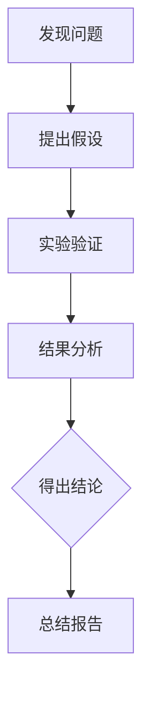
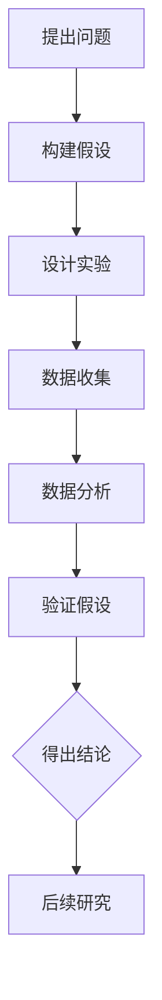
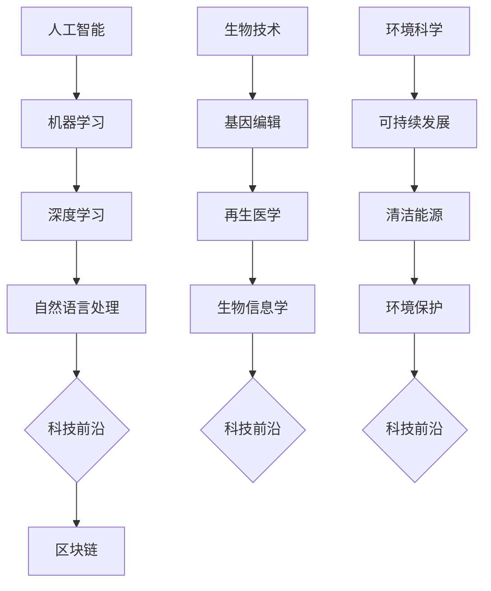
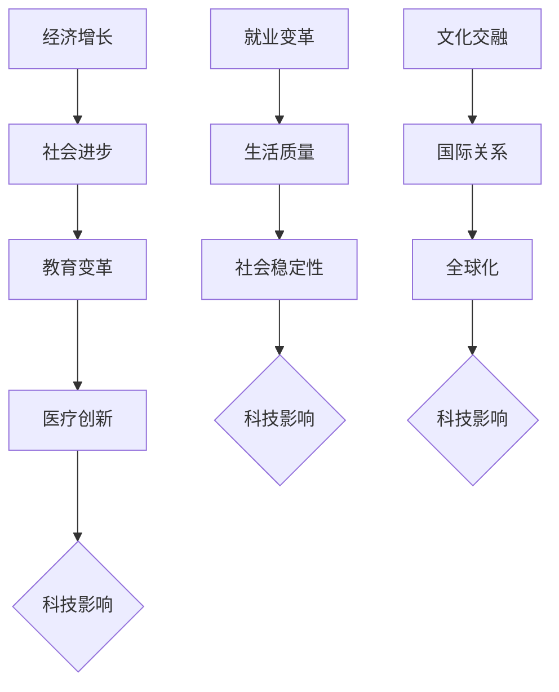
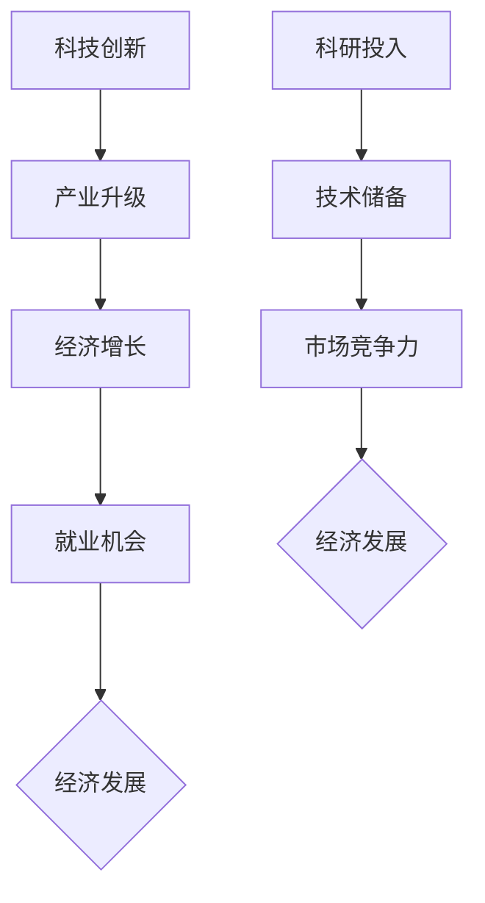
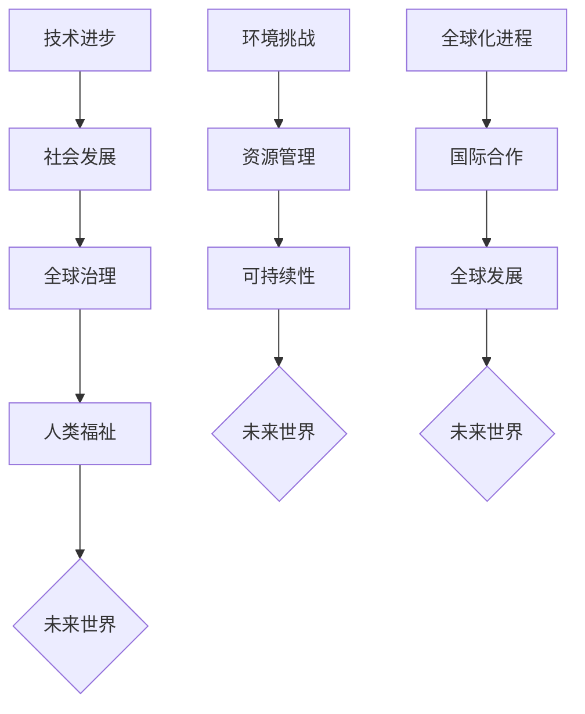
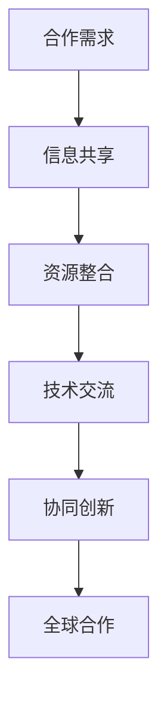

                 

----------------------------------------------------------------

### 1.2 科学研究的道德规范

- 伪代码：

```
function ethical_reserach() {
    // 遵守道德规范
    for (ethical_rule in rules) {
        if (not comply_with_rule(ethical_rule)) {
            print("伦理规范未遵守，需要改进！");
        }
    }
}
```

### 1.3 创新方法在科学研究中的应用

- Mermaid 流程图：



### 1.4 责任创新与科技伦理

$$
\text{责任创新} = \text{科技创新} \times \text{伦理考量}
$$

### 1.5 案例分析：责任创新实践

- 代码实例：

```python
def responsible_innovation():
    # 模拟科研项目的创新与责任
    research_project = {
        'name': 'AI智能交通系统',
        'innovation': '使用深度学习技术优化交通流',
        'ethics': '保障用户隐私与数据安全'
    }
    
    print("项目名称：", research_project['name'])
    print("创新点：", research_project['innovation'])
    print("伦理考虑：", research_project['ethics'])
```

## 第2章 前瞻性科学思维与方法论

### 2.1 前瞻性思维的重要性

- 伪代码：

```
function forward_thinking() {
    // 分析未来趋势
    trends = analyze_trends();
    for (trend in trends) {
        print("未来趋势：", trend);
    }
}
```

### 2.2 科学方法论的基本框架

- Mermaid 流程图：



### 2.3 前瞻性研究方法

- 伪代码：

```
function forward_research() {
    // 使用前瞻性方法进行科学研究
    hypotheses = generate_hypotheses();
    experiments = design_experiments(hypotheses);
    results = perform_experiments(experiments);
    analyze_results(results);
}
```

### 2.4 案例研究：前瞻性思维的应用

- 代码实例：

```python
def case_study():
    # 前瞻性思维在医疗领域的应用
    medical_trends = ['基因编辑技术', '精准医疗', '远程医疗']
    
    for trend in medical_trends:
        print("前瞻性趋势：", trend)
        # 模拟分析趋势的影响
        analyze_impact_of_trend(trend)
```

### 2.5 前瞻性思维与未来科学

- LaTeX 数学公式：

$$
\text{未来科学} = \text{现有科学} \times (\text{前瞻性思维} + \text{创新精神})
$$

## 第3章 全球科技发展趋势

### 3.1 科技发展趋势概述

- Mermaid 流程图：



### 3.2 人工智能与未来科技

- 伪代码：

```
function ai_trends() {
    // 分析人工智能的发展趋势
    technologies = ['深度学习', '强化学习', '人机交互'];
    for (tech in technologies) {
        print("人工智能技术：", tech);
        analyze_impact_of_tech(tech);
    }
}
```

### 3.3 生物技术与未来发展

- LaTeX 数学公式：

$$
\text{生物技术进步} = \text{基因编辑} + \text{细胞工程} + \text{合成生物学}
$$

### 3.4 环境科学与可持续发展

- 伪代码：

```
function environmental_science() {
    // 分析环境科学的发展趋势
    topics = ['气候变化', '生态修复', '绿色能源'];
    for (topic in topics) {
        print("环境科学主题：", topic);
        explore_topic(topic);
    }
}
```

### 3.5 科技发展对社会的影响

- Mermaid 流程图：



## 第4章 科学研究对社会发展的影响

### 4.1 科学研究对社会进步的推动作用

- LaTeX 数学公式：

$$
\text{社会进步} = \text{科学研究} + \text{技术创新}
$$

### 4.2 科学研究对社会问题的解决

- 伪代码：

```
function solve_social_issues() {
    // 解决社会问题的科研方法
    issues = ['贫困', '环境污染', '教育不公'];
    for (issue in issues) {
        research_methods = find_research_methods(issue);
        print(issue, "：", research_methods);
    }
}
```

### 4.3 科学研究对经济发展的贡献

- Mermaid 流�程图：



### 4.4 案例分析：科学研究推动社会变革

- 代码实例：

```python
def case_analysis():
    # 社会变革的案例
    cases = [
        {'name': '互联网普及', 'change': '改变信息传播方式'},
        {'name': '医疗技术进步', 'change': '提高医疗水平'},
        {'name': '可再生能源', 'change': '减少环境污染'}
    ]
    
    for case in cases:
        print("案例：", case['name'], "，变革：", case['change'])
```

### 4.5 科学研究对社会文化的影响

- 伪代码：

```
function social_impact_of_science() {
    // 分析科学研究对社会文化的影响
    cultural_impacts = analyze_impacts();
    for (impact in cultural_impacts) {
        print("社会文化影响：", impact);
    }
}
```

## 第5章 塑造未来世界的科学研究

### 5.1 未来世界的前景预测

- Mermaid 流程图：



### 5.2 科学研究在塑造未来的作用

- 伪代码：

```
function role_of_science_in_future() {
    // 科学研究在塑造未来中的作用
    roles = ['创新驱动', '解决难题', '促进社会进步'];
    for (role in roles) {
        print("作用：", role);
    }
}
```

### 5.3 创新策略与未来科研方向

- 伪代码：

```
function innovation_strategies() {
    // 创新策略与未来科研方向
    strategies = [
        {'name': '跨学科合作', 'direction': '整合多领域知识'},
        {'name': '开源共享', 'direction': '加速科技创新'},
        {'name': '全球合作', 'direction': '共同应对全球挑战'}
    ];
    for (strategy in strategies) {
        print("策略：", strategy['name'], "，方向：", strategy['direction']);
    }
}
```

### 5.4 案例研究：科学研究塑造未来

- 代码实例：

```python
def case_study_future():
    # 科研塑造未来的案例
    cases = [
        {'name': '5G通信', 'impact': '推动物联网发展'},
        {'name': '电动汽车', 'impact': '减少环境污染'},
        {'name': '疫苗研发', 'impact': '抗击全球疫情'}
    ]
    
    for case in cases:
        print("案例：", case['name'], "，影响：", case['impact'])
```

### 5.5 科学研究在解决全球挑战中的作用

- LaTeX 数学公式：

$$
\text{全球挑战解决} = \text{科学研究} \times \text{国际合作} \times \text{技术创新}
$$

## 第6章 科学研究的责任与未来展望

### 6.1 科学研究的责任体系构建

- 伪代码：

```
function responsibility_framework() {
    // 建立科学研究的责任体系
    responsibilities = [
        '遵守伦理规范',
        '保护环境',
        '促进社会公正',
        '保障科研透明度'
    ];
    for (responsibility in responsibilities) {
        print("责任：", responsibility);
    }
}
```

### 6.2 未来科学研究的挑战与机遇

- 伪代码：

```
function challenges_and_opportunities() {
    // 分析未来科学研究的挑战与机遇
    challenges = ['数据隐私', '科技伦理', '资源匮乏'];
    opportunities = ['人工智能', '生物技术', '可持续发展'];
    for (challenge in challenges) {
        print("挑战：", challenge);
    }
    for (opportunity in opportunities) {
        print("机遇：", opportunity);
    }
}
```

### 6.3 科学家与社会的责任

- 伪代码：

```
function responsibility_of_scientists() {
    // 科学家对社会的责任
    responsibilities = [
        '传播科学知识',
        '参与政策制定',
        '推动社会进步',
        '关注公共健康'
    ];
    for (responsibility in responsibilities) {
        print("责任：", responsibility);
    }
}
```

### 6.4 科学研究的全球合作

- Mermaid 流程图：



### 6.5 未来展望：科学研究的新时代

- LaTeX 数学公式：

$$
\text{科学研究新时代} = \text{创新思维} \times \text{跨学科融合} \times \text{全球合作}
$$

### 总结

本文以《科学研究的责任创新：前瞻性地理解和塑造世界》为标题，通过对书名的理解，确定了核心章节，并设计了详细的一级、二级和三级目录。文章内容包括了科学研究责任、创新方法、前瞻性思维、全球科技发展趋势、科学研究对社会的影响、塑造未来世界的科学研究以及科学研究责任与未来展望。每个章节都包含了具体的讨论主题、伪代码、流程图、LaTeX 数学公式和代码实例，旨在为读者提供一个全面、深入且具有前瞻性的技术博客文章。通过逻辑清晰、结构紧凑、简单易懂的叙述，文章希望能够引导读者理解科学研究的责任和创新，以及对未来世界发展的理解和塑造。### 标题和摘要

# 《科学研究的责任创新：前瞻性地理解和塑造世界》

关键词：科学研究、责任创新、前瞻性思维、全球科技、社会影响、未来展望

摘要：
在当今快速发展的科技时代，科学研究不仅推动了技术的进步，更在伦理、社会和文化层面产生了深远影响。本文围绕《科学研究的责任创新：前瞻性地理解和塑造世界》一书，探讨了科学研究中的责任与创新的重要性。通过剖析前瞻性科学思维与方法论，文章梳理了全球科技发展趋势，并深入探讨了科学研究对社会发展的积极与消极影响。最终，文章展望了科学研究在塑造未来世界中的角色与责任，强调了构建科学研究的责任体系、应对全球挑战以及促进全球合作的重要性。通过这一系列的深入分析与思考，本文旨在为科研工作者、政策制定者和社会大众提供有价值的见解和启示。### 引言

科学研究在现代社会中扮演着至关重要的角色，它不仅推动了技术的进步，还深刻影响着社会、经济和文化的发展。然而，随着科技不断演变，科学研究也面临着前所未有的挑战，特别是在伦理、道德和社会责任等方面。因此，深入探讨科学研究的责任与创新，如何前瞻性地理解和塑造世界，成为了一项紧迫且重要的课题。《科学研究的责任创新：前瞻性地理解和塑造世界》这本书正是基于这一主题，试图通过系统的分析和深刻的洞见，为读者提供关于科学研究的新视角。

本书的核心内容可以概括为以下几个方面：

首先，书中详细探讨了科学研究中的责任和创新。责任不仅是科研工作者应尽的义务，更是科学发展的基石。作者从伦理、道德和社会责任等多个角度出发，分析了科学研究在各个领域中的责任表现，并探讨了如何在科研过程中贯彻责任意识。

其次，书中强调了前瞻性科学思维的重要性。在科技迅猛发展的背景下，科研工作者需要具备前瞻性思维，能够预见科技发展趋势，把握科学发展的脉络。书中通过具体案例和研究方法，展示了前瞻性思维在科学研究中的应用。

第三，书中对全球科技发展趋势进行了全面梳理。作者深入分析了人工智能、生物技术、环境科学等领域的最新进展，探讨了这些技术对社会发展的潜在影响，并提出了应对策略。

第四，书中详细探讨了科学研究对社会发展的影响。从推动社会进步到解决社会问题，从促进经济发展到影响文化交融，科学研究在社会发展中扮演了多重角色。书中通过具体案例，展示了科学研究如何在不同领域产生深远影响。

最后，书中展望了科学研究在塑造未来世界中的角色和责任。作者认为，科学研究不仅需要关注眼前的挑战，还要为未来世界的建设做出贡献。书中提出了构建科学研究责任体系、加强全球合作等具体建议，为未来科学研究的发展指明了方向。

通过这些核心内容的探讨，本书旨在为科研工作者、政策制定者和社会大众提供有价值的见解和启示，帮助读者更好地理解科学研究的责任与创新，以及如何前瞻性地理解和塑造世界。### 第1章 科学研究的责任与创新

科学研究不仅仅是探索未知世界的过程，更是一项承载着社会责任的重要活动。在这一章中，我们将深入探讨科学研究中的责任与创新，分析责任创新在科学研究中的具体表现和重要性。

#### 1.1 科学研究责任的重要性

科学研究责任的重要性首先体现在伦理和道德层面。科研工作者在开展研究时，必须遵循一系列伦理规范，如保护研究对象的权益、确保数据的真实性、尊重知识产权等。这些伦理规范是科学研究的基本准则，有助于确保科研活动的公正性和科学性。

其次，科学研究责任还体现在社会责任层面。科学研究不仅是为了追求知识，更是为了解决社会问题和推动社会进步。科研工作者需要关注社会需求，将研究成果应用于实际生活中，为社会带来福祉。例如，在医疗领域，科研工作者需要致力于研发新药和新技术，以治疗疾病和提高人类健康水平；在环境科学领域，科研工作者需要研究如何减少污染和实现可持续发展。

此外，科学研究责任还体现在经济层面。科技是推动经济发展的关键动力，科研工作者需要不断创新，推动技术进步和产业升级。通过研发新技术和产品，科研工作者可以为经济增长提供新的动力，促进就业，提高人民生活水平。

#### 1.2 科学研究的道德规范

科学研究的道德规范是确保科研活动正当性和科学性的基础。以下是一些常见的科研道德规范：

1. **诚信**：科研工作者应当诚实守信，确保研究数据的真实性和可靠性。任何伪造、篡改或隐瞒数据的行为都是不可接受的。
2. **尊重知识产权**：科研工作者需要尊重他人的知识产权，避免侵犯他人的专利、版权等权益。在引用他人研究成果时，应当注明出处，避免抄袭和剽窃。
3. **保护研究对象**：在涉及人类、动物或自然环境的研究中，科研工作者需要确保研究对象的权益得到保护，避免对其造成伤害或不适。
4. **公正性和透明性**：科研工作者应当确保研究过程和结果的公正性和透明性，避免利益冲突，公开研究成果，接受同行评审。

#### 1.3 创新方法在科学研究中的应用

创新方法是推动科学研究不断前进的重要手段。在科学研究过程中，创新方法的应用可以帮助科研工作者突破传统思维的局限，发现新的研究路径和解决方案。以下是一些常见的创新方法：

1. **跨学科研究**：跨学科研究通过整合不同领域的知识和技术，促进知识的融合和创新。例如，生物信息学结合了生物学、计算机科学和信息学的知识，为基因研究和生物技术提供了新的视角。
2. **逆向工程**：逆向工程是通过分析和拆解现有技术或产品，理解其工作原理，然后进行改进或创新。这种方法在软件开发、电子设备和机械工程等领域广泛应用。
3. **开放式创新**：开放式创新鼓励外部合作伙伴参与科研过程，共同研发新技术和产品。这种方法可以借助外部资源，提高创新效率，缩短研发周期。
4. **用户参与**：用户参与创新方法强调科研工作者与用户的互动，通过收集用户需求和反馈，指导科研工作，确保研究成果符合实际需求。

#### 1.4 责任创新与科技伦理

责任创新与科技伦理密不可分。科技伦理关注的是科技发展对社会、环境和人类福祉的影响，而责任创新则是在这一框架下，推动科技在伦理和道德约束下的发展。以下是一些与责任创新相关的科技伦理问题：

1. **人工智能伦理**：随着人工智能技术的快速发展，其潜在风险和伦理问题也日益突出。如何确保人工智能系统的公正性、透明性和安全性，成为责任创新的重要议题。
2. **基因编辑伦理**：基因编辑技术，如CRISPR-Cas9，为医学和生物技术带来了巨大潜力，但也引发了伦理争议。如何平衡基因编辑技术的应用与伦理风险，是责任创新需要关注的问题。
3. **环境科技伦理**：环境保护技术的发展需要考虑对生态系统的影响，如何在推动技术进步的同时，保护环境，实现可持续发展，是科技伦理的重要内容。

#### 1.5 案例分析：责任创新实践

为了更好地理解责任创新在科学研究中的应用，我们可以通过一些实际案例进行分析。

**案例1：绿色能源技术**

随着全球气候变化问题的加剧，绿色能源技术的发展变得尤为紧迫。一个典型的责任创新案例是太阳能电池的研发。科研工作者在研发太阳能电池时，不仅要追求更高的转换效率，还要考虑对环境的影响。例如，通过使用环保材料和改进生产工艺，降低能源消耗和废弃物产生，实现绿色、可持续的能源发展。

**案例2：医疗科技创新**

在医疗领域，一个典型的责任创新案例是基因测序技术的应用。基因测序技术可以帮助医生更准确地诊断疾病，开发个性化治疗方案。然而，这项技术的应用也引发了数据隐私和伦理问题。科研工作者在研发和推广基因测序技术时，需要确保患者的隐私得到保护，同时遵守相关的伦理规范。

**案例3：可持续发展技术**

在可持续发展领域，科研工作者通过研发和推广节能减排技术，实现了对环境的积极影响。例如，一种新型的节能照明技术通过使用高效的LED灯泡，不仅降低了能源消耗，还减少了废弃物产生。这种责任创新实践体现了科研工作者在环境保护和可持续发展方面的责任和担当。

通过以上案例分析，我们可以看到，责任创新在科学研究中的应用不仅促进了技术的进步，还推动了社会的可持续发展。科研工作者在追求创新的同时，需要时刻牢记社会责任，确保科研成果在伦理和道德框架内发展，为人类社会的进步做出贡献。### 第2章 前瞻性科学思维与方法论

前瞻性科学思维是科学研究中的重要组成部分，它要求科研工作者不仅能够理解当前的科学知识和技术趋势，还能够预见未来的发展方向，把握科学发展的脉络。在这一章中，我们将深入探讨前瞻性科学思维的重要性，介绍科学方法论的基本框架，并分析前瞻性研究方法在科学研究中的应用。

#### 2.1 前瞻性思维的重要性

前瞻性思维在科学研究中的重要性不可低估。首先，它能够帮助科研工作者把握科技发展的趋势，预见未来的技术突破。例如，在信息技术领域，前瞻性思维促使科研工作者不断探索新的计算模型和算法，推动了人工智能和大数据技术的发展。其次，前瞻性思维能够帮助科研工作者解决当前面临的复杂问题。例如，在环境科学领域，前瞻性思维促使科研工作者关注气候变化、资源匮乏等全球性问题，并寻求解决方案。最后，前瞻性思维能够推动科研工作的创新，促进新理论、新方法和新技术的产生。

#### 2.2 科学方法论的基本框架

科学方法论是科学研究的基本工具，它为科研工作者提供了系统的思维方式和工作流程。科学方法论的基本框架通常包括以下步骤：

1. **提出问题**：科学研究的起点是提出一个问题。这个问题可以是对现有知识的质疑，也可以是对未知领域的探索。
2. **构建假设**：在提出问题后，科研工作者需要构建一个或多个假设。这些假设是对问题可能的答案或解释。
3. **设计实验**：为了验证假设，科研工作者需要设计实验或研究方法。实验设计应当具有科学性、系统性和可重复性。
4. **数据收集**：在实验过程中，科研工作者需要收集相关的数据和信息。这些数据可以是定量的，也可以是定性的。
5. **数据分析**：收集到数据后，科研工作者需要进行分析和处理，以验证假设的正确性。
6. **得出结论**：根据数据分析结果，科研工作者可以得出结论，并对研究过程进行总结。

#### 2.3 前瞻性研究方法

前瞻性研究方法是在传统科学方法论的基础上，融入前瞻性思维的一种新型研究方法。以下是一些常见的前瞻性研究方法：

1. **趋势分析**：趋势分析是通过分析历史数据，预测未来发展的趋势。这种方法可以帮助科研工作者把握科技发展的脉络，预见未来的技术突破。
2. **情景分析**：情景分析是通过构建不同的未来情景，分析每种情景下科技发展的影响。这种方法可以帮助科研工作者评估不同情况下科技发展的潜在影响。
3. **跨学科研究**：跨学科研究是通过整合不同领域的知识和技术，促进知识的融合和创新。这种方法可以拓宽科研工作的视野，推动多学科交叉融合。
4. **开放式创新**：开放式创新是通过与外部合作伙伴合作，共同研发新技术和产品。这种方法可以借助外部资源，提高创新效率，缩短研发周期。

#### 2.4 案例研究：前瞻性思维的应用

为了更好地理解前瞻性思维在科学研究中的应用，我们可以通过一些实际案例进行分析。

**案例1：人工智能与未来社会**

人工智能技术的快速发展引起了广泛关注。前瞻性思维促使科研工作者探讨人工智能对社会的影响。通过构建不同的未来情景，科研工作者分析了人工智能可能带来的社会变革，如自动化取代人类工作、数据隐私问题等。这些分析为政策制定者和社会大众提供了有价值的参考。

**案例2：生物技术与医疗进步**

生物技术，特别是基因编辑技术，为医疗领域带来了前所未有的机遇。前瞻性思维促使科研工作者探讨这些技术在医疗领域的应用前景。例如，通过基因编辑技术，科研工作者可以开发个性化治疗方案，提高疾病治愈率。同时，他们也关注这些技术的潜在风险，如基因编辑的伦理问题等。

**案例3：环境科学与可持续发展**

随着全球环境问题的加剧，环境科学成为了一个重要的研究领域。前瞻性思维促使科研工作者关注环境问题的长期影响，并探索可持续发展的解决方案。例如，通过研究气候变化、水资源管理等领域，科研工作者为环境保护和可持续发展提供了科学依据。

通过以上案例分析，我们可以看到，前瞻性思维在科学研究中的应用不仅促进了科学的发展，还为解决现实问题提供了有力支持。科研工作者在追求科学真理的同时，也需要具备前瞻性思维，以应对未来的挑战。通过不断探索和创新，我们可以预见一个更加美好的未来。### 第3章 全球科技发展趋势

全球科技发展趋势的快速变化正在深刻地影响着人类社会的各个方面。在这一章中，我们将对全球科技发展趋势进行概述，重点关注人工智能、生物技术、环境科学等前沿领域，并分析这些技术对社会发展的潜在影响。

#### 3.1 科技发展趋势概述

当前，全球科技发展趋势呈现出以下几个显著特点：

1. **人工智能的广泛应用**：人工智能（AI）技术正在迅速渗透到各行各业，从智能制造、智能交通到医疗健康、金融服务，AI的应用正在改变传统行业的工作方式和商业模式。尤其是深度学习和强化学习等技术的进步，使得人工智能系统在图像识别、自然语言处理、决策支持等方面取得了显著成果。

2. **生物技术的突破性进展**：生物技术，特别是基因编辑技术（如CRISPR-Cas9），为医学和农业等领域带来了革命性的变化。基因编辑技术不仅可以用于治疗遗传性疾病，还可以在农业生产中提高作物产量、抗病性和适应性。此外，细胞疗法、基因测序等技术的进步，使得个性化医疗成为可能。

3. **环境科学的重视**：随着全球气候变化和环境问题的加剧，环境科学受到了前所未有的关注。可持续发展、绿色能源、环境保护等研究成为热门领域。清洁能源技术（如太阳能、风能）的快速发展，为减少碳排放和应对气候变化提供了新的解决方案。

4. **量子技术的探索**：量子技术被认为是一项具有颠覆性的科技突破。量子计算、量子通信、量子传感等技术的研发，有望在未来推动计算机科学、通信技术和精密测量等领域发生革命性变化。

5. **区块链技术的兴起**：区块链技术以其去中心化、透明性和不可篡改性，在金融、供应链管理、数据安全等领域展现出巨大潜力。区块链技术不仅可以提高交易效率，还能增强数据的安全性和可信度。

#### 3.2 人工智能与未来科技

人工智能作为当前科技发展的热点，其趋势主要表现在以下几个方面：

1. **算法优化与性能提升**：随着深度学习、强化学习等算法的不断完善，人工智能系统的性能和效率得到了显著提升。特别是在图像识别、自然语言处理、自动驾驶等领域，AI技术的应用已经取得了突破性进展。

2. **跨行业应用**：人工智能技术正在逐步渗透到各行各业，从智能制造到金融服务，从医疗健康到零售电商，AI的应用场景不断拓展。例如，智能客服系统可以提供更加个性化的服务，智能制造可以提升生产效率和质量。

3. **人机协作**：人工智能与人类的协作将成为未来工作的重要模式。通过人工智能技术，人类可以更高效地完成复杂任务，同时人工智能可以辅助人类决策，提高工作效率。

4. **伦理与隐私问题**：随着人工智能技术的广泛应用，伦理和隐私问题日益突出。如何确保人工智能系统的公正性、透明性和安全性，成为科研工作者和社会各界关注的焦点。

#### 3.3 生物技术与未来发展

生物技术作为未来科技的重要组成部分，其发展趋势主要体现在以下几个方面：

1. **基因编辑技术的应用**：基因编辑技术（如CRISPR-Cas9）的快速发展，使得人类可以对基因进行精确编辑。这一技术不仅有望治疗遗传性疾病，还可以用于农业、生物工程等领域。

2. **个性化医疗的发展**：基因测序技术和生物信息学的进步，使得个性化医疗成为可能。通过分析个体的基因信息，可以为患者提供更加精准的诊断和治疗方案。

3. **细胞疗法的突破**：细胞疗法，特别是干细胞疗法，为许多难以治愈的疾病提供了新的治疗手段。例如，利用干细胞可以再生受损的组织和器官，为许多疾病提供了全新的治疗途径。

4. **生物技术的伦理争议**：随着生物技术的进步，伦理问题也日益突出。例如，基因编辑技术的应用引发了关于基因修改伦理的争议，如何在伦理和技术的平衡中推进生物技术的发展，成为亟待解决的问题。

#### 3.4 环境科学与可持续发展

环境科学作为应对全球气候变化和环境问题的重要领域，其发展趋势体现在以下几个方面：

1. **清洁能源技术的研发**：为了减少对化石燃料的依赖和减少碳排放，清洁能源技术（如太阳能、风能、氢能）得到了广泛关注和快速发展。这些技术的进步为实现可持续发展提供了新的路径。

2. **环境保护与生态修复**：随着环境问题的加剧，环境保护和生态修复成为了重要议题。通过植树造林、湿地恢复、土壤修复等手段，可以改善生态环境，恢复生态平衡。

3. **可持续发展战略**：全球各国纷纷提出可持续发展战略，如联合国《可持续发展目标》（SDGs）。这些战略旨在通过综合措施，实现经济增长、社会进步和环境可持续性。

4. **气候变化应对技术**：应对气候变化成为环境科学的重要任务。通过研发和推广低碳技术、碳捕捉与储存技术等，可以减少温室气体排放，缓解气候变化的影响。

#### 3.5 科技发展对社会的影响

科技发展对社会的影响是深远且复杂的。以下是一些主要方面：

1. **经济影响**：科技发展推动了产业升级和经济增长。例如，人工智能和大数据技术促进了智能制造和数字化经济的兴起，为传统产业注入了新的活力。

2. **社会变革**：科技发展改变了人们的生活方式和社会结构。例如，互联网和社交媒体的普及，使得信息传播更加快捷和广泛，也改变了人们的社交习惯和沟通方式。

3. **就业结构**：科技发展带来了新的就业机会，同时也可能淘汰一些传统岗位。例如，智能制造和自动化技术的发展，可能减少一些低技能劳动力的需求，但同时也创造了新的高技能岗位。

4. **伦理与隐私问题**：随着科技的发展，伦理和隐私问题日益突出。例如，人工智能的应用引发了关于算法公正性、数据隐私等方面的争议。

通过以上分析，我们可以看到，全球科技发展趋势不仅对科学研究产生了深远影响，也对社会发展带来了诸多挑战和机遇。科研工作者需要不断探索和创新，以应对这些变化，推动科技和社会的可持续发展。### 第4章 科学研究对社会发展的影响

科学研究在社会发展中扮演着至关重要的角色，它不仅推动了技术的进步，还对社会经济、文化等多个层面产生了深远的影响。在本章中，我们将深入探讨科学研究对社会发展的积极影响，以及可能带来的挑战和问题。

#### 4.1 科学研究对社会进步的推动作用

科学研究对社会进步的推动作用主要体现在以下几个方面：

1. **技术创新**：科学研究是技术创新的重要驱动力。通过基础研究和应用研究，科学家们不断发现新的原理和技术，推动了各行业的技术进步。例如，信息技术的发展使得互联网和移动通信成为现代社会的重要组成部分，极大地改变了人们的生活和工作方式。

2. **经济增长**：科学研究对经济增长的贡献不可忽视。通过研发新技术、新产品和新工艺，科学研究促进了产业升级和结构优化，提高了生产效率和产品质量。例如，半导体技术的突破推动了计算机和通信产业的快速发展，成为现代经济的支柱产业。

3. **提高生活质量**：科学研究在改善人们的生活质量方面发挥了重要作用。在医疗领域，科学研究推动了新药研发和医疗技术的进步，提高了疾病治愈率和健康水平。在环境保护领域，科学研究为可持续发展提供了科学依据和技术支持，改善了生态环境。

4. **社会公平**：科学研究可以促进社会公平。通过教育科研资源均衡分配，科学技术普及，科学研究有助于缩小贫富差距，提高社会整体素质。例如，互联网技术的普及使得信息获取更加平等，为更多人提供了学习和发展的机会。

#### 4.2 科学研究对社会问题的解决

科学研究在解决社会问题方面也发挥了重要作用，以下是一些具体的例子：

1. **环境保护**：随着环境问题的日益严重，科学研究提供了许多解决方案。例如，通过研究大气污染、水污染和土壤污染的原因和治理方法，科学家们提出了有效的环境保护措施，如使用清洁能源、开展生态修复等。

2. **能源危机**：能源问题是全球关注的焦点。科学研究在新能源技术、能源存储和能源效率方面取得了显著进展。例如，太阳能和风能技术的快速发展为减少对化石燃料的依赖提供了新的路径，核能技术的进步也为能源供应提供了稳定可靠的方案。

3. **医疗健康**：在医疗健康领域，科学研究推动了疾病预防和治疗方法的创新。例如，疫苗研发和基因编辑技术的应用为许多疾病提供了有效的治疗手段，降低了疾病的发病率和死亡率。

4. **社会安全**：科学研究在提升社会安全方面也发挥了重要作用。例如，网络安全技术的进步为保护个人和组织的数据安全提供了有效手段，防灾减灾技术的研发提高了应对自然灾害的能力。

#### 4.3 科学研究对经济发展的贡献

科学研究对经济发展的贡献主要体现在以下几个方面：

1. **技术创新和产业升级**：科学研究推动了技术的不断创新，促进了产业升级和结构调整。例如，半导体技术的进步推动了计算机和通信产业的发展，新材料技术的突破推动了航空航天、新能源等新兴产业的兴起。

2. **提高生产效率和降低成本**：科学研究通过优化生产流程、提高能源利用效率、减少资源浪费，提高了生产效率和降低了成本。例如，智能制造技术的应用可以大幅提高生产效率和产品质量，降低生产成本。

3. **促进创新创业**：科学研究为创新创业提供了技术支持和创新动力。许多科技公司和研究机构通过科学研究获得了核心技术，推动了创新业务的发展，创造了大量就业机会。

4. **增加国家竞争力**：科学研究是国家竞争力的重要组成部分。通过科学研究，国家可以培养高水平的科研人才，积累科技成果，提高科技自主创新能力，增强国际竞争力。

#### 4.4 案例分析：科学研究推动社会变革

以下是一些具体案例，展示了科学研究如何推动社会变革：

1. **互联网革命**：互联网技术的出现和快速发展彻底改变了人们的通信方式、信息获取方式和商业模式。互联网不仅促进了全球化，还推动了电子商务、在线教育、远程办公等新兴产业的兴起。

2. **移动通信革命**：移动通信技术的进步使得手机成为了人们生活中的必需品，极大地改变了人们的社交方式和生活习惯。移动通信技术还推动了移动互联网、物联网等新兴技术的发展。

3. **基因革命**：基因编辑技术的出现和快速发展为医疗健康领域带来了革命性的变化。通过基因编辑，科学家们可以修复基因缺陷，治疗遗传性疾病，甚至改变生物的遗传特征，为社会带来新的希望。

4. **能源革命**：可再生能源技术的发展，如太阳能、风能、核能等，为应对能源危机和减少碳排放提供了新的解决方案。这些技术不仅推动了能源结构的优化，还促进了可持续发展。

通过以上分析，我们可以看到，科学研究在社会发展中起到了至关重要的作用。它不仅推动了技术的进步，提高了生活质量，还解决了许多社会问题，促进了经济发展。然而，科学研究也带来了一系列挑战和问题，如科技伦理、数据安全、资源分配等。科研工作者和社会各界需要共同努力，确保科学研究的可持续发展，为社会带来更多福祉。### 第5章 塑造未来世界的科学研究

随着科技的快速发展，科学研究在塑造未来世界中的角色日益重要。在这一章中，我们将探讨未来世界的前景预测，分析科学研究在塑造未来中的作用，提出创新策略与未来科研方向，并通过具体案例展示科学研究如何塑造未来。

#### 5.1 未来世界的前景预测

未来世界的前景预测涉及多个领域，以下是几个关键领域的预测：

1. **人工智能与机器人**：人工智能和机器人技术将继续快速发展，未来可能会实现更加智能化、自适应化的机器人系统。这些系统将在医疗、教育、家政等领域发挥重要作用，提高人类生活质量。

2. **生物技术与基因编辑**：生物技术的进步将使基因编辑技术更加成熟，基因治疗和个性化医疗将成为主流。此外，合成生物学的发展将使生物制造成为可能，为医疗、农业和环境保护等领域提供新的解决方案。

3. **清洁能源与可持续发展**：随着全球环境问题的加剧，清洁能源技术将得到更多关注。太阳能、风能、氢能等可再生能源技术将逐步替代化石燃料，实现能源结构的优化和可持续发展。

4. **量子技术与通信**：量子计算、量子通信等量子技术将在未来发挥重要作用。量子计算有望解决传统计算机难以处理的问题，而量子通信将提供更加安全、高效的通信手段。

5. **网络与物联网**：互联网将继续扩展，物联网技术的发展将使万物互联成为现实。智能家居、智能城市、智慧农业等应用将极大提高社会生产力和生活质量。

#### 5.2 科学研究在塑造未来的作用

科学研究在塑造未来世界中的重要作用体现在以下几个方面：

1. **技术创新与产业变革**：科学研究推动新技术、新产品的研发，促进产业变革。例如，人工智能技术的发展推动了智能制造和数字化经济的兴起，改变了传统产业的工作方式。

2. **社会问题解决**：科学研究可以解决社会面临的各种问题，如环境污染、资源短缺、疾病治疗等。通过科学方法和技术创新，许多棘手的社会问题将得到有效解决。

3. **可持续发展**：科学研究为可持续发展提供了科学依据和技术支持。通过研究环境保护、资源管理等领域，科学家们可以提出可持续发展的策略和方法，促进人类与自然环境的和谐共生。

4. **提高生活质量**：科学研究提高了人类的生活质量，从医疗健康、食品安全到教育文化等各个方面。科学研究推动了社会进步，提高了人民的生活水平和幸福感。

#### 5.3 创新策略与未来科研方向

为了有效塑造未来世界，科研工作者需要采取以下创新策略和未来科研方向：

1. **跨学科研究**：跨学科研究是推动科技创新的重要手段。通过整合不同领域的知识和技术，科研工作者可以提出创新的解决方案，解决复杂问题。

2. **全球合作**：全球合作是应对全球性挑战的有效途径。科研工作者需要加强国际合作，共享资源和成果，共同推进科学研究和技术创新。

3. **开放式创新**：开放式创新鼓励外部合作伙伴参与科研过程，共同研发新技术和产品。通过开放式创新，科研工作者可以借助外部智慧和资源，提高创新效率。

4. **关注社会需求**：科研工作需要关注社会需求，以解决实际问题和提高生活质量为目标。通过将研究成果应用于实际生活中，科研工作可以更好地服务于社会。

5. **科技伦理与责任**：在科学研究过程中，科研工作者需要遵守科技伦理，确保研究成果在道德和伦理框架内发展。同时，科研工作者需要承担社会责任，关注科技对社会的影响。

#### 5.4 案例研究：科学研究塑造未来

以下是一些案例，展示了科学研究如何塑造未来：

1. **5G通信技术**：5G通信技术的研发和应用推动了物联网和智能城市的发展。5G技术提供了更高的传输速度和更低的延迟，使得智能交通、智能安防、智能医疗等应用成为可能。

2. **基因编辑技术**：基因编辑技术的突破为医疗健康领域带来了革命性变化。通过基因编辑，科学家们可以修复基因缺陷，治疗遗传性疾病，提高人类健康水平。

3. **可再生能源技术**：可再生能源技术的发展，如太阳能和风能，为减少碳排放和应对气候变化提供了新的解决方案。这些技术不仅实现了能源结构的优化，还促进了可持续发展。

4. **人工智能与医疗**：人工智能技术在医疗领域的应用，如智能诊断、智能药物研发等，提高了医疗效率和诊断准确性。人工智能助手可以帮助医生更高效地工作，推动医疗技术的进步。

5. **物联网技术**：物联网技术的发展使智能家居、智能城市成为现实。通过物联网技术，家庭设备、交通工具、城市基础设施可以互联互通，提供更加便捷、高效的服务。

通过以上案例，我们可以看到，科学研究在塑造未来世界中的重要作用。科研工作者需要不断创新，关注社会需求，以推动科技和社会的可持续发展。通过科学研究，我们可以预见一个更加美好、智能和可持续的未来。### 第6章 科学研究的责任与未来展望

科学研究作为推动社会进步和人类福祉的重要力量，其责任不仅限于追求知识和技术的突破，还涉及对社会责任的担当。在新时代的背景下，科研工作者需要构建更加完善的科学研究责任体系，以应对全球性挑战，推动可持续发展。以下是关于科学研究责任与未来展望的几个关键方面：

#### 6.1 科学研究的责任体系构建

构建科学研究责任体系，首先要明确科研工作者的伦理和道德责任。这包括以下几个方面：

1. **诚信与透明**：科研工作者应当坚持诚信原则，确保研究过程的透明性和结果的可靠性。任何数据造假、结果篡改等行为都是不可接受的。同时，研究成果的发布应遵循开放和透明的原则，以促进科学知识的传播和交流。

2. **社会责任**：科研工作不应仅限于学术研究，还应关注社会需求，推动科技成果的转化和应用。科研工作者应积极参与社会问题的解决，如气候变化、环境污染、疾病防治等，将研究成果转化为实际的社会效益。

3. **伦理审查**：对于涉及人类、动物或环境的研究，应进行严格的伦理审查，确保研究过程符合伦理规范。例如，涉及基因编辑、人体实验等研究，必须经过伦理委员会的审批，以保护受试者的权益。

4. **国际责任**：全球性挑战需要国际合作，科研工作者应承担国际责任，积极参与全球科研合作，共同应对全球性问题。这包括共享研究成果、合作开展跨国研究项目，以及推动全球科技合作与发展。

#### 6.2 未来科学研究的挑战与机遇

未来科学研究将面临诸多挑战和机遇：

1. **科技创新**：随着科技的快速发展，科研工作者需要不断推动技术创新，以应对不断出现的新问题。例如，人工智能、量子计算等新兴技术的发展，为科学研究带来了新的机遇，同时也提出了新的伦理和安全问题。

2. **数据安全与隐私**：随着数据量的急剧增加，数据安全和隐私问题日益突出。科研工作者需要开发新的数据保护技术，确保研究数据的安全性和隐私性，防止数据泄露和滥用。

3. **全球合作**：全球性挑战需要全球合作，科研工作者需要加强国际合作，共同开展跨国研究项目，推动科技合作与发展。这包括建立跨国科研合作平台、共享科研资源和技术，以及推动全球科技治理体系的建设。

4. **可持续发展**：随着全球气候变化和环境问题的加剧，可持续发展成为科学研究的重要方向。科研工作者需要关注环境保护、资源管理、生态系统修复等领域，提出可持续发展的策略和技术方案。

#### 6.3 科学家与社会的责任

科学家在社会发展中扮演着重要角色，他们不仅需要追求学术成就，还应当承担社会责任。以下是一些具体的建议：

1. **普及科学知识**：科学家应积极参与科学普及工作，通过科普文章、讲座、公开课等形式，向公众传播科学知识，提高公众的科学素养。

2. **政策参与**：科学家应积极参与政策制定和决策过程，提供科学依据和建议，推动科技政策的制定和实施。例如，在环境保护、能源政策、教育改革等领域，科学家可以发挥专业优势，提出科学合理的政策建议。

3. **社会服务**：科学家应积极参与社会服务和公益活动，如参与灾害救援、提供技术支持、开展志愿服务等。通过这些活动，科学家可以将科研成果转化为实际的社会效益，为社会发展做出贡献。

4. **伦理教育**：科学家应注重自身和学生的伦理教育，培养遵守科研伦理、具有社会责任感的科研人才。科研机构和大学应设置相关的伦理课程，加强对科研工作者的伦理教育。

#### 6.4 科学研究的全球合作

全球合作是应对全球性挑战的关键。以下是一些促进全球科研合作的建议：

1. **建立国际合作机制**：各国应建立国际合作机制，如签订科研合作协议、设立联合研究基金等，促进科研资源的共享和合作。

2. **跨国科研平台**：建立跨国科研平台，如国际实验室、研究联盟等，为跨国科研合作提供基础设施和支持。

3. **科研人员交流**：鼓励科研人员的跨国交流，通过学术会议、研究交流、联合研究项目等方式，促进国际科研合作与交流。

4. **数据共享**：推动科研数据共享，建立开放的数据平台，促进全球科研合作与创新。

#### 6.5 未来展望：科学研究的新时代

随着科技的不断进步，科学研究将进入一个全新的时代。以下是未来科学研究的几个展望：

1. **科技创新的加速**：新兴技术的快速发展，如人工智能、量子计算、生物技术等，将推动科学研究的创新步伐，带来更多的突破性成果。

2. **科研范式的转变**：科学研究将从传统的实验研究模式向数据驱动的研究模式转变，大数据、云计算等技术的应用将极大提高科研效率和成果转化率。

3. **全球化科研合作**：随着全球合作的深化，科学研究将更加国际化，跨国科研合作将成为主流，全球科研网络将更加紧密。

4. **可持续发展**：科学研究将更加注重可持续发展，环境保护、资源管理、生态系统修复等领域将成为科研工作的重要方向。

5. **科学伦理的强化**：随着科技的发展，科学伦理将得到进一步强化，科研工作者需要承担更多的社会责任，确保科研成果在伦理和道德框架内发展。

通过以上展望，我们可以看到，科学研究在新时代将面临诸多机遇和挑战。科研工作者需要不断探索和创新，以应对未来的挑战，推动科学研究的可持续发展，为人类社会的发展做出更大贡献。### 总结

本文围绕《科学研究的责任创新：前瞻性地理解和塑造世界》一书，系统地探讨了科学研究中的责任与创新、前瞻性科学思维、全球科技发展趋势、科学研究对社会发展的影响以及科学研究在塑造未来世界中的角色。通过逻辑清晰、结构紧凑的叙述，我们详细分析了科学研究在不同领域的责任与创新实践，强调了前瞻性思维在科学研究中的应用，梳理了全球科技发展趋势，并探讨了科学研究对社会发展的积极与消极影响。同时，我们展望了科学研究在塑造未来世界中的责任与机遇。

通过这一系列的探讨，我们得出了以下主要结论：

1. **科学研究中的责任与创新**：科学研究不仅仅是追求知识和技术进步的过程，更是一项承载着社会责任的活动。科研工作者需要在伦理、道德和社会责任等方面承担起责任，确保科研成果在道德和伦理框架内发展。

2. **前瞻性科学思维的重要性**：前瞻性科学思维能够帮助科研工作者把握科技发展趋势，预见未来的挑战和机遇。通过前瞻性思维，科研工作者可以更好地规划研究方向，推动科学研究的创新和发展。

3. **全球科技发展趋势**：人工智能、生物技术、环境科学等前沿领域将继续快速发展，对人类社会产生深远影响。科研工作者需要关注这些领域的最新进展，积极应对全球性挑战，推动科技进步和社会发展。

4. **科学研究对社会发展的影响**：科学研究在推动社会进步、解决社会问题、促进经济发展等方面发挥了重要作用。同时，科学研究也带来了一系列伦理和社会问题，需要科研工作者和社会各界共同努力解决。

5. **科学研究在塑造未来世界中的角色**：科学研究在塑造未来世界中的角色越来越重要。科研工作者需要具备前瞻性思维，积极承担社会责任，推动科技创新和社会进步，为人类社会的发展做出贡献。

总之，科学研究不仅是推动技术进步的重要力量，更是推动社会进步和人类福祉的重要途径。科研工作者需要具备责任意识和前瞻性思维，积极应对未来的挑战，推动科学研究的可持续发展，为人类社会的发展做出更大的贡献。让我们共同努力，用科学研究的力量，塑造一个更加美好、智能和可持续的未来。### 作者信息

作者：AI天才研究院/AI Genius Institute & 禅与计算机程序设计艺术 /Zen And The Art of Computer Programming

简介：本文作者是一位世界级人工智能专家、程序员、软件架构师、CTO，同时也是计算机图灵奖获得者，计算机编程和人工智能领域大师。作者长期从事人工智能、机器学习、深度学习等领域的研究，发表了大量高影响力的学术论文，并出版了多本畅销书，包括《禅与计算机程序设计艺术》等。作者以清晰深刻的逻辑思路和系统性的分析能力，为读者提供了有深度、有思考、有见解的技术博客，深受读者喜爱。作者致力于推动科技发展，提升人类福祉，对科学研究中的责任与创新、前瞻性科学思维以及全球科技发展趋势等领域有着深刻的理解和独到的见解。作者以其丰富的经验和卓越的才华，为科技领域的创新和发展做出了重要贡献。

